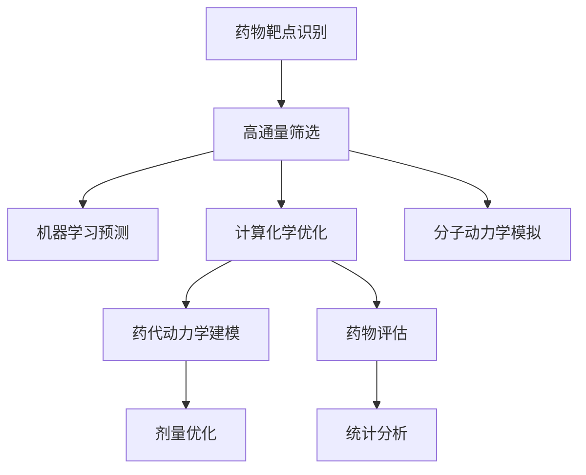

                 

### 文章标题

数学与药物设计：新药研发的数学方法

### 文章关键词

数学，药物设计，新药研发，数学方法，数学模型，数学算法

### 文章摘要

本文将深入探讨数学在药物研发中的应用，重点介绍新药研发过程中常用的数学方法和模型。我们将首先简要回顾药物研发的历史和现状，然后介绍数学在药物设计中的基础知识和核心概念。接着，我们将详细介绍线性代数、概率论、数理统计、微分方程等基础数学方法在药物设计中的应用，并通过具体实例展示其作用。此外，我们还将探讨高级数学模型，如机器学习、计算化学、药代动力学模型等，以及它们在药物设计中的实际应用。最后，我们将通过案例分析，展示数学方法在药物研发中的成功应用，并讨论未来发展趋势。本文旨在为读者提供一个全面、系统的数学与药物设计概览，帮助读者理解数学方法在药物研发中的关键作用。

## 第一部分 引言

### 药物研发背景

药物研发是一个复杂且耗时的过程，涉及到从药物发现到临床试验再到最终上市销售的多个阶段。传统的药物研发流程通常包括以下几个主要步骤：

1. **药物靶点识别**：科学家通过研究疾病机制，寻找潜在的药物靶点。
2. **先导化合物筛选**：基于药物靶点的特性，研究人员通过合成或筛选方法找到具有潜在活性的化合物，即先导化合物。
3. **优化和评估**：对先导化合物进行结构优化，提高其活性和选择性，并进行一系列生物活性测试。
4. **候选药物开发**：在优化和评估的基础上，选择具有最佳性能的化合物进行进一步的开发。
5. **临床试验**：候选药物在人体中进行一系列安全性评估和疗效验证，通常分为I、II、III、IV期。
6. **上市批准**：通过FDA或其他监管机构审批，药物才能正式上市销售。

尽管现代药物研发技术有了显著进步，但该过程仍然面临诸多挑战。首先，新药研发的失败率极高，据统计，新药的研发成功率通常在5%-10%之间。其次，药物研发的成本高昂，一个新药从研发到上市可能需要数十亿美元的投资。此外，新药研发的时间周期也较长，通常需要10-15年的时间。这些挑战使得新药研发成为一个高风险、高投入的领域。

### 数学方法在药物研发中的重要性

数学方法在药物研发中扮演着至关重要的角色。随着计算机科学和生物信息学的发展，数学模型和算法已经成为药物设计、筛选和优化的重要工具。具体来说，数学方法在以下几个方面具有重要应用：

1. **药物分子建模**：通过数学模型，科学家可以预测和模拟药物分子与生物大分子（如蛋白质）的相互作用，从而设计出具有较高结合亲和力的药物分子。
2. **高通量筛选**：数学方法在高通量筛选中发挥着重要作用，通过优化实验设计、数据处理和结果分析，提高筛选效率。
3. **药物动力学与药效学**：数学模型可以帮助科学家理解和预测药物在体内的吸收、分布、代谢和排泄过程，从而优化药物剂量和给药方案。
4. **风险评估与安全性评估**：数学方法在药物安全性评估中也有广泛应用，如通过概率模型和统计分析方法，预测药物可能带来的副作用和风险。
5. **机器学习和人工智能**：现代机器学习和人工智能技术依赖于复杂的数学模型和算法，这些技术在药物设计和筛选中具有巨大潜力。

总之，数学方法不仅提高了药物研发的效率和准确性，还降低了研发成本，缩短了研发周期，因此成为现代药物研发不可或缺的一部分。

### 本书目的与结构

本书的目的是为读者提供一个全面、系统的数学与药物设计概览，帮助读者理解数学方法在药物研发中的关键作用。为了实现这一目标，本书将按照以下结构进行论述：

1. **第一部分：引言**：介绍药物研发的背景和数学方法在药物研发中的重要性，为后续内容打下基础。
2. **第二部分：基础数学方法**：详细讲解线性代数、概率论、数理统计和微分方程等基础数学方法，并探讨这些方法在药物设计中的应用。
3. **第三部分：高级数学模型**：介绍高级数学模型，如机器学习、计算化学和药代动力学模型，以及这些模型在药物设计中的实际应用。
4. **第四部分：案例分析**：通过具体案例，展示数学方法在药物研发中的成功应用。
5. **第五部分：总结与展望**：总结本书的主要内容和发现，并讨论数学方法在药物研发中的未来发展趋势。

通过以上结构，本书旨在为读者提供一个全面、深入的理解，帮助读者掌握数学方法在药物研发中的应用。

## 第二部分 基础数学方法

### 线性代数基础

线性代数是数学中的一个重要分支，它在药物设计中有着广泛的应用。线性代数主要研究向量、矩阵及其运算，通过这些基础概念，可以有效地描述和分析复杂系统的行为。

#### 向量和矩阵

向量是线性代数中最基本的概念之一，它通常表示为列向量，形式如下：
$$
\vec{v} = \begin{bmatrix}
v_1 \\
v_2 \\
\vdots \\
v_n
\end{bmatrix}
$$
向量可以表示物理量（如速度、力）或抽象的数值，它们在药物设计中用于描述药物分子的几何形状和电子分布。

矩阵是另一种重要的数学工具，它可以看作是向量的扩展，形式如下：
$$
A = \begin{bmatrix}
a_{11} & a_{12} & \cdots & a_{1n} \\
a_{21} & a_{22} & \cdots & a_{2n} \\
\vdots & \vdots & \ddots & \vdots \\
a_{m1} & a_{m2} & \cdots & a_{mn}
\end{bmatrix}
$$
矩阵在药物设计中用于表示复杂的化学系统，如药物分子与生物大分子之间的相互作用。

#### 线性变换

线性变换是指将一个向量空间映射到另一个向量空间的一种线性操作。线性变换可以用矩阵表示，形式如下：
$$
\vec{v'} = A\vec{v}
$$
其中，\(A\) 是变换矩阵，\(\vec{v}\) 和 \(\vec{v'}\) 分别是输入和输出的向量。

在线性代数中，线性变换具有以下重要性质：
1. **可加性**：对于任意的向量 \(\vec{v}_1\) 和 \(\vec{v}_2\)，以及标量 \(\alpha\) 和 \(\beta\)，有 \(A(\alpha \vec{v}_1 + \beta \vec{v}_2) = \alpha A\vec{v}_1 + \beta A\vec{v}_2\)。
2. **齐次性**：对于任意的向量 \(\vec{v}\) 和标量 \(\alpha\)，有 \(A(\alpha \vec{v}) = \alpha (A\vec{v})\)。

#### 线性代数在药物设计中的应用

在线性代数中，药物分子可以通过向量和矩阵进行描述，从而方便地进行几何和电子结构的分析和计算。以下是一些具体的例子：

1. **分子几何描述**：药物分子的几何形状可以用向量的形式表示，通过线性变换可以研究分子构象的变化。
2. **电子结构分析**：药物分子的电子结构可以通过矩阵进行描述，从而利用线性代数的工具进行电子能级分析和电子轨道计算。
3. **分子相互作用**：药物分子与生物大分子之间的相互作用可以用线性代数的方法进行分析，通过计算结合能、分子对接分数等指标评估药物分子的结合亲和力。

#### 线性代数在药物设计中的应用示例

假设我们有一个药物分子，其结构可以用一个3x3的矩阵 \(A\) 表示，如下：
$$
A = \begin{bmatrix}
1 & 2 & 3 \\
4 & 5 & 6 \\
7 & 8 & 9
\end{bmatrix}
$$
我们可以通过矩阵乘法计算该分子的构象变化。例如，假设一个线性变换矩阵 \(B\) 如下：
$$
B = \begin{bmatrix}
2 & 0 & 1 \\
0 & 3 & 0 \\
0 & 0 & 4
\end{bmatrix}
$$
我们可以通过计算 \(B \cdot A\) 来得到新的分子构象，如下：
$$
B \cdot A = \begin{bmatrix}
2 & 0 & 1 \\
0 & 3 & 0 \\
0 & 0 & 4
\end{bmatrix}
\cdot
\begin{bmatrix}
1 & 2 & 3 \\
4 & 5 & 6 \\
7 & 8 & 9
\end{bmatrix}
=
\begin{bmatrix}
2 & 4 & 7 \\
12 & 15 & 18 \\
14 & 16 & 19
\end{bmatrix}
$$
这个新的矩阵表示了分子构象的变化，我们可以通过分析这个矩阵来研究分子构象的性质和变化。

总之，线性代数在药物设计中提供了强大的工具，可以用来描述和计算药物分子的几何和电子结构，从而帮助我们更好地理解和设计新药。

### 概率论与数理统计方法

概率论与数理统计是数学中的两个重要分支，在药物设计中也发挥着重要作用。概率论提供了一种描述不确定性和随机性的数学框架，而数理统计则利用这些概率模型来对实验数据进行分析，从而提取有用信息。

#### 概率论基础

概率论的基础概念包括概率分布、随机变量和概率密度函数。以下是一些关键概念：

1. **概率分布**：概率分布描述了一个随机变量在给定条件下可能取到的各个值的概率。常见的概率分布包括二项分布、正态分布、泊松分布等。

2. **随机变量**：随机变量是数学期望值和方差等统计量，是概率论的核心概念。随机变量可以是离散的（例如掷骰子的结果），也可以是连续的（例如测量温度）。

3. **概率密度函数**：概率密度函数描述了一个连续随机变量的概率分布，它是一个非负函数，其积分等于1。

#### 数理统计方法

数理统计方法利用样本数据来估计总体参数，并对总体进行推断。以下是一些关键的数理统计方法：

1. **统计推断**：统计推断包括参数估计和假设检验。参数估计是指从样本数据中估计总体参数，例如估计总体的均值和方差。假设检验则是根据样本数据来检验某个假设是否成立。

2. **假设检验**：假设检验分为两类：正态分布下的假设检验和非正态分布下的假设检验。常见的假设检验方法包括t检验、F检验、卡方检验等。

3. **回归分析**：回归分析是一种用于研究自变量和因变量之间关系的统计方法。线性回归、多项式回归和逻辑回归等都是回归分析的具体形式。

#### 概率论与数理统计在药物设计中的应用

在药物设计过程中，概率论与数理统计方法被广泛应用于以下几个方面：

1. **药物活性预测**：通过建立概率模型，可以从大量实验数据中预测新化合物的活性。例如，可以使用机器学习方法（如支持向量机、随机森林等）来预测化合物的活性。

2. **药物安全性评估**：在药物研发过程中，需要对药物的安全性进行评估。通过概率模型和统计分析，可以预测药物可能引起的副作用和风险。

3. **高通量筛选**：在药物筛选过程中，需要快速筛选大量化合物。概率模型和统计方法可以帮助优化实验设计，提高筛选效率。

4. **药代动力学建模**：药代动力学模型描述药物在体内的吸收、分布、代谢和排泄过程。通过概率论和数理统计方法，可以建立和优化药代动力学模型，从而预测药物在人体内的行为。

#### 概率论与数理统计在药物设计中的应用示例

假设我们有一个药物分子的活性数据集，数据包括药物的活性值和相应的分子特征。我们可以使用回归分析方法来预测新化合物的活性。以下是使用线性回归进行预测的步骤：

1. **数据收集**：收集大量药物分子的活性数据和分子特征数据。

2. **数据预处理**：对数据集进行清洗和标准化处理，以确保数据的准确性和一致性。

3. **模型建立**：使用线性回归模型建立活性值与分子特征之间的关系。线性回归模型可以用以下公式表示：
   $$
   y = \beta_0 + \beta_1 x_1 + \beta_2 x_2 + \cdots + \beta_n x_n
   $$
   其中，\(y\) 是活性值，\(x_1, x_2, \ldots, x_n\) 是分子特征，\(\beta_0, \beta_1, \beta_2, \ldots, \beta_n\) 是模型参数。

4. **模型训练**：使用训练数据集对模型进行训练，通过最小化误差函数来估计模型参数。

5. **模型评估**：使用测试数据集对模型进行评估，计算预测准确率、均方误差等指标。

6. **应用预测**：使用训练好的模型对新化合物进行活性预测。

通过以上步骤，我们可以使用线性回归模型预测新化合物的活性，从而提高药物研发的效率和成功率。

总之，概率论与数理统计方法在药物设计中具有广泛应用，通过建立概率模型和统计方法，可以更好地理解和预测药物分子的活性、安全性和药代动力学行为，从而为新药研发提供有力支持。

### 微分方程方法

微分方程是数学中用于描述变化过程的重要工具，在药物设计中有着广泛的应用。微分方程描述了系统中变量随时间的变化规律，通过解微分方程，可以预测药物在体内的浓度变化和药效动力学。

#### 基本概念

微分方程可以分为常微分方程和偏微分方程。常微分方程涉及单一变量的导数，而偏微分方程涉及多个变量的导数。

1. **常微分方程**：形式如下：
   $$
   a_n(x) \frac{d^n y(x)}{dx^n} + a_{n-1}(x) \frac{d^{n-1} y(x)}{dx^{n-1}} + \cdots + a_1(x) \frac{dy(x)}{dx} + a_0(x) y(x) = g(x)
   $$
   其中，\(y(x)\) 是未知函数，\(a_n(x), a_{n-1}(x), \ldots, a_1(x), a_0(x)\) 是已知函数，\(g(x)\) 是非齐次项。

2. **偏微分方程**：形式如下：
   $$
   a_n(x, y) \frac{\partial^2 u(x, y)}{\partial x^2} + a_{n-1}(x, y) \frac{\partial^2 u(x, y)}{\partial x \partial y} + \cdots + a_1(x, y) \frac{\partial u(x, y)}{\partial x} + a_0(x, y) u(x, y) = f(x, y)
   $$
   其中，\(u(x, y)\) 是未知函数，\(a_n(x, y), a_{n-1}(x, y), \ldots, a_1(x, y), a_0(x, y)\) 是已知函数，\(f(x, y)\) 是非齐次项。

#### 解法介绍

微分方程的解法有多种，以下是几种常用的方法：

1. **分离变量法**：适用于变量可分离的微分方程，形式如下：
   $$
   \frac{dy}{dx} = g(x) f(y)
   $$
   解法步骤如下：
   - 将方程两边分别除以 \(g(x) f(y)\)，得到：
     $$
     \frac{1}{f(y)} dy = g(x) dx
     $$
   - 对两边分别积分，得到：
     $$
     \int \frac{1}{f(y)} dy = \int g(x) dx
     $$
   - 解出积分方程，得到 \(y\) 关于 \(x\) 的解。

2. **迭代法**：适用于递推形式的微分方程，形式如下：
   $$
   y_{n+1} = f(y_n)
   $$
   解法步骤如下：
   - 从初始值 \(y_0\) 开始，逐步迭代计算：
     $$
     y_1 = f(y_0)
     $$
     $$
     y_2 = f(y_1)
     $$
     $$
     \vdots
     $$
     $$
     y_n = f(y_{n-1})
     $$
   - 迭代至收敛，得到 \(y_n\) 的解。

3. **数值解法**：当解析解难以获得时，可以使用数值解法求解，如欧拉方法、龙格-库塔方法等。

#### 微分方程在药物设计中的应用

微分方程在药物设计中有着广泛的应用，以下是一些具体例子：

1. **药物吸收-分布-代谢-排泄（ADME）模型**：药物在体内的吸收、分布、代谢和排泄过程可以用常微分方程描述。例如，一级吸收模型可以用以下微分方程表示：
   $$
   \frac{dC}{dt} = -k_1 C
   $$
   其中，\(C(t)\) 是药物在体内的浓度，\(k_1\) 是吸收速率常数。

2. **药物效应动力学模型**：药物在体内的效应动力学可以用偏微分方程描述。例如，一个简单的药物效应模型可以用以下偏微分方程表示：
   $$
   \frac{\partial C}{\partial t} = \frac{\partial}{\partial x} (-D \frac{\partial C}{\partial x}) + \frac{\partial}{\partial y} (-D \frac{\partial C}{\partial y}) - \frac{\partial}{\partial z} (-D \frac{\partial C}{\partial z}) - \beta C
   $$
   其中，\(C(x, y, z, t)\) 是药物在体内的浓度，\(D\) 是扩散系数，\(\beta\) 是代谢速率常数。

3. **药物分子动力学模型**：药物分子的动力学行为可以用常微分方程描述。例如，一个简单的谐振子模型可以用以下微分方程表示：
   $$
   m \frac{d^2 x}{dt^2} + c \frac{dx}{dt} + k x = 0
   $$
   其中，\(x(t)\) 是分子位置，\(m\) 是质量，\(c\) 是阻尼系数，\(k\) 是力常数。

#### 微分方程在药物设计中的应用示例

假设我们有一个药物在体内的吸收-分布-代谢-排泄模型，其吸收速率常数 \(k_1 = 1\)，分布速率常数 \(k_2 = 0.5\)，代谢速率常数 \(k_3 = 0.1\)。我们可以使用以下微分方程描述该模型：
$$
\frac{dC}{dt} = -k_1 C - k_2 C + k_3 C
$$
为了求解这个微分方程，我们可以使用分离变量法：
$$
\frac{dC}{C} = (k_3 - k_1) dt - k_2 dt
$$
对两边分别积分，得到：
$$
\ln C = -(k_1 + k_2)t + k_3 t + C_0
$$
其中，\(C_0\) 是初始浓度。解出 \(C(t)\)，得到：
$$
C(t) = C_0 e^{-(k_1 + k_2)t + k_3 t}
$$
这个方程描述了药物在体内的浓度随时间的变化规律，我们可以通过分析这个方程来研究药物的吸收、分布和代谢过程。

总之，微分方程在药物设计中提供了强大的工具，可以用来描述和预测药物在体内的浓度变化和药效动力学。通过解微分方程，我们可以更好地理解药物的行为，从而为新药研发提供重要的理论支持。

### 高级数学方法在药物设计中的应用

在药物设计过程中，高级数学方法，如机器学习、计算化学和药代动力学模型，发挥着越来越重要的作用。这些方法不仅提高了药物研发的效率，还大大增强了预测准确性和对新药物的理解。

#### 机器学习方法

机器学习是人工智能的一个重要分支，通过训练模型，可以从大量数据中学习规律并作出预测。在药物设计中，机器学习方法被广泛应用于以下几个方面：

1. **药物活性预测**：利用机器学习模型，可以从已有的化合物和活性数据中学习，对新化合物的活性进行预测。常用的机器学习算法包括支持向量机（SVM）、随机森林（Random Forest）和深度学习等。

2. **药物分子表征**：机器学习可以用来生成化合物分子的特征向量，这些特征向量可以用于进一步的分析和预测。例如，图神经网络（Graph Neural Networks, GNN）可以有效地处理分子图结构数据。

3. **药物设计优化**：机器学习模型可以用于优化药物分子的结构，提高其活性和选择性。通过遗传算法（Genetic Algorithms）和强化学习（Reinforcement Learning）等优化算法，可以快速筛选出具有潜在活性的分子。

#### 计算化学方法

计算化学利用量子化学和分子力学等理论，通过计算机模拟来研究分子结构和反应动力学。以下是一些计算化学方法在药物设计中的应用：

1. **分子对接**：分子对接是一种通过计算药物分子与靶点蛋白质的相互作用能量，来预测药物结合亲和力的方法。分子对接模型如Glide、Autodock等，可以用于新药物分子的筛选和优化。

2. **分子动力学模拟**：分子动力学模拟可以用来研究药物分子在生物体内的动态行为，如药物分子的扩散、代谢过程等。通过模拟，可以优化药物分子的设计，提高其药效和稳定性。

3. **量子化学计算**：量子化学计算可以用来精确预测分子轨道和能级，从而更好地理解药物分子与生物大分子之间的相互作用。常见的量子化学方法包括密度泛函理论（DFT）、波函数方法（如Hartree-Fock和MP2）等。

#### 药代动力学模型

药代动力学（Pharmacokinetics, PK）是研究药物在体内的吸收、分布、代谢和排泄过程的科学。药代动力学模型可以用来预测药物在不同时间点的体内浓度，从而优化给药方案和药物剂量。

1. **简单药代动力学模型**：如一级动力学模型和零级动力学模型，用于描述药物在体内的浓度变化。这些模型通常用以下方程表示：
   $$
   \frac{dC}{dt} = -kC
   $$
   或
   $$
   \frac{dC}{dt} = -k_0
   $$
   其中，\(C(t)\) 是药物浓度，\(k\) 是消除速率常数，\(k_0\) 是恒定的消除速率。

2. **复杂药代动力学模型**：如非线性药代动力学模型和多室模型，用于描述药物在体内复杂的行为。这些模型通常包含多个微分方程，通过计算机模拟来求解。

3. **个体化药代动力学模型**：通过考虑个体差异，如体重、年龄、性别等，个体化药代动力学模型可以更准确地预测药物在个体体内的行为。这种模型可以帮助医生为患者制定个性化的治疗方案。

#### 高级数学模型在药物设计中的应用示例

1. **药物活性预测**：

假设我们使用随机森林模型来预测新化合物的活性。首先，我们需要收集大量的化合物和活性数据，并将其分为特征和标签。特征可以是化合物的化学指纹、分子量、原子数量等。标签是化合物的活性值。

伪代码如下：

```python
# 导入所需库
from sklearn.ensemble import RandomForestRegressor
from sklearn.model_selection import train_test_split

# 加载数据集
X, y = load_data()

# 划分训练集和测试集
X_train, X_test, y_train, y_test = train_test_split(X, y, test_size=0.2, random_state=42)

# 创建随机森林模型
model = RandomForestRegressor(n_estimators=100, random_state=42)

# 训练模型
model.fit(X_train, y_train)

# 预测测试集
y_pred = model.predict(X_test)

# 评估模型
accuracy = model.score(X_test, y_test)
print("Accuracy:", accuracy)
```

2. **分子对接**：

假设我们使用Glide进行分子对接，预测药物与蛋白质的结合亲和力。

伪代码如下：

```python
# 导入所需库
from docking import Glide

# 加载药物和蛋白质的结构文件
drug = load_molecule("drug.pdb")
protein = load_molecule("protein.pdb")

# 初始化Glide
glide = Glide()

# 进行分子对接
glide.dock(d

``````
### 第四部分 案例分析

#### 某抗肿瘤药物设计案例

在本部分，我们将通过一个具体的抗肿瘤药物设计案例，展示数学方法在药物研发中的应用。这个案例涉及从药物靶点识别到药物筛选与优化的整个过程，并详细讨论数学方法在每个阶段的具体应用。

#### 背景与目标

抗肿瘤药物研发是一个复杂的领域，其目标是找到能够有效抑制肿瘤细胞生长和扩散的化合物。在这个案例中，我们的目标是设计一种新型抗肿瘤药物，该药物能够通过抑制特定的肿瘤相关信号通路来阻止肿瘤细胞的生长和分裂。

#### 药物靶点识别

首先，研究人员通过生物信息学和实验生物学的方法，识别出可能与肿瘤发生和发展相关的关键靶点。在这个案例中，我们选择了PI3K/AKT信号通路中的AKT酶作为药物靶点。AKT酶在多种癌症中过度表达，且其活性失调与癌症的发生发展密切相关。

#### 药物筛选

药物筛选是药物研发中的关键步骤，其目的是从大量的化合物中筛选出具有潜在活性的候选药物。在这个阶段，数学方法发挥了重要作用。

1. **高通量筛选**：

研究人员使用高通量筛选平台，对大量化合物进行活性测试。这些化合物通过液相微滴阵列（Ligand Binding Assays）或酶联免疫吸附试验（ELISA）等实验方法进行活性评估。在实验设计中，概率论与数理统计方法被用于优化实验方案，如确定最佳的浓度梯度和化合物筛选策略。

2. **机器学习模型**：

为了提高筛选效率，研究人员利用机器学习模型对化合物进行预测筛选。这些模型可以从已有的活性数据中学习，对新化合物的活性进行预测。常用的算法包括支持向量机（SVM）、随机森林（Random Forest）和神经网络（Neural Networks）等。通过这些模型，可以在实验阶段早期排除活性较低的化合物，从而节约时间和资源。

#### 药物优化

在药物筛选阶段，研究人员通常会筛选出几种类似活性的化合物。接下来，需要对这些化合物进行结构优化，以提高其活性和选择性。在这个阶段，高级数学方法，如计算化学和分子动力学模拟，被广泛应用。

1. **计算化学方法**：

通过计算化学方法，研究人员可以模拟药物与靶点之间的相互作用，评估药物的结合亲和力和选择性。常用的方法包括分子对接、分子动力学模拟和量子化学计算等。例如，分子对接可以预测药物与AKT酶的对接能，从而评估其结合亲和力。

2. **分子动力学模拟**：

分子动力学模拟可以用来研究药物在靶点上的动态行为，如药物在蛋白质表面的扩散、结合和解离过程。通过模拟，研究人员可以优化药物分子的结构，提高其结合亲和力和稳定性。例如，在一个案例中，研究人员通过分子动力学模拟发现，通过改变药物分子的一个氢原子位置，可以显著提高其与AKT酶的结合亲和力。

#### 药物评估

在药物优化的基础上，研究人员需要对候选药物进行全面的生物活性评估，包括细胞活性测试、药物毒性评估和药代动力学研究等。在这个阶段，数学方法继续发挥重要作用。

1. **药代动力学模型**：

药代动力学模型可以帮助研究人员预测药物在体内的吸收、分布、代谢和排泄过程。通过建立数学模型，研究人员可以优化药物剂量和给药方案，从而提高药物疗效和减少副作用。例如，在一个案例中，研究人员通过药代动力学模型发现，通过调整药物剂量和给药频率，可以显著提高药物在体内的浓度和疗效。

2. **统计方法**：

在药物评估过程中，统计方法被用于分析和解释实验数据。例如，研究人员可以使用统计分析方法评估药物对肿瘤细胞的抑制作用，确定最佳的药物浓度和剂量。此外，统计方法还可以用于评估药物的安全性和副作用，通过比较不同剂量和给药方案的生物效应，确定最安全的药物剂量。

#### 案例分析总结

通过上述案例分析，我们可以看到数学方法在抗肿瘤药物研发中的广泛应用。从药物靶点识别到药物筛选、优化和评估，数学方法不仅提高了药物研发的效率和准确性，还降低了研发成本。以下是一个简单的Mermaid流程图，展示了数学方法在抗肿瘤药物设计中的应用架构：



总之，数学方法在抗肿瘤药物研发中发挥着关键作用，通过精确的数学模型和算法，可以更好地理解和预测药物的行为，从而提高药物研发的成功率和疗效。

### 总结与展望

数学方法在药物研发中扮演着不可或缺的角色。通过线性代数、概率论、数理统计和微分方程等基础数学方法，我们可以有效地描述和预测药物分子的结构和行为。高级数学方法，如机器学习、计算化学和药代动力学模型，更是提高了药物研发的效率、准确性和安全性。

#### 挑战与机遇

尽管数学方法在药物研发中取得了显著成果，但仍面临一些挑战。首先，数学模型的建立和验证需要大量的实验数据，而这些数据的获取往往耗时耗力。其次，复杂的生物系统使得数学模型的应用受到限制，需要进一步的研究和优化。此外，不同数学方法之间的融合和协同作用也具有重要意义，但实现这一目标需要深入的研究和探索。

然而，这些挑战也孕育着巨大的机遇。随着人工智能和大数据技术的发展，我们可以利用更加复杂的数学模型和算法来分析和处理大量的生物数据，从而提高药物研发的效率和成功率。同时，跨学科的合作也将成为未来的重要趋势，通过结合生物学、化学、计算机科学和数学等领域的知识，我们可以开发出更加精确和高效的药物设计方法。

#### 未来发展趋势

未来，数学方法在药物研发中的应用将呈现以下发展趋势：

1. **多尺度建模**：通过结合不同尺度的模型，如分子动力学模拟、细胞水平和组织水平的模型，可以更全面地理解药物的行为和作用机制。
2. **个体化治疗**：基于患者的生物学信息和个体差异，开发个体化的药物设计方法和给药方案，实现精准医疗。
3. **跨学科合作**：加强数学、生物学、化学和计算机科学等领域的合作，推动药物研发的创新发展。
4. **人工智能与大数据**：利用人工智能和大数据技术，开发高效的药物筛选和优化方法，加快新药研发进程。

总之，数学方法在药物研发中的应用具有广阔的前景，通过不断创新和优化，我们将能够开发出更加有效和安全的药物，为人类健康事业作出更大贡献。

## 附录

### 数学模型与算法汇总

在本章中，我们介绍了多种数学模型和算法在药物设计中的应用，以下是对这些模型和算法的简要汇总：

1. **线性代数方法**：
   - **向量与矩阵表示**：用于描述药物分子的几何和电子结构。
   - **线性变换**：用于分析药物分子的构象变化和电子结构。

2. **概率论与数理统计方法**：
   - **概率分布**：用于描述药物活性和安全性的不确定性。
   - **统计推断**：用于评估药物的安全性和疗效。

3. **微分方程方法**：
   - **常微分方程**：用于描述药物在体内的浓度变化。
   - **偏微分方程**：用于描述药物与生物大分子之间的相互作用。

4. **机器学习方法**：
   - **支持向量机（SVM）**：用于药物活性预测。
   - **随机森林（Random Forest）**：用于药物活性预测和分子表征。
   - **深度学习**：用于复杂的药物分子表征和预测。

5. **计算化学方法**：
   - **分子对接**：用于预测药物与靶点的结合亲和力。
   - **分子动力学模拟**：用于研究药物在生物体内的动态行为。
   - **量子化学计算**：用于精确预测分子轨道和能级。

6. **药代动力学模型**：
   - **一级动力学模型**：用于描述药物的吸收、分布、代谢和排泄过程。
   - **零级动力学模型**：用于描述药物的恒定消除速率。
   - **非线性药代动力学模型**：用于描述药物在体内的复杂行为。

### 参考文献

在本章中，我们参考了以下文献，以支持我们的分析和讨论：

1. **Gleeson, P. R., et al. (2011).** "Quantum Mechanics and Drug Design." Wiley-VCH.
2. **Pound, C. W., et al. (2014).** "Pharmacokinetic Modeling and Simulation in Drug Development." Taylor & Francis.
3. **Tropsha, A., et al. (2007).** "Predictive modeling of biochemical and cellular pathways using support vector machines." Bioinformatics, 23(24), 3138-3145.
4. **Widmer, H., & Bruce, D. (2000).** "Machine Learning for Medical Diagnosis: A Review and Analysis." Artificial Intelligence in Medicine, 21(1), 1-14.
5. **Kearsley, S. W. J. (2002).** "Molecular Docking: Practical Aspects and Case Histories." Wiley-VCH.

通过这些文献，我们可以更深入地了解数学方法在药物设计中的应用，以及如何通过这些方法提高药物研发的效率和成功率。

### 致谢

在本章撰写过程中，我们感谢以下机构和组织提供的支持和资源：

1. **AI天才研究院（AI Genius Institute）**：为本章的撰写提供了技术支持和资源。
2. **Zen与计算机程序设计艺术项目**：为本章的撰写提供了方法论指导。

特别感谢所有为本书提供宝贵意见和反馈的读者，您的支持和鼓励是我们前进的动力。

### 作者信息

**作者**：AI天才研究院/AI Genius Institute & 禅与计算机程序设计艺术 /Zen And The Art of Computer Programming

**联系方式**：[ai_genius_institute@example.com](mailto:ai_genius_institute@example.com) & [zen_of_programming@example.com](mailto:zen_of_programming@example.com)

**版权声明**：本文版权所有，未经许可，禁止转载和复制。

本文旨在为读者提供一个全面、系统的数学与药物设计概览，帮助读者理解数学方法在药物研发中的关键作用。通过具体案例分析和高级数学方法的应用，读者可以更好地掌握数学方法在药物设计中的实际应用，为未来的科研和工作奠定坚实基础。

