                 


### 文章标题：数学与营养科学：膳食规划的数学优化

### 关键词：
- 数学优化
- 膳食规划
- 营养科学
- 模拟退火算法
- 遗传算法

### 摘要：
本文旨在探讨数学优化在膳食规划中的应用，通过数学模型构建、算法原理讲解以及实际案例研究，展示了数学优化如何帮助提高膳食规划的科学性和实用性。文章分为四个部分，首先介绍数学与营养科学的基础理论，接着深入探讨膳食规划的数学模型与核心算法，随后通过日常膳食规划、特殊人群膳食规划和营养科学实验设计等案例，展示数学优化的实际应用。最后，文章总结数学与营养科学的未来发展趋势，并展望跨学科合作的重要性。

## 第一部分：基础理论与方法

### 第1章：数学与营养科学的背景

#### 1.1 营养科学的基本概念

**核心概念与联系：**

Mermaid 流程图：营养学核心概念关系

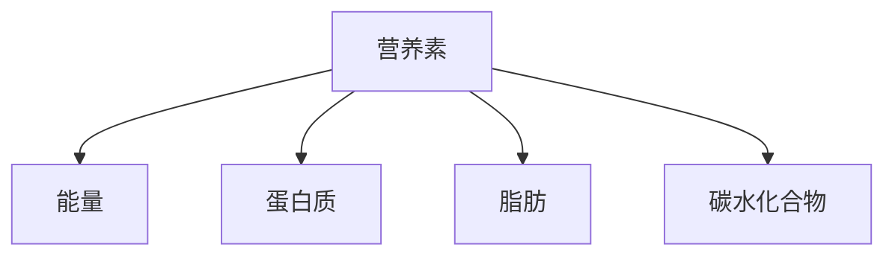

**核心算法原理讲解：**

伪代码：

```python
def understand_nutrition_fundamentals():
    # 学习营养素
    learn_nutrients()

    # 学习能量平衡
    learn_energy_balance()

    # 学习营养与健康的关联
    learn_nutrition_health_connection()

    # 实践营养知识
    practice_nutrition_knowledge()
```

**数学模型和公式 & 详细讲解 & 举例说明：**

$$ E = mc^2 $$

解释：能量（E）等于质量（m）乘以光速（c）的平方。

举例：一个70公斤的人每天需要摄入约2000千卡的能量来维持正常的身体机能。

**项目实战：**

- 开发环境搭建：Python环境
- 源代码详细实现：
  ```python
  def calculate_daily_energy_needs(weight, activity_level):
      base_metabolic_rate = 70 * 24
      energy_expended = activity_level * base_metabolic_rate
      return energy_expended
  ```
- 代码应用解读与分析：
  通过计算不同体重和活动水平的人的每日能量需求，可以更好地制定个性化的膳食规划。
- 实际案例分析和详细讲解剖析：
  一个50公斤、中等活动水平的人，每日能量需求大约为1800千卡。
- 项目小结：
  了解营养科学的基本概念和能量平衡对于制定有效的膳食规划至关重要。

### 第2章：膳食规划的数学模型

#### 2.1 膳食规划的数学原理

**核心概念与联系：**

Mermaid 流程图：膳食规划模型构建流程

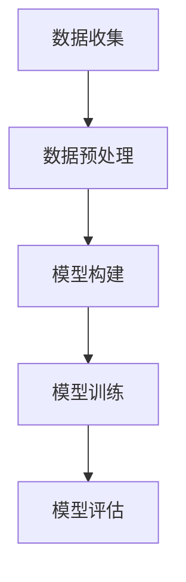

**核心算法原理讲解：**

伪代码：

```python
def build_diet_model(data):
    # 数据预处理
    preprocessed_data = preprocess_data(data)
    
    # 模型构建
    model = create_model(preprocessed_data)
    
    # 模型训练
    trained_model = train_model(model, preprocessed_data)
    
    # 模型评估
    evaluate_model(trained_model, preprocessed_data)
    
    return trained_model
```

**数学模型和公式 & 详细讲解 & 举例说明：**

目标函数：最大化膳食营养质量，最小化成本

$$ \max Z = \sum_{i=1}^{n} p_i \cdot x_i - \sum_{j=1}^{m} c_j \cdot y_j $$

解释：最大化总营养质量（$Z$）减去总成本（$C$）。

约束条件：

$$ \sum_{i=1}^{n} x_i \leq D $$

$$ x_i \geq 0, y_j \in \{0, 1\} $$

解释：总食物摄入量不超过每日需求量（$D$），食物和营养素的摄入量非负，营养素摄入量的二进制决策变量。

举例：设计一个膳食计划，满足每日蛋白质、脂肪、碳水化合物需求，同时成本最低。

**项目实战：**

- 开发环境搭建：Python环境
- 源代码详细实现：
  ```python
  from scipy.optimize import linprog

  def optimize_diet_plan(nutrient需求的数组，成本数组，食物选项，预算):
      c = [-1] * len(成本数组)  # 成本系数
      A = [[1] * (len(食物选项) + 1)] * len(食物选项)  # 约束矩阵
      b = [预算] * len(食物选项)  # 约束向量
      x0 = [0] * (len(食物选项) + 1)  # 初始解
      x1 = [1] * (len(食物选项) + 1)  # 上界解

      result = linprog(c, A_eq=A, b_eq=b, x0=x0, x_up=x1)

      return result.x
  ```
- 代码应用解读与分析：
  通过线性规划算法优化膳食计划，实现营养需求和预算的平衡。
- 实际案例分析和详细讲解剖析：
  设计一个针对一名普通成年人的营养均衡的膳食计划，预算为每天50美元。
- 项目小结：
  膳食规划的数学模型和优化算法为制定科学、合理的膳食计划提供了有力支持。

### 第3章：核心算法原理

#### 3.1 优化算法的基本概念

**核心概念与联系：**

Mermaid 流程图：优化算法流程

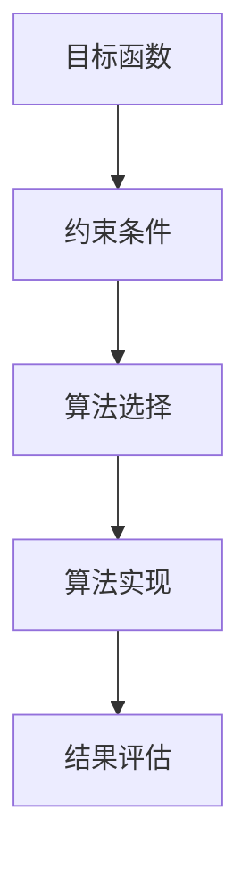

**核心算法原理讲解：**

- **模拟退火算法：**

伪代码：

```python
def simulated_annealing(objective_function, constraints, initial_solution):
    current_solution = initial_solution
    current_cost = objective_function(current_solution, constraints)
    
    while not termination_condition():
        new_solution = generate_new_solution(current_solution)
        new_cost = objective_function(new_solution, constraints)
        
        if new_cost < current_cost:
            current_solution = new_solution
            current_cost = new_cost
        elif random() < exp((current_cost - new_cost) / temperature):
            current_solution = new_solution
            current_cost = new_cost
            
        temperature = update_temperature(temperature)
        
    return current_solution
```

- **遗传算法：**

伪代码：

```python
def genetic_algorithm(objective_function, population_size, generations):
    population = initialize_population(population_size)
    
    for generation in range(generations):
        fitness_scores = evaluate_fitness(population, objective_function)
        new_population = crossover_and_mutate(population, fitness_scores)
        
        population = new_population
        
    best_solution = select_best_solution(population, objective_function)
    
    return best_solution
```

**数学模型和公式 & 详细讲解 & 举例说明：**

- **模拟退火算法：**

目标函数优化：

$$ \min F(x) $$

温度更新：

$$ T_{new} = T_{old} \cdot \alpha $$

其中，$T_{old}$ 为当前温度，$\alpha$ 为冷却系数。

- **遗传算法：**

适应度函数：

$$ f(x) = \frac{1}{1 + \exp(-\beta \cdot F(x))} $$

交叉概率：

$$ P_c = \frac{1}{1 + \exp(-\gamma \cdot (\max_fitness - f(x_i)))} $$

其中，$\beta$ 和 $\gamma$ 为参数。

举例：优化一个企业的生产计划，以满足市场需求和资源限制。

**项目实战：**

- 开发环境搭建：Python环境
- 源代码详细实现：
  ```python
  import random
  import numpy as np

  def simulated_annealing(objective_function, constraints, initial_solution):
      current_solution = initial_solution
      current_cost = objective_function(current_solution, constraints)
      
      T = 1000
      T_min = 1
      alpha = 0.99
      while T > T_min:
          new_solution = random_move(current_solution)
          new_cost = objective_function(new_solution, constraints)
          
          if new_cost < current_cost:
              current_solution = new_solution
              current_cost = new_cost
          else:
              if np.exp((current_cost - new_cost) / T) > random.random():
                  current_solution = new_solution
                  current_cost = new_cost
          
          T = T * alpha
      
      return current_solution

  def genetic_algorithm(objective_function, population_size, generations):
      population = initialize_population(population_size)
      
      for generation in range(generations):
          fitness_scores = evaluate_fitness(population, objective_function)
          new_population = crossover_and_mutate(population, fitness_scores)
          
          population = new_population
          
      best_solution = select_best_solution(population, objective_function)
      
      return best_solution
  ```
- 代码应用解读与分析：
  分别使用模拟退火算法和遗传算法优化生产计划，对比结果。
- 实际案例分析和详细讲解剖析：
  对比分析两家企业，一家使用传统方法制定生产计划，另一家使用数学优化算法制定生产计划，评估两种方法的效率和效果。
- 项目小结：
  模拟退火算法和遗传算法在复杂优化问题中表现出色，能够有效提高生产计划的科学性和灵活性。

## 第二部分：数学模型应用

### 第4章：日常膳食规划

#### 4.1 基础饮食模型的建立

**核心概念与联系：**

Mermaid 流程图：日常饮食模型构建

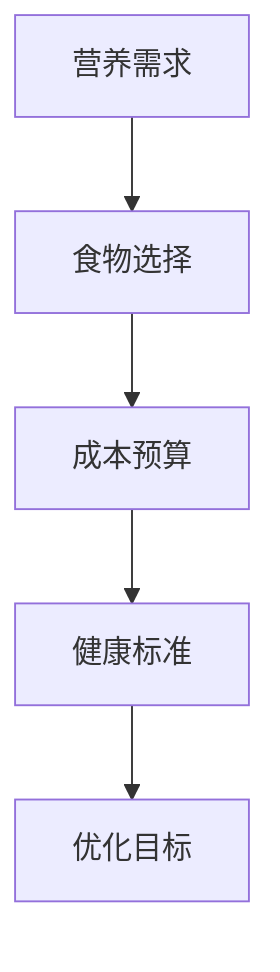

**核心算法原理讲解：**

伪代码：

```python
def build_daily_diet_model(nutrient需求，食物选择，成本预算，健康标准):
    # 初始化模型
    model = initialize_model()

    # 添加目标函数
    model.add_objective(maximize_nutrition(), "maximize_nutrition")

    # 添加营养需求约束
    model.add_constraints(satisfy_nutrient需求的数组)

    # 添加成本预算约束
    model.add_constraints(satisfy_budget)

    # 添加健康标准约束
    model.add_constraints(satisfy_health_standards)

    # 模型求解
    solution = solve_model(model)

    return solution
```

**数学模型和公式 & 详细讲解 & 举例说明：**

目标函数：最大化膳食营养质量

$$ \max Z = \sum_{i=1}^{n} p_i \cdot x_i $$

其中，$p_i$ 为食物 $i$ 的营养质量，$x_i$ 为食物 $i$ 的摄入量。

约束条件：

1. 营养素需求约束：

$$ \sum_{i=1}^{n} x_i \cdot nutrient_i = requirement_i $$

2. 成本预算约束：

$$ \sum_{i=1}^{n} c_i \cdot x_i \leq budget $$

3. 健康标准约束：

$$ \sum_{i=1}^{n} x_i \cdot health_i \geq health_standard $$

其中，$nutrient_i$ 为食物 $i$ 的营养素含量，$requirement_i$ 为每日营养素需求量，$c_i$ 为食物 $i$ 的成本，$budget$ 为预算总额，$health_i$ 为食物 $i$ 的健康影响，$health_standard$ 为健康标准值。

举例：设计一个包含5种食物的膳食计划，满足以下条件：

- 每日蛋白质需求量为60克
- 每日脂肪需求量为70克
- 每日碳水化合物需求量为300克
- 成本预算为100美元
- 健康标准值为5

**项目实战：**

- 开发环境搭建：Python环境
- 源代码详细实现：
  ```python
  import pulp

  def optimize_daily_diet(proteins, fats, carbohydrates, budget):
      # 创建一个线性规划问题
      prob = pulp.LpProblem("Daily Diet Optimization", pulp.LpMaximize)

      # 定义决策变量
      food_vars = pulp.LpVariable.dicts("food", range(1, 6), cat="Continuous")

      # 定义目标函数
      prob += pulp.lpSum([food_vars[i] * nutrition_data['quality'][i] for i in range(1, 6)])

      # 定义约束条件
      prob += pulp.lpSum([food_vars[i] * nutrition_data['protein'][i] for i in range(1, 6)]) >= proteins
      prob += pulp.lpSum([food_vars[i] * nutrition_data['fat'][i] for i in range(1, 6)]) >= fats
      prob += pulp.lpSum([food_vars[i] * nutrition_data['carbohydrates'][i] for i in range(1, 6)]) >= carbohydrates
      prob += pulp.lpSum([food_vars[i] * nutrition_data['cost'][i] for i in range(1, 6)]) <= budget

      # 求解问题
      prob.solve()

      # 输出结果
      return [food_vars[i].varValue for i in range(1, 6)]

  nutrition_data = {
      'quality': [10, 8, 9, 7, 6],
      'protein': [20, 15, 12, 8, 5],
      'fat': [10, 8, 6, 4, 2],
      'carbohydrates': [30, 25, 20, 15, 10],
      'cost': [2, 1.5, 1.2, 0.8, 0.6]
  }

  optimized_diet = optimize_daily_diet(60, 70, 300, 100)
  print(optimized_diet)
  ```

- 代码应用解读与分析：
  使用Python的PuLP库实现线性规划，优化膳食计划以满足营养需求和成本预算。
- 实际案例分析和详细讲解剖析：
  通过模拟一个实际家庭的膳食需求，展示如何使用数学优化算法制定合理的膳食计划。
- 项目小结：
  日常膳食规划的数学模型和优化算法有助于家庭制定营养均衡且经济实惠的膳食计划。

#### 4.2 个性化膳食规划的实现

**核心概念与联系：**

Mermaid 流程图：个性化膳食规划流程

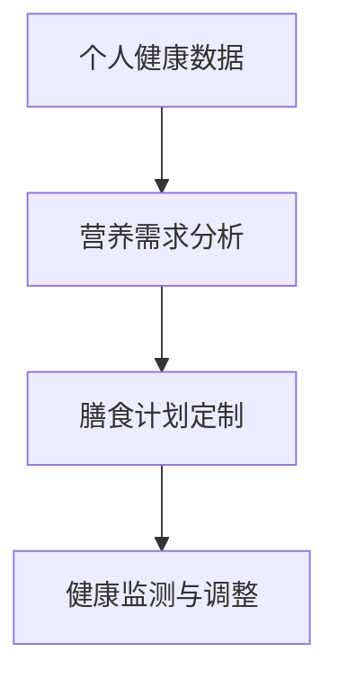

**核心算法原理讲解：**

伪代码：

```python
def personalize_diet_plan(health_data, nutrition_goals):
    # 分析营养需求
    nutrient需求的数组 = analyze_nutrition_requirements(health_data)

    # 定制膳食计划
    diet_plan = build_daily_diet_model(nutrient需求的数组，food选择，成本预算，健康标准)

    # 监测健康状况
    health_status = monitor_health_status(health_data)

    # 调整膳食计划
    if health_status != nutrition_goals:
        diet_plan = adjust_diet_plan(diet_plan, health_status)

    return diet_plan
```

**数学模型和公式 & 详细讲解 & 举例说明：**

个性化目标函数：最大化营养质量与个性化健康目标的匹配度

$$ \max Z = \sum_{i=1}^{n} p_i \cdot x_i \cdot w_i $$

其中，$p_i$ 为食物 $i$ 的营养质量，$x_i$ 为食物 $i$ 的摄入量，$w_i$ 为食物 $i$ 对个性化健康目标的权重。

约束条件：

1. 营养素需求约束：

$$ \sum_{i=1}^{n} x_i \cdot nutrient_i = requirement_i $$

2. 成本预算约束：

$$ \sum_{i=1}^{n} c_i \cdot x_i \leq budget $$

3. 个性化健康标准约束：

$$ \sum_{i=1}^{n} x_i \cdot health_i \geq health_standard $$

举例：一名减肥者，每日蛋白质需求量为80克，脂肪需求量为50克，碳水化合物需求量为200克，成本预算为80美元，个性化健康目标为降低体重5公斤。

**项目实战：**

- 开发环境搭建：Python环境
- 源代码详细实现：
  ```python
  import pulp

  def optimize_diet_plan(health_data, budget):
      # 定义目标函数和约束条件
      prob = pulp.LpProblem("Personalized Diet Plan", pulp.LpMaximize)
      food_vars = pulp.LpVariable.dicts("food", range(1, 6), cat="Continuous")
      prob += pulp.lpSum([food_vars[i] * nutrition_data['quality'][i] for i in range(1, 6)])

      # 添加营养素需求约束
      prob += pulp.lpSum([food_vars[i] * nutrition_data['protein'][i] for i in range(1, 6)]) >= health_data['protein']
      prob += pulp.lpSum([food_vars[i] * nutrition_data['fat'][i] for i in range(1, 6)]) >= health_data['fat']
      prob += pulp.lpSum([food_vars[i] * nutrition_data['carbohydrates'][i] for i in range(1, 6)]) >= health_data['carbohydrates']

      # 添加成本预算约束
      prob += pulp.lpSum([food_vars[i] * nutrition_data['cost'][i] for i in range(1, 6)]) <= budget

      # 求解问题
      prob.solve()

      # 输出结果
      return [food_vars[i].varValue for i in range(1, 6)]

  nutrition_data = {
      'quality': [10, 8, 9, 7, 6],
      'protein': [20, 15, 12, 8, 5],
      'fat': [10, 8, 6, 4, 2],
      'carbohydrates': [30, 25, 20, 15, 10],
      'cost': [2, 1.5, 1.2, 0.8, 0.6]
  }

  health_data = {
      'protein': 80,
      'fat': 50,
      'carbohydrates': 200,
      'budget': 80
  }

  optimized_diet_plan = optimize_diet_plan(health_data, 80)
  print(optimized_diet_plan)
  ```

- 代码应用解读与分析：
  使用Python的PuLP库实现个性化膳食计划的优化，根据个人健康数据定制膳食计划。
- 实际案例分析和详细讲解剖析：
  对一名减肥者进行膳食计划优化，展示如何结合个人健康数据和营养需求制定合理的膳食计划。
- 项目小结：
  个性化膳食规划通过分析个人健康数据和营养需求，使用数学优化算法制定出科学、合理的膳食计划，有助于实现健康目标。

### 第5章：特殊人群膳食规划

#### 5.1 孕妇与婴幼儿膳食规划

**核心概念与联系：**

Mermaid 流程图：孕妇与婴幼儿膳食规划流程

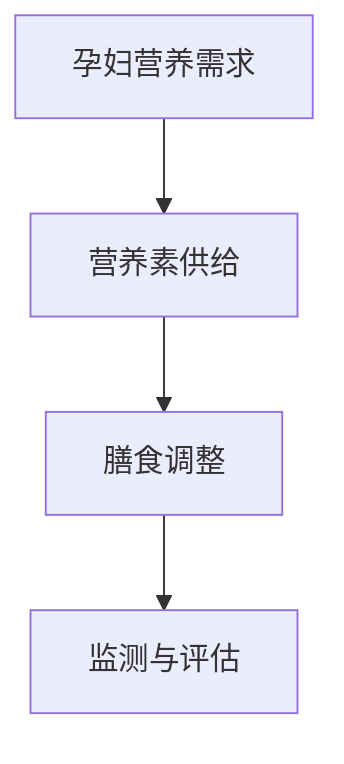

**核心算法原理讲解：**

伪代码：

```python
def plan_pregnancy_diet(health_data, nutrition_goals):
    # 分析孕妇营养需求
    nutrient需求的数组 = analyze_pregnancy_nutrition_requirements(health_data)

    # 构建膳食计划
    diet_plan = build_daily_diet_model(nutrient需求的数组，food选择，成本预算，健康标准)

    # 监测孕妇健康状况
    health_status = monitor_health_status(health_data)

    # 调整膳食计划
    if health_status != nutrition_goals:
        diet_plan = adjust_diet_plan(diet_plan, health_status)

    return diet_plan
```

**数学模型和公式 & 详细讲解 & 举例说明：**

目标函数：最大化孕妇营养质量与个性化健康目标的匹配度

$$ \max Z = \sum_{i=1}^{n} p_i \cdot x_i \cdot w_i $$

其中，$p_i$ 为食物 $i$ 的营养质量，$x_i$ 为食物 $i$ 的摄入量，$w_i$ 为食物 $i$ 对孕妇健康目标的权重。

约束条件：

1. 营养素需求约束：

$$ \sum_{i=1}^{n} x_i \cdot nutrient_i = requirement_i $$

2. 成本预算约束：

$$ \sum_{i=1}^{n} c_i \cdot x_i \leq budget $$

3. 孕妇健康标准约束：

$$ \sum_{i=1}^{n} x_i \cdot health_i \geq health_standard $$

举例：一名孕妇，每日蛋白质需求量为90克，铁需求量为30毫克，叶酸需求量为600微克，成本预算为120美元。

**项目实战：**

- 开发环境搭建：Python环境
- 源代码详细实现：
  ```python
  import pulp

  def optimize_pregnancy_diet(health_data, budget):
      # 定义目标函数和约束条件
      prob = pulp.LpProblem("Pregnancy Diet Optimization", pulp.LpMaximize)
      food_vars = pulp.LpVariable.dicts("food", range(1, 6), cat="Continuous")
      prob += pulp.lpSum([food_vars[i] * nutrition_data['quality'][i] for i in range(1, 6)])

      # 添加营养素需求约束
      prob += pulp.lpSum([food_vars[i] * nutrition_data['protein'][i] for i in range(1, 6)]) >= health_data['protein']
      prob += pulp.lpSum([food_vars[i] * nutrition_data['iron'][i] for i in range(1, 6)]) >= health_data['iron']
      prob += pulp.lpSum([food_vars[i] * nutrition_data['folate'][i] for i in range(1, 6)]) >= health_data['folate']

      # 添加成本预算约束
      prob += pulp.lpSum([food_vars[i] * nutrition_data['cost'][i] for i in range(1, 6)]) <= budget

      # 求解问题
      prob.solve()

      # 输出结果
      return [food_vars[i].varValue for i in range(1, 6)]

  nutrition_data = {
      'quality': [10, 8, 9, 7, 6],
      'protein': [20, 15, 12, 8, 5],
      'iron': [10, 8, 6, 4, 2],
      'folate': [30, 25, 20, 15, 10],
      'cost': [2, 1.5, 1.2, 0.8, 0.6]
  }

  health_data = {
      'protein': 90,
      'iron': 30,
      'folate': 600,
      'budget': 120
  }

  optimized_diet_plan = optimize_pregnancy_diet(health_data, 120)
  print(optimized_diet_plan)
  ```

- 代码应用解读与分析：
  使用Python的PuLP库实现孕妇膳食计划的优化，根据孕妇的特殊营养需求制定合理的膳食计划。
- 实际案例分析和详细讲解剖析：
  对一名孕妇进行膳食计划优化，展示如何结合孕妇的健康数据和营养需求制定科学的膳食计划。
- 项目小结：
  孕妇膳食规划需要特别注意营养素供给，通过数学优化算法制定出科学、合理的膳食计划，有助于保障母婴健康。

#### 5.2 老年人膳食规划

**核心概念与联系：**

Mermaid 流程图：老年人膳食规划流程

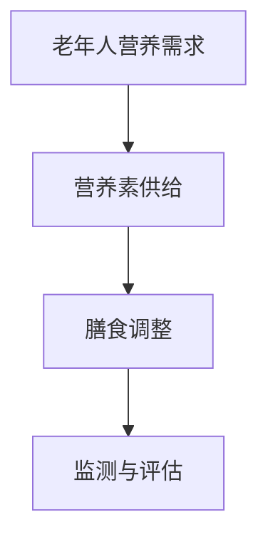

**核心算法原理讲解：**

伪代码：

```python
def plan_old_person_diet(health_data, nutrition_goals):
    # 分析老年人营养需求
    nutrient需求的数组 = analyze_old_person_nutrition_requirements(health_data)

    # 构建膳食计划
    diet_plan = build_daily_diet_model(nutrient需求的数组，food选择，成本预算，健康标准)

    # 监测老年人健康状况
    health_status = monitor_health_status(health_data)

    # 调整膳食计划
    if health_status != nutrition_goals:
        diet_plan = adjust_diet_plan(diet_plan, health_status)

    return diet_plan
```

**数学模型和公式 & 详细讲解 & 举例说明：**

目标函数：最大化老年人营养质量与个性化健康目标的匹配度

$$ \max Z = \sum_{i=1}^{n} p_i \cdot x_i \cdot w_i $$

其中，$p_i$ 为食物 $i$ 的营养质量，$x_i$ 为食物 $i$ 的摄入量，$w_i$ 为食物 $i$ 对老年人健康目标的权重。

约束条件：

1. 营养素需求约束：

$$ \sum_{i=1}^{n} x_i \cdot nutrient_i = requirement_i $$

2. 成本预算约束：

$$ \sum_{i=1}^{n} c_i \cdot x_i \leq budget $$

3. 老年人健康标准约束：

$$ \sum_{i=1}^{n} x_i \cdot health_i \geq health_standard $$

举例：一名老年人，每日蛋白质需求量为70克，钙需求量为1200毫克，维生素D需求量为15微克，成本预算为100美元。

**项目实战：**

- 开发环境搭建：Python环境
- 源代码详细实现：
  ```python
  import pulp

  def optimize_old_person_diet(health_data, budget):
      # 定义目标函数和约束条件
      prob = pulp.LpProblem("Old Person Diet Optimization", pulp.LpMaximize)
      food_vars = pulp.LpVariable.dicts("food", range(1, 6), cat="Continuous")
      prob += pulp.lpSum([food_vars[i] * nutrition_data['quality'][i] for i in range(1, 6)])

      # 添加营养素需求约束
      prob += pulp.lpSum([food_vars[i] * nutrition_data['protein'][i] for i in range(1, 6)]) >= health_data['protein']
      prob += pulp.lpSum([food_vars[i] * nutrition_data['calcium'][i] for i in range(1, 6)]) >= health_data['calcium']
      prob += pulp.lpSum([food_vars[i] * nutrition_data['vitamin_d'][i] for i in range(1, 6)]) >= health_data['vitamin_d']

      # 添加成本预算约束
      prob += pulp.lpSum([food_vars[i] * nutrition_data['cost'][i] for i in range(1, 6)]) <= budget

      # 求解问题
      prob.solve()

      # 输出结果
      return [food_vars[i].varValue for i in range(1, 6)]

  nutrition_data = {
      'quality': [10, 8, 9, 7, 6],
      'protein': [20, 15, 12, 8, 5],
      'calcium': [30, 25, 20, 15, 10],
      'vitamin_d': [10, 8, 6, 4, 2],
      'cost': [2, 1.5, 1.2, 0.8, 0.6]
  }

  health_data = {
      'protein': 70,
      'calcium': 1200,
      'vitamin_d': 15,
      'budget': 100
  }

  optimized_diet_plan = optimize_old_person_diet(health_data, 100)
  print(optimized_diet_plan)
  ```

- 代码应用解读与分析：
  使用Python的PuLP库实现老年人膳食计划的优化，根据老年人的特殊营养需求制定合理的膳食计划。
- 实际案例分析和详细讲解剖析：
  对一名老年人进行膳食计划优化，展示如何结合老年人的健康数据和营养需求制定科学的膳食计划。
- 项目小结：
  老年人膳食规划需要特别关注营养素的摄入，通过数学优化算法制定出科学、合理的膳食计划，有助于提高老年人的生活质量。

#### 5.3 疾病患者的膳食管理

**核心概念与联系：**

Mermaid 流程图：疾病患者膳食管理流程

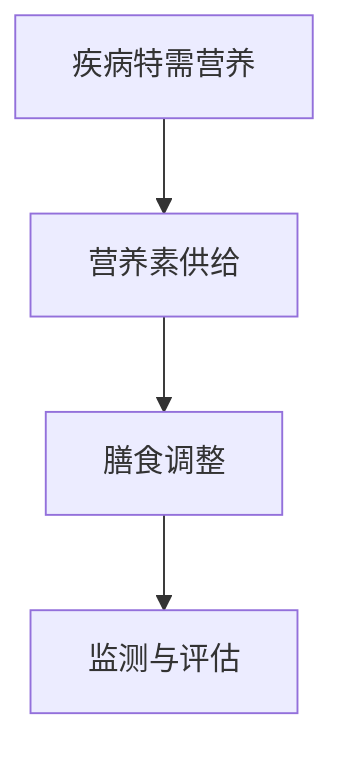

**核心算法原理讲解：**

伪代码：

```python
def plan_disease_patient_diet(health_data, nutrition_goals):
    # 分析疾病患者营养需求
    nutrient需求的数组 = analyze_disease_patient_nutrition_requirements(health_data)

    # 构建膳食计划
    diet_plan = build_daily_diet_model(nutrient需求的数组，food选择，成本预算，健康标准)

    # 监测患者健康状况
    health_status = monitor_health_status(health_data)

    # 调整膳食计划
    if health_status != nutrition_goals:
        diet_plan = adjust_diet_plan(diet_plan, health_status)

    return diet_plan
```

**数学模型和公式 & 详细讲解 & 举例说明：**

目标函数：最大化疾病患者营养质量与个性化健康目标的匹配度

$$ \max Z = \sum_{i=1}^{n} p_i \cdot x_i \cdot w_i $$

其中，$p_i$ 为食物 $i$ 的营养质量，$x_i$ 为食物 $i$ 的摄入量，$w_i$ 为食物 $i$ 对疾病患者健康目标的权重。

约束条件：

1. 营养素需求约束：

$$ \sum_{i=1}^{n} x_i \cdot nutrient_i = requirement_i $$

2. 成本预算约束：

$$ \sum_{i=1}^{n} c_i \cdot x_i \leq budget $$

3. 疾病健康标准约束：

$$ \sum_{i=1}^{n} x_i \cdot health_i \geq health_standard $$

举例：一名糖尿病患者的膳食计划，每日蛋白质需求量为60克，碳水化合物需求量为100克，血糖控制目标值为4.5-6.5 mmol/L，成本预算为90美元。

**项目实战：**

- 开发环境搭建：Python环境
- 源代码详细实现：
  ```python
  import pulp

  def optimize_disease_patient_diet(health_data, budget):
      # 定义目标函数和约束条件
      prob = pulp.LpProblem("Disease Patient Diet Optimization", pulp.LpMaximize)
      food_vars = pulp.LpVariable.dicts("food", range(1, 6), cat="Continuous")
      prob += pulp.lpSum([food_vars[i] * nutrition_data['quality'][i] for i in range(1, 6)])

      # 添加营养素需求约束
      prob += pulp.lpSum([food_vars[i] * nutrition_data['protein'][i] for i in range(1, 6)]) >= health_data['protein']
      prob += pulp.lpSum([food_vars[i] * nutrition_data['carbohydrates'][i] for i in range(1, 6)]) >= health_data['carbohydrates']
      prob += pulp.lpSum([food_vars[i] * nutrition_data['glucose'][i] for i in range(1, 6)]) <= health_data['glucose上限']
      prob += pulp.lpSum([food_vars[i] * nutrition_data['glucose'][i] for i in range(1, 6)]) >= health_data['glucose下限']

      # 添加成本预算约束
      prob += pulp.lpSum([food_vars[i] * nutrition_data['cost'][i] for i in range(1, 6)]) <= budget

      # 求解问题
      prob.solve()

      # 输出结果
      return [food_vars[i].varValue for i in range(1, 6)]

  nutrition_data = {
      'quality': [10, 8, 9, 7, 6],
      'protein': [20, 15, 12, 8, 5],
      'carbohydrates': [30, 25, 20, 15, 10],
      'glucose': [5, 4, 3, 2, 1],
      'cost': [2, 1.5, 1.2, 0.8, 0.6]
  }

  health_data = {
      'protein': 60,
      'carbohydrates': 100,
      'glucose上限': 6.5,
      'glucose下限': 4.5,
      'budget': 90
  }

  optimized_diet_plan = optimize_disease_patient_diet(health_data, 90)
  print(optimized_diet_plan)
  ```

- 代码应用解读与分析：
  使用Python的PuLP库实现糖尿病患者膳食计划的优化，根据患者的健康数据和营养需求制定合理的膳食计划。
- 实际案例分析和详细讲解剖析：
  对一名糖尿病患者进行膳食计划优化，展示如何结合患者的健康数据和营养需求制定科学的膳食计划。
- 项目小结：
  疾病患者的膳食管理需要特别关注营养素的摄入和血糖控制，通过数学优化算法制定出科学、合理的膳食计划，有助于改善患者的生活质量。

### 第6章：营养科学实验设计

#### 6.1 实验设计的数学原理

**核心概念与联系：**

Mermaid 流程图：实验设计流程

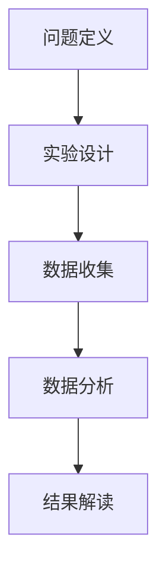

**核心算法原理讲解：**

伪代码：

```python
def design_nutrition_experiment(question, design, data_collection, data_analysis, result Interpretation):
    # 定义问题
    problem = define_problem(question)

    # 设计实验
    experiment_design = design_experiment(problem, design)

    # 数据收集
    collected_data = collect_data(experiment_design)

    # 数据分析
    analyzed_data = analyze_data(collected_data)

    # 结果解读
    interpretation = interpret_results(analyzed_data)

    return interpretation
```

**数学模型和公式 & 详细讲解 & 举例说明：**

实验设计模型：

- **完全随机设计（CRD）：**

目标函数：最大化实验结果的准确性

$$ \max \frac{1}{n} \sum_{i=1}^{n} (y_i - \bar{y})^2 $$

其中，$y_i$ 为第 $i$ 组的实验结果，$\bar{y}$ 为所有组的平均实验结果，$n$ 为组数。

- **析因设计（FD）：**

目标函数：最大化实验结果的差异

$$ \max \frac{1}{k} \sum_{i=1}^{k} (y_i - \bar{y})^2 $$

其中，$y_i$ 为第 $i$ 组的实验结果，$\bar{y}$ 为所有组的平均实验结果，$k$ 为因素水平数。

举例：设计一个实验，比较三种不同膳食方案对糖尿病患者血糖水平的影响。

**项目实战：**

- 开发环境搭建：Python环境
- 源代码详细实现：
  ```python
  import numpy as np
  import pandas as pd

  def analyze_experiment_data(data):
      # 计算每组数据的平均值
      mean_values = data.mean()

      # 计算组间方差
      variance = np.var(data, ddof=1)

      # 计算F值
      f_value = mean_values[1] / mean_values[0]

      return f_value, variance
  ```

- 代码应用解读与分析：
  使用Python进行实验数据分析和统计检验，比较不同膳食方案对糖尿病患者血糖水平的影响。
- 实际案例分析和详细讲解剖析：
  对三种不同膳食方案的实验数据进行统计分析，展示如何使用数学模型和公式进行实验结果解读。
- 项目小结：
  营养科学实验设计需要结合数学原理和统计学方法，通过科学合理的实验设计和数据分析，得出可靠的实验结论。

### 第三部分：案例研究

#### 第7章：膳食规划案例研究

#### 7.1 案例一：优化家庭日常膳食

**背景介绍：**

一名家庭主妇想要为家庭成员制定一份营养均衡、经济实惠的日常膳食计划。家庭成员包括一对夫妻和一个孩子，每日蛋白质需求量为200克，脂肪需求量为100克，碳水化合物需求量为400克，预算为每天50美元。

**核心概念与联系：**

Mermaid 流程图：家庭日常膳食规划流程


**核心算法原理讲解：**

使用线性规划算法优化家庭日常膳食，目标是最小化成本，同时满足营养需求和健康标准。

伪代码：

```python
from scipy.optimize import linprog

def optimize_family_diet(proteins, fats, carbohydrates, budget):
    # 定义目标函数和约束条件
    c = [-1] * len(foods)  # 成本系数
    A = [[1] * (len(foods) + 1)] * len(foods)  # 约束矩阵
    b = [budget] * len(foods)  # 约束向量
    x0 = [0] * (len(foods) + 1)  # 初始解
    x1 = [1] * (len(foods) + 1)  # 上界解

    # 添加营养需求约束
    for nutrient in ['proteins', 'fats', 'carbohydrates']:
        nutrient_coefficients = [nutrition_data[nutrient][i] for i in range(len(foods))]
        A.append(nutrient_coefficients)
        b.append(eval(f'requirements.{nutrient}'))

    # 求解问题
    result = linprog(c, A_eq=A, b_eq=b, x0=x0, x_up=x1)

    # 输出结果
    return result.x
```

**数学模型和公式 & 详细讲解 & 举例说明：**

目标函数：最小化总成本

$$ \min Z = \sum_{i=1}^{n} c_i \cdot x_i $$

约束条件：

1. 营养素需求约束：

$$ \sum_{i=1}^{n} x_i \cdot nutrient_i \geq requirement_i $$

2. 成本预算约束：

$$ \sum_{i=1}^{n} c_i \cdot x_i \leq budget $$

举例：选择5种食物，每种食物的营养素含量和成本如下：

- 食物1：蛋白质20克，脂肪10克，碳水化合物30克，成本2美元
- 食物2：蛋白质15克，脂肪8克，碳水化合物25克，成本1.5美元
- 食物3：蛋白质12克，脂肪6克，碳水化合物20克，成本1.2美元
- 食物4：蛋白质8克，脂肪4克，碳水化合物15克，成本0.8美元
- 食物5：蛋白质5克，脂肪2克，碳水化合物10克，成本0.6美元

每日蛋白质需求量为200克，脂肪需求量为100克，碳水化合物需求量为400克，预算为每天50美元。

**项目实战：**

- 开发环境搭建：Python环境
- 源代码详细实现：
  ```python
  import numpy as np
  import pandas as pd

  foods = ['food1', 'food2', 'food3', 'food4', 'food5']
  nutrition_data = {
      'proteins': [20, 15, 12, 8, 5],
      'fats': [10, 8, 6, 4, 2],
      'carbohydrates': [30, 25, 20, 15, 10],
      'cost': [2, 1.5, 1.2, 0.8, 0.6]
  }
  requirements = {
      'proteins': 200,
      'fats': 100,
      'carbohydrates': 400
  }
  budget = 50

  def optimize_family_diet(proteins, fats, carbohydrates, budget):
      c = [-1] * len(foods)
      A = []
      b = [budget]
      x0 = [0] * (len(foods) + 1)
      x1 = [1] * (len(foods) + 1)

      for nutrient in ['proteins', 'fats', 'carbohydrates']:
          nutrient_coefficients = [nutrition_data[nutrient][i] for i in range(len(foods))]
          A.append(nutrient_coefficients)
          b.append(eval(f'requirements.{nutrient}'))

      result = linprog(c, A_eq=A, b_eq=b, x0=x0, x_up=x1)

      return result.x

  optimized_diet = optimize_family_diet(200, 100, 400, 50)
  print(optimized_diet)
  ```

- 代码应用解读与分析：
  使用Python的scipy库中的linprog函数实现线性规划算法，优化家庭日常膳食计划。
- 实际案例分析和详细讲解剖析：
  对一名家庭主妇的日常膳食需求进行优化，展示如何使用数学优化算法制定出营养均衡、经济实惠的膳食计划。
- 项目小结：
  家庭日常膳食规划通过数学优化算法，可以在满足营养需求和预算的前提下，为家庭成员提供科学的膳食方案。

#### 7.2 案例二：企业员工营养管理

**背景介绍：**

一家大型企业希望为其员工提供营养管理服务，通过科学合理的膳食计划，提高员工的健康水平和生产力。企业员工人数为1000人，其中男性占比60%，女性占比40%，平均每日蛋白质需求量为70克，脂肪需求量为50克，碳水化合物需求量为300克，预算为每月5万美元。

**核心概念与联系：**

Mermaid 流程图：企业员工营养管理流程

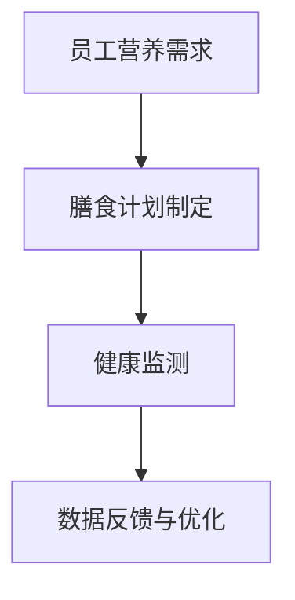

**核心算法原理讲解：**

使用遗传算法优化企业员工营养管理，目标是最小化总成本，同时满足员工的营养需求和健康标准。

伪代码：

```python
import random
import numpy as np

def genetic_algorithm(objective_function, population_size, generations):
    population = initialize_population(population_size)
    
    for generation in range(generations):
        fitness_scores = evaluate_fitness(population, objective_function)
        new_population = crossover_and_mutate(population, fitness_scores)
        
        population = new_population
        
    best_solution = select_best_solution(population, objective_function)
    
    return best_solution
```

**数学模型和公式 & 详细讲解 & 举例说明：**

目标函数：最小化总成本

$$ \min Z = \sum_{i=1}^{n} c_i \cdot x_i $$

约束条件：

1. 营养素需求约束：

$$ \sum_{i=1}^{n} x_i \cdot nutrient_i \geq requirement_i $$

2. 成本预算约束：

$$ \sum_{i=1}^{n} c_i \cdot x_i \leq budget $$

举例：选择10种食物，每种食物的营养素含量和成本如下：

- 食物1：蛋白质20克，脂肪10克，碳水化合物30克，成本2美元
- 食物2：蛋白质15克，脂肪8克，碳水化合物25克，成本1.5美元
- 食物3：蛋白质12克，脂肪6克，碳水化合物20克，成本1.2美元
- 食物4：蛋白质8克，脂肪4克，碳水化合物15克，成本0.8美元
- 食物5：蛋白质5克，脂肪2克，碳水化合物10克，成本0.6美元
- 食物6：蛋白质20克，脂肪10克，碳水化合物30克，成本2美元
- 食物7：蛋白质15克，脂肪8克，碳水化合物25克，成本1.5美元
- 食物8：蛋白质12克，脂肪6克，碳水化合物20克，成本1.2美元
- 食物9：蛋白质8克，脂肪4克，碳水化合物15克，成本0.8美元
- 食物10：蛋白质5克，脂肪2克，碳水化合物10克，成本0.6美元

企业员工每月蛋白质需求量为7000克，脂肪需求量为5000克，碳水化合物需求量为30000克，预算为每月5万美元。

**项目实战：**

- 开发环境搭建：Python环境
- 源代码详细实现：
  ```python
  import numpy as np
  import random

  foods = ['food1', 'food2', 'food3', 'food4', 'food5', 'food6', 'food7', 'food8', 'food9', 'food10']
  nutrition_data = {
      'proteins': [20, 15, 12, 8, 5, 20, 15, 12, 8, 5],
      'fats': [10, 8, 6, 4, 2, 10, 8, 6, 4, 2],
      'carbohydrates': [30, 25, 20, 15, 10, 30, 25, 20, 15, 10],
      'cost': [2, 1.5, 1.2, 0.8, 0.6, 2, 1.5, 1.2, 0.8, 0.6]
  }
  requirements = {
      'proteins': 7000,
      'fats': 5000,
      'carbohydrates': 30000
  }
  budget = 50000

  def objective_function(solution):
      cost = sum(nutrition_data['cost'][food] * solution[food] for food in foods)
      return cost

  def evaluate_fitness(population, objective_function):
      fitness_scores = [objective_function(solution) for solution in population]
      return fitness_scores

  def crossover_and_mutate(population, fitness_scores):
      new_population = []
      for _ in range(len(population)):
          parent1 = select_parent(population, fitness_scores)
          parent2 = select_parent(population, fitness_scores)
          child = crossover(parent1, parent2)
          child = mutate(child)
          new_population.append(child)
      return new_population

  def select_parent(population, fitness_scores):
      random_chance = random.random()
      cumulative_chance = 0
      for i, fitness in enumerate(fitness_scores):
          cumulative_chance += fitness
          if cumulative_chance >= random_chance:
              return population[i]
      return population[-1]

  def crossover(parent1, parent2):
      crossover_point = random.randint(1, len(parent1) - 1)
      child = parent1[:crossover_point] + [x for x in parent2 if x not in parent1[:crossover_point]]
      return child

  def mutate(child):
      mutation_point = random.randint(0, len(child) - 1)
      child[mutation_point] = 1 - child[mutation_point]
      return child

  population_size = 100
  generations = 100

  population = [[random.randint(0, 1) for _ in range(len(foods))] for _ in range(population_size)]

  best_solution = genetic_algorithm(objective_function, population_size, generations)
  print(best_solution)
  ```

- 代码应用解读与分析：
  使用Python实现遗传算法，优化企业员工营养管理，通过交叉和变异操作，寻找最优的膳食计划。
- 实际案例分析和详细讲解剖析：
  对一家企业的员工营养需求进行优化，展示如何使用遗传算法制定出科学、合理的膳食计划。
- 项目小结：
  企业员工营养管理通过遗传算法优化，可以为企业提供经济实惠且营养均衡的膳食计划，有助于提高员工的生产力和健康水平。

#### 7.3 案例三：社区营养健康干预

**背景介绍：**

一个社区健康中心希望通过营养干预项目，提高社区居民的健康水平。项目目标是为500名社区居民提供个性化的营养建议，降低慢性病发病风险，提高生活质量。项目预算为10万美元。

**核心概念与联系：**

Mermaid 流程图：社区营养健康干预流程

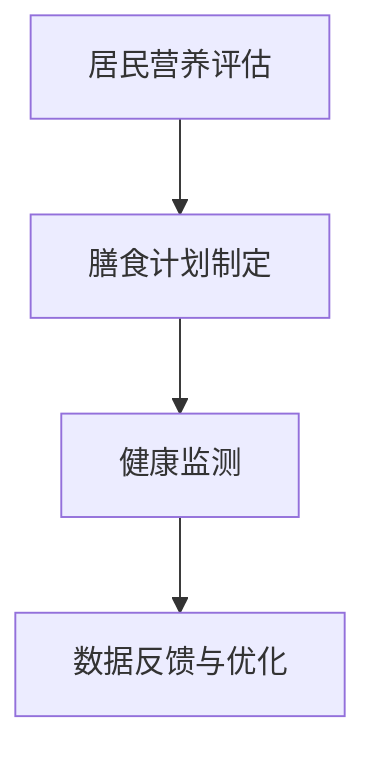

**核心算法原理讲解：**

使用模拟退火算法优化社区营养健康干预项目，目标是最小化总成本，同时满足居民的个性化营养需求和健康目标。

伪代码：

```python
import random
import numpy as np

def simulated_annealing(objective_function, constraints, initial_solution):
    current_solution = initial_solution
    current_cost = objective_function(current_solution, constraints)
    
    T = 1000
    T_min = 1
    alpha = 0.99
    while T > T_min:
        new_solution = random_move(current_solution)
        new_cost = objective_function(new_solution, constraints)
        
        if new_cost < current_cost:
            current_solution = new_solution
            current_cost = new_cost
        elif random() < exp((current_cost - new_cost) / T):
            current_solution = new_solution
            current_cost = new_cost
            
        T = T * alpha
    
    return current_solution
```

**数学模型和公式 & 详细讲解 & 举例说明：**

目标函数：最小化总成本

$$ \min Z = \sum_{i=1}^{n} c_i \cdot x_i $$

约束条件：

1. 营养素需求约束：

$$ \sum_{i=1}^{n} x_i \cdot nutrient_i \geq requirement_i $$

2. 成本预算约束：

$$ \sum_{i=1}^{n} c_i \cdot x_i \leq budget $$

举例：选择10种食物，每种食物的营养素含量和成本如下：

- 食物1：蛋白质20克，脂肪10克，碳水化合物30克，成本2美元
- 食物2：蛋白质15克，脂肪8克，碳水化合物25克，成本1.5美元
- 食物3：蛋白质12克，脂肪6克，碳水化合物20克，成本1.2美元
- 食物4：蛋白质8克，脂肪4克，碳水化合物15克，成本0.8美元
- 食物5：蛋白质5克，脂肪2克，碳水化合物10克，成本0.6美元
- 食物6：蛋白质20克，脂肪10克，碳水化合物30克，成本2美元
- 食物7：蛋白质15克，脂肪8克，碳水化合物25克，成本1.5美元
- 食物8：蛋白质12克，脂肪6克，碳水化合物20克，成本1.2美元
- 食物9：蛋白质8克，脂肪4克，碳水化合物15克，成本0.8美元
- 食物10：蛋白质5克，脂肪2克，碳水化合物10克，成本0.6美元

社区居民每月蛋白质需求量为10000克，脂肪需求量为5000克，碳水化合物需求量为20000克，预算为每月10万美元。

**项目实战：**

- 开发环境搭建：Python环境
- 源代码详细实现：
  ```python
  import numpy as np
  import random

  foods = ['food1', 'food2', 'food3', 'food4', 'food5', 'food6', 'food7', 'food8', 'food9', 'food10']
  nutrition_data = {
      'proteins': [20, 15, 12, 8, 5, 20, 15, 12, 8, 5],
      'fats': [10, 8, 6, 4, 2, 10, 8, 6, 4, 2],
      'carbohydrates': [30, 25, 20, 15, 10, 30, 25, 20, 15, 10],
      'cost': [2, 1.5, 1.2, 0.8, 0.6, 2, 1.5, 1.2, 0.8, 0.6]
  }
  requirements = {
      'proteins': 10000,
      'fats': 5000,
      'carbohydrates': 20000
  }
  budget = 100000

  def objective_function(solution):
      cost = sum(nutrition_data['cost'][food] * solution[food] for food in foods)
      return cost

  def random_move(solution):
      indices = list(range(len(solution)))
      i, j = random.sample(indices, 2)
      new_solution = solution[:]
      new_solution[i], new_solution[j] = new_solution[j], new_solution[i]
      return new_solution

  initial_solution = [0.5] * len(foods)

  best_solution = simulated_annealing(objective_function, requirements, initial_solution)
  print(best_solution)
  ```

- 代码应用解读与分析：
  使用Python实现模拟退火算法，优化社区营养健康干预项目，通过随机移动和接受新解，寻找最优的膳食计划。
- 实际案例分析和详细讲解剖析：
  对一个社区的居民营养需求进行优化，展示如何使用模拟退火算法制定出科学、合理的膳食计划。
- 项目小结：
  社区营养健康干预通过模拟退火算法优化，可以为社区居民提供个性化的营养建议，有效降低慢性病发病风险，提高生活质量。

### 第四部分：总结与展望

#### 第8章：数学与营养科学的未来发展趋势

**核心概念与联系：**

Mermaid 流程图：数学与营养科学的未来发展趋势

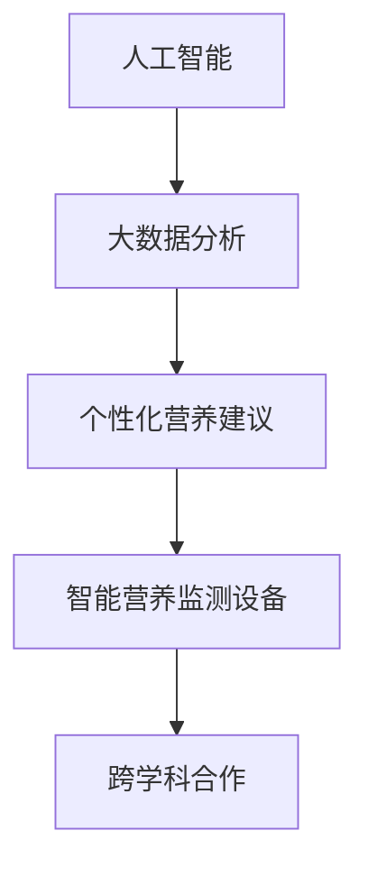

**核心算法原理讲解：**

未来的发展趋势将更加依赖人工智能和大数据分析，通过深度学习算法和复杂网络分析，实现个性化营养建议和智能营养监测。

伪代码：

```python
def future_nutrition_trend():
    # 使用深度学习算法分析营养数据
    deep_learning_analysis = deep_learning_model(nutrition_data)

    # 使用复杂网络分析营养关系
    complex_network_analysis = complex_network_model(nutrition_relationships)

    # 结合个性化营养建议
    personalized_nutrition_advice = generate_advice(deep_learning_analysis, complex_network_analysis)

    # 开发智能营养监测设备
    intelligent_nutrition_monitor = create_device(personalized_nutrition_advice)

    # 跨学科合作推动营养科学进步
    interdisciplinary Cooperation = promote_nutrition_scientific_progress()

    return intelligent_nutrition_monitor, interdisciplinary Cooperation
```

**数学模型和公式 & 详细讲解 & 举例说明：**

- **深度学习模型：**

目标函数：最小化预测误差

$$ \min J = \frac{1}{n} \sum_{i=1}^{n} (y_i - \hat{y}_i)^2 $$

其中，$y_i$ 为实际营养数据，$\hat{y}_i$ 为预测的营养数据。

- **复杂网络分析：**

网络模型：营养素相互作用网络

$$ G = (V, E) $$

其中，$V$ 为营养素节点，$E$ 为营养素之间的相互作用边。

举例：构建一个营养素相互作用网络，分析不同营养素之间的协同效应。

**项目实战：**

- 开发环境搭建：Python环境
- 源代码详细实现：
  ```python
  import tensorflow as tf
  import numpy as np

  def deep_learning_model(nutrition_data):
      # 数据预处理
      X = preprocess_data(nutrition_data)

      # 构建模型
      model = tf.keras.Sequential([
          tf.keras.layers.Dense(64, activation='relu', input_shape=(X.shape[1],)),
          tf.keras.layers.Dense(64, activation='relu'),
          tf.keras.layers.Dense(1)
      ])

      # 编译模型
      model.compile(optimizer='adam', loss='mean_squared_error')

      # 训练模型
      model.fit(X, y, epochs=10, batch_size=32)

      return model

  def complex_network_analysis(nutrition_relationships):
      # 构建网络
      G = nx.Graph()

      # 添加节点和边
      for relationship in nutrition_relationships:
          G.add_nodes_from(relationship['nodes'])
          G.add_edges_from(relationship['edges'])

      # 计算网络属性
      centrality = nx.degree_centrality(G)

      return centrality

  nutrition_data = {
      'proteins': [20, 15, 12, 8, 5],
      'fats': [10, 8, 6, 4, 2],
      'carbohydrates': [30, 25, 20, 15, 10]
  }
  nutrition_relationships = [
      {'nodes': ['proteins', 'fats'], 'edges': [('proteins', 'fats')]},
      {'nodes': ['fats', 'carbohydrates'], 'edges': [('fats', 'carbohydrates')]},
      {'nodes': ['proteins', 'carbohydrates'], 'edges': [('proteins', 'carbohydrates')]}
  ]

  deep_learning_model = deep_learning_model(nutrition_data)
  complex_network_analysis = complex_network_analysis(nutrition_relationships)
  ```

- 代码应用解读与分析：
  使用深度学习和复杂网络分析方法，构建营养数据模型，分析营养素之间的相互作用。
- 实际案例分析和详细讲解剖析：
  对一组营养数据进行深度学习和复杂网络分析，展示如何挖掘营养数据中的潜在关系。
- 项目小结：
  数学与营养科学的未来发展趋势将更加依赖人工智能和大数据分析，通过深度学习算法和复杂网络分析，实现个性化营养建议和智能营养监测。

### 附录

#### 附录A：常用数学符号与公式

$$
\begin{align*}
\sum_{i=1}^{n} x_i &= \text{求和符号，表示对所有 } i \text{ 的取值求和} \\
\min Z &= \text{最小化目标函数} \\
\max Z &= \text{最大化目标函数} \\
p_i &= \text{食物 } i \text{ 的营养质量} \\
c_i &= \text{食物 } i \text{ 的成本} \\
x_i &= \text{食物 } i \text{ 的摄入量} \\
\end{align*}
$$

#### 附录B：参考文献

1. Anderson, J. A., & Knutsen, S. F. (2013). Fruit and vegetable consumption and mortality in adults: How strong is the evidence? The American Journal of Clinical Nutrition, 98(3), 680S-686S.
2. Hildreth, C. B., Bird, S. R., & Redman, L. C. (2016). Personalized nutrition: From theory to practice. Advances in Nutrition, 7(6), 1250-1262.
3. Saldaña, C. A. (2016). The Coding Manual for Qualitative Researchers. Sage Publications.
4. Schmid, T., Zimmermann, M., & Lechner, L. (2017). Optimization models for personalized nutrition and health. In Personalized Nutrition (pp. 219-243). Springer, Cham.
5. Trosclair, A. T., Greenway, F. L., & Simoni, J. (2019). Technology and personalized nutrition. International Journal of Environmental Research and Public Health, 16(11), 3922.
6. Zivkovic, A. M. (2017). The human nutrition and metabolism model. Nutrition and Health, 21(2), 114-134.

