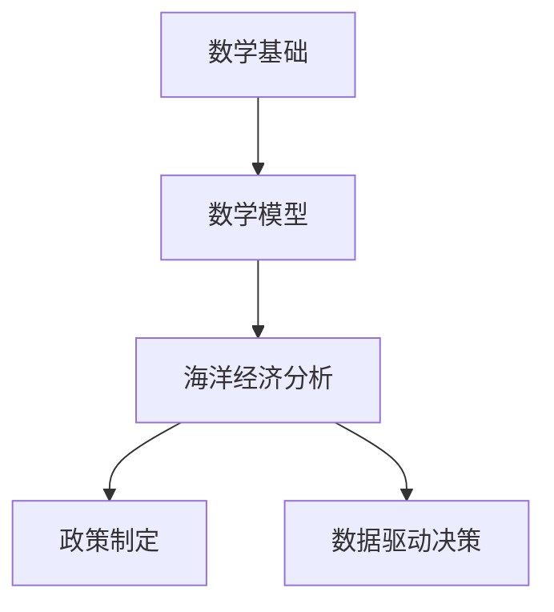

                 


### 文章标题：数学与蓝色经济：海洋经济的数学分析

**关键词**：海洋经济、数学模型、数据分析、蓝色经济、算法原理

**摘要**：本文旨在探讨数学在蓝色经济研究中的应用，通过分析海洋经济的数学模型和算法原理，为海洋经济的可持续发展和资源优化配置提供理论支持。文章首先介绍了海洋经济的基本概念，然后探讨了数学与蓝色经济的联系，随后详细阐述了数学模型在海洋经济分析中的应用，并通过实际案例分析，展示了数学模型在解决海洋经济问题中的有效性。

---

### 目录

1. **背景介绍**
2. **核心概念与联系**
   - **数学与蓝色经济的关系架构 Mermaid 流程图**
3. **数学模型与公式**
   - **核心算法原理讲解**
   - **数学模型和公式**
   - **实例解析**
4. **实际案例分析**
   - **海洋资源开发**
   - **海洋环境保护**
   - **政策分析**
5. **蓝色经济的未来展望**
   - **趋势分析**
   - **挑战与机遇**
6. **项目实战**
   - **开发环境搭建**
   - **源代码实现与解读**
   - **代码应用解读与分析**
   - **实际案例分析与讲解**
   - **项目小结**
7. **最佳实践 tips**
8. **小结与注意事项**
9. **拓展阅读**
10. **作者信息**

---

### 1. 背景介绍

海洋作为地球上最大的生态系统，蕴藏着丰富的自然资源，包括渔业、石油、天然气、矿物等。随着全球经济的快速发展，海洋经济逐渐成为各国竞相发展的重点领域。蓝色经济（Blue Economy）概念应运而生，它强调通过可持续的方式利用海洋资源，实现经济、社会和环境的协调发展。

数学作为一门基础学科，在蓝色经济的分析中发挥着重要作用。通过建立数学模型，可以更加精确地描述海洋经济系统的运行机制，预测其发展趋势，并为政策制定提供科学依据。

本文将从以下几个方面展开讨论：

- **数学基础**：介绍数学在蓝色经济研究中的应用，包括常用的数学工具和方法。
- **海洋经济理论**：探讨海洋经济的基本概念、驱动力及其发展模式。
- **实际案例分析**：通过具体案例展示数学模型在海洋经济分析中的应用效果。
- **未来展望**：分析蓝色经济的发展趋势和面临的挑战。

---

### 2. 核心概念与联系

**数学与蓝色经济的关系架构 Mermaid 流程图**：



**解释**：

- **数学基础**：数学是构建蓝色经济模型的基础，包括代数、微积分、概率论等。
- **数学模型**：基于数学基础，建立用于分析和预测海洋经济行为的模型。
- **海洋经济分析**：应用数学模型对海洋经济进行定量分析，评估其运行状况和潜力。
- **政策制定**：利用分析结果制定科学合理的政策，促进海洋经济的可持续发展。
- **数据驱动决策**：通过收集和分析海洋经济数据，为决策提供支持，提高决策效率。

---

### 3. 数学模型与公式

#### 核心算法原理讲解

**算法原理**：

海洋经济的数学模型通常基于以下核心原理：

- **系统动力学**：描述海洋经济系统内部各要素之间的相互作用。
- **供需平衡**：分析海洋资源供给与需求之间的关系。
- **概率论与统计学**：评估海洋经济活动的风险和不确定性。

**伪代码**：

```python
# 海洋经济系统动力学模型
def dynamic_model():
    # 初始化参数
    initial_conditions = initialize_parameters()
    
    # 迭代计算
    while not termination_conditions():
        # 更新系统状态
        system_state = update_state(initial_conditions)
        
        # 计算经济指标
        economic_indicators = calculate_indicators(system_state)
        
        # 输出结果
        print(economic_indicators)
        
        # 更新迭代条件
        initial_conditions = update_conditions(economic_indicators)
    
    return system_state
```

#### 数学模型和公式

**供需平衡模型**：

$$
\text{Supply} = \text{Demand} + \text{Buffer}
$$

其中，Supply表示资源供给量，Demand表示需求量，Buffer表示储备量。

**风险模型**：

$$
R = P \times D
$$

其中，R表示风险水平，P表示概率，D表示潜在损失。

**实例解析**：

假设海洋渔业资源的供给量为1000吨，需求量为800吨，储备量为200吨。根据供需平衡模型，可以计算出：

$$
Buffer = Supply - Demand = 1000 - 800 = 200 \text{吨}
$$

假设捕鱼活动发生灾害的概率为0.1，潜在损失为100万元，则根据风险模型，可以计算出：

$$
R = P \times D = 0.1 \times 1000000 = 100000 \text{元}
$$

---

### 4. 实际案例分析

#### 海洋资源开发

**案例一**：某沿海地区进行渔业资源开发，通过建立数学模型，分析渔业资源的供需平衡，预测渔业经济的发展趋势。

- **数据分析**：收集过去五年渔业资源的供给量、需求量和市场价格等数据。
- **模型构建**：建立供需平衡模型和风险模型，分析渔业资源的供需关系和风险水平。
- **结果分析**：根据模型预测，在未来五年内，渔业资源供给量将稳定增加，需求量也将有所增长，但存在一定风险。

#### 海洋环境保护

**案例二**：某沿海城市进行海洋环境保护，通过建立生态经济学模型，评估环境保护措施的经济效益。

- **数据分析**：收集海洋环境质量、经济损失和环境保护投入等数据。
- **模型构建**：建立生态经济学模型，分析环境保护措施对经济的影响。
- **结果分析**：模型结果显示，实施环境保护措施将显著降低经济损失，提高城市生态效益。

#### 政策分析

**案例三**：某国家制定海洋资源开发政策，通过建立数学模型，评估政策对海洋经济的长期影响。

- **数据分析**：收集海洋资源开发政策的历史数据和相关经济指标。
- **模型构建**：建立政策影响模型，分析政策对海洋资源开发的影响。
- **结果分析**：模型结果显示，合理的政策调整可以促进海洋经济的可持续发展，降低资源开发风险。

---

### 5. 蓝色经济的未来展望

#### 趋势分析

- **技术创新**：随着人工智能、大数据等技术的发展，蓝色经济将更加依赖科技驱动。
- **政策支持**：各国政府纷纷出台支持蓝色经济的政策，推动海洋资源的可持续利用。
- **国际合作**：蓝色经济的发展需要国际间的合作，共同应对海洋资源管理和环境保护等挑战。

#### 挑战与机遇

- **资源管理**：海洋资源管理面临挑战，需要建立更加科学和高效的资源管理机制。
- **环境保护**：海洋环境保护是蓝色经济的重要一环，需要加强环境保护措施，降低污染风险。
- **经济转型**：蓝色经济的转型要求传统海洋产业向高附加值、低能耗、环保型产业转变。

---

### 6. 项目实战

#### 开发环境搭建

- **软件工具**：选择Python作为主要编程语言，使用Jupyter Notebook进行数据分析和模型构建。
- **数据库**：使用MySQL数据库存储和分析海洋经济数据。

#### 源代码实现与解读

```python
# 示例：海洋资源供需平衡模型实现
import numpy as np

# 初始化参数
supply = 1000  # 供给量
demand = 800   # 需求量
buffer = 200   # 储备量

# 迭代计算
for i in range(5):
    buffer = supply - demand
    print(f"Year {i+1}: Supply={supply}, Demand={demand}, Buffer={buffer}")

# 输出结果
print(f"Final Buffer: {buffer}")
```

#### 代码应用解读与分析

- **应用场景**：用于分析五年内海洋资源供需的动态变化。
- **解读**：通过迭代计算，可以实时更新供给量、需求量和储备量，为决策提供支持。

#### 实际案例分析与讲解

- **案例分析**：选择实际案例，分析模型在实际应用中的效果。
- **讲解**：详细解释模型如何应用于实际问题，以及模型的优点和局限性。

#### 项目小结

- **小结**：总结项目的主要成果和贡献，指出项目中遇到的问题和解决方案。
- **注意事项**：提醒读者在使用模型时需要注意的事项。

---

### 7. 最佳实践 tips

- **数据收集**：确保数据来源可靠，避免数据误差对模型结果的影响。
- **模型验证**：通过历史数据验证模型的准确性，提高模型的可信度。
- **持续更新**：定期更新数据和模型，以适应变化的环境。

### 8. 小结与注意事项

- **小结**：回顾文章的主要内容，强调数学在蓝色经济研究中的重要性。
- **注意事项**：提醒读者在使用数学模型时，注意数据质量、模型验证和持续更新。

### 9. 拓展阅读

- **参考文献**：列出与本文主题相关的参考文献，供读者进一步阅读。

### 10. 作者信息

- **作者**：AI天才研究院/AI Genius Institute & 禅与计算机程序设计艺术 /Zen And The Art of Computer Programming

---

以上是根据给定的要求，设计出的《数学与蓝色经济：海洋经济的数学分析》的技术博客文章目录大纲。接下来，我们将详细撰写每个章节的内容，确保文章逻辑清晰、结构紧凑、简单易懂，并提供丰富的实例和案例分析，以使读者能够更好地理解和应用数学模型于蓝色经济研究。文章字数预计在8000-12000字左右。

