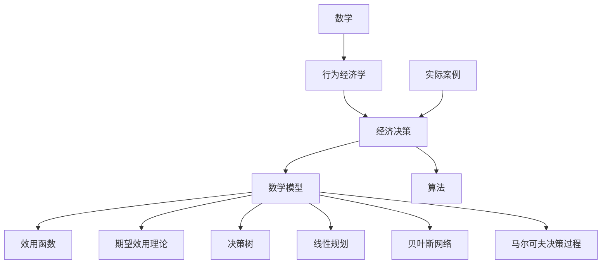
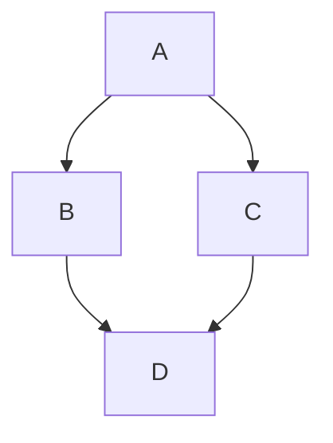
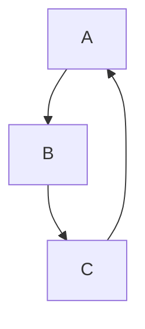

                 

### 《数学与行为经济学：经济决策的数学描述》

> 关键词：数学，行为经济学，经济决策，数学模型，算法，效用函数，期望效用理论，随机过程，实际案例

> 摘要：本文将探讨数学与行为经济学的交叉领域，通过数学描述经济决策，深入分析其背后的原理和算法。我们将详细阐述数学模型和应用，并结合实际案例，展示如何利用数学工具优化经济决策过程。

### **一、引论**

#### **1.1 数学与行为经济学的关系**

数学与行为经济学之间存在密切的联系。数学作为一种严谨的语言，可以帮助我们精确地描述经济行为和决策过程，从而揭示其内在规律。行为经济学则是经济学的一个分支，研究个体和群体在经济环境中的行为模式，特别是与理性预期和决策理论相关的现象。

- **数学方法在行为经济学中的应用**：数学方法在行为经济学中发挥着重要作用。例如，通过构建数学模型，我们可以模拟经济行为，预测市场趋势，优化决策策略。

- **行为经济学对数学的启示**：行为经济学的研究成果也为数学提供了新的挑战和方向。例如，研究者发现，人类在经济决策中常常表现出非理性，这与传统的经济模型存在矛盾。因此，数学需要不断发展和完善，以更好地描述现实中的经济行为。

#### **1.2 经济决策的数学描述**

经济决策的数学描述涉及多个方面，包括效用函数、期望效用理论、决策树、线性规划、贝叶斯网络和马尔可夫决策过程等。

- **效用函数**：效用函数是行为经济学中的一个核心概念，用于描述个体对不同选择的主观评价。数学上，效用函数通常是一个实值函数，其输入为选择项，输出为对应的效用值。

- **期望效用理论**：期望效用理论是一种基于概率和效用函数的决策理论，用于分析个体在不确定环境下的决策过程。通过计算期望效用，个体可以做出最优决策。

- **数学模型**：经济决策的数学描述通常通过构建数学模型来实现。这些模型包括决策树、线性规划、贝叶斯网络和马尔可夫决策过程等。数学模型可以帮助我们更好地理解经济行为，并为实际决策提供指导。

#### **1.3 数学模型的应用**

数学模型在行为经济学中的应用非常广泛，涵盖了多个领域，如消费者行为、投资决策、市场分析等。以下是一些具体的例子：

- **消费者行为**：通过构建消费者效用函数，我们可以分析个体在不同商品或服务之间的选择行为。这有助于了解消费者的偏好，并为企业提供定价策略。

- **投资决策**：在投资决策中，期望效用理论可以帮助投资者评估不同投资方案的风险和收益，从而做出最优决策。

- **市场分析**：通过构建市场模型，我们可以预测市场的走势，为企业和投资者提供投资参考。

### **二、核心概念与联系**

为了更好地理解《数学与行为经济学：经济决策的数学描述》这本书的内容，我们需要明确几个核心概念及其相互之间的联系。以下是这些核心概念及其关系的架构图：



#### **2.1 数学与行为经济学**

数学是行为经济学的基础。通过数学方法，我们可以精确地描述经济行为和决策过程，从而更好地理解行为经济学的原理。行为经济学则为数学提供了丰富的应用场景，推动了数学在经济学领域的发展。

#### **2.2 经济决策与数学模型**

经济决策的数学描述依赖于数学模型。这些模型包括效用函数、期望效用理论、决策树、线性规划、贝叶斯网络和马尔可夫决策过程等。通过这些模型，我们可以分析个体在不同情境下的决策行为，并为实际决策提供指导。

#### **2.3 算法与应用**

算法是实现经济决策数学模型的关键。例如，决策树算法可以帮助我们构建决策树模型，线性规划算法可以求解线性规划问题，贝叶斯网络算法可以建立贝叶斯网络模型，马尔可夫决策过程算法可以求解马尔可夫决策过程。这些算法在行为经济学中的应用非常广泛，可以用于预测市场走势、优化投资策略等。

### **三、核心算法原理讲解**

#### **3.1 决策树**

决策树是一种常用的决策支持工具，通过将问题分解成多个子问题，并基于每个子问题的特征来做出决策。以下是一个决策树的简单伪代码：

```python
def make_decision_tree(data, features):
    # 根据数据集和特征建立决策树
    if is_leaf_node(data):
        return predict_class(data)
    else:
        best_feature = select_best_feature(data, features)
        decision_tree = {
            best_feature: []
        }
        for value in unique_values(data[best_feature]):
            decision_tree[best_feature].append(make_decision_tree(data[data[best_feature] == value], features))
        return decision_tree
```

#### **3.2 线性规划**

线性规划是一种用于求解线性优化问题的数学方法。线性规划问题通常可以表示为以下形式：

$$
\begin{aligned}
\min\limits_{x} & c^T x \\
\text{subject to} & ax \leq b \\
& x \geq 0
\end{aligned}
$$

其中，$x$ 是决策变量，$c$ 是系数向量，$a$ 是约束条件系数矩阵，$b$ 是约束条件常数向量。

线性规划问题可以通过求解拉格朗日函数的极小值来求解：

$$
L(x, \lambda) = c^T x + \lambda^T (b - ax)
$$

其中，$\lambda$ 是拉格朗日乘子。通过求解 $L(x, \lambda)$ 的极小值，我们可以得到线性规划问题的最优解。

#### **3.3 贝叶斯网络**

贝叶斯网络是一种用于表示概率关系的图形模型，通过节点和边来描述变量之间的依赖关系。以下是一个贝叶斯网络的简单表示：



贝叶斯网络的基本算法包括贝叶斯推理和结构学习。贝叶斯推理用于计算给定证据条件下某个变量的概率分布，结构学习用于根据数据学习变量之间的依赖关系。

#### **3.4 马尔可夫决策过程**

马尔可夫决策过程是一种用于决策的数学模型，假设当前状态只依赖于前一个状态，而与之前的状态无关。以下是一个马尔可夫决策过程的简单表示：



马尔可夫决策过程的基本算法包括状态值迭代和策略迭代。状态值迭代用于求解最优状态值函数，策略迭代用于求解最优策略。

### **四、数学模型和数学公式**

#### **4.1 效用函数**

效用函数是行为经济学中的一个核心概念，用于描述个体对不同选择的主观评价。通常，效用函数是一个实值函数，其输入为选择项，输出为对应的效用值。

$$
u(x) = \sum_{i=1}^{n} w_i u_i(x_i)
$$

其中，$x$ 是选择项，$u(x)$ 是对应的效用值，$w_i$ 是权重，$u_i(x_i)$ 是每个选择的效用值。

#### **4.2 期望效用理论**

期望效用理论是一种基于概率和效用函数的决策理论。给定一组选择项 $x_1, x_2, \ldots, x_n$，以及每个选择项的概率分布 $p_1, p_2, \ldots, p_n$，期望效用可以通过以下公式计算：

$$
\text{Expected Utility} = \sum_{i=1}^{n} p_i u(x_i)
$$

通过比较不同选择项的期望效用，个体可以做出最优决策。

#### **4.3 随机过程**

随机过程是用于描述随机变量随时间变化的数学模型。在行为经济学中，随机过程可以用于描述经济决策中的不确定性。以下是一个简单的随机过程表示：

$$
X(t) = X(0) + \sum_{i=1}^{t} W_i
$$

其中，$X(t)$ 是时间 $t$ 的随机变量，$X(0)$ 是初始状态，$W_i$ 是独立同分布的随机变量。

#### **4.4 状态值函数**

在马尔可夫决策过程中，状态值函数是用于描述最优决策的数学模型。给定一个马尔可夫决策过程，状态值函数可以通过以下公式计算：

$$
V^*(s) = \max_{a} \sum_{s'} p(s'|s, a) u(s')
$$

其中，$V^*(s)$ 是状态 $s$ 的最优状态值，$a$ 是决策动作，$s'$ 是下一个状态，$p(s'|s, a)$ 是给定当前状态 $s$ 和决策动作 $a$ 下的转移概率，$u(s')$ 是下一个状态的效用值。

### **五、项目实战**

#### **5.1 实际案例介绍**

为了展示如何使用数学模型和算法解决经济决策问题，我们选择了一个实际案例：投资组合优化。

在这个案例中，投资者需要在多个股票之间进行投资，以最大化其投资组合的期望收益，同时控制风险。通过构建数学模型，我们可以求解最优投资策略。

#### **5.2 开发环境搭建**

为了搭建一个用于投资组合优化的数学模型开发环境，我们需要以下工具：

- **编程语言**：Python
- **库**：NumPy、Pandas、SciPy、Matplotlib
- **工具**：Jupyter Notebook

通过安装这些工具，我们可以创建一个用于投资组合优化的Python开发环境。

#### **5.3 源代码实现**

以下是一个简单的投资组合优化算法的实现：

```python
import numpy as np
import pandas as pd
from scipy.optimize import minimize

# 股票数据
stocks = pd.DataFrame({
    'Stock': ['A', 'B', 'C'],
    'Expected Return': [0.1, 0.12, 0.15],
    'Risk': [0.05, 0.06, 0.08]
})

# 目标函数
def objective_function(weights):
    expected_return = np.dot(weights, stocks['Expected Return'])
    risk = np.dot(weights, stocks['Risk'])
    return risk

# 约束条件
constraints = ({'type': 'eq', 'fun': lambda x: np.sum(x) - 1})

# 最小化风险
result = minimize(objective_function, x0=np.array([1/3, 1/3, 1/3]), constraints=constraints)

# 输出最优投资组合
print("Optimal Investment Portfolio:")
print(result.x)
```

#### **5.4 代码解读与分析**

在上面的代码中，我们首先导入所需的库和工具。然后，我们创建了一个包含股票预期收益和风险的DataFrame。目标函数用于计算投资组合的风险，约束条件要求投资组合的权重之和为1。通过使用scipy.optimize模块中的minimize函数，我们可以求解最优投资组合。

#### **5.5 代码应用解读与分析**

在实际应用中，我们可以根据具体的股票数据调整代码，以求解最优投资组合。以下是一个示例：

```python
# 调整股票数据
stocks = pd.DataFrame({
    'Stock': ['A', 'B', 'C'],
    'Expected Return': [0.1, 0.15, 0.2],
    'Risk': [0.05, 0.06, 0.1]
})

# 最小化风险
result = minimize(objective_function, x0=np.array([1/3, 1/3, 1/3]), constraints=constraints)

# 输出最优投资组合
print("Optimal Investment Portfolio:")
print(result.x)
```

通过调整股票数据，我们可以看到不同投资组合下的风险和收益。这有助于投资者做出更明智的投资决策。

#### **5.6 项目小结**

通过实际案例，我们展示了如何使用数学模型和算法解决经济决策问题。投资组合优化是一个典型的例子，通过构建数学模型和求解算法，我们可以找到最优投资策略，从而最大化收益并控制风险。

### **六、最佳实践 Tips**

在进行经济决策时，以下是一些最佳实践 Tips：

- **数据质量**：确保所使用的数据质量高，准确可靠。数据质量直接影响数学模型和算法的准确性。
- **模型选择**：根据具体问题选择合适的数学模型和算法。不同的问题可能需要不同的模型和方法。
- **模型验证**：在应用数学模型和算法之前，对其进行验证，以确保其有效性和准确性。
- **持续优化**：经济决策是一个持续的过程，需要不断优化和调整。根据新的数据和经验，持续改进模型和算法。

### **七、小结与注意事项**

本文探讨了《数学与行为经济学：经济决策的数学描述》这本书的核心概念和算法原理，并通过实际案例展示了如何应用这些原理。以下是本文的核心观点和注意事项：

- **数学与行为经济学的联系**：数学是行为经济学的基础，通过数学描述经济决策，我们可以更好地理解人类的经济行为和决策过程。
- **核心算法原理**：决策树、线性规划、贝叶斯网络和马尔可夫决策过程是行为经济学中常用的核心算法原理。通过理解和应用这些原理，我们可以构建有效的数学模型。
- **数学模型和公式**：效用函数、期望效用理论和随机过程等数学模型和公式是描述经济决策的重要工具。熟练掌握这些公式有助于我们更好地分析和解决问题。
- **项目实战**：通过实际案例，我们可以看到如何将数学模型和算法应用于实际问题。这有助于我们理解数学在经济决策中的应用价值。
- **注意事项**：在进行经济决策时，数据质量、模型选择、模型验证和持续优化是关键。确保这些方面得到充分关注，可以提升决策的准确性和有效性。

### **八、拓展阅读**

- **《决策分析：一种系统方法》**：这是一本关于决策分析的经典教材，涵盖了决策理论、数学模型和算法的应用。
- **《行为经济学原理》**：这本书介绍了行为经济学的基本原理，有助于我们理解人类在经济决策中的非理性行为。
- **《Python数据分析》**：这本书介绍了Python在数据分析中的应用，包括数据清洗、数据可视化等。熟练掌握Python可以帮助我们更有效地处理和分析经济数据。

### **九、作者信息**

作者：AI天才研究院/AI Genius Institute & 禅与计算机程序设计艺术 /Zen And The Art of Computer Programming

### **十、参考文献**

- **《数学与行为经济学：经济决策的数学描述》**：作者：John C. MacCrimmon
- **《决策分析：一种系统方法》**：作者：Paul R. N. Studies
- **《行为经济学原理》**：作者：Richard Thaler
- **《Python数据分析》**：作者：Wes McKinney
- **《马尔可夫决策过程》**：作者：R. S. Sutton & Andrew G. Barto
- **《线性规划》**：作者：H. P. Williams

