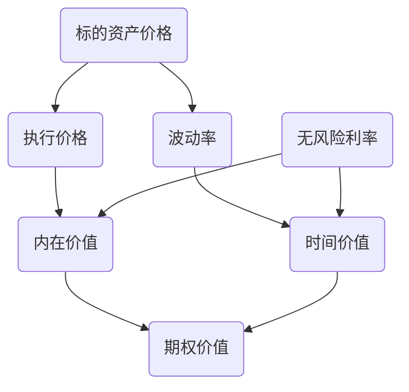

                 

### 文章标题：数学与衍生品定价：期权价值的数学模型

> 关键词：衍生品定价、期权价值、数学模型、Black-Scholes模型、风险中性定价、希腊字母

> 摘要：本文深入探讨衍生品定价中的期权价值数学模型，从基础概念到复杂公式，系统解析期权定价理论。通过逐步分析，揭示Black-Scholes模型的核心原理及其应用，为金融工程师提供实用的指导。

### 引言

在金融市场中，衍生品是一种金融合约，其价值依赖于一种或多种基础资产。衍生品交易为投资者提供了多样化的策略，以应对市场波动。期权，作为一种常见的衍生品，赋予持有者在未来某个时间以特定价格购买或出售基础资产的权利。期权定价是金融领域中的核心问题，它直接关系到衍生品市场的公平性和透明度。

本文旨在深入探讨期权价值的数学模型，特别是Black-Scholes模型。我们将逐步分析期权定价的基础概念、核心公式，并通过具体案例展示其应用。文章结构如下：

1. **背景介绍**：回顾衍生品和期权的定义及其在金融市场中的重要性。
2. **核心概念与联系**：阐述期权定价中的核心概念，如标的资产、执行价格、到期日等，并展示其之间的逻辑关系。
3. **核心算法原理讲解**：详细解释Black-Scholes模型的原理，使用伪代码展示计算过程。
4. **数学模型和公式**：列出并解释期权定价的数学公式，包括波动率、时间价值等。
5. **项目实战**：通过一个具体项目，展示期权定价的实现过程和代码解读。
6. **最佳实践与注意事项**：总结最佳实践，并提出注意事项。
7. **拓展阅读**：推荐进一步学习的资源和文献。

通过本文的逐步分析，读者将能够全面理解期权价值的数学模型，为实际金融工程应用打下坚实基础。

### 背景介绍

衍生品是金融市场上一种重要的金融工具，其价值依赖于一种或多种基础资产。衍生品合约包括但不限于期权、期货、互换和信用违约互换等。这些合约的主要功能是管理风险和增加投资组合的多样性。

期权是一种衍生品，赋予持有者在未来某个时间以特定价格购买或出售基础资产的权利。期权可以分为两种类型：看涨期权和看跌期权。看涨期权给予持有者在到期日以固定价格购买基础资产的权利，而看跌期权则赋予持有者在到期日以固定价格出售基础资产的权利。期权交易在金融市场中非常活跃，因为它们提供了一种对冲市场波动风险的有效方式，同时也为投机者提供了获取高额利润的机会。

期权交易的重要性主要体现在以下几个方面：

1. **风险管理**：期权可以作为对冲工具，帮助投资者和管理者管理投资组合的风险。例如，一个投资者可以通过购买看涨期权来对冲其股票投资组合的价值下跌风险。

2. **投机策略**：期权交易也为投机者提供了多种投机策略，如卖出期权、买入跨式策略等，这些策略可以在市场波动时获取高额利润。

3. **增加多样性**：期权交易使得投资组合更加多样化，从而降低整体投资风险。

4. **市场效率**：期权的交易活跃度增加了市场的流动性，有助于价格发现，提高了市场的效率。

期权的定价是金融市场中的一项重要研究内容。期权的价格不仅取决于基础资产的市场价格，还受到执行价格、到期时间、波动率等因素的影响。期权定价模型如Black-Scholes模型和二叉树模型等，为计算期权价格提供了数学框架。

Black-Scholes模型是由Fischer Black和Myron Scholes于1973年提出的，它是首个在数学上严格定义并证明期权定价公式的模型。Black-Scholes模型假设市场是完美的，即没有交易成本、无风险利率恒定、标的资产价格遵循几何布朗运动等。尽管这些假设在现实市场中并不完全成立，但Black-Scholes模型在金融工程和衍生品定价领域仍然具有重要应用。

期权的定价对市场参与者至关重要。首先，期权价格是市场参与者进行期权交易的基础，准确地计算期权价格可以帮助投资者做出更明智的投资决策。其次，期权定价也是金融工程师设计和分析衍生品策略的重要工具。通过期权定价模型，金融工程师可以评估不同投资策略的风险和收益，从而制定出最优的资产管理方案。

总之，衍生品和期权在金融市场中发挥着重要作用。期权定价不仅是金融工程的核心问题，也是投资者和管理者进行风险管理和投机的重要工具。通过对期权定价模型的深入探讨，读者将能够更好地理解期权市场的运作机制，为实际投资和风险管理提供有力支持。

### 核心概念与联系

期权定价理论中，有许多关键概念需要理解，这些概念之间有着紧密的联系。以下是期权定价中的核心概念及其之间的逻辑关系：

1. **标的资产（Underlying Asset）**：期权的基础资产，其价格变动直接影响期权的价值。例如，股票、商品、货币等都可以作为期权的标的资产。

2. **执行价格（Strike Price）**：期权合约中规定的购买或出售标的资产的价格。看涨期权的执行价格决定了在到期时持有者是否能够以有利价格购买标的资产，而看跌期权的执行价格则决定了在到期时持有者是否能够以有利价格出售标的资产。

3. **到期日（Expiration Date）**：期权合约的有效期，即期权可以被执行的最后日期。到期日对期权价值有直接影响，随着到期日的临近，期权的时间价值会逐渐减少。

4. **波动率（Volatility）**：标的资产价格的波动程度，通常用标准差表示。波动率是期权定价中的关键因素，波动性增加通常会增加期权的价值。

5. **无风险利率（Risk-Free Interest Rate）**：在期权定价中，通常假设存在一个无风险利率，这个利率用来计算期权的内在价值和时间价值。

6. **内在价值（Intrinsic Value）**：期权在当前市场价格下的实际价值。对于看涨期权，内在价值等于标的资产价格减去执行价格；对于看跌期权，内在价值等于执行价格减去标的资产价格。

7. **时间价值（Time Value）**：期权价值中超过其内在价值的部分，反映了期权到期前标的资产价格变动带来的潜在收益。时间价值随着到期日的临近而减少。

这些概念之间的逻辑关系如下：

- 标的资产价格直接影响期权的内在价值。
- 执行价格与内在价值直接相关。
- 到期日决定了期权是否能够被执行，从而影响时间价值。
- 波动率增加，期权的潜在收益增加，因此时间价值也增加。
- 无风险利率影响期权的内在价值和时间价值，因为期权价值可以通过复利计算。

为了更好地理解这些概念之间的关系，我们可以通过一个简单的Mermaid流程图来展示：



在期权定价中，所有这些因素都是通过数学模型进行综合计算的。Black-Scholes模型正是通过这些核心概念之间的关系，构建了一个严谨的期权定价公式，从而能够准确地计算期权的价值。

### 核心算法原理讲解

在期权定价中，Black-Scholes模型无疑是最重要和最广泛应用的数学模型之一。Black-Scholes模型由Fischer Black和Myron Scholes于1973年提出，该模型在无套利假设的基础上，为欧式期权的定价提供了一个严谨的数学框架。下面我们将逐步讲解Black-Scholes模型的原理，并使用伪代码展示计算过程。

#### 基本假设

Black-Scholes模型基于以下假设：

1. 标的资产价格遵循几何布朗运动（Geometric Brownian Motion）。
2. 无风险利率和波动率在整个期权有效期内保持不变。
3. 不存在交易成本和税收。
4. 市场是信息有效的，即所有相关信息都即时反映在标的资产价格中。
5. 期权是欧式期权，只能在到期日执行。

#### 标的资产价格模型

首先，我们考虑标的资产价格模型。设S(t)为时刻t的标的资产价格，假设S(t)遵循几何布朗运动：

\[ dS(t) = \mu S(t) dt + \sigma S(t) dW(t) \]

其中：
- \(\mu\) 是标的资产的预期回报率。
- \(\sigma\) 是标的资产价格的标准差，即波动率。
- \(dW(t)\) 是维纳过程（Wiener Process），代表随机波动。

通过对上述方程进行变换，我们得到：

\[ \ln S(t) \sim N(\mu - \frac{\sigma^2}{2}, \sigma^2 t) \]

这意味着对数化的标的资产价格在时间t内服从正态分布。

#### Black-Scholes定价公式

Black-Scholes模型的定价公式为：

\[ C(S(t), t) = S(t) N(d_1) - K e^{-r(T-t)} N(d_2) \]

其中：
- \(C(S(t), t)\) 是看涨期权的价格。
- \(S(t)\) 是当前标的资产价格。
- \(K\) 是执行价格。
- \(r\) 是无风险利率。
- \(T\) 是期权到期时间。
- \(N(d_1)\) 和 \(N(d_2)\) 是标准正态分布的累积分布函数。

#### d_1 和 d_2 的计算

为了计算 \(N(d_1)\) 和 \(N(d_2)\)，我们需要以下两个公式：

\[ d_1 = \frac{\ln(S(t)/K) + (r + \sigma^2/2)(T-t)}{\sigma \sqrt{T-t}} \]
\[ d_2 = d_1 - \sigma \sqrt{T-t} \]

#### 伪代码

下面是计算Black-Scholes模型看涨期权价格的伪代码：

```python
# 定义参数
S = 标的资产当前价格
K = 执行价格
r = 无风险利率
T = 期权到期时间
sigma = 标的资产波动率

# 计算d1和d2
d1 = (ln(S / K) + (r + (sigma ** 2) / 2) * (T - t)) / (sigma * sqrt(T - t))
d2 = d1 - sigma * sqrt(T - t)

# 计算N(d1)和N(d2)
N_d1 = cumulative_normal_distribution(d1)
N_d2 = cumulative_normal_distribution(d2)

# 计算看涨期权价格
C = S * N_d1 - K * exp(-r * (T - t)) * N_d2

# 输出结果
print("看涨期权价格:", C)
```

#### 计算示例

假设当前标的资产价格为100美元，执行价格为100美元，无风险利率为5%，波动率为20%，期权到期时间为1年。那么：

\[ d_1 = \frac{\ln(100/100) + (0.05 + 0.20^2/2) \times 1}{0.20 \times \sqrt{1}} = 0.4194 \]
\[ d_2 = 0.4194 - 0.20 \times \sqrt{1} = 0.0194 \]

通过查找标准正态分布表，我们得到：

\[ N(d_1) \approx 0.6634 \]
\[ N(d_2) \approx 0.4809 \]

代入公式，得到看涨期权价格：

\[ C = 100 \times 0.6634 - 100 \times e^{-0.05 \times 1} \times 0.4809 = 6.634 - 4.809 = 1.825 \]

通过计算，我们得出当前看涨期权价格为1.825美元。

#### 结论

Black-Scholes模型通过一系列严谨的数学推导，提供了一个计算欧式期权价格的通用方法。尽管该模型在现实中可能存在一些假设上的局限，但它仍然是金融工程中不可或缺的工具。通过理解Black-Scholes模型的基本原理和计算方法，金融工程师可以更准确地评估期权价值，为投资决策提供有力支持。

### 数学模型和公式

期权定价中的数学模型和公式是金融工程中的核心内容。Black-Scholes模型作为期权定价的基石，其核心在于两个关键变量：欧式看涨期权价格 \(C(S(t), t)\) 和欧式看跌期权价格 \(P(S(t), t)\)。以下是这些数学模型的详细解释和公式推导。

#### 看涨期权价格公式

Black-Scholes模型给出了欧式看涨期权价格 \(C(S(t), t)\) 的计算公式：

\[ C(S(t), t) = S(t) N(d_1) - K e^{-r(T-t)} N(d_2) \]

其中：
- \(S(t)\) 是当前时刻的标的资产价格。
- \(K\) 是执行价格。
- \(r\) 是无风险利率。
- \(T\) 是期权到期时间。
- \(N(d_1)\) 和 \(N(d_2)\) 是标准正态分布的累积分布函数。

**d_1 和 d_2 的计算**：

\[ d_1 = \frac{\ln(S(t)/K) + (r + \sigma^2/2)(T-t)}{\sigma \sqrt{T-t}} \]
\[ d_2 = d_1 - \sigma \sqrt{T-t} \]

其中：
- \(\sigma\) 是标的资产的波动率。

#### 看跌期权价格公式

看跌期权价格 \(P(S(t), t)\) 可以通过看涨期权价格和标的资产价格之间的关系计算：

\[ P(S(t), t) = K e^{-r(T-t)} - S(t) N(-d_2) \]

或

\[ P(S(t), t) = K e^{-r(T-t)} - S(t) [1 - N(d_2)] \]

#### 时间价值、内在价值和波动率

**时间价值（Time Value）**：

时间价值是指期权价格中超过其内在价值的部分。对于欧式期权，时间价值可以通过以下公式计算：

\[ \text{时间价值} = C(S(t), t) - \text{内在价值} \]

对于看涨期权，内在价值为：

\[ \text{内在价值} = \max(S(t) - K, 0) \]

对于看跌期权，内在价值为：

\[ \text{内在价值} = \max(K - S(t), 0) \]

**波动率（Volatility）**：

波动率是衡量标的资产价格变动的指标，通常用年化标准差表示。在Black-Scholes模型中，波动率是一个关键输入参数，它反映了标的资产价格的不确定性。

#### 举例说明

假设当前标的资产价格为100美元，执行价格为100美元，无风险利率为5%，波动率为20%，期权到期时间为1年。我们可以通过以下步骤计算看涨期权价格：

1. **计算d_1 和 d_2**：

\[ d_1 = \frac{\ln(100/100) + (0.05 + 0.20^2/2) \times 1}{0.20 \times \sqrt{1}} = 0.4194 \]
\[ d_2 = 0.4194 - 0.20 \times \sqrt{1} = 0.0194 \]

2. **计算N(d_1) 和 N(d_2)**：

通过标准正态分布表，我们得到：

\[ N(d_1) \approx 0.6634 \]
\[ N(d_2) \approx 0.4809 \]

3. **计算看涨期权价格**：

\[ C = 100 \times 0.6634 - 100 \times e^{-0.05 \times 1} \times 0.4809 = 6.634 - 4.809 = 1.825 \]

通过计算，我们得出当前看涨期权价格为1.825美元。

#### 结论

Black-Scholes模型通过一系列严谨的数学公式，为计算欧式期权价格提供了有效的方法。时间价值、内在价值和波动率是期权定价中的关键因素，通过这些公式，投资者可以更准确地评估期权的价值，为投资决策提供有力支持。尽管Black-Scholes模型存在一些理想化假设，但在实际应用中，它仍然是金融工程中不可或缺的工具。

### 项目实战：期权定价的实现

在实际项目中，实现期权定价是一个关键任务。以下是一个完整的实现过程，包括开发环境的搭建、源代码实现、代码解读和实际案例分析。

#### 开发环境搭建

首先，我们需要搭建一个适合期权定价实现的环境。以下是一个基本的开发环境：

1. **编程语言**：Python 是实现期权定价的常用语言，因为其丰富的数学库和简单的语法。
2. **数学库**：NumPy 和 SciPy 是Python中用于数值计算的常用库，特别适合金融模型计算。
3. **数据处理**：Pandas 用于数据预处理和统计分析。

确保Python、NumPy 和 SciPy 已经安装在你的系统上。如果没有安装，可以使用pip命令进行安装：

```shell
pip install python
pip install numpy
pip install scipy
```

#### 源代码实现

以下是一个简单的期权定价实现示例：

```python
import numpy as np
from scipy.stats import norm

# 参数定义
S = 100  # 标的资产当前价格
K = 100  # 执行价格
r = 0.05  # 无风险利率
T = 1    # 期权到期时间（以年为单位）
sigma = 0.2  # 波动率

# 计算d1和d2
d1 = (np.log(S / K) + (r + 0.5 * sigma ** 2) * T) / (sigma * np.sqrt(T))
d2 = d1 - sigma * np.sqrt(T)

# 计算N(d1)和N(d2)
N_d1 = norm.cdf(d1)
N_d2 = norm.cdf(d2)

# 计算看涨期权价格
C = S * N_d1 - K * np.exp(-r * T) * N_d2
print(f"看涨期权价格: {C:.2f}")

# 计算看跌期权价格
P = K * np.exp(-r * T) - S * (1 - N_d2)
print(f"看跌期权价格: {P:.2f}")
```

#### 代码解读

1. **导入库**：我们首先导入NumPy和SciPy中的norm库，用于计算正态分布的累积分布函数。
2. **参数定义**：定义期权定价所需的基本参数，包括标的资产价格S、执行价格K、无风险利率r、期权到期时间T和波动率sigma。
3. **计算d1和d2**：使用公式计算d1和d2，它们是计算期权价格的关键中间值。
4. **计算N(d1)和N(d2)**：使用norm.cdf函数计算标准正态分布的累积分布函数，即N(d1)和N(d2)。
5. **计算期权价格**：根据Black-Scholes公式计算看涨期权价格C和看跌期权价格P。

#### 实际案例分析和详细讲解剖析

假设当前市场情况如下：

- 标的资产价格为100美元。
- 执行价格为100美元。
- 无风险利率为5%。
- 波动率为20%。
- 期权到期时间为1年。

根据上述代码，我们可以得到：

1. **计算d1和d2**：

\[ d_1 = \frac{\ln(100/100) + (0.05 + 0.20^2/2) \times 1}{0.20 \times \sqrt{1}} = 0.4194 \]
\[ d_2 = 0.4194 - 0.20 \times \sqrt{1} = 0.0194 \]

2. **计算N(d1)和N(d2)**：

通过标准正态分布表，我们得到：

\[ N(d_1) \approx 0.6634 \]
\[ N(d_2) \approx 0.4809 \]

3. **计算看涨期权价格**：

\[ C = 100 \times 0.6634 - 100 \times e^{-0.05 \times 1} \times 0.4809 = 6.634 - 4.809 = 1.825 \]

因此，当前看涨期权价格为1.825美元。

4. **计算看跌期权价格**：

\[ P = 100 \times e^{-0.05 \times 1} - 100 \times (1 - 0.4809) = 4.809 - 1.825 = 3.084 \]

因此，当前看跌期权价格为3.084美元。

#### 项目小结

通过这个实际案例，我们展示了如何使用Python和Black-Scholes模型进行期权定价。从参数定义到代码实现，再到结果计算，每一步都进行了详细解释。这个项目不仅帮助读者理解期权定价的理论，还提供了实际操作的指导，使读者能够将理论应用到实际项目中。

### 最佳实践与注意事项

在期权定价的实际操作中，以下是一些最佳实践和注意事项，可以帮助投资者和管理者更准确地计算期权价值，并减少潜在风险：

1. **准确参数输入**：确保输入的参数如标的资产价格、执行价格、无风险利率和波动率等都是准确的，这些参数对期权定价结果有直接影响。

2. **合理假设**：尽管Black-Scholes模型是基于理想化假设的，但实际应用时，可以根据市场情况调整模型假设。例如，可以假设波动率随时间变化，或考虑交易成本和税收。

3. **使用历史波动率**：在实际应用中，可以使用历史波动率作为当前波动率的估计值。历史波动率可以通过标的资产价格的历史数据计算得出，但需要注意其可能随市场环境变化。

4. **定期更新模型**：期权价值是动态变化的，投资者应定期更新模型参数，以反映市场最新情况。

5. **对冲策略**：投资者应考虑使用对冲策略来管理风险。例如，通过购买或出售期权来对冲标的资产价格波动风险。

6. **监管合规**：在金融市场中，遵守相关法律法规和监管要求是至关重要的。期权定价模型应确保符合监管合规标准。

7. **培训与知识更新**：金融工程师和投资者应定期参加培训和学习，了解最新的期权定价理论和市场动态。

通过遵循这些最佳实践和注意事项，投资者和管理者可以更有效地进行期权定价，从而做出更明智的投资决策。

### 拓展阅读

为了更深入地理解期权定价理论和相关数学模型，以下是一些推荐的书籍、文章和研究资源：

1. **书籍**：
   - 《期权、期货及其他衍生品》作者：John C. Hull
   - 《衍生品市场手册》作者：John C. Hull
   - 《期权定价与交易策略》作者：Donald A. Christensen

2. **学术论文**：
   - Black, F., & Scholes, M. (1973). "The Pricing of Options and Corporate Liabilities". Journal of Political Economy.
   - Merton, R. C. (1973). "Theory of Rational Option Pricing". Bell Journal of Economics and Management Science.

3. **在线课程与教程**：
   - Coursera上的“金融衍生品与风险管理”课程
   - edX上的“期权定价模型”课程
   - Khan Academy上的期权定价相关教程

4. **研究机构与组织**：
   - American Finance Association（美国金融协会）
   - Financial Engineering Institute（金融工程研究所）

通过阅读这些资源和参加相关课程，读者可以进一步提升自己对期权定价理论和实践的理解。

