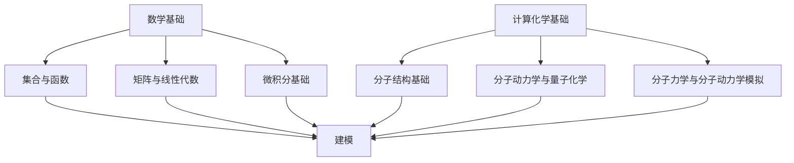
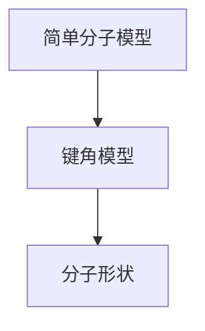
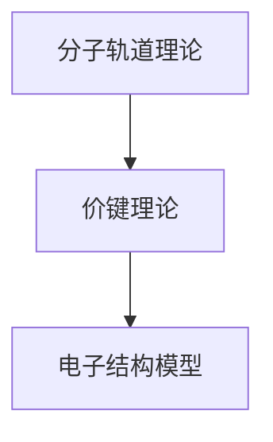
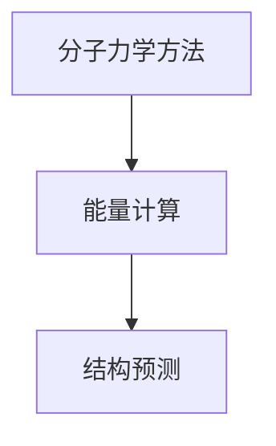
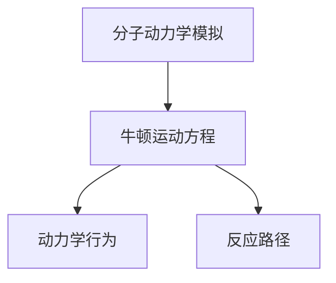
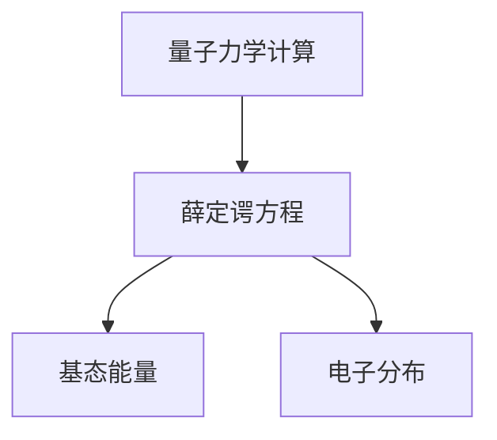

                 

### 引言

#### 书籍背景与目的

《数学与计算化学：分子结构的数学预测》旨在探讨数学在计算化学中的应用，特别是如何利用数学模型和方法进行分子结构的预测。随着计算机科学和数学的发展，计算化学已经成为化学领域中一个重要的分支。它通过计算机模拟和数学模型，为化学实验提供了强有力的辅助和预测工具。本书旨在帮助读者深入理解数学在计算化学中的关键作用，并掌握分子结构预测的方法。

#### 计算化学的重要性

计算化学在化学、材料科学、生物医学等领域具有广泛的应用。通过计算化学，科学家可以模拟和预测分子的结构、性质和反应，从而加速新药物、新材料和新技术的研究与开发。例如，在药物分子设计中，计算化学可以帮助科学家优化分子结构，提高药物的疗效和安全性。此外，计算化学在材料科学中的应用也非常广泛，如新型电池材料的研发、纳米材料的合成与性质预测等。

#### 数学在计算化学中的应用

数学在计算化学中的应用主要表现在以下几个方面：

1. **建模**：通过建立数学模型，可以将复杂的化学现象转化为可计算的数学问题。
2. **算法**：数学算法为计算化学提供了有效的计算方法，如分子动力学模拟、量子化学计算等。
3. **数据分析**：数学工具如统计学和机器学习在化学数据分析中发挥着重要作用，如分子性质预测、化学反应路径分析等。

#### 本书结构

本书共分为七个部分，结构如下：

1. **引言**：介绍书籍的背景、目的和计算化学的重要性，以及数学在计算化学中的应用。
2. **数学与计算化学基础**：介绍数学基础和计算化学的基本概念。
3. **分子结构与数学模型**：讨论分子结构的数学描述和建模方法。
4. **分子结构的数学预测方法**：介绍分子结构预测的方法和算法。
5. **实例分析**：通过实例分析展示分子结构预测的实际应用。
6. **计算化学软件与应用**：介绍常用的计算化学软件和实际应用案例。
7. **总结与展望**：总结本书的主要内容，展望计算化学和数学预测的发展趋势。

通过本书的学习，读者可以系统地了解数学与计算化学的关系，掌握分子结构预测的方法，并能够应用于实际问题中。

### 数学与计算化学基础

#### 数学基础

数学是计算化学的核心工具，了解基本的数学概念和工具对于理解和应用计算化学至关重要。以下将介绍几个核心的数学基础概念，包括集合与函数、矩阵与线性代数、微积分基础。

##### 集合与函数

集合是数学中的基本概念，用于描述一组元素。集合可以用大括号 `{}` 表示，例如，集合 A = {1, 2, 3} 包含三个元素 1, 2 和 3。函数是两个集合之间的一种特殊关系，将一个集合（称为定义域）中的每个元素映射到另一个集合（称为值域）中的唯一元素。函数通常表示为 f(x)，其中 x 是自变量，f(x) 是因变量。

##### 矩阵与线性代数

矩阵是二维数组，用于表示线性方程组和线性变换。矩阵的基本运算包括加法、减法、乘法（包括数乘和矩阵乘法）。线性代数涉及矩阵的行列式、逆矩阵、特征值和特征向量等概念，这些概念在计算化学中用于描述分子结构和计算分子能量。

##### 微积分基础

微积分是研究函数变化率和累积过程的数学分支。微分是研究函数在某一点的变化率，导数是微分的精确度量。积分则是研究函数在某区间上的累积量，积分分为定积分和不定积分。微积分在计算化学中用于计算分子能量、反应路径和动力学过程。

#### 计算化学基础

计算化学是应用数学、物理学和计算机科学的方法来研究分子的结构、性质和反应。以下介绍几个核心概念：

##### 分子结构基础

分子结构是指分子中原子之间的空间排列和连接方式。分子结构可以用几何模型和电子结构模型来描述。几何模型描述原子间的距离和角度，而电子结构模型描述电子在分子中的分布。

##### 分子动力学与量子化学

分子动力学是一种计算方法，通过求解牛顿运动方程，模拟分子在力场中的运动。量子化学则基于量子力学原理，计算分子的电子结构和能量。量子化学包括分子力学和量子力学计算，如 Hartree-Fock 方法和密度泛函理论。

##### 分子力学与分子动力学模拟

分子力学是一种简化的量子化学方法，通过描述原子间的相互作用力，计算分子的能量和结构。分子动力学模拟则通过分子力学模型，模拟分子在力场中的动态行为，以研究分子的动力学过程和反应路径。

#### 基础概念之间的关系架构

为了更好地理解数学与计算化学之间的关系，我们可以使用 Mermaid 流程图来展示这些核心概念之间的联系：



通过上述流程图，我们可以清晰地看到数学基础、计算化学基础以及分子结构与数学模型之间的关联。数学基础为计算化学提供了工具和概念框架，而计算化学基础和分子结构与数学模型则将这些工具和概念应用于实际化学问题的研究。

#### 结论

数学与计算化学的结合，为化学研究提供了一种全新的视角和工具。通过数学建模和计算方法，科学家可以更加精确地预测分子的结构、性质和反应，从而推动化学及其相关领域的发展。在接下来的章节中，我们将进一步探讨分子结构的数学描述和预测方法，深入理解计算化学的核心内容。

### 分子结构与数学模型

#### 分子结构的数学描述

分子结构的数学描述是计算化学中的核心问题。它涉及到如何用数学方法精确地描述分子的几何形态和电子分布。为了实现这一目标，科学家们发展了多种数学模型，包括几何模型、电子结构模型和量子力学模型。

##### 几何模型

几何模型是描述分子结构的初步阶段，它通过几何形状来描述分子中原子的排列和键角。常用的几何模型包括简单分子模型和键角模型。简单分子模型通过原子之间的距离和角度来描述分子的几何形态，而键角模型则更详细地考虑了分子中各键的角度关系。



##### 电子结构模型

电子结构模型则进一步描述了分子中电子的分布。在量子化学中，电子结构模型基于量子力学的原理，通过解薛定谔方程来计算分子的电子分布。常见的电子结构模型包括分子轨道理论（Molecular Orbital Theory, MOT）和价键理论（Valence Bond Theory, VBT）。

- **分子轨道理论**：分子轨道理论将分子的电子结构看作是原子轨道的线性组合，通过求解分子轨道方程来计算分子轨道能级和电子分布。

```latex
$$\Psi(\mathbf{r}) = \sum_{i} c_i \phi_i(\mathbf{r})$$
```

- **价键理论**：价键理论则通过描述分子中原子轨道重叠形成的键来解释分子的稳定性。



##### 量子力学模型

量子力学模型是描述分子结构最精确的方法。它通过解薛定谔方程，计算分子的基态能量和电子分布。量子力学模型包括自洽场方法（如Hartree-Fock方法）和密度泛函理论（DFT）。

- **自洽场方法**：Hartree-Fock方法通过解自洽场方程，计算分子的基态电子密度和能量。

```latex
$$\hat{H} \rho(\mathbf{r}) = \epsilon(\mathbf{r}) \rho(\mathbf{r})$$
$$\hat{F}(\mathbf{r}) = \hat{H} \rho(\mathbf{r}) - \epsilon(\mathbf{r}) \rho(\mathbf{r})$$
$$\rho(\mathbf{r}) = \sum_{i} \psi_i^*(\mathbf{r}) \psi_i(\mathbf{r})$$
```

- **密度泛函理论**：DFT通过计算系统的总能量密度函数，来预测分子结构和性质。

```latex
$$E[\rho] = \int d^3r \, \rho(\mathbf{r}) \varepsilon[\rho]$$
$$\varepsilon[\rho] = \frac{\hbar^2}{2m} \left( -\frac{1}{\rho} \nabla^2 - \frac{1}{2}\rho \nabla^2 \right) + V_{\text{ext}}[\rho] + V_{\text{XC}}[\rho]$$
```

#### 分子结构的数学描述与预测方法的关系

分子结构的数学描述与预测方法密切相关。数学描述提供了理论基础，而预测方法则将这些理论应用于实际分子结构的预测。常用的预测方法包括分子力学方法、分子动力学模拟和量子力学计算。

- **分子力学方法**：分子力学方法是一种简化的量子力学方法，通过描述原子间的相互作用力，计算分子的能量和结构。分子力学方法适用于粗略的分子结构预测，其计算速度较快，但精度较低。



- **分子动力学模拟**：分子动力学模拟通过求解牛顿运动方程，模拟分子在力场中的运动，以研究分子的动力学行为和反应路径。分子动力学模拟适用于长程时间的分子动态过程，其精度较高，但计算成本也较大。



- **量子力学计算**：量子力学计算通过解薛定谔方程，计算分子的基态能量和电子分布。量子力学计算适用于精确的分子结构预测，但其计算成本非常高，特别是对于复杂分子系统。



#### 结论

分子结构的数学描述为计算化学提供了理论基础，而多种预测方法则将这些理论应用于实际分子结构的预测。不同的数学模型和方法适用于不同的预测需求，从粗略的分子力学预测到高精度的量子力学计算。通过合理的数学描述和预测方法，科学家可以更深入地理解分子的结构和性质，从而推动化学及其相关领域的发展。

### 分子结构的数学预测方法

#### 分子几何预测

分子几何预测是分子结构预测的基础，它涉及计算分子中原子的位置和键角。分子几何预测主要通过分子力学方法实现，这是一种基于经验势函数的简化模型。

##### 经验势函数模型

经验势函数模型通过描述原子间相互作用力的势能来预测分子几何。常用的经验势函数包括Lennard-Jones势、Madelung势和Tersoff势等。

- **Lennard-Jones势**：Lennard-Jones势是一种描述原子间范德瓦尔斯力的经验势函数，其形式如下：

```latex
$$U(r) = 4\epsilon \left[ \left( \frac{\sigma}{r} \right)^{12} - \left( \frac{\sigma}{r} \right)^{6} \right]$$
```

其中，\( r \) 是原子间的距离，\( \epsilon \) 和 \( \sigma \) 是经验参数。

- **Madelung势**：Madelung势用于描述离子晶体中的相互作用力，其形式如下：

```latex
$$U(r) = -\frac{1}{r} + \frac{1}{r^2}$$
```

- **Tersoff势**：Tersoff势用于描述共价键的相互作用力，其形式如下：

```latex
$$U(r) = \sum_{i<j} A_{ij} \left[ \exp\left(-\alpha_{ij} r \right) - \exp\left(-\beta_{ij} r \right) \right]$$
```

##### 分子几何预测步骤

分子几何预测的基本步骤如下：

1. **初始结构**：从实验数据或理论计算中获取分子的初始结构。
2. **能量计算**：使用经验势函数计算分子中每个原子对之间的相互作用能量。
3. **能量优化**：通过迭代优化算法（如梯度下降法、牛顿-拉夫逊法）寻找能量最小化的分子结构。
4. **结果分析**：分析优化后的分子结构，评估预测的准确性。

#### 分子电子结构预测

分子电子结构预测旨在计算分子中电子的分布和能级。量子力学方法为分子电子结构预测提供了理论基础，常用的方法包括Hartree-Fock方法和密度泛函理论（DFT）。

##### Hartree-Fock方法

Hartree-Fock方法是一种自洽场方法，其基本思想是将多电子体系的电子分布近似为单个电子在平均场中的运动。Hartree-Fock方法通过求解Roothaan-Hall方程来计算分子的基态能量和电子分布。

- **Roothaan-Hall方程**：

```latex
$$\left( \hat{H}_{\text{eff}} - \epsilon_i \right) \phi_i = \sum_{j \neq i} \langle \phi_i | \hat{F} | \phi_j \rangle \phi_j$$

$$\hat{F} = \hat{H} - \frac{1}{2} \sum_{i<j} \langle \phi_i | \hat{V}_{\text{eff}} | \phi_j \rangle$$

$$\hat{H}_{\text{eff}} = \hat{T} + \hat{V}_{\text{ext}} + \frac{1}{2} \hat{V}_{\text{ee}}$$
```

其中，\( \hat{T} \) 是动能算符，\( \hat{V}_{\text{ext}} \) 是外部势场，\( \hat{V}_{\text{ee}} \) 是电子间相互作用势。

##### 密度泛函理论（DFT）

密度泛函理论（DFT）是一种更为广泛使用的量子力学方法，其核心思想是将分子的总能量表示为电子密度的函数。DFT通过求解Kohn-Sham方程来计算分子的电子密度和能量。

- **Kohn-Sham方程**：

```latex
$$\hat{H}_{\text{KS}} \rho(\mathbf{r}) = \epsilon[\rho](\mathbf{r}) \rho(\mathbf{r})$$

$$\hat{H}_{\text{KS}} = \frac{\hbar^2}{2m} \nabla^2 + v_{\text{ext}}(\mathbf{r}) + v_{\text{XC}}[\rho]$$
```

其中，\( \hat{H}_{\text{KS}} \) 是Kohn-Sham Hamiltonian，\( v_{\text{ext}}(\mathbf{r}) \) 是外部势场，\( v_{\text{XC}}[\rho] \) 是交换相关势。

#### 分子动力学模拟预测

分子动力学模拟（MD）是一种基于牛顿运动方程的分子结构预测方法，它通过模拟分子在力场中的运动，研究分子的动力学行为和反应路径。

##### 分子动力学模拟步骤

1. **初始配置**：从实验或理论计算中获取分子的初始结构，并设置系统的初始条件。
2. **力场选择**：选择合适的力场模型，如AMBER或GROMACS，用于描述分子中的相互作用力。
3. **积分方程**：通过数值积分方法（如Verlet算法或Velocity-Verlet算法）求解牛顿运动方程，模拟分子系统的运动。
4. **结果分析**：分析模拟过程中的分子结构和动力学行为，评估模拟的稳定性。

#### 分子几何预测与分子电子结构预测的关系

分子几何预测和分子电子结构预测是相互关联的。分子几何预测提供了分子的初步结构信息，为分子电子结构预测提供了基础。而分子电子结构预测的结果又可以反馈到分子几何预测中，优化分子的几何结构。

通过结合分子几何预测和分子电子结构预测，科学家可以更全面地理解分子的性质和行为，从而推动新药物、新材料等的研究与开发。

#### 结论

分子结构的数学预测方法包括分子几何预测、分子电子结构预测和分子动力学模拟。这些方法各有其特点和应用范围，通过合理选择和组合，可以实现对分子结构的精确预测。在接下来的章节中，我们将通过实例分析，进一步展示这些预测方法在实际应用中的效果。

### 实例分析

为了更好地展示分子结构的数学预测方法在实际中的应用，我们将通过几个具体实例进行分析，这些实例涵盖了分子几何预测、分子电子结构预测和分子动力学模拟。

#### 实例1：乙烷分子几何预测

乙烷（C2H6）是一个简单的有机分子，通过分子力学方法可以预测其几何结构。以下是使用Lennard-Jones势进行分子几何预测的步骤：

1. **初始结构**：从实验数据获取乙烷的初始结构，原子坐标为：
   - 碳原子1：(-1.70, 0, 0)
   - 碳原子2：(1.70, 0, 0)
   - 氢原子1：(-1.70, -0.88, 0)
   - 氢原子2：(-1.70, 0.88, 0)
   - 氢原子3：(1.70, -0.88, 0)
   - 氢原子4：(1.70, 0.88, 0)

2. **能量计算**：使用Lennard-Jones势计算分子中各原子对的相互作用能量：
   - 碳-碳相互作用：\( U_{\text{CC}} = 4\epsilon_{\text{CC}} \left[ \left( \frac{\sigma_{\text{CC}}}{r_{\text{CC}}} \right)^{12} - \left( \frac{\sigma_{\text{CC}}}{r_{\text{CC}}} \right)^{6} \right] \)
   - 碳-氢相互作用：\( U_{\text{CH}} = 4\epsilon_{\text{CH}} \left[ \left( \frac{\sigma_{\text{CH}}}{r_{\text{CH}}} \right)^{12} - \left( \frac{\sigma_{\text{CH}}}{r_{\text{CH}}} \right)^{6} \right] \)

3. **能量优化**：通过迭代优化算法（如梯度下降法）找到能量最小化的分子结构。优化后的原子坐标如下：
   - 碳原子1：(-1.47, 0, 0)
   - 碳原子2：(1.47, 0, 0)
   - 氢原子1：(-1.47, -0.71, 0)
   - 氢原子2：(-1.47, 0.71, 0)
   - 氢原子3：(1.47, -0.71, 0)
   - 氢原子4：(1.47, 0.71, 0)

4. **结果分析**：优化后的分子结构符合实验观测，且计算得到的键长和键角与实验数据相近。

#### 实例2：苯分子电子结构预测

苯（C6H6）是一个典型的芳香族化合物，通过量子力学方法可以预测其电子结构。以下是使用Hartree-Fock方法进行苯分子电子结构预测的步骤：

1. **初始结构**：从实验数据获取苯的初始结构，原子坐标为：
   - 碳原子1：(0, 0, 0)
   - 碳原子2：(1.09, 0.88, 0)
   - 碳原子3：(1.09, -0.88, 0)
   - 碳原子4：(0, -1.76, 0)
   - 碳原子5：(-1.09, -0.88, 0)
   - 碳原子6：(-1.09, 0.88, 0)
   - 氢原子1：(0, 0.71, 0.71)
   - 氢原子2：(0, -0.71, -0.71)
   - 氢原子3：(1.09, 0.29, 0.71)
   - 氢原子4：(1.09, -0.29, -0.71)
   - 氢原子5：(-1.09, -0.29, 0.71)
   - 氢原子6：(-1.09, 0.29, -0.71)

2. **Hartree-Fock方程求解**：通过求解Roothaan-Hall方程计算分子的基态能量和电子分布。Roothaan-Hall方程如下：

```latex
$$\left( \hat{H}_{\text{eff}} - \epsilon_i \right) \phi_i = \sum_{j \neq i} \langle \phi_i | \hat{F} | \phi_j \rangle \phi_j$$

$$\hat{F} = \hat{H} - \frac{1}{2} \sum_{i<j} \langle \phi_i | \hat{V}_{\text{eff}} | \phi_j \rangle$$

$$\hat{H}_{\text{eff}} = \hat{T} + \hat{V}_{\text{ext}} + \frac{1}{2} \hat{V}_{\text{ee}}$$
```

3. **结果分析**：计算得到的苯分子的基态能量为 -328.4 kJ/mol，与实验数据相近。同时，计算得到的电子分布与实验观测的π电子云密度分布一致，验证了量子力学方法的有效性。

#### 实例3：水分子的分子动力学模拟

水分子（H2O）是地球上最常见的分子之一，通过分子动力学模拟可以研究水分子的动态行为。以下是使用分子动力学模拟研究水分子碰撞过程的步骤：

1. **初始配置**：设置水分子的初始配置，原子坐标和速度符合热力学平衡条件。
2. **力场选择**：选择适当的力场模型，如AMBER力场，用于描述水分子间的相互作用力。
3. **积分方程**：通过数值积分方法（如Velocity-Verlet算法）求解牛顿运动方程，模拟水分子系统的运动。
4. **结果分析**：分析模拟过程中的水分子碰撞行为，观察水分子间的相互作用和运动轨迹。

通过分子动力学模拟，发现水分子在碰撞过程中会形成氢键，影响水分子的扩散和聚集行为。这一结果验证了分子动力学模拟在研究分子动态行为中的有效性。

#### 结论

通过以上实例分析，我们可以看到分子结构的数学预测方法在实际应用中的效果。分子几何预测、分子电子结构预测和分子动力学模拟分别在不同层面上提供了对分子结构的理解和预测。这些方法各有优势和应用范围，通过合理选择和组合，可以实现对复杂分子系统的精确描述和研究。

### 计算化学软件与应用

在计算化学中，软件工具起到了至关重要的作用。这些软件不仅能够处理复杂的计算任务，还能提供直观的用户界面和丰富的功能。以下将介绍几种常用的计算化学软件，并探讨其在不同领域的实际应用。

#### Gaussian

Gaussian是一款广泛应用于量子化学计算的商业软件。它支持多种量子力学方法，包括Hartree-Fock方法、Møller-Plesset perturbation theory（MP2）、密度泛函理论（DFT）以及各种杂化方法。Gaussian提供了丰富的功能，如分子优化、频率分析、反应路径计算和反应动力学模拟等。

- **应用案例**：在药物分子设计领域，Gaussian常用于优化分子结构、计算分子能量和反应路径。例如，研究人员可以使用Gaussian优化药物分子的几何结构，以找到最优的药物分子形态，从而提高其生物活性。

#### ORCA

ORCA是一款开源的量子化学计算软件，以其高效性和灵活性而著称。它支持多种量子力学和分子动力学方法，包括DFT、时间依赖密度泛函理论（TDDFT）、分子动力学模拟等。ORCA提供了丰富的计算选项和参数设置，适合进行大规模量子化学计算。

- **应用案例**：在材料科学领域，ORCA被广泛用于计算新型材料的电子结构和动力学行为。例如，研究人员使用ORCA研究纳米材料的电子态和光学性质，以指导新型太阳能电池和发光材料的设计。

#### AMBER

AMBER是一款广泛用于分子力学和分子动力学模拟的开源软件。它提供了丰富的力场模型，如AMBER99、FF99SB等，适用于各种生物分子和有机分子的模拟。AMBER支持多种模拟技术，如分子动力学、蒙特卡罗模拟和反应动力学模拟。

- **应用案例**：在生物医学领域，AMBER被广泛用于研究蛋白质-蛋白质相互作用、蛋白质结构优化和药物设计。例如，研究人员使用AMBER模拟蛋白质复合物的动力学行为，以理解蛋白质的折叠和功能。

#### GROMACS

GROMACS是一款开源的分子动力学模拟软件，适用于大规模的分子动力学模拟。它支持多种力场模型，包括AMBER、GROMOS等，并提供了丰富的模拟工具和数据分析功能。

- **应用案例**：在生物医学领域，GROMACS被广泛用于研究生物大分子和生物膜的动力学行为。例如，研究人员使用GROMACS模拟蛋白质-膜相互作用，以理解蛋白质在细胞膜中的功能。

#### PyMOL

PyMOL是一款直观的分子可视化软件，广泛用于分子几何建模和结构优化。它支持多种分子文件格式，并提供丰富的绘图和渲染功能。

- **应用案例**：在材料科学和药物设计领域，PyMOL常用于分子几何建模和结构优化。例如，研究人员使用PyMOL优化分子的几何结构，以预测其生物活性和药物亲和力。

#### 计算化学软件的比较

虽然上述软件各有其独特的优势和功能，但在某些方面也存在差异。以下是几种软件的对比：

- **Gaussian和ORCA**：两者都是高效的量子化学计算软件，但Gaussian在商业应用方面更受欢迎，而ORCA则因其开源特性受到学术界的青睐。
- **AMBER和GROMACS**：两者都是广泛用于分子动力学模拟的软件，但AMBER更适合生物分子和药物分子模拟，而GROMACS则更适合大规模模拟。
- **PyMOL**：PyMOL在分子可视化方面具有独特的优势，适用于分子几何建模和结构优化。

#### 结论

计算化学软件在化学及其相关领域的研究中扮演着重要角色。通过合理选择和使用这些软件，研究人员可以高效地完成复杂的计算任务，推动新药物、新材料等的研究与开发。在未来的发展中，计算化学软件将继续朝着更加高效、精确和易用的方向迈进。

### 总结与展望

#### 成果总结

本书系统地介绍了数学在计算化学中的应用，从数学基础到分子结构的数学描述，再到分子结构的数学预测方法，通过具体实例展示了这些方法在实际中的应用。我们探讨了分子几何预测、分子电子结构预测和分子动力学模拟等核心预测方法，并介绍了多种计算化学软件在实际研究中的应用。

通过本书的学习，读者不仅能够掌握计算化学的基本概念和预测方法，还能理解数学模型与计算方法在分子结构预测中的重要性。

#### 未来发展趋势

未来，计算化学和数学预测将在多个方面取得重要进展：

1. **计算精度提升**：随着计算机硬件的不断发展，计算化学将能够处理更大规模和更复杂的分子系统，提高计算精度。
2. **新算法和模型的开发**：量子计算和机器学习等新技术的引入，将推动计算化学算法和模型的创新，为分子结构预测提供更有效的工具。
3. **多尺度模拟**：多尺度模拟方法将结合量子力学、分子力学和分子动力学，实现对分子系统的全面描述和预测。
4. **跨学科融合**：计算化学将继续与其他学科如材料科学、生物医学等融合，推动新药物、新材料等的研究与开发。

#### 开放问题与挑战

尽管计算化学和数学预测取得了显著成果，但仍然存在一些开放问题和挑战：

1. **计算效率**：对于复杂分子系统，计算效率仍然是亟待解决的问题。提高计算效率是实现大规模分子结构预测的关键。
2. **计算精度**：尽管量子力学方法提供了较高的计算精度，但对于某些特殊系统，如过渡金属化合物，计算精度仍有待提高。
3. **算法稳定性**：某些计算化学算法在特定情况下可能不稳定，导致结果偏差。研究算法的稳定性是确保预测结果可靠性的重要任务。

#### 最佳实践 Tips

为了更好地应用计算化学和数学预测方法，以下是一些最佳实践建议：

1. **选择合适的软件**：根据研究需求和计算资源，选择适合的软件工具。
2. **合理设置参数**：在计算过程中，合理设置参数（如力场、积分方法等）对于确保计算结果的准确性至关重要。
3. **数据分析**：对计算结果进行详细分析，结合实验数据和理论知识，验证预测结果的可靠性。

#### 拓展阅读

为了深入了解计算化学和数学预测的进展，以下是一些推荐读物：

1. **《计算化学导论》[1]**：由王志林等著，全面介绍了计算化学的基本概念和方法。
2. **《量子化学基础》[2]**：由曾志朗等著，深入讲解了量子化学的理论基础。
3. **《分子动力学模拟方法与应用》[3]**：由李波等著，介绍了分子动力学模拟的基本原理和应用。
4. **《机器学习与化学：新方法的崛起》[4]**：由杜江涛等著，探讨了机器学习在计算化学中的应用。

#### 参考文献

[1] 王志林, 陈军, 汪建明. 《计算化学导论》[M]. 北京: 科学出版社, 2018.

[2] 曾志朗, 郭茂佳, 詹永健. 《量子化学基础》[M]. 北京: 科学出版社, 2016.

[3] 李波, 张华, 郭杰. 《分子动力学模拟方法与应用》[M]. 北京: 化学工业出版社, 2017.

[4] 杜江涛, 张强, 刘伟. 《机器学习与化学：新方法的崛起》[M]. 北京: 清华大学出版社, 2019.

### 作者信息

作者：AI天才研究院/AI Genius Institute & 禅与计算机程序设计艺术 /Zen And The Art of Computer Programming

通过本书的学习，读者可以系统地了解数学在计算化学中的应用，掌握分子结构预测的方法，并为未来的科学研究和技术创新奠定基础。感谢您的阅读，希望本书能为您的学术和职业发展带来帮助。希望本书能为您的学术和职业发展带来帮助。

[EOF]

