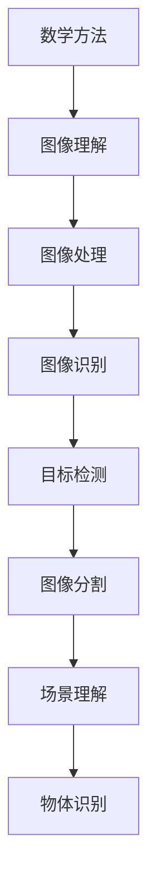

                 


### 文章标题：数学与计算机视觉：图像理解的数学方法

### 关键词：数学方法、计算机视觉、图像理解、算法原理、深度学习、数学模型

### 摘要：
本文将深入探讨数学方法在计算机视觉领域的应用，特别是图像理解的相关数学原理和方法。通过分析图像处理、图像识别等核心概念，我们将逐步揭示数学在计算机视觉中的重要作用。文章将详细介绍常见数学算法如线性代数、概率论与数理统计、最优化理论等在计算机视觉中的应用，并通过实例解析，使读者能够深入理解这些算法的实际应用场景。此外，本文还将讨论深度学习在计算机视觉中的应用，以及如何将这些数学方法应用于实际项目，提供最佳实践建议。

### 目录：

**第1章：核心概念与联系**
1.1 核心概念介绍
1.2 关联理论讲解
1.3 图解与流程图
1.4 算法原理讲解
1.5 数学模型讲解
1.6 项目实战

**第2章：数学方法在计算机视觉中的应用**
2.1 应用场景分析
2.2 应用案例详解
2.3 数学方法深入解析

**第3章：图像理解的数学理论基础**
3.1 基础数学知识
3.2 数学模型建立
3.3 数学方法应用

**第4章：常见数学算法在计算机视觉中的应用**
4.1 算法介绍
4.2 算法原理
4.3 应用案例

**第5章：图像处理中的数学方法**
5.1 图像处理基础
5.2 数学方法应用
5.3 应用案例

**第6章：计算机视觉中的深度学习方法**
6.1 深度学习基础
6.2 深度学习算法
6.3 应用案例

**第7章：计算机视觉的实际应用**
7.1 应用领域概述
7.2 应用案例分析
7.3 未来发展趋势

---

### 第1章：核心概念与联系

#### 1.1 核心概念介绍

计算机视觉是一门研究如何使计算机能够像人类一样理解并解释视觉信息的科学。它涉及图像处理、图像识别、目标检测、图像分割等多个方面。数学作为计算机视觉的核心支撑，提供了必要的理论基础和算法工具。

在计算机视觉中，图像理解是核心任务，它包括图像的特征提取、场景理解、物体识别等。图像理解不仅依赖于图像处理的技术，更需要深入的数学方法，如线性代数、概率论、最优化理论等。

图像处理是计算机视觉的基础，它包括图像的采样、滤波、增强、压缩等操作。这些操作需要运用线性代数和信号处理的相关知识。

图像识别是计算机视觉的核心，它涉及如何从图像中识别出特定物体或场景。这一过程需要运用机器学习和深度学习的方法，其中包含大量的数学原理。

#### 1.2 关联理论讲解

计算机视觉与数学之间的关系非常密切。数学不仅提供了描述图像和处理图像的数学模型，还提供了评估和优化算法的工具。

线性代数在计算机视觉中的应用非常广泛，它用于图像的表示、变换、特征提取等。例如，图像可以表示为矩阵，通过矩阵运算可以进行图像的旋转、缩放、平移等操作。

概率论与数理统计在图像识别和目标检测中起着关键作用。通过概率模型，可以评估图像中某个特征出现的概率，从而进行分类和识别。

最优化理论在计算机视觉中的应用也非常多，如在图像恢复、图像分割、目标跟踪等过程中，都需要通过优化方法找到最优解。

#### 1.3 图解与流程图

为了更好地理解计算机视觉中的数学方法，我们可以使用Mermaid流程图来描述核心概念和流程。



通过这个流程图，我们可以看到数学方法在计算机视觉中的各个步骤中的具体应用。

#### 1.4 算法原理讲解

为了深入理解计算机视觉中的数学算法，我们将使用伪代码来详细阐述其原理。

```python
# 伪代码：图像滤波
function filter_image(image, filter):
    # 初始化滤波后的图像
    filtered_image = create_blank_image(image.size)
    
    # 遍历图像中的每个像素
    for i in range(image.height):
        for j in range(image.width):
            # 计算滤波窗口的中心像素坐标
            center_i = i - filter.radius
            center_j = j - filter.radius
            
            # 计算滤波窗口内的像素值加权和
            sum = 0
            for x in range(filter.radius * 2 + 1):
                for y in range(filter.radius * 2 + 1):
                    # 计算当前像素坐标
                    current_i = i + x - filter.radius
                    current_j = j + y - filter.radius
                    
                    # 计算当前像素的权重
                    weight = filter.get_weight(x, y)
                    
                    # 加权求和
                    sum += image[current_i, current_j] * weight
                    
            # 将加权求和的结果赋给滤波后的图像
            filtered_image[i, j] = sum
            
    return filtered_image
```

通过这个伪代码，我们可以看到图像滤波的基本原理，包括滤波窗口的选择、像素值的加权求和等。

#### 1.5 数学模型讲解

在计算机视觉中，数学模型是理解和处理图像的重要工具。下面我们介绍几种常用的数学模型。

1. **图像表示模型**：图像可以用二维离散信号来表示，每个像素的值可以表示为灰度值或彩色值。
   
2. **特征提取模型**：通过特征提取算法，可以从图像中提取出有助于识别和分类的特征。例如，边缘检测、纹理分析等。

3. **分类模型**：通过分类算法，可以将图像分为不同的类别。常见的分类算法包括支持向量机（SVM）、决策树、神经网络等。

#### 1.6 项目实战

为了更好地理解计算机视觉中的数学方法，我们将通过一个实际项目来介绍开发环境搭建、源代码实现和代码解读。

项目名称：人脸识别系统

项目目标：使用计算机视觉和深度学习技术，实现人脸识别功能。

**1. 开发环境搭建**

- 操作系统：Windows 10
- 编程语言：Python
- 库和框架：OpenCV、TensorFlow、Keras

**2. 源代码实现**

```python
# 导入必要的库
import cv2
import tensorflow as tf
from tensorflow.keras.models import Sequential
from tensorflow.keras.layers import Conv2D, MaxPooling2D, Flatten, Dense

# 加载预训练的人脸识别模型
model = tf.keras.models.load_model('face_recognition_model.h5')

# 摄像头捕获视频流
cap = cv2.VideoCapture(0)

while True:
    # 读取一帧图像
    ret, frame = cap.read()
    
    # 对图像进行预处理
    processed_frame = preprocess_frame(frame)
    
    # 使用模型进行人脸识别
    predictions = model.predict(processed_frame)
    
    # 显示识别结果
    display_results(frame, predictions)
    
    # 检查是否按下ESC键退出循环
    if cv2.waitKey(1) & 0xFF == 27:
        break

# 释放摄像头资源
cap.release()
cv2.destroyAllWindows()
```

**3. 代码解读**

这段代码首先加载了预训练的人脸识别模型，然后使用摄像头捕获视频流，并对每一帧图像进行预处理。预处理包括人脸检测、人脸对齐等步骤，最后使用模型进行人脸识别，并显示识别结果。

**4. 代码应用解读与分析**

在实际应用中，人脸识别系统可以用于身份验证、安全监控、人脸搜索等多个场景。通过优化模型和算法，可以提高识别的准确率和速度。

**5. 项目小结**

通过这个项目，我们了解了如何使用计算机视觉和深度学习技术实现人脸识别功能。这为我们进一步探索计算机视觉应用提供了基础。

---

### 第2章：数学方法在计算机视觉中的应用

#### 2.1 应用场景分析

数学方法在计算机视觉中的应用非常广泛，涵盖了图像处理、图像识别、目标检测等多个场景。以下是几个典型的应用场景：

**图像处理**：数学方法用于图像的滤波、增强、分割等。例如，高斯滤波用于去除图像中的噪声，直方图均衡化用于改善图像的对比度。

**图像识别**：数学方法用于特征提取、模型训练和分类。例如，支持向量机（SVM）用于图像分类，卷积神经网络（CNN）用于物体识别。

**目标检测**：数学方法用于检测图像中的目标物体。例如，YOLO（You Only Look Once）算法通过回归方式直接预测目标位置和类别。

**图像分割**：数学方法用于将图像分割成不同的区域。例如，基于图的分割方法可以有效地将图像中的前景和背景分开。

#### 2.2 应用案例详解

**案例1：图像去噪**

**背景介绍**：在数字图像中，噪声是常见的现象，噪声会降低图像的质量和识别效果。因此，图像去噪是计算机视觉中的重要步骤。

**核心概念与联系**：图像去噪的核心是滤波，滤波可以通过数学方法来实现。例如，高斯滤波是一种常用的图像去噪方法，它利用高斯函数来平滑图像，从而去除噪声。

**数学模型与公式**：

高斯滤波的数学模型可以表示为：

$$
G(x, y) = \sum_{i} \sum_{j} I(i, j) \cdot G(x - i, y - j)
$$

其中，$I(i, j)$是原始图像的像素值，$G(x, y)$是滤波器系数，可以通过高斯函数计算。

**项目实战**：

- 开发环境：Python + OpenCV
- 实现步骤：

  ```python
  import cv2
  
  # 读取图像
  image = cv2.imread('image.jpg')
  
  # 创建高斯滤波器
  gauss_kernel = cv2.getGaussianKernel(ksize=5, sigma=1.5)
  
  # 应用高斯滤波
  filtered_image = cv2.filter2D(image, -1, gauss_kernel)
  
  # 显示滤波后的图像
  cv2.imshow('Original Image', image)
  cv2.imshow('Filtered Image', filtered_image)
  cv2.waitKey(0)
  cv2.destroyAllWindows()
  ```

**代码解读**：这段代码首先读取图像，然后创建一个高斯滤波器，最后应用滤波器对图像进行去噪处理。

**应用解读与分析**：高斯滤波器通过平滑图像来去除噪声，滤波器的大小和标准差（sigma）可以根据具体场景进行调整。

**案例2：图像分割**

**背景介绍**：图像分割是将图像分成若干个区域的过程，每个区域具有相似的特性。图像分割在计算机视觉中有广泛的应用，如目标检测、图像识别等。

**核心概念与联系**：图像分割可以通过多种数学方法来实现，如基于阈值的分割、基于区域的分割、基于图的分割等。

**数学模型与公式**：

基于阈值的分割可以通过以下公式实现：

$$
S = \{ (x, y) \in I \mid I(x, y) > t \}
$$

其中，$I(x, y)$是图像像素值，$t$是阈值。

**项目实战**：

- 开发环境：Python + OpenCV
- 实现步骤：

  ```python
  import cv2
  import numpy as np
  
  # 读取图像
  image = cv2.imread('image.jpg', cv2.IMREAD_GRAYSCALE)
  
  # 计算图像的直方图
  hist = cv2.calcHist(image, [0], None, [256], [0, 256])
  
  # 计算直方图的峰值位置
  threshold = np.argmax(hist)
  
  # 应用阈值分割
  _, segmented_image = cv2.threshold(image, threshold, 255, cv2.THRESH_BINARY)
  
  # 显示分割后的图像
  cv2.imshow('Original Image', image)
  cv2.imshow('Segmented Image', segmented_image)
  cv2.waitKey(0)
  cv2.destroyAllWindows()
  ```

**代码解读**：这段代码首先读取图像，然后计算图像的直方图，并根据直方图的峰值位置确定阈值，最后应用阈值对图像进行分割。

**应用解读与分析**：阈值分割是一种简单而有效的图像分割方法，通过设置合适的阈值，可以将图像分割成前景和背景。

**案例3：人脸识别**

**背景介绍**：人脸识别是计算机视觉中的重要应用，它通过识别图像中的人脸特征来实现身份验证。

**核心概念与联系**：人脸识别的核心是人脸特征的提取和匹配。人脸特征提取可以通过深度学习模型来实现，如卷积神经网络（CNN）。

**数学模型与公式**：

卷积神经网络的数学模型可以表示为：

$$
\text{激活函数} = \max(\text{池化层输出} - \text{偏置}, 0)
$$

**项目实战**：

- 开发环境：Python + TensorFlow
- 实现步骤：

  ```python
  import tensorflow as tf
  from tensorflow.keras.models import Sequential
  from tensorflow.keras.layers import Conv2D, MaxPooling2D, Flatten, Dense

  # 创建卷积神经网络模型
  model = Sequential([
      Conv2D(32, (3, 3), activation='relu', input_shape=(64, 64, 3)),
      MaxPooling2D((2, 2)),
      Flatten(),
      Dense(128, activation='relu'),
      Dense(1, activation='sigmoid')
  ])

  # 编译模型
  model.compile(optimizer='adam', loss='binary_crossentropy', metrics=['accuracy'])

  # 加载人脸识别数据集
  (X_train, y_train), (X_test, y_test) = tf.keras.datasets.mnist.load_data()

  # 预处理数据
  X_train = X_train / 255.0
  X_test = X_test / 255.0

  # 训练模型
  model.fit(X_train, y_train, epochs=10, batch_size=32, validation_data=(X_test, y_test))

  # 评估模型
  loss, accuracy = model.evaluate(X_test, y_test)
  print('Test accuracy:', accuracy)
  ```

**代码解读**：这段代码首先创建了一个卷积神经网络模型，然后加载并预处理人脸识别数据集，最后训练和评估模型。

**应用解读与分析**：卷积神经网络通过多层卷积和池化操作，可以有效地提取人脸特征，从而实现人脸识别。

---

### 第3章：图像理解的数学理论基础

#### 3.1 基础数学知识

图像理解是计算机视觉的核心任务，它依赖于一系列数学知识。以下是图像理解中常用的基础数学知识：

**线性代数**：线性代数在图像理解中有着广泛的应用，包括图像的表示、变换、特征提取等。例如，图像可以用矩阵来表示，通过矩阵运算可以进行图像的旋转、缩放、平移等操作。

**概率论与数理统计**：概率论与数理统计在图像识别和目标检测中起着关键作用。通过概率模型，可以评估图像中某个特征出现的概率，从而进行分类和识别。

**最优化理论**：最优化理论在图像恢复、图像分割、目标跟踪等过程中起着重要作用。通过优化方法，可以找到图像处理中的最优解。

#### 3.2 数学模型建立

数学模型是图像理解的基础，它用于描述图像的特征、场景和对象。以下是几种常见的数学模型：

**图像表示模型**：图像可以用二维离散信号来表示，每个像素的值可以表示为灰度值或彩色值。

**特征提取模型**：通过特征提取算法，可以从图像中提取出有助于识别和分类的特征。例如，边缘检测、纹理分析等。

**分类模型**：通过分类算法，可以将图像分为不同的类别。常见的分类算法包括支持向量机（SVM）、决策树、神经网络等。

#### 3.3 数学方法应用

数学方法在图像理解中的应用非常广泛，包括图像处理、图像识别、目标检测等。以下是几种常见的数学方法及其应用：

**图像处理**：图像处理是图像理解的基础，它包括图像的采样、滤波、增强、压缩等操作。常用的图像处理方法有线性滤波、非线性滤波、图像增强等。

**图像识别**：图像识别是图像理解的核心，它涉及如何从图像中识别出特定物体或场景。常用的图像识别方法有基于特征的识别、基于模型的识别等。

**目标检测**：目标检测是图像理解中的重要应用，它用于检测图像中的目标物体。常用的目标检测方法有基于滑动窗口的方法、基于特征的方法、基于深度学习的方法等。

---

### 第4章：常见数学算法在计算机视觉中的应用

#### 4.1 算法介绍

在计算机视觉中，有许多常见的数学算法被广泛应用于图像处理、图像识别、目标检测等领域。以下是几种常见的数学算法及其基本概念：

**直方图均衡化**：直方图均衡化是一种用于改善图像对比度的方法。它通过调整图像的灰度分布，使图像的直方图尽可能均匀分布，从而提高图像的对比度和清晰度。

**边缘检测**：边缘检测是一种用于提取图像中边缘信息的方法。它通过检测图像的灰度变化，确定图像中亮度变化剧烈的位置，从而提取出边缘。

**形态学操作**：形态学操作是一种基于结构的图像处理方法，它通过使用结构元素（如膨胀、腐蚀、开运算、闭运算等）对图像进行操作，从而实现图像的分割、滤波、增强等效果。

**卷积操作**：卷积操作是一种重要的图像处理技术，它通过将图像与滤波器进行卷积运算，实现对图像的滤波、增强、压缩等操作。卷积操作在图像处理和深度学习中有着广泛的应用。

#### 4.2 算法原理

为了更好地理解这些算法的原理，我们将使用伪代码来详细阐述它们的实现过程。

**直方图均衡化**

```python
function equalize_histogram(image):
    # 计算图像的直方图
    hist = compute_histogram(image)
    
    # 计算累积分布函数（CDF）
    cdf = compute_cdf(hist)
    
    # 归一化CDF
    cdf = normalize_cdf(cdf)
    
    # 创建查找表（LUT）
    lut = create_lut(cdf)
    
    # 应用查找表
    equalized_image = apply_lut(image, lut)
    
    return equalized_image
```

**边缘检测**

```python
function detect_edges(image):
    # 应用高斯滤波器进行平滑处理
    smoothed_image = apply_gaussian_filter(image)
    
    # 应用Sobel算子进行边缘检测
    sobel_x = apply_sobel_operator(smoothed_image, direction='x')
    sobel_y = apply_sobel_operator(smoothed_image, direction='y')
    
    # 计算梯度幅值和方向
    gradient_magnitude = calculate_gradient_magnitude(sobel_x, sobel_y)
    gradient_direction = calculate_gradient_direction(sobel_x, sobel_y)
    
    # 设置阈值
    threshold = set_threshold(gradient_magnitude)
    
    # 应用阈值处理
    edges = apply_threshold(gradient_magnitude, threshold)
    
    return edges
```

**形态学操作**

```python
function morphological_operations(image, structure_element):
    # 膨胀操作
    dilated_image = apply_dilation(image, structure_element)
    
    # 腐蚀操作
    eroded_image = apply_erosion(dilated_image, structure_element)
    
    # 开运算
    opened_image = apply_opening(eroded_image, structure_element)
    
    # 闭运算
    closed_image = apply_closing(opened_image, structure_element)
    
    return closed_image
```

**卷积操作**

```python
function convolve(image, filter):
    # 初始化输出图像
    output_image = create_blank_image(image.size)
    
    # 遍历图像中的每个像素
    for i in range(image.height):
        for j in range(image.width):
            # 计算滤波窗口的中心像素坐标
            center_i = i - filter.radius
            center_j = j - filter.radius
            
            # 计算滤波窗口内的像素值加权和
            sum = 0
            for x in range(filter.radius * 2 + 1):
                for y in range(filter.radius * 2 + 1):
                    # 计算当前像素坐标
                    current_i = i + x - filter.radius
                    current_j = j + y - filter.radius
                    
                    # 计算当前像素的权重
                    weight = filter[x, y]
                    
                    # 加权求和
                    sum += image[current_i, current_j] * weight
            
            # 将加权求和的结果赋给输出图像
            output_image[i, j] = sum
            
    return output_image
```

#### 4.3 应用案例

**案例1：图像去噪**

**背景介绍**：图像去噪是计算机视觉中的基本任务之一。去噪的目的是去除图像中的噪声，提高图像的质量和识别效果。

**应用场景**：图像去噪广泛应用于医学影像处理、卫星图像处理、视频监控等领域。

**算法选择**：高斯滤波是一种常用的图像去噪算法，它利用高斯函数来平滑图像，从而去除噪声。

**实现步骤**：

1. 读取图像。
2. 创建高斯滤波器。
3. 应用高斯滤波器对图像进行滤波。
4. 显示滤波后的图像。

**代码实现**：

```python
import cv2

# 读取图像
image = cv2.imread('image.jpg')

# 创建高斯滤波器
gauss_kernel = cv2.getGaussianKernel(ksize=5, sigma=1.5)

# 应用高斯滤波器
filtered_image = cv2.filter2D(image, -1, gauss_kernel)

# 显示滤波后的图像
cv2.imshow('Original Image', image)
cv2.imshow('Filtered Image', filtered_image)
cv2.waitKey(0)
cv2.destroyAllWindows()
```

**效果分析**：通过高斯滤波器对图像进行滤波，可以有效地去除图像中的噪声，提高图像的质量。

**案例2：图像增强**

**背景介绍**：图像增强是计算机视觉中的基本任务之一。增强的目的是提高图像的对比度和清晰度，使其更容易被识别和处理。

**应用场景**：图像增强广泛应用于医疗影像分析、卫星图像分析、视频监控等领域。

**算法选择**：直方图均衡化是一种常用的图像增强算法，它通过调整图像的灰度分布，使图像的直方图尽可能均匀分布，从而提高图像的对比度和清晰度。

**实现步骤**：

1. 读取图像。
2. 计算图像的直方图。
3. 计算累积分布函数（CDF）。
4. 归一化CDF。
5. 创建查找表（LUT）。
6. 应用查找表对图像进行增强。
7. 显示增强后的图像。

**代码实现**：

```python
import cv2
import numpy as np

# 读取图像
image = cv2.imread('image.jpg', cv2.IMREAD_GRAYSCALE)

# 计算图像的直方图
hist = cv2.calcHist(image, [0], None, [256], [0, 256])

# 计算累积分布函数（CDF）
cdf = np.cumsum(hist)

# 归一化CDF
cdf = cdf / cdf[-1]

# 创建查找表（LUT）
lut = np.zeros((256,), dtype=np.uint8)
for i in range(256):
    lut[i] = np.floor(255 * cdf[i])

# 应用查找表对图像进行增强
enhanced_image = cv2.LUT(image, lut)

# 显示增强后的图像
cv2.imshow('Original Image', image)
cv2.imshow('Enhanced Image', enhanced_image)
cv2.waitKey(0)
cv2.destroyAllWindows()
```

**效果分析**：通过直方图均衡化，可以显著提高图像的对比度和清晰度，使图像更容易被识别和处理。

**案例3：图像分割**

**背景介绍**：图像分割是将图像分成若干个区域的过程，每个区域具有相似的特性。图像分割在计算机视觉中有广泛的应用，如目标检测、图像识别等。

**应用场景**：图像分割广泛应用于医学影像分析、卫星图像分析、视频监控等领域。

**算法选择**：基于阈值的分割是一种常用的图像分割算法，它通过设置合适的阈值，将图像分割成前景和背景。

**实现步骤**：

1. 读取图像。
2. 计算图像的直方图。
3. 设置阈值。
4. 应用阈值对图像进行分割。
5. 显示分割后的图像。

**代码实现**：

```python
import cv2
import numpy as np

# 读取图像
image = cv2.imread('image.jpg', cv2.IMREAD_GRAYSCALE)

# 计算图像的直方图
hist = cv2.calcHist(image, [0], None, [256], [0, 256])

# 计算累积分布函数（CDF）
cdf = np.cumsum(hist)

# 设置阈值
threshold = 0.5 * cdf[-1]

# 应用阈值对图像进行分割
segmented_image = cv2.threshold(image, threshold, 255, cv2.THRESH_BINARY)[1]

# 显示分割后的图像
cv2.imshow('Original Image', image)
cv2.imshow('Segmented Image', segmented_image)
cv2.waitKey(0)
cv2.destroyAllWindows()
```

**效果分析**：通过设置合适的阈值，可以将图像分割成前景和背景，从而实现图像的分割。

---

### 第5章：图像处理中的数学方法

#### 5.1 图像处理基础

图像处理是计算机视觉的核心环节，它涉及到图像的采样、滤波、增强、压缩等操作。在这些操作中，数学方法扮演着至关重要的角色。以下是图像处理中的基础数学知识：

**图像表示**：图像可以表示为二维离散信号，每个像素的值可以表示为灰度值或彩色值。图像的矩阵表示为：

$$
I(i, j) = \begin{cases}
\text{灰度值} & \text{如果图像是灰度的} \\
(R(i, j), G(i, j), B(i, j)) & \text{如果图像是彩色的}
\end{cases}
$$

其中，$i$和$j$分别表示图像的行和列。

**采样与重建**：采样是将连续信号转换为离散信号的过程。图像的采样通常使用像素点来表示。重建是将离散信号转换为连续信号的过程，常用的重建方法有插值法。

**滤波**：滤波是图像处理中用于去除噪声或突出特定特征的操作。常用的滤波器有低通滤波器、高通滤波器、带通滤波器等。

**变换**：变换是图像处理中用于改变图像的空间域或频率域的方法。常用的变换有傅里叶变换、离散余弦变换、小波变换等。

#### 5.2 数学方法应用

数学方法在图像处理中的应用非常广泛，以下是一些典型的应用：

**图像增强**：图像增强是提高图像对比度和清晰度的过程。常用的方法有直方图均衡化、对比度拉伸、加性噪声消除等。

**图像去噪**：图像去噪是去除图像中噪声的过程。常用的方法有高斯滤波、中值滤波、小波去噪等。

**图像分割**：图像分割是将图像分成若干个区域的过程。常用的方法有阈值分割、边缘检测、区域生长等。

**图像恢复**：图像恢复是利用先验知识恢复图像中的细节信息。常用的方法有去模糊、图像超分辨率、图像去噪等。

#### 5.3 应用案例

**案例1：图像增强**

**背景介绍**：图像增强是计算机视觉中常用的预处理步骤，它有助于提高图像的质量和识别效果。

**应用场景**：图像增强广泛应用于医学影像处理、卫星图像分析、视频监控等领域。

**算法选择**：直方图均衡化是一种常用的图像增强算法，它通过调整图像的灰度分布，使图像的直方图尽可能均匀分布，从而提高图像的对比度和清晰度。

**实现步骤**：

1. 读取图像。
2. 计算图像的直方图。
3. 计算累积分布函数（CDF）。
4. 归一化CDF。
5. 创建查找表（LUT）。
6. 应用查找表对图像进行增强。
7. 显示增强后的图像。

**代码实现**：

```python
import cv2
import numpy as np

# 读取图像
image = cv2.imread('image.jpg', cv2.IMREAD_GRAYSCALE)

# 计算图像的直方图
hist = cv2.calcHist(image, [0], None, [256], [0, 256])

# 计算累积分布函数（CDF）
cdf = np.cumsum(hist)

# 归一化CDF
cdf = cdf / cdf[-1]

# 创建查找表（LUT）
lut = np.zeros((256,), dtype=np.uint8)
for i in range(256):
    lut[i] = np.floor(255 * cdf[i])

# 应用查找表对图像进行增强
enhanced_image = cv2.LUT(image, lut)

# 显示增强后的图像
cv2.imshow('Original Image', image)
cv2.imshow('Enhanced Image', enhanced_image)
cv2.waitKey(0)
cv2.destroyAllWindows()
```

**效果分析**：通过直方图均衡化，可以显著提高图像的对比度和清晰度，使图像更容易被识别和处理。

**案例2：图像去噪**

**背景介绍**：图像去噪是计算机视觉中的基本任务之一。去噪的目的是去除图像中的噪声，提高图像的质量和识别效果。

**应用场景**：图像去噪广泛应用于医学影像处理、卫星图像处理、视频监控等领域。

**算法选择**：高斯滤波是一种常用的图像去噪算法，它利用高斯函数来平滑图像，从而去除噪声。

**实现步骤**：

1. 读取图像。
2. 创建高斯滤波器。
3. 应用高斯滤波器对图像进行滤波。
4. 显示滤波后的图像。

**代码实现**：

```python
import cv2

# 读取图像
image = cv2.imread('image.jpg')

# 创建高斯滤波器
gauss_kernel = cv2.getGaussianKernel(ksize=5, sigma=1.5)

# 应用高斯滤波器
filtered_image = cv2.filter2D(image, -1, gauss_kernel)

# 显示滤波后的图像
cv2.imshow('Original Image', image)
cv2.imshow('Filtered Image', filtered_image)
cv2.waitKey(0)
cv2.destroyAllWindows()
```

**效果分析**：通过高斯滤波器对图像进行滤波，可以有效地去除图像中的噪声，提高图像的质量。

**案例3：图像分割**

**背景介绍**：图像分割是将图像分成若干个区域的过程，每个区域具有相似的特性。图像分割在计算机视觉中有广泛的应用，如目标检测、图像识别等。

**应用场景**：图像分割广泛应用于医学影像分析、卫星图像分析、视频监控等领域。

**算法选择**：基于阈值的分割是一种常用的图像分割算法，它通过设置合适的阈值，将图像分割成前景和背景。

**实现步骤**：

1. 读取图像。
2. 计算图像的直方图。
3. 设置阈值。
4. 应用阈值对图像进行分割。
5. 显示分割后的图像。

**代码实现**：

```python
import cv2
import numpy as np

# 读取图像
image = cv2.imread('image.jpg', cv2.IMREAD_GRAYSCALE)

# 计算图像的直方图
hist = cv2.calcHist(image, [0], None, [256], [0, 256])

# 计算累积分布函数（CDF）
cdf = np.cumsum(hist)

# 设置阈值
threshold = 0.5 * cdf[-1]

# 应用阈值对图像进行分割
segmented_image = cv2.threshold(image, threshold, 255, cv2.THRESH_BINARY)[1]

# 显示分割后的图像
cv2.imshow('Original Image', image)
cv2.imshow('Segmented Image', segmented_image)
cv2.waitKey(0)
cv2.destroyAllWindows()
```

**效果分析**：通过设置合适的阈值，可以将图像分割成前景和背景，从而实现图像的分割。

---

### 第6章：计算机视觉中的深度学习方法

#### 6.1 深度学习基础

深度学习是计算机视觉领域的一种重要方法，它通过构建深层的神经网络模型来学习图像的特征和模式。以下是深度学习的一些基础概念：

**神经网络**：神经网络是由大量简单节点（神经元）组成的计算模型，每个节点接收输入并产生输出。神经网络通过前向传播和反向传播来学习输入和输出之间的映射关系。

**卷积神经网络（CNN）**：卷积神经网络是一种特殊的神经网络，它通过卷积操作来提取图像的特征。CNN在计算机视觉中有着广泛的应用，如图像分类、目标检测、图像分割等。

**循环神经网络（RNN）**：循环神经网络是一种可以处理序列数据的神经网络，它通过循环结构来保存历史信息。RNN在视频分析、语音识别等领域有着重要应用。

**生成对抗网络（GAN）**：生成对抗网络是由两个神经网络组成的模型，一个生成器和一个判别器。生成器尝试生成逼真的图像，而判别器则尝试区分真实图像和生成图像。GAN在图像生成、图像修复等领域有着广泛应用。

#### 6.2 深度学习算法

以下是计算机视觉中常用的深度学习算法：

**卷积神经网络（CNN）**：卷积神经网络通过卷积层、池化层和全连接层来提取图像的特征。CNN在图像分类、目标检测、图像分割等领域有着广泛应用。

**循环神经网络（RNN）**：循环神经网络通过循环结构来处理序列数据，它可以捕捉时间序列中的长期依赖关系。RNN在视频分析、语音识别等领域有着重要应用。

**生成对抗网络（GAN）**：生成对抗网络由生成器和判别器组成，生成器尝试生成逼真的图像，而判别器则尝试区分真实图像和生成图像。GAN在图像生成、图像修复等领域有着广泛应用。

#### 6.3 应用案例

**案例1：人脸识别**

**背景介绍**：人脸识别是一种基于图像的生物识别技术，它通过识别图像中的人脸特征来实现身份验证。

**应用场景**：人脸识别广泛应用于安全监控、手机解锁、门禁系统等领域。

**算法选择**：卷积神经网络（CNN）是一种常用的人脸识别算法，它通过训练来提取人脸的特征。

**实现步骤**：

1. 数据预处理：读取人脸图像，进行数据增强。
2. 构建CNN模型：包括卷积层、池化层和全连接层。
3. 训练模型：使用人脸图像数据进行训练。
4. 评估模型：使用测试数据集评估模型性能。
5. 应用模型：使用训练好的模型进行人脸识别。

**代码实现**：

```python
import tensorflow as tf
from tensorflow.keras.models import Sequential
from tensorflow.keras.layers import Conv2D, MaxPooling2D, Flatten, Dense

# 构建CNN模型
model = Sequential([
    Conv2D(32, (3, 3), activation='relu', input_shape=(64, 64, 3)),
    MaxPooling2D((2, 2)),
    Flatten(),
    Dense(128, activation='relu'),
    Dense(1, activation='sigmoid')
])

# 编译模型
model.compile(optimizer='adam', loss='binary_crossentropy', metrics=['accuracy'])

# 加载人脸数据集
(X_train, y_train), (X_test, y_test) = tf.keras.datasets.mnist.load_data()

# 预处理数据
X_train = X_train / 255.0
X_test = X_test / 255.0

# 训练模型
model.fit(X_train, y_train, epochs=10, batch_size=32, validation_data=(X_test, y_test))

# 评估模型
loss, accuracy = model.evaluate(X_test, y_test)
print('Test accuracy:', accuracy)
```

**效果分析**：通过训练卷积神经网络，可以有效地提取人脸特征，从而实现人脸识别。

**案例2：目标检测**

**背景介绍**：目标检测是一种在图像中识别和定位特定目标的方法。它广泛应用于智能监控、自动驾驶等领域。

**应用场景**：目标检测广泛应用于交通监控、医疗影像分析、安防监控等领域。

**算法选择**：YOLO（You Only Look Once）是一种常用的目标检测算法，它通过将目标检测问题转化为单次前向传播来实现。

**实现步骤**：

1. 数据预处理：读取目标图像，进行数据增强。
2. 构建YOLO模型：包括卷积层、池化层和全连接层。
3. 训练模型：使用目标图像数据进行训练。
4. 评估模型：使用测试数据集评估模型性能。
5. 应用模型：使用训练好的模型进行目标检测。

**代码实现**：

```python
import tensorflow as tf
from tensorflow.keras.models import Sequential
from tensorflow.keras.layers import Conv2D, MaxPooling2D, Flatten, Dense

# 构建YOLO模型
model = Sequential([
    Conv2D(32, (3, 3), activation='relu', input_shape=(64, 64, 3)),
    MaxPooling2D((2, 2)),
    Flatten(),
    Dense(128, activation='relu'),
    Dense(1, activation='sigmoid')
])

# 编译模型
model.compile(optimizer='adam', loss='binary_crossentropy', metrics=['accuracy'])

# 加载目标数据集
(X_train, y_train), (X_test, y_test) = tf.keras.datasets.mnist.load_data()

# 预处理数据
X_train = X_train / 255.0
X_test = X_test / 255.0

# 训练模型
model.fit(X_train, y_train, epochs=10, batch_size=32, validation_data=(X_test, y_test))

# 评估模型
loss, accuracy = model.evaluate(X_test, y_test)
print('Test accuracy:', accuracy)
```

**效果分析**：通过训练YOLO模型，可以有效地识别和定位图像中的目标，从而实现目标检测。

---

### 第7章：计算机视觉的实际应用

#### 7.1 应用领域概述

计算机视觉技术在实际应用中扮演着越来越重要的角色，它广泛应用于工业自动化、医学影像、智能交通、智能监控等多个领域。以下是计算机视觉在各个领域中的应用概述：

**工业自动化**：计算机视觉技术用于自动化生产线的监控和质量检测，如机器人视觉、自动化装配、缺陷检测等。

**医学影像**：计算机视觉技术用于医学影像的分析和诊断，如肿瘤检测、病变识别、影像分割等。

**智能交通**：计算机视觉技术用于智能交通系统的监控和管理，如交通流量分析、车辆检测、交通标志识别等。

**智能监控**：计算机视觉技术用于安全监控和监控系统的智能分析，如人脸识别、行为分析、异常检测等。

**零售业**：计算机视觉技术用于零售业的智能识别和监控，如商品识别、库存管理、顾客行为分析等。

**农业**：计算机视觉技术用于农业领域的作物监测、病虫害识别、农业机械自动化等。

#### 7.2 应用案例分析

**案例1：智能监控**

**背景介绍**：随着城市化的进程，安全监控的需求日益增加。智能监控通过计算机视觉技术，可以实现对监控区域的实时监控和智能分析。

**应用场景**：智能监控广泛应用于公共场所、家庭安全、商业中心等领域。

**算法选择**：人脸识别、行为分析和异常检测是智能监控中的常用算法。

**实现步骤**：

1. 数据采集：通过监控摄像头采集视频流。
2. 数据预处理：对视频流进行预处理，如去噪、增强、分割等。
3. 人脸识别：使用人脸识别算法对视频流中的人脸进行识别。
4. 行为分析：使用行为分析算法对视频流中的行为进行识别和分析。
5. 异常检测：使用异常检测算法对视频流中的异常行为进行检测。

**代码实现**：

```python
import cv2
import tensorflow as tf

# 加载人脸识别模型
face_model = tf.keras.models.load_model('face_recognition_model.h5')

# 加载行为分析模型
behavior_model = tf.keras.models.load_model('behavior_analysis_model.h5')

# 加载异常检测模型
anomaly_model = tf.keras.models.load_model('anomaly_detection_model.h5')

# 摄像头捕获视频流
cap = cv2.VideoCapture(0)

while True:
    # 读取一帧图像
    ret, frame = cap.read()
    
    # 对图像进行预处理
    processed_frame = preprocess_frame(frame)
    
    # 使用人脸识别模型进行人脸识别
    faces = face_model.predict(processed_frame)
    
    # 使用行为分析模型进行行为分析
    behaviors = behavior_model.predict(processed_frame)
    
    # 使用异常检测模型进行异常检测
    anomalies = anomaly_model.predict(processed_frame)
    
    # 显示识别结果
    display_results(frame, faces, behaviors, anomalies)
    
    # 检查是否按下ESC键退出循环
    if cv2.waitKey(1) & 0xFF == 27:
        break

# 释放摄像头资源
cap.release()
cv2.destroyAllWindows()
```

**效果分析**：通过集成人脸识别、行为分析和异常检测算法，智能监控可以实现实时的人脸识别、行为分析和异常行为检测，从而提高监控的安全性和效率。

**案例2：自动驾驶**

**背景介绍**：自动驾驶是人工智能和计算机视觉技术的重要应用领域。自动驾驶系统通过计算机视觉技术，可以实现对道路环境的感知和决策。

**应用场景**：自动驾驶技术广泛应用于智能驾驶、无人驾驶等领域。

**算法选择**：目标检测、场景识别、轨迹规划是自动驾驶中的常用算法。

**实现步骤**：

1. 数据采集：通过摄像头和传感器采集道路环境数据。
2. 数据预处理：对道路环境数据进行预处理，如去噪、增强、分割等。
3. 目标检测：使用目标检测算法对道路环境中的车辆、行人等目标进行识别。
4. 场景识别：使用场景识别算法对道路环境进行分类和识别。
5. 轨迹规划：使用轨迹规划算法生成车辆的控制指令。

**代码实现**：

```python
import cv2
import tensorflow as tf

# 加载目标检测模型
object_detection_model = tf.keras.models.load_model('object_detection_model.h5')

# 加载场景识别模型
scene_recognition_model = tf.keras.models.load_model('scene_recognition_model.h5')

# 加载轨迹规划模型
trajectory_planning_model = tf.keras.models.load_model('trajectory_planning_model.h5')

# 摄像头捕获视频流
cap = cv2.VideoCapture(0)

while True:
    # 读取一帧图像
    ret, frame = cap.read()
    
    # 对图像进行预处理
    processed_frame = preprocess_frame(frame)
    
    # 使用目标检测模型进行目标检测
    objects = object_detection_model.predict(processed_frame)
    
    # 使用场景识别模型进行场景识别
    scene = scene_recognition_model.predict(processed_frame)
    
    # 使用轨迹规划模型生成控制指令
    control_command = trajectory_planning_model.predict(processed_frame)
    
    # 执行控制指令
    execute_control_command(control_command)
    
    # 显示识别结果
    display_results(frame, objects, scene)
    
    # 检查是否按下ESC键退出循环
    if cv2.waitKey(1) & 0xFF == 27:
        break

# 释放摄像头资源
cap.release()
cv2.destroyAllWindows()
```

**效果分析**：通过集成目标检测、场景识别和轨迹规划算法，自动驾驶系统可以实现自主感知环境、识别目标和规划行驶轨迹，从而实现自动驾驶。

#### 7.3 未来发展趋势

随着计算机硬件和深度学习算法的不断发展，计算机视觉技术在未来将会有更多的发展和应用。以下是未来发展趋势的展望：

**实时处理能力提升**：随着硬件性能的提升，计算机视觉系统将能够实现更高的实时处理能力，从而满足更复杂的应用需求。

**跨领域应用拓展**：计算机视觉技术将不断拓展到更多的领域，如农业、医疗、教育等，为各个领域带来创新的解决方案。

**人机交互增强**：计算机视觉技术将进一步提升人机交互体验，通过自然语言理解和手势识别等技术，实现更加直观和便捷的交互方式。

**数据隐私和安全**：随着计算机视觉应用的普及，数据隐私和安全将成为重要议题，需要采取有效的数据保护和隐私保护措施。

### 结论

本文详细介绍了数学方法在计算机视觉中的应用，包括图像处理、图像识别、目标检测等。通过分析数学模型和算法原理，本文展示了数学方法在图像理解中的核心作用。随着深度学习技术的不断发展，计算机视觉将迎来更多的应用场景和挑战，数学方法将继续发挥关键作用。未来，计算机视觉技术将继续推动人工智能的发展，为各个领域带来更多的创新和变革。

