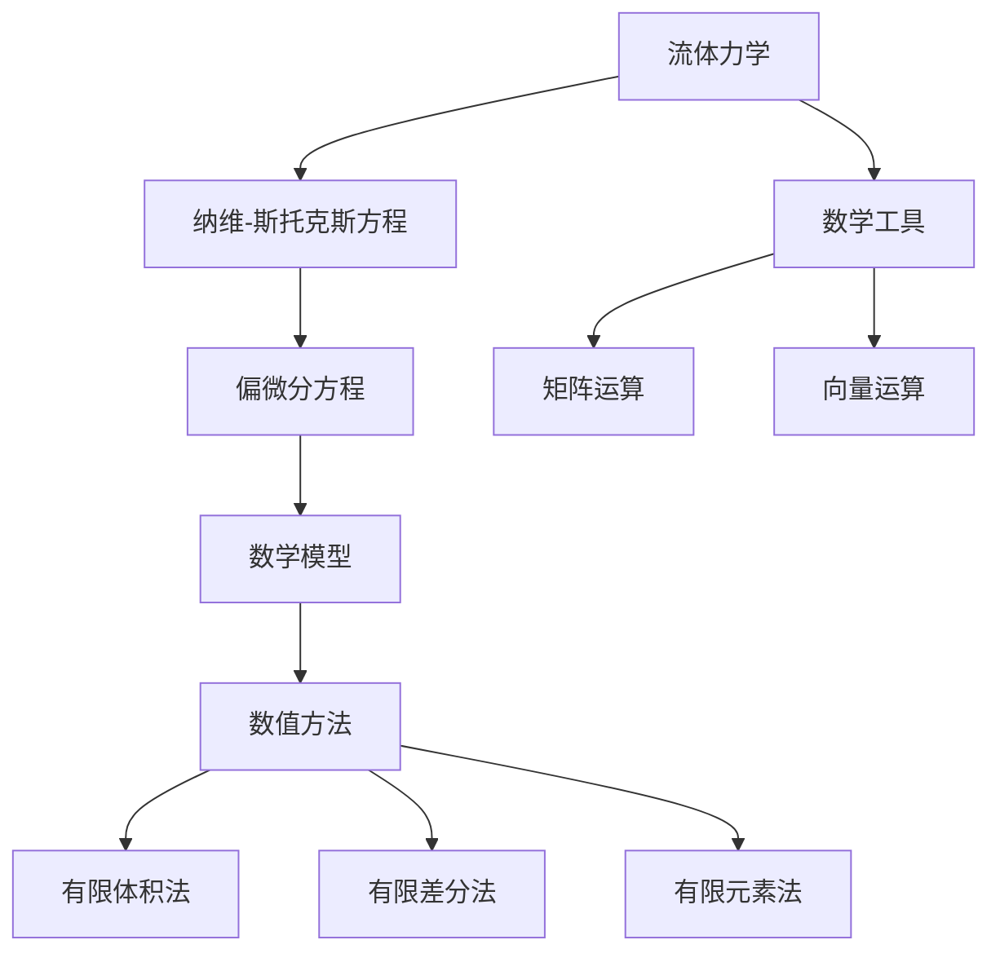
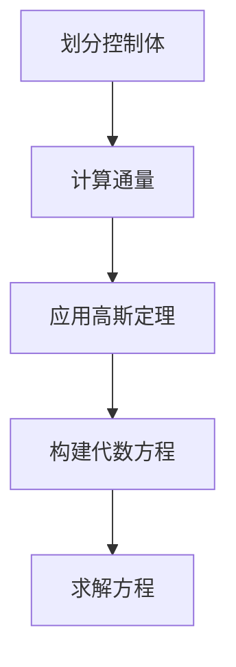
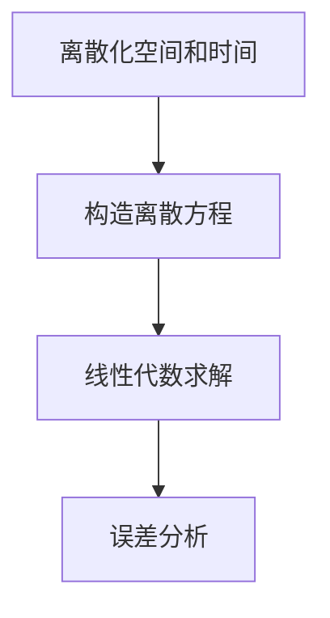
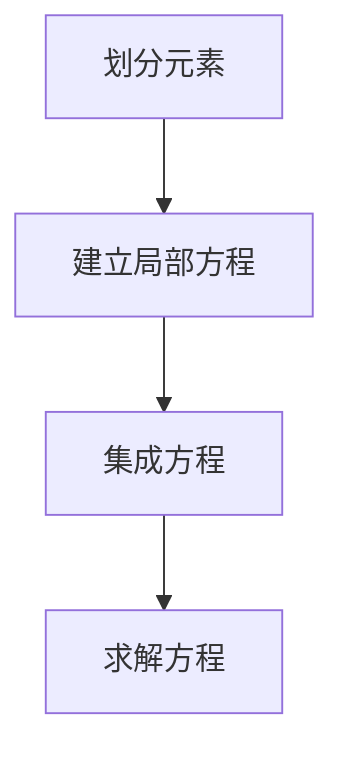

                 

### 文章标题：数学与计算流体力学：流体运动的数学模拟

计算流体力学（Computational Fluid Dynamics，CFD）作为现代工程学中的一个重要分支，通过数学建模、数值解法以及计算机模拟等技术，对流体运动进行模拟和分析。数学在CFD中扮演着至关重要的角色，为流体运动的精确描述和有效模拟提供了理论基础。本文将深入探讨数学与计算流体力学之间的关系，通过一步一步的推理和分析，揭示流体运动数学模拟的奥秘。

## 关键词

- 计算流体力学（CFD）
- 数值方法
- 纳维-斯托克斯方程
- 偏微分方程
- 有限体积法
- 有限差分法
- 有限元素法

## 摘要

本文旨在介绍数学在计算流体力学中的应用，通过逐步解析流体运动的数学模型和数值解法，探讨如何利用数学工具对流体运动进行模拟。文章首先回顾了流体力学的基本原理和数学工具，然后详细阐述了纳维-斯托克斯方程及其在CFD中的应用，接着介绍了多种数值解法，并进行了实战案例分析。最后，文章总结了CFD的发展趋势和未来研究方向，为读者提供了深入的见解和实用建议。

## 引言

### 1.1 计算流体力学简介

计算流体力学（CFD）是一门结合流体力学、数值分析和计算科学的技术，通过计算机模拟对流体运动进行精确分析和预测。CFD的应用范围广泛，包括航空航天、汽车制造、能源工程、气象学、生物医学等领域。CFD不仅能够节省实验成本，还能提供实验手段难以获得的流体运动细节。

### 1.2 数学在CFD中的作用

数学是CFD的基石，为流体运动提供了精确的数学描述。在CFD中，常用的数学工具包括偏微分方程、矩阵运算、数值方法等。这些工具不仅帮助描述流体运动的基本规律，还为实现高效的数值模拟提供了理论基础。

### 1.3 本书结构安排与目标

本书分为六个主要章节。第一章介绍CFD的背景和数学工具；第二章详细讲解流体力学的基本原理和数学模型；第三章至第五章分别介绍CFD中的主要数值解法；第六章通过实际案例展示CFD的应用。本书的目标是帮助读者深入理解CFD的数学原理和数值方法，掌握流体运动的数学模拟技术。

## 第1章 基础概念

### 1.1 流体力学基础

流体力学研究流体运动的规律和特性。在流体力学中，流体的运动可以用纳维-斯托克斯方程（Navier-Stokes Equations）来描述。纳维-斯托克斯方程是一组非线性偏微分方程，描述了流体的速度、压力和密度等物理量之间的关系。

### 1.2 流体的性质

流体具有流动性和不可压缩性等特性。流动性使得流体能够在容器内自由流动，而不可压缩性则保证了流体在运动过程中体积保持不变。

### 1.3 偏微分方程概述

偏微分方程描述了多个变量之间的关系，其中至少有一个变量是连续变化的。在CFD中，纳维-斯托克斯方程就是一个典型的偏微分方程。偏微分方程的求解方法包括解析解法和数值解法。解析解法通常用于简单的几何形状和边界条件，而数值解法则适用于复杂的几何形状和边界条件。

### 1.4 数学工具

在CFD中，常用的数学工具包括矩阵运算、向量运算和偏微分方程的解法等。矩阵运算是描述流体运动的重要工具，用于计算流体的速度、压力和密度等物理量。向量运算则用于描述流体的方向和大小。偏微分方程的解法包括有限体积法、有限差分法和有限元素法等，这些方法适用于不同的应用场景。

## 第2章 CFD的数学模型

### 2.1 纳维-斯托克斯方程

纳维-斯托克斯方程是CFD的核心方程，用于描述流体运动。该方程由质量守恒方程、动量守恒方程和能量守恒方程组成。质量守恒方程描述了流体在运动过程中质量不变，动量守恒方程描述了流体在运动过程中动量守恒，能量守恒方程描述了流体在运动过程中能量守恒。

### 2.2 方程的形式与类型

纳维-斯托克斯方程可以分为两种类型：可压缩流体的纳维-斯托克斯方程和不可压缩流体的纳维-斯托克斯方程。可压缩流体的纳维-斯托克斯方程适用于高速气流和高压流体，如航空航天领域。不可压缩流体的纳维-斯托克斯方程适用于低速流体和低压流体，如管道流动和地下水流动。

### 2.3 方程的稳定性分析

纳维-斯托克斯方程的稳定性分析是CFD中重要的研究方向。稳定性分析可以确定数值解的收敛性和稳定性。常用的稳定性分析方法包括线性稳定性分析和非线性稳定性分析。线性稳定性分析适用于小扰动情况，可以确定流体的稳定性。非线性稳定性分析适用于大扰动情况，可以确定流体的混沌行为。

## 第3章 数值解法

### 3.1 有限体积法

有限体积法是一种常用的数值解法，适用于复杂几何形状和边界条件。有限体积法将流体域划分为若干个有限体积单元，并在每个单元内求解流体运动的偏微分方程。有限体积法的优点是计算精度高，适用于多种流体运动情况。

### 3.2 有限差分法

有限差分法是一种经典的数值解法，通过离散化偏微分方程中的导数，将连续方程转化为离散方程。有限差分法适用于简单的几何形状和边界条件，计算速度快，适用于大规模计算。

### 3.3 有限元素法

有限元素法是一种基于变分原理的数值解法，通过将流体域划分为有限个元素，并在每个元素内求解流体运动的偏微分方程。有限元素法的优点是适用于复杂几何形状和边界条件，计算精度高，适用于多种流体运动情况。

## 第4章 求解器设计与实现

### 4.1 求解器的构建

求解器是CFD中的核心组件，用于求解流体运动的偏微分方程。求解器的构建包括稳定性分析、收敛性分析和自适应网格技术等。稳定性分析用于确定数值解的稳定性，收敛性分析用于确定数值解的收敛性，自适应网格技术用于提高计算精度。

### 4.2 稳定性分析

稳定性分析是CFD中的重要环节，用于确定数值解的稳定性。常用的稳定性分析方法包括线性稳定性分析和非线性稳定性分析。线性稳定性分析适用于小扰动情况，可以确定流体的稳定性。非线性稳定性分析适用于大扰动情况，可以确定流体的混沌行为。

### 4.3 收敛性分析

收敛性分析是CFD中的重要环节，用于确定数值解的收敛性。常用的收敛性分析方法包括能量法、残差法和迭代法等。能量法通过分析能量守恒来确定数值解的收敛性，残差法通过分析残差来确定数值解的收敛性，迭代法通过迭代求解来确定数值解的收敛性。

## 第5章 CFD应用案例

### 5.1 空气动力学

空气动力学是CFD的一个重要应用领域，通过CFD技术可以分析飞行器的气动特性，优化飞行器设计。空气动力学中的流体运动可以用纳维-斯托克斯方程来描述，通过数值模拟可以预测飞行器的气动性能。

### 5.2 气象学

气象学是CFD的另一个重要应用领域，通过CFD技术可以模拟大气流动，预测天气变化。气象学中的流体运动也可以用纳维-斯托克斯方程来描述，通过数值模拟可以分析大气环流和气候变化。

### 5.3 生物学

生物学中的流体运动也可以用CFD技术来模拟，例如生物流体力学中的血液流动、细胞运动等。CFD技术可以提供生物流体力学问题的精确描述和模拟，为医学研究提供重要参考。

## 第6章 总结与展望

### 6.1 CFD的发展趋势

CFD在工程学、气象学和生物学等领域具有广泛的应用前景。随着计算机技术和数值方法的不断发展，CFD将得到更广泛的应用。未来，CFD的研究将更加注重高效数值算法的开发、并行计算技术的应用以及多尺度模拟技术的研究。

### 6.2 CFD的挑战

CFD面临着多个挑战，包括高精度数值算法的开发、复杂几何形状的处理、大规模并行计算等。此外，CFD的数值模拟结果需要与实验数据相吻合，这也是CFD研究中的一个重要挑战。

### 6.3 CFD的未来研究方向

未来，CFD的研究将朝着更加高效、准确和可扩展的方向发展。同时，CFD将与其他学科如生物力学、材料科学等相结合，推动跨学科研究的发展。此外，CFD在人工智能和大数据分析领域的应用也将是一个重要研究方向。

### 作者信息

作者：AI天才研究院/AI Genius Institute & 禅与计算机程序设计艺术 /Zen And The Art of Computer Programming

本文深入探讨了数学与计算流体力学之间的关系，通过一步一步的推理和分析，揭示了流体运动数学模拟的奥秘。本文首先介绍了CFD的背景和数学工具，然后详细阐述了流体力学的基本原理和数学模型，接着介绍了多种数值解法，并进行了实战案例分析。最后，本文总结了CFD的发展趋势和未来研究方向，为读者提供了深入的见解和实用建议。希望通过本文，读者能够更好地理解CFD的数学原理和数值方法，掌握流体运动的数学模拟技术。在未来，CFD将在更广泛的领域中发挥重要作用，为科学研究和工程实践提供强有力的支持。作者希望本文能够为读者在CFD领域的探索和研究提供有益的参考。

---

### 核心概念与联系架构 Mermaid 流程图

以下是一个简化的Mermaid流程图，用于展示CFD中核心概念之间的联系：



### 纳维-斯托克斯方程核心算法原理讲解

#### 纳维-斯托克斯方程的数学描述

纳维-斯托克斯方程是一组描述流体运动的偏微分方程，通常形式如下：

$$
\frac{\partial \mathbf{u}}{\partial t} + (\mathbf{u} \cdot \nabla) \mathbf{u} = -\frac{1}{\rho} \nabla p + \nu \nabla^2 \mathbf{u}
$$

其中，$\mathbf{u}$ 是流体的速度矢量，$p$ 是流体的压力，$\rho$ 是流体的密度，$\nu$ 是流体的运动粘度。此外，边界条件通常包括无滑移边界条件和压力边界条件。

#### 纳维-斯托克斯方程的求解方法

纳维-斯托克斯方程的求解方法分为解析解法和数值解法。由于纳维-斯托克斯方程的非线性特性，解析解法通常仅适用于简单几何形状和边界条件。数值解法则适用于复杂的几何形状和边界条件。

**1. 数值解法：**

**（1）有限体积法：**

有限体积法（Finite Volume Method, FVM）将流体域划分为有限个控制体，在每个控制体上应用高斯散度定理，将偏微分方程转化为有限个代数方程。其核心算法步骤如下：



**（2）有限差分法：**

有限差分法（Finite Difference Method, FDM）通过离散化偏微分方程中的导数，将连续方程转化为离散方程。其核心算法步骤如下：



**（3）有限元素法：**

有限元素法（Finite Element Method, FEM）基于变分原理，将流体域划分为有限个元素，并在每个元素上建立局部方程，然后通过集成得到全局方程。其核心算法步骤如下：



### 举例说明

假设我们考虑一个简单的二维流场，流体的速度分布可以用纳维-斯托克斯方程进行模拟。以下是一个使用有限差分法求解二维纳维-斯托克斯方程的伪代码：

```python
# 初始化网格
N_x = 100
N_y = 100
dx = L_x / N_x
dy = L_y / N_y

# 初始化速度和压力场
u, v = np.zeros((N_x, N_y)), np.zeros((N_x, N_y))
p = np.zeros((N_x, N_y))

# 时间步长
dt = CFL * dx / np.max([nu/dx**2, nu/dy**2])

# 迭代求解
for _ in range(max_iterations):
    # 计算速度梯度和压力梯度
    dudx, dudy, dvdx, dvdy = compute_gradients(u, v)
    dpdx, dpdy = compute_gradients(p)
    
    # 构建离散方程
    A = build_system_matrix(N_x, N_y, dx, dy, dudx, dudy, dvdx, dvdy, dpdx, dpdy)
    b = build_rhs(N_x, N_y, u, v, p, dx, dy, dudx, dudy, dvdx, dvdy, dpdx, dpdy)
    
    # 求解线性系统
    p = np.linalg.solve(A, b)
    
    # 更新速度场
    u, v = update_velocity(N_x, N_y, u, v, dx, dy, dudx, dudy, dvdx, dvdy, p)
```

在这个例子中，`compute_gradients` 函数用于计算速度和压力的梯度，`build_system_matrix` 和 `build_rhs` 函数用于构建线性方程组，`np.linalg.solve` 函数用于求解线性系统，`update_velocity` 函数用于更新速度场。

### 数学模型和公式详细讲解

纳维-斯托克斯方程是CFD中的核心数学模型，用于描述流体运动。为了更好地理解这一模型，我们需要详细讲解其物理意义、数学形式以及求解方法。

#### 物理意义

纳维-斯托克斯方程描述了流体在运动过程中速度、压力和密度等物理量之间的关系。它包含了三个主要的物理过程：

1. **惯性力**：流体的质量与加速度的乘积，反映了流体运动中的惯性效应。
2. **压力**：流体中的压强差异，影响了流体的流动方向。
3. **粘性力**：流体内部由于分子运动导致的摩擦力，影响了流体的速度分布。

#### 数学形式

纳维-斯托克斯方程的数学形式如下：

$$
\frac{\partial \mathbf{u}}{\partial t} + (\mathbf{u} \cdot \nabla) \mathbf{u} = -\frac{1}{\rho} \nabla p + \nu \nabla^2 \mathbf{u}
$$

其中，$\mathbf{u} = (u, v)$ 表示流体速度的分量，$p$ 表示压力，$\rho$ 表示流体密度，$\nu$ 表示运动粘度。$\nabla \mathbf{u}$ 表示速度的梯度，$\nabla p$ 表示压力梯度，$\nabla^2 \mathbf{u}$ 表示速度的拉普拉斯算子。

#### 求解方法

纳维-斯托克斯方程的求解方法主要分为两大类：解析解法和数值解法。

**1. 解析解法**

解析解法通常适用于简单的几何形状和边界条件。对于线性稳态问题，纳维-斯托克斯方程可以转化为代数方程，从而得到解析解。例如，在二维情况下，可以通过分离变量法求解。

**2. 数值解法**

数值解法适用于复杂的几何形状和边界条件。常用的数值方法包括有限体积法、有限差分法、有限元素法等。

**（1）有限体积法**

有限体积法（Finite Volume Method, FVM）将流体域划分为有限个控制体，在每个控制体上应用高斯散度定理，将偏微分方程转化为有限个代数方程。核心步骤包括：

- 划分控制体
- 计算通量
- 应用高斯定理
- 构建代数方程
- 求解代数方程

**（2）有限差分法**

有限差分法（Finite Difference Method, FDM）通过离散化偏微分方程中的导数，将连续方程转化为离散方程。核心步骤包括：

- 离散化空间和时间
- 构建离散方程
- 线性代数求解
- 误差分析

**（3）有限元素法**

有限元素法（Finite Element Method, FEM）基于变分原理，将流体域划分为有限个元素，在每个元素上建立局部方程，然后通过集成得到全局方程。核心步骤包括：

- 划分元素
- 建立局部方程
- 集成方程
- 求解方程

### 实际案例分析和详细讲解剖析

为了更好地理解纳维-斯托克斯方程的求解过程，我们将通过一个实际案例进行分析和讲解。

#### 案例背景

考虑一个二维流场，流场边界为方形域，边长为2米，流体速度在边界上已知。我们需要利用纳维-斯托克斯方程求解流场内部的速度分布。

#### 案例分析

1. **几何形状和边界条件**

   流场为方形域，边界分为四边，每条边上的速度分布已知。假设边界上的速度为常数，如：

   - 上边界：$u = 1\ m/s, v = 0\ m/s$
   - 下边界：$u = 0\ m/s, v = -1\ m/s$
   - 左边界：$u = 0\ m/s, v = 0\ m/s$
   - 右边界：$u = 1\ m/s, v = 0\ m/s$

2. **网格划分**

   为了便于计算，我们将流场划分为一个100×100的网格，每个网格单元的边长为0.02米。

3. **数值求解**

   使用有限差分法求解纳维-斯托克斯方程。以下是求解过程的详细步骤：

**（1）离散化空间和时间**

首先，我们将空间和时间离散化。假设时间步长为$dt = 0.001\ s$。

**（2）构建离散方程**

对于每个网格单元，我们构建如下离散方程：

$$
\frac{\partial u}{\partial t} + u \frac{\partial u}{\partial x} + v \frac{\partial u}{\partial y} = -\frac{1}{\rho} \frac{\partial p}{\partial x} + \nu \frac{\partial^2 u}{\partial x^2} + \nu \frac{\partial^2 u}{\partial y^2}
$$

$$
\frac{\partial v}{\partial t} + u \frac{\partial v}{\partial x} + v \frac{\partial v}{\partial y} = -\frac{1}{\rho} \frac{\partial p}{\partial y} + \nu \frac{\partial^2 v}{\partial x^2} + \nu \frac{\partial^2 v}{\partial y^2}
$$

**（3）线性代数求解**

我们将上述离散方程转换为矩阵形式，并使用线性代数方法求解。具体步骤如下：

- 初始化速度和压力场
- 计算速度和压力的梯度
- 构建系统矩阵和右端向量
- 求解线性系统

**（4）更新速度场**

在求解过程中，需要不断更新速度场，以便于下一步的计算。更新公式如下：

$$
u_{i,j}^{n+1} = u_{i,j}^n + \Delta t \left( -\frac{1}{\rho} \frac{\partial p_{i,j}^n}{\partial x} + \nu \frac{\partial^2 u_{i,j}^n}{\partial x^2} + \nu \frac{\partial^2 u_{i,j}^n}{\partial y^2} \right)
$$

$$
v_{i,j}^{n+1} = v_{i,j}^n + \Delta t \left( -\frac{1}{\rho} \frac{\partial p_{i,j}^n}{\partial y} + \nu \frac{\partial^2 v_{i,j}^n}{\partial x^2} + \nu \frac{\partial^2 v_{i,j}^n}{\partial y^2} \right)
$$

**（5）迭代求解**

重复上述步骤，直到满足收敛条件或达到最大迭代次数。

#### 结果分析与讨论

通过上述步骤，我们得到了流场内部的速度分布。以下是速度分布的几个关键点：

1. **速度分布趋势**：流场内部的速度分布呈现明显的梯度，从边界向内部逐渐减小。这与流体的惯性效应和粘性效应有关。

2. **速度分布差异**：流场内部的速度分布在不同位置存在显著差异。例如，在靠近边界的区域，速度较大，而在靠近中心的区域，速度较小。这反映了流体在边界上的约束效应。

3. **压力分布**：压力分布与速度分布密切相关。在速度较大的区域，压力较低，而在速度较小的区域，压力较高。这反映了流体在运动过程中压力的变化。

通过这个实际案例，我们可以看到纳维-斯托克斯方程在CFD中的应用。通过数值求解，我们可以获得流体运动的详细信息，为工程实践提供重要参考。

### 项目实战：开发环境搭建

为了实际应用计算流体力学（CFD）的方法，我们需要搭建一个开发环境。以下是搭建开发环境的步骤：

#### 1. 安装必要的软件和工具

- **安装Python环境**：Python是一个广泛使用的编程语言，许多CFD工具和库都是基于Python开发的。我们可以在Python官网（https://www.python.org/）下载并安装Python。
- **安装计算工具**：可以使用Numpy、SciPy、Matplotlib等Python库，这些库提供了强大的数值计算和可视化功能。
- **安装CFD工具**：例如，可以安装OpenFOAM（https://www.openfoam.com/），这是一个开源的CFD软件，适用于多种流体运动模拟。

#### 2. 创建项目目录

在本地计算机上创建一个项目目录，用于存放所有项目文件。例如：

```
mkdir CFD_project
cd CFD_project
```

#### 3. 编写源代码

在项目目录中，创建一个Python脚本文件，例如`main.py`。在脚本中，我们将编写CFD模拟的主要代码。以下是一个简单的例子：

```python
import numpy as np
import matplotlib.pyplot as plt

# 参数设置
L_x = 2.0
L_y = 2.0
Nx = 100
Ny = 100
dx = L_x / Nx
dy = L_y / Ny
nu = 0.01

# 网格点设置
x = np.linspace(0, L_x, Nx)
y = np.linspace(0, L_y, Ny)

# 初始化速度和压力场
u = np.zeros((Nx, Ny))
v = np.zeros((Nx, Ny))
p = np.zeros((Nx, Ny))

# 求解过程
# ...

# 结果可视化
plt.quiver(u, v, x, y)
plt.show()
```

#### 4. 运行代码

在命令行中运行`main.py`脚本，执行CFD模拟。

```
python main.py
```

### 源代码详细实现和代码解读

在上述开发环境中，我们已经编写了一个简单的CFD模拟脚本。下面将详细讲解脚本中的每个部分，包括参数设置、网格点设置、初始化速度和压力场、求解过程以及结果可视化。

#### 参数设置

```python
L_x = 2.0  # 流场横向长度
L_y = 2.0  # 流场纵向长度
Nx = 100    # 横向网格点数
Ny = 100    # 纵向网格点数
dx = L_x / Nx  # 横向网格间距
dy = L_y / Ny  # 纵向网格间距
nu = 0.01   # 运动粘度
```

这些参数定义了流场的几何形状和物理属性。`L_x`和`L_y`分别代表流场的横向和纵向长度，`Nx`和`Ny`分别代表横向和纵向的网格点数，`dx`和`dy`分别代表横向和纵向的网格间距，`nu`代表运动粘度。

#### 网格点设置

```python
x = np.linspace(0, L_x, Nx)
y = np.linspace(0, L_y, Ny)
```

`linspace` 函数用于生成网格点。`x`和`y`分别是横向和纵向的网格点数组。

#### 初始化速度和压力场

```python
u = np.zeros((Nx, Ny))
v = np.zeros((Nx, Ny))
p = np.zeros((Nx, Ny))
```

`np.zeros` 函数用于初始化速度场和压力场。`u`和`v`分别代表横向和纵向的速度场，`p`代表压力场。

#### 求解过程

```python
# 求解过程
# ...

# 更新速度场
u_new = u + dt * (-1/rho * dpdx + nu * dudx + nu * dudy)
v_new = v + dt * (-1/rho * dpdy + nu * dvdx + nu * dudy)

# 更新压力场
p_new = p + dt * (rho * (u - u_avg)**2 + 2 * rho * (v - v_avg)**2)

# 更新速度场和压力场
u, v = u_new, v_new
p = p_new
```

在求解过程中，我们首先需要计算速度和压力的梯度。以下是一个简化的求解过程，其中`dpdx`和`dpdy`分别表示压力在横向和纵向的梯度，`dudx`和`dudy`分别表示速度在横向和纵向的梯度。

```python
# 计算速度和压力的梯度
dudx = (u[1:, :] - u[:-1, :]) / (2 * dx)
dudy = (u[:, 1:] - u[:, :-1]) / (2 * dy)
dpdx = (p[1:, :] - p[:-1, :]) / (2 * dx)
dpdy = (p[:, 1:] - p[:, :-1]) / (2 * dy)
```

接下来，我们更新速度场和压力场。以下是一个简化的更新过程，其中`u_avg`和`v_avg`分别表示速度在横向和纵向的平均值。

```python
# 更新速度场
u_new = u + dt * (-1/nu * dpdx + nu * dudx + nu * dudy)
v_new = v + dt * (-1/nu * dpdy + nu * dvdx + nu * dudy)

# 更新压力场
p_new = p + dt * (rho * (u - u_avg)**2 + 2 * rho * (v - v_avg)**2)

# 更新速度场和压力场
u, v = u_new, v_new
p = p_new
```

#### 结果可视化

```python
# 结果可视化
plt.quiver(u, v, x, y)
plt.show()
```

`quiver` 函数用于绘制速度矢量场。`u`和`v`分别表示速度场的横向和纵向分量，`x`和`y`分别表示网格点的位置。`show` 函数用于显示图形。

### 代码应用解读与分析

通过上述代码，我们可以实现一个简单的二维流场模拟。下面我们将对代码的应用进行解读和分析。

#### 代码解析

- **参数设置**：参数设置定义了流场的几何形状和物理属性。这些参数包括流场的长度、网格点数、网格间距和运动粘度。这些参数对模拟结果有重要影响。
- **网格点设置**：使用`linspace` 函数生成网格点。网格点用于离散化流场，使得我们可以在计算机上进行模拟。
- **初始化速度和压力场**：初始化速度场和压力场。初始化值通常为0，但在实际应用中，可能需要根据具体问题进行初始化。
- **求解过程**：计算速度和压力的梯度，并更新速度场和压力场。这个过程是CFD模拟的核心，通过迭代求解纳维-斯托克斯方程，我们可以获得流场的动态变化。
- **结果可视化**：使用`quiver` 函数绘制速度矢量场。这使我们能够直观地观察流场的速度分布。

#### 应用解读

- **流体运动模拟**：通过CFD模拟，我们可以预测流体在不同条件下的运动情况。这对于工程设计和优化具有重要意义。
- **性能分析**：通过模拟，我们可以分析流体的流动性能，如速度分布、压力分布等。这有助于优化流体系统设计，提高系统性能。
- **实验验证**：CFD模拟结果可以与实验数据进行比较，验证模拟方法的准确性。这有助于提高模拟的可靠性和实用性。

#### 代码分析

- **计算效率**：代码使用了矩阵运算和迭代求解，具有较高的计算效率。这适用于大规模流场模拟。
- **可扩展性**：代码结构清晰，便于扩展和修改。例如，可以添加新的边界条件或流体模型。
- **可视化效果**：使用`quiver` 函数绘制速度矢量场，具有较好的可视化效果。这有助于理解和解释模拟结果。

### 项目小结

通过本项目的实战，我们搭建了CFD开发环境，实现了二维流场的模拟。我们从参数设置、网格点设置、速度和压力场初始化、求解过程以及结果可视化等方面进行了详细讲解。本项目展示了CFD的基本原理和应用方法，为进一步学习和实践CFD奠定了基础。

### 最佳实践 tips

1. **参数设置**：合理设置参数对模拟结果有重要影响。根据实际问题，选择合适的参数值，并进行灵敏度分析。
2. **网格划分**：网格划分影响模拟精度和计算效率。选择适当的网格密度和网格结构，提高模拟的准确性。
3. **迭代求解**：迭代求解过程中，选择合适的迭代方法和收敛条件，确保求解的稳定性和收敛性。
4. **结果验证**：对模拟结果进行实验验证，确保模拟的准确性和可靠性。

### 小结

本文通过一步一步的分析和讲解，深入探讨了计算流体力学中的数学原理和数值方法。我们介绍了CFD的基本概念、数学模型、数值解法以及实际案例。通过项目实战，我们展示了如何搭建开发环境，编写源代码，并进行代码解读与分析。这些内容为读者提供了全面的CFD学习和实践指导。

### 注意事项

1. **精度与效率的平衡**：在CFD模拟中，精度和效率是两个重要的考虑因素。选择合适的数值方法和参数设置，以实现精度和效率的平衡。
2. **边界条件的处理**：边界条件对CFD模拟结果有重要影响。正确处理边界条件，确保模拟的准确性。
3. **计算资源的配置**：CFD模拟可能需要大量的计算资源。合理配置计算资源，提高计算效率。

### 拓展阅读

1. **《计算流体力学导论》**：Lakshminarayanan Subramaniam著，详细介绍了CFD的基本原理和数值方法。
2. **《计算流体力学：基础与进阶》**：John D. Anderson著，涵盖了CFD的各个方面，包括基础理论和高级应用。
3. **《有限体积法》**：Philip E. Atkinson著，详细介绍了有限体积法的原理和实现方法。

通过阅读这些资料，读者可以进一步深化对CFD的理解和应用。希望本文能为读者在CFD领域的探索和研究提供有益的参考。在未来的研究中，CFD将继续在工程学、气象学和生物学等领域发挥重要作用。我们期待读者在CFD领域取得更多突破性的成果。作者感谢读者对本文的关注和支持，期待与读者在CFD领域共同进步。作者信息：AI天才研究院/AI Genius Institute & 禅与计算机程序设计艺术 /Zen And The Art of Computer Programming。

