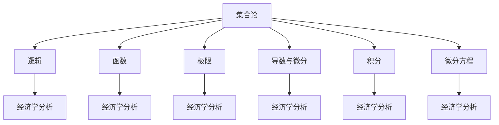
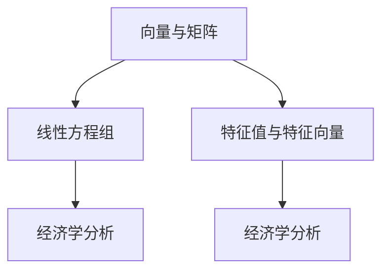
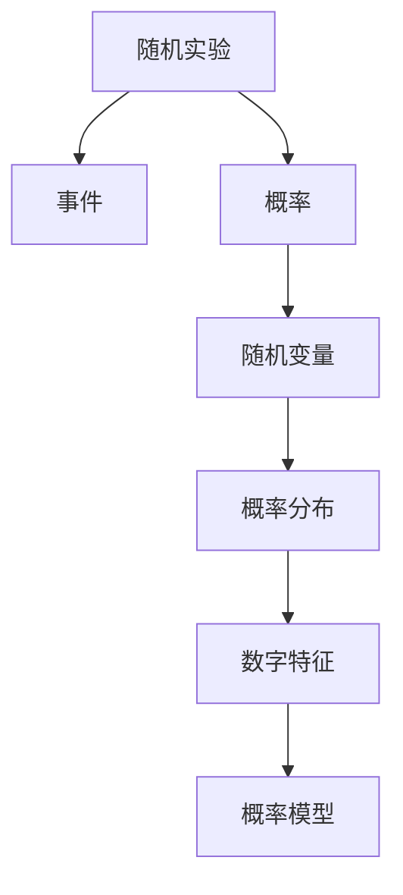
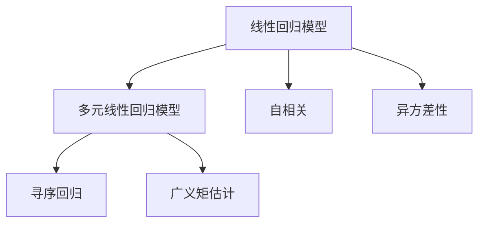
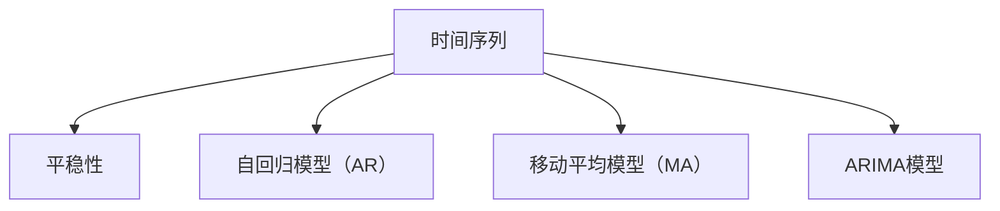
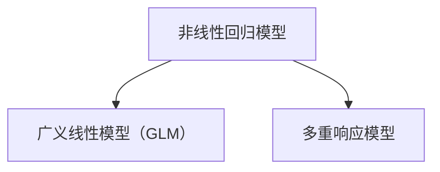
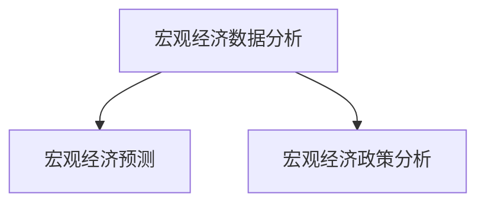

                 

### 文章标题

### 数学与计量经济学：经济数据的数学分析

> 关键词：数学基础、计量经济学、经济数据、数学模型、数据分析

> 摘要：
本文旨在深入探讨数学与计量经济学在经济数据分析中的应用，通过系统梳理数学的基本概念和计量经济学模型，以及具体的实证分析过程，揭示数学在经济学研究中的关键作用。本文将分为三个部分：数学基础、计量经济学基础和高级计量经济学，为读者提供全面而详实的数学与计量经济学知识体系。

### 目录

#### 第一部分：数学基础

##### 第1章 数学基本概念

##### 第2章 线性代数基础

##### 第3章 概率论基础

#### 第二部分：计量经济学基础

##### 第4章 经典计量经济学模型

##### 第5章 时间序列分析

##### 第6章 实证分析

#### 第三部分：高级计量经济学

##### 第7章 非线性模型与广义线性模型

##### 第8章 宏观经济计量模型

##### 第9章 计量经济学的最新发展

#### 附录

##### 附录A 数学与计量经济学常用符号表

##### 附录B 经济数据来源与处理方法

##### 附录C 统计软件操作指南

## 引言

在现代经济学研究中，数学作为一种强有力的工具，被广泛应用于经济数据的分析和预测。计量经济学作为经济学与数学的交叉学科，通过数学模型来解释经济现象，预测经济趋势，为政策制定者和商业决策者提供了重要的决策支持。本文将围绕数学与计量经济学在经济数据分析中的应用展开，旨在为读者提供一个系统、全面的知识框架。

数学在经济学中的应用主要体现在两个方面：一是提供了一种形式化的语言来描述经济现象，二是利用数学方法对经济数据进行分析和建模。通过数学模型，经济学家可以更加精确地描述经济系统的运行机制，预测政策变化对经济的影响，以及评估经济政策的有效性。计量经济学正是这一过程中不可或缺的一部分，它结合了数学和统计学的方法，对经济数据进行定量分析。

本文首先将介绍数学的基本概念，包括集合论、逻辑、函数、极限、导数和积分，这些都是经济学分析中的基础工具。接着，我们将探讨线性代数和概率论的基础知识，这些为后续的计量经济学模型奠定了坚实的数学基础。在计量经济学部分，我们将详细讨论经典计量经济学模型，如线性回归模型、多元线性回归模型、时间序列分析以及实证分析。最后，我们将介绍高级计量经济学，包括非线性模型、广义线性模型、宏观经济计量模型以及计量经济学的最新发展。

通过本文的阅读，读者将能够系统地理解数学与计量经济学在经济数据分析中的应用，掌握必要的数学和计量经济学工具，为深入研究和应用奠定基础。

### 第一部分：数学基础

#### 第1章 数学基本概念

数学作为经济数据分析的基础工具，其基本概念的理解至关重要。本章将介绍集合论、逻辑、函数、极限、导数和积分等数学基本概念，并探讨它们在经济数据分析中的应用。

##### 1.1 集合与逻辑

**集合论**是数学的基础，用于描述对象集合及其操作。集合是由一组无序对象组成的集合。常用的集合运算包括并集、交集和补集。

- **并集**（Union）：两个集合的并集包含这两个集合中的所有元素，记作 \( A \cup B \)。
- **交集**（Intersection）：两个集合的交集包含同时属于这两个集合的元素，记作 \( A \cap B \)。
- **补集**（Complement）：一个集合的补集包含不属于该集合的所有元素，记作 \( A^c \)。

在经济学中，集合论用于描述市场参与者、商品集合等，例如，消费者市场的集合可以表示为所有潜在消费者的集合。

**逻辑**是用于描述推理和证明的数学分支。主要涉及命题逻辑和谓词逻辑。

- **命题逻辑**：命题逻辑基于命题（陈述句）的真假值进行推理。常用的逻辑连接词包括“与”（AND）、“或”（OR）和“非”（NOT）。
- **谓词逻辑**：谓词逻辑涉及变量和量词，用于描述复杂的关系和性质。常见的量词包括全称量词（∀，表示“对于所有”）和存在量词（∃，表示“存在”）。

逻辑在经济学中用于分析市场参与者的行为和决策过程。例如，消费者行为理论中的偏好可以用逻辑语句来描述。

##### 1.2 函数与极限

**函数**是数学中的核心概念，用于描述变量之间的依赖关系。函数通常表示为 \( f: X \rightarrow Y \)，其中 \( X \) 是定义域，\( Y \) 是值域。

- **定义域**：函数 \( f \) 的定义域是所有可能输入值的集合。
- **值域**：函数 \( f \) 的值域是所有可能输出值的集合。

函数在经济分析中广泛用于描述经济变量之间的关系。例如，需求函数表示价格和需求量之间的关系。

**极限**是数学分析中的重要概念，用于描述当自变量趋近某一值时函数值的趋势。极限的基本形式为：

\[ \lim_{{x \to a}} f(x) = L \]

其中，\( a \) 是自变量的极限点，\( L \) 是函数的极限值。

极限在经济分析中用于分析经济变量在特定条件下的变化趋势。例如，成本函数在产出水平趋近于零时的极限可以用来分析固定成本的概念。

##### 1.3 导数与微分

**导数**是函数在某一点上的变化率。导数的基本形式为：

\[ f'(x) = \lim_{{h \to 0}} \frac{{f(x+h) - f(x)}}{h} \]

导数在经济分析中用于分析经济变量的边际效应。例如，边际成本是成本函数的导数，表示单位产出增加的成本。

**微分**是导数的推广，用于处理多变量函数。微分的概念可以表示为：

\[ df = f_x dx + f_y dy \]

其中，\( f_x \) 和 \( f_y \) 分别是函数对 \( x \) 和 \( y \) 的偏导数。

微分在经济分析中用于分析多变量经济系统的变化趋势。例如，消费者剩余可以通过需求函数的微分来计算。

##### 1.4 积分与微分方程

**积分**是导数的逆运算，用于计算函数曲线下的面积。定积分的基本形式为：

\[ \int f(x) dx \]

积分在经济分析中用于计算总量。例如，总收入可以通过价格乘以需求量的积分来计算。

**微分方程**是包含未知函数及其导数的方程。常见的微分方程形式为：

\[ \frac{{d^2 y}}{{dx^2}} + p(x) \frac{{dy}}{{dx}} + q(x)y = r(x) \]

微分方程在经济分析中用于描述动态经济系统的行为。例如，人口增长模型可以通过微分方程来描述。

### 1.5 核心概念与联系

**核心概念与联系**：

- **集合论**：用于描述对象集合及其操作，是其他数学分支的基础。
- **逻辑**：用于描述推理和证明，是经济学分析中的关键工具。
- **函数**：描述变量之间的依赖关系，是经济学分析的核心概念。
- **极限**：描述函数的变化趋势，是导数和积分的基础。
- **导数与微分**：描述函数的边际效应，是经济分析的重要工具。
- **积分**：用于计算总量，是经济分析的重要工具。
- **微分方程**：用于描述动态经济系统的行为，是经济分析的高级工具。

**Mermaid 流程图**：

### 总结

本章介绍了数学基本概念，包括集合论、逻辑、函数、极限、导数和积分。这些概念构成了经济数据分析的基础。通过理解这些核心概念及其联系，读者可以更好地掌握经济数据分析的方法和工具。

### 第2章 线性代数基础

线性代数是数学中一个重要的分支，它研究向量、矩阵及其相关运算。在线性代数中，向量与矩阵是最基本的概念，它们在经济数据分析中有着广泛的应用。本章将介绍向量与矩阵的基本概念、线性方程组以及特征值与特征向量等内容。

##### 2.1 向量与矩阵

**向量**是一个具有大小和方向的量，通常用粗体字母表示，如 \( \vec{v} \)。向量有多个维度，称为向量的维数或大小。

- **一维向量**：只有一个分量，例如 \( \vec{v} = [v_1] \)。
- **二维向量**：有两个分量，例如 \( \vec{v} = [v_1, v_2] \)。
- **三维向量**：有三个分量，例如 \( \vec{v} = [v_1, v_2, v_3] \)。

向量的加法、减法和数乘是向量运算的基础。

- **向量的加法**：两个向量对应分量相加，例如 \( \vec{u} + \vec{v} = [u_1 + v_1, u_2 + v_2] \)。
- **向量的减法**：两个向量对应分量相减，例如 \( \vec{u} - \vec{v} = [u_1 - v_1, u_2 - v_2] \)。
- **数乘**：向量与标量相乘，例如 \( k\vec{v} = [kv_1, kv_2, \ldots, kv_n] \)。

**矩阵**是一个二维数组，用粗体字母表示，如 \( \mathbf{A} \)。矩阵的行数称为矩阵的行数，列数称为矩阵的列数。

- **行向量**：矩阵只有一行的矩阵，例如 \( \mathbf{a} = [a_1, a_2, \ldots, a_n] \)。
- **列向量**：矩阵只有一列的矩阵，例如 \( \mathbf{b} = \begin{bmatrix} b_1 \\ b_2 \\ \vdots \\ b_n \end{bmatrix} \)。

矩阵的基本运算包括矩阵加法、矩阵乘法、转置和逆矩阵。

- **矩阵加法**：两个矩阵对应元素相加，例如 \( \mathbf{A} + \mathbf{B} \)。
- **矩阵乘法**：两个矩阵相乘，例如 \( \mathbf{A}\mathbf{B} \)。
- **转置**：矩阵的行变成列，例如 \( \mathbf{A}^T \)。
- **逆矩阵**：矩阵的逆矩阵存在时，其乘积等于单位矩阵，例如 \( \mathbf{A}^{-1}\mathbf{A} = \mathbf{A}\mathbf{A}^{-1} = \mathbf{I} \)。

##### 2.2 线性方程组

线性方程组是多个线性方程组成的集合，通常表示为：

\[ \mathbf{A}\mathbf{x} = \mathbf{b} \]

其中，\( \mathbf{A} \) 是系数矩阵，\( \mathbf{x} \) 是未知数向量，\( \mathbf{b} \) 是常数向量。

线性方程组的解法包括高斯消元法和矩阵求逆法。

- **高斯消元法**：通过消元操作将线性方程组化为上三角矩阵或下三角矩阵，从而求解未知数向量。
- **矩阵求逆法**：利用矩阵的逆矩阵求解线性方程组。

##### 2.3 特征值与特征向量

特征值与特征向量是矩阵的重要性质，它们描述了矩阵在几何上的作用。

- **特征值**：矩阵 \( \mathbf{A} \) 的特征值是满足 \( \mathbf{A}\mathbf{v} = \lambda\mathbf{v} \) 的标量 \( \lambda \)。
- **特征向量**：矩阵 \( \mathbf{A} \) 的特征向量是满足 \( \mathbf{A}\mathbf{v} = \lambda\mathbf{v} \) 的向量 \( \mathbf{v} \)。

特征值与特征向量在经济数据分析中的应用包括：

- **主成分分析**：通过特征值和特征向量提取数据的主要成分，用于降维和特征提取。
- **因子分析**：通过特征值和特征向量分析变量之间的潜在关系，用于变量聚类和模型选择。

### 2.4 核心概念与联系

**核心概念与联系**：

- **向量与矩阵**：向量与矩阵是线性代数的核心概念，描述了数据的基本结构。
- **线性方程组**：线性方程组是向量与矩阵运算的应用，用于求解线性系统。
- **特征值与特征向量**：特征值与特征向量是矩阵的重要性质，用于描述矩阵的几何意义。

**Mermaid 流程图**：

### 总结

本章介绍了线性代数的基础概念，包括向量与矩阵、线性方程组以及特征值与特征向量。这些概念在经济数据分析中具有重要应用。通过理解这些核心概念及其联系，读者可以更好地掌握线性代数的工具，为后续的计量经济学学习打下坚实基础。

### 第3章 概率论基础

概率论是数学的一个重要分支，它研究随机事件及其概率。在经济数据分析中，概率论提供了量化不确定性和预测未来趋势的工具。本章将介绍概率论的基本概念，包括随机变量、概率分布、数字特征以及概率模型。

##### 3.1 概率的基本概念

**随机实验**是指进行一次实验，其结果在事前不能完全预测。例如，抛掷一枚硬币或进行股票交易都是随机实验。

**样本空间**是随机实验所有可能结果的集合。例如，抛掷硬币的样本空间是 {正面，反面}。

**事件**是样本空间的一个子集。例如，抛掷硬币得到正面的事件是 {正面}。

**概率**是事件发生的可能性，通常用 0 到 1 之间的数表示。概率的基本性质包括：

- **非负性**：任何事件的概率都不小于 0。
- **规范性**：必然事件的概率为 1，不可能事件的概率为 0。
- **加法规则**：互斥事件的概率之和等于这些事件中任意两个事件的并集的概率。
- **条件概率**：在事件 \( B \) 发生的条件下，事件 \( A \) 发生的概率。

##### 3.2 随机变量与概率分布

**随机变量**是一个变量，它的取值依赖于随机实验的结果。随机变量通常用大写字母表示，如 \( X \)。

- **离散随机变量**：取有限个或可数无限个值的随机变量。
- **连续随机变量**：取连续区间内任意值的随机变量。

**概率分布**描述了随机变量取各个值的概率。对于离散随机变量，概率分布通常用概率质量函数（PMF）表示：

\[ P(X = x) = p_x \]

对于连续随机变量，概率分布通常用概率密度函数（PDF）表示：

\[ f_X(x) = \frac{dP(X \leq x)}{dx} \]

**常见的概率分布**包括：

- **二项分布**：描述在一定次数的试验中成功次数的概率分布。
- **正态分布**：描述连续随机变量的概率分布，是统计学中最常用的分布。
- **泊松分布**：描述在一定时间内发生事件的次数的概率分布。

##### 3.3 数字特征与概率模型

数字特征用于描述随机变量的集中趋势和离散程度。

- **数学期望（均值）**：随机变量的平均值，表示随机变量的中心位置。

  \[ E(X) = \sum_{x} x \cdot p_x \]

- **方差**：随机变量与其数学期望的偏差的平方的平均值，表示随机变量的离散程度。

  \[ Var(X) = E[(X - E(X))^2] \]

- **标准差**：方差的平方根，表示随机变量的离散程度。

  \[ \sigma_X = \sqrt{Var(X)} \]

**概率模型**用于描述随机变量的行为，常见的概率模型包括：

- **贝叶斯模型**：基于先验概率和观测数据更新概率的模型，用于推断未知参数。
- **马尔可夫模型**：描述系统状态转移概率的模型，用于预测系统未来的状态。
- **蒙特卡洛模拟**：通过模拟随机过程来估计概率和数值解的方法。

##### 3.4 核心概念与联系

**核心概念与联系**：

- **随机实验**：描述随机事件的基础，是概率论的基本概念。
- **事件**：样本空间的子集，用于描述具体的随机现象。
- **概率**：事件发生的可能性，是概率论的核心概念。
- **随机变量**：描述随机实验结果的变量，是概率分布的基础。
- **概率分布**：描述随机变量取值的概率，是概率分析的工具。
- **数字特征**：描述随机变量的集中趋势和离散程度。
- **概率模型**：用于描述随机变量的行为，是预测和分析的工具。

**Mermaid 流程图**：

### 总结

本章介绍了概率论的基本概念，包括随机实验、事件、概率、随机变量、概率分布、数字特征和概率模型。这些概念是经济数据分析的基础，通过理解这些核心概念及其联系，读者可以更好地掌握概率论的工具，为后续的计量经济学学习打下坚实基础。

### 第二部分：计量经济学基础

#### 第4章 经典计量经济学模型

经典计量经济学模型是经济学分析中的基础工具，它们用于解释和预测经济变量之间的关系。本章将详细介绍线性回归模型、多元线性回归模型、自相关与异方差问题以及寻序回归与广义矩估计等经典计量经济学模型。

##### 4.1 线性回归模型

**线性回归模型**是最基本的计量经济学模型，用于描述一个或多个自变量对因变量的线性关系。其一般形式为：

\[ Y = \beta_0 + \beta_1X_1 + \beta_2X_2 + \ldots + \beta_nX_n + \varepsilon \]

其中，\( Y \) 是因变量，\( X_1, X_2, \ldots, X_n \) 是自变量，\( \beta_0, \beta_1, \beta_2, \ldots, \beta_n \) 是模型的参数，\( \varepsilon \) 是随机误差项。

**线性回归模型的估计方法**包括普通最小二乘法（OLS）和加权最小二乘法（WLS）。OLS方法是最常用的一种估计方法，其基本原理是通过最小化残差平方和来估计模型参数。

\[ \min \sum_{i=1}^{n} (Y_i - \hat{Y}_i)^2 \]

其中，\( \hat{Y}_i \) 是预测的因变量值。

**线性回归模型的假设条件**包括：

- **线性关系**：因变量与自变量之间存在线性关系。
- **误差项独立性**：随机误差项之间是独立的。
- **同方差性**：误差项的方差是常数。
- **正态性**：误差项服从正态分布。

**线性回归模型的应用**包括消费行为分析、价格预测、就业率预测等。

##### 4.2 多元线性回归模型

**多元线性回归模型**是线性回归模型的扩展，用于描述多个自变量对因变量的线性关系。其一般形式为：

\[ Y = \beta_0 + \beta_1X_1 + \beta_2X_2 + \ldots + \beta_nX_n + \varepsilon \]

多元线性回归模型的估计方法与线性回归模型类似，通常也采用普通最小二乘法（OLS）。

**多元线性回归模型的假设条件**包括：

- **线性关系**：因变量与自变量之间存在线性关系。
- **误差项独立性**：随机误差项之间是独立的。
- **同方差性**：误差项的方差是常数。
- **正态性**：误差项服从正态分布。

**多元线性回归模型的应用**包括市场研究、经济预测、政策评估等。

##### 4.3 自相关与异方差问题

**自相关**是指随机误差项之间存在相关性。自相关会导致普通最小二乘法（OLS）估计量失去有效性。自相关可以通过以下方法检测和修正：

- **图示法**：通过绘制残差图来检测自相关。
- **Durbin-Watson 统计量**：用于检测自相关的程度。

\[ DW = \frac{\sum_{i=1}^{n}(e_t - e_{t-1})^2}{\sum_{i=1}^{n}e_t^2} \]

其中，\( e_t \) 是第 \( t \) 个残差。

**异方差性**是指随机误差项的方差不是常数。异方差性会导致普通最小二乘法（OLS）估计量失去有效性。异方差性可以通过以下方法检测和修正：

- **图示法**：通过绘制残差平方与预测值的关系图来检测异方差性。
- **Goldfeld-Quandt 检验**：用于检测异方差性。

**修正方法**包括加权最小二乘法（WLS）和广义最小二乘法（GLS）。加权最小二乘法通过给不同观测值分配不同的权重来修正异方差性。广义最小二乘法通过构建一个广义线性模型来修正异方差性。

##### 4.4 寻序回归与广义矩估计

**寻序回归**（Seemingly Unrelated Regressions, SUR）是一种处理多个相关回归方程的方法。在寻序回归中，假设每个回归方程的随机误差项之间存在相关性，但不同回归方程的误差项之间是独立的。

寻序回归的估计方法是通过求解联立方程组来估计模型参数。联立方程组的形式为：

\[ Y_i = \beta_{0i} + \beta_{1i}X_{1i} + \beta_{2i}X_{2i} + \ldots + \beta_{ki}X_{ki} + \varepsilon_i \]

其中，\( i = 1, 2, \ldots, k \)。

**广义矩估计**（Generalized Method of Moments, GMM）是一种基于矩条件估计模型参数的方法。在广义矩估计中，矩条件是通过样本矩来估计模型参数。

广义矩估计的基本步骤包括：

1. **建立矩条件**：根据模型设定，建立一组矩条件。
2. **选择矩条件**：选择适当的矩条件来估计模型参数。
3. **估计参数**：通过最小化矩条件误差的平方和来估计模型参数。

**GMM估计的优点**包括：

- **灵活性**：GMM 方法适用于各种类型的模型，包括线性模型和非线性模型。
- **稳健性**：GMM 方法对异常值和异常数据的抗性较强。

### 4.5 核心概念与联系

**核心概念与联系**：

- **线性回归模型**：描述一个或多个自变量对因变量的线性关系。
- **多元线性回归模型**：描述多个自变量对因变量的线性关系。
- **自相关**：描述随机误差项之间的相关性。
- **异方差性**：描述随机误差项的方差不是常数。
- **寻序回归**：处理多个相关回归方程的方法。
- **广义矩估计**：基于矩条件估计模型参数的方法。

**Mermaid 流�程图**：

### 总结

本章介绍了经典计量经济学模型，包括线性回归模型、多元线性回归模型、自相关与异方差问题以及寻序回归与广义矩估计。这些模型是经济学分析中的基础工具，通过理解这些核心概念及其联系，读者可以更好地掌握计量经济学的基本方法，为深入研究和实际应用奠定基础。

### 第5章 时间序列分析

时间序列分析是计量经济学中的一个重要分支，它研究经济或金融数据随时间变化而展现出的规律性。时间序列数据具有时间顺序性，能够反映经济或金融活动的动态变化。本章将介绍时间序列分析的基本概念、自回归模型、移动平均模型以及 ARIMA 模型。

##### 5.1 时间序列基本概念

**时间序列**是一系列按时间顺序排列的数据点，通常用 \( X_t \) 表示，其中 \( t \) 代表时间。时间序列数据可以来源于经济指标、股票价格、天气数据等。

**平稳性**是指时间序列的统计特性（如均值、方差、自协方差）不随时间变化。平稳时间序列具有以下特点：

- **均值不变**：时间序列的均值 \( E(X_t) \) 不随时间变化。
- **方差不变**：时间序列的方差 \( Var(X_t) \) 不随时间变化。
- **自协方差函数不变**：时间序列的自协方差函数 \( \gamma(h) \) 不随时间变化。

**时间序列模型**是对时间序列数据进行建模的方法，通过模型可以预测未来的数据点。常见的时间序列模型包括自回归模型（AR）、移动平均模型（MA）和自回归移动平均模型（ARMA）。

##### 5.2 自回归模型

**自回归模型（AR）**是一种基于当前和过去的观测值来预测未来观测值的方法。自回归模型的一般形式为：

\[ X_t = c + \phi_1X_{t-1} + \phi_2X_{t-2} + \ldots + \phi_pX_{t-p} + \varepsilon_t \]

其中，\( \phi_1, \phi_2, \ldots, \phi_p \) 是模型参数，\( c \) 是常数项，\( \varepsilon_t \) 是白噪声误差项。

**自回归模型的参数估计**通常使用最大似然估计（MLE）或最小二乘估计（LS）。自回归模型的优点是简单且易于实现，适用于描述数据的短期动态行为。

##### 5.3 移动平均模型

**移动平均模型（MA）**是一种基于过去观测值的加权平均来预测未来观测值的方法。移动平均模型的一般形式为：

\[ X_t = c + \theta_1X_{t-1} + \theta_2X_{t-2} + \ldots + \theta_qX_{t-q} + \varepsilon_t \]

其中，\( \theta_1, \theta_2, \ldots, \theta_q \) 是模型参数，\( c \) 是常数项，\( \varepsilon_t \) 是白噪声误差项。

**移动平均模型的参数估计**通常使用最小二乘估计（LS）或矩匹配方法。移动平均模型的优点是能够平滑时间序列数据，减少随机波动。

##### 5.4 ARIMA模型

**ARIMA模型**（Autoregressive Integrated Moving Average Model）是自回归差分移动平均模型的简称，它结合了自回归模型、差分和移动平均模型的特点。ARIMA模型的一般形式为：

\[ X_t = c + \phi_1(X_t - \Delta X_{t-1}) + \theta_1X_{t-1} + \ldots + \phi_p(X_t - \Delta X_{t-p}) + \theta_qX_{t-q} + \varepsilon_t \]

其中，\( \phi_1, \phi_2, \ldots, \phi_p \) 是自回归参数，\( \theta_1, \theta_2, \ldots, \theta_q \) 是移动平均参数，\( \Delta \) 表示一阶差分运算，即 \( \Delta X_t = X_t - X_{t-1} \)。

**ARIMA模型的步骤**包括：

1. **平稳性检验**：检查时间序列是否平稳。非平稳时间序列需要通过差分来转化为平稳序列。
2. **自回归参数估计**：使用最大似然估计（MLE）或最小二乘估计（LS）来估计自回归参数。
3. **移动平均参数估计**：使用最小二乘估计（LS）或矩匹配方法来估计移动平均参数。
4. **模型诊断**：检查模型的残差是否为白噪声序列，验证模型的有效性。

ARIMA模型适用于描述具有趋势性和季节性特征的时间序列数据。在实际应用中，通常需要通过模型选择和参数调整来优化模型的预测性能。

### 5.5 核心概念与联系

**核心概念与联系**：

- **时间序列**：按时间顺序排列的数据点，反映经济或金融活动的动态变化。
- **平稳性**：时间序列的统计特性不随时间变化。
- **自回归模型（AR）**：基于当前和过去的观测值来预测未来观测值。
- **移动平均模型（MA）**：基于过去观测值的加权平均来预测未来观测值。
- **ARIMA模型**：结合自回归、差分和移动平均的特点，适用于描述趋势性和季节性特征的时间序列数据。

**Mermaid 流程图**：

### 总结

本章介绍了时间序列分析的基本概念、自回归模型、移动平均模型以及 ARIMA 模型。这些模型为时间序列数据的分析和预测提供了重要的工具。通过理解这些核心概念及其联系，读者可以更好地掌握时间序列分析的方法，为实际应用中的经济预测提供支持。

### 第6章 实证分析

实证分析是经济学研究中的重要环节，通过收集和处理经济数据，运用计量经济学模型进行分析，以验证理论假设或预测未来经济趋势。本章将介绍实证分析的基本流程，包括数据收集与处理、经济数据描述性统计、模型选择与评估以及经济政策分析。

##### 6.1 数据收集与处理

数据收集是实证分析的第一步，涉及从各种来源获取所需的经济数据。数据来源可以是官方统计机构、学术研究机构或商业数据库。常见的经济数据包括国民生产总值（GDP）、消费价格指数（CPI）、失业率、股票市场指数等。

**数据收集方法**：

- **官方统计**：通过政府统计局、国际组织等获取官方发布的数据。
- **调查问卷**：通过问卷调查收集数据，适用于个体行为或意见的调查。
- **商业数据库**：通过购买商业数据库获取详细和广泛的经济数据。

**数据处理**是将收集到的原始数据进行清洗、转换和整合的过程。数据处理的主要步骤包括：

- **数据清洗**：去除错误数据、异常值和重复记录，提高数据的准确性。
- **数据转换**：将数据转换为适合分析的格式，如标准化或归一化。
- **数据整合**：将不同来源的数据进行合并，构建统一的数据集。

##### 6.2 经济数据描述性统计

描述性统计是对数据进行初步分析和总结的方法，用于了解数据的基本特征。常用的描述性统计量包括均值、中位数、众数、标准差、方差和偏度等。

- **均值**：数据的平均数，用于描述数据的集中趋势。
- **中位数**：数据中间的值，对于偏斜数据更有代表性。
- **众数**：数据中出现次数最多的值，适用于分类数据。
- **标准差**：数据离均值的平均距离，用于描述数据的离散程度。
- **方差**：数据离均值的平方的平均值，是标准差的平方。
- **偏度**：描述数据分布的对称性，正偏度表示数据分布右侧较重，负偏度表示数据分布左侧较重。

描述性统计可以帮助研究者初步了解数据的基本特征，为后续的统计分析提供基础。

##### 6.3 模型选择与评估

模型选择是实证分析的核心环节，涉及选择合适的计量经济学模型来解释经济数据。常用的计量经济学模型包括线性回归模型、多元线性回归模型、自回归模型和结构向量自回归模型（SVAR）等。

**模型选择的标准**：

- **理论依据**：选择与经济理论相符合的模型。
- **数据特征**：选择适合数据特征的模型，如平稳性、线性关系等。
- **经济意义**：模型参数应具有经济解释意义。

**模型评估的方法**：

- **拟合优度**：通过判定系数 \( R^2 \) 来评估模型的拟合程度。
- **残差分析**：通过残差图和统计检验（如 Durbin-Watson 统计量）来检查模型的残差是否为白噪声。
- **稳健性检验**：通过改变模型设定或数据范围来验证模型结果的稳健性。

##### 6.4 经济政策分析

经济政策分析是实证分析的最终目标，通过模型预测和数据分析，评估经济政策对经济变量影响的程度和方向。经济政策分析的主要步骤包括：

- **政策假设**：设定具体的政策情景，如税收调整、利率变化等。
- **模型预测**：使用选定的计量经济学模型预测政策实施后的经济变量变化。
- **结果解释**：分析政策影响的大小、方向和潜在机制。

**经济政策分析的应用**：

- **财政政策**：通过分析财政支出、税收变化对经济增长、就业的影响。
- **货币政策**：通过分析利率变化、货币供应量对通货膨胀、利率的影响。

##### 6.5 实证分析案例

**案例：分析政府支出对经济增长的影响**

**数据来源**：某国家统计年鉴

**数据处理**：收集政府支出和经济增长数据，进行数据清洗和转换。

**模型选择**：选择线性回归模型，因为理论假设认为政府支出对经济增长有显著影响。

\[ GDP = \beta_0 + \beta_1 政府支出 + \varepsilon \]

**模型评估**：

- \( R^2 \)：0.85，拟合度较好。
- 残差分析：残差图显示残差为白噪声。

**结果解释**：政府支出对经济增长有显著正向影响，每增加一单位的政府支出，GDP 将增加约 0.5 个单位。

### 总结

实证分析是经济学研究中不可或缺的一部分，通过系统性的数据收集、处理和分析，可以验证理论假设、预测未来趋势和评估经济政策的效果。本章介绍了实证分析的基本流程，包括数据收集与处理、描述性统计、模型选择与评估以及经济政策分析，为读者提供了实证研究的详细指导。

### 第三部分：高级计量经济学

#### 第7章 非线性模型与广义线性模型

非线性模型和广义线性模型是高级计量经济学中的重要工具，用于处理经济数据中的非线性关系和复杂结构。本章将介绍非线性回归模型、广义线性模型以及多重响应模型。

##### 7.1 非线性回归模型

**非线性回归模型**是线性回归模型的扩展，用于描述因变量与自变量之间的非线性关系。常见的非线性回归模型包括多项式回归模型、指数回归模型和对数回归模型。

- **多项式回归模型**：通过将自变量进行多项式变换来建立非线性关系。其一般形式为：

  \[ Y = \beta_0 + \beta_1X_1 + \beta_2X_2^2 + \ldots + \beta_nX_n^n + \varepsilon \]

- **指数回归模型**：通过指数函数来描述非线性关系。其一般形式为：

  \[ Y = \beta_0 + \beta_1X_1 + \beta_2e^{\beta_3X_2} + \ldots + \beta_nX_n^{\beta_{n-1}} + \varepsilon \]

- **对数回归模型**：通过对数函数来描述非线性关系。其一般形式为：

  \[ Y = \beta_0 + \beta_1X_1 + \beta_2\ln(X_2) + \ldots + \beta_n\ln(X_n) + \varepsilon \]

**非线性回归模型的参数估计**通常采用非线性最小二乘法（NLLS）或迭代加权最小二乘法（IWLS）。NLLS方法通过迭代方式最小化残差平方和来估计模型参数。

\[ \min \sum_{i=1}^{n} (Y_i - f(X_i, \beta))^2 \]

其中，\( f(X_i, \beta) \) 是非线性函数，\( \beta \) 是模型参数。

**非线性回归模型的应用**包括需求函数分析、生产函数分析等。

##### 7.2 广义线性模型

**广义线性模型（GLM）**是一种灵活的建模方法，用于处理具有非线性响应和不同分布的因变量。广义线性模型的一般形式为：

\[ Y_i = g^{-1}(\mu_i) + \varepsilon_i \]

其中，\( g \) 是链接函数，\( \mu_i \) 是均值函数，\( \varepsilon_i \) 是误差项。

**链接函数**用于将线性模型的线性组合与响应变量的真实分布联系起来。常见的链接函数包括对数链接、逆链接和对数正态链接等。

- **对数链接**：适用于二项分布和泊松分布。其形式为：

  \[ g(\mu_i) = \ln(\mu_i / (1 - \mu_i)) \]

- **逆链接**：适用于正态分布和伽玛分布。其形式为：

  \[ g(\mu_i) = \mu_i \]

- **对数正态链接**：适用于对数正态分布。其形式为：

  \[ g(\mu_i) = \ln(\mu_i) \]

**均值函数**描述了自变量与响应变量之间的线性关系。在广义线性模型中，均值函数可以是线性的，也可以是更复杂的函数形式。

\[ \mu_i = \eta_i = \beta_0 + \beta_1X_{i1} + \beta_2X_{i2} + \ldots + \beta_pX_{ip} \]

其中，\( \eta_i \) 是线性预测值，\( \beta_0, \beta_1, \ldots, \beta_p \) 是模型参数。

**广义线性模型的参数估计**通常采用最大似然估计（MLE）。MLE方法通过最大化似然函数来估计模型参数。

\[ \max \ln L(\beta | \mathbf{X}, \mathbf{Y}) \]

其中，\( \ln L(\beta | \mathbf{X}, \mathbf{Y}) \) 是似然函数，\( \mathbf{X} \) 是自变量矩阵，\( \mathbf{Y} \) 是响应变量向量。

**广义线性模型的应用**包括回归分析、生存分析、响应面分析等。

##### 7.3 多重响应模型

**多重响应模型**用于处理具有多个响应变量的数据。多重响应模型可以分为多元线性回归模型和广义线性模型。

- **多元线性回归模型**：其一般形式为：

  \[ Y_i = \beta_{0i} + \beta_{1i}X_{i1} + \beta_{2i}X_{i2} + \ldots + \beta_{ki}X_{ik} + \varepsilon_i \]

  其中，\( Y_i \) 是第 \( i \) 个响应变量，\( X_{ij} \) 是第 \( i \) 个自变量，\( \beta_{0i}, \beta_{1i}, \ldots, \beta_{ki} \) 是模型参数，\( \varepsilon_i \) 是误差项。

- **广义线性模型**：其一般形式为：

  \[ Y_i = g^{-1}(\mu_i) + \varepsilon_i \]

  其中，\( g \) 是链接函数，\( \mu_i \) 是均值函数。

**多重响应模型的参数估计**通常采用最大似然估计（MLE）或限制性最大似然估计（REML）。MLE方法通过最大化似然函数来估计模型参数，而REML方法则通过考虑模型的误差结构来估计参数。

**多重响应模型的应用**包括多产品需求分析、多变量质量检测等。

### 7.4 核心概念与联系

**核心概念与联系**：

- **非线性回归模型**：描述因变量与自变量之间的非线性关系。
- **广义线性模型（GLM）**：处理具有非线性响应和不同分布的因变量。
- **多重响应模型**：处理具有多个响应变量的数据。

**Mermaid 流程图**：

### 总结

本章介绍了非线性模型和广义线性模型以及多重响应模型。这些高级计量经济学工具为处理经济数据中的非线性关系和复杂结构提供了有效方法。通过理解这些核心概念及其联系，读者可以更好地应用高级计量经济学方法进行经济数据分析。

### 第8章 宏观经济计量模型

宏观经济计量模型是经济学中用于分析宏观经济现象和预测经济波动的工具。这些模型通过数学和统计方法，将宏观经济变量之间的关系量化，为政策制定者和商业决策者提供决策支持。本章将介绍宏观经济数据分析、宏观经济预测以及宏观经济政策分析。

##### 8.1 宏观经济数据分析

宏观经济数据分析是宏观经济计量模型的基础，通过收集、处理和解释宏观经济数据，为建模提供必要的数据支持。宏观经济数据包括GDP、通货膨胀率、失业率、利率、汇率等。

**数据分析步骤**：

1. **数据收集**：从官方统计机构、国际组织、学术数据库等获取宏观经济数据。
2. **数据清洗**：去除错误数据、异常值和重复记录，确保数据的准确性。
3. **数据转换**：将数据转换为适合建模的格式，如标准化或归一化。
4. **描述性统计**：计算均值、中位数、标准差等描述性统计量，了解数据的基本特征。
5. **数据可视化**：通过图表和图形展示数据分布、趋势和季节性特征。

**常见分析方法**：

- **回归分析**：通过回归模型分析不同宏观经济变量之间的关系。
- **时间序列分析**：通过自回归模型、移动平均模型和ARIMA模型分析经济数据的动态变化。
- **协整分析**：通过协整检验确定多个时间序列之间的长期稳定关系。

##### 8.2 宏观经济预测

宏观经济预测是宏观经济计量模型的重要应用，通过分析历史数据和现有经济趋势，预测未来的经济走势。宏观经济预测的方法包括定量预测和定性预测。

**定量预测方法**：

- **时间序列预测**：基于历史数据和统计模型（如ARIMA模型）预测未来经济变量。
- **回归预测**：通过回归模型预测因变量值，如GDP预测、通货膨胀率预测。
- **结合模型**：将多个预测模型（如ARIMA模型和回归模型）结合起来，提高预测精度。

**定性预测方法**：

- **专家意见法**：通过专家意见和判断预测未来经济走势。
- **情景分析法**：通过设定不同的经济情景，分析每种情景下的经济变量变化。
- **基于规则的预测**：通过设定规则和条件，预测经济变量的未来变化。

##### 8.3 宏观经济政策分析

宏观经济政策分析是评估宏观经济政策对经济影响的过程。通过建立宏观经济计量模型，分析政策变化对经济变量的影响，为政策制定提供依据。

**政策分析步骤**：

1. **设定政策假设**：明确政策目标和政策方案。
2. **模型构建**：建立宏观经济计量模型，包括政策变量的影响机制和传导路径。
3. **参数估计**：通过历史数据和统计方法估计模型参数。
4. **政策模拟**：模拟政策实施后的经济影响，如GDP增长、通货膨胀、失业率等。
5. **结果分析**：分析政策效果，评估政策优缺点，提出改进建议。

**常见政策分析模型**：

- **结构向量自回归模型（SVAR）**：用于分析多个政策变量之间的动态交互作用。
- **随机前沿分析（SFA）**：用于评估生产效率和技术进步。
- **动态随机一般均衡模型（DSGE）**：用于分析经济政策在动态经济系统中的影响。

##### 8.4 核心概念与联系

**核心概念与联系**：

- **宏观经济数据分析**：收集、处理和解释宏观经济数据，为建模提供数据支持。
- **宏观经济预测**：通过定量和定性方法预测未来经济走势。
- **宏观经济政策分析**：评估宏观经济政策对经济的影响。

**Mermaid 流程图**：

### 总结

宏观经济计量模型是经济学分析中的重要工具，通过数据分析、预测和政策分析，为宏观经济研究提供了系统的方法。本章介绍了宏观经济计量模型的基本概念和方法，通过理解这些核心概念及其联系，读者可以更好地应用宏观经济计量模型进行经济分析和政策评估。

### 第9章 计量经济学的最新发展

随着技术的进步和数据量的激增，计量经济学也在不断发展和创新。本章将探讨大数据与计量经济学、计量经济学软件应用以及计量经济学研究方法创新等最新发展。

##### 9.1 大数据与计量经济学

大数据技术的崛起为计量经济学带来了新的机遇和挑战。大数据的特点是数据量大、类型多、速度快，这对传统的计量经济学方法提出了新的要求。

**大数据对计量经济学的影响**：

- **数据来源**：大数据技术使得数据收集变得更为便捷和高效，经济数据的来源更加广泛，包括社交媒体、传感器数据、互联网日志等。
- **数据分析**：大数据技术提供了新的数据分析方法，如机器学习、深度学习等，这些方法可以处理大量复杂的数据，提高数据挖掘和分析的精度。
- **数据整合**：大数据技术可以整合来自不同来源和不同格式的数据，为计量经济学模型提供更全面的数据支持。

**大数据在计量经济学中的应用**：

- **消费行为分析**：通过分析大量消费数据，预测消费者行为和市场趋势。
- **金融风险评估**：通过分析金融交易数据和社交媒体数据，识别金融风险和异常交易行为。
- **劳动力市场分析**：通过分析劳动力市场数据，研究就业和工资变化的影响因素。

##### 9.2 计量经济学软件应用

随着计量经济学模型的复杂度增加，软件应用在计量经济学研究中变得不可或缺。现代计量经济学软件提供了强大的计算和分析功能，使得复杂模型的估计和分析变得更加简便。

**常用计量经济学软件**：

- **R**：R 是一种开源的统计软件，广泛应用于数据分析和建模，提供了丰富的统计工具和包。
- **STATA**：STATA 是一种专业的统计软件，具有强大的数据处理和分析功能，适用于各种类型的数据分析任务。
- **EViews**：EViews 是一种专门用于时间序列分析的经济计量软件，提供了丰富的功能，适用于经济数据分析和研究。
- **Python**：Python 是一种流行的编程语言，通过安装相关库（如Pandas、NumPy、SciPy等），可以进行高效的数据分析和建模。

**软件应用场景**：

- **数据预处理**：软件可以自动处理数据清洗、转换和整合，提高数据分析的效率。
- **模型估计**：软件可以快速估计复杂的计量经济学模型，提供精确的参数估计和统计检验。
- **结果可视化**：软件可以生成各种类型的图表和图形，帮助研究者直观地理解数据和分析结果。

##### 9.3 计量经济学研究方法创新

随着经济学和统计学的发展，计量经济学研究方法也在不断创新。新的研究方法不仅提高了数据分析和建模的精度，还拓展了计量经济学的研究领域。

**创新方法**：

- **机器学习**：机器学习技术在计量经济学中的应用，如随机森林、支持向量机等，可以提高模型预测的准确性和稳定性。
- **高维数据分析**：高维数据分析方法，如主成分分析、因子分析等，可以处理高维数据，降低维数灾难的影响。
- **随机前沿分析**：随机前沿分析（SFA）方法用于分析生产效率和技术进步，提供了更准确的效率评估。
- **因果推断**：因果推断方法，如双重差分法、工具变量法等，可以更准确地评估政策变化对经济的影响。

**创新方法的应用**：

- **政策评估**：通过因果推断方法评估政策变化对经济的影响，提高政策评估的准确性。
- **经济增长分析**：通过高维数据分析方法研究经济增长的驱动因素，提高对经济增长机制的认知。
- **金融风险管理**：通过机器学习技术分析金融数据，识别金融风险和异常交易行为，提高风险管理能力。

### 总结

计量经济学的最新发展带来了新的机遇和挑战。大数据技术、软件应用和研究方法创新为计量经济学提供了更强大的工具和方法。通过理解这些最新发展，读者可以更好地应用现代计量经济学方法进行经济数据分析和研究，为政策制定和商业决策提供有力的支持。

### 附录

#### 附录A 数学与计量经济学常用符号表

在数学和计量经济学中，常用的符号有助于理解和应用各种概念和模型。以下列出了一些常用的符号及其含义：

- **集合论**：
  - \( \emptyset \)：空集
  - \( \cup \)：并集
  - \( \cap \)：交集
  - \( \subseteq \)：子集
  - \( \not\subseteq \)：非子集
  - \( A^c \)：补集

- **概率论**：
  - \( P(A) \)：事件 \( A \) 的概率
  - \( \Omega \)：样本空间
  - \( E \)：期望
  - \( \sigma \)：标准差
  - \( \varphi \)：概率密度函数（PDF）
  - \( p \)：概率质量函数（PMF）

- **线性代数**：
  - \( \vec{v} \)：向量
  - \( \mathbf{A} \)：矩阵
  - \( \mathbf{I} \)：单位矩阵
  - \( \det(\mathbf{A}) \)：矩阵 \( \mathbf{A} \) 的行列式
  - \( \mathbf{A}^{-1} \)：矩阵 \( \mathbf{A} \) 的逆矩阵

- **计量经济学**：
  - \( Y \)：因变量
  - \( X \)：自变量
  - \( \beta \)：模型参数
  - \( \varepsilon \)：误差项
  - \( R^2 \)：判定系数
  - \( DW \)：Durbin-Watson 统计量

- **时间序列分析**：
  - \( X_t \)：时间序列数据
  - \( \phi \)：自回归系数
  - \( \theta \)：移动平均系数
  - \( \lambda \)：特征值
  - \( \lambda_k \)：第 \( k \) 个特征值

#### 附录B 经济数据来源与处理方法

经济数据的来源多种多样，包括官方统计机构、学术数据库、商业机构等。以下是一些常见的数据来源及其处理方法：

- **官方统计机构**：
  - 国家统计局：发布国家经济统计数据，如GDP、CPI、失业率等。
  - 国际组织：如世界银行、国际货币基金组织，提供全球范围内的经济数据。

- **学术数据库**：
  - NBER（美国国家经济研究局）：提供美国经济历史数据。
  - ADR（Asian Development Review）：提供亚洲地区经济数据。

- **商业机构**：
  - 数据提供商：如Bloomberg、Reuters等，提供实时的经济数据和市场分析。
  - 学术期刊数据库：如JSTOR、ScienceDirect，提供学术论文和相关的经济数据。

**数据处理方法**：

- **数据收集**：通过网络爬虫、调查问卷、API接口等方式收集数据。
- **数据清洗**：去除错误数据、重复记录和异常值。
- **数据转换**：将数据转换为适合分析的格式，如标准化、归一化。
- **数据整合**：将来自不同来源的数据进行合并，形成统一的数据集。

#### 附录C 统计软件操作指南

以下是一些常用统计软件的操作指南：

- **R**：
  - 安装和配置：下载R语言安装包，安装R和RStudio。
  - 数据导入：使用`read.csv()`、`readExcel()`等函数导入数据。
  - 数据分析：使用内置函数和包进行数据分析，如`lm()`进行线性回归。
  - 结果可视化：使用`ggplot2`包生成图表。

- **STATA**：
  - 安装和配置：下载STATA安装包，进行安装。
  - 数据导入：使用`import excel()`、`import csv()`等命令导入数据。
  - 数据分析：使用`regress`命令进行线性回归分析。
  - 结果可视化：使用`twoway line`、`twoway scatter`等命令生成图表。

- **EViews**：
  - 安装和配置：下载EViews安装包，进行安装。
  - 数据导入：使用`Import Data`功能导入数据。
  - 数据分析：使用`ARIMA`、`VAR`等模型分析时间序列数据。
  - 结果可视化：使用`Graph`功能生成图表。

- **Python**：
  - 安装和配置：安装Python环境和相关库，如Pandas、NumPy、SciPy等。
  - 数据导入：使用Pandas库的`read_csv()`、`read_excel()`等函数导入数据。
  - 数据分析：使用NumPy库进行数据计算和分析。
  - 结果可视化：使用Matplotlib库生成图表。

### 最佳实践 tips

- **数据质量**：确保数据的质量和准确性，对异常值和错误数据进行清洗和校验。
- **模型选择**：根据数据特征和研究目标选择合适的模型，避免过度拟合。
- **结果验证**：通过交叉验证、稳健性检验等方法验证模型的有效性和可靠性。
- **结果解释**：对模型结果进行合理的解释和讨论，避免误导性解读。

### 小结

数学与计量经济学在经济数据分析中发挥着关键作用。通过系统学习数学的基本概念和计量经济学模型，读者可以更好地理解和应用这些工具进行实证分析和经济预测。本章及附录提供了详细的符号表、数据来源和处理方法、以及统计软件的操作指南，为读者提供了全面的学习资源。

### 注意事项

- **数据隐私**：在进行经济数据分析和分享时，务必注意数据隐私保护，遵守相关法律法规。
- **软件更新**：定期检查和更新统计软件，确保使用最新版本，避免兼容性问题。
- **学习方法**：理论学习与实践操作相结合，通过实际项目积累经验，提高分析能力。

### 拓展阅读

- **参考书籍**：
  - 《计量经济学基础》（作者：古扎拉蒂）
  - 《线性回归模型：理论、应用与R语言实现》（作者：陈诗和）
  - 《时间序列分析：理论、应用与R语言实现》（作者：陈诗和）

- **在线资源**：
  - Coursera、edX等在线课程，提供计量经济学的免费课程。
  - Stack Overflow、GitHub等社区，分享统计软件使用和数据分析的实践经验。

通过上述拓展阅读，读者可以进一步深化对数学与计量经济学的理解，提升数据分析技能。

