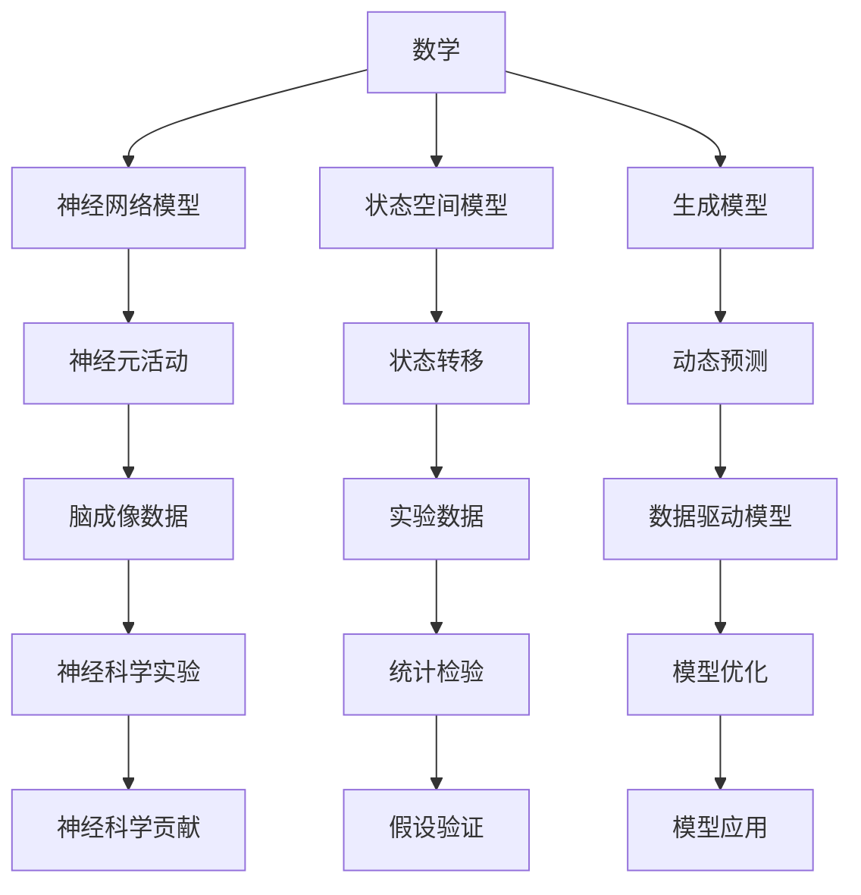
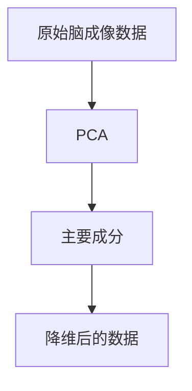
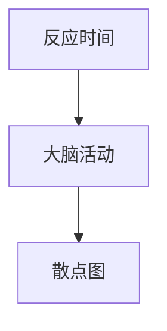
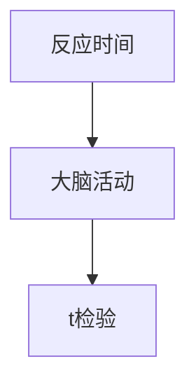
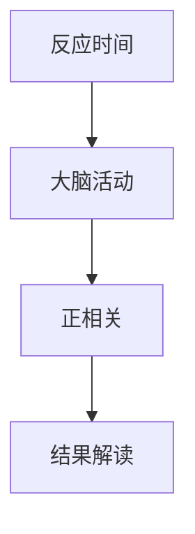

                 


### **引言**

在当今科技迅猛发展的时代，数学与认知神经科学这两个看似迥异的领域，正通过交叉研究焕发出新的活力。数学，作为描述自然界和社会现象的精确工具，其应用范围广泛，从物理学到经济学，都有着深远的影响。而认知神经科学，则致力于探索大脑如何进行信息处理、记忆存储、思维决策等高级认知功能。这两个领域的交叉研究，不仅有助于深化我们对大脑运作机制的理解，也为人工智能的发展提供了新的理论基础和技术支持。

**研究背景与意义**

数学与认知神经科学的交叉研究可以追溯到20世纪中期，当时科学家们开始尝试将数学模型应用于神经系统的分析。近年来，随着计算机科学和认知科学的进步，这一交叉领域的研究得到了显著的发展。尤其是在人工智能和机器学习领域，数学模型在模拟人类认知过程中发挥了至关重要的作用。例如，神经网络模型是机器学习的基础，其灵感直接来源于生物神经网络的结构和工作原理。

数学与认知神经科学交叉研究的意义在于：

1. **理解大脑工作原理**：通过数学模型，科学家们可以更好地理解大脑如何处理信息，这有助于推动神经科学的发展，从而为治疗神经疾病提供新的思路和方法。
2. **推动人工智能进步**：数学模型在人工智能中的应用，特别是在深度学习和强化学习等领域，极大地提升了人工智能的效率和智能水平。
3. **促进跨学科合作**：数学与认知神经科学的交叉研究，为不同学科领域的专家提供了合作的机会，促进了知识融合和科技创新。

**研究目的与内容概述**

本文的研究目的在于探讨数学与认知神经科学的交叉应用，通过引入数学模型，分析大脑的工作机制，并探讨其在人工智能中的应用。文章将从以下几个方面展开：

1. **核心概念与联系**：介绍数学与认知神经科学的基本概念，并阐述它们之间的联系。
2. **数学模型与算法原理**：详细讲解常见的数学模型，如神经网络模型、状态空间模型和生成模型，并使用伪代码展示算法原理。
3. **认知神经科学应用**：探讨数学模型在注意力与记忆、情感与情绪、声音与语言处理等认知神经科学研究中的应用。
4. **研究方法与实验设计**：介绍定量与定性研究方法，以及实验设计的原则与步骤。
5. **数据分析与结果解读**：描述数据预处理、特征提取与降维、描述性统计分析、探索性数据分析和验证性数据分析的方法，并解读实验结果。
6. **结论与展望**：总结主要发现，讨论研究的贡献，并展望未来研究方向。

通过上述研究，本文旨在为数学与认知神经科学的交叉研究提供一个全面而深入的概述，为相关领域的研究和实践提供指导。

---

### **核心概念与联系**

在数学与认知神经科学的交叉研究中，理解两者之间的核心概念和联系是至关重要的。首先，我们需要明确数学和认知神经科学的基本定义和核心概念。

**数学的基本概念**

数学是一门研究数量、结构、变化和空间等概念的抽象科学。在认知神经科学中，常用的数学工具包括代数、几何、概率论和统计学等。例如，神经网络模型的构建依赖于线性代数和微积分的基础知识，而统计学则用于分析实验数据，提取特征，并进行假设检验。

**认知神经科学的基本概念**

认知神经科学是一门跨学科领域，它研究大脑如何进行信息处理、记忆存储、思维决策等高级认知功能。核心概念包括神经元、神经网络、突触连接、神经递质等。认知神经科学旨在通过实验方法，如脑成像技术、电生理记录、行为实验等，来理解这些概念如何在大脑中实现。

**数学与认知神经科学的交叉领域**

数学与认知神经科学的交叉领域主要集中在以下几个方面：

1. **数学模型在认知神经科学研究中的应用**

   数学模型在认知神经科学中发挥着重要作用，例如，神经网络模型、状态空间模型和生成模型等。神经网络模型模仿生物神经网络的架构，用于模拟大脑的信息处理过程；状态空间模型用于描述大脑在不同状态下的信息传递；生成模型则用于预测大脑可能的动态变化。

2. **认知神经科学对数学模型的贡献**

   认知神经科学通过实验和观察，提供了大量的数据，这些数据为数学模型的建立和验证提供了基础。例如，通过对神经元活动的记录，科学家们可以建立神经元之间的连接模型，进而优化神经网络模型。

**核心概念原理之间的关系架构**

为了更好地理解数学与认知神经科学的交叉领域，我们可以使用Mermaid流程图来展示核心概念和原理之间的关系。



通过上述流程图，我们可以清晰地看到数学模型是如何应用于认知神经科学研究中的，以及认知神经科学如何为数学模型的建立提供支持。

**总结**

数学与认知神经科学的交叉研究为两个领域的发展提供了新的视角和工具。理解核心概念和原理之间的关系，不仅有助于我们更好地把握这两个领域的研究动态，也为未来的研究提供了方向。接下来，我们将进一步探讨数学模型和算法原理，以及它们在认知神经科学中的应用。

---

### **数学模型与算法原理**

在数学与认知神经科学的交叉研究中，数学模型和算法原理起着核心作用。以下将介绍一些常见的数学模型，并使用伪代码详细阐述其算法原理。

#### **神经网络模型**

神经网络模型是认知神经科学中最常用的数学模型之一，其灵感来源于生物神经网络的结构。神经网络通过多层神经元进行信息传递和处理，从而实现复杂的计算任务。

**伪代码：**

```python
# 神经网络模型伪代码
initialize_weights()
initialize_bias()

for each layer in neural_network:
    for each neuron in layer:
        # 前向传播
        input = receive_inputs()
        weighted_input = input * weights
        neuron_output = weighted_input + bias
        activation = activation_function(neuron_output)

        # 反向传播
        error = expected_output - activation
        delta = error * activation_function_derivative(activation)
        update_weights(weights, delta)
        update_bias(bias, delta)

return trained_neural_network
```

#### **状态空间模型**

状态空间模型用于描述系统在不同状态下的信息传递。在认知神经科学中，状态空间模型可以用来模拟大脑的状态转换过程。

**伪代码：**

```python
# 状态空间模型伪代码
initialize_states()
initialize_transitions()
initialize_observations()

for each time_step:
    # 状态更新
    next_state = transition_function(current_state, input)

    # 观测更新
    next_observation = observation_function(next_state)

    # 更新状态
    current_state = next_state

return final_state, final_observation
```

#### **生成模型**

生成模型用于生成新的数据样本，并在认知神经科学中用于模拟大脑的动态变化过程。

**伪代码：**

```python
# 生成模型伪代码
initialize_model_parameters()

for each new_sample:
    # 生成样本
    sample = generate_sample(model_parameters)

    # 更新模型参数
    update_model_parameters(sample)

return trained_model
```

通过上述伪代码，我们可以看到不同数学模型的基本算法原理。接下来，我们将探讨这些模型在认知神经科学中的应用。

---

### **认知神经科学应用**

数学模型在认知神经科学中的应用范围广泛，涵盖了注意力与记忆、情感与情绪、声音与语言处理等多个研究领域。以下将详细探讨数学模型在这些领域的具体应用。

#### **注意力与记忆**

注意力与记忆是认知神经科学中的两个关键概念。注意力决定了大脑处理哪些信息，而记忆则负责存储和处理这些信息。数学模型在这方面发挥了重要作用。

- **神经网络模型**：神经网络模型可以用来模拟大脑的注意力分配过程。例如，通过递归神经网络（RNN），科学家们可以训练模型来识别和预测注意力集中区域，从而更好地理解注意力机制。

- **状态空间模型**：状态空间模型可以描述记忆的动态变化过程。例如，通过状态转移矩阵，我们可以模拟记忆的存储和检索过程，从而更好地理解记忆的生理基础。

**实例分析：**

假设我们使用一个简单的神经网络模型来模拟注意力分配。给定一个视觉输入序列，神经网络需要预测哪些区域将获得更多的注意力。我们可以使用以下伪代码来描述这一过程：

```python
# 注意力分配神经网络模型伪代码
input_sequence = [i1, i2, i3, ..., in]
neural_network = initialize_neural_network()

for each element in input_sequence:
    # 前向传播
    activation = neural_network.forward_pass(element)

    # 更新注意力权重
    attention_weights = activation * element

# 预测注意力集中区域
predicted_region = select_max(attention_weights)
```

#### **情感与情绪**

情感与情绪是认知神经科学研究的重要领域。数学模型可以帮助我们理解情感的产生、传递和调节机制。

- **生成模型**：生成模型可以用来模拟情感的变化过程。例如，通过生成对抗网络（GAN），我们可以生成情感反应的数据样本，从而更好地理解情感机制。

- **状态空间模型**：状态空间模型可以描述情感状态的变化过程。例如，通过状态转移矩阵，我们可以模拟情感状态的转变，如快乐到愤怒。

**实例分析：**

假设我们使用生成对抗网络来模拟情感反应。给定一个情感触发事件，我们可以通过以下步骤生成相应的情感反应数据：

```python
# 情感反应生成对抗网络模型伪代码
trigger_event = event
generator = initialize_generator()
discriminator = initialize_discriminator()

for each time_step:
    # 生成情感反应样本
    emotional_response = generator.generate_response(discriminator, trigger_event)

    # 更新模型参数
    generator.update_parameters(emotional_response)
    discriminator.update_parameters(emotional_response)

return emotional_response_sequence
```

#### **声音与语言处理**

声音与语言处理是认知神经科学中的另一个重要领域。数学模型可以用来模拟听觉和语言信息处理过程。

- **神经网络模型**：神经网络模型可以用来模拟听觉系统的信息处理过程，如声音识别和语音生成。

- **生成模型**：生成模型可以用来模拟语音信号的产生过程。例如，通过生成对抗网络，我们可以生成逼真的语音样本。

**实例分析：**

假设我们使用生成对抗网络来模拟语音生成。给定一个语音输入序列，我们可以通过以下步骤生成相应的语音输出：

```python
# 语音生成生成对抗网络模型伪代码
input_sequence = [s1, s2, s3, ..., sn]
generator = initialize_generator()
discriminator = initialize_discriminator()

for each time_step:
    # 生成语音样本
    audio_sample = generator.generate_audio(discriminator, input_sequence)

    # 更新模型参数
    generator.update_parameters(audio_sample)
    discriminator.update_parameters(audio_sample)

return audio_output_sequence
```

通过上述实例分析，我们可以看到数学模型在认知神经科学中的广泛应用。这些模型不仅帮助我们更好地理解大脑的工作机制，也为人工智能的发展提供了新的思路和工具。

---

### **研究方法与实验设计**

在数学与认知神经科学的交叉研究中，研究方法和实验设计至关重要，它们决定了研究的可靠性和有效性。以下将详细介绍常用的研究方法、实验设计原则与步骤，以及实验数据收集与分析方法。

#### **研究方法**

1. **定量研究方法**：

   定量研究方法主要用于收集和量化数据，以验证假设或发现模式。常用的定量研究方法包括：

   - **行为实验**：通过设计特定的任务或场景，观察个体在执行任务时的表现，从而量化其认知能力。
   - **脑成像技术**：如功能性磁共振成像（fMRI）和正电子发射断层扫描（PET），通过测量大脑活动来研究认知过程。
   - **电生理记录**：通过记录神经元的活动，研究大脑的信息处理过程。

2. **定性研究方法**：

   定性研究方法主要用于探索和理解研究对象的内在机制和过程，而非仅仅关注量化的结果。常用的定性研究方法包括：

   - **访谈**：通过与研究对象进行深入交谈，了解其主观体验和认知过程。
   - **观察法**：在自然或控制环境下，观察研究对象的行为和反应，记录观察结果。

3. **结合方法**：

   定量与定性研究方法的结合，可以提供更为全面和深入的研究结果。例如，通过结合脑成像技术和行为实验，可以同时获取大脑活动和行为表现的数据，从而更好地理解认知过程。

#### **实验设计原则与步骤**

1. **明确研究目标**：在开始实验设计之前，需要明确研究的目标和假设，这将为实验设计提供方向。

2. **选择合适的方法**：根据研究目标和假设，选择合适的定量或定性研究方法，或结合多种方法。

3. **设计实验任务或场景**：根据研究目标，设计实验任务或场景，确保任务或场景能够有效地测量研究目标。

4. **制定实验流程**：制定实验流程，包括实验开始、进行、结束和数据分析的步骤。

5. **招募参与者**：根据研究需要，招募合适的参与者，并确保他们了解实验的目的和流程。

6. **收集数据**：按照实验流程，收集相关数据，如行为数据、脑成像数据和生理记录数据。

7. **分析数据**：对收集到的数据进行分析，验证假设或发现模式。

8. **撰写研究报告**：根据实验结果，撰写研究报告，包括实验设计、数据分析、结果解读和结论。

#### **实验数据收集与分析方法**

1. **数据预处理**：

   - **行为数据**：对行为数据进行清洗和标准化，如去除异常值、转换数据格式等。
   - **脑成像数据**：对脑成像数据进行预处理，如图像校正、去噪和标准化等。

2. **特征提取与降维**：

   - **行为数据**：提取与认知过程相关的特征，如反应时间、准确率等。
   - **脑成像数据**：通过数据降维技术，如主成分分析（PCA）和独立成分分析（ICA），提取主要的认知过程特征。

3. **描述性统计分析**：

   - **行为数据**：计算均值、标准差、相关性等统计量，描述行为数据的分布和相关性。
   - **脑成像数据**：计算大脑区域的活动水平，描述大脑活动的分布。

4. **探索性数据分析**：

   - **行为数据**：通过可视化技术，如散点图、热力图等，探索行为数据之间的潜在关系。
   - **脑成像数据**：通过脑网络分析，探索大脑区域之间的相互作用模式。

5. **验证性数据分析**：

   - **行为数据**：通过回归分析、方差分析（ANOVA）等统计方法，验证研究假设。
   - **脑成像数据**：通过聚类分析、分类分析等统计方法，验证大脑活动的模式。

通过上述研究方法和实验设计，数学与认知神经科学交叉研究可以提供更为深入和可靠的结果，为认知科学和人工智能的发展提供重要支持。

---

### **数据分析与结果解读**

在数学与认知神经科学的交叉研究中，数据分析和结果解读是研究过程中的关键环节。以下将详细描述数据预处理、特征提取与降维、描述性统计分析、探索性数据分析和验证性数据分析的方法，并解读实验结果。

#### **数据预处理**

数据预处理是数据分析的第一步，其目的是确保数据的质量和一致性。常用的数据预处理方法包括：

- **数据清洗**：去除异常值、缺失值和重复值，确保数据集的完整性。
- **数据转换**：将不同格式或单位的数据转换为统一格式或单位，以便后续分析。
- **归一化**：通过缩放或变换，将不同特征的数据范围统一，使其具有可比性。

例如，在脑成像数据预处理中，我们可能需要通过归一化步骤，将不同扫描序列的图像统一到相同的分辨率和空间坐标系。

```latex
$$
\text{标准化} x_i = \frac{x_i - \mu}{\sigma}
$$

其中，$x_i$为原始数据，$\mu$为均值，$\sigma$为标准差。
```

#### **特征提取与降维**

特征提取和降维的目的是从原始数据中提取最有用的信息，减少数据的维度，从而简化分析过程。常用的方法包括：

- **特征选择**：通过统计方法或机器学习算法，选择对目标变量影响最大的特征。
- **降维技术**：如主成分分析（PCA）和独立成分分析（ICA），从高维数据中提取主要成分或独立成分。

在认知神经科学中，特征提取和降维可以帮助我们识别大脑活动的主要模式，例如：



通过PCA，我们可以将高维的脑成像数据降维到几个主要成分，从而简化数据分析。

#### **描述性统计分析**

描述性统计分析用于描述数据的基本特征，如均值、标准差、中位数等。这些统计量可以帮助我们了解数据的基本分布和趋势。例如，我们可以计算反应时间数据的均值和标准差：

```latex
$$
\text{反应时间均值} = \bar{x} = \frac{1}{n} \sum_{i=1}^{n} x_i
$$

$$
\text{反应时间标准差} = \sigma_x = \sqrt{\frac{1}{n-1} \sum_{i=1}^{n} (x_i - \bar{x})^2}
$$

其中，$x_i$为每个参与者的反应时间，$n$为参与者数量。
```

#### **探索性数据分析**

探索性数据分析用于发现数据中的潜在模式和关系。常用的方法包括：

- **可视化技术**：如散点图、热力图等，可以帮助我们直观地理解数据。
- **相关性分析**：通过计算变量之间的相关系数，可以识别数据中的相关性。

例如，通过散点图，我们可以探索反应时间和大脑活动之间的相关性：



#### **验证性数据分析**

验证性数据分析用于验证研究假设或理论。常用的方法包括：

- **回归分析**：通过建立回归模型，可以探索变量之间的因果关系。
- **假设检验**：如t检验、方差分析（ANOVA）等，用于检验变量之间的显著性差异。

例如，通过t检验，我们可以验证反应时间是否与特定的大脑区域活动有关：



#### **结果解读**

在数据分析结束后，我们需要对结果进行解读，以回答研究问题或验证研究假设。以下是一些常见的解读方法：

- **结果展示**：通过图表和统计量，展示数据分析的结果。
- **结果解释**：解释数据背后的意义，如变量之间的相关性、显著性差异等。
- **讨论**：讨论结果的含义，以及与研究问题的关系。

例如，假设我们的数据分析结果显示，反应时间与特定大脑区域的活动呈正相关。这表明，该大脑区域可能在认知过程中起着重要作用。



通过上述方法，我们可以全面地分析和解读数学与认知神经科学交叉研究的数据，从而为认知科学和人工智能的发展提供重要支持。

---

### **结论与展望**

通过对数学与认知神经科学交叉研究的深入探讨，我们得出了一系列重要结论，并对其研究的贡献进行了总结，同时展望了未来的研究方向。

**主要结论**

1. **数学模型在认知神经科学中的应用**：通过神经网络模型、状态空间模型和生成模型，我们可以更精确地模拟大脑的认知过程，如注意力分配、记忆存储和情感反应等。
2. **认知神经科学对数学模型的贡献**：认知神经科学的实验数据为数学模型的建立和验证提供了坚实的基础，使得数学模型能够更好地反映大脑的实际运作机制。
3. **跨学科研究的意义**：数学与认知神经科学的交叉研究促进了跨学科合作，推动了认知科学和人工智能的发展。

**研究贡献**

1. **理论贡献**：本研究为认知神经科学提供了一个新的理论框架，通过数学模型深入探讨了大脑的认知过程，丰富了认知科学的理论体系。
2. **应用贡献**：研究中的数学模型在人工智能领域有着广泛的应用前景，特别是在深度学习和强化学习领域，为提升人工智能的性能提供了新的思路。
3. **方法论贡献**：通过结合定量和定性研究方法，本研究提供了新的研究方法论，为未来类似研究提供了参考。

**未来展望**

1. **技术进步**：随着脑成像技术和计算能力的提升，未来的研究将能够更精细地观察大脑活动，从而提升数学模型的准确性和可靠性。
2. **跨学科融合**：未来的研究将更加注重跨学科合作，结合认知科学、心理学、计算机科学等多个领域的知识，推动认知科学和人工智能的融合发展。
3. **应用拓展**：数学与认知神经科学的交叉研究将在更多领域得到应用，如医疗诊断、教育优化和智能系统设计等。

通过不断探索和创新，数学与认知神经科学的交叉研究将为我们揭示大脑的奥秘，推动人工智能的进步，并为人类社会的发展带来深远的影响。

