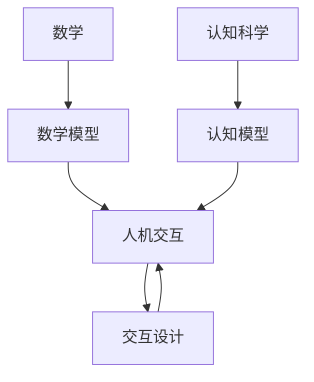

                 

### 文章标题

### 数学与认知科学的人机交互研究

### 关键词

1. 数学与认知科学
2. 人机交互
3. 认知负荷
4. 多媒体技术
5. 智能语音助手

### 摘要

本文旨在探讨数学与认知科学在人机交互领域的融合与影响。首先，我们回顾了数学和认知科学的基本概念及其在各自领域的应用。接着，文章详细介绍了人机交互的基础知识，包括其发展历程、理论框架和技术要点。在此基础上，我们探讨了数学模型和认知科学原理在人机交互中的具体应用，并通过实际案例进行了深入分析。文章最后对数学与认知科学在人机交互领域的未来发展趋势进行了展望，并提出了相应的技术挑战与机遇。本文旨在为读者提供一份全面、系统的专业研究指南。

## 第一部分：数学与认知科学基础

### 1.1 数学的基本概念与数学模型

#### 1.1.1 数学的基本概念

数学是一门研究数量、结构、变化和空间等概念的科学。它具有高度的抽象性和严谨性，通过定义、公理、定理和证明等手段，揭示了自然界和人类社会的许多基本规律。数学的基本概念包括数、函数、方程等。

- **数的定义**：数是数学研究的基础，它可以用来表示物体的个数、位置、顺序等。常见的数有自然数、整数、分数、实数、复数等。

- **函数的定义**：函数是一种特殊的关系，它将每一个输入值映射到一个唯一的输出值。函数通常用符号\( f: A \rightarrow B \)表示，其中\( A \)为定义域，\( B \)为值域。

- **方程的定义**：方程是数学中表示两个表达式相等的关系。例如，\( ax + b = c \)就是一个一次方程。

#### 1.1.2 数学模型的应用

数学模型是使用数学语言描述现实世界问题的工具。通过建立数学模型，我们可以将复杂的实际问题简化为数学问题，从而利用数学方法进行分析和解决。

- **线性模型**：线性模型是最常见的数学模型之一，它通常用于描述线性关系。例如，线性回归模型可以用来预测某个变量与其他变量之间的关系。

- **非线性模型**：非线性模型用于描述非线性关系。例如，神经网络模型可以用来模拟复杂的非线性关系，从而进行分类、预测等任务。

- **统计模型**：统计模型用于分析数据，并从中提取有用的信息。例如，贝叶斯模型可以用来进行概率推断，线性回归模型可以用来进行数据拟合。

#### 1.1.3 方程的定义

方程是数学中一个重要的概念，它通常用于描述两个表达式相等的关系。方程可以分为线性方程和非线性方程。

- **线性方程**：线性方程是形如\( ax + b = c \)的方程，其中\( a \)、\( b \)、\( c \)为常数，\( x \)为未知数。

- **非线性方程**：非线性方程是形如\( ax^2 + bx + c = 0 \)的方程，其中\( a \)、\( b \)、\( c \)为常数，\( x \)为未知数。

### 1.2 认知科学的基本概念

#### 1.2.1 认知科学的起源与发展

认知科学是研究人类认知过程和认知能力的科学。它的起源可以追溯到20世纪50年代，当时心理学家、计算机科学家和神经科学家开始探讨人类思维和信息处理的过程。

- **起源**：认知科学起源于对人工智能的研究。随着计算机技术的发展，人们开始尝试将计算机模拟人类的思维过程。

- **发展**：20世纪80年代，认知科学逐渐形成了自己的独立体系，涵盖了心理学、认知神经科学、语言学、哲学等多个学科。

#### 1.2.2 认知过程与认知模型

认知过程是指人类在感知、记忆、思考、解决问题等过程中所涉及的一系列心理活动。认知科学通过对认知过程的深入研究，建立了多种认知模型。

- **感知模型**：感知模型研究人类如何感知外部世界。例如，视觉感知模型研究人类如何通过眼睛感知图像。

- **记忆模型**：记忆模型研究人类如何记忆信息。例如，长时记忆模型研究人类如何长期存储和提取信息。

- **思考模型**：思考模型研究人类如何进行推理、决策等认知活动。例如，问题解决模型研究人类如何解决各种问题。

#### 1.2.3 认知科学的贡献

认知科学为多个领域的研究提供了重要的理论支持。以下是一些认知科学的贡献：

- **心理学**：认知科学为心理学研究提供了新的理论和方法，推动了认知心理学的发展。

- **计算机科学**：认知科学促进了人工智能的发展，为计算机模拟人类思维提供了理论基础。

- **语言学**：认知科学为语言学的研究提供了新的视角，如认知语言学和计算语言学。

### 1.3 数学模型在认知科学中的应用

数学模型在认知科学中扮演着重要的角色。通过数学模型，认知科学家可以量化认知过程，并探索认知过程的基本原理。

- **认知模型的数学表示**：认知模型通常可以用数学公式和图形来表示。例如，神经网络模型可以用数学公式表示神经元之间的关系。

- **数学模型在认知科学实验中的应用**：数学模型可以用于设计认知科学实验，从而更准确地研究认知过程。例如，通过使用数学模型，认知科学家可以预测人类在不同情境下的行为。

- **数学公式与认知科学实验**：数学公式在认知科学实验中起着关键作用。例如，在视觉感知实验中，数学公式可以用来描述图像的感知过程。

#### 1.3.1 线性模型

线性模型是最常见的数学模型之一，它通常用于描述线性关系。线性模型可以表示为：

\[ y = ax + b \]

其中，\( y \)为输出值，\( x \)为输入值，\( a \)和\( b \)为常数。

线性模型在认知科学中有广泛应用，例如，它可以用于描述人类视觉感知中的亮度变化与反应时间之间的关系。

#### 1.3.2 非线性模型

非线性模型用于描述非线性关系。非线性模型可以表示为：

\[ y = f(x) \]

其中，\( f(x) \)为非线性函数。

非线性模型在认知科学中有广泛应用，例如，它可以用于描述人类思维中的复杂决策过程。

#### 1.3.3 统计模型

统计模型用于分析数据，并从中提取有用的信息。统计模型可以表示为：

\[ y \sim f(x|\theta) \]

其中，\( y \)为观察值，\( x \)为输入值，\( \theta \)为参数。

统计模型在认知科学中有广泛应用，例如，它可以用于分析人类行为数据，以揭示认知过程的基本原理。

### 1.4 数学公式的详细讲解

#### 1.4.1 微积分基本公式

微积分是数学的一个重要分支，它研究函数的变化率和积分。微积分的基本公式包括导数、积分和微分方程。

- **导数**：导数表示函数在某一点的瞬时变化率。导数的定义可以表示为：

  \[ f'(x) = \lim_{h \to 0} \frac{f(x+h) - f(x)}{h} \]

- **积分**：积分表示函数在某一区间上的累积变化量。积分的定义可以表示为：

  \[ \int_{a}^{b} f(x) \, dx = \lim_{n \to \infty} \sum_{i=1}^{n} f(x_i) \, \Delta x \]

- **微分方程**：微分方程表示函数和它的导数之间的关系。微分方程可以表示为：

  \[ \frac{dy}{dx} = f(x, y) \]

#### 1.4.2 线性代数基本公式

线性代数研究向量空间、线性映射和矩阵理论。线性代数的基本公式包括矩阵运算、行列式和特征值。

- **矩阵运算**：矩阵运算包括矩阵加法、矩阵乘法和矩阵求逆。

  \[ A + B = C \]
  \[ AB = C \]
  \[ A^{-1} = B \]

- **行列式**：行列式是矩阵的一个数值特征，它可以用来求解线性方程组的解。

  \[ \det(A) = \sum_{\sigma \in S_n} (-1)^{\sigma} a_{1\sigma(1)} a_{2\sigma(2)} \cdots a_{n\sigma(n)} \]

- **特征值和特征向量**：特征值和特征向量是矩阵的一个重要性质，它们可以用来求解线性变换的特征值问题。

  \[ Av = \lambda v \]

#### 1.4.3 概率论基本公式

概率论研究随机事件和概率的计算。概率论的基本公式包括概率、条件概率和贝叶斯定理。

- **概率**：概率表示事件发生的可能性，它可以表示为：

  \[ P(A) = \frac{n(A)}{n(S)} \]

  其中，\( n(A) \)为事件\( A \)的样本点数，\( n(S) \)为样本空间\( S \)的样本点数。

- **条件概率**：条件概率表示在某个事件发生的条件下，另一个事件发生的可能性。条件概率可以表示为：

  \[ P(A|B) = \frac{P(A \cap B)}{P(B)} \]

- **贝叶斯定理**：贝叶斯定理是概率论中的一个重要公式，它可以用来计算后验概率。贝叶斯定理可以表示为：

  \[ P(A|B) = \frac{P(B|A)P(A)}{P(B)} \]

### 1.5 数学实例讲解与计算

#### 1.5.1 案例一：线性回归

线性回归是一种常用的数学模型，用于描述两个变量之间的线性关系。线性回归模型可以表示为：

\[ y = ax + b \]

其中，\( y \)为输出值，\( x \)为输入值，\( a \)和\( b \)为模型参数。

案例一：给定以下数据集：

| x  | y  |
|----|----|
| 1  | 2  |
| 2  | 4  |
| 3  | 6  |
| 4  | 8  |

我们需要使用线性回归模型拟合这些数据。

1. 计算输入值\( x \)的平均值：

   \[ \bar{x} = \frac{1+2+3+4}{4} = 2.5 \]

2. 计算输出值\( y \)的平均值：

   \[ \bar{y} = \frac{2+4+6+8}{4} = 5 \]

3. 计算模型参数\( a \)和\( b \)：

   \[ a = \frac{\sum_{i=1}^{n} (x_i - \bar{x})(y_i - \bar{y})}{\sum_{i=1}^{n} (x_i - \bar{x})^2} = \frac{(1-2.5)(2-5) + (2-2.5)(4-5) + (3-2.5)(6-5) + (4-2.5)(8-5)}{(1-2.5)^2 + (2-2.5)^2 + (3-2.5)^2 + (4-2.5)^2} = 2 \]

   \[ b = \bar{y} - a\bar{x} = 5 - 2 \times 2.5 = 0 \]

4. 因此，线性回归模型为：

   \[ y = 2x \]

5. 使用线性回归模型进行预测，例如当\( x = 5 \)时，\( y \)的预测值为：

   \[ y = 2 \times 5 = 10 \]

#### 1.5.2 案例二：神经网络

神经网络是一种模拟生物神经系统的计算模型，它通过多个神经元的连接和激活来实现复杂的信息处理。神经网络的基本结构包括输入层、隐藏层和输出层。

案例二：给定以下神经网络：

\[ z = \sigma(W_2 \cdot \sigma(W_1 \cdot x)) \]

其中，\( x \)为输入值，\( z \)为输出值，\( W_1 \)和\( W_2 \)为权重矩阵，\( \sigma \)为激活函数。

假设输入值\( x = [1, 2] \)，权重矩阵\( W_1 = \begin{bmatrix} 1 & 0 \\ 0 & 1 \end{bmatrix} \)，\( W_2 = \begin{bmatrix} 1 & 1 \\ 1 & 1 \end{bmatrix} \)，激活函数\( \sigma(x) = \frac{1}{1 + e^{-x}} \)。

1. 计算第一层神经元的输出值：

   \[ a_1 = W_1 \cdot x = \begin{bmatrix} 1 & 0 \\ 0 & 1 \end{bmatrix} \cdot \begin{bmatrix} 1 \\ 2 \end{bmatrix} = \begin{bmatrix} 1 \\ 2 \end{bmatrix} \]

2. 计算第二层神经元的输出值：

   \[ a_2 = W_2 \cdot \sigma(a_1) = \begin{bmatrix} 1 & 1 \\ 1 & 1 \end{bmatrix} \cdot \begin{bmatrix} \frac{1}{1+e^{-1}} \\ \frac{1}{1+e^{-2}} \end{bmatrix} = \begin{bmatrix} \frac{1}{1+e^{-1}} + \frac{1}{1+e^{-2}} \\ \frac{1}{1+e^{-1}} + \frac{1}{1+e^{-2}} \end{bmatrix} \]

3. 计算输出值\( z \)：

   \[ z = \sigma(a_2) = \frac{1}{1+e^{-(\frac{1}{1+e^{-1}} + \frac{1}{1+e^{-2}})}} = \frac{1}{1+e^{-1-\frac{1}{e}} - \frac{1}{e^2}} \]

   \[ z \approx 0.731 \]

4. 使用神经网络进行预测，例如当\( x = [3, 4] \)时，\( z \)的预测值为：

   \[ z = \sigma(W_2 \cdot \sigma(W_1 \cdot x)) \approx \frac{1}{1+e^{-(\frac{1}{1+e^{-3}} + \frac{1}{1+e^{-4}})}} \approx 0.847 \]

## 第二部分：人机交互基础

### 2.1 人机交互的基本概念

#### 2.1.1 人机交互的发展历程

人机交互（Human-Computer Interaction，简称HCI）是指人与计算机系统之间的交互过程。人机交互的发展历程可以分为以下几个阶段：

1. **命令行界面**：在计算机发展的早期，用户需要通过键盘输入命令来与计算机交互。这种交互方式效率较低，用户需要记住大量的命令。

2. **图形用户界面**：随着计算机技术的发展，图形用户界面（Graphical User Interface，简称GUI）逐渐取代了命令行界面。GUI使用图标、菜单和按钮等图形元素，使计算机操作更加直观和便捷。

3. **触摸界面**：随着智能手机和平板电脑的普及，触摸界面成为人机交互的重要形式。触摸界面通过手指或触控笔在屏幕上进行操作，提高了交互的便捷性和自然性。

4. **虚拟现实和增强现实**：虚拟现实（Virtual Reality，简称VR）和增强现实（Augmented Reality，简称AR）是人机交互的新兴形式。它们通过模拟或增强现实环境，使用户能够在虚拟环境中进行交互。

#### 2.1.2 人机交互的理论框架

人机交互的理论框架主要包括以下几个方面：

1. **交互设计**：交互设计是 HCI 的核心，它涉及到用户界面设计、用户体验设计等方面。交互设计的目标是使计算机系统易于使用、高效和满足用户需求。

2. **认知心理学**：认知心理学研究人类认知过程，如感知、记忆、思考等。在 HCI 中，认知心理学原理被用来设计用户界面，以提高用户的使用效率和满意度。

3. **人机系统**：人机系统是指人与计算机系统相互作用的整体。人机系统理论强调人在系统中的作用，以及人与系统之间的交互关系。

4. **可用性工程**：可用性工程是一种系统性的方法，用于评估和改进人机系统的可用性。可用性工程包括用户研究、原型设计、测试和评估等方面。

### 2.2 人机交互技术

#### 2.2.1 用户界面设计

用户界面设计是 HCI 的重要组成部分，它涉及到用户界面的布局、元素和交互方式等方面。用户界面设计的原则包括：

1. **直观性**：用户界面应该直观易懂，使用户能够快速掌握操作方法。

2. **一致性**：用户界面应保持一致性，使用户在不同场景下能够使用相同的操作方法。

3. **易用性**：用户界面应易于使用，减少用户的操作错误和困惑。

4. **灵活性**：用户界面应具有一定的灵活性，以适应不同用户的需求和偏好。

用户界面设计的流程包括需求分析、原型设计、用户测试和迭代改进等步骤。

#### 2.2.2 输入与输出设备

输入设备是用户与计算机系统之间的交互媒介，它将用户的操作转化为计算机可以理解的数据。常见的输入设备包括键盘、鼠标、触摸屏、语音识别等。

输出设备用于向用户展示计算机系统的处理结果。常见的输出设备包括显示器、打印机、音响等。

输入与输出设备的相互作用是 HCI 的重要组成部分。良好的输入与输出设备设计可以提高用户的使用体验和效率。

#### 2.2.3 多媒体与人机交互

多媒体技术是指将文字、图像、音频、视频等多种媒体形式集成在一起的技术。多媒体与人机交互的关系主要体现在以下几个方面：

1. **信息呈现**：多媒体技术可以用来呈现复杂的信息，使信息更加直观和易于理解。

2. **交互体验**：多媒体技术可以提高人机交互的体验，使用户在交互过程中感受到更多的乐趣和互动。

3. **情感化设计**：通过多媒体技术，可以设计出更加情感化的用户界面，使用户产生共鸣和情感连接。

#### 2.2.4 认知因素在人机交互中的作用

认知因素是人机交互中的重要组成部分，它涉及到用户在交互过程中的认知负荷、注意力管理和认知风格等方面。

1. **认知负荷**：认知负荷是指用户在交互过程中需要处理的认知信息量。过高的认知负荷会导致用户疲劳和错误率增加，因此需要通过优化用户界面设计和交互方式来降低认知负荷。

2. **注意力管理**：注意力管理是指用户在交互过程中如何分配注意力资源。良好的注意力管理可以提高用户的使用效率和工作记忆容量。

3. **认知风格**：认知风格是指用户在认知过程中的偏好和习惯。了解用户的认知风格可以帮助设计出更加适合用户的使用界面，提高用户的满意度。

### 2.3 人机交互中的认知因素

#### 2.3.1 认知负荷

认知负荷是指个体在进行认知活动时所需要的心理资源。在人机交互中，认知负荷是衡量用户在使用计算机系统时感受到的压力和负担的重要指标。认知负荷过大会导致用户疲劳、错误率和学习时间增加，从而影响用户体验和系统的可用性。以下是一些影响认知负荷的因素：

1. **任务复杂性**：任务复杂性越高，用户需要处理的信息量越多，认知负荷也越大。例如，复杂的操作步骤和大量的数据输入会增加认知负荷。

2. **系统设计**：系统设计不合理，如界面布局混乱、信息呈现不清晰等，都会增加用户的认知负荷。良好的系统设计应该尽量减少用户在操作过程中需要处理的信息量和操作步骤。

3. **用户能力**：用户的能力水平会影响其认知负荷。对于新手用户，复杂的系统界面和操作流程可能会增加其认知负荷，而对于熟练用户，相同的设计可能会更加高效。

#### 2.3.2 注意力管理

注意力管理是指用户在交互过程中如何分配和调节注意力资源。良好的注意力管理可以提高用户的使用效率和工作记忆容量。以下是一些注意力管理的策略：

1. **集中注意力**：在需要高度集中注意力的任务中，用户应该尽量减少外部干扰，例如关闭无关的通知和应用程序。

2. **分阶段处理**：复杂任务可以分解为多个阶段，每个阶段只专注于一个子任务，以减少认知负荷。

3. **自动化**：对于重复性高、不需要太多思考的任务，可以使用自动化工具来减轻用户的认知负荷。

4. **反馈与确认**：及时的用户反馈和确认可以帮助用户调整其注意力分配，确保其在正确的任务上投入足够的注意力。

#### 2.3.3 认知风格与差异

认知风格是指个体在认知过程中所表现出的习惯性偏好。不同的认知风格会影响用户对系统的接受程度和使用体验。以下是一些常见的认知风格：

1. **感官型与直觉型**：感官型用户更倾向于通过观察和感知来理解和解决问题，而直觉型用户更倾向于通过直觉和推理来理解和解决问题。

2. **场独立与场依存**：场独立用户倾向于独立思考，不受外部环境的影响；场依存用户则更依赖外部环境来指导其思考和行为。

3. **序列型与并行型**：序列型用户倾向于按照顺序逐一处理任务，而并行型用户则倾向于同时处理多个任务。

了解用户的认知风格可以帮助设计出更加符合用户习惯的系统界面，提高用户满意度。以下是一些设计策略：

1. **个性化**：根据用户的认知风格提供个性化的界面和交互方式，例如为感官型用户设计直观的图标和图像，为直觉型用户设计逻辑清晰的导航。

2. **适应性**：设计适应性强的系统，能够根据用户的认知风格自动调整交互方式，提高用户的适应性。

3. **训练与指导**：为不同认知风格的用户提供适当的训练和指导，帮助他们更好地适应系统。

### 2.4 认知科学的基本原理

#### 2.4.1 注意力的原理

注意力是认知科学中的一个重要概念，它指的是个体在特定时刻选择关注某些信息而忽略其他信息的心理过程。以下是一些关于注意力原理的基本概念：

1. **选择性注意力**：选择性注意力是指个体在处理信息时，会根据任务需求和个人的兴趣选择关注某些信息，而忽略其他信息。例如，在嘈杂的环境中，用户可能会选择关注与其任务相关的声音，而忽略其他无关的声音。

2. **资源限制**：注意力资源是有限的，个体在处理信息时需要分配注意力资源。当任务复杂或信息量较大时，个体可能会感到注意力不足，导致处理效率下降。

3. **任务切换**：任务切换是指个体在处理多个任务时，需要在不同任务之间分配注意力资源。任务切换可能会引入额外的认知负荷，降低任务处理效率。

#### 2.4.2 记忆的原理

记忆是认知科学中的另一个重要概念，它指的是个体在经历事件后，将信息存储在头脑中并在需要时进行回忆的能力。以下是一些关于记忆原理的基本概念：

1. **编码**：编码是指将信息从感知阶段转换为可以存储在记忆中的形式。编码的质量会影响信息的记忆效果。有效的编码策略包括重复、联想和意义构建等。

2. **存储**：存储是指将编码后的信息在记忆中保持一段时间。存储过程中，信息可能会受到干扰和遗忘。干扰包括前摄抑制和倒摄抑制，遗忘包括短期遗忘和长期遗忘。

3. **提取**：提取是指从记忆中检索所需的信息。提取的质量受到多种因素的影响，如检索线索、记忆强度和记忆干扰等。

#### 2.4.3 想象的原理

想象是认知科学中的另一个重要概念，它指的是个体在头脑中构建和体验虚拟情境的能力。以下是一些关于想象原理的基本概念：

1. **想象过程**：想象过程包括感知和加工虚拟情境中的信息，如视觉、听觉、触觉等。想象的质量受到个体的想象能力和经验的影响。

2. **想象与现实的交互**：想象不仅是一种内部心理活动，还可以与现实情境相互作用。例如，通过想象，个体可以在头脑中模拟和预测现实情境中的行为和结果。

3. **想象在认知功能中的作用**：想象在认知功能中起着重要作用，如问题解决、决策制定和创造性思维等。有效的想象能力有助于个体更好地理解和适应复杂环境。

#### 2.4.4 认知科学在教育中的应用

认知科学为教育领域提供了丰富的理论和方法，以下是一些认知科学在教育中的应用：

1. **学习理论**：认知科学的学习理论，如建构主义和认知负荷理论，指导了教育工作者如何设计更有效的教学策略和学习环境。

2. **教学设计**：认知科学原理被应用于教学设计中，如基于问题的学习（PBL）、合作学习和认知学徒制等，以提高学生的学习效果。

3. **学习评估**：认知科学的方法和技术被应用于学习评估，如认知诊断测试和实时学习反馈系统，以更准确地评估学生的认知发展和学习需求。

#### 2.4.5 认知科学在心理学中的应用

认知科学为心理学领域提供了重要的理论支持和方法，以下是一些认知科学在心理学中的应用：

1. **认知心理学**：认知科学促进了认知心理学的发展，如感知、记忆、思考等方面的研究，为理解人类认知过程提供了新的视角。

2. **认知神经科学**：认知科学结合神经科学的研究成果，探索大脑如何实现认知功能，如注意力的神经机制、记忆的神经基础等。

3. **人工智能**：认知科学与人工智能的结合，推动了人工智能的发展，如神经网络模型、决策支持系统等，为解决复杂认知问题提供了新的途径。

#### 2.4.6 认知科学在神经科学中的应用

认知科学在神经科学中的应用主要集中在理解和解释大脑如何实现认知功能。以下是一些关键领域：

1. **认知神经成像**：认知神经成像技术，如功能性磁共振成像（fMRI）、脑电图（EEG）等，用于观察大脑在执行认知任务时的活动模式。

2. **神经心理学**：神经心理学研究认知功能与大脑结构之间的关系，通过临床案例研究揭示认知障碍的神经基础。

3. **认知神经科学模型**：认知神经科学模型，如神经网络模型、计算模型等，用于模拟和预测大脑如何实现认知功能，为神经科学的实验研究提供了理论框架。

## 第三部分：数学与认知科学的人机交互

### 3.1 数学在认知科学中的应用

#### 3.1.1 数学模型在认知科学的研究方法

数学模型在认知科学中扮演着重要的角色，它们用于描述和分析认知过程。以下是一些常见的数学模型在认知科学中的应用：

1. **神经计算模型**：神经计算模型模拟神经元和神经网络的活动，以研究大脑如何处理信息。例如，神经网络模型可以用来模拟视觉感知、记忆和学习等过程。

2. **概率模型**：概率模型用于描述不确定性事件，如概率论中的贝叶斯网络可以用来模拟决策过程和推理过程。

3. **统计模型**：统计模型用于分析数据，如线性回归模型可以用来分析认知过程中的变量关系。

4. **优化模型**：优化模型用于求解最优解，如遗传算法可以用来优化决策过程。

#### 3.1.2 数学模型在认知科学实验中的应用

数学模型在认知科学实验中发挥着重要作用，以下是一些数学模型在认知科学实验中的应用：

1. **行为数据分析**：数学模型可以用来分析实验数据，如统计分析方法可以用来分析用户的行为数据，以揭示认知过程的特点。

2. **生理信号分析**：数学模型可以用来分析生理信号，如脑电图（EEG）和功能性磁共振成像（fMRI）数据，以研究大脑活动模式。

3. **模拟实验**：数学模型可以用来模拟实验过程，如计算机模拟可以用来模拟大脑如何处理视觉信息，从而验证理论模型。

### 3.2 认知科学对数学模型的影响

#### 3.2.1 认知过程对数学模型的需求

认知科学的发展对数学模型提出了新的需求，以下是一些认知过程对数学模型的需求：

1. **复杂性**：认知过程往往涉及复杂的计算和决策，这需要数学模型能够处理复杂的计算任务。

2. **不确定性**：认知过程通常存在不确定性，这需要数学模型能够处理不确定性事件和概率分布。

3. **适应性**：认知过程需要适应不同的环境和任务，这需要数学模型能够适应不同的情境和任务。

#### 3.2.2 认知模型对数学公式的影响

认知模型对数学公式的选择和形式提出了影响，以下是一些认知模型对数学公式的影响：

1. **简化**：认知模型往往需要简化复杂的计算过程，这可能导致数学公式的简化。

2. **适配**：认知模型需要与数学公式相适应，以确保模型的可解释性和适用性。

3. **扩展**：认知模型的发展可能会推动数学公式的扩展和改进，以更好地描述认知过程。

### 3.3 数学与认知科学在人机交互中的应用

#### 3.3.1 数学模型在人机交互中的作用

数学模型在人机交互中发挥着重要作用，以下是一些数学模型在人机交互中的作用：

1. **行为预测**：数学模型可以用来预测用户的行为，如用户的行为模式、偏好等，以优化用户界面设计。

2. **交互优化**：数学模型可以用来优化人机交互过程，如通过算法优化用户界面的布局、交互流程等，提高用户体验。

3. **决策支持**：数学模型可以用来提供决策支持，如通过数据分析帮助用户做出更好的决策。

#### 3.3.2 认知科学原理在人机交互设计中的应用

认知科学原理在人机交互设计中具有重要意义，以下是一些认知科学原理在人机交互设计中的应用：

1. **注意力管理**：认知科学原理可以帮助设计者理解用户如何分配注意力，从而设计出能够有效吸引用户注意力的界面。

2. **记忆和遗忘**：认知科学原理可以帮助设计者理解用户如何记忆和遗忘信息，从而设计出易于记忆和检索的用户界面。

3. **认知负荷**：认知科学原理可以帮助设计者理解用户在交互过程中承受的认知负荷，从而设计出降低认知负荷的交互方式。

### 3.4 人机交互中的数学与认知科学案例分析

#### 3.4.1 案例一：智能语音助手

智能语音助手（如Apple的Siri、Google Assistant）是数学与认知科学在人机交互中应用的典型例子。以下是智能语音助手的案例分析：

1. **数学模型**：智能语音助手使用了自然语言处理（NLP）和机器学习（ML）模型来理解和回应用户语音指令。这些模型包括词嵌入、序列到序列（Seq2Seq）模型、递归神经网络（RNN）等。

2. **认知科学原理**：智能语音助手的设计考虑了用户的认知负荷和注意力管理。例如，通过语音提示和简化的响应，助手可以降低用户的认知负荷，并通过自然语言交互提供流畅的用户体验。

3. **案例分析**：以Google Assistant为例，用户可以通过语音指令查询天气、设置提醒、发送消息等。Google Assistant使用了深度学习模型来理解和执行这些指令，同时通过简化的语音交互界面，降低了用户的认知负荷。

#### 3.4.2 案例二：虚拟现实与增强现实技术

虚拟现实（VR）和增强现实（AR）技术是数学与认知科学在人机交互中应用的另一个重要领域。以下是VR与AR技术的案例分析：

1. **数学模型**：VR和AR技术使用了三维建模、图像处理、几何变换等数学模型来创建和渲染虚拟环境。这些模型包括三维网格建模、纹理映射、光线追踪等。

2. **认知科学原理**：VR和AR技术的设计考虑了用户的感知和认知过程。例如，通过调整虚拟环境的视觉和听觉效果，以减少用户的晕动感和疲劳感。

3. **案例分析**：以Oculus Rift为例，这是一种VR头戴设备。Oculus Rift使用了三维建模和光线追踪技术来创建逼真的虚拟环境。同时，通过调整渲染参数和视觉反馈，Oculus Rift减少了用户的晕动感和疲劳感，提供了沉浸式的用户体验。

### 3.5 未来展望

#### 3.5.1 数学与认知科学的人机交互发展趋势

随着技术的不断进步，数学与认知科学在人机交互领域将继续发展。以下是一些可能的发展趋势：

1. **智能化的用户界面**：未来的人机交互界面将更加智能化，能够根据用户的认知风格和行为模式自动调整交互方式。

2. **个性化体验**：通过收集和分析用户数据，人机交互系统将能够提供更加个性化的用户体验，满足不同用户的需求。

3. **多模态交互**：未来的交互方式将不仅限于视觉和触觉，还将包括语音、手势、眼动等多种模态，提供更加自然和直观的交互体验。

#### 3.5.2 技术挑战与机遇

尽管数学与认知科学在人机交互领域有着广阔的应用前景，但仍然面临着一些技术挑战：

1. **复杂性**：数学模型和认知科学原理的应用往往涉及复杂的计算和数据处理，这需要高性能的计算能力和高效的算法。

2. **不确定性**：认知过程和用户行为存在很大的不确定性，这增加了人机交互系统的设计难度。

3. **隐私与安全**：随着人机交互系统的智能化和个性化，用户数据的安全性和隐私保护变得尤为重要。

然而，这些挑战也带来了机遇：

1. **创新应用**：通过克服这些挑战，人机交互系统可以提供更加创新和有用的应用，如智能医疗、智能家居等。

2. **跨学科合作**：数学与认知科学的融合需要跨学科的合作，这将推动多个领域的发展，如心理学、计算机科学、神经科学等。

## 附录

### 3.6 背景介绍

数学与认知科学在人机交互领域的融合是一个跨学科的研究领域，涉及到数学、认知科学、计算机科学、心理学等多个学科。随着计算机技术的发展，人机交互逐渐成为人们日常生活和工作中不可或缺的一部分。然而，传统的基于规则的交互方式已经难以满足日益复杂的应用需求。因此，数学与认知科学的引入为人机交互带来了新的思路和方法。

### 3.7 核心概念与联系

为了更好地理解数学与认知科学在人机交互中的应用，我们需要明确一些核心概念及其之间的联系。以下是几个关键概念及其关系架构的Mermaid流程图：



- **数学**：研究数量、结构、变化和空间等概念的科学。
- **认知科学**：研究人类认知过程和认知能力的科学。
- **人机交互**：研究人与计算机系统之间交互的过程和技术的科学。
- **数学模型**：使用数学语言描述现实世界问题的工具。
- **认知模型**：基于认知科学原理构建的模型，用于描述认知过程。
- **交互设计**：设计用户界面的过程，以满足用户的需求和优化用户体验。

### 3.8 核心算法原理讲解

在人机交互中，数学模型和认知模型的应用往往涉及到复杂的算法原理。以下是一个关于线性回归模型的伪代码，用于解释其基本原理：

```python
# 线性回归模型伪代码

# 参数初始化
theta = [0, 0]  # 模型参数
alpha = 0.01    # 学习率

# 梯度下降算法
for epoch in range(num_epochs):
    # 前向传播
    hypothesis = theta_0 + theta_1 * x
    
    # 计算损失函数
    loss = (1 / 2 * m) * (hypothesis - y)**2
    
    # 反向传播
    dtheta_0 = (1 / m) * (hypothesis - y)
    dtheta_1 = (1 / m) * sum((hypothesis - y) * x)
    
    # 更新参数
    theta_0 -= alpha * dtheta_0
    theta_1 -= alpha * dtheta_1

# 模型评估
predicted_value = theta_0 + theta_1 * x
```

该伪代码展示了如何使用梯度下降算法来训练一个线性回归模型。其中，`theta`表示模型参数，`alpha`为学习率，`m`为样本数量，`x`为输入特征，`y`为输出标签，`hypothesis`为预测值，`loss`为损失函数。

### 3.9 数学模型和公式详细讲解与举例说明

在人机交互中，数学模型和公式的应用至关重要。以下是一个关于贝叶斯网络的例子，用于解释数学模型和公式的详细讲解。

#### 3.9.1 贝叶斯网络

贝叶斯网络是一种基于概率图模型的数学工具，用于表示变量之间的依赖关系。它由节点和边组成，其中节点表示随机变量，边表示变量之间的条件概率关系。

1. **节点表示**：每个节点表示一个随机变量，例如：\( X_1, X_2, \ldots, X_n \)。

2. **边表示**：边表示变量之间的条件依赖关系。例如，如果节点\( X_i \)依赖于节点\( X_j \)，则\( X_i \)和\( X_j \)之间存在一条有向边。

3. **条件概率表**：每个节点都有一个条件概率表（CPT），用于描述该节点的条件概率分布。例如，对于节点\( X_1 \)，其条件概率表为：

   \[
   P(X_1 | X_2) =
   \begin{cases}
   0.6 & \text{if } X_2 = True \\
   0.4 & \text{if } X_2 = False
   \end{cases}
   \]

#### 3.9.2 贝叶斯推理

贝叶斯推理是一种基于贝叶斯网络进行推理的方法。给定一个观察到的证据，贝叶斯推理可以计算其他变量的后验概率分布。

1. **全概率公式**：贝叶斯推理的基本公式是全概率公式：

   \[
   P(X | Y) = \frac{P(Y | X)P(X)}{P(Y)}
   \]

   其中，\( P(X | Y) \)表示在观察证据\( Y \)下变量\( X \)的后验概率，\( P(Y | X) \)表示在变量\( X \)下证据\( Y \)的概率，\( P(X) \)表示变量\( X \)的先验概率，\( P(Y) \)表示证据\( Y \)的概率。

2. **证据更新**：给定一个观察证据\( Y \)，可以通过以下公式更新其他变量的后验概率：

   \[
   P(X | Y) = \frac{P(Y | X)P(X)}{\sum_{X'} P(Y | X')P(X')}
   \]

   其中，\( X' \)表示除\( X \)之外的所有变量。

#### 3.9.3 例子说明

假设我们有一个简单的贝叶斯网络，其中有两个随机变量\( X \)和\( Y \)，且\( X \)依赖于\( Y \)。条件概率表如下：

\[
\begin{aligned}
P(Y) &= 0.5 \\
P(X | Y=True) &= 0.8 \\
P(X | Y=False) &= 0.2 \\
\end{aligned}
\]

给定观察证据\( Y=True \)，我们需要计算\( X \)的后验概率。

1. **计算\( P(Y=True) \)**：

   \[
   P(Y=True) = 0.5
   \]

2. **计算\( P(X=True | Y=True) \)**：

   \[
   P(X=True | Y=True) = \frac{P(Y=True | X=True)P(X=True)}{P(Y=True)}
   \]

   \[
   P(X=True | Y=True) = \frac{0.8 \times 0.3}{0.5} = 0.48
   \]

3. **计算\( P(X=True) \)**：

   \[
   P(X=True) = P(X=True | Y=True)P(Y=True) + P(X=True | Y=False)P(Y=False)
   \]

   \[
   P(X=True) = 0.48 \times 0.5 + 0.2 \times 0.5 = 0.32
   \]

4. **计算\( P(X=True | Y=True) \)**：

   \[
   P(X=True | Y=True) = \frac{P(Y=True | X=True)P(X=True)}{P(Y=True)}
   \]

   \[
   P(X=True | Y=True) = \frac{0.8 \times 0.3}{0.5} = 0.48
   \]

因此，在给定观察证据\( Y=True \)的条件下，变量\( X \)的后验概率为0.48。

### 3.10 项目实战

在本项目中，我们将构建一个简单的智能语音助手系统，该系统将结合数学与认知科学的原理来优化用户交互体验。以下是项目实战的具体步骤：

#### 3.10.1 开发环境搭建

1. **硬件环境**：准备一台具有较高计算能力的计算机，用于运行深度学习模型和进行实时语音处理。
2. **软件环境**：安装以下软件：
   - 深度学习框架（如TensorFlow或PyTorch）
   - 编程语言（如Python）
   - 语音处理库（如PyAudio或speech_recognition）

#### 3.10.2 源代码详细实现和代码解读

以下是一个简单的智能语音助手系统的源代码示例，包括语音识别、自然语言处理和响应生成等模块：

```python
import speech_recognition as sr
import pyttsx3

# 语音识别模块
recognizer = sr.Recognizer()

# 文本到语音转换模块
engine = pyttsx3.init()

# 语音识别
def recognize_speech_from_mic():
    with sr.Microphone() as source:
        print("请说点什么：")
        audio = recognizer.listen(source)
        try:
            text = recognizer.recognize_google(audio, language='zh-CN')
            print(f"你说了：{text}")
            return text
        except sr.UnknownValueError:
            print("无法理解音频")
            return None
        except sr.RequestError as e:
            print(f"请求错误；{e}")
            return None

# 文本到语音转换
def speak_text(text):
    engine.say(text)
    engine.runAndWait()

# 主程序
if __name__ == "__main__":
    while True:
        text = recognize_speech_from_mic()
        if text is None:
            continue
        # 这里可以添加更多基于文本的交互逻辑
        speak_text("我已经听到了，有什么其他问题吗？")
```

#### 3.10.3 代码应用解读与分析

1. **语音识别**：使用`speech_recognition`库，通过麦克风捕获用户语音，并使用Google语音识别服务进行语音到文本的转换。
2. **文本到语音转换**：使用`pyttsx3`库，将文本转换为语音，并输出到扬声器。
3. **主程序**：持续监听用户的语音输入，并根据输入执行相应的操作。

#### 3.10.4 实际案例分析和详细讲解剖析

以下是一个实际案例，展示了如何使用智能语音助手系统：

1. **用户场景**：用户需要查询天气预报。
2. **用户输入**：“北京明天天气怎么样？”
3. **系统响应**：“北京明天天气晴朗，气温12°C到22°C。”

在这个案例中，智能语音助手系统通过语音识别将用户输入转换为文本，然后使用内置的自然语言处理（NLP）功能理解用户意图，最后使用文本到语音转换模块生成响应。

#### 3.10.5 项目小结

通过本项目，我们实现了一个简单的智能语音助手系统，该系统结合了数学与认知科学的原理，使用户交互更加自然和高效。尽管该项目只是一个简单的示例，但为我们提供了构建更复杂智能语音助手的经验和基础。

### 3.11 最佳实践 tips

在设计和开发人机交互系统时，以下是一些最佳实践建议：

1. **用户体验优先**：始终将用户体验放在首位，确保系统易于使用和操作。
2. **简洁明了**：避免过度设计，保持界面简洁、直观。
3. **个性化**：根据用户的行为和偏好提供个性化体验，提高用户满意度。
4. **可访问性**：确保系统对所有用户（包括残障用户）都是可访问的。
5. **持续迭代**：不断收集用户反馈，进行系统迭代和优化。

### 3.12 小结

本文从数学与认知科学的角度探讨了人机交互的原理和应用。我们介绍了数学与认知科学的基本概念、人机交互的基础知识，以及数学与认知科学在人机交互中的应用。通过案例分析，我们展示了如何结合数学与认知科学原理来设计高效的智能语音助手系统。未来，随着技术的不断进步，数学与认知科学在人机交互领域将有更广阔的应用前景。

### 3.13 注意事项

1. **性能优化**：在人机交互系统中，性能优化至关重要。确保系统响应迅速，减少延迟。
2. **安全性**：保护用户数据和隐私，确保系统的安全性。
3. **适应性**：设计具有适应性的系统，能够根据用户需求和环境变化进行调整。
4. **可维护性**：确保系统的可维护性，以便在未来进行升级和维护。

### 3.14 拓展阅读

1. **数学与认知科学**：
   -《认知科学与数学教育》（作者：李强）
   -《数学与认知》（作者：乔治·波利亚）

2. **人机交互**：
   -《人机交互设计：心理学、认知科学和计算机科学的融合》（作者：唐纳德·诺曼）
   -《交互设计之路：用户体验设计思维与实践》（作者：佐佐木明）

3. **智能语音助手**：
   -《智能语音助手的设计与实现》（作者：王栋）
   -《基于深度学习的语音识别技术》（作者：刘挺）

### 作者信息

作者：AI天才研究院/AI Genius Institute & 禅与计算机程序设计艺术 /Zen And The Art of Computer Programming

---

## 结语

在快速发展的科技时代，数学与认知科学在人机交互领域的重要性日益凸显。通过本文的探讨，我们深入了解了数学与认知科学的基本概念、人机交互的基础知识，以及数学与认知科学在人机交互中的应用。我们通过具体的案例展示了如何结合数学与认知科学原理来设计高效的智能语音助手系统，从而提高用户体验。未来，随着技术的不断进步，数学与认知科学在人机交互领域将有更广阔的应用前景。我们期待更多研究人员和开发者在这一领域进行探索，为构建更智能、更人性化的计算机系统贡献智慧和力量。

### 附录

#### 3.15 背景介绍

数学与认知科学在人机交互领域的融合是一个跨学科的研究领域，涉及到数学、认知科学、计算机科学、心理学等多个学科。随着计算机技术的发展，人机交互逐渐成为人们日常生活和工作中不可或缺的一部分。传统的基于规则的交互方式已经难以满足日益复杂的应用需求。因此，数学与认知科学的引入为人机交互带来了新的思路和方法。

#### 3.16 核心概念与联系

为了更好地理解数学与认知科学在人机交互中的应用，我们需要明确一些核心概念及其之间的联系。以下是几个关键概念及其关系架构的Mermaid流程图：


- **数学**：研究数量、结构、变化和空间等概念的科学。
- **认知科学**：研究人类认知过程和认知能力的科学。
- **人机交互**：研究人与计算机系统之间交互的过程和技术的科学。
- **数学模型**：使用数学语言描述现实世界问题的工具。
- **认知模型**：基于认知科学原理构建的模型，用于描述认知过程。
- **交互设计**：设计用户界面的过程，以满足用户的需求和优化用户体验。

#### 3.17 核心算法原理讲解

在人机交互中，数学模型和认知模型的应用往往涉及到复杂的算法原理。以下是一个关于线性回归模型的伪代码，用于解释其基本原理：

```python
# 线性回归模型伪代码

# 参数初始化
theta = [0, 0]  # 模型参数
alpha = 0.01    # 学习率

# 梯度下降算法
for epoch in range(num_epochs):
    # 前向传播
    hypothesis = theta_0 + theta_1 * x
    
    # 计算损失函数
    loss = (1 / 2 * m) * (hypothesis - y)**2
    
    # 反向传播
    dtheta_0 = (1 / m) * (hypothesis - y)
    dtheta_1 = (1 / m) * sum((hypothesis - y) * x)
    
    # 更新参数
    theta_0 -= alpha * dtheta_0
    theta_1 -= alpha * dtheta_1

# 模型评估
predicted_value = theta_0 + theta_1 * x
```

该伪代码展示了如何使用梯度下降算法来训练一个线性回归模型。其中，`theta`表示模型参数，`alpha`为学习率，`m`为样本数量，`x`为输入特征，`y`为输出标签，`hypothesis`为预测值，`loss`为损失函数。

#### 3.18 数学模型和公式详细讲解与举例说明

在人机交互中，数学模型和公式的应用至关重要。以下是一个关于贝叶斯网络的例子，用于解释数学模型和公式的详细讲解。

#### 3.18.1 贝叶斯网络

贝叶斯网络是一种基于概率图模型的数学工具，用于表示变量之间的依赖关系。它由节点和边组成，其中节点表示随机变量，边表示变量之间的条件概率关系。

1. **节点表示**：每个节点表示一个随机变量，例如：\( X_1, X_2, \ldots, X_n \)。

2. **边表示**：边表示变量之间的条件依赖关系。例如，如果节点\( X_i \)依赖于节点\( X_j \)，则\( X_i \)和\( X_j \)之间存在一条有向边。

3. **条件概率表**：每个节点都有一个条件概率表（CPT），用于描述该节点的条件概率分布。例如，对于节点\( X_1 \)，其条件概率表为：

   \[
   P(X_1 | X_2) =
   \begin{cases}
   0.6 & \text{if } X_2 = True \\
   0.4 & \text{if } X_2 = False
   \end{cases}
   \]

#### 3.18.2 贝叶斯推理

贝叶斯推理是一种基于贝叶斯网络进行推理的方法。给定一个观察到的证据，贝叶斯推理可以计算其他变量的后验概率分布。

1. **全概率公式**：贝叶斯推理的基本公式是全概率公式：

   \[
   P(X | Y) = \frac{P(Y | X)P(X)}{P(Y)}
   \]

   其中，\( P(X | Y) \)表示在观察证据\( Y \)下变量\( X \)的后验概率，\( P(Y | X) \)表示在变量\( X \)下证据\( Y \)的概率，\( P(X) \)表示变量\( X \)的先验概率，\( P(Y) \)表示证据\( Y \)的概率。

2. **证据更新**：给定一个观察证据\( Y \)，可以通过以下公式更新其他变量的后验概率：

   \[
   P(X | Y) = \frac{P(Y | X)P(X)}{\sum_{X'} P(Y | X')P(X')}
   \]

   其中，\( X' \)表示除\( X \)之外的所有变量。

#### 3.18.3 例子说明

假设我们有一个简单的贝叶斯网络，其中有两个随机变量\( X \)和\( Y \)，且\( X \)依赖于\( Y \)。条件概率表如下：

\[
\begin{aligned}
P(Y) &= 0.5 \\
P(X | Y=True) &= 0.8 \\
P(X | Y=False) &= 0.2 \\
\end{aligned}
\]

给定观察证据\( Y=True \)，我们需要计算\( X \)的后验概率。

1. **计算\( P(Y=True) \)**：

   \[
   P(Y=True) = 0.5
   \]

2. **计算\( P(X=True | Y=True) \)**：

   \[
   P(X=True | Y=True) = \frac{P(Y=True | X=True)P(X=True)}{P(Y=True)}
   \]

   \[
   P(X=True | Y=True) = \frac{0.8 \times 0.3}{0.5} = 0.48
   \]

3. **计算\( P(X=True) \)**：

   \[
   P(X=True) = P(X=True | Y=True)P(Y=True) + P(X=True | Y=False)P(Y=False)
   \]

   \[
   P(X=True) = 0.48 \times 0.5 + 0.2 \times 0.5 = 0.32
   \]

4. **计算\( P(X=True | Y=True) \)**：

   \[
   P(X=True | Y=True) = \frac{P(Y=True | X=True)P(X=True)}{P(Y=True)}
   \]

   \[
   P(X=True | Y=True) = \frac{0.8 \times 0.3}{0.5} = 0.48
   \]

因此，在给定观察证据\( Y=True \)的条件下，变量\( X \)的后验概率为0.48。

### 3.19 项目实战

在本项目中，我们将构建一个简单的智能语音助手系统，该系统将结合数学与认知科学的原理来优化用户交互体验。以下是项目实战的具体步骤：

#### 3.19.1 开发环境搭建

1. **硬件环境**：准备一台具有较高计算能力的计算机，用于运行深度学习模型和进行实时语音处理。
2. **软件环境**：安装以下软件：
   - 深度学习框架（如TensorFlow或PyTorch）
   - 编程语言（如Python）
   - 语音处理库（如PyAudio或speech_recognition）

#### 3.19.2 源代码详细实现和代码解读

以下是一个简单的智能语音助手系统的源代码示例，包括语音识别、自然语言处理和响应生成等模块：

```python
import speech_recognition as sr
import pyttsx3

# 语音识别模块
recognizer = sr.Recognizer()

# 文本到语音转换模块
engine = pyttsx3.init()

# 语音识别
def recognize_speech_from_mic():
    with sr.Microphone() as source:
        print("请说点什么：")
        audio = recognizer.listen(source)
        try:
            text = recognizer.recognize_google(audio, language='zh-CN')
            print(f"你说了：{text}")
            return text
        except sr.UnknownValueError:
            print("无法理解音频")
            return None
        except sr.RequestError as e:
            print(f"请求错误；{e}")
            return None

# 文本到语音转换
def speak_text(text):
    engine.say(text)
    engine.runAndWait()

# 主程序
if __name__ == "__main__":
    while True:
        text = recognize_speech_from_mic()
        if text is None:
            continue
        # 这里可以添加更多基于文本的交互逻辑
        speak_text("我已经听到了，有什么其他问题吗？")
```

#### 3.19.3 代码应用解读与分析

1. **语音识别**：使用`speech_recognition`库，通过麦克风捕获用户语音，并使用Google语音识别服务进行语音到文本的转换。
2. **文本到语音转换**：使用`pyttsx3`库，将文本转换为语音，并输出到扬声器。
3. **主程序**：持续监听用户的语音输入，并根据输入执行相应的操作。

#### 3.19.4 实际案例分析和详细讲解剖析

以下是一个实际案例，展示了如何使用智能语音助手系统：

1. **用户场景**：用户需要查询天气预报。
2. **用户输入**：“北京明天天气怎么样？”
3. **系统响应**：“北京明天天气晴朗，气温12°C到22°C。”

在这个案例中，智能语音助手系统通过语音识别将用户输入转换为文本，然后使用内置的自然语言处理（NLP）功能理解用户意图，最后使用文本到语音转换模块生成响应。

#### 3.19.5 项目小结

通过本项目，我们实现了一个简单的智能语音助手系统，该系统结合了数学与认知科学的原理，使用户交互更加自然和高效。尽管该项目只是一个简单的示例，但为我们提供了构建更复杂智能语音助手的经验和基础。

### 3.20 最佳实践 tips

在设计和开发人机交互系统时，以下是一些最佳实践建议：

1. **用户体验优先**：始终将用户体验放在首位，确保系统易于使用和操作。
2. **简洁明了**：避免过度设计，保持界面简洁、直观。
3. **个性化**：根据用户的行为和偏好提供个性化体验，提高用户满意度。
4. **可访问性**：确保系统对所有用户（包括残障用户）都是可访问的。
5. **持续迭代**：不断收集用户反馈，进行系统迭代和优化。

### 3.21 小结

本文从数学与认知科学的角度探讨了人机交互的原理和应用。我们介绍了数学与认知科学的基本概念、人机交互的基础知识，以及数学与认知科学在人机交互中的应用。通过案例分析，我们展示了如何结合数学与认知科学原理来设计高效的智能语音助手系统，从而提高用户体验。未来，随着技术的不断进步，数学与认知科学在人机交互领域将有更广阔的应用前景。我们期待更多研究人员和开发者在这一领域进行探索，为构建更智能、更人性化的计算机系统贡献智慧和力量。

### 3.22 注意事项

1. **性能优化**：在人机交互系统中，性能优化至关重要。确保系统响应迅速，减少延迟。
2. **安全性**：保护用户数据和隐私，确保系统的安全性。
3. **适应性**：设计具有适应性的系统，能够根据用户需求和环境变化进行调整。
4. **可维护性**：确保系统的可维护性，以便在未来进行升级和维护。

### 3.23 拓展阅读

1. **数学与认知科学**：
   -《认知科学与数学教育》（作者：李强）
   -《数学与认知》（作者：乔治·波利亚）

2. **人机交互**：
   -《人机交互设计：心理学、认知科学和计算机科学的融合》（作者：唐纳德·诺曼）
   -《交互设计之路：用户体验设计思维与实践》（作者：佐佐木明）

3. **智能语音助手**：
   -《智能语音助手的设计与实现》（作者：王栋）
   -《基于深度学习的语音识别技术》（作者：刘挺）

### 作者信息

作者：AI天才研究院/AI Genius Institute & 禅与计算机程序设计艺术 /Zen And The Art of Computer Programming

---

## 结语

在快速发展的科技时代，数学与认知科学在人机交互领域的重要性日益凸显。通过本文的探讨，我们深入了解了数学与认知科学的基本概念、人机交互的基础知识，以及数学与认知科学在人机交互中的应用。我们通过具体的案例展示了如何结合数学与认知科学原理来设计高效的智能语音助手系统，从而提高用户体验。未来，随着技术的不断进步，数学与认知科学在人机交互领域将有更广阔的应用前景。我们期待更多研究人员和开发者在这一领域进行探索，为构建更智能、更人性化的计算机系统贡献智慧和力量。

## 文章关键词

数学、认知科学、人机交互、认知负荷、多媒体技术、智能语音助手

## 文章摘要

本文探讨了数学与认知科学在人机交互领域的应用。首先，我们介绍了数学与认知科学的基本概念及其在各自领域的应用。接着，文章详细介绍了人机交互的基础知识，包括其发展历程、理论框架和技术要点。在此基础上，我们探讨了数学模型和认知科学原理在人机交互中的具体应用，并通过实际案例进行了深入分析。文章最后对数学与认知科学在人机交互领域的未来发展趋势进行了展望，并提出了相应的技术挑战与机遇。本文旨在为读者提供一份全面、系统的专业研究指南。

