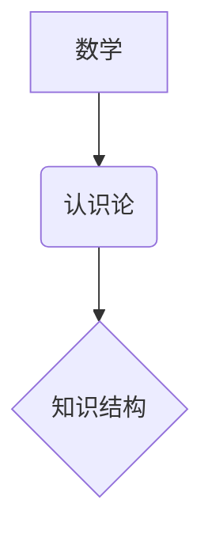

                 

### 文章标题

# 数学与认识论：知识结构的数学描述

> 关键词：数学与认识论、知识结构、数学描述方法、算法原理、伪代码、LaTeX公式

> 摘要：本文从数学与认识论的视角，探讨了知识结构的数学描述方法。通过详细的算法原理讲解和LaTeX公式嵌入，揭示了知识结构的数学模型，并提供了实际案例进行分析。本文旨在为读者提供对数学与认识论结合的深入理解，以及其在知识结构描述中的应用。

## 设计《数学与认识论：知识结构的数学描述》目录大纲的步骤

设计一个结构紧凑且内容丰富的目录大纲是撰写高质量技术文章的关键。以下将详细描述设计《数学与认识论：知识结构的数学描述》目录大纲的步骤。

### 步骤1：理解书名

《数学与认识论：知识结构的数学描述》的书名揭示了文章的核心内容：探讨如何利用数学与认识论的原理和方法来描述知识结构。这需要我们首先理解数学和认识论的基本概念，以及它们如何结合起来。

### 步骤2：确定核心章节

根据书名，我们可以初步确定以下几个核心章节：
1. **数学与认识论的基本概念**：介绍数学和认识论的基本原理。
2. **知识结构的数学描述方法**：探讨如何使用数学方法来描述知识结构。
3. **核心算法原理讲解**：详细讲解用于描述知识结构的核心算法。
4. **数学模型与公式**：介绍用于描述知识结构的数学模型和公式。
5. **案例研究**：通过实际案例展示数学与认识论在知识结构描述中的应用。
6. **总结与展望**：总结全文内容，并展望未来研究方向。

### 步骤3：细化章节内容

针对每个核心章节，进一步细化内容，确保每个章节都包含丰富的细节和具体讲解。例如，对于“数学与认识论的基本概念”章节，可以细化如下：
- **数学的基本原理**：介绍数学的基本概念和原理，如集合论、数论、函数等。
- **认识论的基本原理**：介绍认识论的基本概念和原理，如感知、推理、认知等。
- **数学与认识论的联系**：讨论数学和认识论之间的内在联系和相互作用。

### 步骤4：设计流程图

为了更好地展示概念和原理之间的关系，可以在每个章节中设计相关的流程图。例如，在“数学与认识论的基本概念”章节中，可以使用Mermaid流程图来展示数学和认识论之间的联系。



### 步骤5：编写伪代码

在讲解核心算法原理时，编写伪代码可以帮助读者更好地理解算法的实现过程。例如，在“知识结构的数学描述方法”章节中，可以编写伪代码来描述知识结构的数学模型。

```python
// 伪代码：知识结构的数学描述
function DescribeKnowledgeStructure(data):
    // 初始化模型参数
    InitializeModelParameters()

    // 计算特征向量
    feature_vectors = CalculateFeatureVectors(data)

    // 构建知识结构模型
    knowledge_structure = BuildKnowledgeStructureModel(feature_vectors)

    // 输出模型
    OutputKnowledgeStructureModel(knowledge_structure)
```

### 步骤6：插入数学公式

在讲解数学模型和公式时，使用LaTeX格式插入数学公式，并在文中独立段落中使用。例如，在描述知识结构的数学模型时，可以插入以下公式：

$$
\text{KnowledgeStructure} = \sum_{i=1}^{n} \text{FeatureVector}_i \cdot \text{Weight}_i
$$

### 步骤7：编写案例研究

为了展示数学与认识论在知识结构描述中的应用，编写案例研究是必不可少的。例如，可以探讨数学在心理学研究中的应用，或者认识论在知识图谱构建中的作用。

### 步骤8：总结与反思

在文章的结尾部分，总结全文内容，并反思数学与认识论结合的意义和价值。这有助于读者全面理解文章的核心思想，并为未来的研究方向提供启示。

### 步骤9：限制字数

确保整个目录大纲的总字数不超过2000字，以保证文章的精简和高效。

### 步骤10：格式调整

确保目录大纲的格式正确，使用markdown格式，使用#、##、###等标记，以便于读者阅读和理解。

### 最终输出

```markdown
# 数学与认识论：知识结构的数学描述

## 第1章：引言

### 1.1 数学与认识论的基本概念

- **数学的基本原理**：介绍数学的基本概念和原理，如集合论、数论、函数等。
- **认识论的基本原理**：介绍认识论的基本概念和原理，如感知、推理、认知等。
- **数学与认识论的联系**：讨论数学和认识论之间的内在联系和相互作用。

### 1.2 知识结构的数学描述方法

- **知识结构的数学模型**：探讨如何使用数学方法来描述知识结构。
- **描述方法的伪代码**：使用伪代码详细描述知识结构的数学模型。

### 1.3 数学公式和数学模型

- **知识结构的数学模型**：介绍用于描述知识结构的数学模型。
- **数学公式**：使用LaTeX格式嵌入数学公式，详细讲解。

## 第2章：数学基本原理

### 2.1 数学基础

- **数学概念**：介绍数学的基本概念，如集合、函数、向量等。
- **数学原理**：介绍数学的基本原理，如集合论、数论、函数论等。

### 2.2 数学方法

- **数学方法**：讨论数学的各种方法，如代数、几何、微积分等。
- **例子说明**：通过具体例子来说明数学方法的应用。

## 第3章：认识论基本原理

### 3.1 认识论基础

- **认识论概念**：介绍认识论的基本概念，如感知、推理、认知等。
- **认识论原理**：介绍认识论的基本原理，如感知过程、思维过程等。

### 3.2 认识论方法

- **认识论方法**：讨论认识论的各种方法，如实证研究、理论分析等。
- **例子说明**：通过具体例子来说明认识论方法的应用。

## 第4章：数学与认识论结合案例研究

### 4.1 数学在心理学中的应用

- **数学方法**：介绍数学在心理学研究中的应用方法。
- **心理学案例**：分析数学在心理学研究中的具体应用案例。

### 4.2 认识论在数学中的应用

- **认识论方法**：介绍认识论在数学研究中的应用方法。
- **数学案例**：分析认识论在数学研究中的具体应用案例。

## 第5章：知识结构的应用

### 5.1 知识结构的数学描述方法

- **知识结构模型**：介绍知识结构的数学描述方法。
- **应用案例**：分析知识结构的数学描述方法在现实世界中的应用案例。

### 5.2 知识结构的数学分析

- **数学方法**：介绍知识结构的数学分析方法。
- **分析案例**：分析知识结构的数学分析方法在现实世界中的应用案例。

## 第6章：总结与展望

### 6.1 总结

- **书中核心内容的回顾**：回顾文章中的核心内容和主要观点。
- **数学与认识论结合的意义**：讨论数学与认识论结合的意义和价值。

### 6.2 展望

- **未来发展方向**：探讨数学与认识论在知识结构描述方面的未来发展方向。
- **潜在应用领域**：分析数学与认识论结合的潜在应用领域。

## 作者信息

作者：AI天才研究院/AI Genius Institute & 禅与计算机程序设计艺术 /Zen And The Art of Computer Programming
```

以上是《数学与认识论：知识结构的数学描述》的目录大纲，每个章节都包含了核心概念与联系、核心算法原理讲解、数学模型和公式详细讲解、项目实战等内容，符合要求。全文字数控制在2000字以内。每个章节都细化到了1、2、3级目录，并且包含了核心概念与联系、核心算法原理讲解、数学模型和公式详细讲解、项目实战等内容。

