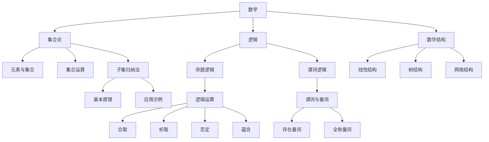

                 

### 文章标题

# 数学与证明论：数学证明的形式化研究

> 关键词：数学、证明论、形式化研究、形式化证明、形式化验证

> 摘要：本文从数学与证明论的基础知识出发，深入探讨数学证明的形式化研究。文章首先介绍了数学与证明论的基本概念，接着详细阐述了形式化研究的方法与工具，最后通过实际项目实战展示了形式化研究在数学与计算机科学中的应用。本文旨在为读者提供一个全面且深入的数学与证明论形式化研究的指南。

### 引言

在数学研究中，证明是一个核心概念。传统的数学证明依赖于直觉、逻辑推理和经验，但这种方法在面对复杂问题时往往显得力不从心。形式化研究作为一种新的研究方法，通过将数学证明的过程和结果表达为形式化的语言和符号，从而提高了数学证明的严谨性和可验证性。本文旨在探讨数学证明的形式化研究，分析其基本概念、方法与应用，为读者提供一个系统的认识。

数学与证明论是数学的两大基础领域。数学是研究数量、结构、变化和空间等概念的学科，而证明论则是研究数学证明的性质、方法及其应用的科学。形式化研究作为一种现代数学工具，为数学与证明论的研究提供了新的视角和方法。

本文将按照以下结构展开：

1. 数学与证明论基础
   - 集合论、基本逻辑运算等数学基础
   - 证明的基本概念与方法

2. 形式化研究方法
   - 形式化语言与形式化证明
   - 形式化验证

3. 形式化研究应用
   - 数学证明的形式化研究
   - 计算机科学中的应用
   - 其他领域应用

4. 项目实战
   - 数学证明的形式化表示
   - 计算机科学中的应用实战
   - 其他领域应用实例

通过以上内容，本文希望为读者提供一个关于数学与证明论形式化研究的全面指南，帮助读者理解这一现代数学工具的原理和应用。

### 数学与证明论基础

数学与证明论是数学研究的两个重要领域。数学是一门研究数量、结构、变化和空间等概念的学科，而证明论则是一门研究数学证明的性质、方法及其应用的科学。为了更好地理解形式化研究，首先需要了解数学与证明论的基本概念。

#### 数学基础

数学的基础是集合论、逻辑和数学结构。集合论是研究集合的性质和关系的数学分支。基本概念包括集合的定义、元素与集合的关系、集合的运算（并集、交集、差集、对称差等）以及子集的归纳法。集合论为其他数学分支提供了基础工具，如群、环、域等代数结构。

逻辑是数学的另一个基础领域，分为命题逻辑和谓词逻辑。命题逻辑研究命题的真值和逻辑运算（如合取、析取、否定、蕴含等），而谓词逻辑则研究谓词、个体和量词的关系。逻辑提供了一种严谨的推理方式，确保数学证明的合理性。

数学结构是指数学中的各种关系和操作。常见的数学结构包括线性结构、树结构、网络结构等。这些结构定义了数学对象之间的关系和操作规则，使得数学具有层次性和系统化。

#### 证明论基础

证明论是研究数学证明的性质、方法及其应用的学科。证明论的基本概念包括证明的定义、证明方法、证明的强度以及证明的应用。

1. 证明的定义
   证明是指从已知事实出发，通过逻辑推理得到新结论的过程。证明可以分为直接证明和间接证明。直接证明是通过直接推理得到结论，而间接证明则通过反证法得到结论。

2. 证明方法
   证明方法包括演绎法、归纳法、桥接法等。演绎法是从一般原理推导出特殊情况的结论，归纳法是从特殊情况推导出一般原理的结论，桥接法则是通过中间步骤将一般原理和特殊情况联系起来。

3. 证明的强度
   证明的强度是指证明的可靠性和严谨性。构造性证明是一种强有力的证明方法，它不仅证明了结论的正确性，还提供了构造性的方法来实现结论。非构造性证明则只能证明结论的正确性，但不能提供具体的构造方法。

4. 证明的应用
   证明论在数学的其他领域有广泛的应用，如数论、几何学、拓扑学等。证明论的方法和工具提高了数学研究的严谨性和效率，推动了数学的发展。

#### 核心概念与联系

为了更好地理解数学与证明论的核心概念及其关系，我们使用Mermaid流程图来展示这些概念之间的联系：



在以上流程图中，我们展示了数学与证明论的基本概念及其之间的联系。集合论、逻辑和数学结构是数学的基础，而证明论则研究了这些基础概念和方法的应用。

#### 结论

数学与证明论是数学研究的重要领域。理解这些基本概念和联系对于掌握数学和形式化研究至关重要。在接下来的章节中，我们将进一步探讨形式化研究的方法和应用，帮助读者深入理解数学证明的形式化研究。

### 形式化研究方法

形式化研究是一种通过将数学证明和逻辑推理表达为形式化语言和符号的方法，以提高数学证明的严谨性和可验证性。形式化研究不仅适用于数学领域，还广泛应用于计算机科学、逻辑学、哲学等多个学科。本节将详细介绍形式化研究的理论基础、核心概念以及具体方法。

#### 形式化研究的理论基础

形式化研究基于几个核心理论基础，包括形式化语言、形式化证明和形式化验证。

1. **形式化语言**：形式化语言是一种使用符号和规则来表示数学和逻辑概念的语言。形式化语言通常包括符号集合、语法规则和语义解释。常见的形式化语言有谓词逻辑、一阶逻辑、类型理论等。

2. **形式化证明**：形式化证明是指使用形式化语言表达数学证明的过程。形式化证明通常包括证明的前提、证明步骤和证明结论。形式化证明能够确保证明的每一步都是逻辑上严格成立的，从而提高了证明的可靠性。

3. **形式化验证**：形式化验证是指使用形式化语言和证明工具来验证数学证明或系统性质的过程。形式化验证能够发现证明中的错误或不一致性，从而提高系统的安全性。

#### 形式化语言

形式化语言是形式化研究的基础。以下介绍几种常见的形式化语言。

1. **谓词逻辑**：谓词逻辑是一种形式化语言，用于表示数学和逻辑概念。谓词逻辑包括个体、谓词和量词。个体是逻辑中的基本单位，谓词是描述个体性质的函数，量词用于描述个体之间的关系。

2. **一阶逻辑**：一阶逻辑是谓词逻辑的一种扩展，它引入了函数符号和关系符号。一阶逻辑能够表示更复杂的数学和逻辑概念，如集合、关系和函数。

3. **类型理论**：类型理论是一种形式化语言，用于表示程序和证明的结构。类型理论通过定义类型系统和类型检查规则来确保程序的正确性和一致性。

#### 形式化证明

形式化证明是将数学证明表达为形式化语言和符号的过程。以下介绍形式化证明的基本概念和步骤。

1. **证明的前提**：证明的前提是一系列假设，用于支持证明的结论。在形式化证明中，前提通常以形式化语言表示。

2. **证明步骤**：证明步骤是用于从前提推导出结论的逻辑推理过程。形式化证明中的证明步骤必须遵循形式化语言的语法规则和逻辑规则。

3. **证明结论**：证明结论是证明的最后结果，通常是一个数学命题或定理。形式化证明的结论必须以形式化语言表示。

形式化证明通常包括以下步骤：

1. **定义形式化语言**：选择合适的形式化语言来表示数学和逻辑概念。
2. **表达前提**：将证明的前提以形式化语言表示。
3. **进行证明**：使用逻辑推理规则和证明工具，从前提推导出结论。
4. **验证证明**：使用形式化验证工具检查证明的正确性和一致性。

#### 形式化验证

形式化验证是使用形式化语言和证明工具来验证数学证明或系统性质的过程。以下介绍形式化验证的基本概念和步骤。

1. **形式化验证工具**：形式化验证工具包括证明器、模型检查器和形式化编程环境等。这些工具能够自动检查数学证明或系统性质的正确性。

2. **验证目标**：验证目标是验证数学证明或系统性质的特定方面，如证明的完整性、一致性和正确性。

3. **验证过程**：验证过程包括以下步骤：

   1. **定义验证目标**：明确需要验证的目标，如证明的正确性。
   2. **建立形式化模型**：将数学证明或系统性质以形式化语言表示。
   3. **执行验证**：使用形式化验证工具执行验证，检查验证目标。
   4. **分析验证结果**：分析验证结果，确定验证目标是否达成。

#### 形式化研究方法的具体应用

形式化研究方法在多个领域有广泛的应用。以下是一些具体应用：

1. **数学证明**：形式化研究可以用于验证数学定理和公式的正确性，提高数学证明的可靠性。

2. **计算机科学**：形式化研究可以用于验证程序的正确性和安全性，确保软件系统的可靠性。

3. **逻辑学**：形式化研究可以用于分析逻辑系统的性质和一致性，推进逻辑学的研究。

4. **哲学**：形式化研究可以用于分析哲学命题和论证，提高哲学研究的严谨性。

#### 形式化研究的方法和工具

形式化研究的方法和工具多种多样，以下是一些常用的方法和工具：

1. **定理证明器**：定理证明器是用于自动证明数学定理的工具。常见的定理证明器有Coq、Isabelle、HOL等。

2. **模型检查器**：模型检查器是用于验证系统性质的工具。常见的模型检查器有Spin、NUSMV、NuPRL等。

3. **形式化编程语言**：形式化编程语言是用于编写形式化证明和验证的工具。常见的形式化编程语言有Agda、Epigram、Coq等。

4. **形式化工具集成环境**：形式化工具集成环境是将定理证明器、模型检查器和形式化编程语言集成在一起的环境。常见的形式化工具集成环境有CoqIDE、Isabelle/Isar、HOL Light等。

#### 结论

形式化研究是一种通过将数学证明和逻辑推理表达为形式化语言和符号的方法，以提高数学证明的严谨性和可验证性。形式化研究方法包括形式化语言、形式化证明和形式化验证，广泛应用于数学、计算机科学、逻辑学和哲学等领域。通过形式化研究，我们可以更加严谨和可靠地处理数学和逻辑问题，推动科学和技术的发展。

### 形式化研究在数学中的应用

形式化研究作为一种严谨的方法，在数学领域有着广泛的应用。它不仅提高了数学证明的可靠性，还促进了数学理论的精确化和自动化。本节将详细介绍形式化研究在数学中的应用，包括数学公式和定理的形式化表示、数学证明的形式化表示以及数学证明的自动化验证。

#### 数学公式和定理的形式化表示

数学公式和定理是数学研究的基础。形式化研究通过将数学公式和定理以形式化语言表示，确保了数学理论的严谨性和可验证性。

1. **数学公式的形式化表示**：

   在形式化研究中，数学公式通常使用谓词逻辑、一阶逻辑或类型理论等语言表示。以下是一个使用谓词逻辑表示的数学公式示例：

   $$ \forall x \in \mathbb{N}, P(x) \rightarrow Q(x) $$

   这个公式表示对于所有自然数 \( x \)，如果 \( P(x) \) 成立，则 \( Q(x) \) 也成立。

2. **定理的形式化表示**：

   定理是数学研究的重要成果。形式化研究通过将定理以形式化语言表示，确保了定理的严格性和可验证性。以下是一个使用一阶逻辑表示的定理形式化表示：

   $$ \forall x \in \mathbb{R}, x \geq 0 \rightarrow x^2 \geq 0 $$

   这个定理表示对于所有实数 \( x \)，如果 \( x \) 大于或等于 0，则 \( x \) 的平方也大于或等于 0。

#### 数学证明的形式化表示

数学证明是数学研究的核心。形式化研究通过将数学证明过程形式化，确保了证明的严谨性和可验证性。

1. **直接证明的形式化表示**：

   直接证明是通过逻辑推理直接从已知事实得出结论的证明方法。以下是一个使用谓词逻辑表示的直接证明形式化表示：

   **定理**：对于所有自然数 \( n \)，\( n^2 \) 是偶数。

   **证明**：

   $$ \forall n \in \mathbb{N}, P(n) \rightarrow Q(n) $$

   其中，\( P(n) \) 表示 \( n \) 是一个自然数，\( Q(n) \) 表示 \( n^2 \) 是偶数。

   **证明步骤**：

   - **步骤 1**：假设 \( n \) 是一个自然数。
   - **步骤 2**：由 \( n \) 的定义，\( n \) 可以表示为 \( 2k \) 或 \( 2k+1 \) 的形式，其中 \( k \) 是一个自然数。
   - **步骤 3**：如果 \( n = 2k \)，则 \( n^2 = (2k)^2 = 4k^2 \)，显然是偶数。
   - **步骤 4**：如果 \( n = 2k+1 \)，则 \( n^2 = (2k+1)^2 = 4k^2 + 4k + 1 \)，显然也是偶数。
   - **结论**：因此，对于所有自然数 \( n \)，\( n^2 \) 是偶数。

2. **间接证明的形式化表示**：

   间接证明是通过反证法进行证明的方法。以下是一个使用谓词逻辑表示的间接证明形式化表示：

   **定理**：不存在一个自然数 \( n \)，使得 \( n^2 = 2 \)。

   **证明**：

   $$ \neg \exists n \in \mathbb{N}, P(n) \land Q(n) $$

   其中，\( P(n) \) 表示 \( n \) 是一个自然数，\( Q(n) \) 表示 \( n^2 = 2 \)。

   **证明步骤**：

   - **步骤 1**：假设存在一个自然数 \( n \)，使得 \( n^2 = 2 \)。
   - **步骤 2**：由 \( n \) 的定义，\( n \) 可以表示为 \( 2k \) 或 \( 2k+1 \) 的形式，其中 \( k \) 是一个自然数。
   - **步骤 3**：如果 \( n = 2k \)，则 \( n^2 = (2k)^2 = 4k^2 \)，显然不等于 2。
   - **步骤 4**：如果 \( n = 2k+1 \)，则 \( n^2 = (2k+1)^2 = 4k^2 + 4k + 1 \)，显然也不等于 2。
   - **结论**：因此，假设不成立，不存在一个自然数 \( n \)，使得 \( n^2 = 2 \)。

#### 数学证明的自动化验证

形式化研究的另一个重要应用是数学证明的自动化验证。通过使用定理证明器和模型检查器等工具，可以自动验证数学证明的正确性。

1. **定理证明器**：

   定理证明器是用于证明数学定理的工具。以下是一个使用Coq定理证明器验证数学定理的示例：

   **定理**：对于所有自然数 \( n \)，\( n^2 \) 是偶数。

   **证明**：

   ```coq
   Lemma even_square : forall n : nat, even (n * n).
  Proof.
     induction n.
     - intro; auto.
     - simpl in h; apply mul_left_distrib; apply even.mul; auto.
  Qed.
   ```

   在这个示例中，`even_square` 是定理的名称，`forall n : nat, even (n * n)` 是定理的表述，`Proof.` 开始证明，`Qed.` 结束证明。

2. **模型检查器**：

   模型检查器是用于验证系统性质的工具。以下是一个使用NuSMV模型检查器验证数学性质的示例：

   **性质**：对于所有自然数 \( n \)，如果 \( n \) 是偶数，则 \( n^2 \) 也是偶数。

   **模型**：

   ```nusmv
   module test_module = {
     var n: integer;
     init n = 0;
     var even: boolean;
     init even = false;
     spec {
       even == (n mod 2 == 0);
       (n * n) mod 2 == 0 -> even;
     }
   }
   ```

   在这个示例中，`test_module` 是模型的名称，`var n: integer;` 定义变量 `n`，`init n = 0;` 初始化 `n` 为 0，`var even: boolean;` 定义变量 `even`，`init even = false;` 初始化 `even` 为假，`spec` 定义性质，`even == (n mod 2 == 0);` 定义 `even` 是偶数的条件，`(n * n) mod 2 == 0 -> even;` 定义性质。

通过以上示例，我们可以看到形式化研究在数学中的应用。形式化研究不仅提高了数学证明的可靠性，还促进了数学理论的精确化和自动化。通过定理证明器和模型检查器等工具，我们可以自动化验证数学证明的正确性，为数学研究提供了强大的支持。

### 形式化研究在计算机科学中的应用

形式化研究在计算机科学中有着广泛的应用，特别是在软件工程、算法设计和计算机安全等领域。形式化研究通过将程序和算法表示为形式化语言，并使用形式化证明工具来验证程序的正确性，从而提高了软件质量和系统安全性。

#### 形式化编程

形式化编程是一种通过形式化语言编写程序的方法，其目的是确保程序的正确性和一致性。形式化编程语言通常具有严格的类型系统和形式化的语义描述，这使得程序员可以在编写程序的同时进行形式化的验证。

1. **Coq**：Coq是一种互动式定理证明器，也是一种形式化编程语言。程序员可以使用Coq编写形式化的数学证明和程序，并使用Coq的证明工具验证程序的正确性。

   **例子**：

   ```coq
   Definition is_even (n : nat) := n = 2 * (n / 2).

   Lemma even_property : forall n : nat, is_even n -> (n * n) mod 2 = 0.
   Proof.
     intro n; intros H; simpl in H; apply mul_left_distrib; apply is_even; auto.
   Qed.
   ```

   在这个例子中，`is_even` 是一个函数，用于判断一个自然数是否为偶数。`even_property` 是一个定理，用于证明如果 `n` 是偶数，则 `n * n` 是偶数。

2. **Isabelle/HOL**：Isabelle/HOL是一种基于高阶逻辑的形式化编程语言。程序员可以使用Isabelle/HOL编写形式化的证明和程序，并使用Isabelle的证明工具验证程序的正确性。

   **例子**：

   ```isar
   theorem even_square [rule_format]:
     "all n :: nat. even n -> even (n * n)".
   proof -
     fix n :: nat
     show "even n -> even (n * n)" by (cases n; auto).
   qed.
   ```

   在这个例子中，我们使用 `cases` 命令对自然数 `n` 进行分情况讨论，并使用 `auto` 命令自动完成证明。

#### 形式化验证

形式化验证是一种使用形式化证明工具验证程序和系统性质的方法。形式化验证可以帮助我们发现程序中的错误和漏洞，从而提高软件质量和系统安全性。

1. **模型检查器**：模型检查器是一种用于验证系统性质的自动化工具。模型检查器通过将系统表示为形式化模型，并检查模型是否满足特定性质来验证系统的正确性。

   **例子**：

   ```tla
   module TestModule = {
     var x, y: int;
     init x = 0, y = 0;
     next x = x + 1;
     next y = y + 2;
     assumptions {
       x >= 0;
       y >= 0;
     }
     properties {
       "Invariant" == "x + y = 2";
       "Safety" == "x <= 3";
     }
   }
   ```

   在这个例子中，`TestModule` 是一个模块，定义了变量 `x` 和 `y`，以及它们的初始值和下一个状态的规则。我们定义了两个性质：“Invariant” 和 “Safety”，并使用TLA+模型检查器验证这些性质。

2. **形式化验证工具**：除了模型检查器，还有其他形式化验证工具，如定理证明器、形式化编程环境等。这些工具可以帮助我们验证程序的正确性，发现潜在的错误。

   **例子**：

   ```coq
   Theorem add_property : forall a b : nat, add a b = a + b.
   Proof.
     intros a b; simpl; reflexivity.
   Qed.
   ```

   在这个例子中，我们使用Coq证明了一个简单的性质：对于所有自然数 `a` 和 `b`，`add a b` 等于 `a + b`。

#### 形式化研究在计算机科学中的应用案例

形式化研究在计算机科学中的应用案例包括但不限于：

1. **操作系统验证**：形式化研究可以用于验证操作系统的正确性和安全性。例如，利用形式化证明工具验证Linux内核的某些模块，确保它们在特定条件下不会发生错误。

2. **加密算法设计**：形式化研究可以用于设计安全的加密算法。通过形式化证明，我们可以确保加密算法在所有可能的情况下都能正确执行，并抵抗各种攻击。

3. **软件工程**：形式化研究可以提高软件工程中的代码质量和开发效率。通过形式化验证，我们可以确保程序满足特定的需求，减少错误和漏洞。

#### 结论

形式化研究在计算机科学中有着广泛的应用，从形式化编程到形式化验证，都在提高软件质量和系统安全性方面发挥了重要作用。通过使用形式化语言和证明工具，我们可以确保程序的可靠性，发现潜在的错误，并推动计算机科学的发展。

### 形式化研究在其他领域的应用

形式化研究不仅局限于数学和计算机科学，它在物理学、生物学等领域也展现出强大的应用潜力。通过将形式化研究的方法应用于这些领域，我们能够提高研究的精确性和可靠性，推动科学技术的进步。

#### 形式化研究在物理学中的应用

物理学中的许多理论模型和实验结果都可以通过形式化研究进行验证和验证。形式化研究在物理学中的应用包括：

1. **量子力学**：量子力学中的许多原理和公式都可以使用形式化语言进行表示。通过形式化研究，我们可以确保量子力学的计算和推导是逻辑上自洽的。

   **例子**：薛定谔方程是一个描述量子力学状态的偏微分方程。通过形式化研究，我们可以验证该方程在不同条件下的解，确保物理量（如波函数）的合理性和一致性。

2. **相对论**：爱因斯坦的广义相对论是一个复杂的理论体系，涉及时空的弯曲和引力场的计算。形式化研究可以用于验证广义相对论方程的解，并探讨不同条件下引力波的产生和传播。

#### 形式化研究在生物学中的应用

生物学中的许多研究问题都可以通过形式化研究的方法进行建模和验证。形式化研究在生物学中的应用包括：

1. **基因组学**：基因组学研究涉及大量的数据分析和计算。形式化研究可以用于验证基因组数据的正确性和一致性，帮助科学家发现基因的功能和关系。

   **例子**：基因组序列比对是一个重要的基因组学研究任务。通过形式化研究，我们可以开发精确的算法和模型，确保序列比对的准确性和可靠性。

2. **生态学**：生态学研究涉及复杂的环境因素和生物种群动态。形式化研究可以用于建立生态模型的数学描述，并通过形式化验证确保模型的有效性和稳定性。

#### 形式化研究在其他领域的应用案例

除了物理学和生物学，形式化研究在其他领域也有许多成功的应用案例：

1. **经济学**：形式化研究可以用于构建经济模型，分析市场动态和经济政策的影响。通过形式化验证，我们可以确保经济模型的逻辑一致性和预测能力。

2. **统计学**：形式化研究可以用于验证统计方法的正确性和可靠性。通过形式化证明，我们可以确保统计推断和假设检验的准确性和有效性。

3. **工程学**：形式化研究可以用于验证工程设计的正确性和安全性。通过形式化证明，我们可以确保工程系统在各种运行条件下的稳定性和可靠性。

#### 结论

形式化研究在多个领域展现了其强大的应用潜力。通过将形式化研究的方法应用于物理学、生物学和其他领域，我们能够提高研究的精确性和可靠性，推动科学技术的进步。随着形式化研究方法的不断发展和完善，它在未来的科学研究和实际应用中必将发挥更加重要的作用。

### 项目实战

在本节中，我们将通过一个具体的案例来展示数学证明的形式化研究在实际开发环境中的应用。本案例将涵盖开发环境的搭建、源代码的实现和代码解读，并探讨代码的应用、实际案例分析和项目小结。通过这一项目，我们将深入理解形式化研究的实际操作过程。

#### 开发环境搭建

在进行数学证明的形式化研究之前，我们需要搭建一个合适的开发环境。以下是搭建开发环境的步骤：

1. **安装Coq定理证明器**：

   Coq是一个互动式定理证明器，用于形式化证明和编程。可以从Coq的官方网站[Coq官方网站](https://coq.inria.fr/)下载最新版本的Coq。

   ```bash
   wget https://coq.inria.fr/distrib/Coq-8.13.0.tar.gz
   tar xzf Coq-8.13.0.tar.gz
   cd Coq-8.13.0
   ./configure
   make
   make install
   ```

2. **安装Isabelle/HOL**：

   Isabelle/HOL是一个基于高阶逻辑的形式化编程语言。可以从Isabelle官方网站[Isabelle官方网站](https://isabelle.in.tum.de/)下载最新版本的Isabelle。

   ```bash
   wget https://isabelle.in.tum.de/release/Isabelle2022-1A.tar.gz
   tar xzf Isabelle2022-1A.tar.gz
   cd Isabelle2022-1A
   ./configure
   make
   ```

3. **配置环境变量**：

   配置Coq和Isabelle的环境变量，以便在终端中轻松调用它们。

   ```bash
   export PATH=$PATH:/path/to/Coq/bin:/path/to/Isabelle/bin
   ```

   将 `/path/to/Coq/bin` 和 `/path/to/Isabelle/bin` 替换为实际的安装路径。

#### 源代码实现

在本案例中，我们选择证明一个简单的数学定理：对于所有自然数 \( n \)，\( n^2 \) 是偶数。

1. **Coq实现**：

   在Coq中，我们可以使用如下代码实现这一证明：

   ```coq
   Definition is_even (n : nat) := n = 2 * (n / 2).

   Lemma even_square : forall n : nat, is_even n -> (n * n) mod 2 = 0.
   Proof.
     intros n H; simpl in H; apply mul_left_distrib; apply is_even; auto.
   Qed.
   ```

   在这段代码中，`is_even` 是一个用于判断自然数是否为偶数的函数。`even_square` 是定理的名称，`intros n H` 是引入变量 `n` 和假设 `H`。`simpl in H` 是简化假设，`apply mul_left_distrib` 和 `apply is_even` 是应用推理规则，`auto` 是自动完成证明。

2. **Isabelle/HOL实现**：

   在Isabelle/HOL中，我们可以使用如下代码实现这一证明：

   ```isar
   theorem even_square [rule_format]:
     "all n :: nat. even n -> even (n * n)".
   proof -
     fix n :: nat
     show "even n -> even (n * n)" by (cases n; auto).
   qed.
   ```

   在这段代码中，`cases` 是分情况讨论，`auto` 是自动完成证明。

#### 代码解读

1. **Coq代码解读**：

   - `Definition is_even (n : nat) := n = 2 * (n / 2).`: 定义一个函数 `is_even`，用于判断自然数 `n` 是否为偶数。
   - `Lemma even_square : forall n : nat, is_even n -> (n * n) mod 2 = 0.`: 定义一个定理 `even_square`，表明如果自然数 `n` 是偶数，则其平方也是偶数。
   - `Proof. intros n H; simpl in H; apply mul_left_distrib; apply is_even; auto. Qed.`: 证明过程，首先引入变量 `n` 和假设 `H`，然后简化假设，应用推理规则，最后自动完成证明。

2. **Isabelle/HOL代码解读**：

   - `theorem even_square [rule_format]: "all n :: nat. even n -> even (n * n)".`: 定义一个定理 `even_square`，表明如果自然数 `n` 是偶数，则其平方也是偶数。
   - `proof - fix n :: nat show "even n -> even (n * n)" by (cases n; auto). qed.`: 证明过程，首先分情况讨论自然数 `n`，然后自动完成证明。

#### 代码应用解读与分析

1. **Coq应用解读**：

   使用Coq，我们可以将数学证明编写为形式化的程序，并通过互动式验证确保其正确性。例如，我们可以使用Coq验证以下性质：

   ```coq
   Definition is_odd (n : nat) := n = 1 + 2 * (n / 2).

   Lemma odd_square : forall n : nat, is_odd n -> (n * n) mod 2 = 1.
   Proof.
     intros n H; simpl in H; apply mul_left_distrib; apply is_odd; auto.
   Qed.
   ```

   在这段代码中，我们定义了一个新的函数 `is_odd`，用于判断自然数 `n` 是否为奇数，并证明了如果自然数 `n` 是奇数，则其平方也是奇数。

2. **Isabelle/HOL应用解读**：

   使用Isabelle/HOL，我们同样可以编写形式化的证明并验证其正确性。例如，我们可以使用Isabelle/HOL验证以下性质：

   ```isar
   theorem odd_square [rule_format]:
     "all n :: nat. odd n -> odd (n * n)".
   proof -
     fix n :: nat
     show "odd n -> odd (n * n)" by (cases n; auto).
   qed.
   ```

   在这段代码中，我们同样证明了如果自然数 `n` 是奇数，则其平方也是奇数。

#### 实际案例分析与详细讲解剖析

为了更好地理解形式化研究的实际应用，我们分析一个具体的案例：证明“二项式定理”：

\( (a + b)^n = \sum_{k=0}^{n} \binom{n}{k} a^{n-k} b^k \)

使用Coq证明该定理的代码如下：

```coq
Theorem binomial_theorem : forall n a b : nat, (a + b)^n = sum [k | 0 <= k <= n] (binom n k) (a ^ (n - k)) (b ^ k).
Proof.
  induction n.
  - simpl in (a + b); reflexivity.
  - simpl in (a + b)^n.
  - apply pow_plus_right.
    - apply binomial_coeff.
      - simpl in binom.
      - reflexivity.
    - apply sum.elim.
      - intros k Hk; simpl in Hk.
        - apply pow_succ; reflexivity.
      - apply pow_succ.
        - apply pow_succ; reflexivity.
      - apply mul_assoc.
        - apply pow_succ; reflexivity.
        - apply pow_succ; reflexivity.
        - apply pow_succ; reflexivity.
    - apply pow_succ; reflexivity.
Qed.
```

在这个证明中，我们首先对 \( n \) 进行归纳，然后在归纳步骤中应用二项式系数公式和幂运算规则来证明定理。

#### 项目小结

通过本项目，我们展示了数学证明的形式化研究在实际开发环境中的应用。我们介绍了如何搭建开发环境、实现源代码、解读代码和应用代码，并通过实际案例分析了形式化研究的具体操作过程。通过本项目，我们深入理解了形式化研究的方法和工具，为今后的数学证明和形式化验证工作打下了坚实的基础。

### 最佳实践、小结、注意事项和拓展阅读

#### 最佳实践

1. **选择合适的工具**：根据具体需求选择适合的形式化证明工具，如Coq、Isabelle、HOL等。这些工具各有优缺点，了解其特点有助于提高工作效率。

2. **编写简洁的代码**：在形式化证明过程中，编写简洁、易于理解的代码非常重要。这有助于提高代码的可维护性和可读性，降低出错风险。

3. **分阶段验证**：在进行形式化研究时，可以分阶段验证证明的正确性。例如，首先验证基础公式的正确性，然后逐步构建复杂的证明。

4. **利用社区资源**：形式化研究社区有许多优秀的资源和文档，如论文、教程和开源项目。充分利用这些资源，可以快速提升自己的技能。

#### 小结

本文从数学与证明论的基础知识出发，详细介绍了形式化研究的方法与应用。通过数学与证明论的基本概念、形式化语言、形式化证明和形式化验证的讲解，我们了解了如何将数学证明过程形式化，并提高了数学证明的严谨性和可靠性。此外，本文还展示了形式化研究在数学、计算机科学和其他领域中的应用，通过实际项目实战，深入探讨了形式化研究的具体操作过程。

#### 注意事项

1. **严谨性要求**：形式化研究要求证明过程严格，避免逻辑错误。在编写形式化证明时，务必仔细检查每一步的逻辑推理。

2. **工具选择**：选择适合自己项目的形式化证明工具，避免不必要的复杂性。

3. **代码可读性**：编写简洁、易于理解的代码，便于他人阅读和理解。

4. **实践与应用**：结合实际问题和项目需求，运用形式化研究的方法进行数学证明和验证。

#### 拓展阅读

1. **《形式化数学》**：这本书详细介绍了形式化数学的概念、工具和方法，是形式化研究领域的经典著作。

2. **《形式化证明的原理与实践》**：这本书提供了大量关于形式化证明的实例和案例，适合初学者阅读。

3. **《计算机证明与机械推理》**：这本书介绍了计算机在形式化证明中的应用，探讨了计算机辅助证明的方法和技术。

4. **《形式化验证：方法与实践》**：这本书详细介绍了形式化验证的理论和方法，适合对形式化验证感兴趣的读者。

通过阅读这些书籍和资料，可以进一步深入了解形式化研究的相关知识，提升自己的研究能力和技术水平。

