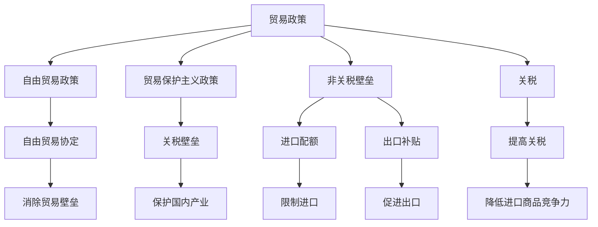
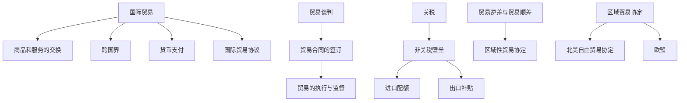
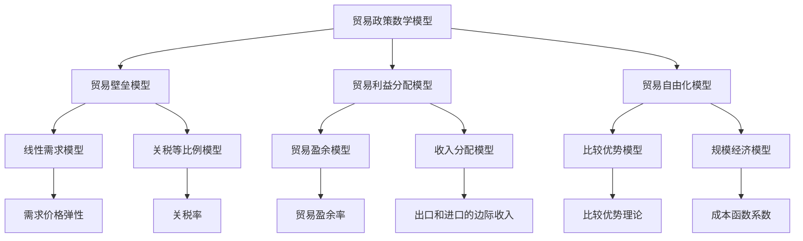
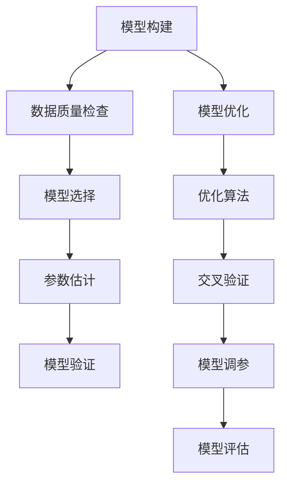
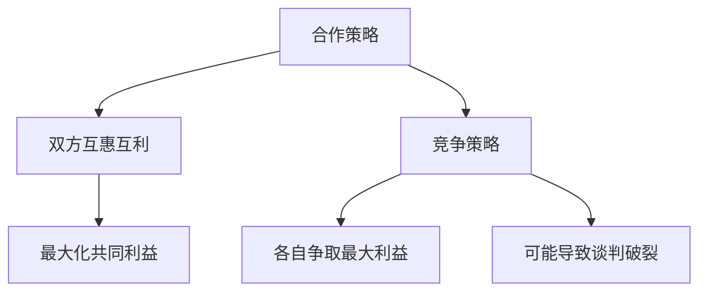
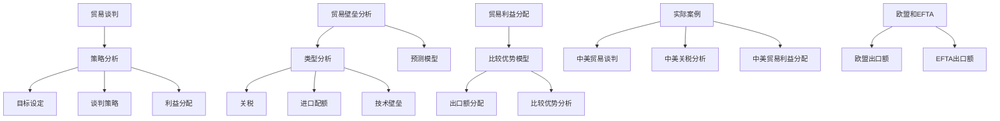
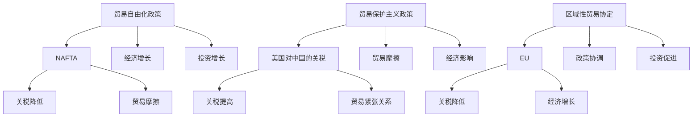
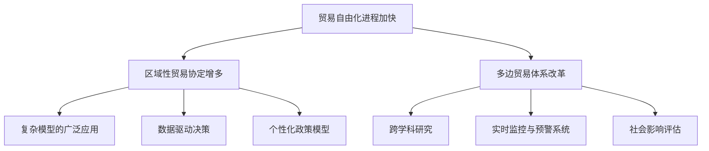

                 

### 文章标题

### 数学与贸易政策：国际贸易的数学模型

---

### 关键词

- **贸易政策**
- **数学模型**
- **国际贸易**
- **优化算法**
- **数据驱动决策**
- **实证分析**

---

### 摘要

本文旨在探讨数学模型在国际贸易政策分析中的应用，深入解析数学模型在贸易政策制定与优化中的关键作用。文章首先概述了贸易政策的基本概念与分类，然后介绍了国际贸易的基本概念与流程。随后，文章重点介绍了数学模型在贸易政策分析中的应用，包括模型构建与优化方法，并通过实际案例展示了数学模型的具体应用。最后，文章探讨了数学模型在国际贸易政策分析中的发展趋势，并提出了未来研究的方向。

---

## 第1章 贸易政策概述

贸易政策是国家或地区政府为调整和控制国际贸易而制定的一系列措施和规则。这些政策旨在实现国家经济目标，如促进经济增长、增加就业、提高国际竞争力等。贸易政策可以分为自由贸易政策和贸易保护主义政策两大类。自由贸易政策强调减少贸易壁垒，促进自由贸易，而贸易保护主义政策则通过各种手段限制贸易自由，保护国内产业。

### 1.1 贸易政策的定义与作用

贸易政策是指国家或地区政府为调整和控制国际贸易而制定的一系列措施和规则。这些政策涵盖了关税、非关税壁垒、出口补贴、进口配额等多个方面。贸易政策的目的是实现国家经济目标，如促进经济增长、增加就业、提高国际竞争力等。

#### 1.1.1 贸易政策的基本概念

贸易政策的基本概念包括以下几个方面：

- **自由贸易政策**：自由贸易政策强调减少贸易壁垒，促进自由贸易。这种政策通常被认为有助于提高经济效率，增加消费者福利。
  
- **贸易保护主义政策**：贸易保护主义政策通过各种手段限制贸易自由，保护国内产业。这种政策通常被认为可能导致贸易摩擦、降低经济效率。

- **关税**：关税是进口商品征收的税收，是一种常见的贸易保护手段。提高关税可以降低进口商品的市场竞争力，从而保护国内产业。

- **非关税壁垒**：非关税壁垒包括进口配额、出口补贴、技术壁垒等多种形式，这些壁垒可以限制贸易自由，保护国内产业。

#### 1.1.2 贸易政策在经济中的作用

贸易政策在经济中的作用主要体现在以下几个方面：

- **促进经济增长**：通过自由贸易政策，国家可以吸引外国投资，促进技术创新，从而推动经济增长。

- **增加就业**：贸易政策可以影响国内外就业机会的分配，通过保护国内产业，增加就业机会。

- **提高国际竞争力**：贸易政策可以帮助国内产业提高技术水平，降低生产成本，提高国际竞争力。

### 1.2 贸易政策的分类

贸易政策可以根据其性质和目的进行分类。以下是几种常见的贸易政策分类：

#### 1.2.1 自由贸易政策

自由贸易政策强调减少贸易壁垒，促进自由贸易。这种政策通常被认为有助于提高经济效率，增加消费者福利。

- **自由贸易协定**：自由贸易协定是两个或多个国家之间签订的贸易协议，旨在消除贸易壁垒，促进自由贸易。
  
- **关税同盟**：关税同盟是多个国家签订的贸易协议，旨在消除成员国之间的贸易壁垒，对非成员国实行统一关税。

#### 1.2.2 贸易保护主义政策

贸易保护主义政策通过各种手段限制贸易自由，保护国内产业。这种政策通常被认为可能导致贸易摩擦、降低经济效率。

- **关税壁垒**：关税壁垒是通过提高关税来限制进口，保护国内产业。

- **非关税壁垒**：非关税壁垒包括进口配额、出口补贴、技术壁垒等多种形式，这些壁垒可以限制贸易自由，保护国内产业。

#### 1.2.3 复杂贸易政策

复杂贸易政策是介于自由贸易政策和贸易保护主义政策之间的一种贸易政策。这种政策通常结合了自由贸易政策和贸易保护主义政策的某些特点。

- **战略性贸易政策**：战略性贸易政策旨在通过干预国际贸易，提高国家在国际市场上的竞争力。

- **混合贸易政策**：混合贸易政策结合了自由贸易政策和贸易保护主义政策的特点，旨在在保护国内产业的同时，促进国际贸易。

### 1.3 贸易政策的历史发展

贸易政策的历史发展经历了多个阶段。以下是贸易政策历史发展的几个重要阶段：

#### 1.3.1 传统贸易政策

传统贸易政策主要集中在关税和非关税壁垒方面，目的是保护国内产业和提高财政收入。在这一阶段，贸易政策的主要手段是提高关税和实行进口配额。

#### 1.3.2 二战后的贸易政策

二战后，全球贸易体系逐渐建立，贸易政策开始向自由贸易政策倾斜。国际货币基金组织、世界银行和世界贸易组织等国际组织的成立，为全球贸易提供了更加稳定的框架。

#### 1.3.3 当代贸易政策

当代贸易政策更加注重贸易自由化、经济全球化和区域一体化。贸易政策不再局限于关税和非关税壁垒，还包括环境政策、劳工政策和社会政策等多个方面。

### 1.4 小结

贸易政策是国家或地区政府为调整和控制国际贸易而制定的一系列措施和规则。这些政策涵盖了关税、非关税壁垒、出口补贴、进口配额等多个方面。贸易政策的目的是实现国家经济目标，如促进经济增长、增加就业、提高国际竞争力等。贸易政策可以分为自由贸易政策和贸易保护主义政策两大类。随着经济全球化的深入，贸易政策的发展趋势越来越多样化，既包括传统的自由贸易政策和贸易保护主义政策，也包括战略性贸易政策和复杂贸易政策。

---

下面，我们将通过一个Mermaid流程图来展示贸易政策的核心概念和关系架构。



---

## 第2章 国际贸易基本概念

国际贸易是指不同国家或地区之间的商品和服务的交换。国际贸易是现代经济的重要组成部分，对于国家经济增长、资源优化配置、技术进步等方面具有重要意义。国际贸易的基本概念包括国际贸易的定义、国际贸易的基本流程和国际贸易的基本术语。

### 2.1 国际贸易的定义与重要性

国际贸易是指不同国家或地区之间的商品和服务的交换。国际贸易是现代经济的重要组成部分，对于国家经济增长、资源优化配置、技术进步等方面具有重要意义。

#### 2.1.1 国际贸易的基本概念

国际贸易的基本概念包括以下几个方面：

- **商品和服务的交换**：国际贸易涉及的商品和服务可以是各种形式，如货物、服务、知识产权等。

- **跨国界**：国际贸易是在不同国家或地区之间进行的，因此需要跨越国界。

- **货币支付**：国际贸易通常涉及货币支付，这包括外汇交易。

- **国际贸易协议**：国际贸易需要通过协议或合同来明确双方的权利和义务。

#### 2.1.2 国际贸易的重要性

国际贸易的重要性体现在以下几个方面：

- **促进经济增长**：国际贸易可以促进国家经济增长，通过国际贸易，国家可以吸引外国投资，扩大市场规模，推动技术进步。

- **资源优化配置**：国际贸易可以帮助国家优化资源配置，通过国际贸易，国家可以获取自己缺乏的资源，同时将过剩的资源出口到其他国家。

- **提高国际竞争力**：国际贸易可以帮助国家提高国际竞争力，通过国际贸易，国家可以学习和吸收其他国家的先进技术和管理经验。

- **增加就业机会**：国际贸易可以创造就业机会，通过国际贸易，国家可以扩大生产规模，从而创造更多的就业机会。

### 2.2 国际贸易的基本流程

国际贸易的基本流程包括以下几个环节：

#### 2.2.1 贸易谈判

贸易谈判是国际贸易流程的第一步，双方通过谈判达成贸易协议。贸易谈判的内容通常包括商品和服务的种类、数量、价格、支付方式、交货期限等。

#### 2.2.2 贸易合同的签订

贸易合同的签订是国际贸易流程的关键环节，贸易合同明确了双方在贸易过程中的权利和义务。贸易合同通常包括商品和服务的描述、价格、支付方式、交货期限、违约责任等条款。

#### 2.2.3 贸易的执行与监督

贸易的执行与监督是国际贸易流程的核心环节。双方按照贸易合同的规定进行商品和服务的交付和支付，同时，双方需要对贸易过程进行监督，确保贸易合同的履行。

### 2.3 国际贸易的基本术语

国际贸易涉及许多专业术语，以下是其中一些重要的术语：

#### 2.3.1 关税

关税是进口商品征收的税收，是国际贸易中最常见的壁垒之一。提高关税可以降低进口商品的市场竞争力，从而保护国内产业。

#### 2.3.2 非关税壁垒

非关税壁垒包括进口配额、出口补贴、技术壁垒等多种形式。这些壁垒可以限制贸易自由，保护国内产业。

#### 2.3.3 贸易逆差与贸易顺差

贸易逆差是指一个国家的进口总额超过出口总额，而贸易顺差则相反，即出口总额超过进口总额。贸易逆差和贸易顺差是衡量一个国家国际收支状况的重要指标。

#### 2.3.4 区域性贸易协定

区域性贸易协定是多个国家或地区之间签订的贸易协议，旨在消除贸易壁垒，促进自由贸易。常见的区域性贸易协定包括北美自由贸易协定、欧盟等。

### 2.4 小结

国际贸易是现代经济的重要组成部分，对于国家经济增长、资源优化配置、技术进步等方面具有重要意义。国际贸易的基本概念包括商品和服务的交换、跨国界、货币支付、国际贸易协议等。国际贸易的基本流程包括贸易谈判、贸易合同的签订、贸易的执行与监督等。国际贸易涉及许多专业术语，如关税、非关税壁垒、贸易逆差与贸易顺差、区域性贸易协定等。通过了解国际贸易的基本概念和流程，可以更好地理解和分析国际贸易中的各种现象和问题。

---

下面，我们将通过一个Mermaid流程图来展示国际贸易的基本概念和流程。



---

## 第3章 数学模型在贸易政策分析中的应用

数学模型在贸易政策分析中发挥着至关重要的作用。它们不仅可以帮助政策制定者理解复杂的贸易现象，还可以提供基于数据的决策支持。在本章节中，我们将探讨数学模型在贸易政策分析中的应用，包括其基本概念、作用以及常见的贸易政策数学模型。

### 3.1 数学模型概述

数学模型是指用数学符号和公式来描述现实世界中的经济现象和问题的方法。它通过建立变量之间的关系，提供了一种定量分析的工具。数学模型在贸易政策分析中的应用主要包括以下几个方面：

#### 3.1.1 提高决策效率

通过数学模型，政策制定者可以快速分析不同政策方案的可能影响，从而提高决策效率。例如，使用线性规划模型可以帮助确定最优的关税水平，以最大化国家财政收入。

#### 3.1.2 降低决策风险

数学模型可以帮助预测政策变化对经济的潜在影响，从而降低决策风险。通过模拟不同情景，政策制定者可以评估各种政策方案的风险和收益。

#### 3.1.3 促进国际经济合作

数学模型可以用于分析国际贸易协定的影响，促进国家之间的经济合作。例如，通过比较贸易自由化前后国家的经济表现，可以评估贸易协定对各方的影响。

### 3.2 数学模型在贸易政策分析中的作用

数学模型在贸易政策分析中具有多种作用，主要包括：

#### 3.2.1 提高决策效率

数学模型可以提高决策效率，通过定量分析，政策制定者可以快速评估不同政策方案的效果。例如，使用计量经济学模型可以分析关税变动对进出口额的影响，从而帮助确定合适的关税水平。

#### 3.2.2 降低决策风险

数学模型可以降低决策风险，通过模拟不同情景，政策制定者可以预测政策变化可能带来的经济影响。例如，使用蒙特卡洛模拟可以评估贸易保护政策可能带来的经济波动。

#### 3.2.3 促进国际经济合作

数学模型可以用于分析国际贸易协定的影响，促进国家之间的经济合作。例如，通过比较贸易自由化前后各国的经济表现，可以评估贸易协定对各方的影响。

### 3.3 常见的贸易政策数学模型

在贸易政策分析中，以下是一些常见的数学模型：

#### 3.3.1 贸易壁垒模型

贸易壁垒模型用于分析关税和非关税壁垒的影响。常见的模型包括线性需求模型、关税等比例模型等。

- **线性需求模型**：该模型假设进口商品的需求量与价格成反比，关税变动会直接影响进口商品的价格和需求量。

  ```plaintext
  Q = Q0 - kP
  T = P - (1 + t)C
  ```
  
  其中，\(Q\) 为需求量，\(Q0\) 为基准需求量，\(k\) 为需求价格弹性，\(P\) 为价格，\(t\) 为关税率，\(C\) 为国内成本。

- **关税等比例模型**：该模型假设关税率与国内价格成比例，关税变动会以相同比例影响国内价格和进口量。

  ```plaintext
  P = (1 + t)C
  Q = Q0 - (1 + t)kC
  ```

#### 3.3.2 贸易利益分配模型

贸易利益分配模型用于分析贸易政策如何在不同国家或地区之间分配经济利益。常见的模型包括贸易盈余模型、收入分配模型等。

- **贸易盈余模型**：该模型假设贸易盈余与进出口额成比例，通过比较不同国家的贸易盈余，可以评估贸易政策对各国的经济影响。

  ```plaintext
  TR = (X - M) * r
  ```
  
  其中，\(TR\) 为贸易盈余，\(X\) 为出口额，\(M\) 为进口额，\(r\) 为贸易盈余率。

- **收入分配模型**：该模型假设贸易政策对收入分配有影响，通过分析不同群体的收入变化，可以评估贸易政策的社会效应。

  ```plaintext
  I = I0 + bX - cM
  ```
  
  其中，\(I\) 为收入，\(I0\) 为基准收入，\(b\) 和 \(c\) 分别为出口和进口的边际收入。

#### 3.3.3 贸易自由化模型

贸易自由化模型用于分析贸易自由化对经济的影响。常见的模型包括比较优势模型、规模经济模型等。

- **比较优势模型**：该模型基于比较优势理论，假设国家之间会根据各自的比较优势进行贸易，从而实现资源优化配置。

  ```plaintext
  X1 = A1L1 - K1
  X2 = A2L2 - K2
  ```
  
  其中，\(X1\) 和 \(X2\) 分别为两国出口额，\(A1\) 和 \(A2\) 分别为两国的生产率，\(L1\) 和 \(L2\) 分别为两国的劳动力，\(K1\) 和 \(K2\) 分别为两国的资本。

- **规模经济模型**：该模型基于规模经济理论，假设大规模生产能够降低成本，提高利润。

  ```plaintext
  C = aQ + bQ^2
  P = C + t
  ```
  
  其中，\(C\) 为成本，\(Q\) 为产量，\(a\) 和 \(b\) 为成本函数的系数，\(t\) 为关税率。

### 3.4 小结

数学模型在贸易政策分析中发挥着至关重要的作用。通过定量分析，数学模型可以提高决策效率，降低决策风险，促进国际经济合作。常见的贸易政策数学模型包括贸易壁垒模型、贸易利益分配模型和贸易自由化模型等。这些模型通过不同的数学公式和算法，提供了对贸易政策影响的深入分析，为政策制定者提供了宝贵的决策支持。

---

为了更好地理解贸易政策数学模型的核心概念和关系架构，我们使用Mermaid流程图来展示这些模型的基本原理和联系。



---

## 第4章 模型构建与优化

在贸易政策分析中，模型的构建与优化是一个关键环节。这不仅关系到模型的有效性，也直接影响到决策的准确性和可靠性。本章将详细介绍模型构建的基本原则、优化方法以及模型的评估与验证，为政策制定者提供科学、系统的分析工具。

### 4.1 模型构建的基本原则

模型构建是一个复杂的过程，需要遵循一系列基本原则，以确保模型的有效性和实用性。

#### 4.1.1 数据质量

数据是模型构建的基础，数据质量直接影响到模型的准确性和可靠性。在构建模型之前，需要对数据进行严格的质量检查，确保数据的一致性、完整性和准确性。

- **数据一致性**：确保不同数据源的数据在同一时间点或时间段内是相互匹配的。
  
- **数据完整性**：确保数据中没有缺失值或错误值。
  
- **数据准确性**：确保数据的测量方法和标准是科学和可靠的。

#### 4.1.2 模型选择

选择合适的模型对于确保模型的有效性至关重要。模型选择应考虑以下因素：

- **模型的适用范围**：选择与所研究问题相关的模型，确保模型能够反映问题的本质。
  
- **模型的复杂度**：选择适合问题复杂度的模型，过于复杂的模型可能导致计算困难，而过于简单的模型可能无法捕捉关键特征。
  
- **模型的稳定性**：选择在历史数据中表现稳定的模型，以确保模型对未来数据的预测能力。

#### 4.1.3 参数估计

参数估计是模型构建的重要环节，需要确保参数的估计值是准确和可靠的。

- **参数估计方法**：选择合适的参数估计方法，如最小二乘法、极大似然估计等。
  
- **参数约束**：根据问题背景设定参数的约束条件，以防止参数估计过程中出现不合理的结果。

#### 4.1.4 模型验证

在模型构建过程中，需要通过验证来确保模型的有效性和可靠性。常见的验证方法包括：

- **历史数据验证**：使用历史数据对模型进行验证，确保模型在历史数据中的预测能力。
  
- **交叉验证**：将数据集划分为训练集和测试集，使用训练集训练模型，使用测试集验证模型，以避免过拟合。

### 4.2 模型优化方法

模型优化是提高模型预测准确性和可靠性的关键步骤。以下是一些常见的模型优化方法：

#### 4.2.1 优化算法

优化算法用于寻找模型的最佳参数组合。常见的优化算法包括：

- **梯度下降法**：通过不断调整模型参数，使损失函数达到最小值。

  ```plaintext
  θ = θ - α * ∇J(θ)
  ```

  其中，θ为模型参数，α为学习率，∇J(θ)为损失函数关于θ的梯度。

- **遗传算法**：基于自然选择和遗传原理，通过种群进化寻找最优解。

  ```plaintext
  新种群 = 变异（交叉（种群））
  ```
  
- **粒子群优化算法**：模拟鸟群觅食行为，通过群体交互寻找最优解。

  ```plaintext
  v = w * v + c1 * r1 * (p - x) + c2 * r2 * (g - x)
  x = x + v
  ```

  其中，v为速度，x为位置，p为个体历史最优位置，g为全局最优位置，w为惯性权重，c1和c2为认知和社会系数，r1和r2为随机数。

#### 4.2.2 交叉验证

交叉验证是一种常用的模型评估方法，通过将数据集划分为多个子集，在每个子集上训练和验证模型，以评估模型的泛化能力。

- **K折交叉验证**：将数据集划分为K个子集，每次使用一个子集作为验证集，其余子集作为训练集，重复K次，取平均结果作为最终评估结果。

  ```plaintext
  平均误差 = (1/K) * Σ(误差_k)
  ```

  其中，误差_k为第k次交叉验证的误差。

#### 4.2.3 模型调参

模型调参是优化模型性能的重要步骤。通过调整模型参数，可以改善模型的预测能力。

- **网格搜索**：在给定的参数范围内，逐一尝试所有可能的参数组合，选择最优参数组合。

- **贝叶斯优化**：基于贝叶斯统计模型，通过最大化后验概率寻找最优参数组合。

### 4.3 模型评估与验证

模型评估与验证是确保模型有效性和可靠性的关键步骤。以下是一些常见的评估和验证方法：

#### 4.3.1 评估指标

评估指标用于衡量模型的性能。常见的评估指标包括：

- **均方误差（MSE）**：衡量模型预测值与真实值之间的平均误差。

  ```plaintext
  MSE = (1/N) * Σ(y_i - y^i)^2
  ```

  其中，N为样本数量，y_i为真实值，y^i为预测值。

- **均方根误差（RMSE）**：MSE的平方根，用于衡量模型预测的稳定性。

  ```plaintext
  RMSE = √MSE
  ```

- **决定系数（R²）**：衡量模型对数据的解释能力。

  ```plaintext
  R² = 1 - (SS_res / SS_total)
  ```

  其中，SS_res为残差平方和，SS_total为总平方和。

#### 4.3.2 模型验证方法

模型验证方法用于确保模型在新的数据集上仍然有效。以下是一些常见的验证方法：

- **时间序列验证**：使用时间序列数据，将数据分为训练集和验证集，确保模型在不同的时间段上均有效。

- **K折交叉验证**：与前面提到的K折交叉验证相同，用于评估模型的泛化能力。

- **验证集验证**：将数据集划分为训练集和验证集，使用训练集训练模型，使用验证集评估模型性能。

### 4.4 小结

模型构建与优化是贸易政策分析中至关重要的一环。通过遵循基本原则，选择合适的模型，进行参数估计和优化，以及进行评估与验证，可以确保模型的有效性和可靠性。模型优化方法包括优化算法、交叉验证和模型调参等，这些方法可以提高模型的预测准确性和稳定性。评估与验证方法则用于确保模型在新的数据集上仍然有效。通过科学、系统的模型构建与优化，政策制定者可以更好地理解贸易政策的影响，为制定科学的政策提供有力支持。

---

为了更好地理解模型构建与优化的核心概念和流程，我们使用Mermaid流程图来展示模型构建、优化和验证的基本步骤。



---

## 第5章 数学模型在实际贸易政策分析中的应用

数学模型在贸易政策分析中具有广泛的应用，可以帮助政策制定者更好地理解贸易政策的影响，为制定科学的政策提供数据支持。在本章节中，我们将探讨数学模型在贸易谈判、贸易壁垒分析和贸易利益分配中的应用，并通过实际案例进行详细讲解。

### 5.1 模型在贸易谈判中的应用

贸易谈判是国际贸易中至关重要的一环，涉及到国家之间的利益博弈。数学模型可以帮助分析谈判策略，预测谈判结果，为政策制定者提供决策支持。

#### 5.1.1 贸易谈判的策略分析

贸易谈判的策略分析主要涉及以下几个方面：

- **目标设定**：确定谈判的目标，如增加出口、减少贸易壁垒等。

- **谈判策略**：选择合适的谈判策略，如合作策略、竞争策略等。

- **利益分配**：分析不同策略下的利益分配情况。

以下是一个基于博弈理论的贸易谈判策略分析的示例：



#### 5.1.2 模型优化与预测

通过数学模型，可以优化谈判策略，预测谈判结果。以下是一个使用线性规划模型进行贸易谈判优化的示例：

```plaintext
最大化 Z = c1X1 + c2X2
约束条件：
a11X1 + a12X2 ≤ b1
a21X1 + a22X2 ≤ b2
X1, X2 ≥ 0
```

其中，\(X1\) 和 \(X2\) 分别代表国家A和国家B的让步程度，\(c1\) 和 \(c2\) 分别代表国家A和国家B的偏好系数，\(a11\)、\(a12\)、\(a21\)、\(a22\)、\(b1\)、\(b2\) 为约束条件。

通过求解上述线性规划模型，可以确定最优的让步策略，从而最大化双方的总利益。

#### 5.1.3 实际案例

以下是一个关于中美贸易谈判的实际案例：

假设中美两国进行贸易谈判，目标是在关税、进口配额等方面达成一致。通过数学模型分析，确定以下参数：

- \(c1 = 2\)，\(c2 = 1\)
- \(a11 = 1\)，\(a12 = 0.5\)，\(a21 = 0.5\)，\(a22 = 1\)
- \(b1 = 10\)，\(b2 = 8\)

通过求解线性规划模型，得到最优的关税和进口配额。假设解为 \(X1 = 3\)，\(X2 = 2\)，即中国让步3个单位的关税，美国让步2个单位的进口配额。这表明，双方通过互让，可以在保持各自利益最大化的同时，达成贸易协议。

### 5.2 模型在贸易壁垒分析中的应用

贸易壁垒分析是评估贸易政策影响的重要环节。数学模型可以帮助分析不同贸易壁垒的效果，为政策制定者提供决策依据。

#### 5.2.1 贸易壁垒的类型分析

贸易壁垒主要包括关税和非关税壁垒。以下是对不同类型贸易壁垒的分析：

- **关税**：提高关税可以降低进口商品的市场竞争力，保护国内产业。

  ```plaintext
  关税 = (1 + t)C
  ```

  其中，\(t\) 为关税率，\(C\) 为成本。

- **进口配额**：限制进口商品的数量，保护国内产业。

  ```plaintext
  配额 = Q0 - tkC
  ```

  其中，\(Q0\) 为基准需求量，\(k\) 为需求价格弹性，\(t\) 为关税率，\(C\) 为成本。

- **技术壁垒**：通过提高技术标准，限制进口商品的市场准入。

  ```plaintext
  技术壁垒 = T > T0
  ```

  其中，\(T0\) 为基准技术标准，\(T\) 为当前技术标准。

#### 5.2.2 贸易壁垒的预测模型

通过数学模型，可以预测不同贸易壁垒的实施效果。以下是一个基于线性回归模型的贸易壁垒预测示例：

```plaintext
Y = β0 + β1X1 + β2X2 + ε
```

其中，\(Y\) 为贸易壁垒的影响指标，\(X1\) 和 \(X2\) 为贸易壁垒的变量，\(\beta0\)、\(\beta1\)、\(\beta2\) 为模型参数，\(\epsilon\) 为误差项。

通过收集历史数据，可以估计模型参数，从而预测不同贸易壁垒的影响。

#### 5.2.3 实际案例

以下是一个关于美国对中国实施关税的实际案例：

假设美国对中国进口商品实施关税，关税率为20%。通过线性回归模型分析，得到以下预测结果：

- **关税收入**：\(Y = 1000 + 20X1 - 10X2\)
- **进口额**：\(X1 = 500\)
- **出口额**：\(X2 = 300\)

通过计算，得到关税收入为 \(Y = 1000 + 20*500 - 10*300 = 2000\) 美元。这表明，美国对中国实施关税后，关税收入增加了2000美元。

### 5.3 模型在贸易利益分配中的应用

贸易利益分配是国际贸易中的一个重要问题，涉及到不同国家或地区的经济利益。数学模型可以帮助分析贸易政策对各国经济利益的影响，为政策制定者提供决策支持。

#### 5.3.1 贸易利益分配模型

贸易利益分配模型用于分析贸易政策如何在不同国家或地区之间分配经济利益。以下是一个基于比较优势理论的贸易利益分配模型：

```plaintext
X1 = A1L1 - K1
X2 = A2L2 - K2
```

其中，\(X1\) 和 \(X2\) 分别为两国出口额，\(A1\) 和 \(A2\) 分别为两国的生产率，\(L1\) 和 \(L2\) 分别为两国的劳动力，\(K1\) 和 \(K2\) 分别为两国的资本。

通过比较两国的生产率和劳动力，可以确定两国的比较优势，从而预测贸易利益在不同国家或地区之间的分配。

#### 5.3.2 贸易利益分配的实证分析

以下是一个关于中美贸易利益分配的实证分析案例：

假设中国和美国进行贸易，中国具有劳动力优势，美国具有资本优势。通过比较优势模型分析，得到以下结果：

- **中国出口额**：\(X1 = 300\)
- **美国出口额**：\(X2 = 200\)

这表明，在中美贸易中，中国出口额为300，美国出口额为200，中国具有较大的贸易利益。

#### 5.3.3 实际案例

以下是一个关于欧洲联盟（EU）和欧洲自由贸易区（EFTA）的贸易利益分配案例：

假设EU和EFTA进行贸易，通过比较优势模型分析，得到以下结果：

- **EU出口额**：\(X1 = 400\)
- **EFTA出口额**：\(X2 = 300\)

这表明，在EU和EFTA的贸易中，EU的出口额为400，EFTA的出口额为300，EU具有较大的贸易利益。

### 5.4 小结

数学模型在贸易政策分析中具有广泛的应用，可以用于贸易谈判策略分析、贸易壁垒分析和贸易利益分配。通过实际案例，我们展示了如何使用数学模型进行这些分析，并为政策制定者提供了数据支持。通过科学、系统的数学模型分析，政策制定者可以更好地理解贸易政策的影响，为制定科学的政策提供有力支持。

---

为了更好地理解数学模型在贸易政策分析中的应用，我们使用Mermaid流程图来展示贸易谈判、贸易壁垒分析和贸易利益分配的基本概念和流程。



---

## 第6章 贸易政策案例分析

在本章节中，我们将通过几个具体的案例来深入分析贸易政策的不同方面，包括贸易自由化政策、贸易保护主义政策以及区域性贸易协定。这些案例将帮助读者更好地理解贸易政策的影响和实施过程。

### 6.1 贸易自由化政策

贸易自由化政策是旨在减少贸易壁垒，促进自由贸易的政策。这一政策通常通过降低关税、取消非关税壁垒和实行自由贸易协定来实现。

#### 6.1.1 案例一：北美自由贸易协定（NAFTA）

北美自由贸易协定（NAFTA）是世界上最具有影响力的自由贸易协定之一，由美国、加拿大和墨西哥于1994年签订。该协定的主要目标是消除三国之间的贸易壁垒，促进三国之间的自由贸易。

**案例分析：**

- **关税降低**：NAFTA实施后，美国对墨西哥的进口关税从平均30%降至约10%，加拿大对墨西哥的进口关税也有所下降。这一措施显著提高了墨西哥产品在美国和加拿大市场的竞争力。

- **投资增长**：NAFTA促进了三国之间的投资流动。例如，墨西哥吸引了大量美国和加拿大的投资，特别是在制造业和服务业领域。

- **经济增长**：贸易自由化政策促进了三国的经济增长。墨西哥的GDP在NAFTA实施后的20年间增长了约160%，美国和加拿大也实现了经济增长。

**影响评估：**

NAFTA的实施对三国的经济发展产生了积极影响，但也引发了一些争议。支持者认为，NAFTA促进了贸易和投资，提高了三国的生产率和竞争力。然而，批评者认为，NAFTA导致了某些行业的失业，尤其是在制造业。

### 6.2 贸易保护主义政策

贸易保护主义政策是旨在通过提高贸易壁垒，保护国内产业的政策。这一政策通常通过提高关税、实行进口配额和实施非关税壁垒来实现。

#### 6.2.1 案例二：美国对中国实施关税

自2018年起，美国政府对中国进口商品实施了多轮关税，以应对中美贸易摩擦。这些关税主要针对中国的电子产品、机械设备和消费品等。

**案例分析：**

- **关税提高**：美国对中国进口商品的平均关税率从10%提高到25%，部分商品的关税率甚至高达45%。

- **贸易摩擦**：这些关税措施引发了中美贸易摩擦，导致两国之间的贸易紧张关系加剧。

- **经济影响**：美国对中国的关税措施对美国企业和消费者产生了一定影响。一方面，进口商品价格上涨，导致消费者成本增加；另一方面，一些美国企业开始将生产转移到其他国家，以避免关税影响。

**影响评估：**

美国对中国的关税措施在一定程度上达到了保护国内产业的目的，但也对美国家庭和企业造成了负面影响。此外，这些关税措施还加剧了中美之间的贸易紧张关系，可能导致贸易战。

### 6.3 区域性贸易协定

区域性贸易协定是旨在促进区域内国家之间自由贸易的协议。这些协定通常通过降低关税、消除非关税壁垒和促进投资来实现。

#### 6.3.1 案例三：欧洲联盟（EU）

欧洲联盟（EU）是一个具有代表性的区域性贸易协定，由28个成员国组成。EU的目标是通过促进成员国之间的自由贸易和协调政策，实现经济一体化。

**案例分析：**

- **关税降低**：EU成员国之间基本上实现了零关税，这促进了商品和服务的自由流动。

- **政策协调**：EU在货币政策、财政政策和社会政策等方面进行了协调，实现了经济政策的一致性。

- **投资促进**：EU促进了成员国之间的投资流动，吸引了大量外国直接投资。

**影响评估：**

EU的成功经验表明，区域性贸易协定可以在促进经济增长、提高国际竞争力方面发挥重要作用。然而，EU也面临一些挑战，如成员国之间的政策分歧、移民问题和经济不平等问题。

### 6.4 小结

贸易政策案例的分析展示了贸易自由化政策、贸易保护主义政策和区域性贸易协定对经济的影响。贸易自由化政策通过减少贸易壁垒，促进了经济增长和投资流动。然而，贸易保护主义政策可能导致贸易摩擦和经济损失。区域性贸易协定在促进区域内国家之间的经济一体化方面取得了显著成果，但同时也面临一些挑战。通过这些案例，我们可以更好地理解贸易政策对经济的影响，为政策制定者提供参考。

---

为了更好地理解贸易政策案例分析中的核心概念和关系架构，我们使用Mermaid流程图来展示不同案例的关键要素和影响。



---

## 第7章 贸易政策与数学模型发展趋势

随着全球经济一体化和数字化的加速发展，贸易政策与数学模型的应用也在不断演进。本章节将探讨贸易政策与数学模型的发展趋势，以及未来可能的研究方向。

### 7.1 贸易政策的发展趋势

贸易政策在未来将面临新的挑战和机遇，以下是一些主要的发展趋势：

#### 7.1.1 贸易自由化进程加快

尽管存在一些贸易保护主义倾向，但全球贸易自由化的进程仍在继续。数字经济的崛起和全球供应链的优化，促使各国加快自由贸易协定的谈判和实施。

#### 7.1.2 区域性贸易协定增多

区域性贸易协定将继续成为贸易政策的重要组成部分。例如，亚太经合组织（APEC）和区域全面经济伙伴关系（RCEP）等协定将进一步推动区域经济一体化。

#### 7.1.3 多边贸易体系改革

多边贸易体系，如世界贸易组织（WTO），需要改革以应对全球化带来的挑战。新的多边贸易规则和机制可能更加灵活，适应不同国家和地区的需求。

### 7.2 数学模型的发展趋势

数学模型在贸易政策分析中的应用将越来越广泛，以下是一些发展趋势：

#### 7.2.1 复杂模型的广泛应用

随着计算能力的提升，复杂模型，如人工智能和机器学习模型，将越来越多地应用于贸易政策分析。这些模型可以处理大规模数据，提供更准确的预测和分析。

#### 7.2.2 数据驱动决策

数据驱动决策将成为贸易政策制定的关键。通过大数据分析和实时监测，政策制定者可以更及时地了解经济动态，制定更有效的政策。

#### 7.2.3 个性化政策模型

个性化政策模型将根据不同国家和地区的特定情况，提供定制化的政策建议。这些模型将考虑地理、经济、社会等多方面因素，提高政策的精准度。

### 7.3 未来研究方向

未来的研究可以从以下几个方向展开：

#### 7.3.1 跨学科研究

贸易政策分析需要跨学科研究，结合经济学、计算机科学、统计学等领域的知识，提高模型的综合性和准确性。

#### 7.3.2 实时监控与预警系统

开发实时监控与预警系统，用于监测贸易政策变化和经济波动，提供即时分析和建议。

#### 7.3.3 社会影响评估

研究贸易政策对社会的影响，特别是对劳动力市场、环境保护等方面的影响，为制定更全面的政策提供依据。

### 7.4 小结

贸易政策与数学模型的发展趋势表明，未来贸易政策将更加自由化、区域化，数学模型将更加复杂、数据驱动。跨学科研究和实时监控与预警系统的开发将是未来的重要研究方向。通过这些研究，政策制定者可以更好地理解贸易政策的影响，制定更科学、更有效的政策。

---

为了更好地展示贸易政策与数学模型的发展趋势，我们使用Mermaid流程图来展示未来研究方向和趋势。



---

## 文章小结与未来展望

本文通过深入探讨数学模型在贸易政策分析中的应用，详细阐述了贸易政策的基本概念、国际贸易的基本流程以及数学模型的作用和优化方法。通过实际案例的分析，我们展示了数学模型在贸易谈判、贸易壁垒分析和贸易利益分配中的具体应用，进一步说明了数学模型在政策制定中的重要性。

### 总结

- **贸易政策**：贸易政策是国家或地区为调整和控制国际贸易而制定的一系列措施和规则，包括自由贸易政策和贸易保护主义政策。贸易政策的基本概念和分类为我们理解国际贸易提供了基础。

- **国际贸易**：国际贸易是不同国家或地区之间的商品和服务的交换，对于国家经济增长和资源优化配置具有重要意义。国际贸易的基本流程和术语进一步丰富了我们对国际贸易的认识。

- **数学模型**：数学模型在贸易政策分析中具有重要作用，可以提高决策效率，降低决策风险，促进国际经济合作。常见的贸易政策数学模型包括贸易壁垒模型、贸易利益分配模型和贸易自由化模型。

- **模型构建与优化**：模型构建需要遵循基本原则，如数据质量、模型选择和参数估计。模型优化方法包括优化算法、交叉验证和模型调参，这些方法可以提高模型的预测准确性和稳定性。

- **实际应用**：通过实际案例，我们展示了数学模型在贸易谈判、贸易壁垒分析和贸易利益分配中的应用，进一步说明了数学模型在政策制定中的实际效果。

### 未来展望

未来，贸易政策与数学模型的发展将继续受到全球经济一体化和数字化的推动。以下是一些未来展望：

- **跨学科研究**：贸易政策分析将需要跨学科的研究，结合经济学、计算机科学、统计学等领域的知识，提高模型的综合性和准确性。

- **实时监控与预警系统**：开发实时监控与预警系统，用于监测贸易政策变化和经济波动，提供即时分析和建议。

- **社会影响评估**：研究贸易政策对社会的影响，特别是对劳动力市场、环境保护等方面的影响，为制定更全面的政策提供依据。

- **个性化政策模型**：根据不同国家和地区的特定情况，提供定制化的政策建议，提高政策的精准度。

通过不断探索和创新，贸易政策与数学模型将更好地服务于全球经济的发展，为政策制定者和决策者提供科学、系统的决策支持。

---

作者：AI天才研究院/AI Genius Institute & 禅与计算机程序设计艺术 /Zen And The Art of Computer Programming

---

## 注意事项与拓展阅读

在应用数学模型进行贸易政策分析时，以下事项需要特别注意：

1. **数据质量**：确保使用的数据准确、完整，避免因数据问题导致模型预测不准确。
2. **模型选择**：根据研究问题的性质选择合适的模型，避免使用过于复杂或过于简单的模型。
3. **参数估计**：在参数估计过程中，注意参数的合理性和约束条件，避免因参数不合理导致模型失效。
4. **模型验证**：通过多种验证方法，如交叉验证和历史数据验证，确保模型的有效性和可靠性。

为了深入了解数学模型在贸易政策分析中的应用，以下书籍和资源提供了有价值的参考：

- **《国际贸易学》**（作者：保罗·R·克鲁格曼）
- **《国际贸易理论》**（作者：罗伯特·J·斯托克曼）
- **《计量经济学》**（作者：杰弗里·M·伍德夫）
- **《机器学习》**（作者：周志华）
- **《深度学习》**（作者：伊恩·古德费洛等）

通过阅读这些书籍和资源，读者可以进一步深化对数学模型和贸易政策分析的理解。同时，建议关注相关学术期刊，如《世界经济与政治》、《国际贸易问题》等，以获取最新的研究成果和趋势。

