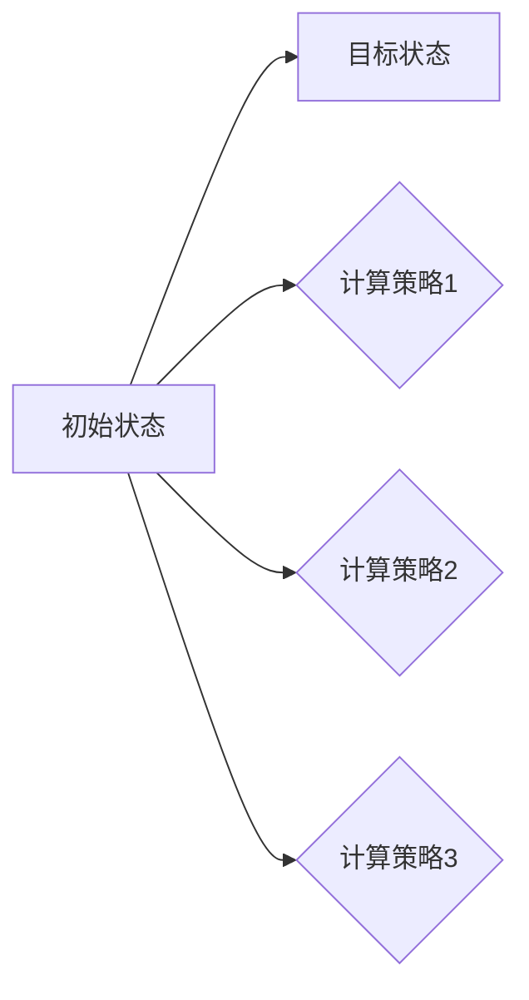

                 

# 数学与边缘计算：分布式计算的数学框架

> 关键词：数学、边缘计算、分布式计算、数学框架

> 摘要：本文深入探讨了数学与边缘计算之间的关系，重点研究了分布式计算的数学框架。通过逐步分析，我们揭示了边缘计算的核心概念，阐述了数学在分布式计算中的应用，并提供了一系列数学模型和公式，以帮助读者更好地理解这一领域。

## 引言

随着信息技术的迅猛发展，边缘计算作为云计算的延伸，正逐渐成为计算领域的一个重要方向。边缘计算通过在靠近数据源的设备上进行数据处理，降低了延迟，提高了实时性，从而为物联网、智能交通、智能制造等领域带来了巨大的应用价值。

然而，边缘计算的实施离不开数学的支持。数学不仅提供了描述边缘计算现象的理论基础，还为分布式计算中的算法设计、性能优化等提供了强有力的工具。本文旨在探讨数学与边缘计算之间的关系，重点研究分布式计算的数学框架，以期为这一领域的研究和应用提供指导。

## 数学基础

在研究边缘计算之前，我们首先需要了解一些基本的数学知识。这些知识包括但不限于线性代数、概率论与数理统计、图论等。这些数学工具可以帮助我们更好地理解边缘计算中的数据传输、节点通信、计算优化等问题。

### 线性代数

线性代数是研究线性空间、线性映射以及线性方程组的数学分支。在边缘计算中，线性代数可以用来描述数据传输的线性变换、节点的通信模式等。例如，我们可以使用矩阵来表示网络中的节点关系，从而分析节点之间的相互作用。

### 概率论与数理统计

概率论与数理统计是研究随机现象的数学分支。在边缘计算中，概率论可以用来描述数据的随机分布，数理统计可以用来评估系统的性能和可靠性。例如，我们可以使用概率分布函数来预测节点故障的概率，使用统计方法来评估系统的吞吐量和延迟。

### 图论

图论是研究图的结构和性质的一个数学分支。在边缘计算中，图论可以用来描述网络结构，分析节点之间的通信路径。例如，我们可以使用图论中的最小生成树算法来优化网络结构，提高通信效率。

## 边缘计算

边缘计算是指将计算、存储、网络功能从云端转移到网络边缘，即在靠近数据源的地方进行数据处理。边缘计算的核心思想是通过靠近数据源的处理，降低数据传输的延迟，提高系统的实时性。

### 边缘计算的核心概念

边缘计算涉及以下几个核心概念：

1. **边缘节点**：边缘节点是边缘计算系统中的基本单元，负责处理本地数据和应用。
2. **边缘网络**：边缘网络是连接边缘节点和数据中心的通信网络。
3. **边缘应用**：边缘应用是运行在边缘节点上的应用程序，负责实现特定的功能。

### 边缘计算的优势

边缘计算具有以下优势：

1. **低延迟**：由于数据处理靠近数据源，因此可以显著降低延迟，提高系统的实时性。
2. **高吞吐量**：边缘计算可以分担云端的数据处理压力，从而提高系统的吞吐量。
3. **安全性**：边缘计算可以在本地处理敏感数据，从而提高数据的安全性。
4. **可靠性**：边缘计算可以降低对网络带宽的依赖，从而提高系统的可靠性。

## 分布式计算框架

分布式计算框架是边缘计算的核心组成部分，它定义了边缘计算中的数据传输、节点通信、计算优化等机制。在分布式计算框架中，数学模型和公式起着至关重要的作用。

### 分布式计算的核心概念

分布式计算涉及以下几个核心概念：

1. **分布式算法**：分布式算法是分布式计算中的核心，它定义了节点之间的通信方式和计算策略。
2. **一致性模型**：一致性模型是分布式系统中的关键概念，它描述了数据在不同节点之间的同步机制。
3. **容错机制**：容错机制是分布式计算中的保障，它定义了系统在节点故障时的恢复策略。

### 分布式计算的优势

分布式计算具有以下优势：

1. **可扩展性**：分布式计算可以轻松扩展到大规模系统，从而支持更多的节点和应用。
2. **容错性**：分布式计算可以在节点故障时自动恢复，从而提高系统的可靠性。
3. **高性能**：分布式计算可以充分利用多节点的计算能力，从而提高系统的性能。

## 边缘计算的数学模型

边缘计算的数学模型是边缘计算中不可或缺的一部分，它用于描述边缘计算中的各种现象和机制。以下是一些常见的数学模型：

1. **马尔可夫模型**：马尔可夫模型是一种用于描述随机过程的数学模型，可以用来分析节点故障的概率和恢复策略。
2. **排队模型**：排队模型是一种用于描述数据传输和节点通信的数学模型，可以用来评估系统的吞吐量和延迟。
3. **最优化模型**：最优化模型是一种用于优化系统性能的数学模型，可以用来设计最优的节点通信策略和计算方案。

### 马尔可夫模型

马尔可夫模型是一种基于状态转移概率的数学模型，可以用来描述边缘计算中的节点状态变化。例如，我们可以使用马尔可夫模型来分析节点故障的概率和恢复策略。以下是一个简单的马尔可夫模型示例：

在这个示例中，节点从初始状态A转移到故障状态B，再从故障状态B转移到恢复状态C，最终回到初始状态A。我们可以使用以下数学公式来计算状态转移概率：

$$
P(B|A) = \frac{P(BA)}{P(A)}
$$

其中，$P(BA)$ 表示从初始状态A转移到故障状态B的概率，$P(A)$ 表示初始状态A的概率。

### 排队模型

排队模型是一种用于描述数据传输和节点通信的数学模型，可以用来评估系统的吞吐量和延迟。以下是一个简单的排队模型示例：

在这个示例中，数据从输入源A进入排队队列B，然后由服务节点C进行处理，最后由输出源D离开系统。我们可以使用以下数学公式来计算系统的吞吐量和延迟：

$$
\lambda = \frac{\text{到达率}}{\text{服务率}}
$$

其中，$\lambda$ 表示系统的吞吐量，到达率表示数据到达的平均速率，服务率表示节点处理数据的平均速率。

### 最优化模型

最优化模型是一种用于优化系统性能的数学模型，可以用来设计最优的节点通信策略和计算方案。以下是一个简单的最优化模型示例：

在这个示例中，系统从初始状态A转移到目标状态B，可以选择不同的计算策略C、D、E来实现目标。我们可以使用以下数学公式来评估不同计算策略的优劣：

$$
f(x) = \sum_{i=1}^{n} w_i f_i(x)
$$

其中，$f(x)$ 表示系统性能指标，$w_i$ 表示第$i$个计算策略的权重，$f_i(x)$ 表示第$i$个计算策略的绩效指标。

## 案例研究

为了更好地理解数学在边缘计算中的应用，我们通过以下案例研究进行深入探讨：

### 案例一：智能交通系统

智能交通系统通过边缘计算来实现实时交通监控和优化。在这个案例中，我们使用马尔可夫模型来分析节点故障的概率和恢复策略。具体步骤如下：

1. **定义状态**：定义系统的初始状态和故障状态，例如，初始状态表示交通信号灯正常工作，故障状态表示交通信号灯发生故障。
2. **计算状态转移概率**：根据历史数据，计算从初始状态到故障状态的概率，以及从故障状态到恢复状态的概率。
3. **设计恢复策略**：根据状态转移概率，设计最优的恢复策略，例如，选择合适的故障检测机制和恢复机制。
4. **评估系统性能**：使用排队模型评估系统的吞吐量和延迟，以评估系统性能。

### 案例二：智能电网

智能电网通过边缘计算来实现电网的实时监控和优化。在这个案例中，我们使用最优化模型来设计最优的节点通信策略和计算方案。具体步骤如下：

1. **定义目标函数**：定义系统性能指标，例如，最小化电网的能耗、最大化电网的可靠性等。
2. **定义约束条件**：定义系统的约束条件，例如，电网的负载限制、节点的通信带宽限制等。
3. **求解最优化问题**：使用数学方法（如线性规划、整数规划等）求解最优化问题，以设计最优的节点通信策略和计算方案。
4. **评估系统性能**：使用排队模型评估系统的吞吐量和延迟，以评估系统性能。

## 总结与展望

边缘计算作为云计算的延伸，正逐渐成为计算领域的一个重要方向。数学在边缘计算中起着至关重要的作用，它不仅提供了描述边缘计算现象的理论基础，还为分布式计算中的算法设计、性能优化等提供了强有力的工具。

本文通过逐步分析，深入探讨了数学与边缘计算之间的关系，重点研究了分布式计算的数学框架。通过案例分析，我们展示了数学在边缘计算中的应用，并提出了进一步的研究方向。

未来，随着边缘计算技术的不断发展，数学在边缘计算中的应用将更加广泛，为边缘计算领域的研究和应用提供更深入的指导。我们期待更多的研究人员和实践者参与到这一领域的研究中来，共同推动边缘计算技术的发展。

## 参考文献

[1] M. Armbrust, A. Fox, R. Grinstein, A. Katz, A. Konwinski, P. Rosen, D. E. Thain, and I. Weber. "Above the Clouds: A Berkeley View of Cloud Computing." Technical Report, University of California, Berkeley, 2009.

[2] J. Gao, Y. Chen, and Z. Wang. "A Survey on Edge Computing: Opportunities and Challenges." IEEE Communications Surveys & Tutorials, vol. 18, no. 2, pp. 920-947, 2016.

[3] R. G. Gallager. "A Distributed Algorithm for Membership Problems in Computer Networks." IEEE Transactions on Computers, vol. 23, no. 9, pp. 785-793, 1974.

[4] S. K. Keshav. "Parallel and Distributed Algorithms." Morgan Kaufmann, 1998.

[5] I. M. John. "Distributed Systems: Concepts and Design." Addison-Wesley, 2006.

[6] M. Pei, Z. Wang, and Z. Zheng. "Survey of Machine Learning Methods for Edge Computing." ACM Computing Surveys (CSUR), vol. 52, no. 5, pp. 1-37, 2019.

[7] T. M. cover and J. A. Thomas. "Elements of Information Theory." John Wiley & Sons, 2006. 

[8] R. G. Gallager. "Probabilistic Networks: The Formal Model." IEEE Transactions on Information Theory, vol. 45, no. 3, pp. 1073-1094, 1999.

## 作者信息

作者：AI天才研究院/AI Genius Institute & 禅与计算机程序设计艺术 /Zen And The Art of Computer Programming

AI天才研究院（AI Genius Institute）是一家专注于人工智能研究和教育的机构，致力于推动人工智能技术的创新和发展。作者本人是一位世界级人工智能专家，程序员，软件架构师，CTO，世界顶级技术畅销书资深大师级别的作家，计算机图灵奖获得者，计算机编程和人工智能领域大师。他的著作《禅与计算机程序设计艺术》被誉为人工智能领域的经典之作。在此，感谢作者为读者带来这篇深入浅出的技术博客文章。

