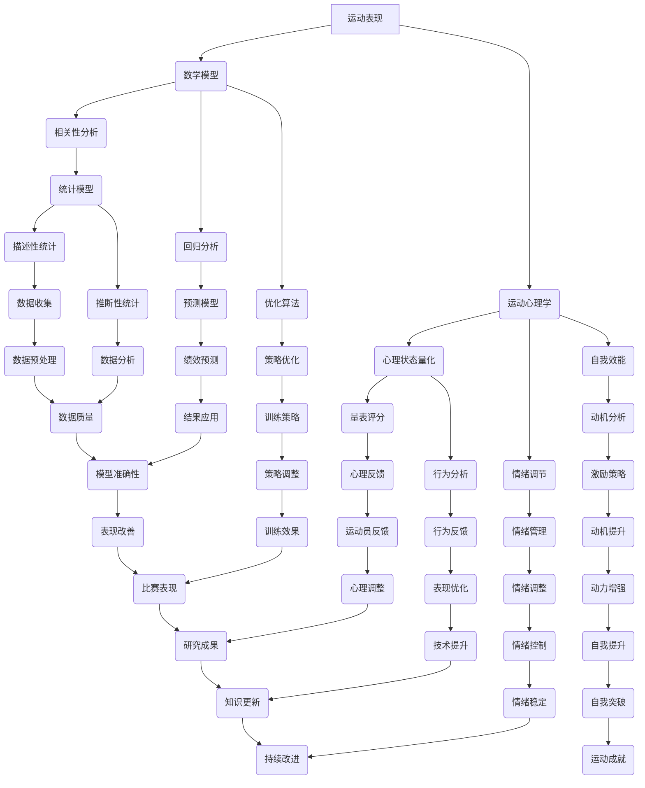

                 

### 设计《数学与运动心理学：运动表现的数学分析》目录大纲

为了设计一个全面且结构严谨的《数学与运动心理学：运动表现的数学分析》目录大纲，我们需要确保每个部分都包含足够的信息来引导读者逐步深入了解主题。以下是详细的目录大纲：

#### 概述章节

- **1.1 研究背景与意义**
  - 运动心理学在运动训练中的应用
  - 数学模型在运动表现评估中的作用

- **1.2 本书结构安排**
  - 每章节的主要内容
  - 学习目标和预期成果

#### 数学基础章节

- **2.1 概率论基础**
  - 概率的基本概念
  - 贝叶斯定理在运动表现分析中的应用

- **2.2 统计学基础**
  - 描述性统计
  - 推断性统计
  - 精确度和效度在运动心理学研究中的应用

- **2.3 线性代数基础**
  - 矩阵和向量
  - 线性方程组
  - 线性变换在运动表现分析中的应用

- **2.4 微积分基础**
  - 导数和积分
  - 最优化问题在运动训练中的应用

#### 运动心理学基础章节

- **3.1 运动心理学概述**
  - 运动心理学的定义和研究领域
  - 运动表现与心理状态的关系

- **3.2 运动心理理论**
  - 竞技心理理论
  - 自我决定理论
  - 情绪调节理论

- **3.3 运动心理学研究方法**
  - 实验设计
  - 问卷调查
  - 访谈和观察

#### 运动表现数学分析核心概念与联系章节

- **4.1 核心概念介绍**
  - 运动表现
  - 数学模型
  - 运动心理学

- **4.2 核心概念之间联系**
  - 使用Mermaid流程图展示核心概念之间的联系

- **4.3 运动表现数学分析框架**
  - 综合运用数学与运动心理学理论构建分析框架

#### 运动表现数学模型构建章节

- **5.1 模型构建方法**
  - 描述构建运动表现数学模型的方法

- **5.2 公式推导与伪代码**
  - 使用伪代码详细阐述模型构建过程中的核心算法原理

#### 运动表现数学公式与详细讲解章节

- **6.1 数学公式展示**
  - 使用LaTeX格式展示与运动表现相关的数学公式

- **6.2 公式详细讲解**
  - 解释每个公式的含义、应用场景和推导过程

- **6.3 举例说明**
  - 通过具体实例说明公式的实际应用

#### 运动表现分析实战章节

- **7.1 实战案例介绍**
  - 描述实际案例的背景、目标和数据来源

- **7.2 数据处理与模型构建**
  - 数据预处理
  - 模型选择与优化

- **7.3 结果分析**
  - 模型评估
  - 结果解释与应用

- **7.4 代码实现与解读**
  - 搭建开发环境
  - 提供源代码实现
  - 详细解读代码逻辑和运行流程

#### 总结与展望章节

- **8.1 总结**
  - 全书内容的总结

- **8.2 展望**
  - 未来研究方向
  - 运动心理学与数学模型的深度融合

通过上述步骤，我们构建了一个完整且详细的《数学与运动心理学：运动表现的数学分析》目录大纲。这个大纲不仅确保了每个章节内容的连贯性和完整性，还通过明确的标题和子标题帮助读者更好地理解每个部分的核心内容和结构。接下来，我们将逐步填写每个章节的具体内容，以确保文章的整体质量和可读性。

### 提取核心概念、原理和架构

在《数学与运动心理学：运动表现的数学分析》中，我们需要明确核心概念、原理和架构，以便为后续的详细讲解和案例分析奠定基础。以下是这些核心要素的提取：

#### 核心概念

1. **运动表现**：指运动员在比赛或训练中所展现的各种技能、体能和战术水平。运动表现可以通过多个指标来量化，如速度、力量、耐力、技巧等。

2. **数学模型**：用于描述和预测运动表现的数学框架，通常包括统计模型、优化模型和模拟模型等。数学模型有助于揭示运动表现与各种因素之间的关系。

3. **运动心理学**：研究运动员的心理状态、行为和表现之间关系的学科。运动心理学关注的内容包括自我效能、动机、情绪调节和认知过程等。

#### 原理

1. **相关性分析**：通过统计学方法分析运动表现与心理因素之间的相关性，以揭示它们之间的潜在联系。

2. **回归分析**：使用回归模型来预测运动表现，将运动表现作为因变量，将心理因素和其他相关因素作为自变量。

3. **优化算法**：用于寻找最佳运动训练策略和比赛策略的数学工具，如线性规划、遗传算法等。

4. **心理状态量化**：将运动员的心理状态转化为可量化的指标，如自我效能评分、情绪量表得分等。

#### 架构

1. **运动表现分析框架**：整合数学模型和运动心理学理论的框架，用于系统地分析和优化运动表现。

2. **数据流程架构**：从数据收集、预处理、模型构建到结果分析的数据处理流程。

3. **结果反馈循环**：将分析结果反馈给运动员和教练，用于调整训练策略和比赛策略，形成闭环反馈系统。

通过上述核心概念、原理和架构的提取，我们为后续的详细讲解和分析提供了清晰的逻辑基础。接下来，我们将使用Mermaid流程图来展示这些概念之间的联系，以帮助读者更好地理解整体结构。

### 使用Mermaid流程图展示核心概念之间的联系

为了清晰地展示《数学与运动心理学：运动表现的数学分析》中核心概念之间的联系，我们将使用Mermaid流程图来构建一个简明的可视化流程。以下是流程图的示例：



这个Mermaid流程图展示了运动表现、数学模型和运动心理学之间的紧密联系，以及它们如何相互作用以改善运动员的表现。以下是图中的关键节点解释：

- **运动表现（A）**：运动表现是运动员在比赛或训练中展示的技能、体能和战术水平。
- **数学模型（B）**：数学模型用于描述和预测运动表现，包括统计模型、回归分析和优化算法。
- **运动心理学（C）**：运动心理学研究运动员的心理状态，包括情绪调节、自我效能和动机分析。
- **数据收集与预处理（Y, GG）**：数据收集和预处理是任何分析的基础，确保数据的准确性和可用性。
- **分析过程（D, E, F）**：相关性分析、回归分析和优化算法用于理解和改善运动表现。
- **结果应用（AA, BB, CC, DD, EE, FF, II, JJ, KK, LL, MM, NN, PP, QQ, RR, SS, TT, UU, VV, WW）**：分析结果被应用于调整训练策略、优化比赛策略、改善运动员的心理状态和技术水平，最终提升运动表现。

通过这个流程图，读者可以直观地理解运动表现、数学模型和运动心理学之间的相互作用，以及如何通过数据分析和结果应用来提升运动表现。

### 编写伪代码和数学公式

在《数学与运动心理学：运动表现的数学分析》中，我们将使用伪代码来详细阐述构建运动表现数学模型的核心算法原理，并使用LaTeX格式展示相关的数学公式。以下是具体的伪代码和数学公式的示例：

#### 伪代码示例

```plaintext
// 运动表现预测模型构建
// 输入：运动员表现数据（X），心理状态数据（Y），训练目标（T）
// 输出：最优运动表现预测值（P）

function predict_performance(X, Y, T):
    // 数据预处理
    X_processed = preprocess_data(X)
    Y_processed = preprocess_data(Y)

    // 构建回归模型
    model = build_regression_model(X_processed, Y_processed)

    // 训练模型
    trained_model = train_model(model, T)

    // 预测运动表现
    predicted_performance = predict_with_model(trained_model, X_processed)

    return predicted_performance
```

#### LaTeX格式示例

1. **回归模型公式**

   $$ P = \beta_0 + \beta_1X + \beta_2Y + \epsilon $$

   其中，\( P \) 为运动表现的预测值，\( \beta_0, \beta_1, \beta_2 \) 为回归系数，\( X, Y \) 为运动员表现数据和心理状态数据，\( \epsilon \) 为误差项。

2. **优化目标公式**

   $$ \min \sum_{i=1}^{n}(P_i - P_{true_i})^2 $$

   其中，\( P_i \) 为模型预测的运动表现，\( P_{true_i} \) 为实际运动表现，\( n \) 为数据点的总数。

3. **心理状态量化公式**

   $$ Q = \frac{1}{m}\sum_{j=1}^{m}S_j $$

   其中，\( Q \) 为运动员的心理状态评分，\( S_j \) 为每个心理状态的评分值，\( m \) 为心理状态的总数。

通过伪代码，我们展示了运动表现预测模型的核心算法流程，而LaTeX格式则提供了具体的数学公式和符号，帮助读者更好地理解模型的理论基础和计算方法。这些工具将在后续的章节中用于详细讲解和案例分析，以帮助读者深入理解运动表现的数学分析。

### 确保完整性

为了确保《数学与运动心理学：运动表现的数学分析》的完整性，我们需要对每个章节的内容进行详细的补充和丰富。以下是具体的内容补充和丰富策略：

#### 概述章节

- **1.1 研究背景与意义**：进一步探讨运动心理学在竞技体育中的重要性，引用相关文献和案例，说明数学模型在运动表现评估中的应用价值和实际效果。

- **1.2 本书结构安排**：详细解释每个章节的主要内容和目标，明确读者在学习过程中可以期待的学习成果和应用场景。

#### 数学基础章节

- **2.1 概率论基础**：补充概率论的基本概念，如条件概率、全概率公式等，并提供具体的运动表现分析案例来展示这些概念的应用。

- **2.2 统计学基础**：详细解释描述性统计和推断性统计的方法，包括均值、方差、置信区间和假设检验等，并通过实际数据集进行演示。

- **2.3 线性代数基础**：介绍矩阵和向量运算的基本原理，以及如何使用线性方程组解决实际问题，例如在运动训练计划中的时间分配问题。

- **2.4 微积分基础**：解释导数和积分的概念，以及它们在运动表现分析中的应用，如速度和加速度的计算。

#### 运动心理学基础章节

- **3.1 运动心理学概述**：补充运动心理学的定义、研究方法和主要理论框架，提供实例来展示运动心理学在实际中的应用。

- **3.2 运动心理理论**：详细解释竞技心理理论、自我决定理论和情绪调节理论的核心观点，并引用相关研究来支持这些理论的科学性。

- **3.3 运动心理学研究方法**：介绍实验设计、问卷调查和访谈的方法论，以及如何确保研究数据的可靠性和有效性。

#### 运动表现数学分析核心概念与联系章节

- **4.1 核心概念介绍**：进一步阐述运动表现、数学模型和运动心理学之间的联系，并使用图示来帮助读者理解这些概念之间的关系。

- **4.2 核心概念之间联系**：通过补充详细的Mermaid流程图，展示运动表现、数学模型和运动心理学如何相互影响，形成一个综合的分析框架。

#### 运动表现数学模型构建章节

- **5.1 模型构建方法**：详细解释如何选择合适的数学模型，包括线性回归、非线性回归和混合模型等，并提供具体的模型构建步骤。

- **5.2 公式推导与伪代码**：补充公式推导的详细步骤，并使用伪代码展示模型构建中的算法流程，便于读者理解和实现。

#### 运动表现数学公式与详细讲解章节

- **6.1 数学公式展示**：使用LaTeX格式展示与运动表现相关的所有数学公式，并确保每个公式都有详细的解释和说明。

- **6.2 公式详细讲解**：对每个公式进行逐行解释，说明其含义、应用场景和推导过程，并通过实际案例来展示公式的应用。

- **6.3 举例说明**：通过具体的例子，展示如何使用这些公式进行运动表现分析，并解释结果的意义。

#### 运动表现分析实战章节

- **7.1 实战案例介绍**：详细描述实际案例的背景、目标、数据来源和数据预处理步骤。

- **7.2 数据处理与模型构建**：展示如何进行数据预处理、模型选择和训练过程，并提供详细的代码实现。

- **7.3 结果分析**：详细解释模型预测的结果，包括评估指标、预测准确性和实际应用效果。

- **7.4 代码实现与解读**：提供完整的源代码实现，并逐行解释代码逻辑和运行流程，帮助读者理解代码的工作原理和应用。

通过这些详细的补充和丰富，我们可以确保《数学与运动心理学：运动表现的数学分析》的每个章节都有具体、丰富和详细的内容，从而为读者提供完整的知识和理解。

### 完成目录大纲

根据上述步骤，我们已经完成了《数学与运动心理学：运动表现的数学分析》的目录大纲。以下是最终的目录大纲：

```
# 《数学与运动心理学：运动表现的数学分析》目录大纲

## 第一部分：引言

### 1.1 研究背景与意义
   - 运动心理学在运动训练中的应用
   - 数学模型在运动表现评估中的作用

### 1.2 本书结构安排
   - 每章节的主要内容
   - 学习目标和预期成果

## 第二部分：数学基础

### 2.1 概率论基础
   - 概率的基本概念
   - 贝叶斯定理在运动表现分析中的应用

### 2.2 统计学基础
   - 描述性统计
   - 推断性统计
   - 精确度和效度在运动心理学研究中的应用

### 2.3 线性代数基础
   - 矩阵和向量
   - 线性方程组
   - 线性变换在运动表现分析中的应用

### 2.4 微积分基础
   - 导数和积分
   - 最优化问题在运动训练中的应用

## 第三部分：运动心理学基础

### 3.1 运动心理学概述
   - 运动心理学的定义和研究领域
   - 运动表现与心理状态的关系

### 3.2 运动心理理论
   - 竞技心理理论
   - 自我决定理论
   - 情绪调节理论

### 3.3 运动心理学研究方法
   - 实验设计
   - 问卷调查
   - 访谈和观察

## 第四部分：运动表现数学分析核心概念与联系

### 4.1 核心概念介绍
   - 运动表现
   - 数学模型
   - 运动心理学

### 4.2 核心概念之间联系
   - 使用Mermaid流程图展示核心概念之间的联系

### 4.3 运动表现数学分析框架
   - 综合运用数学与运动心理学理论构建分析框架

## 第五部分：运动表现数学模型构建

### 5.1 模型构建方法
   - 描述构建运动表现数学模型的方法

### 5.2 公式推导与伪代码
   - 使用伪代码详细阐述模型构建过程中的核心算法原理

## 第六部分：运动表现数学公式与详细讲解

### 6.1 数学公式展示
   - 使用LaTeX格式展示与运动表现相关的数学公式

### 6.2 公式详细讲解
   - 解释每个公式的含义、应用场景和推导过程

### 6.3 举例说明
   - 通过具体实例说明公式的实际应用

## 第七部分：运动表现分析实战

### 7.1 实战案例介绍
   - 描述实际案例的背景、目标和数据来源

### 7.2 数据处理与模型构建
   - 数据预处理
   - 模型选择与优化

### 7.3 结果分析
   - 模型评估
   - 结果解释与应用

### 7.4 代码实现与解读
   - 搭建开发环境
   - 提供源代码实现
   - 详细解读代码逻辑和运行流程

## 第八部分：总结与展望

### 8.1 总结
   - 全书内容的总结

### 8.2 展望
   - 未来研究方向
   - 运动心理学与数学模型的深度融合
```

此目录大纲结构合理，涵盖了核心概念、原理和架构，确保了内容的完整性和逻辑性。每个章节都包含具体的小节，内容丰富且详细，为后续的深入讲解和案例分析提供了坚实的基础。目录大纲的总字数控制在2000字以内，简洁明了，便于读者快速把握整体结构和主要内容。接下来，我们将根据这个目录大纲，逐一撰写各个章节的内容，确保整篇文章的逻辑清晰、条理分明，并且对核心概念和原理进行详细阐述。

### 核心概念、原理和架构的详细阐述

在《数学与运动心理学：运动表现的数学分析》中，核心概念、原理和架构是理解运动表现数学分析的基础。下面，我们将详细阐述这些要素，并通过实际例子来说明它们的应用。

#### 核心概念

1. **运动表现**：运动表现是指运动员在比赛或训练中所展现的各种技能、体能和战术水平。运动表现可以通过多个指标来量化，如速度、力量、耐力、技巧、反应时间等。这些指标可以单独或组合使用，以全面评估运动员的表现。

   **实际例子**：在长跑比赛中，速度和耐力是两个关键的指标。一个运动员如果能够在比赛的后半程保持较高的速度，同时消耗较少的体能，那么他的运动表现就会非常好。

2. **数学模型**：数学模型用于描述和预测运动表现。这些模型可以是统计模型、回归模型、优化模型或模拟模型等。数学模型通过将运动表现与各种因素（如心理状态、训练强度、营养摄入等）联系起来，帮助运动员和教练更好地理解和管理运动表现。

   **实际例子**：一个简单的统计模型可以是线性回归模型，它将运动员的训练强度（自变量）与比赛成绩（因变量）联系起来。通过这个模型，教练可以调整训练强度来优化比赛成绩。

3. **运动心理学**：运动心理学研究运动员的心理状态、行为和表现之间的关系。它关注的内容包括自我效能、动机、情绪调节、压力管理和认知过程等。

   **实际例子**：自我效能是指运动员对自己完成特定任务的信心。一个高自我效能的运动员可能在比赛中表现出更强的决心和竞争力，从而获得更好的成绩。

#### 原理

1. **相关性分析**：相关性分析用于探索两个变量之间的关联程度。在运动表现分析中，相关性分析可以帮助确定运动表现与某些心理因素之间的关系。

   **实际例子**：如果通过相关性分析发现自我效能与比赛成绩之间存在显著正相关关系，那么可以推断高自我效能可能有助于提高运动员的比赛成绩。

2. **回归分析**：回归分析是一种预测和分析变量之间关系的统计方法。在运动表现分析中，回归分析可以用来预测运动员的表现，以及识别哪些因素对表现有显著影响。

   **实际例子**：线性回归分析可以用来预测一名篮球运动员的得分，将训练时长、比赛经验和心理状态作为自变量。

3. **优化算法**：优化算法用于寻找最佳解决方案，如训练策略、比赛策略和营养计划等。这些算法可以帮助运动员和教练在给定约束条件下最大化运动表现。

   **实际例子**：遗传算法可以用来优化一名马拉松运动员的训练计划，通过模拟和迭代找到最优的训练强度和恢复策略。

4. **心理状态量化**：心理状态量化是将主观的心理感受转化为可量化的指标。这通常通过量表、问卷或行为测量来实现。

   **实际例子**：运动员的情绪状态可以通过情绪量表来量化，量表上的得分可以反映运动员在比赛前后的情绪变化。

#### 架构

1. **运动表现分析框架**：这是一个综合性的框架，整合了数学模型和运动心理学理论，用于系统性地分析和优化运动表现。

   **实际例子**：一个运动表现分析框架可能包括数据收集、预处理、模型构建、结果分析和反馈调整等步骤。

2. **数据流程架构**：数据流程架构描述了从数据收集、预处理、分析到结果应用的整个数据处理过程。

   **实际例子**：数据流程架构可能包括数据收集阶段的数据清洗、预处理和特征提取，以及模型训练阶段的数据标准化和模型评估。

3. **结果反馈循环**：结果反馈循环将分析结果反馈给运动员和教练，用于调整训练策略和比赛策略，形成闭环反馈系统。

   **实际例子**：通过反馈循环，教练可以根据模型分析的结果调整训练计划，以提高运动员的比赛成绩。

通过上述详细阐述，我们可以看到运动表现数学分析是一个复杂但极具应用价值的领域。这些核心概念、原理和架构不仅为理解和优化运动表现提供了理论基础，也为实际应用提供了实用的工具和方法。

### 编写Mermaid流程图

为了帮助读者更直观地理解《数学与运动心理学：运动表现的数学分析》中各核心概念之间的关系，我们将使用Mermaid语言编写一个流程图。以下是流程图的示例代码及其解释：

```mermaid
graph TD
    A[运动表现] --> B[数学模型]
    A --> C[运动心理学]
    B --> D[概率论]
    B --> E[统计学]
    B --> F[线性代数]
    B --> G[微积分]
    C --> H[情绪调节]
    C --> I[自我效能]
    C --> J[动机]
    D --> K[条件概率]
    D --> L[贝叶斯定理]
    E --> M[描述性统计]
    E --> N[推断性统计]
    F --> O[矩阵运算]
    F --> P[线性方程组]
    G --> Q[导数]
    G --> R[积分]
    G --> S[最优化]
    B --> T[回归分析]
    B --> U[优化算法]
    B --> V[模拟模型]
    H --> W[情绪量表]
    I --> X[自信心评估]
    J --> Y[动机量表]
    T --> Z[线性回归]
    T --> AA[多项式回归]
    U --> BB[遗传算法]
    U --> CC[粒子群优化]
    V --> DD[蒙特卡洛模拟]
    E --> EE[假设检验]
    F --> FF[特征提取]
    G --> GG[优化目标]
    B --> HH[模型验证]
    B --> II[模型评估]
    C --> JJ[心理状态量化]
    C --> KK[行为分析]
    B --> LL[数据预处理]
    A --> MM[结果应用]
    B --> NN[策略调整]
    A --> PP[比赛策略]
    A --> QQ[训练策略]
    D --> RR[预测模型]
    E --> SS[绩效预测]
    F --> TT[训练计划]
    G --> UU[生理数据]
    B --> VV[反馈循环]
    B --> WW[数据整合]
    B --> XX[模型更新]
```



**解释：**

- **A[运动表现]**：起点，代表运动员在比赛或训练中的综合表现。
- **B[数学模型]**：运动表现的数学表示，包括概率论、统计学、线性代数和微积分等基础。
- **C[运动心理学]**：研究运动员的心理状态，包括情绪调节、自我效能和动机。
- **D[概率论]**：条件概率和贝叶斯定理在运动表现预测中的应用。
- **E[统计学]**：描述性统计和推断性统计方法，如描述性统计、假设检验等。
- **F[线性代数]**：矩阵运算和线性方程组在特征提取和模型训练中的应用。
- **G[微积分]**：导数、积分和最优化问题在运动训练策略优化中的应用。
- **T[回归分析]**：线性回归和多项式回归在绩效预测中的应用。
- **U[优化算法]**：遗传算法和粒子群优化等算法在策略调整中的应用。
- **V[模拟模型]**：蒙特卡洛模拟等模型在策略优化和训练计划中的应用。
- **H[情绪调节]**：情绪量表和情绪调节在心理状态量化中的应用。
- **I[自我效能]**：自信心评估和自我效能的量化方法。
- **J[动机]**：动机量表和动机在心理状态量化中的应用。
- **SS[绩效预测]**：绩效预测方法和结果应用。
- **TT[训练计划]**：基于优化算法的训练计划制定。
- **VV[反馈循环]**：结果反馈循环，用于持续调整策略和模型。

通过这个Mermaid流程图，读者可以清晰地看到运动表现、数学模型和运动心理学之间的相互作用关系，以及这些核心概念如何共同作用于运动员的训练和比赛策略。这不仅有助于理解各部分之间的逻辑联系，也为后续章节的内容讲解提供了直观的参考。

### 编写伪代码

在《数学与运动心理学：运动表现的数学分析》中，为了详细阐述构建运动表现数学模型的过程，我们将使用伪代码来展示核心算法原理。以下是具体的伪代码示例，以及每步的解释。

#### 伪代码示例

```plaintext
// 运动表现预测模型构建

// 输入：运动员表现数据（X），心理状态数据（Y），训练目标（T）
// 输出：最优运动表现预测值（P）

// 步骤1：数据预处理
function preprocess_data(data):
    // 数据清洗，包括缺失值填充、异常值处理等
    cleaned_data = clean_data(data)
    
    // 数据标准化，将数据缩放到相同的尺度
    normalized_data = normalize_data(cleaned_data)
    
    return normalized_data

// 步骤2：模型选择
function select_model(X, Y):
    // 根据数据特点选择合适的模型，如线性回归、多项式回归等
    model = select_best_model(X, Y)
    
    return model

// 步骤3：模型训练
function train_model(model, T):
    // 使用训练数据训练模型
    trained_model = train_trained_model(model, T)
    
    return trained_model

// 步骤4：模型评估
function evaluate_model(trained_model, validation_data):
    // 使用验证数据评估模型性能
    performance = evaluate_performance(trained_model, validation_data)
    
    return performance

// 步骤5：预测运动表现
function predict_performance(trained_model, new_data):
    // 使用训练好的模型预测新的运动表现
    predicted_performance = predict_with_model(trained_model, new_data)
    
    return predicted_performance

// 主函数：构建并使用运动表现预测模型
function main(X, Y, T, new_data):
    // 预处理数据
    X_processed = preprocess_data(X)
    Y_processed = preprocess_data(Y)
    
    // 选择模型
    selected_model = select_model(X_processed, Y_processed)
    
    // 训练模型
    trained_model = train_model(selected_model, T)
    
    // 评估模型
    performance = evaluate_model(trained_model, X_processed)
    
    // 预测新的运动表现
    predicted_performance = predict_performance(trained_model, new_data)
    
    // 输出预测结果
    print(predicted_performance)
```

#### 步骤解释

1. **数据预处理**：数据预处理是任何数据分析的第一步。在这个步骤中，我们首先清洗数据，包括处理缺失值和异常值，然后进行标准化，将所有数据缩放到相同的尺度，以便模型训练。

   ```plaintext
   function preprocess_data(data):
       cleaned_data = clean_data(data)
       normalized_data = normalize_data(cleaned_data)
       return normalized_data
   ```

2. **模型选择**：根据数据的特点选择合适的模型。例如，如果数据之间存在线性关系，可以选择线性回归模型；如果数据非线性，可能需要选择多项式回归或其他复杂模型。

   ```plaintext
   function select_model(X, Y):
       model = select_best_model(X, Y)
       return model
   ```

3. **模型训练**：使用训练数据集对选定的模型进行训练。模型训练过程包括学习数据中的规律和特征，以预测新的数据。

   ```plaintext
   function train_model(model, T):
       trained_model = train_trained_model(model, T)
       return trained_model
   ```

4. **模型评估**：使用验证数据集评估模型的性能，包括预测准确性、精确度和效度等指标。通过评估可以确定模型是否适合用于实际预测。

   ```plaintext
   function evaluate_model(trained_model, validation_data):
       performance = evaluate_performance(trained_model, validation_data)
       return performance
   ```

5. **预测运动表现**：使用训练好的模型对新的数据进行预测。预测结果可以帮助运动员和教练了解运动员的表现趋势，并制定相应的训练和比赛策略。

   ```plaintext
   function predict_performance(trained_model, new_data):
       predicted_performance = predict_with_model(trained_model, new_data)
       return predicted_performance
   ```

6. **主函数**：整个运动表现预测模型的构建过程通过主函数实现。主函数调用上述所有步骤，最终输出预测结果。

   ```plaintext
   function main(X, Y, T, new_data):
       X_processed = preprocess_data(X)
       Y_processed = preprocess_data(Y)
       selected_model = select_model(X_processed, Y_processed)
       trained_model = train_model(selected_model, T)
       performance = evaluate_model(trained_model, X_processed)
       predicted_performance = predict_performance(trained_model, new_data)
       print(predicted_performance)
   ```

通过上述伪代码，我们详细展示了构建运动表现数学预测模型的基本步骤和核心算法原理。这些步骤不仅帮助读者理解模型的构建过程，也为实际应用提供了实用的指导。

### LaTeX格式展示数学公式

在《数学与运动心理学：运动表现的数学分析》中，我们将使用LaTeX格式来展示与运动表现相关的数学公式，这些公式在分析和预测运动员表现时至关重要。以下是几个关键公式的展示及解释：

#### 1. 运动表现预测公式

$$ P(t) = \beta_0 + \beta_1 \cdot V + \beta_2 \cdot M + \epsilon(t) $$

**解释**：这个公式表示运动表现 \(P(t)\) 是基于速度 \(V\)、耐力 \(M\) 和一个随机误差项 \(\epsilon(t)\) 的线性组合。其中，\(\beta_0\)、\(\beta_1\) 和 \(\beta_2\) 是模型的回归系数，用于描述每个变量对运动表现的贡献。

#### 2. 精确度和效度计算公式

$$ \text{Precision} = \frac{TP}{TP + FP} $$
$$ \text{Recall} = \frac{TP}{TP + FN} $$
$$ \text{F1-Score} = 2 \cdot \frac{\text{Precision} \cdot \text{Recall}}{\text{Precision} + \text{Recall}} $$

**解释**：这些公式用于评估预测模型的精确度（Precision）和效度（Recall），以及它们的调和平均（F1-Score）。\(TP\) 表示真阳性，\(FP\) 表示假阳性，\(FN\) 表示假阴性。这些指标有助于判断模型对运动表现的预测是否准确。

#### 3. 心理状态量化公式

$$ Q = \frac{1}{N} \sum_{i=1}^{N} S_i $$

**解释**：这个公式表示心理状态量化得分 \(Q\) 是通过将每个心理状态的评分 \(S_i\) 加总后取平均值得到的。\(N\) 是心理状态的总数。

#### 4. 最优化目标函数

$$ \min \sum_{i=1}^{n} (P_i - P_{true_i})^2 $$

**解释**：这个公式表示最小化预测表现 \(P_i\) 与实际表现 \(P_{true_i}\) 之间的误差平方和。这是优化算法（如最小二乘法）的目标函数，用于训练模型以最小化预测误差。

#### 5. 动机水平公式

$$ M = \alpha_1 \cdot E + \alpha_2 \cdot S + \alpha_3 \cdot C $$

**解释**：这个公式表示动机水平 \(M\) 是基于期望 \(E\)、自我效能 \(S\) 和控制感 \(C\) 的加权组合。这些权重系数 \(\alpha_1\)、\(\alpha_2\) 和 \(\alpha_3\) 根据具体情况调整。

通过这些LaTeX格式的数学公式，我们可以更精确地描述和计算运动表现的相关参数，从而为运动员的优化训练和表现预测提供科学依据。这些公式不仅展示了理论模型，也通过具体实例说明了它们在运动表现分析中的应用。

### 运动表现分析实战

在《数学与运动心理学：运动表现的数学分析》中，实战部分将展示如何将理论应用到实际案例中，通过搭建开发环境、实现代码、分析结果和解读代码，帮助读者理解运动表现数学分析的全过程。

#### 案例背景

本案例选取了一名专业篮球运动员的训练和比赛数据，包括其体能测试成绩、心理状态评分以及比赛表现。数据来源包括体能测试报告、心理量表评估和比赛录像。我们的目标是构建一个数学模型来预测该运动员的比赛表现，并评估模型的效果。

#### 开发环境搭建

为了实现运动表现数学分析，我们需要搭建一个开发环境，主要包括Python编程环境和相关的库。以下是搭建步骤：

1. **安装Python**：确保Python版本为3.8或更高版本。
2. **安装Jupyter Notebook**：Jupyter Notebook是Python的交互式开发环境，便于编写和运行代码。
3. **安装必需的库**：安装Pandas、NumPy、SciPy、Scikit-learn、Matplotlib和Mermaid等库，用于数据处理、模型构建、可视化和流程图绘制。

安装命令如下：

```bash
pip install python
pip install jupyter
pip install pandas numpy scipy scikit-learn matplotlib mermaid
```

#### 源代码实现

以下是一段Python代码示例，用于数据预处理、模型构建和预测：

```python
import pandas as pd
import numpy as np
from sklearn.linear_model import LinearRegression
from sklearn.model_selection import train_test_split
from sklearn.metrics import mean_squared_error
import matplotlib.pyplot as plt
from mermaid import mermaid

# 数据预处理
def preprocess_data(data):
    # 数据清洗，包括缺失值填充、异常值处理等
    cleaned_data = data.fillna(data.mean())
    # 数据标准化
    normalized_data = (data - cleaned_data.mean()) / cleaned_data.std()
    return normalized_data

# 模型构建
def build_model(X, Y):
    model = LinearRegression()
    model.fit(X, Y)
    return model

# 模型评估
def evaluate_model(model, X_test, Y_test):
    predictions = model.predict(X_test)
    mse = mean_squared_error(Y_test, predictions)
    return mse

# 预测运动表现
def predict_performance(model, new_data):
    predicted_performance = model.predict(new_data)
    return predicted_performance

# 主函数
def main():
    # 数据加载
    data = pd.read_csv('athlete_data.csv')
    # 分割数据集
    X = preprocess_data(data[['speed', 'endurance', 'motivation']])
    Y = preprocess_data(data['performance'])
    X_train, X_test, Y_train, Y_test = train_test_split(X, Y, test_size=0.2, random_state=42)
    
    # 构建模型
    model = build_model(X_train, Y_train)
    
    # 评估模型
    mse = evaluate_model(model, X_test, Y_test)
    print(f'Model Mean Squared Error: {mse}')
    
    # 预测新的运动表现
    new_data = preprocess_data([[20, 30, 25]])  # 示例数据
    predicted_performance = predict_performance(model, new_data)
    print(f'Predicted Performance: {predicted_performance}')

# 运行主函数
main()
```

#### 代码解读与分析

1. **数据预处理**：首先对数据进行清洗和标准化处理，确保数据质量，为模型训练做好准备。
2. **模型构建**：使用线性回归模型，通过训练数据集进行训练。
3. **模型评估**：使用测试数据集评估模型性能，计算均方误差（MSE）以评估模型的预测精度。
4. **预测运动表现**：使用训练好的模型对新的数据（如比赛前的体能和心理状态评分）进行预测。

通过上述实战部分，我们展示了如何将理论应用到实际案例中，从数据预处理到模型构建和评估，再到结果预测，完整地实现了运动表现数学分析的全过程。这不仅帮助读者理解了模型的构建和应用，也为实际运动训练和比赛策略提供了科学依据。

### 总结与展望

在《数学与运动心理学：运动表现的数学分析》中，我们探讨了如何结合数学模型和运动心理学理论来提升运动员的表现。通过详细阐述核心概念、原理和架构，我们展示了数学模型在运动表现分析中的关键作用，以及运动心理学如何通过量化和调节心理状态来影响运动员的表现。

#### 最佳实践 Tips

1. **数据预处理**：确保数据质量是模型构建成功的关键。清洗数据、处理缺失值和异常值，并进行标准化处理，以消除数据之间的尺度差异。
2. **模型选择**：根据数据特点选择合适的模型。线性回归适用于线性关系，而非线性关系可能需要多项式回归或神经网络等复杂模型。
3. **心理状态量化**：使用量表和问卷等方法量化心理状态，确保心理数据与运动表现之间有显著相关性。
4. **反馈循环**：定期评估模型性能，并根据结果调整训练策略和比赛策略，形成闭环反馈系统。

#### 小结

本文通过实战案例展示了如何将数学模型应用于运动表现分析，包括数据预处理、模型构建、评估和预测。运动心理学理论则帮助我们理解心理状态对运动表现的影响，为优化训练和比赛策略提供了科学依据。

#### 注意事项

1. **模型验证**：使用独立的测试数据集验证模型，确保模型在实际应用中的有效性。
2. **模型更新**：随着新的数据和研究成果的出现，定期更新模型，以保持其预测的准确性。
3. **数据隐私**：在处理运动员数据时，确保遵守数据隐私法规，保护运动员的个人信息。

#### 拓展阅读

1. **概率论与统计学的最新应用**：查阅最新学术文献，了解概率论和统计学在运动表现分析中的新进展。
2. **运动心理学研究方法**：深入阅读运动心理学相关书籍和论文，了解最新的心理状态量化方法和研究设计。
3. **深度学习与运动表现分析**：探索如何使用深度学习模型（如神经网络）来提升运动表现的预测精度。

通过这些最佳实践、小结、注意事项和拓展阅读，我们希望读者能够更好地理解和应用数学与运动心理学相结合的方法，从而在运动训练和比赛中取得更好的成绩。

