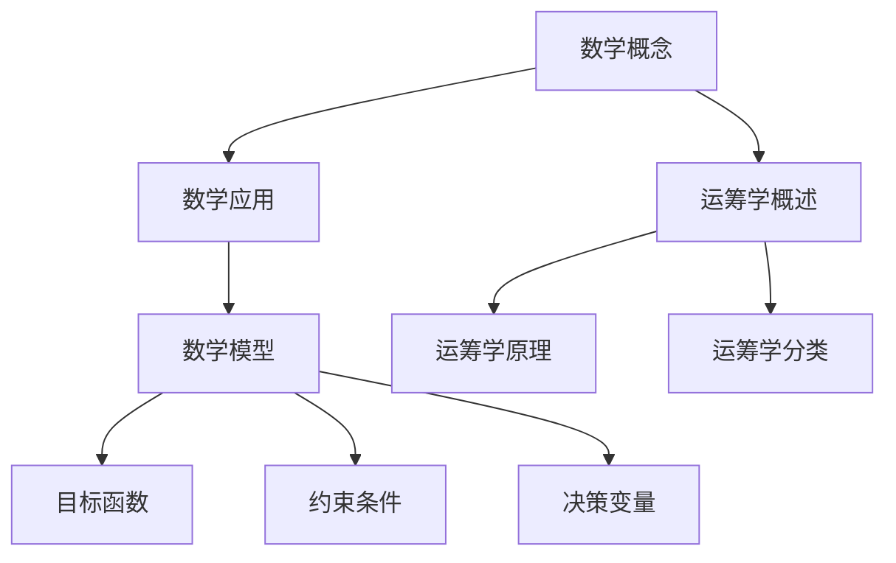

                 

### 第1章: 数学与运筹学的基本概念

#### 1.1 数学的基本概念

**数学概述**

数学作为一门科学，其本质在于通过符号、公式和逻辑推理来抽象地描述现实世界中的规律。数学不仅为自然科学、工程学和经济学提供了强有力的工具，同时也为这些领域的研究提供了精确的语言和思维方法。数学的起源可以追溯到古代文明，如古埃及和巴比伦，他们使用数学来解决实际问题，如测量土地和计算税收。随着时间的推移，数学逐渐发展成为一门独立的学科，涵盖了数论、代数、几何、微积分等多个分支。

**数学在运筹学中的应用**

运筹学是应用数学的一个分支，其核心在于利用数学模型和优化方法来解决实际问题。运筹学中常用的数学方法包括线性代数、概率论、数理统计和微分方程等。线性代数用于处理线性空间和线性方程组，是优化问题的基础工具。概率论和数理统计用于分析随机现象和不确定性，是决策理论和风险分析的重要依据。微分方程则在模拟连续系统的动态行为方面发挥着重要作用。

**数学模型的基本形式**

数学模型通常由变量、目标函数和约束条件三部分组成。变量表示决策问题中的未知量，可以是连续的（如时间、长度、质量等）或离散的（如个数、数量等）。目标函数描述了决策问题的目标，可以是最大化或最小化某个指标。约束条件则规定了变量取值的限制，保证了模型的实际可操作性。

#### 1.2 运筹学的基本概念

**运筹学概述**

运筹学（Operations Research，简称OR）是20世纪初发展起来的一门学科，旨在通过系统的分析和优化方法，帮助决策者在复杂的环境中做出最优的决策。运筹学的应用领域非常广泛，包括生产管理、物流运输、金融投资、医疗保健、城市规划等。

**运筹学的基本原理**

运筹学的基本原理包括模型化、分析和优化。模型化是将实际问题转化为数学模型，使得问题可以形式化地表示。分析则是利用数学方法和工具对模型进行深入研究，揭示变量之间的关系。优化是寻找最优解的过程，通过调整变量的取值，使得目标函数达到最大或最小。

**运筹学的分类**

运筹学可以根据研究对象的不同分为多个子领域。常见的分类包括：

- **确定性优化**：主要研究在确定性条件下如何优化决策，如线性规划、整数规划和动态规划等。

- **随机优化**：研究在不确定性条件下如何优化决策，如随机规划、蒙特卡洛方法和模拟优化等。

- **网络流优化**：研究网络中的物质、信息和人员的流动问题，如最大流问题和最小费用流问题。

- **多目标优化**：研究多个目标之间的权衡和优化，如多目标线性规划和多目标整数规划等。

- **组合优化**：研究离散问题中的优化问题，如旅行商问题、调度问题和装箱问题等。

#### 1.3 数学模型的基本形式

数学模型是运筹学的核心，其基本形式包括以下三个方面：

**目标函数**

目标函数描述了决策问题的目标，可以是最大化或最小化某个指标。目标函数通常由决策变量和系数组成，如线性规划中的目标函数：

$$
\text{最大化} \quad c^T x
$$

其中，$c$是系数向量，$x$是决策变量向量。

**约束条件**

约束条件规定了变量取值的限制，保证了模型的实际可操作性。约束条件可以是线性的或非线性的，如线性规划中的约束条件：

$$
Ax \leq b
$$

其中，$A$是约束矩阵，$b$是约束向量。

**决策变量**

决策变量是模型中的未知量，表示决策问题中的关键参数。决策变量可以是连续的或离散的，取决于问题的性质。例如，生产问题中的产品数量、运输问题中的运输量等。

综上所述，数学模型的基本形式可以表示为：

$$
\begin{cases}
\text{最大化或最小化} \quad c^T x \\
Ax \leq b \\
x \geq 0
\end{cases}
$$

其中，$c$是目标函数系数向量，$A$是约束矩阵，$b$是约束向量，$x$是决策变量向量。

#### Mermaid 流程图

### 第2章: 线性规划

#### 2.1 线性规划的基本概念

**线性规划的定义**

线性规划（Linear Programming，简称LP）是运筹学中的一个重要分支，它研究在给定约束条件下，如何通过线性目标函数的最大化或最小化来优化一个线性决策问题。线性规划广泛应用于资源分配、生产计划、运输调度、库存控制等领域。

**线性规划的目标函数**

线性规划的目标函数是决策问题的核心，它描述了决策者希望实现的目标。线性规划的目标函数通常是一个线性函数，形式如下：

$$
\text{最大化或最小化} \quad c^T x
$$

其中，$c$是目标函数的系数向量，$x$是决策变量向量。目标函数可以是最大化利润、最小化成本、最大化产量等。

**线性规划的约束条件**

线性规划的约束条件是决策变量必须满足的限制条件，它们确保解决方案是实际可行的。线性规划的约束条件通常可以表示为以下形式：

$$
Ax \leq b
$$

其中，$A$是约束矩阵，$b$是约束向量。此外，还可以有等式约束：

$$
Ax = b
$$

和变量非负约束：

$$
x \geq 0
$$

#### 2.2 线性规划的标准形式

**线性规划的标准形式**

线性规划的标准形式是一种规范化表示，它包括以下三部分：

$$
\begin{cases}
\text{最大化} \quad c^T x \\
Ax \leq b \\
x \geq 0
\end{cases}
$$

其中，$c$是目标函数系数向量，$A$是约束矩阵，$b$是约束向量，$x$是决策变量向量。

**标准形式的特点**

- 目标函数是线性函数。
- 约束条件是线性不等式或线性等式。
- 决策变量非负。

**标准形式的优点**

- 易于使用单纯形法求解。
- 可以方便地进行对偶理论的分析。

#### 2.3 线性规划的基本算法

**单纯形法**

单纯形法（Simplex Method）是求解线性规划问题的一种迭代算法，它通过逐步改进当前解，直到找到最优解。单纯形法的基本思想是：

1. 选择一个初始可行解。
2. 计算当前解的目标函数值。
3. 如果当前解是最优的，则算法结束；否则，选择一个进入变量和一个离开变量，进行迭代。

**单纯形法的迭代过程**

1. **初始可行解**：通常选择所有变量都为零的解作为初始可行解。
2. **迭代计算**：每次迭代，通过选择进入变量和离开变量来改进当前解。
3. **判断最优性**：在每次迭代后，检查当前解是否最优。如果是最优的，则算法结束；否则，继续迭代。

**单纯形法的改进算法**

单纯形法存在一些改进算法，如高斯-约当消元法、双单纯形法等。这些改进算法可以加快计算速度，提高求解效率。

**线性规划的灵敏度分析**

线性规划的灵敏度分析研究目标函数系数和约束条件的变化对最优解的影响。灵敏度分析可以帮助决策者了解模型参数的变化对解决方案的影响，从而做出更加明智的决策。

- **目标函数系数的灵敏度分析**：分析目标函数系数变化对最优解的影响。
- **约束条件的灵敏度分析**：分析约束条件变化对最优解的影响。

#### 2.4 线性规划的应用案例

**生产计划问题**

一个制造公司需要生产三种产品，每种产品都需要不同的原材料和设备。公司的目标是最大化利润，同时满足生产能力和原材料限制。

**运输问题**

一个物流公司需要从多个供应点运输货物到多个需求点，目标是最小化运输成本，同时满足运输容量和路径限制。

**资源分配问题**

一个研究机构需要将有限的研究资源分配到多个研究项目中，目标是最大化研究效果，同时满足预算和人员限制。

### 第3章: 整数规划

#### 3.1 整数规划的基本概念

**整数规划的定义**

整数规划（Integer Programming，简称IP）是线性规划的一个扩展，它研究在给定约束条件下，如何通过整数目标函数的最大化或最小化来优化一个整数决策问题。整数规划广泛应用于组合优化、资源分配、任务调度等领域。

**整数规划的目标函数**

整数规划的目标函数通常是线性的，形式如下：

$$
\text{最大化或最小化} \quad c^T x
$$

其中，$c$是目标函数的系数向量，$x$是决策变量向量。目标函数可以是最大化利润、最小化成本、最大化产量等。

**整数规划的约束条件**

整数规划的约束条件是决策变量必须满足的限制条件，它们确保解决方案是实际可行的。整数规划的约束条件通常可以表示为以下形式：

$$
Ax \leq b
$$

其中，$A$是约束矩阵，$b$是约束向量。此外，还可以有等式约束：

$$
Ax = b
$$

和变量非负约束：

$$
x \geq 0
$$

但与线性规划不同的是，整数规划要求决策变量必须是整数。

#### 3.2 整数规划的求解方法

**整数规划的启发式算法**

整数规划的启发式算法是一种快速求解整数规划问题的方法，它不保证找到最优解，但通常可以找到较好的解。常见的启发式算法包括：

- **贪婪算法**：通过每次选择当前最优的变量来迭代求解。
- **遗传算法**：基于自然选择和遗传机制来优化解。
- **模拟退火算法**：通过模拟物理系统中的退火过程来寻找最优解。

**整数规划的分支定界算法**

分支定界算法（Branch and Bound Method）是一种求解整数规划问题的精确算法，它通过递归地将问题分解为更小的子问题，并剪枝以排除不可能产生最优解的子问题，从而找到最优解。分支定界算法的基本步骤包括：

1. **初始解**：选择一个初始可行解，通常是所有变量都为零的解。
2. **分支**：根据约束条件，将当前问题分解为两个或多个子问题。
3. **定界**：计算每个子问题的上下界，并排除不可能产生最优解的子问题。
4. **递归求解**：对每个可行的子问题递归执行分支和定界操作，直到找到最优解。

**整数规划的对偶理论**

整数规划的对偶理论是研究整数规划原始问题和对偶问题之间关系的一个分支。对偶问题由原始问题的对偶目标函数和约束条件组成，对偶理论可以帮助理解整数规划问题的性质，并用于求解复杂问题。

#### 3.3 整数规划的应用案例

**员工排班问题**

一个公司需要为员工制定一个合理的排班计划，确保每个员工的工作时间符合法律法规和公司政策，同时满足员工的需求。

**飞机座位分配问题**

航空公司需要为每个航班分配座位，确保每个座位都被预订，同时最大化收入。

**生产调度问题**

一个制造公司需要制定生产计划，确保每个生产环节都在规定时间内完成，同时最大化生产效率和产品质量。

### 第4章: 动态规划

#### 4.1 动态规划的基本概念

**动态规划的定义**

动态规划（Dynamic Programming，简称DP）是一种解决多阶段决策问题的优化方法。它通过将问题分解为多个子问题，并利用子问题的最优解来构建原问题的最优解。动态规划广泛应用于经济学、工程学、计算机科学等领域。

**动态规划的特点**

- **最优子结构**：动态规划问题通常具有最优子结构性质，即问题的最优解包含其子问题的最优解。
- **重叠子问题**：动态规划通过递归关系来解决问题，避免了重复计算相同的子问题。
- **无后效性**：动态规划问题中的每个阶段的状态只依赖于前一个阶段的状态，与前后阶段无关。

**动态规划的基本思想**

动态规划的基本思想是将复杂的问题分解为多个简单子问题，并利用子问题的最优解来构建原问题的最优解。具体步骤如下：

1. **定义状态**：确定问题的状态变量，表示问题的不同阶段。
2. **状态转移方程**：根据问题的约束条件，建立状态转移方程，描述状态变量之间的转换关系。
3. **边界条件**：确定问题的初始状态和边界条件。
4. **递推计算**：利用状态转移方程和边界条件，递推计算每个状态的最优值。
5. **求解最优解**：根据递推结果，求解原问题的最优解。

#### 4.2 动态规划的应用

**最长公共子序列问题**

最长公共子序列问题（Longest Common Subsequence，简称LCS）是动态规划的一个经典应用。给定两个序列，找到它们的最长公共子序列。

**最短路径问题**

最短路径问题（Shortest Path Problem）是动态规划在图论中的应用。给定一个加权图，找到从源点到其他所有顶点的最短路径。

**背包问题**

背包问题（Knapsack Problem）是动态规划在组合优化中的应用。给定一组物品和它们的重量和价值，选择其中一些物品放入背包中，使得背包中的物品总价值最大，同时不超过背包的容量。

#### 4.3 动态规划的应用案例

**资源分配问题**

一个公司需要在一段时间内分配资源（如人力、资金、设备等）到不同的项目，使得项目的总收益最大化。

**生产计划问题**

一个制造公司需要制定生产计划，确保每个生产环节都在规定时间内完成，同时最大化生产效率和产品质量。

**物流调度问题**

一个物流公司需要安排车辆和路线，将货物从多个仓库运输到多个目的地，使得总运输成本最小化。

### 第5章: 随机规划

#### 5.1 随机规划的基本概念

**随机规划的定义**

随机规划（Stochastic Programming，简称SP）是运筹学中的一种方法，用于解决在不确定性条件下进行决策的问题。它将随机性和不确定性引入到优化问题中，以找到一组决策策略，使得在给定概率分布下的目标函数期望值达到最优。

**随机规划的目标函数**

随机规划的目标函数通常包含两个部分：确定性部分和随机部分。确定性部分表示决策者在确定性条件下的目标，随机部分则表示不确定性因素对目标函数的影响。随机规划的目标函数通常可以表示为：

$$
\min_{x} \quad \mathbb{E}_{\xi} [f(x, \xi)]
$$

其中，$x$是决策变量，$\xi$是随机变量，$\mathbb{E}_{\xi} []$表示随机变量的期望值，$f(x, \xi)$是目标函数。

**随机规划的约束条件**

随机规划的约束条件包括确定性约束和随机约束。确定性约束是决策者在确定性条件下必须满足的限制条件，如线性不等式或线性等式。随机约束则描述了不确定性因素对决策变量的限制，如概率分布函数或条件期望。

#### 5.2 随机规划的求解方法

**马尔可夫决策过程**

马尔可夫决策过程（Markov Decision Process，简称MDP）是随机规划的一种重要方法，用于解决在不确定环境中进行决策的问题。MDP由状态空间、动作空间、奖励函数和状态转移概率矩阵组成。MDP的求解目标是找到一组最优动作策略，使得长期期望奖励最大化。

**马尔可夫决策过程的求解算法**

MDP的求解算法包括价值迭代法和策略迭代法。价值迭代法通过递归计算最优值函数，逐步收敛到最优解。策略迭代法则通过交替迭代策略和值函数，最终找到最优策略。

**随机规划的最优化方法**

随机规划的最优化方法包括线性规划方法、非线性规划方法和动态规划方法。线性规划方法适用于确定性部分为目标函数和约束条件的问题。非线性规划方法适用于目标函数和约束条件是非线性函数的问题。动态规划方法则适用于具有最优子结构和重叠子结构的问题。

#### 5.3 随机规划的应用案例

**金融风险管理**

在金融市场中，随机规划可以用于投资组合优化、风险控制、资产定价等问题。通过建立随机规划模型，投资者可以找到最优的投资策略，以最大化收益并控制风险。

**供应链管理**

在供应链管理中，随机规划可以用于库存控制、运输调度、需求预测等问题。通过建立随机规划模型，企业可以优化供应链运作，提高供应链的灵活性和响应速度。

**环境管理**

在环境管理中，随机规划可以用于资源分配、污染控制、碳排放优化等问题。通过建立随机规划模型，政府和企业可以制定有效的环境保护政策，实现可持续发展目标。

### 第6章: 网络流

#### 6.1 网络流的基本概念

**网络流的基本概念**

网络流（Network Flow）是研究网络中物质、信息和人员等流动的一门学科。网络流的基本概念包括节点（Node）、边（Edge）、容量（Capacity）、流量（Flow）等。

- **节点**：网络中的基本元素，表示实体或位置。
- **边**：连接两个节点的路径，表示实体或信息的流动通道。
- **容量**：边所能承载的最大流量。
- **流量**：通过边的实际流量。

**网络流的目标函数**

网络流的目标函数是描述网络流动的最关键部分，常见的目标函数包括：

- **最大流问题**：找到从源点到汇点的最大流量。
- **最小费用流问题**：找到从源点到汇点的最小总费用流量。
- **最大最小流问题**：找到所有源点到汇点的最小流量中的最大值。

**网络流的约束条件**

网络流必须满足以下基本约束条件：

- **容量约束**：每条边上的流量不能超过其容量。
- **流守恒约束**：每个节点的流入量等于流出量（源点和汇点除外）。

#### 6.2 最大流最小割定理

**最大流最小割定理的基本原理**

最大流最小割定理（Maximum Flow-Minimum Cut Theorem）是网络流理论中的一个重要定理，它揭示了最大流和最小割之间的关系。

- **最大流**：网络中的最大流是从源点到汇点的最大可能流量。
- **最小割**：网络中的最小割是从源点到汇点之间，能够分离源点和汇点且流量最小的割集。

**定理内容**

最大流最小割定理指出，在一个给定的网络中，最大流的流量等于最小割的割集流量。

**定理证明**

定理的证明可以通过反证法进行。假设存在一个网络，其最大流流量大于最小割割集流量。通过构造一个反例，可以证明这种假设是错误的。

**定理的应用**

最大流最小割定理在许多实际应用中具有重要意义，如：

- **网络设计**：用于确定网络中的关键路径和瓶颈。
- **资源分配**：用于优化资源的分配策略。
- **物流运输**：用于确定物流网络中的最优运输路径。

#### 6.3 最大流最小割定理的应用案例

**供应链网络设计**

在供应链网络设计中，最大流最小割定理可以帮助企业确定最优的物流网络布局，确保从供应商到客户的物流顺畅，同时识别出潜在的风险点和瓶颈。

**交通网络优化**

在城市交通网络优化中，最大流最小割定理可以帮助交通管理部门确定最优的路线规划，确保道路的畅通，减少交通拥堵。

**电力网络规划**

在电力网络规划中，最大流最小割定理可以帮助电力公司优化输电网络，确保电力供应的稳定性和可靠性。

### 第7章: 运筹学的实际应用

#### 7.1 运筹学在物流管理中的应用

**物流网络的优化**

运筹学在物流网络优化中的应用主要包括路径规划、库存管理和运输调度等方面。通过建立数学模型和优化算法，物流企业可以优化运输路线，减少运输成本，提高运输效率。

- **路径规划**：通过求解最短路径问题或最大流问题，确定最优的运输路径。
- **库存管理**：通过动态规划或随机规划方法，优化库存水平和库存策略，减少库存成本。
- **运输调度**：通过调度优化算法，合理安排运输任务，提高运输效率。

**物流管理案例分析**

一个大型零售企业通过引入运筹学模型和优化算法，对其物流网络进行优化。通过路径优化，减少了运输成本；通过库存管理优化，降低了库存成本；通过运输调度优化，提高了运输效率，从而提升了企业的整体运营效益。

#### 7.2 运筹学在生产管理中的应用

**生产调度**

运筹学在生产调度中的应用主要包括生产计划、任务分配和作业排序等方面。通过建立数学模型和优化算法，企业可以合理安排生产任务，提高生产效率。

- **生产计划**：通过线性规划和整数规划方法，制定合理的生产计划，确保生产任务按时完成。
- **任务分配**：通过调度优化算法，合理安排任务分配，提高生产线的利用效率。
- **作业排序**：通过作业排序算法，优化生产作业的顺序，减少生产线的空闲时间。

**生产管理案例分析**

一个制造企业通过引入运筹学模型和优化算法，对其生产调度进行优化。通过生产计划优化，提高了生产效率；通过任务分配优化，减少了生产线的空闲时间；通过作业排序优化，提高了生产线的利用率，从而提升了企业的整体生产效益。

#### 7.3 运筹学在供应链管理中的应用

**供应链网络设计**

运筹学在供应链网络设计中的应用主要包括供应链节点选址、网络布局和物流路径规划等方面。通过建立数学模型和优化算法，企业可以优化供应链网络的布局，提高供应链的灵活性和响应速度。

- **供应链节点选址**：通过整数规划和线性规划方法，确定最优的供应链节点位置。
- **网络布局**：通过网络流算法，优化供应链网络中的物流路径。
- **物流路径规划**：通过最短路径算法和最大流算法，确定最优的物流路径。

**供应链管理案例分析**

一个跨国企业通过引入运筹学模型和优化算法，对其供应链网络进行优化。通过供应链节点选址优化，提高了供应链的稳定性；通过网络布局优化，提高了供应链的响应速度；通过物流路径规划优化，减少了物流成本，从而提升了企业的整体供应链效益。

### 第8章: 运筹学的未来发展趋势

#### 8.1 运筹学的新领域

**数据驱动的运筹学**

随着大数据和人工智能技术的发展，数据驱动的运筹学逐渐成为运筹学的一个重要研究领域。通过利用海量数据，运筹学模型可以更加准确地描述现实世界中的复杂系统，从而提高决策的精确性和效率。

- **数据挖掘**：通过数据挖掘技术，从大量数据中发现有价值的信息和规律。
- **机器学习**：利用机器学习方法，建立预测模型和优化模型，提高决策的智能化水平。
- **人工智能**：将人工智能技术应用于运筹学模型，实现自动化决策和优化。

**云计算与运筹学**

云计算为运筹学提供了强大的计算能力，使得复杂运筹学模型的求解变得更加可行。通过云计算平台，企业可以快速部署和运行运筹学模型，提高决策的实时性和灵活性。

- **云计算平台**：提供高性能计算和大规模数据存储能力，支持运筹学模型的部署和运行。
- **分布式计算**：通过分布式计算技术，实现运筹学模型的并行计算，提高求解效率。

**大数据与运筹学**

大数据技术的发展为运筹学提供了丰富的数据资源和强大的分析工具。通过大数据技术，运筹学模型可以更加全面地描述现实世界中的复杂系统，从而提高决策的科学性和准确性。

- **大数据平台**：提供数据存储、处理和分析能力，支持运筹学模型的数据输入和处理。
- **数据可视化**：通过数据可视化技术，直观地展示运筹学模型的结果和分析过程。

#### 8.2 运筹学在人工智能中的应用

**人工智能在运筹学中的应用**

人工智能技术在运筹学中的应用主要体现在优化算法的改进和优化模型的构建方面。通过利用人工智能技术，可以开发出更加高效、智能的优化算法，提高决策的准确性和效率。

- **遗传算法**：通过模拟自然选择和遗传机制，实现优化问题的求解。
- **神经网络**：通过神经网络模型，建立复杂优化问题的预测和决策模型。
- **深度学习**：通过深度学习模型，实现复杂优化问题的自动学习和优化。

**运筹学与机器学习的结合**

运筹学与机器学习的结合是未来运筹学发展的一个重要方向。通过将机器学习技术应用于运筹学模型，可以实现更加智能化的决策和优化。

- **协同优化**：将机器学习模型与运筹学模型相结合，实现多目标优化问题的求解。
- **自适应优化**：通过机器学习技术，实现优化模型的动态调整和优化。

**运筹学在深度学习中的应用**

运筹学在深度学习中的应用主要体现在优化深度学习模型的结构和参数方面。通过运筹学方法，可以优化深度学习模型的训练过程，提高模型的性能和效率。

- **结构优化**：通过优化深度学习模型的结构，提高模型的泛化能力和计算效率。
- **参数优化**：通过优化深度学习模型的参数，提高模型的训练效果和预测准确性。

### 第9章: 附录

#### 9.1 运筹学常用工具软件

**LINDO**

LINDO是一种商业化的线性规划和整数规划求解器，提供强大的建模和求解功能，支持多种编程语言和操作系统。

**CPLEX**

CPLEX是一种高性能的线性规划、整数规划和混合整数规划求解器，广泛应用于各种工业和学术领域。

**Gurobi**

Gurobi是一种高性能的线性规划、整数规划和混合整数规划求解器，提供丰富的建模工具和优化算法。

#### 9.2 运筹学相关书籍推荐

**《运筹学导论》**

《运筹学导论》是一本经典的运筹学教材，涵盖了线性规划、整数规划、动态规划、随机规划等多个领域。

**《运筹学及其应用》**

《运筹学及其应用》是一本针对实际应用的运筹学教材，介绍了运筹学在物流管理、生产管理、供应链管理中的应用案例。

**《线性规划与整数规划》**

《线性规划与整数规划》是一本专门介绍线性规划和整数规划的教材，详细讲解了线性规划和整数规划的建模方法、求解算法和应用案例。

#### 9.3 运筹学论文集推荐

**《运筹学学报》**

《运筹学学报》是一本国内外公开发行的学术期刊，主要发表运筹学及其应用领域的学术论文。

**《运筹学杂志》**

《运筹学杂志》是一本国内外公开发行的学术期刊，主要发表运筹学及其应用领域的学术论文。

**《系统工程理论与实践》**

《系统工程理论与实践》是一本国内外公开发行的学术期刊，主要发表系统工程及其应用领域的学术论文。

