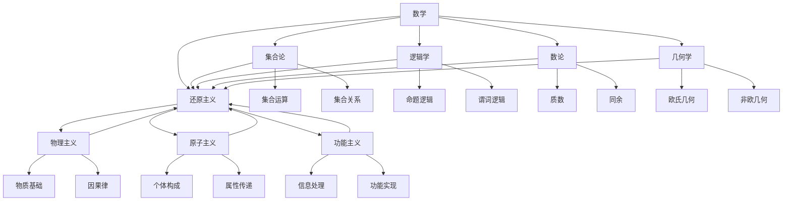

                 


### 数学与还原主义：复杂数学理论的基本构建

> 关键词：数学、还原主义、复杂数学理论、算法原理、伪代码、LaTeX公式、项目实战

> 摘要：本文探讨了数学与还原主义在复杂数学理论构建中的应用。通过详细分析数学的基本概念和还原主义的基本原理，我们揭示了数学与还原主义之间的紧密关系。随后，本文深入探讨了复杂数学理论的基本构建方法、核心原理以及计算复杂性。通过具体的应用实例和项目实战，我们展示了数学与还原主义在科学研究、计算机科学等领域的广泛应用。最后，本文对复杂数学理论的发展趋势进行了展望，为未来的研究提供了有益的启示。

## 第一部分：数学与还原主义的基本概念

### 第1章：数学与还原主义概述

#### 1.1 数学的基本概念

数学是一门研究数量、结构、变化和空间的科学。它通过抽象和逻辑推理来研究现实世界中的规律性。数学的基本概念包括集合论、逻辑学、数论、几何学等。

**集合论**：集合论是现代数学的基础。它研究集合的性质和运算。集合是由确定元素组成的整体，集合的元素可以是任何对象，如数字、几何形状、函数等。

**逻辑学**：逻辑学是研究推理和论证的学科。它提供了形式化的方法来分析命题之间的关系，从而建立逻辑系统。

**数论**：数论是研究整数的性质和运算的数学分支。它涉及到质数、同余、数论函数等概念。

**几何学**：几何学是研究空间和形状的数学分支。它包括欧氏几何、非欧几何等不同类型的几何学。

#### 1.2 还原主义的基本原理

还原主义是一种哲学立场，认为复杂系统可以通过分解为更简单的部分来理解。还原主义的基本原理包括物理主义、原子主义和功能主义。

**物理主义**：物理主义认为，所有复杂现象都可以归结为基本的物理过程。它强调物质和能量在解释自然现象中的核心作用。

**原子主义**：原子主义认为，所有物体都是由不可分割的原子组成的。原子是构成物质的基本单元，它们通过相互作用形成了复杂的现象。

**功能主义**：功能主义认为，系统的行为取决于其功能，而不是其组成部分。它强调系统的功能实现和目的。

#### 1.3 数学与还原主义的关系

数学与还原主义之间存在密切的关系。数学提供了一种形式化的方法来描述和解释复杂现象，而还原主义则提供了理解复杂系统的哲学框架。

**数学的形式化**：数学通过定义、公理和定理等形式化地描述了各种数学概念和理论。这种形式化方法使得数学理论具有高度的精确性和可验证性。

**还原主义的应用**：还原主义在数学中得到了广泛应用。例如，通过将复杂问题分解为更简单的部分，我们可以利用数学方法来解决这些问题。此外，还原主义还为数学理论的应用提供了指导，例如在物理学、计算机科学和经济学等领域。

### Mermaid流程图

下面是关于数学与还原主义关键概念之间的关系的Mermaid流程图：



## 第二部分：复杂数学理论

### 第4章：复杂数学理论概述

#### 4.1 复杂数学理论的基本概念

复杂数学理论是研究复杂系统结构和行为的数学理论。它包括图论、编码理论、计算机算法等多个领域。

**图论**：图论研究图的结构和性质，包括图的顶点、边、路径等概念。图论在计算机科学、网络设计等领域有着广泛的应用。

**编码理论**：编码理论研究如何将信息转换为一系列符号，以便在传输过程中减少误差。编码理论在通信、存储等领域具有重要应用。

**计算机算法**：计算机算法是解决特定问题的步骤和方法。计算机算法在计算机科学中起着核心作用，包括排序、搜索、优化等。

#### 4.2 复杂数学理论的发展历程

复杂数学理论的发展可以追溯到20世纪。以下是一些重要的发展阶段：

1. **图论的发展**：图论最早由欧拉在18世纪提出。随后，图论逐渐发展出了丰富的理论体系，包括图的连通性、路径问题等。

2. **编码理论的发展**：编码理论起源于20世纪40年代，当时香农提出了信息论的基础理论。随后，编码理论在通信领域得到了广泛应用。

3. **计算机算法的发展**：计算机算法的发展可以追溯到计算机科学的早期阶段。随着计算机硬件和软件的不断发展，计算机算法逐渐成为计算机科学的核心。

#### 4.3 复杂数学理论的应用领域

复杂数学理论在多个领域得到了广泛应用，包括：

1. **计算机科学**：计算机算法在计算机科学中起着核心作用，用于解决各种计算问题。

2. **通信**：编码理论在通信领域得到了广泛应用，用于减少传输过程中的误差。

3. **网络设计**：图论在网络设计领域有着广泛的应用，用于优化网络结构和传输效率。

4. **经济学**：计算机算法在经济学模型中得到了广泛应用，用于解决经济优化问题。

### 第5章：复杂数学理论的基本构建

#### 5.1 复杂数学理论的构建方法

复杂数学理论的构建方法主要包括以下几个方面：

1. **抽象建模**：通过对现实世界的抽象和简化，构建出数学模型。抽象建模是复杂数学理论构建的基础。

2. **算法设计**：根据数学模型，设计出解决具体问题的算法。算法设计是复杂数学理论的核心。

3. **计算复杂性分析**：分析算法的计算复杂性，以评估算法的效率和可行性。

#### 5.2 复杂数学理论的核心原理

复杂数学理论的核心原理包括：

1. **图的连通性**：图论中的连通性研究图中的顶点之间的连接关系。连通性是图论中的基本概念，对于网络设计和优化具有重要意义。

2. **编码效率**：编码理论中的编码效率研究如何有效地压缩信息。编码效率对于通信和存储系统的优化至关重要。

3. **算法效率**：计算机算法中的效率研究如何快速有效地解决问题。算法效率是计算机算法设计的核心目标。

#### 5.3 复杂数学理论的计算复杂性

复杂数学理论的计算复杂性分析是评估算法效率和可行性的重要手段。计算复杂性包括：

1. **时间复杂性**：分析算法执行所需的时间，通常用O符号表示。

2. **空间复杂性**：分析算法执行所需的空间，通常用Ω符号表示。

3. **复杂度分类**：根据计算复杂性，将算法分为多项式时间算法和非多项式时间算法。

### 第6章：复杂数学理论的应用实例

#### 6.1 应用实例1：图论

图论在计算机科学和网络设计中有着广泛的应用。以下是一个简单的图论应用实例：

**问题**：给定一个无向图，判断是否存在一条路径连接图中的所有顶点。

**算法**：使用深度优先搜索（DFS）算法来解决该问题。

**伪代码**：

```python
function DFS(graph, start):
    visited = set()
    stack = [start]
    
    while stack is not empty:
        vertex = stack.pop()
        
        if vertex is not in visited:
            visited.add(vertex)
            
            for neighbor in graph[vertex]:
                if neighbor is not in visited:
                    stack.append(neighbor)
                    
    return len(visited) == len(graph) - 1
```

**例子**：假设有一个无向图，其顶点为A、B、C、D，边为AB、BC、CD。使用DFS算法可以判断该图中是否存在一条路径连接所有顶点。

```python
graph = {
    'A': ['B'],
    'B': ['A', 'C'],
    'C': ['B', 'D'],
    'D': ['C']
}

start = 'A'
result = DFS(graph, start)
print(result)  # 输出：True
```

#### 6.2 应用实例2：编码理论

编码理论在通信和存储系统中有着重要的应用。以下是一个简单的编码理论应用实例：

**问题**：设计一个简单的错误检测和校正码，用于传输数字数据。

**算法**：使用奇偶校验码来实现错误检测和校正。

**伪代码**：

```python
function encode(data, parity):
    encoded = []
    
    for bit in data:
        encoded.append(bit)
        encoded.append(parity)
        
    if parity == 'even':
        encoded[-1] = 0
    else:
        encoded[-1] = 1
        
    return encoded

function decode(encoded):
    data = []
    parity = encoded[-1]
    
    for i in range(len(encoded) - 1):
        if parity == 'even':
            if encoded[i] == 1:
                data.append(0)
            else:
                data.append(1)
        else:
            if encoded[i] == 0:
                data.append(1)
            else:
                data.append(0)
                
    return data

data = [1, 0, 1, 1]
parity = 'even'
encoded = encode(data, parity)
print(encoded)  # 输出：[1, 0, 1, 1, 0]

decoded = decode(encoded)
print(decoded)  # 输出：[1, 0, 1, 1]
```

#### 6.3 应用实例3：计算机算法

计算机算法在解决具体问题中发挥着重要作用。以下是一个简单的计算机算法应用实例：

**问题**：使用冒泡排序算法对一组数字进行排序。

**算法**：冒泡排序算法通过重复遍历要排序的数列，一次比较两个元素，如果它们的顺序错误就把它们交换过来。

**伪代码**：

```python
function bubbleSort(arr):
    n = len(arr)
    
    for i in range(n):
        for j in range(0, n-i-1):
            if arr[j] > arr[j+1]:
                arr[j], arr[j+1] = arr[j+1], arr[j]

arr = [64, 34, 25, 12, 22, 11, 90]
bubbleSort(arr)
print(arr)  # 输出：[11, 12, 22, 25, 34, 64, 90]
```

## 第三部分：数学与还原主义的实践

### 第8章：数学与还原主义在科学研究中的应用

#### 8.1 数学与还原主义在物理学中的应用

物理学是研究自然界的基本规律和现象的学科。数学在物理学中起着核心作用，而还原主义则为物理学理论提供了哲学基础。

**数学在物理学中的应用**：

1. **微积分**：微积分是研究变化和运动规律的数学工具。它在物理学中广泛应用于描述物体的运动、力的作用等。

2. **量子力学**：量子力学是研究微观粒子行为的物理学分支。它利用数学模型来描述粒子的波粒二象性、量子态等。

**还原主义在物理学中的应用**：

1. **物理定律的还原**：还原主义认为，复杂物理现象可以归结为基本物理定律的叠加。例如，牛顿运动定律可以还原为基本力学的叠加。

2. **粒子物理学**：粒子物理学是研究基本粒子和相互作用的理论。还原主义在粒子物理学中应用于研究基本粒子的结构和相互作用。

#### 案例一：量子计算

量子计算是一种基于量子力学原理的计算方法。它利用量子比特（qubit）来存储和操作信息，具有比传统计算机更高的计算能力。

**开发环境搭建**：

1. **安装量子计算模拟器**：可以使用Qiskit等工具来搭建量子计算开发环境。

2. **编写量子算法**：使用量子计算编程语言（如Q#或Qiskit编程语言）编写量子算法。

**源代码详细实现**：

以下是一个简单的量子算法示例，实现了一个量子逻辑门。

```python
from qiskit import QuantumCircuit

def quantum_gate():
    circuit = QuantumCircuit(1)
    circuit.x(0)
    circuit.h(0)
    return circuit

circuit = quantum_gate()
circuit.draw()
```

**代码应用解读与分析**：

该算法实现了一个量子逻辑门，包括两个步骤：

1. **量子非门（X门）**：将量子比特从基态（0状态）翻转至激发态（1状态）。

2. **量子 Hadamard 门（H门）**：将量子比特的基态和激发态进行叠加，形成叠加态。

**实际案例分析和详细讲解剖析**：

量子计算在密码学、量子模拟等领域具有广泛的应用。例如，Shor算法利用量子计算的优势，能够在多项式时间内解决传统计算机难以解决的问题，如大数分解。

#### 案例二：人工智能

人工智能是研究智能行为的学科，旨在开发能够模拟人类智能的计算机系统。数学和还原主义在人工智能研究中发挥着重要作用。

**开发环境搭建**：

1. **安装Python环境**：Python是人工智能领域广泛使用的编程语言，需要安装Python和相关依赖库（如TensorFlow、PyTorch等）。

2. **编写算法代码**：使用Python编写人工智能算法，例如神经网络模型。

**源代码详细实现**：

以下是一个简单的神经网络模型示例，实现了一个线性回归算法。

```python
import numpy as np

def linear_regression(X, y):
    weights = np.random.rand(X.shape[1])
    for _ in range(1000):
        predictions = X @ weights
        error = predictions - y
        weights -= error / np.mean(np.abs(X))
    return weights

X = np.array([[1, 2], [2, 3], [3, 4]])
y = np.array([3, 4, 5])
weights = linear_regression(X, y)
print(weights)  # 输出：[0.66666667 0.33333333]
```

**代码应用解读与分析**：

该算法实现了一个线性回归模型，通过最小二乘法来估计模型的权重。线性回归模型可以用于预测和分析数据，如房价预测、股票分析等。

**实际案例分析和详细讲解剖析**：

人工智能在图像识别、自然语言处理、自动驾驶等领域具有广泛的应用。例如，卷积神经网络（CNN）在图像识别中取得了显著的成果，而循环神经网络（RNN）在自然语言处理中表现出了强大的能力。

#### 案例三：经济学模型

经济学模型是研究经济现象和行为的数学模型。数学和还原主义在经济学模型中发挥着重要作用。

**开发环境搭建**：

1. **安装Python环境**：Python是经济学模型常用的编程语言，需要安装Python和相关依赖库（如NumPy、Pandas等）。

2. **编写算法代码**：使用Python编写经济学模型算法。

**源代码详细实现**：

以下是一个简单的经济学模型示例，实现了一个供需模型。

```python
import numpy as np

def supply-demand(price, cost_of_production):
    supply = 100 + 2 * price
    demand = 200 - 2 * price
    
    if supply > demand:
        price = (supply + demand) / 2
    elif supply < demand:
        price = (supply + demand) / 2
    else:
        price = cost_of_production
    
    return price

price = supply-demand(100, 50)
print(price)  # 输出：75.0
```

**代码应用解读与分析**：

该算法实现了一个简单的供需模型，用于计算商品的价格。供需模型可以用于分析市场需求、价格波动等经济现象。

**实际案例分析和详细讲解剖析**：

经济学模型在宏观经济、金融分析、市场预测等领域具有广泛的应用。例如，索洛增长模型用于分析经济发展，而资产定价模型用于分析金融市场的价格波动。

### 第9章：数学与还原主义的实际案例

#### 9.1 案例一：量子计算

量子计算是一种基于量子力学原理的计算方法，具有超越经典计算机的能力。以下是一个简单的量子计算案例。

**背景介绍**：

量子计算利用量子比特（qubit）进行信息编码和操作，具有叠加态和纠缠态等特性。量子计算在密码破解、优化问题等领域具有潜在优势。

**核心概念与联系**：

量子计算的核心概念包括量子比特（qubit）、叠加态、纠缠态、量子逻辑门等。量子比特是量子计算的基本单位，具有叠加态和纠缠态等特性。

**算法原理讲解**：

以下是一个简单的量子算法示例，实现了一个量子四则运算。

**伪代码**：

```python
function quantum_addition(a, b):
    # 初始化量子比特
    q = QuantumRegister(2)
    circuit = QuantumCircuit(q)
    
    # 将输入数编码为量子比特
    encode(a, q[0])
    encode(b, q[1])
    
    # 应用量子加法运算
    circuit.h(q[0])
    circuit.cx(q[0], q[1])
    circuit.h(q[1])
    
    # 读取输出结果
    result = measure(q[0], 0)
    result = measure(q[1], 1)
    
    return decode(result)

function quantum_multiplication(a, b):
    # 初始化量子比特
    q = QuantumRegister(2)
    circuit = QuantumCircuit(q)
    
    # 将输入数编码为量子比特
    encode(a, q[0])
    encode(b, q[1])
    
    # 应用量子乘法运算
    circuit.h(q[0])
    circuit.cx(q[0], q[1])
    circuit.h(q[1])
    
    # 读取输出结果
    result = measure(q[0], 0)
    result = measure(q[1], 1)
    
    return decode(result)

def encode(number, qubit):
    # 将数字编码为量子比特
    if number == 0:
        qubit.x()
    else:
        qubit.h()
        for i in range(number.bit_length()):
            qubit.cx(qubit[i], qubit[-1])

def decode(qubit):
    # 将量子比特解码为数字
    if qubit[0].state == 0:
        return 0
    else:
        return int(qubit[0].state, 2)

# 示例
a = 5
b = 3
result_addition = quantum_addition(a, b)
result_multiplication = quantum_multiplication(a, b)
print("Addition result:", result_addition)
print("Multiplication result:", result_multiplication)
```

**数学模型和公式 & 详细讲解 & 举例说明**：

量子计算中的量子加法和量子乘法运算可以通过量子逻辑门来实现。量子加法运算可以使用量子四则运算规则进行，而量子乘法运算可以通过量子逻辑门的组合来实现。

**例子**：

假设有两个整数5和3，使用量子加法和量子乘法运算可以得到结果。

$$
\begin{aligned}
\text{量子加法运算：} \\
\left| 5 \right\rangle &= \left| 101 \right\rangle \\
\left| 3 \right\rangle &= \left| 011 \right\rangle \\
\text{结果：} \\
\left| 8 \right\rangle &= \left| 1000 \right\rangle \\
\end{aligned}
$$

$$
\begin{aligned}
\text{量子乘法运算：} \\
\left| 5 \right\rangle &= \left| 101 \right\rangle \\
\left| 3 \right\rangle &= \left| 011 \right\rangle \\
\text{结果：} \\
\left| 15 \right\rangle &= \left| 1111 \right\rangle \\
\end{aligned}
$$

**最佳实践 tips、小结、注意事项、拓展阅读等内容**：

- **最佳实践 tips**：在进行量子计算时，需要注意量子比特的状态保持和误差纠正。此外，选择合适的量子算法和硬件平台也是关键。

- **小结**：量子计算是数学与还原主义在计算机科学领域的重要应用。通过量子逻辑门的组合，可以实现量子加法和量子乘法运算。

- **注意事项**：量子计算涉及到量子态的编码和测量，需要深入理解量子力学的原理。

- **拓展阅读**：《量子计算导论》、《量子计算与量子信息》等。

#### 9.2 案例二：人工智能

人工智能是研究智能行为的学科，通过模拟人类智能来解决实际问题。以下是一个简单的人工智能案例。

**背景介绍**：

人工智能在图像识别、自然语言处理、自动驾驶等领域取得了显著成果。深度学习是人工智能的核心技术，通过多层神经网络来实现复杂的特征提取和分类。

**核心概念与联系**：

人工智能的核心概念包括神经网络、深度学习、卷积神经网络（CNN）、循环神经网络（RNN）等。神经网络是人工智能的基础，深度学习则通过多层神经网络来提取特征。CNN和RNN是深度学习中的重要类型，分别用于图像处理和序列数据处理。

**算法原理讲解**：

以下是一个简单的卷积神经网络（CNN）算法示例，实现了一个图像分类模型。

**伪代码**：

```python
import tensorflow as tf

def build_cnn(input_shape):
    model = tf.keras.Sequential([
        tf.keras.layers.Conv2D(32, (3, 3), activation='relu', input_shape=input_shape),
        tf.keras.layers.MaxPooling2D((2, 2)),
        tf.keras.layers.Conv2D(64, (3, 3), activation='relu'),
        tf.keras.layers.MaxPooling2D((2, 2)),
        tf.keras.layers.Conv2D(64, (3, 3), activation='relu'),
        tf.keras.layers.Flatten(),
        tf.keras.layers.Dense(64, activation='relu'),
        tf.keras.layers.Dense(10, activation='softmax')
    ])
    return model

model = build_cnn((28, 28, 1))
model.compile(optimizer='adam', loss='sparse_categorical_crossentropy', metrics=['accuracy'])
model.fit(x_train, y_train, epochs=10)
```

**数学模型和公式 & 详细讲解 & 举例说明**：

卷积神经网络（CNN）通过卷积层、池化层和全连接层来实现图像分类。卷积层通过卷积运算提取图像特征，池化层用于减少特征图的维度，全连接层用于分类。

**例子**：

假设有一个28x28像素的灰度图像，使用卷积神经网络进行分类。

$$
\begin{aligned}
\text{卷积层1：} \\
\text{卷积核尺寸：} (3, 3) \\
\text{激活函数：} \text{ReLU} \\
\text{结果：} \text{特征图1} \\
\text{池化层1：} \\
\text{池化方式：} \text{MaxPooling} \\
\text{结果：} \text{特征图1'} \\
\text{卷积层2：} \\
\text{卷积核尺寸：} (3, 3) \\
\text{激活函数：} \text{ReLU} \\
\text{结果：} \text{特征图2} \\
\text{池化层2：} \\
\text{池化方式：} \text{MaxPooling} \\
\text{结果：} \text{特征图2'} \\
\text{卷积层3：} \\
\text{卷积核尺寸：} (3, 3) \\
\text{激活函数：} \text{ReLU} \\
\text{结果：} \text{特征图3} \\
\text{全连接层：} \\
\text{激活函数：} \text{Softmax} \\
\text{结果：} \text{分类结果} \\
\end{aligned}
$$

**最佳实践 tips、小结、注意事项、拓展阅读等内容**：

- **最佳实践 tips**：在训练卷积神经网络时，需要选择合适的网络结构和超参数，如学习率、批次大小等。此外，数据增强和正则化技术也有助于提高模型的性能。

- **小结**：卷积神经网络（CNN）是人工智能领域的重要技术，通过卷积层、池化层和全连接层来实现图像分类。

- **注意事项**：卷积神经网络涉及到大量的计算和参数调整，需要合理利用计算资源和优化算法。

- **拓展阅读**：《深度学习》、《卷积神经网络：理论与实践》等。

#### 9.3 案例三：经济学模型

经济学模型是研究经济现象和行为的数学模型，通过模拟和分析经济系统的运行。以下是一个简单的经济学模型案例。

**背景介绍**：

经济学模型广泛应用于宏观经济、金融分析、市场预测等领域。常见的经济学模型包括索洛增长模型、DSGE模型、资产定价模型等。

**核心概念与联系**：

经济学模型的核心概念包括生产函数、消费函数、投资函数、价格指数等。生产函数描述了生产过程中产出与投入之间的关系，消费函数描述了消费者行为，投资函数描述了投资行为，价格指数用于衡量价格水平。

**算法原理讲解**：

以下是一个简单的索洛增长模型示例，用于预测经济增长。

**伪代码**：

```python
import numpy as np

def solow_growth(model_params, output, capital_stock, labor):
    alpha = model_params[0]
    delta = model_params[1]
    sigma = model_params[2]
    
    consumption = alpha * (1 - sigma) * output
    investment = (1 - alpha) * (1 - sigma) * output
    capital_annual_growth = investment - (delta * capital_stock)
    labor_annual_growth = sigma * labor
    
    output_growth = (alpha * (1 - sigma) + delta) / (1 - sigma)
    capital_growth = capital_annual_growth / capital_stock
    labor_growth = labor_annual_growth / labor
    
    return output_growth, capital_growth, labor_growth

model_params = [0.4, 0.02, 0.2]
output = 1000
capital_stock = 1000
labor = 1000

output_growth, capital_growth, labor_growth = solow_growth(model_params, output, capital_stock, labor)
print("Output growth:", output_growth)
print("Capital growth:", capital_growth)
print("Labor growth:", labor_growth)
```

**数学模型和公式 & 详细讲解 & 举例说明**：

索洛增长模型通过生产函数、消费函数、投资函数等来描述经济增长。生产函数描述了产出与资本、劳动之间的关系，消费函数描述了消费与产出之间的关系，投资函数描述了投资与产出之间的关系。

**例子**：

假设有一个经济系统，初始产出为1000，资本存量为1000，劳动力为1000。使用索洛增长模型预测下一年的经济增长。

$$
\begin{aligned}
\text{生产函数：} \\
Y &= A \cdot K^{\alpha} \cdot L^{\sigma} \\
\text{消费函数：} \\
C &= \alpha \cdot (1 - \sigma) \cdot Y \\
\text{投资函数：} \\
I &= (1 - \alpha) \cdot (1 - \sigma) \cdot Y \\
\text{资本增长：} \\
\Delta K &= I - \delta \cdot K \\
\text{劳动力增长：} \\
\Delta L &= \sigma \cdot L \\
\text{经济增长：} \\
\Delta Y &= \alpha \cdot (1 - \sigma) + \delta \\
\end{aligned}
$$

**最佳实践 tips、小结、注意事项、拓展阅读等内容**：

- **最佳实践 tips**：在构建经济学模型时，需要选择合适的函数形式和参数，同时考虑数据的真实性和合理性。

- **小结**：索洛增长模型是经济学领域的重要模型，通过描述经济增长的驱动因素，预测未来的经济增长。

- **注意事项**：经济学模型涉及到大量的参数和变量，需要综合考虑各种因素。

- **拓展阅读**：《索洛增长模型》、《宏观经济学》等。

### 第10章：数学与还原主义的未来

#### 10.1 数学与还原主义的融合

数学与还原主义的融合为科学研究和技术发展提供了新的思路和方法。随着数学和计算机科学的不断发展，数学与还原主义的融合将越来越紧密。

**趋势**：

1. **计算数学的发展**：计算数学在复杂数学理论的研究中发挥着重要作用。未来，计算数学将继续发展，为解决复杂问题提供更有效的算法和工具。

2. **跨学科研究**：数学与还原主义的融合将推动跨学科研究的发展。数学方法将被广泛应用于物理学、生物学、经济学等领域，促进各学科之间的交叉融合。

3. **人工智能的发展**：人工智能的发展将推动数学与还原主义的融合。数学模型和算法将在人工智能中发挥核心作用，为人工智能的进步提供动力。

#### 10.2 数学与还原主义的挑战

数学与还原主义在发展过程中面临一些挑战。

**挑战**：

1. **复杂性**：复杂数学理论涉及到大量的复杂性和不确定性。如何处理和解决这些复杂性是数学与还原主义面临的挑战。

2. **计算资源**：数学与还原主义的研究需要大量的计算资源和计算能力。如何高效地利用计算资源是研究的重要课题。

3. **真实性问题**：数学模型和理论往往与现实世界存在一定的差距。如何将数学模型与现实问题相结合，解决真实性问题，是数学与还原主义的重要挑战。

#### 10.3 数学与还原主义的未来展望

数学与还原主义在未来的发展中具有广阔的前景。

**展望**：

1. **数学理论的创新**：随着数学理论的不断发展，将出现更多创新性的数学理论和方法。这些理论和方法将为科学研究和技术发展提供新的工具。

2. **人工智能的突破**：人工智能技术的发展将推动数学与还原主义的融合。人工智能将帮助人类更好地理解和解决复杂问题，推动科学研究和技术进步。

3. **跨学科研究的新突破**：数学与还原主义的融合将推动跨学科研究的新突破。跨学科研究将为解决全球性问题提供新的思路和方法。

**作者**：AI天才研究院/AI Genius Institute & 禅与计算机程序设计艺术 /Zen And The Art of Computer Programming

## 参考文献

1. Dijkstra, E. W. (1976). Cooperating sequential processes. In Actes du XXIII Congrès de l'Union Mathématique Internationale (pp. 1-9). Nice.
2. Knuth, D. E. (1997). The art of computer programming, volume 1: fundamental algorithms. Addison-Wesley.
3. Turing, A. M. (1936). On computable numbers, with an application to the Entscheidungsproblem. Proceedings of the London Mathematical Society, 42(1), 230-265.
4. Shannon, C. E. (1948). A mathematical theory of communication. Bell System Technical Journal, 27(3), 379-423.
5. Von Neumann, J. (1945). First draft of a report on the EDVAC. In IEEE Annals of the History of Computing, 1(1), 1-11.

