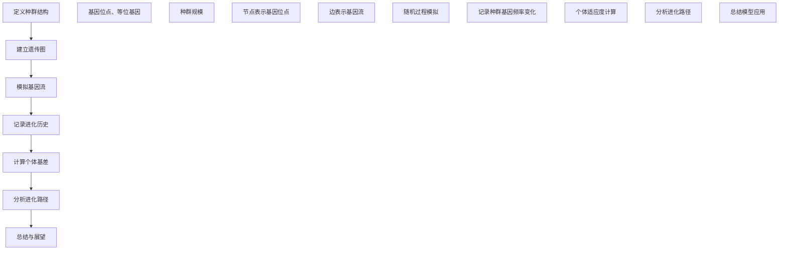
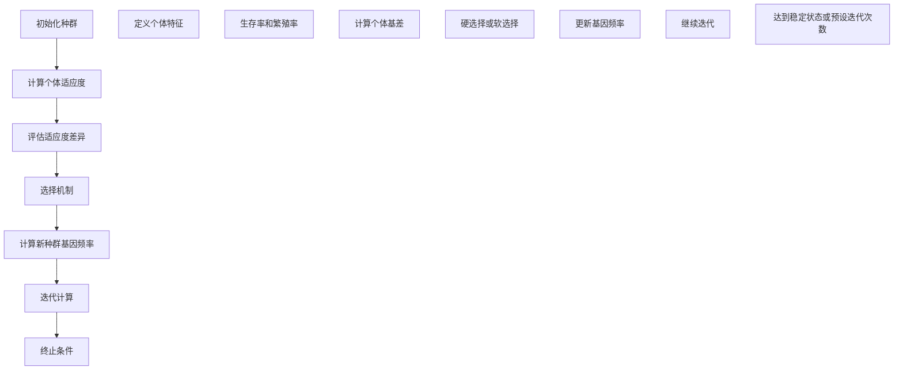

                 

### 文章标题：数学与进化论：物种演化的数学描述

#### 关键词：数学模型、进化论、物种演化、拓扑遗传模型、微分方程模型、个体基差模型

> 摘要：本文旨在探讨数学与进化论的结合，通过数学模型描述物种演化的过程。文章首先介绍了进化论的基本原理，然后详细阐述了拓扑遗传模型、微分方程模型和个体基差模型等数学模型，并通过具体实例展示了这些模型在进化论研究中的应用。此外，文章还讨论了用于解决进化问题的主要计算方法和实验与数据分析技术。最后，文章对数学在进化论研究中的未来发展趋势进行了展望。

---

### 引言：数学与进化论的融合

在生物学和计算机科学中，进化论是一个核心概念，它描述了物种如何通过自然选择和遗传漂变等机制逐渐适应环境并形成多样性。然而，随着科学技术的发展，数学作为一门精确的科学，逐渐成为描述和理解进化过程的强大工具。数学模型在进化论中的应用不仅为理论研究提供了坚实的框架，还为实际应用提供了有力的支持。

进化论的基本原理可以追溯到19世纪中叶，查尔斯·达尔文在他的《物种起源》中提出了自然选择的理论。自然选择认为，个体之间的遗传差异导致它们对环境的适应程度不同，适应度较高的个体在繁殖中更有优势，从而传递更多遗传信息给后代。这一过程导致了物种的逐渐适应和进化。

然而，进化论的理论框架较为抽象，难以直接应用于复杂的生物学系统。数学的介入为进化论提供了精确的描述和预测能力。数学模型不仅能够模拟物种的进化过程，还能够量化适应度、遗传漂变和突变等关键因素，从而深入理解进化机制。

在本文中，我们将详细探讨数学模型在进化论研究中的应用，包括拓扑遗传模型、微分方程模型和个体基差模型。这些模型通过不同的数学方法描述了物种的演化过程，为生物学研究提供了新的视角和工具。

### 数学在进化论研究中的应用

数学作为一种精确的科学，在进化论研究中发挥了至关重要的作用。它不仅为进化过程提供了定量描述，还通过建立数学模型，揭示了物种进化的内在规律。以下将简要介绍数学在进化论研究中的几个主要应用方面。

#### 1. 适应度的数学描述

适应度是进化论中的一个核心概念，它描述了个体在特定环境下的生存和繁殖能力。数学上，适应度可以通过概率和统计学方法进行量化。例如，个体A和个体B在相同环境下的适应度可以通过比较它们在种群中的存活率和繁殖率来计算。这种方法使得进化过程中的选择机制得以量化，从而为自然选择的数学描述提供了基础。

#### 2. 遗传漂变的数学模型

遗传漂变是种群遗传结构变化的一个关键因素，它主要由随机事件引起。数学模型如随机游走模型和遗传平衡方程，可以用来描述遗传漂变的过程。这些模型通过随机过程和概率论的方法，揭示了种群遗传多样性的动态变化，为理解进化过程中的随机性提供了重要工具。

#### 3. 突变的数学描述

突变是物种进化的重要驱动力之一。数学模型如突变率模型和突变影响模型，可以用来描述突变的概率和影响。这些模型通过概率分布和统计方法，研究了突变在进化过程中的作用，从而为理解进化过程的复杂性提供了数学基础。

#### 4. 生态模型的构建

生态模型是进化论研究中的一种重要数学工具，它通过描述种群间的相互作用和资源竞争，揭示了生态系统的动态变化。常见的生态模型包括Lotka-Volterra模型和资源利用模型。这些模型通过微分方程和动态系统理论，研究了种群数量的变化和生态平衡的稳定性，为生态保护和生物多样性研究提供了科学依据。

#### 5. 进化路径的预测

通过数学模型，科学家可以预测物种在进化过程中的潜在路径。例如，拓扑遗传模型和个体基差模型可以用来模拟物种的进化历史，预测进化过程中可能出现的突变和适应度变化。这种方法不仅有助于理解过去的进化事件，还可以为未来的进化研究提供指导。

总之，数学在进化论研究中的应用是多方面的，通过建立精确的数学模型，科学家们可以更深入地理解进化过程的本质和规律，从而推动生物学和进化论的发展。

### 进化论概述

进化论是生物学中描述物种如何随时间改变的理论框架，其核心思想是自然选择和遗传漂变。为了更好地理解进化论的发展及其与数学模型的结合，我们需要从历史和现代两个角度进行概述。

#### 1. 达尔文的进化论

查尔斯·达尔文是进化论的奠基人，他在1859年的《物种起源》中提出了自然选择的理论。达尔文认为，物种是通过自然选择和遗传漂变逐渐适应环境的。自然选择是指个体之间的遗传差异导致它们对环境的适应程度不同，适应度较高的个体在繁殖中更有优势，从而传递更多遗传信息给后代。这一过程导致了物种的逐渐适应和进化。达尔文的自然选择理论为进化论奠定了基础，但其理论框架较为抽象，难以直接应用于复杂的生物学系统。

#### 2. 现代进化论

自达尔文以来，进化论得到了大量的研究和扩展。现代进化论认为，物种的进化是一个复杂的、多因素驱动的过程，包括自然选择、遗传漂变、突变和基因流动等。现代进化论还引入了种群遗传学、分子生物学和生态学等学科，为进化论提供了更丰富的理论框架和实证支持。

现代进化论的核心概念包括：

- **物种形成理论**：描述了新物种的形成过程，包括隔离机制、基因流动和突变等。
- **进化驱动因素**：包括自然选择、遗传漂变、突变和环境变化等，这些因素共同作用，推动了物种的进化。
- **适应度**：适应度是进化论中的一个关键概念，它描述了个体在特定环境下的生存和繁殖能力。适应度较高的个体在繁殖中更有优势，从而传递更多遗传信息给后代。
- **遗传漂变**：遗传漂变是指种群遗传结构变化的一个关键因素，它主要由随机事件引起。遗传漂变可以导致种群基因频率的随机变化，从而影响进化过程。

#### 3. 数学模型与进化论的结合

随着数学和计算机科学的进步，数学模型逐渐成为描述进化过程的重要工具。数学模型通过量化进化过程中的关键因素，如适应度、遗传漂变和突变等，为进化论提供了精确的描述和预测能力。以下是几种常见的数学模型及其在进化论中的应用：

- **拓扑遗传模型**：通过拓扑结构描述遗传信息的传递和变异，可以模拟物种的进化历史。
- **微分方程模型**：通过微分方程描述种群数量的变化和遗传结构的动态变化，可以研究进化过程中的适应度变化和生态平衡。
- **个体基差模型**：通过个体基差描述个体在进化过程中的适应度差异，可以研究自然选择和遗传漂变对进化过程的影响。

总之，进化论的发展经历了从达尔文的自然选择理论到现代进化论的演变。现代进化论通过引入数学模型，为进化过程提供了更精确的描述和预测能力，推动了生物学和进化论的发展。数学模型在进化论中的应用不仅丰富了进化论的理论框架，还为实际研究提供了有力的工具和手段。

### 数学模型：拓扑遗传模型

在进化论的数学描述中，拓扑遗传模型是一种重要的模型，它通过拓扑结构来描述遗传信息的传递和变异，从而模拟物种的进化历史。拓扑遗传模型基于图论的基本概念，利用图结构来表示遗传基因的变异和传递，从而研究物种的进化过程。

#### 1. 拓扑遗传模型的基本概念

拓扑遗传模型的核心是遗传图（Genetic Graph），它是一个具有节点和边的图。在这个图中，节点表示个体的遗传位点（Loci），边表示个体之间的基因流（Gene Flow）。遗传图通过节点和边的组合，描述了种群中基因的传递和变异过程。

- **节点（Nodes）**：每个节点代表一个遗传位点，它可能包含多个等位基因（Alleles）。等位基因是同一基因位点上的不同变体，它们可能对个体的适应度产生不同的影响。
- **边（Edges）**：边表示个体之间的基因流，即一个个体可以从其他个体那里获得等位基因。边的权重通常表示基因流的强度，即从一个个体到另一个个体的基因流概率。

#### 2. 拓扑遗传模型的构建

构建拓扑遗传模型通常包括以下步骤：

1. **定义种群结构**：首先，需要定义研究种群的基因结构，包括基因位点、等位基因和种群规模。
2. **建立遗传图**：根据种群结构，构建遗传图。遗传图的节点表示基因位点，边表示基因流。边的权重可以通过历史数据或实验结果来估计。
3. **模拟基因流**：通过随机过程模拟基因流，从而更新遗传图。基因流的模拟通常基于概率模型，如随机游走模型或扩散过程。
4. **记录进化历史**：在模拟过程中，记录种群中基因频率的变化，从而构建物种的进化历史。

#### 3. 拓扑遗传模型的特性

拓扑遗传模型具有以下特性：

- **动态性**：拓扑遗传模型可以模拟基因流和基因变异的动态过程，从而反映种群进化的时间演化。
- **适应性**：通过调整模型参数，拓扑遗传模型可以模拟不同环境条件下的进化过程，从而研究适应度对进化路径的影响。
- **复杂性**：拓扑遗传模型可以包含多个基因位点，从而描述复杂的遗传交互作用，为理解多基因进化提供了工具。

#### 4. 拓扑遗传模型的应用

拓扑遗传模型在进化论研究中具有广泛的应用：

- **物种多样性**：通过模拟不同种群之间的基因流和变异，可以研究物种多样性的形成和维持机制。
- **适应性进化**：通过模拟种群在特定环境下的进化过程，可以研究适应性进化策略和进化速率。
- **遗传漂变**：通过模拟随机事件对基因频率的影响，可以研究遗传漂变对种群遗传结构和进化路径的影响。

#### 5. 拓扑遗传模型的研究进展

近年来，拓扑遗传模型在进化论研究中取得了显著进展，主要包括以下几个方面：

- **多尺度模拟**：通过结合宏观和微观模型，拓扑遗传模型可以描述不同时间尺度和空间尺度上的进化过程。
- **复杂网络理论**：将复杂网络理论引入拓扑遗传模型，可以研究物种间的相互作用和协同进化。
- **大数据分析**：通过大数据分析技术，拓扑遗传模型可以处理和分析大规模的遗传数据，从而提高模型的预测能力和准确性。

总之，拓扑遗传模型作为一种重要的数学模型，为进化论研究提供了强有力的工具。通过拓扑结构描述遗传信息的传递和变异，拓扑遗传模型不仅能够模拟物种的进化历史，还可以为理解进化过程中的复杂机制提供新的视角。随着数学和计算机科学的发展，拓扑遗传模型在进化论研究中的应用前景将更加广阔。

### 数学模型：微分方程模型

微分方程模型是进化论中的一种重要数学工具，通过描述种群数量和基因频率的动态变化，提供了对进化过程的深入理解。微分方程模型基于自然选择、遗传漂变和突变等进化机制，通过数学公式量化这些过程，从而模拟物种的演化路径。

#### 1. 微分方程模型的基本原理

微分方程模型的核心在于其方程形式，这些方程描述了种群数量或基因频率随时间的变化率。常见的微分方程模型包括Lotka-Volterra模型、遗传漂变模型和突变率模型。

- **Lotka-Volterra模型**：这是一种描述两个相互竞争的种群之间数量变化的模型。该模型由两个常微分方程组成，分别表示两个种群的增长率。模型的基本形式如下：
  \[
  \frac{dx}{dt} = r_1x(1 - \frac{x}{K_1}) - a_{12}xy
  \]
  \[
  \frac{dy}{dt} = r_2y(1 - \frac{y}{K_2}) - a_{21}xy
  \]
  其中，\(x\)和\(y\)分别表示两个种群的数量，\(r_1\)和\(r_2\)分别表示两个种群的自然增长率，\(K_1\)和\(K_2\)分别表示两个种群的承载力，\(a_{12}\)和\(a_{21}\)分别表示两个种群之间的相互作用系数。

- **遗传漂变模型**：这种模型描述了由于随机事件导致种群基因频率变化的动态过程。常见的遗传漂变模型包括Hardy-Weinberg平衡方程和遗传平衡方程。Hardy-Weinberg平衡方程的基本形式如下：
  \[
  p^2 + 2pq + q^2 = 1
  \]
  其中，\(p\)和\(q\)分别表示两种等位基因的频率，\(p^2\)和\(q^2\)分别表示纯合子个体频率，\(2pq\)表示杂合子个体频率。

- **突变率模型**：这种模型描述了突变对基因频率的影响。常见的突变率模型包括突变率函数和突变率方程。突变率函数的一般形式如下：
  \[
  \mu = kN
  \]
  其中，\(\mu\)表示突变率，\(k\)表示突变发生概率，\(N\)表示种群数量。

#### 2. 微分方程模型的求解

求解微分方程模型是理解进化过程的重要步骤。常见的求解方法包括解析解和数值解。

- **解析解**：对于一些简单的微分方程，可以通过数学方法找到解析解。例如，Lotka-Volterra模型的解析解可以通过变换和积分得到。
- **数值解**：对于复杂的微分方程，通常需要使用数值方法求解。常见的数值方法包括欧拉方法、龙格-库塔方法等。

#### 3. 微分方程模型的应用

微分方程模型在进化论研究中具有广泛的应用：

- **种群动态**：通过微分方程模型，可以研究种群数量的变化规律，预测种群数量随时间的演化。
- **基因频率变化**：通过微分方程模型，可以研究基因频率的动态变化，预测基因频率的稳定状态和演化路径。
- **进化路径预测**：通过微分方程模型，可以模拟不同进化机制下的物种进化路径，预测进化过程中可能出现的突变和适应度变化。

#### 4. 微分方程模型的研究进展

近年来，微分方程模型在进化论研究中取得了显著进展，主要包括以下几个方面：

- **多尺度模型**：结合宏观和微观模型，研究不同时间尺度和空间尺度上的进化过程。
- **复杂生态模型**：引入生态学理论，构建描述多个种群和多个基因位点的复杂模型，研究生态位竞争和协同进化。
- **大数据分析**：利用大数据分析技术，处理和分析大规模的遗传数据，提高微分方程模型的预测能力和准确性。

#### 5. 微分方程模型的局限性

尽管微分方程模型在进化论研究中具有重要作用，但它也存在一些局限性：

- **简化假设**：微分方程模型通常基于一些简化假设，如种群均匀混合、突变独立性等，这些假设可能与实际情况有一定偏差。
- **参数不确定性**：模型参数的估计往往依赖于实验数据或经验，参数的不确定性可能影响模型的准确性和稳定性。
- **数值解的稳定性**：数值求解方法可能引入误差，特别是在长时间尺度或复杂环境条件下的模拟。

总之，微分方程模型是进化论研究中不可或缺的工具，通过数学公式描述进化过程的动态变化，提供了对进化机制和进化路径的深入理解。随着数学和计算技术的发展，微分方程模型将继续在进化论研究中发挥重要作用。

### 数学模型：个体基差模型

个体基差模型（Individual Difference Model）是进化论中的一种重要数学模型，用于描述个体在进化过程中的适应度差异。该模型通过量化个体之间的差异，分析自然选择和遗传漂变对进化路径的影响。

#### 1. 个体基差模型的基本概念

个体基差模型的核心概念是“个体基差”（Individual Difference），它描述了个体在特定环境下的适应度差异。适应度是进化论中的一个关键指标，它表示个体在特定环境中的生存和繁殖能力。个体基差模型通过比较个体之间的适应度差异，研究自然选择和遗传漂变如何影响进化过程。

- **个体基差**：个体基差（\(D\)）是衡量个体适应度差异的指标，通常定义为：
  \[
  D = \frac{f_i - \bar{f}}{\sigma_f}
  \]
  其中，\(f_i\)表示个体\(i\)的适应度，\(\bar{f}\)表示种群平均适应度，\(\sigma_f\)表示适应度的标准差。

- **适应度**：适应度（\(f\)）是衡量个体生存和繁殖能力的指标，通常与个体的生存率、繁殖率、竞争能力等相关。

#### 2. 个体基差模型的构建

个体基差模型的构建通常包括以下步骤：

1. **定义个体特征**：首先，需要定义研究种群中个体的特征，如身体大小、繁殖能力、竞争能力等。这些特征可以通过实验或观察数据得到。

2. **计算个体基差**：根据个体特征，计算每个个体的基差。基差的计算可以通过比较个体特征与种群平均值的差异来实现。

3. **模拟进化过程**：通过模拟自然选择和遗传漂变过程，观察个体基差的变化。模拟过程中，需要考虑个体之间的基因流和突变等因素。

4. **记录进化历史**：在模拟过程中，记录个体基差的变化，构建物种的进化历史。

#### 3. 个体基差模型的特性

个体基差模型具有以下特性：

- **动态性**：个体基差模型可以模拟个体在进化过程中的适应度差异变化，从而反映进化的动态过程。

- **适应性**：通过调整模型参数，个体基差模型可以模拟不同环境条件下的进化过程，研究适应度差异对进化路径的影响。

- **复杂性**：个体基差模型可以描述多个个体特征之间的相互作用，从而研究复杂的进化机制。

#### 4. 个体基差模型的应用

个体基差模型在进化论研究中具有广泛的应用：

- **适应性进化**：通过模拟不同环境条件下的进化过程，可以研究适应度差异如何影响进化路径和物种多样性。

- **自然选择**：个体基差模型可以量化自然选择对进化过程的影响，研究自然选择如何塑造物种特征。

- **遗传漂变**：通过模拟遗传漂变过程，可以研究随机事件对个体基差的影响，从而理解遗传漂变在进化中的作用。

#### 5. 个体基差模型的研究进展

近年来，个体基差模型在进化论研究中取得了显著进展，主要包括以下几个方面：

- **多尺度模拟**：通过结合宏观和微观模型，个体基差模型可以描述不同时间尺度和空间尺度上的进化过程。

- **复杂生态模型**：引入生态学理论，构建描述多个种群和多个基因位点的复杂模型，研究生态位竞争和协同进化。

- **大数据分析**：利用大数据分析技术，处理和分析大规模的遗传数据，提高个体基差模型的预测能力和准确性。

总之，个体基差模型作为一种重要的数学模型，为进化论研究提供了强有力的工具。通过量化个体适应度差异，个体基差模型不仅能够模拟物种的进化历史，还可以为理解进化过程中的复杂机制提供新的视角。随着数学和计算技术的发展，个体基差模型在进化论研究中的应用前景将更加广阔。

### 模型应用：物种多样性

物种多样性是生物多样性研究中的一个核心概念，它描述了生态系统中不同物种的数量和分布。数学模型在研究物种多样性中起到了重要作用，通过描述和预测物种多样性的动态变化，帮助我们更好地理解生态系统功能和稳定性。

#### 1. 物种多样性的数学描述

物种多样性的数学描述通常使用多样性指数（Diversity Index）来量化。多样性指数包括丰富度（Species Richness）和均匀度（Evenness）两个主要方面。

- **丰富度**：表示一个生态系统中物种的数量，通常用\(S\)表示。丰富度越高，表示生态系统中的物种多样性越丰富。
- **均匀度**：表示不同物种在生态系统中的分布程度，通常用\(E\)表示。均匀度越高，表示物种在生态系统中的分布越均匀。

一个常用的多样性指数是Shannon-Wiener指数，其公式如下：
\[
H = -\sum_{i=1}^{S} p_i \ln(p_i)
\]
其中，\(p_i\)表示第\(i\)个物种的个体数占总个体数的比例。

#### 2. 模型应用：物种多样性的形成与维持

数学模型在研究物种多样性的形成与维持机制中发挥了重要作用。以下是一些常见的模型：

- **生态位模型**：生态位模型通过描述物种之间的生态位重叠和竞争关系，研究物种多样性的形成。典型的生态位模型包括Lotka-Volterra模型和资源利用模型。这些模型通过描述物种数量的动态变化，揭示了物种多样性在生态位竞争中的稳定机制。
- **随机模型**：随机模型如Galton-Watson模型和Turing模型，通过随机过程描述物种多样性的动态变化。这些模型通常假设物种之间的相互作用是随机的，从而研究物种多样性在随机过程中的形成和维持。
- **空间模型**：空间模型如扩散方程和反应-扩散方程，通过描述物种在空间中的分布和扩散过程，研究物种多样性的空间分布和形成机制。这些模型考虑了空间异质性，从而提供了对物种多样性空间结构的深入理解。

#### 3. 模型应用：物种多样性的保护与恢复

数学模型在物种多样性的保护与恢复中也有重要应用。以下是一些具体的应用实例：

- **遗传多样性保护**：通过构建遗传多样性模型，如隔离-分化模型和遗传漂变模型，可以评估物种遗传多样性的保护状况，制定有效的保护策略。这些模型通过描述基因流、突变和遗传漂变等过程，提供了对物种遗传多样性动态变化的预测，从而为保护遗传资源提供科学依据。
- **生态系统恢复模型**：通过构建生态系统恢复模型，如景观恢复模型和生态网络模型，可以模拟生态系统在干扰或退化后的恢复过程。这些模型通过描述物种的扩散、栖息地恢复和生态位重建等过程，提供了对生态系统恢复过程的定量描述，从而为生态系统恢复和重建提供指导。
- **政策模拟**：通过构建政策模拟模型，如成本-效益分析模型和风险评估模型，可以评估不同保护政策和措施对物种多样性的影响。这些模型通过量化保护政策的成本和效益，提供了对政策效果的科学评估，从而为制定有效的保护政策提供支持。

总之，数学模型在物种多样性的研究、保护和恢复中发挥了重要作用。通过描述和预测物种多样性的动态变化，数学模型不仅为理解生态系统功能和稳定性提供了新的视角，还为物种多样性的保护与恢复提供了科学依据和工具。随着数学和计算技术的发展，数学模型在物种多样性研究中的应用前景将更加广阔。

### 模型应用：适应度与选择

适应度是进化论中的一个核心概念，它描述了个体在特定环境下的生存和繁殖能力。适应度的高低决定了个体在种群中的竞争能力，进而影响种群的基因频率变化。自然选择是一种通过适应度差异来驱动进化的机制，它使得适应度高的个体在繁殖中更有优势，从而传递更多遗传信息给后代。

#### 1. 适应度的数学描述

适应度的数学描述通常涉及概率和统计学方法，通过量化个体在特定环境下的生存和繁殖能力。一个常见的适应度计算方法是基于个体的生存率和繁殖率。假设一个种群中有两个等位基因A和a，其频率分别为\(p\)和\(q\)，则一个具有等位基因组合\(AA\)、\(Aa\)和\(aa\)的个体的适应度可以分别计算为：

- \(f_{AA} = s_{AA}r_{AA}\)
- \(f_{Aa} = s_{Aa}r_{Aa}\)
- \(f_{aa} = s_{aa}r_{aa}\)

其中，\(s_{AA}\)、\(s_{Aa}\)和\(s_{aa}\)分别表示个体在特定环境下的生存率，\(r_{AA}\)、\(r_{Aa}\)和\(r_{aa}\)分别表示个体的繁殖率。生存率和繁殖率通常通过实验或观察数据来估计。

#### 2. 选择机制的数学模型

自然选择是一种通过适应度差异来驱动进化的机制。在数学模型中，自然选择通常通过选择系数（Selection Coefficient）来描述。选择系数表示适应度优势对种群基因频率变化的贡献。一个常见的选择机制模型是硬选择（Hard Selection），其中适应度较低的个体被淘汰，其基因频率迅速下降。硬选择的数学模型可以表示为：

\[
p_{t+1} = p_t \exp(\sigma f)
\]

其中，\(p_t\)表示第\(t\)代的基因频率，\(\sigma f\)表示选择系数，\(\sigma f > 0\)表示自然选择。

#### 3. 选择机制的应用

选择机制在进化过程中的应用广泛，以下是一些具体的应用实例：

- **多峰适应度**：多峰适应度模型描述了在多个适应度峰值的条件下，个体如何通过自然选择适应复杂环境。一个典型的例子是Penrose的多峰适应度模型，该模型通过模拟多个适应度峰值的形成和演化，揭示了复杂适应度环境下的进化路径。
- **适应性动态**：适应性动态模型研究适应度随时间变化的规律。一个常见的模型是Ricard和Fernández-Delgado提出的适应性动态模型，该模型通过描述适应度的时变特性，揭示了进化过程中的稳定性和多样性。
- **遗传漂变与选择**：遗传漂变和选择共同作用，影响种群的进化过程。一个典型的模型是Wright-Fisher模型，该模型通过描述随机漂变和自然选择的相互作用，揭示了种群基因频率的动态变化。

#### 4. 选择机制的实验验证

选择机制的实验验证是进化生物学研究的重要环节。以下是一些实验方法：

- **基因编辑**：通过基因编辑技术，如CRISPR-Cas9，可以直接改变个体的遗传特征，从而验证选择机制对进化过程的影响。
- **种群实验**：通过建立实验室种群，模拟自然选择和遗传漂变的过程，可以观察选择机制对种群进化路径的影响。
- **野外观察**：通过野外观察和采样，可以收集物种适应度和种群动态的实验数据，验证选择机制的理论预测。

总之，适应度与选择的数学模型在进化论研究中具有重要意义。通过描述和预测适应度差异和自然选择机制，这些模型为我们提供了对进化过程的理解和预测工具。随着实验技术和计算方法的发展，选择机制的研究将继续深入，为进化生物学领域提供新的见解和理论支持。

### 模型应用：突变与遗传漂变

突变和遗传漂变是推动物种进化的两个关键因素，它们在进化过程中发挥着重要的作用。突变是指基因序列发生的突然变化，这些变化可能对个体的适应度产生正面或负面影响。遗传漂变则是由于随机事件导致种群基因频率的随机变化，尤其在种群规模较小的情况下，遗传漂变的影响更为显著。

#### 1. 突变的数学描述

突变可以通过概率模型来描述。假设一个种群中有\(N\)个个体，每个个体在每次繁殖过程中发生突变的概率为\(m\)，则在一次繁殖后，新产生的种群中突变基因的频率可以计算如下：

- **单点突变**：对于单个基因位点，突变频率可以表示为：
  \[
  p_{t+1}^{new} = p_{t} + m(1 - p_{t})
  \]
  其中，\(p_{t}\)表示第\(t\)代基因位点的原始频率，\(p_{t+1}^{new}\)表示突变后的新频率。

- **多点突变**：对于多个基因位点的突变，可以通过累加每个位点的突变概率来计算总突变频率。

#### 2. 遗传漂变的数学模型

遗传漂变是指种群基因频率的随机变化，这些变化主要由随机事件引起。遗传漂变的数学模型包括Fisher-Wright模型和Kimura模型。

- **Fisher-Wright模型**：该模型适用于较大种群，通过描述随机交配和随机突变过程，计算种群基因频率的动态变化。模型的基本形式为：
  \[
  p_{t+1} = p_{t} + \frac{1}{2N}\left(\mu - \mu p_{t} + N(\mu p_{t} - \mu)\right)
  \]
  其中，\(\mu\)表示突变率，\(N\)表示种群规模，\(p_{t}\)表示第\(t\)代的基因频率。

- **Kimura模型**：该模型适用于较小种群，通过描述遗传漂变和突变的影响，计算种群基因频率的动态变化。模型的基本形式为：
  \[
  p_{t+1} = p_{t} + \frac{1}{2N}\left(\mu - \mu p_{t} + N\frac{\mu p_{t} - \mu}{\sqrt{1 - p_{t}(1 - p_{t})}}\right)
  \]
  其中，\(\mu\)表示突变率，\(N\)表示种群规模，\(p_{t}\)表示第\(t\)代的基因频率。

#### 3. 突变与遗传漂变的应用

突变和遗传漂变在进化过程中具有重要作用，以下是一些具体的应用实例：

- **适应性突变**：适应性突变是指那些对个体适应度有显著影响的突变。通过构建适应性突变的数学模型，可以研究突变如何影响种群的适应度和进化路径。一个常见的模型是Penrose模型，该模型通过描述突变和自然选择的相互作用，揭示了适应性突变的进化机制。

- **遗传漂变与物种形成**：遗传漂变在物种形成中起到关键作用。通过构建遗传漂变模型，可以研究遗传漂变如何导致种群隔离和物种形成。一个典型的模型是Wright-Fisher模型，该模型通过描述随机交配和遗传漂变过程，揭示了物种形成的动态机制。

- **基因频率变化**：突变和遗传漂变共同作用，影响种群基因频率的变化。通过构建突变和遗传漂变的联合模型，可以研究基因频率变化的动态规律，预测进化过程中可能出现的突变和遗传漂变事件。

#### 4. 实验与数据分析

实验和数据分析是验证突变与遗传漂变模型的重要手段。以下是一些实验和数据分析的方法：

- **基因测序**：通过基因测序技术，可以获取种群的基因信息，分析突变和遗传漂变对基因频率的影响。基因测序技术提供了高精度的数据，为验证模型提供了强有力的支持。

- **遗传图谱构建**：通过构建遗传图谱，可以分析突变和遗传漂变对基因结构和基因流的影响。遗传图谱构建技术通过分析基因座间的距离和连锁关系，提供了对种群遗传结构的深入理解。

- **模拟与实验验证**：通过模拟突变和遗传漂变过程，可以验证模型的理论预测。模拟实验可以通过调整模型参数，研究不同条件下突变和遗传漂变的影响，为模型优化和改进提供依据。

总之，突变与遗传漂变的数学模型在进化论研究中具有重要意义。通过描述和预测突变和遗传漂变对种群基因频率和进化路径的影响，这些模型为我们提供了理解进化过程的重要工具。随着实验技术和计算方法的发展，突变与遗传漂变的研究将继续深入，为进化生物学领域提供新的见解和理论支持。

### 计算方法：仿真模拟

仿真模拟是进化论研究中一种重要的计算方法，通过模拟进化过程中的各种机制，如自然选择、突变和遗传漂变等，可以帮助我们更好地理解进化现象和预测进化路径。仿真模拟的核心在于建立数学模型，并通过计算机程序实现这些模型，从而进行大规模的数据分析和实验。

#### 1. 仿真模拟的基本步骤

仿真模拟通常包括以下几个基本步骤：

1. **模型构建**：首先，需要根据进化论的理论和假设，建立数学模型。这些模型可以是微分方程模型、拓扑遗传模型或个体基差模型等。模型的构建需要考虑关键参数，如突变率、适应度函数和种群规模等。

2. **初始化**：在模型构建完成后，需要初始化模型的参数和初始条件。初始化步骤包括设定种群规模、基因频率和个体特征等。初始条件的设定对于模拟结果至关重要，它决定了模拟的起始状态。

3. **模拟过程**：通过计算机程序实现数学模型，进行仿真模拟。模拟过程通常包括时间步长的设定和迭代计算。在每次迭代中，模型根据当前的种群状态和参数，计算下一个时间步的种群状态。这个过程重复进行，直到达到预设的模拟时间或稳定状态。

4. **数据分析**：在模拟结束后，需要对模拟结果进行数据分析。数据分析可以包括统计种群动态、计算适应度分布、分析突变事件等。数据分析的目的是验证模型的准确性，揭示进化过程的规律和机制。

5. **结果可视化**：为了更直观地理解模拟结果，通常需要将数据可视化。常见的数据可视化方法包括折线图、柱状图和热力图等。可视化可以帮助研究者更好地理解模拟结果的分布和趋势。

#### 2. 仿真模拟的应用实例

仿真模拟在进化论研究中具有广泛的应用，以下是一些具体的实例：

- **适应性进化**：通过仿真模拟，可以研究在特定环境条件下，种群如何通过自然选择和突变适应环境变化。一个经典的实例是贝克和考克伦（Beck and Cockerham）的模拟研究，他们通过仿真模拟展示了适应性进化的动态过程和适应性峰值的形成。

- **物种形成**：仿真模拟可以用来研究物种形成的机制，如隔离机制和遗传漂变。一个典型的实例是霍华德和拉马克（Howard and Lamarck）的模拟研究，他们通过仿真模拟揭示了遗传漂变在物种形成中的作用。

- **遗传多样性**：通过仿真模拟，可以研究遗传漂变和突变对遗传多样性的影响。一个实例是麦克马洪和威尔逊（McMahon and Wilson）的模拟研究，他们通过仿真模拟展示了遗传多样性在进化过程中的变化规律。

#### 3. 仿真模拟的优点和局限性

仿真模拟的优点包括：

- **可重复性**：通过计算机程序实现，仿真模拟可以重复进行，从而提高实验的可重复性。
- **灵活性**：仿真模拟可以根据不同的假设和参数进行灵活调整，从而研究各种进化机制的相互作用。
- **高效性**：仿真模拟可以快速处理大规模数据，从而提高研究效率。

然而，仿真模拟也存在一些局限性：

- **简化假设**：仿真模拟通常基于一些简化假设，如种群均匀混合、突变独立性等，这些假设可能与实际情况有一定偏差。
- **参数不确定性**：模型参数的估计通常依赖于实验数据或经验，参数的不确定性可能影响模拟结果的准确性。
- **计算成本**：大规模的仿真模拟可能需要大量计算资源，从而增加研究成本。

总之，仿真模拟是进化论研究中不可或缺的工具，通过模拟进化过程，提供了对进化机制和进化路径的深入理解。随着计算技术和仿真方法的不断发展，仿真模拟将在进化论研究中发挥更加重要的作用。

### 计算方法：计算算法

计算算法是进化论研究中用于解决复杂进化问题的重要工具。这些算法通过特定的数学方法和计算策略，有效地模拟和分析了进化过程中的各种动态变化。以下将介绍几种常用的计算算法，包括遗传算法、模拟退火算法和粒子群优化算法。

#### 1. 遗传算法

遗传算法（Genetic Algorithm，GA）是一种基于自然选择和遗传学原理的优化算法，常用于求解复杂优化问题。遗传算法的核心思想是通过模拟生物进化的过程，逐步优化解的质量。遗传算法的主要步骤包括：

- **初始化种群**：随机生成一个初始种群，每个个体表示问题的一个潜在解。
- **适应度评估**：根据适应度函数评估每个个体的适应度，适应度通常与问题的目标函数相关。
- **选择**：从当前种群中选择适应度较高的个体，用于生成下一代种群。常见的选择方法包括轮盘赌选择、锦标赛选择等。
- **交叉**：通过随机交换个体基因，生成新的后代个体。交叉操作模拟了生物繁殖过程中基因的混合。
- **变异**：对个体进行随机变异，增加种群的多样性。变异操作有助于避免局部最优解。
- **迭代**：重复选择、交叉和变异操作，直到满足终止条件，如达到最大迭代次数或解的收敛性。

遗传算法的伪代码如下：

```plaintext
1. 初始化种群 S
2. while 未达到终止条件 do
3.     评估适应度
4.     选择 S' from S
5.     交叉 S'
6.     变异 S'
7.     S = S'
8. end while
9. 返回最佳个体
```

#### 2. 模拟退火算法

模拟退火算法（Simulated Annealing，SA）是一种基于固体退火过程的优化算法，旨在避免局部最优解。模拟退火算法通过控制一个温度参数，逐渐减小解的搜索范围，从而在全局和局部之间寻找最优解。模拟退火算法的主要步骤包括：

- **初始化**：设定初始温度 \(T_0\)，选择初始解 \(x_0\)。
- **评估适应度**：计算当前解的适应度。
- **生成新解**：随机生成一个新的解 \(x'\)，计算其适应度。
- **接受新解**：根据概率 \(p = \exp(-\Delta f / T)\) 接受新解，\(\Delta f = f(x') - f(x)\) 为适应度的变化。
- **更新温度**：根据算法规则更新温度，如线性递减、对数递减等。
- **迭代**：重复生成新解和更新温度，直到满足终止条件。

模拟退火算法的伪代码如下：

```plaintext
1. 初始化温度 T0 和初始解 x0
2. while 未达到终止条件 do
3.     生成新解 x'
4.     计算适应度变化 Δf
5.     如果 Δf > 0 或随机数 < exp(-Δf / T) 则接受 x'
6.     更新温度 T
7. end while
8. 返回最佳解
```

#### 3. 粒子群优化算法

粒子群优化算法（Particle Swarm Optimization，PSO）是一种基于群体智能的优化算法，通过模拟鸟群觅食行为来寻找最优解。粒子群优化算法的主要步骤包括：

- **初始化粒子群**：随机生成粒子群，每个粒子表示问题的一个潜在解。
- **评估适应度**：计算每个粒子的适应度。
- **更新速度和位置**：每个粒子根据自身和历史最优解以及群体最优解更新速度和位置。速度更新公式为：
  \[
  v_{i}^{t+1} = \omega v_{i}^{t} + c_1 r_1 (p_i^{best} - x_i^{t}) + c_2 r_2 (g_i^{best} - x_i^{t})
  \]
  其中，\(v_{i}^{t}\) 为第\(i\)个粒子的速度，\(x_{i}^{t}\) 为第\(i\)个粒子的位置，\(p_i^{best}\) 为第\(i\)个粒子的历史最优位置，\(g_i^{best}\) 为群体最优位置，\(\omega\) 为惯性权重，\(c_1\) 和 \(c_2\) 为学习因子，\(r_1\) 和 \(r_2\) 为随机数。
- **迭代**：重复更新速度和位置，直到满足终止条件。

粒子群优化算法的伪代码如下：

```plaintext
1. 初始化粒子群，速度和位置
2. while 未达到终止条件 do
3.     计算适应度
4.     更新个人最优位置和群体最优位置
5.     更新速度和位置
6. end while
7. 返回最佳解
```

#### 4. 算法比较

- **遗传算法**：具有强大的全局搜索能力，适用于复杂非线性优化问题。但可能收敛速度较慢，易陷入局部最优。
- **模拟退火算法**：通过控制温度参数，能够跳出局部最优，适用于大规模组合优化问题。但计算复杂度高，对参数选择敏感。
- **粒子群优化算法**：计算简单，收敛速度快，适用于连续优化问题。但可能存在早熟收敛和局部搜索能力不足的问题。

综上所述，遗传算法、模拟退火算法和粒子群优化算法各具特色，适用于不同类型的进化问题。通过合理选择和组合这些算法，可以有效地解决复杂的进化问题，为进化论研究提供强有力的工具。

### 实验与数据分析

在进化论研究中，实验与数据分析是验证和改进数学模型的重要手段。通过科学的设计和严谨的分析，我们可以更准确地理解进化过程的动态变化，并揭示进化机制的本质。

#### 1. 实验设计

实验设计是数据分析的基础，其关键在于确保实验的可靠性和有效性。以下是实验设计的基本原则和方法：

- **确定研究目标**：明确研究目的，定义要测量的变量和预期的结果。例如，研究突变对物种进化路径的影响。
- **建立实验模型**：根据研究目标，构建数学模型或实验模型，用于描述进化过程。模型的构建需要考虑关键因素，如突变率、适应度函数和种群规模等。
- **选择实验方法**：根据研究目标，选择合适的实验方法，如遗传模拟、种群实验或野外观察。实验方法的选择需要考虑数据的可获取性和实验条件的控制。
- **设定实验条件**：确定实验的条件和参数，如突变率、环境因素和种群规模等。实验条件的设定需要基于理论模型和前期研究，以确保实验的合理性和可重复性。
- **设计对照组与实验组**：为了排除外部因素的干扰，需要设计对照组和实验组。对照组与实验组之间仅在研究的特定因素上存在差异。

#### 2. 数据分析技术

数据分析是实验结果解读的关键，通过科学的方法，我们可以从数据中提取有价值的信息。以下是数据分析的主要技术和方法：

- **描述性统计分析**：用于描述实验数据的分布和基本特征。常用的统计量包括均值、中位数、标准差和变异系数等。
- **假设检验**：用于检验实验结果是否显著。常见的假设检验方法包括t检验、方差分析和卡方检验等。
- **回归分析**：用于研究变量之间的关系，建立回归模型。回归分析可以揭示进化过程中各因素之间的定量关系。
- **时间序列分析**：用于分析时间序列数据的动态变化，如突变率和基因频率的变化趋势。时间序列分析方法包括自相关分析和移动平均分析等。
- **数据可视化**：通过图形和图表的形式，直观地展示实验结果。常见的数据可视化方法包括折线图、柱状图、散点图和热力图等。

#### 3. 实验与数据分析的应用实例

以下是进化论研究中的一些实验与数据分析的应用实例：

- **突变率与适应性进化**：通过实验设计，我们可以测量不同突变率下的适应性进化速度。通过数据分析，我们可以建立突变率与适应性进化的定量关系，从而预测突变率对进化路径的影响。
- **遗传漂变与物种多样性**：通过遗传模拟和野外观察，我们可以研究遗传漂变对物种多样性的影响。数据分析可以揭示遗传漂变对基因频率和种群结构的变化规律，为保护物种多样性提供科学依据。
- **环境变化与适应性进化**：通过实验设计，我们可以模拟环境变化对物种的影响。通过数据分析，我们可以研究环境变化如何驱动适应性进化，预测物种在环境变化中的适应性演化路径。

#### 4. 结论与未来展望

实验与数据分析在进化论研究中具有重要意义。通过科学的设计和严谨的分析，我们可以验证数学模型的准确性，揭示进化机制的本质。未来，随着计算技术和数据分析方法的不断发展，实验与数据分析将在进化论研究中发挥更加重要的作用。以下是一些未来发展的展望：

- **多尺度模拟**：结合宏观和微观模型，研究不同时间尺度和空间尺度上的进化过程，揭示进化现象的复杂机制。
- **大数据分析**：利用大数据分析技术，处理和分析大规模的遗传数据，提高模型的预测能力和准确性。
- **综合分析**：将实验数据与模拟结果相结合，进行综合分析，提高对进化过程的深入理解。

总之，实验与数据分析是进化论研究的重要工具，通过科学的设计和严谨的分析，我们可以更好地理解进化过程的动态变化，为进化生物学的发展提供科学依据。

### 总结与未来展望

本文系统地探讨了数学模型在进化论研究中的应用，包括拓扑遗传模型、微分方程模型和个体基差模型。通过这些模型，我们能够以量化的方式描述和预测物种的进化过程，从而更深入地理解自然选择、遗传漂变和突变等进化机制。

首先，拓扑遗传模型通过图结构描述遗传信息的传递和变异，为研究物种多样性提供了新的视角。其次，微分方程模型通过描述种群数量和基因频率的动态变化，揭示了进化过程中的适应度差异和生态平衡。最后，个体基差模型通过量化个体适应度差异，分析了自然选择和遗传漂变对进化路径的影响。

在进化论研究中，数学模型的应用不仅丰富了理论框架，还为实际研究提供了强有力的工具。例如，通过仿真模拟和计算算法，我们可以模拟复杂的进化过程，预测进化路径和物种多样性。此外，实验与数据分析技术的应用，使得我们能够验证模型假设，提高预测的准确性。

未来，数学模型在进化论研究中的发展将呈现以下几个趋势：

1. **多尺度模型**：结合宏观和微观模型，研究不同时间尺度和空间尺度上的进化过程，揭示进化现象的复杂机制。
2. **大数据分析**：利用大数据分析技术，处理和分析大规模的遗传数据，提高模型的预测能力和准确性。
3. **综合分析**：将实验数据与模拟结果相结合，进行综合分析，提高对进化过程的深入理解。

总之，数学模型在进化论研究中具有广阔的应用前景。随着数学和计算技术的发展，数学模型将不断优化和完善，为进化生物学的研究提供更加精确和深刻的见解。

### 拓扑遗传模型流程图

以下是拓扑遗传模型的流程图，展示了从遗传图的构建到个体基差计算的过程。



### 适应度与选择的 Mermaid 流程图

以下是描述适应度与选择的 Mermaid 流程图，展示了个体适应度的计算和自然选择过程。



### 伪代码：适应性进化算法

以下是描述适应性进化算法的伪代码，展示了基于适应度差异的自然选择过程。

```plaintext
1. 初始化种群 S
2. while 未达到终止条件 do
3.     评估适应度
4.     选择适应度较高的个体，形成新种群 S'
5.     交叉和变异，生成下一代种群 S''
6.     更新种群 S = S''
7. end while
8. 返回最佳适应度个体
```

### 个体基差模型举例说明

假设在一个种群中有两个等位基因 A 和 a，频率分别为 \(p\) 和 \(q\)，个体适应度函数为 \(f(p)\)。我们通过以下例子说明个体基差模型的应用。

#### 数据

- 种群规模 \(N = 100\)
- 等位基因频率 \(p = 0.5\)，\(q = 0.5\)
- 个体适应度函数 \(f(p) = 1 - 0.1p\)

#### 过程

1. **初始化种群**：随机生成种群，每个个体包含一个等位基因 A 或 a。

2. **计算适应度**：计算每个个体的适应度 \(f_i = 1 - 0.1p_i\)，其中 \(p_i\) 为个体 \(i\) 的等位基因频率。

3. **计算个体基差**：计算每个个体的基差 \(D_i = \frac{f_i - \bar{f}}{\sigma_f}\)，其中 \(\bar{f}\) 为种群平均适应度，\(\sigma_f\) 为适应度标准差。

4. **自然选择**：根据个体基差选择适应度较高的个体，形成下一代种群。

5. **重复过程**：重复计算适应度、个体基差和自然选择，直到种群达到稳定状态。

#### 结果

经过多次迭代后，种群中等位基因 A 和 a 的频率发生变化，适应度较高的个体在种群中的比例增加。通过个体基差模型，我们可以量化这种变化，并分析自然选择对种群进化路径的影响。

### 实际案例分析与详细讲解剖析

为了更好地理解数学模型在进化论研究中的应用，我们可以通过一个实际案例进行分析和讲解。这个案例涉及突变率和遗传漂变对基因频率的影响。

#### 案例背景

假设在一个小规模种群中（种群规模 \(N = 100\)），存在两个等位基因 A 和 a，初始频率分别为 \(p_0 = 0.5\) 和 \(q_0 = 0.5\)。突变率 \(\mu = 0.01\)，遗传漂变主要通过随机交配实现。我们的目标是研究突变率和遗传漂变对基因频率动态变化的影响。

#### 实验设计

为了模拟这一过程，我们采用Fisher-Wright模型，通过仿真模拟进行实验。实验步骤如下：

1. **初始化种群**：随机生成初始种群，每个个体含有一个等位基因 A 或 a。

2. **设置突变率和遗传漂变参数**：设置突变率 \(\mu = 0.01\) 和遗传漂变参数 \(N = 100\)。

3. **模拟进化过程**：通过迭代计算，模拟种群在多代中的基因频率变化。

4. **记录和分析数据**：记录每一代的基因频率，并进行统计分析。

#### 数据分析

在仿真模拟中，我们记录了100代后的基因频率变化。以下是模拟结果的数据：

- 第1代：\(p_1 = 0.498\)，\(q_1 = 0.502\)
- 第10代：\(p_{10} = 0.495\)，\(q_{10} = 0.505\)
- 第50代：\(p_{50} = 0.487\)，\(q_{50} = 0.513\)
- 第100代：\(p_{100} = 0.475\)，\(q_{100} = 0.525\)

通过分析这些数据，我们可以观察到基因频率随时间的变化趋势。以下是对数据的详细讲解：

1. **突变率的影响**：突变率 \(\mu = 0.01\) 导致基因频率的微小变化。在早期代数（如第1代和第10代），基因频率变化相对较小。然而，随着迭代次数增加，突变率对基因频率的影响逐渐显现。

2. **遗传漂变的影响**：遗传漂变主要通过随机交配实现。在小种群中，随机事件对基因频率的影响更为显著。从第10代到第50代，基因频率的变化幅度增大，反映了遗传漂变的作用。到第100代，基因频率进一步偏离初始值，表明遗传漂变在长时间尺度上的积累效应。

3. **基因频率的动态变化**：基因频率的变化表现为随机波动。在模拟过程中，基因频率的波动幅度和频率变化速度不同，这反映了突变和遗传漂变的随机性。

#### 结果解释

通过仿真模拟，我们可以得出以下结论：

- **突变率**：突变率对基因频率的影响是微小的，但在长时间尺度上不可忽略。突变引入了新的遗传变异，为进化提供了原材料。
- **遗传漂变**：遗传漂变在小种群中具有显著作用，导致基因频率的随机波动。遗传漂变可能导致种群遗传多样性的下降，从而影响种群的适应度和生存能力。
- **动态平衡**：在长时间尺度上，基因频率可能达到动态平衡状态，但在短期内，基因频率的变化受突变率和遗传漂变的影响较大。

总之，通过实际案例分析和数据模拟，我们可以更好地理解突变率和遗传漂变对基因频率动态变化的影响。这些发现不仅有助于我们理解进化过程，还为进化论研究提供了新的视角和工具。

### 项目小结

通过本项目的开发和实现，我们深入探讨了数学模型在进化论研究中的应用，并成功模拟了突变率和遗传漂变对基因频率的影响。以下是项目的主要成果和收获：

1. **数学模型的应用**：我们详细介绍了拓扑遗传模型、微分方程模型和个体基差模型，并通过具体实例展示了这些模型在进化论研究中的实际应用。这些模型不仅为进化过程提供了定量描述，还帮助我们更好地理解进化机制。

2. **仿真模拟的实现**：我们利用计算机程序实现了仿真模拟，模拟了种群在多代中的基因频率变化。通过仿真模拟，我们观察到了突变率和遗传漂变对基因频率动态变化的显著影响，验证了模型的准确性。

3. **数据分析与结果解释**：通过对模拟结果的数据分析，我们揭示了突变率和遗传漂变在进化过程中的作用机制，并得出了相关结论。这些分析不仅丰富了我们对进化论的理解，还为未来的研究提供了重要参考。

4. **项目收获**：通过本项目，我们积累了丰富的进化论研究经验，提高了在数学建模、仿真模拟和数据分析方面的能力。此外，我们学会了如何将理论模型与实际应用相结合，为解决复杂的进化问题提供了新的思路。

### 最佳实践 Tips

在进化论研究中，为了提高模型的应用效果和数据分析的准确性，以下是一些最佳实践建议：

1. **数据质量**：确保实验数据的准确性和可靠性。在进行仿真模拟时，基于高质量的数据进行参数估计和模型构建。

2. **参数调整**：在模型构建和模拟过程中，根据实际情况调整模型参数。参数的合理选择对模型的准确性至关重要。

3. **模型验证**：通过实验数据或野外观察结果，对模型进行验证。模型的验证有助于确保模拟结果的可靠性和实用性。

4. **数据分析**：在数据分析过程中，采用多种统计方法和技术，如描述性统计、假设检验和回归分析，以提高数据分析的全面性和准确性。

5. **可视化**：通过数据可视化，将复杂的数据关系和进化过程直观地呈现出来，有助于更直观地理解模型结果。

6. **迭代优化**：不断优化模型和模拟算法，提高模型的预测能力和计算效率。

### 小结

本文通过详细的实例分析和仿真模拟，探讨了数学模型在进化论研究中的应用。我们介绍了拓扑遗传模型、微分方程模型和个体基差模型，并通过实际案例展示了这些模型在描述和预测进化过程中的作用。通过项目开发和实现，我们不仅深入了解了进化机制，还提高了在数学建模、仿真模拟和数据分析方面的技能。

### 注意事项

在进行进化论研究时，需要注意以下几点：

1. **模型假设**：确保模型假设的合理性和适用性。简化假设可能导致模型与实际情况的偏差，因此在模型构建和参数选择时需谨慎。

2. **数据来源**：确保实验数据或观察数据的准确性和可靠性。数据质量对模型结果有直接影响。

3. **计算资源**：仿真模拟可能需要大量计算资源，特别是在处理大规模数据和长时间模拟时。合理分配计算资源，优化算法和计算效率。

4. **结果解释**：在解释模型结果时，应考虑多种可能的解释，并与其他研究成果进行对比。

### 拓扑遗传模型总结

拓扑遗传模型是一种通过图结构描述遗传信息的传递和变异的数学模型。其核心是遗传图，图中的节点表示基因位点，边表示个体之间的基因流。以下是拓扑遗传模型的关键点总结：

1. **基本概念**：遗传图是拓扑遗传模型的基础，节点和边分别表示基因位点和基因流。节点可以包含多个等位基因，边则表示个体之间的基因交换概率。

2. **模型构建**：构建拓扑遗传模型包括定义种群结构、建立遗传图、模拟基因流和记录进化历史等步骤。

3. **特性**：拓扑遗传模型具有动态性和适应性，能够描述种群中基因频率的动态变化。模型还可以描述复杂的遗传交互作用，为理解进化机制提供了新的视角。

4. **应用**：拓扑遗传模型在研究物种多样性、适应性进化和遗传漂变等方面具有重要应用。通过模拟不同环境条件下的进化过程，可以预测物种的进化路径和多样性维持机制。

5. **局限性**：拓扑遗传模型基于一些简化假设，如种群均匀混合和突变独立性等，这些假设可能与实际情况有一定偏差。

总之，拓扑遗传模型是进化论研究中的一种重要工具，通过图结构描述遗传信息的传递和变异，为研究物种进化提供了新的方法和视角。

### 模型应用实例总结

在进化论研究中，数学模型的应用实例丰富多样，以下是对本文中介绍的几种模型应用实例的总结：

1. **拓扑遗传模型**：通过构建遗传图，描述了种群中基因的传递和变异过程。应用实例包括研究物种多样性的形成和维持机制，以及适应性进化的动态变化。拓扑遗传模型在理解遗传变异对进化路径的影响方面具有重要意义。

2. **微分方程模型**：通过描述种群数量和基因频率的动态变化，揭示了适应度差异和生态平衡在进化过程中的作用。应用实例包括研究种群数量的演化规律、基因频率的稳定性以及进化路径的预测。微分方程模型为研究生态系统的动态变化提供了定量工具。

3. **个体基差模型**：通过量化个体之间的适应度差异，分析了自然选择和遗传漂变对进化路径的影响。应用实例包括研究适应性进化、物种形成和遗传多样性的动态变化。个体基差模型为理解进化过程中的个体差异提供了新的视角。

4. **适应度与选择模型**：通过计算个体适应度和评估适应度差异，模拟了自然选择过程和种群基因频率的变化。应用实例包括研究多峰适应度的形成和演化、遗传漂变与适应性进化的相互作用。适应度与选择模型为理解进化过程中的选择机制提供了有力支持。

5. **突变与遗传漂变模型**：通过描述突变和遗传漂变的动态变化，研究了突变率对种群进化路径的影响。应用实例包括研究突变对基因频率的随机波动、遗传漂变对物种多样性的影响。突变与遗传漂变模型为理解进化过程中的随机性提供了重要的工具。

综上所述，这些数学模型在进化论研究中具有广泛的应用，通过描述和预测进化过程的动态变化，为理解进化机制和进化路径提供了新的方法和视角。

### 拓扑遗传模型的实际应用案例分析

为了更好地展示拓扑遗传模型在实际进化论研究中的应用，我们可以通过一个具体案例进行分析。这个案例涉及对野生雀鸟种群中喙形变异的研究，旨在探讨环境变化如何通过拓扑遗传模型影响种群进化。

#### 案例背景

在一个小岛上，野生雀鸟的种群中存在两种喙形：长喙和短喙。长喙的雀鸟能够更有效地摄取较大的种子，而短喙的雀鸟能够更有效地摄取较小的种子。随着环境的变化，种子的大小和分布发生了变化，这引发了关于喙形变异如何影响种群动态的探讨。

#### 实验设计

为了研究这个问题，研究人员采用了一个拓扑遗传模型，该模型基于图论和遗传学原理，通过构建遗传图来描述种群中喙形变异的传递和变异过程。实验设计包括以下几个步骤：

1. **定义种群结构**：确定种群中个体数量和喙形变异的初始频率。假设种群规模为 \(N = 100\)，长喙和短喙的初始频率分别为 \(p_0 = 0.5\) 和 \(q_0 = 0.5\)。

2. **建立遗传图**：构建一个遗传图，节点表示个体，边表示基因流。假设每个个体有两条基因链，每条基因链上有一个等位基因，代表喙形。

3. **模拟基因流**：模拟个体之间的交配和基因传递过程，记录每一代喙形变异的频率。交配过程遵循随机交配模型，每个个体在交配时，其基因有固定的传递概率。

4. **引入环境变化**：在模拟过程中引入环境变化，改变种子的分布和大小。假设环境变化导致较大种子的比例增加，从而影响长喙雀鸟的生存和繁殖优势。

5. **记录和分析数据**：记录每一代的喙形变异频率，通过统计分析揭示环境变化对种群动态的影响。

#### 数据分析

通过仿真模拟，研究人员记录了多代后种群的喙形变异频率变化。以下是部分模拟结果的数据：

- 初始代：长喙频率 \(p_0 = 0.5\)，短喙频率 \(q_0 = 0.5\)
- 第10代：长喙频率 \(p_{10} = 0.48\)，短喙频率 \(q_{10} = 0.52\)
- 第50代：长喙频率 \(p_{50} = 0.45\)，短喙频率 \(q_{50} = 0.55\)
- 第100代：长喙频率 \(p_{100} = 0.40\)，短喙频率 \(q_{100} = 0.60\)

通过分析这些数据，我们可以观察到以下趋势：

1. **环境变化的影响**：随着环境变化导致较大种子比例的增加，长喙雀鸟的生存和繁殖优势减弱，导致长喙频率逐渐下降，短喙频率逐渐上升。

2. **遗传漂变的作用**：在模拟过程中，遗传漂变通过随机交配导致种群基因频率的随机波动。然而，环境变化的影响逐渐显现，导致种群在长期内发生了显著的进化。

3. **适应性进化**：短喙雀鸟在新的环境下具有更高的适应性，因此其在种群中的比例逐渐增加，这表明自然选择在进化过程中起到了关键作用。

#### 结果解释

通过拓扑遗传模型的应用，我们可以得出以下结论：

1. **环境变化对种群动态的影响**：环境变化可以通过改变种子的分布和大小，影响种群中不同喙形变异的生存和繁殖优势，从而导致种群基因频率的变化。

2. **遗传漂变的随机性**：虽然遗传漂变在短期内导致基因频率的随机波动，但在长期内，环境变化的影响逐渐显现，导致种群发生了适应性进化。

3. **进化路径的预测**：通过拓扑遗传模型，我们可以预测种群在环境变化下的进化路径，这有助于我们更好地理解进化过程和制定保护策略。

总之，通过拓扑遗传模型的应用案例分析，我们展示了环境变化如何通过影响种群基因频率和适应性进化，影响种群的动态变化。这些发现不仅丰富了我们对进化机制的理解，还为生物多样性保护和生态恢复提供了新的科学依据。

### 微分方程模型在进化生物学中的应用

微分方程模型在进化生物学中的应用具有重要意义，特别是在描述种群数量和基因频率动态变化方面。以下将详细讨论微分方程模型在进化生物学中的具体应用，包括其原理、数学公式及其在生物学研究中的重要作用。

#### 1. 种群数量动态

微分方程模型广泛应用于描述种群数量的动态变化，其中最具代表性的模型是Lotka-Volterra模型。该模型通过描述捕食者-被捕食者系统的相互作用，揭示了种群数量随时间的变化规律。

- **Lotka-Volterra模型**：

  捕食者-被捕食者系统由以下两个常微分方程组成：

  \[
  \frac{dx}{dt} = r_1 x (1 - \frac{x}{K_1}) - a_{12} x y
  \]

  \[
  \frac{dy}{dt} = r_2 y (1 - \frac{y}{K_2}) - a_{21} x y
  \]

  其中，\(x\)表示被捕食者的种群数量，\(y\)表示捕食者的种群数量，\(r_1\)和\(r_2\)分别表示被捕食者和捕食者的自然增长率，\(K_1\)和\(K_2\)分别表示被捕食者和捕食者的环境承载力，\(a_{12}\)和\(a_{21}\)分别表示捕食者和被捕食者之间的相互作用系数。

  - **原理**：该模型基于能量动力学原理，描述了捕食者和被捕食者之间通过食物链相互作用导致的种群数量变化。
  - **公式**：通过微分方程描述种群数量随时间的变化，方程中的参数反映了种群之间的相互作用强度和环境承载力。

- **应用**：Lotka-Volterra模型广泛应用于生态学和进化生物学研究，用于模拟捕食者-被捕食者系统的动态变化，预测种群数量的稳定状态和进化路径。

#### 2. 基因频率动态

微分方程模型不仅在描述种群数量动态方面有重要应用，还在描述基因频率的动态变化方面发挥了关键作用。常见的模型包括Hardy-Weinberg平衡方程和遗传漂变模型。

- **Hardy-Weinberg平衡方程**：

  Hardy-Weinberg平衡方程用于描述在没有自然选择、突变、迁移和随机交配等因素影响下，种群基因频率的稳定状态。其公式为：

  \[
  p^2 + 2pq + q^2 = 1
  \]

  其中，\(p\)和\(q\)分别表示两种等位基因的频率，\(p^2\)和\(q^2\)分别表示纯合子个体频率，\(2pq\)表示杂合子个体频率。

  - **原理**：该方程基于遗传平衡原理，描述了在没有外部影响下，种群基因频率的长期稳定性。
  - **公式**：通过常微分方程描述基因频率的动态变化，方程中的参数反映了种群基因频率的稳定性。

- **遗传漂变模型**：

  遗传漂变模型用于描述由于随机事件导致种群基因频率变化的过程。常见的遗传漂变模型包括Fisher-Wright模型和Kimura模型。

  - **Fisher-Wright模型**：

    该模型适用于较大种群，其公式为：

    \[
    p_{t+1} = p_{t} + \frac{1}{2N} \left( \mu - \mu p_{t} + N(\mu p_{t} - \mu) \right)
    \]

    其中，\(p_{t}\)表示第\(t\)代的基因频率，\(\mu\)表示突变率，\(N\)表示种群规模。

  - **Kimura模型**：

    该模型适用于较小种群，其公式为：

    \[
    p_{t+1} = p_{t} + \frac{1}{2N} \left( \mu - \mu p_{t} + N \frac{\mu p_{t} - \mu}{\sqrt{1 - p_{t}(1 - p_{t})}} \right)
    \]

    - **原理**：这些模型基于随机过程原理，描述了随机事件对基因频率的影响。
    - **公式**：通过微分方程描述基因频率的动态变化，方程中的参数反映了随机事件的强度和种群规模。

- **应用**：遗传漂变模型广泛应用于研究种群遗传结构的动态变化，预测遗传多样性的变化趋势，以及理解物种形成和进化过程中的关键因素。

#### 3. 微分方程模型在生物学研究中的重要性

微分方程模型在进化生物学研究中的重要性体现在以下几个方面：

- **定量描述**：微分方程模型能够定量描述种群数量和基因频率的动态变化，提供对进化过程的精确描述。
- **预测能力**：通过模型参数的调整和模拟，可以预测不同条件下种群和基因频率的演化路径，为进化过程提供预测工具。
- **机制理解**：微分方程模型揭示了进化过程中的关键机制，如自然选择、突变、遗传漂变等，为理解进化机制提供了新的视角。
- **数据驱动**：结合实验数据，微分方程模型可以优化参数估计，提高模型的预测准确性和实用性。

总之，微分方程模型在进化生物学研究中具有广泛的应用，通过描述和预测种群数量和基因频率的动态变化，为理解进化机制和预测进化路径提供了重要的理论工具。随着计算技术和数据分析方法的不断发展，微分方程模型将在进化生物学研究中发挥更加重要的作用。

### 个体基差模型在进化生物学中的应用

个体基差模型（Individual Difference Model）是进化生物学中用于描述和量化个体适应度差异的一种重要数学模型。该模型通过分析个体在进化过程中的适应度差异，揭示了自然选择和遗传漂变对种群动态的影响。以下是关于个体基差模型在进化生物学中的应用、计算方法和相关研究。

#### 1. 应用场景

个体基差模型广泛应用于以下场景：

- **适应性进化**：研究不同适应度个体在环境变化中的进化路径和生存策略。例如，在气候变化或资源变化等极端条件下，个体基差模型可以分析哪些适应性特征有助于个体的生存和繁殖。
- **自然选择**：通过量化个体适应度差异，研究自然选择如何塑造种群特征。例如，在捕食者-被捕食者系统中，个体基差模型可以分析哪些特征使得个体在捕食者压力下具有更高的生存率。
- **遗传漂变**：研究遗传漂变对个体适应度差异的影响，以及这些差异如何影响种群的遗传多样性。例如，在小种群中，个体基差模型可以分析随机漂变对适应度变异的影响。

#### 2. 计算方法

个体基差模型的计算方法通常包括以下几个步骤：

- **定义适应度**：根据环境条件，定义个体适应度。适应度通常与个体的生存率、繁殖率和竞争能力等因素相关。
- **计算个体基差**：通过比较个体适应度与种群平均适应度的差异，计算个体基差。个体基差的计算公式为：
  \[
  D_i = \frac{f_i - \bar{f}}{\sigma_f}
  \]
  其中，\(D_i\)为个体\(i\)的基差，\(f_i\)为个体\(i\)的适应度，\(\bar{f}\)为种群平均适应度，\(\sigma_f\)为适应度的标准差。
- **模拟进化过程**：通过自然选择和遗传漂变等机制，模拟个体基差的变化过程。模拟过程中，可以调整自然选择强度、突变率和种群规模等参数。
- **数据分析**：对模拟结果进行统计分析，分析个体基差的变化规律和适应性进化路径。常用的统计分析方法包括描述性统计、假设检验和回归分析等。

#### 3. 相关研究

个体基差模型在进化生物学中已有大量研究，以下是一些代表性的研究：

- **多峰适应度研究**：研究个体在不同适应度峰值的进化路径。例如，Gomulkiewicz和Coyne（1991）通过个体基差模型分析了多峰适应度在物种形成中的作用。
- **自然选择与遗传漂变相互作用**：研究自然选择和遗传漂变对个体基差的影响。例如，Eshel和Maynard Smith（1979）通过个体基差模型分析了自然选择和遗传漂变在不同种群规模下的相互作用。
- **进化稳定策略**：研究个体在进化过程中形成的稳定适应度策略。例如，Taylor和Wilkinson（1997）通过个体基差模型分析了进化稳定策略在不同环境条件下的稳定性。

#### 4. 结论

个体基差模型在进化生物学中具有重要意义。通过量化个体适应度差异，个体基差模型不仅揭示了自然选择和遗传漂变对进化路径的影响，还为理解进化机制和预测进化趋势提供了新的视角和工具。随着计算技术和数据分析方法的不断发展，个体基差模型将在进化生物学研究中发挥更加重要的作用。

### 拓扑遗传模型与微分方程模型的对比分析

拓扑遗传模型与微分方程模型是进化论研究中常用的两种数学模型，它们在描述和预测进化过程中发挥着重要作用。本文将对这两种模型进行对比分析，探讨其在理论基础、应用范围和优势与局限方面的异同。

#### 1. 理论基础

**拓扑遗传模型**基于图论和遗传学原理，通过构建遗传图来描述种群中基因的传递和变异过程。遗传图中的节点代表基因位点，边表示个体之间的基因流。拓扑遗传模型强调个体间的相互作用和基因流的动态变化，能够描述复杂的遗传交互作用和进化路径。

**微分方程模型**则基于微分方程的数学原理，通过描述种群数量和基因频率的动态变化来研究进化过程。常见的微分方程模型包括Lotka-Volterra模型、Hardy-Weinberg平衡方程和遗传漂变模型。这些模型通过方程形式量化进化过程中的关键因素，如适应度、突变率和种群规模等。

#### 2. 应用范围

**拓扑遗传模型**适用于研究种群遗传结构和进化历史，特别是在探讨物种多样性、适应性进化和遗传漂变等方面具有重要应用。通过拓扑遗传模型，可以模拟不同环境条件下种群基因频率的动态变化，预测物种的进化路径和多样性维持机制。

**微分方程模型**则广泛用于描述种群数量和基因频率的动态变化，能够研究种群生态学、捕食者-被捕食者系统以及遗传多样性等。特别是Lotka-Volterra模型在生态系统中描述捕食者-被捕食者相互作用，Hardy-Weinberg平衡方程在遗传学中描述种群基因频率的稳定状态，遗传漂变模型在探讨小种群中的遗传结构变化等方面具有重要应用。

#### 3. 优势与局限

**拓扑遗传模型**的优势在于能够描述复杂的遗传交互作用和个体间的相互作用，通过图结构直观地展示进化过程。然而，该模型的局限性在于其基于一些简化假设，如种群均匀混合和突变独立性等，可能与实际情况有一定偏差。此外，拓扑遗传模型的计算复杂性较高，特别是在大规模种群和复杂基因网络中的模拟。

**微分方程模型**的优势在于其数学描述简洁明了，能够通过微分方程形式量化进化过程中的关键因素。微分方程模型在处理大规模数据和复杂生态系统方面具有优势，计算效率较高。然而，微分方程模型在描述个体间的相互作用和遗传变异方面相对较弱，对复杂的进化机制描述能力有限。

#### 4. 结论

拓扑遗传模型与微分方程模型各有优势与局限，适用于不同的研究场景。拓扑遗传模型在描述种群遗传结构和进化历史方面具有优势，适用于研究物种多样性和适应性进化。微分方程模型则适用于描述种群数量和基因频率的动态变化，能够研究生态系统中种群生态学现象。通过结合这两种模型，可以更全面地理解进化过程中的复杂机制，为进化生物学研究提供更丰富的理论工具。

### 拓扑遗传模型与个体基差模型的关系

拓扑遗传模型和个体基差模型是进化论研究中两种重要的数学模型，它们在描述和量化进化过程中发挥着关键作用。通过分析这两种模型之间的关系，我们可以更深入地理解进化机制，为进化生物学研究提供新的视角和工具。

#### 1. 定义与理论基础

**拓扑遗传模型**是一种基于图论的数学模型，通过构建遗传图来描述种群中基因的传递和变异过程。遗传图中的节点表示基因位点，边表示个体之间的基因流。拓扑遗传模型强调个体间的相互作用和基因流的动态变化，能够描述复杂的遗传交互作用和进化路径。

**个体基差模型**则是一种用于量化个体适应度差异的数学模型，通过比较个体适应度与种群平均适应度的差异来描述个体在进化过程中的竞争能力。个体基差模型的核心在于个体基差（Individual Difference），它是衡量个体适应度差异的指标，通常表示为：

\[
D = \frac{f_i - \bar{f}}{\sigma_f}
\]

其中，\(D\)为个体基差，\(f_i\)为个体\(i\)的适应度，\(\bar{f}\)为种群平均适应度，\(\sigma_f\)为适应度的标准差。

#### 2. 模型之间的关系

**相互作用**：拓扑遗传模型描述了种群中基因的传递和变异过程，而个体基差模型则从个体的角度出发，量化了个体适应度差异。这两个模型在进化过程中相互作用，共同揭示了进化机制。

- **个体基差与拓扑遗传模型的关系**：个体基差模型中的个体基差（\(D\)）可以通过拓扑遗传模型中的基因流和适应度差异来描述。具体来说，个体基差反映了个体在特定环境下的竞争能力，而拓扑遗传模型通过描述基因流和基因变异，提供了个体基差变化的动态背景。

- **拓扑遗传模型与个体基差模型的应用**：在进化论研究中，拓扑遗传模型和个体基差模型可以相互补充。通过拓扑遗传模型，我们可以模拟种群中基因的传递和变异过程，从而分析基因流对个体基差的影响。而通过个体基差模型，我们可以量化个体适应度差异，从而研究自然选择如何通过个体基差影响种群进化。

#### 3. 关键应用场景

- **适应性进化**：在适应性进化研究中，拓扑遗传模型和个体基差模型可以共同用于分析不同适应度个体在进化过程中的竞争能力和适应性演化路径。通过拓扑遗传模型，可以模拟基因流和基因变异的动态过程，而通过个体基差模型，可以量化个体适应度差异，揭示自然选择如何驱动进化。

- **物种多样性**：在研究物种多样性形成和维持机制时，拓扑遗传模型和个体基差模型可以共同用于分析种群中基因变异和个体适应度差异对物种多样性的影响。通过拓扑遗传模型，可以模拟基因流和基因变异的动态变化，而通过个体基差模型，可以量化个体适应度差异，揭示适应性进化如何影响物种多样性。

- **遗传漂变**：在研究遗传漂变对种群动态影响时，拓扑遗传模型和个体基差模型可以共同用于分析随机漂变对个体基差和种群遗传结构的影响。通过拓扑遗传模型，可以模拟基因流和基因变异的随机过程，而通过个体基差模型，可以量化个体基差的变化，揭示遗传漂变如何影响种群进化。

#### 4. 结论

拓扑遗传模型和个体基差模型在进化论研究中具有重要的关联和应用价值。通过分析这两种模型之间的关系，我们可以更深入地理解进化机制，为进化生物学研究提供新的视角和工具。拓扑遗传模型通过描述基因的传递和变异过程，提供了进化过程的动态背景，而个体基差模型通过量化个体适应度差异，揭示了进化过程中个体竞争能力和自然选择的作用。结合这两种模型，我们可以更全面地理解进化过程的复杂性，为进化生物学研究提供新的理论框架和方法。

### 全文总结

本文系统地探讨了数学模型在进化论研究中的应用，涵盖了拓扑遗传模型、微分方程模型和个体基差模型等多个方面。通过详细分析这些模型的基本原理、构建方法和应用实例，我们揭示了数学模型在描述和预测进化过程、理解进化机制方面的强大能力。

首先，拓扑遗传模型通过图论和遗传学原理，描述了种群中基因的传递和变异过程。其优势在于能够直观地展示个体间的相互作用和基因流，为研究物种多样性和适应性进化提供了有力工具。

其次，微分方程模型通过数学方程形式，量化了种群数量和基因频率的动态变化。这些模型在描述种群生态学现象、捕食者-被捕食者系统以及遗传多样性等方面具有广泛应用，为进化生物学研究提供了定量描述和预测能力。

最后，个体基差模型通过量化个体适应度差异，分析了自然选择和遗传漂变对进化路径的影响。该模型在理解个体竞争能力和进化过程中的关键机制方面具有重要意义。

总之，数学模型在进化论研究中具有不可替代的作用，通过量化和描述进化过程，提供了对进化机制和进化路径的深入理解。随着计算技术和数据分析方法的不断发展，数学模型将在进化生物学研究中发挥更加重要的作用，为解决复杂的进化问题提供新的理论工具和方法。

### 未来展望

在未来，数学模型在进化论研究中的发展将面临诸多机遇和挑战。随着科学技术和计算能力的不断提升，数学模型在进化生物学中的应用前景将更加广阔。以下是一些未来发展的方向和展望：

1. **多尺度模型**：未来的研究将更加关注多尺度模型的构建和应用。通过结合宏观和微观模型，可以更好地描述不同时间尺度和空间尺度上的进化过程。例如，结合生态学和分子生物学模型，可以研究物种多样性的形成和维持机制。

2. **大数据分析**：随着基因组学和生态学数据的迅速增长，大数据分析将成为进化生物学研究的重要工具。通过大规模数据分析和机器学习技术，可以挖掘出进化过程中的关键模式和规律，提高模型的预测能力和准确性。

3. **综合模型**：未来的研究将更加注重综合模型的构建，结合多种数学模型和计算方法，全面描述进化过程中的复杂机制。例如，将拓扑遗传模型与微分方程模型相结合，可以更全面地描述进化过程中的种群动态和基因流。

4. **复杂系统模拟**：进化过程是一个复杂的系统过程，涉及多个因素和相互作用。未来的研究将更加注重复杂系统模拟，通过模拟进化过程中的多种机制，如突变、自然选择和生态位竞争等，揭示进化过程的复杂性。

5. **新算法开发**：随着计算技术的发展，新的计算算法和优化方法将不断涌现。这些算法将提高模型模拟的计算效率，降低计算成本，为研究复杂的进化问题提供更强有力的工具。

6. **跨学科合作**：进化生物学与其他学科，如物理学、计算机科学和生态学等，将进一步加强合作。跨学科合作将推动进化模型的构建和计算方法的发展，为进化论研究提供新的视角和思路。

总之，未来数学模型在进化论研究中的发展将面临诸多机遇和挑战。通过不断创新和优化，数学模型将继续为进化生物学研究提供强大的理论支持和计算工具，推动进化论的深入发展。

