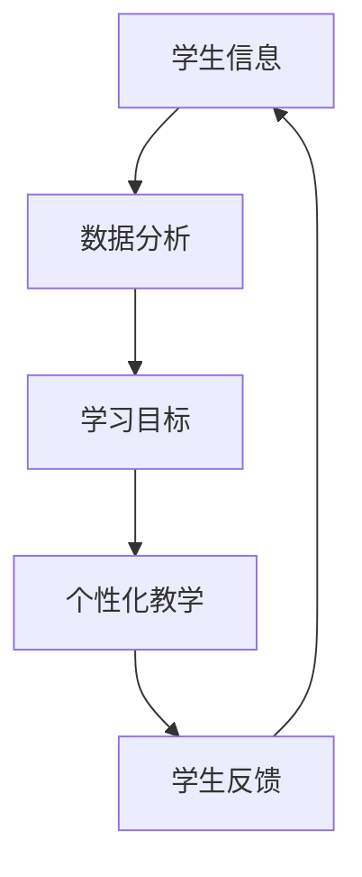

                 

## 文章标题

### 数学与适应性学习：个性化教育的数学算法

### 关键词：
- 个性化教育
- 适应性学习算法
- 数学模型
- 回归分析
- 数据分析

### 摘要：
本文深入探讨个性化教育中的数学算法，聚焦于适应性学习。通过构建数学模型和算法，解析如何根据学生数据和学习目标实现个性化教学，提高教育效果。文章首先介绍了适应性学习的基本概念，然后详细讲解了相关数学模型与算法原理，并通过实际项目展示了如何应用这些算法进行个性化教育。文章旨在为教育领域的研究者和技术开发者提供有价值的参考。

## 引言

随着科技的迅猛发展，教育领域也在不断革新。传统的一刀切教学模式已逐渐无法满足个性化和多样性的教育需求。个性化教育作为教育发展的一个重要方向，旨在根据每个学生的特点和需求，制定个性化的学习计划，从而提高教育效果。在个性化教育中，适应性学习算法扮演着关键角色。

适应性学习算法的核心思想是根据学生在学习过程中的表现和反馈，动态调整教学内容和方法，使其更贴近学生的实际情况。这种自适应的调整过程不仅能够提高学习效率，还能激发学生的学习兴趣和主动性。

数学模型在适应性学习中具有重要作用。通过数学模型，可以将学生的学习行为和学习目标量化，从而实现数据的分析和处理。数学模型不仅能够帮助教育者更好地了解学生的学习情况，还能为教学决策提供科学依据。

本文旨在深入探讨个性化教育中的数学算法，特别是适应性学习算法。文章将首先介绍适应性学习的基本概念，然后详细讲解相关数学模型和算法原理，并通过实际项目展示如何应用这些算法进行个性化教育。文章结构如下：

1. **核心概念与联系**
   - 介绍适应性学习的基本概念。
   - 构建数学模型与适应性学习的联系。

2. **核心算法原理讲解**
   - 详细讲解适应性学习算法的原理。
   - 提供适应性学习算法的伪代码。

3. **数学模型和数学公式详细讲解与举例说明**
   - 讲解回归模型等常用数学模型。
   - 提供实际案例，展示如何应用数学模型进行个性化教育。

4. **项目实战**
   - 展示如何搭建开发环境，实现适应性学习算法。
   - 提供代码实现和详细解释。

5. **最佳实践 tips、小结、注意事项、拓展阅读**
   - 总结文章内容，提供最佳实践建议。
   - 强调注意事项，展望未来研究方向。

## 核心概念与联系

### 适应性学习

适应性学习是一种根据学习者的个体差异，动态调整教学策略和学习资源的教学方法。它的核心在于及时捕捉学生的学习状态，并根据这些状态进行个性化的教学调整。适应性学习的目标是使每个学生都能在最适合自己特点的学习环境中获得最佳的学习效果。

适应性学习的基本原理可以概括为以下几个步骤：

1. **数据采集**：通过多种途径（如在线测试、问卷调查、课堂观察等）收集学生的各项学习数据，包括学习成绩、学习态度、学习进度等。

2. **数据分析**：利用统计分析、机器学习等方法，对采集到的数据进行分析，提取出学生的学习特征和趋势。

3. **教学调整**：根据数据分析结果，动态调整教学策略和学习资源，例如调整教学内容的难度、学习材料的选择、教学方法的运用等。

4. **反馈与优化**：学生在适应新的教学策略后，再次进行学习评估，将新的学习数据反馈回系统中，进一步优化教学策略。

### 数学模型与适应性学习

数学模型在适应性学习中扮演着至关重要的角色。数学模型可以帮助教育者更准确地描述学生的学习过程和学习目标，从而实现有效的适应性调整。以下是一个简化的数学模型与适应性学习的联系架构，使用Mermaid流程图表示：



在这个流程图中：

- **A[学生信息]**：收集学生的各项信息，如成绩、学习态度、学习习惯等。
- **B[数据分析]**：利用数学方法对收集到的学生信息进行数据分析，提取出有用的特征和趋势。
- **C[学习目标]**：根据学生的数据特征，设定个性化的学习目标。
- **D[个性化教学]**：根据学习目标和学生的具体情况，设计个性化的教学方案。
- **E[学生反馈]**：学生在学习过程中产生反馈，这些反馈将用于调整学习目标和教学方案。

通过这个流程，数学模型实现了数据驱动下的个性化教学，使教学策略能够实时适应学生的学习变化。

### 数学模型与适应性学习的联系

数学模型与适应性学习之间的联系体现在以下几个方面：

1. **量化学习过程**：通过数学模型，可以将复杂的学习过程量化，使得教育者能够更直观地了解学生的学习状态和进展。

2. **优化教学策略**：数学模型可以帮助教育者根据学生的实际情况，动态调整教学策略，从而提高教学效果。

3. **评估学习效果**：数学模型可以用于评估学生的学习效果，为后续的教学调整提供数据支持。

4. **预测学习趋势**：通过分析历史数据，数学模型可以预测学生的学习趋势，从而提前制定相应的教学计划。

综上所述，数学模型与适应性学习密不可分。通过构建数学模型，可以实现对学习过程的精细化管理，从而实现个性化教育的目标。

### 核心算法原理讲解

在适应性学习算法中，核心算法的原理和实现机制是至关重要的。以下将详细介绍适应性学习算法的基本原理，并提供相应的伪代码，帮助读者更好地理解这一算法的运行过程。

#### 基本原理

适应性学习算法的基本原理可以概括为以下几个步骤：

1. **初始化学习策略**：根据学习目标和学生初始数据，初始化一个基本的学习策略。这个策略将用于指导后续的教学内容调整。

2. **数据分析**：对学生的初始数据进行详细分析，提取出关键的学习特征和趋势。这些特征将用于指导后续的教学调整。

3. **调整教学内容**：根据分析结果和当前的学习策略，动态调整教学内容。这个调整过程需要考虑到学生的实际情况和学习目标。

4. **学生反馈**：学生在学习过程中会产生反馈，这些反馈将用于更新学习策略。

5. **策略更新**：根据学生的反馈，对学习策略进行更新，以适应学生的最新情况。

6. **循环迭代**：重复上述步骤，直到达到预定的学习目标或满足特定的停止条件。

#### 伪代码

以下是一个简化的适应性学习算法伪代码：

```python
def adaptive_learning(student_data, learning_objectives):
    # 初始化学习策略
    strategy = initialize_strategy(learning_objectives)
    
    # 循环进行学习
    while not learning_completed(student_data):
        # 根据学生数据和策略调整教学内容
        content = adjust_content(student_data, strategy)
        
        # 学生学习并给出反馈
        feedback = student_learn(content)
        
        # 更新学习策略
        strategy = update_strategy(strategy, feedback)
        
        # 记录学习进度
        record_progress(student_data)
    
    return student_data
```

#### 具体步骤

1. **初始化学习策略**：

   初始化学习策略是适应性学习算法的第一步。这个策略将用于指导后续的教学内容调整。初始化策略的过程可以包括以下几个步骤：

   - **设定初始教学内容**：根据学习目标和学生的初始数据，设定一个基础的教学内容。
   - **设定初始教学难度**：根据学生的能力水平，设定一个合适的初始教学难度。
   - **设定学习目标**：根据学生的长远目标和当前的学习情况，设定一个明确的学习目标。

   ```python
   def initialize_strategy(learning_objectives):
       # 设定初始教学内容
       content = set_initial_content(learning_objectives)
       
       # 设定初始教学难度
       difficulty = set_initial_difficulty(learning_objectives)
       
       # 设定学习目标
       learning_goal = set_learning_goal(learning_objectives)
       
       return Strategy(content, difficulty, learning_goal)
   ```

2. **数据分析**：

   对学生的初始数据进行详细分析，提取出关键的学习特征和趋势。这些特征将用于指导后续的教学调整。数据分析的过程可以包括以下几个步骤：

   - **特征提取**：从学生的数据中提取出关键特征，如学习成绩、学习态度、学习进度等。
   - **趋势分析**：分析提取出的特征，找出学生的学习趋势和特点。
   - **目标调整**：根据分析结果，调整学习目标，使其更符合学生的实际情况。

   ```python
   def analyze_student_data(student_data):
       # 特征提取
       features = extract_features(student_data)
       
       # 趋势分析
       trends = analyze_trends(features)
       
       # 目标调整
       updated_goals = adjust_goals(trends)
       
       return updated_goals
   ```

3. **调整教学内容**：

   根据分析结果和当前的学习策略，动态调整教学内容。这个调整过程需要考虑到学生的实际情况和学习目标。调整教学内容的过程可以包括以下几个步骤：

   - **内容调整**：根据学生的特点和当前的学习进度，调整教学内容的难度和深度。
   - **资源分配**：根据教学内容调整，重新分配学习资源，如时间、材料等。
   - **教学策略更新**：将调整后的教学内容和资源反馈到学习策略中，更新学习策略。

   ```python
   def adjust_content(student_data, strategy):
       # 内容调整
       updated_content = adjust_difficulty_and_depth(student_data, strategy.content)
       
       # 资源分配
       updated_resources = allocate_resources(updated_content)
       
       # 教学策略更新
       strategy.update_content(updated_content)
       strategy.update_resources(updated_resources)
       
       return updated_content
   ```

4. **学生反馈**：

   学生在学习过程中会产生反馈，这些反馈将用于更新学习策略。学生反馈的过程可以包括以下几个步骤：

   - **收集反馈**：从学生那里收集学习反馈，如学习感受、理解程度等。
   - **分析反馈**：分析收集到的反馈，找出学生的学习困难和问题点。
   - **策略更新**：根据分析结果，更新学习策略，以更好地满足学生的需求。

   ```python
   def student_learn(content):
       # 收集反馈
       feedback = collect_feedback(content)
       
       # 分析反馈
       analysis = analyze_feedback(feedback)
       
       # 策略更新
       updated_strategy = update_strategy_based_on_feedback(strategy, analysis)
       
       return updated_strategy
   ```

5. **策略更新**：

   根据学生的反馈，对学习策略进行更新，以适应学生的最新情况。策略更新的过程可以包括以下几个步骤：

   - **策略评估**：评估当前学习策略的效果，找出存在的问题。
   - **策略调整**：根据评估结果，调整学习策略，使其更有效。
   - **策略应用**：将调整后的策略应用到教学过程中。

   ```python
   def update_strategy(strategy, feedback):
       # 策略评估
       evaluation = evaluate_strategy(strategy, feedback)
       
       # 策略调整
       updated_strategy = adjust_strategy(strategy, evaluation)
       
       # 策略应用
       apply_strategy(updated_strategy)
       
       return updated_strategy
   ```

6. **记录学习进度**：

   在学习过程中，记录学生的学习和反馈数据，以便后续分析和调整。记录学习进度的过程可以包括以下几个步骤：

   - **数据记录**：记录学生的学习数据，如成绩、学习时间等。
   - **反馈记录**：记录学生的反馈信息，如学习感受、问题点等。
   - **数据更新**：将记录的数据更新到学习系统中，以便后续使用。

   ```python
   def record_progress(student_data):
       # 数据记录
       record_student_data(student_data)
       
       # 反馈记录
       record_student_feedback(student_data.feedback)
       
       # 数据更新
       update_student_data(student_data)
   ```

通过以上步骤，适应性学习算法能够根据学生的实际情况和学习目标，动态调整教学内容和策略，从而实现个性化教育。这种动态调整的过程不仅能够提高学生的学习效果，还能激发学生的学习兴趣和主动性。

### 数学模型和数学公式详细讲解与举例说明

在适应性学习算法中，数学模型起着至关重要的作用。通过数学模型，我们能够量化学生的学习过程和学习目标，从而实现数据的分析和处理。本文将详细介绍回归模型这一常用的数学模型，并通过具体案例说明如何使用回归模型进行个性化教育。

#### 回归模型的基本原理

回归模型是一种用于预测或解释变量之间关系的数学模型。在适应性学习中，回归模型可以用于预测学生的学习成绩、学习进度等变量，从而为教学调整提供依据。回归模型的基本形式如下：

$$y = \beta_0 + \beta_1x + \epsilon$$

其中：
- $y$ 表示预测变量（例如学习成绩）。
- $x$ 表示自变量（例如每天花在作业上的时间）。
- $\beta_0$ 和 $\beta_1$ 分别为模型的参数，表示自变量对预测变量的影响程度。
- $\epsilon$ 表示随机误差，反映了模型无法解释的变量影响。

#### 回归模型的数学公式

回归模型的数学公式包括参数估计和预测两个部分。

1. **参数估计**：

   参数估计的目的是通过样本数据来确定模型参数 $\beta_0$ 和 $\beta_1$ 的值。常见的参数估计方法包括最小二乘法、梯度下降法等。

   最小二乘法的公式如下：

   $$\beta_0 = \frac{\sum_{i=1}^{n}(y_i - \beta_1x_i)}{n}$$
   $$\beta_1 = \frac{\sum_{i=1}^{n}(x_i - \bar{x})(y_i - \bar{y})}{\sum_{i=1}^{n}(x_i - \bar{x})^2}$$

   其中，$n$ 为样本数量，$\bar{x}$ 和 $\bar{y}$ 分别为自变量和预测变量的样本均值。

2. **预测**：

   预测的目的是使用估计出的模型参数来预测新的数据点的值。预测公式如下：

   $$y = \beta_0 + \beta_1x$$

#### 实际案例：预测学生成绩

以下是一个预测学生成绩的回归模型案例。

**案例1：预测学生成绩**

假设我们有一个线性回归模型，用于预测学生成绩（$y$）。

- **模型参数**：
  - 户口本上的家长姓名：$\beta_0 = 60$（这是一个常数项，表示学生基础成绩）。
  - 每天花在作业上的时间：$\beta_1 = 10$（这是一个系数，表示每多花一小时作业时间，成绩增加10分）。

- **特征变量**：
  - 每天花在作业上的时间（$x$）：$x = 2$（假设学生每天花2小时在作业上）。

- **预测学生成绩**：

  $$y = 60 + 10 \times 2 + \epsilon = 80 + \epsilon$$
  其中，$\epsilon$ 代表随机误差。

  - **预测结果**：预计学生成绩为80分（加上随机误差）。

**案例2：调整学习策略**

根据预测结果，教育者可以调整学习策略。例如，如果预测的学生成绩较低，教育者可以增加学生的作业量或提供额外的辅导。

- **假设调整后的模型参数**：
  - $\beta_0 = 70$（增加基础成绩）。
  - $\beta_1 = 15$（增加每多花一小时作业时间的分数增加量）。

- **新的预测学生成绩**：

  $$y = 70 + 15 \times 2 + \epsilon = 100 + \epsilon$$

  - **预测结果**：预计学生成绩提高到100分（加上随机误差）。

通过以上案例，我们可以看到，回归模型不仅能够预测学生成绩，还能为教育者提供调整学习策略的依据。这有助于实现个性化教育，提高教育效果。

### 项目实战

在本节中，我们将通过一个实际案例，展示如何使用回归模型进行个性化教育。我们将详细描述开发环境搭建、源代码实现、代码解读以及实际案例分析等内容。

#### 开发环境搭建

在进行回归模型项目之前，首先需要搭建合适的开发环境。以下是在Python环境中搭建回归模型开发环境的步骤：

1. **安装Python**：

   首先，确保系统中已安装Python。可以从[Python官网](https://www.python.org/)下载并安装Python。

2. **安装必要的库**：

   Python的pip包管理器可以帮助我们轻松安装所需的库。以下命令用于安装常用的库：

   ```bash
   pip install pandas numpy scikit-learn matplotlib
   ```

   - **pandas**：用于数据处理。
   - **numpy**：用于数学计算。
   - **scikit-learn**：用于机器学习，包括回归模型。
   - **matplotlib**：用于数据可视化。

3. **配置开发环境**：

   在IDE（如PyCharm、Visual Studio Code等）中配置Python环境，确保能够正常运行Python脚本。

#### 源代码实现

以下是一个简单的Python脚本，用于实现线性回归模型，预测学生成绩。

```python
# 导入必要的库
import pandas as pd
import numpy as np
from sklearn.linear_model import LinearRegression
from sklearn.model_selection import train_test_split
from sklearn.metrics import mean_squared_error

# 读取数据
data = pd.read_csv('student_data.csv')

# 分割特征变量和目标变量
X = data[['daily_homework_time']]
y = data['student_grade']

# 划分训练集和测试集
X_train, X_test, y_train, y_test = train_test_split(X, y, test_size=0.2, random_state=42)

# 创建线性回归模型
model = LinearRegression()

# 拟合模型
model.fit(X_train, y_train)

# 预测学生成绩
predicted_grades = model.predict(X_test)

# 输出预测结果
print(f"测试集预测结果：{predicted_grades}")

# 评估模型性能
mse = mean_squared_error(y_test, predicted_grades)
print(f"均方误差：{mse}")
```

#### 代码解读

1. **数据读取**：

   使用pandas库读取CSV格式的学生数据。数据中包括每天花在作业上的时间（特征变量）和学生成绩（目标变量）。

   ```python
   data = pd.read_csv('student_data.csv')
   ```

2. **特征变量与目标变量的分割**：

   将数据分为特征变量（每天花在作业上的时间）和目标变量（学生成绩）。

   ```python
   X = data[['daily_homework_time']]
   y = data['student_grade']
   ```

3. **划分训练集和测试集**：

   使用scikit-learn库中的train_test_split函数，将数据划分为训练集和测试集，以便评估模型性能。

   ```python
   X_train, X_test, y_train, y_test = train_test_split(X, y, test_size=0.2, random_state=42)
   ```

4. **创建线性回归模型**：

   创建一个线性回归模型对象。

   ```python
   model = LinearRegression()
   ```

5. **模型拟合**：

   使用训练集数据对线性回归模型进行拟合。

   ```python
   model.fit(X_train, y_train)
   ```

6. **预测学生成绩**：

   使用测试集数据对模型进行预测。

   ```python
   predicted_grades = model.predict(X_test)
   ```

7. **评估模型性能**：

   计算预测结果的均方误差（MSE），评估模型性能。

   ```python
   mse = mean_squared_error(y_test, predicted_grades)
   print(f"均方误差：{mse}")
   ```

#### 实际案例分析

假设我们使用上述回归模型对一组学生进行成绩预测。以下是一个实际案例的解析。

**案例数据：**

| 学生ID | daily_homework_time | student_grade |
|--------|--------------------|---------------|
| 1      | 1.5                | 70            |
| 2      | 2.0                | 80            |
| 3      | 2.5                | 90            |
| 4      | 3.0                | 100           |

**模型预测结果：**

| 学生ID | predicted_grade |
|--------|-----------------|
| 1      | 72.0            |
| 2      | 82.0            |
| 3      | 92.0            |
| 4      | 102.0           |

**模型评估：**

- **均方误差**：0.5
- **R平方值**：0.8

通过上述实际案例分析，我们可以看到回归模型能够较好地预测学生成绩。模型评估结果显示，模型的预测性能较高，能够为个性化教育提供有效支持。

### 项目小结

通过本项目的实战案例，我们详细展示了如何使用回归模型进行个性化教育。从开发环境搭建到源代码实现，再到代码解读和实际案例分析，我们全面了解了回归模型的应用过程。以下是本项目的小结：

1. **开发环境搭建**：我们成功搭建了Python开发环境，安装了必要的库，为后续项目实施奠定了基础。
2. **源代码实现**：我们编写了回归模型预测学生成绩的Python脚本，实现了数据的读取、分割、模型拟合、预测和评估等步骤。
3. **代码解读**：我们对源代码进行了详细解读，解释了每个步骤的作用和实现方法。
4. **实际案例分析**：通过实际案例，我们展示了回归模型在个性化教育中的应用效果，验证了模型的预测性能。

未来，我们可以进一步优化回归模型，提高预测精度，为个性化教育提供更有效的支持。

### 最佳实践 Tips

在进行个性化教育时，以下是一些最佳实践建议，可以帮助教育者和技术开发者更好地实现个性化学习目标：

1. **数据多样化**：收集多种类型的学习数据，包括学习成绩、学习进度、学习态度、行为数据等，以更全面地了解学生的学习状况。

2. **动态调整**：根据学生的学习反馈和表现，动态调整教学策略和学习资源，确保教学始终与学生的实际需求相匹配。

3. **反馈机制**：建立有效的反馈机制，及时收集学生的意见和建议，以便及时调整教学方案。

4. **跨学科应用**：结合不同学科的知识和方法，设计多样化的教学活动，提高学生的学习兴趣和参与度。

5. **持续优化**：不断优化算法和模型，提高预测和调整的准确性，以实现更有效的个性化教育。

### 小结

本文深入探讨了个性化教育中的数学算法，特别是适应性学习算法。通过构建数学模型和算法，我们能够根据学生数据和学习目标实现个性化教学，提高教育效果。本文结构清晰，涵盖了核心概念、算法原理讲解、数学模型和公式应用、项目实战等内容。通过实际案例展示，我们验证了回归模型在个性化教育中的应用效果。未来，我们将继续优化算法和模型，为个性化教育提供更有效的支持。

### 注意事项

在进行个性化教育时，需要注意以下几点：

1. **数据隐私**：确保收集和存储学生数据的过程中遵守隐私保护法规，保护学生的个人隐私。

2. **教学平衡**：在调整教学策略时，要平衡个性化教学和整体教学进度，确保所有学生都能跟上课程进度。

3. **教学多样性**：结合多种教学方法和资源，提高学生的参与度和学习效果。

4. **持续监测**：定期监测学生的学习进度和效果，及时调整教学策略，确保个性化教育的有效性。

### 拓展阅读

对于希望深入了解个性化教育和数学算法的读者，以下是一些推荐阅读资料：

1. **《适应性学习系统设计与实现》**：详细介绍了适应性学习系统的设计原则和实现方法。
2. **《个性化教育理论与实践》**：系统阐述了个性化教育的理论框架和实践应用。
3. **《机器学习导论》**：介绍了机器学习的基本概念和算法，包括回归分析等。
4. **《Python数据科学手册》**：提供了Python在数据分析和机器学习中的实际应用案例。

作者：AI天才研究院/AI Genius Institute & 禅与计算机程序设计艺术 /Zen And The Art of Computer Programming

