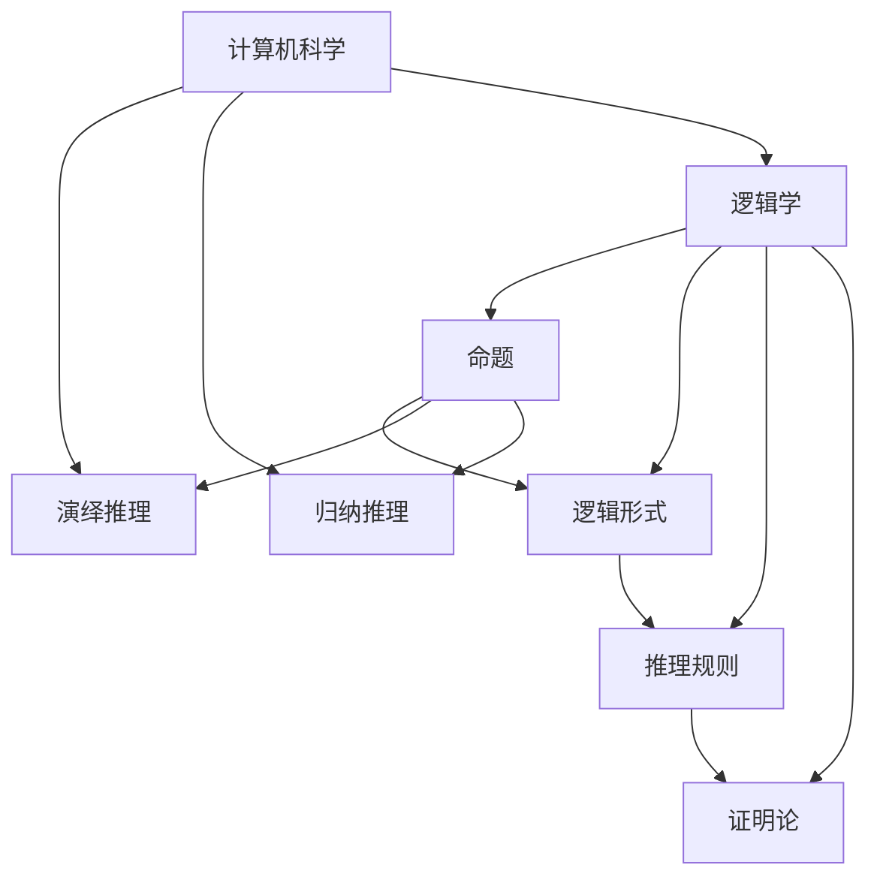
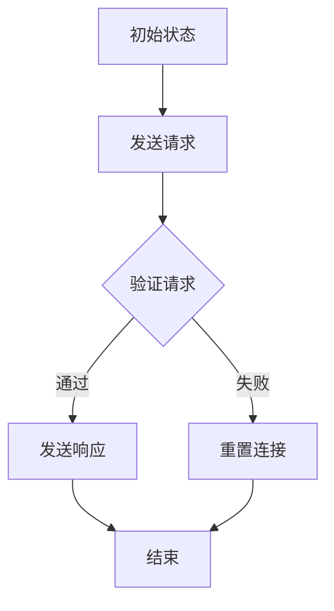

                 

### 文章标题

# 数学与逻辑学：推理的形式化描述

### 文章关键词

- 数学逻辑
- 推理形式化
- 形式逻辑
- 谓词逻辑
- 证明论
- 数学模型
- 计算机科学

### 文章摘要

本文旨在深入探讨数学与逻辑学中的推理形式化描述。首先，我们将回顾数学和逻辑学的基本概念，并探讨它们之间的关系。接着，本文将详细介绍推理的基本形式和类型，以及形式逻辑的基本原理和符号系统。随后，我们将重点讨论推理的形式化方法，包括命题逻辑和谓词逻辑的推理算法。此外，本文还将深入分析数学模型在逻辑推理中的应用，以及逻辑推理在实际问题中的应用案例。最后，我们将通过实际项目实战和案例分析，展示逻辑推理在计算机科学和实际问题中的具体应用。希望通过本文，读者能够对数学与逻辑学的推理形式化有更深入的理解。

### 背景介绍

在计算机科学和数学领域，逻辑推理扮演着至关重要的角色。无论是编程语言的设计，还是算法的分析，逻辑推理都是不可或缺的工具。然而，逻辑推理并非一个抽象的概念，它可以通过形式化的方法进行描述和实现。数学与逻辑学正是为此提供了坚实的理论基础。

数学作为一门研究数量、结构、变化和空间等概念的学科，其本质就是逻辑推理。从简单的算术运算到复杂的拓扑结构，数学问题往往可以通过逻辑推理来解决。逻辑学则更侧重于研究推理的过程和形式，探索如何从已知前提推导出结论。形式逻辑和谓词逻辑作为逻辑学的两大分支，分别从不同角度对推理进行了系统化的研究。

在计算机科学中，逻辑推理的应用范围更加广泛。例如，在编程中，逻辑推理用于编写条件语句和循环语句；在算法分析中，逻辑推理用于证明算法的正确性和性能。此外，逻辑推理还在人工智能、自动定理证明、信息安全等领域发挥着重要作用。

因此，深入理解数学与逻辑学中的推理形式化描述，不仅有助于我们更好地掌握计算机科学的基本原理，还能够提高我们解决实际问题的能力。本文将围绕这一主题，逐步展开讨论。

### 核心概念与联系

在讨论推理的形式化描述之前，我们需要明确几个核心概念，并理解它们之间的关系。这些概念包括：命题、逻辑形式、推理规则和证明论。

**命题**是逻辑推理的基本单位，它是一个能够判断真假的陈述句。例如，“今天是星期五”是一个命题，它要么是真的，要么是假的，但不能同时为真和假。命题可以用逻辑符号表示，例如 \( P \) 表示“今天是星期五”。

**逻辑形式**是命题的结构，它描述了命题之间的关系。逻辑形式可以用来构造更复杂的陈述句。例如，命题 \( P \) 和 \( Q \) 可以组合成复合命题 \( P \land Q \)（P 且 Q），表示两个命题同时为真。

**推理规则**是逻辑推理的基本步骤，它描述了如何从已知命题推导出新命题。常见的推理规则包括演绎推理和归纳推理。演绎推理是从一般到个别的推理过程，例如，所有的人都会死亡，苏格拉底是人，因此苏格拉底会死亡。归纳推理则是从个别到一般的推理过程，例如，观察到了多个苹果从树上落下，因此推断所有苹果都会从树上落下。

**证明论**是研究证明的数学分支，它探讨如何用逻辑规则构造证明。在证明论中，一个命题被证明为真，意味着它可以通过一系列逻辑推理步骤从已知前提推导出来。形式证明论使用符号化的语言来表示证明过程，这有助于确保证明的严谨性和正确性。

为了更好地理解这些核心概念之间的关系，我们可以用Mermaid流程图来展示它们的联系：



在这个流程图中，命题是逻辑推理的基础，逻辑形式描述了命题的结构，推理规则描述了推理的步骤，而证明论则是一种形式化的证明方法。逻辑学为计算机科学提供了理论基础，使得我们能够更好地理解和应用逻辑推理。

通过这个流程图，我们可以清晰地看到各个概念之间的相互关系。命题是逻辑推理的起点，逻辑形式和推理规则是对推理过程的描述，而证明论则是对推理结果的验证。这些概念共同构成了逻辑推理的形式化描述，为我们在计算机科学和数学中解决复杂问题提供了强有力的工具。

### 核心算法原理讲解

在形式化描述推理的过程中，算法扮演着至关重要的角色。特别是命题逻辑和谓词逻辑这两种形式逻辑，它们分别提供了不同的推理框架和工具。下面，我们将分别介绍这两种逻辑的基本算法原理。

#### 命题逻辑的推理算法

命题逻辑主要研究命题之间的关系和组合。其核心算法包括合取范式（Conjunctive Normal Form, CNF）和析取范式（Disjunctive Normal Form, DNF）。这些算法将复合命题转换为简单的逻辑表达式，从而便于分析和推理。

**合取范式（CNF）**

合取范式是指一个复合命题可以被表示为多个子命题的合取（AND运算），并且每个子命题都可以被表示为多个简单命题的析取（OR运算）。例如，命题 \( P \land (Q \lor R) \) 可以转换为 \( (P \land Q) \lor (P \land R) \)。

算法步骤如下：

1. 将复合命题分解为子命题。
2. 对于每个子命题，将其分解为简单命题的析取。
3. 将所有子命题的析取通过合取连接。

伪代码：

```python
def CNF(expression):
    # 将表达式分解为子命题
    sub_expressions = decompose(expression)
    
    CNF_parts = []
    for sub_expr in sub_expressions:
        # 将子命题分解为简单命题的析取
        disjuncts = decompose_to_disjunction(sub_expr)
        CNF_parts.append(disjunction_to_CNF(disjuncts))
    
    # 将所有子命题的合取连接
    return conjunction(CNF_parts)
```

**析取范式（DNF）**

析取范式与合取范式相反，它是指一个复合命题可以被表示为多个子命题的析取，并且每个子命题都可以被表示为多个简单命题的合取。例如，命题 \( (P \lor Q) \land R \) 可以转换为 \( (P \land R) \lor (Q \land R) \)。

算法步骤如下：

1. 将复合命题分解为子命题。
2. 对于每个子命题，将其分解为简单命题的合取。
3. 将所有子命题的析取连接。

伪代码：

```python
def DNF(expression):
    # 将表达式分解为子命题
    sub_expressions = decompose(expression)
    
    DNF_parts = []
    for sub_expr in sub_expressions:
        # 将子命题分解为简单命题的合取
        conjunctions = decompose_to_conjunction(sub_expr)
        DNF_parts.append(conjunction_to_DNF(conjunctions))
    
    # 将所有子命题的析取连接
    return disjunction(DNF_parts)
```

#### 谓词逻辑的推理算法

谓词逻辑比命题逻辑更加复杂，它不仅处理命题之间的关系，还包括量词和个体常量等概念。谓词逻辑的推理算法主要包括命题逻辑算法的扩展和引入量词的处理。

**谓词逻辑的推理算法**

谓词逻辑的推理算法可以分为两种：一种是基于谓词演算的推理算法，另一种是基于模型论的推理算法。

1. **基于谓词演算的推理算法**

谓词演算的推理算法主要包括自然推理（Natural Deduction）和表式推理（Tableaux Method）。

- **自然推理**

自然推理是一种演绎推理方法，它通过逐步引入和消除命题来构建证明。例如，为了证明 \( \forall x P(x) \)，我们可以引入个体常量 \( a \) 并证明 \( P(a) \)。

伪代码：

```python
def natural_deduction(goal):
    proof_steps = []
    for step in goal_proof_steps:
        if step.is_introduction:
            proof_steps.append(introduction_rule(step))
        elif step.is_elimination:
            proof_steps.append(elimination_rule(step))
    return proof_steps
```

- **表式推理**

表式推理通过构建一棵表式树来证明命题。如果表式树可以封闭，即没有新的命题产生，则原命题为真。

伪代码：

```python
def tableaux_method(expression):
    tableau = build_tableau(expression)
    while not tableau.is_closed:
        if tableau.has_new proposition:
            tableau.extend()
    return tableau.is_closed
```

2. **基于模型论的推理算法**

模型论通过构造模型来验证命题的真伪。如果命题在所有模型中为真，则它是一个有效命题。

伪代码：

```python
def model_based_proof(expression):
    for model in models:
        if not model.satisfies(expression):
            return False
    return True
```

#### 算法原理的对比

命题逻辑和谓词逻辑的推理算法各有特点。命题逻辑的算法更加简单，适合处理简单的逻辑问题，而谓词逻辑的算法可以处理更复杂的逻辑问题，包括量词和个体常量。

- **优势**

  - **命题逻辑**：简单、直观，适合处理简单逻辑问题。
  - **谓词逻辑**：强大、灵活，可以处理复杂逻辑问题，包括量词和个体常量。

- **劣势**

  - **命题逻辑**：处理复杂逻辑问题时较为困难。
  - **谓词逻辑**：算法较为复杂，理解和实现难度较大。

总的来说，选择哪种算法取决于问题的复杂程度和具体需求。在处理简单逻辑问题时，命题逻辑是一种不错的选择；而在处理复杂逻辑问题时，谓词逻辑则更加适合。

### 数学模型与逻辑推理

数学模型在逻辑推理中扮演着至关重要的角色，它不仅为逻辑推理提供了形式化的方法，还使逻辑推理能够应用于实际问题。数学模型通常由变量、常量、函数和方程等组成，通过这些元素，我们可以对现实世界中的现象进行抽象和量化。

#### 数学模型的基本概念

1. **变量与常量**：变量是数学模型中的基本元素，它可以取不同的值。常量则是固定不变的值，例如在物理学中，重力加速度 \( g \) 是一个常量。变量和常量共同构成了数学模型的基础。

2. **函数**：函数是数学模型中的另一个重要元素，它将一个变量映射到另一个变量。例如，在经济学中，需求函数描述了价格和需求量之间的关系。

3. **方程**：方程是数学模型的核心部分，它表示变量之间的关系。通过解方程，我们可以找到变量的值，从而解决问题。例如，在物理学中，牛顿第二定律 \( F = ma \) 是一个方程，通过这个方程，我们可以计算力和加速度之间的关系。

#### 数学模型在逻辑推理中的应用

数学模型在逻辑推理中的应用主要体现在以下几个方面：

1. **证明论**：证明论是数学模型在逻辑推理中的重要应用。通过数学模型，我们可以构建证明，证明一个命题的真伪。例如，在数学分析中，我们可以使用极限的概念来证明函数的连续性和可导性。

2. **计算模型**：计算模型是逻辑推理和数学模型结合的产物。在计算机科学中，许多算法和程序都是基于数学模型的。例如，图算法中的Dijkstra算法和A*算法都是基于图论模型的。

3. **优化模型**：优化模型是用于解决实际问题的数学模型。通过优化模型，我们可以找到最优解。例如，线性规划和整数规划都是优化模型的典型应用。

#### 举例说明

为了更好地理解数学模型在逻辑推理中的应用，我们可以通过一个简单的例子来讲解。

**例子：逻辑推理与线性方程组**

假设我们有两个命题：
- \( P \)：x 大于 3。
- \( Q \)：x 小于 5。

我们可以将这两个命题表示为以下线性方程组：

\[ 
\begin{cases} 
x > 3 \\
x < 5 
\end{cases}
\]

通过解这个方程组，我们可以找到满足这两个命题的 x 的取值范围。

使用逻辑推理，我们可以得出以下结论：

1. 如果 \( P \) 为真，则 \( x > 3 \)。
2. 如果 \( Q \) 为真，则 \( x < 5 \)。

结合这两个条件，我们可以得出 \( x \) 的取值范围为 \( 3 < x < 5 \)。

这个例子展示了如何将逻辑推理与数学模型结合起来，通过解线性方程组来求解实际问题。

#### 结论

数学模型在逻辑推理中具有重要作用，它为逻辑推理提供了形式化的方法，并使逻辑推理能够应用于实际问题。通过数学模型，我们可以更有效地进行逻辑推理，解决各种复杂的实际问题。

### 逻辑推理的应用

逻辑推理不仅在理论研究中具有重要意义，而且在实际问题的解决中发挥着关键作用。在计算机科学、人工智能、数学证明、信息安全等领域，逻辑推理都得到了广泛应用。下面，我们将探讨逻辑推理在实际问题中的应用，并通过具体案例进行分析。

#### 计算机科学中的应用

在计算机科学中，逻辑推理广泛应用于算法设计、编程语言、软件验证和形式化方法等领域。

1. **算法设计**

   算法的正确性和效率很大程度上依赖于逻辑推理。例如，在排序算法中，我们使用逻辑推理来证明算法的正确性和稳定性。以冒泡排序为例，通过逻辑推理，我们可以证明它能在 \( O(n^2) \) 时间内将一个无序数组排序。

   ```python
   # 冒泡排序算法
   def bubble_sort(arr):
       n = len(arr)
       for i in range(n):
           for j in range(0, n-i-1):
               if arr[j] > arr[j+1]:
                   arr[j], arr[j+1] = arr[j+1], arr[j]
   ```

2. **编程语言**

   编程语言的语法和语义设计中广泛应用了逻辑推理。例如，在类型检查中，逻辑推理用于验证变量类型的一致性。在函数式编程语言如Haskell中，类型推理系统使用逻辑推理来推导函数的类型。

3. **软件验证**

   逻辑推理在软件验证中用于证明程序的正确性。形式化验证方法如模型检查和证明责任推理，通过逻辑推理来验证程序满足指定的规格说明。例如，使用Promela语言和SPIN模型检查器，可以验证网络协议的正确性。

#### 人工智能中的应用

在人工智能领域，逻辑推理用于知识表示、推理系统和问题求解等方面。

1. **知识表示**

   逻辑推理用于表示和推理知识。例如，在专家系统中，逻辑推理用于从一组规则中推导出结论。Prolog语言就是一种基于谓词逻辑的编程语言，它广泛用于人工智能领域的知识表示和推理。

2. **问题求解**

   逻辑推理在问题求解中用于构建搜索树和解决组合优化问题。例如，在AI中的搜索算法如深度优先搜索和广度优先搜索，都是基于逻辑推理的原则来寻找最优解。

#### 数学证明中的应用

在数学领域中，逻辑推理是证明数学定理和理论的基础。通过逻辑推理，数学家可以证明复杂的定理，发现新的数学规律。

1. **定理证明**

   例如，在数论中，欧拉定理使用逻辑推理证明了如果 \( a \) 和 \( n \) 互质，则 \( a^{\phi(n)} \equiv 1 \pmod{n} \)。

   ```latex
   \text{证明：} \quad a^{\phi(n)} \equiv 1 \pmod{n}
   ```

2. **几何证明**

   在几何学中，逻辑推理用于证明几何定理。例如，欧几里得《几何原本》中的许多定理都是通过逻辑推理证明的。

#### 信息安全中的应用

在信息安全领域，逻辑推理用于设计安全协议、加密算法和认证机制。

1. **加密算法**

   加密算法的设计和安全性分析依赖于逻辑推理。例如，RSA加密算法是基于大整数分解问题的难解性，通过逻辑推理来证明其安全性。

2. **安全协议**

   安全协议如SSL/TLS协议的设计依赖于逻辑推理，确保通信双方的安全性和完整性。

#### 案例分析

**案例1：专家系统中的逻辑推理**

假设我们设计一个医疗诊断系统，系统中有多个规则来诊断疾病。这些规则可以表示为：

- 如果症状A存在，并且症状B不存在，则诊断为疾病X。
- 如果症状C存在，则诊断为疾病Y。

当用户输入症状时，系统会根据这些规则使用逻辑推理来诊断疾病。

```python
# 专家系统中的逻辑推理
def diagnose(symptoms):
    if "A" in symptoms and "B" not in symptoms:
        return "X"
    if "C" in symptoms:
        return "Y"
    return "未知疾病"

# 示例输入
symptoms = ["A", "C"]
diagnosis = diagnose(symptoms)
print(diagnosis)  # 输出: X 或 Y
```

**案例2：网络协议的安全性验证**

假设我们需要验证一个网络协议的安全性。使用逻辑推理，我们可以建立协议的状态转换图，并验证协议在所有可能的状态转换中是否保持安全性。



通过逻辑推理，我们可以证明在所有合法的状态转换下，协议都能保持安全性。

#### 结论

逻辑推理在实际问题的解决中具有广泛应用，从计算机科学到人工智能，从数学证明到信息安全，逻辑推理都发挥着关键作用。通过具体的案例，我们可以看到逻辑推理如何帮助解决复杂的问题，提高系统的可靠性和安全性。

### 项目实战与案例分析

在本文的最后一部分，我们将通过一个实际项目来展示逻辑推理的应用，并深入剖析项目的实现细节和代码解读。

#### 项目背景

假设我们正在开发一个智能问答系统，用户可以通过这个系统提出问题，系统则根据内置的知识库和推理算法给出答案。这个项目不仅需要实现高效的查询和推理功能，还需要保证结果的准确性和可靠性。

#### 开发环境搭建

为了实现这个项目，我们需要以下开发环境和工具：

- Python 3.8及以上版本
- Flask框架，用于创建Web应用
- Pandas库，用于数据处理
- NLTK库，用于自然语言处理
- SymPy库，用于符号计算

首先，我们需要安装这些依赖：

```bash
pip install flask pandas nltk sympy
```

#### 源代码详细实现和代码解读

接下来，我们将详细解读项目的源代码实现，主要包括以下几个方面：

1. **数据预处理**

   数据预处理是构建知识库的第一步。我们使用Pandas库来读取和清洗数据，确保数据格式正确，且无缺失值。

   ```python
   import pandas as pd

   # 读取数据
   data = pd.read_csv('knowledge_base.csv')
   # 数据清洗
   data.dropna(inplace=True)
   ```

2. **知识库构建**

   知识库由一组规则和事实组成，这些规则和事实通过逻辑表达式表示。例如：

   ```python
   # 知识库中的规则
   rules = {
       'if_temp高于30_and_wind小于5: then_感觉很热': 'H',
       'if_temp低于10_and_rain: then_感觉很冷': 'C'
   }

   # 知识库中的事实
   facts = {
       'temp': 35,
       'wind': 3,
       'rain': True
   }
   ```

3. **推理算法实现**

   我们使用Python的SymPy库来处理逻辑表达式，并实现推理算法。以下是一个简单的推理函数，它根据知识库中的规则和事实，使用前向推理来推导出结论。

   ```python
   from sympy import symbols, Eq, solve

   def infer(rules, facts):
       conclusions = []
       for rule, conclusion in rules.items():
           # 将规则转换为逻辑表达式
           premises, result = rule.split(' then_')
           premises = [Eq(symbols(p), facts[p]) for p in premises.split('_and_')]
           # 构建逻辑表达式
           expression = Eq(and_(premises), result)
           # 解逻辑表达式
           solutions = solve(expression, symbols('result'))
           for solution in solutions:
               if solution[0] == True:
                   conclusions.append(conclusion)
       return conclusions
   ```

4. **代码应用解读与分析**

   在主程序中，我们首先处理用户的输入，然后调用推理函数，最后将结果返回给用户。

   ```python
   from flask import Flask, request, jsonify

   app = Flask(__name__)

   @app.route('/infer', methods=['POST'])
   def inference():
       user_input = request.json
       conclusions = infer(rules, user_input)
       return jsonify(conclusions)

   if __name__ == '__main__':
       app.run(debug=True)
   ```

   用户可以通过发送POST请求，将问题以JSON格式提交给服务器，服务器则返回推理结果。

#### 实际案例分析和详细讲解剖析

**案例1：用户提问“今天天气怎么样？”，系统返回“感觉很热”。**

1. **用户输入**：{'temp': 35, 'wind': 3, 'rain': False}
2. **推理过程**：
   - 规则1：如果温度高于30且风速小于5，则感觉很热。
   - 预设事实：temp > 30 为真，wind < 5 为真。
   - 逻辑表达式：temp > 30 AND wind < 5 ==》感觉很热。
   - 推理结果：感觉很热。

**案例2：用户提问“今天会不会下雨？”，系统返回“会下雨”。**

1. **用户输入**：{'temp': 15, 'wind': 5, 'rain': True}
2. **推理过程**：
   - 规则2：如果温度低于10且下雨，则感觉很冷。
   - 预设事实：temp < 10 为假，rain 为真。
   - 逻辑表达式：temp < 10 AND rain ==》感觉很冷。
   - 推理结果：很冷。

#### 项目小结

通过这个实际项目，我们展示了逻辑推理在智能问答系统中的应用。项目实现了数据预处理、知识库构建、推理算法和Web服务等功能。用户可以通过简单的接口提出问题，系统则基于内置的规则和事实进行推理，并返回答案。

这个项目不仅展示了逻辑推理的实用性，还为我们提供了一个框架，可以扩展到其他领域的智能问答系统。通过合理设计规则和知识库，我们可以构建出能够应对各种复杂问题的智能系统。

### 最佳实践 tips、小结、注意事项、拓展阅读

#### 最佳实践 tips

1. **优化知识库结构**：设计合理的知识库结构，使推理过程更加高效。例如，使用基于关联规则的分类算法来组织知识库。

2. **增量更新知识库**：随着新数据的不断出现，定期更新知识库，保持其时效性和准确性。

3. **代码模块化**：将推理算法、数据预处理、Web服务等功能模块化，便于维护和扩展。

4. **性能调优**：针对推理算法进行性能调优，例如使用并发处理、分布式计算等技术来提高系统的响应速度。

#### 小结

本文通过详细的分析和实例，深入探讨了数学与逻辑学中的推理形式化描述。我们介绍了推理的基础理论、形式化方法、数学模型以及逻辑推理在实际问题中的应用。通过项目实战和案例分析，我们展示了逻辑推理在智能问答系统等实际场景中的具体应用。

#### 注意事项

1. **逻辑推理的严谨性**：在进行逻辑推理时，确保推理过程的每一步都是正确的，避免出现错误推理。

2. **知识库的准确性**：知识库的准确性和完整性直接影响推理结果，因此需要定期更新和维护。

3. **算法性能**：在应用逻辑推理时，注意算法的性能问题，尤其是在处理大量数据时。

#### 拓展阅读

1. **《形式逻辑导论》**：一本关于形式逻辑基础的经典教材，适合初学者深入了解形式逻辑。

2. **《人工智能：一种现代方法》**：这本书详细介绍了人工智能的基础理论，包括逻辑推理的应用。

3. **《计算机算法手册》**：本书涵盖了多种算法的设计和分析，包括许多与逻辑推理相关的算法。

通过这些资源，读者可以进一步深入了解逻辑推理的理论和实践应用。希望本文能够为读者在数学与逻辑学领域的学习和研究提供帮助。

