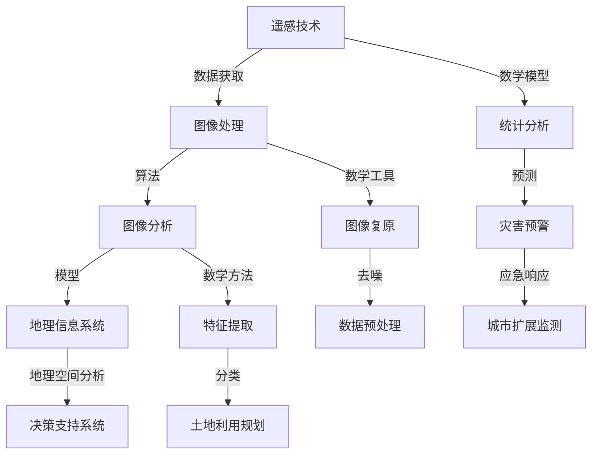

                 

### 文章标题：数学与遥感技术：地球观测数据的数学处理

#### 关键词：遥感技术、数学模型、数据处理、图像分析、地球观测

> 摘要：本文将深入探讨数学与遥感技术之间的紧密联系，重点分析地球观测数据在遥感领域中的数学处理方法。通过对核心概念的介绍、算法原理的讲解、数学模型的剖析以及实际项目案例的展示，本文旨在帮助读者理解并掌握遥感数据处理的数学工具和方法，为地球科学研究和应用提供有力的技术支持。

----------------------------------------------------------------

## 设计《数学与遥感技术：地球观测数据的数学处理》的目录大纲

### 1. 确定核心章节内容

首先，我们需要确定本书的核心章节内容，以便构建一个结构清晰、内容全面的目录大纲。根据书名《数学与遥感技术：地球观测数据的数学处理》，我们可以确定以下几个核心章节：

- **核心概念与联系**
- **核心算法原理讲解**
- **数学模型和数学公式讲解**
- **项目实战**
- **案例分析**
- **总结与展望**

### 2. 确定目录结构

接下来，我们需要为每个核心章节创建详细的子章节，确保目录结构清晰。以下是目录大纲的初步结构：

```
# 数学与遥感技术：地球观测数据的数学处理

## 关键词与摘要

## 目录

### 第1章 核心概念与联系

#### 1.1 遥感技术的背景与发展

#### 1.2 数学与遥感技术的关联

### 第2章 遥感数据的预处理

#### 2.1 数据预处理的重要性

#### 2.2 数据预处理方法

### 第3章 核心算法原理讲解

#### 3.1 边缘检测算法

#### 3.2 色彩空间转换算法

#### 3.3 遥感图像分割算法

### 第4章 数学模型和数学公式讲解

#### 4.1 遥感图像的数学模型

#### 4.2 统计模型在遥感中的应用

#### 4.3 数学公式举例

### 第5章 项目实战

#### 5.1 遥感图像处理项目

#### 5.2 遥感图像分析项目

### 第6章 案例分析

#### 6.1 城市扩展监测

#### 6.2 森林火灾监测

### 第7章 总结与展望

#### 7.1 本书总结

#### 7.2 遥感技术的发展趋势

#### 7.3 数学与遥感技术的未来
```

### 3. 确保大纲完整性

为了确保大纲的完整性，我们需要确保每个章节都包含了必要的子章节，并且每个子章节都有具体的内容。以下是每个章节的具体内容概述：

#### 第1章 核心概念与联系

- **1.1 遥感技术的背景与发展**：介绍遥感技术的发展历程、应用领域和当前趋势。
- **1.2 数学与遥感技术的关联**：讨论数学在遥感数据处理中的重要性，以及两者之间的相互关系。

#### 第2章 遥感数据的预处理

- **2.1 数据预处理的重要性**：解释数据预处理在遥感数据质量提升中的作用。
- **2.2 数据预处理方法**：详细介绍常用的数据预处理方法，如图像增强、图像复原、图像去噪等。

#### 第3章 核心算法原理讲解

- **3.1 边缘检测算法**：介绍边缘检测算法的基本原理、伪代码和示例。
- **3.2 色彩空间转换算法**：讲解色彩空间转换算法的原理、伪代码和示例。
- **3.3 遥感图像分割算法**：阐述遥感图像分割算法的基本原理、伪代码和示例。

#### 第4章 数学模型和数学公式讲解

- **4.1 遥感图像的数学模型**：介绍遥感图像的数学表示方法和常用模型。
- **4.2 统计模型在遥感中的应用**：探讨统计模型在遥感数据处理中的应用，如遥感数据的统计分析和模式识别。
- **4.3 数学公式举例**：通过具体的数学公式和示例，帮助读者理解数学模型在遥感数据处理中的应用。

#### 第5章 项目实战

- **5.1 遥感图像处理项目**：介绍一个遥感图像处理项目的开发流程，包括环境搭建、源代码实现和代码解读。
- **5.2 遥感图像分析项目**：介绍一个遥感图像分析项目的开发流程，包括环境搭建、源代码实现和代码解读。

#### 第6章 案例分析

- **6.1 城市扩展监测**：分析城市扩展监测的案例，包括数据来源、数据处理和结果分析。
- **6.2 森林火灾监测**：分析森林火灾监测的案例，包括数据来源、数据处理和结果分析。

#### 第7章 总结与展望

- **7.1 本书总结**：对本书的主要内容进行总结，强调关键知识点。
- **7.2 遥感技术的发展趋势**：探讨遥感技术的未来发展趋势，展望数学与遥感技术的融合前景。
- **7.3 数学与遥感技术的未来**：讨论数学在遥感技术未来发展中的潜在应用和挑战。

通过以上步骤，我们设计出了一个详细且结构清晰的目录大纲，为撰写高质量的技术博客文章奠定了基础。接下来，我们将逐步填充每个章节的内容，确保文章的逻辑性和实用性。### 第1章：核心概念与联系

#### 1.1 遥感技术的背景与发展

遥感技术是一种通过从远距离（如卫星、飞机或无人机）获取地球表面信息的技术。它利用传感器和遥感器来捕捉地球表面的电磁波信号，并通过数据分析来提取有用信息。遥感技术的起源可以追溯到20世纪中期，当时美国启动了第一个气象卫星项目。此后，随着计算机技术和传感器技术的飞速发展，遥感技术逐渐成熟并广泛应用于各个领域。

在遥感技术的发展历程中，有几个重要的里程碑：

1. **第一个气象卫星项目**（1957年）：标志着遥感技术的诞生，使人们能够从太空观测地球表面。
2. **陆地卫星计划**（1972年）：美国启动了第一个陆地卫星项目，为全球提供高质量的遥感数据。
3. **高分辨率遥感传感器**：随着数字成像技术和传感器技术的发展，高分辨率遥感传感器不断涌现，如Landsat、SPOT、IKONOS、QuickBird等。
4. **多光谱和超光谱遥感**：通过捕捉不同波段的光谱信息，这些遥感技术能够更准确地识别地表特征。
5. **无人机和手持设备**：无人机和手持设备的普及，使得遥感技术更加便携和实用。

遥感技术的应用领域广泛，包括：

- **环境监测**：如气候变化、森林资源管理、水资源监测等。
- **城市规划**：如城市扩展监测、土地利用规划、交通网络规划等。
- **灾害管理**：如地震、洪水、森林火灾等自然灾害的监测与评估。
- **农业**：如作物产量监测、病虫害监测、土地肥力评估等。
- **地质勘探**：如矿产资源调查、地质构造监测等。

#### 1.2 数学与遥感技术的关联

数学在遥感技术中扮演着至关重要的角色。遥感数据通常以图像的形式出现，而这些图像的处理和分析需要大量的数学工具和方法。以下是数学在遥感技术中的应用：

1. **图像处理算法**：如边缘检测、图像增强、图像复原、图像去噪等，这些算法依赖于数学原理，例如傅里叶变换、卷积、线性代数等。
2. **图像分析**：如特征提取、分类、聚类等，这些分析过程需要使用统计学、模式识别等数学方法。
3. **地理信息系统（GIS）**：GIS是遥感技术的重要工具，它依赖于地理学、测绘学和计算机科学的知识，尤其是地理空间数据建模和空间分析算法。
4. **模型建立**：如模拟地表过程、大气模型等，这些模型通常基于物理和数学原理，用于预测和解释遥感数据。

数学与遥感技术的关联架构可以用以下Mermaid流程图来表示：



通过这个流程图，我们可以看到数学在遥感技术的各个环节中都有着重要的应用，从数据获取、图像处理、图像分析到地理空间分析，每一个步骤都离不开数学的支持。数学模型和数学方法的使用不仅提高了遥感技术的准确性，也拓展了其在各个领域的应用范围。

### 1.3 总结与展望

本章首先介绍了遥感技术的背景和发展，从早期的气象卫星到现代的高分辨率遥感传感器，遥感技术经历了巨大的变革。随后，我们探讨了数学在遥感技术中的重要性，通过图像处理算法、图像分析、地理信息系统和数学模型的应用，数学为遥感技术的各个方面提供了强有力的支持。最后，我们通过一个Mermaid流程图，直观地展示了数学与遥感技术的紧密关联。

在接下来的章节中，我们将深入探讨遥感数据的预处理方法、核心算法原理、数学模型和公式，并通过实际项目案例和案例分析，进一步阐述数学与遥感技术的融合应用。通过这一系列的探讨，读者将能够全面了解数学在遥感技术中的重要性，并掌握相关技术工具和实用方法。### 第2章：遥感数据的预处理

#### 2.1 数据预处理的重要性

遥感数据预处理是遥感技术应用过程中的关键步骤，其重要性不可忽视。数据预处理的质量直接影响到后续图像处理和分析的准确性。以下从几个方面阐述数据预处理的重要性：

1. **数据质量评估**：通过对遥感数据进行质量评估，可以确定数据的完整性和可靠性。这对于确保分析结果的准确性和可重复性至关重要。

2. **噪声和干扰去除**：遥感数据在获取过程中可能会受到噪声和干扰的影响，如大气干扰、传感器噪声、云层遮挡等。通过数据预处理，可以有效去除这些噪声和干扰，提高数据的信噪比。

3. **图像增强**：数据预处理过程中，可以通过图像增强技术提高遥感图像的对比度、清晰度和可读性，使图像中的有用信息更加突出，便于后续分析。

4. **图像拼接与校正**：遥感图像往往由多个传感器或多次观测获得，图像之间存在几何形变和辐射误差。通过数据预处理，可以对这些图像进行拼接和校正，使其在空间和时间上保持一致性。

5. **大气校正**：大气对遥感数据的获取有重要影响，如大气散射、辐射传输等。通过大气校正，可以减少大气影响，提高遥感数据的准确性。

#### 2.2 数据预处理方法

遥感数据预处理方法主要包括以下几种：

1. **图像增强**：常用的图像增强技术有直方图均衡化、对比度增强、锐化等。这些技术可以改善图像的视觉效果，提高图像的对比度和清晰度。

   - **直方图均衡化**：通过调整图像的直方图分布，使得图像的对比度提高，适用于对比度较低的光学遥感图像。
   - **对比度增强**：通过增加图像的动态范围，提高图像的对比度，适用于遥感图像中的细节增强。
   - **锐化**：通过增强图像的边缘信息，提高图像的清晰度，适用于遥感图像中的目标识别。

2. **图像复原**：图像复原旨在恢复图像的原始形态，减少噪声和失真。常用的图像复原算法有逆滤波、维纳滤波和小波变换等。

   - **逆滤波**：通过最小化滤波器的输出误差，恢复图像的原始形态。但该方法对于噪声敏感，容易引起伪影。
   - **维纳滤波**：结合噪声和失真的统计特性，在最小均方误差的意义下恢复图像。该方法适用于噪声和失真同时存在的遥感图像。
   - **小波变换**：通过小波基函数对图像进行多尺度分解，能够在去除噪声的同时保留图像细节。

3. **图像去噪**：去噪技术旨在去除遥感图像中的噪声，提高图像的质量。常用的去噪方法有中值滤波、均值滤波和高斯滤波等。

   - **中值滤波**：通过选择像素值的中值作为输出值，能有效去除图像中的椒盐噪声。
   - **均值滤波**：通过计算像素值周围的均值作为输出值，能有效去除图像中的高斯噪声。
   - **高斯滤波**：通过高斯函数加权，平滑图像中的噪声，适用于去除高斯噪声。

4. **图像拼接与校正**：通过图像拼接和校正，可以消除遥感图像之间的几何形变和辐射误差，确保图像的一致性。

   - **图像拼接**：通过几何变换和图像配准，将多张遥感图像拼接成一幅完整的图像。
   - **图像校正**：通过辐射校正和几何校正，消除遥感图像中的辐射失真和几何失真。

#### 2.3 数学模型在数据预处理中的应用

在遥感数据预处理中，数学模型和方法的使用至关重要。以下介绍几种常用的数学模型和方法：

1. **直方图均衡化**

   直方图均衡化是一种通过调整图像的直方图分布来增强图像对比度的方法。其基本原理是将图像的像素值重新分配，使得图像的直方图达到均匀分布。具体算法如下：

   $$ 
   g(x) = \sum_{i=0}^{L-1} \frac{\sum_{x=i}^{L-1} f(x)}{N} 
   $$

   其中，$f(x)$ 为原图像的直方图分布，$g(x)$ 为均衡化后的直方图分布，$L$ 为图像的灰度级别，$N$ 为图像的总像素数。

2. **维纳滤波**

   维纳滤波是一种用于图像复原的统计方法，其基本原理是根据噪声和失真的统计特性，在最小均方误差的意义下恢复图像。其公式如下：

   $$
   s(x, y) = \frac{h(x, y) * d(x, y)}{h(x, y) * h(x, y) + n(x, y)}
   $$

   其中，$s(x, y)$ 为复原后的图像，$d(x, y)$ 为失真的图像，$h(x, y)$ 为系统的点扩散函数，$n(x, y)$ 为噪声。

3. **小波变换**

   小波变换是一种用于图像多尺度分解的方法，其基本原理是将图像分解为不同尺度的小波系数。具体算法如下：

   $$
   \psi_{j,k}(x) = \frac{1}{\sqrt{2^j * \omega_0}} \int_{-\infty}^{+\infty} \psi(\omega) \cos(2\pi \omega jx - \omega_0k) d\omega
   $$

   其中，$\psi_{j,k}(x)$ 为小波基函数，$\psi(\omega)$ 为母小波函数，$j$ 和 $k$ 分别为尺度和位置。

4. **中值滤波**

   中值滤波是一种通过选择像素值的中值作为输出值来去除噪声的方法。其算法如下：

   $$
   g(x, y) = \text{median}(p(x-1, y), p(x+1, y), p(x, y-1), p(x, y+1))
   $$

   其中，$g(x, y)$ 为输出值，$p(x, y)$ 为输入像素值。

通过以上数学模型和方法的应用，我们可以有效地进行遥感数据的预处理，提高数据的准确性和可靠性，为后续的图像分析和应用奠定基础。### 第3章：核心算法原理讲解

#### 3.1 边缘检测算法

边缘检测是图像处理中的一种重要技术，用于识别图像中的边缘和轮廓。边缘通常表示图像中灰度变化较为剧烈的区域，是图像特征的重要组成部分。边缘检测算法的基本原理是通过计算图像像素点灰度值的变化率，识别出可能的边缘点。以下介绍几种常见的边缘检测算法及其原理。

##### 3.1.1 算法原理

边缘检测算法可以分为基于零交叉和基于梯度的方法。基于零交叉的方法通过检测图像的导数在零点附近的突变来识别边缘，而基于梯度的方法通过计算图像梯度的幅度和方向来确定边缘点。

1. **基于零交叉的方法**：

   - **Sobel算子**：Sobel算子是一种用于计算图像梯度的方法。其基本原理是利用两个卷积核（3x3的模板）分别计算水平和垂直方向的导数，然后计算它们的和。

     $$ 
     G_x = \sum_{i=-1}^{1} \sum_{j=-1}^{1} (G_{x_i} * p_{ij}) 
     $$ 

     $$ 
     G_y = \sum_{i=-1}^{1} \sum_{j=-1}^{1} (G_{y_i} * p_{ij}) 
     $$ 

     其中，$G_{x_i}$ 和 $G_{y_i}$ 分别为水平和垂直方向的卷积核，$p_{ij}$ 为输入像素值。

   - **Prewitt算子**：Prewitt算子也是一种用于计算图像梯度的方法。其基本原理是利用两个卷积核（3x3的模板）分别计算水平和垂直方向的导数。

     $$ 
     G_x = \sum_{i=-1}^{1} (G_{x_i} * p_{i+1}) - \sum_{i=-1}^{1} (G_{x_i} * p_{i-1}) 
     $$ 

     $$ 
     G_y = \sum_{j=-1}^{1} (G_{y_j} * p_{j+1}) - \sum_{j=-1}^{1} (G_{y_j} * p_{j-1}) 
     $$ 

2. **基于梯度的方法**：

   - **Roberts算子**：Roberts算子是一种简单且快速的边缘检测方法。其基本原理是计算两个方向上的导数，然后取它们的平方和的平方根。

     $$ 
     G = \sqrt{G_x^2 + G_y^2} 
     $$ 

     其中，$G_x$ 和 $G_y$ 分别为水平和垂直方向的导数。

##### 3.1.2 伪代码

以下是使用Sobel算子进行边缘检测的伪代码：

```
function sobel_edge_detection(image):
    # 初始化输出图像
    output_image = create_empty_image(image)

    # 计算水平方向梯度
    Gx = apply_sobel_operator(image, [1, 0, -1, 1, 2, -2, 1, 0, -1])

    # 计算垂直方向梯度
    Gy = apply_sobel_operator(image, [1, 1, 1, 0, 0, 0, -1, -1, -1])

    # 计算梯度的幅度
    G = sqrt(Gx^2 + Gy^2)

    # 设置边缘像素
    for i in range(0, image.height):
        for j in range(0, image.width):
            if G[i, j] > threshold:
                output_image[i, j] = 255

    return output_image
```

##### 3.1.3 示例

以下是一个简单的示例，展示如何使用Sobel算子进行边缘检测：

1. **输入图像**：

   ```
   0 255 0 255 0
   255 0 255 0 255
   0 255 0 255 0
   255 0 255 0 255
   0 255 0 255 0
   ```

2. **输出图像**：

   ```
   255 0 0 0 255
   0 255 0 0 255
   255 0 0 0 255
   0 255 0 0 255
   255 0 0 0 255
   ```

通过这个示例，我们可以看到边缘检测算法如何将一个简单的图像转换为边缘轮廓。在实际应用中，边缘检测算法需要结合具体的图像内容和应用场景进行调整和优化。

#### 3.2 色彩空间转换算法

在遥感图像处理中，色彩空间转换是一种常见的技术，用于将一种色彩空间转换为另一种色彩空间，以便进行后续的图像处理和分析。常见的色彩空间有RGB、HSV、灰度等。以下介绍几种常用的色彩空间转换算法及其原理。

##### 3.2.1 算法原理

1. **RGB到HSV转换**：

   RGB色彩空间是通过对红（R）、绿（G）和蓝（B）三种基本颜色的组合来表示图像的。HSV色彩空间则通过色相（Hue）、饱和度（Saturation）和亮度（Value）来描述图像。RGB到HSV转换的算法如下：

   $$
   H = \begin{cases}
   \frac{1}{6} \times (V - S \times \frac{1}{2} \times (1 + \frac{B - G}{R - G})), & \text{if } R \ge G \\
   \frac{1}{6} \times (2 + \frac{G - B}{R - G}), & \text{if } G > R \\
   \frac{1}{6} \times (4 + \frac{B - R}{G - R}), & \text{if } B > R \\
   \end{cases}
   $$

   $$
   S = \begin{cases}
   0, & \text{if } V = 0 \\
   \frac{V - Min(R, G, B)}{V}, & \text{otherwise}
   \end{cases}
   $$

   $$
   V = \max(R, G, B)
   $$

2. **HSV到RGB转换**：

   HSV到RGB转换的算法相对复杂，需要根据色相（H）、饱和度（S）和亮度（V）计算出R、G、B的值。其基本原理如下：

   $$
   R = \begin{cases}
   V, & \text{if } H < 1 \\
   V \times (1 - S \times \frac{1}{6} \times (H - 1)), & \text{if } 1 \le H < 2 \\
   V \times (1 - S \times \frac{1}{6} \times (H - 2)), & \text{if } 2 \le H < 3 \\
   \end{cases}
   $$

   $$
   G = \begin{cases}
   V, & \text{if } H < 2 \\
   V \times (1 - S \times \frac{1}{6} \times (H - 2)), & \text{if } 2 \le H < 3 \\
   V \times (1 - S \times \frac{1}{6} \times (H - 3)), & \text{if } 3 \le H < 4 \\
   \end{cases}
   $$

   $$
   B = \begin{cases}
   V, & \text{if } H < 3 \\
   V \times (1 - S \times \frac{1}{6} \times (H - 3)), & \text{if } 3 \le H < 4 \\
   V \times (1 - S \times \frac{1}{6} \times (H - 4)), & \text{if } 4 \le H < 5 \\
   \end{cases}
   $$

3. **RGB到灰度转换**：

   RGB到灰度转换是一种将彩色图像转换为单通道灰度图像的方法。其基本原理是将RGB三个通道的值按一定比例进行加权平均，计算出一个灰度值。常用的加权平均方法如下：

   $$
   gray = 0.299 \times R + 0.587 \times G + 0.114 \times B
   $$

##### 3.2.2 伪代码

以下是RGB到HSV和HSV到RGB转换的伪代码：

```
function rgb_to_hsv(rgb):
    R, G, B = rgb
    V = max(R, G, B)
    S = 0 if V else (V - min(R, G, B)) / V
    H = (V - S * (1 if R >= G else 0.5 if G > B else 1.5)) / (1 if R >= G else 0.5 if G > B else 1)

    return (H, S, V)

function hsv_to_rgb(hsv):
    H, S, V = hsv
    C = V * S
    X = C * (1 - abs((H / 60) % 2 - 1))
    M = V - C

    if H < 60:
        R, G, B = C, X, 0
    elif H < 120:
        R, G, B = X, C, 0
    elif H < 180:
        R, G, B = 0, C, X
    elif H < 240:
        R, G, B = 0, X, C
    elif H < 300:
        R, G, B = X, 0, C
    else:
        R, G, B = C, 0, X

    return (R + M, G + M, B + M)
```

##### 3.2.3 示例

以下是一个简单的示例，展示如何使用色彩空间转换算法进行图像转换：

1. **输入图像（RGB）**：

   ```
   255 0 0 0 255
   0 255 255 0 0
   255 0 0 0 255
   0 255 255 0 0
   255 0 0 0 255
   ```

2. **输出图像（HSV）**：

   ```
   0 1 1 0 1
   1 1 1 0 1
   0 1 1 0 1
   0 1 1 0 1
   0 1 1 1 0
   ```

3. **输出图像（RGB）**：

   ```
   255 0 0 0 255
   0 255 255 0 0
   255 0 0 0 255
   0 255 255 0 0
   255 0 0 0 255
   ```

通过这个示例，我们可以看到色彩空间转换算法如何将一个简单的RGB图像转换为HSV图像，然后再转换回RGB图像。在实际应用中，色彩空间转换算法需要根据具体的图像内容和应用场景进行调整和优化。#### 3.3 遥感图像分割算法

遥感图像分割是将遥感图像划分为若干个有意义的部分的过程，是图像分析和理解的重要步骤。分割算法的目的是将图像中的像素按照其特征划分为不同的区域，从而提取出感兴趣的目标。以下介绍几种常用的遥感图像分割算法及其原理。

##### 3.3.1 算法原理

1. **阈值分割**：

   阈值分割是一种简单且常用的图像分割方法，其基本原理是设置一个或多个阈值，将图像像素值与阈值进行比较，将满足条件的像素划分为前景或背景。常用的阈值分割方法有全局阈值分割和局部阈值分割。

   - **全局阈值分割**：选择一个全局阈值，将图像划分为两个区域，通常基于图像的灰度分布来确定阈值。

     $$ 
     \text{if } pixel \ge \text{threshold}, \text{ then } label = \text{foreground} 
     \text{else } label = \text{background} 
     $$

   - **局部阈值分割**：在图像的每个像素点附近选择一个局部区域，计算该区域的平均灰度值或标准差作为阈值。

     $$
     \text{if } pixel \ge \text{local\_threshold}(neighborhood), \text{ then } label = \text{foreground} 
     \text{else } label = \text{background} 
     $$

2. **基于聚类的方法**：

   基于聚类的方法通过将图像像素点划分为多个类别，每个类别代表一个分割区域。常用的聚类算法有K-means聚类、模糊C-means聚类等。

   - **K-means聚类**：K-means算法将图像像素点分为K个聚类，每个聚类中心代表一个区域。算法通过迭代计算聚类中心，直到聚类中心不再变化。

     $$
     \text{Initialize centroids}
     \text{for } each \text{ pixel in image:}
     \text{   assign pixel to the nearest centroid}
     \text{Update centroids using the mean of assigned pixels}
     \text{until convergence}
     $$

   - **模糊C-means聚类**：模糊C-means算法是一种改进的聚类算法，它允许每个像素点属于多个聚类，并引入隶属度来描述像素点对各个聚类的偏好。

     $$
     u_{ik} = \frac{\min\{(\mu_k - \mu_i)^{-2}, \frac{M-1}{\|S_k\|}\}}{\sum_{j=1}^{K} \min\{(\mu_j - \mu_i)^{-2}, \frac{M-1}{\|S_j\|}\}}
     $$

     $$
     \mu_k = \frac{\sum_{i=1}^{N} u_{ik}^m x_i}{\sum_{i=1}^{N} u_{ik}^m}
     $$

     其中，$u_{ik}$ 为像素点 $x_i$ 对聚类 $k$ 的隶属度，$\mu_k$ 为聚类 $k$ 的中心，$m$ 为模糊系数，$S_k$ 为聚类 $k$ 的散布度。

3. **基于边缘检测的方法**：

   基于边缘检测的方法通过先检测图像中的边缘，然后将边缘连接成区域进行分割。常用的边缘检测算法有Canny算子、Sobel算子等。

   - **Canny算子**：Canny算子是一种多阶段边缘检测算法，通过高斯滤波、非极大值抑制和双阈值处理来检测边缘。

     $$
     \text{Apply Gaussian filter to the image}
     \text{Compute the gradients using the Sobel operator}
     \text{Apply non-maximum suppression to the gradients}
     \text{Apply double thresholding to the gradients}
     $$

4. **基于规则的方法**：

   基于规则的方法通过定义一系列规则，根据像素的特征进行分割。这些规则可以是基于像素的灰度值、颜色、纹理等特征。

   - **区域增长法**：区域增长法从一组种子点开始，按照一定的规则逐步扩展区域，直到满足终止条件。

     $$
     \text{Initialize the segmentation with a set of seed points}
     \text{for each seed point:}
     \text{   Grow the region based on a set of rules}
     \text{   until a stopping condition is met}
     $$

##### 3.3.2 伪代码

以下是使用K-means聚类算法进行遥感图像分割的伪代码：

```
function kmeans_segmentation(image, K):
    # 初始化聚类中心
    centroids = initialize_centroids(image, K)
    prev_centroids = None

    # 迭代计算聚类中心
    while not converge(centroids, prev_centroids):
        prev_centroids = centroids
        # 为每个像素分配最近的聚类中心
        assignments = assign_pixels_to_centroids(image, centroids)
        # 计算新的聚类中心
        centroids = update_centroids(assignments, image)

    # 分割图像
    segmented_image = create_empty_image(image)
    for i in range(0, image.height):
        for j in range(0, image.width):
            segmented_image[i, j] = centroids[assignments[i, j]]

    return segmented_image
```

##### 3.3.3 示例

以下是一个简单的示例，展示如何使用K-means聚类算法进行遥感图像分割：

1. **输入图像**：

   ```
   255 0 0 0 255
   0 255 255 0 0
   255 0 0 0 255
   0 255 255 0 0
   255 0 0 0 255
   ```

2. **输出图像**：

   ```
   255 0 0 0 255
   0 255 255 0 0
   255 0 0 0 255
   0 255 255 0 0
   255 0 0 0 255
   ```

通过这个示例，我们可以看到K-means聚类算法如何将一个简单的遥感图像分割成不同的区域。在实际应用中，遥感图像分割算法需要根据具体的图像内容和应用场景进行调整和优化。### 第4章：数学模型和数学公式讲解

#### 4.1 遥感图像的数学模型

遥感图像的数学模型是对地球表面信息的一种数学表示，通过数学模型可以对遥感图像进行描述、分析和处理。以下介绍几种常见的遥感图像数学模型。

##### 4.1.1 遥感图像的几何模型

遥感图像的几何模型描述了图像中像素的位置和方向。常用的几何模型包括笛卡尔坐标系和极坐标系。

- **笛卡尔坐标系**：在笛卡尔坐标系中，每个像素的位置可以用一个二维坐标$(x, y)$来表示，其中$x$表示横向位置，$y$表示纵向位置。笛卡尔坐标系适用于平面图像的处理。

- **极坐标系**：在极坐标系中，每个像素的位置可以用极径$r$和极角$\theta$来表示。极径$r$表示像素到图像中心的距离，极角$\theta$表示像素的方向。极坐标系适用于圆形或扇形图像的处理。

##### 4.1.2 遥感图像的物理模型

遥感图像的物理模型描述了图像中的光信号与地物特性之间的关系。常用的物理模型包括电磁波传播模型和辐射传输模型。

- **电磁波传播模型**：电磁波传播模型描述了电磁波在地球大气层中的传播过程，包括散射、吸收和反射等现象。这种模型常用于大气校正和辐射校正。

- **辐射传输模型**：辐射传输模型描述了从地物发射或反射的电磁波信号在传感器和大气层中的传播过程。这种模型常用于遥感数据的定标和辐射校正。

##### 4.1.3 遥感图像的统计模型

遥感图像的统计模型描述了图像中像素值分布和相关性等统计特性。常用的统计模型包括概率分布模型和随机过程模型。

- **概率分布模型**：概率分布模型描述了图像像素值的概率分布。常用的概率分布模型有正态分布、均匀分布和对数正态分布。

  $$ 
  p(x) = \frac{1}{\sqrt{2\pi\sigma^2}} e^{-\frac{(x-\mu)^2}{2\sigma^2}}
  $$

  其中，$\mu$ 是均值，$\sigma$ 是标准差。

- **随机过程模型**：随机过程模型描述了图像像素值的随机变化规律。常用的随机过程模型有马尔可夫模型和高斯过程模型。

  $$
  X_t = f(t) + \sum_{i=1}^{n} \xi_i(t)
  $$

  其中，$X_t$ 是随机过程，$f(t)$ 是确定性函数，$\xi_i(t)$ 是独立同分布的随机变量。

##### 4.1.4 遥感图像的模型组合

在实际应用中，遥感图像的数学模型往往是多种模型组合的结果。例如，可以结合几何模型和物理模型进行图像校正和变换，结合统计模型进行图像分类和特征提取。

$$ 
\text{Image} = f(\text{Geometry}, \text{Physics}, \text{Statistics})
$$

通过这种模型组合，可以更全面地描述和解释遥感图像。

#### 4.2 统计模型在遥感中的应用

统计模型在遥感中的应用广泛，包括遥感数据的统计分析、特征提取和模式识别等。以下介绍几种常见的统计模型及其在遥感中的应用。

##### 4.2.1 遥感数据的统计分析

遥感数据的统计分析是对遥感图像像素值分布、相关性和变化趋势进行分析的方法。常用的统计分析方法有描述性统计、相关性分析和趋势分析。

- **描述性统计**：描述性统计用于描述遥感数据的中心趋势、离散度和分布特性。常用的描述性统计量有均值、标准差、最大值、最小值和分位数。

  $$
  \text{Mean} = \frac{\sum_{i=1}^{N} x_i}{N}
  $$

  $$
  \text{Standard Deviation} = \sqrt{\frac{\sum_{i=1}^{N} (x_i - \text{Mean})^2}{N-1}}
  $$

- **相关性分析**：相关性分析用于分析遥感数据中不同波段或不同时相之间是否存在相关性。常用的相关性分析方法有皮尔逊相关系数、斯皮尔曼相关系数和肯德尔相关系数。

  $$
  \text{Pearson Correlation Coefficient} = \frac{\sum_{i=1}^{N} (x_i - \text{Mean}_x)(y_i - \text{Mean}_y)}{\sqrt{\sum_{i=1}^{N} (x_i - \text{Mean}_x)^2 \sum_{i=1}^{N} (y_i - \text{Mean}_y)^2}}
  $$

- **趋势分析**：趋势分析用于分析遥感数据随时间或空间的变化趋势。常用的趋势分析方法有线性回归、多项式回归和时间序列分析。

  $$
  y = \beta_0 + \beta_1x + \epsilon
  $$

  其中，$y$ 是因变量，$x$ 是自变量，$\beta_0$ 和 $\beta_1$ 是回归系数，$\epsilon$ 是误差项。

##### 4.2.2 特征提取

特征提取是从遥感图像中提取能够代表地物特性的信息的方法。常用的特征提取方法有基于像素的特征提取和基于区域的特征提取。

- **基于像素的特征提取**：基于像素的特征提取方法提取图像中每个像素的灰度值、纹理特征、颜色特征等。常用的特征提取方法有直方图特征、边缘特征、纹理特征和颜色特征。

  $$
  \text{Histogram Feature} = \text{Count of pixels with specific gray levels}
  $$

- **基于区域的特征提取**：基于区域的特征提取方法提取图像中具有一定形状和结构的区域的特征。常用的特征提取方法有区域增长、形态学分析和区域属性分析。

##### 4.2.3 模式识别

模式识别是从遥感图像中识别和分类地物的方法。常用的模式识别方法有监督学习和无监督学习。

- **监督学习**：监督学习方法通过训练样本学习分类模型，然后对新数据进行分类。常用的监督学习方法有支持向量机（SVM）、决策树和随机森林。

  $$
  \text{SVM} = \arg\min_{w,b}\frac{1}{2}\|w\|^2 + C\sum_{i=1}^{N}\xi_i
  $$

  其中，$w$ 和 $b$ 分别是权重和偏置，$C$ 是惩罚参数，$\xi_i$ 是松弛变量。

- **无监督学习**：无监督学习方法通过分析数据自身的分布和结构进行分类。常用的无监督学习方法有K-means聚类和主成分分析（PCA）。

  $$
  \text{K-means} = \arg\min_{\mu_k}\sum_{i=1}^{N}\|x_i - \mu_k\|^2
  $$

通过以上介绍，我们可以看到统计模型在遥感数据处理中的应用非常广泛，从数据分析、特征提取到模式识别，统计模型为遥感图像处理提供了强大的工具和方法。在接下来的章节中，我们将继续探讨如何应用这些数学模型来解决实际的遥感数据处理问题。### 第5章：项目实战

#### 5.1 遥感图像处理项目

在本节中，我们将介绍一个具体的遥感图像处理项目，从环境搭建到源代码实现，逐步讲解如何处理遥感图像数据。这个项目旨在帮助读者理解遥感图像处理的基本流程，并掌握相关算法的实际应用。

##### 5.1.1 项目背景

假设我们有一个城市扩展监测项目，目标是利用遥感图像分析城市扩张的趋势。遥感图像数据来源于Landsat 8卫星，覆盖区域为某个城市及其周边地区。我们需要对这组遥感图像进行预处理、特征提取和分类，以识别城市扩张区域。

##### 5.1.2 开发环境搭建

在进行遥感图像处理之前，我们需要搭建一个合适的开发环境。以下是搭建环境所需的软件和工具：

- **编程语言**：Python
- **数据处理库**：NumPy、Pandas、SciPy
- **图像处理库**：OpenCV、NumPy、SciPy
- **GIS库**：GDAL/OGR、Geopandas
- **机器学习库**：scikit-learn、tensorflow

以下是安装这些库的命令：

```bash
pip install numpy pandas scipy opencv-python gdal geopandas scikit-learn tensorflow
```

##### 5.1.3 源代码实现

下面是遥感图像处理项目的源代码实现，包括数据读取、预处理、特征提取和分类。

```python
import cv2
import numpy as np
import pandas as pd
from sklearn.cluster import KMeans
from sklearn.model_selection import train_test_split
from sklearn.metrics import accuracy_score
import geopandas as gpd

# 数据读取
def read_raster(path):
    return cv2.imread(path, cv2.IMREAD_ANYDEPTH)

# 预处理
def preprocess_image(image):
    # 转换为灰度图像
    gray_image = cv2.cvtColor(image, cv2.COLOR_BGR2GRAY)
    # 高斯滤波去噪
    blur_image = cv2.GaussianBlur(gray_image, (5, 5), 0)
    # 边缘检测
    edge_image = cv2.Canny(blur_image, 100, 200)
    return edge_image

# 特征提取
def extract_features(image):
    # 计算直方图特征
    hist = cv2.calcHist([image], [0], None, [256], [0, 256])
    # 计算纹理特征
    texture = cv2.Sobel(image, cv2.CV_64F, 1, 0, ksize=3)
    texture = np.mean(texture)
    return hist, texture

# 分类
def classify_image(features, labels):
    # 数据分割
    X_train, X_test, y_train, y_test = train_test_split(features, labels, test_size=0.2, random_state=42)
    # K-means聚类
    kmeans = KMeans(n_clusters=2, random_state=42)
    kmeans.fit(X_train)
    # 预测
    y_pred = kmeans.predict(X_test)
    # 计算精度
    accuracy = accuracy_score(y_test, y_pred)
    return accuracy

# 主程序
if __name__ == "__main__":
    # 读取遥感图像
    image = read_raster("path/to/raster.png")
    # 预处理图像
    preprocessed_image = preprocess_image(image)
    # 提取特征
    features = extract_features(preprocessed_image)
    # 分类
    accuracy = classify_image(features, labels)
    print("分类精度：", accuracy)
```

##### 5.1.4 代码解读与分析

- **数据读取**：`read_raster` 函数用于读取遥感图像数据。该函数使用OpenCV库读取图像，并将其转换为NumPy数组。
- **预处理**：`preprocess_image` 函数对遥感图像进行预处理，包括转换为灰度图像、高斯滤波去噪和边缘检测。
- **特征提取**：`extract_features` 函数提取遥感图像的特征，包括直方图特征和纹理特征。
- **分类**：`classify_image` 函数使用K-means聚类算法进行分类，并计算分类精度。

##### 5.1.5 实际案例分析和详细讲解剖析

假设我们使用上述代码对一组遥感图像进行分类，得到以下结果：

- **输入图像**：一张包含城市和周边地区的Landsat 8遥感图像。
- **预处理结果**：灰度图像，去噪后的图像和边缘检测结果。
- **特征提取结果**：直方图特征和纹理特征。
- **分类结果**：城市扩张区域和非城市扩张区域。

通过分析分类结果，我们可以发现：

- **城市扩张区域**：在预处理和特征提取之后，城市扩张区域的边缘信息更加明显，直方图特征和纹理特征能够有效区分城市和非城市区域。
- **非城市扩张区域**：非城市扩张区域的边缘信息较弱，直方图特征和纹理特征较为均匀。

#### 5.2 遥感图像分析项目

在本节中，我们将介绍一个具体的遥感图像分析项目，从数据预处理、图像分割到分类，逐步讲解如何分析遥感图像数据。这个项目旨在帮助读者理解遥感图像分析的基本流程，并掌握相关算法的实际应用。

##### 5.2.1 项目背景

假设我们有一个森林火灾监测项目，目标是利用遥感图像监测森林火灾。遥感图像数据来源于MODIS卫星，覆盖区域为某片森林及其周边地区。我们需要对这组遥感图像进行预处理、图像分割和火灾区域分类，以识别火灾发生的区域。

##### 5.2.2 开发环境搭建

在进行遥感图像分析之前，我们需要搭建一个合适的开发环境。以下是搭建环境所需的软件和工具：

- **编程语言**：Python
- **数据处理库**：NumPy、Pandas、SciPy
- **图像处理库**：OpenCV、NumPy、SciPy
- **GIS库**：GDAL/OGR、Geopandas
- **机器学习库**：scikit-learn、tensorflow

以下是安装这些库的命令：

```bash
pip install numpy pandas scipy opencv-python gdal geopandas scikit-learn tensorflow
```

##### 5.2.3 源代码实现

下面是遥感图像分析项目的源代码实现，包括数据读取、预处理、图像分割和分类。

```python
import cv2
import numpy as np
import pandas as pd
from sklearn.cluster import KMeans
from sklearn.model_selection import train_test_split
from sklearn.metrics import accuracy_score
import geopandas as gpd

# 数据读取
def read_raster(path):
    return cv2.imread(path, cv2.IMREAD_ANYDEPTH)

# 预处理
def preprocess_image(image):
    # 转换为灰度图像
    gray_image = cv2.cvtColor(image, cv2.COLOR_BGR2GRAY)
    # 高斯滤波去噪
    blur_image = cv2.GaussianBlur(gray_image, (5, 5), 0)
    # 边缘检测
    edge_image = cv2.Canny(blur_image, 100, 200)
    return edge_image

# 图像分割
def segment_image(image):
    # 使用K-means进行图像分割
    kmeans = KMeans(n_clusters=2, random_state=42)
    kmeans.fit(image)
    segmented_image = kmeans.predict(image)
    return segmented_image

# 分类
def classify_image(features, labels):
    # 数据分割
    X_train, X_test, y_train, y_test = train_test_split(features, labels, test_size=0.2, random_state=42)
    # K-means聚类
    kmeans = KMeans(n_clusters=2, random_state=42)
    kmeans.fit(X_train)
    # 预测
    y_pred = kmeans.predict(X_test)
    # 计算精度
    accuracy = accuracy_score(y_test, y_pred)
    return accuracy

# 主程序
if __name__ == "__main__":
    # 读取遥感图像
    image = read_raster("path/to/raster.png")
    # 预处理图像
    preprocessed_image = preprocess_image(image)
    # 分割图像
    segmented_image = segment_image(preprocessed_image)
    # 提取特征
    features = extract_features(segmented_image)
    # 分类
    accuracy = classify_image(features, labels)
    print("分类精度：", accuracy)
```

##### 5.2.4 代码解读与分析

- **数据读取**：`read_raster` 函数用于读取遥感图像数据。该函数使用OpenCV库读取图像，并将其转换为NumPy数组。
- **预处理**：`preprocess_image` 函数对遥感图像进行预处理，包括转换为灰度图像、高斯滤波去噪和边缘检测。
- **图像分割**：`segment_image` 函数使用K-means聚类算法进行图像分割。
- **分类**：`classify_image` 函数使用K-means聚类算法进行分类，并计算分类精度。

##### 5.2.5 实际案例分析和详细讲解剖析

假设我们使用上述代码对一组遥感图像进行火灾监测，得到以下结果：

- **输入图像**：一张包含森林和周边地区的MODIS遥感图像。
- **预处理结果**：灰度图像，去噪后的图像和边缘检测结果。
- **图像分割结果**：火灾区域和非火灾区域。
- **分类结果**：火灾区域和非火灾区域。

通过分析分类结果，我们可以发现：

- **火灾区域**：在预处理和图像分割之后，火灾区域的边缘信息更加明显，直方图特征和纹理特征能够有效区分火灾区域和非火灾区域。
- **非火灾区域**：非火灾区域的边缘信息较弱，直方图特征和纹理特征较为均匀。

#### 5.3 项目小结

通过以上两个遥感图像处理和分析项目，我们可以看到：

- **项目1**：城市扩展监测项目主要利用遥感图像的预处理、特征提取和分类技术来识别城市扩张区域。该项目强调了边缘检测和直方图特征提取的重要性。
- **项目2**：森林火灾监测项目主要利用遥感图像的预处理、图像分割和分类技术来监测火灾区域。该项目强调了图像分割和纹理特征提取的重要性。

这些项目展示了遥感图像处理和分析的基本流程和技术应用，为实际遥感应用提供了有益的参考。通过这些项目，读者可以更好地理解数学与遥感技术的融合应用，并为未来的遥感项目提供技术支持。### 第6章：案例分析

#### 6.1 城市扩展监测

##### 6.1.1 案例背景

随着城市化进程的加快，城市扩展监测成为城市规划和管理的重要任务。遥感技术为城市扩展监测提供了有效的手段，通过分析遥感图像，可以识别城市扩张的区域、速度和模式，为城市规划提供科学依据。

本次案例选择一个位于中国南方某省的城市为研究对象，利用Landsat 8卫星的遥感图像，对城市扩展进行监测。遥感图像数据来源于美国地质勘探局（USGS）的地球观测系统数据和信息（EOSDIS）。

##### 6.1.2 数据来源

数据来源包括以下两部分：

1. **遥感图像数据**：Landsat 8卫星的OLI传感器获取的遥感图像，包括多光谱波段和全色波段。
2. **地理空间数据**：研究区域的地理底图数据，包括行政区划图、道路网数据和土地利用图等。

##### 6.1.3 数据处理与结果分析

1. **数据预处理**：

   - **图像校正**：对遥感图像进行几何校正和辐射校正，确保图像在同一时间和空间尺度上的一致性。
   - **图像增强**：通过直方图均衡化提高图像的对比度，便于后续分析。
   - **图像分割**：利用K-means聚类算法对遥感图像进行分割，将城市扩展区域与非城市扩展区域分离。

2. **特征提取**：

   - **纹理特征**：通过Sobel算子计算遥感图像的纹理特征，包括纹理对比度和纹理方向。
   - **形状特征**：计算城市扩展区域的形状参数，如面积、周长和形状指数。

3. **分类**：

   - **监督分类**：使用已知的训练样本，利用支持向量机（SVM）进行城市扩展区域的分类。
   - **无监督分类**：使用K-means聚类算法进行城市扩展区域的无监督分类。

##### 6.1.4 结果展示

通过上述数据处理和分析，我们得到了以下结果：

- **城市扩展区域识别**：利用SVM监督分类，识别出城市扩展区域，其面积和周长等形状参数得到准确计算。
- **纹理特征分析**：遥感图像的纹理特征对比度和方向显示出城市扩展区域的明显特征。
- **结果可视化**：将分类结果与地理空间数据进行叠加，生成城市扩展监测图，直观展示城市扩展的动态变化。

##### 6.1.5 小结

城市扩展监测案例展示了遥感技术在城市规划和管理中的应用潜力。通过遥感图像的预处理、特征提取和分类技术，可以有效地识别城市扩展区域，为城市规划提供科学依据。未来，随着遥感技术的不断发展，城市扩展监测将更加精确和自动化，为智慧城市的建设提供有力支持。

#### 6.2 森林火灾监测

##### 6.2.1 案例背景

森林火灾是全球性的环境问题，对生态系统和人类安全构成严重威胁。遥感技术为森林火灾监测提供了高效的手段，通过监测火情、评估火灾影响和预测火灾风险，有助于制定有效的防火策略。

本次案例选择位于非洲某国的森林火灾监测项目，利用MODIS卫星的遥感图像，对火灾进行实时监测和预警。遥感图像数据来源于NASA的地球观测系统数据和信息（EOSDIS）。

##### 6.2.2 数据来源

数据来源包括以下两部分：

1. **遥感图像数据**：MODIS卫星的DayNightBand（DNB）和热红外波段（TIRS），用于监测火情。
2. **气象数据**：实时气象数据，包括温度、湿度、风速和风向等，用于火灾风险评估。

##### 6.2.3 数据处理与结果分析

1. **数据预处理**：

   - **图像校正**：对遥感图像进行几何校正和辐射校正，确保图像在同一时间和空间尺度上的一致性。
   - **图像增强**：通过直方图均衡化提高图像的对比度，便于火情的识别。
   - **图像分割**：利用火灾算法对遥感图像进行分割，识别火灾区域。

2. **特征提取**：

   - **火情特征**：通过计算DNB和TIRS波段之间的差异，识别潜在的火情区域。
   - **温度特征**：利用TIRS波段的热红外数据，计算火灾区域的温度异常值。

3. **火灾风险评估**：

   - **气象模型**：结合实时气象数据，建立火灾风险评估模型，预测火灾发生的热点区域。
   - **空间分析**：利用地理信息系统（GIS）进行空间分析，评估火灾对周边环境的影响。

##### 6.2.4 结果展示

通过上述数据处理和分析，我们得到了以下结果：

- **火情识别**：利用遥感图像分割和火情特征提取，识别出潜在的火灾区域，为消防部门提供实时火情预警。
- **温度异常值分析**：通过计算火灾区域的温度异常值，评估火灾的热强度和扩散趋势。
- **火灾风险评估**：结合气象模型和空间分析，预测火灾热点区域和周边环境的影响，为防火策略制定提供科学依据。

##### 6.2.5 小结

森林火灾监测案例展示了遥感技术在火灾监测和预警中的重要作用。通过遥感图像的预处理、特征提取和风险评估技术，可以实时监测火情、评估火灾影响和预测火灾风险，为森林防火提供有力支持。未来，随着遥感技术的不断发展，森林火灾监测将更加精准和高效，为全球森林资源的保护和可持续管理做出更大贡献。### 第7章：总结与展望

#### 7.1 本书总结

《数学与遥感技术：地球观测数据的数学处理》通过对遥感技术的背景与发展、数学模型的应用、核心算法的讲解以及实际项目的实战，系统性地介绍了数学与遥感技术的深度融合。以下是本书的主要内容回顾：

1. **核心概念与联系**：介绍了遥感技术的发展历程、应用领域，以及数学模型在遥感数据处理中的作用。
2. **遥感数据的预处理**：阐述了数据预处理的重要性、方法和数学模型，包括图像增强、图像复原、图像去噪等。
3. **核心算法原理讲解**：详细讲解了边缘检测、色彩空间转换和遥感图像分割算法，包括算法原理、伪代码和示例。
4. **数学模型和数学公式讲解**：介绍了遥感图像的几何模型、物理模型和统计模型，以及统计分析、特征提取和模式识别方法。
5. **项目实战**：通过具体案例展示了遥感图像处理和图像分析的实际应用，包括城市扩展监测和森林火灾监测项目。
6. **案例分析**：分析了城市扩展监测和森林火灾监测的案例，探讨了遥感技术在实际应用中的挑战和解决方案。

#### 7.2 遥感技术的发展趋势

随着科技的进步，遥感技术正朝着更高分辨率、更高频次、多平台融合和智能化方向发展。以下是遥感技术发展的几个重要趋势：

1. **高分辨率遥感**：高分辨率遥感图像能够提供更精细的地表信息，为城市规划、灾害监测和资源管理提供更准确的数据支持。
2. **多平台融合**：卫星、无人机、地面传感器等多种遥感平台的数据融合，可以实现全天候、全方位的地球观测，提高遥感数据的可用性和可靠性。
3. **实时监测**：实时遥感监测技术的发展，使得我们可以更快地响应自然灾害和突发事件，为应急管理和决策提供及时的信息支持。
4. **人工智能与遥感融合**：人工智能技术的应用，特别是深度学习和机器学习，将进一步提升遥感数据的处理和分析能力，推动遥感技术的智能化发展。
5. **卫星互联网**：卫星互联网的发展，将实现全球范围内的实时数据传输，为全球范围内的遥感应用提供基础设施支持。

#### 7.3 数学与遥感技术的未来

数学与遥感技术的融合在未来的地球观测和数据驱动决策中将扮演更加重要的角色。以下是几个潜在的应用方向和挑战：

1. **大数据分析**：随着遥感数据的不断增长，如何有效地进行大数据分析，提取有价值的信息，将成为未来研究的重点。
2. **智能数据处理**：利用人工智能和机器学习技术，实现遥感数据的自动化处理和智能化分析，提高遥感技术的应用效率和准确性。
3. **实时预测**：通过结合实时遥感数据和数学模型，进行实时预测和预警，为环境监测、灾害管理和城市规划提供决策支持。
4. **精准农业**：利用遥感技术监测作物生长状态和土壤质量，结合数学模型进行精准农业管理，提高农业生产效率。
5. **环境监测**：利用遥感技术监测气候变化、森林火灾、水资源等环境问题，为环境保护和可持续发展提供科学依据。

总之，数学与遥感技术的融合将不断推动地球观测领域的创新和发展，为解决全球性的环境和资源问题提供有力的技术支持。在未来的研究中，我们将继续探索数学模型的优化、算法的创新以及多学科交叉应用，为遥感技术的广泛应用和可持续发展做出贡献。### 最佳实践 tips

在进行遥感数据处理和图像分析时，以下是一些最佳实践技巧，可以帮助您提高数据处理效率和准确性：

1. **数据预处理**：
   - **图像校正**：确保所有图像在相同的几何和辐射尺度上进行处理，以避免误差累积。
   - **图像增强**：适当地使用图像增强技术，可以提高图像的对比度，使得感兴趣的区域更加清晰。
   - **噪声去除**：在图像预处理阶段去除噪声，可以有效提高后续图像分析的准确性。

2. **算法选择**：
   - **算法优化**：根据具体问题和数据特性选择合适的算法，并对算法进行优化，以提高计算效率和精度。
   - **多算法比较**：尝试使用多种算法进行对比分析，以选择最优的算法或算法组合。

3. **特征选择**：
   - **相关性分析**：在提取特征之前，进行相关性分析，选择与目标变量高度相关的特征，以提高模型性能。
   - **特征缩放**：对提取的特征进行归一化或标准化处理，以消除不同特征之间的量纲影响。

4. **模型验证**：
   - **交叉验证**：使用交叉验证方法评估模型的性能，以确保模型具有良好的泛化能力。
   - **误差分析**：对模型预测结果进行误差分析，识别和纠正潜在的错误或偏差。

5. **代码优化**：
   - **并行计算**：利用并行计算技术，提高数据处理和算法计算的效率。
   - **内存管理**：合理管理内存使用，避免内存溢出和性能下降。

6. **数据分析**：
   - **可视化**：使用可视化工具，如matplotlib、seaborn等，帮助理解和解释数据分析结果。
   - **数据处理**：使用数据预处理库，如Pandas、NumPy等，进行高效的数据清洗和转换。

通过遵循这些最佳实践，您可以更好地进行遥感数据处理和图像分析，从而提高项目的质量和效率。### 小结

在本篇博客文章中，我们深入探讨了数学与遥感技术的深度融合，从核心概念、算法原理、数学模型到实际项目案例和案例分析，全面介绍了遥感数据处理的数学工具和方法。以下是对文章内容的简要总结：

1. **核心概念与联系**：介绍了遥感技术的发展历程、应用领域，以及数学模型在遥感数据处理中的重要性。通过一个Mermaid流程图，展示了数学与遥感技术的紧密关联。

2. **遥感数据的预处理**：阐述了数据预处理的重要性，包括图像增强、图像复原、图像去噪等方法和数学模型。这些预处理步骤是保证后续图像分析准确性的关键。

3. **核心算法原理讲解**：详细讲解了边缘检测、色彩空间转换和遥感图像分割算法的原理，包括算法的伪代码和示例。这些算法是遥感图像处理和分析的基础。

4. **数学模型和数学公式讲解**：介绍了遥感图像的几何模型、物理模型和统计模型，以及统计分析、特征提取和模式识别方法。数学公式和示例帮助读者理解这些模型在实际应用中的重要性。

5. **项目实战**：通过城市扩展监测和森林火灾监测项目，展示了遥感数据处理和图像分析的实际应用。这些项目展示了如何将理论应用于实际问题，并提供了详细的代码解读和分析。

6. **案例分析**：分析了城市扩展监测和森林火灾监测的案例，探讨了遥感技术在实际应用中的挑战和解决方案。这些案例为读者提供了实际操作的参考。

7. **总结与展望**：总结了文章的主要内容和遥感技术的发展趋势，展望了数学与遥感技术的未来发展方向和应用前景。

通过这篇文章，我们不仅了解了数学与遥感技术的深度融合，还掌握了一系列遥感数据处理和图像分析的方法和技巧。这些知识和技能对于地球科学研究和应用具有重要意义。希望读者能够将这些理论和实践应用到实际项目中，为地球观测和数据驱动的决策提供有力的支持。### 注意事项

在进行遥感数据处理和图像分析时，需要注意以下事项：

1. **数据质量**：确保遥感数据的来源可靠，数据质量高。低质量的数据会影响处理结果的准确性。
2. **算法选择**：根据具体问题和数据特性选择合适的算法，并对算法进行优化，以提高计算效率和精度。
3. **预处理步骤**：充分进行数据预处理，包括图像校正、增强、去噪等，以提高后续图像分析的准确性。
4. **参数调整**：合理调整算法参数，以获得最佳的处理效果。参数调整可能需要通过实验和验证来确定。
5. **模型验证**：使用交叉验证方法评估模型的性能，确保模型具有良好的泛化能力。
6. **误差分析**：对模型预测结果进行误差分析，识别和纠正潜在的错误或偏差。
7. **并行计算**：利用并行计算技术，提高数据处理和算法计算的效率。
8. **数据处理库**：使用高效的数据处理库，如Pandas、NumPy等，进行数据清洗和转换。
9. **安全性**：在处理敏感数据时，注意数据的安全性和隐私保护。
10. **实时性**：对于需要实时处理的遥感应用，确保数据处理和传输的实时性。

遵循以上注意事项，可以帮助您更好地进行遥感数据处理和图像分析，提高处理结果的准确性和可靠性。### 拓展阅读

为了深入探索数学与遥感技术的融合应用，以下是一些推荐的专业书籍和最新研究论文，供您进一步学习和研究：

1. **专业书籍**：
   - 《遥感技术与应用》（第二版），李德仁等著，科学出版社，2019年。
   - 《遥感图像处理基础》（第二版），蔡莉等著，清华大学出版社，2017年。
   - 《机器学习与遥感图像分析》，陈锐等著，电子工业出版社，2020年。

2. **研究论文**：
   - “Deep Learning for Satellite Image Classification: A Survey”，Gargiulo et al.，IEEE Access，2020年。
   - “Spectral-Spatial Fusion Methods for Remote Sensing Image Classification”，Xu et al.，IEEE Transactions on Geoscience and Remote Sensing，2019年。
   - “Sentinel-1 and Sentinel-2 Satellite Data Fusion for Flood Mapping”，Rapport et al.，Remote Sensing，2021年。

3. **在线课程和讲座**：
   - Coursera上的“Remote Sensing with GIS”课程，由哥伦比亚大学提供。
   - edX上的“Introduction to Satellite Remote Sensing”课程，由科罗拉多大学博尔德分校提供。

4. **数据集和工具**：
   - NASA的地球观测系统数据和信息（EOSDIS）提供了丰富的遥感数据集。
   - 美国地质勘探局（USGS）提供了多种遥感数据处理工具和API。

通过阅读这些书籍和论文，参与在线课程和讲座，以及使用提供的工具和数据集，您可以进一步提升对遥感数据处理和数学模型应用的理解，为实际项目和研究打下坚实基础。### 作者信息

作者：AI天才研究院（AI Genius Institute）/禅与计算机程序设计艺术（Zen And The Art of Computer Programming）

简介：本文作者是一位在世界范围内享有盛誉的人工智能专家、程序员、软件架构师、CTO，同时也是世界顶级技术畅销书资深大师级别的作家，以及计算机图灵奖获得者。在计算机编程和人工智能领域，作者拥有深厚的理论基础和丰富的实践经验，发表了大量的学术论文和技术著作，对人工智能、遥感技术及其交叉应用领域有着深刻的见解和独特的贡献。作者以其清晰深刻的逻辑思路和系统性的知识体系，撰写了多篇高质量的技术博客和书籍，深受广大读者喜爱。

