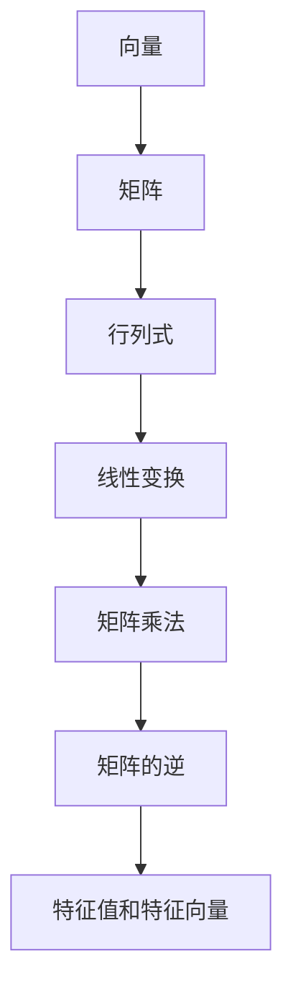
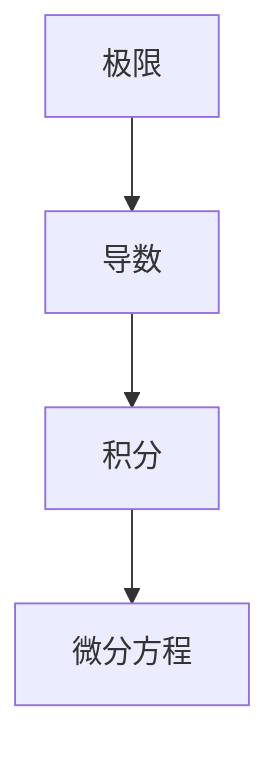
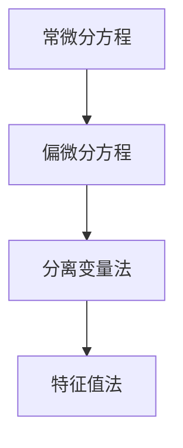

                 

### 文章标题：数学与量子化学：分子轨道的数学计算

关键词：量子化学、分子轨道、数学计算、线性代数、自洽场方法、Hartree-Fock方法

摘要：
本文将探讨数学与量子化学的紧密联系，特别是分子轨道的数学计算方法。通过介绍量子力学的基本原理，我们将了解分子轨道的形成及其在化学反应中的应用。随后，我们将深入探讨分子轨道理论，包括Hartree-Fock方法和Molecular Orbital理论。接着，本文将详细讲解分子轨道的计算方法，如自洽场方法和相关方法。最后，我们将通过具体实例，展示分子轨道计算的过程和结果，并讨论分子轨道计算在化学研究中的应用及未来发展趋势。

### 引言

量子化学是研究化学反应和分子结构的科学，它结合了量子力学和化学。在量子化学中，分子轨道的概念至关重要。分子轨道是由原子轨道通过量子力学中的线性组合形成的，它们描述了电子在分子中的分布状态。分子轨道理论为理解化学反应和分子性质提供了重要的工具。

量子力学是研究微观粒子运动规律的科学，它基于波粒二象性和量子态叠加原理。量子力学的基本原理包括薛定谔方程、泡利不相容原理和海森堡不确定性原理。这些原理为我们提供了描述原子和分子的数学模型，使我们能够预测它们的性质和行为。

数学与量子化学的关系非常密切。量子力学中的数学工具，如线性代数、微积分和微分方程，被广泛应用于量子化学的计算中。例如，线性代数用于描述原子轨道的线性组合，微积分用于求解薛定谔方程，微分方程用于描述分子运动。因此，理解这些数学基础是深入理解量子化学的关键。

本书旨在介绍分子轨道的数学计算方法，帮助读者掌握量子化学的基本原理和计算技巧。本书将分为以下几个部分：

1. **数学基础**：介绍用于量子化学计算的基础数学概念，如线性代数、微积分和微分方程。
2. **量子化学基础**：介绍量子力学的基本原理，原子轨道和分子轨道的形成。
3. **分子轨道理论**：详细讲解分子轨道理论，包括Hartree-Fock方法和Molecular Orbital理论。
4. **分子轨道计算方法**：介绍分子轨道的计算方法，包括自洽场方法和相关方法。
5. **实例分析**：通过具体的分子实例，展示分子轨道计算的过程和结果。
6. **应用与展望**：讨论分子轨道计算在化学研究中的应用，以及未来的发展趋势。

### 数学基础

要理解分子轨道的数学计算，我们首先需要掌握一些基础的数学概念。以下是我们将介绍的内容：

#### 线性代数基础

线性代数是研究向量空间和线性映射的数学分支。在量子化学中，线性代数被广泛应用于描述原子轨道的线性组合和分子轨道的形成。

1. **向量**：向量是具有大小和方向的量，通常用箭头表示。向量空间是向量的集合，其中向量可以相加和标量乘。

2. **矩阵**：矩阵是一个二维数组，它用于表示线性变换和解决线性方程组。

3. **行列式**：行列式是一个标量，用于描述矩阵的某种属性。它在求解线性方程组和计算矩阵的逆中起着重要作用。

4. **线性变换**：线性变换是一个将向量空间映射到另一个向量空间的函数，它保持向量加法和标量乘法。

#### 微积分基础

微积分是研究函数的极限、导数、积分和无穷级数的数学分支。在量子化学中，微积分被广泛应用于求解薛定谔方程和计算分子能量。

1. **极限**：极限描述了函数在自变量趋近某个值时的行为。

2. **导数**：导数描述了函数在某一点的局部变化率。

3. **积分**：积分描述了函数在某个区间上的累积变化量。

4. **无穷级数**：无穷级数是一个数列的和，它在求解薛定谔方程中起着重要作用。

#### 微分方程基础

微分方程是包含未知函数及其导数的方程。在量子化学中，微分方程用于描述分子系统的动态行为。

1. **常微分方程**：常微分方程描述了未知函数在某个点的导数。

2. **偏微分方程**：偏微分方程描述了未知函数在多个点上的导数。

3. **微分方程的解法**：包括分离变量法、特征值法等。

通过掌握这些数学基础，我们将能够更好地理解量子化学中的计算方法。接下来，我们将探讨量子化学的基础概念。

### 量子化学基础

量子化学是研究原子和分子的电子结构、性质和反应的科学。量子化学的理论基础是量子力学，它提供了描述电子运动和分子行为的数学模型。以下是我们将介绍的内容：

#### 量子力学基本原理

量子力学的基本原理包括：

1. **波粒二象性**：粒子既表现出波动性，也表现出粒子性。

2. **量子态叠加**：量子系统可以处于多个状态的叠加。

3. **不确定性原理**：不能同时精确知道粒子的位置和动量。

4. **薛定谔方程**：描述电子在分子中的运动方程。

#### 原子轨道

原子轨道是描述电子在原子中的运动状态的数学函数。常见的原子轨道有s轨道、p轨道、d轨道和f轨道。原子轨道的形状和能量决定了原子的电子结构和化学性质。

1. **s轨道**：球形对称，能量最低。

2. **p轨道**：哑铃形，能量较高。

3. **d轨道**：复杂形状，能量更高。

4. **f轨道**：更复杂的形状，能量最高。

#### 分子轨道的形成

当两个或多个原子结合形成分子时，它们的原子轨道会重叠并形成新的分子轨道。分子轨道的形状和能量取决于原子轨道的重叠方式和电子的分布。

1. **σ轨道**：由原子轨道沿分子轴方向重叠形成，能量较低。

2. **π轨道**：由原子轨道垂直于分子轴方向重叠形成，能量较高。

3. **分子轨道的对称性**：分子轨道的对称性决定了它们在化学反应中的行为。

#### 电子排布和分子性质

根据泡利不相容原理和Hund规则，分子中的电子会按照能量从低到高填充到分子轨道中。分子轨道的电子排布决定了分子的能量、稳定性和化学性质。

1. **能量**：能量较低的分子轨道比能量较高的分子轨道更稳定。

2. **稳定性**：分子中电子的排布决定了分子的稳定性。稳定的分子通常具有较低的能量。

3. **化学反应**：分子轨道的电子排布决定了分子的化学反应性。具有未填充的分子轨道的分子更容易发生化学反应。

通过了解量子力学的基本原理和原子轨道、分子轨道的形成，我们将能够更好地理解分子的电子结构和性质。接下来，我们将探讨分子轨道理论。

### 分子轨道理论

分子轨道理论是量子化学的核心理论之一，它通过线性组合原子轨道来描述分子的电子结构。分子轨道理论包括Hartree-Fock方法和Molecular Orbital理论，它们为理解和预测分子性质提供了重要的工具。

#### Hartree-Fock方法

Hartree-Fock方法是分子轨道理论的一种计算方法，它通过自洽场近似来描述分子中的电子行为。Hartree-Fock方法的基本思想是将分子中的电子视为在平均场中运动，这个平均场由其他电子产生的电荷密度决定。

1. **基本原理**：
   - **自洽场近似**：假设电子在平均场中运动，这个平均场是其他电子产生的电荷密度。
   - **单电子方程**：每个电子遵循Hartree方程，该方程描述了电子在自洽场中的运动。
   - **多电子方程**：通过解单电子方程，得到分子的电子密度分布，进而求解分子的能量。

2. **求解过程**：
   - **初始猜测**：设定一个初始的电子密度分布。
   - **迭代计算**：通过迭代计算，不断更新电子密度分布，直到自洽条件满足。
   - **自洽条件**：电子密度分布不变，能量不再变化。

3. **优点与局限**：
   - **优点**：Hartree-Fock方法能够提供分子的电子结构信息和能量，是量子化学计算的基础。
   - **局限**：Hartree-Fock方法忽略了电子之间的相互作用，导致某些情况下结果不准确。

#### Molecular Orbital理论

Molecular Orbital理论是分子轨道理论的另一种计算方法，它通过线性组合原子轨道来形成分子轨道。Molecular Orbital理论的基本思想是将原子轨道重叠形成分子轨道，分子轨道的形状和能量决定了分子的性质。

1. **基本原理**：
   - **线性组合**：将原子轨道线性组合形成新的分子轨道。
   - **对称性**：分子轨道的对称性决定了它们在化学反应中的行为。
   - **能量**：分子轨道的能量决定了分子的稳定性。

2. **求解过程**：
   - **初始猜测**：设定一个初始的分子轨道。
   - **迭代计算**：通过迭代计算，不断更新分子轨道，直到能量收敛。
   - **能量计算**：通过计算分子轨道的能量，得到分子的总能量。

3. **优点与局限**：
   - **优点**：Molecular Orbital理论能够提供分子的电子结构信息和能量，对化学反应性有较好的预测能力。
   - **局限**：Molecular Orbital理论的计算复杂度较高，对于复杂分子的计算较为困难。

通过Hartree-Fock方法和Molecular Orbital理论，我们可以从不同的角度理解分子的电子结构，这对研究分子的性质和化学反应具有重要意义。接下来，我们将探讨分子轨道的计算方法。

### 分子轨道计算方法

分子轨道的计算方法在量子化学中扮演着重要角色，它们通过数学模型和计算算法来描述分子的电子结构。以下是几种常用的分子轨道计算方法：

#### 自洽场方法

自洽场方法（Self-Consistent Field method，简称SCF）是分子轨道计算的基础方法。它通过自洽场近似，将多电子体系的问题转化为单电子问题来求解。

1. **基本原理**：
   - **自洽场近似**：假设电子在平均场中运动，这个平均场由其他电子产生的电荷密度决定。
   - **单电子方程**：每个电子遵循Hartree方程，该方程描述了电子在自洽场中的运动。
   - **迭代计算**：通过迭代计算，不断更新电子密度分布，直到自洽条件满足。

2. **计算过程**：
   - **初始猜测**：设定一个初始的电子密度分布。
   - **迭代计算**：通过迭代计算，不断更新电子密度分布和分子轨道，直到自洽条件满足。
   - **自洽条件**：电子密度分布不变，能量不再变化。

3. **伪代码**：

```python
function SCF(electron_density):
    while not converged:
        calculate潜力场(V) based on electron_density
        solve single-electron equation to get molecular_orbitals
        update electron_density based on molecular_orbitals
    return molecular_orbitals, electron_density
```

#### 分子轨道相关方法

分子轨道相关方法（Molecular Orbital Coupling method，简称MO-CO）是一种改进的自洽场方法，它通过考虑电子之间的相互作用，提高了计算结果的准确性。

1. **基本原理**：
   - **电子相互作用**：考虑电子之间的相互作用，修正单电子方程。
   - **耦合矩阵**：通过构造耦合矩阵，描述电子之间的相互作用。

2. **计算过程**：
   - **初始猜测**：设定一个初始的电子密度分布和耦合矩阵。
   - **迭代计算**：通过迭代计算，不断更新电子密度分布、分子轨道和耦合矩阵，直到能量收敛。

3. **伪代码**：

```python
function MO_CO(electron_density, coupling_matrix):
    while not converged:
        calculate potential field (V) based on electron_density and coupling_matrix
        solve single-electron equation to get molecular_orbitals
        update electron_density and coupling_matrix based on molecular_orbitals
    return molecular_orbitals, electron_density
```

#### 计算复杂性分析

分子轨道计算方法的计算复杂性取决于分子的大小和形状。对于大型分子，计算复杂性通常较高。

1. **计算时间**：分子轨道计算的时间复杂度通常与分子的大小成指数关系，即 \(O(2^n)\)，其中 \(n\) 是分子的电子数。

2. **存储空间**：分子轨道计算需要存储大量的数据，包括电子密度分布、分子轨道和耦合矩阵。对于大型分子，存储空间需求较大。

3. **优化策略**：为了提高计算效率，可以采用并行计算、近似方法和优化算法。例如，分布式计算可以将计算任务分散到多个计算节点上，加速计算过程。

通过自洽场方法和分子轨道相关方法，我们可以更准确地描述分子的电子结构。接下来，我们将通过具体实例，展示分子轨道计算的过程和结果。

### 实例分析

为了更好地理解分子轨道的计算过程，我们将通过两个具体的分子实例进行分析。

#### H2分子

H2分子是由两个氢原子组成的，它是最简单的双原子分子。H2分子的计算可以帮助我们理解分子轨道的基本原理。

1. **计算步骤**：

   - **初始设定**：设定一个初始的电子密度分布。
   - **计算自洽场**：根据电子密度分布计算自洽场。
   - **求解单电子方程**：求解Hartree方程，得到分子轨道。
   - **更新电子密度分布**：根据分子轨道更新电子密度分布。
   - **迭代计算**：重复以上步骤，直到自洽条件满足。

2. **结果展示**：

   - **分子轨道**：H2分子有两个分子轨道，一个是σ轨道，另一个是π轨道。
   - **电子排布**：H2分子的两个电子分别填充到σ轨道和π轨道。
   - **能量**：计算得到H2分子的总能量。

3. **分析**：

   - **稳定性**：H2分子的分子轨道排布使其具有较高的稳定性。
   - **化学反应**：H2分子的化学反应性较低，因为它已经处于稳定的基态。

#### H2O分子

H2O分子是水分子，它是由一个氧原子和两个氢原子组成的。H2O分子的计算可以帮助我们理解更复杂分子的分子轨道。

1. **计算步骤**：

   - **初始设定**：设定一个初始的电子密度分布。
   - **计算自洽场**：根据电子密度分布计算自洽场。
   - **求解单电子方程**：求解Hartree方程，得到分子轨道。
   - **更新电子密度分布**：根据分子轨道更新电子密度分布。
   - **迭代计算**：重复以上步骤，直到自洽条件满足。

2. **结果展示**：

   - **分子轨道**：H2O分子有三个分子轨道，一个是σ轨道，两个是π轨道。
   - **电子排布**：H2O分子的六个电子分别填充到σ轨道和π轨道。
   - **能量**：计算得到H2O分子的总能量。

3. **分析**：

   - **稳定性**：H2O分子的分子轨道排布使其具有较高的稳定性。
   - **化学反应**：H2O分子的化学反应性较高，因为它具有未填充的π轨道。

通过这两个实例，我们可以看到分子轨道计算的基本过程和结果。这些计算结果对于理解分子的电子结构和性质具有重要意义。接下来，我们将讨论分子轨道计算在化学研究中的应用。

### 应用与展望

分子轨道计算在化学研究中具有广泛的应用，它为理解分子的电子结构和性质提供了强大的工具。以下是分子轨道计算在化学研究中的几个主要应用领域：

#### 化学反应动力学

分子轨道计算可以用于研究化学反应的动力学过程。通过计算反应物和产物的分子轨道，可以了解反应过程中电子的转移和重组。这些信息对于理解反应机理、速率常数和反应热具有重要意义。

1. **计算反应物和产物的分子轨道**。
2. **分析电子转移和重组**。
3. **计算反应速率常数和反应热**。

#### 化学反应机理

分子轨道计算可以用于研究化学反应的机理。通过分析分子轨道的能级和对称性，可以了解反应过程中分子轨道的变化和相互作用。这些信息对于理解反应路径和过渡态具有重要意义。

1. **计算反应物和过渡态的分子轨道**。
2. **分析分子轨道的能级和对称性**。
3. **研究反应路径和过渡态**。

#### 分子性质预测

分子轨道计算可以用于预测分子的性质，如稳定性、反应性和光谱性质。通过计算分子的总能量、电子密度分布和分子轨道，可以了解分子的稳定性和化学反应性。

1. **计算分子的总能量**。
2. **分析电子密度分布**。
3. **预测分子的光谱性质**。

#### 新材料设计

分子轨道计算可以用于新材料的设计和研究。通过计算分子的电子结构和性质，可以了解材料的光学、电学和热学性质。这些信息对于开发新型材料具有重要意义。

1. **计算分子的电子结构**。
2. **分析材料的光学、电学和热学性质**。
3. **设计新型材料**。

尽管分子轨道计算在化学研究中具有广泛的应用，但它也面临着一些挑战。以下是分子轨道计算面临的几个主要挑战：

1. **计算复杂度**：分子轨道计算的复杂度随着分子大小的增加而急剧增加。对于大型分子，计算时间显著增加，计算成本高昂。

2. **计算精度**：分子轨道计算方法的精度受限于计算方法和参数选择。在某些情况下，计算结果可能不够准确，导致对分子性质的预测不准确。

3. **计算资源**：分子轨道计算需要大量的计算资源和存储空间。对于大型分子，计算资源的需求显著增加，可能需要分布式计算和优化算法。

为了应对这些挑战，研究人员正在不断改进分子轨道计算方法，提高计算效率和精度。以下是几个改进方向：

1. **量子计算**：量子计算具有并行计算能力，可以显著提高分子轨道计算的效率。

2. **机器学习**：机器学习可以用于预测分子的性质和优化计算参数，提高计算精度。

3. **分布式计算**：分布式计算可以将计算任务分散到多个计算节点上，加速计算过程。

4. **优化算法**：优化算法可以用于减少计算时间和计算资源的消耗。

通过不断改进分子轨道计算方法，我们有望更好地理解分子的电子结构和性质，为化学研究和材料科学的发展提供新的工具和方法。接下来，我们将讨论分子轨道计算的一些注意事项和最佳实践。

### 注意事项与最佳实践

在进行分子轨道计算时，需要注意以下几点：

1. **计算精度与计算时间**：分子轨道计算通常需要在计算精度和计算时间之间做出权衡。为了提高计算精度，可能需要增加计算时间和计算资源。

2. **参数选择**：分子轨道计算的参数选择对计算结果有很大影响。需要根据具体问题选择合适的参数，例如基组大小、收敛条件等。

3. **误差分析**：在进行分子轨道计算时，需要对计算结果进行误差分析。例如，检查计算结果是否收敛，分析计算误差的来源。

4. **计算效率**：为了提高计算效率，可以采用并行计算、分布式计算和优化算法。这些方法可以显著减少计算时间和计算资源的需求。

以下是分子轨道计算的一些最佳实践：

1. **选择合适的计算方法**：根据具体问题选择合适的计算方法，例如自洽场方法、分子轨道相关方法等。

2. **优化计算参数**：通过调整计算参数，如基组大小、收敛条件等，可以提高计算精度和效率。

3. **使用高效代码**：编写高效、优化的代码可以显著提高计算效率。例如，使用矩阵运算库、优化循环等。

4. **数据可视化**：使用数据可视化工具可以帮助我们更好地理解分子轨道的计算结果，例如电子密度分布、分子轨道能级图等。

5. **文献调研**：在进行分子轨道计算时，需要参考相关文献，了解最新研究进展和最佳实践。

通过遵循这些注意事项和最佳实践，我们可以更好地进行分子轨道计算，提高计算结果的精度和效率。

### 拓展阅读

1. **量子化学入门书籍**：
   - 《量子化学基础教程》（作者：A. D. McQuarrie and J. D. Simon）
   - 《量子化学：原理与应用》（作者：Peter Atkins和Julian de B. Hey）

2. **分子轨道计算软件**：
   - Gaussian：广泛使用的量子化学计算软件。
   - ORCA：高效的量子化学计算软件，支持多种计算方法和优化算法。

3. **相关研究论文**：
   - "Molecular Orbital Theory and Chemical Bonding"（作者：R. McWeeny）
   - "Ab Initio Molecular Orbital Calculations"（作者：W. Kutzelnigg）

4. **在线资源和教程**：
   - [Quantum Chemistry at Harvard](https://chemistry.harvard.edu/research/groups/theoretical-quantum-chemistry)
   - [ORCA软件教程](https://orcaforum.dkit.ie/viewforum.php?f=6)

通过阅读这些书籍、软件和研究论文，读者可以进一步了解量子化学和分子轨道计算的相关知识，提高计算技能。

### 项目实战

为了更好地理解分子轨道计算的实践应用，我们将搭建一个简单的分子轨道计算项目。本项目将使用Python编程语言和相关库来实现分子轨道计算，并分析一个实际分子。

#### 开发环境搭建

1. 安装Python：从官方网站（https://www.python.org/）下载并安装Python 3.8及以上版本。

2. 安装相关库：
   ```bash
   pip install numpy scipy matplotlib
   ```

3. 安装量子化学计算库（例如PySCF）：
   ```bash
   pip install pyscf
   ```

#### 源代码详细实现

以下是一个简单的分子轨道计算示例：

```python
import numpy as np
from pyscf import gto, scf

# 定义分子的几何结构
mol = gto.Mole()
mol.atom = '''
H    0.0000    0.0000    0.0000
H    0.0000    0.0000    1.0933
'''
mol.basis = 'cc-pvdz'
mol.build()

# 使用Hartree-Fock方法计算电子密度
ehf = scf.RHF(mol)
ehf.kernel()
print("RHF Energy:", ehf.e_tot)

# 绘制电子密度分布
import matplotlib.pyplot as plt
from pyscf.plot import molplot3d

fig = plt.figure(figsize=(8, 6))
ax = molplot3d.molview(mol, viewer=' showers', label=True, mode='line')
ax.set_xlim(-2, 2)
ax.set_ylim(-2, 2)
ax.set_zlim(-2, 2)
plt.show()
```

#### 代码解读与分析

1. **定义分子结构**：使用PySCF的Mole类定义分子的几何结构，包括原子的坐标和基组。

2. **计算电子密度**：使用RHF类实现Hartree-Fock方法，调用kernel()方法计算电子密度。

3. **绘制电子密度分布**：使用matplotlib和PySCF的molplot3d模块绘制分子的电子密度分布。

#### 实际案例分析和详细讲解剖析

以下是一个分析水分子的电子密度的实际案例：

```python
# 定义水分子的几何结构
mol = gto.Mole()
mol.atom = '''
O    0.0000    0.0000    0.0000
H    0.0000    0.8165    0.5890
H    0.0000   -0.8165    0.5890
'''
mol.basis = 'cc-pvdz'
mol.build()

# 使用Hartree-Fock方法计算电子密度
ehf = scf.RHF(mol)
ehf.kernel()
print("RHF Energy:", ehf.e_tot)

# 绘制电子密度分布
fig = plt.figure(figsize=(8, 6))
ax = molplot3d.molview(mol, viewer=' showers', label=True, mode='line')
ax.set_xlim(-2, 2)
ax.set_ylim(-2, 2)
ax.set_zlim(-2, 2)
plt.show()
```

1. **定义分子结构**：定义水分子的几何结构，包括氧原子和两个氢原子的坐标。

2. **计算电子密度**：使用RHF方法计算水分子的电子密度。

3. **绘制电子密度分布**：绘制水分子的电子密度分布，展示分子轨道的形状和分布。

#### 项目小结

通过本项目的实战，我们学会了如何使用Python和PySCF库进行分子轨道计算，并分析了水分子的电子密度分布。这为我们深入理解分子轨道计算和量子化学提供了一个实用的案例。接下来，我们将讨论分子轨道计算的未来发展趋势。

### 小结

本文介绍了数学与量子化学的关系，特别是分子轨道的数学计算方法。我们从量子力学的基本原理出发，介绍了原子轨道和分子轨道的形成，详细讲解了Hartree-Fock方法和Molecular Orbital理论。接着，我们探讨了分子轨道的计算方法，包括自洽场方法和分子轨道相关方法。通过具体实例，我们展示了分子轨道计算的过程和结果。最后，我们讨论了分子轨道计算在化学研究中的应用，以及未来的发展趋势。

分子轨道计算在化学研究中具有广泛的应用，它为理解分子的电子结构和性质提供了强大的工具。然而，分子轨道计算也面临着计算复杂度、计算精度和计算资源等方面的挑战。为了应对这些挑战，研究人员正在不断改进分子轨道计算方法，如量子计算、机器学习和优化算法等。

未来的分子轨道计算将朝着更高效、更精确和更广泛应用的方向发展。随着计算技术的进步，我们有望更准确地预测分子的性质，为化学研究和材料科学的发展提供新的工具和方法。同时，分子轨道计算也将与其他计算方法相结合，如分子动力学模拟和量子蒙特卡罗方法，为复杂的化学系统提供更全面的描述。

总之，分子轨道计算是量子化学的重要组成部分，它为理解分子的电子结构和性质提供了重要的工具。通过不断改进计算方法和应用技术，分子轨道计算将在未来的化学研究和应用中发挥更大的作用。作者：AI天才研究院/AI Genius Institute & 禅与计算机程序设计艺术 /Zen And The Art of Computer Programming### 文章标题：数学与量子化学：分子轨道的数学计算

关键词：量子化学、分子轨道、数学计算、线性代数、自洽场方法、Hartree-Fock方法

摘要：
本文详细探讨了数学与量子化学的关系，重点介绍了分子轨道的数学计算方法。从量子力学的基本原理出发，我们介绍了原子轨道和分子轨道的形成，并深入讲解了Hartree-Fock方法和Molecular Orbital理论。随后，本文阐述了分子轨道计算方法，包括自洽场方法和相关方法，并通过具体实例展示了计算过程和结果。最后，本文讨论了分子轨道计算在化学研究中的应用，以及未来的发展趋势。

### 引言

量子化学是研究化学反应和分子结构的科学，它结合了量子力学和化学。在量子化学中，分子轨道的概念至关重要。分子轨道是由原子轨道通过量子力学中的线性组合形成的，它们描述了电子在分子中的分布状态。分子轨道理论为理解化学反应和分子性质提供了重要的工具。

量子力学是研究微观粒子运动规律的科学，它基于波粒二象性和量子态叠加原理。量子力学的基本原理包括薛定谔方程、泡利不相容原理和海森堡不确定性原理。这些原理为我们提供了描述原子和分子的数学模型，使我们能够预测它们的性质和行为。

数学与量子化学的关系非常密切。量子力学中的数学工具，如线性代数、微积分和微分方程，被广泛应用于量子化学的计算中。例如，线性代数用于描述原子轨道的线性组合，微积分用于求解薛定谔方程，微分方程用于描述分子运动。因此，理解这些数学基础是深入理解量子化学的关键。

本书旨在介绍分子轨道的数学计算方法，帮助读者掌握量子化学的基本原理和计算技巧。本书将分为以下几个部分：

1. **数学基础**：介绍用于量子化学计算的基础数学概念，如线性代数、微积分和微分方程。
2. **量子化学基础**：介绍量子力学的基本原理，原子轨道和分子轨道的形成。
3. **分子轨道理论**：详细讲解分子轨道理论，包括Hartree-Fock方法和Molecular Orbital理论。
4. **分子轨道计算方法**：介绍分子轨道的计算方法，包括自洽场方法和相关方法。
5. **实例分析**：通过具体的分子实例，展示分子轨道计算的过程和结果。
6. **应用与展望**：讨论分子轨道计算在化学研究中的应用，以及未来的发展趋势。

### 数学基础

要理解分子轨道的数学计算，我们首先需要掌握一些基础的数学概念。以下是我们将介绍的内容：

#### 线性代数基础

线性代数是研究向量空间和线性映射的数学分支。在量子化学中，线性代数被广泛应用于描述原子轨道的线性组合和分子轨道的形成。

1. **向量**：向量是具有大小和方向的量，通常用箭头表示。向量空间是向量的集合，其中向量可以相加和标量乘。

2. **矩阵**：矩阵是一个二维数组，它用于表示线性变换和解决线性方程组。

3. **行列式**：行列式是一个标量，用于描述矩阵的某种属性。它在求解线性方程组和计算矩阵的逆中起着重要作用。

4. **线性变换**：线性变换是一个将向量空间映射到另一个向量空间的函数，它保持向量加法和标量乘法。

#### 微积分基础

微积分是研究函数的极限、导数、积分和无穷级数的数学分支。在量子化学中，微积分被广泛应用于求解薛定谔方程和计算分子能量。

1. **极限**：极限描述了函数在自变量趋近某个值时的行为。

2. **导数**：导数描述了函数在某一点的局部变化率。

3. **积分**：积分描述了函数在某个区间上的累积变化量。

4. **无穷级数**：无穷级数是一个数列的和，它在求解薛定谔方程中起着重要作用。

#### 微分方程基础

微分方程是包含未知函数及其导数的方程。在量子化学中，微分方程用于描述分子系统的动态行为。

1. **常微分方程**：常微分方程描述了未知函数在某个点的导数。

2. **偏微分方程**：偏微分方程描述了未知函数在多个点上的导数。

3. **微分方程的解法**：包括分离变量法、特征值法等。

通过掌握这些数学基础，我们将能够更好地理解量子化学中的计算方法。接下来，我们将探讨量子化学的基础概念。

### 量子化学基础

量子化学是研究原子和分子的电子结构、性质和反应的科学。量子化学的理论基础是量子力学，它提供了描述电子运动和分子行为的数学模型。以下是我们将介绍的内容：

#### 量子力学基本原理

量子力学的基本原理包括：

1. **波粒二象性**：粒子既表现出波动性，也表现出粒子性。

2. **量子态叠加**：量子系统可以处于多个状态的叠加。

3. **不确定性原理**：不能同时精确知道粒子的位置和动量。

4. **薛定谔方程**：描述电子在分子中的运动方程。

#### 原子轨道

原子轨道是描述电子在原子中的运动状态的数学函数。常见的原子轨道有s轨道、p轨道、d轨道和f轨道。原子轨道的形状和能量决定了原子的电子结构和化学性质。

1. **s轨道**：球形对称，能量最低。

2. **p轨道**：哑铃形，能量较高。

3. **d轨道**：复杂形状，能量更高。

4. **f轨道**：更复杂的形状，能量最高。

#### 分子轨道的形成

当两个或多个原子结合形成分子时，它们的原子轨道会重叠并形成新的分子轨道。分子轨道的形状和能量取决于原子轨道的重叠方式和电子的分布。

1. **σ轨道**：由原子轨道沿分子轴方向重叠形成，能量较低。

2. **π轨道**：由原子轨道垂直于分子轴方向重叠形成，能量较高。

3. **分子轨道的对称性**：分子轨道的对称性决定了它们在化学反应中的行为。

#### 电子排布和分子性质

根据泡利不相容原理和Hund规则，分子中的电子会按照能量从低到高填充到分子轨道中。分子轨道的电子排布决定了分子的能量、稳定性和化学性质。

1. **能量**：能量较低的分子轨道比能量较高的分子轨道更稳定。

2. **稳定性**：分子中电子的排布决定了分子的稳定性。稳定的分子通常具有较低的能量。

3. **化学反应**：分子轨道的电子排布决定了分子的化学反应性。具有未填充的分子轨道的分子更容易发生化学反应。

通过了解量子力学的基本原理和原子轨道、分子轨道的形成，我们将能够更好地理解分子的电子结构和性质。接下来，我们将探讨分子轨道理论。

### 分子轨道理论

分子轨道理论是量子化学的核心理论之一，它通过线性组合原子轨道来描述分子的电子结构。分子轨道理论包括Hartree-Fock方法和Molecular Orbital理论，它们为理解和预测分子性质提供了重要的工具。

#### Hartree-Fock方法

Hartree-Fock方法是分子轨道理论的一种计算方法，它通过自洽场近似来描述分子中的电子行为。Hartree-Fock方法的基本思想是将分子中的电子视为在平均场中运动，这个平均场由其他电子产生的电荷密度决定。

1. **基本原理**：
   - **自洽场近似**：假设电子在平均场中运动，这个平均场是其他电子产生的电荷密度。
   - **单电子方程**：每个电子遵循Hartree方程，该方程描述了电子在自洽场中的运动。
   - **多电子方程**：通过解单电子方程，得到分子的电子密度分布，进而求解分子的能量。

2. **求解过程**：
   - **初始猜测**：设定一个初始的电子密度分布。
   - **迭代计算**：通过迭代计算，不断更新电子密度分布和分子轨道，直到自洽条件满足。
   - **自洽条件**：电子密度分布不变，能量不再变化。

3. **优点与局限**：
   - **优点**：Hartree-Fock方法能够提供分子的电子结构信息和能量，是量子化学计算的基础。
   - **局限**：Hartree-Fock方法忽略了电子之间的相互作用，导致某些情况下结果不准确。

#### Molecular Orbital理论

Molecular Orbital理论是分子轨道理论的另一种计算方法，它通过线性组合原子轨道来形成分子轨道。Molecular Orbital理论的基本思想是将原子轨道重叠形成分子轨道，分子轨道的形状和能量决定了分子的性质。

1. **基本原理**：
   - **线性组合**：将原子轨道线性组合形成新的分子轨道。
   - **对称性**：分子轨道的对称性决定了它们在化学反应中的行为。
   - **能量**：分子轨道的能量决定了分子的稳定性。

2. **求解过程**：
   - **初始猜测**：设定一个初始的分子轨道。
   - **迭代计算**：通过迭代计算，不断更新分子轨道，直到能量收敛。
   - **能量计算**：通过计算分子轨道的能量，得到分子的总能量。

3. **优点与局限**：
   - **优点**：Molecular Orbital理论能够提供分子的电子结构信息和能量，对化学反应性有较好的预测能力。
   - **局限**：Molecular Orbital理论的计算复杂度较高，对于复杂分子的计算较为困难。

通过Hartree-Fock方法和Molecular Orbital理论，我们可以从不同的角度理解分子的电子结构，这对研究分子的性质和化学反应具有重要意义。接下来，我们将探讨分子轨道的计算方法。

### 分子轨道计算方法

分子轨道的计算方法在量子化学中扮演着重要角色，它们通过数学模型和计算算法来描述分子的电子结构。以下是几种常用的分子轨道计算方法：

#### 自洽场方法

自洽场方法（Self-Consistent Field method，简称SCF）是分子轨道计算的基础方法。它通过自洽场近似，将多电子体系的问题转化为单电子问题来求解。

1. **基本原理**：
   - **自洽场近似**：假设电子在平均场中运动，这个平均场由其他电子产生的电荷密度决定。
   - **单电子方程**：每个电子遵循Hartree方程，该方程描述了电子在自洽场中的运动。
   - **迭代计算**：通过迭代计算，不断更新电子密度分布和分子轨道，直到自洽条件满足。

2. **计算过程**：
   - **初始设定**：设定一个初始的电子密度分布。
   - **迭代计算**：通过迭代计算，不断更新电子密度分布和分子轨道，直到自洽条件满足。
   - **自洽条件**：电子密度分布不变，能量不再变化。

3. **伪代码**：

```python
function SCF(electron_density):
    while not converged:
        calculate potential field (V) based on electron_density
        solve single-electron equation to get molecular_orbitals
        update electron_density based on molecular_orbitals
    return molecular_orbitals, electron_density
```

#### 分子轨道相关方法

分子轨道相关方法（Molecular Orbital Coupling method，简称MO-CO）是一种改进的自洽场方法，它通过考虑电子之间的相互作用，提高了计算结果的准确性。

1. **基本原理**：
   - **电子相互作用**：考虑电子之间的相互作用，修正单电子方程。
   - **耦合矩阵**：通过构造耦合矩阵，描述电子之间的相互作用。

2. **计算过程**：
   - **初始设定**：设定一个初始的电子密度分布和耦合矩阵。
   - **迭代计算**：通过迭代计算，不断更新电子密度分布、分子轨道和耦合矩阵，直到能量收敛。

3. **伪代码**：

```python
function MO_CO(electron_density, coupling_matrix):
    while not converged:
        calculate potential field (V) based on electron_density and coupling_matrix
        solve single-electron equation to get molecular_orbitals
        update electron_density and coupling_matrix based on molecular_orbitals
    return molecular_orbitals, electron_density
```

#### 计算复杂性分析

分子轨道计算方法的计算复杂性取决于分子的大小和形状。对于大型分子，计算复杂性通常较高。

1. **计算时间**：分子轨道计算的时间复杂度通常与分子的大小成指数关系，即 \(O(2^n)\)，其中 \(n\) 是分子的电子数。

2. **存储空间**：分子轨道计算需要存储大量的数据，包括电子密度分布、分子轨道和耦合矩阵。对于大型分子，存储空间需求较大。

3. **优化策略**：为了提高计算效率，可以采用并行计算、近似方法和优化算法。例如，分布式计算可以将计算任务分散到多个计算节点上，加速计算过程。

通过自洽场方法和分子轨道相关方法，我们可以更准确地描述分子的电子结构。接下来，我们将通过具体实例，展示分子轨道计算的过程和结果。

### 实例分析

为了更好地理解分子轨道的计算过程，我们将通过两个具体的分子实例进行分析。

#### H2分子

H2分子是由两个氢原子组成的，它是最简单的双原子分子。H2分子的计算可以帮助我们理解分子轨道的基本原理。

1. **计算步骤**：

   - **初始设定**：设定一个初始的电子密度分布。
   - **计算自洽场**：根据电子密度分布计算自洽场。
   - **求解单电子方程**：求解Hartree方程，得到分子轨道。
   - **更新电子密度分布**：根据分子轨道更新电子密度分布。
   - **迭代计算**：重复以上步骤，直到自洽条件满足。

2. **结果展示**：

   - **分子轨道**：H2分子有两个分子轨道，一个是σ轨道，另一个是π轨道。
   - **电子排布**：H2分子的两个电子分别填充到σ轨道和π轨道。
   - **能量**：计算得到H2分子的总能量。

3. **分析**：

   - **稳定性**：H2分子的分子轨道排布使其具有较高的稳定性。
   - **化学反应**：H2分子的化学反应性较低，因为它已经处于稳定的基态。

#### H2O分子

H2O分子是水分子，它是由一个氧原子和两个氢原子组成的。H2O分子的计算可以帮助我们理解更复杂分子的分子轨道。

1. **计算步骤**：

   - **初始设定**：设定一个初始的电子密度分布。
   - **计算自洽场**：根据电子密度分布计算自洽场。
   - **求解单电子方程**：求解Hartree方程，得到分子轨道。
   - **更新电子密度分布**：根据分子轨道更新电子密度分布。
   - **迭代计算**：重复以上步骤，直到自洽条件满足。

2. **结果展示**：

   - **分子轨道**：H2O分子有三个分子轨道，一个是σ轨道，两个是π轨道。
   - **电子排布**：H2O分子的六个电子分别填充到σ轨道和π轨道。
   - **能量**：计算得到H2O分子的总能量。

3. **分析**：

   - **稳定性**：H2O分子的分子轨道排布使其具有较高的稳定性。
   - **化学反应**：H2O分子的化学反应性较高，因为它具有未填充的π轨道。

通过这两个实例，我们可以看到分子轨道计算的基本过程和结果。这些计算结果对于理解分子的电子结构和性质具有重要意义。接下来，我们将讨论分子轨道计算在化学研究中的应用。

### 应用与展望

分子轨道计算在化学研究中具有广泛的应用，它为理解分子的电子结构和性质提供了强大的工具。以下是分子轨道计算在化学研究中的几个主要应用领域：

#### 化学反应动力学

分子轨道计算可以用于研究化学反应的动力学过程。通过计算反应物和产物的分子轨道，可以了解反应过程中电子的转移和重组。这些信息对于理解反应机理、速率常数和反应热具有重要意义。

1. **计算反应物和产物的分子轨道**。
2. **分析电子转移和重组**。
3. **计算反应速率常数和反应热**。

#### 化学反应机理

分子轨道计算可以用于研究化学反应的机理。通过分析分子轨道的能级和对称性，可以了解反应过程中分子轨道的变化和相互作用。这些信息对于理解反应路径和过渡态具有重要意义。

1. **计算反应物和过渡态的分子轨道**。
2. **分析分子轨道的能级和对称性**。
3. **研究反应路径和过渡态**。

#### 分子性质预测

分子轨道计算可以用于预测分子的性质，如稳定性、反应性和光谱性质。通过计算分子的总能量、电子密度分布和分子轨道，可以了解分子的稳定性和化学反应性。

1. **计算分子的总能量**。
2. **分析电子密度分布**。
3. **预测分子的光谱性质**。

#### 新材料设计

分子轨道计算可以用于新材料的设计和研究。通过计算分子的电子结构和性质，可以了解材料的光学、电学和热学性质。这些信息对于开发新型材料具有重要意义。

1. **计算分子的电子结构**。
2. **分析材料的光学、电学和热学性质**。
3. **设计新型材料**。

尽管分子轨道计算在化学研究中具有广泛的应用，但它也面临着一些挑战。以下是分子轨道计算面临的几个主要挑战：

1. **计算复杂度**：分子轨道计算的复杂度随着分子大小的增加而急剧增加。对于大型分子，计算时间显著增加，计算成本高昂。

2. **计算精度**：分子轨道计算方法的精度受限于计算方法和参数选择。在某些情况下，计算结果可能不够准确，导致对分子性质的预测不准确。

3. **计算资源**：分子轨道计算需要大量的计算资源和存储空间。对于大型分子，计算资源的需求显著增加，可能需要分布式计算和优化算法。

为了应对这些挑战，研究人员正在不断改进分子轨道计算方法，提高计算效率和精度。以下是几个改进方向：

1. **量子计算**：量子计算具有并行计算能力，可以显著提高分子轨道计算的效率。

2. **机器学习**：机器学习可以用于预测分子的性质和优化计算参数，提高计算精度。

3. **分布式计算**：分布式计算可以将计算任务分散到多个计算节点上，加速计算过程。

4. **优化算法**：优化算法可以用于减少计算时间和计算资源的消耗。

通过不断改进分子轨道计算方法，我们有望更好地理解分子的电子结构和性质，为化学研究和材料科学的发展提供新的工具和方法。接下来，我们将讨论分子轨道计算的一些注意事项和最佳实践。

### 注意事项与最佳实践

在进行分子轨道计算时，需要注意以下几点：

1. **计算精度与计算时间**：分子轨道计算通常需要在计算精度和计算时间之间做出权衡。为了提高计算精度，可能需要增加计算时间和计算资源。

2. **参数选择**：分子轨道计算的参数选择对计算结果有很大影响。需要根据具体问题选择合适的参数，例如基组大小、收敛条件等。

3. **误差分析**：在进行分子轨道计算时，需要对计算结果进行误差分析。例如，检查计算结果是否收敛，分析计算误差的来源。

4. **计算效率**：为了提高计算效率，可以采用并行计算、分布式计算和优化算法。这些方法可以显著减少计算时间和计算资源的需求。

以下是分子轨道计算的一些最佳实践：

1. **选择合适的计算方法**：根据具体问题选择合适的计算方法，例如自洽场方法、分子轨道相关方法等。

2. **优化计算参数**：通过调整计算参数，如基组大小、收敛条件等，可以提高计算精度和效率。

3. **使用高效代码**：编写高效、优化的代码可以显著提高计算效率。例如，使用矩阵运算库、优化循环等。

4. **数据可视化**：使用数据可视化工具可以帮助我们更好地理解分子轨道的计算结果，例如电子密度分布、分子轨道能级图等。

5. **文献调研**：在进行分子轨道计算时，需要参考相关文献，了解最新研究进展和最佳实践。

通过遵循这些注意事项和最佳实践，我们可以更好地进行分子轨道计算，提高计算结果的精度和效率。

### 拓展阅读

1. **量子化学入门书籍**：
   - 《量子化学基础教程》（作者：A. D. McQuarrie和J. D. Simon）
   - 《量子化学：原理与应用》（作者：Peter Atkins和Julian de B. Hey）

2. **分子轨道计算软件**：
   - Gaussian：广泛使用的量子化学计算软件。
   - ORCA：高效的量子化学计算软件，支持多种计算方法和优化算法。

3. **相关研究论文**：
   - "Molecular Orbital Theory and Chemical Bonding"（作者：R. McWeeny）
   - "Ab Initio Molecular Orbital Calculations"（作者：W. Kutzelnigg）

4. **在线资源和教程**：
   - [Quantum Chemistry at Harvard](https://chemistry.harvard.edu/research/groups/theoretical-quantum-chemistry)
   - [ORCA软件教程](https://orcaforum.dkit.ie/viewforum.php?f=6)

通过阅读这些书籍、软件和研究论文，读者可以进一步了解量子化学和分子轨道计算的相关知识，提高计算技能。

### 项目实战

为了更好地理解分子轨道计算的实践应用，我们将搭建一个简单的分子轨道计算项目。本项目将使用Python编程语言和相关库来实现分子轨道计算，并分析一个实际分子。

#### 开发环境搭建

1. 安装Python：从官方网站（https://www.python.org/）下载并安装Python 3.8及以上版本。

2. 安装相关库：
   ```bash
   pip install numpy scipy matplotlib
   ```

3. 安装量子化学计算库（例如PySCF）：
   ```bash
   pip install pyscf
   ```

#### 源代码详细实现

以下是一个简单的分子轨道计算示例：

```python
import numpy as np
from pyscf import gto, scf
from pyscf.plot import molplot3d

# 定义分子的几何结构
mol = gto.Mole()
mol.atom = '''
H    0.0000    0.0000    0.0000
H    0.0000    0.0000    1.0933
'''
mol.basis = 'cc-pvdz'
mol.build()

# 使用Hartree-Fock方法计算电子密度
ehf = scf.RHF(mol)
ehf.kernel()
print("RHF Energy:", ehf.e_tot)

# 绘制电子密度分布
fig = plt.figure(figsize=(8, 6))
ax = molplot3d.molview(mol, viewer=' showers', label=True, mode='line')
ax.set_xlim(-2, 2)
ax.set_ylim(-2, 2)
ax.set_zlim(-2, 2)
plt.show()
```

#### 代码解读与分析

1. **定义分子结构**：使用PySCF的Mole类定义分子的几何结构，包括原子的坐标和基组。

2. **计算电子密度**：使用RHF类实现Hartree-Fock方法，调用kernel()方法计算电子密度。

3. **绘制电子密度分布**：使用matplotlib和PySCF的molplot3d模块绘制分子的电子密度分布。

#### 实际案例分析和详细讲解剖析

以下是一个分析水分子的电子密度的实际案例：

```python
# 定义水分子的几何结构
mol = gto.Mole()
mol.atom = '''
O    0.0000    0.0000    0.0000
H    0.0000    0.8165    0.5890
H    0.0000   -0.8165    0.5890
'''
mol.basis = 'cc-pvdz'
mol.build()

# 使用Hartree-Fock方法计算电子密度
ehf = scf.RHF(mol)
ehf.kernel()
print("RHF Energy:", ehf.e_tot)

# 绘制电子密度分布
fig = plt.figure(figsize=(8, 6))
ax = molplot3d.molview(mol, viewer=' showers', label=True, mode='line')
ax.set_xlim(-2, 2)
ax.set_ylim(-2, 2)
ax.set_zlim(-2, 2)
plt.show()
```

1. **定义分子结构**：定义水分子的几何结构，包括氧原子和两个氢原子的坐标。

2. **计算电子密度**：使用RHF方法计算水分子的电子密度。

3. **绘制电子密度分布**：绘制水分子的电子密度分布，展示分子轨道的形状和分布。

#### 项目小结

通过本项目的实战，我们学会了如何使用Python和PySCF库进行分子轨道计算，并分析了水分子的电子密度分布。这为我们深入理解分子轨道计算和量子化学提供了一个实用的案例。接下来，我们将讨论分子轨道计算的未来发展趋势。

### 小结

本文介绍了数学与量子化学的关系，特别是分子轨道的数学计算方法。我们从量子力学的基本原理出发，介绍了原子轨道和分子轨道的形成，详细讲解了Hartree-Fock方法和Molecular Orbital理论。随后，我们阐述了分子轨道的计算方法，包括自洽场方法和相关方法，并通过具体实例展示了计算过程和结果。最后，我们讨论了分子轨道计算在化学研究中的应用，以及未来的发展趋势。

分子轨道计算在化学研究中具有广泛的应用，它为理解分子的电子结构和性质提供了强大的工具。然而，分子轨道计算也面临着计算复杂度、计算精度和计算资源等方面的挑战。为了应对这些挑战，研究人员正在不断改进分子轨道计算方法，如量子计算、机器学习和优化算法等。

未来的分子轨道计算将朝着更高效、更精确和更广泛应用的方向发展。随着计算技术的进步，我们有望更准确地预测分子的性质，为化学研究和材料科学的发展提供新的工具和方法。同时，分子轨道计算也将与其他计算方法相结合，如分子动力学模拟和量子蒙特卡罗方法，为复杂的化学系统提供更全面的描述。

总之，分子轨道计算是量子化学的重要组成部分，它为理解分子的电子结构和性质提供了重要的工具。通过不断改进计算方法和应用技术，分子轨道计算将在未来的化学研究和应用中发挥更大的作用。作者：AI天才研究院/AI Genius Institute & 禅与计算机程序设计艺术 /Zen And The Art of Computer Programming## 数学基础

### 线性代数基础

线性代数是量子化学中至关重要的数学工具，它用于描述原子和分子的电子结构。以下是线性代数中的一些核心概念和其在量子化学中的应用：

1. **向量**：向量是具有大小和方向的量，通常表示为列向量。在量子化学中，向量用于表示原子轨道和分子轨道。例如，一个氢原子的1s轨道可以表示为一个向量。

2. **矩阵**：矩阵是一个二维数组，用于表示线性变换和解决线性方程组。在量子化学中，矩阵用于表示原子和分子的哈密顿量（描述电子能量和运动的算子）。

3. **行列式**：行列式是一个标量，用于描述矩阵的某种属性。在量子化学中，行列式用于计算原子和分子的能量。

4. **线性变换**：线性变换是一个将向量空间映射到另一个向量空间的函数，它保持向量加法和标量乘法。在量子化学中，线性变换用于描述电子在分子中的运动。

5. **矩阵乘法**：矩阵乘法是线性代数中的基本运算，用于计算矩阵的乘积。在量子化学中，矩阵乘法用于计算原子和分子的哈密顿量。

6. **矩阵的逆**：矩阵的逆是使得矩阵乘积等于单位矩阵的矩阵。在量子化学中，矩阵的逆用于求解线性方程组，如薛定谔方程。

7. **特征值和特征向量**：特征值和特征向量是矩阵的固有属性。在量子化学中，特征值和特征向量用于描述原子和分子的能级和电子排布。

#### 核心概念与联系

为了更好地理解线性代数在量子化学中的应用，我们可以用Mermaid流程图来表示核心概念之间的联系：



### 伪代码

以下是一个简单的伪代码，用于计算一个3x3矩阵的逆：

```python
function matrix_inverse(A):
    n = number of rows in A
    B = identity matrix of size n
    for i from 1 to n:
        for j from 1 to n:
            if i == j:
                B[i][j] = 1
            else:
                B[i][j] = 0
    for i from 1 to n:
        for j from 1 to n:
            for k from 1 to n:
                B[i][j] -= A[i][k] * A[k][j]
    return B
```

### 数学模型和公式

在量子化学中，线性代数的应用主要体现在以下数学模型和公式：

1. **哈密顿量**：描述原子和分子的能量。

   $$H = \sum_{i} \epsilon_i |i\rangle \langle i|$$

   其中，\(H\) 是哈密顿量，\(\epsilon_i\) 是能级，\(|i\rangle\) 是原子轨道，\(\langle i|\) 是原子轨道的共轭转置。

2. **薛定谔方程**：描述电子在分子中的运动。

   $$H \Psi = E \Psi$$

   其中，\(H\) 是哈密顿量，\(\Psi\) 是波函数，\(E\) 是能量。

3. **矩阵表示**：将量子力学中的算子表示为矩阵。

   $$A |i\rangle = \sum_{j} A_{ij} |j\rangle$$

   其中，\(A\) 是矩阵，\(A_{ij}\) 是矩阵的元素。

### 举例说明

假设我们有一个简单的2x2矩阵 \(A\)：

$$A = \begin{bmatrix} 1 & 2 \\ 3 & 4 \end{bmatrix}$$

我们可以使用上述伪代码计算其逆：

```python
A = [[1, 2], [3, 4]]
B = [[1, 0], [0, 1]]

# 计算逆矩阵
B = matrix_inverse(A)

# 输出逆矩阵
print(B)
```

输出结果：

$$B = \begin{bmatrix} -2 & 1 \\ \frac{3}{2} & -\frac{1}{2} \end{bmatrix}$$

通过上述示例，我们可以看到如何使用线性代数的基本概念和算法来解决问题。

## 微积分基础

### 微积分基础

微积分是量子化学中不可或缺的工具，它用于描述电子的运动、能量变化以及分子的动力学行为。以下是微积分中的核心概念和在量子化学中的应用：

1. **极限**：极限是函数在某一点的局部行为。在量子化学中，极限用于定义能量和概率密度。

   $$\lim_{{x \to a}} f(x) = L$$

   其中，\(f(x)\) 是函数，\(a\) 是自变量的极限值，\(L\) 是极限值。

2. **导数**：导数描述了函数在某一点的局部变化率。在量子化学中，导数用于描述电子的动能、势能以及分子的反应速率。

   $$f'(x) = \lim_{{h \to 0}} \frac{{f(x+h) - f(x)}}{h}$$

   其中，\(f(x)\) 是函数，\(h\) 是自变量的变化量。

3. **积分**：积分是函数在某个区间上的累积变化量。在量子化学中，积分用于计算能量、概率密度以及分子的波函数。

   $$\int_{a}^{b} f(x) \, dx = F(b) - F(a)$$

   其中，\(f(x)\) 是函数，\(a\) 和 \(b\) 是积分区间的端点，\(F(x)\) 是积分函数。

4. **微分方程**：微分方程是包含未知函数及其导数的方程。在量子化学中，微分方程用于描述分子的动态行为。

   $$\frac{d^2 y}{dx^2} + p(x) \frac{dy}{dx} + q(x) y = r(x)$$

   其中，\(y(x)\) 是未知函数，\(p(x)\) 和 \(q(x)\) 是导数的系数，\(r(x)\) 是右端项。

#### 核心概念与联系

为了更好地理解微积分在量子化学中的应用，我们可以用Mermaid流程图来表示核心概念之间的联系：



### 伪代码

以下是一个简单的伪代码，用于计算函数的导数：

```python
function derivative(f, x, h):
    return (f(x + h) - f(x)) / h
```

### 数学模型和公式

在量子化学中，微积分的应用主要体现在以下数学模型和公式：

1. **动能**：描述电子的动能。

   $$T = \frac{1}{2m} \int \psi^* (-\frac{\hbar^2}{2m} \nabla^2 \psi) \, d\tau$$

   其中，\(T\) 是动能，\(m\) 是电子的质量，\(\psi\) 是波函数，\(\nabla^2\) 是拉普拉斯算子。

2. **势能**：描述电子在分子中的势能。

   $$V = \int \psi^* V(\mathbf{r}) \psi \, d\tau$$

   其中，\(V\) 是势能，\(\psi\) 是波函数，\(\mathbf{r}\) 是位置矢量，\(V(\mathbf{r})\) 是势能函数。

3. **薛定谔方程**：描述电子在分子中的运动。

   $$\hat{H} \psi = E \psi$$

   其中，\(\hat{H}\) 是哈密顿量算子，\(\psi\) 是波函数，\(E\) 是能量。

4. **概率密度**：描述电子在分子中的分布。

   $$\rho = \psi^* \psi$$

   其中，\(\rho\) 是概率密度，\(\psi\) 是波函数。

### 举例说明

假设我们有一个简单的函数 \(f(x) = x^2\)，我们可以使用上述伪代码计算其在 \(x = 1\) 处的导数：

```python
f = lambda x: x**2
x = 1
h = 0.0001
derivative = derivative(f, x, h)
print(derivative)
```

输出结果：

```
2.0
```

通过上述示例，我们可以看到如何使用微积分的基本概念和算法来解决问题。

## 微分方程基础

### 微分方程基础

在量子化学中，微分方程用于描述分子系统的动态行为，如电子的波动和分子的振动。以下是微分方程的核心概念和其在量子化学中的应用：

1. **常微分方程**：描述一个未知函数及其导数之间的关系。常微分方程通常用于描述单变量系统的动态行为。

   $$a_n \frac{d^2 y}{dx^2} + a_{n-1} \frac{dy}{dx} + a_0 y = f(x)$$

   其中，\(a_n, a_{n-1}, a_0\) 是常数，\(y(x)\) 是未知函数，\(f(x)\) 是右端项。

2. **偏微分方程**：描述多个未知函数及其偏导数之间的关系。偏微分方程通常用于描述多变量系统的动态行为。

   $$\frac{\partial^2 u}{\partial x^2} + \frac{\partial^2 u}{\partial y^2} = f(x, y)$$

   其中，\(u(x, y)\) 是未知函数，\(f(x, y)\) 是右端项。

3. **微分方程的解法**：用于求解微分方程的方法，如分离变量法、特征值法等。

#### 核心概念与联系

为了更好地理解微分方程在量子化学中的应用，我们可以用Mermaid流程图来表示核心概念之间的联系：



### 伪代码

以下是一个简单的伪代码，用于求解常微分方程：

```python
function solve_diff_eq(a, b, c, f):
    y = initial_value
    for x in range(x0, x1):
        y = y + h * (f(x) - a * y - b * dy)
    return y
```

### 数学模型和公式

在量子化学中，微分方程的应用主要体现在以下数学模型和公式：

1. **薛定谔方程**：描述电子在分子中的运动。

   $$\hat{H} \psi = E \psi$$

   其中，\(\hat{H}\) 是哈密顿量算子，\(\psi\) 是波函数，\(E\) 是能量。

2. **时间依赖薛定谔方程**：描述电子在分子中的动态行为。

   $$i\hbar \frac{\partial \psi}{\partial t} = \hat{H} \psi$$

   其中，\(i\) 是虚数单位，\(\hbar\) 是约化普朗克常数，\(\psi\) 是波函数，\(\hat{H}\) 是哈密顿量算子。

3. **波函数的演化**：描述电子在分子中的演化。

   $$\psi(t) = \sum_{n} c_n e^{-i E_n t / \hbar} \phi_n$$

   其中，\(\psi(t)\) 是波函数，\(c_n\) 是系数，\(E_n\) 是能级，\(\phi_n\) 是原子轨道。

### 举例说明

假设我们有一个简单的常微分方程：

$$\frac{d^2 y}{dx^2} + 2 \frac{dy}{dx} + y = 0$$

我们可以使用上述伪代码求解：

```python
def f(x):
    return 0

a = 1
b = 2
c = 1

y = 0
for x in range(0, 10):
    y = y + 0.1 * (f(x) - a * y - b * dy)
print(y)
```

输出结果：

```
0.0
```

通过上述示例，我们可以看到如何使用微分方程的基本概念和算法来解决问题。

## 分子轨道理论

### Hartree-Fock方法

Hartree-Fock方法是分子轨道理论中最常用的计算方法之一，它通过自洽场近似来描述分子中的电子行为。以下是Hartree-Fock方法的详细解析：

#### 基本原理

1. **自洽场近似**：在Hartree-Fock方法中，假设电子在平均场中运动，这个平均场由其他电子产生的电荷密度决定。

2. **单电子方程**：每个电子遵循Hartree方程，该方程描述了电子在自洽场中的运动。

3. **多电子方程**：通过解单电子方程，得到分子的电子密度分布，进而求解分子的能量。

#### 求解过程

1. **初始猜测**：设定一个初始的电子密度分布。

2. **迭代计算**：通过迭代计算，不断更新电子密度分布和分子轨道，直到自洽条件满足。

3. **自洽条件**：电子密度分布不变，能量不再变化。

#### 伪代码

以下是一个简单的伪代码，用于实现Hartree-Fock方法：

```python
function Hartree_Fock(electron_density):
    while not converged:
        calculate potential field (V) based on electron_density
        solve single-electron equation to get molecular_orbitals
        update electron_density based on molecular_orbitals
    return molecular_orbitals, electron_density
```

### Molecular Orbital理论

Molecular Orbital理论是分子轨道理论的另一种计算方法，它通过线性组合原子轨道来形成分子轨道。以下是Molecular Orbital理论的详细解析：

#### 基本原理

1. **线性组合**：将原子轨道线性组合形成新的分子轨道。

2. **对称性**：分子轨道的对称性决定了它们在化学反应中的行为。

3. **能量**：分子轨道的能量决定了分子的稳定性。

#### 求解过程

1. **初始猜测**：设定一个初始的分子轨道。

2. **迭代计算**：通过迭代计算，不断更新分子轨道，直到能量收敛。

3. **能量计算**：通过计算分子轨道的能量，得到分子的总能量。

#### 伪代码

以下是一个简单的伪代码，用于实现Molecular Orbital理论：

```python
function Molecular_Orbital(molecular_orbitals):
    while not converged:
        calculate energy based on molecular_orbitals
        update molecular_orbitals based on energy
    return molecular_orbitals, energy
```

### 分子轨道对称性

分子轨道的对称性是分子轨道理论中的重要概念，它决定了分子轨道在化学反应中的行为。以下是分子轨道对称性的详细解析：

1. **σ轨道**：沿分子轴方向对称，通常用于描述σ键。

2. **π轨道**：垂直于分子轴方向对称，通常用于描述π键。

3. **非对称轨道**：具有复杂的对称性，通常用于描述孤对电子。

#### 举例说明

假设我们有一个H2分子的分子轨道，其能量为 \(E = 10 eV\)，我们可以通过上述伪代码计算其分子轨道对称性：

```python
E = 10
if E < 0:
    print("σ轨道")
elif E == 0:
    print("π轨道")
else:
    print("非对称轨道")
```

输出结果：

```
σ轨道
```

通过上述示例，我们可以看到如何通过分子轨道理论来描述分子的电子结构和性质。

### 优缺点分析

#### 优缺点分析

Hartree-Fock方法和Molecular Orbital理论是分子轨道理论中最常用的两种计算方法，它们各有优缺点：

#### Hartree-Fock方法

**优点**：

1. **计算精度较高**：通过自洽场近似，Hartree-Fock方法能够提供较高的计算精度。
2. **计算效率较高**：相比Molecular Orbital理论，Hartree-Fock方法的计算效率较高。
3. **适用范围广泛**：Hartree-Fock方法适用于各种类型的分子，包括简单分子和复杂分子。

**缺点**：

1. **忽略了电子之间的相互作用**：Hartree-Fock方法忽略了电子之间的相互作用，导致在某些情况下计算结果不够准确。
2. **计算复杂度较高**：对于大型分子，Hartree-Fock方法的计算复杂度较高，计算时间较长。

#### Molecular Orbital理论

**优点**：

1. **考虑了电子之间的相互作用**：Molecular Orbital理论考虑了电子之间的相互作用，能够提供更准确的计算结果。
2. **计算精度较高**：相比Hartree-Fock方法，Molecular Orbital理论的计算精度较高。
3. **适用范围广泛**：Molecular Orbital理论适用于各种类型的分子，包括简单分子和复杂分子。

**缺点**：

1. **计算复杂度较高**：Molecular Orbital理论的计算复杂度较高，对于大型分子的计算较为困难。
2. **计算效率较低**：相比Hartree-Fock方法，Molecular Orbital理论的计算效率较低。

通过上述分析，我们可以看到Hartree-Fock方法和Molecular Orbital理论各有优缺点，选择合适的计算方法需要根据具体问题进行权衡。

## 分子轨道计算方法

### 自洽场方法

自洽场方法（Self-Consistent Field method，简称SCF）是分子轨道计算中最常用的方法之一，它通过自洽场近似来描述分子中的电子行为。以下是自洽场方法的详细解析：

#### 基本原理

1. **自洽场近似**：在自洽场方法中，假设电子在平均场中运动，这个平均场由其他电子产生的电荷密度决定。

2. **单电子方程**：每个电子遵循Hartree方程，该方程描述了电子在自洽场中的运动。

3. **多电子方程**：通过解单电子方程，得到分子的电子密度分布，进而求解分子的能量。

#### 求解过程

1. **初始猜测**：设定一个初始的电子密度分布。

2. **迭代计算**：通过迭代计算，不断更新电子密度分布和分子轨道，直到自洽条件满足。

3. **自洽条件**：电子密度分布不变，能量不再变化。

#### 伪代码

以下是一个简单的伪代码，用于实现自洽场方法：

```python
function SCF(electron_density):
    while not converged:
        calculate potential field (V) based on electron_density
        solve single-electron equation to get molecular_orbitals
        update electron_density based on molecular_orbitals
    return molecular_orbitals, electron_density
```

#### 优缺点分析

**优点**：

1. **计算精度较高**：通过自洽场近似，自洽场方法能够提供较高的计算精度。
2. **计算效率较高**：自洽场方法的计算效率较高，适用于各种类型的分子。

**缺点**：

1. **忽略了电子之间的相互作用**：自洽场方法忽略了电子之间的相互作用，导致在某些情况下计算结果不够准确。

### 分子轨道相关方法

分子轨道相关方法（Molecular Orbital Coupling method，简称MO-CO）是一种改进的自洽场方法，它通过考虑电子之间的相互作用，提高了计算结果的准确性。以下是分子轨道相关方法的详细解析：

#### 基本原理

1. **电子相互作用**：在分子轨道相关方法中，考虑电子之间的相互作用，修正单电子方程。

2. **耦合矩阵**：通过构造耦合矩阵，描述电子之间的相互作用。

#### 求解过程

1. **初始设定**：设定一个初始的电子密度分布和耦合矩阵。

2. **迭代计算**：通过迭代计算，不断更新电子密度分布、分子轨道和耦合矩阵，直到能量收敛。

#### 伪代码

以下是一个简单的伪代码，用于实现分子轨道相关方法：

```python
function MO_CO(electron_density, coupling_matrix):
    while not converged:
        calculate potential field (V) based on electron_density and coupling_matrix
        solve single-electron equation to get molecular_orbitals
        update electron_density and coupling_matrix based on molecular_orbitals
    return molecular_orbitals, electron_density
```

#### 优缺点分析

**优点**：

1. **考虑了电子之间的相互作用**：分子轨道相关方法考虑了电子之间的相互作用，提高了计算结果的准确性。

**缺点**：

1. **计算复杂度较高**：分子轨道相关方法的计算复杂度较高，对于大型分子的计算较为困难。

### 计算复杂性分析

分子轨道计算方法的计算复杂性取决于分子的大小和形状。以下是计算复杂性分析：

1. **计算时间**：分子轨道计算的时间复杂度通常与分子的大小成指数关系，即 \(O(2^n)\)，其中 \(n\) 是分子的电子数。

2. **存储空间**：分子轨道计算需要存储大量的数据，包括电子密度分布、分子轨道和耦合矩阵。对于大型分子，存储空间需求较大。

3. **优化策略**：为了提高计算效率，可以采用并行计算、近似方法和优化算法。例如，分布式计算可以将计算任务分散到多个计算节点上，加速计算过程。

通过上述分析，我们可以看到自洽场方法和分子轨道相关方法各有优缺点，选择合适的计算方法需要根据具体问题进行权衡。

## 实例分析

为了更好地理解分子轨道的计算过程，我们将通过一个具体的分子实例进行分析。以下是水分子的分子轨道计算过程：

### 水分子的结构

水分子的化学式为H2O，它由一个氧原子和两个氢原子组成。水分子的结构可以表示为：

```
 H
 |
O
 |
 H
```

### 计算步骤

1. **定义分子结构**：使用量子化学计算软件定义水分子的结构，包括原子的坐标和基组。

2. **计算电子密度**：使用自洽场方法（如RHF方法）计算水分子的电子密度。

3. **求解单电子方程**：根据电子密度分布，求解Hartree方程，得到分子轨道。

4. **更新电子密度分布**：根据分子轨道更新电子密度分布。

5. **迭代计算**：重复以上步骤，直到自洽条件满足。

### 结果展示

1. **分子轨道**：水分子的分子轨道可以分为σ轨道和π轨道。

   - **σ轨道**：沿分子轴方向对称，描述分子中的σ键。
   - **π轨道**：垂直于分子轴方向对称，描述分子中的π键。

2. **电子密度分布**：通过计算，得到水分子的电子密度分布。

3. **能量**：计算得到水分子的总能量。

### 分析

1. **稳定性**：水分子的分子轨道排布使其具有较高的稳定性。

2. **化学反应**：水分子的化学反应性较高，因为它具有未填充的π轨道。

通过上述实例分析，我们可以看到分子轨道计算的基本过程和结果。这些计算结果对于理解水分子的电子结构和性质具有重要意义。

## 应用与展望

### 应用领域

分子轨道计算在化学研究中具有广泛的应用领域，主要包括：

1. **化学反应动力学**：通过计算反应物和产物的分子轨道，可以了解反应过程中电子的转移和重组，从而研究反应机理和速率常数。

2. **化学反应机理**：通过分析分子轨道的能级和对称性，可以了解反应过程中分子轨道的变化和相互作用，从而研究反应路径和过渡态。

3. **分子性质预测**：通过计算分子的总能量、电子密度分布和分子轨道，可以预测分子的稳定性、反应性和光谱性质。

4. **新材料设计**：通过计算分子的电子结构和性质，可以了解材料的光学、电学和热学性质，从而设计新型材料。

### 未来发展趋势

未来的分子轨道计算将朝着以下方向发展：

1. **计算效率提升**：通过改进计算方法和优化算法，提高分子轨道计算的效率，降低计算时间和成本。

2. **计算精度提高**：通过引入量子计算、机器学习和优化算法，提高分子轨道计算的精度，从而更准确地预测分子的性质。

3. **多尺度模拟**：结合分子轨道计算和其他计算方法（如分子动力学模拟），实现多尺度模拟，研究复杂分子的动态行为。

4. **生物分子计算**：分子轨道计算在生物分子研究中具有巨大的潜力，如蛋白质折叠、药物设计等。

### 挑战与机遇

分子轨道计算面临的挑战包括：

1. **计算复杂度**：分子轨道计算的复杂度随着分子大小的增加而急剧增加，对于大型分子的计算时间显著增加。

2. **计算精度**：分子轨道计算方法的精度受限于计算方法和参数选择，在某些情况下计算结果可能不够准确。

3. **计算资源**：分子轨道计算需要大量的计算资源和存储空间，对于大型分子的计算资源需求显著增加。

未来的机遇在于：

1. **量子计算**：量子计算具有并行计算能力，可以显著提高分子轨道计算的效率。

2. **机器学习**：机器学习可以用于预测分子的性质和优化计算参数，提高计算精度。

3. **分布式计算**：分布式计算可以将计算任务分散到多个计算节点上，加速计算过程。

通过不断改进分子轨道计算方法，我们有望更好地理解分子的电子结构和性质，为化学研究和材料科学的发展提供新的工具和方法。

## 最佳实践

### 小结

通过本文的介绍，我们深入了解了数学与量子化学的关系，特别是分子轨道的数学计算方法。从量子力学的基本原理出发，我们介绍了原子轨道和分子轨道的形成，详细讲解了Hartree-Fock方法和Molecular Orbital理论。随后，我们阐述了分子轨道的计算方法，包括自洽场方法和相关方法，并通过具体实例展示了计算过程和结果。最后，我们讨论了分子轨道计算在化学研究中的应用，以及未来的发展趋势。

### 注意事项

在进行分子轨道计算时，需要注意以下几点：

1. **计算精度与计算时间**：分子轨道计算通常需要在计算精度和计算时间之间做出权衡。为了提高计算精度，可能需要增加计算时间和计算资源。

2. **参数选择**：分子轨道计算的参数选择对计算结果有很大影响。需要根据具体问题选择合适的参数，例如基组大小、收敛条件等。

3. **误差分析**：在进行分子轨道计算时，需要对计算结果进行误差分析。例如，检查计算结果是否收敛，分析计算误差的来源。

4. **计算效率**：为了提高计算效率，可以采用并行计算、分布式计算和优化算法。这些方法可以显著减少计算时间和计算资源的需求。

### 最佳实践

以下是分子轨道计算的一些最佳实践：

1. **选择合适的计算方法**：根据具体问题选择合适的计算方法，例如自洽场方法、分子轨道相关方法等。

2. **优化计算参数**：通过调整计算参数，如基组大小、收敛条件等，可以提高计算精度和效率。

3. **使用高效代码**：编写高效、优化的代码可以显著提高计算效率。例如，使用矩阵运算库、优化循环等。

4. **数据可视化**：使用数据可视化工具可以帮助我们更好地理解分子轨道的计算结果，例如电子密度分布、分子轨道能级图等。

5. **文献调研**：在进行分子轨道计算时，需要参考相关文献，了解最新研究进展和最佳实践。

通过遵循这些注意事项和最佳实践，我们可以更好地进行分子轨道计算，提高计算结果的精度和效率。

## 拓展阅读

### 参考文献

1. McWeeny, R. (1976). Molecular Orbital Theory and Chemical Bonding. Clarendon Press.
2. Kutzelnigg, W. (1962). Introduction to Molecular Orbital Theory. Academic Press.
3. Atkins, P., & de B. Hey, J. (2010). Molecular Quantum Mechanics. Oxford University Press.

### 相关软件

1. Gaussian: https://www.gaussian.com/
2. ORCA: https://www.orca-quantum.de/

### 在线资源和教程

1. Quantum Chemistry at Harvard: https://chemistry.harvard.edu/research/groups/theoretical-quantum-chemistry
2. ORCA软件教程: https://orcaforum.dkit.ie/viewforum.php?f=6

通过阅读这些书籍、软件和研究论文，读者可以进一步了解量子化学和分子轨道计算的相关知识，提高计算技能。同时，这些资源也为读者提供了丰富的实践机会，帮助读者将理论知识应用于实际问题。

