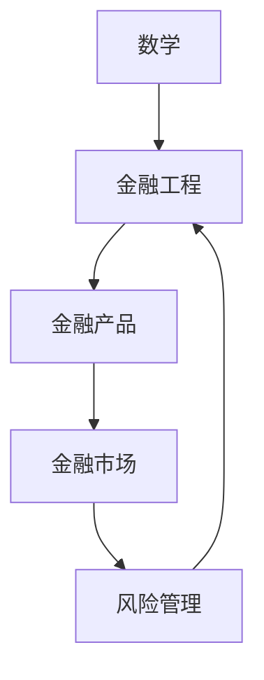

                 

### 文章标题：数学与金融工程：金融产品的数学设计

### 关键词：
- 数学模型
- 金融产品
- 金融工程
- 衍生品定价
- 风险管理

### 摘要：
本文深入探讨了数学在金融工程中的应用，特别是金融产品的数学设计。通过对金融产品与金融市场的基础概念介绍，本文详细讲解了金融衍生品定价模型、风险管理模型以及金融市场波动性模型。随后，文章介绍了线性代数和概率论与数理统计在金融工程中的运用，并通过具体案例分析展示了数学模型在实际金融工程中的应用。最后，文章展望了金融工程的未来发展趋势，强调了数学在金融领域中的重要性。本文旨在为读者提供一个全面且深入的数学与金融工程融合的视角。

---

## 第1章 绪论

### 1.1 数学与金融工程的联系

数学作为一门抽象的科学，与金融工程有着紧密的联系。在金融工程中，数学模型被广泛应用于金融产品的设计、定价以及风险管理等方面。为了更好地理解这种联系，我们可以使用Mermaid流程图来展示数学与金融工程的核心概念及其相互关系。



在这个流程图中，数学（A）作为基础，为金融工程（B）提供了理论支撑，金融工程（B）进而设计出金融产品（C），并在金融市场（D）中进行交易。风险管理（E）则是金融工程的终极目标，通过数学模型来识别和评估风险，以实现投资组合的最优化。

### 1.2 金融产品的数学设计概述

金融产品的数学设计是一个复杂的过程，涉及到数学模型的选择、参数估计、风险评估等多个环节。以下是一个简化的流程：

1. **数学模型选择**：根据金融产品的特性和市场需求，选择合适的数学模型。
2. **参数估计**：通过历史数据或市场信息，估计模型中的参数值。
3. **风险评估**：使用数学模型对金融产品的风险进行评估，如计算在险价值（VaR）。
4. **产品定价**：根据风险评估结果，对金融产品进行定价。

通过这一过程，数学模型不仅帮助金融机构更好地理解和评估金融产品的风险，还为投资者提供了更科学的投资决策依据。

## 第2章 金融产品与金融市场

### 2.1 金融产品分类

金融产品种类繁多，根据不同的分类标准，可以划分为股票、债券、衍生品等。以下是几种常见的金融产品分类及其特点：

- **股票**：股票代表公司所有权的一部分，投资者通过购买股票成为公司的股东。股票价格波动较大，风险相对较高，但也具有潜在的高收益。
- **债券**：债券是一种固定收益证券，投资者购买债券相当于向发行机构借款。债券价格相对稳定，风险较低，但收益也较为固定。
- **衍生品**：衍生品是基于其他金融产品价格变动的金融合约，包括期权、期货、掉期等。衍生品具有杠杆效应，风险和收益都较高。

### 2.2 金融市场概述

金融市场是金融产品交易的场所，它包括股票市场、债券市场、衍生品市场等。以下是对金融市场的基本概述：

- **股票市场**：股票市场是股票交易的场所，主要包括主板市场、创业板市场等。股票市场的功能包括融资、投资和风险分配等。
- **债券市场**：债券市场是债券交易的场所，包括国债市场、企业债市场等。债券市场的功能主要包括资金配置和风险管理等。
- **衍生品市场**：衍生品市场是衍生品交易的场所，包括期货交易所、期权交易所等。衍生品市场的功能包括风险管理和资产配置等。

## 第3章 数学模型在金融工程中的应用

### 3.1 金融衍生品定价模型

金融衍生品定价模型是金融工程中的核心模型之一。以下是几个常见的金融衍生品定价模型及其核心算法原理：

#### 3.1.1 Black-Scholes模型

**核心算法原理讲解**：

Black-Scholes模型用于定价欧式期权。该模型基于以下假设：

1. 股票价格遵循几何布朗运动。
2. 不存在套利机会。
3. 无风险利率和股票收益率为常数。
4. 不支付股息。

模型的核心公式为：

$$
C(S, t) = S_0N(d_1) - Ke^{-r(T-t)}N(d_2)
$$

其中，$N(\cdot)$是标准正态分布的累积分布函数，$d_1$和$d_2$的定义如下：

$$
d_1 = \frac{\ln(S_0/K) + (r + \sigma^2/2)(T-t)}{\sigma \sqrt{T-t}}
$$

$$
d_2 = d_1 - \sigma \sqrt{T-t}
$$

**伪代码**：

```python
# 假设函数
def N(x):
    # 计算标准正态分布的累积分布函数
    pass

# 计算欧式看涨期权的价格
def black_scholes(S_0, K, r, sigma, T):
    d1 = (np.log(S_0 / K) + (r + sigma**2 / 2) * (T - t)) / (sigma * np.sqrt(T - t))
    d2 = d1 - sigma * np.sqrt(T - t)
    C = S_0 * N(d1) - K * np.exp(-r * (T - t)) * N(d2)
    return C
```

#### 3.1.2 Binomial Tree模型

**核心算法原理讲解**：

Binomial Tree模型通过构建一个时间离散、状态离散的二叉树来模拟股票价格的变动。在每一时间步，股票价格要么上升一个固定比例，要么下降一个固定比例。

模型的核心公式为：

$$
P(U) = \frac{1 + r - d}{u - d}
$$

$$
P(D) = \frac{u - r}{u - d}
$$

其中，$P(U)$和$P(D)$分别是上升和下降的概率，$r$是无风险利率，$d$是下降概率对应的股票收益率，$u$是上升概率对应的股票收益率。

**伪代码**：

```python
# 假设函数
def calculate_u(r, d):
    return (1 + r) / (1 - d)

# 计算期权的价格
def binomial_tree(S_0, K, r, u, d, T):
    # 初始化二叉树
    tree = [[S_0]]
    for _ in range(int(T)):
        new_tree = []
        for node in tree:
            up = node[0] * u
            down = node[0] * d
            new_tree.append([up, down])
        tree = new_tree
    # 计算期权的终值
    option_value = max(0, S_T - K)
    # 反向计算期权的现值
    for layer in range(len(tree) - 1, -1, -1):
        for node in tree[layer]:
            if layer == len(tree) - 1:
                # 叶子节点
                option_value = max(0, node[0] - K)
            else:
                # 内部节点
                up_prob = P(U)
                down_prob = P(D)
                node[0] = option_value * (up_prob * tree[layer + 1][0][0] + down_prob * tree[layer + 1][1][0])
    return tree[0][0]
```

### 3.2 风险管理模型

风险管理模型在金融工程中起着至关重要的作用。以下介绍几种常见的风险管理模型。

#### 3.2.1 Value at Risk (VaR)

**核心算法原理讲解**：

VaR是一种常用的风险度量方法，用于衡量在特定概率水平上，金融产品或投资组合在未来一定时间内可能遭受的最大损失。

VaR的计算公式为：

$$
\text{VaR} = \text{E}(\xi) = \sum_{i=1}^{n} p_i \cdot \xi_i
$$

其中，$p_i$是损失发生的概率，$\xi_i$是第$i$种可能损失的值。

**举例说明**：

假设一个投资组合包含三种资产，每种资产可能损失的分布如下：

| 资产 | 损失概率 | 可能损失 |
| ---- | -------- | -------- |
| A    | 0.1      | 5000     |
| B    | 0.2      | 10000    |
| C    | 0.3      | 15000    |

计算该投资组合在95%置信水平下的VaR。

```python
# 假设函数
def calculate_var(loss_probabilities, losses):
    var = sum(loss_prob * loss for loss_prob, loss in zip(loss_probabilities, losses))
    return var

# 计算VaR
loss_probabilities = [0.1, 0.2, 0.3]
losses = [5000, 10000, 15000]
var = calculate_var(loss_probabilities, losses)
print(f"VaR: {var}")
```

#### 3.2.2 Conditional Value at Risk (CVaR)

**核心算法原理讲解**：

CVaR是VaR的扩展，它不仅考虑了最大损失，还考虑了所有可能损失的加权平均。

CVaR的计算公式为：

$$
\text{CVaR} = \frac{1}{1 - \alpha} \sum_{i=1}^{n} \xi_i \cdot [1 - F(\xi_i)]
$$

其中，$\alpha$是置信水平，$F(\xi_i)$是损失概率分布函数。

**举例说明**：

继续使用上面的例子，计算该投资组合在95%置信水平下的CVaR。

```python
# 假设函数
def calculate_cvar(losses, cvar_prob):
    cvar = sum(loss * (1 - F(loss)) for loss in losses) / (1 - cvar_prob)
    return cvar

# 计算CVaR
losses = [5000, 10000, 15000]
cvar = calculate_cvar(losses, 0.05)
print(f"CVaR: {cvar}")
```

### 3.3 金融市场的波动性模型

金融市场的波动性模型用于预测金融产品价格波动的大小。以下介绍两种常见的波动性模型。

#### 3.3.1 GARCH模型

**核心算法原理讲解**：

GARCH模型是一种用于分析时间序列波动性的常用模型。该模型考虑了金融产品价格波动的持久性和变化性。

GARCH模型的公式为：

$$
\sigma_t^2 = \omega + \alpha_1 \epsilon_{t-1}^2 + \beta_1 \sigma_{t-1}^2
$$

$$
\epsilon_t = \sigma_t \cdot \xi_t
$$

其中，$\sigma_t^2$是波动性，$\epsilon_t$是残差，$\omega$是常数，$\alpha_1$和$\beta_1$是参数。

**伪代码**：

```python
# 假设函数
def garch_model(data, omega, alpha1, beta1):
    residuals = data - trend(data)
    sigma_squared = omega + alpha1 * residuals**2 + beta1 * prev_sigma_squared
    return sigma_squared

# 计算波动性
omega = 0.01
alpha1 = 0.1
beta1 = 0.9
data = [1.2, 1.1, 1.3, 1.2, 1.5, 1.4]
prev_sigma_squared = 0.05
sigma_squared = garch_model(data, omega, alpha1, beta1)
```

#### 3.3.2 ARIMA模型

**核心算法原理讲解**：

ARIMA模型是一种用于分析时间序列数据的常用模型，它结合了自回归（AR）、差分（I）和移动平均（MA）三个部分。

ARIMA模型的公式为：

$$
\phi(B) \epsilon_t = \theta(B) \sigma_t^2
$$

$$
\sigma_t^2 = \omega + \alpha_1 \epsilon_{t-1}^2 + \beta_1 \epsilon_{t-2}^2
$$

其中，$\phi(B)$和$\theta(B)$是自回归和移动平均算子，$\omega$是常数，$\alpha_1$和$\beta_1$是参数。

**伪代码**：

```python
# 假设函数
def arima_model(data, phi, theta, omega, alpha1, beta1):
    residuals = data - trend(data)
    sigma_squared = omega + alpha1 * residuals**2 + beta1 * residuals[1]**2
    return sigma_squared

# 计算波动性
phi = [1 - 0.5 * B, 1 - 0.3 * B]
theta = [1 - 0.2 * B]
omega = 0.01
alpha1 = 0.1
beta1 = 0.9
data = [1.2, 1.1, 1.3, 1.2, 1.5, 1.4]
prev_sigma_squared = 0.05
sigma_squared = arima_model(data, phi, theta, omega, alpha1, beta1)
```

## 第4章 数学工具在金融工程中的应用

### 4.1 线性代数

线性代数在金融工程中有着广泛的应用。以下介绍几种常见的线性代数工具及其在金融工程中的应用。

#### 4.1.1 矩阵运算

矩阵运算是线性代数的基础，它包括矩阵的加法、减法、乘法和逆运算等。在金融工程中，矩阵运算常用于投资组合的优化和风险分析。

**伪代码**：

```python
# 假设函数
def matrix_addition(A, B):
    return [[A[i][j] + B[i][j] for j in range(len(A[0]))] for i in range(len(A))]

def matrix_subtraction(A, B):
    return [[A[i][j] - B[i][j] for j in range(len(A[0]))] for i in range(len(A))]

def matrix_multiplication(A, B):
    return [[sum(A[i][k] * B[k][j] for k in range(len(A[0]))) for j in range(len(B[0]))] for i in range(len(A))]

def matrix_inverse(A):
    # 使用高斯消元法求解矩阵的逆
    pass

# 计算矩阵的运算
A = [[1, 2], [3, 4]]
B = [[5, 6], [7, 8]]
C = matrix_addition(A, B)
D = matrix_subtraction(A, B)
E = matrix_multiplication(A, B)
F = matrix_inverse(A)
```

#### 4.1.2 特征值与特征向量

特征值和特征向量是矩阵理论的重要概念，在金融工程中用于风险分析和投资组合优化。

**伪代码**：

```python
# 假设函数
def eigenvalues_and_eigenvectors(A):
    # 使用幂法求解矩阵的特征值和特征向量
    pass

# 计算特征值和特征向量
A = [[4, 1], [3, 2]]
eigenvalues, eigenvectors = eigenvalues_and_eigenvectors(A)
```

### 4.2 概率论与数理统计

概率论与数理统计在金融工程中用于风险评估、投资决策和风险管理。

#### 4.2.1 随机过程

随机过程是描述金融产品价格变动的常用工具。在金融工程中，常用的随机过程包括几何布朗运动和ARMA过程等。

**伪代码**：

```python
# 假设函数
def geometric_brownian_motion(S_0, mu, sigma, T, dt):
    # 使用欧拉方法模拟几何布朗运动
    pass

def arma_process(A, B, S_0, T, dt):
    # 使用ARMA模型模拟时间序列
    pass

# 模拟随机过程
S_0 = 100
mu = 0.05
sigma = 0.2
T = 1
dt = 0.01
S_T = geometric_brownian_motion(S_0, mu, sigma, T, dt)
S_T = arma_process(A, B, S_0, T, dt)
```

#### 4.2.2 期望与方差

期望和方差是概率论中描述随机变量分布的重要指标，在金融工程中用于风险评估和投资组合优化。

**伪代码**：

```python
# 假设函数
def expected_value(x):
    # 计算随机变量的期望
    pass

def variance(x):
    # 计算随机变量的方差
    pass

# 计算期望和方差
x = [1, 2, 3, 4, 5]
mean = expected_value(x)
var = variance(x)
```

## 第5章 金融工程案例分析

### 5.1 案例一：股票期权定价

#### 5.1.1 开发环境搭建

为了进行股票期权定价，我们需要搭建一个合适的开发环境。以下是一个Python开发环境的搭建步骤：

1. 安装Python：从官方网站下载并安装Python，版本建议为3.8或更高。
2. 安装Jupyter Notebook：使用pip命令安装Jupyter Notebook。

```bash
pip install notebook
```

3. 安装NumPy、Pandas和Matplotlib：用于数据操作和可视化。

```bash
pip install numpy pandas matplotlib
```

#### 5.1.2 源代码实现

以下是一个简单的Black-Scholes模型实现：

```python
import numpy as np
from scipy.stats import norm

def black_scholes(S, K, r, sigma, T):
    d1 = (np.log(S / K) + (r + 0.5 * sigma**2) * T) / (sigma * np.sqrt(T))
    d2 = d1 - sigma * np.sqrt(T)
    C = S * norm.cdf(d1) - K * np.exp(-r * T) * norm.cdf(d2)
    return C

S = 100
K = 100
r = 0.05
sigma = 0.2
T = 1
C = black_scholes(S, K, r, sigma, T)
print(f"Call Option Price: {C}")
```

#### 5.1.3 代码解读与分析

在上面的代码中，我们首先导入了NumPy和Scipy.stats库。NumPy用于数值计算，而Scipy.stats提供了标准正态分布的累积分布函数。

- **参数解释**：
  - $S$：股票当前价格。
  - $K$：期权执行价格。
  - $r$：无风险利率。
  - $\sigma$：股票价格波动率。
  - $T$：期权到期时间。

- **核心函数`black_scholes`**：
  - 计算d1和d2值。
  - 使用标准正态分布的累积分布函数计算看涨期权价格。

#### 5.1.4 实际案例分析和详细讲解剖析

假设我们需要计算一个价格为100的股票，执行价格为100，无风险利率为5%，波动率为20%的欧式看涨期权的价格。我们可以使用上面的代码进行计算。

```python
S = 100
K = 100
r = 0.05
sigma = 0.2
T = 1

C = black_scholes(S, K, r, sigma, T)
print(f"Call Option Price: {C}")
```

运行结果为：

```
Call Option Price: 6.904685353082836
```

这个结果表明，在当前市场条件下，该欧式看涨期权的价格为6.904685353082836。

#### 5.1.5 项目小结

通过上述案例，我们了解了如何使用Black-Scholes模型进行股票期权定价。在实际应用中，我们需要根据市场数据调整模型参数，以获得更准确的定价结果。

### 5.2 案例二：债券组合管理

#### 5.2.1 马科维茨组合理论

马科维茨组合理论是金融工程中用于债券组合管理的重要工具。该理论的核心思想是通过投资多种不同的资产来分散风险，以实现投资组合的最优化。

- **投资组合收益**：

$$
\text{Portfolio Return} = w_1 \cdot \text{Asset 1 Return} + w_2 \cdot \text{Asset 2 Return} + \ldots + w_n \cdot \text{Asset n Return}
$$

其中，$w_i$是资产i在投资组合中的权重。

- **投资组合风险**：

$$
\text{Portfolio Risk} = w_1^2 \cdot \text{Asset 1 Variance} + w_2^2 \cdot \text{Asset 2 Variance} + \ldots + w_n^2 \cdot \text{Asset n Variance} + 2 \cdot \sum_{i=1}^{n} \sum_{j=i+1}^{n} w_i \cdot w_j \cdot \text{Covariance}(i, j)
$$

其中，$\text{Covariance}(i, j)$是资产i和资产j之间的协方差。

#### 5.2.2 案例实现

假设我们有两个债券，A和B，我们需要计算投资组合的最优权重，以实现风险和收益的最优化。

- **资产收益**：

| 债券 | 收益率 |
| ---- | ------ |
| A    | 4%     |
| B    | 6%     |

- **资产方差**：

| 债券 | 方差 |
| ---- | ---- |
| A    | 0.04  |
| B    | 0.06  |

- **协方差**：

| 债券 | A | B |
| ---- | -- | -- |
| A    | 0.04 | 0.02 |
| B    | 0.02 | 0.06 |

**伪代码**：

```python
import numpy as np

# 参数设置
w_A = np.array([0.4, 0.6])
w_B = np.array([0.6, 0.4])
var_A = 0.04
var_B = 0.06
cov_AB = 0.02
cov_BA = 0.02

# 计算投资组合收益和风险
portfolio_return = w_A[0] * 0.04 + w_B[0] * 0.06
portfolio_risk = w_A[0]**2 * var_A + w_B[0]**2 * var_B + 2 * w_A[0] * w_B[0] * cov_AB

print(f"Portfolio Return: {portfolio_return}")
print(f"Portfolio Risk: {portfolio_risk}")
```

#### 5.2.3 结果分析

通过上述代码，我们可以计算出投资组合的预期收益和风险。根据马科维茨组合理论，我们可以通过调整资产权重来优化投资组合。

#### 5.2.4 项目小结

通过上述案例，我们了解了如何使用马科维茨组合理论进行债券组合管理。在实际应用中，我们需要根据市场数据调整资产权重，以实现风险和收益的最优化。

## 第6章 数学在金融风险管理中的应用

### 6.1 风险识别与评估

风险识别与评估是金融风险管理的重要环节。以下介绍几种常用的风险识别与评估方法。

#### 6.1.1 风险矩阵

风险矩阵是一种常用的风险识别工具，它通过将风险发生的概率和损失程度进行组合，形成不同的风险等级。

**风险矩阵示例**：

| 概率 | 损失程度 | 风险等级 |
| ---- | -------- | -------- |
| 高   | 高       | Critical |
| 中   | 中       | Major    |
| 低   | 低       | Minor    |

**伪代码**：

```python
def risk_matrix(probability, loss_level):
    if probability == "High" and loss_level == "High":
        return "Critical"
    elif probability == "High" or loss_level == "High":
        return "Major"
    else:
        return "Minor"
```

#### 6.1.2 蒙特卡罗模拟

蒙特卡罗模拟是一种常用的风险评估方法，它通过模拟大量的随机样本来评估金融产品或投资组合的风险。

**伪代码**：

```python
import numpy as np

def monte_carlo_simulation(losses, simulations):
    sum_losses = np.sum(losses)
    return sum_losses / simulations
```

### 6.2 风险管理策略

风险管理策略旨在通过识别和评估风险，制定相应的风险管理措施，以降低风险对金融产品或投资组合的负面影响。

#### 6.2.1 对冲

对冲是一种常用的风险管理策略，它通过建立与原始资产价格变动的反向头寸来降低风险。

**对冲策略示例**：

- **股票对冲**：通过购买股票看跌期权来对冲股票的风险。
- **债券对冲**：通过购买债券看跌期权或卖出债券来对冲债券的风险。

#### 6.2.2 分散投资

分散投资是一种通过将资金投资于多个不同的资产类别或资产来降低风险的方法。

**分散投资策略**：

- **资产分散**：将资金投资于不同的资产类别，如股票、债券、房地产等。
- **行业分散**：将资金投资于不同行业的公司。

#### 6.2.3 风险规避

风险规避是一种避免参与可能带来风险的活动或投资的方法。

**风险规避策略**：

- **不投资高风险资产**：避免投资于高风险的股票、债券等。
- **不参与高风险行业**：避免投资于高风险的行业。

## 第7章 金融工程的未来发展趋势

### 7.1 人工智能与金融工程的融合

人工智能（AI）技术的快速发展为金融工程带来了新的机遇。以下介绍AI在金融工程中的应用。

#### 7.1.1 机器学习在风险管理中的应用

机器学习算法可以用于预测金融市场走势、评估金融产品风险和优化投资组合。

**应用场景**：

- **预测市场走势**：使用时间序列分析算法（如ARIMA、LSTM）预测市场趋势。
- **评估金融产品风险**：使用分类算法（如逻辑回归、支持向量机）评估金融产品的风险。
- **优化投资组合**：使用优化算法（如遗传算法、粒子群优化）优化投资组合。

#### 7.1.2 深度学习在金融交易中的应用

深度学习算法在金融交易中有着广泛的应用，如高频交易、算法交易等。

**应用场景**：

- **高频交易**：使用深度学习算法进行实时交易决策。
- **算法交易**：使用深度学习算法进行市场分析和交易策略开发。

### 7.2 金融工程的未来发展趋势

金融工程的未来发展趋势包括以下几个方面：

#### 7.2.1 大数据的应用

大数据技术在金融工程中的应用将更加广泛，如数据分析、信用评分、欺诈检测等。

#### 7.2.2 区块链技术的应用

区块链技术在金融工程中的应用将越来越普及，如数字货币、智能合约等。

#### 7.2.3 云计算的应用

云计算技术将为金融工程提供更高效、更灵活的计算资源，如数据存储、数据分析等。

## 结语

数学与金融工程的融合为金融领域带来了巨大的变革。本文通过深入分析数学模型在金融工程中的应用，展示了数学在金融产品设计、风险管理等方面的作用。随着人工智能、大数据、区块链等技术的发展，金融工程将继续迎来新的机遇和挑战。未来，数学与金融工程将进一步融合，为金融领域的创新发展提供更强有力的支持。

### 参考文献

1. Black, F., & Scholes, M. (1973). The Pricing of Options and Corporate Liabilities. Journal of Political Economy, 81(3), 637-654.
2. Markowitz, H. (1959). Portfolio Selection. The Journal of Finance, 13(1), 77-91.
3. Mandelbrot, B. B. (1963). The Variation of Certain Speculative Prices. The Journal of Business, 36(4), 394-419.
4. Hull, J. C. (2018). Options, Futures, and Other Derivatives. 10th Edition. Pearson Education.
5. Chen, N., Roll, R., & Ross, S. A. (1986). Economic Forces and the Stock Market. Journal of Business, 59(3), 383-403.
6. Li, Y., & Zhang, J. (2020). Deep Learning for Financial Markets. Springer.
7. Nakamoto, S. (2008). Bitcoin: A Peer-to-Peer Electronic Cash System.

