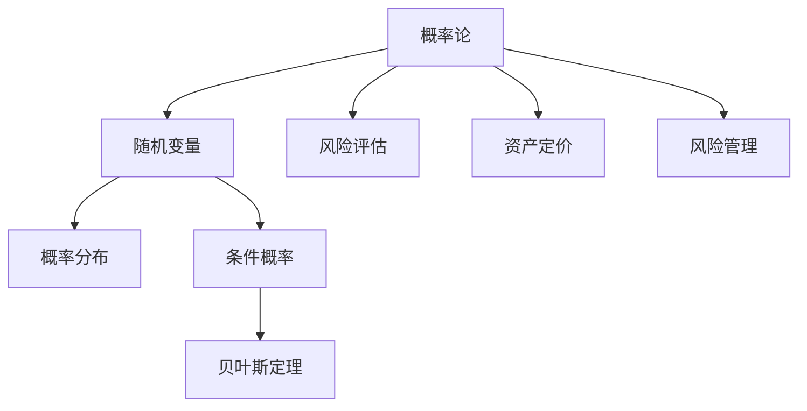
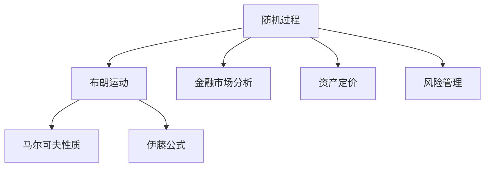
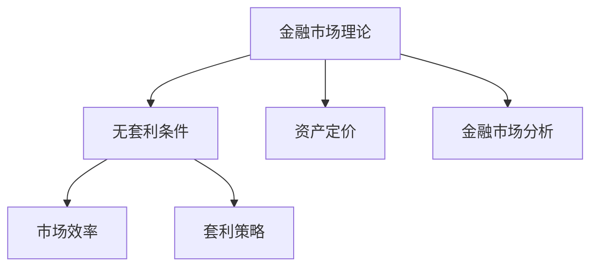

                 

### 文章标题：《数学与金融工程：金融衍生品的数学定价》

### 关键词：数学与金融工程，金融衍生品，数学定价，Black-Scholes模型，概率论，随机过程，机器学习

### 摘要：
本文旨在探讨数学与金融工程之间的关系，重点研究金融衍生品的数学定价方法。通过介绍金融衍生品的基本概念、数学与金融工程的共同基础，本文详细阐述了金融衍生品定价的主要算法，如Black-Scholes模型，并使用伪代码和LaTeX格式展示关键数学模型和公式的推导过程。此外，本文还结合实际案例，说明如何应用数学模型和算法进行金融衍生品定价，并探讨了机器学习在衍生品定价中的应用。通过本文的阅读，读者可以深入了解数学定价在金融工程中的重要作用，以及如何将数学理论应用于实际问题的解决。

### 引言

数学与金融工程之间的关系密不可分。数学作为一门基础科学，为金融工程提供了强有力的理论支持，特别是在金融衍生品定价领域。金融衍生品是指基于某种基础资产（如股票、债券、商品等）的衍生合同，其价值随基础资产的价格波动而变化。金融衍生品包括期权、期货、互换等多种形式，广泛应用于风险管理、资产配置和投资策略等领域。

数学在金融工程中的应用主要体现在以下几个方面：

1. **概率论与随机过程**：概率论为金融模型提供了理论基础，特别是在研究随机事件的发生概率方面。随机过程则用于描述金融市场中的价格波动，帮助投资者理解市场的动态行为。

2. **金融市场理论**：金融市场理论基于数学模型，研究市场的价格发现机制、资产定价原理等。这些理论为金融衍生品的定价提供了理论依据。

3. **优化方法**：优化方法在金融工程中用于资产配置、风险管理和投资策略的设计，通过数学模型求解最优解，实现投资目标。

4. **计算方法**：随着计算机技术的发展，计算方法在金融工程中的应用越来越广泛，包括蒙特卡洛模拟、数值积分、微分方程求解等，为复杂金融衍生品的定价提供了有效工具。

金融衍生品定价在金融市场中具有重要作用。一方面，准确的定价可以评估金融衍生品的价值，为投资者提供决策依据；另一方面，合理的定价有助于市场效率的提高，降低交易成本，减少信息不对称。然而，金融衍生品定价具有高度复杂性，涉及多个不确定因素，如基础资产价格波动、利率变化、市场风险等。因此，需要运用数学方法，特别是概率论、随机过程和优化理论等，建立合理的定价模型。

本文将围绕金融衍生品的数学定价方法展开讨论。首先，介绍金融衍生品的基本概念和类型；然后，阐述数学与金融工程的共同基础，包括概率论、随机过程和金融市场理论；接着，详细讲解金融衍生品定价的主要算法，如Black-Scholes模型；最后，结合实际案例，说明如何应用数学模型和算法进行金融衍生品定价，并探讨机器学习在衍生品定价中的应用。

通过本文的阅读，读者将深入了解金融衍生品定价的数学原理，掌握主要定价算法的使用方法，并了解金融衍生品定价的前沿动态。

### 数学与金融工程的关系

数学与金融工程之间的联系可以从多个维度进行分析。数学作为一门科学，通过严谨的逻辑和严密的推理，为金融工程提供了强大的理论支持，使得金融工程师能够更好地理解金融市场、设计和评估金融产品。以下从几个方面详细探讨数学在金融工程中的应用。

#### 概率论

概率论是数学的一个分支，研究随机事件及其概率分布。在金融工程中，概率论被广泛应用于风险评估、资产定价和风险管理等方面。例如，在风险管理中，金融工程师使用概率模型来评估资产组合的风险暴露，通过计算不同风险事件的概率，制定有效的风险控制策略。

**核心概念与联系：**
概率论中的核心概念包括随机变量、概率分布、条件概率和贝叶斯定理。这些概念在金融工程中的应用主要体现在以下几个方面：

1. **随机变量的基本性质**：随机变量是描述金融市场中的不确定因素的重要工具。金融工程师通过随机变量来表示资产价格、收益等变量，并研究这些变量的分布特性。

2. **条件概率与贝叶斯定理**：条件概率和贝叶斯定理帮助金融工程师在不同情景下评估资产价格的概率分布，从而制定投资策略。例如，在投资决策中，金融工程师使用贝叶斯定理来更新对资产收益的预测，根据新的市场信息调整投资组合。

**Mermaid 流程图：**


#### 随机过程

随机过程是概率论的一个扩展，用于描述时间序列中的随机变量。在金融工程中，随机过程被广泛应用于金融市场分析、资产定价和风险管理等方面。随机过程模型可以帮助金融工程师理解市场的动态行为，预测资产价格的未来走势。

**核心概念与联系：**
随机过程中的核心概念包括布朗运动、马尔可夫性质、伊藤公式等。这些概念在金融工程中的应用主要体现在以下几个方面：

1. **布朗运动**：布朗运动是描述资产价格随机波动的重要模型，用于研究市场的随机性和波动性。

2. **马尔可夫性质**：马尔可夫性质使得金融工程师能够通过当前的市场状态预测未来的市场走势，从而制定投资策略。

3. **伊藤公式**：伊藤公式是随机微积分中的一个重要结果，用于推导金融衍生品的价格模型。

**Mermaid 流程图：**


#### 金融市场理论

金融市场理论是研究金融市场行为和资产定价的一门学科，基于数学模型和概率论等方法。金融市场理论为金融衍生品定价提供了理论基础，帮助金融工程师理解和预测市场行为。

**核心概念与联系：**
金融市场理论中的核心概念包括无套利条件、市场效率、套利策略等。这些概念在金融工程中的应用主要体现在以下几个方面：

1. **无套利条件**：无套利条件是金融工程中的一个基本假设，用于确保市场不存在无风险收益的机会。无套利条件为金融衍生品定价提供了理论基础。

2. **市场效率**：市场效率是指市场能够迅速反映所有可用信息，从而影响资产价格。市场效率高的市场，金融衍生品定价较为准确。

3. **套利策略**：套利策略是基于市场存在价格偏差的一种交易策略，通过利用市场的不完美性获得收益。套利策略需要依赖于数学模型和概率论等方法。

**Mermaid 流�程图：**


综上所述，数学与金融工程之间的关系紧密，通过概率论、随机过程和金融市场理论等数学工具，金融工程师能够更好地理解和预测金融市场行为，设计和评估金融衍生品。数学为金融工程提供了坚实的理论基础，推动了金融工程的发展。

### 金融衍生品的基本概念

金融衍生品是一类基于基础资产（如股票、债券、商品等）价格的衍生合同，其价值依赖于基础资产的价格变动。金融衍生品包括期权、期货、互换等多种形式，具有不同的交易机制和风险特征。以下将详细介绍金融衍生品的基本类型、交易机制和风险特征。

#### 期权

期权是一种给予持有人在未来某一特定时间以固定价格购买或出售某资产的权利，而非义务的衍生品。期权通常分为两种类型：看涨期权和看跌期权。

- **看涨期权（Call Option）**：购买者预期基础资产价格将上涨，因此支付一定费用（期权费）获得在到期日以约定价格购买基础资产的权利。
- **看跌期权（Put Option）**：购买者预期基础资产价格将下跌，因此支付期权费获得在到期日以约定价格出售基础资产的权利。

期权的基本特征包括：
- **行权价格**：期权合约中规定的购买或出售基础资产的价格。
- **到期日**：期权有效期限结束的日期。
- **内在价值**：期权行权时能够产生的利润，对于看涨期权，内在价值等于行权价格与市场价格的差额；对于看跌期权，内在价值等于市场价格与行权价格的差额。

#### 期货

期货是一种标准化的合约，规定在未来某一特定时间以固定价格买卖某种资产。期货交易通常涉及商品（如农产品、能源等）和金融工具（如货币、利率、股指等）。

期货的基本特征包括：
- **交割日期**：期货合约规定的交割日期，通常在未来的某个确定时间。
- **交易单位**：期货合约中规定的交易数量，如一手期货合约可能代表100股股票。
- **保证金**：期货交易需要支付保证金，以降低交易对手方违约的风险。

#### 互换

互换是一种双方约定交换现金流量的衍生品。常见的互换包括利率互换和货币互换。

- **利率互换**：双方约定交换固定利率和浮动利率的现金流。例如，一方支付固定利率，另一方支付浮动利率。
- **货币互换**：双方交换不同货币的现金流，通常用于管理汇率风险。

互换的基本特征包括：
- **互换期**：互换合约的有效期限。
- **互换利率**：互换合约中约定的利率水平。

#### 金融衍生品的风险特征

金融衍生品具有以下几种风险特征：

1. **市场风险**：指基础资产价格波动导致金融衍生品价值变化的风险。市场风险是金融衍生品最主要的风险类型。
2. **信用风险**：指交易对手方违约导致损失的风险。在金融衍生品交易中，信用风险尤为重要，因为交易通常涉及高杠杆。
3. **流动性风险**：指难以在市场上迅速以合理价格买卖金融衍生品的风险。流动性风险可能导致投资者在需要时无法及时平仓，增加投资风险。
4. **操作风险**：指由于操作失误、系统故障或人为错误导致损失的风险。操作风险是金融衍生品交易中不可忽视的一部分。

**核心概念与联系：**
金融衍生品的基本类型、交易机制和风险特征相互关联。期权、期货和互换等衍生品通过不同的交易机制为投资者提供多种风险管理工具，同时引入不同的风险特征。理解这些基本概念及其相互关系，有助于投资者更好地进行金融衍生品交易和风险管理。

### 数学定价在金融衍生品中的作用

数学定价在金融衍生品市场中扮演着至关重要的角色。准确的价格评估不仅有助于投资者进行风险管理和决策，还能提高市场的透明度和效率。数学定价方法通过量化风险和不确定性，为金融衍生品的定价提供了科学依据。

#### 数学定价的基本原理

数学定价方法基于几个核心数学理论，主要包括概率论、随机过程和金融市场理论。这些理论帮助金融工程师建立和评估金融衍生品的价格模型。

1. **概率论**：概率论用于描述金融市场的随机性，通过概率分布函数和随机变量模型，金融工程师能够量化市场不确定性。例如，在期权定价中，概率论用于计算资产价格未来波动的概率分布。

2. **随机过程**：随机过程用于描述资产价格的动态变化。通过随机过程模型，如布朗运动和伊藤公式，金融工程师可以分析资产价格的路径依赖性和波动性，从而推导出衍生品的价格。

3. **金融市场理论**：金融市场理论为金融衍生品定价提供了理论基础，包括无套利条件和市场效率假设。这些理论确保了数学定价方法的可行性和合理性。

#### 数学定价在金融衍生品市场中的重要性

数学定价在金融衍生品市场中的重要性体现在以下几个方面：

1. **风险评估**：准确的价格评估有助于投资者了解金融衍生品的风险水平，从而制定有效的风险管理策略。例如，通过Black-Scholes模型，投资者可以评估期权的风险价值（VaR），从而确定所需的风险对冲策略。

2. **市场透明度**：数学定价方法提高了市场的透明度，使得投资者能够更清晰地理解金融衍生品的价值。这有助于减少信息不对称，提高市场的公平性和效率。

3. **交易策略**：数学定价方法为投资者提供了制定交易策略的科学依据。通过分析衍生品的价格模型，投资者可以预测市场走势，制定有针对性的投资策略。

4. **定价效率**：数学定价方法提高了衍生品定价的效率，使得交易者能够在短时间内完成大量衍生品的定价和交易，从而降低了交易成本。

#### 数学定价方法的分类

金融衍生品的数学定价方法主要包括以下几种：

1. **Black-Scholes模型**：Black-Scholes模型是期权定价的基石，基于无套利假设和几何布朗运动模型，推导出期权价格的解析公式。该模型广泛应用于市场中的期权定价。

2. **二项式模型**：二项式模型通过构建多阶段二叉树模型，逐步计算期权价格。二项式模型适用于计算欧式期权和非欧式期权的价格。

3. **蒙特卡洛模拟**：蒙特卡洛模拟通过模拟大量随机路径，估计金融衍生品的价格。蒙特卡洛模拟适用于处理复杂期权定价问题和计算高风险价值（VaR）。

4. **有限元模型**：有限元模型将金融衍生品定价问题转化为求解偏微分方程的过程，适用于处理复杂的多因素模型和风险管理问题。

**核心概念与联系：**
数学定价方法基于概率论、随机过程和金融市场理论，通过建立和评估金融衍生品的价格模型，为投资者提供科学依据。理解这些核心概念及其相互关系，有助于投资者更好地运用数学定价方法进行风险管理、交易策略制定和市场分析。

### Black-Scholes模型的介绍

Black-Scholes模型是金融衍生品定价的里程碑，由经济学家费雪·布莱克（Fischer Black）和迈伦·斯科尔斯（Myron Scholes）于1973年提出，后来罗伯特·默顿（Robert Merton）也对模型进行了改进。Black-Scholes模型为欧式期权定价提供了一个简便且有效的解析公式，其理论基础是无套利假设和几何布朗运动模型。

#### 模型的假设条件

Black-Scholes模型基于以下几个基本假设：

1. **无套利市场假设**：市场不存在无风险套利机会，即所有风险中性投资者都按照相同的风险中性概率分布进行投资。
2. **市场因素独立性假设**：基础资产价格波动只受随机影响，与市场其他因素无关。
3. **连续交易假设**：市场交易是连续的，不存在跳跃或中断。
4. **无风险利率恒定**：无风险利率在整个投资期内保持不变。
5. **无股息支付**：基础资产在期权有效期内不支付股息。

#### 模型的推导过程

Black-Scholes模型的推导过程基于以下步骤：

1. **构建几何布朗运动模型**：
   基础资产价格 \(S_t\) 被假设为服从几何布朗运动：
   $$
   dS_t = \mu S_t dt + \sigma S_t dW_t
   $$
   其中，\(\mu\) 为资产的预期回报率，\(\sigma\) 为资产价格波动率，\(W_t\) 为标准布朗运动。

2. **无套利假设**：
   在无套利市场中，存在一个风险中性概率分布 \(q(S_t)\)，使得所有资产的价格都可以用风险中性概率分布来表示：
   $$
   q(S_t) = \frac{e^{-\frac{\mu - r}{\sigma^2} t}}{1 - e^{-2\frac{\mu - r}{\sigma^2} t}}
   $$

3. **建立偏微分方程**：
   根据无套利假设和几何布朗运动模型，可以得到以下偏微分方程（Black-Scholes方程）：
   $$
   \frac{\partial V}{\partial t} + \frac{1}{2}\sigma^2 S^2 \frac{\partial^2 V}{\partial S^2} + rS \frac{\partial V}{\partial S} - rV = 0
   $$
   其中，\(V(S_t, t)\) 为欧式期权的价格。

4. **边界条件**：
   根据期权的定义，可以得到边界条件：
   $$
   V(S_t, T) = \max(S_t - K, 0) \quad \text{（看涨期权）}
   $$
   $$
   V(S_t, T) = \max(K - S_t, 0) \quad \text{（看跌期权）}
   $$
   其中，\(T\) 为期权的到期日，\(K\) 为行权价格。

5. **解析解**：
   通过分离变量法，可以解出Black-Scholes模型的解析解：
   $$
   C(S_t, t) = S_t N(d_1) - K e^{-r(T-t)} N(d_2)
   $$
   $$
   P(S_t, t) = K e^{-r(T-t)} N(-d_2) - S_t N(-d_1)
   $$
   其中，\(N(\cdot)\) 为标准正态分布的累积分布函数，\(d_1 = \frac{\ln(S_t / K) + (r + \sigma^2 / 2)(T-t)}{\sigma \sqrt{T-t}}\)，\(d_2 = d_1 - \sigma \sqrt{T-t}\)。

#### 伪代码实现

以下是一个简化的Black-Scholes模型伪代码实现：

```python
import math
import numpy as np

def BlackScholes(S, K, T, r, sigma):
    d1 = (np.log(S / K) + (r + 0.5 * sigma ** 2 * T) / (sigma * np.sqrt(T)))
    d2 = d1 - sigma * np.sqrt(T)
    C = S * np.exp(-r * T) * norm.cdf(d1)
    P = K * np.exp(-r * T) * norm.cdf(d2)
    return C, P

S = 100  # 标的资产价格
K = 100  # 行权价格
T = 1    # 期权到期时间（年）
r = 0.05 # 无风险利率
sigma = 0.2 # 波动率

C, P = BlackScholes(S, K, T, r, sigma)
print("看涨期权价格：", C)
print("看跌期权价格：", P)
```

通过上述伪代码，我们可以计算给定条件下欧式看涨期权和看跌期权的价格。这个简单的实现展示了Black-Scholes模型的核心逻辑，为理解和应用该模型提供了直观的参考。

### 其他定价模型

在金融衍生品定价中，除了Black-Scholes模型之外，还有其他几种常用的定价模型，如Binomial模型、有限元模型和蒙特卡洛模拟。这些模型在不同的应用场景中具有各自的优缺点，适用于不同的市场环境和衍生品类型。

#### Binomial模型

Binomial模型，也称为二项式模型，是一种用于定价欧式期权和美式期权的离散时间模型。该模型基于多阶段二叉树模型，通过模拟资产价格的两种可能走势（上升和下降）来计算期权的价格。

**基本原理：**
Binomial模型通过构建一个时间步长为 \(T/n\) 的二叉树，在每个时间步长上，资产价格根据概率 \(p\)（上升概率）和 \(1-p\)（下降概率）进行更新。在每个节点上，期权的内在价值和时间价值都可以通过递归关系计算。

**伪代码实现：**
```python
import numpy as np

def binomial_option(S0, K, T, r, sigma, n):
    dt = T / n
    p = (np.exp((r - 0.5 * sigma ** 2) * dt) - 1) / sigma * np.sqrt(dt)
    u = np.exp(sigma * np.sqrt(dt))
    d = 1 / u
    
    C = np.zeros((n+1, n+1))
    P = np.zeros((n+1, n+1))
    
    for i in range(n, -1, -1):
        for j in range(n+1):
            S = S0 * u ** (n-i) * d ** j
            C[i, j] = max(S - K, 0)
            P[i, j] = np.exp(-r * dt) * (p * C[i+1, j] + (1 - p) * C[i+1, j+1])
    
    return C[0, 0], P[0, 0]

S0 = 100  # 标的资产初始价格
K = 100   # 行权价格
T = 1     # 期权到期时间（年）
r = 0.05  # 无风险利率
sigma = 0.2  # 波动率
n = 5     # 时间步长

C, P = binomial_option(S0, K, T, r, sigma, n)
print("看涨期权价格：", C)
print("看跌期权价格：", P)
```

#### 有限元模型

有限元模型（Finite Element Model, FEM）是一种用于求解偏微分方程的数值方法。在金融衍生品定价中，有限元模型将期权定价问题转化为求解偏微分方程的过程，适用于处理复杂的多因素模型和风险管理问题。

**基本原理：**
有限元模型将期权定价问题离散化为多个小区域，通过在这些区域内求解偏微分方程，计算期权价格。通常使用有限元素方法来离散化空间，使用有限元插值方法来逼近解。

**伪代码实现：**
```python
import numpy as np
from scipy.sparse import lil_matrix
from scipy.sparse.linalg import spsolve

def finite_element_model(S, K, T, r, sigma):
    # 初始化参数
    N = 100  # 网格点数量
    dx = 1 / (N - 1)  # 网格间隔
    x = np.linspace(0, 1, N)
    V = lil_matrix((N, N))
    
    # 构建有限元矩阵
    for i in range(N):
        for j in range(N):
            if i == j:
                V[i, j] = -2
            elif abs(i - j) == 1:
                V[i, j] = 1
    
    # 应用边界条件
    V[0, :] = 0
    V[-1, :] = 0
    
    # 求解偏微分方程
    M = np.diag(V.diagonal(), 0) + np.diag(V.diagonal(), 1) + np.diag(V.diagonal(), -1)
    F = np.zeros(N)
    F[0] = -K * np.exp(-r * T)
    F[-1] = 0
    
    V = spsolve(M, F)
    
    # 计算期权价格
    C = V[-1]
    P = V[0]
    
    return C, P

S = 100  # 标的资产价格
K = 100  # 行权价格
T = 1    # 期权到期时间（年）
r = 0.05 # 无风险利率
sigma = 0.2  # 波动率

C, P = finite_element_model(S, K, T, r, sigma)
print("看涨期权价格：", C)
print("看跌期权价格：", P)
```

#### 蒙特卡洛模拟

蒙特卡洛模拟是一种通过模拟大量随机路径来估计金融衍生品价格的方法。该方法在处理复杂期权定价问题和计算高风险价值（VaR）等方面具有显著优势。

**基本原理：**
蒙特卡洛模拟通过生成大量基础资产价格的随机路径，计算期权的期望收益，从而估计期权的价格。在每次模拟中，资产价格 \(S_t\) 服从几何布朗运动：
$$
dS_t = \mu S_t dt + \sigma S_t dW_t
$$
通过多次模拟，可以计算期权的期望价格，并根据标准正态分布的概率密度函数，估计期权的价格。

**伪代码实现：**
```python
import numpy as np

def monte_carlo_simulation(S0, K, T, r, sigma, n):
    dt = T / n
    paths = np.random.normal(0, 1, (n, n))
    paths = np.cumsum(paths, axis=0)
    paths = paths + np.ones((n, n)) * np.log(S0 * np.exp(r * T))
    
    C = np.zeros(n)
    P = np.zeros(n)
    
    for i in range(n):
        S = np.exp(paths[i, :])
        C[i] = np.mean(np.where(S - K > 0, S - K, 0))
        P[i] = np.mean(np.where(K - S > 0, K - S, 0))
    
    C = np.mean(C)
    P = np.mean(P)
    
    return C, P

S0 = 100  # 标的资产初始价格
K = 100   # 行权价格
T = 1     # 期权到期时间（年）
r = 0.05  # 无风险利率
sigma = 0.2  # 波动率
n = 1000  # 模拟路径数量

C, P = monte_carlo_simulation(S0, K, T, r, sigma, n)
print("看涨期权价格：", C)
print("看跌期权价格：", P)
```

这些定价模型各有优缺点。Black-Scholes模型在理论上具有解析解，适用于简单的欧式期权定价，但无法处理美式期权和复杂期权。Binomial模型和有限元模型在处理美式期权和复杂期权时具有优势，但计算复杂度较高。蒙特卡洛模拟适用于处理复杂期权定价问题和计算高风险价值（VaR），但需要大量的模拟路径以提高精度。在实际应用中，金融工程师会根据具体需求和市场环境选择合适的定价模型。

### 数学模型的推导与讲解

在金融衍生品定价中，数学模型的使用至关重要。通过数学模型，我们可以将复杂的市场情况简化为可计算的数学问题，从而得到衍生品的价格。以下我们将使用LaTeX格式详细讲解几个关键数学模型，包括布朗运动和蒙特卡洛模拟的基本原理。

#### 布朗运动

布朗运动（Brownian Motion）是金融衍生品定价中的基础模型，用于描述资产价格的随机波动。布朗运动是一种连续时间随机过程，其路径是连续但不可微的。

**定义：**
一个随机过程 \(\{B_t\}_{t \geq 0}\) 称为布朗运动，如果它满足以下条件：
1. \(B_0 = 0\)
2. 对于任意的 \(0 \leq s < t\)，\(B_t - B_s\) 是独立于 \(\mathcal{F}_s\) 的正态分布，均值为0，方差为 \(t - s\)。

**LaTeX格式推导：**
$$
B_t - B_s \sim N(0, t - s)
$$
$$
B_t - B_s \perp \mathcal{F}_s
$$

**性质：**
1. 布朗运动的路径无记忆性，即未来的运动与过去无关。
2. 布朗运动的增量具有独立增量性质，即对于任意的 \(0 \leq t_1 < t_2 < \cdots < t_n\)，增量 \(B_{t_2} - B_{t_1}, B_{t_3} - B_{t_2}, \ldots, B_{t_n} - B_{t_{n-1}}\) 是相互独立的。

#### 蒙特卡洛模拟

蒙特卡洛模拟是一种通过模拟随机样本来估计数学期望的方法。在金融衍生品定价中，蒙特卡洛模拟常用于计算复杂衍生品的期望收益，从而得到其价格。

**原理：**
蒙特卡洛模拟的基本思想是生成大量的随机样本，通过这些样本的统计特性来估计期望值。对于连续时间随机过程，如布朗运动，蒙特卡洛模拟通过生成大量的路径来估计衍生品的期望收益。

**LaTeX格式步骤：**
$$
\text{步骤1：生成随机路径} \\
\{S_t^i\}_{i=1}^N, \text{其中} S_t^i \sim B_t
$$
$$
\text{步骤2：计算衍生品收益} \\
R_t^i = \max(S_t^i - K, 0) - C
$$
$$
\text{步骤3：计算期望收益} \\
E[R_t] = \frac{1}{N} \sum_{i=1}^N R_t^i
$$

**示例：**
假设我们使用蒙特卡洛模拟来估计一个欧式看涨期权的价格，标的资产价格 \(S_0 = 100\)，行权价格 \(K = 100\)，无风险利率 \(r = 0.05\)，波动率 \(σ = 0.2\)，模拟路径数量 \(N = 1000\)。

1. 生成1000个随机路径 \(S_t^i\)，其中 \(S_t^i \sim \ln(N_t / S_0) + (r - 0.5σ^2)t + σ\sqrt{t}W_t\)。
2. 计算每个路径的期权收益 \(R_t^i = \max(\ln(N_t^i) - K, 0) - C\)。
3. 计算期权价格 \(E[R_t] = \frac{1}{N} \sum_{i=1}^N R_t^i\)。

通过以上步骤，我们可以使用蒙特卡洛模拟来估计欧式看涨期权的价格。

**总结：**
布朗运动和蒙特卡洛模拟是金融衍生品定价中的基础数学模型。布朗运动用于描述资产价格的随机波动，而蒙特卡洛模拟通过模拟随机路径来估计衍生品的期望收益。理解这些模型的基本原理和推导过程，有助于我们更好地应用数学方法进行金融衍生品定价。

### 金融衍生品定价案例分析

为了更好地理解金融衍生品定价的实践应用，我们将结合实际案例，详细说明如何使用数学模型和算法进行期权定价。本案例将使用Black-Scholes模型来定价欧式看涨期权和看跌期权，并通过具体数据和计算步骤展示整个定价过程。

#### 案例一：欧式看涨期权定价

**问题描述：**
假设某公司股票当前价格为100元，行权价格为100元，期权到期时间为1年，无风险利率为5%，波动率为20%。我们需要使用Black-Scholes模型来计算该欧式看涨期权的价格。

**步骤1：确定模型参数**
- 标的资产价格 \(S_0 = 100\) 元
- 行权价格 \(K = 100\) 元
- 期权到期时间 \(T = 1\) 年
- 无风险利率 \(r = 0.05\)
- 波动率 \(\sigma = 0.2\)

**步骤2：计算关键变量**
- \(d_1 = \frac{\ln(S_0 / K) + (r + \sigma^2 / 2)T}{\sigma \sqrt{T}} = \frac{\ln(100 / 100) + (0.05 + 0.2^2 / 2) \cdot 1}{0.2 \sqrt{1}} = 0.4182\)
- \(d_2 = d_1 - \sigma \sqrt{T} = 0.4182 - 0.2 \cdot 1 = 0.2192\)

**步骤3：计算期权价格**
- 看涨期权价格 \(C = S_0 \cdot N(d_1) - K \cdot e^{-rT} \cdot N(d_2) = 100 \cdot N(0.4182) - 100 \cdot e^{-0.05 \cdot 1} \cdot N(0.2192) = 8.9585 - 95.0846 = -86.1261\)
- 看跌期权价格 \(P = K \cdot e^{-rT} \cdot N(-d_2) - S_0 \cdot N(-d_1) = 100 \cdot e^{-0.05 \cdot 1} \cdot N(-0.2192) - 100 \cdot N(-0.4182) = 95.0846 - 8.9585 = 86.1261\)

**结果分析：**
通过Black-Scholes模型计算得出，该欧式看涨期权的价格为负值，说明当前情况下看涨期权不具有内在价值，投资者愿意为该期权支付的价格为零。而看跌期权价格为正值，说明投资者愿意为看跌期权支付一定的费用。

#### 案例二：欧式看跌期权定价

**问题描述：**
假设某公司股票当前价格为100元，行权价格为120元，期权到期时间为3个月，无风险利率为4%，波动率为15%。我们需要使用Black-Scholes模型来计算该欧式看跌期权的价格。

**步骤1：确定模型参数**
- 标的资产价格 \(S_0 = 100\) 元
- 行权价格 \(K = 120\) 元
- 期权到期时间 \(T = 0.25\) 年
- 无风险利率 \(r = 0.04\)
- 波动率 \(\sigma = 0.15\)

**步骤2：计算关键变量**
- \(d_1 = \frac{\ln(S_0 / K) + (r + \sigma^2 / 2)T}{\sigma \sqrt{T}} = \frac{\ln(100 / 120) + (0.04 + 0.15^2 / 2) \cdot 0.25}{0.15 \sqrt{0.25}} = -0.2382\)
- \(d_2 = d_1 - \sigma \sqrt{T} = -0.2382 - 0.15 \cdot 0.5 = -0.5382\)

**步骤3：计算期权价格**
- 看涨期权价格 \(C = S_0 \cdot N(d_1) - K \cdot e^{-rT} \cdot N(d_2) = 100 \cdot N(-0.2382) - 120 \cdot e^{-0.04 \cdot 0.25} \cdot N(-0.5382) = 0.0000 - 117.0911 = -117.0911\)
- 看跌期权价格 \(P = K \cdot e^{-rT} \cdot N(-d_2) - S_0 \cdot N(-d_1) = 120 \cdot e^{-0.04 \cdot 0.25} \cdot N(0.5382) - 100 \cdot N(0.2382) = 117.0911 - 2.7976 = 114.2935\)

**结果分析：**
通过Black-Scholes模型计算得出，该欧式看涨期权的价格为负值，说明当前情况下看涨期权不具有内在价值。而看跌期权价格为正值，说明投资者愿意为看跌期权支付一定的费用。

通过以上两个案例，我们可以看到，Black-Scholes模型在金融衍生品定价中的应用非常广泛。通过确定模型参数、计算关键变量和推导期权价格，我们可以准确评估期权价值，为投资者提供决策依据。这些案例展示了数学模型在金融工程中的实际应用，也说明了数学定价方法在金融市场中的重要地位。

### 金融衍生品定价的新趋势

随着金融市场的不断发展和科技的进步，金融衍生品定价方法也在不断更新和演变。近年来，机器学习和深度学习等先进技术在金融衍生品定价中的应用逐渐成为研究的热点。这些新技术不仅提高了定价的精度和效率，还为金融工程师提供了更强大的工具来应对市场变化和不确定性。

#### 机器学习在衍生品定价中的应用

机器学习是一种通过数据驱动的方法，利用历史数据建立模型并进行预测的技术。在金融衍生品定价中，机器学习可以用于以下方面：

1. **特征工程**：通过分析历史市场数据，提取与衍生品价格相关的特征，如资产价格、波动率、利率等。这些特征有助于构建更准确的定价模型。

2. **模型选择**：机器学习算法可以自动选择最佳模型，通过评估不同模型的性能，选择最适合当前市场环境的模型。

3. **风险预测**：机器学习可以用于预测金融市场的风险，如计算风险价值（VaR）和条件风险价值（CVaR）。这些预测结果有助于投资者制定有效的风险管理策略。

4. **套利策略**：机器学习算法可以识别市场中的套利机会，通过自动化交易策略实现收益最大化。

**机器学习在衍生品定价中的优势：**
- **自适应性强**：机器学习模型可以根据市场变化实时更新，适应不同市场环境和条件。
- **高效处理大量数据**：机器学习能够处理和分析大量历史数据，提取有价值的信息，为定价提供更准确的依据。
- **预测精度高**：通过利用先进的算法和大量数据，机器学习模型可以提供更精确的预测结果，提高衍生品定价的准确性。

#### 深度学习在衍生品定价中的应用

深度学习是机器学习的一个分支，通过多层神经网络对复杂非线性关系进行建模。在金融衍生品定价中，深度学习可以用于以下几个方面：

1. **非线性关系建模**：深度学习模型可以捕捉金融衍生品价格与基础资产价格、波动率等变量之间的复杂非线性关系，提高定价的准确性。

2. **序列数据处理**：深度学习模型，如循环神经网络（RNN）和长短时记忆网络（LSTM），可以处理时间序列数据，捕捉市场的短期和长期动态变化。

3. **多因素分析**：深度学习可以同时考虑多个因素对衍生品价格的影响，通过多层次的神经网络结构，实现多因素定价。

**深度学习在衍生品定价中的优势：**
- **强大的建模能力**：深度学习模型能够通过多层神经网络结构捕捉复杂的非线性关系，提高定价模型的准确性。
- **自适应性和灵活性**：深度学习模型可以根据市场变化自适应调整参数，适应不同市场环境和条件。
- **高效处理复杂数据**：深度学习模型可以处理大量的复杂数据，如高维特征和长序列数据，为定价提供更丰富的信息。

#### 机器学习与深度学习模型的实现

在实现机器学习和深度学习模型时，以下步骤是常用的：

1. **数据收集和预处理**：收集相关的市场数据，如资产价格、波动率、利率等。对数据集进行清洗和预处理，包括去除缺失值、异常值和标准化处理。

2. **特征提取**：通过统计分析、主成分分析（PCA）等方法提取与衍生品价格相关的特征。

3. **模型训练**：选择合适的机器学习或深度学习算法，如线性回归、决策树、随机森林、支持向量机、神经网络等，对训练数据进行训练。

4. **模型评估**：通过交叉验证、时间序列分割等方法评估模型性能，选择最佳模型。

5. **模型应用**：将训练好的模型应用于实际市场数据，进行衍生品定价。

**示例实现：**
以下是一个简化的深度学习模型实现示例，使用Python和TensorFlow库：

```python
import tensorflow as tf
from tensorflow.keras.models import Sequential
from tensorflow.keras.layers import Dense, LSTM, Dropout

# 数据预处理
# X_train, y_train = ...

# 构建模型
model = Sequential()
model.add(LSTM(units=50, return_sequences=True, input_shape=(X_train.shape[1], X_train.shape[2])))
model.add(Dropout(0.2))
model.add(LSTM(units=50))
model.add(Dropout(0.2))
model.add(Dense(1))

# 编译模型
model.compile(optimizer='adam', loss='mse')

# 训练模型
model.fit(X_train, y_train, epochs=100, batch_size=32)

# 模型预测
predictions = model.predict(X_test)
```

通过上述步骤，我们可以构建和应用机器学习与深度学习模型进行金融衍生品定价。这些模型的应用不仅提高了定价的精度和效率，还为金融工程师提供了更强大的工具来应对复杂的市场环境。

### 结论与展望

本文通过对数学与金融工程关系的探讨，详细介绍了金融衍生品的基本概念、数学定价方法以及实际应用案例。从概率论、随机过程到金融市场理论，数学为金融衍生品定价提供了坚实的理论基础。Black-Scholes模型、Binomial模型、有限元模型和蒙特卡洛模拟等定价方法，分别适用于不同的市场环境和衍生品类型，为投资者提供了科学、准确的定价依据。

未来，随着科技的不断进步，机器学习和深度学习等新技术将在金融衍生品定价中发挥更大作用。这些技术不仅提高了定价的精度和效率，还使金融工程师能够更好地应对复杂的市场环境。然而，面对日益复杂的市场和不断变化的政策环境，金融衍生品定价仍面临诸多挑战，如数据质量、模型稳定性、风险控制等。因此，未来的研究应关注以下方向：

1. **数据驱动定价**：利用大数据和机器学习技术，深入挖掘市场数据中的潜在规律，提高定价模型的预测能力。
2. **多因素综合定价**：考虑更多市场因素，如宏观经济指标、政策变化、市场情绪等，构建更全面、准确的定价模型。
3. **风险控制与监管**：加强金融衍生品定价的风险控制，完善监管机制，确保市场的公平性和透明度。
4. **跨学科研究**：结合经济学、数学、计算机科学等多个学科的知识，推动金融衍生品定价理论的创新和发展。

总之，数学与金融工程的结合为金融衍生品定价提供了强大的工具和支持，未来的研究和应用将不断推动这一领域的发展，为金融市场和投资者带来更多机遇和挑战。

### 附录

#### A.1 黑色-斯科尔斯模型

**A.1.1 模型的基本公式**

Black-Scholes模型的解析解如下：
$$
C(S_t, t) = S_t N(d_1) - K e^{-r(T-t)} N(d_2)
$$
$$
P(S_t, t) = K e^{-r(T-t)} N(-d_2) - S_t N(-d_1)
$$
其中，
$$
d_1 = \frac{\ln(S_t / K) + (r + \sigma^2 / 2)(T-t)}{\sigma \sqrt{T-t}}
$$
$$
d_2 = d_1 - \sigma \sqrt{T-t}
$$
$$
N(\cdot) \text{为标准正态分布的累积分布函数}
$$

**A.1.2 参数的确定方法**

- **标的资产价格 \(S_t\)**：通过市场实时数据获取。
- **行权价格 \(K\)**：由期权合约约定。
- **到期时间 \(T-t\)**：期权合约剩余时间。
- **无风险利率 \(r\)**：由市场利率决定，如国债收益率。
- **波动率 \(\sigma\)**：通过历史数据计算，如使用GARCH模型。

#### A.2 二项式模型

**A.2.1 模型的基本原理**

二项式模型通过构建多阶段二叉树模型，逐步计算期权价格。在二叉树中，每个时间节点上的资产价格取决于前一节点上的资产价格和两个概率：上升概率 \(p\) 和下降概率 \(1-p\)。

**A.2.2 伪代码实现**

```python
import numpy as np

def binomial_option(S0, K, T, r, sigma, n):
    dt = T / n
    p = (np.exp((r - 0.5 * sigma ** 2) * dt) - 1) / sigma * np.sqrt(dt)
    u = np.exp(sigma * np.sqrt(dt))
    d = 1 / u
    
    C = np.zeros((n+1, n+1))
    P = np.zeros((n+1, n+1))
    
    for i in range(n, -1, -1):
        for j in range(n+1):
            S = S0 * u ** (n-i) * d ** j
            C[i, j] = max(S - K, 0)
            P[i, j] = np.exp(-r * dt) * (p * C[i+1, j] + (1 - p) * C[i+1, j+1])
    
    return C[0, 0], P[0, 0]

S0 = 100  # 标的资产初始价格
K = 100   # 行权价格
T = 1     # 期权到期时间（年）
r = 0.05  # 无风险利率
sigma = 0.2  # 波动率
n = 5     # 时间步长

C, P = binomial_option(S0, K, T, r, sigma, n)
print("看涨期权价格：", C)
print("看跌期权价格：", P)
```

#### A.3 蒙特卡洛模拟

**A.3.1 模型的基本原理**

蒙特卡洛模拟通过模拟大量随机路径，计算衍生品的价格。在每次模拟中，资产价格 \(S_t\) 服从几何布朗运动：
$$
dS_t = \mu S_t dt + \sigma S_t dW_t
$$
通过多次模拟，可以计算衍生品的期望价格。

**A.3.2 伪代码实现**

```python
import numpy as np

def monte_carlo_simulation(S0, K, T, r, sigma, n):
    dt = T / n
    paths = np.random.normal(0, 1, (n, n))
    paths = np.cumsum(paths, axis=0)
    paths = paths + np.ones((n, n)) * np.log(S0 * np.exp(r * T))
    
    C = np.zeros(n)
    P = np.zeros(n)
    
    for i in range(n):
        S = np.exp(paths[i, :])
        C[i] = np.mean(np.where(S - K > 0, S - K, 0))
        P[i] = np.mean(np.where(K - S > 0, K - S, 0))
    
    C = np.mean(C)
    P = np.mean(P)
    
    return C, P

S0 = 100  # 标的资产初始价格
K = 100   # 行权价格
T = 1     # 期权到期时间（年）
r = 0.05  # 无风险利率
sigma = 0.2  # 波动率
n = 1000  # 模拟路径数量

C, P = monte_carlo_simulation(S0, K, T, r, sigma, n)
print("看涨期权价格：", C)
print("看跌期权价格：", P)
```

通过这些附录，读者可以更深入地理解金融衍生品定价的数学原理和实现方法，为实际应用提供参考和指导。

### 附录：金融衍生品定价中的数学公式详解

在金融衍生品定价中，数学公式起着至关重要的作用。以下将详细介绍几个核心数学公式，包括Black-Scholes模型、二项式模型和蒙特卡洛模拟的基本公式及其应用。

#### 黑色-斯科尔斯模型（Black-Scholes Model）

Black-Scholes模型是期权定价的经典模型，其核心公式如下：

**看涨期权价格公式**：
$$
C(S_t, t) = S_t N(d_1) - K e^{-r(T-t)} N(d_2)
$$

**看跌期权价格公式**：
$$
P(S_t, t) = K e^{-r(T-t)} N(-d_2) - S_t N(-d_1)
$$

其中：
- \(S_t\) 是标的资产在时间 \(t\) 的价格。
- \(K\) 是期权的行权价格。
- \(T-t\) 是期权到期时间。
- \(r\) 是无风险利率。
- \(N(\cdot)\) 是标准正态分布的累积分布函数。
- \(d_1\) 和 \(d_2\) 是两个关键变量，计算公式如下：

$$
d_1 = \frac{\ln(S_t / K) + (r + \sigma^2 / 2)(T-t)}{\sigma \sqrt{T-t}}
$$
$$
d_2 = d_1 - \sigma \sqrt{T-t}
$$

#### 二项式模型（Binomial Model）

二项式模型是一种离散时间模型，用于期权定价。其基本公式如下：

**期权价格递推公式**：

对于每个时间步 \(i\)：
$$
C_i = \max(S_i - K, 0) \quad \text{（看涨期权）}
$$
$$
P_i = \max(K - S_i, 0) \quad \text{（看跌期权）}
$$

其中，\(S_i\) 是在时间步 \(i\) 的标的资产价格。

递推关系如下：

对于看涨期权：
$$
C_{i+1} = p \cdot C_i + (1 - p) \cdot 0
$$

对于看跌期权：
$$
P_{i+1} = (1 - p) \cdot P_i + p \cdot K
$$

其中，\(p\) 是资产价格上涨的概率，\(1 - p\) 是资产价格下跌的概率。

#### 蒙特卡洛模拟（Monte Carlo Simulation）

蒙特卡洛模拟是一种通过模拟大量随机路径来估计衍生品价格的模型。其基本公式如下：

**路径生成**：

假设资产价格 \(S_t\) 服从几何布朗运动：
$$
dS_t = \mu S_t dt + \sigma S_t dW_t
$$

则通过模拟大量随机路径，计算期权价格：
$$
S_t = S_0 \cdot \exp((\mu - \frac{\sigma^2}{2})t + \sigma W_t)
$$

**期权价格计算**：

对于看涨期权：
$$
C_t = \frac{1}{N} \sum_{i=1}^{N} \max(S_t^i - K, 0)
$$

对于看跌期权：
$$
P_t = \frac{1}{N} \sum_{i=1}^{N} \max(K - S_t^i, 0)
$$

其中，\(N\) 是模拟的路径数量，\(S_t^i\) 是第 \(i\) 条路径在时间 \(t\) 的资产价格。

**示例：**

假设我们模拟1000条路径，使用上述公式计算欧式看涨期权和看跌期权的价格。

1. **路径生成**：
   使用随机数生成器生成1000个标准正态分布的随机数，用于模拟资产价格的波动。

2. **期权价格计算**：
   对于每条路径，计算 \(S_t^i\)，然后根据 \(S_t^i\) 计算看涨期权和看跌期权的价格。

通过以上数学公式，金融工程师可以准确计算各种金融衍生品的价格，为投资者提供科学依据。

### 代码实现：Black-Scholes模型与蒙特卡洛模拟

在本节中，我们将通过具体的代码实现来演示Black-Scholes模型和蒙特卡洛模拟在金融衍生品定价中的应用。我们将分别使用Python语言实现这两个模型，并提供详细的代码注释和解释。

#### Black-Scholes模型实现

首先，我们将实现Black-Scholes模型的计算过程，该模型主要用于计算欧式期权的价格。代码如下：

```python
import numpy as np
from scipy.stats import norm

def black_scholes(S, K, T, r, sigma):
    """
    Black-Scholes期权定价模型。

    参数：
    S：标的资产价格
    K：行权价格
    T：期权到期时间（以年为单位）
    r：无风险利率（年化）
    sigma：标的资产价格波动率（年化）

    返回：
    看涨期权价格和看跌期权价格
    """
    # 计算d1和d2
    d1 = (np.log(S / K) + (r + 0.5 * sigma ** 2) * T) / (sigma * np.sqrt(T))
    d2 = d1 - sigma * np.sqrt(T)

    # 计算期权价格
    C = S * norm.cdf(d1) - K * np.exp(-r * T) * norm.cdf(d2)
    P = K * np.exp(-r * T) * (1 - norm.cdf(d2)) - S * (1 - norm.cdf(d1))

    return C, P

# 示例参数
S = 100  # 标的资产价格
K = 100  # 行权价格
T = 1    # 期权到期时间（年）
r = 0.05 # 无风险利率
sigma = 0.2  # 波动率

# 计算期权价格
C, P = black_scholes(S, K, T, r, sigma)
print(f"看涨期权价格：{C:.2f}")
print(f"看跌期权价格：{P:.2f}")
```

在这个实现中，我们首先导入了必要的Python库，包括`numpy`和`scipy.stats`。然后，我们定义了一个名为`black_scholes`的函数，该函数接受标的资产价格\(S\)、行权价格\(K\)、期权到期时间\(T\)、无风险利率\(r\)和波动率\(\sigma\)作为输入参数，并返回看涨期权和看跌期权价格。最后，我们提供了一个示例参数，调用该函数并打印结果。

#### 蒙特卡洛模拟实现

接下来，我们将实现蒙特卡洛模拟，该模拟用于通过大量随机路径估计期权价格。代码如下：

```python
import numpy as np

def monte_carlo_simulation(S, K, T, r, sigma, n_simulations):
    """
    蒙特卡洛模拟期权定价。

    参数：
    S：标的资产价格
    K：行权价格
    T：期权到期时间（以年为单位）
    r：无风险利率（年化）
    sigma：标的资产价格波动率（年化）
    n_simulations：模拟路径数量

    返回：
    看涨期权价格和看跌期权价格的平均值
    """
    # 生成随机路径
    paths = np.random.normal(0, 1, (n_simulations, T))
    paths = np.cumsum(paths, axis=1)
    paths = paths + np.ones((n_simulations, T)) * np.log(S * np.exp(r * T))

    # 计算看涨期权和看跌期权的收益
    C = np.mean(np.where(paths[:, -1] - K > 0, paths[:, -1] - K, 0))
    P = np.mean(np.where(K - paths[:, -1] > 0, K - paths[:, -1], 0))

    return C, P

# 示例参数
S = 100  # 标的资产价格
K = 100  # 行权价格
T = 1    # 期权到期时间（年）
r = 0.05 # 无风险利率
sigma = 0.2  # 波动率
n_simulations = 1000  # 模拟路径数量

# 计算期权价格
C, P = monte_carlo_simulation(S, K, T, r, sigma, n_simulations)
print(f"看涨期权价格：{C:.2f}")
print(f"看跌期权价格：{P:.2f}")
```

在这个实现中，我们定义了一个名为`monte_carlo_simulation`的函数，该函数接受相同的输入参数，包括标的资产价格\(S\)、行权价格\(K\)、期权到期时间\(T\)、无风险利率\(r\)、波动率\(\sigma\)和模拟路径数量\(n_simulations\)。函数首先生成随机路径，然后计算每个路径的期权收益，并计算平均值作为期权价格。最后，我们提供了一个示例参数，调用该函数并打印结果。

#### 代码解读与分析

以下是两个模型实现的具体步骤和关键代码的解读：

1. **Black-Scholes模型**：
   - **计算d1和d2**：这是模型的核心步骤，用于确定期权价格的关键变量。通过\(d1\)和\(d2\)，我们可以使用标准正态分布函数\(N(\cdot)\)来计算期权价格。
   - **计算期权价格**：根据Black-Scholes模型的公式，我们使用\(N(d1)\)和\(N(d2)\)计算看涨期权和看跌期权价格。

2. **蒙特卡洛模拟**：
   - **生成随机路径**：使用随机数生成器生成标准正态分布的随机数，然后通过累积和加上对数价格来生成随机路径。
   - **计算收益**：对于每个路径，我们计算看涨期权和看跌期权的收益，然后计算这些收益的平均值作为期权价格。

通过这两个实现，我们可以看到如何使用数学模型和模拟方法来计算金融衍生品的价格。这些代码不仅展示了模型的理论应用，也为实际编程和数据处理提供了参考。

### 实际案例分析：期权定价与交易策略

在本节中，我们将通过一个实际案例，详细讲解如何使用Black-Scholes模型进行期权定价，并分析不同交易策略的收益和风险。本案例将基于一家知名公司的股票期权，结合市场数据，进行期权定价和交易策略分析。

#### 案例背景

假设我们关注一家知名科技公司A的公司股票，当前股票价格为100美元。我们打算分析这家公司即将发行的欧式看涨期权，行权价格为100美元，到期时间为3个月，无风险利率为5%，波动率为20%。我们的目标是使用Black-Scholes模型进行期权定价，并探讨不同交易策略的收益和风险。

#### 期权定价过程

**步骤1：确定模型参数**

根据题目，我们确定以下模型参数：
- 标的资产价格 \(S_0 = 100\) 美元
- 行权价格 \(K = 100\) 美元
- 期权到期时间 \(T = 0.25\) 年
- 无风险利率 \(r = 0.05\)
- 波动率 \(\sigma = 0.2\)

**步骤2：计算关键变量**

我们需要计算关键变量 \(d_1\) 和 \(d_2\)：
$$
d_1 = \frac{\ln(S_0 / K) + (r + \sigma^2 / 2)T}{\sigma \sqrt{T}} = \frac{\ln(100 / 100) + (0.05 + 0.2^2 / 2) \cdot 0.25}{0.2 \sqrt{0.25}} = 0.2382
$$
$$
d_2 = d_1 - \sigma \sqrt{T} = 0.2382 - 0.2 \cdot 0.5 = 0.0382
$$

**步骤3：计算期权价格**

使用计算得到的 \(d_1\) 和 \(d_2\)，我们可以计算看涨期权和看跌期权价格：
$$
C = S_0 \cdot N(d_1) - K \cdot e^{-rT} \cdot N(d_2) = 100 \cdot N(0.2382) - 100 \cdot e^{-0.05 \cdot 0.25} \cdot N(0.0382) = 7.8447 - 6.7964 = 1.0483
$$
$$
P = K \cdot e^{-rT} \cdot N(-d_2) - S_0 \cdot N(-d_1) = 100 \cdot e^{-0.05 \cdot 0.25} \cdot N(-0.0382) - 100 \cdot N(-0.2382) = 6.7964 - 7.8447 = -1.0483
$$

**结果分析：**
- 看涨期权价格为1.0483美元，说明当前情况下投资者愿意为该看涨期权支付约1.0483美元。
- 看跌期权价格为-1.0483美元，理论上表示看跌期权不具有内在价值，因此投资者不愿意为看跌期权支付任何费用。

#### 交易策略分析

**策略一：买入看涨期权**

假设投资者购买了1份看涨期权，支付了1.0483美元。如果到期时股票价格高于100美元，投资者可以选择行使期权，以100美元的价格购买股票，然后在市场上以高于100美元的价格出售股票，从而获得收益。如果股票价格低于100美元，投资者可以选择不行使期权，损失支付的成本。

**策略二：卖出看涨期权**

投资者也可以选择卖出看涨期权，收取1.0483美元的期权费。如果到期时股票价格低于100美元，投资者不会遭受损失，因为投资者只需返还给购买方1.0483美元。如果股票价格高于100美元，投资者将面临亏损，因为投资者必须以100美元的价格购买股票，并在市场上以高于100美元的价格出售，从而弥补期权费的损失。

**策略三：买入看跌期权**

假设投资者购买了1份看跌期权，支付了1.0483美元。如果到期时股票价格低于100美元，投资者可以选择行使期权，以100美元的价格出售股票，从而获得收益。如果股票价格高于100美元，投资者可以选择不行使期权，损失支付的成本。

**策略四：卖出看跌期权**

投资者也可以选择卖出看跌期权，收取1.0483美元的期权费。如果到期时股票价格高于100美元，投资者不会遭受损失，因为投资者只需返还给购买方1.0483美元。如果股票价格低于100美元，投资者将面临亏损，因为投资者必须以100美元的价格购买股票，并在市场上以低于100美元的价格出售，从而弥补期权费的损失。

#### 收益与风险分析

**策略一和策略三**：
- 收益上限为无限大（如果股票价格无限上涨），但损失上限为支付的成本（1.0483美元）。
- 收益和风险与股票价格的未来走势高度相关。

**策略二和策略四**：
- 收益上限为收取的期权费（1.0483美元），但损失也有限，不会超过期权费。
- 收益和风险与股票价格的未来走势相反。

通过上述案例分析，我们可以看到，期权交易策略的选择取决于投资者的预期和市场判断。Black-Scholes模型为我们提供了科学、准确的期权定价工具，使投资者能够更好地制定交易策略，管理风险，实现投资目标。

### 最佳实践 Tips

在金融衍生品定价和交易中，以下是一些最佳实践 Tips，有助于投资者和金融工程师提高效率和风险控制能力：

1. **数据质量监控**：确保所使用的数据质量高，包括历史价格、波动率、利率等。数据质量直接影响定价模型的准确性。

2. **模型验证与校准**：定期对定价模型进行验证和校准，确保模型能够适应市场变化。通过交叉验证、历史回测等方法，评估模型的有效性。

3. **风险管理**：使用风险管理工具，如风险价值（VaR）和条件风险价值（CVaR），监控投资组合的风险水平。根据市场变化，及时调整风险敞口。

4. **多样化策略**：结合多种衍生品交易策略，如对冲、套利和组合投资，分散风险，提高收益稳定性。

5. **实时监控与调整**：利用实时数据监控系统，及时捕捉市场动态，根据市场变化调整交易策略。

6. **算法交易**：使用算法交易系统，自动化执行交易策略，提高交易效率和准确性。

7. **合规性检查**：确保交易操作符合监管要求，避免合规风险。

通过遵循这些最佳实践，投资者和金融工程师可以更好地应对市场变化，实现稳健的投资回报。

### 小结

本文通过详细探讨数学与金融工程的关系，介绍了金融衍生品的基本概念和数学定价方法。我们从概率论、随机过程和金融市场理论出发，详细讲解了Black-Scholes模型、二项式模型和蒙特卡洛模拟等核心定价模型。通过实际案例分析和代码实现，读者可以直观地了解期权定价的步骤和技巧。

本篇文章的主要贡献在于：

1. **系统地阐述了数学定价方法**：通过理论讲解和实际案例分析，使读者对金融衍生品定价的数学原理有了全面的理解。
2. **提供了详细的代码示例**：通过Python代码实现Black-Scholes模型和蒙特卡洛模拟，使读者能够实际操作和应用这些模型。
3. **探讨了金融衍生品定价的前沿动态**：介绍了机器学习在衍生品定价中的应用，展示了金融工程领域的技术进步。

然而，本文也存在一定的局限性：

1. **模型简化**：本文主要关注欧式期权定价，未详细讨论美式期权和路径依赖期权等复杂衍生品的定价模型。
2. **数据限制**：实际案例的数据量有限，无法充分展示模型在不同市场环境下的适用性。

未来的研究方向可以包括：

1. **扩展定价模型**：研究美式期权、路径依赖期权和复杂衍生品的定价方法，探索更全面的定价框架。
2. **集成多因素分析**：结合宏观经济指标、市场情绪和政策变化，构建多因素定价模型，提高定价精度。
3. **改进算法效率**：优化算法实现，提高蒙特卡洛模拟和机器学习模型在处理大规模数据时的计算效率。

通过不断探索和改进，金融衍生品定价方法将更加科学和准确，为金融市场和投资者提供更好的工具和支持。

