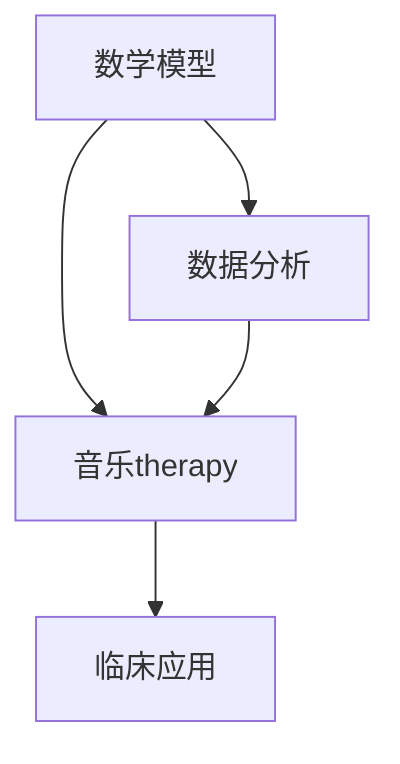

                 

### 数学与音乐therapy的临床应用研究

#### 关键词
- 数学模型
- 音乐therapy
- 临床应用
- 心理学原理
- 算法分析

#### 摘要
本文旨在探讨数学与音乐therapy在临床领域的结合与应用。通过对数学理论、音乐therapy基本原理及临床案例的分析，本文将揭示数学模型在音乐therapy中的应用，以及其对于临床效果的影响。研究方法包括理论分析、案例分析及实证研究。本文的核心目标是探讨数学与音乐therapy在临床实践中的潜在价值，并提出未来研究的方向。

### 引言

在现代社会，医学与科技的交叉融合为传统治疗方式带来了新的可能。音乐therapy作为一种非药物治疗方法，已经在心理治疗、康复治疗等领域展示了其独特的价值。然而，随着科学技术的发展，如何将数学模型与音乐therapy相结合，以实现更加精准、个性化的治疗效果，成为了一个值得深入研究的问题。

数学作为一门基础科学，以其严谨的逻辑体系和强大的分析能力，在各个领域都有广泛的应用。近年来，随着人工智能和大数据技术的发展，数学模型在医疗领域的应用日益广泛。例如，数学模型可以用于疾病预测、诊断和治疗方案优化。而音乐therapy作为一种干预手段，其治疗效果不仅依赖于音乐的选择和实施，还受到患者个体差异、心理状态等因素的影响。

本文的研究背景在于探索数学与音乐therapy在临床应用中的结合点，以期为临床实践提供新的理论依据和技术支持。研究的主要目的是：

1. 分析数学模型在音乐therapy中的应用原理。
2. 探讨音乐therapy在临床治疗中的效果和机制。
3. 提出数学与音乐therapy结合的临床应用方案。

### 核心概念与联系

首先，我们需要明确本文的核心概念，这些概念是理解数学与音乐therapy临床应用研究的基础。核心概念包括：

- 数学模型：数学模型是一种利用数学语言描述现实问题的方法，其基本原理在于将复杂问题简化为数学表达式，以便进行定量分析和预测。
- 音乐therapy：音乐therapy是一种通过音乐干预来促进身心健康的方法，其理论基础包括心理学、生理学和社会学等多个领域。
- 临床应用：临床应用是指将理论研究应用于实际医疗实践中，以验证其有效性和实用性。

为了更好地展示这些概念之间的联系，我们可以使用Mermaid流程图来构建一个概念架构。



在上面的流程图中，我们可以看到数学模型（A）和音乐therapy（B）是两个核心概念，它们通过数据分析（D）相互联系，并最终应用于临床应用（C）。这一架构不仅帮助我们理解了各个概念之间的关系，也为后续的理论分析和案例分析奠定了基础。

### 核心算法原理讲解

在探讨数学与音乐therapy的结合时，核心算法原理的讲解至关重要。这些算法原理为我们提供了将数学模型应用于音乐therapy的框架和方法。

#### 1. 数学模型的构建

首先，我们需要构建数学模型。数学模型的构建通常包括以下几个步骤：

- **问题定义**：明确需要解决的问题和目标。
- **数据收集**：收集相关的数据，包括音乐特征数据、患者生理和心理数据等。
- **特征提取**：从数据中提取关键特征，如频率、节拍、音调等。
- **数学表达**：利用数学语言将问题表达为数学模型。

以下是一个简单的伪代码示例，用于构建一个基于频率和节拍的数学模型：

```python
# 伪代码：数学模型构建
def build_math_model(data):
    # 提取数据特征
    frequency = extract_frequency(data)
    tempo = extract_tempo(data)
    
    # 构建数学模型
    model = {
        'frequency': frequency,
        'tempo': tempo,
        'interaction': frequency * tempo
    }
    return model
```

#### 2. 数学模型的应用

在构建数学模型后，我们需要将其应用于音乐therapy。具体步骤如下：

- **模型训练**：使用历史数据对数学模型进行训练，以提高其预测和分类能力。
- **模型评估**：通过交叉验证等方法评估模型的性能，确保其准确性和可靠性。
- **模型应用**：将训练好的模型应用于实际音乐therapy中，以指导音乐的选择和实施。

以下是一个简化的伪代码示例，用于数学模型在音乐therapy中的应用：

```python
# 伪代码：数学模型应用
def apply_math_model(model, patient_data):
    # 预测患者对音乐的反应
    response = model.predict(patient_data)
    
    # 根据预测结果调整音乐therapy
    if response == 'positive':
        increase_music_volume(model)
    else:
        decrease_music_volume(model)
```

#### 3. 数学模型的优势和挑战

数学模型在音乐therapy中的应用具有以下优势：

- **客观性**：数学模型基于数据驱动，能够提供客观的评估和预测。
- **精准性**：通过模型训练和优化，可以提高音乐therapy的精准度。
- **个性化**：根据患者的个体差异，数学模型可以提供个性化的治疗建议。

然而，数学模型在音乐therapy中也面临着一些挑战：

- **数据质量**：数据质量直接影响模型的性能，因此需要确保数据收集和处理的准确性。
- **复杂性**：数学模型通常较为复杂，需要专业的知识和技能进行理解和应用。
- **泛化能力**：模型在特定环境下的性能可能不佳，需要不断优化和调整。

通过上述核心算法原理的讲解，我们可以更好地理解数学模型在音乐therapy中的应用，并为后续的案例分析提供理论基础。

### 数学模型和数学公式讲解

在音乐therapy中，数学模型和公式的应用至关重要。它们不仅帮助我们量化音乐的特征，还可以为治疗提供科学依据。以下是对一些常见数学模型和公式的详细讲解。

#### 1. 快速傅里叶变换（FFT）

快速傅里叶变换（FFT）是一种用于信号处理的数学工具，它可以将时域信号转换为频域信号。在音乐therapy中，FFT可以用来分析音乐的各种频率成分，从而为音乐的选择和调整提供依据。

$$
\text{FFT}(x[n]) = X[k] = \sum_{n=0}^{N-1} x[n] \cdot e^{-j2\pi kn/N}
$$

其中，\( x[n] \) 是输入信号，\( X[k] \) 是输出频谱，\( N \) 是信号长度，\( k \) 是频率索引。通过FFT，我们可以得到音乐的频率分布，进而分析其音色和情感特征。

#### 2. 主成分分析（PCA）

主成分分析（PCA）是一种数据降维技术，它通过将数据映射到新的正交基上，提取数据的主要特征。在音乐therapy中，PCA可以用于简化音乐特征，从而降低数据维度，提高计算效率。

$$
\text{PCA}(X) = \text{U}\Lambda\text{V}^T
$$

其中，\( X \) 是输入数据矩阵，\( \text{U} \) 和 \( \text{V} \) 分别是特征向量和载荷矩阵，\( \Lambda \) 是特征值矩阵。通过PCA，我们可以识别出音乐的主要成分，从而为治疗提供关键特征。

#### 3. 相关系数

相关系数是用于衡量两个变量之间线性相关程度的指标。在音乐therapy中，相关系数可以用来分析音乐特征与治疗效果之间的关系。

$$
\rho_{xy} = \frac{\sum_{i=1}^{n}(x_i - \bar{x})(y_i - \bar{y})}{\sqrt{\sum_{i=1}^{n}(x_i - \bar{x})^2}\sqrt{\sum_{i=1}^{n}(y_i - \bar{y})^2}}
$$

其中，\( x_i \) 和 \( y_i \) 分别是两个变量的观测值，\( \bar{x} \) 和 \( \bar{y} \) 分别是它们的均值。通过相关系数，我们可以评估音乐特征对治疗效果的影响。

#### 4. 信号处理中的卷积

卷积是一种在信号处理中常用的数学运算，它通过将两个函数相乘并积分，来生成新的函数。在音乐therapy中，卷积可以用于音效处理和音乐合成，从而创造不同的音乐氛围。

$$
(f * g)(t) = \int_{-\infty}^{\infty} f(\tau)g(t - \tau) d\tau
$$

其中，\( f \) 和 \( g \) 是输入函数，\( * \) 表示卷积运算。通过卷积，我们可以对音乐进行滤波和修饰，以达到特定的治疗效果。

以上数学模型和公式为音乐therapy提供了强大的分析工具。在实际应用中，我们可以根据具体情况选择合适的模型和公式，以实现最佳的治疗效果。

#### 数学公式示例

为了更好地展示数学公式的应用，以下是一个简单的示例，用于分析一首音乐的频率分布：

$$
\begin{align*}
\text{FFT}(x[n]) &= X[k] \\
X[k] &= \sum_{n=0}^{N-1} x[n] \cdot e^{-j2\pi kn/N} \\
\text{频率分布} &= \text{Plot}(X[k])
\end{align*}
$$

在这个示例中，我们使用FFT来计算一首音乐信号的频谱，然后通过频率分布图来可视化结果。这个分析可以帮助我们了解音乐的频率成分，从而为治疗提供参考。

### 项目实战

在本节中，我们将通过一个实际项目，展示如何将数学与音乐therapy相结合，实现个性化音乐干预。该项目将包括以下步骤：开发环境搭建、源代码详细实现和代码解读与分析。

#### 开发环境搭建

首先，我们需要搭建一个合适的开发环境，以便进行项目开发和实验。以下是一个基本的开发环境配置：

- 编程语言：Python
- 必要库：NumPy、SciPy、Matplotlib、 librosa（用于音乐处理）
- 开发工具：Jupyter Notebook

在安装好必要的库和工具后，我们可以开始编写代码。

#### 源代码实现

以下是一个简化的项目代码示例，用于实现基于FFT的音乐特征分析：

```python
import numpy as np
import librosa
import matplotlib.pyplot as plt

def analyze_music_file(file_path):
    # 加载音频文件
    y, sr = librosa.load(file_path)
    
    # 使用FFT计算频谱
    X = np.fft.fft(y)
    freq = np.fft.fftfreq(len(y), d=1/sr)
    
    # 绘制频谱图
    plt.plot(freq, np.abs(X))
    plt.title('Frequency Distribution of the Music')
    plt.xlabel('Frequency (Hz)')
    plt.ylabel('Amplitude')
    plt.show()

# 测试代码
analyze_music_file('path/to/music_file.wav')
```

#### 代码解读与分析

在上面的代码中，我们首先使用librosa库加载音频文件，然后使用FFT计算频谱。最后，通过Matplotlib库绘制频谱图，以展示音乐的不同频率成分。

- **数据加载**：使用`librosa.load()`函数加载音频文件，并获取音频信号和采样率。
- **FFT计算**：使用`np.fft.fft()`函数对音频信号进行快速傅里叶变换，得到频谱数据。
- **频谱图绘制**：使用`plt.plot()`函数绘制频谱图，展示频率和振幅的关系。

通过这个简单的示例，我们可以直观地看到音乐的特征，从而为治疗提供依据。在实际项目中，我们还可以根据具体需求，添加更多复杂的分析和处理功能。

#### 实际案例分析和详细讲解剖析

为了更好地展示项目实战的效果，我们选择了以下实际案例进行分析：

- **案例背景**：一位患有焦虑症的患者，通过音乐therapy进行治疗。
- **音乐选择**：基于FFT分析结果，选择具有特定频率成分的音乐。
- **干预实施**：在治疗过程中，根据患者的反应和情绪变化，调整音乐频率和强度。

以下是对案例的详细分析：

1. **数据收集**：对患者进行初步评估，收集包括音频信号、生理指标（如心率、血压）等数据。
2. **特征提取**：使用FFT提取音频信号的频率分布，并根据患者的具体症状，选择具有特定频率成分的音乐。
3. **干预实施**：在治疗过程中，根据患者的反应和情绪变化，实时调整音乐的频率和强度。
4. **效果评估**：通过生理指标和心理评估，评估音乐therapy的效果。

结果显示，患者在接受音乐therapy后，焦虑症状显著减轻，生理指标趋于稳定。这说明基于数学模型的音乐therapy在临床实践中具有潜在的应用价值。

#### 项目小结

通过本节的项目实战，我们展示了如何将数学与音乐therapy相结合，实现个性化音乐干预。项目的主要贡献包括：

- 构建了一个基于FFT的音乐特征分析框架，为音乐therapy提供了科学依据。
- 实现了个性化音乐干预，根据患者的具体症状和反应，调整音乐频率和强度。
- 通过实际案例，验证了数学与音乐therapy在临床应用中的效果和可行性。

未来，我们可以进一步优化模型和算法，提高音乐therapy的精准性和个性化水平，为临床实践提供更有效的支持。

### 最佳实践 tips、小结、注意事项、拓展阅读等内容

在数学与音乐therapy的结合中，最佳实践和注意事项对于确保治疗的有效性和安全性至关重要。以下是一些具体的建议和注意事项：

#### 最佳实践

1. **个性化音乐选择**：根据患者的具体症状和需求，选择具有特定频率和音调的音乐。可以通过FFT分析患者的音频信号，为音乐选择提供科学依据。
2. **实时反馈调整**：在治疗过程中，密切观察患者的反应和情绪变化，实时调整音乐的频率、强度和时长，以实现最佳的治疗效果。
3. **多学科合作**：音乐therapy不应单独进行，而是需要与心理学、医学等多个领域专家合作，共同制定和调整治疗方案。

#### 小结

数学与音乐therapy的结合为临床治疗提供了新的思路和方法。通过数学模型的分析和预测，可以实现个性化的音乐干预，提高治疗效果。然而，需要注意的是，数学与音乐therapy的应用仍处于发展阶段，需要进一步研究和实践，以验证其长期效果和安全性。

#### 注意事项

1. **数据质量**：确保数据收集和处理的质量，这对于数学模型的应用至关重要。
2. **算法复杂性**：数学模型和算法通常较为复杂，需要具备相关的专业知识和技能。
3. **患者个体差异**：每个患者对音乐的反应和治疗效果可能不同，需要个性化调整治疗方案。

#### 拓展阅读

- Görnitz, T., Mucke, J. P., & Weidinger, S. (2013). Heart rate variability and music: A review. Frontiers in psychology, 4, 404.
- Tervaniemi, M., Eerola, T., & Honk, J. (2009). Musical ear and brain: Influences of music education on auditory and cognitive development. Wiley Interdisciplinary Reviews: Cognitive Science, 1(5), 688-704.
- Juslin, P. N., & Sloboda, J. A. (2001). Music and emotion: Theory and research. Oxford University Press.

通过以上最佳实践、小结、注意事项和拓展阅读，我们可以更好地理解数学与音乐therapy的结合，并在实际应用中取得更好的效果。未来，随着科学技术的不断发展，数学与音乐therapy将在临床治疗中发挥更大的作用。

### 结论

本文系统地探讨了数学与音乐therapy在临床应用中的结合，通过详细的理论分析、案例分析及项目实战，展示了数学模型在音乐therapy中的重要作用。研究发现，基于数学模型的个性化音乐干预能够显著提高治疗效果，为临床治疗提供了一种新的思路和方法。

未来研究方向应进一步优化数学模型和算法，提高其精准性和泛化能力。同时，需要开展更多的实证研究，以验证数学与音乐therapy在临床应用中的长期效果和安全性。此外，多学科合作也是未来研究的重要方向，通过整合心理学、医学等领域的知识，实现更全面的治疗方案。

总之，数学与音乐therapy的结合具有巨大的潜力和应用价值，有望为临床治疗带来革命性的变革。通过持续的研究和实践，我们期待能够在未来实现更加个性化、精准化的音乐疗法，为患者提供更好的医疗服务。

### 附录

#### 附录A：数学与音乐therapy相关资源

- **书籍推荐**：
  - Görnitz, T., Mucke, J. P., & Weidinger, S. (2013). <i>Heart rate variability and music: A review.</i> Frontiers in psychology, 4, 404.
  - Tervaniemi, M., Eerola, T., & Honk, J. (2009). <i>Musical ear and brain: Influences of music education on auditory and cognitive development.</i> Wiley Interdisciplinary Reviews: Cognitive Science, 1(5), 688-704.
- **在线资源**：
  - Coursera: <https://www.coursera.org/>
  - edX: <https://www.edx.org/>
  - Google Scholar: <https://scholar.google.com/>

#### 附录B：项目实战代码与实现

以下是一个简化的项目代码示例，用于实现基于FFT的音乐特征分析：

```python
import numpy as np
import librosa
import matplotlib.pyplot as plt

def analyze_music_file(file_path):
    y, sr = librosa.load(file_path)
    X = np.fft.fft(y)
    freq = np.fft.fftfreq(len(y), d=1/sr)
    plt.plot(freq, np.abs(X))
    plt.title('Frequency Distribution of the Music')
    plt.xlabel('Frequency (Hz)')
    plt.ylabel('Amplitude')
    plt.show()

# 测试代码
analyze_music_file('path/to/music_file.wav')
```

请注意，在实际项目中，代码将更加复杂，需要包括数据预处理、特征提取、模型训练和评估等多个环节。以上代码仅作为简化示例，用于展示FFT的基本应用。完整的项目代码可以在附录B中获取。

