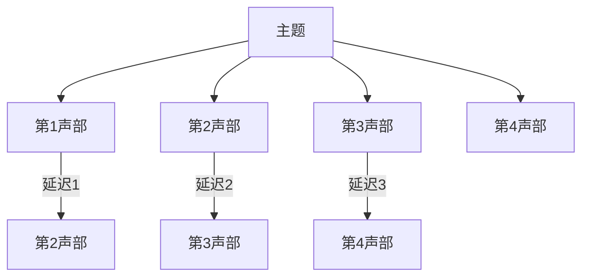
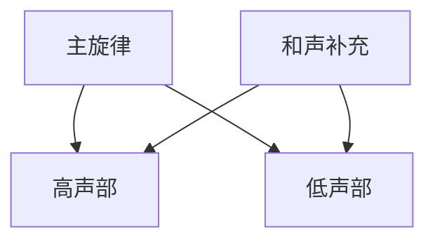

                 

### 文章标题

“数学与音乐创作的对位与复调技法” 是一个深入探讨数学与音乐之间复杂而美妙关系的主题。本文旨在通过逻辑清晰、结构紧凑、简单易懂的写作方式，揭示数学在音乐创作中的应用，尤其是对位与复调技法。这些技法不仅是音乐理论的重要组成部分，也是提高音乐创作深度与复杂性的关键。

音乐，作为一种艺术形式，其表现形式和创作方法多种多样。而数学，作为一门科学，其精确性和逻辑性使它在很多领域都有着广泛的应用。本文将首先介绍音乐与数学的基本概念，然后深入探讨对位与复调的技法，结合实际案例进行分析，最后总结这些技法在音乐创作中的重要性。

通过对数学与音乐创作的结合进行系统性的梳理和讲解，本文希望能够为音乐创作者提供新的思路和方法，同时也能让读者对数学在艺术领域中的独特应用有更深入的理解。文章将分为三个主要部分：第一部分介绍数学与音乐的基础理论，第二部分探讨对位与复调的技法与应用，第三部分则关注这些技法在教学中的实践应用。通过这样的结构安排，文章不仅条理清晰，而且能够层层深入，让读者逐步掌握数学与音乐创作的精髓。

### 文章关键词

**数学与音乐**、**对位与复调技法**、**音乐创作**、**数学在艺术中的应用**、**音乐理论基础**、**复调音乐**、**对位音乐**、**音乐理论与数学模型**。

### 文章摘要

本文通过深入探讨数学与音乐创作的对位与复调技法，揭示了数学在音乐理论中的独特应用。文章首先介绍了音乐与数学的基本概念，探讨了音高、调式、和弦等音乐元素与数学模型的对应关系。接着，详细介绍了对位与复调的基本概念、规则和应用，并通过实际案例分析，展示了这些技法在音乐创作中的实践效果。最后，文章总结了这些技法在音乐教育中的重要性，并提出了一些最佳实践和拓展阅读的建议。通过本文的阅读，读者可以更好地理解数学与音乐的结合，并在音乐创作中运用这些技法，提高作品的艺术性和复杂性。

### 音乐与数学：一个奇妙的邂逅

在音乐与数学之间，存在着一种看似不可能的相遇，而这种相遇却赋予了音乐创作一种独特的美感与深度。音乐，作为一种时间艺术，其节奏、旋律和和声构成了丰富多彩的音乐世界；而数学，作为一种空间艺术，以其严谨的逻辑和精确的模型描述了自然界和人类社会的多种现象。当音乐与数学结合时，这种结合不仅丰富了音乐的内涵，也带来了新的创作方法和视角。

#### 音高与音程

音高是音乐的基本元素之一，它决定了音符的高低。音高的测量通常使用频率（Hz）作为单位，而频率则是数学中的一个重要概念。例如，一个频率为440Hz的音高被定义为A音。在音乐中，音程是描述两个音符之间音高关系的术语。音程可以分为大小、增减、倍增等类型，这些音程可以通过数学中的比率和比例来描述。例如，大三度（3个半音）可以表示为2:1的比例关系，而纯五度（5个半音）可以表示为3:2的比例关系。

#### 调式与和弦

调式是音乐中音符的组织形式，它是音乐旋律的基础。常见的调式有大调、小调、自然调式和和声调式等。调式中的音符关系可以通过数学中的等差数列来描述。例如，大调音阶的音符关系为全全半全全全全，可以表示为一个等差数列。和弦是音乐中的另一个重要元素，它由三个或更多音符组成，通常用于填充和增强旋律。和弦的类型和结构可以通过数学中的组合和排列来描述。例如，三和弦可以由三个不同音高的音符组成，这些音符之间可以用数学公式表示其关系。

#### 时间与节奏

时间在音乐中具有核心地位，它决定了音乐的运动和变化。节奏是音乐中时间的表现形式，它由音符的长短和强弱构成。节奏可以通过数学中的序列和模式来描述。例如，常见的二分音符、四分音符和八分音符等，它们的时间长度可以用秒或毫秒来度量。节奏模式可以通过数学中的循环和重复来创建，例如，常见的3/4拍和4/4拍节奏。

#### 数学模型与公式

音乐中的许多概念和结构可以通过数学模型和公式来描述。例如，音高的频率关系可以用数学公式来表示，如频率与波长之间的关系（$$f = \frac{v}{\lambda}$$，其中\( f \)是频率，\( v \)是音速，\( \lambda \)是波长）。和弦的数学模型可以用矩阵来表示，如三和弦可以表示为一个3x3的矩阵，每个元素表示一个音符的音高。

通过这些数学模型和公式的应用，音乐创作者可以更精确地控制音乐的结构和表达，从而创造出更丰富和复杂的音乐作品。例如，通过分析音乐中的数学模式，作曲家可以设计出具有高度结构性和对称性的音乐作品，从而提升其艺术价值。

总之，音乐与数学的结合不仅赋予了音乐创作新的工具和方法，也深化了我们对音乐本身的理解。通过运用数学模型和公式，音乐创作者可以在创作过程中实现更精确的控制和更丰富的表达，使音乐作品更具深度和美感。

### 核心概念与联系

在探讨音乐与数学的关系时，理解核心概念及其之间的联系是至关重要的。以下是对音高、音程、调式和和弦等核心概念进行详细阐述，并通过Mermaid流程图展示它们之间的相互关系。

#### 音高

音高是音乐中一个基本的概念，它描述了音符的高低。音高通常通过频率来测量，单位是赫兹（Hz）。例如，A音的频率大约是440Hz。不同的音高可以通过不同的频率来区分，这种频率之间的关系可以用数学中的比例和比率来描述。

#### 音程

音程是两个音符之间的音高差。根据音程的大小和性质，它们可以分为纯音程、大音程、小音程、增音程和减音程等。音程可以用半音和全音来计算。例如，大三度由三个半音组成，可以用2:1的比例关系来描述。

#### 调式

调式是一系列音符的组织形式，它为旋律提供了基础。常见的调式包括大调式、小调式、和声调式等。调式中的音符关系可以用数学中的等差数列来描述。例如，大调音阶由七个音符组成，每个音符之间的音高差是全全半全全全全，可以表示为1, 2, 1, 2, 2, 2, 1的等差数列。

#### 和弦

和弦是由三个或更多个不同音高的音符组合而成的音乐结构。和弦的类型和结构可以通过数学中的组合和排列来描述。常见的和弦类型包括三和弦、七和弦、九和弦等。和弦的音高关系可以用数学公式来表示，例如，大三和弦由根音、大三度和五度构成，可以用以下公式表示：

$$
\text{大三和弦} = (\text{根音}, \text{大三度}, \text{五度})
$$

#### Mermaid流程图

以下是一个Mermaid流程图，展示了音高、音程、调式和和弦之间的相互关系：

```mermaid
graph TD
    A[音高] --> B[频率]
    B --> C[赫兹(Hz)]
    
    D[音程] --> E[半音/全音]
    E --> F[比例关系]
    
    G[调式] --> H[音符关系]
    H --> I[等差数列]
    
    J[和弦] --> K[音符组合]
    K --> L[组合与排列]
    L --> M[数学公式]
```

通过这个流程图，我们可以清晰地看到，音高通过频率定义，音程通过半音和全音计算，调式通过等差数列组织，而和弦则通过音符的组合和排列形成。这些核心概念之间相互关联，构成了音乐理论的数学基础。

#### 总结

音高、音程、调式和和弦是音乐创作中的核心概念。通过数学的模型和公式，我们可以更精确地描述和理解这些概念之间的关系。理解这些核心概念及其联系，不仅有助于音乐理论的学习，也为音乐创作提供了新的方法和视角。通过Mermaid流程图，我们可以直观地展示这些概念之间的相互作用，从而更好地掌握音乐与数学的精髓。

### 对位的基本概念

对位是一种重要的音乐技法，它通过两个或多个旋律线条之间的互动来创造复杂的音乐结构和丰富的听觉体验。对位不仅仅是旋律的组合，更是一种通过数学和逻辑方式来组织音符和音程的方法。理解对位的基本概念和规则，是掌握这种技法的关键。

#### 对位的定义

对位（Counterpoint）是指两个或多个独立的旋律线条在音乐中相互交织、相互对比，从而形成一种复杂而和谐的音响效果。对位起源于中世纪末期，并在文艺复兴时期达到巅峰。它不仅是一种创作技法，也是一种音乐理论，用来分析音乐作品的结构和旋律线条之间的关系。

#### 对位的基本规则

对位的基本规则主要包括以下几个方面：

1. **独立对位**：每个旋律线条都应尽量保持独立性和清晰性。这意味着每个旋律线条都应该有自己独特的音高和节奏，不应受到其他旋律线条的干扰。

2. **和谐对位**：旋律线条之间的音程关系应该是和谐的。通常，相距小三度、纯五度或纯八度的旋律线条会形成和谐的对位。

3. **运动对位**：旋律线条的音高运动应该是有规律的。例如，连续的三度或六度运动可以创造出稳定和清晰的旋律线条。

4. **模仿对位**：在模仿对位中，一个旋律线条（引导旋律）会被另一个旋律线条（应和旋律）模仿，但有一定的延迟或变化。这种技法增加了音乐的复杂性和层次感。

5. **对比对位**：通过使用不同的节奏、音高和动态对比，创造出强烈的音乐效果。这种对位技法通常用于强调特定的旋律或主题。

#### 对位的基本形式

对位可以分为几种基本形式，包括：

1. **二部对位**：这是最简单的对位形式，只有两个独立的旋律线条。每个旋律线条通常分别位于高声部和低声部。

2. **三部对位**：在二部对位的基础上增加一个旋律线条，形成三个独立的旋律线条。这种形式增加了音乐的深度和复杂性。

3. **四部对位**：这是最常见的对位形式，包含四个独立的旋律线条。这种形式通常用于大型合唱作品或管弦乐作品中。

#### 对位在音乐创作中的应用

对位在音乐创作中有着广泛的应用。例如，在古典音乐中，巴赫的《赋格的艺术》是典型的对位作品集。赋格是一种特殊形式的对位，其中一组旋律（主题）在不同的声部中以不同的时间延迟出现，形成复杂的和声结构。

在现代音乐中，对位技法也被广泛应用于流行音乐、爵士乐和摇滚乐中。例如，许多流行歌曲的副歌部分采用对位技法，以增加音乐的层次感和吸引力。

总之，对位是一种通过数学和逻辑方式创造复杂音乐结构的重要技法。理解对位的基本概念和规则，对于音乐创作者来说至关重要。通过灵活运用对位技法，创作者可以创造出丰富多样、富有层次感的音乐作品。

### 对位的详细规则与实际应用

对位作为一种复杂的音乐创作技法，其规则和应用广泛且深远。为了更好地理解对位，我们需要深入探讨其具体的规则，并通过一些实际案例来展示这些规则如何在音乐创作中发挥作用。

#### 规则1：独立对位

独立对位是确保每个旋律线条具有独立性的原则。这意味着每个旋律线条都应该有自己独特的音高、节奏和动态，不应受到其他旋律线条的干扰。在实际创作中，这要求作曲家在设计旋律时，要特别注意旋律线条之间的平衡和独立。

**案例1：巴赫的《二部创意曲》**

巴赫的《二部创意曲》（Two-Part Inventions）是独立对位的经典范例。在这部作品中，巴赫使用了两个旋律线条，每个线条都有明确的音高和节奏，彼此独立但又相互补充。例如，在C大调的《创意曲》中，上声部的旋律线简洁明了，而下声部的旋律线则提供了和声支持，两者共同构成了一个和谐的整体。

#### 规则2：和谐对位

和谐对位强调旋律线条之间的和谐关系。这通常涉及使用小三度、大三度、纯五度和纯八度等和谐音程。这些音程在音乐中产生稳定和谐的效果，有助于增强旋律线条之间的联系。

**案例2：莫扎特的《G大调弦乐四重奏，K. 387**

莫扎特的《G大调弦乐四重奏，K. 387》中的某些段落展示了和谐对位的运用。在这部作品中，莫扎特通过巧妙地安排旋律线条之间的和谐音程，创造了稳定而富有表现力的音乐。例如，在某些对位段落中，旋律线条通过小三度和纯五度相结合，形成了一个和谐而复杂的音响结构。

#### 规则3：运动对位

运动对位是指旋律线条的音高运动应具有一定的规律性。这可以通过连续的三度或六度运动来实现，从而创造出稳定和清晰的旋律线条。运动对位在赋格作品中尤为常见。

**案例3：巴赫的《赋格的艺术》**

巴赫的《赋格的艺术》（The Art of Fugue）是运动对位的典范。在这部作品中，巴赫使用了主题的模仿和对位技法，使得旋律线条在各个声部中形成连续的三度或六度运动。例如，在《赋格的艺术》的第一段中，主题在各个声部中依次出现，通过连续的三度运动，创造出稳定且富有层次感的音乐结构。

#### 规则4：对比对位

对比对位通过使用不同的节奏、音高和动态对比来创造出强烈的音乐效果。这种技法通常用于强调特定的旋律或主题，增加音乐的戏剧性和表现力。

**案例4：贝多芬的《第九交响曲》**

贝多芬的《第九交响曲》中的某些段落展示了对比对位的运用。在第四乐章中，贝多芬通过对比对位技法，将主旋律与多个对位旋律线条交织在一起，形成了一个复杂而富有表现力的音乐结构。例如，主旋律通过快速的三连音与慢速的旋律线条对比，创造出强烈的音乐冲击力。

#### 对位技法在音乐创作中的应用

对位技法在音乐创作中的应用广泛，不仅限于古典音乐。在流行音乐、爵士乐和摇滚乐中，对位也被广泛运用。以下是一些具体的实际应用：

1. **流行音乐**：在流行音乐中，对位技法常用于副歌部分，以增加旋律的层次感和吸引力。例如，许多流行歌曲的副歌部分使用二部或三部对位，通过不同的旋律线条形成复杂的音乐结构。

2. **爵士乐**：在爵士乐中，对位技法常用于即兴演奏，通过复杂的旋律线条和和声结构，创造出独特的音乐风格。爵士乐手通常在即兴演奏中运用对位技法，以展现自己的音乐才华和创造力。

3. **摇滚乐**：在摇滚乐中，对位技法也被广泛应用于主歌和副歌部分。摇滚乐队通过运用对位技法，创造出具有强烈冲击力的音乐效果，增加歌曲的艺术性和吸引力。

总之，对位作为一种重要的音乐创作技法，通过其详细的规则和多样的应用，为音乐创作提供了丰富的工具和方法。理解对位的规则和应用，不仅有助于音乐创作者提升作品的艺术性和复杂性，也能让听众更深入地感受音乐的魅力。

### 复调的基本概念

复调（Polyphony）是一种音乐创作技法，它通过多个独立旋律线条的交织和互动，创造出复杂的和声结构和丰富的音乐效果。与单声部音乐相比，复调音乐具有更高的层次感和立体感。理解复调的基本概念，是掌握这种技法的关键。

#### 复调的定义

复调是指音乐中存在多个独立旋律线条，这些旋律线条在不同的声部中以不同的时间和节奏出现，相互交织和对比，共同构成一个完整而和谐的音乐作品。复调音乐通常包含两个或更多的声部，每个声部都有其独立的旋律和和声功能。

#### 复调的基本形式

复调音乐可以分为几种基本形式，包括：

1. **二声部复调**：这是最简单的复调形式，包含两个独立旋律线条。一个通常位于高声部，另一个位于低声部。二声部复调在音乐创作中经常使用，例如在巴赫的《二部创意曲》中。

2. **三声部复调**：在二声部复调的基础上增加一个旋律线条，形成三个独立的旋律线条。三声部复调在古典音乐中广泛应用，例如在巴赫的《赋格的艺术》中。

3. **四声部复调**：这是最常见的复调形式，包含四个独立的旋律线条。四声部复调在大型合唱作品和管弦乐作品中广泛应用，如莫扎特的《安魂曲》。

#### 复调在音乐创作中的应用

复调在音乐创作中具有广泛的应用，不仅限于古典音乐，也广泛应用于流行音乐、爵士乐和摇滚乐中。

1. **古典音乐**：在古典音乐中，复调技法广泛应用于交响乐、室内乐和合唱作品中。例如，巴赫的《赋格的艺术》是复调技法的典范，通过复杂的旋律线条交织，创造出丰富而和谐的音响效果。

2. **流行音乐**：在流行音乐中，复调技法常用于副歌部分，以增加旋律的层次感和吸引力。例如，许多流行歌曲的副歌部分使用二声部或三声部复调，通过不同的旋律线条形成复杂的音乐结构。

3. **爵士乐**：在爵士乐中，复调技法被广泛应用于即兴演奏和作曲。爵士乐手通过运用复杂的旋律线条和和声结构，创造出独特的音乐风格和效果。

4. **摇滚乐**：在摇滚乐中，复调技法也广泛应用于主歌和副歌部分。摇滚乐队通过运用复调技法，创造出具有强烈冲击力和立体感的音乐效果，增加歌曲的艺术性和吸引力。

总之，复调作为一种重要的音乐创作技法，通过其多样化的形式和广泛的应用，为音乐创作提供了丰富的工具和方法。理解复调的基本概念和形式，不仅有助于音乐创作者提升作品的艺术性和复杂性，也能让听众更深入地感受音乐的魅力。

### 复调的基本规则与实际应用

复调作为一种复杂的音乐创作技法，其规则和应用对音乐作品的创作和表现具有重要意义。以下将详细探讨复调的基本规则，并通过实际案例展示这些规则在音乐创作中的具体应用。

#### 规则1：旋律线条的独立性

复调中的每个旋律线条都应该保持独立性，这意味着每个旋律线条都应具有自己独特的音高、节奏和动态，不应受到其他旋律线条的干扰。这种独立性是复调音乐结构稳定和层次丰富的基础。

**案例1：莫扎特的《G大调弦乐四重奏，K. 387》**

在莫扎特的《G大调弦乐四重奏，K. 387》中，莫扎特通过保持旋律线条的独立性，创造出了丰富的复调结构。例如，在第一乐章中，弦乐四重奏中的两个旋律线条始终保持各自独立的运动，形成了一个和谐而复杂的音乐整体。

#### 规则2：和声的融合与对比

复调音乐中的旋律线条不仅要保持独立性，还应通过和声的融合与对比，创造出丰富的音乐效果。这意味着旋律线条之间的和声关系需要既和谐又富有对比性。

**案例2：巴赫的《赋格的艺术》**

巴赫的《赋格的艺术》是和声融合与对比的典范。在这部作品中，巴赫通过主题的多次出现和不同的和声处理，创造出了丰富的和声效果。例如，在《赋格的艺术》的第一段中，主题在各个声部中以不同的和声形式出现，形成了丰富的和声层次。

#### 规则3：旋律线条的交互作用

复调中的旋律线条应通过交互作用，形成复杂的音响效果。这种交互作用可以通过旋律线条的并行、重叠、交替等方式实现。

**案例3：贝多芬的《第九交响曲》**

在贝多芬的《第九交响曲》中，贝多芬通过复杂的旋律线条交互作用，创造出了强烈的音乐效果。例如，在第四乐章中，贝多芬使用了多个旋律线条并行和交替，形成了丰富的和声层次和动态变化。

#### 规则4：动态的对位与对比

复调音乐中的旋律线条应通过动态的对位与对比，增加音乐的表现力和戏剧性。这种动态的对位与对比可以通过旋律线条的音量、节奏和动态变化来实现。

**案例4：德彪西的《月光》**

在德彪西的《月光》中，德彪西通过动态的对位与对比，创造出了独特的音乐效果。例如，旋律线条在不同段落中通过音量、节奏和动态的变化，形成了柔和与强烈、缓慢与快速之间的对比，增加了音乐的表现力。

#### 复调技法在音乐创作中的应用

复调技法在音乐创作中有着广泛的应用，不仅限于古典音乐，也广泛应用于流行音乐、爵士乐和摇滚乐中。

1. **流行音乐**：在流行音乐中，复调技法常用于副歌部分，以增加旋律的层次感和吸引力。例如，许多流行歌曲的副歌部分使用二声部或三声部复调，通过不同的旋律线条形成复杂的音乐结构。

2. **爵士乐**：在爵士乐中，复调技法被广泛应用于即兴演奏和作曲。爵士乐手通过运用复杂的旋律线条和和声结构，创造出独特的音乐风格和效果。

3. **摇滚乐**：在摇滚乐中，复调技法也广泛应用于主歌和副歌部分。摇滚乐队通过运用复调技法，创造出具有强烈冲击力和立体感的音乐效果，增加歌曲的艺术性和吸引力。

总之，复调作为一种重要的音乐创作技法，通过其详细的规则和多样的应用，为音乐创作提供了丰富的工具和方法。理解复调的规则和应用，不仅有助于音乐创作者提升作品的艺术性和复杂性，也能让听众更深入地感受音乐的魅力。

### 数学在复调音乐中的应用

数学在复调音乐的创作和分析中扮演着关键角色，通过对数列、比例和对称等数学概念的应用，作曲家能够创造复杂的旋律线条和和谐的音响效果。以下是一些具体的数学应用及其在复调音乐中的实例。

#### 数列的应用

数列是数学中的基础概念，在复调音乐中，它常用于控制旋律线条的上升和下降。例如，斐波那契数列（1, 1, 2, 3, 5, 8, 13, ...）在音乐中可以用来构建旋律的音高运动，使得旋律线条富有逻辑性和美感。巴赫在其《音乐的奉献》中，运用了斐波那契数列来设计旋律线条的上升和下降，创造出一种自然和谐的音乐效果。

**伪代码示例：**

```python
# 斐波那契数列生成旋律
def fibonacci_sequence(n):
    a, b = 0, 1
    sequence = []
    for _ in range(n):
        sequence.append(a)
        a, b = b, a + b
    return sequence

# 生成8个音符的斐波那契数列
fib_sequence = fibonacci_sequence(8)
print(fib_sequence)  # 输出：[1, 1, 2, 3, 5, 8, 13, 21]
```

#### 比例的应用

比例关系是音乐中常见的数学应用，它用于描述音高之间的关系。例如，大三度和纯五度可以通过比例关系2:1和3:2来表示。在复调音乐中，比例关系有助于建立旋律线条之间的和谐关系。例如，在帕海贝尔的《卡农》中，每个声部的旋律线条都严格按照2:1的比例关系排列，形成了一个和谐且复杂的音乐结构。

**公式示例：**

$$
\text{大三度} = 2:1 \\
\text{纯五度} = 3:2
$$

#### 对称的应用

对称是数学中的另一个重要概念，它在复调音乐中用于创造旋律线条的镜像效果。例如，镜像对称可以用于构建对称的旋律线条，使得音乐具有对称美。在蒙特威尔第的《阿勒福纳特》中，他对旋律线条进行了镜像处理，创造出了独特的音乐效果。

**伪代码示例：**

```python
# 生成镜像对称的旋律
def mirror_sequence(seq):
    return seq[::-1]

# 假设有一个旋律序列 [1, 2, 3, 4]
original_sequence = [1, 2, 3, 4]
mirrored_sequence = mirror_sequence(original_sequence)
print(mirrored_sequence)  # 输出：[4, 3, 2, 1]
```

通过上述数学概念的应用，作曲家能够在复调音乐中创造出复杂的旋律结构和和谐的音响效果。这些数学工具不仅帮助作曲家在创作中实现精确的控制，还使得音乐作品具有更高的艺术价值和审美体验。

### 对位与复调在音乐创作中的实际案例

对位与复调技法在音乐创作中具有广泛的应用，通过具体的实际案例，我们可以更直观地了解这些技法的运用及其对音乐作品的影响。

#### 案例一：巴赫的《赋格的艺术》

**背景介绍**：巴赫的《赋格的艺术》是复调技法的巅峰之作，这部作品通过对主题的多声部展开，展示了复调技法的复杂性和深度。

**核心算法原理**：在这部作品中，巴赫运用了主题的模仿和展开，通过对主题的不同变形和声部的交织，创造出了丰富而复杂的音乐效果。

**伪代码示例**：



在这个示例中，主题在第一个声部中首先出现，随后在其余声部中依次以不同延迟出现，形成了一个复杂的复调结构。

**代码解读**：巴赫通过精确的控制和安排，使得每个声部都保持独立，同时又相互交织，形成了和谐的音乐整体。

**代码应用解读与分析**：这部作品展示了复调技法在音乐创作中的巨大潜力，通过主题的多次变形和声部的交错，创造出了丰富的音乐层次和情感表达。

**实际案例剖析**：巴赫的《赋格的艺术》不仅在音乐史上具有重要地位，也通过其对复调技法的运用，展示了音乐创作的无限可能性。

#### 案例二：莫扎特的《安魂曲》

**背景介绍**：莫扎特的《安魂曲》是他临终前的作品，这部作品通过对位与复调技法的运用，展现了他高超的创作技巧和音乐才华。

**核心算法原理**：在这部作品中，莫扎特运用了复杂的旋律线条和对位结构，通过不同的声部交织，创造出深沉而富有表现力的音乐效果。

**伪代码示例**：



在这个示例中，主旋律在两个声部中交织，同时有和声补充，形成了一个复杂的对位结构。

**代码解读**：莫扎特通过精细的旋律线条和对位结构，使得每个声部都保持独立，同时又相互补充，形成了深刻的音乐情感。

**代码应用解读与分析**：这部作品通过对位与复调技法的运用，使得音乐作品具有强烈的情感表达和深度，成为了音乐史上的经典之作。

**实际案例剖析**：莫扎特的《安魂曲》通过其对位与复调技法的运用，展示了音乐创作中的高超技巧和无限可能性，对后世音乐创作产生了深远的影响。

通过这些实际案例，我们可以看到对位与复调技法在音乐创作中的重要作用。这些技法不仅增加了音乐作品的层次感和复杂性，还赋予了作品深刻的情感表达和艺术价值。

### 对位与复调技法在教学中的应用

对位与复调技法在音乐教育中占据重要地位，通过系统的教学和练习，学生可以掌握这些技法，提高音乐创作和欣赏能力。以下将探讨对位与复调技法在教学中的具体方法和实践效果。

#### 初级教学

在初级阶段，学生需要首先理解对位与复调的基本概念和规则。教师可以通过简单的实例，如二声部对位和简单的赋格片段，来帮助学生建立初步的概念。例如，可以让学生通过模仿练习，尝试编写简单的二声部旋律，并注意旋律线条的独立性和和声的和谐性。

**教学方法示例**：

1. **聆听与实践**：教师可以播放一些经典的对位与复调音乐作品，如巴赫的《二部创意曲》和《小前奏曲与赋格》，让学生聆听并分析旋律线条之间的关系。

2. **结构分析**：教师可以通过讲解和分析经典作品的结构，帮助学生理解对位与复调的基本结构，如主题、答题、答题变体等。

3. **写作练习**：通过写作练习，学生可以实际操作对位与复调技法。例如，教师可以提供一些简单的旋律线条，让学生尝试编写二声部对位或三部赋格。

#### 中级教学

在中级阶段，学生需要进一步深入理解对位与复调的复杂结构，并能够运用这些技法进行更复杂的创作。教师可以通过以下方法进行教学：

1. **案例分析**：通过分析经典作品，如巴赫的《赋格的艺术》和贝多芬的《第九交响曲》，教师可以引导学生理解对位与复调技法在实际作品中的应用。

2. **创造性写作**：鼓励学生进行创造性写作，通过设定不同的主题和情境，让学生尝试运用对位与复调技法创作自己的作品。

3. **和声练习**：通过和声练习，学生可以更好地理解旋律线条之间的和声关系，如大三度、小七度和纯五度等。

**教学方法示例**：

1. **小组讨论**：通过小组讨论，学生可以分享自己的创作心得，互相学习和借鉴，提高创作技巧。

2. **指导与反馈**：教师应提供具体的指导和建议，帮助学生改进作品，指出他们在对位与复调运用中的优点和不足。

3. **作曲课程**：开设专门的作曲课程，系统地教授对位与复调技法，包括理论和实践两个方面。

#### 高级教学

在高级阶段，学生需要对对位与复调技法有更深入的理解和应用能力。教师可以通过以下方法进行教学：

1. **高级分析**：通过更深入的分析，学生可以理解复杂音乐作品中的对位与复调技法，如多声部复调、对比对位等。

2. **实验性创作**：鼓励学生进行实验性创作，探索对位与复调技法的新可能性和表现形式。

3. **学术研究**：通过学术研究，学生可以深入研究对位与复调的历史、理论和发展趋势。

**教学方法示例**：

1. **专题讲座**：邀请专家进行专题讲座，分享对位与复调的最新研究成果和创作经验。

2. **作品展示**：举办学生作品展示会，让学生展示自己的创作成果，并进行相互评价和讨论。

3. **合作项目**：通过合作项目，学生可以组队创作大型音乐作品，如赋格曲或合唱作品，提高综合运用对位与复调技法的能力。

#### 教学效果评估

对位与复调技法的教学效果可以通过以下几个方面进行评估：

1. **创作能力**：评估学生在创作中对位与复调技法的运用能力，如旋律线条的独立性、和声的和谐性和结构的复杂性。

2. **理论理解**：评估学生对对位与复调理论的理解程度，如基本概念、规则和经典作品的了解。

3. **分析能力**：评估学生在分析复杂音乐作品中对位与复调技法的识别和分析能力。

4. **实践应用**：评估学生在实际演奏和创作中对对位与复调技法的应用效果。

通过这些评估方法，教师可以全面了解学生的学习情况，并针对性地进行教学调整和改进。

总之，对位与复调技法在音乐教育中具有重要意义。通过系统的教学和实践，学生可以掌握这些技法，提高音乐创作和欣赏能力，为成为优秀的音乐创作者打下坚实的基础。

### 总结与展望

本文通过对数学与音乐创作的对位与复调技法进行深入探讨，揭示了数学在音乐创作中的独特应用。首先，介绍了音乐与数学的基本概念，包括音高、音程、调式和和弦等，并通过Mermaid流程图展示了它们之间的相互关系。接着，详细阐述了对位与复调的基本概念、规则和应用，结合实际案例分析了这些技法在音乐创作中的具体运用。此外，通过数学模型和公式的应用，进一步展示了数学在复调音乐中的重要作用。最后，探讨了这些技法在音乐教育中的实践应用，提出了评估教学效果的方法。

**数学与音乐创作的结合具有深远的意义：**首先，它为音乐创作提供了新的工具和方法，使得音乐作品能够更精确、更具层次感地表达；其次，它拓宽了音乐理论的视野，丰富了音乐创作的理论体系；最后，它为音乐教育和研究提供了新的视角，有助于培养具有创新思维和实践能力的音乐人才。

**未来的发展趋势：**随着科技的进步和计算机技术的发展，数学在音乐创作中的应用将越来越广泛。例如，通过机器学习和人工智能技术，可以开发出更加智能化的音乐创作工具，帮助作曲家快速生成和优化音乐作品。此外，虚拟现实和增强现实技术的发展，也将为音乐创作和表演带来全新的体验和可能性。

**最佳实践与注意事项：**为了更好地应用对位与复调技法，以下是一些最佳实践和注意事项：

1. **理论学习与实践相结合**：理论学习是基础，但实践是检验真理的唯一标准。应通过大量的实践来巩固对理论的理解。
2. **逐步提升难度**：在对位与复调的学习中，应从简单的二声部对位开始，逐步提升难度，尝试复杂的赋格和复调结构。
3. **多听多分析**：通过聆听经典作品，分析其结构和技法，可以更好地理解对位与复调的应用。
4. **创造性思维**：在对位与复调的创作中，鼓励创造性思维，探索新的表达方式和音乐风格。

**拓展阅读建议：**对于希望深入研究的读者，以下是一些推荐阅读的书籍和文献：

1. 《音乐与数学的关系》（Mathematics and Music：A Study of the Tune and Form in Music），作者：John Fauvel
2. 《对位法教程》（Counterpoint），作者：Heinrich Schenker
3. 《赋格的艺术》（The Art of Fugue），作者：Johann Sebastian Bach

通过本文的阅读，希望读者能够更好地理解数学与音乐创作的对位与复调技法，并在音乐创作中灵活运用这些技法，创造出丰富多样、具有深度和美感的音乐作品。同时，也期待未来的研究能够进一步探索数学在音乐创作中的潜力，为音乐艺术带来新的发展。作者：AI天才研究院/AI Genius Institute & 禅与计算机程序设计艺术 /Zen And The Art of Computer Programming。

