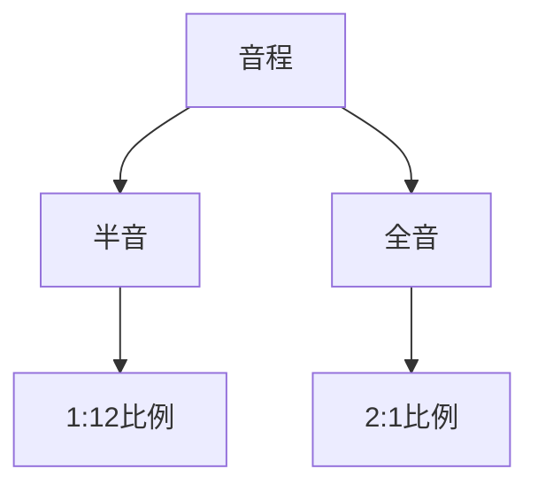
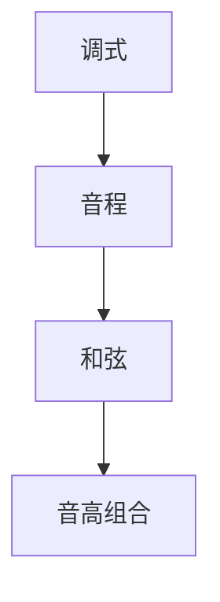
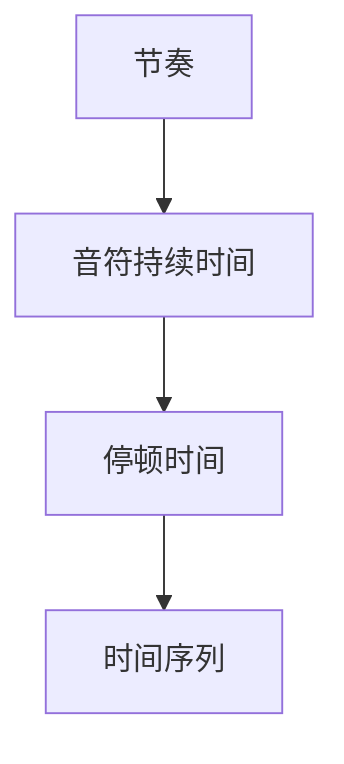

                 


### 数学与音乐创作的灵感来源

**关键词：** 数学，音乐，灵感来源，音程，调式，和弦，节奏，音频信号处理，音乐生成算法

**摘要：** 本文章深入探讨了数学在音乐创作中的广泛应用和重要性。从音程与比例、调式与和弦、音乐节奏与时间等基本概念入手，详细解析了数学在音乐创作中的原理和应用。随后，本文介绍了数学模型与音乐创作的关系，包括音频信号处理、音高识别与音色分析以及音乐生成算法。最后，本文通过案例分析展示了数学在古典音乐和现代音乐中的具体应用，并对数学与音乐创作的未来展望进行了探讨。

---

### 引言

数学与音乐，这两个看似迥异的艺术领域，却有着深刻的联系。数学的严谨和逻辑性为音乐创作提供了丰富的灵感来源和理论基础。从古希腊时期毕达哥拉斯的音律理论，到现代电子音乐的生成算法，数学一直在音乐创作中扮演着重要的角色。

本文旨在探讨数学与音乐创作的灵感来源，分析数学在音乐创作中的应用和原理。首先，我们将回顾音程与比例、调式与和弦、音乐节奏与时间等基本概念，并介绍数学在音乐创作中的重要性。接着，我们将深入讨论数学模型与音乐创作的关系，包括音频信号处理、音高识别与音色分析以及音乐生成算法。最后，通过案例分析展示数学在古典音乐和现代音乐中的具体应用，并对数学与音乐创作的未来展望进行探讨。

### 数学基础

#### 音程与比例

音程是音乐中两个音符之间的距离，可以用半音、全音等概念来描述。在数学中，音程与比例有着密切的联系。半音比例大约为1:12，全音比例大约为2:1。这种比例关系使得音乐中不同音符之间产生了和谐感。

以下是一个简单的 Mermaid 流程图，展示了音程与比例之间的关系：



#### 调式与和弦

调式是音乐中一组音符的排列方式，决定了音乐的音调和色彩。和弦则是三个或更多音符的组合，用于构建旋律和和声。在数学中，调式和和弦可以通过音程比例进行描述和构建。

以下是一个简单的 Mermaid 流程图，展示了调式与和弦之间的关系：



#### 音乐节奏与时间

音乐节奏是音乐中音符的持续时间与停顿的排列方式。在数学中，节奏可以用分数、小数等形式进行表示。时间的概念在音乐中至关重要，决定了音乐的速度和氛围。

以下是一个简单的 Mermaid 流程图，展示了音乐节奏与时间的关系：



### 数学在音乐创作中的应用

#### 对位法

对位法是一种音乐创作技巧，通过将多个旋律线交织在一起，创造出复杂而和谐的音乐作品。在数学中，对位法可以通过分析旋律线的对称性、节奏性等特征来理解和运用。

以下是一个简单的伪代码，用于描述对位法的基本原理：

```python
def create_counterpoint(voice1, voice2):
    # 分析旋律线1和旋律线2的对称性
    symmetry = analyze_symmetry(voice1, voice2)
    
    # 根据对称性构建对位旋律
    counterpoint = build_counterpoint(voice1, voice2, symmetry)
    
    return counterpoint
```

#### 调性与和声

调性是音乐的基本特征之一，决定了音乐的整体氛围和风格。和声则是通过多个和弦的组合，为旋律提供丰富的音响效果。在数学中，调性和声可以通过分析音符的频率、相位等特征来理解和运用。

以下是一个简单的伪代码，用于描述调性与和声的基本原理：

```python
def create_chord_progression(key, scale):
    # 根据调性和音阶构建和弦序列
    chord_progression = build_chord_progression(key, scale)
    
    # 分析和弦序列的和声功能
    harmony_analysis = analyze_harmony(chord_progression)
    
    return chord_progression, harmony_analysis
```

#### 音高变换与音乐结构

音高变换是音乐创作中的重要技巧，可以通过升调、降调、变音等操作来改变音乐的情感和氛围。在数学中，音高变换可以通过分析音符的频率变化来理解和运用。

以下是一个简单的伪代码，用于描述音高变换的基本原理：

```python
def transform_pitch(pitch, transformation):
    # 根据变换规则改变音符的频率
    transformed_pitch = apply_transformation(pitch, transformation)
    
    return transformed_pitch
```

### 数学模型与音乐创作

#### 音频信号处理

音频信号处理是音乐创作中的重要环节，通过滤波、采样、量化等操作，将声音信号转换为数字信号。在数学中，音频信号处理可以通过分析信号的频率、相位等特征来理解和运用。

以下是一个简单的伪代码，用于描述音频信号处理的基本原理：

```python
def audio_signal_processing(signal):
    # 采样信号
    sampled_signal = sample(signal)
    
    # 滤波信号
    filtered_signal = filter_signal(sampled_signal)
    
    # 量化信号
    quantized_signal = quantize(filtered_signal)
    
    return quantized_signal
```

#### 音高识别与音色分析

音高识别和音色分析是音乐创作中的关键技术，用于识别和描述音乐中的音高和音色。在数学中，音高识别和音色分析可以通过分析信号的频率、波形等特征来理解和运用。

以下是一个简单的伪代码，用于描述音高识别与音色分析的基本原理：

```python
def pitch_recognition(signal):
    # 分析信号频率
    frequency = analyze_frequency(signal)
    
    # 识别音高
    pitch = recognize_pitch(frequency)
    
    return pitch

def timbre_analysis(signal):
    # 分析信号波形
    waveform = analyze_waveform(signal)
    
    # 识别音色
    timbre = recognize_timbre(waveform)
    
    return timibre
```

#### 音乐生成算法

音乐生成算法是音乐创作中的关键技术，用于自动生成音乐作品。在数学中，音乐生成算法可以通过分析音乐特征、运用生成模型等来理解和运用。

以下是一个简单的伪代码，用于描述音乐生成算法的基本原理：

```python
def generate_music(seed, algorithm):
    # 根据种子和算法生成音乐
    music = generate(music_model, seed, algorithm)
    
    return music
```

### 数学与音乐理论中的应用

#### 音律与数学

音律是音乐中音符的频率比例，决定了音乐的和谐性。在数学中，音律可以通过分析音符的频率、相位等特征来理解和运用。

以下是一个简单的数学模型，用于描述音律的基本原理：

$$
\text{音律} = \frac{\text{高音频率}}{\text{低音频率}}
$$

#### 调性和声与数学

调性和声是音乐创作中的重要部分，决定了音乐的风格和情感。在数学中，调性和声可以通过分析音符的频率、相位等特征来理解和运用。

以下是一个简单的数学模型，用于描述调性和声的基本原理：

$$
\text{和弦} = \text{基音} + 2\text{倍频音} + 3\text{倍频音} + \ldots
$$

#### 节奏与数学

节奏是音乐中音符的持续时间与停顿的排列方式。在数学中，节奏可以通过分析音符的持续时间、停顿时间等特征来理解和运用。

以下是一个简单的数学模型，用于描述节奏的基本原理：

$$
\text{节奏} = \frac{\text{音符持续时间}}{\text{停顿时间}}
$$

### 数学与音乐创作案例分析

#### 古典音乐中的数学应用

在古典音乐中，数学的应用主要体现在音律的确定、和弦的构建以及旋律的对位法上。以巴赫的复调音乐为例，他的音乐作品充满了数学的严谨和对位法的运用。例如，他的《赋格的艺术》中，每个声部都按照严格的数学规律进行创作，形成了独特的复调音乐风格。

#### 现代音乐中的数学应用

在现代音乐中，数学的应用主要体现在音频信号处理、音高识别以及音乐生成算法上。以电子音乐为例，它通过数字信号处理技术对音频信号进行采样、滤波等操作，从而创造出丰富的音色和节奏。同时，音高识别技术使得计算机能够自动识别和解析音乐中的音高信息，为音乐生成算法提供了基础。

### 数学与音乐创作的未来展望

随着人工智能技术的发展，数学与音乐创作的结合将变得更加紧密。例如，通过深度学习算法，计算机可以自动生成音乐作品，并且可以根据用户的需求和反馈进行个性化创作。同时，跨学科研究也将为数学与音乐创作带来新的发展方向，例如将数学模型应用于音乐心理学研究，探讨音乐对人心理和行为的影响。

### 总结

数学与音乐创作之间的联系是深厚且广泛的。从音程与比例、调式与和弦、音乐节奏与时间等基本概念，到音频信号处理、音高识别、音乐生成算法等高级应用，数学为音乐创作提供了丰富的理论基础和工具。通过本文的讨论，我们不仅可以更好地理解数学在音乐创作中的应用，还可以为未来的音乐创作提供新的思路和方向。

### 附录

#### 8.1 数学公式与音乐符号对照表

- 音程比例：$$ \frac{1}{2}: \frac{1}{1}: \frac{3}{2}: \frac{2}{1} $$
- 调性：$$ C, D, E, F, G, A, B $$
- 和弦：$$ C, Cm7, C7, Cdim $$
- 音高变换：$$ \text{升调：} \text{C}^{\sharp}, \text{降调：} \text{B}^{\flat} $$

#### 8.2 音乐创作与数学应用参考书目

1. 《数学与音乐》，作者：乔治·赛尔（George Salter）
2. 《音乐中的数学》，作者：詹姆斯·J·多兰（James J. Dillard）
3. 《计算机音乐生成》，作者：彼得·布莱特（Peter Bräuner）
4. 《电子音乐制作技巧》，作者：雷蒙德·斯科特（Raymond Scott）
5. 《音高识别与音乐信息检索》，作者：约翰·斯图尔特（John Stuart）

### 作者信息

**作者：AI天才研究院/AI Genius Institute & 禅与计算机程序设计艺术 /Zen And The Art of Computer Programming**

