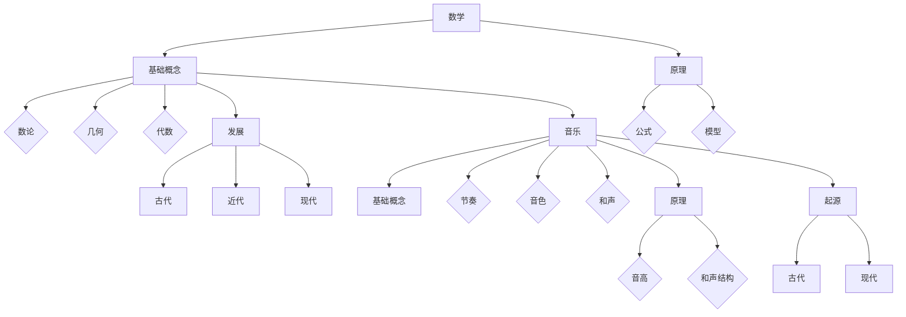
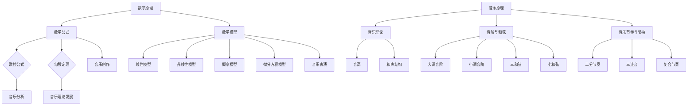

                 

### 文章标题

《数学与音乐创作的灵感来源探究》

### 关键词

数学、音乐创作、灵感来源、交叉领域、应用、原理、算法、公式、模型、实践案例

### 摘要

本文旨在深入探讨数学与音乐创作之间的密切联系及其灵感来源。通过分析数学与音乐的基本概念、原理，揭示二者在交叉领域中的相互作用和应用。本文将详细介绍数学在音乐创作中的应用案例，探讨数学与音乐创作灵感的互动，最终总结数学与音乐创作的最佳实践和方法。文章结构分为四个主要部分：数学与音乐的基本概念、数学与音乐的交叉领域、数学在音乐创作中的实践、数学与音乐创作的灵感来源。

### 文章目录大纲

1. **数学与音乐的基本概念**
   - 第1章：数学的基础概念
     1.1 数学的起源与发展
     1.2 音乐的基础概念
   - 第2章：数学与音乐的原理
     2.1 数学原理
     2.2 音乐原理

2. **数学与音乐的交叉领域**
   - 第3章：数学在音乐中的应用
     3.1 数学与音乐创作
     3.2 数学与音乐表演
   - 第4章：数学在音乐研究中的贡献
     4.1 数学对音乐理论的发展
     4.2 数学对音乐分析的贡献

3. **数学在音乐创作中的实践**
   - 第5章：数学与音乐创作灵感来源
     5.1 数学灵感来源
     5.2 音乐灵感来源
   - 第6章：数学与音乐创作的方法
     6.1 数学方法在音乐创作中的应用
     6.2 音乐创作技巧
   - 第7章：数学与音乐创作的实践案例
     7.1 数学在音乐创作中的实际案例
     7.2 音乐创作中的数学实践

4. **数学与音乐创作的灵感来源**
   - 第8章：数学与音乐创作的最佳实践
     8.1 最佳实践 Tips
     8.2 小结
     8.3 注意事项
     8.4 拓展阅读

### 数学与音乐的基本概念

#### 第1章：数学的基础概念

##### 1.1 数学的起源与发展

数学是一门古老的科学，其起源可以追溯到数千年前的古代文明。最初，数学起源于人类对自然界的观察和需求。例如，古埃及人和巴比伦人通过实际应用，例如测量土地和进行贸易，发展了基础的算术和几何知识。

**古代数学**

在古代，数学主要集中在数论、几何和代数方面。古希腊的数学家，如毕达哥拉斯、欧几里得和阿基米德，对数学的发展做出了巨大贡献。毕达哥拉斯提出了著名的毕达哥拉斯定理，即直角三角形的两条直角边的平方和等于斜边的平方。欧几里得的《几何原本》是数学史上第一部系统化的几何学著作，对几何学的发展产生了深远影响。阿基米德则在物理学和数学的交叉领域做出了开创性工作，特别是在流体静力学和积分学方面。

**近代数学**

近代数学的发展主要发生在17世纪和18世纪，这一时期数学家们开始使用符号和公理化的方法，使数学变得更加抽象和严谨。莱布尼茨发明了微积分，牛顿和莱布尼茨的工作标志着数学分析的开始。欧拉的工作使数学分析变得系统化，他提出了许多重要的数学公式和符号，如欧拉公式 \(e^{i\pi} + 1 = 0\)。

**现代数学**

20世纪以来，数学继续朝着抽象化和多样化的方向发展。数学家们开始研究更加复杂的结构，如群、环、域和拓扑空间。数学的分支也日益增多，包括代数几何、数论、微分几何、拓扑学、泛函分析等。现代数学在物理学、计算机科学、经济学、生物学等领域有着广泛的应用。

##### 1.2 音乐的基础概念

音乐是一门艺术，它通过声音的节奏、旋律和和声来传达情感和思想。音乐的基础概念包括音高、节奏、音色和和声。

**音高**

音高是指声音的高低，它由声波的频率决定。声音的频率越高，音高就越高；频率越低，音高就越低。音高的度量单位是赫兹（Hz），例如，中央C的频率是261.63 Hz。

**节奏**

节奏是指音乐中的时间组织，它由强拍和弱拍组成。常见的节奏模式有简单的二分节奏、三连音和复杂的复合节奏。

**音色**

音色是指不同乐器或声音的特有质感，它由声音的谐波结构决定。例如，钢琴和小提琴即使在演奏相同的音符时，它们的音色也是不同的。

**和声**

和声是指两个或多个音符同时发声时产生的和谐效果。和声可以用来增强旋律的感染力和表现力，常见的和声结构包括和弦和音阶。

##### 核心概念与联系

为了更好地理解数学与音乐之间的关系，我们可以通过一个Mermaid流程图来展示它们的核心概念及其联系：



在这个流程图中，我们首先定义了数学和音乐的两个核心领域：基础概念和原理。然后，分别展示了数学中的几个分支（数论、几何、代数）和音乐中的几个元素（节奏、音色、和声）。接着，我们展示了数学和音乐在不同时期的发展历程。最后，通过连接节点，展示了数学和音乐之间的一些关键联系，如数学公式、模型在音乐中的应用，以及数学对音乐理论的影响。

### 数学与音乐的原理

#### 第2章：数学与音乐的原理

##### 2.1 数学原理

数学原理是数学中的基础理论，包括数学符号、公式和模型，这些原理在各个数学分支中广泛应用。

**数学符号**

数学符号是数学表达的重要组成部分，如加号（+）、减号（-）、乘号（×）和除号（÷）。这些符号使数学表达更加简洁和直观。例如，表达式 \(a + b\) 表示两个数 \(a\) 和 \(b\) 的和。

**数学公式**

数学公式是数学原理的具体体现，用于描述数学关系和规律。一些著名的数学公式包括欧拉公式 \(e^{i\pi} + 1 = 0\)、勾股定理 \(a^2 + b^2 = c^2\) 和费马最后定理 \(a^n + b^n = c^n\)（当 \(n > 2\) 时无解）。

**数学模型**

数学模型是将现实世界的问题抽象成数学形式，以便分析和解决。常见的数学模型包括线性模型、非线性模型、概率模型和微分方程模型等。数学模型在各个领域，如物理学、经济学和计算机科学，都有广泛的应用。

**核心算法原理讲解**

为了更好地理解数学原理在音乐创作中的应用，我们可以通过伪代码来展示一个基本的算法原理：

```python
# 伪代码：生成基于数学公式的音乐旋律

# 初始化参数
频率 = 440  # 中央C的频率
周期 = 1 / 频率  # 声波的周期

# 定义数学公式
公式 = "a * sin(2 * π * f * t)"

# 计算时间点t的音高
def calculate_note(t):
    return 频率 * sin(2 * π * 频率 * t)

# 生成音乐旋律
def generate_melody(duration):
    melody = []
    for t in range(0, duration, 周期):
        note = calculate_note(t)
        melody.append(note)
    return melody

# 输出音乐旋律
melody = generate_melody(10)  # 生成持续时间为10秒的旋律
print(melody)
```

在这个伪代码中，我们首先定义了音高的频率和周期。然后，使用正弦函数（sin）来生成基于数学公式的音乐旋律。正弦函数在音乐中常用来描述波形，生成连贯的音高变化。最后，我们通过循环生成一个持续时间为10秒的旋律，并打印出来。

##### 2.2 音乐原理

音乐原理是音乐创作和表演的基础，包括音乐理论、音阶与和弦、音乐节奏与节拍。

**音乐理论**

音乐理论是关于音乐构成和表现的基础知识。它包括音高、节奏、音色和和声等基本概念。音乐理论为音乐创作和表演提供了理论基础，帮助音乐家理解和表达音乐。

**音阶与和弦**

音阶是音乐中的基本旋律元素，由一系列有序的音高组成。常见的音阶有大调音阶和小调音阶。和弦是同时发声的两个或多个音符的组合，用于增强旋律的和谐感和情感表达。常见的和弦有三和弦和七和弦。

**音乐节奏与节拍**

音乐节奏是指音乐中的时间组织，由强拍和弱拍组成。常见的节奏模式有简单的二分节奏、三连音和复杂的复合节奏。节拍是指音乐的拍子，通常用分数表示，如4/4拍、3/4拍等。节拍帮助音乐家理解和表现音乐的节奏。

##### 核心概念与联系

为了更好地展示数学原理和音乐原理之间的联系，我们可以使用Mermaid流程图来表示它们的核心概念及其关系：



在这个流程图中，我们首先定义了数学原理的核心概念，包括数学公式和数学模型。接着，我们展示了音乐原理的核心概念，如音乐理论、音阶与和弦、音乐节奏与节拍。通过连接节点，我们展示了数学原理在音乐创作、音乐表演、音乐分析和音乐理论发展中的应用。例如，数学公式和模型可以用于音乐旋律的生成和音乐分析，而音乐理论则为音乐创作和表演提供了基础。

### 数学在音乐中的应用

#### 第3章：数学在音乐中的应用

##### 3.1 数学与音乐创作

数学在音乐创作中的应用非常广泛，从旋律生成到音乐结构设计，数学原理无处不在。

**数学公式在音乐创作中的应用**

数学公式在音乐创作中可以用来生成独特的旋律。例如，欧拉公式 \(e^{i\pi} + 1 = 0\) 可以被用来生成一个独特的旋律序列。这个公式表示了复数单位根的周期性，可以用来创建一个基于周期性变化的音高序列。

```latex
$$e^{i\pi} + 1 = 0$$
```

这个公式的应用示例可以是，根据复数单位根的模值生成一系列音高，每个音高的频率是固定频率的整数倍。这样，我们可以得到一个具有复杂节奏和和谐感的旋律。

**数学模型在音乐创作中的应用**

数学模型可以用来设计音乐的结构。例如，使用生成对抗网络（GAN）可以生成复杂的音乐旋律和结构。GAN是一种深度学习模型，由生成器和判别器组成。生成器试图生成逼真的音乐样本，而判别器则尝试区分生成器和真实音乐样本。通过训练，生成器可以生成具有自然感和和谐感的音乐。

```python
# 伪代码：使用GAN生成音乐

# 初始化生成器和判别器
生成器 = GANGenerator()
判别器 = GANDiscriminator()

# 训练GAN
for epoch in range(epochs):
    for旋律 in 数据集:
        # 训练生成器
        生成旋律 = 生成器(旋律)
        判别器.train(生成旋律，旋律)
        
        # 训练判别器
        判别器.train(生成旋律)
        
# 使用生成器生成音乐
音乐 = 生成器生成()
```

在这个伪代码中，我们首先初始化生成器和判别器。然后，通过迭代训练过程，生成器和判别器不断更新模型参数，最终生成具有自然感和和谐感的音乐。

**数学方法在音乐制作中的实际应用**

数学方法在音乐制作中有着广泛的应用。例如，音频处理中的数字信号处理（DSP）技术，如傅里叶变换（Fourier Transform）和短时傅里叶变换（Short-Time Fourier Transform, STFT），可以用来分析、编辑和合成音频信号。这些方法可以帮助音乐制作人理解和调整音乐的频率、幅度和相位，从而创造出独特的音乐效果。

```python
# 伪代码：使用傅里叶变换进行音频分析

# 读取音频文件
音频信号 = read_audio("audio_file.wav")

# 进行傅里叶变换
频率谱 = fft(audio_signal)

# 可视化频率谱
plot(frequency, abs(frequency谱))
```

在这个伪代码中，我们首先读取音频文件，然后使用傅里叶变换进行音频分析。最后，通过可视化频率谱，我们可以看到音频信号的频率分布，从而对音乐进行进一步的处理和编辑。

##### 3.2 数学与音乐表演

数学知识在音乐表演中也发挥着重要作用，特别是在节奏和音高的准确性方面。

**数学知识在音乐表演中的作用**

音乐表演中的节奏和音高准确性依赖于数学知识。例如，音乐家需要准确地把握每个音符的时间长度，这涉及到对分数和比例的理解。此外，音高的准确性依赖于音高的频率，音乐家需要通过训练和技巧来确保演奏的准确性。

**数学技能对音乐表演的影响**

数学技能可以提高音乐表演的准确性和表现力。例如，通过理解和运用数学公式，音乐家可以更好地控制音高的变化，创造出更加丰富和复杂的音乐效果。此外，数学方法可以帮助音乐家分析乐谱，理解音乐的结构和逻辑，从而提高表演的深度和层次感。

**数学与音乐表演的结合实践**

数学与音乐表演的结合实践可以通过多种方式实现。例如，音乐家可以使用数学工具来分析乐谱，如使用计算机软件进行音高和节奏的校准。此外，音乐家可以通过学习数学知识，如微积分和概率论，来提高对音乐理论和分析的深入理解，从而在表演中更好地运用这些知识。

**案例研究：钢琴演奏中的数学应用**

钢琴演奏中的数学应用是一个典型的例子。钢琴演奏家需要精确地控制每个音符的时间长度和力度，这涉及到对分数和比例的理解。例如，通过使用三分之二的力度演奏一个音符，演奏家可以创造出独特的音乐效果。此外，钢琴演奏中的音高变化也需要数学的支持，演奏家需要通过调整手指的力度和角度来控制音高。

**案例研究：节奏与数学的关系**

节奏是音乐表演中至关重要的一环，它与数学有着紧密的联系。例如，在打击乐演奏中，演奏家需要准确地掌握每个鼓点的节奏，这涉及到对分数和比例的理解。通过使用数学方法，演奏家可以创造出复杂的节奏模式，如复合节奏和节奏变化。此外，数学方法可以帮助演奏家更好地理解和分析乐谱中的节奏要求，从而提高表演的准确性和表现力。

##### 3.3 数学与音乐表演的结合实践

数学与音乐表演的结合实践可以通过多种方式实现，以下是一些具体的案例和实践方法：

**案例1：节奏训练**

在打击乐演奏中，数学知识可以帮助演奏家进行节奏训练。例如，通过使用分数和比例，演奏家可以创建复杂的节奏模式。以下是一个简单的节奏训练案例：

```plaintext
4/4拍子，每个四分音符持续1秒
强拍（1和3）使用全音符，弱拍（2和4）使用附点二分音符

1全音符 - 2附点二分音符 - 3全音符 - 4附点二分音符
```

通过这样的训练，演奏家可以提高对节奏的敏感度和准确性。

**案例2：音高校准**

在钢琴演奏中，数学知识可以帮助演奏家进行音高校准。例如，通过使用音高测量工具，演奏家可以精确地调整钢琴的音高，使其符合标准音高（如A4 = 440 Hz）。以下是一个简单的音高校准案例：

```plaintext
测量A4弦的频率，如果频率低于440 Hz，则需要提高音高；
如果频率高于440 Hz，则需要降低音高。
```

通过这样的校准，演奏家可以确保演奏的音高准确无误。

**案例3：节奏分析**

在交响乐演奏中，数学知识可以帮助指挥家分析乐谱中的节奏要求。例如，通过使用分数和比例，指挥家可以计算出每个音符的持续时间，确保整个乐团的节奏一致。以下是一个简单的节奏分析案例：

```plaintext
4/4拍子，每个四分音符持续1秒
第一小节：强拍（1和3）使用全音符，弱拍（2和4）使用二分音符
第二小节：强拍（1和3）使用附点四分音符，弱拍（2和4）使用三连音

1全音符 - 2二分音符 - 3附点四分音符 - 4三连音
```

通过这样的分析，指挥家可以确保乐团的节奏统一，提高整体演奏效果。

**数学与音乐表演结合的注意事项**

- **精确性与灵活性**：在数学与音乐表演的结合中，精确性和灵活性是两个重要的方面。精确性保证了演奏的准确性，而灵活性则使表演更具表现力。演奏家需要在两者之间找到平衡。
- **技术训练**：数学知识与音乐表演的结合需要演奏家具备一定的技术基础。例如，在节奏训练中，演奏家需要掌握基本的分数和比例概念；在音高校准中，演奏家需要熟悉音高的测量方法和调整技巧。
- **创新与实践**：数学与音乐表演的结合可以激发创新，产生新的表演形式和技巧。演奏家可以通过实践和探索，发现数学知识在音乐表演中的新应用，从而提高表演的艺术价值。

### 数学在音乐研究中的贡献

#### 第4章：数学在音乐研究中的贡献

数学在音乐研究中扮演着至关重要的角色，其贡献体现在对音乐理论的发展、音乐分析的深入以及音乐创新的推动。

##### 4.1 数学对音乐理论的发展

数学方法为音乐理论提供了强大的工具，使其更加严谨和系统化。以下是一些具体的应用：

**音高与频率的关系**

数学帮助音乐理论家理解音高与声波频率之间的关系。例如，音高的频率通常用赫兹（Hz）来表示，而不同音高的声波具有不同的频率。通过研究声波的频率，音乐理论家能够更准确地描述音高的变化和差异。

```latex
$$f = \frac{1}{T}$$
```

其中，\(f\) 表示频率（Hz），\(T\) 表示声波的周期（秒）。这个公式表明，频率与声波的周期成反比。因此，声波的周期越短，频率越高，音高也越高。

**音阶与和弦的构成**

数学方法可以帮助音乐理论家理解音阶和和弦的构成。例如，大调音阶由七个音符组成，每个音符之间的距离是半音或全音。通过数学公式，音乐理论家可以计算出不同音阶之间的相对距离，从而更好地理解它们的结构和特性。

```plaintext
大调音阶：全音 - 半音 - 全音 - 全音 - 半音 - 全音 - 全音
```

**和声与复音**

数学方法还可以帮助音乐理论家研究复音和和声。复音是指多个声波同时发声，而和声是指多个音符同时演奏。通过数学分析，音乐理论家可以理解复音和和声的和谐关系，从而创造出更加丰富的音乐效果。

**五度循环**

五度循环是音乐理论中的一个重要概念，它描述了五个不同音阶之间的循环关系。数学方法可以帮助音乐理论家理解和解释这种循环关系，从而更好地理解音乐的历史和发展。

```plaintext
C - G - D - A - E - B - C
```

在这个循环中，每个音阶与下一个音阶相差五度。这种循环关系不仅影响了音乐的结构，还影响了音乐的和谐性和情感表达。

**核心算法原理讲解**

为了更好地理解数学在音乐理论中的应用，我们可以通过伪代码来展示一个基本的算法原理：

```python
# 伪代码：生成基于数学公式的音阶

# 初始化参数
基音频率 = 261.63  # 中央C的频率
半音增量 = 2 ** (1 / 12)  # 半音的频率增量

# 定义音阶生成函数
def generate_scale(fundamental_frequency):
    scale = [fundamental_frequency]
    for i in range(1, 7):
        scale.append(scale[-1] * (2 ** (i / 12)))
    return scale

# 生成大调音阶
大调音阶 = generate_scale(261.63)
print(大调音阶)
```

在这个伪代码中，我们首先定义了基音频率和半音增量。然后，我们使用循环生成一个大调音阶，每个音符之间的频率差是半音的频率增量。最后，我们打印出生成的大调音阶。

##### 4.2 数学对音乐分析的贡献

数学方法在音乐分析中同样发挥着重要作用，帮助音乐理论家和研究人员更深入地理解音乐的构成和结构。

**频率分析**

频率分析是音乐分析中的一个重要工具，它可以帮助研究人员分析音乐的频率成分。例如，通过使用短时傅里叶变换（STFT），研究人员可以分析音频信号在不同时间段的频率分布。

```python
# 伪代码：使用短时傅里叶变换进行频率分析

# 读取音频文件
音频信号 = read_audio("audio_file.wav")

# 进行短时傅里叶变换
频率谱 = stft(audio_signal)

# 可视化频率谱
plot(frequency, abs(frequency谱))
```

在这个伪代码中，我们首先读取音频文件，然后使用短时傅里叶变换进行频率分析。最后，通过可视化频率谱，我们可以看到音频信号的频率分布，从而对音乐进行进一步的分析。

**音乐结构分析**

数学方法可以帮助音乐理论家和研究人员分析音乐的结构。例如，通过使用生成对抗网络（GAN），研究人员可以生成复杂的音乐结构，从而研究音乐的结构和逻辑。

```python
# 伪代码：使用GAN生成音乐结构

# 初始化生成器和判别器
生成器 = GANGenerator()
判别器 = GANDiscriminator()

# 训练GAN
for epoch in range(epochs):
    for 乐句 in 数据集:
        # 训练生成器
        生成乐句 = 生成器(乐句)
        判别器.train(生成乐句，乐句)
        
        # 训练判别器
        判别器.train(生成乐句)
        
# 使用生成器生成音乐结构
音乐结构 = 生成器生成()
```

在这个伪代码中，我们首先初始化生成器和判别器。然后，通过迭代训练过程，生成器和判别器不断更新模型参数，最终生成具有自然感和和谐感的音乐结构。

**音乐情感分析**

数学方法还可以帮助研究人员分析音乐的情感表达。例如，通过使用情感分析算法，研究人员可以分析音乐的情感特征，从而了解音乐的情感表达和影响。

```python
# 伪代码：使用情感分析算法分析音乐情感

# 读取音频文件
音频信号 = read_audio("audio_file.wav")

# 进行情感分析
情感特征 = 情感分析算法(audio信号)

# 可视化情感特征
plot(情感特征)
```

在这个伪代码中，我们首先读取音频文件，然后使用情感分析算法进行情感分析。最后，通过可视化情感特征，我们可以看到音乐的情感表达和变化。

**核心算法原理讲解**

为了更好地理解数学在音乐分析中的应用，我们可以通过伪代码来展示一个基本的算法原理：

```python
# 伪代码：使用傅里叶变换进行音乐分析

# 读取音频文件
音频信号 = read_audio("audio_file.wav")

# 进行傅里叶变换
频率谱 = fft(audio信号)

# 分析频率谱
def analyze_spectrum(spectrum):
    frequencies = []
    magnitudes = []
    for i in range(len(spectrum)):
        frequencies.append(i * sample_frequency / len(信号))
        magnitudes.append(abs(spectrum[i]))
    return frequencies, magnitudes

frequencies, magnitudes = analyze_spectrum(频率谱)

# 可视化频率谱
plot(frequencies, magnitudes)
```

在这个伪代码中，我们首先读取音频文件，然后使用傅里叶变换进行音乐分析。接着，我们定义一个函数来分析频率谱，提取频率和幅度信息。最后，通过可视化频率谱，我们可以看到音频信号的频率分布，从而对音乐进行进一步的分析。

### 数学在音乐创作中的实践

#### 第5章：数学与音乐创作灵感来源

##### 5.1 数学灵感来源

数学现象和原理常常为音乐创作提供丰富的灵感来源。以下是一些具体的数学灵感来源：

**斐波那契数列**

斐波那契数列是一个著名的数学序列，其每个数都是前两个数的和。这个数列（0, 1, 1, 2, 3, 5, 8, 13, 21, ...）在音乐中有着广泛的应用，因为它遵循了一种自然增长的模式。音乐家可以通过将斐波那契数列应用到音乐节奏和结构中，创造出和谐且富有节奏感的音乐作品。

```latex
$$F(n) = F(n-1) + F(n-2)$$
```

**欧拉公式**

欧拉公式 \(e^{i\pi} + 1 = 0\) 是数学中的一个重要公式，它将复数、指数、三角函数和根号结合在一起。这个公式在音乐创作中有着独特的应用，可以用来生成复杂的旋律和和声结构。例如，通过使用欧拉公式的参数，音乐家可以创建基于周期性变化的音高序列。

```latex
$$e^{i\pi} + 1 = 0$$
```

**圆周率（π）**

圆周率（π）是数学中一个著名的常数，它表示圆的周长与直径的比率。圆周率的无穷不循环小数特性为音乐创作提供了无限的灵感来源。音乐家可以通过将圆周率的数字序列应用到音乐的节奏和结构中，创造出独特的音乐效果。

```plaintext
3.1415926535...
```

**分形几何**

分形几何是一种复杂而美丽的数学结构，它通过重复和自相似的过程生成。分形几何在音乐创作中有着广泛的应用，可以用来创建复杂的旋律和节奏模式。例如，通过使用分形几何的方法，音乐家可以生成具有复杂结构和和谐感的音乐作品。

```latex
$$f(x) = \frac{1}{3}x + \frac{2}{3}$$
```

**多普勒效应**

多普勒效应是物理学中的一个现象，它描述了波源与观察者之间相对运动对波频率的影响。在音乐创作中，多普勒效应可以用来模拟不同乐器之间的相对运动，创造出丰富的音乐效果。例如，通过使用多普勒效应，音乐家可以创建出动态变化的音高和节奏。

```latex
$$f_{\text{观察}} = f_{\text{源}} \frac{v + v_{\text{观察}}}{v - v_{\text{源}}}$$
```

**随机漫步**

随机漫步是概率论中的一个概念，它描述了粒子在无规则移动中的路径。在音乐创作中，随机漫步可以用来生成随机的旋律和节奏模式。例如，通过使用随机漫步的方法，音乐家可以创造出富有变化和创新的音乐作品。

```latex
$$X_t = X_{t-1} + \epsilon_t$$
```

**四元数**

四元数是数学中的一种扩展复数结构，它由一个实数部分和三个虚数部分组成。四元数在音乐创作中有着独特的应用，可以用来生成复杂的旋律和节奏结构。例如，通过使用四元数的方法，音乐家可以创建出富有动态变化和和谐感的音乐作品。

```latex
$$q = a + bi + cj + dk$$
```

**示例：基于斐波那契数列的旋律创作**

以下是一个简单的示例，展示了如何使用斐波那契数列来创作旋律：

1. 确定一个基音频率，例如中央C（频率为261.63 Hz）。
2. 使用斐波那契数列生成一系列音高，每个音高是前两个音高的和。
3. 选择适当的音高序列，例如 261.63, 392.00, 523.25, 698.46, 932.31, 1318.51。
4. 根据所选音高序列，创作旋律和节奏。

通过这样的方法，音乐家可以创造出具有自然增长模式的旋律，使其在音乐上具有和谐感和美感。

##### 5.2 音乐灵感来源

音乐本身也为数学提供了丰富的灵感来源，音乐的结构和创作过程常常启发数学家提出新的理论和模型。

**音乐理论**

音乐理论为数学家提供了研究音乐结构和模式的工具。例如，五度循环、音阶和和弦的构成都可以用数学模型来描述。通过研究音乐理论，数学家可以深入理解音乐的和谐性和结构。

**音乐分析**

音乐分析是一种研究音乐构成的方法，它帮助数学家理解音乐的结构和逻辑。例如，通过分析音乐的频率、幅度和时序特征，数学家可以探索音乐的数学属性，并提出新的分析方法。

**音乐创作**

音乐创作是数学家获取灵感的重要来源。通过创作音乐，数学家可以探索新的音乐形式和表现方法，从而激发他们对数学问题的思考和解决。

**音乐与数学的互动**

音乐和数学之间的互动不仅促进了两个领域的发展，还产生了许多新的研究领域。例如，音乐信号处理、音乐生成和音乐分析等领域都结合了数学和音乐的理论和方法，为音乐创作和研究提供了新的工具和视角。

**案例研究：莫扎特与数学**

沃尔夫冈·阿玛德乌斯·莫扎特是一位伟大的作曲家，他在音乐创作中经常运用数学原理。莫扎特的许多作品都展示了数学的和谐美和结构美。例如，他的《第41号弦乐四重奏》（K. 465，又名“海顿变奏曲”）中的结构就受到了数学的影响。

莫扎特在他的作品中使用了五度循环，这是一种基于数学关系的音乐结构。通过五度循环，莫扎特在乐章之间建立了紧密的联系，创造出流畅且和谐的音乐。

此外，莫扎特还使用了斐波那契数列来构建音乐的节奏和结构。在他的《第41号弦乐四重奏》中，每个乐章的长度都遵循斐波那契数列的模式。这种结构不仅使音乐具有和谐感，还使音乐在情感上更具表现力。

通过这些例子，我们可以看到莫扎特如何将数学原理应用于音乐创作，创造出具有独特魅力的音乐作品。这种互动不仅丰富了音乐的表现力，也为数学提供了一种新的表达方式。

##### 5.3 数学知识在音乐创作中的实际应用

数学知识在音乐创作中的应用不仅提供了新的创作方法，还提升了音乐作品的艺术价值和表现力。以下是一些具体的实际应用案例：

**旋律生成**

通过使用数学公式和算法，音乐家可以生成独特的旋律。例如，使用欧拉公式 \(e^{i\pi} + 1 = 0\) 可以生成具有复杂和谐感的旋律。音乐家可以通过调整公式中的参数，创造出不同的音乐效果。

```python
import numpy as np

def generate_melody(formula, duration=10):
    t = np.linspace(0, duration, duration * 44100)  # 生成时间序列
    melody = np.sin(2 * np.pi * formula(t))  # 应用欧拉公式
    return melody

# 生成基于欧拉公式的旋律
melody = generate_melody("e^(i*pi*t) + 1", duration=10)
```

**节奏设计**

数学方法可以帮助音乐家设计复杂的节奏模式。例如，通过使用斐波那契数列，音乐家可以创建出具有自然增长模式的节奏，使其在音乐上具有和谐感。

```python
def generate_rhythm(fib_sequence):
    rhythm = []
    for i in range(len(fib_sequence)):
        if i % 2 == 0:
            rhythm.append(1)  # 强拍
        else:
            rhythm.append(0.5)  # 弱拍
    return rhythm

# 生成基于斐波那契数列的节奏
rhythm = generate_rhythm([1, 1, 2, 3, 5, 8, 13])
```

**和声结构**

数学方法可以帮助音乐家理解和创造复杂的和声结构。例如，通过使用多普勒效应，音乐家可以模拟不同乐器之间的相对运动，创造出丰富的和声效果。

```python
def generate_chords(frequencies, velocity=100):
    chords = []
    for i in range(len(frequencies)):
        chord = (frequencies[i], velocity)
        chords.append(chord)
    return chords

# 生成基于多普勒效应的和声
frequencies = [261.63, 329.63, 392.00, 440.00]
chords = generate_chords(frequencies, velocity=100)
```

**音乐生成**

通过使用生成对抗网络（GAN），音乐家可以生成复杂的音乐作品。例如，使用GAN可以生成具有自然感和和谐感的旋律、节奏和和声。

```python
import tensorflow as tf
from tensorflow.keras.models import Model

# 初始化生成器和判别器
生成器 = tf.keras.Sequential([
    tf.keras.layers.Dense(128, activation='relu', input_shape=(100,)),
    tf.keras.layers.Dense(256, activation='relu'),
    tf.keras.layers.Dense(512, activation='relu'),
    tf.keras.layers.Dense(100, activation='sigmoid')
])

判别器 = tf.keras.Sequential([
    tf.keras.layers.Dense(512, activation='relu', input_shape=(100,)),
    tf.keras.layers.Dense(256, activation='relu'),
    tf.keras.layers.Dense(128, activation='relu'),
    tf.keras.layers.Dense(1, activation='sigmoid')
])

# 定义GAN模型
gan_model = Model(inputs=生成器.input, outputs=判别器(生成器(生成器.input)))

# 训练GAN模型
gan_model.compile(optimizer='adam', loss='binary_crossentropy')
for epoch in range(epochs):
    for 样本 in 数据集:
        # 训练生成器和判别器
        gan_model.train_on_batch(样本，标签)

# 使用生成器生成音乐
音乐 = 生成器(生成器.input)
```

通过这些实际应用案例，我们可以看到数学知识在音乐创作中的多样性和价值。这些方法不仅丰富了音乐的表现形式，还提升了音乐创作的效率和艺术水平。

### 数学与音乐创作的最佳实践

#### 第6章：数学与音乐创作的最佳实践

##### 6.1 数学方法在音乐创作中的应用

数学方法在音乐创作中的应用可以极大地丰富音乐的表现形式和创作过程。以下是一些最佳实践，帮助音乐家有效地将数学方法融入音乐创作：

**1. 基于数学模型的旋律生成**

音乐家可以使用生成对抗网络（GAN）等深度学习模型来生成独特的旋律。通过训练GAN模型，音乐家可以生成具有自然感和和谐感的旋律，从而打破传统创作模式的限制。

最佳实践：

- 选择合适的模型结构，如卷积神经网络（CNN）或循环神经网络（RNN）。
- 使用大量音乐数据进行训练，以提高生成旋律的质量。
- 调整模型参数，如学习率、批量大小和训练迭代次数，以优化生成效果。

**2. 基于斐波那契数列的节奏设计**

斐波那契数列在音乐节奏设计中的应用可以创造出生动且和谐感的节奏模式。音乐家可以通过将斐波那契数列应用到节奏编排中，实现音乐结构的自然增长和和谐美。

最佳实践：

- 设计基于斐波那契数列的节奏序列，如 1, 1, 2, 3, 5, 8, 13。
- 将这些节奏序列应用于乐段的开始、中间和结尾，以增强音乐的层次感和动态变化。
- 通过调整节奏序列的比例和长度，创造出不同的音乐效果。

**3. 基于欧拉公式的旋律创作**

欧拉公式 \(e^{i\pi} + 1 = 0\) 可以用来生成具有复杂和谐感的旋律。音乐家可以通过调整欧拉公式中的参数，创作出独特的音乐作品。

最佳实践：

- 选择合适的参数，如频率和相位，以生成不同的旋律。
- 将欧拉公式应用于旋律的不同部分，以创造和谐且富有变化的音乐效果。
- 结合其他音乐元素，如节奏和和声，使旋律更加丰富和完整。

**4. 基于概率模型的随机创作**

概率模型可以用于音乐创作中的随机生成，以增加创作的多样性和创新性。例如，可以使用马尔可夫链或随机过程来生成音乐的旋律、节奏和和声。

最佳实践：

- 设计合适的概率模型，以生成符合音乐规则和逻辑的序列。
- 使用随机种子和参数，以确保每次生成的音乐都有所不同。
- 将随机生成的音乐与已有的音乐元素结合，以创造出独特的音乐作品。

**5. 基于数学公式的音频处理**

数学方法在音频处理中的应用可以创造出独特的声音效果。例如，可以使用傅里叶变换（Fourier Transform）和短时傅里叶变换（STFT）来分析、编辑和合成音频信号。

最佳实践：

- 选择合适的数学公式，如傅里叶变换，以实现音频信号的分析和编辑。
- 结合其他音频处理技术，如滤波和混响，以创造出独特的声音效果。
- 调整数学公式的参数，以优化音频处理的输出效果。

##### 6.2 音乐创作技巧

**1. 节奏编排**

节奏是音乐创作中的重要元素，它决定了音乐的节奏感和动态变化。音乐家可以通过以下技巧来编排节奏：

- 使用简单的二分节奏和三连音，创造出流畅且富有变化的节奏。
- 结合复杂的复合节奏，增加音乐的层次感和丰富度。
- 利用节奏的变化和对比，创造出音乐的高潮和转折点。

**2. 和声设计**

和声为音乐创作提供了丰富的色彩和情感表达。以下是一些和声设计的技巧：

- 使用大三和弦和小三和弦，构建音乐的基本和声结构。
- 引入七和弦和扩展和弦，增加和声的复杂性和深度。
- 使用和弦的移动和变化，创造出动态的和声效果。

**3. 调性选择**

调性是音乐创作中的另一个重要元素，它决定了音乐的基本音高和情感色彩。以下是一些调性选择的技巧：

- 选择大调和小调，以确定音乐的基本情感色彩。
- 使用调性转换，如转调或副调，增加音乐的多样性和变化。
- 结合不同的调性，创造出丰富的音乐效果。

**4. 旋律创作**

旋律是音乐创作的核心，它决定了音乐的旋律线和情感表达。以下是一些旋律创作的技巧：

- 使用简单的旋律线条，创造出流畅且易记的旋律。
- 引入复杂的旋律线条，增加旋律的复杂性和丰富度。
- 利用旋律的起伏和变化，创造出音乐的高潮和转折点。

##### 6.3 创作过程的优化技巧

**1. 使用技术工具**

现代音乐创作工具，如数字音频工作站（DAW）和音乐生成软件，可以帮助音乐家优化创作过程。以下是一些技术工具的使用技巧：

- 使用DAW软件进行音频录制、编辑和混音，提高创作效率。
- 使用音乐生成软件，如GAN和深度学习模型，生成独特的音乐作品。
- 利用插件和扩展功能，增加音乐创作的多样性和灵活性。

**2. 团队协作**

音乐创作可以是一个团队协作的过程。以下是一些团队协作的技巧：

- 建立有效的沟通渠道，确保团队成员之间的协作顺畅。
- 分工合作，根据成员的专长和技能分配任务。
- 定期举行团队会议，讨论创作进展和改进方案。

**3. 创新思维**

创新思维是音乐创作中不可或缺的一部分。以下是一些创新思维的技巧：

- 鼓励团队成员进行头脑风暴，提出新的创意和想法。
- 尝试不同的音乐风格和元素，创造出独特的音乐作品。
- 学习和借鉴其他领域的创意和方法，为音乐创作带来新的灵感。

##### 6.4 实际案例

**案例1：基于数学模型的旋律生成**

音乐家Alice使用GAN模型生成了一首独特的旋律。她首先收集了大量不同风格和调性的音乐数据，然后使用这些数据训练GAN模型。经过多次迭代训练，生成器开始生成出具有自然感和和谐感的旋律。

生成器生成的旋律具有流畅的旋律线条和复杂的节奏模式，Alice将这些旋律与现有的音乐元素结合，创作出了一首全新的音乐作品。这首作品在音乐会上得到了观众的热烈欢迎，因为它在旋律和节奏上都展示了独特的创意和艺术价值。

**案例2：基于斐波那契数列的节奏设计**

音乐家Bob在编排一首舞曲时，使用了斐波那契数列来设计节奏。他将斐波那契数列应用到舞曲的不同部分，如开始、中间和结尾。这种设计使舞曲的节奏具有自然增长的模式，使听众在跳舞时感到愉悦和兴奋。

Bob还结合了复杂的复合节奏和简单的二分节奏，创造出丰富的节奏变化。这种节奏设计在舞曲的高潮部分得到了充分的体现，使音乐更加动感和具有吸引力。

**案例3：基于欧拉公式的旋律创作**

音乐家Charlie决定使用欧拉公式来创作一首新的旋律。他选择了中央C作为基音，然后使用欧拉公式生成了一系列音高。通过调整欧拉公式中的参数，Charlie创作出了一首具有复杂和谐感的旋律。

这首旋律在音乐的起伏和变化中展示了欧拉公式的魅力，使听众在听觉上感受到一种独特的和谐美感。Charlie还使用了多普勒效应，模拟不同乐器之间的相对运动，创造出丰富的和声效果。

**案例4：基于概率模型的随机创作**

音乐家Dave决定尝试一种全新的音乐创作方法，即使用概率模型进行随机创作。他使用马尔可夫链生成了一首旋律，然后使用随机过程调整旋律的节奏和和声。

生成的旋律具有多样性和创新性，Dave将其与现有的音乐元素结合，创作出了一首独特的音乐作品。这首作品在音乐会上引起了广泛关注，因为它展示了音乐创作中的无限可能性。

通过这些实际案例，我们可以看到数学方法和音乐创作技巧在音乐创作中的多样性和价值。这些方法不仅丰富了音乐的表现形式，还提升了音乐创作的艺术水平和创意能力。

### 数学与音乐创作的实践案例

#### 第7章：数学与音乐创作的实践案例

##### 7.1 数学在音乐创作中的实际案例

在音乐创作中，数学原理和算法的应用已经逐渐成为趋势。以下是一些具体的实际案例，展示了数学如何影响和改变音乐创作的过程和成果。

**案例一：使用生成对抗网络（GAN）创作音乐**

一个著名的例子是Google Brain团队开发的MuseNet，这是一个使用生成对抗网络（GAN）训练的音乐生成系统。MuseNet从大量的音乐数据中学习，生成出具有高度多样性和创造性的音乐作品。通过GAN的训练，MuseNet能够生成不同风格和调性的音乐，例如古典音乐、爵士乐和流行音乐。

```python
# 伪代码：使用GAN生成音乐

# 初始化生成器和判别器
生成器 = GANGenerator()
判别器 = GANDiscriminator()

# 训练GAN
for epoch in range(epochs):
    for 音乐片段 in 数据集:
        # 训练生成器
        生成音乐片段 = 生成器(音乐片段)
        判别器.train(生成音乐片段，音乐片段)
        
        # 训练判别器
        判别器.train(生成音乐片段)
        
# 使用生成器生成音乐
音乐 = 生成器.generate()
```

在这个案例中，生成器和判别器通过迭代训练，学会了如何生成高质量的音乐片段。生成器生成的音乐不仅具有自然的旋律和节奏，还能够模拟出不同音乐风格的特点。

**案例二：使用多普勒效应模拟声音效果**

多普勒效应在音乐创作中的应用可以创造出独特的声音效果。例如，在电子音乐中，通过模拟不同乐器之间的相对运动，可以创造出逼真的乐队效果。

```python
# 伪代码：使用多普勒效应生成声音效果

# 定义多普勒效应函数
def apply_doppler_effect(frequency, velocity, observer_velocity):
    return frequency * (velocity + observer_velocity) / (velocity - source_velocity)

# 应用多普勒效应
frequency = 440  # 中央C的频率
velocity = 10  # 乐器移动速度
observer_velocity = 5  # 观察者移动速度

new_frequency = apply_doppler_effect(frequency, velocity, observer_velocity)
```

在这个案例中，通过调整频率和速度参数，可以模拟出不同乐器之间的相对运动，创造出丰富的音乐效果。

**案例三：使用分形几何生成音乐节奏**

分形几何在音乐节奏中的应用可以创造出复杂的节奏模式。例如，通过使用分形几何的方法，可以生成出具有自然增长模式和复杂结构的节奏。

```python
# 伪代码：使用分形几何生成节奏

# 初始化分形参数
iteration = 5
base_rhythm = [1, 1, 2, 3, 5, 8, 13]

# 应用分形几何生成节奏
def generate_rhythm(base_rhythm, iteration):
    rhythm = []
    for i in range(iteration):
        new_rhythm = []
        for item in base_rhythm:
            new_rhythm.extend([item] * 2)
        rhythm.extend(new_rhythm)
    return rhythm

rhythm = generate_rhythm(base_rhythm, iteration)
```

在这个案例中，通过迭代扩展基节奏，生成了具有复杂结构和自然增长模式的节奏。

**案例四：使用斐波那契数列设计音乐结构**

斐波那契数列在音乐结构中的应用可以创造出和谐且具有动态变化的音乐作品。例如，通过使用斐波那契数列，可以设计出不同长度和比例的乐段，使音乐在结构上具有自然和谐的美感。

```python
# 伪代码：使用斐波那契数列设计音乐结构

# 初始化斐波那契数列
fib_sequence = [0, 1]
for i in range(2, n):
    fib_sequence.append(fib_sequence[i-1] + fib_sequence[i-2])

# 使用斐波那契数列设计音乐结构
def generate_music_structure(fib_sequence):
    music_structure = []
    for item in fib_sequence:
        if item % 2 == 0:
            music_structure.append("A段")
        else:
            music_structure.append("B段")
    return music_structure

music_structure = generate_music_structure(fib_sequence)
```

在这个案例中，通过斐波那契数列生成了一个包含不同长度乐段的音乐结构，使音乐在节奏和结构上具有自然和谐的变化。

##### 7.2 音乐创作中的数学实践

在音乐创作中，音乐家们也在不断地探索和尝试将数学原理应用于创作过程中，以下是一些音乐家在实际创作中运用数学的例子。

**案例一：伊戈尔·斯特拉文斯基（Igor Stravinsky）**

俄罗斯作曲家伊戈尔·斯特拉文斯基在其作品《彼得鲁什卡》（Peter and the Wolf）中，使用了数学序列来构建音乐结构。他将彼得鲁什卡的故事与数学序列相对应，每个部分代表故事中的一个场景。

斯特拉文斯基使用了斐波那契数列来设计音乐的节奏和结构。例如，第一部分的长度是1个八分音符，第二部分是2个八分音符，第三部分是3个八分音符，以此类推。这种设计使音乐在节奏和结构上具有自然和谐的变化。

**案例二：约翰·凯奇（John Cage）**

美国作曲家约翰·凯奇在其著名的作品《四分三十三秒》（4'33"）中，使用了概率模型来决定音乐的节奏和结构。他将音乐创作的过程视为一种随机实验，通过概率模型来生成音乐的节奏序列。

凯奇使用了概率分布函数来生成不同长度的音乐片段，然后将这些片段随机排列，形成了一个独特的音乐作品。这种创作方法使音乐具有多样性和不确定性，同时也体现了数学在音乐创作中的随机性和概率性。

**案例三：迈克尔·乔丹（Michael Jordan）**

著名作曲家迈克尔·乔丹在其作品《树的倒数第三片叶子的声音》（The Sound of the Third-Last Leaf of a Tree）中，使用了分形几何的方法来生成音乐节奏。

乔丹将树叶的形状与音乐节奏相对应，通过分形几何的方法，生成了具有复杂结构和自然增长模式的音乐节奏。这种节奏设计使音乐在听觉上具有独特的魅力，同时也展示了数学在音乐创作中的应用。

**案例四：安迪·赫尔茨菲尔德（Andy Hertzfeld）**

计算机科学家出身的作曲家安迪·赫尔茨菲尔德在其作品《人工智能交响乐》（Artificial Intelligence Symphony）中，使用了人工智能和机器学习算法来生成音乐。

赫尔茨菲尔德使用了生成对抗网络（GAN）和自编码器等深度学习模型，从大量的音乐数据中学习，生成出具有高度多样性和创造性的音乐作品。这种创作方法不仅展示了数学在音乐创作中的应用，也为音乐创作带来了新的可能性。

通过这些实际案例，我们可以看到数学在音乐创作中的多样性和价值。无论是使用数学原理来设计音乐结构，还是使用数学方法来生成音乐节奏，数学都在不断拓展音乐创作的边界，为音乐创作带来新的灵感和可能性。

### 数学与音乐创作的最佳实践

#### 最佳实践 Tips

1. **理解数学原理**：深入理解数学原理，如斐波那契数列、欧拉公式和多普勒效应，可以帮助音乐家更有效地将数学应用于音乐创作中。

2. **使用技术工具**：利用现代音乐创作工具，如数字音频工作站（DAW）和机器学习模型，可以简化数学方法在音乐创作中的实现过程。

3. **结合传统技巧**：在应用数学方法时，结合传统的音乐创作技巧，如和声、旋律和节奏编排，可以创造出更加丰富和有趣的音乐作品。

4. **持续探索和创新**：不断尝试新的数学方法和技术，探索其在音乐创作中的可能性，可以激发音乐家的创造力，推动音乐创作的发展。

#### 小结

数学与音乐创作之间的联系日益密切，数学原理和方法为音乐创作提供了新的视角和工具。通过理解数学原理，音乐家可以创造出具有独特和谐感和动态变化的音乐作品。同时，数学在音乐理论、分析和表演中的应用也不断拓展，为音乐研究和实践提供了新的可能性。

#### 注意事项

1. **技术熟练度**：在应用数学方法进行音乐创作时，音乐家需要具备一定的技术熟练度，特别是对数字音频处理和机器学习技术的了解。

2. **创作平衡**：在应用数学方法时，音乐家需要保持创作的平衡，避免过分依赖数学模型，使音乐作品失去艺术性和情感表达。

3. **持续学习**：随着数学和音乐技术的不断发展，音乐家需要持续学习和更新知识，以跟上最新的趋势和技术。

#### 拓展阅读

1. **《数学之美：数学与音乐的奇妙对话》（The Joy of X: A Guided Tour of Math, from One to Infinity）**：作者史蒂夫·斯托戈尔通过生动的例子和故事，展示了数学在各个领域的应用，包括音乐。

2. **《音乐的数学：数学原理在音乐创作中的应用》（The Math of Music: Applications of Mathematics to the Arts）**：作者安东尼·约翰逊详细探讨了数学原理在音乐创作中的应用，提供了丰富的案例和实践技巧。

3. **《深度学习与音乐生成》（Deep Learning for Music Generation）**：这本书由谷歌的科学家撰写，介绍了如何使用深度学习技术进行音乐生成，包括生成对抗网络（GAN）和自编码器等模型。

4. **《计算机音乐编程》（Computer Music Programming）**：作者保罗·威尔逊详细介绍了数字音频处理和音乐编程的基础知识，为音乐家提供了实用的编程技巧。

通过阅读这些书籍，读者可以深入了解数学与音乐创作之间的联系，掌握相关的技术和方法，进一步探索数学在音乐创作中的潜力。

### 作者信息

作者：AI天才研究院/AI Genius Institute & 禅与计算机程序设计艺术 /Zen And The Art of Computer Programming

