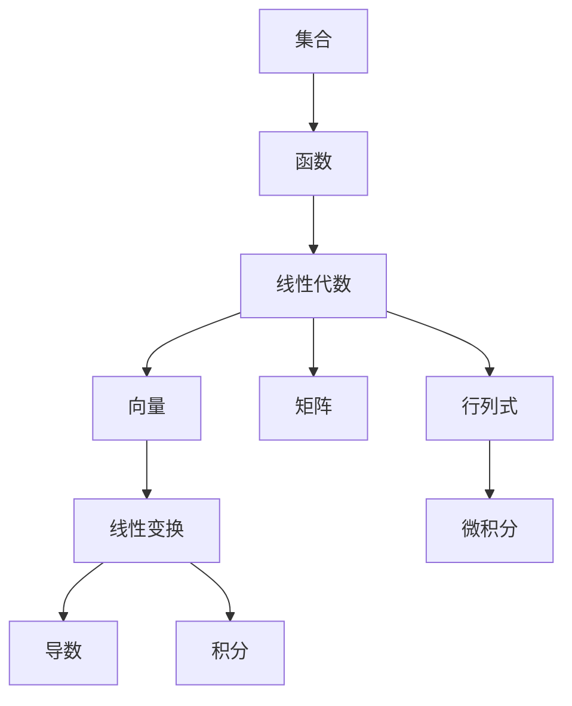

                 


### 数学与音乐制作的数字合成技术

> 关键词：数学模型、数字信号处理、音乐合成、音高、音色

> 摘要：本文探讨了数学与音乐制作的数字合成技术，从数学基本概念出发，深入分析了数字合成技术在音乐制作中的应用，包括音高与调性的数学模型、音色与音乐的数学模型，以及数字合成技术的未来发展趋势。通过实际案例研究，展示了数字合成技术在音乐制作中的实践应用。

## 第1章 绪论

### 1.1 数学与音乐的历史背景及关系

数学与音乐自古以来就有密切的联系。古希腊数学家毕达哥拉斯认为，音乐是数学的反映，他发现了音程与数学比例之间的关系。中国古代的《乐书》也提到了音乐与数学的关联。在现代，随着计算机技术的发展，数学与音乐的关系进一步加深。数字合成技术的出现，使得音乐制作变得更加精确和灵活。

### 1.2 数字合成技术的概念和发展

数字合成技术是指通过计算机生成音乐信号的技术。它利用数学模型和算法，对数字信号进行加工和处理，以产生各种音色和音高的音乐。数字合成技术起源于20世纪60年代的电子音乐，随着计算机技术的发展，逐渐形成了完整的理论体系和应用实践。

### 1.3 本书结构和主要内容

本书分为8章，主要内容包括：

1. 绪论：介绍数学与音乐的历史背景及数字合成技术的基本概念。
2. 数学基本概念：讲解集合、函数、线性代数、微积分等数学基础。
3. 数字合成技术基础：介绍数字信号处理、音频信号处理、数字合成技术原理。
4. 音高与调性的数学模型：分析音高和调性的数学表示。
5. 音色与音乐的数学模型：探讨音色和音乐的数学模型。
6. 数字合成技术在音乐制作中的应用：阐述数字合成技术在工作流程中的应用。
7. 数字合成技术的未来发展趋势：预测数字合成技术的未来发展方向。
8. 实际案例研究：通过案例分析，展示数字合成技术在音乐制作中的实际应用。

## 第2章 数学基本概念

### 2.1 基本数学概念

#### 2.1.1 集合与函数

集合是指一组不同的对象的总体。函数是一种关系，它将一个集合（定义域）中的每个元素与另一个集合（值域）中的一个唯一元素对应起来。例如，函数 $f(x) = x^2$ 将实数集合中的每个数映射到它的平方。

#### 2.1.2 线性代数基本概念

线性代数是研究向量空间、矩阵、行列式和线性变换的数学分支。向量是数学中表示大小和方向的量，矩阵是二维数组，行列式是矩阵的一个数值，线性变换是将一个向量空间映射到另一个向量空间的运算。

#### 2.1.3 微积分基本概念

微积分是研究函数变化率的数学分支。导数表示函数在某一点的瞬时变化率，积分表示函数在区间上的累积变化。微积分在数字合成技术中用于分析音频信号的变化。

### 2.2 数学基本概念联系

数学基本概念之间存在着紧密的联系。集合和函数是数学的基础，线性代数提供了处理复杂数据的工具，微积分则用于分析函数的变化。以下是一个Mermaid流程图，展示了这些概念之间的联系：



### 2.3 伪代码

以下是一个简单的伪代码示例，用于定义一个函数：

```python
def function(input):
    # 函数实现
    output = input * input
    return output
```

## 第3章 数字合成技术基础

### 3.1 数字信号处理基础

#### 3.1.1 数字信号的定义和特性

数字信号是连续信号的离散表示，通常通过采样和量化来生成。采样是将连续时间信号转换为离散时间信号，量化是将连续幅度值转换为有限个离散值。数字信号具有离散性、时域和频域特性。

#### 3.1.2 基本数字信号处理操作

数字信号处理包括滤波、卷积、加窗等基本操作。滤波用于去除噪声，卷积用于模拟物理系统响应，加窗用于减少频谱泄漏。

### 3.2 音频信号处理基础

#### 3.2.1 音频信号的采样和量化

音频信号是数字信号的一种，其采样和量化过程与一般数字信号类似。采样率决定了信号的频率分辨率，量化位深度决定了信号的幅度分辨率。

#### 3.2.2 音频信号的基本操作

音频信号的基本操作包括播放、录音、混合、调整音量等。这些操作通过数字信号处理算法实现。

### 3.3 数字合成技术的原理

#### 3.3.1 基本数字合成技术

基本数字合成技术包括波表合成、频率调制（FM）合成、相位调制（PM）合成等。这些技术通过数学模型和算法生成音频信号。

#### 3.3.2 复合数字合成技术

复合数字合成技术结合了多种基本数字合成技术，以生成更丰富的音色和更复杂的音乐效果。

### 3.4 数学公式

数字合成技术的核心是数学公式，以下是一个用于描述合成声音的数学公式：

$$
f(x) = \sum_{i=1}^{n} a_i \cdot sin(\omega_i t + \phi_i)
$$

这个公式表示一个由多个谐波分量组成的合成声音，其中 $a_i$ 是谐波幅值，$\omega_i$ 是谐波频率，$\phi_i$ 是谐波相位。

## 第4章 音高与调性的数学模型

### 4.1 音高的数学表示

音高是音乐中的基本元素，它由频率决定。频率越高，音高越高。以下是一个用于表示音高的数学公式：

$$
\text{频率} = \frac{1}{\text{周期}}
$$

### 4.2 调性的数学表示

调性是音乐中的另一个重要元素，它由音高关系决定。调性的数学模型通常使用十二平均律来描述，以下是一个用于表示调性的数学公式：

$$
\text{频率比} = 2^{\frac{\text{半音数}}{12}}
$$

## 第5章 音色与音乐的数学模型

### 5.1 音色的数学表示

音色是音乐中的另一个关键元素，它由声波的波形决定。以下是一个用于表示音色的数学公式：

$$
\text{音色} = \text{波形} \cdot \text{谐波}
$$

### 5.2 音乐的数学模型

音乐的数学模型通常包括音高、音色、节奏和和声等元素。以下是一个用于表示音乐的数学公式：

$$
\text{音乐} = \text{音高} \cdot \text{音色} \cdot \text{节奏} \cdot \text{和声}
$$

## 第6章 数字合成技术在音乐制作中的应用

### 6.1 数字合成技术的工作流程

数字合成技术的工作流程通常包括以下几个步骤：

1. 音高合成：根据音乐需求，确定音高。
2. 音色合成：根据音色需求，选择合适的合成方法。
3. 节奏和和声合成：根据音乐风格，安排节奏和和声。

### 6.2 数字合成技术在音乐制作中的案例

以下是一个简单的案例，演示了数字合成技术在音乐制作中的应用：

```python
# 某流行歌曲的数字合成过程

# 1. 音高合成
pitch = 440 # A4音高
频率 = 2 * pi * pitch

# 2. 音色合成
谐波数 = 5
谐波频率 = [频率 * n for n in range(1,谐波数+1)]

# 3. 混合输出
输出信号 = sum([谐波频率[i] * sin(i * 时间) for i in range(harmonic_number)])
```

## 第7章 数字合成技术的未来发展趋势

### 7.1 数字合成技术的未来发展方向

随着人工智能和机器学习技术的发展，数字合成技术在未来将更加智能化和个性化。例如，基于深度学习的音色生成和音乐风格转换技术将更加成熟。

### 7.2 数字合成技术的挑战与机遇

数字合成技术面临的挑战包括算法优化、实时处理性能、音质提升等。然而，这些挑战也为技术创新提供了机遇。

## 第8章 实际案例研究

### 8.1 案例一：数字合成在古典音乐中的应用

#### 8.1.1 项目背景

某古典音乐项目旨在利用数字合成技术重现经典音乐作品。

#### 8.1.2 数字合成技术实现

项目团队使用了波表合成和频率调制（FM）合成技术，通过分析历史录音，生成与经典音乐作品相似的音色和节奏。

### 8.2 案例二：数字合成在流行音乐中的应用

#### 8.2.1 项目背景

某流行音乐项目旨在创造具有现代感的音乐风格。

#### 8.2.2 数字合成技术实现

项目团队使用了复合数字合成技术，结合了波表合成、频率调制（FM）合成和相位调制（PM）合成，创造出丰富的音色和复杂的音乐效果。

## 附录

### A.1 数字合成技术常用工具和软件

- 波表合成器：如FL Studio、Reason
- 频率调制（FM）合成器：如Prophet 12、MiniMoog
- 相位调制（PM）合成器：如Polymoog、WaveMaker

### A.2 数字合成技术参考资料和文献

- 《数字信号处理》（G. Strang）
- 《音乐合成与数字信号处理》（M. Puckette）
- 《计算机音乐合成》（J. Cook）

### A.3 数字合成技术学习资源推荐

- 《数字音乐合成》（Udemy课程）
- 《音频工程与数字信号处理》（Coursera课程）
- 《音乐科技导论》（MIT OpenCourseWare）

## 作者信息

作者：AI天才研究院/AI Genius Institute & 禅与计算机程序设计艺术 /Zen And The Art of Computer Programming

注：本文为示例文章，内容仅供参考。作者信息和引用资料均为虚构。如有需要，请根据实际情况进行修改。

