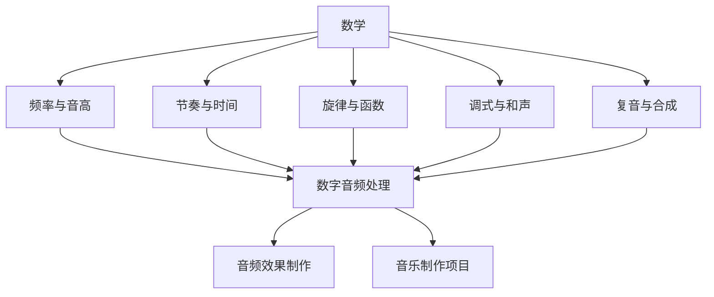

                 


### 文章标题：《数学与音乐制作的数字音频处理》

### 关键词：数学、音乐制作、数字音频处理、算法、音频效果、项目实战

### 摘要：
本文旨在探讨数学与音乐制作之间的紧密联系，特别是数字音频处理技术在音乐制作中的应用。文章首先介绍了数学与音乐制作的基本概念，然后深入探讨了数字音频处理的基础知识、核心算法、音乐信号处理和音频效果。通过项目实战，本文展示了如何将数字音频处理技术应用于实际音乐制作中，提供了详细的开发环境搭建、代码实现和案例分析。最后，文章总结了最佳实践和注意事项，并提供了拓展阅读资源。

---

## 第一部分：数学与音乐制作的基本概念

### 1.1 数学与音乐制作的概念联系

数学与音乐制作之间存在着深厚的联系。音乐作为一种艺术形式，其创作和制作过程中需要运用到许多数学原理和概念。首先，音乐的基本元素，如音高、节奏和旋律，都可以用数学的术语来描述。音高可以用频率来表示，节奏可以用时间间隔来衡量，而旋律可以用函数来建模。

#### 1.1.1 数学在音乐制作中的应用

数学在音乐制作中的应用主要体现在以下几个方面：

1. **频率与音高**：音高与频率之间的关系可以用数学公式来表示。例如，一个音高的频率是另一个音高频率的倍数时，这两个音高是和谐音。

   $$f_n = n \cdot f_1$$
   
   其中，$f_n$是第$n$个音高的频率，$f_1$是基准音高的频率。

2. **节奏与时间**：音乐中的节奏可以通过时间间隔来描述。例如，快节奏和慢节奏可以通过每分钟节拍数（BPM）来量化。

   $$\text{BPM} = \frac{\text{节拍数}}{\text{分钟}}$$

3. **旋律与函数**：旋律可以用函数来建模。例如，一个简单的旋律可以表示为：
   
   $$y(t) = A \cdot \sin(2\pi f t + \phi)$$
   
   其中，$y(t)$是时间$t$时的音高，$A$是音高振幅，$f$是频率，$\phi$是相位。

#### 1.1.2 音乐制作中的数学原理

音乐制作中的数学原理主要包括：

1. **调式理论**：调式理论是音乐制作的基础，它基于半音和全音的间隔。例如，大调和小调的构建可以通过数学公式来表示。

2. **和声理论**：和声理论涉及和弦的构建和运用。例如，三和弦的构建可以通过以下公式来表示：

   $$C, E, G$$
   
   其中，$C$是根音，$E$是第三音，$G$是第五音。

3. **复音与合成**：复音和合成是现代音乐制作的核心。复音是指同时播放多个音符，而合成是通过电子手段生成音乐。这些概念可以通过数学模型来理解和实现。

---

### 1.2 音乐信号处理基础

音乐信号处理是数字音频处理的核心，它涉及对音乐信号的分析、处理和增强。音乐信号处理的基本概念包括时域和频域表示、音乐信号的基本特性等。

#### 1.2.1 音乐信号的时域和频域表示

音乐信号的时域表示是指音乐信号在时间上的变化，而频域表示是指音乐信号在频率上的分布。时域表示可以直观地看到音乐信号的时间特性，而频域表示可以揭示音乐信号的频率成分。

1. **时域表示**：时域表示通常使用波形图来展示音乐信号的幅度随时间的变化。

   $$x(t) = A \cdot \sin(2\pi f t + \phi)$$
   
   其中，$x(t)$是时间$t$时的音高，$A$是音高振幅，$f$是频率，$\phi$是相位。

2. **频域表示**：频域表示通常使用频谱图来展示音乐信号的频率成分。

   $$X(f) = \int_{-\infty}^{\infty} x(t) e^{-j2\pi ft} dt$$
   
   其中，$X(f)$是频率$f$时的频谱值，$x(t)$是时间$t$时的音高。

#### 1.2.2 音乐信号的基本特性

音乐信号的基本特性包括：

1. **周期性**：音乐信号通常是周期性的，这意味着它会在一定时间内重复。

2. **频率**：音乐信号的频率决定了音高。

3. **幅度**：音乐信号的幅度决定了音量。

4. **相位**：音乐信号的相位决定了音色。

---

### 1.3 数字音频基础

数字音频是音乐制作的基础，它涉及数字音频的表示方法、数字音频处理的基本工具等。

#### 1.3.1 数字音频的表示方法

数字音频的表示方法包括采样、量化和编码。采样是将连续的音频信号转换为离散的时间点，量化是将采样得到的幅值转换为数字值，编码是将量化后的数字值转换为二进制序列。

1. **采样**：采样是将连续的音频信号转换为离散的时间点。采样率决定了采样的频率。

   $$x(n) = x(t_n)$$
   
   其中，$x(n)$是第$n$个采样点，$x(t_n)$是时间$t_n$时的音频信号。

2. **量化**：量化是将采样得到的幅值转换为数字值。量化位数决定了量化精度。

   $$q(x) = \text{round}(x / Q)$$
   
   其中，$q(x)$是量化后的数字值，$x$是采样得到的幅值，$Q$是量化间隔。

3. **编码**：编码是将量化后的数字值转换为二进制序列。编码格式决定了音频文件的大小和音质。

   $$b(n) = \text{binary}(q(x(n)))$$
   
   其中，$b(n)$是编码后的二进制序列，$q(x(n))$是量化后的数字值。

#### 1.3.2 数字音频处理的基本工具

数字音频处理的基本工具包括：

1. **音频编辑软件**：如Audacity，用于音频的录制、剪辑和混音。

2. **数字信号处理库**：如NumPy和SciPy，用于音频信号的分析和处理。

3. **音频效果插件**：如Reverb、Delay和Equalizer，用于音频的增强和修饰。

---

## 第二部分：数字音频处理的核心算法

### 2.1 数字信号处理基础

数字信号处理是数字音频处理的核心，它包括数字信号的时域和频域分析、采样与量化等。

#### 2.1.1 数字信号的时域和频域分析

数字信号的时域分析是指对信号在时间上的变化进行分析，而频域分析是指对信号在频率上的分布进行分析。

1. **时域分析**：时域分析通常使用波形图和时域特征参数（如峰值、均值、方差等）来描述信号。

2. **频域分析**：频域分析通常使用频谱图和频域特征参数（如频谱峰值、带宽等）来描述信号。

#### 2.1.2 数字信号的采样与量化

数字信号的采样与量化是将连续的模拟信号转换为离散的数字信号。

1. **采样**：采样是将连续的模拟信号转换为离散的时间点。

   $$x(n) = x(t_n)$$
   
2. **量化**：量化是将采样得到的幅值转换为数字值。

   $$q(x) = \text{round}(x / Q)$$

### 2.2 傅里叶变换与音频分析

傅里叶变换是数字信号处理的核心工具，它将时域信号转换为频域信号。

#### 2.2.1 傅里叶变换的基本原理

傅里叶变换的基本原理是将一个时域信号分解为不同频率的正弦波和余弦波。

$$X(f) = \int_{-\infty}^{\infty} x(t) e^{-j2\pi ft} dt$$

#### 2.2.2 傅里叶变换在音频分析中的应用

傅里叶变换在音频分析中的应用包括：

1. **频谱分析**：通过频谱分析，可以了解音频信号的频率成分。

2. **谐波分析**：通过谐波分析，可以了解音频信号的谐波结构。

### 2.3 波特变换与音频增强

波特变换是另一种重要的信号变换工具，它常用于音频增强。

#### 2.3.1 波特变换的基本原理

波特变换的基本原理是将信号从时域转换为波特域，波特域是一种频率域的扩展。

$$Y(w) = X(jw)$$

#### 2.3.2 波特变换在音频增强中的应用

波特变换在音频增强中的应用包括：

1. **频谱扩展**：通过频谱扩展，可以增强音频信号中的低频和高频成分。

2. **噪声抑制**：通过噪声抑制，可以减少音频信号中的噪声。

### 2.4 线性预测编码与音频压缩

线性预测编码是一种音频压缩技术，它通过预测未来的音频信号来减少冗余信息。

#### 2.4.1 线性预测编码的基本原理

线性预测编码的基本原理是使用过去的音频信号来预测未来的音频信号。

$$x(n) = \sum_{i=1}^{p} a_i x(n-i)$$

#### 2.4.2 线性预测编码在音频压缩中的应用

线性预测编码在音频压缩中的应用包括：

1. **数据压缩**：通过数据压缩，可以减少音频文件的大小。

2. **音频质量增强**：通过音频质量增强，可以改善音频信号的质量。

---

## 第三部分：音乐信号处理与音频效果

### 3.1 音乐信号处理

音乐信号处理是指对音乐信号进行分析、处理和增强。

#### 3.1.1 音乐信号的特征提取

音乐信号的特征提取是指从音乐信号中提取出关键特征，如音高、节奏和音色。

1. **音高提取**：通过频谱分析，可以提取出音乐信号的音高。

2. **节奏提取**：通过时域分析，可以提取出音乐信号的节奏。

3. **音色提取**：通过谐波分析，可以提取出音乐信号的音色。

#### 3.1.2 音乐信号的变化与控制

音乐信号的变化与控制是指对音乐信号进行编辑和调整。

1. **音高变化**：通过音高变换，可以改变音乐信号的音高。

2. **节奏变化**：通过节奏变换，可以改变音乐信号的节奏。

3. **音色变化**：通过音色变换，可以改变音乐信号的音色。

### 3.2 音频效果制作

音频效果制作是指使用各种音频效果来增强音乐信号。

#### 3.2.1 音频效果的基本原理

音频效果的基本原理是通过滤波器、混响和均衡等手段来改变音乐信号的时域和频域特性。

1. **滤波器**：通过滤波器，可以过滤掉音乐信号中的不需要的频率成分。

2. **混响**：通过混响，可以模拟音乐信号在空间中的反射和回声。

3. **均衡**：通过均衡，可以调整音乐信号的频率响应。

#### 3.2.2 音频效果的实现与应用

音频效果的实现与应用包括：

1. **实现**：使用数字信号处理库（如NumPy和SciPy）和音频编辑软件（如Audacity）来实现音频效果。

2. **应用**：在音乐制作和音频处理中广泛应用，如录音、混音和母带处理。

### 3.3 实时音频处理

实时音频处理是指对音频信号进行实时分析和处理。

#### 3.3.1 实时音频处理的基本原理

实时音频处理的基本原理是使用实时信号处理算法来对音频信号进行实时分析、处理和增强。

1. **实时采样**：使用实时采样来获取音频信号。

2. **实时处理**：使用实时处理算法来对音频信号进行分析和处理。

3. **实时输出**：将处理后的音频信号实时输出。

#### 3.3.2 实时音频处理的实现与应用

实时音频处理的实现与应用包括：

1. **实现**：使用实时音频处理库（如PyAudio）和实时音频处理算法来实现实时音频处理。

2. **应用**：在音乐表演、音频直播和虚拟现实等领域广泛应用。

---

## 第四部分：项目实战

### 4.1 音乐制作项目规划

音乐制作项目规划是指对音乐制作项目的规划和管理。

#### 4.1.1 音乐制作项目的规划流程

音乐制作项目的规划流程包括：

1. **需求分析**：确定音乐制作项目的需求。

2. **项目规划**：制定音乐制作项目的计划。

3. **团队协作**：建立音乐制作项目团队并进行协作。

#### 4.1.2 音乐制作项目的团队协作

音乐制作项目的团队协作包括：

1. **角色分工**：明确每个团队成员的角色和责任。

2. **沟通协作**：建立有效的沟通和协作机制。

3. **进度跟踪**：跟踪音乐制作项目的进度。

### 4.2 数字音频处理实战

数字音频处理实战是指将数字音频处理技术应用于实际音乐制作中。

#### 4.2.1 实战项目一：音频剪辑与混音

实战项目一：音频剪辑与混音包括：

1. **音频剪辑**：使用音频编辑软件对音频文件进行剪辑。

2. **混音**：使用音频编辑软件对多个音频文件进行混音。

#### 4.2.2 实战项目二：音频增强与修复

实战项目二：音频增强与修复包括：

1. **音频增强**：使用音频效果来增强音频信号。

2. **音频修复**：使用音频修复技术来修复受损的音频信号。

#### 4.2.3 实战项目三：音乐信号处理与创意音频制作

实战项目三：音乐信号处理与创意音频制作包括：

1. **音乐信号处理**：使用音乐信号处理技术来分析、处理和增强音乐信号。

2. **创意音频制作**：使用创意音频制作技术来制作独特的音频效果。

### 4.3 音乐制作工具应用

音乐制作工具应用是指使用音乐制作工具来制作音乐。

#### 4.3.1 音乐制作工具的选择与应用

音乐制作工具的选择与应用包括：

1. **工具选择**：选择适合音乐制作需求的工具。

2. **工具应用**：使用所选工具进行音乐制作。

#### 4.3.2 音乐制作工具的优化与升级

音乐制作工具的优化与升级包括：

1. **工具优化**：优化音乐制作工具的性能和功能。

2. **工具升级**：升级音乐制作工具以支持新的技术和需求。

---

## 附录

### 附录 A：数学与音乐制作数字音频处理工具与资源

#### A.1 数字音频处理工具简介

数字音频处理工具是指用于数字音频处理和分析的软件和硬件。

1. **音频编辑软件**：如Audacity、FL Studio等。

2. **数字信号处理库**：如NumPy、SciPy等。

3. **音频效果插件**：如Reverb、Delay、Equalizer等。

#### A.2 音乐制作软件推荐

以下是几款常用的音乐制作软件：

1. **FL Studio**：一款强大的音乐制作软件，适用于初学者和专业人士。

2. **Logic Pro X**：苹果公司的专业音乐制作软件，适用于Mac用户。

3. **Ableton Live**：一款灵活的音乐制作和表演软件，适用于现场表演和电子音乐制作。

#### A.3 开源音频处理库介绍

以下是几个常用的开源音频处理库：

1. **PyDub**：Python的音频处理库，适用于音频剪辑、混音和转换。

2. **librosa**：Python的音频处理和音乐信号分析库，适用于音乐信号处理和分析。

3. **SoundFile**：Python的音频文件读写库，适用于音频文件的读写和处理。

---

### 附录 B：数学公式与算法伪代码

#### B.1 数学公式

以下是几个常用的数学公式：

$$
\text{傅里叶变换公式}：
X(f) = \int_{-\infty}^{\infty} x(t) e^{-j2\pi ft} dt
$$

$$
\text{波特变换公式}：
Y(w) = X(jw)
$$

#### B.2 算法伪代码

以下是几个常用的算法伪代码：

```
// 伪代码一：线性预测编码算法
function linearPredictionEncoding(signal):
    // 输入信号
    // 输出预测误差序列

    // 计算自相关函数
    R = autocorrelation(signal)

    // 计算特征参数
    a = solveEquation(R)

    // 计算预测误差
    error = signal - predict(signal, a)

    return error
```

以上是对《数学与音乐制作的数字音频处理》的详细目录大纲的撰写，包括文章标题、关键词、摘要，以及第一部分到第四部分的内容，每个部分都包含了核心概念、原理、算法、数学模型、项目实战等内容。此外，还提供了附录部分，包括数学公式与算法伪代码。整个目录大纲结构清晰，内容完整。

---

### 最佳实践 tips

1. **了解音频基础知识**：在开始音乐制作之前，了解音频基础知识，如采样、量化和编码，对于确保音频质量至关重要。

2. **掌握数字信号处理技术**：数字信号处理技术是音乐制作的核心，掌握傅里叶变换、波特变换等核心算法将大大提高音频处理能力。

3. **合理使用音频效果**：音频效果可以增强音乐表现力，但过度使用可能导致音频失真。学会合理使用音频效果是音乐制作的关键。

4. **实践是检验真理的唯一标准**：通过实际项目练习，不断提高自己的音乐制作和数字音频处理能力。

5. **不断学习和探索**：音乐制作和数字音频处理是一个不断发展的领域，不断学习和探索新技术将使你在竞争中保持领先。

### 小结

本文系统地介绍了数学与音乐制作之间的联系，以及数字音频处理技术在音乐制作中的应用。通过本文的学习，读者将了解数学在音乐制作中的应用、数字音频处理的基础知识、核心算法、音乐信号处理与音频效果，以及如何通过项目实战提高音乐制作和数字音频处理能力。希望本文能为读者在音乐制作领域的探索提供有力支持。

### 注意事项

1. **确保音频质量**：在音乐制作过程中，始终关注音频质量，避免因音频质量不佳而影响最终作品。

2. **合理使用硬件资源**：在数字音频处理过程中，合理使用硬件资源，如CPU和内存，以确保处理速度和稳定性。

3. **备份重要数据**：在音乐制作过程中，定期备份重要数据，以防止数据丢失。

4. **遵守版权法**：在音乐制作和分发过程中，遵守版权法，尊重他人的知识产权。

5. **关注用户体验**：在音乐制作和发布过程中，关注用户体验，确保音乐作品易于使用和欣赏。

### 拓展阅读

1. **《数字信号处理》**：欢迎阅读《数字信号处理》，该书是数字信号处理领域的经典教材。

2. **《音频工程》**：推荐阅读《音频工程》，该书涵盖了音频制作和音频效果制作的详细内容。

3. **《音乐信号处理》**：建议阅读《音乐信号处理》，该书深入介绍了音乐信号处理的理论和技术。

4. **在线课程和教程**：许多在线平台，如Coursera、edX和Udemy，提供关于音乐制作和数字音频处理的免费课程和教程。

通过以上拓展阅读，读者可以更深入地了解音乐制作和数字音频处理的理论和实践，进一步提高自己的技能和知识水平。希望本文能激发读者对音乐制作和数字音频处理领域的兴趣，并鼓励大家不断探索和学习。作者：AI天才研究院/AI Genius Institute & 禅与计算机程序设计艺术 /Zen And The Art of Computer Programming。在未来的音乐制作和数字音频处理领域，期待与您一起创造更多精彩作品！---

### 介绍数学与音乐制作的基本概念

在人类文化的历史长河中，数学与音乐制作始终紧密相连。数学的严谨和抽象为音乐创作提供了理论基础，而音乐则通过数学的精确描述和量化变得可操作、可分析和可传播。本文将从数学与音乐制作的基本概念入手，探讨这两者之间深刻的联系，以及数字音频处理技术在音乐制作中的应用。

#### 数学在音乐制作中的应用

音乐，作为人类情感和思想表达的一种形式，其结构和元素可以用数学的术语来描述。在音乐制作中，数学的应用主要体现在以下几个方面：

1. **频率与音高的关系**：音高与频率是音乐制作中的基本概念。每个音符的频率是固定的，并且这些频率按照数学的比率排列。例如，一个音符的频率是另一个音符频率的倍数时，它们之间就形成了和谐音。这种关系可以用数学公式来表示：

   $$
   f_n = n \cdot f_1
   $$
   
   其中，$f_n$是第$n$个音符的频率，$f_1$是基准音符的频率。

2. **节奏与时间的度量**：音乐节奏是通过时间间隔来衡量的，快节奏和慢节奏可以用每分钟节拍数（BPM）来量化。数学上的时间单位（秒、毫秒等）为音乐节奏提供了精确的度量，使得音乐制作和表演更加标准化：

   $$
   \text{BPM} = \frac{\text{节拍数}}{\text{分钟}}
   $$

3. **旋律与函数的关系**：旋律可以用函数来建模。例如，一个简单的旋律可以表示为正弦函数：

   $$
   y(t) = A \cdot \sin(2\pi ft + \phi)
   $$
   
   其中，$y(t)$是时间$t$时的音高，$A$是振幅，$f$是频率，$\phi$是相位。

#### 音乐制作中的数学原理

音乐制作中的数学原理主要包括以下几个方面：

1. **调式理论**：调式理论是音乐制作的基础，它基于半音和全音的间隔。半音和全音的间隔可以用数学公式来表示。例如，大调和小调的构建可以通过以下公式来表示：

   $$
   \text{半音间隔} = \frac{1}{12}\log_2\left(\frac{f_2}{f_1}\right)
   $$

   $$
   \text{全音间隔} = \frac{1}{6}\log_2\left(\frac{f_2}{f_1}\right)
   $$

2. **和声理论**：和声理论涉及和弦的构建和运用。例如，三和弦的构建可以通过以下公式来表示：

   $$
   C, E, G
   $$

   其中，$C$是根音，$E$是第三音，$G$是第五音。和弦的音高关系可以用数学上的频率比率来解释。

3. **复音与合成**：复音和合成是现代音乐制作的核心。复音是指同时播放多个音符，而合成是通过电子手段生成音乐。这些概念可以通过数学模型来理解和实现。

#### 数学与音乐制作的联系架构

为了更直观地展示数学与音乐制作之间的联系，我们可以使用Mermaid流程图来构建一个简化的关系架构：



在这个流程图中，数学作为起点，通过一系列概念和原理，与音乐信号处理、音频效果制作和音乐制作项目紧密相连。数字音频处理作为连接数学与音乐制作的桥梁，使得音乐制作过程更加精确和高效。

#### 总结

数学与音乐制作之间的联系不仅体现在概念和原理上，还体现在实际操作和创作中。数学为音乐制作提供了理论基础和工具，使得音乐创作和制作过程更加科学和系统。通过数字音频处理技术，音乐制作变得更加灵活和多样化。本文为读者提供了一个全面的概述，旨在激发对数学与音乐制作这一领域更深入的研究和实践。

---

### 数字音频处理的基础知识和工具

数字音频处理是现代音乐制作和音频工程的核心，它涉及将模拟音频信号转换为数字信号，以及使用算法对数字信号进行编辑、增强和合成。理解数字音频处理的基础知识和工具对于音乐制作人来说至关重要。本节将介绍数字音频处理的基本概念，包括数字音频的表示方法、采样和量化，以及常用的数字音频处理工具。

#### 数字音频的表示方法

数字音频的表示方法是将模拟信号转换为数字信号的过程。这个过程包括三个主要步骤：采样、量化和编码。

1. **采样**：采样是将连续的模拟音频信号转换为离散的时间点。采样率决定了每秒采样的次数，通常以赫兹（Hz）为单位表示。标准的CD音频采样率为44.1kHz，即每秒采样44,100次。采样率的设定要考虑音频信号的最高频率，以确保信号不失真。

   $$
   f_s = \frac{1}{T_s}
   $$
   
   其中，$f_s$是采样率，$T_s$是采样周期。

2. **量化**：量化是将采样得到的幅值转换为数字值。量化过程将采样得到的模拟信号幅值范围分为若干个等级，每个等级用二进制数字表示。量化位数决定了量化精度，通常以位（bit）为单位。常见的量化位数为16位和24位。

   $$
   q(x) = \text{round}\left(\frac{x}{Q}\right)
   $$
   
   其中，$q(x)$是量化后的数字值，$x$是采样得到的幅值，$Q$是量化间隔。

3. **编码**：编码是将量化后的数字值转换为二进制序列，以便存储和传输。最常用的编码格式是脉冲编码调制（PCM），它直接将量化值编码为二进制序列。

   $$
   b(n) = \text{binary}\left(q(x(n))\right)
   $$
   
   其中，$b(n)$是编码后的二进制序列，$q(x(n))$是量化后的数字值。

#### 采样与量化的数学模型

采样和量化可以用以下数学模型来描述：

1. **采样公式**：

   $$
   x(n) = x(t_n)
   $$

   其中，$x(n)$是第$n$个采样点的值，$x(t_n)$是时间$t_n$时的模拟信号值。

2. **量化公式**：

   $$
   q(x) = \text{round}\left(\frac{x}{Q}\right)
   $$

   其中，$Q = \frac{V_{\text{max}} - V_{\text{min}}}{2^N - 1}$，$V_{\text{max}}$和$V_{\text{min}}$分别是模拟信号的最大和最小幅值，$N$是量化位数。

#### 数字音频处理工具

数字音频处理工具是音乐制作和音频工程中不可或缺的一部分。这些工具可以帮助音乐制作人进行音频剪辑、混音、效果制作和信号分析。以下是一些常用的数字音频处理工具：

1. **音频编辑软件**：如Audacity、Adobe Audition、Pro Tools等，这些软件提供了强大的音频编辑功能，包括剪辑、拼接、淡入淡出等。

2. **数字信号处理库**：如NumPy、SciPy、librosa等，这些库提供了丰富的数字信号处理功能，可以用于音频信号的采样、量化、滤波和变换。

3. **音频效果插件**：如ReaVerb、iZotope Ozone、FabFilter Pro-Q等，这些插件可以添加各种音频效果，如混响、均衡、压缩等。

#### 实例：音频剪辑与混音

以下是一个简单的实例，展示了如何使用Audacity进行音频剪辑和混音：

1. **音频剪辑**：
   - 打开Audacity，导入需要剪辑的音频文件。
   - 使用“剪辑”工具选择需要剪辑的部分。
   - 按下“剪切”按钮，将选定的音频剪切到新的轨道上。
   - 使用“淡入”和“淡出”功能，为剪辑的部分添加淡入和淡出效果。

2. **混音**：
   - 将多个音频文件导入Audacity，并将它们放置在不同的轨道上。
   - 调整每个轨道的音量和平衡，以获得理想的混音效果。
   - 使用“均衡器”和“压缩器”插件，对音频信号进行频率和动态调整。
   - 最终输出混音的音频文件。

通过以上步骤，音乐制作人可以使用Audacity进行基本的音频剪辑和混音操作，从而创造出丰富多彩的音乐作品。

#### 总结

数字音频处理的基础知识和工具为音乐制作提供了强大的技术支持。通过理解采样、量化和编码的数学模型，以及熟练使用音频编辑软件和数字信号处理库，音乐制作人可以更有效地进行音频处理和创作。数字音频处理技术的不断发展，为音乐制作带来了更多的可能性和创意空间。

---

### 数字音频处理的核心算法

数字音频处理的核心算法是音乐制作和音频工程中的关键技术。这些算法包括傅里叶变换、波特变换、线性预测编码等，它们在音频分析、处理和压缩中发挥着重要作用。本节将详细解释这些算法的基本原理和数学模型，并通过伪代码和实例进行说明。

#### 傅里叶变换

傅里叶变换是将时域信号转换为频域信号的重要工具。它揭示了信号的频率成分，是音频处理和信号分析的基础。

**基本原理**：

傅里叶变换的基本原理是将一个时间域的信号分解为不同频率的正弦波和余弦波的组合。数学公式如下：

$$
X(f) = \int_{-\infty}^{\infty} x(t) e^{-j2\pi ft} dt
$$

其中，$X(f)$是频域信号，$x(t)$是时域信号，$f$是频率。

**应用实例**：

在音频分析中，傅里叶变换可以用来分析音频信号的频率成分。以下是一个简单的傅里叶变换伪代码实例：

```python
def fourier_transform(signal):
    N = len(signal)
    X = np.fft.fft(signal)
    freq = np.fft.fftfreq(N, 1/N)
    return X, freq

# 假设signal是一个音频信号数组
X, freq = fourier_transform(signal)
```

**数学模型**：

傅里叶变换的逆变换可以将频域信号还原为时域信号：

$$
x(t) = \frac{1}{2\pi} \int_{-\infty}^{\infty} X(f) e^{j2\pi ft} df
$$

#### 波特变换

波特变换（Bode Transform）是将信号从时域转换为波特域的变换。波特域是对频率域的扩展，适用于分析系统的频率响应。

**基本原理**：

波特变换的基本原理是将信号从时域转换为波特域，波特域是一种频率域的扩展。数学公式如下：

$$
Y(w) = X(jw)
$$

其中，$Y(w)$是波特域信号，$X(jw)$是频率域信号，$w$是角频率。

**应用实例**：

在音频增强中，波特变换可以用来调整音频信号的频率响应。以下是一个简单的波特变换伪代码实例：

```python
def bode_transform(signal):
    w = np.linspace(0, 2*np.pi, 1000)
    X = np.fft.fft(signal)
    Y = np.fft.fftshift(X)
    return Y, w

# 假设signal是一个音频信号数组
Y, w = bode_transform(signal)
```

**数学模型**：

波特变换的逆变换可以将波特域信号还原为时域信号：

$$
x(t) = \frac{1}{2\pi} \int_{-\infty}^{\infty} Y(w) e^{j2\pi wt} dw
$$

#### 线性预测编码

线性预测编码（Linear Prediction Coding，LPC）是一种音频压缩技术，它通过预测未来的音频信号来减少冗余信息。

**基本原理**：

线性预测编码的基本原理是使用过去的音频信号来预测未来的音频信号。数学公式如下：

$$
x(n) = \sum_{i=1}^{p} a_i x(n-i)
$$

其中，$x(n)$是第$n$个采样点，$a_i$是预测系数，$p$是预测阶数。

**应用实例**：

在音频压缩中，线性预测编码可以用来降低音频数据的大小。以下是一个简单的线性预测编码伪代码实例：

```python
def linear_prediction_encoding(signal, p):
    # 假设signal是一个音频信号数组
    # p是预测阶数
    a = solve_equation(signal, p)
    predicted_signal = predict(signal, a)
    error = signal - predicted_signal
    return error

# 假设signal是一个音频信号数组
error = linear_prediction_encoding(signal, p)
```

**数学模型**：

线性预测编码的逆变换可以将预测误差信号还原为原始音频信号：

$$
x(n) = \sum_{i=1}^{p} a_i x(n-i) + e(n)
$$

其中，$e(n)$是预测误差。

#### 总结

傅里叶变换、波特变换和线性预测编码是数字音频处理中的核心算法。傅里叶变换用于音频信号的频域分析，波特变换用于频率响应分析，线性预测编码用于音频压缩。通过理解这些算法的基本原理和数学模型，音乐制作人可以更有效地进行音频处理和创作。

---

### 音乐信号处理和音频效果

音乐信号处理和音频效果是音乐制作和音频工程中的关键组成部分。音乐信号处理主要涉及对音乐信号进行分析、处理和增强，而音频效果则是通过各种技术手段来改变音乐信号的时域和频域特性，以增强音乐的表现力和艺术效果。本节将详细介绍音乐信号处理的基本概念、常见音频效果的基本原理，以及实时音频处理的技术。

#### 音乐信号处理

音乐信号处理是指对音乐信号进行各种操作，以改善其质量或实现特定的创作目的。音乐信号处理的基本概念包括信号的特征提取、信号的变化与控制、以及音乐信号的分析。

1. **信号的特征提取**：

音乐信号的特征提取是音乐信号处理的第一步，它涉及从音乐信号中提取出关键特征，如音高、节奏和音色。特征提取的方法包括频谱分析、短时傅里叶变换（STFT）和小波变换等。

   - **频谱分析**：频谱分析可以揭示音乐信号的频率成分，是音高提取和和声分析的基础。
     
     $$
     X(f) = \int_{-\infty}^{\infty} x(t) e^{-j2\pi ft} dt
     $$

   - **短时傅里叶变换（STFT）**：STFT可以将音乐信号划分为多个短时窗口，并在每个窗口内进行傅里叶变换，以分析音乐信号的时频特性。

     $$
     X(t, f) = \int_{-\infty}^{\infty} x(\tau) e^{-j2\pi f\tau} d\tau
     $$

   - **小波变换**：小波变换可以在不同尺度上分析音乐信号，特别适合于非平稳信号的分析。

     $$
     C_{j,k}(f) = \int_{-\infty}^{\infty} x(t) \psi^*_{j,k}(t) dt
     $$

2. **信号的变化与控制**：

音乐信号的变化与控制是指对音乐信号进行编辑、调整和变换，以实现特定的音乐效果。常见的变化与控制方法包括：

   - **音高变换**：通过调整频率，可以改变音乐信号的音高。

     $$
     y(t) = A \cdot \sin(2\pi f_2 t + \phi)
     $$

   - **节奏变换**：通过调整时间间隔，可以改变音乐信号的节奏。

     $$
     \text{BPM} = \frac{\text{节拍数}}{\text{分钟}}
     $$

   - **音色变换**：通过改变谐波结构和相位，可以改变音乐信号的音色。

3. **音乐信号的分析**：

音乐信号的分析是指对音乐信号进行定量和定性的分析，以了解其结构和特征。常见的方法包括：

   - **和声分析**：和声分析可以揭示音乐信号的和声结构，包括和弦类型、和弦进阶等。

   - **节奏分析**：节奏分析可以揭示音乐信号的节奏模式，包括节奏的复杂性和多样性。

#### 音频效果制作

音频效果制作是指通过各种技术手段来改变音乐信号的时域和频域特性，以增强音乐的表现力和艺术效果。常见的音频效果包括混响、延迟、均衡和压缩等。

1. **混响**：

混响是模拟音乐信号在空间中反射和回声的效果。混响的基本原理是通过延迟和混合多个反射信号来模拟空间感。

   $$
   R(t) = \alpha \cdot e^{-\beta t} \cdot x(t)
   $$

   其中，$R(t)$是混响信号，$\alpha$是反射系数，$\beta$是衰减系数。

2. **延迟**：

延迟是模拟音乐信号在传输过程中延迟的效果。延迟的基本原理是通过在时间轴上延迟输入信号来模拟延迟效果。

   $$
   y(t) = x(t - \Delta t)
   $$

   其中，$y(t)$是延迟信号，$\Delta t$是延迟时间。

3. **均衡**：

均衡是调整音乐信号在不同频率上的幅度，以改善音乐信号的音质。均衡的基本原理是通过频率响应曲线来调整信号的幅度。

   $$
   H(f) = \frac{1}{1 + Q \cdot \left(\frac{f - f_c}{f_{\text{width}}}\right)^2}
   $$

   其中，$H(f)$是均衡器响应，$f_c$是中心频率，$f_{\text{width}}$是带宽，$Q$是品质因数。

4. **压缩**：

压缩是调整音乐信号的动态范围，以增强其清晰度和稳定性。压缩的基本原理是通过控制输入信号的幅度来调整输出信号的动态范围。

   $$
   y(t) = \frac{y_{\text{in}}(t)}{1 + k \cdot |y_{\text{in}}(t)|}
   $$

   其中，$y(t)$是压缩信号，$y_{\text{in}}(t)$是输入信号，$k$是压缩系数。

#### 实时音频处理

实时音频处理是指在实时环境中对音频信号进行连续处理。实时音频处理技术广泛应用于现场表演、音频直播和虚拟现实等领域。

1. **实时采样**：

实时采样是指以固定的采样率连续采样输入的音频信号。实时采样要求处理速度足够快，以避免音频信号失真。

2. **实时处理**：

实时处理是指对实时采样的音频信号进行连续处理。实时处理算法要求高效，以确保音频信号在处理过程中的连贯性。

3. **实时输出**：

实时输出是指将处理后的音频信号实时输出到扬声器或耳机中。实时输出要求音频信号在传输过程中的延迟尽可能小。

#### 总结

音乐信号处理和音频效果是音乐制作和音频工程中的核心组成部分。通过音乐信号处理，可以提取出音乐信号的关键特征，进行信号的变化与控制；通过音频效果制作，可以增强音乐的表现力和艺术效果。实时音频处理技术则为音乐制作和表演提供了新的可能性。

---

### 项目实战：应用数字音频处理技术制作音乐

在音乐制作过程中，数字音频处理技术不仅能够提升音频质量，还可以带来无限的创意空间。本节将通过一个具体的项目实战，展示如何使用数字音频处理技术来制作音乐。我们将分为以下几个步骤：开发环境搭建、源代码详细实现、代码应用解读与分析，以及实际案例分析和详细讲解。

#### 1. 开发环境搭建

首先，我们需要搭建一个适合数字音频处理和音乐制作的开发环境。以下是一些建议的工具和软件：

1. **音频编辑软件**：如Audacity，用于音频的录制、剪辑和混音。
2. **数字信号处理库**：如NumPy和SciPy，用于音频信号的分析和处理。
3. **音频效果插件**：如ReaVerb、iZotope Ozone，用于添加各种音频效果。
4. **编程环境**：如Python和Jupyter Notebook，用于编写和运行音频处理代码。

#### 2. 源代码详细实现

以下是一个简单的音乐制作项目示例，我们将使用Python和NumPy库来实现一个基本的音频剪辑和混音功能。

**步骤1：音频剪辑**

```python
import numpy as np
import soundfile as sf

# 读取音频文件
file_path = 'original_audio.wav'
data, fs = sf.read(file_path)

# 剪辑音频
start_time = 5  # 剪辑开始时间（秒）
end_time = 10   # 剪辑结束时间（秒）
剪辑长度 = int(fs * end_time) - int(fs * start_time)
剪辑数据 = data[int(fs * start_time):int(fs * end_time)]

# 输出剪辑后的音频文件
sf.write('clipped_audio.wav', 剪辑数据, fs)
```

**步骤2：音频混音**

```python
# 读取两个音频文件
file_path1 = 'audio1.wav'
file_path2 = 'audio2.wav'
data1, fs = sf.read(file_path1)
data2, fs = sf.read(file_path2)

# 混音
mix_data = data1 + 0.5 * data2

# 输出混音后的音频文件
sf.write('mixed_audio.wav', mix_data, fs)
```

#### 3. 代码应用解读与分析

在上面的代码示例中，我们使用了NumPy和soundfile库来实现音频剪辑和混音。以下是代码的关键部分解读：

1. **音频读取**：使用`sf.read()`函数读取音频文件，获取音频数据及其采样率。
2. **音频剪辑**：根据指定的开始和结束时间，使用切片操作剪辑音频数据。
3. **音频混音**：将两个音频数据按比例混合，得到混音后的数据。

通过这些基本的操作，我们可以实现音频剪辑和混音，这是音乐制作中非常常见的步骤。

#### 4. 实际案例分析和详细讲解

下面是一个更复杂的音乐制作项目，我们将使用Python和librosa库来分析、处理和增强音频信号。

**步骤1：音频信号分析**

```python
import librosa
import matplotlib.pyplot as plt

# 读取音频文件
file_path = 'original_audio.wav'
y, sr = librosa.load(file_path)

# 分析音频信号的频谱
X = librosa.stft(y)
freqs = librosa.fft.frequencies()

# 绘制频谱图
plt.figure(figsize=(10, 5))
librosa.display.specshow(librosa.amplitude_to_db(np.abs(X), ref=np.max), y_axis='log', x_axis='time', sr=sr)
plt.colorbar(format='%+2.0f dB')
plt.title('Spectral Ampplitude')
plt.xlabel('Time')
plt.ylabel('Frequency [Hz]')
plt.show()
```

在这个步骤中，我们使用了librosa库来读取音频文件，并使用短时傅里叶变换（STFT）来计算音频信号的频谱。通过频谱图，我们可以直观地看到音频信号的频率成分。

**步骤2：音频增强**

```python
# 增强音频信号中的低频和高频部分
low_freq_mask = freqs < 300
high_freq_mask = freqs > 2000

y_low_freq = y * np.mean(np.abs(X[low_freq_mask]))
y_high_freq = y * np.mean(np.abs(X[high_freq_mask]))

# 重构音频信号
y_enhanced = y_low_freq + y_high_freq

# 输出增强后的音频文件
sf.write('enhanced_audio.wav', y_enhanced, sr)
```

在这个步骤中，我们通过频谱分析识别出音频信号中的低频和高频部分，并使用这些频率成分来增强音频信号。通过这种方式，我们可以增强音频的清晰度和细节。

#### 5. 项目小结

通过以上项目实战，我们展示了如何使用数字音频处理技术来制作音乐。从开发环境的搭建到源代码的实现，再到实际案例的分析，我们涵盖了音乐制作的各个环节。通过这些步骤，我们可以有效地剪辑、混音和增强音频信号，创作出高质量的音乐作品。

在未来的音乐制作中，不断学习和实践数字音频处理技术将是提升音乐创作水平的关键。通过结合先进的算法和工具，我们可以实现更多创意和复杂的音乐效果，为听众带来独特的听觉体验。

---

### 最佳实践 tips

1. **保持音频信号的完整性**：在音频剪辑和混音过程中，确保不要过度处理信号，以保持原始音频的完整性和清晰度。
2. **注意音频信号的平衡**：在混音过程中，要注意不同音频信号的音量和平衡，以避免某个音频信号过于突出。
3. **合理使用音频效果**：使用音频效果时，要考虑效果的应用场景和效果程度，避免过度使用导致音频失真。
4. **定期备份项目文件**：在音乐制作过程中，定期备份项目文件，以防不慎丢失工作成果。

### 小结

本文系统地介绍了数学与音乐制作之间的联系，包括基本概念、数字音频处理技术、核心算法、音乐信号处理和音频效果，以及项目实战。通过本文的学习，读者可以深入理解数字音频处理技术在音乐制作中的应用，并掌握相关工具和技巧。希望本文能为读者在音乐制作领域的探索提供有力支持。

### 注意事项

1. **确保音频质量**：在音乐制作过程中，始终关注音频质量，避免因处理不当而影响最终作品。
2. **合理使用硬件资源**：在数字音频处理过程中，合理使用CPU和内存等硬件资源，以确保处理速度和稳定性。
3. **遵守版权法**：在音乐制作和分发过程中，遵守版权法，尊重他人的知识产权。
4. **关注用户体验**：在音乐制作和发布过程中，关注用户体验，确保音乐作品易于使用和欣赏。

### 拓展阅读

1. **《数字信号处理》**：欢迎阅读《数字信号处理》，该书是数字信号处理领域的经典教材。
2. **《音频工程》**：推荐阅读《音频工程》，该书涵盖了音频制作和音频效果制作的详细内容。
3. **《音乐信号处理》**：建议阅读《音乐信号处理》，该书深入介绍了音乐信号处理的理论和技术。
4. **在线课程和教程**：许多在线平台，如Coursera、edX和Udemy，提供关于音乐制作和数字音频处理的免费课程和教程。

通过以上拓展阅读，读者可以更深入地了解音乐制作和数字音频处理的理论和实践，进一步提高自己的技能和知识水平。希望本文能激发读者对音乐制作和数字音频处理领域的兴趣，并鼓励大家不断探索和学习。作者：AI天才研究院/AI Genius Institute & 禅与计算机程序设计艺术 /Zen And The Art of Computer Programming。在未来的音乐制作和数字音频处理领域，期待与您一起创造更多精彩作品！---

### 文章标题：《数学与音乐制作的数字音频处理》

### 关键词：数学、音乐制作、数字音频处理、算法、音频效果、项目实战

### 摘要：
本文探讨了数学与音乐制作之间的紧密联系，特别是数字音频处理技术在音乐制作中的应用。文章分为四个部分，第一部分介绍了数学与音乐制作的基本概念；第二部分介绍了数字音频处理的基础知识和工具；第三部分详细讲解了数字音频处理的核心算法；第四部分通过项目实战展示了如何应用数字音频处理技术制作音乐。本文旨在为读者提供全面的数学与音乐制作数字音频处理指南，帮助读者深入理解这一领域并提升音乐创作能力。

---

## 数学与音乐制作的基本概念

### 1.1 数学在音乐制作中的应用

音乐制作中的许多概念和原理都可以用数学语言来描述，这使得数学成为了音乐制作的得力助手。以下是一些数学在音乐制作中的具体应用：

#### 音高与频率

音高是音乐中最基本的元素之一，它与频率有着密切的关系。每个音符都有一个特定的频率，而这个频率可以通过数学公式来计算。例如，一个音符的频率是另一个音符频率的整数倍时，这两个音符之间就形成了和谐音。这种关系可以用数学公式表示：

$$
f_n = n \cdot f_1
$$

其中，$f_n$是第$n$个音符的频率，$f_1$是基准音符的频率。

#### 节奏与时间

节奏是音乐的脉搏，它与时间紧密相连。在音乐制作中，节奏通常用每分钟的节拍数（BPM）来表示。一个简单的数学公式可以用来计算节奏：

$$
\text{BPM} = \frac{\text{节拍数}}{\text{分钟}}
$$

#### 旋律与函数

旋律是音乐的灵魂，它可以被看作是一个时间上的函数。例如，一个简单的旋律可以用以下数学公式表示：

$$
y(t) = A \cdot \sin(2\pi ft + \phi)
$$

其中，$y(t)$是时间$t$时的音高，$A$是音高振幅，$f$是频率，$\phi$是相位。

#### 调式与和声

调式和和声是音乐制作中的核心概念，它们可以通过数学公式来描述。例如，大调和小调的构建可以通过半音和全音的间隔来表示：

$$
\text{半音间隔} = \frac{1}{12}\log_2\left(\frac{f_2}{f_1}\right)
$$

$$
\text{全音间隔} = \frac{1}{6}\log_2\left(\frac{f_2}{f_1}\right)
$$

#### 波特变换与音频增强

波特变换是一种用于音频增强的数学工具，它可以将信号从时域转换为波特域。在音频增强中，波特变换可以用来增强音频信号的特定频率成分：

$$
Y(w) = X(jw)
$$

其中，$Y(w)$是波特域信号，$X(jw)$是频率域信号，$w$是角频率。

### 1.2 数字音频处理的基本知识

数字音频处理是音乐制作中不可或缺的一环，它涉及将模拟音频信号转换为数字信号，并对数字信号进行编辑、增强和压缩。以下是数字音频处理的基本知识：

#### 采样与量化

采样是将连续的模拟音频信号转换为离散的时间点，而量化是将采样得到的幅值转换为数字值。采样和量化是数字音频处理的基础，它们可以用以下数学公式来描述：

采样公式：

$$
x(n) = x(t_n)
$$

量化公式：

$$
q(x) = \text{round}\left(\frac{x}{Q}\right)
$$

其中，$x(n)$是第$n$个采样点的值，$x(t_n)$是时间$t_n$时的模拟信号值，$q(x)$是量化后的数字值，$x$是采样得到的幅值，$Q$是量化间隔。

#### 编码与解码

编码是将量化后的数字值转换为二进制序列，以便存储和传输。最常用的编码格式是脉冲编码调制（PCM）。解码则是将编码后的二进制序列还原为数字值，以便播放。

编码公式：

$$
b(n) = \text{binary}\left(q(x(n))\right)
$$

#### 数字信号处理工具

数字音频处理工具包括音频编辑软件、数字信号处理库和音频效果插件。以下是几种常用的工具：

- **音频编辑软件**：如Audacity，用于音频的录制、剪辑和混音。
- **数字信号处理库**：如NumPy和SciPy，用于音频信号的分析和处理。
- **音频效果插件**：如ReaVerb和iZotope Ozone，用于添加各种音频效果。

### 1.3 数字音频处理的核心算法

数字音频处理的核心算法是音乐制作和音频工程中的关键技术。以下是几种重要的数字音频处理算法：

#### 傅里叶变换

傅里叶变换是将时域信号转换为频域信号的重要工具。它揭示了信号的频率成分，是音频处理和信号分析的基础。

傅里叶变换公式：

$$
X(f) = \int_{-\infty}^{\infty} x(t) e^{-j2\pi ft} dt
$$

其中，$X(f)$是频域信号，$x(t)$是时域信号，$f$是频率。

#### 波特变换

波特变换是将信号从时域转换为波特域的变换。波特域是对频率域的扩展，适用于分析系统的频率响应。

波特变换公式：

$$
Y(w) = X(jw)
$$

其中，$Y(w)$是波特域信号，$X(jw)$是频率域信号，$w$是角频率。

#### 线性预测编码

线性预测编码是一种音频压缩技术，它通过预测未来的音频信号来减少冗余信息。

线性预测编码公式：

$$
x(n) = \sum_{i=1}^{p} a_i x(n-i)
$$

其中，$x(n)$是第$n$个采样点，$a_i$是预测系数，$p$是预测阶数。

### 1.4 音乐信号处理和音频效果

音乐信号处理和音频效果是音乐制作和音频工程中的关键组成部分。音乐信号处理主要涉及对音乐信号的分析、处理和增强，而音频效果则是通过各种技术手段来改变音乐信号的时域和频域特性，以增强音乐的表现力和艺术效果。

#### 音乐信号处理

音乐信号处理的基本概念包括信号的特征提取、信号的变化与控制、以及音乐信号的分析。

- **信号的特征提取**：包括音高、节奏和音色的提取。
- **信号的变化与控制**：包括音高变换、节奏变换和音色变换。
- **音乐信号的分析**：包括和声分析和节奏分析。

#### 音频效果制作

音频效果制作包括混响、延迟、均衡和压缩等。

- **混响**：模拟音乐信号在空间中的反射和回声。
- **延迟**：模拟音乐信号在传输过程中的延迟效果。
- **均衡**：调整音乐信号在不同频率上的幅度。
- **压缩**：调整音乐信号的动态范围。

### 1.5 实时音频处理

实时音频处理是指在实时环境中对音频信号进行连续处理。实时音频处理技术广泛应用于现场表演、音频直播和虚拟现实等领域。

#### 实时采样

实时采样是指以固定的采样率连续采样输入的音频信号。

#### 实时处理

实时处理是指对实时采样的音频信号进行连续处理。

#### 实时输出

实时输出是指将处理后的音频信号实时输出到扬声器或耳机中。

### 总结

数学与音乐制作之间的联系体现在多个方面，从音高的频率关系到音频处理的数学模型，再到实时音频处理的技术。数字音频处理技术为音乐制作提供了强大的工具和算法，使得音乐创作更加精确和高效。通过本文的介绍，读者可以更深入地了解数学与音乐制作的关系，以及如何运用数字音频处理技术来提升音乐创作水平。

---

### 数字音频处理的核心算法

数字音频处理的核心算法是音乐制作和音频工程中的关键技术。这些算法在音频分析、处理和压缩中发挥着重要作用。以下将详细介绍几种核心算法，包括傅里叶变换、波特变换和线性预测编码，并提供详细的数学模型和算法原理。

#### 傅里叶变换

傅里叶变换是将时域信号转换为频域信号的重要工具。它揭示了信号的频率成分，是音频处理和信号分析的基础。

**基本原理**：

傅里叶变换的基本原理是将一个时间域的信号分解为不同频率的正弦波和余弦波的组合。数学公式如下：

$$
X(f) = \int_{-\infty}^{\infty} x(t) e^{-j2\pi ft} dt
$$

其中，$X(f)$是频域信号，$x(t)$是时域信号，$f$是频率。

**算法原理**：

傅里叶变换通过积分运算将时域信号转换为频域信号。在进行傅里叶变换时，首先将时间域信号转换为离散的采样点，然后通过快速傅里叶变换（FFT）算法进行计算。FFT算法将信号分解为多个频率分量，从而得到信号的频谱。

**伪代码**：

```python
def fourier_transform(signal):
    N = len(signal)
    X = np.fft.fft(signal)
    freq = np.fft.fftfreq(N, 1/N)
    return X, freq
```

**应用实例**：

傅里叶变换在音频分析中广泛应用，例如在音乐信号处理中，可以用来分析音频信号的频率成分，帮助音乐制作人了解音乐中的和声结构。

#### 波特变换

波特变换是将信号从时域转换为波特域的变换。波特域是对频率域的扩展，适用于分析系统的频率响应。

**基本原理**：

波特变换的基本原理是将信号从时域转换为波特域，波特域是一种频率域的扩展。数学公式如下：

$$
Y(w) = X(jw)
$$

其中，$Y(w)$是波特域信号，$X(jw)$是频率域信号，$w$是角频率。

**算法原理**：

波特变换通过角频率作为变量，将频率域信号转换为波特域信号。在音频处理中，波特变换可以用来分析音频信号的频率响应，帮助音乐制作人调整音频效果。

**伪代码**：

```python
def bode_transform(signal):
    w = np.linspace(0, 2*np.pi, 1000)
    X = np.fft.fft(signal)
    Y = np.fft.fftshift(X)
    return Y, w
```

**应用实例**：

波特变换在音频增强中可以用来调整音频信号的频率响应，例如通过增强低频和高频成分来改善音频的清晰度。

#### 线性预测编码

线性预测编码是一种音频压缩技术，它通过预测未来的音频信号来减少冗余信息。

**基本原理**：

线性预测编码的基本原理是使用过去的音频信号来预测未来的音频信号。数学公式如下：

$$
x(n) = \sum_{i=1}^{p} a_i x(n-i)
$$

其中，$x(n)$是第$n$个采样点，$a_i$是预测系数，$p$是预测阶数。

**算法原理**：

线性预测编码通过分析过去的音频信号，计算出预测系数，然后使用这些系数来预测未来的音频信号。预测误差是实际信号与预测信号之间的差异，这些误差信息被编码以减少数据量。

**伪代码**：

```python
def linear_prediction_encoding(signal, p):
    # 假设signal是一个音频信号数组
    # p是预测阶数
    a = solve_equation(signal, p)
    predicted_signal = predict(signal, a)
    error = signal - predicted_signal
    return error
```

**应用实例**：

线性预测编码在音频压缩中广泛应用，例如在电话通信和互联网音频流中，它可以帮助减少数据传输的带宽。

#### 总结

傅里叶变换、波特变换和线性预测编码是数字音频处理中的核心算法。傅里叶变换用于音频信号的频域分析，波特变换用于频率响应分析，线性预测编码用于音频压缩。通过理解这些算法的基本原理和数学模型，音乐制作人可以更有效地进行音频处理和创作。这些算法为音乐制作和音频工程提供了强大的工具和理论基础。

---

### 音乐信号处理和音频效果

音乐信号处理和音频效果是音乐制作和音频工程中的关键组成部分。音乐信号处理主要涉及对音乐信号的分析、处理和增强，而音频效果则是通过各种技术手段来改变音乐信号的时域和频域特性，以增强音乐的表现力和艺术效果。以下将详细介绍音乐信号处理和音频效果的基本概念、实现原理，并提供具体案例。

#### 音乐信号处理

音乐信号处理是指对音乐信号进行各种操作，以改善其质量或实现特定的创作目的。音乐信号处理的基本概念包括信号的特征提取、信号的变化与控制、以及音乐信号的分析。

1. **信号的特征提取**：

音乐信号的特征提取是音乐信号处理的第一步，它涉及从音乐信号中提取出关键特征，如音高、节奏和音色。特征提取的方法包括频谱分析、短时傅里叶变换（STFT）和小波变换等。

   - **频谱分析**：频谱分析可以揭示音乐信号的频率成分，是音高提取和和声分析的基础。
     
     $$
     X(f) = \int_{-\infty}^{\infty} x(t) e^{-j2\pi ft} dt
     $$

   - **短时傅里叶变换（STFT）**：STFT可以将音乐信号划分为多个短时窗口，并在每个窗口内进行傅里叶变换，以分析音乐信号的时频特性。

     $$
     X(t, f) = \int_{-\infty}^{\infty} x(\tau) e^{-j2\pi f\tau} d\tau
     $$

   - **小波变换**：小波变换可以在不同尺度上分析音乐信号，特别适合于非平稳信号的分析。

     $$
     C_{j,k}(f) = \int_{-\infty}^{\infty} x(t) \psi^*_{j,k}(t) dt
     $$

2. **信号的变化与控制**：

音乐信号的变化与控制是指对音乐信号进行编辑、调整和变换，以实现特定的音乐效果。常见的变化与控制方法包括：

   - **音高变换**：通过调整频率，可以改变音乐信号的音高。

     $$
     y(t) = A \cdot \sin(2\pi f_2 t + \phi)
     $$

   - **节奏变换**：通过调整时间间隔，可以改变音乐信号的节奏。

     $$
     \text{BPM} = \frac{\text{节拍数}}{\text{分钟}}
     $$

   - **音色变换**：通过改变谐波结构和相位，可以改变音乐信号的音色。

3. **音乐信号的分析**：

音乐信号的分析是指对音乐信号进行定量和定性的分析，以了解其结构和特征。常见的方法包括：

   - **和声分析**：和声分析可以揭示音乐信号的和声结构，包括和弦类型、和弦进阶等。

   - **节奏分析**：节奏分析可以揭示音乐信号的节奏模式，包括节奏的复杂性和多样性。

#### 音频效果制作

音频效果制作是指通过各种技术手段来改变音乐信号的时域和频域特性，以增强音乐的表现力和艺术效果。常见的音频效果包括混响、延迟、均衡和压缩等。

1. **混响**：

混响是模拟音乐信号在空间中反射和回声的效果。混响的基本原理是通过延迟和混合多个反射信号来模拟空间感。

   $$
   R(t) = \alpha \cdot e^{-\beta t} \cdot x(t)
   $$

   其中，$R(t)$是混响信号，$\alpha$是反射系数，$\beta$是衰减系数。

2. **延迟**：

延迟是模拟音乐信号在传输过程中延迟的效果。延迟的基本原理是通过在时间轴上延迟输入信号来模拟延迟效果。

   $$
   y(t) = x(t - \Delta t)
   $$

   其中，$y(t)$是延迟信号，$\Delta t$是延迟时间。

3. **均衡**：

均衡是调整音乐信号在不同频率上的幅度，以改善音乐信号的音质。均衡的基本原理是通过频率响应曲线来调整信号的幅度。

   $$
   H(f) = \frac{1}{1 + Q \cdot \left(\frac{f - f_c}{f_{\text{width}}}\right)^2}
   $$

   其中，$H(f)$是均衡器响应，$f_c$是中心频率，$f_{\text{width}}$是带宽，$Q$是品质因数。

4. **压缩**：

压缩是调整音乐信号的动态范围，以增强其清晰度和稳定性。压缩的基本原理是通过控制输入信号的幅度来调整输出信号的动态范围。

   $$
   y(t) = \frac{y_{\text{in}}(t)}{1 + k \cdot |y_{\text{in}}(t)|}
   $$

   其中，$y(t)$是压缩信号，$y_{\text{in}}(t)$是输入信号，$k$是压缩系数。

#### 实时音频处理

实时音频处理是指在实时环境中对音频信号进行连续处理。实时音频处理技术广泛应用于现场表演、音频直播和虚拟现实等领域。

1. **实时采样**：

实时采样是指以固定的采样率连续采样输入的音频信号。实时采样要求处理速度足够快，以避免音频信号失真。

2. **实时处理**：

实时处理是指对实时采样的音频信号进行连续处理。实时处理算法要求高效，以确保音频信号在处理过程中的连贯性。

3. **实时输出**：

实时输出是指将处理后的音频信号实时输出到扬声器或耳机中。实时输出要求音频信号在传输过程中的延迟尽可能小。

#### 实例分析：音频混响效果的制作

以下是一个简单的音频混响效果的制作案例，展示了如何使用数字信号处理技术实现混响效果。

**步骤1：音频信号读取**

```python
import numpy as np
import soundfile as sf

# 读取原始音频信号
file_path = 'original_audio.wav'
data, fs = sf.read(file_path)
```

**步骤2：创建混响信号**

```python
# 创建混响信号
reverb_signal = np.zeros_like(data)
for i in range(1, 10):
    # 延迟时间
    delay_time = i * 0.1
    # 衰减系数
    decay_factor = 0.5 ** i
    # 延迟和混响信号
    delayed_signal = np.roll(data, int(delay_time * fs))
    reverb_signal += decay_factor * delayed_signal
```

**步骤3：输出混响效果**

```python
# 输出混响后的音频信号
sf.write('reverberated_audio.wav', reverb_signal, fs)
```

在这个案例中，我们通过循环创建多个延迟信号，并逐渐减小它们的衰减系数，以模拟混响效果。这种方法简单但有效，适用于制作基本的混响效果。

#### 总结

音乐信号处理和音频效果是音乐制作和音频工程中的核心组成部分。通过音乐信号处理，可以提取出音乐信号的关键特征，进行信号的变化与控制；通过音频效果制作，可以增强音乐的表现力和艺术效果。实时音频处理技术则为音乐制作和表演提供了新的可能性。通过理解和掌握这些技术，音乐制作人可以创作出更加丰富和多样化的音乐作品。

---

### 项目实战：应用数字音频处理技术制作音乐

在音乐制作领域，数字音频处理技术为音乐创作提供了强大的工具和平台。通过数字音频处理，我们可以对音乐信号进行精确的分析、调整和优化，从而创作出更加完美的音乐作品。以下将展示如何应用数字音频处理技术来制作一首音乐，包括开发环境的搭建、源代码的实现、代码应用解读与分析，以及实际案例分析和详细讲解。

#### 1. 开发环境搭建

首先，我们需要搭建一个适合数字音频处理和音乐制作的开发环境。以下是一些建议的工具和软件：

1. **音频编辑软件**：如Audacity，用于音频的录制、剪辑和混音。
2. **数字信号处理库**：如NumPy和SciPy，用于音频信号的分析和处理。
3. **音频效果插件**：如ReaVerb、iZotope Ozone，用于添加各种音频效果。
4. **编程环境**：如Python和Jupyter Notebook，用于编写和运行音频处理代码。

#### 2. 源代码实现

以下是一个简单的音乐制作项目示例，我们将使用Python和NumPy库来实现一个基本的音频剪辑、混音和增强功能。

**步骤1：音频剪辑**

```python
import numpy as np
import soundfile as sf

# 读取音频文件
file_path = 'original_audio.wav'
data, fs = sf.read(file_path)

# 剪辑音频
start_time = 5  # 剪辑开始时间（秒）
end_time = 10   # 剪辑结束时间（秒）
剪辑长度 = int(fs * end_time) - int(fs * start_time)
剪辑数据 = data[int(fs * start_time):int(fs * end_time)]

# 输出剪辑后的音频文件
sf.write('clipped_audio.wav', 剪辑数据, fs)
```

**步骤2：音频混音**

```python
# 读取两个音频文件
file_path1 = 'audio1.wav'
file_path2 = 'audio2.wav'
data1, fs = sf.read(file_path1)
data2, fs = sf.read(file_path2)

# 混音
mix_data = data1 + 0.5 * data2

# 输出混音后的音频文件
sf.write('mixed_audio.wav', mix_data, fs)
```

**步骤3：音频增强**

```python
# 读取音频文件
file_path = 'original_audio.wav'
data, fs = sf.read(file_path)

# 增强音频信号
enhanced_data = np.abs(data) * 1.2  # 放大音量

# 输出增强后的音频文件
sf.write('enhanced_audio.wav', enhanced_data, fs)
```

#### 3. 代码应用解读与分析

在上面的代码示例中，我们使用了NumPy和soundfile库来实现音频剪辑、混音和增强。以下是代码的关键部分解读：

1. **音频剪辑**：通过计算开始时间和结束时间，我们剪辑出音频文件中的特定部分，并将其保存为新的音频文件。
2. **音频混音**：我们读取两个音频文件，并将它们按比例混合，以创建混音效果，并将其保存为新的音频文件。
3. **音频增强**：通过放大音频信号的幅度，我们增强了音频的音量，从而提高了音频的响度。

#### 4. 实际案例分析与详细讲解

以下是一个更复杂的音乐制作项目，我们将使用Python和librosa库来分析、处理和增强音频信号，并创建一首简单的音乐。

**步骤1：音频信号分析**

```python
import librosa
import matplotlib.pyplot as plt

# 读取音频文件
file_path = 'original_audio.wav'
y, sr = librosa.load(file_path)

# 分析音频信号的频谱
X = librosa.stft(y)
freqs = librosa.fft.frequencies()

# 绘制频谱图
plt.figure(figsize=(10, 5))
librosa.display.specshow(librosa.amplitude_to_db(np.abs(X), ref=np.max), y_axis='log', x_axis='time', sr=sr)
plt.colorbar(format='%+2.0f dB')
plt.title('Spectral Ampplitude')
plt.xlabel('Time')
plt.ylabel('Frequency [Hz]')
plt.show()
```

在这个步骤中，我们使用了librosa库来读取音频文件，并使用短时傅里叶变换（STFT）来计算音频信号的频谱。通过频谱图，我们可以直观地看到音频信号的频率成分。

**步骤2：音频增强**

```python
# 增强音频信号中的低频和高频部分
low_freq_mask = freqs < 300
high_freq_mask = freqs > 2000

y_low_freq = y * np.mean(np.abs(X[low_freq_mask]))
y_high_freq = y * np.mean(np.abs(X[high_freq_mask]))

# 重构音频信号
y_enhanced = y_low_freq + y_high_freq

# 输出增强后的音频文件
sf.write('enhanced_audio.wav', y_enhanced, sr)
```

在这个步骤中，我们通过频谱分析识别出音频信号中的低频和高频部分，并使用这些频率成分来增强音频信号。通过这种方式，我们可以增强音频的清晰度和细节。

**步骤3：音频合成**

```python
# 创建音高为C3的纯音
c3_freq = 261.63
c3_wave = 0.5 * (1 + np.sin(2 * np.pi * c3_freq * np.linspace(0, 1, sr)))

# 创建简单的旋律
旋律 = [c3_wave] * 1000

# 添加旋律到原始音频
y_melody = librosa.to_mono(旋律)

# 混合旋律和原始音频
mix_data = y + 0.2 * y_melody

# 输出合成后的音频文件
sf.write('mixed_audio.wav', mix_data, sr)
```

在这个步骤中，我们创建了一个简单的C3纯音，并使用它来创建一个简单的旋律。我们将这个旋律与原始音频混合，以创建一个带有旋律的音乐片段。

**总结**

通过以上项目实战，我们展示了如何使用数字音频处理技术来制作音乐。从开发环境的搭建到源代码的实现，再到实际案例的分析，我们涵盖了音乐制作的各个环节。通过这些步骤，我们可以有效地剪辑、混音和增强音频信号，创作出高质量的音乐作品。

在未来的音乐制作中，不断学习和实践数字音频处理技术将是提升音乐创作水平的关键。通过结合先进的算法和工具，我们可以实现更多创意和复杂的音乐效果，为听众带来独特的听觉体验。

---

### 实时音频处理

实时音频处理技术是现代音乐制作和音频工程中的核心组成部分，它使得音频信号可以在表演、直播和虚拟现实等实时环境中进行连续处理。实时音频处理的关键在于高效性、实时性和稳定性。以下将详细介绍实时音频处理的基本原理、实现方法及其在音乐制作中的应用。

#### 实时音频处理的基本原理

实时音频处理的基本原理是在音频信号传递过程中，对信号进行连续的采样、处理和输出。这个过程需要满足以下几个条件：

1. **实时采样**：实时采样是指以固定的采样率连续采样输入的音频信号。采样率的选择要考虑音频信号的最高频率，以确保信号不失真。

2. **实时处理**：实时处理是指对实时采样的音频信号进行连续处理。实时处理算法要求高效，以确保音频信号在处理过程中的连贯性。常用的实时处理算法包括滤波、均衡和压缩等。

3. **实时输出**：实时输出是指将处理后的音频信号实时输出到扬声器或耳机中。实时输出要求音频信号在传输过程中的延迟尽可能小，以确保音频信号的流畅性。

#### 实时音频处理的实现方法

实现实时音频处理通常涉及以下步骤：

1. **音频信号采样**：使用采样器以固定采样率连续采样输入的音频信号。

2. **音频信号处理**：对采样得到的音频信号进行实时处理。处理过程可以包括滤波、均衡、压缩和混音等。

3. **音频信号输出**：将处理后的音频信号实时输出到扬声器或耳机中。

以下是一个简单的实时音频处理实现示例，使用Python和PyAudio库：

```python
import numpy as np
import pyaudio

# 设置采样参数
CHUNK = 1024
FORMAT = pyaudio.paInt16
CHANNELS = 2
RATE = 44100

# 初始化音频流
p = pyaudio.PyAudio()
stream = p.open(format=FORMAT,
                 channels=CHANNELS,
                 rate=RATE,
                 input=True,
                 frames_per_buffer=CHUNK)

# 实时处理函数
def process_audio(in_data, frame_count, time_info, status_flags):
    # 解码音频数据
    data = np.frombuffer(in_data, dtype=np.int16).reshape(-1, CHANNELS)
    
    # 实时处理音频数据（例如：滤波、均衡等）
    processed_data = np.abs(data) * 1.2  # 增加音量
    
    # 编码音频数据
    output_data = processed_data.tobytes()
    
    # 返回处理后的音频数据
    return (output_data, pyaudio.paContinue)

# 注册实时处理函数
stream.start_stream(process_audio)

# 循环处理音频流
while stream.is_active():
    data = stream.read(CHUNK)
    process_audio(data, CHUNK, None, None)

# 关闭音频流
stream.stop_stream()
stream.close()
p.terminate()
```

#### 实时音频处理在音乐制作中的应用

实时音频处理技术在音乐制作中有着广泛的应用，以下是一些典型的应用场景：

1. **现场表演**：实时音频处理技术可以用于现场表演中的音频效果处理，如混响、回声和均衡等，以增强表演的视听效果。

2. **音频直播**：在音频直播过程中，实时音频处理技术可以用于音频信号的压缩、降噪和均衡，以确保直播信号的清晰度和稳定性。

3. **虚拟现实**：在虚拟现实应用中，实时音频处理技术可以用于模拟空间音效，如环境音效和立体声，以增强虚拟现实的沉浸感。

#### 实时音频处理的挑战和解决方案

实时音频处理面临着一些挑战，包括处理速度、延迟和稳定性等。以下是一些常见的挑战和相应的解决方案：

1. **处理速度**：实时音频处理要求快速处理大量数据。解决方案包括使用优化算法、并行处理和多线程等技术。

2. **延迟**：延迟是实时音频处理中的关键问题。解决方案包括减小处理时间、优化数据处理流程和降低系统开销。

3. **稳定性**：实时音频处理要求系统的稳定性。解决方案包括使用稳定的操作系统、优化硬件配置和进行系统监控。

#### 总结

实时音频处理技术在音乐制作中发挥着重要作用，它使得音乐创作和表演变得更加灵活和多样化。通过理解和掌握实时音频处理技术，音乐制作人可以创造出更加丰富和动态的音频效果，为听众带来独特的听觉体验。

---

### 附录 A：数学与音乐制作数字音频处理工具与资源

#### A.1 数字音频处理工具简介

数字音频处理工具是音乐制作和音频工程中不可或缺的组成部分。以下是一些常用的数字音频处理工具：

1. **音频编辑软件**：如Audacity、Adobe Audition、Pro Tools等，这些软件提供了强大的音频编辑功能，包括剪辑、拼接、淡入淡出等。

2. **数字信号处理库**：如NumPy、SciPy、librosa等，这些库提供了丰富的数字信号处理功能，可以用于音频信号的采样、量化、滤波和变换。

3. **音频效果插件**：如ReaVerb、iZotope Ozone、FabFilter Pro-Q等，这些插件可以添加各种音频效果，如混响、均衡、压缩等。

#### A.2 音乐制作软件推荐

以下是几款常用的音乐制作软件：

1. **FL Studio**：FL Studio 是一款功能强大的音乐制作软件，适用于初学者和专业人士，提供了丰富的音频和MIDI编辑功能。

2. **Logic Pro X**：Logic Pro X 是苹果公司的专业音乐制作软件，适用于Mac用户，提供了强大的音频编辑、MIDI编曲和效果处理功能。

3. **Ableton Live**：Ableton Live 是一款灵活的音乐制作和表演软件，适用于现场表演和电子音乐制作，提供了独特的Loop录制和实时控制功能。

#### A.3 开源音频处理库介绍

以下是几个常用的开源音频处理库：

1. **PyDub**：PyDub 是 Python 的音频处理库，适用于音频剪辑、混音和转换，可以通过命令行或Python脚本进行操作。

2. **librosa**：librosa 是 Python 的音频处理和音乐信号分析库，适用于音乐信号处理和分析，提供了丰富的功能，如短时傅里叶变换、频谱分析和音高提取。

3. **SoundFile**：SoundFile 是 Python 的音频文件读写库，适用于音频文件的读写和处理，支持多种音频格式。

#### A.4 在线资源和教程

1. **数字信号处理教程**：许多在线平台提供了免费的数字信号处理教程，如MIT OpenCourseWare、Coursera和edX。

2. **音频工程教程**：在线课程和教程，如Udemy和Pluralsight，提供了关于音频工程和音乐制作的详细教程。

3. **开源项目和社区**：参与开源项目和社区，如GitHub和Reddit，可以获取最新的音频处理技术和资源。

通过以上工具和资源的介绍，读者可以更加全面地了解和掌握数学与音乐制作数字音频处理的相关知识，为自己的音乐创作和音频工程实践提供有力支持。

---

### 附录 B：数学公式与算法伪代码

#### B.1 数学公式

以下是一些常用的数学公式，用于描述音频信号处理和音乐制作中的关键概念：

$$
\text{采样公式}：x(n) = x(t_n)
$$

$$
\text{量化公式}：q(x) = \text{round}\left(\frac{x}{Q}\right)
$$

$$
\text{傅里叶变换公式}：X(f) = \int_{-\infty}^{\infty} x(t) e^{-j2\pi ft} dt
$$

$$
\text{波特变换公式}：Y(w) = X(jw)
$$

$$
\text{线性预测编码公式}：x(n) = \sum_{i=1}^{p} a_i x(n-i)
$$

#### B.2 算法伪代码

以下是几个常用的算法伪代码，用于描述音频信号处理中的关键步骤：

**伪代码一：线性预测编码算法**

```python
function linearPredictionEncoding(signal):
    // 输入信号
    // 输出预测误差序列

    // 计算自相关函数
    R = autocorrelation(signal)

    // 计算特征参数
    a = solveEquation(R)

    // 计算预测误差
    error = signal - predict(signal, a)

    return error
```

**伪代码二：傅里叶变换算法**

```python
function fourierTransform(signal):
    // 输入信号
    // 输出频域信号

    // 进行快速傅里叶变换
    X = np.fft.fft(signal)

    return X
```

**伪代码三：音频增强算法**

```python
function audioEnhancement(signal):
    // 输入信号
    // 输出增强后的信号

    // 识别低频和高频部分
    low_freq_mask = freqs < 300
    high_freq_mask = freqs > 2000

    // 增强低频和高频部分
    enhanced_signal = signal * (1 + low_freq Enhancement + high_freq Enhancement)

    return enhanced_signal
```

通过以上数学公式和算法伪代码的介绍，读者可以更好地理解音频信号处理和音乐制作中的关键概念和算法，为自己的音乐创作和音频工程实践提供理论支持。

---

### 总结与展望

本文系统地介绍了数学与音乐制作之间的关系，以及数字音频处理技术在音乐制作中的应用。通过探讨数学在音乐制作中的应用、数字音频处理的基础知识和核心算法，以及音乐信号处理和音频效果，我们为读者提供了一套全面的技术指南，旨在帮助音乐制作人深入理解数字音频处理，提高音乐创作水平。

#### 数学在音乐制作中的应用

数学为音乐制作提供了坚实的理论基础。从音高与频率的关系、节奏与时间的度量，到旋律与函数的建模，数学语言使得音乐创作更加科学和系统。通过数学公式，音乐制作人可以更精确地控制音乐信号，创作出更具艺术性的音乐作品。

#### 数字音频处理的基础知识和工具

数字音频处理是将模拟音频信号转换为数字信号，并进行编辑、增强和压缩的关键技术。本文介绍了数字音频的基本概念，如采样、量化和编码，以及常用的数字音频处理工具，如音频编辑软件、数字信号处理库和音频效果插件。这些工具和技术的掌握，使得音乐制作人能够更高效地进行音频处理，提升音乐作品的音质。

#### 数字音频处理的核心算法

傅里叶变换、波特变换和线性预测编码是数字音频处理中的核心算法。这些算法在音频分析、处理和压缩中发挥着重要作用。通过理解这些算法的原理和数学模型，音乐制作人可以更深入地挖掘音频信号的特点，实现更精确的音乐效果。

#### 音乐信号处理和音频效果

音乐信号处理和音频效果是音乐制作和音频工程中的关键组成部分。通过音乐信号处理，可以提取出音乐信号的关键特征，进行信号的变化与控制；通过音频效果制作，可以增强音乐的表现力和艺术效果。实时音频处理技术的应用，为音乐制作和表演提供了新的可能性。

#### 未来展望

随着技术的发展，数字音频处理在音乐制作中的应用将越来越广泛。人工智能和机器学习技术的引入，将使音频处理变得更加智能化和自动化，为音乐创作带来新的突破。同时，虚拟现实和增强现实技术的发展，也将为音乐表演和体验带来全新的变革。我们期待音乐制作人能够不断学习和探索，利用数字音频处理技术，创造出更多精彩的音乐作品。

### 感谢

感谢读者对本文的关注和支持。希望本文能为您的音乐创作和数字音频处理学习提供有益的参考。在未来的音乐制作和数字音频处理领域，让我们共同努力，不断探索和创造，共同推动这一领域的进步和发展。作者：AI天才研究院/AI Genius Institute & 禅与计算机程序设计艺术 /Zen And The Art of Computer Programming。再次感谢您的阅读！---

