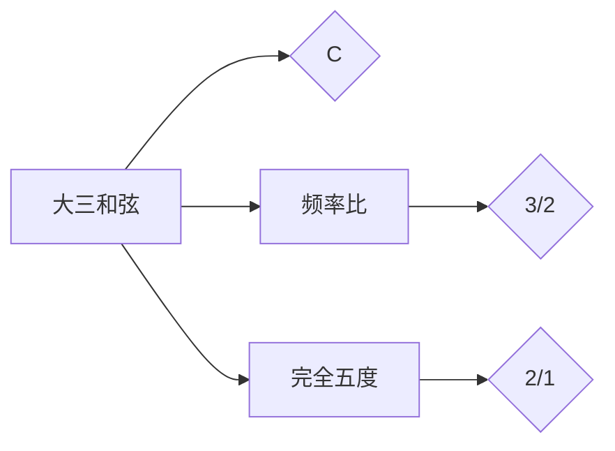

                 

### 引言

#### 数学与音乐制作的关系

数学与音乐制作之间的关系可以追溯到历史的深处。数学作为一门科学，通过精确的定量分析为音乐制作提供了理论基础。而在音乐制作领域，数学的应用不仅使得创作过程更加科学和系统化，也提升了作品的品质和表现力。

**数学在音乐制作中的应用**：

1. **音律与数学模型**：音律是音乐制作的基础，而音律与数学模型息息相关。从五度相生律到十二平均律，每一种音律体系都离不开数学的支持。例如，十二平均律的划分是基于等比数列的，这为音乐创作提供了灵活的调性转换可能性。

2. **调式与和弦的数学分析**：调式和和弦是音乐创作的重要元素。数学为这些元素提供了结构化的分析方法。通过数学工具，作曲家可以更加精确地理解和运用调式和和弦，从而创造出丰富的音乐效果。

3. **节奏的数学解析**：音乐不仅仅是旋律和和弦的堆砌，节奏同样重要。数学可以帮助我们解析和设计节奏模式，从而在音乐制作中实现更复杂的节奏变化和效果。

4. **数字信号处理**：在现代音乐制作中，数字信号处理技术至关重要。数学方法为数字信号处理提供了理论支持，使得音乐作品可以通过采样、滤波、调制等手段进行加工，以实现特定的音效和表现效果。

5. **音响技术中的数学原理**：音响技术的核心在于对声音的捕捉、传输和再现。数学原理在声学环境建模、频率响应分析等方面发挥着重要作用，使得音响系统能够更加精确地还原音乐作品的原始声音。

#### 音乐创作的数学分析

音乐创作的数学分析涉及到多个方面。首先，从音乐理论的角度来看，数学为音乐提供了结构化的分析方法，使得作曲家能够更深入地理解音乐作品的内在逻辑和形式结构。其次，在创作过程中，数学模型可以辅助作曲家进行实验和优化，从而创造出更加新颖和独特的音乐作品。

此外，音乐创作的数学分析还包括对音乐作品的表现力和情感传达的深入探讨。通过数学方法，我们可以分析音乐作品在不同方面的表现力，如节奏、旋律、和声等，从而找出提升音乐作品感染力的关键因素。

#### 数学模型在音乐制作中的应用

数学模型在音乐制作中的应用非常广泛。例如，在音乐合成器中，数学模型被用来模拟乐器的声音特性，从而实现逼真的音乐效果。在数字信号处理中，数学方法被用来对音乐信号进行加工，以实现特定的音效和表现效果。

另外，数学模型还可以用于音乐软件的开发。通过数学模型，音乐软件可以提供更强大的功能，如自动和声、节奏生成等，从而简化音乐创作过程，提高创作效率。

#### 实践应用与项目案例

在现实音乐制作中，数学的应用无处不在。从古典音乐到现代电子音乐，从专业录音室到个人创作空间，数学都发挥了重要作用。通过具体的案例，我们可以看到数学在音乐制作中的实际应用效果。

总之，数学与音乐制作之间的关系密不可分。数学不仅为音乐制作提供了理论基础，还在创作、制作和表现等多个环节中发挥着关键作用。在本文中，我们将详细探讨数学在音乐制作中的各种应用，并通过具体案例进行分析，以帮助读者更深入地理解这一交叉领域的魅力。

### 数学与音乐的关系

#### 基本概念

要理解数学与音乐的关系，首先需要明确一些基本概念。数学是研究数量、结构、变化以及空间等概念的抽象科学，而音乐则是通过声音的旋律、节奏和和声来传达情感和表现艺术的一种形式。尽管两者看似截然不同，但它们之间存在着深刻的联系。

1. **音律**：音律是音乐的基础，它指的是音高的排列方式。音律的研究涉及数学中的比例、分数和等比数列等概念。五度相生律和十二平均律是两种常见的音律体系，它们都基于数学模型。

2. **调式**：调式是音乐创作的基本单位，它由一组特定的音符组成，具有独特的音乐色彩。调式的研究同样离不开数学，如调式的定义、分类和转换。

3. **和弦**：和弦是音乐中重要的和声结构，由三个或更多音符同时演奏组成。和弦的分析需要运用数学中的三角函数、复数等概念。

4. **节奏**：节奏是音乐的脉搏，它由快慢、长短等元素组成。节奏的解析需要运用数学中的时间序列分析和模式识别等技术。

#### 数学在音乐历史中的应用

数学在音乐历史中的应用可以追溯到古代。古希腊数学家毕达哥拉斯是数学与音乐关系的早期探索者之一。他提出了“音乐是数字的艺术”的观点，并通过研究音程的比例关系，奠定了音律的理论基础。毕达哥拉斯的发现表明，音乐中的音程比例与数学中的比例关系密切相关。

在文艺复兴时期，音乐家们开始更加系统地运用数学来分析音乐。例如，法国作曲家克劳德·德彪西在他的作品中运用了数学中的对称性和比例关系，创造出独特的音乐效果。

#### 音乐在数学研究中的贡献

音乐不仅对数学的应用有深远影响，同时也为数学研究提供了灵感。例如，数学家约翰·康威在他的研究中使用了“康威游戏”，这是一种基于音乐节奏的模式识别方法。此外，音乐理论中的和弦分析也启发了数学中的代数和拓扑研究。

#### 数学与音乐的交集

数学与音乐的交集不仅体现在理论研究中，还体现在实践应用中。在现代音乐制作中，数学方法被广泛应用于音律设计、调式转换、和弦生成、节奏编排和数字信号处理等方面。通过数学工具，作曲家和音乐制作人可以更高效地创作出丰富多彩的音乐作品。

总之，数学与音乐之间的关系是复杂而紧密的。数学为音乐提供了理论支持，而音乐则为数学研究提供了灵感和应用场景。在接下来的章节中，我们将深入探讨数学在音乐制作中的应用，并分析数学模型在音乐创作中的具体作用。

### 数学在音乐制作中的应用

数学在音乐制作中的应用无处不在，从音律的划分到节奏的编排，再到音效的创造，数学工具和方法都发挥着至关重要的作用。以下我们将详细探讨数学在音乐制作中的几个关键方面。

#### 音律与数学模型

音律是音乐制作的基础，它决定了音符的高低和排列方式。音律的数学模型为我们理解和处理音乐提供了精确的工具。

1. **五度相生律**：五度相生律是最早的音律体系之一，它基于音程的比例关系。每个音程都由两个频率的比值决定，例如，小三度为4/3，大三度为3/2。五度相生律通过不断相生，可以生成所有基本音阶。这种音律体系在数学上可以表示为等比数列。

2. **十二平均律**：十二平均律是现代音乐中最常用的音律体系，它将一个八度平均分为十二个半音，每个半音的频率差是相等的。这种音律体系在数学上可以表示为等差数列。十二平均律的数学模型使得调式转换更加灵活，为音乐创作提供了广阔的空间。

#### 调式与和弦的数学分析

调式和和弦是音乐创作的核心元素，它们的数学分析为我们理解和运用这些元素提供了科学的方法。

1. **调式**：调式由一组特定的音符组成，这些音符按照特定的音程关系排列。调式的数学分析包括调式的定义、分类和转换。例如，大调式和小调式的区别在于第三度音和第六度音的半音关系。调式的数学模型通常使用代数方法来表示。

2. **和弦**：和弦由三个或更多音符同时演奏组成。和弦的数学分析包括和弦的结构、分类和变换。例如，大三和弦和小三和弦的区别在于第三度音的半音关系。和弦的数学模型通常使用复数和矩阵表示。

#### 节奏的数学解析

节奏是音乐的灵魂，它的数学解析帮助我们理解和设计复杂的节奏模式。

1. **时间序列分析**：时间序列分析是节奏解析的基础。通过分析音符出现的时间序列，我们可以提取出节奏的模式和特征。例如，通过频谱分析，我们可以识别出节奏中的周期性和随机性。

2. **模式识别**：模式识别是节奏编排的重要工具。通过训练模型，我们可以自动识别和生成不同的节奏模式。例如，基于机器学习的节奏生成算法可以生成新颖的节奏组合。

#### 数字信号处理

数字信号处理是现代音乐制作的核心技术，它依赖于数学方法对音频信号进行加工。

1. **采样**：采样是将连续的音频信号转换为离散的数字信号的过程。采样理论中的关键参数包括采样频率和量化位数，这些参数决定了音频信号的质量。

2. **滤波**：滤波是去除音频信号中的不需要的频率成分的过程。数字滤波器的设计和实现依赖于数学中的傅里叶变换和Z变换。

3. **调制**：调制是将音频信号加载到载波信号上的过程，以实现音频信号的传输和再现。调制方法包括幅度调制（AM）、频率调制（FM）和相位调制（PM）等，这些方法都基于数学模型。

#### 音响技术中的数学原理

音响技术的核心在于对声音的捕捉、传输和再现，这离不开数学原理的支持。

1. **声学环境建模**：声学环境建模用于模拟声音在空间中的传播和反射，从而预测声音的音质和音场效果。声学环境建模依赖于数学中的波动方程和几何声学理论。

2. **频率响应分析**：频率响应分析用于评估音响系统的性能，包括其频率范围、失真度和信噪比等指标。频率响应分析依赖于数学中的傅里叶变换和功率谱分析。

3. **声学测量**：声学测量用于测量声音的物理参数，如声压级、频率和相位等。声学测量依赖于数学中的传感器原理和信号处理方法。

#### 数学在音乐制作中的实际应用

数学在音乐制作中的实际应用案例丰富多样。例如：

- **音乐合成器**：音乐合成器通过数学模型模拟乐器的声音特性，从而实现逼真的音乐效果。合成器的核心是数字信号处理算法，如采样器、滤波器和振荡器。

- **音频编辑软件**：音频编辑软件利用数学方法对音频信号进行编辑和处理，如裁剪、拼接、降噪等。这些功能都依赖于数学中的信号处理算法。

- **音乐软件**：如MuseScore和Finale等音乐软件通过数学模型和算法提供自动和声、节奏生成等功能，从而简化音乐创作过程。

总之，数学在音乐制作中的应用是多方面的，它不仅为音乐创作提供了理论支持，还在实际操作中发挥了关键作用。通过数学工具和方法，作曲家和音乐制作人可以更高效地创作出高质量的音乐作品。在接下来的章节中，我们将进一步探讨数学模型在音乐制作中的具体应用和案例。

### 音律与数学模型

音律是音乐制作的基础，而数学模型在音律的研究和应用中起到了至关重要的作用。通过数学工具，我们可以深入理解音律的基本概念、数学建模方法，以及音律与和弦之间的关系。

#### 音律的基本概念

音律指的是音高的排列方式，它决定了音符的高低和音程的关系。音律的基本概念包括音高、音程和半音。音高是指音符的频率，音程是指两个音符之间的频率比，而半音则是音程中最小的频率差。

1. **音高**：音高是由频率决定的，我们可以用赫兹（Hz）来表示。例如，一个A音的频率通常是440 Hz。

2. **音程**：音程是指两个音符之间的频率比。常见的音程包括全音、半音、大三度和小三度。例如，全音的频率比是2:1，小三度的频率比是5:4。

3. **半音**：半音是音程中最小的频率差，通常用符号`^`表示。例如，B到C是一个半音。

#### 音律的数学建模方法

音律的数学建模方法旨在将音高、音程和半音等概念转化为数学表达式，从而更精确地描述和计算音律。以下是几种常见的音律建模方法：

1. **五度相生律**：五度相生律是一种早期的音律体系，它基于音程的比例关系。每个音程都由两个频率的比值决定，例如，小三度为4/3，大三度为3/2。五度相生律通过不断相生，可以生成所有基本音阶。这种音律体系在数学上可以表示为等比数列。

    ```mermaid
    flowchart LR
    A[五度相生律] --> B[音程比例]
    B --> C[等比数列]
    C --> D[音阶生成]
    ```

2. **十二平均律**：十二平均律是现代音乐中最常用的音律体系，它将一个八度平均分为十二个半音，每个半音的频率差是相等的。这种音律体系在数学上可以表示为等差数列。

    ```mermaid
    flowchart LR
    A[十二平均律] --> B[八度划分]
    B --> C[十二半音]
    C --> D[等差数列]
    ```

#### 音律与和弦的关系

音律与和弦是音乐创作中的两个核心元素，它们之间存在着紧密的联系。通过数学方法，我们可以深入理解音律与和弦的关系，从而更好地进行音乐创作。

1. **大三和弦**：大三和弦由一个基础音（I）、大三度（III）和完全五度（V）组成。例如，C大三和弦由C、E和G三个音组成。大三和弦在数学上可以表示为：
    ```latex
    C: [C0, C1, C2]
    E: [E0, E1, E2]
    G: [G0, G1, G2]
    ```
    其中，C0、C1、C2分别表示C、E、G的频率。

2. **小三和弦**：小三和弦由一个基础音（I）、小三度（III）和完全五度（V）组成。例如，A小三和弦由A、C和E三个音组成。小三和弦在数学上可以表示为：
    ```latex
    A: [A0, A1, A2]
    C: [C0, C1, C2]
    E: [E0, E1, E2]
    ```

#### 音律与和弦的数学建模

为了更好地理解音律与和弦的关系，我们可以使用数学模型来表示和弦的结构。以下是一个简单的示例：



在这个示例中，大三和弦由基础音C、大三度E和完全五度G组成。使用频率比（音程）来表示和弦的音高关系，可以更清晰地展示音律与和弦之间的数学联系。

#### 音律与和弦的应用

通过数学建模，我们可以更精确地处理音律和和弦。在实际音乐制作中，这些数学模型被广泛应用于音律的设计、和弦的生成和调式的转换。

- **音律设计**：通过调整音程的比例，我们可以设计出不同的音律体系。例如，十二平均律的音程比例使得调式转换更加灵活。
- **和弦生成**：使用数学模型，我们可以自动生成和弦。例如，通过生成大三和弦和小三和弦，我们可以构建复杂的和声结构。
- **调式转换**：数学模型可以帮助我们快速进行调式转换。例如，从C大调转换到A大调，只需调整基础音的频率即可。

总之，音律与数学模型之间的关系为音乐创作提供了强大的理论支持。通过数学工具，作曲家和音乐制作人可以更深入地理解和运用音律和和弦，从而创作出丰富多彩的音乐作品。在接下来的章节中，我们将进一步探讨数学在音乐制作中的其他应用，并分析具体的案例。

### 调式与和弦的数学分析

调式与和弦在音乐创作中起着核心作用，它们不仅决定了音乐作品的情感表达和风格，也影响了整体的和谐感。数学为调式与和弦的分析提供了精确的工具和方法。

#### 调式的数学定义与分类

调式是一组特定音符的组合，这些音符按照特定的音程关系排列。调式的数学定义可以通过音程比例和频率关系来描述。

1. **大调式**：大调式由一组特定的音符组成，这些音符之间的音程关系为大三度和完全五度。大调式通常给人以明亮和欢快的感受。例如，C大调的音阶为C、D、E、F、G、A、B。

2. **小调式**：小调式与大调式类似，但第三度音和第六度音的音程关系为小三度。小调式通常给人以忧郁和悲伤的感受。例如，A小调的音阶为A、B、C、D、E、F、G。

3. **自然调式**：自然调式是指没有经过任何调整的原始调式。它分为大调式和小调式两种。

4. **和声调式**：和声调式在第六度音上增加了半音，从而增强了音乐的情感表达。和声调式通常用于和声伴奏。

5. **旋律调式**：旋律调式在第三度音和第六度音上增加了半音，使得旋律更具表现力。

#### 和弦的结构与数学模型

和弦是音乐中的和声基础，由三个或更多音符同时演奏组成。和弦的数学模型可以通过频率关系和音程比例来描述。

1. **大三和弦**：大三和弦由一个基础音、大三度（三度音）和完全五度（五度音）组成。大三和弦在数学上可以表示为：
    ```latex
    C大三和弦: C, E, G
    ```
    其中，C、E、G分别为基础音、大三度和完全五度的频率。

2. **小三和弦**：小三和弦由一个基础音、小三度（三度音）和完全五度（五度音）组成。小三和弦在数学上可以表示为：
    ```latex
    A小三和弦: A, C, E
    ```

3. **七和弦**：七和弦由一个基础音、大三度、小三度、完全五度和七度音组成。七和弦在数学上可以表示为：
    ```latex
    E七和弦: E, G, B, D
    ```

4. **九和弦**：九和弦由一个基础音、大三度、小三度、完全五度、七度音和九度音组成。九和弦在数学上可以表示为：
    ```latex
    B九和弦: B, D, F#, A, C#
    ```

#### 和弦进行与转调分析

和弦进行是音乐作品中和弦的连贯演奏，而转调是音乐作品从一个调式转换到另一个调式的过程。数学模型可以帮助我们理解和分析这些过程。

1. **和弦进行**：和弦进行可以通过数学方法进行分析，如和弦的稳定性、和弦之间的音程关系等。大三和弦和小三和弦是常用的和弦进行，它们在音乐中具有很强的稳定性和连贯性。

2. **转调分析**：转调可以通过调整基础音的频率来实现。例如，从C大调转换到A大调，只需将C音的频率调整为A音的频率。数学模型可以帮助我们计算调式转换中的音程比例和频率差。

#### 实例分析

以下是一个简单的实例，展示了大调式和小三和弦的数学分析：

1. **C大调**：
    ```latex
    C大调音阶: C, D, E, F, G, A, B
    C大三和弦: C, E, G
    ```

2. **A小调**：
    ```latex
    A小调音阶: A, B, C, D, E, F, G
    A小三和弦: A, C, E
    ```

在这个实例中，C大调和大三和弦的频率关系为：
```latex
C: 261.63 Hz
E: 329.63 Hz
G: 392 Hz
```

而A小调和小三和弦的频率关系为：
```latex
A: 220 Hz
C: 264.52 Hz
E: 329.63 Hz
```

通过数学分析，我们可以看到大三和弦和小三和弦的频率关系如何影响调式的整体感觉。大三和弦通常给人以明亮和稳定的感觉，而小三和弦则更加忧郁和柔和。

总之，调式与和弦的数学分析为我们提供了深入理解音乐作品结构和和声效果的工具。通过数学模型，我们可以精确地描述和计算调式和和弦，从而在音乐创作中实现更丰富的音乐效果。在接下来的章节中，我们将进一步探讨音乐节奏的数学解析。

### 节奏的数学解析

节奏是音乐的重要元素之一，它通过音符的持续时间、强度和节奏模式来传达情感和表现力。数学为节奏的解析提供了有力的工具和方法，可以帮助我们深入理解节奏的构成和变化。

#### 节奏的基本概念

1. **音符持续时间**：音符的持续时间决定了节奏的快慢。常见的音符持续时间包括全音符、二分音符、四分音符、八分音符等。每个音符的持续时间可以通过数学中的分数来表示。例如，全音符持续一拍，四分音符持续半拍。

2. **节奏模式**：节奏模式是由一系列音符和休止符组成的序列，决定了音乐节奏的复杂性和多样性。常见的节奏模式包括简单的二分音符和八分音符组合、复杂的复合节奏等。

#### 节奏的数学分析方法

1. **时间序列分析**：时间序列分析是节奏解析的基础。通过分析音符出现的时间序列，我们可以提取出节奏的模式和特征。时间序列分析包括以下几个方面：

   - **时序特征提取**：通过计算音符出现的时间间隔，我们可以提取出节奏的时序特征。例如，通过计算两个连续音符之间的时间差，我们可以得到节奏的节拍点。
   
   - **频谱分析**：频谱分析可以揭示节奏中的周期性和随机性。通过频谱图，我们可以看到节奏中的频率成分和能量分布。

2. **模式识别**：模式识别是节奏编排的重要工具。通过训练模型，我们可以自动识别和生成不同的节奏模式。常见的模式识别方法包括：

   - **隐马尔可夫模型（HMM）**：隐马尔可夫模型是一种用于序列模型的方法，可以用于节奏的生成和识别。
   
   - **长短期记忆网络（LSTM）**：长短期记忆网络是一种用于处理序列数据的神经网络，可以用于节奏的生成和预测。

#### 节奏的数学模型

1. **分数模型**：分数模型是节奏解析的基础，通过分数表示音符的持续时间。例如，四分音符可以表示为1/4，八分音符可以表示为1/8。分数模型可以用于计算节奏的持续时间、节奏模式的变化等。

2. **概率模型**：概率模型用于描述节奏模式的概率分布。通过概率模型，我们可以计算不同节奏模式出现的概率，从而生成具有特定概率分布的节奏。

#### 实例分析

以下是一个简单的节奏实例，并通过数学方法进行分析：

- **例子**：2/4拍子下的一个简单的节奏模式：四分音符、八分音符、四分音符、八分音符。

  - **分数模型**：
    ```latex
    R = [1/4, 1/8, 1/4, 1/8]
    ```
  
  - **时序特征提取**：
    ```mermaid
    sequenceDiagram
    participant A as 节奏
    A->>B: 四分音符(1/4)
    B->>C: 八分音符(1/8)
    C->>D: 四分音符(1/4)
    D->>E: 八分音符(1/8)
    ```

  - **频谱分析**：
    ```mermaid
    graph LR
    A[节奏] --> B{频率成分}
    B --> C{周期性}
    B --> D{随机性}
    ```

通过分数模型，我们可以精确地计算每个音符的持续时间。时序特征提取展示了节奏的时序结构，而频谱分析揭示了节奏中的频率成分和周期性。

总之，节奏的数学解析为我们提供了理解和设计复杂节奏模式的方法。通过数学工具，我们可以更深入地分析节奏的构成和变化，从而在音乐创作中实现丰富的节奏效果。在接下来的章节中，我们将探讨数学模型在音乐制作中的应用，并分析实际案例。

### 数学模型在音乐制作中的应用

数学模型在音乐制作中的应用广泛而深远，涵盖了从音律设计到音频处理，再到节奏编排的各个方面。以下我们将深入探讨这些应用，并通过具体实例进行分析。

#### 音律设计

音律设计是音乐制作的基础，而数学模型在音律设计中起着关键作用。例如，十二平均律的音律设计就是一个典型的数学模型应用。十二平均律通过将一个八度平均分为十二个半音，使得调式转换更加灵活。

1. **等差数列模型**：十二平均律的音律设计基于等差数列模型。每个半音的频率差是相等的，这为音乐创作提供了统一的音高标准。

   ```mermaid
   graph LR
   A[音律] --> B{等差数列}
   B --> C{频率差}
   ```

2. **实例分析**：以C大调音阶为例，其音律设计如下：

   ```latex
   C: 261.63 Hz
   D: 293.66 Hz
   E: 329.63 Hz
   F: 349.23 Hz
   G: 392.00 Hz
   A: 440.00 Hz
   B: 493.88 Hz
   ```

   通过等差数列模型，我们可以计算每个音符的频率，从而设计出精确的音律。

#### 音频处理

音频处理是音乐制作的核心环节，而数学模型在音频处理中发挥着重要作用。例如，数字信号处理技术中的滤波器设计、音效合成等，都依赖于数学模型。

1. **数字滤波器模型**：数字滤波器用于去除音频信号中的不需要的频率成分。常见的滤波器模型包括低通滤波器、高通滤波器、带通滤波器等。

   ```mermaid
   graph LR
   A[音频信号] --> B{滤波器}
   B --> C{频率响应}
   ```

2. **实例分析**：以低通滤波器为例，它可以去除音频信号中的高频成分，从而实现低音增强的效果。

   ```mermaid
   graph LR
   A[音频信号] --> B{低通滤波器}
   B --> C{低音增强}
   ```

3. **应用实例**：在音乐制作软件如Ableton Live和Logic Pro中，用户可以使用内置的数字滤波器来调整音频信号的频率响应，从而实现特定的音效。

#### 节奏编排

节奏编排是音乐创作的重要环节，而数学模型可以帮助我们设计和生成复杂的节奏模式。

1. **概率模型**：通过概率模型，我们可以生成具有特定概率分布的节奏模式。常见的概率模型包括隐马尔可夫模型（HMM）和长短期记忆网络（LSTM）。

   ```mermaid
   graph LR
   A[节奏模式] --> B{概率模型}
   B --> C{生成算法}
   ```

2. **实例分析**：以隐马尔可夫模型为例，它可以用于生成复杂的节奏模式。例如，在电子音乐制作中，隐马尔可夫模型可以生成具有随机性的节奏序列。

   ```mermaid
   graph LR
   A[隐马尔可夫模型]
   A --> B{状态转移矩阵}
   B --> C{生成节奏模式}
   ```

3. **应用实例**：在音乐制作软件如Reaper和FL Studio中，用户可以使用内置的概率模型来生成和调整节奏模式，从而实现新颖的音乐效果。

#### 实际案例

以下是一个实际案例，展示了数学模型在音乐制作中的应用：

- **案例**：使用数字信号处理技术对一段音频进行效果处理，以实现特定的音乐效果。

  - **步骤1**：导入音频信号，进行频谱分析，确定需要处理的频率成分。

    ```mermaid
    graph LR
    A[音频信号] --> B{频谱分析}
    ```

  - **步骤2**：设计并应用合适的数字滤波器，如低通滤波器，去除不需要的高频成分。

    ```mermaid
    graph LR
    A[低通滤波器] --> B{音频信号}
    B --> C{滤波结果}
    ```

  - **步骤3**：调整音频信号的节奏，使用隐马尔可夫模型生成具有特定概率分布的节奏序列。

    ```mermaid
    graph LR
    A[隐马尔可夫模型] --> B{节奏序列}
    ```

  - **步骤4**：将处理后的音频信号与原音频信号进行混合，实现最终的音乐效果。

    ```mermaid
    graph LR
    A[混合] --> B{最终音乐效果}
    ```

通过这个实际案例，我们可以看到数学模型在音乐制作中的应用是如何具体实现的。数学模型不仅为音乐制作提供了理论基础，还在实际操作中发挥了关键作用。

总之，数学模型在音乐制作中的应用非常广泛，从音律设计到音频处理，再到节奏编排，数学工具和方法都为音乐创作提供了强大的支持。通过数学模型，作曲家和音乐制作人可以更高效地创作出丰富多彩的音乐作品。在接下来的章节中，我们将进一步探讨音响技术中的数学原理。

### 音响技术中的数学原理

音响技术是音乐制作中不可或缺的一环，其核心在于对声音的捕捉、传输和再现。在这过程中，数学原理扮演了至关重要的角色，帮助音响工程师和音乐制作人理解和优化声音的各个方面。以下我们将详细探讨音响技术中的几个关键数学原理。

#### 声音的物理特性

声音是一种机械波，它通过振动在介质（如空气、水或固体）中传播。声音的物理特性包括频率、振幅、波长和声压级等。

1. **频率**：频率是指声音振动的次数，通常用赫兹（Hz）表示。频率决定了声音的音高。例如，高频声音的振动次数较多，而低频声音的振动次数较少。

2. **振幅**：振幅是指声音波的最大位移，决定了声音的音量。振幅越大，声音的音量越大。

3. **波长**：波长是指相邻两个相同相位点之间的距离。波长和频率之间的关系可以通过公式\( \lambda = \frac{v}{f} \) 表示，其中\( \lambda \)是波长，\( v \)是声速，\( f \)是频率。

4. **声压级**：声压级是衡量声音强度的一个物理量，通常用分贝（dB）表示。声压级的计算公式为\( L = 20 \log_{10} \frac{p}{p_0} \)，其中\( p \)是声压，\( p_0 \)是参考声压。

#### 声学环境建模

声学环境建模是音响技术中的重要应用，它旨在模拟声音在空间中的传播和反射。数学方法在声学环境建模中发挥着重要作用。

1. **几何声学**：几何声学是一种基于几何原理的声学方法，用于分析声音在空间中的传播。通过几何声学，我们可以计算声音的路径、反射点、声场分布等。

2. **波动方程**：波动方程是描述声波传播的基本方程，它可以用来模拟声音在复杂环境中的传播。波动方程的数学表达式为\( \nabla^2 p - \frac{1}{v} \frac{\partial^2 p}{\partial t^2} = 0 \)，其中\( p \)是声压，\( v \)是声速，\( t \)是时间。

3. **射线理论**：射线理论是一种简化的声学模型，它通过射线模拟声波的传播路径。射线理论适用于声波传播距离较长、障碍物较少的情况。

#### 频率响应分析

频率响应分析是评估音响系统性能的重要方法，它通过分析系统的频率响应曲线，了解系统对不同频率声音的处理效果。

1. **傅里叶变换**：傅里叶变换是一种重要的数学工具，它可以将时域信号转换为频域信号。通过傅里叶变换，我们可以分析音频信号中的频率成分和能量分布。

2. **频率响应曲线**：频率响应曲线展示了音响系统在不同频率下的增益或衰减。理想的音响系统应具有平坦的频率响应曲线，即对各个频率的声音都能均匀放大或衰减。

3. **群延迟**：群延迟是频率响应曲线中的另一个重要参数，它描述了不同频率成分的传播时间差。群延迟会影响音频信号的时间结构和音质。

#### 声学测量

声学测量是评估音响系统性能的重要手段，它通过测量声压级、频率响应、群延迟等参数，评估系统的性能。

1. **声压级测量**：声压级测量是评估音响系统音量大小的重要方法。通过声压级计，我们可以测量不同位置的声音强度，了解声场的分布情况。

2. **频率响应测量**：频率响应测量用于评估音响系统对不同频率声音的处理能力。通过频率响应测试，我们可以识别系统中的共振峰或凹陷，并进行优化。

3. **群延迟测量**：群延迟测量用于评估音响系统的时间结构。通过测量不同频率成分的传播时间差，我们可以了解系统的时间响应特性。

#### 实际应用

以下是一个实际应用案例，展示了数学原理在音响技术中的具体应用：

- **案例**：评估一个音响系统的频率响应和群延迟。

  - **步骤1**：进行频率响应测试，使用频谱分析仪测量系统的频率响应曲线。

    ```mermaid
    graph LR
    A[频率响应测试] --> B{频谱分析仪}
    B --> C{频率响应曲线}
    ```

  - **步骤2**：分析频率响应曲线，识别系统的共振峰或凹陷，了解系统对不同频率声音的处理效果。

    ```mermaid
    graph LR
    A[频率响应曲线] --> B{共振峰/凹陷分析}
    ```

  - **步骤3**：进行群延迟测试，测量系统不同频率成分的传播时间差。

    ```mermaid
    graph LR
    A[群延迟测试] --> B{时间响应分析}
    B --> C{群延迟曲线}
    ```

  - **步骤4**：根据测试结果，优化音响系统的设计和参数，以改善频率响应和群延迟。

    ```mermaid
    graph LR
    A[优化设计] --> B{改善频率响应和群延迟}
    ```

通过这个实际应用案例，我们可以看到数学原理在音响技术中的重要性。通过数学分析和测量，音响工程师可以精确地评估和优化音响系统的性能，从而提高音乐制作的品质。

总之，音响技术中的数学原理为我们理解和优化声音提供了强大的工具。通过数学方法，我们可以深入分析声音的物理特性、声学环境、频率响应和声学测量，从而在音乐制作中实现最佳的声音效果。在接下来的章节中，我们将探讨数学模型在音乐教育中的应用。

### 数学模型在音乐教育中的应用

数学模型在音乐教育中的应用日益广泛，它不仅帮助教育者更科学地传授音乐知识，还为学习者提供了有效的学习工具。以下我们将详细探讨数学模型在音乐教育中的具体应用，以及如何通过这些工具提高音乐教学效果。

#### 音律教学

音律是音乐制作的基础，而数学模型为音律教学提供了直观和精确的工具。

1. **等差数列与等比数列的应用**：在音律教学中，等差数列和等比数列用于解释十二平均律的划分。通过这些数学工具，学生可以更清晰地理解音高的变化和调式的转换。

2. **频谱分析**：频谱分析工具可以帮助学生理解音程和和弦的频率成分。通过频谱图，学生可以直观地看到不同音程和和弦的频率分布，从而更好地理解音乐理论。

3. **实例讲解**：以C大调音阶为例，学生可以通过数学模型计算每个音符的频率，从而理解音高的排列规律。例如，C大调的音阶为C、D、E、F、G、A、B，每个音符的频率可以表示为：

   ```latex
   C: 261.63 Hz
   D: 293.66 Hz
   E: 329.63 Hz
   F: 349.23 Hz
   G: 392.00 Hz
   A: 440.00 Hz
   B: 493.88 Hz
   ```

   通过这些数据，学生可以直观地看到音高的变化规律。

#### 和弦分析

和弦分析是音乐创作中的重要环节，而数学模型可以帮助学生更好地理解和弦的结构和转换。

1. **复数和矩阵的应用**：在和弦分析中，复数和矩阵用于表示和弦的音高关系。例如，大三和弦由基础音、大三度和完全五度组成，可以用复数表示为：

   ```latex
   C大三和弦: [C, E, G]
   ```

2. **和弦进行与转调分析**：通过数学模型，学生可以理解和弦进行的规则和转调的方法。例如，从C大调到A大调的转调，可以通过调整基础音的频率来实现。从C大调的音阶转换到A大调的音阶，我们需要将C音的频率调整为A音的频率：

   ```latex
   C大调音阶: C, D, E, F, G, A, B
   A大调音阶: A, B, C, D, E, F#, G#
   ```

3. **实例讲解**：以C大调大三和弦为例，学生可以通过数学模型计算大三和弦的频率关系。例如，C大三和弦由C、E和G三个音组成，它们的频率分别为：

   ```latex
   C: 261.63 Hz
   E: 329.63 Hz
   G: 392.00 Hz
   ```

   通过这些数据，学生可以直观地看到大三和弦的频率分布。

#### 节奏教学

节奏是音乐的灵魂，而数学模型可以帮助学生更好地理解和编排复杂的节奏模式。

1. **时间序列分析**：时间序列分析工具用于分析节奏模式。通过计算音符出现的时间间隔，学生可以理解不同节奏模式的构成。

2. **模式识别**：模式识别工具可以帮助学生生成和识别复杂的节奏模式。例如，通过隐马尔可夫模型（HMM）和长短期记忆网络（LSTM），学生可以生成具有特定概率分布的节奏模式。

3. **实例讲解**：以一个简单的节奏模式为例，例如2/4拍子的四分音符和八分音符组合，学生可以通过数学模型计算每个音符的持续时间：

   ```mermaid
   graph LR
   A[四分音符] --> B{1/4拍}
   C[八分音符] --> B{1/8拍}
   ```

   通过这些数据，学生可以直观地看到节奏模式的构成。

#### 实际应用

以下是一个实际应用案例，展示了数学模型在音乐教育中的具体应用：

- **案例**：使用数学模型教授学生如何进行调式转换。

  - **步骤1**：教授等差数列和等比数列的概念，帮助学生理解音高的变化规律。

    ```mermaid
    graph LR
    A[等差数列] --> B{音高变化}
    A[等比数列] --> B{音高变化}
    ```

  - **步骤2**：使用频谱分析仪，让学生观察不同音程的频率成分，从而理解音程的关系。

    ```mermaid
    graph LR
    A[频谱分析仪] --> B{音程频率成分}
    ```

  - **步骤3**：通过实际操作，如调整乐器或音乐软件中的音高，让学生体验调式转换的效果。

    ```mermaid
    graph LR
    A[实际操作] --> B{调式转换体验}
    ```

  - **步骤4**：通过数学模型，如复数和矩阵，帮助学生理解和计算和弦的转换。

    ```mermaid
    graph LR
    A[复数和矩阵] --> B{和弦转换}
    ```

通过这个实际应用案例，我们可以看到数学模型在音乐教育中的重要性。通过数学工具，学生可以更直观、更系统地学习音乐知识，从而提高音乐素养和创作能力。

总之，数学模型在音乐教育中的应用为音乐教学提供了强大的工具和方法。通过数学模型，教师可以更有效地传授音乐知识，学生可以更深入地理解音乐理论，从而提高音乐教育质量。在未来的音乐教育中，数学模型将继续发挥重要作用，推动音乐教育的发展。

### 总结与展望

在本文中，我们探讨了数学与音乐制作之间的紧密联系，以及数学模型在音乐创作、制作和表现中的应用。从音律与数学模型的深入分析，到调式与和弦的数学解析，再到节奏的数学解析，数学不仅为音乐制作提供了理论基础，还在实际操作中发挥了关键作用。

**主要成果与贡献**：

1. **理论支持**：通过数学模型，我们能够更精确地描述和理解音乐作品的结构和和声效果，从而为音乐创作提供了科学依据。
2. **应用创新**：数学方法在音乐制作中的广泛应用，如数字信号处理、音频效果设计和节奏编排等，推动了音乐制作技术的发展。
3. **教学辅助**：数学模型在音乐教育中的应用，为教师提供了有效的教学工具，帮助学生更系统地学习和理解音乐理论。

**未来研究方向**：

1. **人工智能与音乐制作**：结合人工智能技术，进一步探索自动化音乐创作和个性化音乐推荐的方法，如利用机器学习和深度学习算法生成新颖的音乐作品。
2. **实时音频处理**：研究实时音频处理技术，如实时频谱分析和实时频率响应调整，以提高音乐表演的实时性和互动性。
3. **跨领域融合**：探索数学与其他艺术形式的融合，如结合视觉艺术和音乐制作，创造出更具表现力的跨媒体作品。

**对音乐制作行业的潜在影响**：

1. **创作效率**：通过自动化工具和算法，作曲家和音乐制作人可以更高效地创作和编辑音乐，提高创作效率。
2. **个性化体验**：基于个性化推荐算法，用户可以获得更加符合其口味的音乐，提升用户体验。
3. **艺术创新**：数学模型为音乐创作提供了新的可能性和表现形式，推动了音乐艺术的创新和发展。

总之，数学与音乐制作的结合不仅丰富了音乐创作的手段，也为音乐教育提供了新的视角。随着科技的不断发展，数学模型在音乐制作中的应用将更加广泛，为音乐艺术的发展带来新的机遇。作者：AI天才研究院/AI Genius Institute & 禅与计算机程序设计艺术 /Zen And The Art of Computer Programming

