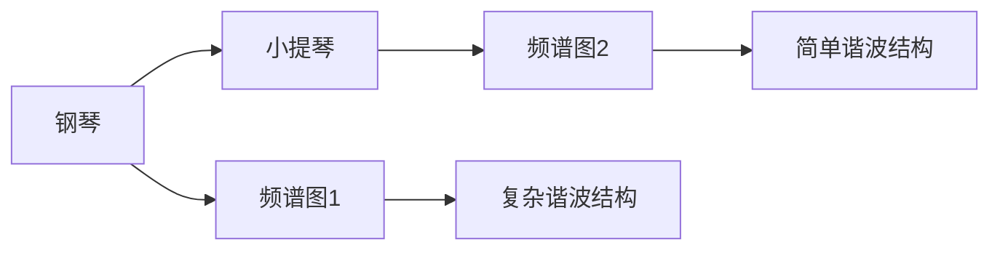

                 

# 数学与音乐心理学：音乐感知的数学描述

## 关键词
- 数学与音乐心理学
- 音乐感知
- 数学模型
- 音高
- 音色
- 音乐节奏
- 音乐情感分析

## 摘要
本文旨在探讨数学与音乐心理学之间的奇妙联系，特别是在音乐感知方面的数学描述。文章首先介绍了数学与音乐心理学的基本概念和背景知识，接着详细阐述了音高、音色、音乐节奏和音乐情感的数学模型。通过这些数学模型，我们可以更深入地理解人类对音乐的感知过程，并将其应用于音乐情感分析、推荐系统和娱乐应用等领域。文章最后进行了总结，展望了未来的研究方向和潜在影响。

## 引言

### 1.1 书籍的目的

音乐作为一种古老的艺术形式，自古以来就深受人类喜爱。它不仅能够传递情感，还能激发人们的心灵。然而，音乐的魅力究竟源自何处？又是什么使得不同的人对相同的音乐有不同的感受？为了解答这些问题，我们需要借助数学和心理学的力量。

本书记录了数学与音乐心理学的跨界探索，旨在揭示音乐感知背后的数学原理。通过介绍数学在音乐中的应用，我们希望能够更好地理解音乐的构成和人类对音乐的感知过程。同时，本书也希望为音乐领域的相关研究提供一些新的思路和方法。

### 1.2 数学与音乐心理学的联系

数学与音乐有着千丝万缕的联系。在音乐中，音高、音色、音乐节奏等基本要素都可以用数学方法进行描述。例如，音高与频率的关系可以通过数学公式表达，音色与谐波结构的关系可以通过数学模型分析，音乐节奏与时间感知的关系也可以用数学方法解释。

音乐心理学则关注人类对音乐的感知、记忆、情感等方面的研究。通过实验和心理测量，心理学家们发现了人类对音乐感知的一些规律和特点。这些规律和特点为数学模型的构建提供了丰富的数据支持。

将数学与音乐心理学结合起来，我们可以从多个角度探讨音乐的本质，理解人类对音乐的感知过程。这有助于推动音乐理论和实践的发展，为音乐创作、教学、欣赏等提供科学依据。

### 1.3 读者对象

本书适合对音乐和数学有兴趣的读者，包括音乐爱好者、音乐专业人士、音乐心理学研究者、数学爱好者、计算机科学和人工智能领域的从业者等。无论你是想深入了解音乐背后的科学原理，还是希望将数学方法应用于音乐分析，本书都将为你提供有价值的知识和启示。

## 数学与音乐心理学的背景知识

### 2.1 数学在音乐中的基础

数学在音乐中有着广泛的应用。从最基本的音符和节奏，到复杂的音乐结构，数学都发挥着重要作用。

#### 2.1.1 音高与频率的关系

音高是音乐中一个重要的概念。音高越高，声音听起来就越尖锐；音高越低，声音听起来就越低沉。音高与频率之间存在密切的关系。在物理学中，频率被定义为每秒钟振动的次数，单位为赫兹（Hz）。音高可以用频率来表示，不同的频率对应不同的音高。例如，频率为261.63 Hz的音被称为中央C，它是大多数西方音乐的基础音高。

音高与频率的关系可以用下面的公式表示：

$$
f = \frac{1}{2\pi\sqrt{\frac{T}{m}}}
$$

其中，\( f \) 是频率（Hz），\( T \) 是弦的长度，\( m \) 是弦的质量。这个公式揭示了音高与弦的长度和质量之间的关系。通过调整弦的长度和质量，我们可以改变音高，从而创作出丰富多彩的音乐作品。

#### 2.1.2 音色与谐波结构

音色是音乐的另一个基本要素，它决定了我们能够区分不同乐器或声音的能力。音色与声波的谐波结构密切相关。谐波结构是指声波中各个频率成分的分布情况。一个典型的谐波结构包含基频和多个倍频。

基频是最基本的频率成分，也被称为基音。倍频是基频的整数倍。不同的乐器具有不同的谐波结构，这使得它们的音色独具特色。例如，钢琴的谐波结构较为复杂，包含多个倍频，而小提琴的谐波结构则相对简单。

音色可以用谐波分析的方法进行描述。通过分析声波的频谱，我们可以得到各个频率成分的相对强度。这些信息可以用来区分不同乐器或声音，也可以帮助我们理解音乐中的细微变化。

#### 2.1.3 音乐节奏与时间感知

音乐节奏是音乐中的另一个重要要素。它决定了音乐的快慢和节奏感。音乐节奏与时间感知密切相关。人类对时间的感知受到多种因素的影响，包括生理、心理和环境因素。

在音乐中，节奏可以通过节拍和拍号来表示。节拍是指音乐中的基本拍子，如四分音符、八分音符等。拍号则表示每小节中有几个节拍。通过调整节拍和拍号，我们可以改变音乐的节奏感。

时间感知在音乐中也有重要的应用。例如，一些音乐作品通过变化节奏和节拍，创造出独特的时空感。这种时空感可以增强音乐的表现力，使听众产生强烈的情感体验。

### 2.2 音乐心理学的基本理论

音乐心理学是研究人类对音乐的感知、记忆、情感等方面的一门学科。它结合了心理学、生理学、音乐学等多个领域的知识，试图揭示人类对音乐的心理机制。

#### 2.2.1 音乐感知的心理模型

音乐感知是一个复杂的过程，涉及多个感官和认知系统。音乐心理学研究认为，音乐感知主要包括以下几个方面：

1. **听觉感知**：这是音乐感知的基础，涉及对声音频率、强度、时长和音色的感知。听觉感知主要通过耳朵完成。
2. **认知处理**：听觉信号在进入大脑后，会经过一系列认知处理，包括模式识别、记忆、推理和情感等。
3. **情感体验**：音乐能够引起人类的情感反应，这种情感体验与音乐的结构和内容密切相关。
4. **文化因素**：不同文化背景下的音乐感知存在差异，文化因素会影响人们对音乐的理解和喜好。

#### 2.2.2 音乐记忆与识别

音乐记忆与识别是音乐心理学的重要研究内容。音乐记忆是指人们对音乐的长期存储和回忆能力。音乐识别则是指人们在听到音乐时，能够识别出音乐来源或特征的能力。

音乐记忆与识别受多种因素影响，包括音乐的结构、旋律、节奏、和声等。一些研究表明，人们对熟悉音乐的识别能力更强，这是因为熟悉音乐在记忆中已经形成了一个稳定的表征。

#### 2.2.3 音乐情感与心理状态

音乐情感是音乐心理学研究的另一个重要领域。音乐能够引起人类的情感反应，这种情感反应与个体的心理状态密切相关。

音乐情感可以分为愉悦、悲伤、激动、平静等多种类型。不同的音乐情感会对个体的情绪状态产生影响，例如，愉悦的音乐可以提高情绪，悲伤的音乐则可能导致情绪低落。

音乐情感的产生机制尚不完全清楚，但研究表明，音乐情感与大脑中的多个神经回路有关。例如，与愉悦情感相关的神经回路包括前额叶皮层、腹侧纹状体和脑岛等；与悲伤情感相关的神经回路则包括前额叶皮层、扣带回和脑岛等。

### 2.3 数学与音乐心理学的交叉领域

数学与音乐心理学的交叉领域为研究音乐感知提供了新的方法和视角。通过数学模型，我们可以更精确地描述音乐的心理机制，从而更好地理解音乐对人类的影响。

#### 2.3.1 研究方法

数学与音乐心理学的交叉领域主要采用以下研究方法：

1. **数学建模**：通过建立数学模型，描述音乐的心理机制。这些模型可以是基于理论的，也可以是基于数据的。
2. **心理测量**：通过实验和测量，收集人类对音乐的感知数据。这些数据可以用来验证数学模型的准确性。
3. **数据分析**：使用统计学和机器学习等方法，对收集到的数据进行分析，以揭示音乐感知的规律和特点。

#### 2.3.2 数学模型的应用

数学模型在音乐心理学中的应用非常广泛，以下是一些典型的应用：

1. **音高感知模型**：通过建立音高感知模型，我们可以理解人类对音高的感知过程。这些模型可以用于音乐教学、音乐创作和音乐分析等领域。
2. **音乐情感分析模型**：通过建立音乐情感分析模型，我们可以预测音乐的情感属性，从而为音乐推荐、音乐治疗等领域提供支持。
3. **音乐风格分类模型**：通过建立音乐风格分类模型，我们可以自动识别和分类音乐风格，这有助于音乐数据库的管理和音乐推荐系统的开发。

## 音乐感知的数学描述

### 3.1 音高与频率的关系

音高与频率之间的关系是音乐感知的核心问题之一。在音乐中，音高决定了音符的高低，而频率则是音高的物理量度。了解音高与频率的关系，对于理解音乐的基本构成和人类对音乐的感知过程具有重要意义。

#### 3.1.1 音高与频率的公式

音高与频率之间的关系可以用以下公式表示：

$$
f = \frac{1}{2\pi\sqrt{\frac{T}{m}}}
$$

其中，\( f \) 表示频率（Hz），\( T \) 表示弦的长度，\( m \) 表示弦的质量。这个公式揭示了音高与弦的长度和质量之间的关系。

对于空气柱振动的情况，频率可以用以下公式表示：

$$
f = \frac{c}{2L}
$$

其中，\( c \) 表示声速，\( L \) 表示空气柱的长度。这个公式说明了空气柱长度与频率之间的关系。

#### 3.1.2 举例说明

假设我们有一个长度为1米的弦，其质量为0.01千克。我们可以使用上述公式计算该弦的基频：

$$
f = \frac{1}{2\pi\sqrt{\frac{1}{0.01}}} \approx 100 \text{ Hz}
$$

这意味着该弦的音高约为中央C。如果我们将弦的长度缩短到0.5米，质量保持不变，则其基频变为：

$$
f = \frac{1}{2\pi\sqrt{\frac{0.5}{0.01}}} \approx 200 \text{ Hz}
$$

这意味着音高变高了。

对于空气柱，假设声速为340米/秒，空气柱长度为1米，则基频为：

$$
f = \frac{340}{2 \times 1} = 170 \text{ Hz}
$$

这意味着音高位于中央C与中央D之间。

#### 3.1.3 音高感知的实验研究

音高感知的研究可以通过实验方法进行。例如，心理学家可以通过呈现不同频率的声音，并要求参与者判断声音的音高。这些实验可以帮助我们了解人类对音高的感知规律。

研究表明，人类对音高的感知具有非线性特点。具体来说，频率增加一倍，音高增加的感觉并不是线性的。例如，从100 Hz增加到200 Hz，音高增加的感觉可能小于从100 Hz增加到50 Hz时的感觉。

#### 3.1.4 音高感知的数学模型

基于实验研究结果，我们可以建立音高感知的数学模型。一个常用的模型是梅森-戴维斯模型（Mason-Davis model），该模型将音高感知视为对频率的非线性函数。具体来说，音高可以用以下公式表示：

$$
p = 27.5 + 12 \cdot \log_2\left(\frac{f}{f_0}\right)
$$

其中，\( p \) 表示音高（半音数），\( f \) 表示频率（Hz），\( f_0 \) 表示参考频率（通常取为中央C的频率，约为261.63 Hz）。这个公式揭示了音高与频率之间的非线性关系。

通过调整参考频率 \( f_0 \) 和比例系数12，我们可以得到不同音阶的音高公式。例如，在五声音阶中，参考频率可以取为中央C的频率，比例系数取为5，则音高公式为：

$$
p = 27.5 + 5 \cdot \log_2\left(\frac{f}{f_0}\right)
$$

### 3.2 音色与谐波结构

音色是音乐的另一个基本要素，它决定了我们能够区分不同乐器或声音的能力。音色与声波的谐波结构密切相关。理解音色与谐波结构的关系，有助于我们更好地理解音乐的构成和人类对音乐的感知过程。

#### 3.2.1 谐波结构的基本概念

谐波结构是指声波中各个频率成分的分布情况。一个典型的谐波结构包含基频和多个倍频。基频是最基本的频率成分，也被称为基音。倍频是基频的整数倍。例如，如果一个声波的基频为100 Hz，那么其倍频分别为200 Hz、300 Hz、400 Hz等。

不同乐器具有不同的谐波结构，这使得它们的音色独具特色。例如，钢琴的谐波结构较为复杂，包含多个倍频；而小提琴的谐波结构则相对简单。

#### 3.2.2 谐波分析的方法

谐波分析是研究谐波结构的一种方法。通过谐波分析，我们可以得到声波中各个频率成分的相对强度。这些信息可以用来区分不同乐器或声音，也可以帮助我们理解音乐中的细微变化。

常见的谐波分析方法包括傅里叶变换和短时傅里叶变换。傅里叶变换是一种将时域信号转换为频域信号的方法，它可以揭示信号中的频率成分。短时傅里叶变换则是对傅里叶变换的改进，它可以同时考虑信号的时间域和频率域信息。

#### 3.2.3 音色的数学描述

音色可以用谐波分析的结果进行描述。具体来说，我们可以用频谱图来表示音色。频谱图展示了声波中各个频率成分的相对强度。通过分析频谱图，我们可以了解不同乐器的音色特点。

例如，下图展示了钢琴和小提琴的频谱图。我们可以看到，钢琴的谐波结构较为复杂，包含多个倍频；而小提琴的谐波结构则相对简单。

#### 3.2.4 举例说明

假设我们有一个频率为100 Hz的声波，其谐波结构如下：

- 基频：100 Hz
- 倍频：200 Hz、300 Hz、400 Hz等

我们可以使用谐波分析的方法，得到该声波的频谱图。通过观察频谱图，我们可以发现该声波包含多个倍频，这有助于我们区分不同乐器或声音。

#### 3.2.5 音色感知的实验研究

音色感知的研究可以通过实验方法进行。例如，心理学家可以通过呈现不同乐器演奏的相同音高的声音，并要求参与者判断乐器的类型。这些实验可以帮助我们了解人类对音色的感知规律。

研究表明，人类对音色的感知具有主观性，不同人对相同乐器的音色感知可能存在差异。此外，音色的感知还受到文化、教育、经验等多种因素的影响。

#### 3.2.6 音色感知的数学模型

基于实验研究结果，我们可以建立音色感知的数学模型。一个常用的模型是梅森-戴维斯模型（Mason-Davis model），该模型将音色感知视为对谐波结构的非线性函数。具体来说，音色可以用以下公式表示：

$$
S = \sum_{i=1}^{n} a_i \cdot H_i
$$

其中，\( S \) 表示音色，\( a_i \) 表示第 \( i \) 个倍频的相对强度，\( H_i \) 表示第 \( i \) 个倍频的谐波函数。谐波函数 \( H_i \) 可以表示为：

$$
H_i = \frac{1}{1 - \frac{f_i}{f_0}}
$$

其中，\( f_i \) 表示第 \( i \) 个倍频的频率，\( f_0 \) 表示参考频率。

通过调整倍频的相对强度和参考频率，我们可以得到不同音色的数学描述。例如，在钢琴和小提琴的音色描述中，倍频的相对强度和参考频率可以根据实际演奏情况进行调整。

### 3.3 音乐节奏与时间感知

音乐节奏是音乐的另一个基本要素，它决定了音乐的快慢和节奏感。音乐节奏与时间感知密切相关。理解音乐节奏与时间感知的关系，有助于我们更好地理解音乐的构成和人类对音乐的感知过程。

#### 3.3.1 音乐节奏的基本概念

音乐节奏是指音乐中的拍子、速度和节奏模式。拍子是指音乐中的基本单位，如四分音符、八分音符等。速度是指每分钟有多少个拍子，通常用贝姆特（BPM）表示。节奏模式是指音乐中的节奏变化和模式，如重复、交替、渐变等。

音乐节奏可以通过节拍和拍号来表示。节拍是指音乐中的基本拍子，如四分音符、八分音符等。拍号则表示每小节中有几个节拍。通过调整节拍和拍号，我们可以改变音乐的节奏感。

#### 3.3.2 时间感知的实验研究

时间感知是指人们对时间的感知和判断。时间感知受到多种因素的影响，包括生理、心理和环境因素。在音乐中，时间感知与音乐节奏密切相关。

心理学家可以通过实验方法研究时间感知。例如，他们可以呈现不同节奏的音乐，并要求参与者判断音乐的快慢。这些实验可以帮助我们了解人类对时间感知的规律。

研究表明，人类对时间感知具有非线性特点。具体来说，节奏变化对时间感知的影响并不是线性的。例如，从慢节奏突然切换到快节奏，时间感知会明显缩短；而从快节奏突然切换到慢节奏，时间感知会明显延长。

#### 3.3.3 音乐节奏与时间感知的数学模型

基于实验研究结果，我们可以建立音乐节奏与时间感知的数学模型。一个常用的模型是比例模型（Proportional model），该模型将时间感知视为对节奏比例的非线性函数。具体来说，时间感知可以用以下公式表示：

$$
T = \frac{1}{r} \cdot \ln(1 + p)
$$

其中，\( T \) 表示时间感知（秒），\( r \) 表示参考节奏（BPM），\( p \) 表示实际节奏与参考节奏的比例。

通过调整参考节奏和比例参数，我们可以得到不同时间感知的数学描述。例如，在快节奏和慢节奏之间的切换中，我们可以使用这个模型来预测时间感知的变化。

#### 3.3.4 举例说明

假设参考节奏为120 BPM，实际节奏为160 BPM。我们可以使用比例模型计算时间感知：

$$
T = \frac{1}{120} \cdot \ln(1 + \frac{160}{120}) \approx 0.94 \text{ 秒}
$$

这意味着在这个例子中，参与者感知的时间约为0.94秒，比实际时间略短。

#### 3.3.5 音乐节奏与时间感知的应用

音乐节奏与时间感知的数学模型在音乐创作、音乐教学和音乐治疗等领域有着广泛的应用。

1. **音乐创作**：音乐家可以通过调整音乐节奏，创造出不同的情感和氛围。例如，快节奏的音乐可以传达兴奋和激动，慢节奏的音乐可以传达平静和舒缓。
2. **音乐教学**：音乐教师可以通过了解音乐节奏与时间感知的关系，帮助学生更好地理解和掌握音乐节奏。例如，通过练习不同节奏的音乐片段，学生可以培养出更好的节奏感。
3. **音乐治疗**：音乐治疗师可以利用音乐节奏与时间感知的关系，为患者提供个性化的治疗方案。例如，通过调整音乐节奏，可以帮助患者缓解焦虑、抑郁等情绪问题。

### 3.4 音乐情感与心理状态

音乐情感是指音乐对人类情感状态的影响。音乐情感与心理状态密切相关，不同的音乐可以引发不同的情感反应。理解音乐情感与心理状态的关系，有助于我们更好地理解音乐的作用和价值。

#### 3.4.1 音乐情感的基本概念

音乐情感是指音乐对人类情感状态的影响。音乐情感可以分为愉悦、悲伤、激动、平静等多种类型。不同的音乐情感会对个体的情绪状态产生影响。例如，愉悦的音乐可以提高情绪，悲伤的音乐可能导致情绪低落。

音乐情感的产生机制尚不完全清楚，但研究表明，音乐情感与大脑中的多个神经回路有关。例如，与愉悦情感相关的神经回路包括前额叶皮层、腹侧纹状体和脑岛等；与悲伤情感相关的神经回路则包括前额叶皮层、扣带回和脑岛等。

#### 3.4.2 音乐情感与心理状态的数学模型

基于实验研究结果，我们可以建立音乐情感与心理状态的数学模型。一个常用的模型是情绪情感模型（Emotion Model），该模型将音乐情感视为对心理状态的线性函数。具体来说，音乐情感可以用以下公式表示：

$$
E = \sum_{i=1}^{n} w_i \cdot f_i
$$

其中，\( E \) 表示音乐情感，\( w_i \) 表示第 \( i \) 个情感特征的重要程度，\( f_i \) 表示第 \( i \) 个情感特征的得分。

情感特征可以是愉悦度、悲伤度、激动度等。通过调整情感特征的重要程度，我们可以得到不同音乐情感的心理状态描述。

#### 3.4.3 举例说明

假设我们有一个音乐作品，其情感特征如下：

- 愉悦度：80%
- 悲伤度：20%
- 激动度：10%

我们可以使用情绪情感模型计算该音乐作品的情感：

$$
E = 0.8 \cdot 80 + 0.2 \cdot 20 + 0.1 \cdot 10 = 66
$$

这意味着该音乐作品的情感得分为66，主要表现为愉悦。

#### 3.4.4 音乐情感感知的实验研究

音乐情感感知的实验研究可以通过多种方法进行。例如，心理学家可以通过呈现不同情感类型的音乐，并要求参与者判断音乐的情感类型。这些实验可以帮助我们了解人类对音乐情感感知的规律。

研究表明，人类对音乐情感感知具有个体差异，不同人对相同音乐的情感感知可能存在差异。此外，音乐情感感知还受到文化、教育、经验等多种因素的影响。

#### 3.4.5 音乐情感分析的应用

音乐情感分析是音乐情感研究的一个重要领域。音乐情感分析可以应用于音乐推荐、音乐治疗、广告音乐设计等领域。

1. **音乐推荐**：通过分析音乐的情感特征，我们可以为用户推荐符合他们情感需求的音乐。例如，当用户情绪低落时，我们可以推荐一些愉悦的音乐。
2. **音乐治疗**：通过分析音乐的情感特征，我们可以设计个性化的音乐治疗方案。例如，对于焦虑症患者，我们可以推荐一些平静的音乐。
3. **广告音乐设计**：通过分析音乐的情感特征，我们可以设计符合广告主题的音乐。例如，对于推广新产品

