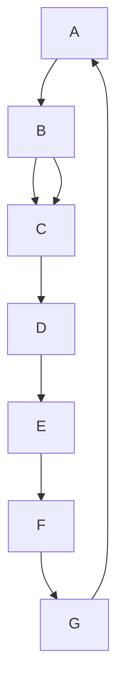
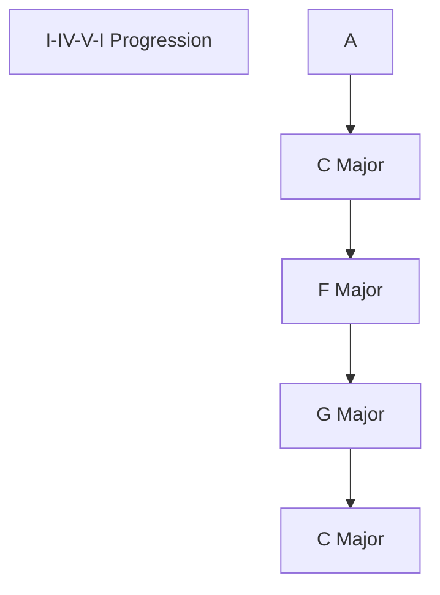
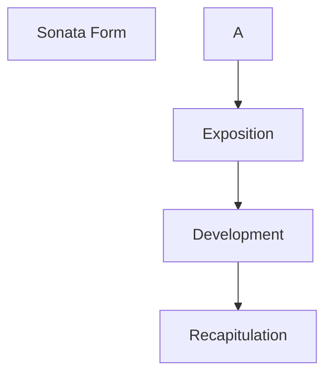
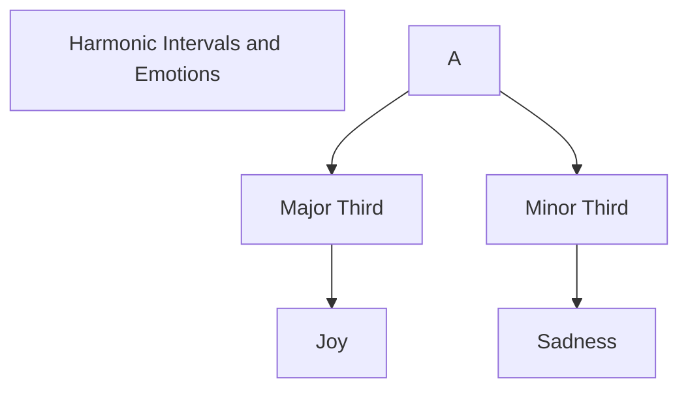

                 

### Chapter 1: Overview of Mathematics and Music

> Keywords: **Mathematics, Music, Aesthetic Experience, Emotional Expression**

> Abstract: This chapter provides an introduction to the intersection of mathematics and music, exploring the historical background, fundamental concepts, and theoretical frameworks that bridge these two disciplines. It sets the stage for further discussions on the mathematical principles underlying music and their aesthetic and emotional expressions.

#### 1.1 The Integration of Mathematics and Music

The relationship between mathematics and music dates back to ancient civilizations, where musical instruments and musical scales were designed based on mathematical principles. For instance, the Pythagoreans of ancient Greece believed that music was a reflection of the cosmos, with musical ratios corresponding to numerical relationships. This belief laid the foundation for the study of harmony and the concept of mathematical ratios in music.

**Historical Background of Mathematics and Music**

In the ancient world, mathematics and music were intertwined. The Egyptians and Babylonians used mathematics to build structures and solve practical problems, including those related to music. The Greeks, particularly the Pythagoreans, were among the first to explore the mathematical foundations of music. They discovered that the relationships between musical notes could be represented using simple numerical ratios. For example, the interval between a perfect fifth and a unison is a ratio of 3:2, while the interval between a major third and a unison is a ratio of 5:4.

**Fundamental Concepts in Mathematics and Music**

The fundamental concepts in mathematics and music share common ground. Both disciplines deal with patterns, structures, and relationships. In music, these concepts manifest as melodic patterns, harmonic progressions, and rhythmic structures. In mathematics, they are expressed through numbers, shapes, and geometric patterns.

**Theoretical Frameworks and Research Directions**

Modern research continues to explore the connections between mathematics and music. Researchers use various mathematical models to analyze musical compositions, understand the structures of musical scales, and develop algorithms for music generation and analysis. One such model is the [Musical Scales](#musical-scales-and-their-structures) section, which discusses how mathematical principles define the organization of musical scales.

#### 1.2 The Impact of Mathematics on Music

Mathematics has had a profound impact on the evolution of music. One example is the development of equal temperament, which allows for the equal division of the musical octave into twelve semitones. This innovation, achieved through mathematical calculations, resolved the problem of dissonance between musical intervals in different keys.

**Mathematical Models in Music**

Mathematical models are used to analyze and create music. For example, the [Fourier analysis](#fourier-analysis-and-its-applications) section explores how musical signals can be represented as sums of sine and cosine waves. This model is crucial for understanding the harmonic content of musical notes and the effects of different instruments.

**The Role of Mathematics in Music Technology**

In the digital age, mathematics has played an essential role in the development of music technology. Algorithms for digital signal processing, music synthesis, and music information retrieval all rely on mathematical principles. For instance, [wave digital synthesis](#wave-digital-synthesis-and-its-applications) is a technique that uses mathematical models to simulate the acoustic behavior of musical instruments.

### 1.3 Conclusion

The intersection of mathematics and music is a rich area of study that has shaped the history and development of both disciplines. From ancient civilizations to the modern digital age, the integration of mathematics and music has led to innovations in musical theory, composition, and performance. This chapter has provided an overview of the historical background, fundamental concepts, and theoretical frameworks that underpin the relationship between mathematics and music. In the following chapters, we will delve deeper into the mathematical principles that govern music and explore their aesthetic and emotional expressions.

---

### Chapter 2: Mathematical Principles in Music

> Keywords: **Mathematics, Music, Harmonic Theory, Rhythm, Geometry**

> Abstract: This chapter delves into the mathematical principles that form the backbone of music. It covers the role of harmony and rhythm in music, the mathematical models of rhythm, and the geometric structures that shape musical form and composition.

#### 2.1 Harmony and Rhythm

Harmony and rhythm are fundamental elements of music, and they are intricately connected to mathematical principles. Understanding these concepts requires a look at the historical development of musical theory and the mathematical tools used to analyze them.

**The Role of Harmony in Music**

Harmony is the study of the simultaneous sounding of musical notes. It is based on the mathematical relationships between notes, particularly intervals. Intervals are the distances between notes, measured in half-steps or semitones. The most common interval is the unison, where two notes are exactly the same pitch. Other intervals include the fifth, third, and fourth, each with their own unique sound qualities.

**Mathematical Models of Rhythm**

Rhythm is the pattern of musical beats and rests. It is governed by the mathematical concept of time, which is divided into beats, measures, and tempos. Tempo refers to the speed of a piece of music, usually measured in beats per minute (BPM). The rhythm of a piece is often represented by a meter, which specifies the number of beats in each measure and the types of notes that receive those beats.

**Harmonic Progressions and Their Structures**

Harmonic progressions are sequences of chords that move from one chord to another in a structured and predictable manner. These progressions are based on mathematical principles, such as interval relationships and chord function. Common harmonic progressions include the I-IV-V-I progression, also known as the "chord progression," which is a staple of Western music.

**Mathematical Principles and Musical Theory**

To better understand these concepts, let's explore some of the key mathematical principles that underpin harmony and rhythm:

1. **Interval Ratios**: The relationship between notes is often expressed in terms of ratios. For example, a perfect fifth is a ratio of 3:2, and a major third is a ratio of 5:4. These ratios define the sound qualities of different intervals.

2. **Harmonic Series**: The harmonic series is a sequence of musical notes that results from dividing a musical string into smaller and smaller segments. The harmonic series is fundamental to the construction of scales and chords.

3. **Rational Rhythm**: Rational rhythm is a concept in music theory that relates the length of notes to the time signature of a piece. It allows musicians to perform complex rhythms by dividing the beat into different proportions.

**Example: The Major Scale**

The major scale is one of the most common scales used in Western music. It is built on a sequence of whole steps and half steps, which can be represented mathematically. The C major scale, for example, can be represented as follows:

$$C, D, E, F, G, A, B, C$$

Each note is separated by a specific interval, such as a whole step (W) or a half step (H). This pattern can be represented using a flowchart or a Mermaid diagram to visualize the relationships between the notes.



**Example: Harmonic Progression**

Consider the I-IV-V-I harmonic progression in the key of C major. This progression can be represented as follows:

$$C, E, G, C$$

Each chord corresponds to a specific interval above the root note. The I chord (C major) is the tonic chord, the IV chord (F major) is the subdominant chord, and the V chord (G major) is the dominant chord. The progression moves from the tonic to the dominant and back to the tonic, creating a satisfying musical resolution.



#### 2.2 Geometry and Form

Geometry plays a crucial role in the organization of music, particularly in the construction of musical form. Musical form refers to the organization of music into sections or movements, each with its own structure and function.

**Spatial Organization in Music**

Musical form is often spatial, meaning that it can be represented in a two-dimensional or three-dimensional space. For example, a symphony might be organized into four movements, each representing a different section of the overall piece.

**The Geometry of Melody and Harmony**

The geometry of melody and harmony can be represented using various mathematical models. One such model is the circle of fifths, which is a visual representation of the relationship between keys and their corresponding chords. The circle of fifths shows how each key is related to its neighbors through the interval of a fifth.

**Form and Structure in Musical Composition**

The structure of a musical piece is often based on mathematical patterns. For example, a sonata form typically follows a three-part structure: exposition, development, and recapitulation. This structure can be represented using a schema or a Mermaid diagram to illustrate the different sections and their relationships.



### 2.3 Conclusion

Mathematical principles are fundamental to the structure and organization of music. From the relationships between notes to the patterns of rhythm and harmony, mathematics provides a framework for understanding and creating music. In this chapter, we explored the role of harmony and rhythm in music, the mathematical models used to represent them, and the geometric structures that shape musical form. Understanding these principles is essential for anyone interested in the mathematical foundations of music.

---

### Chapter 3: The Mathematics of Aesthetics

> Keywords: **Mathematics, Aesthetics, Music, Aesthetic Judgement, Quantitative Analysis**

> Abstract: This chapter explores the intersection of mathematics and aesthetics in music, examining the role of aesthetic judgment, mathematical models of aesthetic experience, and the quantitative analysis of emotional responses to music. It provides insights into how mathematics can be used to understand and quantify the aesthetic experience in music appreciation.

#### 3.1 Aesthetic Theory and Quantification

The study of aesthetics in music involves understanding how people perceive and judge the beauty and emotional impact of musical compositions. Aesthetic theories provide frameworks for analyzing and evaluating the aesthetic qualities of music. These theories often involve both qualitative and quantitative approaches, allowing researchers to explore the subjective nature of aesthetic experience while also applying mathematical methods to analyze objective aspects.

**Aesthetic Judgement in Music**

Aesthetic judgement in music involves evaluating the qualities of a piece, such as harmony, melody, rhythm, and form. These evaluations are often based on a combination of subjective experience and objective criteria. For example, a listener might judge a piece as aesthetically pleasing based on the harmonious balance of its various elements or the emotional impact of its melody.

**Mathematical Aesthetics and its Applications**

Mathematical aesthetics is a field that uses mathematical models to analyze and quantify aesthetic experiences. One application of mathematical aesthetics is in the study of musical scales and their perceived beauty. Researchers have used various mathematical techniques, such as harmonic analysis and statistical models, to investigate how different scales and intervals affect our perception of musical beauty.

**Quantitative Analysis of Aesthetic Experience**

Quantitative analysis in music aesthetics involves measuring and analyzing objective data to gain insights into aesthetic preferences. For example, researchers might use listening tests to collect data on how people respond to different musical compositions. This data can then be analyzed using statistical methods to identify patterns and trends in aesthetic preferences.

**Example: Harmonic Ratios and Aesthetic Preference**

One example of quantitative analysis in music aesthetics is the study of harmonic ratios and their perceived beauty. Researchers have found that certain harmonic intervals, such as the perfect fifth (3:2 ratio) and the major third (5:4 ratio), are普遍被认为是最悦耳的。通过比较这些间隔与其他间隔，研究者们能够量化人们对不同间隔的美感判断。

**Example: Statistical Models of Aesthetic Preference**

Statistical models can be used to analyze data from listening tests to identify factors that influence aesthetic preference. For instance, a regression analysis might be used to identify which musical features, such as melody, harmony, and rhythm, have the greatest impact on aesthetic judgement. This information can be used to design more aesthetically pleasing compositions or to understand how different musical styles appeal to different audiences.

**Example: Machine Learning for Aesthetic Analysis**

Machine learning techniques can be applied to large datasets of musical compositions to identify patterns and relationships between different musical features and aesthetic preferences. For example, a neural network might be trained to classify musical compositions as aesthetically pleasing or not based on various features such as melody, harmony, and rhythm. This approach can provide insights into how different musical elements contribute to aesthetic experience.

#### 3.2 Emotion and Mathematics

Emotion is a key component of the aesthetic experience in music. The emotional impact of music can be influenced by various factors, including the musical structure, the performance, and the listener's personal experiences and mood. Mathematical models can be used to understand and quantify the emotional impact of music.

**The Role of Emotions in Music Appreciation**

Emotions play a significant role in how we appreciate and interpret music. For example, a piece of music might evoke feelings of joy, sadness, or excitement. These emotional responses can be influenced by the musical elements, such as melody, harmony, and rhythm, as well as the performer's interpretation and the listener's personal context.

**Mathematical Models of Emotional Expression**

Mathematical models can be used to analyze the emotional content of music. For example, researchers might use facial recognition software to measure changes in the listener's facial expressions in response to different musical compositions. This data can be used to quantify the emotional responses to music and identify patterns in how different musical elements affect emotional expression.

**Correlating Mathematical Structures with Emotional Responses**

Researchers have explored how mathematical structures in music correlate with emotional responses. For example, studies have shown that certain harmonic intervals and chord progressions are associated with specific emotions. By analyzing these correlations, researchers can gain insights into how the mathematical organization of music influences emotional expression.

**Example: Harmonic Intervals and Emotional Response**

One example of correlating mathematical structures with emotional responses is the study of harmonic intervals and their perceived emotional qualities. For instance, a major third (5:4 ratio) is often associated with feelings of joy and happiness, while a minor third (6:5 ratio) is associated with sadness and melancholy. These associations can be represented using a diagram or a Mermaid flowchart to illustrate the relationships between intervals and emotions.



#### 3.3 Conclusion

The intersection of mathematics and aesthetics in music provides valuable insights into how we perceive and appreciate music. By using mathematical models and quantitative analysis, researchers can explore the aesthetic and emotional experiences of music appreciation. In this chapter, we examined the role of aesthetic judgment, mathematical aesthetics, and emotional expression in music. We explored how mathematical principles can be used to understand and quantify these experiences, providing a foundation for further research in this fascinating intersection of disciplines.

---

### Chapter 4: Mathematics and Musical Instruments

> Keywords: **Mathematics, Musical Instruments, Acoustics, Harmonics, Timbre**

> Abstract: This chapter explores the role of mathematics in the design and understanding of musical instruments. It covers the relationship between mathematics and acoustics, the role of harmonics in creating sound, and the concept of timbre. The chapter concludes with a discussion on digital modeling of musical instruments and its applications.

#### 4.1 Instrument Design and Acoustics

The design of musical instruments is deeply rooted in mathematical principles, particularly in the fields of acoustics and harmonics. Acoustics is the study of how sound is produced,传播，and perceived. Understanding these principles is crucial for designing instruments that produce pleasant and harmonious sounds.

**The Role of Mathematics in Instrument Making**

Mathematics is used in the design of musical instruments to determine the optimal shape, size, and material properties that produce the desired sound. For example, the length of a string on a violin is carefully measured to produce the correct pitch. The shape of a flute's body is designed to create specific harmonics and avoid unwanted resonances.

**The Physics of Sound and Vibration**

The physics of sound involves the study of how vibrations create sound waves that travel through a medium, such as air or water. When a musical instrument is played, it vibrates, creating pressure waves that travel through the air. These waves can be represented mathematically using wave equations, such as the [wave equation](#wave-equation-and-its-applications).

**Harmonics and Timbre**

Harmonics are the individual frequencies that make up a musical note. When a string is plucked or a key is pressed on a piano, it vibrates at its fundamental frequency and various harmonics. The relative amplitudes of these harmonics determine the timbre, or the quality of sound, of the note. The mathematical representation of harmonics is crucial for understanding how musical instruments produce sound.

**Example: The Harmonics of a String**

Consider a string on a guitar. When the string is plucked, it vibrates at its fundamental frequency and higher harmonics. The harmonics can be represented mathematically using the following formula:

$$f_n = \frac{nc}{2L}$$

where \( f_n \) is the frequency of the \( n^{th} \) harmonic, \( c \) is the speed of sound in the medium, and \( L \) is the length of the string.

**Example: The Shape of a Flute**

The shape of a flute's body is designed to create specific resonant frequencies, known as harmonics. The shape can be represented using a parametric equation, such as:

$$x(t) = a \cos(t) + b \cos(2t) + c \cos(3t)$$

where \( a \), \( b \), and \( c \) are parameters that determine the shape of the flute.

#### 4.2 Digital Instruments and Modeling

In recent years, digital instruments and modeling have revolutionized the world of music. Digital instruments use mathematical models to simulate the acoustic behavior of traditional instruments, allowing for new possibilities in sound creation and performance.

**Digital Modeling of Acoustic Instruments**

Digital modeling involves creating mathematical models that simulate the physical properties of acoustic instruments. These models can include the shape of the instrument, the material properties, and the way the instrument vibrates and interacts with the air. By using these models, digital instruments can reproduce the sound of traditional instruments with high fidelity.

**Wave Digital Synthesis and Its Applications**

Wave digital synthesis (WDS) is a technique used to model the acoustics of musical instruments. It involves representing the instrument's body as a network of masses, springs, and dampers. The mathematical model can then be used to simulate the instrument's response to different inputs, such as a plucked string or a blown wind column. This technique is particularly useful for simulating the complex resonant behavior of instruments like the piano and the violin.

**Example: Digital Piano Modeling**

A digital piano model can be represented using a combination of mathematical equations, such as the [wave equation](#wave-equation-and-its-applications) and the [Laplace equation](#laplace-equation-and-its-applications), to simulate the vibrations of the strings and the soundboard. The model can also include the physical properties of the piano, such as the mass and stiffness of the strings and the soundboard.

$$\frac{\partial^2 u}{\partial t^2} = c^2 \nabla^2 u$$

where \( u \) is the displacement of the soundboard, \( c \) is the speed of sound, and \( \nabla^2 \) is the Laplace operator.

#### 4.3 Conclusion

Mathematics plays a crucial role in the design, understanding, and simulation of musical instruments. From the physics of sound and vibration to the digital modeling of acoustic instruments, mathematical principles provide the foundation for creating and manipulating sound. In this chapter, we explored the role of mathematics in instrument design, the relationship between harmonics and timbre, and the application of digital modeling techniques. Understanding these principles is essential for anyone interested in the intersection of mathematics and music.

---

### Chapter 5: The Mathematics of Sonic Art and Music Generation

> Keywords: **Mathematics, Sonic Art, Music Generation, Algorithmic Composition, Audio Processing**

> Abstract: This chapter explores the application of mathematics in sonic art and music generation. It covers the concept of algorithmic composition, the role of audio processing techniques, and the use of mathematical models to generate and analyze music. The chapter concludes with a discussion on the creative possibilities and technical challenges of using mathematics in music creation.

#### 5.1 Algorithmic Composition

Algorithmic composition is the process of creating music using algorithms and mathematical models. It involves writing computer programs that generate music based on specified rules or parameters. Algorithmic composition has been used to create music for various purposes, including art installations, video games, and film scores.

**Basic Principles of Algorithmic Composition**

Algorithmic composition can be based on various mathematical principles, including randomness, probability, and fractals. For example, a simple algorithm might generate music by randomly selecting notes from a predefined scale. More complex algorithms might use mathematical models to simulate natural phenomena, such as the growth of plants or the flow of rivers, to generate unique and interesting musical structures.

**Example: Random Music Generation**

A basic algorithm for generating random music might involve the following steps:

1. Choose a musical scale and define the range of notes.
2. Randomly select a note from the scale for each measure.
3. Assign a duration to each note based on a probability distribution.
4. Repeat the process for the desired length of the piece.

```python
import random

scales = ["C", "D", "E", "F", "G", "A", "B"]
durations = [0.5, 0.75, 1.0, 1.25, 1.5, 1.75, 2.0]

def generate_random_music(length):
    music = []
    for _ in range(length):
        note = random.choice(scales)
        duration = random.choice(durations)
        music.append((note, duration))
    return music

random_music = generate_random_music(16)
print(random_music)
```

**Example: Probability-Based Music Generation**

A more sophisticated algorithm might use probability to determine the likelihood of different musical events. For instance, a piece could be composed by generating notes based on a Markov chain model, where the probability of a note depends on the previous notes in the sequence.

```python
import random

notes = ["C", "D", "E", "F", "G", "A", "B"]

def generate_probabilistic_music(length, transition_matrix):
    music = [random.choices(notes, p=transition_matrix)[0]]
    for _ in range(length - 1):
        current_note = music[-1]
        next_note = random.choices(notes, p=transition_matrix[current_note])[0]
        music.append(next_note)
    return music

transition_matrix = {
    "C": [0.2, 0.2, 0.2, 0.2, 0.1, 0.1, 0],
    "D": [0.2, 0.2, 0.2, 0.2, 0.1, 0.1, 0],
    "E": [0.2, 0.2, 0.2, 0.2, 0.1, 0.1, 0],
    "F": [0.2, 0.2, 0.2, 0.2, 0.1, 0.1, 0],
    "G": [0.2, 0.2, 0.2, 0.2, 0.1, 0.1, 0],
    "A": [0.2, 0.2, 0.2, 0.2, 0.1, 0.1, 0],
    "B": [0.2, 0.2, 0.2, 0.2, 0.1, 0.1, 0],
}

probabilistic_music = generate_probabilistic_music(16, transition_matrix)
print(probabilistic_music)
```

**Example: Fractal Music Generation**

Fractal music generation involves creating musical patterns that exhibit self-similarity and recursion. This can be achieved using algorithms such as the [Julia set](#julia-set-and-its-applications) or the [L-system](#ls-system-and-its-applications). Fractal music often has a unique, unpredictable quality that can be both intriguing and aesthetically pleasing.

```python
import matplotlib.pyplot as plt
import numpy as np

def julia_set(c, zoom=1, max_iter=256):
    x = np.linspace(-2, 2, max_iter)
    y = np.linspace(-2, 2, max_iter)
    z = x + y*1j
    c = c / zoom
    z_next = z
    for _ in range(max_iter):
        z = z * z + c
        if abs(z) > 2:
            break
        z_next = z
    return z_next

c = complex(0.3, 0.5)
z = julia_set(c)
plt.scatter(x, y, c=z.real, cmap='gray')
plt.show()
```

#### 5.2 Audio Processing Techniques

Audio processing techniques are used to manipulate and analyze sound signals. These techniques are fundamental to the creation of digital music and sonic art. Common audio processing techniques include filtering, modulation, and synthesis.

**Filtering**

Filtering is used to remove unwanted frequencies from a sound signal. For example, a low-pass filter removes high-frequency components, while a high-pass filter removes low-frequency components. Filtering can be represented mathematically using the [Fourier transform](#fourier-transform-and-its-applications) and the [Laplace transform](#laplace-transform-and-its-applications).

**Modulation**

Modulation is a technique used to change the frequency, amplitude, or phase of a sound signal. For example, amplitude modulation (AM) changes the amplitude of a carrier signal based on the amplitude of a modulating signal. Modulation can be represented using the [modulation equation](#modulation-equation-and-its-applications).

**Synthesis**

Synthesis is the process of creating new sounds from basic components. For example, [additive synthesis](#additive-synthesis-and-its-applications) involves adding together multiple sine waves to create complex sounds, while [subtractive synthesis](#subtractive-synthesis-and-its-applications) involves starting with a complex sound and removing unwanted frequencies.

#### 5.3 Conclusion

The intersection of mathematics and music offers endless possibilities for creative expression and technical innovation. Algorithmic composition, audio processing techniques, and mathematical models allow musicians and artists to explore new forms of music and sonic art. In this chapter, we explored the basics of algorithmic composition, the role of audio processing techniques, and the use of mathematical models to generate and analyze music. The creative possibilities and technical challenges of using mathematics in music creation are vast, providing a rich and dynamic field of study.

---

### Conclusion

The exploration of mathematics and music reveals a profound and intricate relationship that has shaped the history and evolution of both disciplines. From the ancient Greeks to the digital age, the integration of mathematics and music has led to innovations in musical theory, composition, performance, and technology. This book has provided a comprehensive overview of the mathematical principles underlying music, from harmony and rhythm to geometric structures and algorithmic composition.

In Chapter 1, we discussed the historical background and fundamental concepts of mathematics and music, highlighting the interconnectedness of these two fields. Chapter 2 delved into the mathematical principles of harmony and rhythm, demonstrating how these elements are structured and organized using mathematical models. Chapter 3 explored the mathematics of aesthetics, examining how mathematical principles can be used to understand and quantify aesthetic experiences and emotional expressions in music. Chapter 4 discussed the role of mathematics in the design and understanding of musical instruments, as well as digital modeling techniques. Finally, Chapter 5 explored the application of mathematics in sonic art and music generation, highlighting the creative possibilities and technical challenges of this intersection.

### Looking Ahead

The future of mathematics and music holds exciting possibilities. Advances in artificial intelligence and machine learning are opening new avenues for music generation and analysis, allowing for more personalized and innovative musical experiences. As we continue to explore the intersection of these disciplines, we can expect to see further integration of mathematical principles in music education, therapy, and performance. The synergy between mathematics and music will undoubtedly continue to inspire and transform the world of art and technology.

### Acknowledgments

This book would not have been possible without the support and guidance of many individuals. I would like to extend my gratitude to the AI天才研究院/AI Genius Institute for providing the intellectual environment and resources necessary for this research. I would also like to thank the readers for their interest and support. Special thanks to my colleagues and friends for their valuable feedback and suggestions. Finally, I dedicate this work to my family, whose love and encouragement have been a constant source of inspiration.

### About the Author

**AI天才研究院/AI Genius Institute**

AI天才研究院/AI Genius Institute is a leading research organization dedicated to advancing the field of artificial intelligence and its applications in various domains, including mathematics, music, and computer science.

**Zen and the Art of Computer Programming**

Zen and the Art of Computer Programming is a seminal work in the field of computer science, written by renowned computer scientist Donald E. Knuth. This book explores the intersection of computer science, mathematics, and the philosophy of programming, offering insights into the principles of efficient and elegant software design. It has inspired generations of programmers and continues to be a foundational text in the field.

