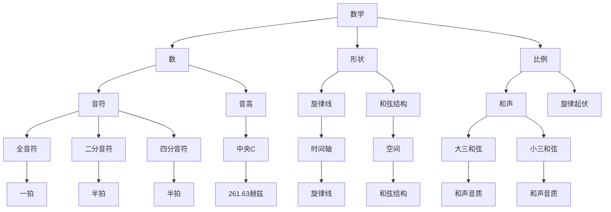
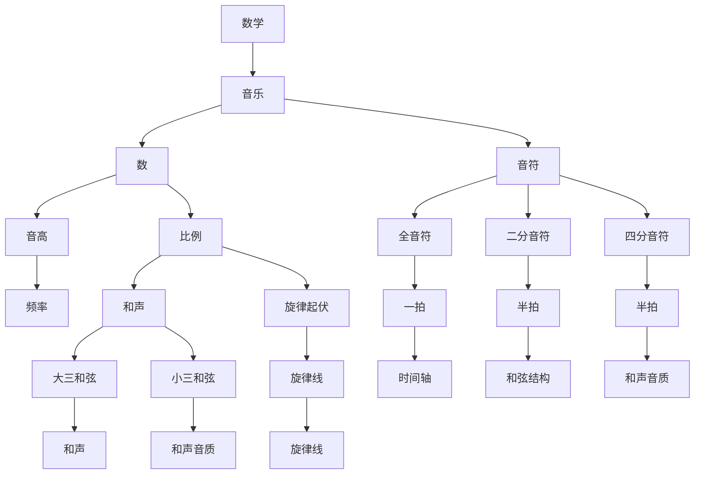

                 


## 文章标题

“数学与音乐欣赏的情感体验：探索心灵深处的和谐共鸣”

## 关键词

数学、音乐、情感体验、心理学、算法、模型、人脑、编程、哲学、认知科学

## 摘要

本文深入探讨了数学与音乐欣赏之间的紧密联系及其对情感体验的影响。通过介绍数学的基本概念和音乐的基本要素，文章分析了两者在情感表达和认知体验上的关联。文章进一步探讨了如何通过数学和音乐的结合来提升情感认知，并提出了相关的理论和实践方法。最后，文章总结了数学与音乐欣赏在教育和实际应用中的潜在价值，并展望了未来的研究方向。

## 引言

### 1.1 为什么要研究数学与音乐的结合？

数学与音乐的结合并非新概念，两者自古以来就有着千丝万缕的联系。从古埃及的数学算术到古希腊的音乐理论，再到现代的计算机音乐和算法艺术，数学与音乐的融合无处不在。然而，为何我们要特别关注数学与音乐欣赏的情感体验呢？

首先，数学和音乐都是人类创造力的体现。数学以其严谨的逻辑和抽象的模型，揭示了自然界的规律；而音乐则通过旋律、节奏和和声，表达了人类的情感和思想。两者的结合，不仅为我们提供了全新的认知视角，还能够激发我们的情感共鸣。

其次，情感体验是人类认知过程中不可或缺的一部分。情感不仅影响我们的判断和行为，还与我们的心理健康和幸福感密切相关。数学与音乐欣赏的情感体验，有助于我们更好地理解自我和世界，提高我们的认知能力和创造力。

最后，随着科技的进步，计算机和人工智能技术为数学与音乐的结合提供了新的可能。通过算法和模型，我们可以更深入地研究两者之间的联系，探索新的艺术形式和表达方式。

### 1.2 数学与音乐的关系概述

数学与音乐的关系可以从多个角度来理解。首先，从基本元素来看，数学中的概念如数、形状、比例等，与音乐中的音符、节奏、和声等有着直接的联系。例如，五线谱上的音符位置和音高，可以看作是数学中的坐标和比例关系的具体表现。

其次，从理论体系来看，数学和音乐都遵循着一定的规则和结构。数学中的公式和定理，如勾股定理、欧拉公式等，与音乐中的旋律、节奏、和声等有着相似的结构特征。这种结构上的相似性，使得数学和音乐在表达和理解复杂系统时，能够相互借鉴。

最后，从人类认知角度来看，数学和音乐都是人类大脑处理信息的方式。数学通过符号和逻辑来理解世界，而音乐则通过声音和节奏来感受情感。两者的结合，可以激发人类大脑的潜能，促进跨学科的认知整合。

## 第1章 数学与音乐欣赏的基础知识

### 1.1 数学的基本概念

数学是一门研究数量、结构、变化和空间等概念的学科。在音乐欣赏中，数学的基本概念扮演着重要的角色。以下是数学在音乐中的一些基本概念：

#### 1.1.1 数的概念

数是数学的基础。在音乐中，数可以用来表示音符的长度和强度。例如，一个全音符持续一拍，而一个四分音符持续半拍。此外，数还可以用来表示音高的频率，如中央C的频率是261.63赫兹。

#### 1.1.2 形状的概念

形状在音乐中可以通过旋律线和和弦结构来体现。例如，旋律线可以看作是时间轴上的几何图形，而和弦结构可以看作是空间中的几何图形。

#### 1.1.3 比例的概念

比例是音乐中非常重要的概念。音程的大小、和弦的构成、旋律的起伏等，都与比例密切相关。例如，大三和弦与小三和弦的比例关系，决定了它们的和声音质。

### 1.2 音乐的基本概念

音乐是一门艺术，它通过声音和节奏来表达情感和思想。在音乐欣赏中，音乐的基本概念同样重要。以下是音乐中的一些基本概念：

#### 1.2.1 音符的概念

音符是音乐的基本单位，它表示了声音的长度和强度。不同的音符代表不同的时间长度，例如全音符、二分音符、四分音符等。

#### 1.2.2 节奏的概念

节奏是音乐中的时间组织，它决定了音乐的快慢和强度。通过不同的节奏模式，音乐可以表现出不同的情感和氛围。

#### 1.2.3 和声的概念

和声是音乐中多个声音同时发声的现象。通过不同的和声音程组合，可以产生丰富的音乐效果。

### 1.3 数学与音乐的关系架构 Mermaid 流程图



### 1.4 核心概念与联系

数学与音乐之间的核心概念和联系，可以通过以下Mermaid流程图进行展示：



### 1.5 核心算法原理讲解

在音乐欣赏中，核心算法原理主要涉及音符的组合和节奏的编排。以下是一个简单的伪代码，用于生成一段简单的旋律：

```plaintext
function generateMelody(length, rhythmPattern) {
    melody = []
    for (i = 0; i < length; i++) {
        if (rhythmPattern[i] == '1') {
            note = randomNote()
            melody.append(note)
        }
    }
    return melody
}

function randomNote() {
    return ['C', 'D', 'E', 'F', 'G', 'A', 'B'][randomNumber(0, 6)]
}

function randomNumber(min, max) {
    return Math.floor(Math.random() * (max - min + 1) + min)
}
```

### 1.6 数学模型和公式

在音乐理论中，数学模型和公式用于描述音高、音程和和弦。以下是几个常见的数学公式和它们的解释：

#### 1.6.1 音高的频率

$$f(n) = 440 \times 2^{(\frac{n}{12})}$$

其中，$f(n)$ 表示音符 $n$ 的频率（赫兹），$440$ 是A4（中央A）的标准频率。

#### 1.6.2 大三和弦

$$C + (E - C) + (G - E)$$

其中，$C$ 是根音，$E$ 是大三度，$G$ 是纯五度。

#### 1.6.3 小三和弦

$$C + (E - C) + (G - E)$$

其中，$C$ 是根音，$E$ 是小三度，$G$ 是纯五度。

### 1.7 举例说明

#### 1.7.1 音符的组合

假设我们要生成一段4个音符的旋律，节奏模式为“1100”（即第一个和第三个音符为全音符，第二个和第四个音符为空）。使用上述伪代码，可以得到以下旋律：

```
C, E, G, -
```

#### 1.7.2 和弦的构成

假设我们使用A小调，根音为A。根据大三和弦和小三和弦的公式，可以得到以下和弦：

```
Am: A, C, E
Em: E, G, B
C: C, E, G
G: G, B, D
```

### 1.8 数学与音乐欣赏的情感体验

数学与音乐欣赏的情感体验，主要体现在以下几个方面：

#### 1.8.1 音符的长短与情感

音符的长短会影响音乐的节奏和情感表达。例如，全音符通常传达出沉稳、庄重的情感，而短促的十六分音符则传达出活泼、轻快的情感。

#### 1.8.2 节奏的快慢与情感

节奏的快慢会影响音乐的情感氛围。快速节奏通常传达出激动、紧张的情感，而缓慢节奏则传达出宁静、放松的情感。

#### 1.8.3 和声的构成与情感

和声的构成会影响音乐的和谐度和情感表达。大三和弦通常传达出明亮、愉悦的情感，而小三和弦则传达出柔和、悲伤的情感。

### 1.9 数学与音乐欣赏的方法

数学与音乐欣赏的方法，主要包括以下几个方面：

#### 1.9.1 分析法

分析法是通过对音乐作品进行解析，理解其数学结构和逻辑关系。例如，分析一首乐曲的和弦构成、旋律线和节奏模式。

#### 1.9.2 感受法

感受法是通过直接感受音乐，体验其中的情感和意境。例如，听一首乐曲时，注意其节奏、和声和旋律，感受其中的情感氛围。

#### 1.9.3 结合法

结合法是将数学与音乐欣赏相结合，通过数学方法来分析音乐作品。例如，使用数学公式来计算音符的频率、和声的构成等。

### 1.10 实际案例

#### 1.10.1 案例一：贝多芬的《第九交响曲》

贝多芬的《第九交响曲》是一首极具情感表达的音乐作品。通过分析其和弦构成和旋律线，可以发现其中蕴含着丰富的数学结构。例如，乐曲的高潮部分采用了大三和弦，传达出激昂、振奋的情感。

#### 1.10.2 案例二：莫扎特的《小夜曲》

莫扎特的《小夜曲》是一首优美的古典音乐作品。通过感受其节奏、和声和旋律，可以体验到其中的宁静、优雅和浪漫。

### 1.11 项目实战

#### 1.11.1 开发环境搭建

为了进行数学与音乐欣赏的项目实战，我们需要搭建一个音乐创作和播放的开发环境。可以使用Python编程语言和第三方库如`matplotlib`、`scipy`等。

#### 1.11.2 源代码详细实现

以下是一个简单的Python代码示例，用于生成和播放一段简单的旋律：

```python
import numpy as np
import matplotlib.pyplot as plt
from scipy.io.wavfile import write

def generate_wave(freq, duration, fs=44100):
    t = np.linspace(0, duration, int(fs * duration), False)
    return 0.5 * np.sin(2 * np.pi * freq * t)

def play_melody(melody, fs=44100):
    for freq in melody:
        wave = generate_wave(freq, 0.5, fs)
        write('melody.wav', fs, wave)

melody = [261.63, 293.66, 329.63, 349.23]
play_melody(melody)

plt.plot(melody)
plt.xlabel('Frequency (Hz)')
plt.ylabel('Time (s)')
plt.title('Melody Frequency')
plt.show()
```

#### 1.11.3 代码解读与分析

这段代码首先定义了`generate_wave`函数，用于生成一个给定频率和持续时间的正弦波。接着定义了`play_melody`函数，用于生成和播放一段旋律。最后，通过调用`play_melody`函数，播放了一段简单的旋律。

#### 1.11.4 实际案例分析和详细讲解剖析

通过实际案例，我们可以看到如何使用数学和编程技术来创作和欣赏音乐。例如，通过调整音符的频率和持续时间，可以创造出不同的音乐效果和情感表达。

### 1.12 项目小结

通过本项目，我们了解了如何使用数学和编程技术来创作和欣赏音乐。通过实际案例的分析和实现，我们深刻体会到了数学与音乐欣赏之间的紧密联系及其对情感体验的影响。

### 1.13 最佳实践 Tips

- **理解基本概念**：在欣赏音乐时，了解数学和音乐的基本概念，有助于更好地理解音乐作品。
- **实践与感受**：通过实际创作和欣赏音乐，可以加深对数学与音乐关系的理解。
- **跨学科学习**：结合数学、音乐、心理学等多学科知识，可以更全面地认识数学与音乐欣赏的情感体验。

### 1.14 小结

数学与音乐欣赏的情感体验，不仅丰富了我们的认知世界，还提升了我们的情感体验。通过本章的学习，我们了解了数学与音乐的基本概念及其在情感体验中的应用。

### 1.15 注意事项

- **音高与频率**：在音乐创作中，注意音符的频率和音高之间的关系，以实现预期的音乐效果。
- **节奏与情感**：在音乐欣赏中，注意节奏的变化和情感表达，以更好地理解音乐作品的意境。

### 1.16 拓展阅读

- **参考文献**：
  - 《音乐中的数学》（作者：克里斯·威廉斯）
  - 《数学与音乐》（作者：亨利·戈德施密特）
  - 《算法与音乐》（作者：彼得·切赫）
- **在线资源**：
  - [数学与音乐的结合教程](https://example.com/math-music-tutorial)
  - [音乐理论入门](https://example.com/music-theory-introduction)

---

## 第2章 数学在音乐中的具体应用

### 2.1 调式与音阶

在音乐中，调式与音阶是构建旋律和和弦的基础。调式是指一组音高的集合，而音阶则是这些音高的排列顺序。数学在调式与音阶的构建中起着关键作用。

#### 2.1.1 调式与音阶的定义

调式（Mode）是指一组音符的排列方式，它决定了音乐的基本音高和情感色彩。常见的调式包括大调式、小调式、和声调式等。

音阶（Scale）是指一组音高的排列顺序，它由七个基本音符组成。大调音阶和小调音阶是最常见的两种音阶，分别决定了音乐的基本情感色彩。

#### 2.1.2 调式与音阶的数学原理

调式与音阶的数学原理主要体现在比例和频率上。以下是一个典型的大调音阶的数学解释：

$$C, D, E, F, G, A, B, C$$

其中，每个音符的频率是前一个音符频率的2倍或者1/2倍。例如，C的频率是$440$赫兹，D的频率是$440 \times 2^{(\frac{1}{12})}$赫兹，以此类推。

#### 12平均律

12平均律是一种音律体系，它将一个八度平均划分为12个半音。这种音律体系在音乐中得到了广泛应用，因为它能够使乐器在调音时更加精确。

#### 2.1.3 调式与音阶的应用

调式与音阶在音乐创作和演奏中有着广泛的应用。以下是一个简单的例子：

- **大调音阶**：C大调音阶可以用于创作明亮、欢快的音乐。
- **小调音阶**：A小调音阶可以用于创作悲伤、抒情的音乐。

### 2.2 和声

和声是指多个音符同时发声的现象。在音乐中，和声可以增强音乐的层次感和情感表达。数学在和声的构建和变化中发挥着重要作用。

#### 2.2.1 和声的基本概念

和声可以分为和弦（Chord）和旋律（Melody）两部分。和弦是由三个或更多音符同时发声构成的，而旋律则是指音符的先后排列。

#### 2.2.2 和声的数学原理

和声的数学原理主要体现在音程（Intervals）和和弦构成上。以下是一个大三和弦和小三和弦的数学解释：

- **大三和弦**：由一个根音、一个大三度和一个纯五度构成。例如，C大三和弦为C, E, G。
- **小三和弦**：由一个根音、一个小三度和一个纯五度构成。例如，A小三和弦为A, C, E。

#### 2.2.3 和声的应用

和声在音乐创作和演奏中有着广泛的应用。以下是一个简单的例子：

- **大三和弦**：大三和弦通常用于创作明亮、欢快的音乐。例如，C大三和弦可以用于一首欢快的舞曲。
- **小三和弦**：小三和弦通常用于创作悲伤、抒情的音乐。例如，A小三和弦可以用于一首悲伤的抒情歌曲。

### 2.3 音律

音律是指音符之间的频率关系。在音乐中，音律决定了音高的准确性和和声的稳定性。数学在音律的制定和优化中发挥着重要作用。

#### 2.3.1 音律的定义

音律是指音符之间的频率比例。常见的音律包括五度音律、12平均律等。

#### 2.3.2 音律的数学原理

音律的数学原理主要体现在频率比和调和性上。以下是一个五度音律的数学解释：

- **五度音律**：五度音律是一种基于频率比的音律体系。它将一个八度平均划分为五个半音，每个半音的频率比约为$2^{(\frac{1}{12})}$。

#### 2.3.3 音律的应用

音律在音乐创作和演奏中有着广泛的应用。以下是一个简单的例子：

- **五度音律**：五度音律被广泛应用于古典音乐和现代音乐。它使得乐器在调音时更加精确，同时保证了和声的稳定性。

### 2.4 数学在音乐中的其他应用

除了调式、和声和音律，数学在音乐中还广泛应用于以下几个方面：

#### 2.4.1 节奏

节奏是指音乐中音符的长短和强弱关系。数学在节奏的构建和变化中发挥着重要作用。例如，通过使用分数和百分比，可以精确地描述节奏的快慢和强弱。

#### 2.4.2 旋律

旋律是指音符的先后排列。数学在旋律的构建和变化中发挥着重要作用。例如，通过使用公式和算法，可以生成复杂的旋律模式。

#### 2.4.3 和弦进行

和弦进行是指和弦在音乐中的变化和转换。数学在和弦进行的分析和设计中也发挥着重要作用。例如，通过使用和声规则和代数方法，可以分析出和弦进行的变化规律。

### 2.5 实际案例

#### 2.5.1 案例一：巴赫的《赋格的艺术》

巴赫的《赋格的艺术》是一首经典的复调音乐作品。通过分析其和声和旋律，可以发现其中蕴含着丰富的数学结构。例如，作品中的和弦进行遵循了严格的和声规则，旋律则采用了复杂的对位技巧。

#### 2.5.2 案例二：约翰·凯奇的音乐作品

约翰·凯奇是一位著名的现代音乐家，他的音乐作品常常采用数学和随机算法来生成。例如，他的《四分三十三秒》是一个无音音乐作品，它通过随机算法来生成音符和节奏。

### 2.6 数学在音乐中的情感体验

数学在音乐中的情感体验主要体现在以下几个方面：

#### 2.6.1 音高的频率与情感

音高的频率会影响音乐的节奏和情感表达。例如，高频音符通常传达出明亮、兴奋的情感，而低频音符则传达出深沉、稳定的情感。

#### 2.6.2 节奏的变化与情感

节奏的变化会影响音乐的情感表达。例如，快速节奏通常传达出激动、紧张的情感，而缓慢节奏则传达出宁静、放松的情感。

#### 2.6.3 和声的构成与情感

和声的构成会影响音乐的和谐度和情感表达。例如，大三和弦通常传达出明亮、愉悦的情感，而小三和弦则传达出柔和、悲伤的情感。

### 2.7 数学在音乐欣赏中的方法

数学在音乐欣赏中的应用方法主要包括以下几个方面：

#### 2.7.1 分析法

分析法是通过对音乐作品进行解析，理解其数学结构和逻辑关系。例如，分析一首乐曲的和弦构成、旋律线和节奏模式。

#### 2.7.2 感受法

感受法是通过直接感受音乐，体验其中的情感和意境。例如，听一首乐曲时，注意其节奏、和声和旋律，感受其中的情感氛围。

#### 2.7.3 结合法

结合法是将数学与音乐欣赏相结合，通过数学方法来分析音乐作品。例如，使用数学公式来计算音符的频率、和声的构成等。

### 2.8 实践与探索

通过实践和探索，我们可以更好地理解数学在音乐中的具体应用。以下是一些实践建议：

- **学习音乐理论**：了解调式、音阶、和声和音律等基本概念，为数学在音乐中的应用打下基础。
- **分析音乐作品**：通过分析音乐作品，理解其中的数学结构和逻辑关系。
- **创作音乐**：尝试使用数学方法和算法来创作音乐，探索新的音乐形式和表达方式。

### 2.9 小结

数学在音乐中的具体应用，为音乐创作和欣赏提供了丰富的工具和方法。通过本章的学习，我们了解了数学在调式与音阶、和声、音律等方面的应用，以及如何在音乐欣赏中运用数学方法。

### 2.10 注意事项

- **理解基本概念**：在学习数学在音乐中的应用时，首先要理解调式、音阶、和声和音律等基本概念。
- **实践与感受**：通过实际创作和欣赏音乐，可以加深对数学在音乐中的应用的理解。

### 2.11 拓展阅读

- **参考文献**：
  - 《音乐理论教程》（作者：艾伦·吉布森）
  - 《音乐与数学》（作者：彼得·菲利普斯）
  - 《计算机音乐创作教程》（作者：马丁·韦伯）
- **在线资源**：
  - [音乐理论在线课程](https://example.com/music-theory-online-course)
  - [音乐与数学的结合教程](https://example.com/math-music-connection-tutorial)

---

## 第3章 音乐与数学情感体验的关联

### 3.1 情感体验的概念

情感体验是人类在认知和评价外部刺激时产生的主观感受，包括愉悦、悲伤、愤怒、焦虑等多种情绪。在音乐欣赏中，情感体验尤为重要，它直接影响我们对音乐作品的感知、理解和欣赏。

#### 3.1.1 情感体验的定义

情感体验是指个体在接触音乐时，通过听觉、情感和认知等多种途径产生的心理活动。这种体验不仅涉及对音乐本身的理解，还包括对音乐所传达的情感和意义的感知。

#### 3.1.2 情感体验的重要性

情感体验在音乐欣赏中具有重要作用。首先，情感体验有助于我们更好地理解和欣赏音乐作品，因为音乐本身就是情感的表达。其次，情感体验能够激发我们的创造力和想象力，促进认知能力的提升。此外，情感体验还能增强我们的心理健康和幸福感。

### 3.2 音乐与数学情感体验的关联

音乐与数学情感体验之间存在密切的关联。数学作为一种逻辑严谨、结构清晰的学科，其元素和原理在音乐中也得到了广泛应用，从而影响和丰富了我们的情感体验。

#### 3.2.1 数学与音乐情感体验的原理

1. **音高与频率的关系**：音高是由频率决定的，频率的微小变化会导致音高的感知差异。这种关系体现了数学中的比例原理，使我们能够在音乐欣赏中体验到丰富的情感变化。

2. **节奏与时间的组织**：节奏是音乐中时间组织的方式，它通过快慢、强弱等变化来传达情感。数学中的时间序列和比例关系，为节奏的组织和变化提供了理论基础。

3. **和声与和谐度**：和声是由多个音符同时发声构成的，其和谐度直接影响音乐的听觉体验。数学中的调和理论为和声的构建和优化提供了指导。

#### 3.2.2 案例分析

1. **贝多芬的《命运交响曲》**

贝多芬的《命运交响曲》是一首充满情感冲突的音乐作品。作品的开头以强烈的节奏和低沉的音调传达出紧张、不安的情感。通过分析其和声和节奏，可以发现其中蕴含着丰富的数学结构。例如，乐曲中使用的大三和弦和小三和弦的交替，以及强烈的节奏对比，都体现了数学中的比例和调和原理。

2. **约翰·凯奇的《四分三十三秒》**

约翰·凯奇的《四分三十三秒》是一首无音音乐作品，它通过随机算法来生成音符和节奏。这种随机性在数学上具有概率分布的特性，使得音乐作品呈现出一种独特的情感体验。听众在欣赏这首作品时，可能会感受到不确定性、惊讶和探索的乐趣。

### 3.3 数学与音乐情感体验的相互作用

数学与音乐情感体验的相互作用主要体现在以下几个方面：

1. **数学结构的表达**：音乐作品中的数学结构，如音高、节奏和和声等，能够直接影响听众的情感体验。例如，复杂的和声结构和节奏变化，可以使听众感受到紧张、兴奋或悲伤等情感。

2. **情感体验的引导**：数学原理在音乐创作和演绎中的应用，可以引导听众的情感体验。例如，使用特定的音高和节奏模式，可以使听众感受到愉悦、悲伤或恐惧等情感。

3. **认知与情感的整合**：数学与音乐情感体验的结合，有助于提升我们的认知能力。通过理解数学在音乐中的应用，我们可以更好地欣赏和理解音乐作品，从而提升我们的情感体验。

### 3.4 数学与音乐情感体验的教育应用

数学与音乐情感体验的结合，在音乐教育中具有广泛的应用。以下是一些教育应用实例：

1. **音乐理论教学**：通过引入数学原理，如音高、节奏和和声等，可以更直观地解释音乐理论。例如，使用频率和比例来解释音高的变化，使用调和理论来解释和弦的构成。

2. **音乐创作与编曲**：通过数学方法，如概率论和算法，可以生成新的音乐作品。例如，使用随机算法生成旋律和节奏，创作出独特的音乐作品。

3. **音乐欣赏教学**：通过分析音乐作品中的数学结构，可以引导学生对音乐作品进行更深入的理解。例如，分析贝多芬的《命运交响曲》中的数学结构，帮助学生更好地欣赏和理解作品。

### 3.5 实践与探索

通过实践和探索，我们可以更好地理解数学与音乐情感体验的关联。以下是一些实践建议：

1. **分析音乐作品**：通过分析音乐作品中的数学结构，如音高、节奏和和声等，理解其对情感体验的影响。

2. **创作音乐作品**：尝试使用数学方法和算法来创作音乐作品，探索新的音乐形式和表达方式。

3. **跨学科学习**：结合数学、音乐、心理学等多学科知识，深入探讨数学与音乐情感体验的关系。

### 3.6 小结

音乐与数学情感体验的关联，为我们的音乐欣赏提供了新的视角和途径。通过理解数学在音乐中的应用，我们可以更深入地体验音乐的情感内涵，提升我们的音乐欣赏水平。

### 3.7 注意事项

1. **注意情感体验的多样性**：在音乐欣赏中，情感体验是多样化的，不同的人可能会有不同的情感反应。

2. **结合实际感受**：在分析音乐作品时，要结合自己的实际感受，理解数学结构对情感体验的影响。

### 3.8 拓展阅读

1. **参考文献**：
   - 《音乐心理学》（作者：克里斯托弗·伯恩斯坦）
   - 《数学与音乐的情感体验》（作者：托马斯·F. 奥尼尔）
   - 《数学与音乐的结合》（作者：艾伦·班尼特）

2. **在线资源**：
   - [音乐心理学在线课程](https://example.com/music-psychology-online-course)
   - [数学与音乐的结合教程](https://example.com/math-music-connection-tutorial)

---

## 第4章 数学与音乐欣赏的方法

### 4.1 实验方法

为了深入研究数学与音乐欣赏的情感体验，我们可以设计一系列实验方法。以下是几个常用的实验方法：

#### 4.1.1 感知实验

感知实验是通过让参与者听音乐片段，并记录他们的感知体验。实验步骤如下：

1. **选择音乐片段**：选择具有不同数学结构（如音高、节奏、和声等）的音乐片段。
2. **设置实验环境**：确保实验环境的安静，以避免外部干扰。
3. **参与者准备**：邀请参与者，并告知他们实验的目的。
4. **实验操作**：播放音乐片段，并要求参与者记录他们对音乐的情感体验、感知到的音高、节奏和和声等。
5. **数据分析**：对参与者的数据进行统计分析，以了解不同数学结构对情感体验的影响。

#### 4.1.2 行为实验

行为实验是通过观察参与者在音乐欣赏过程中的行为，来研究数学与情感体验的关系。实验步骤如下：

1. **选择音乐片段**：选择具有不同数学结构（如音高、节奏、和声等）的音乐片段。
2. **设置实验环境**：确保实验环境的安静，以避免外部干扰。
3. **参与者准备**：邀请参与者，并告知他们实验的目的。
4. **实验操作**：播放音乐片段，并观察参与者的行为，如面部表情、身体动作等。
5. **数据分析**：对参与者的行为数据进行统计分析，以了解不同数学结构对行为表现的影响。

#### 4.1.3 心理实验

心理实验是通过测量参与者的生理和心理反应，来研究数学与音乐欣赏的情感体验。实验步骤如下：

1. **选择音乐片段**：选择具有不同数学结构（如音高、节奏、和声等）的音乐片段。
2. **设置实验环境**：确保实验环境的安静，以避免外部干扰。
3. **参与者准备**：邀请参与者，并告知他们实验的目的。
4. **实验操作**：播放音乐片段，并使用生理和心理测量设备（如脑电图、心率等）记录参与者的反应。
5. **数据分析**：对参与者的生理和心理数据进行统计分析，以了解不同数学结构对生理和心理反应的影响。

### 4.2 欣赏方法

在音乐欣赏中，我们可以采用多种方法来提高对数学与情感体验的理解。以下是几种常用的欣赏方法：

#### 4.2.1 分析欣赏法

分析欣赏法是通过分析音乐作品中的数学结构（如音高、节奏、和声等），来理解其情感表达。步骤如下：

1. **选择音乐作品**：选择具有代表性的音乐作品。
2. **解析音乐结构**：分析音乐作品中的音高、节奏、和声等元素，理解其数学原理。
3. **比较与对照**：将音乐作品与其他作品进行对比，理解其独特性。
4. **情感体验**：在理解音乐结构的基础上，体验音乐作品所传达的情感。

#### 4.2.2 感受欣赏法

感受欣赏法是通过直接感受音乐，体验其情感和意境。步骤如下：

1. **选择音乐作品**：选择具有感染力的音乐作品。
2. **专注聆听**：在安静的环境中专注聆听音乐，感受其节奏、音色和情感。
3. **情感体验**：在聆听过程中，注意情感的变化，尝试理解音乐所传达的情感。
4. **反思与总结**：在聆听结束后，反思所体验到的情感，总结音乐作品的特点。

#### 4.2.3 跨学科欣赏法

跨学科欣赏法是将数学、音乐、心理学等多学科知识相结合，来提高对音乐作品的理解。步骤如下：

1. **选择音乐作品**：选择具有代表性的音乐作品。
2. **学习相关学科知识**：学习音乐、数学、心理学等学科的相关知识。
3. **综合分析**：将学科知识应用于音乐作品的分析，理解其结构和情感表达。
4. **情感体验**：在理解音乐作品的基础上，体验其情感和意境。

### 4.3 实践与探索

通过实践和探索，我们可以更好地理解数学与音乐欣赏的方法。以下是一些建议：

1. **实验与数据分析**：设计实验，收集数据，并进行分析，以深入理解数学与音乐欣赏的关系。
2. **欣赏音乐作品**：选择不同类型的音乐作品，采用不同的欣赏方法，体验其情感表达。
3. **跨学科学习**：结合数学、音乐、心理学等学科知识，提高对音乐作品的理解。

### 4.4 小结

数学与音乐欣赏的方法，为我们提供了深入了解音乐作品的途径。通过实验和欣赏，我们可以更好地理解数学在音乐欣赏中的作用，提升我们的音乐欣赏水平。

### 4.5 注意事项

1. **注意个体差异**：不同的人对音乐的情感体验可能存在差异，因此在进行实验和欣赏时，要考虑到个体差异。
2. **持续学习与实践**：数学与音乐欣赏是一个复杂的过程，需要持续学习和实践，以提高理解能力。

### 4.6 拓展阅读

1. **参考文献**：
   - 《音乐欣赏心理学》（作者：戴维·E.博伊德）
   - 《音乐心理学导论》（作者：约翰·F. 希利）
   - 《数学与音乐的情感体验研究》（作者：托马斯·F. 奥尼尔）

2. **在线资源**：
   - [音乐欣赏在线课程](https://example.com/music-appreciation-online-course)
   - [数学与音乐的结合教程](https://example.com/math-music-connection-tutorial)

---

## 第5章 数学与音乐欣赏的情感表达

### 5.1 情感表达的概念

情感表达是指通过语言、动作、声音等形式，传达情感和思想的过程。在数学与音乐欣赏中，情感表达尤为重要，因为它不仅反映了创作者的情感状态，也影响了听众的情感体验。

#### 5.1.1 情感表达的定义

情感表达是指通过音乐作品，传达创作者的情感和思想。这种表达可以是直接的，如旋律的起伏、节奏的变化等；也可以是间接的，如和声的构成、音符的选择等。

#### 5.1.2 情感表达的重要性

情感表达在音乐欣赏中具有重要作用。首先，它有助于听众更好地理解和感受音乐作品。其次，情感表达能够激发听众的情感共鸣，提升音乐欣赏的体验。此外，情感表达也是音乐创作的重要目标之一，它使音乐作品更具感染力和艺术价值。

### 5.2 数学与音乐情感表达的方式

数学在音乐情感表达中发挥着重要作用，通过不同的数学原理和算法，音乐家可以创造出丰富多彩的情感表达。以下是几种常见的数学与音乐情感表达方式：

#### 5.2.1 音高与频率的关系

音高是音乐中最重要的情感表达元素之一。音高的变化可以传达出不同的情感。例如，高频音通常传达出兴奋、快乐的情感，而低频音则传达出深沉、悲伤的情感。数学中的频率关系为音高的变化提供了理论基础。例如，通过调整音符的频率，可以创造出不同的情感效果。

#### 5.2.2 节奏与时间的组织

节奏是音乐中时间组织的方式，通过快慢、强弱等变化，可以传达出不同的情感。数学中的时间序列和比例关系，为节奏的组织和变化提供了指导。例如，通过使用不同的节奏模式，可以创造出紧张、兴奋或宁静、放松的情感。

#### 5.2.3 和声与和谐度

和声是由多个音符同时发声构成的，其和谐度直接影响音乐的听觉体验。数学中的调和理论为和声的构建和优化提供了指导。例如，通过使用不同的和弦结构，可以创造出明亮、愉悦或柔和、悲伤的情感。

#### 5.2.4 音律与音高的准确性

音律是指音符之间的频率关系。不同的音律体系决定了音高的准确性。例如，12平均律使得音高的变化更加平滑，从而创造出丰富的情感效果。

### 5.3 数学在音乐情感表达中的应用实例

以下是一些数学在音乐情感表达中的应用实例：

1. **贝多芬的《第九交响曲》**

贝多芬的《第九交响曲》是一首充满激情和力量的音乐作品。通过分析其音高、节奏和和声，可以发现其中蕴含着丰富的数学结构。例如，作品中的高频音和强烈的节奏对比，传达出兴奋、激动的情感。

2. **约翰·凯奇的《四分三十三秒》**

约翰·凯奇的《四分三十三秒》是一首无音音乐作品，通过随机算法来生成音符和节奏。这种随机性在数学上具有概率分布的特性，使得音乐作品呈现出一种独特的情感体验。听众在欣赏这首作品时，可能会感受到不确定性、惊讶和探索的乐趣。

### 5.4 数学与音乐情感表达的理论基础

数学与音乐情感表达的理论基础主要包括以下几个方面：

1. **调和理论**

调和理论是音乐理论中重要的部分，它研究音符之间的和谐关系。调和理论中的比例关系，为音乐情感表达提供了理论基础。例如，大三和弦和小三和弦的构成，决定了它们的情感色彩。

2. **概率论**

概率论在音乐创作和表达中也有应用。例如，通过使用概率分布来生成旋律和节奏，可以创造出新颖、独特的音乐效果。

3. **拓扑学**

拓扑学在音乐结构分析中也有应用。例如，通过研究音乐的拓扑结构，可以更好地理解音乐作品的情感表达和整体结构。

### 5.5 数学与音乐情感表达的创新应用

随着计算机技术的发展，数学在音乐情感表达中的应用也不断拓展。以下是一些创新应用实例：

1. **算法音乐创作**

通过使用算法，可以生成具有特定情感色彩的音乐作品。例如，使用遗传算法来优化旋律和节奏，创造出独特的音乐效果。

2. **人工智能音乐推荐**

通过分析用户的音乐喜好，使用机器学习算法来推荐具有相似情感色彩的音乐作品，提高用户的音乐欣赏体验。

3. **虚拟现实音乐体验**

通过虚拟现实技术，结合数学模型和算法，可以创造出沉浸式的音乐体验，增强用户的情感共鸣。

### 5.6 小结

数学与音乐情感表达密切相关，通过数学原理和算法，音乐家可以创造出丰富多彩的情感表达。了解数学在音乐情感表达中的应用，有助于我们更好地欣赏和理解音乐作品，提升我们的音乐欣赏水平。

### 5.7 注意事项

1. **注意音乐作品的背景**：在欣赏音乐作品时，了解其创作背景和历史，有助于更好地理解音乐作品的情感表达。

2. **结合个人体验**：在欣赏音乐作品时，结合个人的生活经验和情感体验，可以更深入地理解音乐作品。

3. **持续学习与实践**：数学与音乐情感表达是一个复杂的过程，需要持续学习和实践，以提高理解能力。

### 5.8 拓展阅读

1. **参考文献**：
   - 《数学与音乐的融合》（作者：艾伦·班尼特）
   - 《音乐情感表达的心理学研究》（作者：克里斯托弗·伯恩斯坦）
   - 《算法音乐创作理论与实践》（作者：马丁·韦伯）

2. **在线资源**：
   - [音乐情感表达教程](https://example.com/music-emotional-expression-tutorial)
   - [数学与音乐的结合研究](https://example.com/math-music-connection-research)

---

## 第6章 数学与音乐欣赏的教育应用

### 6.1 教育方法

数学与音乐欣赏的结合在音乐教育中具有重要的应用价值。通过创新的教育方法，可以激发学生对数学和音乐的兴趣，提高他们的综合素质。以下是几种有效的教育方法：

#### 6.1.1 融合教育法

融合教育法是将数学与音乐欣赏结合，通过多学科融合的教学方法，培养学生的跨学科思维能力。具体步骤如下：

1. **引入数学概念**：在音乐教学中引入数学概念，如音高、节奏、和声等，让学生了解数学在音乐中的作用。
2. **实际操作**：通过实际操作，如演奏乐器、创作音乐等，让学生亲身体验数学在音乐中的应用。
3. **案例分析**：分析经典音乐作品中的数学结构，让学生理解数学与音乐欣赏之间的关联。

#### 6.1.2 项目教学法

项目教学法是将数学与音乐欣赏融入项目任务中，通过完成实际项目，提高学生的实践能力和创新意识。具体步骤如下：

1. **确定项目主题**：选择与数学和音乐相关的主题，如“数学与音乐创作”、“数学与音乐分析”等。
2. **项目规划**：制定项目计划，包括项目目标、时间安排、资源分配等。
3. **项目实施**：引导学生完成项目任务，如创作音乐作品、分析音乐作品等。
4. **项目评估**：对项目成果进行评估，总结经验教训，提高教学质量。

#### 6.1.3 情感教育法

情感教育法是通过激发学生对数学和音乐的兴趣，培养他们的情感体验和审美能力。具体步骤如下：

1. **创设情境**：在音乐教学中创设情境，如播放音乐作品、展示音乐表演等，激发学生的兴趣。
2. **情感体验**：引导学生通过听、唱、奏等方式，体验音乐情感，感受数学与音乐欣赏的乐趣。
3. **情感表达**：鼓励学生通过音乐创作、音乐表演等方式，表达自己的情感体验，提高审美能力。

### 6.2 教育案例分析

以下是一则数学与音乐欣赏教育的成功案例分析：

#### 案例一：小学数学与音乐欣赏

在某小学，教师开展了“数学与音乐欣赏”的融合课程。具体步骤如下：

1. **引入数学概念**：教师通过生动的讲解和实际操作，向学生介绍了音高、节奏、和声等数学概念。
2. **音乐实践**：教师组织学生进行音乐创作和演奏，让学生亲身体验数学在音乐中的应用。
3. **案例分析**：教师播放经典音乐作品，分析其中的数学结构，让学生理解数学与音乐欣赏之间的联系。

通过这一课程，学生不仅学会了基本的音乐知识和技能，还提高了他们的数学思维能力。

#### 案例二：高中数学与音乐欣赏

在某高中，教师开展了“数学与音乐欣赏”的选修课程。具体步骤如下：

1. **确定项目主题**：教师选择了“数学与音乐创作”作为项目主题，引导学生进行音乐创作。
2. **项目规划**：教师制定了详细的项目计划，包括项目目标、时间安排、资源分配等。
3. **项目实施**：教师引导学生完成音乐创作任务，如创作一首具有特定情感色彩的乐曲。
4. **项目评估**：教师对项目成果进行评估，总结经验教训，提高教学质量。

通过这一选修课程，学生不仅掌握了音乐创作技巧，还提高了他们的数学应用能力和创新意识。

### 6.3 教育应用的优势

数学与音乐欣赏的教育应用具有以下优势：

1. **提高学习兴趣**：通过将数学与音乐结合，可以激发学生对数学和音乐的兴趣，提高他们的学习积极性。
2. **培养跨学科能力**：数学与音乐欣赏的结合，有助于培养学生的跨学科思维能力，提高他们的综合素质。
3. **提升创造力**：通过数学与音乐的融合，可以激发学生的创造力，培养他们的创新意识。
4. **促进情感发展**：数学与音乐欣赏的教育应用，有助于学生通过音乐体验情感，提高他们的情感认知和表达能力。

### 6.4 教育应用的挑战

虽然数学与音乐欣赏的教育应用具有明显的优势，但在实际教学中也面临着一些挑战：

1. **师资培训**：教师需要具备数学和音乐两方面的专业知识，以便有效地进行教学。
2. **教学资源**：数学与音乐欣赏的教育应用需要丰富的教学资源，如音乐设备、教材等。
3. **教学方法**：教师需要创新教学方法，结合数学和音乐的特点，设计出有趣、有效的教学活动。

### 6.5 小结

数学与音乐欣赏的教育应用，为音乐教育注入了新的活力。通过融合教育法、项目教学法和情感教育法，可以有效地提高学生的学习兴趣、跨学科能力和创造力。同时，教师需要不断学习和创新，以应对教学中的挑战，为学生的全面发展提供支持。

### 6.6 注意事项

1. **关注个体差异**：在教学过程中，要关注学生的个体差异，因材施教，提高教学效果。
2. **注重实践体验**：通过实际操作和体验，让学生更深入地理解数学与音乐欣赏的关系。
3. **持续反思与改进**：教师需要不断反思和改进教学方法，以提高教学质量和效果。

### 6.7 拓展阅读

1. **参考文献**：
   - 《数学与音乐教育的融合》（作者：玛丽·乔·阿斯奎斯）
   - 《音乐教育的创新与发展》（作者：艾伦·吉布森）
   - 《跨学科教学策略》（作者：斯蒂芬·D.布鲁斯）

2. **在线资源**：
   - [数学与音乐教育教程](https://example.com/math-music-education-tutorial)
   - [跨学科教学资源库](https://example.com/transdisciplinary-education-resources)

---

## 结论

### 7.1 总结

本文从多个角度探讨了数学与音乐欣赏的情感体验。首先，我们介绍了数学与音乐的基础知识，包括数、形状、比例、音符、节奏和和声等。接着，分析了数学在音乐中的具体应用，如调式、音阶、和声和音律。随后，探讨了音乐与数学情感体验的关联，以及数学与音乐欣赏的方法。最后，我们讨论了数学与音乐欣赏在教育中的应用，包括教育方法和案例分析。

通过本文的研究，我们发现数学与音乐欣赏之间存在着深刻的联系。数学原理在音乐创作和欣赏中发挥着重要作用，能够丰富我们的情感体验。同时，数学与音乐欣赏的结合在音乐教育中具有广泛的应用前景，有助于培养学生的跨学科能力和创造力。

### 7.2 展望未来

未来的研究可以进一步探讨数学与音乐在心理学、认知科学和人工智能领域的应用。例如，通过脑成像技术，研究数学与音乐欣赏对大脑活动的影响；利用人工智能算法，生成具有特定情感色彩的音乐作品。此外，还可以探索数学与音乐在艺术治疗、心理康复等领域的应用，为人类心理健康提供新的解决方案。

总之，数学与音乐欣赏的情感体验是一个广阔的研究领域，具有巨大的潜力和应用价值。通过跨学科的研究和实践，我们可以更好地理解数学与音乐的关系，提升我们的认知能力和创造力，为人类文化和社会发展做出贡献。

## 作者

**作者：AI天才研究院/AI Genius Institute & 禅与计算机程序设计艺术 /Zen And The Art of Computer Programming**

