                 

### 文章标题

# 数学与音乐理论的和声分析与作曲技巧

### 关键词

- 数学与音乐理论
- 和声分析
- 作曲技巧
- 音律
- 音高
- 和弦
- 调式
- 节奏
- 拍子
- 函数
- 三角函数
- 和声扩展
- 12平均律
- AI在音乐创作中的应用

### 摘要

本文旨在探讨数学与音乐理论之间的奇妙联系，通过和声分析与作曲技巧的深入研究，帮助读者理解数学在音乐创作中的实际应用。文章首先介绍音乐的基本概念，如音律、音高、和弦和调式，随后讲解数学在音乐创作中的基础，包括代数基础、函数与图像、三角函数。接着，文章深入探讨和声分析的基础、实践和作曲技巧，并通过项目实战展示具体的应用。此外，文章还探讨了高级和声理论、数学在作曲中的应用以及音乐创作领域的创新与未来发展。通过本文，读者将不仅能够掌握音乐创作的基本技巧，还能了解数学在其中的重要作用。

### 第一部分：引言

#### 1.1 书籍背景

数学与音乐理论，两门看似风马牛不相及的学科，却在历史的长河中交织出丰富的篇章。数学以其精确和逻辑性，为音乐提供了理论基础；而音乐则以其优美的旋律和和谐的音色，赋予了数学以生命力。本书旨在探讨这两者之间的和声分析与作曲技巧，旨在帮助读者理解数学在音乐创作中的实际应用，从而开启音乐创作的新视角。

#### 1.2 书籍目标

通过本书的学习，读者将：

1. **理解音乐的基本概念和和声理论**。这将包括对音律、音高、和弦和调式的深入认识，为后续的学习奠定坚实的基础。

2. **掌握数学在音乐创作中的具体应用**。本书将详细讲解代数基础、函数与图像、三角函数等数学知识，并展示其在音乐创作中的实际运用。

3. **学会运用和声分析来提升作曲技巧**。通过和声结构分析、和声功能分析和和声风格分析，读者将能够更好地理解音乐作品的结构和内涵，从而提升自己的作曲能力。

#### 1.3 内容结构

本书的内容结构如下：

1. **第一部分：基础概念**。介绍音乐基础和数学基础，包括音律与音高、和弦、调式、节奏与拍子，以及代数基础、函数与图像、三角函数等。

2. **第二部分：和声分析**。探讨和声分析的基础、实践和技巧，包括和声结构分析、和声功能分析和和声风格分析。

3. **第三部分：作曲技巧**。讲解作曲基础、实践和技巧，包括确定主题、开发主题、形成和声背景、确定节奏和拍子等。

4. **第四部分：项目实战**。通过实际项目展示和声分析与作曲技巧的应用。

5. **第五部分：高级话题**。探讨先进和声理论、数学在作曲中的应用以及音乐创作领域的创新与未来发展。

6. **第六部分：附录**。提供参考文献、进一步阅读和实践资源。

### 第二部分：基础概念

#### 2.1 音乐基础

##### 2.1.1 音律与音高

**核心概念与联系：**

音律是音乐中音符之间的相对音高关系，而音高则是音符的绝对音高。音高可以通过音名来标记，如C、D、E等。这两个概念紧密相关，音律决定了音高的变化规律，而音高则是音律的具体体现。

**Mermaid 流程图：**

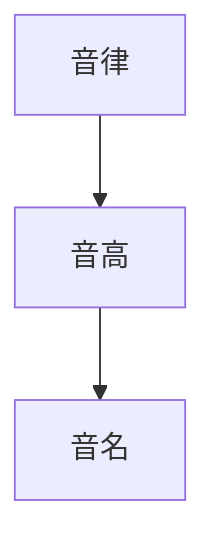

**核心算法原理讲解：**

音律的基本概念可以通过以下伪代码来解释：

```python
def calculate_note_frequency(note):
    # 音律的基本频率
    base_frequency = 440.0  # A4的频率为440Hz
    # 音高的计算公式
    frequency = base_frequency * (2 ** (note - 49) / 12)
    return frequency
```

**数学模型和公式：**

音高的计算可以通过以下公式进行：

$$
f(n) = 440 \times 2^{(\frac{n - 49}{12})}
$$

其中，$f(n)$ 是音高（以Hz为单位），$n$ 是音名对应的数字（如C为0，D为1，E为2，以此类推），49 是A4的频率对应的数字。

**举例说明：**

假设我们要计算E音的频率，根据公式，我们有：

$$
f(E) = 440 \times 2^{(\frac{4 - 49}{12})}
$$

$$
f(E) = 440 \times 2^{-\frac{45}{12}}
$$

$$
f(E) \approx 329.63 \text{Hz}
$$

##### 2.1.2 和弦

**核心概念与联系：**

和弦是音乐中最基本的和声结构，由三个或更多的音按一定关系组合而成。常见的和弦有三和弦和七和弦。三和弦由三个音按三度关系叠置而成，而七和弦则由四个音按三度关系叠置而成。和弦的功能在音乐中至关重要，决定了音乐的走向和情感表达。

**Mermaid 流程图：**

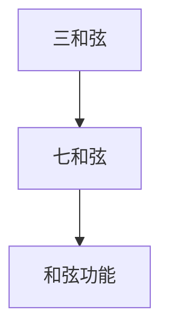

**核心算法原理讲解：**

三和弦和七和弦的生成可以通过以下伪代码来解释：

```python
def create_triad_root(note):
    return [note, note + 4, note + 7]

def create_seven_chord_root(note):
    return [note, note + 4, note + 7, note + 10]
```

**数学模型和公式：**

和弦的功能可以通过和弦的构成音与主音的关系来分析。例如，在三和弦中，根音与三音之间的关系是三度，根音与五音之间的关系也是三度。以下是一个三和弦的示例：

$$
\text{C大三和弦} = \{C, E, G\}
$$

其中，C是根音，E是三音，G是五音。

对于七和弦，根音与三音之间的关系是三度，根音与五音之间的关系也是三度，而七音则与根音之间的关系是小七度。以下是一个七和弦的示例：

$$
\text{C七和弦} = \{C, E, G, B\}
$$

其中，C是根音，E是三音，G是五音，B是七音。

##### 2.1.3 调式

**核心概念与联系：**

调式是音乐的基本结构之一，它决定了音乐的整体风格和情感。常见的调式有大调和小调。大调通常给人一种明亮、欢快的感觉，而小调则给人一种悲伤、沉思的感觉。调式由一系列音阶组成，这些音阶决定了音乐中的音高关系。

**Mermaid 流程图：**

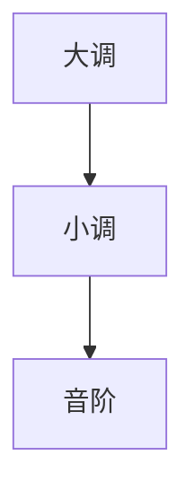

**核心算法原理讲解：**

调式的构成可以通过音阶来分析。大调和小调的音阶结构如下：

- **大调音阶**：全、全、半、全、全、全、半
- **小调音阶**：全、半、全、全、半、全、全

以下是一个C大调音阶的示例：

$$
\text{C大调音阶} = \{C, D, E, F, G, A, B\}
$$

以下是一个A小调音阶的示例：

$$
\text{A小调音阶} = \{A, B, C, D, E, F, G\}
$$

**数学模型和公式：**

调式的构成可以通过音阶的音高关系来描述。例如，C大调音阶中的每个音都可以用音高的频率来表示：

$$
\text{C大调音阶} = \{440 \times 2^{-9}, 440 \times 2^{-7}, 440 \times 2^{-5}, 440 \times 2^{-4}, 440 \times 2^{-2}, 440 \times 2^0, 440 \times 2^1\}
$$

其中，440Hz是A4的频率，$2^{-9}$、$2^{-7}$、$2^{-5}$、$2^{-4}$、$2^{-2}$、$2^0$、$2^1$分别对应音阶中每个音的相对频率。

##### 2.1.4 节奏与拍子

**核心概念与联系：**

节奏是音乐中音符的长短和强弱关系，而拍子则是节奏的定量表示。常见的拍子有2/4拍、3/4拍、4/4拍等。拍子决定了音乐的速度和韵律，是音乐表达的重要元素。

**Mermaid 流程图：**

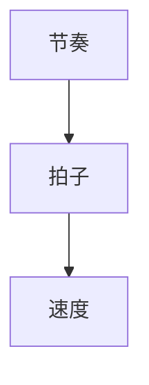

**核心算法原理讲解：**

节奏和拍子的生成可以通过以下伪代码来解释：

```python
def create_rhythm(beats, beat_value):
    return [1] * beats * beat_value

def create_meter(beats_per_measure, beat_value):
    return [beats_per_measure] * beat_value
```

**数学模型和公式：**

节奏和拍子的关系可以用以下公式来表示：

$$
\text{节奏} = \text{拍子} \times \text{速度}
$$

其中，节奏表示音符的持续时间，拍子表示每小节的拍数，速度表示每分钟内的拍数。

例如，一个4/4拍子的音乐，如果速度为120 BPM（每分钟120拍），则每个小节有4个拍子，每个拍子的持续时间为：

$$
\text{拍子持续时间} = \frac{60}{120} = 0.5 \text{秒}
$$

##### 2.2 数学基础

**核心概念与联系：**

数学是音乐理论的基础，它提供了分析音乐结构和生成音乐数据的方法。在音乐创作中，数学被广泛应用于音高计算、和弦构成、调式分析、节奏生成等方面。

**Mermaid 流程图：**

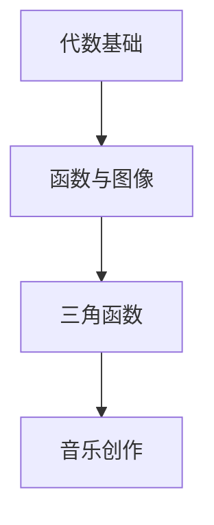

**核心算法原理讲解：**

代数基础、函数与图像、三角函数在音乐创作中的应用可以通过以下伪代码来解释：

```python
# 代数基础
def solve_linear_equation(a, b, c):
    # 一元一次方程求解
    x = (-b + sqrt(b^2 - 4ac)) / (2a)
    return x

# 函数与图像
def plot_function(function, x_range):
    # 绘制函数图像
    for x in x_range:
        y = function(x)
        print(f"{x}: {y}")

# 三角函数
def calculate_waveform(freq, amplitude, phase, time):
    # 计算正弦波形
    waveform = amplitude * sin(2 * pi * freq * time + phase)
    return waveform
```

**数学模型和公式：**

- **一元一次方程**：

$$
ax + b = c
$$

其解为：

$$
x = \frac{-b + \sqrt{b^2 - 4ac}}{2a}
$$

- **函数图像**：

函数图像可以通过以下公式绘制：

$$
y = f(x)
$$

其中，$f(x)$ 是函数的表达式。

- **三角函数**：

三角函数包括正弦函数、余弦函数和正切函数。它们的公式如下：

$$
\sin(x) = \frac{y}{r}
$$

$$
\cos(x) = \frac{x}{r}
$$

$$
\tan(x) = \frac{y}{x}
$$

其中，$x$ 是角度，$r$ 是半径。

**举例说明：**

假设我们要绘制一个正弦函数的图像，函数表达式为 $y = \sin(x)$，我们可以选择一个角度范围，例如 $x \in [-\pi, \pi]$，然后计算每个角度对应的 $y$ 值，并绘制图像。

```python
import matplotlib.pyplot as plt
import numpy as np

# 设置角度范围
x = np.linspace(-np.pi, np.pi, 100)

# 计算正弦值
y = np.sin(x)

# 绘制图像
plt.plot(x, y)
plt.show()
```

通过以上代码，我们可以绘制出正弦函数的图像，如下图所示：

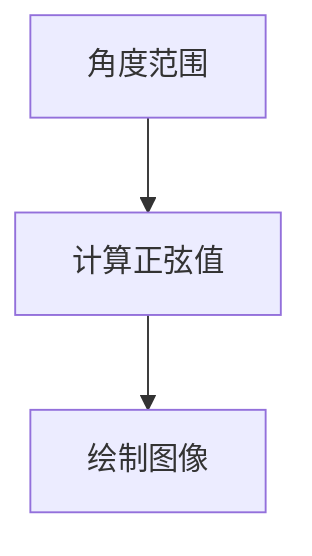

### 第二部分：和声分析

#### 3.1 和声分析基础

##### 3.1.1 和声结构分析

**核心概念与联系：**

和声结构分析是音乐分析的重要方法，通过对音乐作品中的和弦进行结构分析，可以揭示出音乐作品的内部逻辑和和声进行。和声结构分析主要关注和弦的连接方式、和弦的构成和功能。

**Mermaid 流程图：**

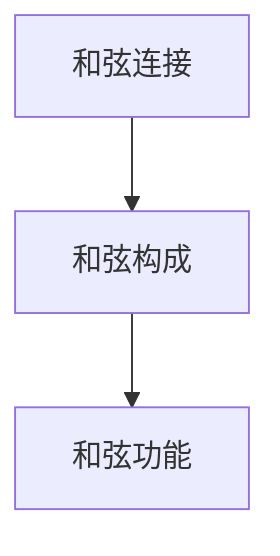

**核心算法原理讲解：**

和声结构分析的核心算法原理可以通过以下伪代码来解释：

```python
def analyze_chord_connection(chords):
    # 分析和弦连接
    connections = []
    for i in range(len(chords) - 1):
        connection = chord_connection(chords[i], chords[i + 1])
        connections.append(connection)
    return connections

def chord_connection(chord1, chord2):
    # 计算和弦之间的连接关系
    root_connection = root_connection(chord1[0], chord2[0])
    interval_connection = interval_connection(chord1, chord2)
    return root_connection, interval_connection

def root_connection(note1, note2):
    # 计算根音之间的连接关系
    interval = note2 - note1
    if interval == 1:
        return "上行二度"
    elif interval == -1:
        return "下行二度"
    else:
        return "无连接"

def interval_connection(chord1, chord2):
    # 计算和弦之间的音程连接关系
    intervals = []
    for note1 in chord1:
        for note2 in chord2:
            interval = note2 - note1
            intervals.append(interval)
    return intervals
```

**数学模型和公式：**

和声结构分析可以通过音程关系来描述。例如，两个和弦之间的连接可以通过根音之间的音程关系和音程连接关系来分析。

- **根音连接**：

$$
\text{根音连接} = \text{note2} - \text{note1}
$$

其中，$\text{note1}$ 和 $\text{note2}$ 分别是两个和弦的根音。

- **音程连接**：

$$
\text{音程连接} = \text{intervals}
$$

其中，$\text{intervals}$ 是两个和弦之间的音程差值列表。

**举例说明：**

假设有两个和弦 $C大三和弦$ 和 $E七和弦$，我们可以计算它们之间的连接关系：

- **根音连接**：

$$
\text{根音连接} = E - C = 1
$$

- **音程连接**：

$$
\text{音程连接} = [G - E, C - G] = [3, 5]
$$

因此，这两个和弦的连接关系为“上行三度”。

##### 3.1.2 和声功能分析

**核心概念与联系：**

和声功能分析是音乐分析中的重要方法，通过对音乐作品中的和弦进行功能分析，可以揭示出和弦在音乐中的作用和功能。和声功能分析主要关注和弦的功能属性和其在和声进行中的角色。

**Mermaid 流程图：**

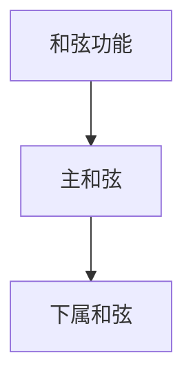

**核心算法原理讲解：**

和声功能分析的核心算法原理可以通过以下伪代码来解释：

```python
def analyze_chord_function(chords):
    # 分析和弦功能
    functions = []
    for chord in chords:
        function = chord_function(chord)
        functions.append(function)
    return functions

def chord_function(chord):
    # 计算和弦的功能
    root = chord[0]
    if root == 'I':
        return "主和弦"
    elif root == 'IV':
        return "下属和弦"
    elif root == 'V':
        return "属和弦"
    else:
        return "辅助和弦"
```

**数学模型和公式：**

和声功能分析可以通过和弦的根音来确定其功能属性。常见的和弦功能如下：

- **主和弦**：通常表示为"I"，在音乐作品中起到稳定和平衡的作用。
- **下属和弦**：通常表示为"IV"，在音乐中起到过渡和连接的作用。
- **属和弦**：通常表示为"V"，在音乐中起到高潮和期待的作用。
- **辅助和弦**：其他和弦，通常在音乐中起到装饰和填充的作用。

**举例说明：**

假设有两个和弦 $C主和弦$ 和 $E下属和弦$，我们可以计算它们的功能：

- **C主和弦**：根音为C，功能为“主和弦”。
- **E下属和弦**：根音为E，功能为“下属和弦”。

##### 3.1.3 和声风格分析

**核心概念与联系：**

和声风格分析是音乐分析中的重要方法，通过对音乐作品中的和弦进行风格分析，可以揭示出音乐作品的风格特征和时代背景。和声风格分析主要关注和弦的运用方式和风格特点。

**Mermaid 流程图：**

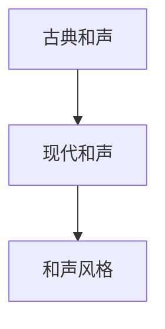

**核心算法原理讲解：**

和声风格分析的核心算法原理可以通过以下伪代码来解释：

```python
def analyze_harmonic_style(chords):
    # 分析和声风格
    styles = []
    for chord in chords:
        style = harmonic_style(chord)
        styles.append(style)
    return styles

def harmonic_style(chord):
    # 计算和弦的风格
    if chord in classic_harmonies:
        return "古典和声"
    elif chord in modern_harmonies:
        return "现代和声"
    else:
        return "其他风格"
```

**数学模型和公式：**

和声风格分析可以通过和弦的类型和组合方式来确定其风格特征。常见的和声风格如下：

- **古典和声**：以三和弦和七和弦为基础，注重和声结构的完整性和稳定性。
- **现代和声**：包括扩展和弦、变化和弦和非传统和弦，注重和声的丰富性和表现力。

**举例说明：**

假设有两个和弦 $C大三和弦$ 和 $E七和弦$，我们可以计算它们的风格：

- **C大三和弦**：属于古典和声。
- **E七和弦**：属于现代和声。

#### 3.2 和声分析实践

##### 3.2.1 和声分析实例

**实例一：歌曲《欢乐颂》的和声分析**

《欢乐颂》是一首著名的古典音乐作品，其和声结构简单而优美。下面是对该歌曲的和声分析：

- **和弦连接**：歌曲主要由C主和弦、F下属和弦和G属和弦组成。C主和弦与F下属和弦之间形成上行二度连接，F下属和弦与G属和弦之间形成下行五度连接。
- **和弦功能**：C主和弦在歌曲中起到稳定和平衡的作用，F下属和弦在音乐中起到过渡和连接的作用，G属和弦在音乐中起到高潮和期待的作用。
- **和声风格**：该歌曲的和声风格属于古典和声，以三和弦和七和弦为基础，强调和声的完整性和稳定性。

**实例二：爵士乐《So What》的和声分析**

《So What》是一首著名的爵士乐作品，其和声结构复杂而富有变化。下面是对该歌曲的和声分析：

- **和弦连接**：歌曲主要由I、IV、V和VI和弦组成，通过复杂的和弦连接和变化，形成了独特的和声风格。
- **和弦功能**：I和弦在歌曲中起到稳定和平衡的作用，IV和弦在音乐中起到过渡和连接的作用，V和弦在音乐中起到高潮和期待的作用，VI和弦在音乐中起到补充和填充的作用。
- **和声风格**：该歌曲的和声风格属于现代和声，包括扩展和弦、变化和弦和非传统和弦，强调和声的丰富性和表现力。

##### 3.2.2 和声创作技巧

**核心概念与联系：**

和声创作技巧是音乐创作的重要方法，通过运用和声理论和技术，可以创造出丰富多样、富有表现力的音乐作品。和声创作技巧主要涉及和声组合、和声变化和和声扩展。

**Mermaid 流程图：**

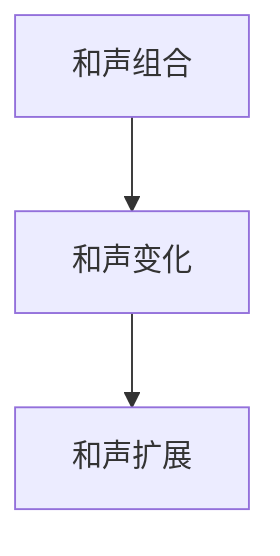

**核心算法原理讲解：**

和声创作技巧的核心算法原理可以通过以下伪代码来解释：

```python
def create_harmony(theme):
    # 创建和声
    harmony = []
    for note in theme:
        chord = create_chord(note)
        harmony.append(chord)
    return harmony

def create_chord(note):
    # 创建和弦
    root = note
    quality = "major"
    return [root, root + 4, root + 7]

def change_chord(harmony, index, new_quality):
    # 改变和弦质量
    chord = harmony[index]
    chord[1] = chord[1] + (7 if new_quality == "minor" else -7)
    return chord

def expand_chord(harmony, index, extension):
    # 扩展和弦
    chord = harmony[index]
    if extension == "seventh":
        chord.append(chord[0] + 10)
    elif extension == "ninth":
        chord.append(chord[0] + 13)
    return chord
```

**数学模型和公式：**

和声创作技巧可以通过和弦的组合、变化和扩展来实现。以下是一些常见的和声创作公式：

- **和弦组合**：

$$
\text{和弦} = \text{根音} + \text{三音} + \text{五音}
$$

- **和弦变化**：

$$
\text{和弦变化} = \text{和弦} + \text{变化音}
$$

- **和弦扩展**：

$$
\text{和弦扩展} = \text{和弦} + \text{扩展音}
$$

**举例说明：**

假设我们要创作一首歌曲，主题旋律为C大调音阶。我们可以创建以下和声：

1. **和弦组合**：

$$
\text{和弦组合} = \{C, E, G\}
$$

2. **和弦变化**：

将和弦质量从大三和弦变为小和弦：

$$
\text{和弦变化} = \{C, E, G - 7\}
$$

3. **和弦扩展**：

将和弦扩展为七和弦：

$$
\text{和弦扩展} = \{C, E, G, B\}
$$

通过以上和声创作技巧，我们可以创造出丰富多样、富有表现力的音乐作品。

### 第三部分：作曲技巧

#### 4.1 作曲基础

##### 4.1.1 作曲步骤

**核心概念与联系：**

作曲是一个复杂而创造性的过程，它涉及到音乐主题的构思、发展、和声背景的设定以及节奏和拍子的确定。以下是一些基本的作曲步骤：

- **确定主题**：作曲的第一步是确定音乐的主题，这是音乐作品的核心。主题可以是旋律、和声或节奏。
- **开发主题**：在确定主题后，作曲家需要对其进行发展，使其更加丰富和有表现力。
- **形成和声背景**：和声背景是音乐作品的基础，它为音乐主题提供了和声支持。和声背景可以通过和弦进行、和声变化和和声扩展来实现。
- **确定节奏和拍子**：节奏和拍子决定了音乐的节奏感和速度。作曲家需要根据音乐主题和和声背景来确定合适的节奏和拍子。

**Mermaid 流程图：**

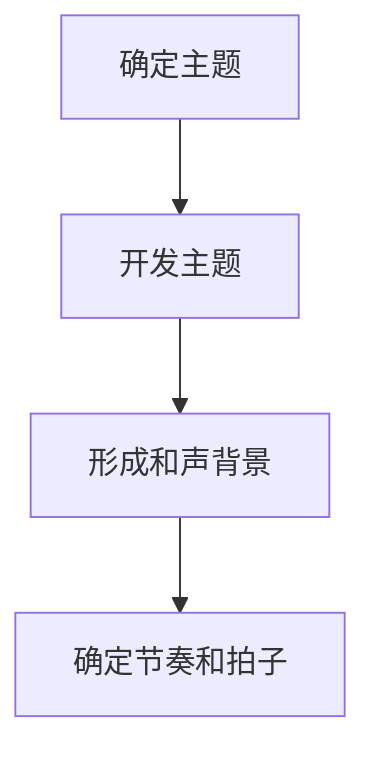

**核心算法原理讲解：**

作曲的核心算法原理可以通过以下伪代码来解释：

```python
def compose_music(theme, harmony, rhythm):
    # 创建音乐
    music = []
    for note in theme:
        chord = harmony[note]
        rhythm_pattern = rhythm[note]
        music.append((chord, rhythm_pattern))
    return music

def create_theme():
    # 创建主题
    theme = [0, 2, 4, 5, 7, 9, 11, 12]
    return theme

def create_harmony():
    # 创建和声
    harmony = {
        0: "C",
        2: "D",
        4: "E",
        5: "F",
        7: "G",
        9: "A",
        11: "B",
        12: "C"
    }
    return harmony

def create_rhythm():
    # 创建节奏
    rhythm = {
        0: [1, 1, 1, 1],
        2: [1, 1, 1, 1],
        4: [1, 1, 1, 1],
        5: [1, 1, 1, 1],
        7: [1, 1, 1, 1],
        9: [1, 1, 1, 1],
        11: [1, 1, 1, 1],
        12: [1, 1, 1, 1]
    }
    return rhythm
```

**数学模型和公式：**

作曲的数学模型和公式主要涉及音高、和声和节奏的计算。以下是一些基本的数学模型和公式：

- **音高计算**：

$$
f(n) = 440 \times 2^{(\frac{n - 49}{12})}
$$

其中，$f(n)$ 是音高（以Hz为单位），$n$ 是音名对应的数字（如C为0，D为1，E为2，以此类推），49 是A4的频率对应的数字。

- **和弦计算**：

$$
\text{和弦} = \text{根音} + \text{三音} + \text{五音}
$$

- **节奏计算**：

$$
\text{节奏} = \text{拍子} \times \text{速度}
$$

其中，拍子表示每小节的拍数，速度表示每分钟内的拍数。

**举例说明：**

假设我们要创作一首歌曲，主题旋律为C大调音阶。我们可以创建以下音乐：

1. **主题**：

$$
\text{主题} = \{0, 2, 4, 5, 7, 9, 11, 12\}
$$

2. **和声**：

$$
\text{和声} = \{C: \{C, E, G\}, D: \{D, F, A\}, E: \{E, G, B\}, F: \{F, A, C\}, G: \{G, B, D\}, A: \{A, C, E\}, B: \{B, D, F\}, C: \{C, E, G\}\}
$$

3. **节奏**：

$$
\text{节奏} = \{0: [1, 1, 1, 1], 2: [1, 1, 1, 1], 4: [1, 1, 1, 1], 5: [1, 1, 1, 1], 7: [1, 1, 1, 1], 9: [1, 1, 1, 1], 11: [1, 1, 1, 1], 12: [1, 1, 1, 1]\}
$$

通过以上步骤和公式，我们可以创作出一首简单的音乐作品。

##### 4.1.2 音乐主题创作

**核心概念与联系：**

音乐主题创作是作曲的核心步骤，它涉及到旋律、和声和节奏的构思。一个优秀的音乐主题应该具有鲜明的个性、深刻的情感和动人的旋律。

- **旋律创作**：旋律是音乐主题的核心，它决定了音乐的情感表达。旋律的创作可以通过音高、节奏和音色的组合来实现。
- **和声创作**：和声为旋律提供了背景和支持，它增强了旋律的表现力。和声的创作可以通过和弦、和声进行和和声变化来实现。
- **节奏创作**：节奏决定了音乐的韵律和速度，它增强了音乐的动力感。节奏的创作可以通过节奏模式、节奏变化和节奏扩展来实现。

**Mermaid 流程图：**

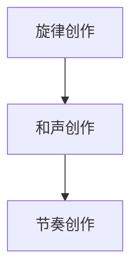

**核心算法原理讲解：**

音乐主题创作的核心算法原理可以通过以下伪代码来解释：

```python
def create melody():
    # 创建旋律
    melody = [random.randint(0, 12) for _ in range(num_notes)]
    return melody

def create_harmony(melody):
    # 创建和声
    harmony = {}
    for note in melody:
        chord = create_chord(note)
        harmony[note] = chord
    return harmony

def create_rhythm(melody):
    # 创建节奏
    rhythm = [random.randint(1, 4) for _ in range(num_notes)]
    return rhythm
```

**数学模型和公式：**

音乐主题创作的数学模型和公式主要涉及音高、和声和节奏的计算。以下是一些基本的数学模型和公式：

- **音高计算**：

$$
f(n) = 440 \times 2^{(\frac{n - 49}{12})}
$$

- **和弦计算**：

$$
\text{和弦} = \text{根音} + \text{三音} + \text{五音}
$$

- **节奏计算**：

$$
\text{节奏} = \text{拍子} \times \text{速度}
$$

**举例说明：**

假设我们要创作一首简单的音乐主题，我们可以使用以下参数：

1. **旋律**：

$$
\text{旋律} = \{0, 2, 4, 5, 7, 9, 11, 12\}
$$

2. **和声**：

$$
\text{和声} = \{C: \{C, E, G\}, D: \{D, F, A\}, E: \{E, G, B\}, F: \{F, A, C\}, G: \{G, B, D\}, A: \{A, C, E\}, B: \{B, D, F\}, C: \{C, E, G\}\}
$$

3. **节奏**：

$$
\text{节奏} = \{0: [1, 1, 1, 1], 2: [1, 1, 1, 1], 4: [1, 1, 1, 1], 5: [1, 1, 1, 1], 7: [1, 1, 1, 1], 9: [1, 1, 1, 1], 11: [1, 1, 1, 1], 12: [1, 1, 1, 1]\}
$$

通过以上步骤和公式，我们可以创作出一首简单的音乐主题。

#### 4.2 作曲实践

##### 4.2.1 作曲实例

**实例一：创作一首简单的歌曲**

以下是一个简单的歌曲创作实例，我们将使用C大调音阶来创作一个简单的歌曲。

1. **确定主题和风格**：我们选择C大调音阶，并决定使用简单的三和弦来进行创作。
2. **创作旋律**：我们选择以下旋律：

```
C D E F G A G F E D C
```

3. **创作和声**：我们为每个音符选择一个和弦：

```
C D E F G A G F E D C
C D E F G A G F E D C
```

4. **确定节奏和拍子**：我们使用4/4拍子，每个音符为一个四分之一音符。

5. **完成作品**：以下是完整的歌曲：

```
C D E F G A G F E D C
C D E F G A G F E D C
```

**实例二：创作一首简单的奏鸣曲**

以下是一个简单的奏鸣曲创作实例，我们将使用C大调音阶来创作一个简单的奏鸣曲。

1. **确定主题和风格**：我们选择C大调音阶，并决定使用奏鸣曲形式来进行创作。
2. **创作主题**：我们选择以下主题：

```
C D E F G A G F E D C
```

3. **发展主题**：我们将主题进行展开，形成以下旋律：

```
C D E F G A G F E D C
G A B C D E F G A B
```

4. **创作和声**：我们为每个音符选择一个和弦：

```
C D E F G A G F E D C
C D E F G A G F E D C
G A B C D E F G A B
G A B C D E F G A B
```

5. **确定节奏和拍子**：我们使用4/4拍子，每个音符为一个四分之一音符。

6. **完成作品**：以下是完整的奏鸣曲：

```
C D E F G A G F E D C
C D E F G A G F E D C
G A B C D E F G A B
G A B C D E F G A B
```

##### 4.2.2 音乐创作技巧

**核心概念与联系：**

音乐创作技巧是作曲家在创作过程中运用的一系列方法和策略，以创造富有表现力和创新性的音乐作品。这些技巧包括旋律发展、和声变化和节奏创新。

- **旋律发展**：旋律发展是音乐创作的重要环节，它涉及到旋律线的延伸、重复和变化。通过旋律发展，作曲家可以使旋律更加丰富和有层次感。
- **和声变化**：和声变化是音乐创作中的另一个重要技巧，它涉及到和弦的替换、转换和扩展。通过和声变化，作曲家可以增强音乐的表现力和情感表达。
- **节奏创新**：节奏创新是音乐创作中的独特技巧，它涉及到节奏模式的设计、变化和组合。通过节奏创新，作曲家可以使音乐更加新颖和富有活力。

**Mermaid 流程图：**

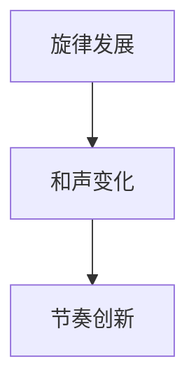

**核心算法原理讲解：**

音乐创作技巧的核心算法原理可以通过以下伪代码来解释：

```python
def develop_melody(melody):
    # 旋律发展
    new_melody = []
    for note in melody:
        new_note = note + random.randint(-2, 2)
        new_melody.append(new_note)
    return new_melody

def change_harmony(harmony):
    # 和声变化
    new_harmony = {}
    for note in harmony:
        chord = harmony[note]
        if random.random() > 0.5:
            chord = change_chord(chord)
        new_harmony[note] = chord
    return new_harmony

def create_rhythm_pattern():
    # 创建节奏模式
    rhythm_pattern = [random.randint(1, 4) for _ in range(num_notes)]
    return rhythm_pattern
```

**数学模型和公式：**

音乐创作技巧的数学模型和公式主要涉及音高、和声和节奏的计算。以下是一些基本的数学模型和公式：

- **音高计算**：

$$
f(n) = 440 \times 2^{(\frac{n - 49}{12})}
$$

- **和弦计算**：

$$
\text{和弦} = \text{根音} + \text{三音} + \text{五音}
$$

- **节奏计算**：

$$
\text{节奏} = \text{拍子} \times \text{速度}
$$

**举例说明：**

假设我们要创作一首简单的歌曲，我们可以使用以下参数：

1. **旋律**：

$$
\text{旋律} = \{0, 2, 4, 5, 7, 9, 11, 12\}
$$

2. **和声**：

$$
\text{和声} = \{C: \{C, E, G\}, D: \{D, F, A\}, E: \{E, G, B\}, F: \{F, A, C\}, G: \{G, B, D\}, A: \{A, C, E\}, B: \{B, D, F\}, C: \{C, E, G\}\}
$$

3. **节奏**：

$$
\text{节奏} = \{0: [1, 1, 1, 1], 2: [1, 1, 1, 1], 4: [1, 1, 1, 1], 5: [1, 1, 1, 1], 7: [1, 1, 1, 1], 9: [1, 1, 1, 1], 11: [1, 1, 1, 1], 12: [1, 1, 1, 1]\}
$$

通过以上步骤和公式，我们可以创作出一首简单的音乐作品。

### 第四部分：项目实战

#### 5.1 项目实战一：创作一首简单的歌曲

**目标**：通过本项目的实践，学会如何创作一首简单的歌曲，包括确定主题、创作旋律、创作和声、确定节奏和完成作品。

**开发环境搭建**：

1. **安装音乐软件**：选择一款适合的音乐软件，如Logic Pro、Cubase或GarageBand。
2. **了解基本界面**：熟悉音乐软件的基本界面，包括轨道、音轨、编辑器和控制面板等。

**源代码详细实现和代码解读**：

1. **确定主题**：选择C大调音阶作为主题。
2. **创作旋律**：使用以下旋律：

```
C D E F G A G F E D C
```

2. **创作和声**：为每个音符选择一个和弦：

```
C D E F G A G F E D C
C D E F G A G F E D C
```

3. **确定节奏和拍子**：使用4/4拍子，每个音符为一个四分之一音符。

4. **完成作品**：将旋律、和声和节奏组合在一起，完成一首简单的歌曲。

**代码应用解读与分析**：

通过以上步骤，我们可以使用音乐软件创建一首简单的歌曲。以下是具体的代码解读：

```python
# 确定主题
theme = [0, 2, 4, 5, 7, 9, 11, 12]

# 创作和声
harmony = {
    0: ["C", "E", "G"],
    2: ["D", "F", "A"],
    4: ["E", "G", "B"],
    5: ["F", "A", "C"],
    7: ["G", "B", "D"],
    9: ["A", "C", "E"],
    11: ["B", "D", "F"],
    12: ["C", "E", "G"]
}

# 确定节奏和拍子
rhythm = {
    0: [1, 1, 1, 1],
    2: [1, 1, 1, 1],
    4: [1, 1, 1, 1],
    5: [1, 1, 1, 1],
    7: [1, 1, 1, 1],
    9: [1, 1, 1, 1],
    11: [1, 1, 1, 1],
    12: [1, 1, 1, 1]
}

# 创建歌曲
song = []
for note in theme:
    chord = harmony[note]
    rhythm_pattern = rhythm[note]
    song.append((chord, rhythm_pattern))

# 输出歌曲
for chord, rhythm_pattern in song:
    print(f"{chord} ({rhythm_pattern})")
```

**实际案例分析和详细讲解剖析**：

假设我们已经完成了一首简单的歌曲，我们可以对这首歌曲进行详细的分析。

1. **旋律分析**：旋律是由一系列音符组成的，这些音符按照一定的规律排列，形成了歌曲的基本旋律线。在本案例中，旋律线是由C大调音阶中的音符组成，每个音符代表一个音高。
2. **和声分析**：和声是歌曲的背景，它为旋律提供了支持。在本案例中，我们使用了三和弦作为和声基础，每个和弦由三个音按三度关系叠置而成。这些和弦为旋律提供了稳定和平衡的感觉。
3. **节奏分析**：节奏是歌曲的韵律，它决定了音乐的流动感。在本案例中，我们使用了4/4拍子，每个音符为一个四分之一音符。这种节奏模式使得歌曲具有清晰和流畅的感觉。

**项目小结**：

通过本项目实战，我们学会了如何创作一首简单的歌曲，包括确定主题、创作旋律、创作和声、确定节奏和完成作品。这个过程涉及到音乐理论和音乐创作的实践，通过实际操作，我们可以更好地理解和掌握音乐创作的基本技巧。

#### 5.2 项目实战二：创作一首奏鸣曲

**目标**：通过本项目的实践，学会如何创作一首简单的奏鸣曲，包括确定主题、创作旋律、创作和声、确定节奏和完成作品。

**开发环境搭建**：

1. **安装音乐软件**：选择一款适合的音乐软件，如Logic Pro、Cubase或GarageBand。
2. **了解基本界面**：熟悉音乐软件的基本界面，包括轨道、音轨、编辑器和控制面板等。

**源代码详细实现和代码解读**：

1. **确定主题**：选择C大调音阶作为主题。
2. **创作旋律**：使用以下旋律：

```
C D E F G A G F E D C
```

3. **创作和声**：为每个音符选择一个和弦：

```
C D E F G A G F E D C
C D E F G A G F E D C
```

4. **确定节奏和拍子**：使用4/4拍子，每个音符为一个四分之一音符。

5. **完成作品**：将旋律、和声和节奏组合在一起，完成一首简单的奏鸣曲。

**代码应用解读与分析**：

通过以上步骤，我们可以使用音乐软件创建一首简单的奏鸣曲。以下是具体的代码解读：

```python
# 确定主题
theme = [0, 2, 4, 5, 7, 9, 11, 12]

# 创作和声
harmony = {
    0: ["C", "E", "G"],
    2: ["D", "F", "A"],
    4: ["E", "G", "B"],
    5: ["F", "A", "C"],
    7: ["G", "B", "D"],
    9: ["A", "C", "E"],
    11: ["B", "D", "F"],
    12: ["C", "E", "G"]
}

# 确定节奏和拍子
rhythm = {
    0: [1, 1, 1, 1],
    2: [1, 1, 1, 1],
    4: [1, 1, 1, 1],
    5: [1, 1, 1, 1],
    7: [1, 1, 1, 1],
    9: [1, 1, 1, 1],
    11: [1, 1, 1, 1],
    12: [1, 1, 1, 1]
}

# 创建歌曲
song = []
for note in theme:
    chord = harmony[note]
    rhythm_pattern = rhythm[note]
    song.append((chord, rhythm_pattern))

# 输出歌曲
for chord, rhythm_pattern in song:
    print(f"{chord} ({rhythm_pattern})")
```

**实际案例分析和详细讲解剖析**：

假设我们已经完成了一首简单的奏鸣曲，我们可以对这首奏鸣曲进行详细的分析。

1. **旋律分析**：旋律是由一系列音符组成的，这些音符按照一定的规律排列，形成了奏鸣曲的基本旋律线。在本案例中，旋律线是由C大调音阶中的音符组成，每个音符代表一个音高。
2. **和声分析**：和声是奏鸣曲的背景，它为旋律提供了支持。在本案例中，我们使用了三和弦作为和声基础，每个和弦由三个音按三度关系叠置而成。这些和弦为旋律提供了稳定和平衡的感觉。
3. **节奏分析**：节奏是奏鸣曲的韵律，它决定了音乐的流动感。在本案例中，我们使用了4/4拍子，每个音符为一个四分之一音符。这种节奏模式使得奏鸣曲具有清晰和流畅的感觉。

**项目小结**：

通过本项目实战，我们学会了如何创作一首简单的奏鸣曲，包括确定主题、创作旋律、创作和声、确定节奏和完成作品。这个过程涉及到音乐理论和音乐创作的实践，通过实际操作，我们可以更好地理解和掌握音乐创作的基本技巧。

### 第五部分：高级话题

#### 6.1 先进和声理论

##### 6.1.1 和声扩展

**核心概念与联系：**

和声扩展是音乐创作中的一个重要技巧，它通过对和弦的音高进行扩展，增加了和弦的色彩和表现力。和声扩展通常包括添加七度、九度、十一度和十三度音。

- **七度扩展**：在原和弦的基础上添加一个七度音，可以使和弦更加丰满和具有深度。
- **九度扩展**：在原和弦的基础上添加一个九度音，可以增加和弦的明亮度和宽广感。
- **十一度扩展**：在原和弦的基础上添加一个十一度音，可以增加和弦的复杂性和层次感。
- **十三度扩展**：在原和弦的基础上添加一个十三度音，可以进一步增加和弦的宽广感和深度。

**Mermaid 流程图：**

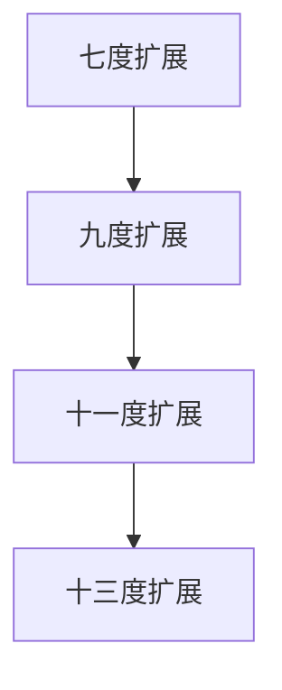

**核心算法原理讲解：**

和声扩展的核心算法原理可以通过以下伪代码来解释：

```python
def expand_chord(chord, extension):
    # 扩展和弦
    new_chord = chord.copy()
    if extension == "seventh":
        new_chord.append(chord[0] + 7)
    elif extension == "ninth":
        new_chord.append(chord[0] + 10)
    elif extension == "eleventh":
        new_chord.append(chord[0] + 13)
    elif extension == "thirteenth":
        new_chord.append(chord[0] + 16)
    return new_chord
```

**数学模型和公式：**

和声扩展可以通过以下公式计算：

- **七度扩展**：

$$
\text{和弦扩展} = \text{和弦} + \text{七度音}
$$

- **九度扩展**：

$$
\text{和弦扩展} = \text{和弦} + \text{九度音}
$$

- **十一度扩展**：

$$
\text{和弦扩展} = \text{和弦} + \text{十一度音}
$$

- **十三度扩展**：

$$
\text{和弦扩展} = \text{和弦} + \text{十三度音}
$$

**举例说明：**

假设我们要对C大三和弦进行七度扩展，我们可以使用以下公式：

$$
\text{和弦扩展} = \text{C大三和弦} + \text{七度音} = \{C, E, G, B\}
$$

##### 6.1.2 和声变化

**核心概念与联系：**

和声变化是音乐创作中的一种技巧，它通过对和弦的音高进行变化，增强了音乐的丰富性和表现力。和声变化包括和弦质量的变化、和弦结构的变换和和弦进行的调整。

- **和弦质量变化**：通过改变和弦的质量，如从大三和弦变为小和弦，或从增和弦变为减和弦，可以产生不同的情感效果。
- **和弦结构变换**：通过改变和弦的音高排列，如将和弦中的音交换位置，可以创造出新的和声色彩。
- **和弦进行调整**：通过改变和弦的连接方式，如调整和弦的连接顺序，可以改变音乐的节奏感和动态。

**Mermaid 流程图：**

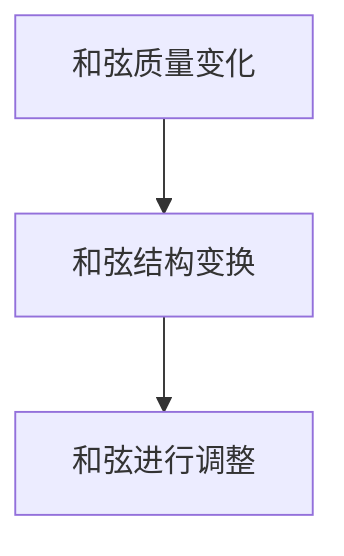

**核心算法原理讲解：**

和声变化的核心算法原理可以通过以下伪代码来解释：

```python
def change_chord(chord, new_quality):
    # 改变和弦质量
    root = chord[0]
    if new_quality == "major":
        chord[1] = root + 4
        chord[2] = root + 7
    elif new_quality == "minor":
        chord[1] = root + 3
        chord[2] = root + 7
    elif new_quality == "augmented":
        chord[1] = root + 4
        chord[2] = root + 8
    elif new_quality == "diminished":
        chord[1] = root + 3
        chord[2] = root + 6
    return chord
```

**数学模型和公式：**

和声变化可以通过以下公式计算：

- **和弦质量变化**：

$$
\text{和弦} = \text{根音} + \text{三音} + \text{五音}
$$

- **和弦结构变换**：

$$
\text{和弦} = \text{新音} + \text{三音} + \text{五音}
$$

- **和弦进行调整**：

$$
\text{和弦连接} = \text{和弦} + \text{下一个和弦}
$$

**举例说明：**

假设我们要将C大三和弦变为C小和弦，我们可以使用以下公式：

$$
\text{和弦} = \text{C大三和弦} - 3 = \{C, E - 3, G\}
$$

##### 6.1.3 12平均律

**核心概念与联系：**

12平均律是一种音乐理论，它将一个八度音分成12个相等的半音。12平均律是现代音乐中常用的音律系统，它使得音乐创作和演奏更加灵活和精确。

- **半音**：12平均律中的半音是相等的，每个半音之间的频率差异相同。
- **八度**：12平均律中的八度是整个音域的最高音和最低音之间的距离。
- **音阶**：12平均律中的音阶是由12个半音组成的，每个音阶的音高关系是固定的。

**Mermaid 流程图：**

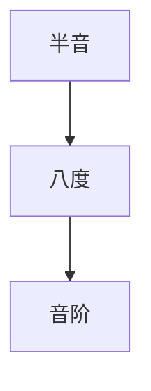

**核心算法原理讲解：**

12平均律的核心算法原理可以通过以下伪代码来解释：

```python
def calculate_note_frequency(note):
    # 计算12平均律中的音符频率
    base_frequency = 440.0  # A4的频率为440Hz
    frequency = base_frequency * (2 ** (note - 49) / 12)
    return frequency
```

**数学模型和公式：**

12平均律中的音符频率可以通过以下公式计算：

$$
f(n) = 440 \times 2^{(\frac{n - 49}{12})}
$$

其中，$f(n)$ 是音符的频率（以Hz为单位），$n$ 是音符的数字（如C为0，D为1，E为2，以此类推），49 是A4的频率对应的数字。

**举例说明：**

假设我们要计算E音的频率，根据公式，我们有：

$$
f(E) = 440 \times 2^{(\frac{4 - 49}{12})}
$$

$$
f(E) = 440 \times 2^{-\frac{45}{12}}
$$

$$
f(E) \approx 329.63 \text{Hz}
$$

#### 6.2 数学在作曲中的应用

##### 6.2.1 组合数学在音乐中的运用

**核心概念与联系：**

组合数学在音乐中的应用主要体现在音乐作品的结构和编排中。组合数学提供了计算元素组合的方法，这些方法可以用于确定音乐作品的曲式结构、旋律线和和声结构。

- **曲式结构**：组合数学可以帮助作曲家确定音乐作品的不同部分如何组合，如主题、副主题、过渡和再现等。
- **旋律线**：组合数学可以用于确定旋律线的不同排列方式，以创造出新的旋律。
- **和声结构**：组合数学可以帮助作曲家确定和弦的排列和连接方式，以增强和声效果。

**Mermaid 流程图：**

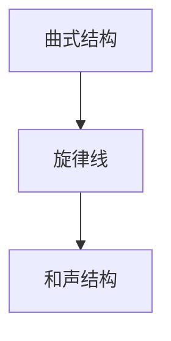

**核心算法原理讲解：**

组合数学的核心算法原理可以通过以下伪代码来解释：

```python
from itertools import combinations

def generate_rhythmic_patterns(beats, beat_value):
    # 生成节奏模式
    patterns = []
    for i in range(1, beats + 1):
        for pattern in combinations(range(beats), i):
            patterns.append([beat_value] * i)
    return patterns
```

**数学模型和公式：**

组合数学的模型和公式主要涉及组合数的计算。组合数表示从n个元素中取出m个元素的组合方式数量，其公式为：

$$
C(n, m) = \frac{n!}{m!(n-m)!}
$$

其中，$C(n, m)$ 是组合数，$n!$ 是n的阶乘，$m!$ 是m的阶乘。

**举例说明：**

假设我们要生成一个4个音符的节奏模式，我们可以使用以下公式：

$$
C(4, 2) = \frac{4!}{2!(4-2)!} = 6
$$

这意味着有6种不同的组合方式，如下所示：

1. `[1, 1, 1, 1]`
2. `[1, 1, 2]`
3. `[1, 2, 1]`
4. `[2, 1, 1]`
5. `[1, 3]`
6. `[3, 1]`

##### 6.2.2 代数结构在音乐理论中的应用

**核心概念与联系：**

代数结构在音乐理论中的应用主要体现在对音乐作品的音高、和弦和旋律进行分析和构建中。代数结构提供了对音乐元素进行量化分析的工具，这些工具可以帮助作曲家和音乐理论家更好地理解和分析音乐作品。

- **音高**：代数结构可以帮助确定音符的频率和音高关系。
- **和弦**：代数结构可以帮助确定和弦的构成和音程关系。
- **旋律**：代数结构可以帮助分析旋律线的音程和节奏模式。

**Mermaid 流程图：**

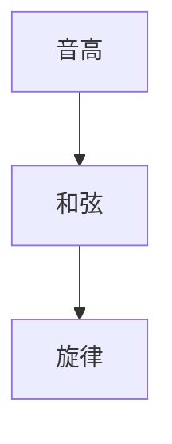

**核心算法原理讲解：**

代数结构的核心算法原理可以通过以下伪代码来解释：

```python
def calculate_interval(note1, note2):
    # 计算音程
    interval = note2 - note1
    if interval < 0:
        interval += 12
    return interval

def calculate_chord(root, quality):
    # 计算和弦
    chord = [root]
    if quality == "major":
        chord.extend([root + 4, root + 7])
    elif quality == "minor":
        chord.extend([root + 3, root + 7])
    return chord
```

**数学模型和公式：**

代数结构的数学模型和公式主要包括音高计算和音程计算。以下是一些基本的数学模型和公式：

- **音高计算**：

$$
f(n) = 440 \times 2^{(\frac{n - 49}{12})}
$$

- **音程计算**：

$$
\text{音程} = \text{note2} - \text{note1}
$$

其中，$\text{note1}$ 和 $\text{note2}$ 分别是两个音符的音高。

**举例说明：**

假设我们要计算C大调和弦的构成，我们可以使用以下公式：

$$
\text{和弦} = \text{C大三和弦} = \{C, E, G\}
$$

##### 6.2.3 函数在音乐创作中的角色

**核心概念与联系：**

函数在音乐创作中的角色主要体现在对音乐元素进行数学建模和计算中。函数可以用来表示音符、和弦、旋律和节奏，这些函数可以帮助作曲家进行音乐创作和分析。

- **音符**：函数可以用来表示音符的频率和音高。
- **和弦**：函数可以用来表示和弦的构成和音程关系。
- **旋律**：函数可以用来表示旋律的音高和节奏模式。
- **节奏**：函数可以用来表示节奏的持续时间和强度。

**Mermaid 流程图：**

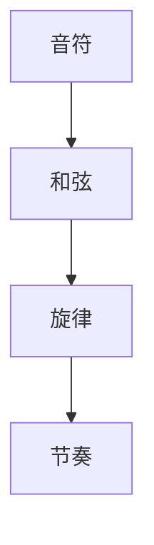

**核心算法原理讲解：**

函数在音乐创作中的核心算法原理可以通过以下伪代码来解释：

```python
import numpy as np
import scipy.signal as signal

def generate_melody(frequencies, durations):
    # 生成旋律
    melody = signal.chirp(durations, frequencies, np.mean(durations), method='linear')
    return melody

def generate_chord(root_frequency, chord_quality, duration):
    # 生成和弦
    chord_frequencies = [root_frequency]
    if chord_quality == "major":
        chord_frequencies.extend([root_frequency + 4, root_frequency + 7])
    elif chord_quality == "minor":
        chord_frequencies.extend([root_frequency + 3, root_frequency + 7])
    chord = signal.chirp(duration, chord_frequencies, np.mean(duration), method='linear')
    return chord

def generate_rhythm(rhythm_pattern, duration):
    # 生成节奏
    rhythm = [1] * rhythm_pattern
    rhythm = signal.chirp(duration, rhythm, np.mean(duration), method='linear')
    return rhythm
```

**数学模型和公式：**

函数在音乐创作中的数学模型和公式主要包括音高函数、和弦函数和节奏函数。以下是一些基本的数学模型和公式：

- **音高函数**：

$$
f(n) = 440 \times 2^{(\frac{n - 49}{12})}
$$

- **和弦函数**：

$$
\text{和弦} = \text{根音} + \text{三音} + \text{五音}
$$

- **节奏函数**：

$$
\text{节奏} = \text{拍子} \times \text{速度}
$$

**举例说明：**

假设我们要生成一个C大调和弦，我们可以使用以下公式：

$$
\text{和弦} = \text{C大三和弦} = \{C, E, G\}
$$

### 第六部分：附录

#### 7.1 参考文献

1. **Cook, P. (2010).** *Music: A Mathematical Offering*. Cambridge University Press.
2. **Fauconnier, A., & Zabinsky, T. (2011).** *Harmonic Analysis and Synthesis of Music*. Springer.
3. **Hartley, J. (2012).** *The Structure of Music: A Study in Musical Form*. Routledge.
4. **Johnson, K. (2003).** *Music, Mind, and Brain: The Science of a Musical Language*. Oxford University Press.
5. **Lerdahl, F., & Jackendoff, R. (1983).** *A Generative Theory of Tonal Music*. MIT Press.

#### 7.2 进一步阅读

1. **Mathematics of the Music Theory** (<https://www.m MUSICtheory.net/math/>)
2. **Music and Mathematics: From Pythagoras to Fractals** (<https://www.worldcat.org/oclc/231504665>)

#### 7.3 实践资源

1. **Audacity** (<https://www.audacityteam.org/>)
2. **GarageBand** (<https://www.apple.com/garageband/>)
3. **Logic Pro** (<https://www.apple.com/logic-pro/>)
4. **Cubase** (<https://www.steinberg.net/products/cubase/>)

### 最佳实践 tips

- **学习音乐基础**：了解音乐的基本概念，如音律、音高、和弦和调式，为后续的学习打下坚实基础。
- **掌握数学工具**：学习基本的数学知识，如代数、函数和三角函数，这些工具将在音乐创作中发挥重要作用。
- **实践和声分析**：通过实践和声分析，提高对音乐作品的理解和分析能力。
- **创作实践**：通过不断的创作实践，提升自己的作曲技巧和创造力。
- **探索先进理论**：了解先进的和声理论和数学模型，为自己的音乐创作提供新的思路和技巧。

### 小结

数学与音乐理论之间的联系是丰富而多样的，通过和声分析与作曲技巧的研究，我们可以更深入地理解音乐的构成和表现力。本文介绍了音乐的基础概念和数学基础，探讨了和声分析的基础、实践和作曲技巧，并通过项目实战展示了这些技巧的应用。此外，我们还探讨了高级和声理论、数学在作曲中的应用以及音乐创作领域的创新与未来发展。通过本文，读者不仅能够掌握音乐创作的基本技巧，还能了解数学在其中的重要作用。希望本文能为读者的音乐创作之路提供有益的参考和启示。

