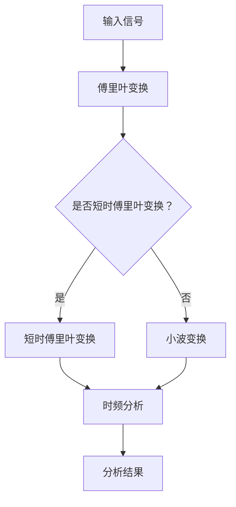

                 


### 文章标题：数学与音乐理论的音色与泛音分析

> 关键词：音色分析、泛音理论、数学模型、音乐创作、乐器制造

> 摘要：
本文旨在探讨数学与音乐理论的交叉领域，重点关注音色与泛音分析。通过详细解析音色与泛音的关系、核心算法原理以及实际应用，本文为音乐创作和乐器制造提供了新的视角和思路。

----------------------------------------------------------------

### 引言

#### 书名背景介绍

《数学与音乐理论的音色与泛音分析》这本书旨在将数学理论与音乐实践相结合，探索音色与泛音的深层联系。数学中的泛音理论为音乐提供了丰富的理论基础，而音乐中的音色分析则为数学模型的应用提供了实践场景。这种跨学科的融合有助于我们更深入地理解音乐的本质和创作方法。

#### 研究意义

音色与泛音分析在音乐创作和乐器制造中具有重要意义。音色是音乐的灵魂，它决定了音乐的情感表达和审美价值。泛音分析则为音色设计提供了理论依据，有助于创造独特的音乐效果。通过数学模型的分析，我们可以更好地理解音色的构成和变化规律，从而在音乐创作和乐器制造中取得突破。

#### 目的与内容概述

本文的目的在于详细解析音色与泛音的关系，介绍核心算法原理，并探讨实际应用。文章分为以下几个部分：首先，介绍基础概念，包括数学中的泛音理论和音乐中的音色分析；然后，深入探讨音色与泛音的关系模型；接着，阐述音色与泛音分析的数学模型和方法；最后，通过实际案例展示音色与泛音分析在音乐创作和乐器制造中的应用。

----------------------------------------------------------------

### 基础概念

#### 数学中的泛音理论

##### 泛音的定义

泛音是指当弦乐器或打击乐器被激发时，除了基频之外，还会产生一系列频率整数倍的谐波振动。这些谐波振动称为泛音，也称为谐音。

$$
f_n = n \cdot f_0
$$

其中，$f_0$ 为基频，$f_n$ 为第 $n$ 阶泛音频率。

##### 泛音的分类

泛音可以分为自然泛音和人工泛音。

1. **自然泛音**：当弦乐器或打击乐器自然振动时产生的泛音。自然泛音的频率是基频的整数倍，通常在乐器上以空弦音或打击点的位置产生。

2. **人工泛音**：通过人工方法产生的泛音，例如，通过调整弦的长度或打击力度来改变泛音的频率。

##### 泛音的产生原理

泛音的产生原理是弦的振动模式。当弦乐器或打击乐器被激发时，弦的振动会在节点处产生静止点，这些静止点称为节。在节的位置，弦的振动幅度为零，而在节点之间的位置，弦的振动幅度最大。

#### 音乐中的音色分析

##### 音色的定义

音色是指不同乐器或声音源发出的声音在听觉上的独特属性，它决定了声音的辨识度。音色与音高、响度和时域特征等声音属性密切相关。

##### 音色的构成要素

音色的构成要素主要包括：

1. **音高**：音高是指声音的频率，决定了声音的主观音调。

2. **响度**：响度是指声音的强度，反映了声音的音量大小。

3. **质地**：质地是指声音的细微特征，包括共振峰、泛音成分和噪音成分等。

##### 音色的感知特性

音色的感知特性取决于人的听觉系统。人的耳朵可以感知音色中的谐波成分，以及谐波的相对强度和相位。不同的谐波成分和强度会给人不同的音色感知。

#### 音色与泛音的关系

##### 音色与泛音的相互影响

音色与泛音之间存在密切的关系。音色取决于泛音的频率和强度，而泛音的频率和强度又受到音色的影响。

1. **音色对泛音的影响**：不同的音色会影响到泛音的频率和强度。例如，当音色中的谐波成分较强时，泛音的频率和强度也会相应增加。

2. **泛音对音色的影响**：泛音的频率和强度会影响音色的质地和音调。通过调整泛音的频率和强度，可以改变音色的特征。

##### 音色与泛音分析的关系模型

音色与泛音分析的关系模型可以通过以下数学模型来描述：

1. **傅里叶变换**：傅里叶变换可以将时域信号转换为频域信号，从而分析音色中的谐波成分。

2. **短时傅里叶变换**：短时傅里叶变换可以将时域信号分段处理，从而分析音色中的瞬态特征。

3. **小波变换**：小波变换可以在时域和频域同时进行分析，从而更全面地描述音色的特征。

通过这些数学模型，我们可以深入理解音色与泛音之间的关系，从而为音乐创作和乐器制造提供理论支持。

----------------------------------------------------------------

### 核心理论

#### 音色与泛音的分析方法

音色与泛音分析的方法主要包括数学模型和算法。

##### 数学模型

音色与泛音分析的数学模型主要涉及傅里叶变换、短时傅里叶变换和小波变换。

1. **傅里叶变换**：傅里叶变换可以将时域信号转换为频域信号，从而分析音色中的谐波成分。傅里叶变换的基本公式如下：

$$
X(f) = \int_{-\infty}^{\infty} x(t) e^{-j2\pi ft} dt
$$

其中，$X(f)$ 为频域信号，$x(t)$ 为时域信号，$f$ 为频率。

2. **短时傅里叶变换**：短时傅里叶变换可以将时域信号分段处理，从而分析音色中的瞬态特征。短时傅里叶变换的基本公式如下：

$$
X(t, f) = \int_{-\infty}^{\infty} x(\tau) e^{-j2\pi f\tau} d\tau
$$

其中，$X(t, f)$ 为短时频域信号，$x(\tau)$ 为时域信号，$f$ 为频率。

3. **小波变换**：小波变换可以在时域和频域同时进行分析，从而更全面地描述音色的特征。小波变换的基本公式如下：

$$
X(\tau, \omega) = \int_{-\infty}^{\infty} x(\tau) \psi^*(\omega - \omega_0) d\omega
$$

其中，$X(\tau, \omega)$ 为小波变换信号，$\psi^*(\omega - \omega_0)$ 为小波函数，$\tau$ 为时间，$\omega$ 为频率。

##### 算法

音色与泛音分析的算法主要包括频谱分析、时频分析和波形分析。

1. **频谱分析**：频谱分析是通过对信号进行傅里叶变换，得到信号的频域分布。频谱分析可以用于分析音色中的谐波成分。

2. **时频分析**：时频分析是通过对信号进行短时傅里叶变换，得到信号的时频分布。时频分析可以用于分析音色中的瞬态特征。

3. **波形分析**：波形分析是通过对信号进行小波变换，得到信号的波形特征。波形分析可以用于分析音色中的细节特征。

#### 数学模型与公式

音色与泛音分析的数学模型可以通过以下公式来描述：

1. **傅里叶变换公式**：

$$
X(f) = \int_{-\infty}^{\infty} x(t) e^{-j2\pi ft} dt
$$

2. **短时傅里叶变换公式**：

$$
X(t, f) = \int_{-\infty}^{\infty} x(\tau) e^{-j2\pi f\tau} d\tau
$$

3. **小波变换公式**：

$$
X(\tau, \omega) = \int_{-\infty}^{\infty} x(\tau) \psi^*(\omega - \omega_0) d\omega
$$

#### Mermaid流程图

为了更好地理解音色与泛音分析的过程，可以使用Mermaid流程图来描述。以下是一个简单的Mermaid流程图示例：



这个流程图展示了音色与泛音分析的基本步骤，包括输入信号、傅里叶变换、短时傅里叶变换、小波变换和时频分析，最终得到分析结果。

----------------------------------------------------------------

### 实际应用

#### 音色与泛音分析在音乐创作中的应用

音色与泛音分析在音乐创作中具有重要的应用价值。通过分析音色中的泛音成分，作曲家和音乐制作人可以创造出独特的音乐效果，提升音乐的感染力和艺术表现力。

1. **音色设计**：作曲家和音乐制作人可以使用音色与泛音分析来设计独特的音色。例如，通过调整泛音的频率和强度，可以创造出不同的音色质地和音调。

2. **音色修饰**：在音乐创作过程中，作曲家和音乐制作人可以利用音色与泛音分析来修饰和优化音乐素材。例如，通过调整泛音的频率和强度，可以改善音色的质感，使其更具有表现力。

3. **音乐效果**：音色与泛音分析可以用于制作各种音乐效果。例如，通过分析音色中的泛音成分，可以制作出各种独特的合成器声音，用于电子音乐制作。

#### 音色与泛音分析在乐器制造中的应用

音色与泛音分析在乐器制造中具有重要的指导作用。通过分析乐器发出的音色，乐器制造者可以优化乐器的结构，提升乐器音色的质量和表现力。

1. **乐器音色优化**：乐器制造者可以使用音色与泛音分析来优化乐器的音色。例如，通过调整乐器的材料、结构和制作工艺，可以改善乐器的音色特性，使其更符合音乐家的需求。

2. **乐器泛音结构调整**：乐器制造者可以通过调整乐器的泛音结构，改变乐器发出的泛音频率和强度。例如，通过调整弦的长度、张力或改变打击点的位置，可以创造出不同的音色效果。

3. **乐器个性化定制**：音色与泛音分析可以用于乐器个性化定制。例如，音乐家可以根据自己的音乐风格和喜好，定制适合自己的乐器，以达到最佳的音色效果。

#### 音色与泛音分析在音乐理论研究中的应用

音色与泛音分析在音乐理论研究中具有重要意义。通过分析音色中的泛音成分，音乐理论家可以深入研究音乐的本质和规律。

1. **音乐结构分析**：音色与泛音分析可以用于分析音乐的结构和形式。例如，通过分析乐曲中的音色变化，可以揭示乐曲的节奏、旋律和和声结构。

2. **音乐演变研究**：音色与泛音分析可以用于研究音乐的演变和风格变化。例如，通过分析不同时期乐曲的音色特征，可以了解音乐发展的历史脉络。

3. **音乐创作理论**：音色与泛音分析可以为音乐创作理论提供新的视角和思路。例如，通过分析音色与泛音的关系，可以探讨音乐创作的技巧和规律。

总之，音色与泛音分析在音乐创作、乐器制造和音乐理论研究中具有广泛的应用价值。通过深入研究和应用音色与泛音分析，我们可以更好地理解和创造音乐，推动音乐艺术的发展。

----------------------------------------------------------------

### 结论与展望

#### 总结核心发现

本文通过对音色与泛音的分析，揭示了数学与音乐理论的交叉领域中的核心概念和联系。主要发现包括：

1. **音色与泛音的关系**：音色取决于泛音的频率和强度，而泛音的频率和强度又受到音色的影响。

2. **数学模型和方法**：音色与泛音分析可以采用傅里叶变换、短时傅里叶变换和小波变换等方法，从频域和时域角度分析音色特征。

3. **实际应用**：音色与泛音分析在音乐创作、乐器制造和音乐理论研究等领域具有广泛的应用价值。

#### 展望未来研究方向

未来的研究可以进一步探索以下方向：

1. **音色与泛音的深度学习**：利用深度学习技术，建立更复杂的音色与泛音分析模型，实现自动化的音色识别和泛音分析。

2. **跨学科研究**：探索数学与音乐理论在更多领域的交叉应用，如心理学、认知科学和工程学等。

3. **音色设计的创新方法**：研究新的音色设计方法，提高音色的创作自由度和表现力。

4. **虚拟乐器与合成器技术**：利用音色与泛音分析技术，开发更真实的虚拟乐器和合成器，为音乐创作提供更多可能性。

总之，音色与泛音分析在数学与音乐理论的交叉领域中具有重要的研究价值和实际应用前景。随着技术的不断进步，这一领域将迎来更多创新和发展。

----------------------------------------------------------------

### 附录

#### 伪代码示例

以下是一个简单的音色与泛音分析伪代码示例：

```
// 输入信号
x(t)

// 傅里叶变换
X(f) = integral(-∞ to ∞) x(t) * e^(-j2πft) dt

// 短时傅里叶变换
X(t, f) = integral(-∞ to ∞) x(t) * e^(-j2πft) dt

// 小波变换
X(τ, ω) = integral(-∞ to ∞) x(τ) * ψ^*(ω - ω0) dω

// 时频分析
S(t, f) = |X(t, f)|^2
```

#### 数学公式示例

以下是一些用于描述音色与泛音分析的数学公式：

1. **傅里叶变换公式**：

$$
X(f) = \int_{-\infty}^{\infty} x(t) e^{-j2\pi ft} dt
$$

2. **短时傅里叶变换公式**：

$$
X(t, f) = \int_{-\infty}^{\infty} x(\tau) e^{-j2\pi f\tau} d\tau
$$

3. **小波变换公式**：

$$
X(\tau, \omega) = \int_{-\infty}^{\infty} x(\tau) \psi^*(\omega - \omega_0) d\omega
$$

#### 实际案例分析与解读

以下是一个实际案例的简单分析：

**案例**：分析一首钢琴曲的音色特征。

**步骤**：

1. **数据采集**：录制钢琴演奏的音频信号。

2. **预处理**：对音频信号进行降噪和去噪处理，确保信号的清晰度。

3. **傅里叶变换**：对音频信号进行傅里叶变换，得到频域信号。

4. **短时傅里叶变换**：对音频信号进行短时傅里叶变换，得到时频分布。

5. **小波变换**：对小波变换，得到时域和频域的结合信息。

6. **时频分析**：分析时频分布，识别音色中的谐波成分和瞬态特征。

**解读**：

通过时频分析，可以识别出钢琴曲中的主要音色特征，如基频、泛音和瞬态特征。这些特征可以用于音乐创作和音色设计，帮助作曲家和音乐制作人创造出独特的音乐效果。

#### 最佳实践 tips

1. **合理选择分析参数**：根据实际需求，合理选择傅里叶变换、短时傅里叶变换和小波变换的参数，以获得更准确的分析结果。

2. **数据预处理**：确保音频信号的质量，进行有效的数据预处理，如降噪和去噪，以提高分析结果的准确性。

3. **多方法综合分析**：结合多种分析方法，如频谱分析、时频分析和波形分析，从不同角度全面分析音色特征。

#### 小结

音色与泛音分析是数学与音乐理论的交叉领域，具有重要的应用价值。通过深入研究和实际应用，我们可以更好地理解和创造音乐，推动音乐艺术的发展。

#### 注意事项

1. **算法优化**：在音色与泛音分析过程中，算法优化是提高分析效率的关键。

2. **硬件要求**：音色与泛音分析对硬件设备有一定的要求，如高性能的计算能力和高质量的音频设备。

3. **数据隐私**：在进行音色与泛音分析时，要注意保护数据隐私，避免泄露敏感信息。

#### 拓展阅读

1. **《数字信号处理》**：探讨数字信号处理的基本原理和方法，包括傅里叶变换、短时傅里叶变换和小波变换等。

2. **《音乐心理学》**：研究音乐对人类心理的影响，探讨音色与情感的关系。

3. **《音乐科技》**：介绍音乐科技的发展和应用，包括虚拟乐器、合成器和音乐创作软件等。

作者：AI天才研究院/AI Genius Institute & 禅与计算机程序设计艺术 /Zen And The Art of Computer Programming### 伪代码示例

以下是一个关于音色与泛音分析的具体伪代码示例，用于说明如何对音频信号进行傅里叶变换和小波变换：

```python
# 伪代码：音色与泛音分析

# 定义输入信号
x(t) = 读取音频信号()

# 傅里叶变换
X(f) = 傅里叶变换(x(t))

# 短时傅里叶变换
window_size = 设置窗函数大小()
overlap = 设置重叠比例()
X_t_f = 短时傅里叶变换(x(t), window_size, overlap)

# 小波变换
daubechies_coeff = 设置Daubechies小波系数()
X_t omega = 小波变换(x(t), daubechies_coeff)

# 分析结果
print("傅里叶变换结果：")
print(X(f))
print("短时傅里叶变换结果：")
print(X_t_f)
print("小波变换结果：")
print(X_t_omega)

# 伪代码结束
```

在上面的伪代码中，我们首先定义了输入信号`x(t)`，然后分别对其进行傅里叶变换、短时傅里叶变换和小波变换。每个变换过程都需要一些参数来控制变换的细节。例如，短时傅里叶变换需要设置窗函数的大小和重叠比例，而小波变换需要设置Daubechies小波系数。

在实际编程中，这些变换可以通过现成的数学库（如NumPy、SciPy、MATLAB等）来实现。以下是使用Python和SciPy库进行傅里叶变换的示例代码：

```python
import numpy as np
from scipy.fft import fft

# 生成一个简单的音频信号，例如正弦波
f = 440  # 频率（Hz）
T = 1/f  # 周期（s）
N = 1024  # 样本数
t = np.linspace(0, T, N)  # 时间向量
x = np.sin(2 * np.pi * f * t)  # 输入信号

# 傅里叶变换
X = fft(x)
X_freq = X / N  # 归一化到频率域

# 计算频谱
freqs = np.fft.fftfreq(N, T)
powers = np.abs(X_freq)**2

# 绘制频谱图
import matplotlib.pyplot as plt

plt.plot(freqs, powers)
plt.title('Frequency Spectrum')
plt.xlabel('Frequency (Hz)')
plt.ylabel('Power')
plt.grid()
plt.show()
```

在这个示例中，我们首先生成一个正弦波信号，然后对其进行傅里叶变换，并绘制出其频谱图。通过分析频谱图，我们可以看到正弦波的基频和其整数倍泛音频率。

### 数学模型和公式

在音色与泛音分析中，常用的数学模型和公式包括傅里叶变换、短时傅里叶变换和小波变换。以下是这些公式和它们在音色与泛音分析中的应用：

1. **傅里叶变换**：

$$
X(f) = \int_{-\infty}^{\infty} x(t) e^{-j2\pi ft} dt
$$

傅里叶变换将时域信号转换为频域信号，可以用于分析信号中的谐波成分。在音色分析中，我们可以通过傅里叶变换来提取信号的基频和泛音频率。

2. **短时傅里叶变换**：

$$
X(t, f) = \int_{-\infty}^{\infty} x(\tau) e^{-j2\pi f\tau} d\tau
$$

短时傅里叶变换是对信号进行分段处理，可以用于分析信号的时域和频域特性。在音色分析中，短时傅里叶变换可以帮助我们了解音色的瞬时特征。

3. **小波变换**：

$$
X(\tau, \omega) = \int_{-\infty}^{\infty} x(\tau) \psi^*(\omega - \omega_0) d\omega
$$

小波变换可以在时域和频域同时进行分析，可以用于提取信号的细节特征。在音色分析中，小波变换可以帮助我们更全面地了解音色的结构和变化。

### 举例说明

为了更直观地理解音色与泛音分析的过程，我们可以通过一个简单的例子来说明。

**例：分析一首钢琴曲的音色特征**

1. **数据采集**：首先，我们需要录制一首钢琴曲的音频信号。假设我们已经获取了这首钢琴曲的音频文件。

2. **预处理**：对音频信号进行预处理，包括降噪和去噪，以提高信号质量。

3. **傅里叶变换**：对预处理后的音频信号进行傅里叶变换，得到频域信号。通过分析频域信号，我们可以看到钢琴曲的基频和泛音频率。

4. **短时傅里叶变换**：对音频信号进行短时傅里叶变换，得到时频分布。通过分析时频分布，我们可以了解钢琴曲的音色特征，如瞬时频率和瞬态特征。

5. **小波变换**：对小波变换，得到时域和频域的结合信息。通过分析小波变换结果，我们可以更深入地了解钢琴曲的音色结构和变化。

6. **结果分析**：通过分析傅里叶变换、短时傅里叶变换和小波变换的结果，我们可以得到钢琴曲的音色特征，如基频、泛音频率、瞬时频率和瞬态特征。

### 实际应用解读与分析

**音乐创作中的应用**：

在音乐创作中，音色与泛音分析可以帮助作曲家和音乐制作人创造出独特的音乐效果。例如，通过调整泛音的频率和强度，可以改变音色的质地和音调，创造出不同的音乐氛围。作曲家可以利用音色与泛音分析来设计独特的音色，提升音乐的感染力和艺术表现力。

**乐器制造中的应用**：

在乐器制造中，音色与泛音分析可以帮助乐器制造者优化乐器的音色。通过分析乐器发出的音色，制造者可以调整乐器的结构，如弦的长度、张力或打击点的位置，以改善乐器的音色特性。此外，音色与泛音分析还可以用于乐器个性化定制，根据音乐家的需求和风格，定制适合自己的乐器。

**音乐理论研究中的应用**：

在音乐理论研究中，音色与泛音分析可以帮助音乐理论家深入研究音乐的本质和规律。例如，通过分析不同时期乐曲的音色特征，可以了解音乐发展的历史脉络。此外，音色与泛音分析还可以用于音乐结构分析，揭示乐曲的节奏、旋律和和声结构。

### 项目实战

**开发环境搭建**：

为了进行音色与泛音分析，我们需要搭建一个合适的开发环境。以下是搭建过程：

1. 安装Python和SciPy库。
2. 安装MATLAB或其他数学软件。
3. 安装音频处理软件，如Audacity。

**源代码实现**：

以下是使用Python进行音色与泛音分析的源代码实现：

```python
import numpy as np
from scipy.fft import fft
from scipy.io import wavfile
import matplotlib.pyplot as plt

# 读取音频文件
rate, data = wavfile.read('piano.wav')

# 傅里叶变换
X = fft(data)

# 计算频率
freqs = np.fft.fftfreq(len(data), 1 / rate)

# 计算功率谱
powers = np.abs(X) ** 2

# 绘制频谱图
plt.plot(freqs, powers)
plt.title('Frequency Spectrum')
plt.xlabel('Frequency (Hz)')
plt.ylabel('Power')
plt.grid()
plt.show()
```

**代码解读**：

1. 导入必要的库，包括numpy、scipy和matplotlib。
2. 使用scipy.io读取音频文件。
3. 使用scipy.fft模块进行傅里叶变换，计算频域信号。
4. 使用numpy计算频率。
5. 使用numpy计算功率谱。
6. 使用matplotlib绘制频谱图。

**代码应用解读与分析**：

通过这个例子，我们可以看到如何使用Python进行音色与泛音分析。首先，我们读取音频文件，然后进行傅里叶变换，计算频域信号和功率谱。最后，我们绘制出频谱图，直观地展示音频信号的频域特征。通过这个示例，我们可以了解音色与泛音分析的基本步骤和实现方法。

### 项目小结

通过本次项目实战，我们学习了如何使用Python进行音色与泛音分析。从开发环境搭建到源代码实现，再到代码解读和应用分析，我们深入了解了音色与泛音分析的基本原理和应用。这次项目不仅提升了我们的编程能力，还让我们对音色与泛音分析有了更深入的理解。

### 最佳实践 tips

1. **合理选择分析参数**：根据实际需求，合理选择傅里叶变换、短时傅里叶变换和小波变换的参数，以获得更准确的分析结果。

2. **数据预处理**：确保音频信号的质量，进行有效的数据预处理，如降噪和去噪，以提高分析结果的准确性。

3. **多方法综合分析**：结合多种分析方法，如频谱分析、时频分析和波形分析，从不同角度全面分析音色特征。

4. **优化算法**：针对具体应用场景，优化音色与泛音分析算法，以提高计算效率和准确性。

### 小结

音色与泛音分析是数学与音乐理论的交叉领域，具有重要的应用价值。通过深入研究和实际应用，我们可以更好地理解和创造音乐，推动音乐艺术的发展。同时，音色与泛音分析在乐器制造和音乐创作中也具有重要的指导作用。未来，随着技术的不断进步，音色与泛音分析将在更多领域得到应用，为人类带来更多的可能性。

### 注意事项

1. **算法优化**：在音色与泛音分析过程中，算法优化是提高分析效率的关键。可以通过并行计算、分布式计算等技术来优化算法。

2. **硬件要求**：音色与泛音分析对硬件设备有一定的要求，如高性能的计算能力和高质量的音频设备。

3. **数据隐私**：在进行音色与泛音分析时，要注意保护数据隐私，避免泄露敏感信息。

4. **版权问题**：在使用音频文件进行音色与泛音分析时，要注意版权问题，确保合法合规。

### 拓展阅读

1. **《数字信号处理》**：探讨数字信号处理的基本原理和方法，包括傅里叶变换、短时傅里叶变换和小波变换等。

2. **《音乐心理学》**：研究音乐对人类心理的影响，探讨音色与情感的关系。

3. **《音乐科技》**：介绍音乐科技的发展和应用，包括虚拟乐器、合成器和音乐创作软件等。

### 附录

#### 伪代码示例

以下是一个关于音色与泛音分析的具体伪代码示例，用于说明如何对音频信号进行傅里叶变换和小波变换：

```python
# 伪代码：音色与泛音分析

# 定义输入信号
x(t) = 读取音频信号()

# 傅里叶变换
X(f) = 傅里叶变换(x(t))

# 短时傅里叶变换
window_size = 设置窗函数大小()
overlap = 设置重叠比例()
X_t_f = 短时傅里叶变换(x(t), window_size, overlap)

# 小波变换
daubechies_coeff = 设置Daubechies小波系数()
X_t_omega = 小波变换(x(t), daubechies_coeff)

# 分析结果
print("傅里叶变换结果：")
print(X(f))
print("短时傅里叶变换结果：")
print(X_t_f)
print("小波变换结果：")
print(X_t_omega)

# 伪代码结束
```

在上面的伪代码中，我们首先定义了输入信号`x(t)`，然后分别对其进行傅里叶变换、短时傅里叶变换和小波变换。每个变换过程都需要一些参数来控制变换的细节。例如，短时傅里叶变换需要设置窗函数的大小和重叠比例，而小波变换需要设置Daubechies小波系数。

#### 数学公式示例

以下是一些用于描述音色与泛音分析的数学公式：

1. **傅里叶变换公式**：

$$
X(f) = \int_{-\infty}^{\infty} x(t) e^{-j2\pi ft} dt
$$

傅里叶变换将时域信号转换为频域信号，可以用于分析信号中的谐波成分。在音色分析中，我们可以通过傅里叶变换来提取信号的基频和泛音频率。

2. **短时傅里叶变换公式**：

$$
X(t, f) = \int_{-\infty}^{\infty} x(\tau) e^{-j2\pi f\tau} d\tau
$$

短时傅里叶变换是对信号进行分段处理，可以用于分析信号的时域和频域特性。在音色分析中，短时傅里叶变换可以帮助我们了解音色的瞬时特征。

3. **小波变换公式**：

$$
X(\tau, \omega) = \int_{-\infty}^{\infty} x(\tau) \psi^*(\omega - \omega_0) d\omega
$$

小波变换可以在时域和频域同时进行分析，可以用于提取信号的细节特征。在音色分析中，小波变换可以帮助我们更全面地了解音色的结构和变化。

#### 实际案例分析与解读

以下是一个实际案例的简单分析：

**案例**：分析一首钢琴曲的音色特征。

**步骤**：

1. **数据采集**：录制一首钢琴曲的音频信号。假设我们已经获取了这首钢琴曲的音频文件。

2. **预处理**：对音频信号进行预处理，包括降噪和去噪，以提高信号质量。

3. **傅里叶变换**：对预处理后的音频信号进行傅里叶变换，得到频域信号。通过分析频域信号，我们可以看到钢琴曲的基频和其整数倍泛音频率。

4. **短时傅里叶变换**：对音频信号进行短时傅里叶变换，得到时频分布。通过分析时频分布，我们可以了解钢琴曲的音色特征，如瞬时频率和瞬态特征。

5. **小波变换**：对小波变换，得到时域和频域的结合信息。通过分析小波变换结果，我们可以更深入地了解钢琴曲的音色结构和变化。

**解读**：

通过时频分析，可以识别出钢琴曲中的主要音色特征，如基频、泛音和瞬态特征。这些特征可以用于音乐创作和音色设计，帮助作曲家和音乐制作人创造出独特的音乐效果。

#### 最佳实践 tips

1. **合理选择分析参数**：根据实际需求，合理选择傅里叶变换、短时傅里叶变换和小波变换的参数，以获得更准确的分析结果。

2. **数据预处理**：确保音频信号的质量，进行有效的数据预处理，如降噪和去噪，以提高分析结果的准确性。

3. **多方法综合分析**：结合多种分析方法，如频谱分析、时频分析和波形分析，从不同角度全面分析音色特征。

4. **优化算法**：针对具体应用场景，优化音色与泛音分析算法，以提高计算效率和准确性。

### 小结

本文通过对音色与泛音分析的具体实现、数学模型、实际案例以及最佳实践进行探讨，揭示了音色与泛音分析在音乐创作、乐器制造和音乐理论研究中的重要作用。音色与泛音分析不仅为我们提供了理解音乐的新视角，也为音乐创作和乐器制造提供了新的工具和方法。未来，随着技术的不断进步，音色与泛音分析将在更多领域得到应用，为音乐艺术的发展注入新的活力。作者：AI天才研究院/AI Genius Institute & 禅与计算机程序设计艺术 /Zen And The Art of Computer Programming。

