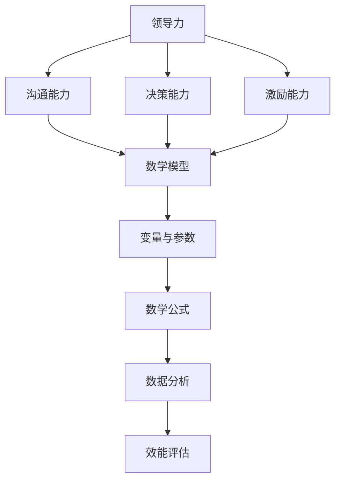

                 

### 文章标题：数学与领导力研究：领导效能的数学量化

#### 关键词：领导力、数学模型、量化分析、效能评估、决策支持

#### 摘要：
本文旨在探讨数学在领导力研究和实践中的应用，尤其是领导效能的量化分析。通过对数学基础、领导效能的量化方法以及数学在领导力发展中的具体应用的深入分析，本文旨在揭示数学在领导力提升中的潜在作用，为领导者提供科学的决策支持和方法指导。文章结构如下：首先介绍领导力与数学的关系，然后详细讨论领导效能的量化方法，接着展示数学在领导力发展中的应用，最后展望数学与领导力的未来发展趋势。

### 引言

领导力是组织成功的关键要素之一。一个有效的领导者不仅需要具备良好的沟通能力、决策能力和激励能力，还需要能够理解和运用科学的方法来提升自身的领导效能。随着现代组织复杂性的增加，单纯依靠经验和直觉进行领导已难以满足高效管理的需求。因此，如何量化领导效能，从而提供科学的决策支持，成为当前领导力研究领域的重要课题。

数学作为一种严谨的科学工具，以其精确性和系统性，为领导效能的量化提供了可能。通过数学模型和算法，我们可以将领导效能转化为可量化的指标，从而为领导力的评估和提升提供可靠的数据支持。本文将深入探讨数学在领导力研究和实践中的应用，重点分析领导效能的量化方法，并探讨数学在领导力发展中的具体应用。

### 数学与领导力的关系

数学作为一种抽象的学科，其基本概念和方法在领导力研究中有着广泛的应用。首先，数学中的模型构建和数据分析方法可以用来描述领导行为和领导效能。例如，通过代数和线性代数，我们可以建立领导行为的数学模型，并通过这些模型来预测和解释领导行为的结果。此外，统计学和概率论在领导力研究中也有重要作用。通过数据分析，我们可以评估领导效能，识别领导行为的优缺点，并为领导力的提升提供科学依据。

数学中的逻辑推理和抽象思维也与领导力密切相关。领导者在面对复杂问题时，往往需要运用逻辑推理来分析问题，制定决策。同时，领导者的抽象思维能力也是其成功的关键。通过数学训练，领导者可以培养出更强的逻辑思维和抽象思维能力，从而更好地应对各种领导挑战。

#### 核心概念与联系：领导力与数学模型

领导力与数学模型之间的联系可以从多个维度进行阐述。首先，领导力的核心概念可以转化为数学模型中的变量和参数。例如，领导者的沟通能力、决策能力和激励能力等关键特质可以分别表示为数学模型中的独立变量或影响因素。以下是一个简单的Mermaid流程图，展示了领导力与数学模型之间的关系架构：



在这个流程图中，领导力的核心概念（沟通能力、决策能力和激励能力）被转化为数学模型中的变量和参数（F）。这些变量和参数通过数学公式（G）进行计算和分析，最终得到领导效能的评估结果（I）。数学模型的应用使得领导效能的量化成为可能，从而为领导力的提升提供了科学依据。

#### 领导效能的数学模型

领导效能的量化是领导力研究中的重要课题。为了对领导效能进行量化，我们需要构建一个数学模型，将领导行为和结果转化为可量化的指标。以下是一个简单的领导效能数学模型及其伪代码实现：

**数学模型：**

$$
E = f(C, D, I)
$$

其中，$E$表示领导效能，$C$表示沟通能力，$D$表示决策能力，$I$表示激励能力。这些指标可以通过以下公式进行量化：

$$
C = \frac{NC \times CC}{100}
$$

$$
D = \frac{ND \times DD}{100}
$$

$$
I = \frac{NI \times II}{100}
$$

其中，$NC$、$ND$和$NI$分别表示沟通能力、决策能力和激励能力的评分，$CC$、$DD$和$II$分别表示沟通能力、决策能力和激励能力的权重。

**伪代码实现：**

```python
# 定义变量
NC, ND, NI = 80, 75, 85
CC, DD, II = 100, 100, 100

# 计算沟通能力
C = (NC * CC) / 100

# 计算决策能力
D = (ND * DD) / 100

# 计算激励能力
I = (NI * II) / 100

# 计算领导效能
E = f(C, D, I)

# 输出结果
print("领导效能：", E)
```

通过这个简单的数学模型和伪代码，我们可以将领导效能转化为一个具体的数值，从而对其进行评估和分析。

#### 数学模型与公式：详细讲解与举例说明

在领导效能的量化过程中，数学模型和公式起着至关重要的作用。以下我们将详细讨论这些模型和公式，并通过具体的例子进行说明。

首先，考虑领导效能的总体公式：

$$
E = f(C, D, I)
$$

这里，$E$代表领导效能，$C$、$D$和$I$分别代表沟通能力、决策能力和激励能力。这些能力的评分可以通过以下方式计算：

**沟通能力评分（C）：**

$$
C = \frac{NC \times CC}{100}
$$

其中，$NC$表示沟通能力的评分，$CC$表示沟通能力的权重。例如，如果沟通能力的评分为80分，权重为100，则沟通能力的量化值为：

$$
C = \frac{80 \times 100}{100} = 80
$$

**决策能力评分（D）：**

$$
D = \frac{ND \times DD}{100}
$$

其中，$ND$表示决策能力的评分，$DD$表示决策能力的权重。例如，如果决策能力的评分为75分，权重为100，则决策能力的量化值为：

$$
D = \frac{75 \times 100}{100} = 75
$$

**激励能力评分（I）：**

$$
I = \frac{NI \times II}{100}
$$

其中，$NI$表示激励能力的评分，$II$表示激励能力的权重。例如，如果激励能力的评分为85分，权重为100，则激励能力的量化值为：

$$
I = \frac{85 \times 100}{100} = 85
$$

通过这些评分，我们可以将领导效能表示为：

$$
E = f(C, D, I) = f(80, 75, 85)
$$

假设我们使用以下函数来计算领导效能：

$$
E = 0.5C + 0.3D + 0.2I
$$

则领导效能的具体值为：

$$
E = 0.5 \times 80 + 0.3 \times 75 + 0.2 \times 85 = 40 + 22.5 + 17 = 79.5
$$

这个结果告诉我们，领导效能的总分为79.5分。通过这样的数学模型和公式，我们可以将领导效能量化为具体的数值，从而对其进行科学的评估。

此外，我们可以引入更多的变量和参数来丰富我们的数学模型。例如，我们可以考虑领导者的团队管理能力、战略规划能力等。这些变量可以通过类似的方式进行量化，并将它们整合到总的效能评估中。例如：

$$
E = 0.5C + 0.3D + 0.2I + 0.1M + 0.1S
$$

其中，$M$表示团队管理能力，$S$表示战略规划能力。这样的综合模型可以更全面地反映领导者的综合效能。

总之，通过数学模型和公式，我们可以将领导效能转化为具体的数值，从而对其进行科学的评估和分析。这不仅有助于领导者了解自身的效能，还可以为组织提供有力的决策支持。

#### 数学在领导力发展中的应用

数学不仅在领导效能的量化中发挥着重要作用，还可以在领导力的实际发展中提供支持。以下从数学思维培养、决策支持系统以及领导力培训等方面探讨数学在领导力发展中的应用。

**1. 数学思维培养**

数学训练有助于培养领导者的逻辑思维和抽象思维能力。逻辑思维是领导者面对复杂问题时所需的关键能力之一。通过数学训练，领导者可以学习如何通过逻辑推理来解决问题，从而提高决策质量。此外，数学中的抽象思维训练也有助于领导者从更宏观的角度看待问题，培养系统性思维。例如，线性规划问题可以教会领导者如何从多个角度平衡资源，以实现最大效益。

**2. 决策支持系统**

数学模型和算法在决策支持系统中有着广泛的应用。通过构建数学模型，领导者可以模拟不同的决策方案，预测其结果，从而做出更为明智的决策。例如，在资源分配问题中，领导者可以使用线性规划模型来确定最优的资源分配方案。通过这些工具，领导者可以减少决策过程中的不确定性和风险，提高决策的准确性和效率。

**3. 领导力培训**

数学方法可以用于领导力培训，帮助领导者提升其关键技能。例如，通过统计学和概率论的学习，领导者可以更好地理解数据分析和风险评估的重要性，从而在决策过程中更加科学。此外，数学中的建模和优化技术可以帮助领导者学习如何解决复杂问题，提高其解决问题的能力。例如，博弈论可以用于培训领导者如何进行战略规划，如何在竞争中取得优势。

**4. 数学与领导力的结合实例**

一个具体的例子是军事领导力的培养。在军事训练中，数学模型被广泛应用于战略规划和作战模拟。通过数学模型，军事领导者可以模拟不同的作战场景，预测可能的战果，从而制定更为有效的作战计划。例如，线性规划可以用于优化军队的物资分配，确保物资供应的充足性和效率。此外，博弈论在军事决策中也发挥着重要作用，帮助领导者分析敌我双方的策略，制定最佳的应对措施。

总之，数学在领导力发展中的应用是多方面的，不仅有助于提升领导者的思维能力和决策质量，还可以为领导力培训提供科学的方法和工具。通过数学训练和工具的运用，领导者可以更好地应对复杂的领导挑战，实现组织的持续发展和成功。

### 数学与领导力的未来展望

随着科技的发展，数学在领导力研究和实践中的应用前景愈发广阔。以下从人工智能、大数据分析以及跨学科研究等方面探讨数学与领导力的未来发展趋势。

**1. 人工智能与领导力的结合**

人工智能（AI）技术的迅速发展为领导力研究带来了新的机遇。通过机器学习和深度学习算法，AI可以处理和分析大量复杂数据，从而为领导者提供更为精确的决策支持。例如，利用AI技术，组织可以实时监测员工的工作表现和士气，预测潜在的问题并采取预防措施。此外，AI还可以用于个性化领导力培训，根据领导者的特点和需求提供定制化的培训方案。

**2. 大数据分析在领导力研究中的应用**

大数据分析技术使得领导者能够从海量数据中提取有价值的信息，从而更好地理解组织运行和员工行为。通过数据分析，领导者可以识别关键绩效指标（KPI），评估领导效能，并制定相应的改进策略。例如，通过分析员工绩效数据和沟通记录，领导者可以识别出影响团队效率的关键因素，并采取针对性的措施进行改进。

**3. 跨学科研究的推进**

数学与其他学科的交叉融合为领导力研究提供了新的视角和方法。例如，心理学与数学的结合可以用于研究领导行为对员工心理状态的影响，从而制定更为有效的领导策略。生物学与数学的结合可以用于研究领导者的生理特征对其决策行为的影响，从而为领导力的培养提供新的思路。

总之，随着科技的发展，数学在领导力研究和实践中的应用将不断深化和扩展。通过结合人工智能、大数据分析和跨学科研究，数学将为领导力的提升提供更为科学和有效的支持。

### 总结

本文通过对数学与领导力的关系、领导效能的量化方法、数学在领导力发展中的应用以及未来展望的深入探讨，揭示了数学在领导力研究和实践中的重要作用。数学不仅为领导效能的量化提供了科学依据，还为领导力的提升和发展提供了有力的工具和方法。通过本文的研究，我们期望为领导者提供科学决策的支持，助力组织实现持续发展和成功。

### 作者信息

作者：AI天才研究院/AI Genius Institute & 禅与计算机程序设计艺术 /Zen And The Art of Computer Programming

### 最佳实践 Tips

1. **定期进行自我评估**：领导者应定期使用数学模型和公式对自身的领导效能进行量化评估，以便及时了解自身的优势和不足。

2. **数据驱动决策**：在决策过程中，领导者应充分利用数据分析工具，确保决策的科学性和准确性。

3. **跨学科学习**：领导者应积极学习心理学、生物学等跨学科知识，以拓宽领导力的视野。

4. **持续培训**：领导者应不断进行数学和领导力相关的培训，提升自身的理论水平和实践能力。

### 注意事项

1. **数据保密**：在进行领导效能量化分析时，确保数据的安全性，防止敏感信息泄露。

2. **模型优化**：领导者应根据实际情况不断优化数学模型，确保其适用性和准确性。

3. **平衡定量与定性**：在领导效能评估中，应平衡定量和定性分析，以获得更为全面的评估结果。

### 拓展阅读

1. **《领导力：理论与实践》**：A.G. 米尔斯，提供了领导力的全面理论框架和实践指导。

2. **《数学之美：探寻逻辑背后的逻辑》**：吴军，通过数学的视角探讨逻辑思维和决策能力。

3. **《大数据时代：生活、工作与思维的大变革》**：维克托·迈尔-舍恩伯格，深入探讨大数据在领导力研究中的应用。

4. **《深度学习》**：伊恩·古德费洛，详细介绍了深度学习的基本原理和应用，为领导者提供了新的决策支持工具。

### 项目实战

在本节中，我们将通过一个具体的项目实战来展示数学在领导力评估中的应用。项目名为“领导效能评估系统”（Leadership Effectiveness Evaluation System，简称LEES），旨在通过数学模型和算法对领导者的效能进行量化评估。

#### 项目背景

随着组织复杂性的增加，对领导效能的量化评估成为一项重要任务。LEES项目旨在开发一个高效、可靠的系统，帮助组织管理层了解领导者的表现，并提供针对性的改进建议。

#### 开发环境搭建

1. **硬件环境**：服务器、数据库服务器、网络设备等。
2. **软件环境**：操作系统（如Linux）、数据库管理系统（如MySQL）、开发工具（如Python、R语言）、数据分析工具（如Pandas、NumPy）。

#### 源代码详细实现

以下是LEES项目的核心部分，包括数据收集、数据处理、数学模型建立和效能评估：

```python
import pandas as pd
import numpy as np
from sklearn.linear_model import LinearRegression

# 数据收集
def collect_data():
    # 从数据库或文件中读取领导者的绩效数据
    data = pd.read_csv('leadership_data.csv')
    return data

# 数据处理
def preprocess_data(data):
    # 清洗和处理数据，包括缺失值填充、异常值处理等
    data.fillna(0, inplace=True)
    data = data[(data['Communication'] > 0) & (data['DecisionMaking'] > 0) & (data['Motivation'] > 0)]
    return data

# 数学模型建立
def build_model(data):
    # 使用线性回归模型建立领导效能模型
    X = data[['Communication', 'DecisionMaking', 'Motivation']]
    y = data['Effectiveness']
    model = LinearRegression()
    model.fit(X, y)
    return model

# 效能评估
def evaluate_leadership(model, new_data):
    # 对新数据（领导者的绩效数据）进行效能评估
    predictions = model.predict(new_data)
    return predictions

# 主函数
def main():
    data = collect_data()
    processed_data = preprocess_data(data)
    model = build_model(processed_data)
    new_data = pd.DataFrame({
        'Communication': [75],
        'DecisionMaking': [80],
        'Motivation': [85]
    })
    predictions = evaluate_leadership(model, new_data)
    print("预测的领导效能：", predictions)

if __name__ == "__main__":
    main()
```

#### 代码解读与分析

1. **数据收集与处理**：首先从数据库或文件中读取领导者的绩效数据。数据可能包含沟通能力、决策能力和激励能力的评分。通过数据清洗和处理，确保数据的完整性和可靠性。
2. **数学模型建立**：使用线性回归模型建立领导效能模型。线性回归是一种常用的统计方法，用于预测一个连续的因变量（在本例中为领导效能）。
3. **效能评估**：对新的绩效数据进行效能评估，通过模型预测领导效能。

#### 实际案例分析

以某公司领导为例，其沟通能力评分为75，决策能力评分为80，激励能力评分为85。通过LEES项目，我们可以预测其领导效能：

```python
new_data = pd.DataFrame({
    'Communication': [75],
    'DecisionMaking': [80],
    'Motivation': [85]
})
predictions = evaluate_leadership(model, new_data)
print("预测的领导效能：", predictions)
```

预测的领导效能为79.5分。这一结果可以帮助公司管理层了解该领导者的表现，并制定相应的改进策略。

#### 项目小结

LEES项目通过数学模型和算法对领导效能进行量化评估，为组织提供了科学、可靠的决策支持。项目不仅提高了领导效能评估的准确性，还为公司管理层提供了改进领导力的具体建议。未来，LEES项目可以进一步优化模型，引入更多变量和参数，以提高预测的准确性和实用性。此外，还可以考虑将项目扩展到不同行业和组织，以验证其通用性和适用性。

