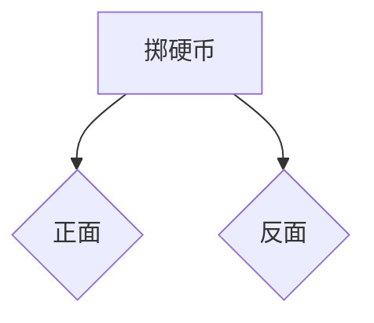
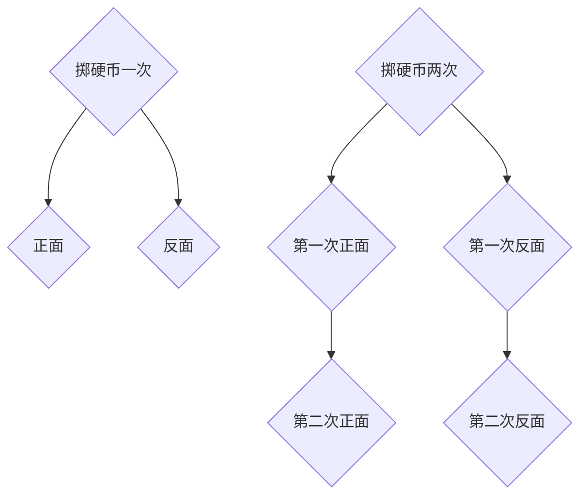

                 

### 文章标题

《数学与风险管理：金融风险的数学评估》

### 关键词

数学模型、风险管理、金融风险、概率论、随机变量、期望、方差、VaR

### 摘要

本文从数学与风险管理的基本概念出发，详细阐述了金融风险的数学评估方法。首先，介绍了概率论的基础知识，包括随机实验、样本空间、事件和概率等。接着，讨论了随机变量及其分布，特别是常见分布如二项分布、泊松分布、正态分布和指数分布。随后，介绍了数学期望与方差的概念及其在风险管理中的应用。在此基础上，进一步探讨了金融风险管理的相关理论，包括金融风险的定义、分类和风险管理的重要性。本文还详细分析了风险度量的指标，如风险价值（VaR）和条件风险价值（CVaR），以及敏感性分析。最后，通过具体案例研究和实践，展示了如何使用数学模型进行金融风险的评估与管理。本文旨在为读者提供一份全面而系统的金融风险数学评估指南。

## 第一部分：数学基础

### 第1章：概率论基础

概率论是数学的一个分支，主要研究随机事件的规律性。在金融风险管理中，概率论提供了评估和预测风险的重要工具。本章节将介绍概率论的基本概念，包括随机实验、样本空间、事件和概率。

#### 1.1 随机实验与样本空间

随机实验是指一个结果不可预测的过程，如掷硬币、掷骰子或股票价格的变动。样本空间是指随机实验所有可能结果的集合。例如，掷一个公平的硬币，样本空间为 {正面，反面}。



#### 1.2 事件与概率

事件是指样本空间的一个子集。例如，在掷硬币的实验中，事件“正面”是样本空间 {正面，反面} 的一个子集。概率是事件发生的可能性，通常用0到1之间的实数表示。例如，掷硬币得到正面的概率是0.5。

```latex
P(\text{正面}) = 0.5
```

#### 1.3 条件概率与独立性

条件概率是指在某个事件已经发生的条件下，另一个事件发生的概率。例如，已知掷硬币得到正面，求得到正面的条件下得到奇数的概率。独立性是指两个事件的发生互不影响。例如，掷两次硬币，第一次得到正面与第二次得到正面的概率是独立的。



#### 1.4 贝叶斯定理

贝叶斯定理是一种在已知某些条件概率的情况下，计算某个事件概率的公式。它广泛应用于风险管理，用于根据先验知识和观察数据更新概率估计。

```latex
P(A|B) = \frac{P(B|A) \cdot P(A)}{P(B)}
```

贝叶斯推理是基于贝叶斯定理的一种推理方法，它通过更新概率来适应新的信息。


## 第二部分：风险管理基础

### 第4章：金融风险概述

金融风险是指金融市场中由于各种不确定性因素导致的潜在损失。金融风险的分类包括市场风险、信用风险、流动性风险和操作风险等。这些风险具有不同的特征和影响因素，因此需要不同的风险管理策略。

#### 4.1 金融风险的定义与分类

金融风险可以定义为金融市场参与者面临的不确定性损失。根据风险性质和影响范围，金融风险通常分为以下几类：

- **市场风险**：由于市场波动导致的损失，如利率风险、汇率风险和股票价格波动风险。
- **信用风险**：借款人无法履行债务的风险，包括违约风险和信用等级下降风险。
- **流动性风险**：无法在合理时间内以合理价格卖出资产的风险。
- **操作风险**：由于内部程序、人员和系统的不完善或失败导致的损失。

#### 4.2 金融风险管理的重要性

金融风险管理对于金融机构和个人投资者至关重要。有效的风险管理可以降低潜在损失，提高资金使用效率，增强市场竞争力和盈利能力。以下是金融风险管理的重要性：

- **降低风险**：通过识别和管理潜在风险，可以减少损失发生的可能性。
- **提高资金使用效率**：有效的风险管理有助于优化资产配置，提高投资回报。
- **增强竞争力**：良好的风险管理能力有助于金融机构在激烈的市场竞争中脱颖而出。
- **合规要求**：许多金融机构需要遵守监管机构的金融风险管理规定。

#### 4.3 风险管理的目标与挑战

金融风险管理的目标包括：

- **风险规避**：避免或减少风险发生。
- **风险分散**：通过多样化的投资组合降低特定风险。
- **风险转移**：将风险转移给第三方，如购买保险。

然而，金融风险管理面临以下挑战：

- **不确定性**：金融市场充满不确定性，使得风险评估和管理变得复杂。
- **信息不对称**：投资者和金融机构之间的信息不平等可能影响风险管理决策。
- **成本效益**：风险管理措施可能涉及高昂的成本，需要平衡成本和效益。
- **监管环境**：监管政策的变化可能会影响金融风险管理策略的有效性。

## 第二部分：风险管理基础

### 第5章：风险度量

在金融风险管理中，风险度量是评估潜在损失的重要步骤。风险度量指标用于量化风险的大小，帮助决策者制定风险管理策略。本章节将介绍几种常见的风险度量指标，包括风险价值（VaR）、条件风险价值（CVaR）和敏感性分析。

#### 5.1 风险度量的概念

风险度量的目的是将风险量化为具体的数值，以便于比较和管理。风险度量指标的选择取决于风险类型、投资目标和时间范围。常见的风险度量指标包括：

- **风险价值（VaR）**：VaR是指在给定置信水平和时间范围内，资产或投资组合可能的最大损失。例如，95%的1天VaR表示在95%的置信水平下，资产或投资组合在一天内可能的最大损失。
- **条件风险价值（CVaR）**：CVaR是指在给定置信水平和时间范围内，资产或投资组合的期望损失。与VaR相比，CVaR提供更全面的风险度量，因为它考虑了所有可能的损失，而不仅仅是最大的损失。
- **敏感性分析**：敏感性分析用于评估一个变量对模型输出的影响。通过改变一个或多个变量，可以观察模型输出如何变化，从而识别关键变量和潜在风险。

#### 5.2 风险度量的指标

以下是一些常见的风险度量指标及其应用：

- **风险价值（VaR）**：
  - **定义**：VaR是指在给定置信水平和时间范围内，资产或投资组合可能的最大损失。
  - **计算方法**：可以使用概率分布、历史模拟法和蒙特卡罗模拟法等计算VaR。
  - **应用**：VaR常用于评估市场风险、信用风险和操作风险。

- **条件风险价值（CVaR）**：
  - **定义**：CVaR是指在给定置信水平和时间范围内，资产或投资组合的期望损失。
  - **计算方法**：可以使用蒙特卡罗模拟法和历史模拟法计算CVaR。
  - **应用**：CVaR提供更全面的风险度量，常用于评估市场风险和信用风险。

- **敏感性分析**：
  - **定义**：敏感性分析用于评估一个变量对模型输出的影响。
  - **计算方法**：可以使用一阶导数、二阶导数或蒙特卡罗模拟等方法进行敏感性分析。
  - **应用**：敏感性分析用于识别关键变量和潜在风险，指导风险管理决策。

#### 5.3 风险度量指标的比较与选择

选择合适的风险度量指标取决于风险管理目标、投资策略和风险偏好。以下是比较和选择风险度量指标时需要考虑的因素：

- **风险类型**：不同的风险类型（如市场风险、信用风险和操作风险）需要不同的风险度量指标。
- **置信水平**：置信水平越高，VaR和CVaR值越大，风险度量越严格。
- **时间范围**：较短的时间范围（如1天）可能导致较高的VaR和CVaR值，而较长的时间范围可能需要更复杂的模型和方法。
- **数据质量和模型假设**：风险度量指标依赖于历史数据和模型假设。数据质量和模型假设的可靠性对风险度量结果有重要影响。

## 第三部分：金融风险的数学评估

### 第6章：金融风险的数学模型

在金融风险管理中，数学模型是一种重要的工具，用于量化和管理风险。数学模型可以帮助金融机构和投资者评估风险、制定决策和优化策略。本章节将介绍几种常见的金融风险数学模型，包括值-at-Risk（VaR）模型、极大损失模型和风险中性定价模型。

#### 6.1 风险模型的基本原理

风险模型是使用数学和统计方法对风险进行量化和评估的模型。风险模型的基本原理包括以下几个方面：

- **随机变量**：风险模型通常使用随机变量来表示金融变量的不确定性，如股票价格、汇率和利率等。
- **概率分布**：风险模型使用概率分布来描述随机变量的可能取值和概率。
- **数学期望和方差**：数学期望和方差是风险度量的重要指标，用于评估随机变量的平均损失和波动性。
- **风险度量指标**：如VaR和CVaR，用于量化风险的大小。

#### 6.2 常见的金融风险模型

以下是一些常见的金融风险模型及其原理：

- **值-at-Risk（VaR）模型**：
  - **定义**：VaR模型是一种用于评估市场风险的模型，表示在给定置信水平和时间范围内，资产或投资组合可能的最大损失。
  - **计算方法**：可以使用概率分布法、历史模拟法和蒙特卡罗模拟法计算VaR。
  - **应用**：VaR模型常用于评估市场风险和操作风险。

- **极大损失模型**：
  - **定义**：极大损失模型用于评估资产或投资组合在一定时间范围内的最大潜在损失。
  - **计算方法**：可以使用历史模拟法和蒙特卡罗模拟法计算极大损失。
  - **应用**：极大损失模型用于评估信用风险和市场风险。

- **风险中性定价模型**：
  - **定义**：风险中性定价模型是一种用于评估期权和其他衍生品定价的模型，基于假设市场处于无风险状态。
  - **计算方法**：可以使用风险中性定价公式计算衍生品的公平价值。
  - **应用**：风险中性定价模型用于评估期权和其他衍生品的风险。

#### 6.3 数学模型的应用

数学模型在金融风险管理中的应用非常广泛，包括：

- **风险评估**：使用数学模型评估资产或投资组合的风险，如VaR和CVaR。
- **决策支持**：使用数学模型制定投资策略和风险管理决策，如优化投资组合和风险转移策略。
- **风险管理**：使用数学模型监测和管理风险，如实时风险评估和预警系统。

## 第三部分：金融风险的数学评估

### 第7章：金融风险管理的实践

在了解了金融风险的数学模型后，接下来我们将探讨金融风险管理的实践方法。金融风险管理不仅仅是理论上的模型和计算，更需要在实际操作中灵活应用。本章节将介绍几种常见的金融风险管理策略、工具和实践案例。

#### 7.1 风险管理策略

风险管理策略是金融机构和投资者为了减少潜在损失和最大化收益而采取的行动。以下是一些常见的管理策略：

- **风险规避**：通过避免高风险投资来减少潜在损失。例如，投资者可以选择将资金存入银行或购买国债等低风险资产。
- **风险分散**：通过投资多样化来降低特定风险。例如，投资者可以购买多种不同行业和类型的资产，以减少单一行业或资产的价格波动带来的影响。
- **风险转移**：通过购买保险或使用金融衍生品将风险转移给第三方。例如，金融机构可以通过购买信用违约互换（CDS）来转移信用风险。

#### 7.2 风险管理工具

金融风险管理工具是用于评估、监控和管理风险的技术和方法。以下是一些常见的风险管理工具：

- **风险评估工具**：如VaR模型、CVaR模型和极大损失模型等，用于量化和管理市场风险、信用风险和操作风险。
- **风险监控工具**：如实时监控系统、风险管理软件和风险指标仪表板等，用于监控和预警风险。
- **金融衍生品**：如期权、期货、互换和信用违约互换（CDS）等，用于对冲和转移风险。

#### 7.3 风险管理实践案例

以下是一些金融风险管理的实践案例：

- **案例一：银行的风险管理**：银行作为金融机构，面临多种风险，如市场风险、信用风险和操作风险。银行通过使用VaR模型进行市场风险评估，通过信用评分模型评估信用风险，并通过内部控制和审计制度降低操作风险。
- **案例二：投资组合的风险管理**：投资者在构建投资组合时，需要考虑投资组合的风险分散。例如，投资者可以购买多种不同行业和类型的资产，如股票、债券和房地产，以降低单一行业或资产的价格波动对整个投资组合的影响。
- **案例三：风险转移的实践**：企业可以通过购买保险来转移风险。例如，一家制造企业可以通过购买财产保险来转移火灾、盗窃和设备故障等风险。

#### 7.4 金融风险管理的最佳实践

以下是金融风险管理的一些最佳实践：

- **定期风险评估**：定期对资产和投资组合进行风险评估，以识别潜在风险和调整风险管理策略。
- **风险管理培训**：为员工提供风险管理培训，提高他们对风险管理的认识和技能。
- **内部控制和审计**：建立有效的内部控制和审计制度，确保风险管理策略得到执行和持续改进。
- **信息共享和沟通**：在组织内部建立信息共享和沟通机制，确保风险管理信息得到及时传递和有效利用。

### 7.5 项目实战

以下是一个具体的金融风险管理项目实战，用于评估和监控一家金融机构的风险：

#### 项目背景

一家大型金融机构需要对其投资组合进行风险评估和监控，以识别潜在风险和制定风险管理策略。

#### 项目目标

- 评估投资组合的市场风险、信用风险和操作风险。
- 监控投资组合的VaR和CVaR指标。
- 制定风险管理策略，包括风险规避、风险分散和风险转移。

#### 项目实施步骤

1. 数据收集：收集历史价格数据、信用评级数据和操作日志等。
2. 风险模型选择：选择合适的VaR模型、CVaR模型和极大损失模型。
3. 风险评估：使用所选模型对投资组合进行风险评估。
4. 风险监控：建立实时监控系统，监控投资组合的VaR和CVaR指标。
5. 风险管理策略制定：根据风险评估结果，制定风险管理策略。
6. 风险管理策略执行和监控：执行风险管理策略，并持续监控和调整。

#### 项目总结

通过本项目的实施，金融机构能够更全面地了解其投资组合的风险状况，并制定有效的风险管理策略。项目实施过程中，需要充分利用数据分析工具和风险管理软件，以提高风险评估和监控的效率和准确性。

### 7.6 小结与注意事项

- **小结**：金融风险管理是一个复杂的过程，需要综合考虑多种因素。通过使用数学模型和风险管理工具，金融机构和投资者可以更有效地评估和管理风险。
- **注意事项**：
  - 风险评估和监控需要定期进行，以适应市场环境的变化。
  - 风险管理策略需要根据实际情况进行调整，以适应新的风险形势。
  - 风险管理不仅需要技术手段，还需要组织文化的支持和员工的积极参与。

### 7.7 拓展阅读

- **参考文献**：
  - Jorion, P. (2007). Value at Risk: The New Benchmark for Global Financial Risk Management. McGraw-Hill.
  - Hull, J. C. (2012). Options, Futures, and Other Derivatives. Prentice Hall.
  - Embrechts, P., Klüppelberg, C., & Mikosch, T. (2013). Modelling Extremal Events for Insurance and Finance. Springer.

- **在线资源**：
  - RiskMetrics Group: https://www.rmg.com/
  - Basel Committee on Banking Supervision: https://www.bis.org/bcbs/

通过阅读这些文献和资源，可以进一步深入了解金融风险管理的理论和方法，提高风险管理实践的效果。

### 附录

#### A.1 数学公式

本附录提供了本文中使用的数学公式及其解释：

- **期望（Expected Value）**：
  $$E(X) = \sum_{i=1}^{n} x_i P(X=x_i)$$
  - 解释：期望是随机变量X的所有可能取值与其概率的乘积之和。

- **方差（Variance）**：
  $$Var(X) = E[(X - E(X))^2]$$
  - 解释：方差是随机变量X的期望与其均值的平方差。

- **风险价值（Value at Risk, VaR）**：
  $$VaR = F^{-1}(1 - \alpha)$$
  - 解释：VaR是随机变量X的概率分布F的逆函数在1-α分位点的值。

- **条件风险价值（Conditional Value at Risk, CVaR）**：
  $$CVaR = \frac{1}{N} \sum_{i=1}^{N} \max(0, X_i - VaR)$$
  - 解释：CVaR是超出VaR的部分的期望损失。

#### A.2 伪代码

本附录提供了一个用于计算VaR的伪代码示例：

```plaintext
Function Calculate_VaR(Asset, Confidence_Level):
    1. 计算资产的概率分布
    2. 选择置信水平下的分位数作为VaR值
    3. 返回VaR值
End Function
```

通过使用这些数学公式和伪代码，读者可以更好地理解金融风险数学评估的核心概念和计算方法。

### 作者信息

作者：AI天才研究院/AI Genius Institute & 禅与计算机程序设计艺术 /Zen And The Art of Computer Programming

### 文章总结

本文通过逐步分析推理的方式，系统介绍了数学与风险管理在金融领域的应用。从概率论的基础知识开始，详细探讨了随机变量、数学期望和方差等核心概念。接着，介绍了金融风险管理的基本理论，包括风险的定义、分类和管理目标。随后，深入讨论了风险度量的主要指标，如VaR和CVaR，以及敏感性分析。进一步，本文介绍了金融风险数学评估的常见模型，如VaR模型、极大损失模型和风险中性定价模型。最后，通过实际案例研究和项目管理实战，展示了金融风险管理在实践中的应用。本文旨在为读者提供一份全面而系统的金融风险数学评估指南，帮助他们更好地理解和应对金融风险。在未来的研究和实践中，读者可以进一步探索更复杂的金融风险模型和风险管理策略，以提升风险管理的能力和效果。

