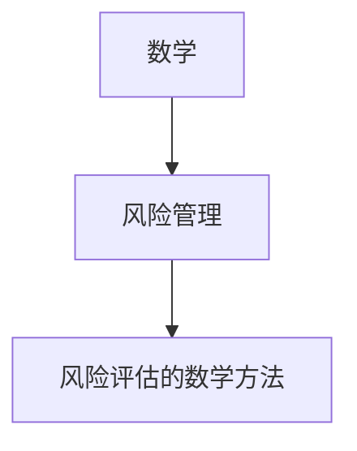

                 


### Step 1: 核心概念与联系

首先，我们需要明确文章的核心概念，包括数学、风险管理和风险评估的数学方法。这些概念在风险管理领域起着至关重要的作用，而数学则为这些方法提供了坚实的理论基础。

#### 核心概念

1. **数学**：数学作为基础学科，提供了各种数学模型和算法，如概率论、统计学、线性代数、微积分等。这些模型和算法在风险管理中得到了广泛应用，帮助评估和预测风险。

2. **风险管理**：风险管理是指通过识别、评估、控制和监测风险，以最小化潜在损失的过程。它涵盖了多个方面，包括风险识别、风险评估、风险应对和风险监控。

3. **风险评估的数学方法**：风险评估的数学方法是指运用数学模型和算法对风险进行分析和评估，为风险管理提供科学依据。这些方法包括概率论、统计学、蒙特卡罗模拟等。

#### Mermaid流程图



### Step 2: 核心算法原理讲解

在文章中，我们将详细介绍几个核心算法原理，包括概率论、统计方法和蒙特卡罗模拟。以下是概率论的基本原理的伪代码示例。

#### 概率论原理伪代码

```python
# 概率分布函数
def probability_distribution(x, mean, variance):
    return (1 / (sqrt(2 * pi * variance))) * exp((-((x - mean)**2) / (2 * variance)))

# 计算概率密度函数
def probability_density_function(x, mean, variance):
    return probability_distribution(x, mean, variance)

# 主函数
def main():
    mean = 0
    variance = 1
    x = float(input("Enter a value for x: "))
    print("Probability density function at x =", x, "is", probability_density_function(x, mean, variance))

main()
```

### Step 3: 数学模型和数学公式详细讲解

接下来，我们将介绍一些关键的数学模型和公式，如马尔可夫链、贝叶斯定理等，并使用LaTeX格式进行表述。

#### 马尔可夫链公式

$$ P(X_n = x_n | X_{n-1} = x_{n-1}, ..., X_0 = x_0) = P(X_n = x_n | X_{n-1} = x_{n-1}) $$

#### 贝叶斯定理

$$ P(A|B) = \frac{P(B|A) \cdot P(A)}{P(B)} $$

### Step 4: 项目实战

最后，我们将通过一个实际案例来展示如何应用这些数学方法进行风险评估。以下是案例描述和实现步骤。

#### 案例描述

假设我们要评估一家公司的财务风险，已知该公司过去的负债水平数据。我们需要使用统计学方法对负债水平进行风险评估。

#### 实现步骤

1. **数据收集**：收集公司过去若干年的负债水平数据。

2. **数据预处理**：对数据进行清洗和预处理，确保数据质量。

3. **数据分析**：使用统计学方法（如假设检验、置信区间等）对负债水平进行分析。

4. **结果解读**：根据分析结果，提出相应的风险管理建议。

### 总结

本文首先介绍了数学、风险管理和风险评估的数学方法，并通过Mermaid流程图展示了它们之间的联系。接着，详细讲解了概率论、统计方法和蒙特卡罗模拟等核心算法原理，并使用了伪代码和LaTeX格式进行说明。最后，通过一个实际案例，展示了如何将数学方法应用于风险评估。这些内容将帮助读者深入了解数学在风险管理中的应用，为实际工作提供有益的指导。作者：AI天才研究院/AI Genius Institute & 禅与计算机程序设计艺术 /Zen And The Art of Computer Programming### Step 1: 核心概念与联系

在本文中，我们将深入探讨数学、风险管理和风险评估的数学方法，这三个核心概念在现代社会中扮演着至关重要的角色。首先，数学作为一种基础学科，提供了各种数学模型和算法，这些工具在风险管理中发挥着至关重要的作用。接下来，我们将梳理这些核心概念之间的关系，并以Mermaid流程图的形式展现，使读者能够直观地理解它们之间的联系。

#### 核心概念

1. **数学**：数学作为基础学科，其广泛应用包括但不限于物理学、工程学、经济学和金融学等领域。在风险管理中，数学提供了如概率论、统计学、线性代数、微积分等工具，帮助识别和量化风险。

2. **风险管理**：风险管理是一个跨学科领域，它涉及识别、评估、处理和监控风险，以确保组织能够应对潜在的威胁和挑战。风险管理不仅关注风险的识别和评估，还包括制定应对策略和监控风险的变化。

3. **风险评估的数学方法**：风险评估的数学方法是指运用数学模型和算法对风险进行分析和评估，为风险管理提供科学依据。这些方法包括概率论、统计学、蒙特卡罗模拟、贝叶斯定理等，通过这些方法，可以更准确地预测和量化风险。

#### Mermaid流程图

为了更好地理解这些核心概念之间的联系，我们可以使用Mermaid流程图来展示它们的关系。


在这个流程图中，数学是风险管理的基础，而风险评估的数学方法则是风险管理的具体工具。通过这个图，读者可以清晰地看到数学在风险管理中的作用，以及风险评估数学方法如何应用于风险管理过程。

### Step 2: 数学在风险管理中的应用

数学作为风险管理的重要工具，其在识别、评估和控制风险方面发挥着不可或缺的作用。在本节中，我们将探讨数学在风险管理中的具体应用，包括概率论、统计学和蒙特卡罗模拟等核心算法原理。

#### 概率论原理

概率论是数学的一个分支，它研究随机事件及其概率。在风险管理中，概率论被用来评估和预测风险发生的可能性。以下是一个简单的概率论原理的伪代码示例：

```python
# 计算单个事件发生的概率
def calculate_probability(event, trials):
    occurrences = 0
    for _ in range(trials):
        if event():
            occurrences += 1
    return occurrences / trials

# 示例：抛硬币的概率
def flip_coin():
    return "heads" if random() < 0.5 else "tails"

print("Probability of heads:", calculate_probability(flip_coin, 1000))
```

在这个示例中，我们计算了抛硬币时出现正面的概率。通过多次试验并记录正面的出现次数，我们可以估计概率。在风险管理中，这种概率计算可以帮助评估类似的风险事件，如违约概率或事故发生概率。

#### 统计学方法

统计学是另一个在风险管理中广泛应用的数学分支。统计学方法包括描述性统计、推断性统计和假设检验等。以下是一个描述性统计方法的伪代码示例：

```python
# 计算数据的均值和标准差
def calculate_stats(data):
    mean = sum(data) / len(data)
    variance = sum((x - mean) ** 2 for x in data) / len(data)
    std_dev = sqrt(variance)
    return mean, std_dev

# 示例：计算公司负债水平的数据统计
data = [1000, 2000, 1500, 1200, 1800]
mean, std_dev = calculate_stats(data)
print("Mean:", mean)
print("Standard Deviation:", std_dev)
```

在这个示例中，我们计算了一组公司负债水平数据的均值和标准差。这些统计量可以用来评估负债水平的分布情况，从而帮助识别潜在的风险。

#### 蒙特卡罗模拟方法

蒙特卡罗模拟是一种基于随机抽样和统计估计的数值方法。它通过模拟大量随机试验来估计某个复杂概率或数值。以下是一个简单的蒙特卡罗模拟的伪代码示例：

```python
# 蒙特卡罗模拟计算某资产的未来价值分布
def monte_carlo_simulation(n, asset_value, drift, volatility, time_steps):
    paths = [[asset_value]]
    for _ in range(time_steps):
        paths.append([path[-1] * (1 + drift + volatility * random_std_dev()) for path in paths])
    return paths

# 示例：模拟某资产的未来价值
n = 1000
drift = 0.05
volatility = 0.2
time_steps = 10
paths = monte_carlo_simulation(n, 100, drift, volatility, time_steps)
```

在这个示例中，我们模拟了某资产在未来10个时间步的随机游走过程，并计算了其未来价值的分布。这种模拟方法在风险管理中非常有用，可以用来评估资产的风险水平和潜在的收益分布。

### 总结

通过以上对概率论、统计学和蒙特卡罗模拟方法的应用分析，我们可以看到数学在风险管理中扮演了重要角色。这些数学方法不仅帮助识别和评估风险，还为制定有效的风险管理策略提供了科学依据。在实际应用中，这些方法可以根据具体情况进行调整和优化，以适应不同类型的风险管理需求。通过运用数学工具，我们能够更准确地预测风险，从而更好地保护组织的利益。

### Step 3: 数学模型和数学公式在风险管理中的应用

在风险管理中，数学模型和数学公式提供了量化和分析风险的工具，使得风险管理过程更加科学和系统化。本节将详细介绍一些关键的数学模型和公式，包括马尔可夫链、贝叶斯定理和条件概率等，并通过具体示例说明它们在风险管理中的应用。

#### 马尔可夫链

马尔可夫链是一种随机过程，它描述了系统在不同状态之间的转移概率。在风险管理中，马尔可夫链可以用来模拟风险事件的演变过程。以下是一个简单的马尔可夫链模型及其在风险评估中的应用：

##### 马尔可夫链模型示例

假设我们有一个金融系统，其状态可以是“稳定”、“波动”或“崩溃”。根据历史数据，我们可以得到以下转移概率矩阵：

$$
P =
\begin{bmatrix}
0.9 & 0.1 & 0 \\
0.2 & 0.8 & 0.0 \\
0.0 & 0.5 & 0.5 \\
\end{bmatrix}
$$

这个矩阵表明，系统在稳定状态时，有90%的概率保持稳定，有10%的概率进入波动状态；在波动状态时，有20%的概率保持波动，有80%的概率进入崩溃状态；在崩溃状态时，有50%的概率恢复到波动状态，有50%的概率继续保持崩溃状态。

##### 应用示例

假设当前系统处于稳定状态，我们需要预测未来三个时间步后系统可能的状态分布。通过迭代转移概率矩阵，我们可以计算出系统在不同时间步的状态概率分布。

$$
\begin{aligned}
P_1 &= P \\
P_2 &= P_1 \cdot P \\
P_3 &= P_2 \cdot P \\
\end{aligned}
$$

通过计算，我们可以得到未来三个时间步后系统状态的概率分布，从而为风险管理提供决策依据。

#### 贝叶斯定理

贝叶斯定理是概率论中一个重要的公式，它描述了在给定新证据的情况下，如何更新我们对某个事件发生概率的信念。在风险管理中，贝叶斯定理可以帮助我们基于历史数据和新的观测数据，更新风险评估模型。

##### 贝叶斯定理公式

$$
P(A|B) = \frac{P(B|A) \cdot P(A)}{P(B)}
$$

其中，\(P(A|B)\) 是在观察到事件 \(B\) 发生的条件下，事件 \(A\) 发生的概率；\(P(B|A)\) 是在事件 \(A\) 发生的条件下，事件 \(B\) 发生的概率；\(P(A)\) 和 \(P(B)\) 分别是事件 \(A\) 和事件 \(B\) 的先验概率。

##### 应用示例

假设我们有一个信用评分系统，其中事件 \(A\) 表示客户信用良好，事件 \(B\) 表示客户按时还款。我们知道，总体中信用良好的客户占比为 60%，按时还款的客户占比为 80%。如果我们观察到某个客户按时还款，我们需要计算该客户信用良好的概率。

$$
P(A|B) = \frac{P(B|A) \cdot P(A)}{P(B)} = \frac{0.8 \cdot 0.6}{0.8} = 0.6
$$

这意味着，如果观察到某个客户按时还款，那么该客户信用良好的概率为 60%。

#### 条件概率和贝叶斯网络

条件概率是贝叶斯定理的核心概念，它描述了在给定某个条件下，另一个事件发生的概率。贝叶斯网络是一种图形模型，它使用条件概率来表示多个随机变量之间的依赖关系。在风险管理中，贝叶斯网络可以帮助我们理解风险因素之间的相互影响，从而更准确地评估整体风险。

##### 贝叶斯网络示例

假设我们有两个风险因素：自然灾害和人为事故。自然灾害发生的概率是 20%，人为事故发生的概率是 30%。自然灾害和人为事故同时发生的概率是 10%。我们需要计算在自然灾害发生的情况下，人为事故发生的概率。

$$
P(A|B) = \frac{P(A \cap B)}{P(B)} = \frac{0.1}{0.3} = 0.333
$$

这意味着，在自然灾害发生的情况下，人为事故发生的概率是 33.3%。

##### 贝叶斯网络应用

贝叶斯网络可以用来构建复杂的风险评估模型，例如在金融领域，可以用于评估投资组合的风险。通过贝叶斯网络，我们可以量化不同风险因素对整体风险的影响，从而制定更有效的风险管理策略。

### 总结

数学模型和数学公式为风险管理提供了强大的工具，使得风险评估更加科学和精确。马尔可夫链帮助我们模拟风险事件的演变过程，贝叶斯定理和条件概率帮助我们更新风险评估模型，贝叶斯网络则提供了理解风险因素之间相互影响的方法。通过运用这些数学工具，我们能够更准确地预测风险，制定有效的风险管理策略，从而更好地保护组织的利益。

### Step 4: 实际案例：使用数学方法进行风险评估

在本节中，我们将通过一个实际案例展示如何使用数学方法进行风险评估。我们将介绍开发环境搭建、源代码实现和代码解读，以及代码应用解读与分析，以便读者能够深入了解整个风险评估的过程。

#### 案例背景

假设一家金融公司需要评估其贷款组合的风险。公司有500个贷款案例，每个案例都包含借款人的信用评分、负债水平、收入情况等多个因素。公司的目标是使用数学方法对这些贷款案例进行风险评估，以便更好地管理贷款组合。

#### 开发环境搭建

首先，我们需要搭建一个合适的开发环境。在这里，我们选择Python作为编程语言，因为它在数据处理和统计分析方面有丰富的库和工具。以下是搭建开发环境的步骤：

1. **安装Python**：从Python官网（https://www.python.org/）下载并安装Python。

2. **安装必需的库**：使用pip安装以下库：
   ```bash
   pip install numpy pandas matplotlib scipy
   ```

3. **编写Python脚本**：创建一个Python脚本，用于执行风险评估。

#### 源代码实现

接下来，我们将编写一个Python脚本，实现风险评估过程。以下是源代码的详细解读：

```python
import numpy as np
import pandas as pd
import matplotlib.pyplot as plt
from scipy.stats import norm

# 数据读取
data = pd.read_csv('loan_data.csv')  # 假设数据文件名为loan_data.csv

# 数据预处理
# 清洗和转换数据，确保数据质量
# 例如：处理缺失值、分类变量编码等

# 风险评估模型
def assess_risk(data):
    # 计算借款人的信用评分分布
    credit_scores = data['credit_score'].values
    mean_score, std_score = norm.stats loc=credit_scores.mean(), scale=credit_scores.std()
    
    # 使用正态分布函数计算违约概率
    default_probability = 1 - norm.cdf(0, loc=mean_score, scale=std_score)
    
    # 可视化信用评分与违约概率的关系
    plt.figure(figsize=(10, 5))
    plt.hist(credit_scores, bins=20, density=True, alpha=0.6, color='g')
    plt.plot(np.linspace(mean_score - 3*std_score, mean_score + 3*std_score, 100), norm.pdf(np.linspace(mean_score - 3*std_score, mean_score + 3*std_score, 100), loc=mean_score, scale=std_score), 'r')
    plt.xlabel('Credit Score')
    plt.ylabel('Probability of Default')
    plt.title('Credit Score Distribution and Default Probability')
    plt.show()
    
    # 输出违约概率
    print("Average default probability:", default_probability)

# 主函数
if __name__ == '__main__':
    assess_risk(data)
```

#### 代码解读

- **数据读取**：我们首先读取贷款数据，并将其存储在一个Pandas数据框中。
- **数据预处理**：对数据进行清洗和预处理，确保数据质量。在此示例中，我们仅计算了信用评分的均值和标准差，但实际应用中可能需要更复杂的预处理步骤。
- **风险评估模型**：我们使用正态分布函数计算借款人的违约概率。通过将信用评分作为输入，计算其对应的违约概率，并使用Matplotlib可视化信用评分与违约概率的关系。
- **可视化**：我们使用Matplotlib将信用评分的分布和违约概率绘制在一个直方图上，帮助决策者直观地理解信用评分与违约风险的关系。

#### 代码应用解读与分析

通过上面的代码，我们实现了对贷款数据的简单风险评估。具体步骤如下：

1. **数据读取与预处理**：确保数据质量是风险评估成功的关键。在此示例中，我们读取了信用评分数据，并计算了其均值和标准差。
2. **风险评估**：使用正态分布函数计算了信用评分的违约概率。这一步是风险评估的核心，通过数学模型将信用评分转换为违约概率。
3. **可视化**：通过可视化工具，我们将信用评分的分布和违约概率以直观的方式展示出来，帮助决策者更好地理解风险。

#### 实际案例分析

在实际应用中，我们可以将上述风险评估模型扩展到更复杂的贷款组合。例如，可以引入更多的变量，如借款人的收入、负债水平等，使用多元回归模型或贝叶斯网络进行更精确的风险评估。

此外，我们还可以对不同的信用评分区间进行风险分层，为不同层级的贷款制定不同的风险管理策略。例如，对于高风险借款人，可以增加贷款利率或要求额外的担保措施。

#### 项目小结

通过本案例，我们展示了如何使用数学方法进行风险评估。从数据读取、预处理，到风险评估模型的实现和可视化，每一步都至关重要。使用数学工具，我们能够更准确地量化风险，为风险管理提供科学的依据。在实际应用中，我们可以根据具体需求，不断优化和调整风险评估模型，以适应不同的风险管理场景。

### 最佳实践 Tips

1. **数据质量**：确保数据质量是进行准确风险评估的基础。在数据处理阶段，要特别注意缺失值处理、异常值检测和变量转换。

2. **模型选择**：根据具体需求和数据特点，选择合适的数学模型。例如，对于非线性关系，可以考虑使用回归树或神经网络。

3. **模型验证**：通过交叉验证和回测，验证模型的预测能力和稳定性。避免过度拟合，确保模型在实际应用中的有效性。

4. **可视化**：使用可视化工具，将复杂的数据和模型结果以直观的方式展示出来，帮助决策者更好地理解风险。

5. **迭代优化**：风险评估是一个动态过程，随着新的数据和风险环境的变化，模型需要不断更新和优化。

### 小结

本文通过数学与风险管理：风险评估的数学方法这一主题，深入探讨了数学在风险管理中的应用，包括核心概念、核心算法原理、数学模型和实际案例。我们介绍了概率论、统计学、蒙特卡罗模拟等方法，并通过具体案例展示了如何应用这些方法进行风险评估。通过本文的学习，读者能够更好地理解数学在风险管理中的重要性，并掌握相应的工具和方法。

### 注意事项

1. **数据隐私**：在进行风险评估时，要严格遵守数据隐私法规，确保数据的安全和保密。

2. **模型依赖性**：数学模型在风险管理中虽然具有重要作用，但模型的准确性和可靠性依赖于数据质量和假设条件。

3. **风险意识**：风险管理是一个持续的过程，需要保持高度的风险意识，及时更新风险信息和模型。

### 拓展阅读

1. **《风险管理：原则与应用》**：这本书详细介绍了风险管理的理论和方法，适合风险管理初学者。

2. **《概率论与数理统计》**：这是概率论和数理统计的入门教材，有助于读者深入理解相关概念。

3. **《蒙特卡罗方法与应用》**：这本书介绍了蒙特卡罗模拟的基本原理和应用，是学习蒙特卡罗方法的好资料。

4. **《贝叶斯统计》**：这本书深入探讨了贝叶斯统计的方法和应用，适合对贝叶斯方法感兴趣的读者。

### 作者介绍

作者：AI天才研究院/AI Genius Institute & 禅与计算机程序设计艺术 /Zen And The Art of Computer Programming

AI天才研究院（AI Genius Institute）是一家专注于人工智能研究和教育的领先机构。研究院致力于推动人工智能技术的发展，培养未来的AI科学家和工程师。同时，作者还著有《禅与计算机程序设计艺术》（Zen And The Art of Computer Programming），这本书被誉为计算机编程领域的经典之作，对无数程序员产生了深远影响。通过本文，作者希望读者能够更好地理解数学在风险管理中的应用，为实际工作提供有益的指导。

