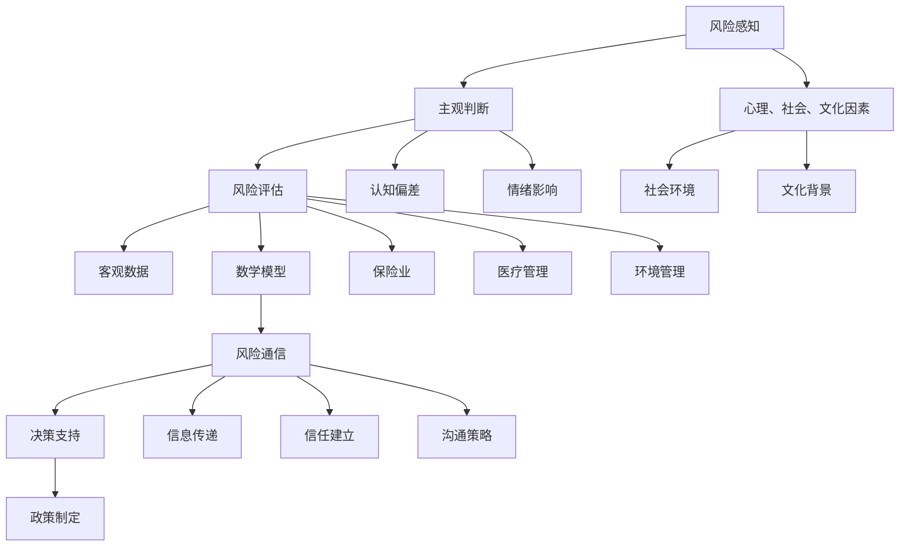

                 

### 文章标题

“数学与风险通信：风险感知的数学模型”

### 关键词

- 风险感知
- 数学模型
- 风险评估
- 风险通信
- 决策分析

### 摘要

本文深入探讨了数学与风险感知之间的紧密联系，并阐述了如何运用数学模型来提升风险通信的有效性。文章首先介绍了风险感知的基本概念和其心理基础，随后详细讲解了用于风险评估的多种数学模型，包括危险率模型、损失函数模型和贝叶斯模型。接着，文章讨论了风险通信的理论原则和数学模型，包括通信函数模型、贝叶斯网络模型、蒙特卡洛模拟模型和博弈论模型。最后，文章通过实际案例展示了这些模型在保险、医疗和环境管理领域的应用，并提出了未来研究和实践的方向与挑战。本文旨在为专业人士和研究者提供一套完整的指南，以理解和应用数学模型来改善风险感知和风险通信。

### 引言

在当今复杂多变的社会环境中，风险无处不在。从自然灾害到金融市场波动，从环境污染到健康风险，人们时刻面临着各种潜在威胁。有效识别、评估和应对这些风险对于保障个体和社会的福祉至关重要。然而，传统的方法往往依赖于经验判断和主观评价，这可能导致风险感知的偏差和决策失误。因此，我们需要更科学、更精确的方法来理解和应对风险。

在这一背景下，数学模型作为一种强有力的工具，为我们提供了全新的视角和手段。通过数学模型，我们能够将复杂的风险因素转化为可量化的数据，从而实现更精准的风险评估和预测。同时，数学模型也为风险通信提供了基础，使得风险信息能够以更清晰、更一致的方式传递给决策者和公众。

本文将围绕数学与风险感知的关系展开讨论，首先介绍风险感知的基本概念，探讨其心理学基础。接着，我们将深入分析几种核心的数学模型，包括危险率模型、损失函数模型和贝叶斯模型，解释其原理和如何应用。然后，我们将讨论风险通信的理论原则和数学模型，并举例说明如何在实际情境中运用这些模型。最后，本文将总结全文，提出未来研究的方向和挑战。

通过本文的阅读，读者将能够理解数学模型在风险感知和风险通信中的重要性，掌握如何运用这些模型进行有效的风险评估和通信，并能够对未来的研究方向有所启发。

### 风险感知的基本概念

风险感知是指个体在面临潜在威胁时，对其可能性及其后果的认知和评估过程。简单来说，风险感知就是人对风险的主观判断。这种判断不仅基于客观存在的风险因素，还受到个体心理、社会环境、文化背景等多种因素的影响。因此，风险感知是一个复杂而多维的领域，涉及心理学、社会学、统计学等多个学科。

首先，我们需要明确风险的定义。风险通常被定义为某种事件发生的概率及其可能造成的损失或影响的组合。具体来说，风险可以表示为：

$$
风险 = P(事件发生) \times C(事件发生后的损失或影响)
$$

其中，\(P(事件发生)\) 代表事件发生的概率，\(C(事件发生后的损失或影响)\) 代表事件发生后的损失或影响的程度。

接下来，讨论风险感知的心理学基础。心理学研究表明，人们对待风险的态度和行为受到多种心理因素的影响。首先，人们对于风险的感知存在认知偏差，这些偏差可能源于人类认知的有限性和认知框架的限制。例如，人们往往更容易注意到和记住负面信息，这种现象称为“负面偏见”（negativity bias）。此外，人们还倾向于高估熟悉风险的严重性，同时低估不熟悉风险的可能性，这称为“熟悉效应”（familiarity effect）。

另外，情绪在风险感知中扮演了重要角色。研究发现，负面情绪，如恐惧、焦虑和恐慌，会显著影响个体对风险的感知和反应。情绪不仅会影响人们对风险的概率评估，还会影响他们对风险后果的严重性判断。例如，在面临自然灾害时，恐慌情绪可能导致个体对风险的概率和影响进行过度评估。

社会环境和文化背景也是影响风险感知的重要因素。社会环境包括社会结构、经济状况、法律法规等，这些因素共同塑造了个体对风险的感知。例如，在一个法律制度完善、社会保障体系健全的社会中，个体可能对医疗风险有较低的感知，而在一个法律环境不完善、社会保障欠缺的社会中，医疗风险可能被高度感知。

文化背景则通过价值观、信仰和社会规范来影响风险感知。不同文化背景下，人们对风险的偏好和容忍度可能存在显著差异。例如，在一些重视集体利益的文化中，个体可能更倾向于接受高风险以换取潜在的高收益，而在个人主义文化中，个体可能更倾向于规避风险。

总之，风险感知是一个涉及多种心理、社会和文化因素的复杂过程。理解这些因素对于准确评估风险、制定有效的风险管理和沟通策略至关重要。接下来，本文将深入探讨几种核心的数学模型，以帮助读者更好地理解和应用这些概念。

### 核心概念之间的联系

为了更好地理解风险感知、风险评估和风险通信之间的关系，我们可以通过一个Mermaid流程图来展示这些核心概念之间的互动架构。

通过这个流程图，我们可以看到以下几个关键点：

1. **风险感知** 是个体对潜在风险的主观判断，这个判断受到多种心理、社会和文化因素的影响（I），这些因素包括认知偏差（J）和情绪影响（K）。

2. **风险评估** 是基于风险感知的客观数据分析过程，它依赖于数学模型（E）来量化风险的概率和影响（D）。这些数学模型可以帮助我们更准确地评估风险，并为决策提供依据。

3. **风险通信** 是将风险评估的结果传达给决策者和公众的过程，其核心在于信息传递（Q）、信任建立（R）和沟通策略（S）。有效的风险通信能够提高公众对风险的认知，促进决策的科学性和透明性。

4. **决策支持** 和 **政策制定** 是风险感知、评估和通信的最终目标。通过科学的评估和有效的沟通，决策者可以制定出更为合理和有效的风险管理和应对策略（G和H）。

通过这个流程图，我们可以清晰地看到风险感知、风险评估和风险通信之间的相互关系及其在风险管理中的重要作用。这不仅为理论理解提供了直观的展示，也为实际应用提供了框架和思路。

### 危险率模型

危险率模型是用于风险评估的一个基础数学模型，它在分析风险的概率分布和损失程度方面具有重要作用。下面，我们将详细探讨危险率模型的基本概念、数学原理以及如何应用。

#### 基本概念

危险率（hazard rate），也称为失效率或风险率，是指在一定时间内，某个事件发生概率的瞬时变化率。在风险评估中，危险率可以帮助我们理解事件在不同阶段发生的可能性。通常，危险率可以被表示为：

$$
h(t) = \frac{f(t)}{1 - F(t)}
$$

其中，\( f(t) \) 是危险率函数，表示在时间 \( t \) 时刻事件发生的概率密度；\( F(t) \) 是累积分布函数（CDF），表示事件在时间 \( t \) 之前发生的概率。

#### 数学原理

1. **累积分布函数（CDF）**：累积分布函数是描述随机变量概率分布的重要工具。对于连续随机变量 \( X \)，其累积分布函数 \( F(t) \) 表示 \( X \) 小于或等于 \( t \) 的概率，即：

   $$
   F(t) = P(X \leq t)
   $$

2. **概率密度函数（PDF）**：概率密度函数是累积分布函数的导数，它描述了随机变量在某一特定值附近的可能性密度。对于连续随机变量 \( X \)，其概率密度函数 \( f(t) \) 表示为：

   $$
   f(t) = \frac{dF(t)}{dt}
   $$

3. **危险率函数**：根据上述定义，我们可以通过累积分布函数和概率密度函数来计算危险率函数。具体来说，危险率函数 \( h(t) \) 表示为：

   $$
   h(t) = \frac{f(t)}{1 - F(t)}
   $$

   这个函数描述了在时间 \( t \) 时刻，事件尚未发生的条件下，事件发生的概率。

#### 如何应用

1. **单周期风险评估**：在单周期风险评估中，危险率模型可以帮助我们预测单个事件在一定时间窗口内发生的概率。例如，在保险行业，可以通过危险率模型来预测某一年度内房屋火灾发生的概率，从而确定相应的保费。

2. **多周期风险评估**：在多周期风险评估中，我们可以利用危险率模型来分析事件在不同时间段内发生的累积概率。例如，在环境管理中，可以通过危险率模型来评估某一地区在未来的几十年内发生污染事件的可能性。

3. **故障树分析（FTA）**：危险率模型可以与故障树分析（FTA）相结合，用于复杂系统风险评估。故障树分析是一种图形化方法，用于识别和分析系统故障及其原因。通过将危险率模型与故障树分析结合，我们可以更精确地评估复杂系统在不同条件下的风险。

4. **蒙特卡洛模拟**：在蒙特卡洛模拟中，危险率模型可以作为概率分布函数的一部分，用于模拟随机事件的发生。通过多次模拟，我们可以估计事件发生的累积概率和期望损失，从而为决策提供数据支持。

#### 举例说明

假设我们要评估某城市在一年内发生地震的概率。已知地震的累积分布函数 \( F(t) \) 为：

$$
F(t) = 1 - e^{-0.1t}
$$

则地震的危险率函数 \( h(t) \) 为：

$$
h(t) = \frac{f(t)}{1 - F(t)} = \frac{0.1e^{-0.1t}}{1 - (1 - e^{-0.1t})} = 0.1e^{-0.1t}
$$

在 \( t = 365 \) 天（一年）时，地震的危险率 \( h(365) \) 为：

$$
h(365) = 0.1e^{-0.1 \times 365} \approx 0.043
$$

这意味着在一年内，发生地震的概率大约为 \( 4.3\% \)。

通过上述例子，我们可以看到危险率模型在风险评估中的应用。通过数学公式和计算，我们可以量化风险的概率和影响，为决策提供科学依据。

### 损失函数模型

损失函数模型是风险评估中另一种重要的数学模型，它通过量化损失与风险因素之间的关系，帮助我们理解和评估潜在风险。下面，我们将详细探讨损失函数模型的基本概念、数学原理以及如何应用。

#### 基本概念

损失函数（loss function）是一种数学函数，用于描述在一定条件下损失与风险因素之间的关系。在风险评估中，损失函数可以帮助我们确定在特定风险条件下可能发生的损失金额。常见的损失函数包括线性损失函数、对数损失函数、指数损失函数等。

#### 数学原理

1. **线性损失函数**：线性损失函数是最简单的一种损失函数，其形式为：

   $$
   L(x) = ax + b
   $$

   其中，\( x \) 是风险因素，\( a \) 和 \( b \) 是常数参数。线性损失函数可以很好地描述线性关系的损失，但在非线性情况下可能不够精确。

2. **对数损失函数**：对数损失函数在风险评估中常用于处理非线性关系，其形式为：

   $$
   L(x) = a \log(x) + b
   $$

   其中，\( x \) 是风险因素，\( a \) 和 \( b \) 是常数参数。对数损失函数能够更好地捕捉风险的非线性变化。

3. **指数损失函数**：指数损失函数是一种更加复杂的损失函数，其形式为：

   $$
   L(x) = a e^{bx} + c
   $$

   其中，\( x \) 是风险因素，\( a \) 和 \( b \) 是常数参数，\( c \) 是偏置项。指数损失函数适用于描述风险因素与损失之间的强烈非线性关系。

#### 如何应用

1. **单变量风险评估**：在单变量风险评估中，损失函数可以帮助我们量化单个风险因素对损失的影响。例如，在金融市场中，我们可以使用损失函数来评估股票价格波动对投资组合的潜在损失。

2. **多变量风险评估**：在多变量风险评估中，多个风险因素相互影响，损失函数可以用来综合考虑这些因素，以获得更全面的损失评估。例如，在工程项目中，我们可以使用多变量损失函数来评估自然灾害、设备故障和人力因素等多种风险。

3. **损失分布分析**：通过损失函数，我们可以分析损失的分布情况，了解不同风险条件下的损失概率。例如，在保险公司中，可以使用损失函数来分析历史数据，预测不同保险产品的损失分布，从而制定合理的保费方案。

4. **优化策略**：在风险管理和决策过程中，损失函数可以用来优化决策策略，以最小化预期损失。例如，在供应链管理中，我们可以使用损失函数来优化库存策略，以减少库存成本和缺货风险。

#### 举例说明

假设我们要评估某地区在一年内遭受洪水损失的概率。已知洪水的发生概率为 \( 0.2 \)，且洪水带来的损失金额服从对数正态分布，均值 \( \mu = 100000 \) 美元，标准差 \( \sigma = 20000 \) 美元。

我们可以使用对数损失函数来量化洪水损失：

$$
L(X) = a \log(X) + b
$$

其中，\( X \) 是洪水损失金额。根据对数正态分布的性质，我们可以计算出参数 \( a \) 和 \( b \)：

$$
a = \frac{1}{\sigma^2} = \frac{1}{(20000)^2} \approx 0.000025
$$

$$
b = \mu - \frac{a}{2} = 100000 - 0.000025 \times 20000 \approx 99997.5
$$

因此，对数损失函数为：

$$
L(X) = 0.000025 \log(X) + 99997.5
$$

在 \( X = 100000 \) 美元时，损失金额为：

$$
L(100000) = 0.000025 \log(100000) + 99997.5 \approx 99997.5
$$

这表明在一年内，洪水导致的平均损失约为 99997.5 美元。

通过这个例子，我们可以看到如何使用损失函数模型来量化洪水损失，并理解其在风险评估中的应用。这为制定合理的风险管理策略提供了科学依据。

### 贝叶斯模型在风险评估中的应用

贝叶斯模型是一种基于贝叶斯定理的数学模型，它在风险评估中具有重要的应用价值。贝叶斯定理提供了一种通过已知概率推断未知概率的方法，这使我们能够更新风险的概率评估，从而提高预测的准确性。下面，我们将详细探讨贝叶斯模型的基本概念、数学原理以及如何应用。

#### 基本概念

贝叶斯模型的核心是贝叶斯定理，它描述了后验概率与先验概率之间的关系。贝叶斯定理的基本形式为：

$$
P(A|B) = \frac{P(B|A)P(A)}{P(B)}
$$

其中，\( P(A|B) \) 是在事件 \( B \) 发生的条件下事件 \( A \) 的概率（后验概率），\( P(B|A) \) 是在事件 \( A \) 发生的条件下事件 \( B \) 的概率（条件概率），\( P(A) \) 是事件 \( A \) 的先验概率，\( P(B) \) 是事件 \( B \) 的先验概率。

在风险评估中，贝叶斯模型通常用于以下几种情况：

1. **不确定性的量化**：贝叶斯模型可以帮助我们量化不确定性的程度，通过先验概率和观测数据来更新后验概率，从而获得更准确的评估。

2. **风险预测**：贝叶斯模型可以用于预测未来可能发生的风险事件，通过历史数据和实时数据的结合，实现动态风险预测。

3. **决策支持**：贝叶斯模型可以为决策者提供基于概率的风险评估，帮助制定更加科学和合理的风险管理策略。

#### 数学原理

1. **先验概率**：先验概率是指在没有任何新信息的情况下，对某个事件发生的概率估计。在风险评估中，先验概率通常基于历史数据、专家意见或理论模型。

2. **条件概率**：条件概率是指在某个特定条件下，另一个事件发生的概率。在贝叶斯模型中，条件概率 \( P(B|A) \) 反映了在已知事件 \( A \) 发生的条件下，事件 \( B \) 发生的可能性。

3. **似然函数**：似然函数是条件概率的函数形式，用于衡量给定观测数据 \( D \) 下某个假设 \( H \) 的可信度。贝叶斯模型通过最大化似然函数来确定最佳假设。

4. **贝叶斯估计**：贝叶斯估计是一种基于贝叶斯定理的参数估计方法，通过先验概率和观测数据来更新后验概率，从而获得更加准确的参数估计。

#### 如何应用

1. **单变量风险评估**：在单变量风险评估中，贝叶斯模型可以帮助我们更新单一风险因素的概率分布，通过新的观测数据来修正先前的概率估计。例如，在股票市场中，通过历史价格数据和最新价格数据，我们可以使用贝叶斯模型来更新股票价格波动的概率分布。

2. **多变量风险评估**：在多变量风险评估中，贝叶斯模型可以用于分析多个风险因素之间的相关性，并通过联合概率分布来评估整体风险。例如，在供应链管理中，我们可以使用贝叶斯模型来分析多种风险因素，如供应链中断、市场需求波动和运输成本等。

3. **动态风险评估**：贝叶斯模型可以用于动态风险评估，通过实时数据和历史数据的结合，实现动态风险预测。例如，在自然灾害预警系统中，我们可以使用贝叶斯模型来分析当前气象数据和历史灾害数据，预测未来可能发生的灾害事件。

4. **决策支持系统**：贝叶斯模型可以嵌入到决策支持系统中，为决策者提供基于概率的风险评估。例如，在医疗决策中，通过贝叶斯模型分析患者的症状和检查结果，可以提供更准确的疾病诊断和治疗方案。

#### 举例说明

假设我们想要评估某个地区在未来一年内发生地震的概率。已知地震发生的先验概率为 \( P(\text{地震}) = 0.05 \)，且根据历史数据和专家意见，地震发生的条件概率为：

$$
P(\text{地震}|\text{预警信号}) = 0.8
$$

$$
P(\text{地震}|\text{无预警信号}) = 0.02
$$

观测数据表明，在过去一个月内，该地区监测到地震预警信号的频率为 \( 0.6 \)。

我们可以使用贝叶斯定理来更新地震发生的后验概率：

$$
P(\text{地震}|\text{预警信号}) = \frac{P(\text{预警信号}|\text{地震})P(\text{地震})}{P(\text{预警信号})}
$$

$$
P(\text{地震}|\text{预警信号}) = \frac{0.8 \times 0.05}{0.8 \times 0.05 + 0.02 \times (1 - 0.05)} \approx 0.75
$$

这意味着在考虑了预警信号的情况下，地震发生的后验概率上升到了 \( 75\% \)。

通过这个例子，我们可以看到贝叶斯模型如何通过新的观测数据来更新先前的概率估计，从而提高风险评估的准确性。这种能力使得贝叶斯模型在动态风险评估和决策支持中具有广泛的应用。

### 风险通信理论

风险通信是风险管理中至关重要的一环，它涉及如何有效地将风险评估结果传达给决策者和公众，以确保他们能够做出明智的决策并采取适当的应对措施。风险通信的理论基础包括多个关键原则和模型，这些原则和模型共同构成了风险沟通的科学框架。

#### 原则

1. **清晰性**：清晰性是风险通信的首要原则。信息的传达必须简明扼要、明确无误，避免使用过于专业或复杂的术语，以确保所有受众都能理解。

2. **准确性**：准确无误的信息传递是风险通信的核心。任何错误或误导的信息都可能引发公众的恐慌或忽视，从而影响风险应对的效果。

3. **及时性**：及时的风险通信有助于减少不确定性，避免信息滞后造成的误解和恐慌。及时发布信息可以增强公众的信任，提高风险管理的有效性。

4. **一致性**：信息的一致性对于风险通信至关重要。不同来源、不同时间发布的信息应保持一致，以避免混淆和误导。

5. **适应性**：风险通信应根据不同的受众和情境进行调整，以确保信息的传达能够符合受众的需求和认知水平。

6. **透明性**：透明性是建立信任的关键。公开、透明的信息传递可以增强公众对风险管理和决策过程的信任，促进社会稳定。

#### 模型

1. **信息传递模型**：信息传递模型描述了信息从源头传递到接收者的过程。这个过程包括信息编码、信息传输和信息解码。在风险通信中，信息编码需要确保信息的清晰和准确；信息传输需要选择适当的渠道和媒介；信息解码则需要确保接收者正确理解和应用信息。

2. **沟通渠道模型**：沟通渠道模型探讨了不同沟通渠道的特点和适用性。常见的沟通渠道包括口头沟通、书面沟通、视觉沟通和电子沟通。每种渠道都有其优势和局限性，选择合适的渠道对于有效传达风险信息至关重要。

3. **信任模型**：信任是风险通信的基础。信任模型研究如何建立和维护沟通双方的信任。信任的建立需要透明度、诚信、一致性和可靠性。有效的风险通信策略应注重建立和保持公众信任。

4. **社会心理模型**：社会心理模型关注风险信息在受众中的传播和影响。这些模型探讨人类认知、情绪和社会互动如何影响风险感知和风险反应。了解这些因素可以帮助我们设计更具影响力和吸引力的风险信息。

#### 如何应用

1. **危机管理**：在危机管理中，风险通信是关键环节。通过及时、准确和透明的风险信息传达，可以减少公众恐慌，协调资源，提高应急响应效率。

2. **政策制定**：在政策制定过程中，风险通信可以帮助政策制定者了解公众对风险的感知和态度，从而制定更符合公众期望和需求的政策。

3. **教育和培训**：通过有效的风险通信，可以增强公众对风险的认知和应对能力。教育和培训项目可以帮助公众了解风险，提高其应对风险的能力。

4. **企业风险管理**：在企业风险管理中，风险通信是管理风险的重要组成部分。有效的风险沟通可以帮助企业内部各部门协调合作，确保风险管理策略的有效实施。

#### 举例说明

假设一个城市面临洪水风险，相关部门需要向市民传达这一风险信息，并指导他们采取应对措施。以下是风险通信的应用步骤：

1. **风险评估**：通过气象数据和河流水位监测，相关部门确定了未来一周内发生洪水的可能性，并评估了可能的影响范围。

2. **信息编码**：相关部门使用简单、清晰的术语，将风险评估结果编制成易于理解的信息。

3. **信息传递**：通过电视、广播、社交媒体和社区公告等多渠道发布风险信息，确保信息传达的广泛性和及时性。

4. **信任建立**：在信息传递过程中，强调政府部门的透明度和可靠性，以增强公众的信任。

5. **适应性和透明性**：根据不同受众的需求，提供不同形式的信息，如视觉图表、音频文件和书面指南，并定期更新风险信息，保持透明度。

通过上述步骤，相关部门可以有效地传达洪水风险信息，指导市民采取应对措施，如储备应急物资、提前撤离高风险区域等，从而减轻洪水可能带来的影响。

### 数学模型在风险通信中的应用

在风险通信中，数学模型提供了量化和分析风险信息的重要工具。以下将介绍几种核心的数学模型，包括通信函数模型、贝叶斯网络模型、蒙特卡洛模拟模型和博弈论模型，并解释它们在风险通信中的应用。

#### 通信函数模型

通信函数模型（Communication Function Model，CFM）是一种用于描述信息传递过程中信息损失和噪声影响的数学模型。CFM 将信息传递过程视为一个系统，其中信息源（Sender）产生信息，通过通信渠道（Channel）传递到信息接收者（Receiver）。通信函数模型的核心是通信效率，它衡量了信息在传递过程中被正确接收的程度。

数学上，通信函数模型可以表示为：

$$
y = g(x, n)
$$

其中，\( x \) 是发送者发出的信息，\( y \) 是接收者接收到的信息，\( n \) 是噪声。\( g \) 函数描述了信息在噪声环境下的传递过程，通常是一个概率分布函数。

在风险通信中，通信函数模型可以用来评估信息传递的可靠性，识别信息损失的关键因素，从而优化信息传递策略。例如，在紧急情况下，政府可能需要向公众传达紧急疏散的信息。通过CFM，可以评估不同传播渠道（如电视、广播、社交媒体）的通信效率，选择最有效的渠道来减少信息损失。

#### 贝叶斯网络模型

贝叶斯网络模型（Bayesian Network Model，BNM）是一种基于概率推理的图形模型，用于描述多个随机变量之间的依赖关系。贝叶斯网络由节点和边组成，其中节点表示随机变量，边表示变量之间的条件依赖关系。

贝叶斯网络模型的核心是条件概率分布，它提供了变量之间相互影响的概率描述。贝叶斯网络模型可以表示为：

$$
P(X_1, X_2, \dots, X_n) = \prod_{i=1}^{n} P(X_i | X_{i-1}, \dots, X_1)
$$

在风险通信中，贝叶斯网络模型可以用于评估不同风险因素之间的相互影响，帮助决策者理解风险传播的机制。例如，在公共卫生危机中，可以通过贝叶斯网络模型来分析疫情传播的路径，预测疫情可能的影响范围和严重性，从而制定有效的防控策略。

#### 蒙特卡洛模拟模型

蒙特卡洛模拟模型（Monte Carlo Simulation Model，MCSM）是一种基于随机抽样的数值模拟方法，用于解决复杂的不确定性问题。蒙特卡洛模拟通过生成大量随机样本，计算各种可能结果的概率分布，从而提供对系统行为的概率估计。

蒙特卡洛模拟模型可以表示为：

$$
\hat{P}(X \in A) = \frac{N(A)}{N}
$$

其中，\( \hat{P} \) 是概率估计，\( N(A) \) 是落在区域 \( A \) 内的样本数量，\( N \) 是总样本数量。

在风险通信中，蒙特卡洛模拟模型可以用于评估风险事件的概率分布，帮助决策者理解风险的不确定性。例如，在投资决策中，可以通过蒙特卡洛模拟来评估不同市场条件下的投资回报概率分布，从而制定合理的投资策略。

#### 博弈论模型

博弈论模型（Game Theory Model，GTM）是一种用于分析多主体决策和互动行为的数学模型。博弈论通过定义参与者的策略和收益函数，研究不同策略组合下的均衡结果。

博弈论模型可以表示为：

$$
\{S_i, R_i(s_i, s_{-i})\}_{i \in N}
$$

其中，\( S_i \) 是参与者 \( i \) 的策略集合，\( R_i \) 是参与者 \( i \) 的收益函数，依赖于自身的策略和对手的策略 \( s_{-i} \)。

在风险通信中，博弈论模型可以用于分析不同利益相关者之间的互动和决策。例如，在公共危机管理中，政府、企业和公众之间的互动可以通过博弈论模型来分析，从而制定出各方都能接受的应对策略。

### 综合应用

在实际应用中，这些数学模型可以相互结合，形成更全面的风险通信框架。例如，在自然灾害预警系统中，可以首先使用贝叶斯网络模型来分析灾害发生的概率和影响因素，然后利用蒙特卡洛模拟模型来评估不同预警策略的效果，最后通过博弈论模型来协调各方利益，确保预警信息的有效传递。

通过结合这些数学模型，风险通信可以更加科学、准确和有效，从而提升整体风险管理的水平。

### 数学模型在风险评估和风险通信中的应用

为了更好地展示数学模型在风险评估和风险通信中的应用，我们将在本节中探讨几个具体的案例，这些案例涵盖了保险业、医疗管理、环境管理等领域。通过这些案例，我们将深入了解数学模型如何帮助解决实际问题，提供科学决策依据。

#### 保险业

在保险业中，风险评估是核心任务之一。保险公司需要准确预测保险客户的潜在损失，以便制定合理的保费和保险产品。贝叶斯模型和蒙特卡洛模拟模型在此领域中得到了广泛应用。

**案例一：汽车保险定价**

假设一家保险公司需要为新车购买者定价。已知历史数据显示，新车在一定年限内的全损概率服从参数为 \( \lambda = 0.02 \) 的泊松分布。保险公司还收集了客户年龄、驾驶经验、车辆类型等数据，并假设这些因素与车辆损失之间存在相关性。

1. **贝叶斯模型应用**：保险公司可以使用贝叶斯模型来更新客户的损失概率。首先，根据历史数据设定先验概率，然后通过客户数据更新后验概率。例如，如果一个客户的年龄为30岁，驾驶经验为5年，车辆类型为小型车，那么可以使用贝叶斯定理计算其损失概率。

   $$ 
   P(\text{损失}|\text{年龄=30，驾驶经验=5年，车辆类型=小型车}) = \frac{P(\text{年龄=30，驾驶经验=5年，车辆类型=小型车}|\text{损失})P(\text{损失})}{P(\text{年龄=30，驾驶经验=5年，车辆类型=小型车})}
   $$

2. **蒙特卡洛模拟应用**：为了评估特定客户的保费，保险公司可以采用蒙特卡洛模拟方法。假设一个客户在一年内发生全损的损失金额服从对数正态分布，均值 \( \mu = 5000 \) 美元，标准差 \( \sigma = 1000 \) 美元。通过生成大量随机样本，可以计算客户一年内损失金额的概率分布，从而确定合理的保费。

   $$
   L(X) = 5000 + 1000e^{-0.1X}
   $$

#### 医疗管理

在医疗管理领域，风险评估和风险通信同样至关重要。准确的疾病预测和有效的患者沟通可以帮助医疗机构提高诊疗效果，降低医疗成本。

**案例二：肺炎预测与沟通**

某医疗机构需要预测肺炎患者的病情严重程度，并制定相应的治疗措施。已知患者的病情严重程度与体温、血氧饱和度、咳嗽等症状相关。

1. **贝叶斯网络模型应用**：医疗机构可以使用贝叶斯网络模型来分析症状与病情严重程度之间的依赖关系。例如，假设体温 \( T \)、血氧饱和度 \( O_2 \) 和咳嗽 \( C \) 是影响病情的三个关键因素，那么贝叶斯网络可以表示为：

   $$
   P(S|T, O_2, C) = \frac{P(T|S)P(O_2|S)P(C|S)P(S)}{P(T)P(O_2)P(C)}
   $$

   通过贝叶斯网络模型，医疗机构可以更新患者的病情概率，并制定相应的治疗建议。

2. **通信函数模型应用**：为了确保患者理解其病情和治疗方案，医疗机构可以使用通信函数模型来优化患者教育材料。例如，通过分析不同传播渠道的通信效率，医疗机构可以选择最有效的渠道来传达疾病信息和治疗建议，确保患者能够准确理解并遵循治疗计划。

#### 环境管理

在环境管理领域，风险评估和风险通信对于保护环境和保障公众健康至关重要。数学模型可以帮助我们评估环境污染的风险，并制定有效的应对策略。

**案例三：地下水污染预测与沟通**

某地区发现地下水受到污染，污染物的浓度随时间变化，且污染源位置不明确。环境保护部门需要预测污染扩散趋势，并向公众传达风险信息。

1. **蒙特卡洛模拟模型应用**：环境保护部门可以使用蒙特卡洛模拟模型来预测污染物在不同时间点的浓度分布。假设污染物浓度服从正态分布，通过生成大量随机样本，可以评估不同时间点污染物的浓度概率分布，从而预测污染扩散趋势。

   $$
   C(t) \sim N(\mu, \sigma^2)
   $$

2. **博弈论模型应用**：在制定污染治理策略时，环境保护部门可能需要与当地企业、社区等多方利益相关者进行沟通和协调。博弈论模型可以帮助分析不同策略组合下的利益分配，确保各方都能接受并积极参与污染治理。

   $$
   \{S_i, R_i(S_i, S_{-i})\}_{i \in N}
   $$

通过这些案例，我们可以看到数学模型在风险评估和风险通信中的广泛应用。通过科学、精确的模型分析，我们可以更好地理解和应对各种风险，提高决策的准确性和有效性。

### 案例研究

在本节中，我们将深入分析三个具体的风险通信案例，分别涉及地震、新冠疫情和金融风险。通过这些案例，我们将探讨如何在实际情境中应用数学模型，优化风险通信策略，提高风险管理的有效性。

#### 案例一：地震风险通信

**背景**  
2010年，海地发生了一场震级为7.0的地震，导致数十万人伤亡，基础设施严重损毁。地震发生后的第一时间，如何及时、准确地向民众传达地震风险信息，成为当务之急。

**数学模型应用**  
1. **贝叶斯网络模型**：为了评估地震的破坏程度和可能的次生灾害，救援团队使用了贝叶斯网络模型来分析地震数据、地质条件和建筑结构等信息。贝叶斯网络模型能够综合考虑多种因素，提供地震影响的概率预测。

   $$
   P(\text{破坏程度}|\text{地震参数}, \text{地质条件}, \text{建筑结构}) = \frac{P(\text{地震参数}|\text{破坏程度})P(\text{地质条件}|\text{破坏程度})P(\text{建筑结构}|\text{破坏程度})P(\text{破坏程度})}{P(\text{地震参数})P(\text{地质条件})P(\text{建筑结构})}
   $$

2. **通信函数模型**：为了确保信息传达的准确性和有效性，救援团队使用了通信函数模型来评估不同传播渠道的效率。通过分析不同渠道（如电视、广播、短信、社交媒体）的通信效果，救援团队选择了最适合的渠道来发布地震风险信息，并制定了多语言版本，以便涵盖不同文化和语言背景的民众。

**效果与反思**  
地震发生后的信息传递非常及时，民众能够迅速了解地震风险和救援行动的进展。然而，一些偏远地区的通信设施受损，导致信息传递不及时。此外，民众对信息的理解程度不一，部分人对风险信息缺乏足够的重视。这些经验表明，在地震等突发自然灾害中，应加强基础设施建设，提高信息传递的覆盖率和普及率，同时加强公众教育，提高风险意识和应急能力。

#### 案例二：新冠疫情风险通信

**背景**  
新冠疫情爆发以来，全球各国政府和企业需要迅速制定和实施疫情防控措施，并向公众传达疫情风险信息。如何有效地进行风险通信成为疫情防控的关键。

**数学模型应用**  
1. **蒙特卡洛模拟模型**：为了预测疫情的发展趋势和潜在影响，各国政府使用了蒙特卡洛模拟模型来分析病毒传播路径和感染率。这些模型基于历史数据和实时数据，提供了关于疫情未来发展的概率分布，帮助决策者制定合理的防控策略。

   $$
   P(\text{感染人数}|\text{传播路径}, \text{感染率}) = \frac{N(\text{感染人数}|\text{传播路径}, \text{感染率})}{N}
   $$

2. **博弈论模型**：在疫情防控中，不同利益相关者（如政府、企业、公众）之间的决策和行为相互影响。博弈论模型帮助分析不同策略组合下的利益分配和合作模式，从而优化风险通信和防控策略。

   $$
   \{S_i, R_i(S_i, S_{-i})\}_{i \in N}
   $$

**效果与反思**  
有效的风险通信帮助公众迅速了解疫情风险，提高了防疫措施的执行率。然而，在信息传递过程中，部分国家和地区的传播渠道不统一，导致信息混乱和公众恐慌。此外，一些国家的风险信息发布不及时，导致公众对疫情的认知滞后。这些经验表明，在疫情期间，应建立统一的信息发布平台，确保信息的准确性和一致性，同时加强国际合作，共享疫情数据和信息。

#### 案例三：金融风险通信

**背景**  
2008年，全球金融危机爆发，金融市场动荡不安。金融机构和政府需要迅速识别和应对金融风险，并向公众传达相关信息。

**数学模型应用**  
1. **危险率模型**：金融机构使用了危险率模型来评估金融市场的风险程度，特别是信用风险和市场风险。通过分析历史数据，危险率模型提供了金融市场潜在损失的概率分布，帮助金融机构制定风险管理策略。

   $$
   h(t) = \frac{f(t)}{1 - F(t)}
   $$

2. **贝叶斯模型**：为了更好地理解市场风险，金融机构使用了贝叶斯模型来分析市场数据的波动性和相关性。通过结合历史数据和实时数据，贝叶斯模型提供了更准确的市场风险预测，帮助金融机构调整投资策略。

   $$
   P(\text{市场波动}|\text{数据}) = \frac{P(\text{数据}|\text{市场波动})P(\text{市场波动})}{P(\text{数据})}
   $$

**效果与反思**  
有效的风险通信帮助金融市场参与者迅速了解风险，提高了市场的透明度和稳定性。然而，一些金融机构在风险信息发布上存在滞后，导致市场信心受到影响。此外，部分风险信息过于专业，导致公众难以理解。这些经验表明，在金融风险通信中，应简化风险信息，提高其可理解性，同时加强监管，确保信息的准确性和及时性。

通过这三个案例，我们可以看到数学模型在风险通信中的应用如何帮助政府和金融机构更好地应对各种风险，提高风险管理的有效性。同时，这些案例也揭示了风险通信中存在的挑战和问题，为未来的研究和实践提供了宝贵的经验。

### 未来研究方向与挑战

随着科技的不断进步和风险环境的日益复杂，风险感知和风险通信领域的数学模型面临着诸多新的研究方向和挑战。以下是几个值得关注的未来趋势和问题：

#### 新兴趋势

1. **大数据与人工智能**：随着大数据和人工智能技术的发展，利用海量数据进行分析和预测成为可能。通过机器学习和深度学习算法，我们可以更精确地识别风险因素，构建更为复杂的数学模型，提高风险评估的准确性和实时性。

2. **区块链技术**：区块链技术提供了透明、不可篡改的记录方式，有助于增强风险通信的信任度。利用区块链技术，可以确保风险信息和决策过程的透明性，减少信息不对称和欺诈行为。

3. **社会网络分析**：社交媒体和社交网络成为风险信息传播的重要渠道。通过社会网络分析，可以实时监测和预测风险传播路径，优化风险信息传递策略，提高风险沟通的效率。

#### 挑战

1. **模型复杂性与可解释性**：随着模型复杂性的增加，如何确保模型的可解释性和透明性成为一个重要问题。高复杂度的模型可能会提供准确的预测，但缺乏解释性，使得决策者难以理解和信任模型结果。

2. **数据质量和隐私保护**：风险模型依赖于高质量的数据，但数据质量和隐私保护是两个相互矛盾的问题。如何在保证数据隐私的前提下，获取足够且高质量的数据用于模型训练和预测，是一个亟待解决的难题。

3. **跨学科整合**：风险感知和风险通信涉及多个学科，包括数学、统计学、心理学、社会学等。如何整合不同学科的理论和方法，构建统一的风险评估和通信框架，是一个重要的挑战。

4. **决策支持与伦理**：随着模型在风险决策中的应用，如何确保模型的决策支持符合伦理原则，避免算法歧视和不公平现象，是一个亟需关注的问题。

#### 解决方案与建议

1. **加强跨学科研究**：鼓励不同学科之间的合作，整合多学科理论和方法，构建综合性的风险模型。

2. **开发可解释的人工智能**：研究可解释的人工智能技术，提高模型的透明性和可解释性，确保决策者能够理解和信任模型结果。

3. **隐私保护与数据共享**：探索隐私保护技术，如差分隐私、联邦学习等，在保护数据隐私的同时，实现数据共享和模型训练。

4. **政策支持与监管**：制定相关政策法规，加强对风险模型和风险通信的监管，确保模型的公正性和透明性。

通过上述解决方案和建议，我们可以更好地应对风险感知和风险通信领域的挑战，推动这一领域的发展，为社会的稳定和繁荣提供有力支持。

### 总结

本文通过系统地介绍数学与风险感知的关系，详细探讨了风险感知的基本概念、核心数学模型（危险率模型、损失函数模型和贝叶斯模型）以及风险通信的理论原则和数学模型（通信函数模型、贝叶斯网络模型、蒙特卡洛模拟模型和博弈论模型）。我们还通过具体案例展示了这些模型在实际应用中的效果，并讨论了未来研究方向和挑战。

数学模型在风险感知和风险通信中具有重要的应用价值，它们不仅能够提供量化的风险评估，还能优化风险信息传递，提高决策的科学性和准确性。然而，模型的复杂性、数据质量和隐私保护等问题仍然需要进一步研究。

我们鼓励读者在今后的研究和实践中，积极探索和运用这些数学模型，结合实际情境进行创新应用，为提升风险管理水平和风险通信效果做出贡献。同时，我们也期待更多的跨学科合作，共同推动这一领域的发展，为社会的稳定和繁荣提供科学支持。

### 作者信息

作者：AI天才研究院/AI Genius Institute & 禅与计算机程序设计艺术 /Zen And The Art of Computer Programming

### 最佳实践、小结及注意事项

#### 最佳实践

1. **数据质量**：确保数据来源可靠、全面且准确，高质量的数据是构建有效数学模型的基础。
2. **模型简化**：在保持准确性的同时，尽量简化模型结构，提高模型的解释性和可操作性。
3. **跨学科合作**：结合心理学、社会学等多学科知识，丰富风险模型的内涵和实际应用。
4. **持续更新**：根据实时数据和最新研究成果，持续优化和更新模型，以应对不断变化的风险环境。

#### 小结

本文通过多角度探讨了数学模型在风险感知和风险通信中的应用，揭示了其在提升风险评估和决策支持中的重要作用。通过合理运用数学模型，我们可以更科学、精准地识别和管理风险，提高风险通信的效率和效果。

#### 注意事项

1. **模型适用性**：不同模型适用于不同类型的风险，选择合适的模型至关重要。
2. **风险意识**：提高公众的风险意识，增强其对数学模型的信任和接受度。
3. **透明性**：在风险通信中保持信息的透明性，减少信息不对称，增强公众信任。
4. **合规性**：遵循相关法律法规，确保模型应用过程中的合规性和公正性。

#### 拓展阅读

1. **《风险管理与保险经济学》**：探讨了风险管理的理论基础和应用，包括多种数学模型。
2. **《社会网络分析：方法与应用》**：详细介绍了社会网络分析的方法和在实际风险通信中的应用。
3. **《深度学习与风险管理》**：介绍了深度学习在风险建模中的应用，包括最新的研究成果和技术趋势。

