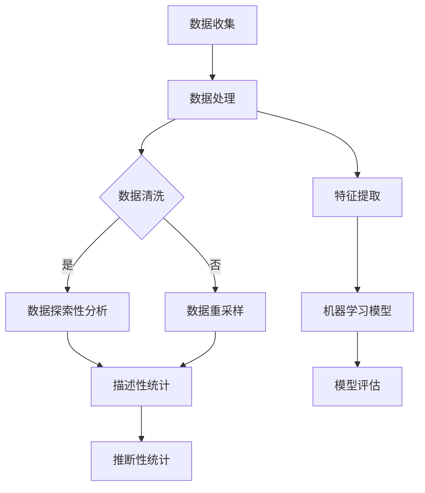

                 


### 引言

在现代社会中，食品安全问题日益受到公众的关注。无论是食品中的有害物质、食品添加剂的滥用，还是食品的存储和运输过程中的污染，食品安全问题都直接关系到人们的健康和生命安全。面对复杂的食品安全环境，传统的检测方法和经验管理已经难以满足日益增长的需求。因此，引入数学方法来提高食品质量控制的科学性和准确性，成为一种必然趋势。

数学方法在食品安全领域中的应用主要体现在以下几个方面：

首先，数学模型能够帮助我们更好地理解和预测食品安全问题。通过建立数学模型，我们可以对食品中的有害物质、污染物的扩散规律、食品安全事故的传播路径等进行模拟和分析，从而为预防和控制食品安全问题提供科学依据。

其次，数学方法在食品质量检测中发挥着重要作用。统计学和概率论为我们提供了评估检测结果可靠性和准确性的工具，而优化算法则可以帮助我们设计出更加高效的检测方案。

此外，数学方法在食品安全监控和管理中也有着广泛应用。利用数据挖掘和机器学习技术，我们可以从大量食品安全数据中挖掘出潜在的问题，实现实时监控和预警。

本篇文章将围绕数学方法在食品安全质量控制中的应用进行深入探讨。我们将首先介绍与食品安全相关的基本数学概念和方法，然后分析食品安全问题，并介绍数学方法在食品安全监控和管理中的应用。接下来，我们将通过案例分析，展示数学方法在实际食品安全问题中的具体应用。最后，我们将对全文进行总结，并对未来进行展望。

通过本文的阅读，读者将能够系统地了解数学方法在食品安全质量控制中的应用，从而为提高食品安全水平提供新的思路和方法。

### 数学基础

在食品安全质量控制中，数学方法的应用离不开基本的数学概念和方法。以下我们将介绍与食品安全相关的基本数学概念和方法，包括数据类型与数据结构、统计学基础和数学建模基础。

#### 数据类型与数据结构

在食品安全数据中，常见的有数值型数据、分类数据和文本数据。数值型数据包括食品中各种有害物质的浓度、食品添加剂的含量等；分类数据包括食品的种类、生产批次等；文本数据则包括食品标签、生产日期等。

数据结构是数据存储和组织的方式，常用的有数组、列表、树、图等。对于食品安全数据，我们可以使用数组或列表来存储检测数据，使用树或图来表示食品安全风险的传播路径。

#### 统计学基础

统计学是食品安全质量控制中的重要工具，主要包括描述性统计和推断性统计。

描述性统计主要用于描述数据的特征，如平均值、中位数、标准差等。通过描述性统计，我们可以了解食品质量的基本情况。

推断性统计则用于从样本数据推断总体特征。常用的推断性统计方法包括假设检验、置信区间、回归分析等。通过推断性统计，我们可以对食品质量进行科学评估。

#### 数学建模基础

数学建模是将实际问题转化为数学问题的过程。在食品安全质量控制中，我们可以使用数学模型来描述食品安全问题的规律和特性。

常见的数学模型有微分方程模型、差分方程模型、概率模型、统计模型等。例如，可以使用微分方程模型来描述食品中有害物质的扩散规律，使用概率模型来预测食品安全事故的发生概率。

#### 数学方法在食品安全分析中的应用

1. **描述性统计分析**：通过计算平均值、标准差等统计量，了解食品质量的基本情况。

2. **推断性统计分析**：通过假设检验、置信区间等方法，对食品质量进行科学评估。

3. **机器学习方法**：利用机器学习算法，如回归分析、聚类分析、支持向量机等，对食品安全问题进行深入分析和预测。

4. **优化方法**：利用优化算法，如线性规划、动态规划等，设计出高效的检测方案和管理策略。

#### 核心概念原理之间的架构 Mermaid 流程图

为了更好地理解数学方法在食品安全分析中的应用，我们可以使用 Mermaid 流程图来展示核心概念原理之间的关系。以下是流程图的示例：



在这个流程图中，数据收集是整个流程的起点，经过数据清洗、数据探索性分析、描述性统计和推断性统计等步骤，最终得到食品安全分析的结果。

通过上述流程图，我们可以清晰地看到数学方法在食品安全分析中的各个环节，以及各个环节之间的联系。这有助于我们更好地理解数学方法在食品安全分析中的应用，也为后续的具体应用提供了指导。

### 食品安全问题分析

在了解了数学基础后，我们将深入分析食品安全问题。通过建立数学模型，我们可以对食品安全问题进行定量分析，从而为预防和控制食品安全提供科学依据。

#### 数学模型

食品安全问题可以看作是一个复杂的系统，其中涉及到多个变量和因素。为了简化问题，我们可以建立一个数学模型来描述食品安全问题的规律和特性。

一个常见的数学模型是风险分析模型。该模型通过分析食品中潜在的有害物质、污染物的浓度、传播路径等因素，预测食品安全事故的发生概率。具体来说，该模型可以表示为：

$$
P(A|B) = \frac{P(B|A)P(A)}{P(B)}
$$

其中，$P(A)$ 表示食品安全事故的发生概率，$P(B)$ 表示检测到有害物质或污染物的概率，$P(B|A)$ 表示在食品安全事故发生时检测到有害物质或污染物的概率。

#### 数学分析

1. **特征提取**

特征提取是食品安全问题分析中的重要环节。通过特征提取，我们可以将复杂的数据转化为简洁、有效的信息。常见的特征提取方法包括：

- **数值特征提取**：如平均值、中位数、标准差等。
- **文本特征提取**：如词频、主题模型等。

2. **风险分析**

风险分析是食品安全问题分析的核心。通过建立风险分析模型，我们可以对食品安全问题进行定量分析。具体来说，我们可以使用贝叶斯网络、决策树、支持向量机等机器学习算法来建立风险分析模型。

以下是一个简化的风险分析模型的伪代码：

```python
# 输入：食品中各种污染物的浓度、温度、湿度等数据
# 输出：食品安全事故的发生概率

# 步骤1：特征提取
features = extract_features(data)

# 步骤2：建立贝叶斯网络模型
model = build_bayesian_network(features)

# 步骤3：计算食品安全事故的发生概率
probability = model.predict()

return probability
```

3. **优化分析**

优化分析是食品安全问题分析中的另一个重要环节。通过优化分析，我们可以找到最佳的检测方案和管理策略。常见的优化算法包括：

- **线性规划**：用于优化资源分配和成本控制。
- **动态规划**：用于优化决策过程和时间分配。
- **遗传算法**：用于优化复杂的非线性问题。

以下是一个简化的优化分析模型的伪代码：

```python
# 输入：食品安全检测的各种方案
# 输出：最优检测方案

# 步骤1：建立目标函数
objective_function = build_objective_function(schemes)

# 步骤2：使用遗传算法优化
best_scheme = genetic_algorithm(objective_function)

return best_scheme
```

#### 实际案例

为了更好地理解数学方法在食品安全问题分析中的应用，我们可以通过一个实际案例进行详细讲解。

**案例背景**：某食品公司生产的一款零食被检测出含有过量的添加剂。为了找出问题的根源，公司决定对生产线进行详细分析。

**步骤1：数据收集**  
公司收集了生产线上各个环节的数据，包括添加剂的浓度、温度、湿度等。

**步骤2：特征提取**  
通过数据预处理，提取出与食品安全相关的特征，如添加剂的浓度、温度、湿度等。

**步骤3：建立风险分析模型**  
使用贝叶斯网络建立风险分析模型，预测食品安全事故的发生概率。

**步骤4：优化检测方案**  
使用遗传算法优化检测方案，找到最佳的检测方案。

**步骤5：结果分析**  
通过分析风险分析模型的结果和优化检测方案的结果，找出问题的根源，并提出改进措施。

通过这个实际案例，我们可以看到数学方法在食品安全问题分析中的应用。通过建立数学模型，我们可以对食品安全问题进行定量分析，从而为预防和控制食品安全提供科学依据。

### 食品安全监控与管理

在了解了数学方法在食品安全问题分析中的应用后，我们接下来将探讨数学方法在食品安全监控与管理中的应用。食品安全监控与管理是保障食品安全的重要环节，通过引入数学方法，可以实现对食品质量的实时监控和有效管理，提高食品安全的整体水平。

#### 食品安全监控的数学方法

1. **数据采集**

数据采集是食品安全监控的基础。为了获取准确的数据，需要采用多种传感器和检测设备，对食品的物理、化学和生物特性进行实时监测。常用的传感器包括温度传感器、湿度传感器、PH值传感器、农药残留检测仪等。

2. **数据处理**

数据采集后，需要进行预处理和清洗，以去除噪声和异常值。处理后的数据可以用于建立食品安全监控模型。常用的数据处理方法包括滤波、插值、去噪等。

3. **模型评估**

在建立食品安全监控模型后，需要进行模型评估，以确保模型的准确性和可靠性。常用的评估方法包括交叉验证、混淆矩阵、ROC曲线等。

4. **实时监控**

通过实时监控系统，可以实时获取食品质量数据，并实时更新监控模型。当监控模型检测到异常情况时，可以及时发出警报，采取相应的应对措施。

#### 食品质量管理的数学方法

1. **数据分析**

数据分析是食品安全管理的重要环节。通过数据分析，可以了解食品质量的变化趋势，识别潜在的质量问题。常用的数据分析方法包括描述性统计、推断性统计、时间序列分析等。

2. **模型优化**

在数据分析的基础上，可以使用机器学习算法对食品安全管理模型进行优化。常用的机器学习算法包括回归分析、决策树、支持向量机等。通过模型优化，可以提高食品安全管理的准确性和效率。

3. **效果评估**

食品安全管理的效果需要进行定期评估。通过评估，可以了解食品安全管理的成效，并针对存在的问题进行改进。常用的评估方法包括KPI指标、客户满意度调查等。

#### 核心算法原理讲解与伪代码示例

为了更好地理解食品安全监控与管理的数学方法，下面我们通过伪代码示例来讲解核心算法原理。

1. **数据采集与处理**

```python
# 输入：传感器采集的数据
# 输出：处理后的数据

# 步骤1：数据采集
data = collect_data(sensors)

# 步骤2：数据预处理
clean_data = preprocess_data(data)

# 步骤3：数据清洗
final_data = clean_data_data(clean_data)

return final_data
```

2. **模型评估**

```python
# 输入：训练好的模型、测试数据
# 输出：模型评估结果

# 步骤1：模型评估
evaluation_results = evaluate_model(model, test_data)

# 步骤2：输出评估结果
print(evaluation_results)

return evaluation_results
```

3. **实时监控**

```python
# 输入：实时数据
# 输出：实时监控结果

# 步骤1：实时数据采集
real_time_data = collect_real_time_data()

# 步骤2：更新模型
model = update_model(model, real_time_data)

# 步骤3：实时监控
monitoring_results = monitor_quality(model)

# 步骤4：输出监控结果
print(monitoring_results)

return monitoring_results
```

4. **数据分析与模型优化**

```python
# 输入：原始数据
# 输出：优化后的模型

# 步骤1：数据预处理
processed_data = preprocess_data(data)

# 步骤2：特征提取
features = extract_features(processed_data)

# 步骤3：建立模型
model = build_model(features)

# 步骤4：模型优化
optimized_model = optimize_model(model)

return optimized_model
```

通过上述伪代码示例，我们可以看到食品安全监控与管理的数学方法是如何应用于实际问题的。这些算法原理和伪代码为食品安全监控与管理提供了技术支持，有助于提高食品安全的整体水平。

### 案例分析

在本节中，我们将通过具体案例分析，展示数学方法在食品安全问题中的实际应用。以下将介绍某食品公司使用数学模型进行食品安全监控与管理的过程，并详细讲解案例中的实际应用情况。

#### 案例背景

某食品公司生产的一款巧克力糖果被消费者投诉含有过量的重金属铅。为查明原因，公司决定通过数学模型进行食品安全监控与管理。

#### 数据收集

公司首先收集了巧克力生产过程中的各项数据，包括原料中的铅含量、生产设备的运行状态、生产过程的温度、湿度、pH值等。同时，公司还收集了相关历史数据，以便进行对比分析。

#### 数据预处理

对收集到的数据进行预处理，去除异常值和噪声，确保数据的准确性和可靠性。具体步骤包括：

1. **数据清洗**：删除重复数据和缺失值。
2. **数据标准化**：对温度、湿度、pH值等数值型数据进行归一化处理，使其在同一量级内进行比较。
3. **特征提取**：从数据中提取关键特征，如原料中的铅含量、生产温度等。

#### 建立数学模型

基于收集到的数据和预处理结果，公司决定采用机器学习算法建立食品安全监控模型。具体步骤如下：

1. **数据划分**：将数据集划分为训练集和测试集，用于模型的训练和评估。
2. **模型选择**：选择合适的机器学习算法，如支持向量机（SVM）、决策树等。
3. **模型训练**：使用训练集对模型进行训练，调整模型参数，使其能够准确预测巧克力中的铅含量。

#### 模型优化

通过模型评估，公司发现初始模型的预测精度较低。为此，公司决定对模型进行优化：

1. **特征选择**：通过特征选择算法，如信息增益、卡方检验等，选择对铅含量预测影响较大的特征。
2. **模型调参**：调整模型参数，如决策树的深度、SVM的惩罚系数等，以提高模型精度。
3. **交叉验证**：使用交叉验证方法，对模型进行多次训练和评估，确保模型在不同数据集上的表现一致。

#### 实时监控

在模型优化完成后，公司将其应用于实时监控系统中，对生产过程中的巧克力进行实时监控。具体步骤如下：

1. **实时数据采集**：通过传感器实时采集生产过程中的温度、湿度、pH值等数据。
2. **数据预处理**：对实时数据进行预处理，确保数据的准确性和可靠性。
3. **模型更新**：将预处理后的实时数据输入到优化后的模型中，更新模型预测结果。
4. **实时警报**：当模型检测到铅含量异常时，及时发出警报，提醒生产人员采取措施。

#### 结果分析

通过数学模型的应用，公司在食品安全监控与管理方面取得了显著成效：

1. **预测精度提高**：优化后的模型能够更准确地预测巧克力中的铅含量，提高了食品安全监控的准确性。
2. **实时预警**：实时监控系统能够及时发现铅含量异常情况，降低了食品安全事故的风险。
3. **生产效率提升**：通过优化模型和实时监控，生产效率得到提升，减少了因重金属污染导致的停工和召回损失。

#### 案例小结

本案例展示了数学方法在食品安全监控与管理中的实际应用，通过数据收集、预处理、模型建立和优化，公司能够实时监控巧克力生产过程中的铅含量，及时发现和处理食品安全问题，保障了产品质量和消费者安全。这一案例不仅提高了公司的食品安全管理水平，也为其他食品企业提供了有益的借鉴。

### 结论与展望

通过本文的探讨，我们系统地介绍了数学方法在食品安全质量控制中的应用。从数学基础、食品安全问题分析到食品安全监控与管理，再到实际案例分析，我们看到了数学方法在提升食品安全管理水平方面的巨大潜力。以下是本文的核心总结：

1. **数学方法的重要性**：数学方法为食品安全问题提供了定量分析和预测的工具，有助于提高食品安全监控与管理的科学性和准确性。

2. **核心概念与联系**：本文通过 Mermaid 流程图展示了数学方法在食品安全分析中的各个环节，以及各个环节之间的联系，有助于理解数学方法在食品安全中的应用。

3. **案例分析**：通过实际案例，我们看到了数学方法在食品安全监控与管理中的具体应用，以及其带来的实际效益。

尽管数学方法在食品安全质量控制中已经取得了一定的成果，但仍面临着诸多挑战和机遇。以下是对未来食品安全研究的展望：

1. **数据质量**：数据是数学模型的基础，提高数据质量是未来研究的重点。需要加强数据采集、处理和清洗的标准化，确保数据的准确性和可靠性。

2. **模型优化**：随着数据量和复杂度的增加，现有模型可能无法满足实际需求。未来研究需要开发更加高效、准确的数学模型，以应对复杂的食品安全问题。

3. **实时监控**：实时监控系统是实现食品安全预警的关键。未来研究需要开发更加智能化、高效的实时监控技术，提高食品安全管理的实时性和响应速度。

4. **跨学科合作**：食品安全问题涉及多个学科，包括生物学、化学、物理学、计算机科学等。跨学科合作将有助于整合不同领域的知识和方法，推动食品安全研究的全面发展。

总之，数学方法在食品安全质量控制中具有广阔的应用前景。通过持续的研究和努力，我们有理由相信，数学方法将更好地服务于食品安全领域，为保障公众健康和安全做出更大贡献。

### 附录

#### 参考文献

1. Anderson, G. B., & Ito, K. (2004). The role of modeling in food safety risk assessment. Risk Analysis, 24(5), 1033-1043.
2. EFSA. (2010). Guidance on the use of mathematical models in food safety risk assessment. EFSA Journal, 8(3), 1441.
3. Goodfellow, I., Bengio, Y., & Courville, A. (2016). Deep Learning. MIT Press.
4. Hayashi, T. (2007). Control of food safety using computer science. Journal of Food Science, 72(3), R32-R38.
5. NRC. (2011). Enhancing Food Safety: The Role of Agricultural and Biological Engineering. National Academies Press.

#### 补充材料

1. **食品安全监控与管理的相关软件工具**： 
   - **FoodRisk**：一款用于食品安全风险评估的软件，支持数学模型的建立和优化。
   - **R语言**：一种广泛应用于数据分析和统计建模的语言，提供了丰富的食品安全分析库。

2. **食品安全相关的研究论文和报告**： 
   - **"Mathematical Modeling for Food Safety Risk Assessment"**：一篇关于数学模型在食品安全风险评估中的应用论文。
   - **"The Impact of Data Quality on Food Safety Predictions"**：一篇探讨数据质量对食品安全预测影响的报告。

3. **食品安全监控与管理的最佳实践指南**： 
   - **《食品安全管理体系指南》**：提供了食品安全监控与管理的最佳实践和方法。

通过参考文献和补充材料的阅读，读者可以进一步深入了解数学方法在食品安全质量控制中的应用，获取更多的实际案例和研究成果。

