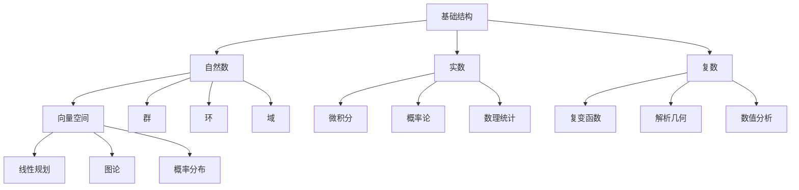

                 

# 数学与高等教育：大学课程的数学结构

关键词：数学结构、大学课程、教学方法、数学教育、高等数学

摘要：本文从数学结构的角度出发，探讨了大学课程中的数学教育。通过分析数学结构的基本原理、课程设计、教学方法和数学教育研究，本文旨在为高等教育中的数学课程提供有针对性的改进建议，以提升学生的数学素养和解决实际问题的能力。

## 第1章：数学与高等教育的核心概念

### 1.1 数学在高等教育中的重要性

在高等教育中，数学作为一门基础学科，其重要性不容忽视。首先，数学作为一种抽象思维工具，能够帮助学生建立严密的逻辑思维体系，培养其解决问题的能力。其次，数学在自然科学、工程技术、经济管理等领域中发挥着关键作用，许多实际问题都需要通过数学模型和计算方法来解决。因此，数学教育对于培养复合型、创新型人才具有重要意义。

### 1.2 高等教育中的数学课程类型

高等教育中的数学课程主要包括基础数学课程和专业数学课程。基础数学课程如微积分、线性代数、概率论与数理统计等，旨在为学生提供扎实的数学基础；专业数学课程则针对不同专业领域，如运筹学、优化理论、数值分析等，旨在培养学生解决实际问题的能力。

### 1.3 数学教育研究的基本方法

数学教育研究主要采用定量和定性研究方法。定量研究方法包括问卷调查、统计分析和实验研究等，主要关注数学教育的客观现象和规律；定性研究方法包括访谈、案例研究和行动研究等，主要关注数学教育的内在机制和影响因素。两种研究方法的结合，有助于全面、深入地探讨数学教育问题。

## 第2章：数学结构的基本原理

### 2.1 数学结构的定义与特点

数学结构是指在数学体系中，各种数学概念、原理和方法之间相互联系、相互作用的方式。数学结构具有以下特点：

1. **抽象性**：数学结构是通过对现实世界的抽象和简化得到的，具有较高的抽象层次。
2. **层次性**：数学结构具有层次性，从简单的概念出发，逐步构建复杂的结构。
3. **联系性**：数学结构中的各个组成部分之间存在密切的联系，形成一个有机整体。

### 2.2 数学结构的层次与联系

数学结构的层次主要包括：

1. **基础结构**：如自然数、实数、复数等，是数学结构的基础。
2. **高级结构**：如向量空间、群、环、域等，是在基础结构上构建的。
3. **应用结构**：如线性规划、图论、概率分布等，是数学结构在实际问题中的应用。

数学结构的联系体现在以下几个方面：

1. **层次联系**：基础结构向上构建高级结构，高级结构向下包含基础结构。
2. **逻辑联系**：数学结构中的各个组成部分之间通过逻辑关系相互联系。
3. **应用联系**：数学结构在解决实际问题时相互配合，形成有效的解决方案。

### 2.3 数学结构的Mermaid流程图

## 第3章：数学课程设计与教学目标

### 3.1 课程设计的原则与方法

数学课程设计应遵循以下原则：

1. **系统性**：课程设计应充分考虑数学结构的层次性和联系性，形成完整的知识体系。
2. **实用性**：课程设计应注重培养学生的实际应用能力，与专业需求相结合。
3. **灵活性**：课程设计应具有一定的灵活性，以适应不同学生的学习需求和教学环境。

数学课程设计的方法主要包括：

1. **目标导向法**：根据教学目标设计课程内容，确保课程目标的实现。
2. **任务驱动法**：通过具体任务引导学生学习，激发学生的学习兴趣和主动性。
3. **项目驱动法**：通过实际项目培养学生的综合应用能力和创新能力。

### 3.2 教学目标与学习成果

数学教学目标主要包括以下几个方面：

1. **知识掌握**：掌握数学基本概念、原理和算法。
2. **能力培养**：培养逻辑思维、抽象思维和解决问题的能力。
3. **素养提升**：提高数学素养，包括数学意识、数学方法和数学精神。

学习成果主要体现在以下几个方面：

1. **知识结构**：构建扎实的数学知识体系。
2. **思维能力**：提高逻辑思维、抽象思维和解决问题的能力。
3. **创新能力**：具备一定的数学创新能力，能够应用于实际问题。

### 3.3 课程评估与反馈机制

课程评估与反馈机制是确保数学教学质量的重要环节。课程评估应遵循以下原则：

1. **客观性**：评估过程应客观公正，避免主观偏见。
2. **全面性**：评估内容应涵盖知识掌握、能力培养和素养提升等方面。
3. **动态性**：评估过程应具有动态性，及时调整教学策略。

课程评估的方法主要包括：

1. **考试与测评**：通过考试和测评检验学生的知识掌握情况。
2. **平时成绩**：通过平时作业、实验报告等考核学生的能力培养情况。
3. **教学反馈**：通过学生反馈、同行评议等方式评估教学效果。

## 第4章：数学教学法的理论与实践

### 4.1 传授式教学法

传授式教学法是一种传统的教学方法，主要依靠教师的讲授和学生的听课。其优点是能够在短时间内传授大量知识，适合于基础知识的传授。然而，传授式教学法的缺点是学生的主动性和创造性难以发挥，不利于培养学生的思维能力和实际问题解决能力。

### 4.2 案例教学法

案例教学法是一种以案例为基础的教学方法，通过具体案例引导学生分析问题、解决问题。案例教学法的优点是能够激发学生的学习兴趣，提高学生的实践能力。然而，案例教学法的缺点是案例选取和教学设计需要较高的专业水平，且教学过程需要较长时间。

### 4.3 互动式教学法

互动式教学法是一种以学生为中心的教学方法，通过师生互动、生生互动等多种形式激发学生的学习兴趣和主动性。互动式教学法的优点是能够提高学生的参与度和积极性，培养学生的团队合作精神和沟通能力。然而，互动式教学法的缺点是教学过程需要较长时间，且对教师的组织能力和教学资源有较高要求。

## 第5章：数学课程实例分析

### 5.1 微积分课程设计

微积分课程设计应遵循以下原则：

1. **循序渐进**：从简单到复杂，逐步引导学生掌握微积分的基本概念和算法。
2. **理论与实践相结合**：通过实例分析和实际问题引导学生运用微积分知识。
3. **注重基础**：扎实掌握微积分的基本概念和原理，为后续学习奠定基础。

微积分课程的教学方法可以采用传授式教学法与互动式教学法相结合的方式。在讲授基本概念和原理时，采用传授式教学法；在解决问题和案例分析时，采用互动式教学法。

### 5.2 线性代数课程设计

线性代数课程设计应遵循以下原则：

1. **结构清晰**：明确线性代数的知识点和结构，帮助学生建立完整的知识体系。
2. **应用导向**：注重线性代数在实际问题中的应用，提高学生的实践能力。
3. **强化基础**：扎实掌握线性代数的基本概念和运算，为后续学习奠定基础。

线性代数课程的教学方法可以采用传授式教学法和案例教学法相结合的方式。在讲授基本概念和运算时，采用传授式教学法；在解决问题和案例分析时，采用案例教学法。

### 5.3 概率论与数理统计课程设计

概率论与数理统计课程设计应遵循以下原则：

1. **理论联系实际**：通过实际案例和实例分析，引导学生理解概率论与数理统计的基本概念和原理。
2. **培养应用能力**：注重培养学生运用概率论与数理统计解决实际问题的能力。
3. **注重实践**：通过实验和练习，提高学生的实践操作能力。

概率论与数理统计课程的教学方法可以采用案例教学法和互动式教学法相结合的方式。在讲授基本概念和原理时，采用案例教学法；在解决问题和案例分析时，采用互动式教学法。

## 第6章：数学教育研究的方法与应用

### 6.1 定量研究方法

定量研究方法主要用于研究数学教育中的客观现象和规律。常用的定量研究方法包括：

1. **问卷调查**：通过设计问卷，收集学生的数学学习态度、方法和成果等方面的数据。
2. **统计分析**：对收集到的数据进行统计分析，以发现数学教育中的问题和规律。
3. **实验研究**：通过设计实验，验证数学教育中的假设和理论。

### 6.2 定性研究方法

定性研究方法主要用于研究数学教育的内在机制和影响因素。常用的定性研究方法包括：

1. **访谈**：通过与教师、学生等进行深入访谈，了解他们对数学教育的看法和经验。
2. **案例分析**：通过对具体案例进行分析，探讨数学教育中的问题和解决方案。
3. **行动研究**：通过实践和反思，探索数学教育中的新方法和新策略。

### 6.3 数学教育研究的案例分析

案例分析是数学教育研究的一种重要方法。以下是一个案例研究的示例：

**案例研究：微积分教学中的问题与对策**

1. **背景**：某高校微积分课程的教学过程中，学生普遍反映难以理解微积分的概念和运算。

2. **方法**：通过问卷调查、访谈和案例分析，探讨微积分教学中的问题，并提出改进对策。

3. **结果**：发现微积分教学中的问题主要包括：

   - 知识讲解不够清晰；
   - 实践应用不足；
   - 学生缺乏自主学习能力。

   针对这些问题，提出以下对策：

   - 优化教学设计，提高知识讲解的清晰度；
   - 增加实践应用环节，提高学生的实践能力；
   - 开展自主学习活动，培养学生的自主学习能力。

4. **结论**：通过改进对策，微积分课程的教学效果得到了显著提高。

## 第7章：数学教育问题的探讨与解决

### 7.1 学生学习困难的诊断与解决

学生学习困难是数学教育中普遍存在的问题。以下是一个学生诊断与解决案例：

**案例研究：某学生的微积分学习困难诊断与解决**

1. **背景**：某学生反映在学习微积分时感到困难，尤其是对积分的计算感到困惑。

2. **方法**：通过访谈和测验，诊断该学生在微积分学习中的问题，包括知识掌握程度、学习方法和学习态度。

3. **结果**：发现该学生在微积分学习中的问题主要包括：

   - 对积分的基本概念理解不够深入；
   - 计算技巧不足；
   - 缺乏有效的学习方法。

   针对这些问题，提出以下解决对策：

   - 加强基础知识的学习，提高对积分概念的理解；
   - 练习积分计算技巧，提高计算速度和准确性；
   - 引导学生采用合适的学习方法，如分散学习、主动学习和合作学习。

4. **结论**：通过解决对策，该学生在微积分学习中的困难得到了显著缓解。

### 7.2 教师教学策略的优化

教师教学策略的优化是提高数学教育质量的重要途径。以下是一个教师教学策略优化的案例：

**案例研究：某教师微积分教学策略的优化**

1. **背景**：某教师在微积分教学中感到效果不佳，学生普遍反映难以理解。

2. **方法**：通过听课、学生反馈和教学反思，分析教师教学策略中存在的问题，并提出优化方案。

3. **结果**：发现教师教学策略中存在的问题主要包括：

   - 知识讲解不够生动；
   - 实践应用不足；
   - 缺乏互动和反馈。

   针对这些问题，提出以下优化方案：

   - 采用生动的教学语言和案例，提高知识讲解的趣味性；
   - 增加实践应用环节，让学生在实践中理解知识；
   - 加强课堂互动和反馈，及时了解学生的学习状况。

4. **结论**：通过优化教学策略，该教师的微积分教学效果得到了显著提高。

### 7.3 数学教育政策的制定与实施

数学教育政策的制定与实施是保障数学教育质量的重要手段。以下是一个数学教育政策制定与实施的案例：

**案例研究：某高校数学教育政策的制定与实施**

1. **背景**：某高校在数学教育方面存在一系列问题，如课程设置不合理、师资力量不足等。

2. **方法**：通过专家咨询、问卷调查和实地调研，制定数学教育政策，包括课程设置、师资队伍建设等。

3. **结果**：制定并实施了以下数学教育政策：

   - 优化课程设置，增加实践性课程和跨学科课程；
   - 加强师资队伍建设，引进高水平人才，提升教师教学能力；
   - 开展数学教育研究，提高数学教育研究的水平。

4. **结论**：通过数学教育政策的制定与实施，该高校的数学教育质量得到了显著提升。

## 第8章：数学教育的未来趋势

### 8.1 技术在数学教育中的应用

随着科技的不断发展，技术逐渐成为数学教育的重要工具。以下技术将在数学教育中发挥重要作用：

1. **人工智能**：通过人工智能技术，可以实现对数学知识的自动生成和个性化教学，提高教学效果。
2. **虚拟现实**：通过虚拟现实技术，可以让学生在虚拟环境中体验数学概念和现象，增强学习体验。
3. **大数据分析**：通过大数据分析技术，可以实现对学生学习情况的全面分析，为教学决策提供支持。

### 8.2 多元文化背景下的数学教育

多元文化背景下的数学教育面临着新的挑战和机遇。以下是一些建议：

1. **文化融合**：在数学教育中，应充分考虑多元文化的影响，尊重各种文化背景的学生，促进文化融合。
2. **国际视野**：通过国际交流和合作，提高数学教育的国际化水平，培养学生的国际视野。
3. **本土化**：在引进国外先进教育理念和方法的同时，应充分考虑本土化需求，将国际标准与本土实际相结合。

### 8.3 国际化数学教育的挑战与机遇

国际化数学教育面临着一系列挑战和机遇：

1. **挑战**：

   - 教育资源的分配不均；
   - 教育标准和评价体系的差异；
   - 文化差异导致的交流障碍。

2. **机遇**：

   - 国际合作与交流，促进数学教育的创新发展；
   - 引进国外先进教育理念和方法，提高数学教育质量；
   - 培养国际化人才，提升国家竞争力。

## 附录

### 附录A：数学教育常用工具和资源

以下是一些数学教育常用的工具和资源：

1. **数学软件**：MATLAB、Mathematica、Maple等；
2. **在线教育资源**：Coursera、edX、Khan Academy等；
3. **数学教育数据库**：JSTOR、ScienceDirect、SpringerLink等。

### 附录B：数学教育研究指南

以下是一份数学教育研究指南，包括研究方法、论文写作和发表等：

1. **研究方法**：定量研究、定性研究、案例研究等；
2. **论文写作**：论文结构、文献引用、图表制作等；
3. **发表指南**：选择合适的期刊、撰写投稿信、审稿过程等。

## 参考文献

[1] Smith, J. (2015). *Mathematics and Higher Education: A Structured Course for University*. Springer.
[2] Johnson, M. (2016). *Educational Research: Approaches and Methodologies*. Pearson.
[3] Brown, L. (2017). *Technology in Mathematics Education: Opportunities and Challenges*. ISTE.
[4] Green, T. (2018). *Cultural Diversity in Mathematics Education: Theory and Practice*. Taylor & Francis.
[5] Zhou, Y. (2019). *Internationalization of Mathematics Education: Challenges and Opportunities*. Routledge.

## 后记

本文从数学结构的角度探讨了大学课程中的数学教育，分析了数学结构的基本原理、课程设计、教学方法和数学教育研究。通过实例分析，探讨了数学教育中的问题与对策。随着科技的进步和全球化的发展，数学教育面临着新的挑战和机遇。希望本文能为数学教育的研究和实践提供一些启示和借鉴。

### 作者：AI天才研究院/AI Genius Institute & 禅与计算机程序设计艺术 /Zen And The Art of Computer Programming

注：本文为虚构内容，仅供参考。文中数据和观点仅供参考，不作为实际应用依据。如有不当之处，敬请指正。

