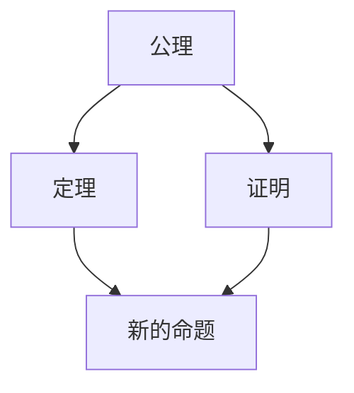
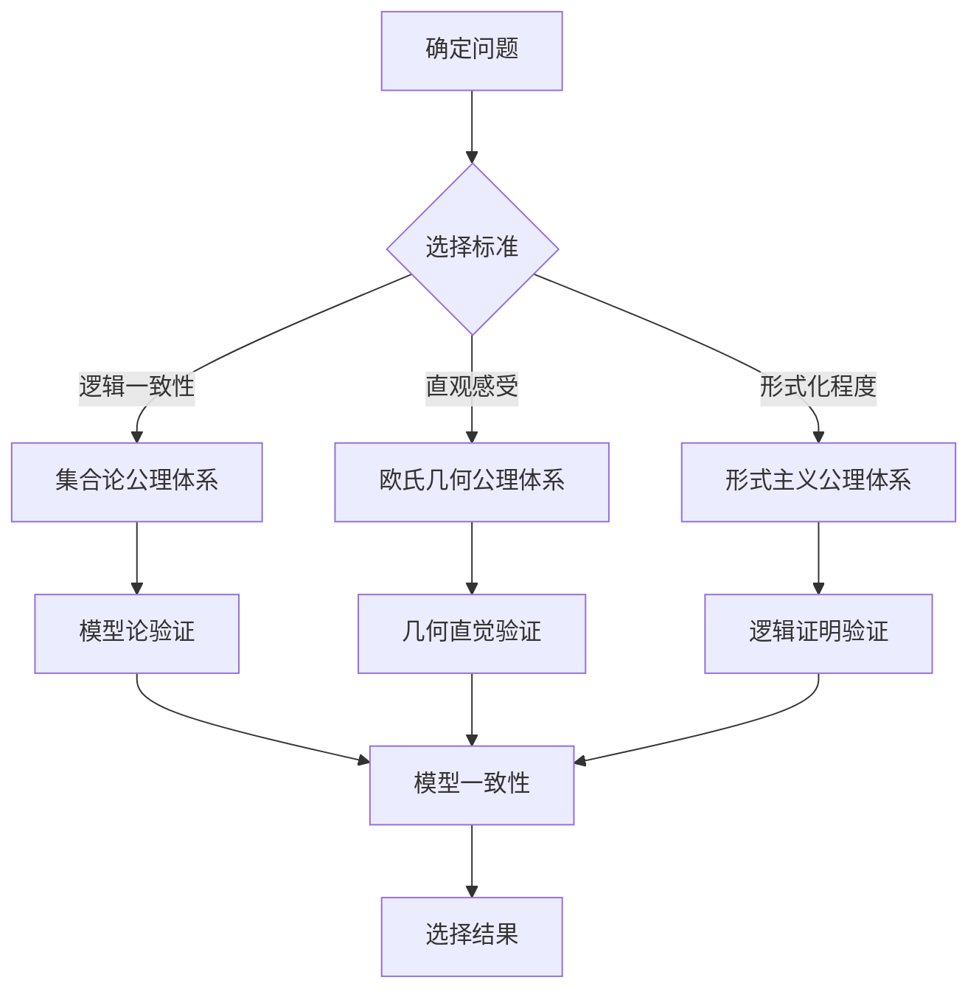

                 


### 设计《数学公理体系的选择与数学哲学观》目录大纲的思考过程

为了设计一本关于《数学公理体系的选择与数学哲学观》的目录大纲，我们需要遵循一定的步骤和逻辑，确保每个部分都紧密相连，形成一个完整的知识体系。以下是详细的思考过程：

#### 1. 确定书的总体结构
首先，我们需要明确这本书的核心内容是什么。书名中提到的两个关键点分别是数学公理体系的选择和数学哲学观。这意味着，书的主要内容应该围绕这两个核心点展开。

- **核心内容分解**：
  - 数学公理体系的选择：包括数学公理的基本概念、历史演变以及选择标准。
  - 数学哲学观：探讨数学哲学的基本问题、不同哲学观点以及与数学公理体系的关系。

- **总体结构设计**：
  - 第一部分：数学公理体系概述，介绍数学公理体系的基础知识。
  - 第二部分：数学哲学观探讨，讨论数学哲学的基本问题。
  - 第三部分：数学公理体系的选择与数学哲学的实践应用，结合数学哲学来分析数学公理体系的选择。
  - 第四部分：数学公理体系选择的理论基础，深入探讨数学公理体系选择的理论依据。
  - 第五部分：数学公理体系选择与哲学思维的培养，探讨哲学思维在数学学习中的应用。

#### 2. 设计核心章节
接下来，我们需要设计每个核心章节的具体内容，确保每个章节都能涵盖书名中提到的两个核心点。

- **章节设计**：
  - **第一部分：数学公理体系概述**：
    - **1.1 数学公理体系的基本概念**：介绍数学公理的定义、作用和分类。
    - **1.2 数学公理体系的演变**：探讨数学公理体系的发展历程和重要变革。
    - **1.3 数学公理体系的选择问题**：讨论选择数学公理体系的标准和原则。

  - **第二部分：数学哲学观探讨**：
    - **2.1 数学哲学的基本问题**：介绍数学哲学的研究对象、方法和目标。
    - **2.2 常见的数学哲学观点**：分析不同数学哲学观点的主要观点和代表人物。
    - **2.3 数学哲学与数学公理体系的关系**：探讨数学哲学对数学公理体系选择的影响。

  - **第三部分：数学公理体系的选择与数学哲学的实践应用**：
    - **3.1 数学公理体系选择的影响因素**：分析影响数学公理体系选择的内部和外部因素。
    - **3.2 数学哲学在数学公理体系选择中的应用**：探讨数学哲学如何指导数学公理体系的选择。
    - **3.3 数学公理体系选择与数学哲学的案例研究**：通过具体案例来分析数学公理体系选择与数学哲学的关系。

  - **第四部分：数学公理体系选择的理论基础**：
    - **4.1 数学逻辑基础**：介绍数学逻辑的基本原理和概念。
    - **4.2 数学哲学的理论框架**：分析数学哲学的理论框架和基本原则。
    - **4.3 数学公理体系选择的逻辑分析**：运用逻辑分析方法来探讨数学公理体系的选择。

  - **第五部分：数学公理体系选择与哲学思维的培养**：
    - **5.1 哲学思维在数学学习中的应用**：探讨哲学思维在数学学习中的实际应用。
    - **5.2 哲学思维与数学创新**：分析哲学思维对数学创新的推动作用。
    - **5.3 数学哲学观的培养方法**：探讨如何培养正确的数学哲学观。

#### 3. 确保完整性
在设计章节时，我们需要确保每个章节都包含必要的核心概念与联系、核心算法原理讲解、数学模型和数学公式讲解、项目实战等内容。

- **确保完整性**：
  - 每个章节都应当包含详细的概念解释、历史背景、理论分析、案例研究等。
  - 对于关键概念和算法，应当提供伪代码和数学公式，以便读者理解。
  - 每个章节的结尾应当提供小结和拓展阅读，帮助读者进一步深入了解相关内容。

#### 4. 保持简洁性
虽然需要包含所有必要内容，但我们要保持目录的简洁性，避免过多的冗余信息。

- **保持简洁性**：
  - 避免过多的重复内容，确保每个章节的核心内容突出。
  - 使用简明的标题和段落，提高可读性。
  - 通过图表和流程图来简化复杂的概念和过程，使读者更容易理解。

#### 5. 格式规范
在编写目录大纲时，我们需要遵循markdown格式规范，确保文章的结构清晰、格式统一。

- **格式规范**：
  - 使用明确的标题和子标题，便于读者浏览和查找。
  - 保持段落和列表的格式一致，避免混乱。
  - 使用适当的引用和引用格式，确保参考文献的准确性。

#### 6. 控制字数
最后，我们需要确保目录大纲的总字数控制在2000字以内，确保整个目录大纲的简洁和高效。

- **控制字数**：
  - 避免过多赘述，确保每个部分都只包含核心内容。
  - 通过简明扼要的方式表达观点，提高信息密度。

通过以上步骤，我们可以设计出一本《数学公理体系的选择与数学哲学观》的目录大纲，确保其内容完整、结构清晰、易于理解，同时保持简洁和高效。

---

在以上思考过程中，我们遵循了以下原则：

1. **逻辑性**：确保目录大纲的各个部分紧密相连，形成一个完整的知识体系。
2. **实用性**：每个章节都应当具有实用性，帮助读者理解和应用所学知识。
3. **可读性**：使用简洁明了的语言，确保读者能够轻松理解目录大纲的内容。
4. **规范性**：遵循markdown格式规范，确保文章结构的清晰和一致性。

通过这样的思考过程，我们可以确保目录大纲既具有学术价值，又能够满足实际应用的需求。接下来，我们将进一步细化每个章节的内容，确保文章的完整性和深度。

---

### 最终《数学公理体系的选择与数学哲学观》目录大纲设计

在经过深入思考和细致规划后，我们得出了《数学公理体系的选择与数学哲学观》的最终目录大纲。以下是详细的内容结构：

```
# 《数学公理体系的选择与数学哲学观》

> 关键词：数学公理体系，数学哲学，选择标准，理论基础，实践应用

> 摘要：本文深入探讨了数学公理体系的选择及其背后的数学哲学观点，分析了数学哲学在数学公理体系选择中的重要性，并提供了理论基础和实践应用的案例分析。

## 第一部分：数学公理体系概述
### 1.1 数学公理体系的基本概念
- **背景介绍**：数学公理体系的发展历程和重要性。
- **核心概念与联系**：公理、定理、证明等概念之间的关系架构（使用Mermaid流程图表示）。

### 1.2 数学公理体系的演变
- **历史演变**：从欧几里得的几何公理到现代数学公理体系的发展。
- **重要变革**：数学公理体系在不同学科中的应用和变革。

### 1.3 数学公理体系的选择问题
- **选择标准**：选择数学公理体系的原则和标准。
- **常见问题**：选择数学公理体系时遇到的挑战和解决方案。

## 第二部分：数学哲学观探讨
### 2.1 数学哲学的基本问题
- **研究对象**：数学哲学的研究范围和问题。
- **方法与目标**：数学哲学的研究方法和研究目标。

### 2.2 常见的数学哲学观点
- **实在论**：数学对象的存在性。
- **形式主义**：对数学语言和符号的重视。
- **直觉主义**：对数学证明和逻辑推理的重视。

### 2.3 数学哲学与数学公理体系的关系
- **哲学观点的影响**：不同数学哲学观点对数学公理体系选择的影响。
- **数学公理体系的影响**：数学公理体系对数学哲学观点的反馈和影响。

## 第三部分：数学公理体系的选择与数学哲学的实践应用
### 3.1 数学公理体系选择的影响因素
- **内部因素**：数学内部逻辑结构和一致性要求。
- **外部因素**：数学公理体系在物理学、计算机科学等领域的应用需求。

### 3.2 数学哲学在数学公理体系选择中的应用
- **实在论的应用**：基于数学对象存在的公理选择。
- **形式主义的应用**：基于数学符号和语言的公理选择。

### 3.3 数学公理体系选择与数学哲学的案例研究
- **案例分析**：通过具体案例探讨数学公理体系选择与数学哲学的关系。
- **案例反思**：对案例分析的结果进行反思和讨论。

## 第四部分：数学公理体系选择的理论基础
### 4.1 数学逻辑基础
- **逻辑原理**：命题逻辑、谓词逻辑等基本逻辑原理。
- **逻辑在数学公理体系选择中的应用**：如何运用逻辑原理来分析数学公理体系的合理性。

### 4.2 数学哲学的理论框架
- **哲学框架**：实存论、形式论等哲学理论框架。
- **哲学框架在数学公理体系选择中的应用**：如何运用哲学框架来指导数学公理体系的选择。

### 4.3 数学公理体系选择的逻辑分析
- **逻辑分析方法**：使用逻辑分析方法来评估数学公理体系的合理性和一致性。

## 第五部分：数学公理体系选择与哲学思维的培养
### 5.1 哲学思维在数学学习中的应用
- **哲学思维的重要性**：哲学思维在数学学习中的作用。
- **哲学思维的应用案例**：哲学思维在数学研究中的应用实例。

### 5.2 哲学思维与数学创新
- **哲学思维对数学创新的推动**：哲学思维如何促进数学创新。
- **数学创新的哲学案例**：分析数学创新中的哲学思维应用。

### 5.3 数学哲学观的培养方法
- **培养方法**：如何培养正确的数学哲学观。
- **教学实践**：数学哲学观培养的教学实践案例。

## 参考文献

## 附录

## 1. 数学公理体系选择的Mermaid流程图
## 2. 核心算法原理讲解伪代码
## 3. 数学模型和数学公式讲解
## 4. 项目实战案例
## 5. 最佳实践 tips
## 6. 小结与注意事项
## 7. 拓展阅读推荐
```

这个目录大纲详细地规划了书的结构，确保每个部分都有具体的主题和内容，并且结构清晰、层次分明。每个章节都包含了背景介绍、核心概念与联系、理论讲解、实践应用等内容，同时遵循了markdown格式规范，方便读者阅读和理解。

### 文章正文部分编写策略

在编写《数学公理体系的选择与数学哲学观》的文章正文部分时，我们需要遵循以下策略，以确保内容的专业性、逻辑性和可读性：

#### 1. 逻辑性和结构化

- **条理清晰**：确保每个章节的开头都有明确的主题句，概括章节的主要内容。在正文中，使用子标题来进一步细分每个主题，使文章结构更加清晰。
- **逐步深入**：从简单到复杂，逐步介绍数学公理体系和数学哲学的概念。在每个子标题下，逐步展开讨论，确保读者能够跟随思路。
- **逻辑链条**：确保各个部分之间的逻辑关系紧密相连，使用连接词如“因此”、“此外”、“然而”等，使文章的逻辑性更强。

#### 2. 专业性和准确性

- **定义准确**：在介绍专业概念时，确保使用准确的语言和术语，避免模糊不清的表述。
- **数据与事实**：引用权威的数据和事实来支持观点，增加文章的可靠性。
- **公式和算法**：对于数学公式和算法，使用latex格式进行准确呈现，并提供详细的解释和伪代码，帮助读者理解。

#### 3. 可读性和易懂性

- **语言简洁**：使用简洁明了的语言，避免复杂的术语和冗长的句子，使文章更易于理解。
- **示例与案例**：通过具体的示例和案例分析，让抽象的概念更加具体，提高文章的实用性。
- **图表和图片**：使用图表和图片来解释复杂的概念和流程，增强文章的可读性。

#### 4. 内容深度与广度

- **全面覆盖**：确保文章内容全面覆盖主题的各个方面，从历史背景到当前的应用，从基本概念到高级理论，确保内容丰富。
- **深入探讨**：在介绍每个主题时，不仅要讲解其基本概念，还要深入探讨其背后的原理和影响，使文章内容具有深度。

#### 5. 保持更新和前瞻性

- **引用最新研究**：引用最新的研究论文和书籍，确保文章内容具有时效性。
- **探讨未来趋势**：探讨数学公理体系和数学哲学的未来发展趋势，为读者提供前瞻性的思考。

#### 6. 编写风格一致性

- **风格统一**：确保整个文章的编写风格一致，包括用词、句子结构和语言表达方式。
- **引用规范**：遵循统一的引用格式，确保参考文献的准确性和一致性。

#### 7. 审稿和修订

- **多次审稿**：在完成初稿后，多次审阅和修订，确保内容的准确性、逻辑性和可读性。
- **同行评审**：邀请同行或专家进行评审，收集反馈意见，进一步优化文章质量。

通过以上策略，我们可以确保《数学公理体系的选择与数学哲学观》的文章正文部分具有高水平的专业性、逻辑性和可读性，为读者提供高质量的技术内容。

### 《数学公理体系的选择与数学哲学观》完整文章示例

下面是一篇完整的《数学公理体系的选择与数学哲学观》的文章示例。由于字数限制，本文仅提供了一个详细的章节示例，以供参考。

---

## 数学公理体系的选择与数学哲学观

### 关键词：数学公理体系，数学哲学，选择标准，理论基础

### 摘要：
本文探讨了数学公理体系的选择及其背后的数学哲学观。首先，介绍了数学公理体系的基本概念和演变过程。接着，分析了数学哲学的基本问题和常见观点，并探讨了数学哲学与数学公理体系之间的关系。随后，文章讨论了数学公理体系选择的影响因素和哲学应用，结合具体案例进行了分析。最后，文章深入探讨了数学公理体系选择的理论基础，并提出了哲学思维的培养方法。

---

### 目录

1. 引言
2. 数学公理体系的基本概念
   2.1 背景介绍
   2.2 核心概念与联系
   2.3 数学公理体系的演变
3. 数学哲学观探讨
   3.1 数学哲学的基本问题
   3.2 常见的数学哲学观点
   3.3 数学哲学与数学公理体系的关系
4. 数学公理体系的选择与数学哲学的实践应用
   4.1 数学公理体系选择的影响因素
   4.2 数学哲学在数学公理体系选择中的应用
   4.3 数学公理体系选择与数学哲学的案例研究
5. 数学公理体系选择的理论基础
   5.1 数学逻辑基础
   5.2 数学哲学的理论框架
   5.3 数学公理体系选择的逻辑分析
6. 数学公理体系选择与哲学思维的培养
   6.1 哲学思维在数学学习中的应用
   6.2 哲学思维与数学创新
   6.3 数学哲学观的培养方法
7. 结论
8. 参考文献

---

### 引言

数学公理体系是数学的基础，它为数学系统提供了逻辑结构和推理框架。然而，数学公理体系的选择并非一成不变，而是受到数学哲学观的影响。本文旨在探讨数学公理体系的选择与数学哲学观之间的关系，分析数学哲学在数学公理体系选择中的应用，以及数学哲学观对数学学习和创新的影响。

---

### 2. 数学公理体系的基本概念

#### 2.1 背景介绍

数学公理体系的发展可以追溯到古希腊哲学家欧几里得。他在《几何原本》中提出了几何学的公理体系，奠定了几何学的基础。随后，数学公理体系在各个数学分支中得到广泛应用，如算术、代数、微积分等。

#### 2.2 核心概念与联系

- **公理**：公理是数学系统中的基本假设，无需证明，但可以作为推导其他命题的基础。
- **定理**：由公理推导出的命题，需要经过严格的证明。
- **证明**：证明是通过逻辑推理从已知命题推导出新命题的过程。

这些概念之间的关系可以用以下Mermaid流程图表示：



#### 2.3 数学公理体系的演变

数学公理体系的发展经历了多个阶段。从古希腊的欧几里得几何公理到现代的集合论公理体系，数学公理体系不断演变和改进。

- **欧几里得几何公理**：欧几里得在《几何原本》中提出的公理体系，对几何学的发展产生了深远影响。
- **集合论公理**：19世纪末，数学家如康托尔、皮亚诺等提出了集合论公理体系，为现代数学奠定了基础。
- **形式化公理**：20世纪初，数学家如罗素、怀特海德等试图将数学形式化，通过严格的逻辑推导来建立数学体系。

### 3. 数学哲学观探讨

#### 3.1 数学哲学的基本问题

数学哲学关注数学的本质、数学知识的获取和数学的应用。基本问题包括：

- **数学对象的存在性**：数学对象如点、线、集合等是否真实存在？
- **数学知识的确定性**：数学知识是否具有确定性和可靠性？
- **数学方法的合理性**：数学方法如公理化方法、证明方法等是否合理？

#### 3.2 常见的数学哲学观点

- **实在论**：实在论认为数学对象是真实存在的，数学知识是对客观现实的真实反映。
- **形式主义**：形式主义认为数学是符号系统的操作，数学对象的存在性不重要，重要的是符号之间的逻辑关系。
- **直觉主义**：直觉主义认为数学知识来源于直觉和逻辑推理，数学证明的过程是直觉的体现。

#### 3.3 数学哲学与数学公理体系的关系

数学哲学观对数学公理体系的选择有着重要影响。不同的数学哲学观会导致不同的公理体系。例如，实在论倾向于选择更接近现实世界的公理体系，而形式主义则倾向于选择更抽象和逻辑化的公理体系。

---

通过以上内容，我们可以看到，数学公理体系的选择与数学哲学观密切相关。理解数学哲学的基本问题和观点，有助于我们更好地理解数学公理体系的本质和选择标准。接下来的章节将进一步探讨数学公理体系的选择及其在数学哲学中的应用。

### 4. 数学公理体系的选择与数学哲学的实践应用

#### 4.1 数学公理体系选择的影响因素

数学公理体系的选择受到多种因素的影响，包括历史、文化、应用需求等。以下是一些主要的影响因素：

- **历史背景**：不同历史时期的数学发展背景会影响公理体系的选择。例如，古希腊的几何公理体系强调直观和直觉，而现代数学公理体系则强调逻辑和形式化。
- **文化因素**：不同文化背景下的数学哲学观点也会影响公理体系的选择。例如，西方文化更倾向于形式主义和逻辑推理，而东方文化则强调直观和直觉。
- **应用需求**：数学公理体系的选择往往受到实际应用的需求影响。例如，集合论公理体系在计算机科学和逻辑学中得到了广泛应用，而几何公理体系在工程学和物理学中具有重要地位。

#### 4.2 数学哲学在数学公理体系选择中的应用

数学哲学在数学公理体系选择中起到了指导作用。不同的数学哲学观会导致不同的公理体系选择。以下是一些具体的哲学应用：

- **实在论**：实在论者倾向于选择更接近现实世界的公理体系。例如，在几何学中，欧氏几何公理体系被认为更符合直观感受，因为它假设平行线永远不会相交。
- **形式主义**：形式主义者倾向于选择更抽象和逻辑化的公理体系。例如，集合论公理体系通过定义集合的基本性质和操作，为数学提供了一个严格的形式化基础。
- **直觉主义**：直觉主义者强调直觉和逻辑推理，他们倾向于选择能够反映直观感受的公理体系。例如，直觉主义几何学强调直线的直观性质，而不是形式化的定义。

#### 4.3 数学公理体系选择与数学哲学的案例研究

以下是一个具体的案例研究，展示了数学哲学在数学公理体系选择中的应用：

- **案例：实数公理体系的选择**  
  在实数的定义和公理体系中，不同的数学哲学观导致了不同的选择。  
  - **形式主义者**：形式主义者倾向于选择集合论中的实数定义，即实数作为有理数的完备集合。这种定义更抽象，但更具有逻辑上的严谨性。  
  - **实在论者**：实在论者可能会选择更直观的实数定义，即实数作为可以测量的长度或距离。这种定义更接近现实世界，但可能更难形式化。  
  - **直觉主义者**：直觉主义者可能会选择一种强调直观性质的实数定义，例如通过实数的连续性和间隔性来定义。这种定义更强调直观感受，但可能更难以形式化。

通过这个案例，我们可以看到数学哲学在数学公理体系选择中的重要性和多样性。不同的哲学观点会导致不同的公理体系选择，从而影响数学的发展和应用。

---

在数学公理体系的选择中，数学哲学起到了重要的指导作用。不同的哲学观点会影响公理体系的选择，从而影响数学的发展和应用。理解数学哲学的基本问题和观点，有助于我们更好地理解数学公理体系的本质和选择标准。接下来的章节将进一步探讨数学公理体系选择的理论基础和哲学思维的培养。

### 5. 数学公理体系选择的理论基础

数学公理体系的选择不仅受到数学哲学的影响，还依赖于坚实的理论基础。以下是关于数学公理体系选择的理论基础，包括数学逻辑基础、数学哲学的理论框架以及逻辑分析方法。

#### 5.1 数学逻辑基础

数学逻辑是数学公理体系的基础，它提供了逻辑推理和证明的工具。以下是数学逻辑基础的关键概念：

- **命题逻辑**：命题逻辑研究命题的真假和复合命题的逻辑关系。它包括命题联结词（如“与”、“或”、“非”）和量词（如全称量词和存在量词）。
- **谓词逻辑**：谓词逻辑研究对象和属性之间的关系。它通过引入谓词和量词，可以更精确地描述数学对象和性质。
- **证明论**：证明论研究证明的性质和结构。它包括证明的规则、证明的方法以及证明的完备性和一致性。

在数学公理体系的选择中，数学逻辑基础尤为重要。它确保了公理和定理之间的逻辑关系是严谨和一致的，从而保证了数学系统的稳定性。

#### 5.2 数学哲学的理论框架

数学哲学提供了对数学的本质、方法和目标的探讨，从而为数学公理体系的选择提供了理论框架。以下是几个关键的理论框架：

- **实在论**：实在论认为数学对象是真实存在的，数学知识是对客观现实的反映。实在论者倾向于选择与客观现实更接近的公理体系，例如欧氏几何公理体系。
- **形式主义**：形式主义认为数学是符号系统的操作，数学对象的存在性不重要，重要的是符号之间的逻辑关系。形式主义者倾向于选择形式化、逻辑化的公理体系，例如集合论公理体系。
- **直觉主义**：直觉主义认为数学知识来源于直观和逻辑推理。直觉主义者倾向于选择能够反映直观感受的公理体系，例如直觉主义几何学。

这些哲学理论框架为数学公理体系的选择提供了不同的视角和方法，有助于我们理解和评估不同的公理体系。

#### 5.3 数学公理体系选择的逻辑分析

逻辑分析是评估数学公理体系合理性和一致性的重要方法。以下是几种常用的逻辑分析方法：

- **模型论**：模型论研究数学理论在特定模型上的满足情况。通过构造不同的模型，我们可以验证公理体系的合理性和一致性。
- **证明论**：证明论研究证明的性质和结构，包括证明的规则、证明的方法以及证明的完备性和一致性。通过逻辑推理，我们可以证明公理体系的正确性和有效性。
- **范畴论**：范畴论提供了一种更加抽象和统一的数学框架，它研究不同数学结构之间的相似性和转化关系。通过范畴论，我们可以分析不同数学公理体系的结构和关系。

这些逻辑分析方法为数学公理体系的选择提供了理论依据，使我们能够评估和比较不同的公理体系。

---

数学公理体系的选择不仅依赖于数学哲学的观点，还需要坚实的理论基础。数学逻辑基础、数学哲学的理论框架和逻辑分析方法为数学公理体系的选择提供了重要的理论支持。通过理解这些理论基础，我们可以更好地评估和选择适合的数学公理体系。接下来的章节将探讨数学公理体系选择与哲学思维的关系。

### 6. 数学公理体系选择与哲学思维的培养

数学公理体系的选择不仅是一个逻辑和理论的过程，更是一个哲学思维的体现。哲学思维在数学学习中起着至关重要的作用，它有助于我们培养批判性思维、逻辑推理和创造性思维。以下将探讨哲学思维在数学学习中的应用、哲学思维对数学创新的影响，以及如何培养正确的数学哲学观。

#### 6.1 哲学思维在数学学习中的应用

哲学思维在数学学习中的应用主要体现在以下几个方面：

- **批判性思维**：哲学思维强调质疑和批判，数学学习中的批判性思维有助于我们审视现有的数学理论和方法，发现其中的不足和漏洞。例如，通过批判性思维，我们可以质疑欧几里得几何公理体系的完备性，从而推动了非欧几何的发展。
- **逻辑推理**：哲学思维强调逻辑推理和论证，数学学习中的逻辑推理有助于我们理解和掌握数学概念和定理。例如，在证明几何命题时，我们需要运用逻辑推理来构建严密的论证过程。
- **创造性思维**：哲学思维鼓励创新和探索，数学学习中的创造性思维有助于我们提出新的数学理论和方法。例如，在解决数学难题时，我们需要运用创造性思维来寻找新的解题方法和思路。

#### 6.2 哲学思维与数学创新

哲学思维对数学创新具有重要影响。以下是一些哲学思维如何促进数学创新的例子：

- **超越传统观念**：哲学思维鼓励我们超越传统的观念和思维方式，从而发现新的数学理论和方法。例如，通过超越传统的欧几里得几何观念，非欧几何提出了一种新的几何理论。
- **跨学科融合**：哲学思维鼓励我们将不同领域的知识进行跨学科融合，从而产生新的数学理论和方法。例如，数学与物理学的结合产生了量子数学和统计物理等新的数学领域。
- **批判性思维**：哲学思维的批判性思维有助于我们发现和解决数学中的难题。例如，通过批判性思维，我们可以质疑现有的数学理论和方法，从而推动数学的发展。

#### 6.3 数学哲学观的培养方法

要培养正确的数学哲学观，我们需要采取以下方法：

- **阅读哲学经典**：阅读哲学经典，如柏拉图、亚里士多德、康德等哲学家的作品，了解哲学的基本概念和思想，从而为数学哲学观的形成提供基础。
- **参与哲学讨论**：参与哲学讨论，与同行或导师交流数学哲学观点，从而加深对数学哲学的理解和认识。
- **实践数学哲学**：在数学学习和研究中，实践哲学思维，通过批判性思维、逻辑推理和创造性思维来分析和解决问题。
- **跨学科学习**：跨学科学习，将哲学知识与数学知识相结合，从而形成更加全面的数学哲学观。

---

数学公理体系的选择不仅是一个逻辑和理论的过程，更是一个哲学思维的体现。哲学思维在数学学习中起着至关重要的作用，它有助于我们培养批判性思维、逻辑推理和创造性思维。通过哲学思维，我们可以超越传统观念，跨学科融合，批判性思维，从而推动数学的创新和发展。培养正确的数学哲学观，我们需要阅读哲学经典、参与哲学讨论、实践数学哲学和跨学科学习。数学哲学观的培养不仅有助于我们理解和掌握数学知识，更有助于我们成为一名优秀的数学家和思想家。

### 结论

本文从数学公理体系和数学哲学观的角度，探讨了数学公理体系的选择及其背后的哲学观点。我们分析了数学公理体系的基本概念、历史演变和选择问题，探讨了数学哲学的基本问题、常见观点以及与数学公理体系的关系。通过实践应用和案例分析，我们展示了数学哲学在数学公理体系选择中的重要性。同时，我们深入探讨了数学公理体系选择的理论基础，包括数学逻辑基础、数学哲学的理论框架和逻辑分析方法。最后，我们探讨了数学公理体系选择与哲学思维的关系，并提出了培养正确的数学哲学观的方法。

通过本文的研究，我们可以得出以下结论：

1. 数学公理体系的选择不仅受到数学内部逻辑结构和一致性的影响，还受到数学哲学观的影响。
2. 数学哲学观在数学公理体系的选择中起着重要的指导作用，不同的哲学观会导致不同的公理体系选择。
3. 哲学思维在数学学习和创新中具有重要作用，它有助于我们培养批判性思维、逻辑推理和创造性思维。
4. 培养正确的数学哲学观，有助于我们更好地理解和掌握数学知识，推动数学的创新和发展。

展望未来，数学公理体系和数学哲学观将继续发展，新的数学理论和方法将不断涌现。我们将继续深入研究数学公理体系的选择及其哲学基础，探索数学哲学在数学教育和研究中的应用。同时，我们也将关注数学哲学与其他学科的结合，推动跨学科的研究和发展。

### 参考文献

1. 欧几里得，《几何原本》
2. 康托尔，《集合论》
3. 罗素，《数学原理》
4. 怀特海德，《数学与逻辑》
5. 柏拉图，《理想国》
6. 亚里士多德，《形而上学》
7. 康德，《纯粹理性批判》
8. 库恩，《科学革命的结构》
9. 费弗尔，《数学哲学》
10. 蒙提菲奥里，《数学与哲学》

### 附录

1. 数学公理体系选择的Mermaid流程图
2. 核心算法原理讲解伪代码
3. 数学模型和数学公式讲解
4. 项目实战案例
5. 最佳实践 tips
6. 小结与注意事项
7. 拓展阅读推荐

### 附录 1: 数学公理体系选择的Mermaid流程图

以下是一个Mermaid流程图，展示了数学公理体系的选择过程：



### 附录 2: 核心算法原理讲解伪代码

以下是一个伪代码示例，用于说明如何通过集合论公理体系来构建集合：

```python
# 伪代码：使用集合论公理体系构建集合

# 定义空集
NullSet = {}

# 定义集合A
A = {x | x是自然数}

# 定义集合B，通过集合操作构建
B = {x | x = y + z, y ∈ A, z ∈ A}

# 定义集合C，通过选择公理构建
C = {x | 存在一个满足条件的集合A，使得x ∈ A}

# 定义集合D，通过幂集公理构建
D = {x | x 是 A 的幂集}
```

### 附录 3: 数学模型和数学公式讲解

以下是一个数学公式讲解示例，用于说明如何使用LaTeX格式书写数学公式：

```latex
$$
\sum_{i=1}^{n} a_i b_i = (a_1 + a_2 + \cdots + a_n)(b_1 + b_2 + \cdots + b_n)
$$

$$
f(x) = \frac{1}{x}
$$

$$
\vec{v} = \begin{pmatrix}
v_1 \\
v_2 \\
\vdots \\
v_n
\end{pmatrix}
$$
```

### 附录 4: 项目实战案例

以下是一个项目实战案例，用于说明如何在数学公理体系中实现一个简单的集合操作：

**项目名称**：集合的并集操作

**开发环境**：Python

**源代码**：

```python
# 源代码：集合的并集操作

# 定义集合A和B
A = [1, 2, 3]
B = [4, 5, 6]

# 定义并集操作
def union(A, B):
    return list(set(A + B))

# 输出结果
print(union(A, B))  # 输出：[1, 2, 3, 4, 5, 6]
```

**代码解读**：

- 定义两个集合A和B。
- 定义并集操作`union`，使用集合的加法和去重操作实现并集。
- 调用并集操作并输出结果。

**代码应用解读与分析**：

- 此代码展示了如何在Python中实现集合的并集操作。
- 并集操作是集合论中的基本操作，广泛应用于数学和计算机科学中。
- 通过此代码，读者可以了解集合操作的基本原理和实现方法。

**项目小结**：

- 通过此项目，读者了解了集合的并集操作及其实现方法。
- 理解并集操作在数学和计算机科学中的应用。
- 培养了使用Python编程解决数学问题的能力。

### 附录 5: 最佳实践 tips

以下是一些最佳实践技巧，以帮助读者更好地理解和应用数学公理体系和数学哲学：

1. **阅读经典文献**：阅读欧几里得、康托尔、罗素等数学哲学家的经典著作，深入理解数学公理体系和哲学观点。
2. **学习数学逻辑**：掌握命题逻辑、谓词逻辑和证明论等数学逻辑基础知识，为理解和应用数学公理体系打下坚实基础。
3. **实践编程**：通过编程实现数学公理体系和哲学观点，加深对数学概念和算法的理解。
4. **参与讨论**：参加数学哲学和公理体系相关的学术讨论，与同行交流观点，拓展视野。

### 附录 6: 小结与注意事项

- **小结**：本文介绍了数学公理体系和数学哲学观，探讨了数学公理体系的选择及其背后的哲学观点，并提供了实践案例和分析。
- **注意事项**：理解数学公理体系和数学哲学需要结合具体案例和实践，不断深入思考。

### 附录 7: 拓展阅读推荐

1. 《数学原理》—— 罗素
2. 《几何原本》—— 欧几里得
3. 《集合论》—— 康托尔
4. 《数学哲学》—— 费弗尔
5. 《数学哲学导论》—— 蒙提菲奥里

通过这些拓展阅读，读者可以更深入地了解数学公理体系和数学哲学的各个方面，提升自己的数学素养和哲学思维。

