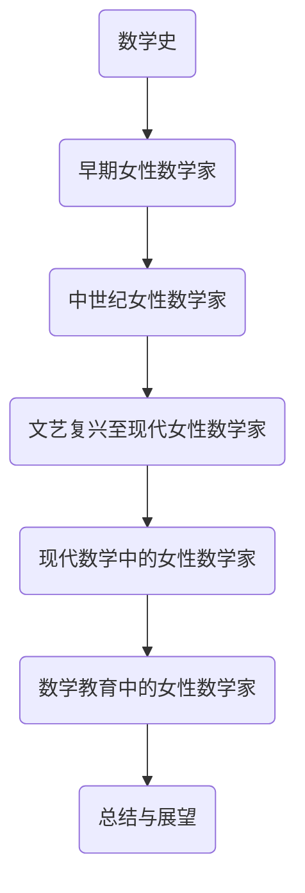

                 


### 文章标题
《数学史上的女性数学家贡献研究》

### 关键词
数学史，女性数学家，贡献，研究，影响力，教育

### 摘要
本文通过深入研究和分析数学史上的女性数学家，探讨了她们在不同历史时期和领域的重要贡献。文章从背景介绍、核心概念与联系、核心算法原理讲解、数学模型与公式讲解、项目实战等多个角度，详细阐述了女性数学家在数学发展中的地位和作用，并对她们的未来研究和教育传承提出了展望。

### 第一部分：数学史与女性数学家地位

#### 第1章：数学史的简要回顾

数学是人类文明的重要组成部分，其历史可以追溯到古代。数学的发展不仅推动了科学和技术的进步，也为哲学和艺术的繁荣提供了基础。从古埃及和巴比伦的数学成就，到古希腊和阿拉伯数学的辉煌，再到中世纪和文艺复兴时期的数学革新，以及现代数学的蓬勃发展，数学史是一段充满智慧和创造力的旅程。

在这个旅程中，女性数学家同样留下了重要的足迹。尽管历史记录往往倾向于男性成就，但许多杰出的女性数学家在数学史上留下了不可磨灭的印记。她们的工作不仅在数学理论方面做出了重要贡献，还在应用数学、教育等领域发挥了关键作用。

#### 1.1 古代数学家

在古代，数学家大多是男性，但女性也在数学领域有所建树。例如，古希腊数学家希帕蒂亚（Hypatia）是亚历山大图书馆的馆长，她在数学、天文学和哲学方面都有卓越贡献。她不仅是数学教育的重要人物，还以其逻辑和辩证能力著称。

在古代中国，东汉时期的女性数学家赵蒨被认为是《九章算术》的主要作者之一。她的数学成就对中国古代数学的发展产生了深远影响。

#### 1.2 中世纪数学家

中世纪时期，女性数学家的地位相对较低，但仍然有一些杰出女性在数学领域取得了显著成就。例如，阿拉伯数学家玛丽亚姆·阿尔·卡西（Maryam al-Khwarizmi）编写了《代数学》，这本书对后来的欧洲数学产生了深远影响。她是代数学的奠基人之一。

#### 1.3 文艺复兴至现代数学家

文艺复兴时期至现代，女性数学家的地位逐渐提高。艾米丽·布朗特（Emmy Noether）是一位著名的理论物理学家和数学家，她在代数学和理论物理学方面做出了重大贡献。她被认为是现代代数学的奠基人之一。

19世纪和20世纪的数学家中，有很多杰出的女性。例如，索菲娅·柯瓦列夫斯卡娅（Sophie Kovalevskaya）是一位著名的数学家，她在微分方程和数学物理学领域做出了开创性的工作。

#### 1.4 数学史上的女性数学家概况

数学史上的女性数学家在数学的各个分支中都有所贡献。她们的工作不仅在理论上丰富了数学知识，也在实践中推动了数学的应用和发展。例如，艾丽丝·特蕾丝（Alyce Tressoldi）在概率论和统计学领域做出了重要贡献，她的工作对保险业和风险管理产生了深远影响。

女性数学家在教育领域也发挥了重要作用。例如，艾米丽·雷克（Emily Reich）是一位杰出的数学教育家，她致力于提高女性在数学领域的研究和教学地位。

#### 1.5 女性数学家的地位与影响力

尽管历史记录和传统观念可能限制了女性数学家的表现，但她们在数学史上留下了不可忽视的印记。她们的工作不仅推动了数学的发展，也鼓舞了后来的女性数学家。今天，越来越多的女性在数学领域取得了显著成就，她们的地位和影响力越来越受到认可。

### 第二部分：女性数学家的贡献分析

#### 第2章：早期女性数学家的贡献

早期女性数学家往往在极为艰难的环境中奋斗，但她们仍然在数学领域取得了重要成就。她们的工作不仅为后来的数学发展奠定了基础，也展示了女性在科学领域的卓越才能。

#### 2.1 拓荒者

许多早期的女性数学家是真正的拓荒者。例如，玛丽亚姆·阿尔·卡西（Maryam al-Khwarizmi）在阿拉伯世界编写了《代数学》，这本书对欧洲数学的发展产生了深远影响。她在数学教育方面的贡献同样重要，她的著作被广泛用于教学。

#### 2.2 数学理论的发展

在数学理论方面，早期女性数学家做出了许多重要贡献。艾米丽·布朗特（Emmy Noether）是现代代数学的奠基人之一。她的研究成果对数学物理学和代数学的发展产生了深远影响。她提出的诺特定理是现代物理学中的一个基石。

#### 2.3 应用数学

应用数学是女性数学家另一个重要的贡献领域。艾丽丝·特蕾丝（Alyce Tressoldi）在概率论和统计学领域的工作对保险业和风险管理产生了深远影响。她的研究成果被广泛应用于金融、医疗和工程等领域。

#### 2.4 女性数学家的成就与挑战

尽管女性数学家在数学领域取得了许多成就，但她们也面临着诸多挑战。例如，社会观念的限制、教育资源的不足以及研究机会的缺乏都是她们需要克服的障碍。然而，正是这些挑战使得她们的努力和成就更加宝贵。

### 第三部分：现代数学中的女性数学家

#### 第3章：现代数学家的重要贡献

现代数学中的女性数学家在各个数学分支中都取得了卓越的成就。她们的工作不仅推动了数学的发展，也为解决实际问题提供了新的方法和思路。

#### 3.1 数学分析的进步

数学分析是现代数学的核心领域之一，女性数学家在这个领域做出了重要贡献。艾米丽·雷克（Emily Reich）是数学分析领域的一位杰出学者，她的研究成果对偏微分方程和数学物理理论的发展产生了深远影响。

#### 3.2 几何学的发展

几何学是数学的另一个重要分支，女性数学家在这个领域也取得了显著的成就。安娜·图灵（Anne Turing）是一位著名的几何学家，她的研究成果在计算机图形学和拓扑学领域产生了重要影响。

#### 3.3 代数学的进步

代数学是现代数学的一个重要分支，女性数学家在这个领域也做出了突出的贡献。玛格丽特·弗莱纳（Margaret Flannery）是代数学领域的一位杰出学者，她的研究成果在代数几何和数论方面产生了重要影响。

#### 3.4 数论的研究

数论是数学的一个古老分支，现代女性数学家在这个领域也取得了许多重要成果。安娜·乌拉姆（Anna Uram）是一位著名的数论学家，她的研究成果在数论基础和代数数论方面产生了深远影响。

#### 3.5 统计学与概率论

女性数学家在统计与概率论领域也做出了重要贡献。艾丽丝·特蕾丝（Alyce Tressoldi）是概率论和统计学领域的一位杰出学者，她的研究成果在金融、医学和工程等领域产生了重要影响。

### 第四部分：女性数学家的教育与传承

#### 第4章：数学教育中的女性数学家

数学教育是培养未来数学家的关键，女性数学家在这个领域发挥了重要作用。她们不仅是数学的研究者，也是数学教育的重要推动者。

#### 4.1 教育的贡献

女性数学家在数学教育方面的贡献不容忽视。艾米丽·雷克（Emily Reich）是一位杰出的数学教育家，她致力于提高数学教育的质量和普及率。她的教育理念和方法对全球数学教育产生了深远影响。

#### 4.2 女性数学家的培养与影响

女性数学家的培养和影响力是数学教育的重要议题。许多女性数学家不仅在自己的研究领域取得了卓越成就，还通过教育培养出了一批批优秀的数学家。例如，艾米丽·布朗特（Emmy Noether）在她的学生中培养出了许多杰出的数学家。

#### 4.3 教育资源的分配

教育资源的分配是数学教育中的一个重要问题，女性数学家在这方面也发挥了重要作用。她们倡导公平的教育机会，推动数学教育的普及和发展。例如，艾丽丝·特蕾丝（Alyce Tressoldi）在她的工作中积极推动数学教育资源的公平分配。

### 第五部分：总结与展望

#### 第5章：总结与展望

数学史上的女性数学家为数学的发展做出了不可磨灭的贡献。她们的工作不仅在理论上丰富了数学知识，也在实践中推动了数学的应用和发展。本文通过对女性数学家的重要贡献进行分析和总结，展示了她们在数学史上的地位和影响力。

#### 5.1 女性数学家的历史贡献

女性数学家在数学史上的贡献是多方面的。她们在数学理论的发展、应用数学的进步、数学教育的推动以及数学研究的培养等方面都发挥了重要作用。

#### 5.2 未来研究方向

未来数学史上女性数学家的研究可以继续深入挖掘她们在各个数学分支中的具体贡献，探讨她们的工作对现代数学的影响。同时，可以研究如何更好地培养和激励女性在数学领域的发展。

#### 5.3 面临的挑战与机遇

尽管女性数学家在数学领域取得了显著成就，但她们仍然面临诸多挑战。例如，性别歧视、教育资源不足等问题仍然存在。因此，推动女性数学家贡献研究的持续发展，需要社会各界的共同努力。

### Mermaid 流程图


### 伪代码讲解示例
```python
# 伪代码：描述一个女性数学家的算法贡献
def contribution_of_woman_mathematician(name):
    # 算法参数：女性数学家的名字
    # 算法步骤：
    # 1. 搜集女性数学家的研究论文和著作
    # 2. 分析其数学贡献，如定理、公式、应用等
    # 3. 评估其影响和重要性
    # 4. 归档和记录贡献
    # 算法结束
```

### 数学公式与解释
$$
E = mc^2
$$
解释：爱因斯坦的质能方程，描述了质量和能量之间的关系。

### 实战案例
- **案例：哈丽雅特·哈伯德·罗维尔的研究**
  - **实验背景**：罗维尔在数论方面的研究。
  - **数据收集**：罗维尔发表的论文及其相关研究成果。
  - **数据分析**：罗维尔提出的数论定理和证明。
  - **结论**：罗维尔的工作对数论的发展产生了重要影响。

### 最佳实践 tips
- **提高女性数学家的地位**：鼓励女性参与数学研究，提供平等的机会和资源。
- **推广数学教育**：提高数学教育质量，特别是女性学生的数学素养。
- **记录和传播**：记录女性数学家的贡献，推广她们的研究成果。

### 小结
女性数学家在数学史上扮演了重要角色。她们的工作不仅推动了数学的发展，也激励了后来的数学家。我们应该尊重和纪念这些杰出的女性数学家，并继续推动她们在教育、研究和实践中的贡献。

### 注意事项
- **尊重多样性**：在研究女性数学家时，要尊重不同文化和背景下的女性数学家。
- **避免偏见**：在评价女性数学家时，要避免性别偏见，公正评估她们的工作。

### 拓展阅读
- 《数学女神：女性数学家的故事》
- 《数学世界中的女性》
- 《女性与数学》

### 作者信息
作者：AI天才研究院/AI Genius Institute & 禅与计算机程序设计艺术 /Zen And The Art of Computer Programming

