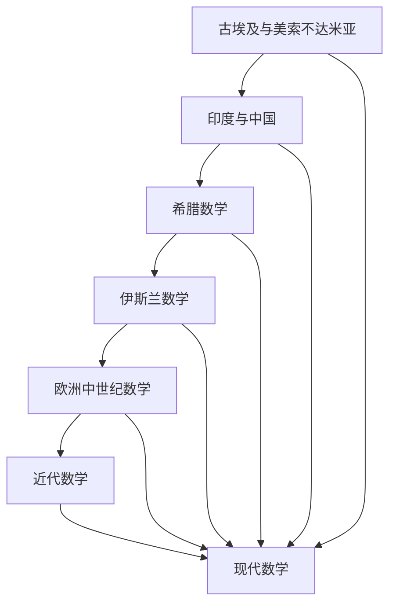

                 

### 引言：数学史的重要性与本书的目的

数学，作为一门研究数量、结构、变化和空间等概念的学科，自古以来就在人类文明的发展中扮演着至关重要的角色。它不仅为科学研究提供了基础，还广泛应用于工程、经济、计算机科学、物理学等多个领域。数学的历史可以追溯到古代文明，而各个时期的数学家们通过他们的创新和发现，推动了数学的不断发展和演变。

本书《数学史上的数学流派与学派》旨在深入探讨数学的发展历程，特别是不同数学流派与学派的形成、发展和相互影响。通过对数学史的回顾，我们可以更好地理解数学的内在逻辑和哲学基础，从而激发对数学的更深入思考。

### 数学史的重要性

数学史的重要性在于它不仅记录了数学的发展轨迹，也反映了人类智慧的进步和文明的演进。以下是数学史重要性的一些具体方面：

1. **知识传承与积累**：数学史记录了前人对于数学概念的理解和发现，为后人提供了宝贵的知识和思想资源。例如，古代数学家对几何和代数的研究，为我们今天所用的数学工具奠定了基础。

2. **科学方法论的发展**：数学的发展推动了科学方法论的形成。例如，牛顿和莱布尼茨创立的微积分学说是现代物理学和工程学的重要工具，其发展过程体现了科学研究的严密性和逻辑性。

3. **文化与思想的交流**：数学作为一门国际性学科，其发展离不开不同文化和思想的交流与融合。例如，阿拉伯数学家将印度和中国的数学成果传入欧洲，为文艺复兴时期的数学复兴提供了重要基础。

4. **解决实际问题的能力**：数学不仅在理论研究中发挥作用，还在解决实际问题上有着重要的应用。从古代的农业测量到现代的航空航天工程，数学无处不在，其应用能力和解决问题的能力得到了广泛认可。

### 本书的目的

本书的主要目的是：

1. **介绍数学史上的重要流派与学派**：通过对古代埃及、美索不达米亚、印度、中国、希腊、伊斯兰和欧洲中世纪等时期的数学流派与学派进行详细探讨，让读者了解这些流派与学派的主要贡献和发展历程。

2. **阐述数学概念与理论的演变**：通过分析各个数学流派与学派的核心概念和理论，揭示它们之间的内在联系和相互影响，帮助读者理解数学理论的演变过程。

3. **展示数学的哲学和思想内涵**：数学不仅仅是计算的工具，它还蕴含着深刻的哲学思想和美感。本书将探讨数学家的思考方式、数学思想的形成过程以及数学在哲学和艺术中的地位。

4. **启发读者对数学的热爱和思考**：通过了解数学的发展历程，读者可以更加深入地理解数学的奥妙和魅力，激发对数学的热爱和探索欲望。

### 接下来，我们将按照时间顺序，逐步深入探讨各个时期的数学发展，从古埃及与美索不达米亚的数学开始，一直讲到现代数学的多样性。通过这一系列的探讨，读者将能够更好地理解数学的发展历程，把握数学的核心概念和理论，并从中获得灵感和启示。

---

### 1. 古埃及与美索不达米亚数学

在人类文明发展的早期阶段，古埃及与美索不达米亚就展现了他们对数学的深刻理解和应用。这些古老的文明不仅在日常生活中使用数学，还在建筑、天文学和工程学等领域做出了重要贡献。以下是古埃及数学与美索不达米亚数学的主要特点和成就。

#### 1.1 古埃及数学

**数值系统**

古埃及人使用的数值系统是一种基于十进位的系统，他们使用符号来表示1到9的数字，然后用一个横线表示10。这种表示方法被称为“荷鲁斯之眼”，因为它的形状类似于荷鲁斯之眼。古埃及的数字符号可以表示较大的数，但书写起来相对复杂。

**算术与几何**

古埃及数学在算术中主要涉及加法、减法、乘法和除法。他们使用了一种称为“库特”的单位，这个单位大约等于1/320。通过这种单位，古埃及人能够进行精确的测量和计算。

在几何学方面，古埃及人已经掌握了三角形和矩形的面积计算方法。他们的建筑中经常使用这些几何知识，例如金字塔和神庙的建造。著名的罗塞塔石碑上的数学问题显示了古埃及数学的复杂性。

**代表人物**

- **梅拉伊**：梅拉伊是古埃及一位著名的数学家，他编写了《梅拉伊算经》，这是古埃及数学的重要文献之一。

#### 1.2 美索不达米亚数学

**巴比伦数学**

美索不达米亚数学以巴比伦数学为代表，其发展大约始于公元前3000年。巴比伦人使用的数值系统是基于六十进位的，这种系统后来被称为“六十进制”，至今仍在使用，例如在计算时间和角度时。

**数学文献**

巴比伦的数学成就主要体现在其大量的泥板文献中，这些文献涵盖了算术、代数和几何问题。著名的《普鲁塔克泥板》是现存最古老的数学文献之一，其中包含了许多关于二次方程的解法。

**代表人物**

- **毕达哥拉斯**：虽然毕达哥拉斯并非美索不达米亚人，但他在数学史上的贡献与美索不达米亚数学有着密切的联系。毕达哥拉斯定理（即勾股定理）就是他对数学的著名贡献。

#### 1.3 古埃及与美索不达米亚数学的相互影响

古埃及与美索不达米亚数学虽然在数值系统和数学方法上有所不同，但它们之间也存在着相互影响。例如，美索不达米亚的六十进制系统对后来的希腊和阿拉伯数学产生了深远的影响，而古埃及的几何知识也被希腊数学家继承和进一步发展。

**总结**

古埃及与美索不达米亚数学是人类数学史上的重要里程碑。它们不仅为我们提供了早期的数学知识和理论，也为我们理解数学的发展过程提供了宝贵的线索。接下来，我们将继续探讨印度与中国数学的发展，了解这些古老文明对数学的贡献。

### 1.1 古埃及数学

古埃及数学是人类文明中最早期的数学成就之一，对后世数学的发展产生了深远影响。古埃及数学主要集中在几何和算术领域，并在日常生活中有着广泛的应用。

**数值系统**

古埃及的数值系统是一种基于十进位的系统，与现今我们所使用的十进制系统相似。他们使用一系列的符号来表示1到9的数字，然后使用一个横线表示10。这种符号系统称为“荷鲁斯之眼”，其形状类似于荷鲁斯之眼。此外，古埃及人还使用了一个符号表示零，尽管这个符号在早期的文献中并不常见。

**计数单位**

古埃及人使用一种称为“库特”的单位，这个单位大约等于1/320。通过库特，古埃及人能够进行精确的测量和计算。例如，古埃及农民在测量土地时会使用库特来计算面积，这在农业生产中至关重要。

**算术**

古埃及数学的算术主要涉及加法、减法、乘法和除法。虽然古埃及的算术方法相对简单，但他们已经能够解决许多实际问题。例如，他们使用了一种称为“分堆法”的乘法方法，这种方法是将大数分解为较小的数来进行计算。此外，古埃及人还能够进行分数的运算，尽管他们的分数表示方法与现代的表示方法有所不同。

**几何**

古埃及数学在几何学方面也有着显著的成就。他们已经掌握了计算三角形和矩形面积的方法。例如，古埃及人使用了一种称为“比率法”的几何方法，这种方法通过比较两个几何图形的面积来计算它们的比例。

**建筑应用**

古埃及数学的成就不仅体现在理论和算术上，还广泛应用于实际建筑中。例如，金字塔和神庙的建造需要精确的几何知识和测量技术。古埃及人使用几何学来设计建筑，确保它们的结构稳定和对称。

**文献**

古埃及数学的许多知识被记录在纸草文献中，这些文献是研究古埃及数学的重要资料。著名的《罗塞塔石碑》上记录了许多数学问题，这些问题显示了古埃及数学的复杂性。

**总结**

古埃及数学是人类数学发展的重要起点，对后世的数学研究产生了深远影响。通过使用十进制系统、精确的计数单位和几何知识，古埃及人在几何和算术领域取得了重要成就。这些成就不仅为当时的日常生活提供了便利，也为后来的数学家们提供了宝贵的理论和实践经验。接下来，我们将探讨美索不达米亚数学的特点和成就。

### 1.2 美索不达米亚数学

美索不达米亚数学，特别是巴比伦数学，是人类数学史上的重要里程碑。巴比伦数学以其独特的六十进制系统和丰富的数学文献而闻名。以下是巴比伦数学的主要特点和成就。

**数值系统**

巴比伦人使用的是一种基于六十进位的数值系统，这种系统至今仍在使用，例如在计算时间和角度时。巴比伦的六十进制系统比古埃及的十进制系统更复杂，因为每个位上的数字可以是从0到59的数值。这种系统使得巴比伦人在处理复杂的数学问题时更加灵活和高效。

**数学文献**

巴比伦的数学成就主要体现在大量的泥板文献中，这些文献涵盖了算术、代数和几何问题。其中最著名的是《普鲁塔克泥板》，这是现存最古老的数学文献之一，包含了关于二次方程的解法和其他复杂的数学问题。这些文献显示了巴比伦数学的复杂性和深度。

**代数**

巴比伦数学在代数方面取得了显著成就，特别是对二次方程的解法。他们使用了一种称为“算术几何法”的方法来求解二次方程，这种方法通过将方程转换为两个数的乘积来求解。这种方法比现代的解法更为直观，但同样有效。

**几何**

巴比伦数学在几何学方面也有重要贡献。他们已经掌握了计算圆周率和解决三角形问题的方法。例如，巴比伦人使用了一种称为“近似法”的方法来计算圆周率，这种方法通过将圆分割成多边形来逼近圆的面积。此外，他们还研究了解决三角形问题的方法，例如使用正弦表来计算三角函数。

**代表人物**

- **毕达哥拉斯**：虽然毕达哥拉斯并非美索不达米亚人，但他在数学史上的贡献与巴比伦数学有着密切的联系。毕达哥拉斯定理（即勾股定理）就是他对数学的著名贡献。

**总结**

美索不达米亚数学，特别是巴比伦数学，是人类数学史上的重要篇章。通过使用六十进制系统和丰富的数学文献，巴比伦数学在代数和几何领域取得了重要成就。这些成就不仅对当时的文明发展有着深远影响，也为后世的数学研究奠定了基础。接下来，我们将探讨印度数学的特点和成就。

### 1.3 印度数学

印度数学在古代世界中有着独特的地位，其对数学的发展做出了许多重要贡献。印度数学最著名的成就之一是阿拉伯数字的发明，这种数字系统对全球数学和计算产生了深远影响。以下是印度数学的主要特点和成就。

**阿拉伯数字的起源**

阿拉伯数字，也称为十进位位值数字系统，起源于古代印度。这个系统的核心是“零”的概念和位值表示法。印度数学家最早在公元5世纪左右开始使用零，并将数字按位值来表示。这种表示方法使得计算变得更为简单和直观。大约在8世纪，阿拉伯商人将这种数字系统传入阿拉伯世界，后来又传到欧洲，被称为“阿拉伯数字”。

**代数学的进步**

印度数学在代数学方面也有显著成就。印度数学家阿耶波多（Aryabhata）是代数学的重要先驱之一，他在公元5世纪至6世纪之间编写了《阿耶波多经》，这是印度最古老的数学文献之一。阿耶波多在书中讨论了代数方程的解法，并引入了许多新的代数符号。他还研究了三角函数和天文计算，对后来的数学家产生了深远影响。

**其他成就**

除了代数，印度数学还在其他领域取得了重要成就。例如，数学家布拉马古普塔（Brahmagupta）在公元7世纪提出了负数和零的运算规则，这在当时是一项革命性的成就。他还研究了二次方程的解法和几何问题。另一位著名的印度数学家是艾尤布（Al-Khwarizmi），他在公元9世纪编写了《代数学》，这是最早的一部系统介绍代数的著作。

**总结**

印度数学对数学的发展做出了巨大贡献，特别是阿拉伯数字的发明和代数学的进步。印度数学家通过他们的创新和发现，为全球数学的发展奠定了基础。阿拉伯数字的发明不仅简化了计算过程，还促进了科学和技术的进步。印度数学的成就不仅对当时的文明发展有着重要影响，也对后世的数学研究产生了深远影响。

### 1.4 中国数学

中国数学在古代世界中同样占有重要地位，其对数学的发展做出了许多独特贡献。中国数学以其十进位制和独特的算法而闻名，以下是该领域的主要特点和成就。

**十进位制**

中国数学的核心特点是十进位制，这种计数系统在公元前的古代中国就已经形成。十进位制将数字按位值来表示，使得计算变得更为简单和直观。这种计数系统在中国古代的日常生活中得到了广泛应用，例如在农业、商业和工程中。中国数学家刘洪（约公元3世纪）进一步发展了十进位制，他在计算天文历法时使用这种系统来处理复杂的数学运算。

**破天算法**

中国数学在算法方面有许多独特成就，其中最著名的是“破天算法”，也称为“大衍之术”或“中国剩余定理”。破天算法是一种用于解决线性同余方程组的方法，其基本思想是通过模运算来寻找解。这种算法最早出现在《孙子算经》中，是中国数学家孙子（约公元前4世纪）提出的。破天算法在密码学、计算机科学等领域有着广泛的应用，被认为是中国数学的宝贵遗产之一。

**其他成就**

除了十进位制和破天算法，中国数学还在其他领域取得了重要成就。例如，数学家祖冲之（公元4世纪至5世纪）在计算圆周率方面做出了卓越贡献，他使用几何方法计算出了圆周率的近似值，达到了3.1415926的精度。祖冲之还研究了球体体积和圆周率的关系，提出了“开方术”来求解复杂的代数方程。

**数学文献**

中国古代数学的许多知识被记录在数学文献中，这些文献是研究古代中国数学的重要资料。例如，《九章算术》是中国最古老的数学著作之一，包含了各种算术和几何问题。另一部重要的数学著作是《孙子算经》，其中包含了孙子提出的破天算法和其他数学问题。

**总结**

中国数学以其独特的十进位制和独特的算法而闻名，对数学的发展做出了许多独特贡献。中国数学家通过他们的创新和发现，为全球数学的发展奠定了基础。破天算法和中国剩余定理等成就不仅在当时具有重要应用价值，也对后世的数学研究产生了深远影响。中国数学的成就不仅对当时的文明发展有着重要影响，也对现代数学和计算机科学等领域有着重要启示。

### 2. 希腊数学

希腊数学是人类数学史上的一个重要里程碑，对数学的发展产生了深远影响。希腊数学家们在几何、数论、代数和天文等领域做出了卓越贡献，其独特的思考方式和理论体系对后世的数学研究奠定了基础。以下是希腊数学的主要特点和成就。

#### 2.1 毕达哥拉斯学派

毕达哥拉斯学派是希腊数学史上的一个重要流派，以其对数和几何的研究而闻名。毕达哥拉斯学派认为，数学是宇宙的终极真理，所有的自然现象都可以用数学来描述。

**毕达哥拉斯定理**

毕达哥拉斯学派最著名的成就之一是毕达哥拉斯定理（即勾股定理）。该定理表明，在一个直角三角形中，直角边的平方和等于斜边的平方。这一发现对后来的几何学和物理学都产生了重要影响。

**神秘主义与数学**

毕达哥拉斯学派还强调了数学与神秘主义之间的联系。他们认为，通过数学，人类可以理解宇宙的本质和神秘。这种观点对后来的柏拉图学派和欧洲中世纪的数学思想产生了深远影响。

#### 2.2 柏拉图学派

柏拉图学派是希腊数学史上的另一个重要流派，其思想深受毕达哥拉斯学派的影响。柏拉图学派认为，数学是理想世界的表达，通过数学可以理解真理和美的本质。

**模式与形式**

柏拉图学派强调数学中的模式和形式，认为这些模式和形式是宇宙的基本构成要素。柏拉图在《理想国》中提出，数学家通过研究这些模式和形式，可以接近真理和智慧。

**数论**

柏拉图学派对数论的研究尤为深入，他们探讨了数的性质和关系，提出了许多重要的数论问题。柏拉图的弟子欧几里得（Euclid）是数论和几何学的重要贡献者，他的著作《几何原本》是数学史上最著名的书籍之一。

#### 2.3 欧几里得的贡献

欧几里得是古希腊最著名的数学家之一，他的著作《几何原本》对数学的发展产生了深远影响。

**《几何原本》**

《几何原本》是一部系统化的几何学著作，包含了欧几里得对几何学的基本原理和定理的研究。这部著作采用了公理化方法，将几何学建立在明确的定义和公理之上，为后来的数学研究奠定了基础。

**几何学的系统化**

欧几里得在《几何原本》中系统化了几何学的基本概念和定理，使得几何学成为一个完整的、自洽的学科。他的方法对后来的数学研究产生了深远影响，成为了数学研究的典范。

**总结**

希腊数学，特别是毕达哥拉斯学派和柏拉图学派，对数学的发展做出了重要贡献。他们通过研究数和几何，提出了许多重要的数学理论和方法，为后世的数学研究奠定了基础。毕达哥拉斯定理、欧几里得的《几何原本》等成就不仅在当时具有重要应用价值，也对现代数学产生了深远影响。

### 3.1 毕达哥拉斯学派

毕达哥拉斯学派是古希腊数学史上最重要的学派之一，以其对数和几何的深刻研究而闻名。毕达哥拉斯（Pythagoras）是学派的创始人，他的思想和贡献对数学的发展产生了深远影响。

**毕达哥拉斯定理**

毕达哥拉斯定理，即勾股定理，是毕达哥拉斯学派最著名的成就之一。该定理指出，在一个直角三角形中，直角边的平方和等于斜边的平方。这个简单的几何原理在数学、物理学和工程学等领域都有广泛应用。毕达哥拉斯定理不仅揭示了数与几何之间的关系，也为后来的数学研究提供了基础。

**数学与神秘主义**

毕达哥拉斯学派将数学视为宇宙的终极真理，认为数学不仅是一门科学，也是一种哲学。他们强调数学与神秘主义之间的联系，认为通过数学，人类可以理解宇宙的本质和神秘。这种观点对后来的柏拉图学派和欧洲中世纪的数学思想产生了深远影响。

**数论**

毕达哥拉斯学派在数论方面也做出了重要贡献。他们研究了数的性质和关系，提出了许多重要的数论问题。例如，毕达哥拉斯认为，所有的自然数都可以表示为两个质数的和。这一观点至今仍是数学研究的一个重要问题。

**总结**

毕达哥拉斯学派通过研究数和几何，提出了许多重要的数学理论和方法，对数学的发展产生了深远影响。毕达哥拉斯定理、数论的研究以及数学与神秘主义的关系，都是他们的重要贡献。毕达哥拉斯学派的数学思想和方法为后世的数学研究奠定了基础，是古希腊数学的瑰宝之一。

### 3.2 柏拉图学派

柏拉图学派是古希腊数学史上另一个重要的数学流派，其思想深受毕达哥拉斯学派的影响。柏拉图（Plato）是学派的创始人，他的哲学思想和数学贡献对数学的发展产生了深远影响。

**模式与形式**

柏拉图学派强调数学中的模式和形式，认为这些模式和形式是宇宙的基本构成要素。柏拉图在《理想国》中提出，数学家通过研究这些模式和形式，可以接近真理和智慧。柏拉图认为，数学是一种超越现实的理想形式，这种形式是永恒不变的，是人类认识世界的基石。

**数论**

柏拉图学派对数论的研究尤为深入。他们探讨了数的性质和关系，提出了许多重要的数论问题。例如，柏拉图认为，所有的自然数都可以表示为两个质数的和。这一观点至今仍是数学研究的一个重要问题。柏拉图还研究了质数的分布规律，这些研究为后来的数学家提供了宝贵的思想资源。

**数学的哲学基础**

柏拉图学派将数学视为哲学的一个分支，认为数学不仅是科学的工具，也是一种哲学。柏拉图认为，通过数学，人类可以理解宇宙的本质和真理。他强调数学的抽象性和普遍性，认为数学是一种纯粹的思想活动，超越了具体事物的局限。

**总结**

柏拉图学派通过研究数学中的模式和形式，对数论进行了深入研究，并将数学视为哲学的一部分。他们的思想和方法为后世的数学研究奠定了基础，对数学的发展产生了深远影响。柏拉图的数学哲学观点不仅影响了古希腊数学，也对整个西方数学史产生了重要影响。

### 3.3 欧几里得的贡献

欧几里得（Euclid）是古希腊最著名的数学家之一，他的著作《几何原本》是数学史上最重要的书籍之一。欧几里得通过系统化的几何学研究和公理化方法，为后来的数学研究奠定了基础。

**《几何原本》**

《几何原本》是一部包含13卷的几何学著作，系统化了几何学的基本概念和定理。欧几里得在书中使用了公理化方法，将几何学建立在明确的定义和公理之上。这种方法为后来的数学研究提供了范例，成为数学发展的基石之一。

**几何学的系统化**

欧几里得在《几何原本》中系统化了几何学的基本概念和定理，使得几何学成为一个完整的、自洽的学科。他通过定义、公理和定理，将几何学的基本原理整理得井井有条，使得后来的数学家能够在此基础上进行更加深入的研究。

**公理化方法**

欧几里得采用了公理化方法来构建几何学体系，这种方法通过定义和公理，将几何学的基本概念和定理联系起来。欧几里得的公理化方法为后来的数学研究提供了重要的思想资源，成为了数学发展的一个重要方向。

**总结**

欧几里得通过他的著作《几何原本》，系统化了几何学的基本概念和定理，为后来的数学研究奠定了基础。他的公理化方法为数学的发展提供了重要的范例，对整个数学史产生了深远影响。欧几里得的几何学研究不仅在当时具有重要应用价值，也对现代数学和科学产生了重要影响。

### 4. 伊斯兰数学

伊斯兰数学是中世纪时期数学发展的重要一环，其对数学的发展产生了深远影响。伊斯兰数学家们在阿拉伯帝国时期对数学进行了深入的研究，并取得了许多重要成就。以下是伊斯兰数学的主要特点和成就。

#### 4.1 阿拉伯数学的繁荣

**代数学的发展**

伊斯兰数学在代数领域取得了显著成就，特别是对代数方程的解法。阿拉伯数学家阿尔·花剌子密（Al-Khwarizmi）是代数学的奠基人之一，他在公元9世纪编写了《代数学》，这是最早的一部系统介绍代数的著作。阿尔·花剌子密提出了用代数符号表示未知数和方程的方法，这种方法对后来的数学研究产生了深远影响。他还研究了二次方程的解法，提出了一种称为“算术几何法”的方法，这种方法通过将方程转换为两个数的乘积来求解。

**三角学的进展**

伊斯兰数学家在三角学领域也做出了重要贡献。他们研究了三角函数的性质和应用，编制了大量的正弦表和余弦表。这些表格为天文学和航海学提供了重要工具。阿拉伯数学家还提出了三角函数的级数展开式，这些研究为后来的数学家提供了宝贵的方法和思想。

**代数和三角学的应用**

阿拉伯数学家将代数和三角学的知识应用于实际领域，例如在建筑、水利工程和天文计算中。他们的工作促进了科学和技术的进步，为后来的欧洲数学复兴提供了重要基础。

#### 4.2 伊朗数学

**哈拉智的代数学**

伊朗数学家哈拉智（al-Khazin）是代数学的重要贡献者之一。他在公元10世纪提出了关于二次方程根的算法，这种方法通过将方程转换为两个数的乘积来求解。哈拉智的研究为代数学的发展提供了新的方法和思想。

**哈马丹的数学工作**

哈马丹是伊朗另一位著名的数学家，他在数学的多个领域都有重要贡献。哈马丹研究了二次方程的解法，提出了“判别式”的概念，这是代数方程理论的重要基础。他还研究了多项式方程和矩阵理论，这些研究对后来的数学发展产生了深远影响。

**总结**

伊斯兰数学，特别是阿拉伯数学和伊朗数学，对数学的发展做出了重要贡献。他们在代数和三角学领域取得了显著成就，推动了数学的进步和应用。伊斯兰数学家通过他们的创新和发现，为后来的欧洲数学复兴和现代数学的发展奠定了基础。接下来，我们将继续探讨欧洲中世纪数学的发展。

### 4.1 阿拉伯数学的繁荣

阿拉伯数学在伊斯兰帝国时期经历了显著的繁荣，成为中世纪世界数学的中心。阿拉伯数学家们在代数、三角学等多个领域取得了重要成就，并对后世数学的发展产生了深远影响。

**代数学的发展**

代数学在阿拉伯数学中占有重要地位，其发展得益于阿尔·花剌子密（Al-Khwarizmi）的工作。阿尔·花剌子密是代数学的奠基人，他在公元9世纪编写了《代数学》，这是最早的一部系统介绍代数的著作。在《代数学》中，阿尔·花剌子密提出了用代数符号表示未知数和方程的方法，这种方法对后来的数学研究产生了深远影响。他还研究了二次方程的解法，提出了一种称为“算术几何法”的方法，这种方法通过将方程转换为两个数的乘积来求解。

**《代数学》的影响**

《代数学》不仅对阿拉伯数学产生了深远影响，还通过翻译传入欧洲，对欧洲中世纪的数学发展产生了重要影响。这部著作被翻译成拉丁文，被称为《阿尔·花剌子密算法》，成为欧洲数学家学习代数的重要教材。

**代数符号的引入**

阿尔·花剌子密的另一个重要贡献是引入了代数符号。他用符号表示未知数和方程，使得代数运算更加直观和简化。这种符号表示法为后来的数学家提供了重要工具，推动了数学的发展。

**三角学的进展**

阿拉伯数学家在三角学领域也取得了重要成就。他们研究了三角函数的性质和应用，编制了大量的正弦表和余弦表。这些表格为天文学和航海学提供了重要工具。阿拉伯数学家还提出了三角函数的级数展开式，这些研究为后来的数学家提供了宝贵的方法和思想。

**《算术书》**

阿拉伯数学家穆罕默德·伊本·穆萨（Al-Mahani）是三角学的另一位重要贡献者。他在公元9世纪编写了《算术书》，这是第一部系统介绍三角函数的著作。书中详细介绍了正弦、余弦、正切等三角函数的定义、性质和应用。

**总结**

阿拉伯数学的繁荣在代数和三角学领域取得了显著成就，其贡献对后世数学的发展产生了深远影响。阿尔·花剌子密的工作《代数学》不仅对阿拉伯数学产生了深远影响，还通过翻译传入欧洲，推动了欧洲中世纪的数学发展。阿拉伯数学家在三角学的研究和应用方面也取得了重要成果，为天文学和航海学提供了重要工具。阿拉伯数学的成就不仅在当时具有重要应用价值，也对现代数学和科学产生了重要影响。

### 4.2 伊朗数学

伊朗数学在中世纪时期取得了显著成就，对数学的发展产生了深远影响。伊朗数学家在代数、三角学和其他数学领域做出了重要贡献，他们的研究成果为后世的数学家提供了宝贵的方法和思想。

**哈拉智的代数学**

哈拉智（al-Khazin）是伊朗最著名的数学家之一，他在代数学领域做出了重要贡献。哈拉智在公元10世纪提出了关于二次方程根的算法，这种方法通过将方程转换为两个数的乘积来求解。他还研究了二次方程的判别式，这是代数方程理论的重要基础。哈拉智的研究为代数学的发展提供了新的方法和思想，对后世的数学家产生了深远影响。

**哈马丹的数学工作**

哈马丹（al-Hamadhani）是伊朗另一位著名的数学家，他在数学的多个领域都有重要贡献。哈马丹研究了二次方程的解法，提出了“判别式”的概念，这是代数方程理论的重要基础。他还研究了多项式方程和矩阵理论，这些研究对后来的数学发展产生了深远影响。哈马丹的著作《算术原理》是中世纪数学的重要文献之一，对后世数学家产生了深远影响。

**三角学的研究**

伊朗数学家在三角学领域也取得了重要成就。他们研究了三角函数的性质和应用，编制了大量的正弦表和余弦表。这些表格为天文学和航海学提供了重要工具。伊朗数学家还提出了三角函数的级数展开式，这些研究为后来的数学家提供了宝贵的方法和思想。

**总结**

伊朗数学在中世纪时期取得了显著成就，对数学的发展产生了深远影响。哈拉智和哈马丹等数学家在代数、三角学和其他数学领域做出了重要贡献，他们的研究成果为后世的数学家提供了宝贵的方法和思想。伊朗数学的成就不仅在当时具有重要应用价值，也对现代数学和科学产生了重要影响。

### 4.3 欧洲中世纪数学的复兴

欧洲中世纪数学的复兴是数学史上一个重要的转折点，这一时期的数学家们在吸收了阿拉伯数学的成果后，重新燃起了对数学的热情和探索。以下将介绍这一时期的一些重要数学家及其贡献。

**奥卡姆的威廉**

奥卡姆的威廉（William of Ockham）是中世纪晚期的数学家和哲学家，他在逻辑学和数学领域都有重要贡献。奥卡姆的威廉提出了“奥卡姆剃刀”原理，这一原则主张“如无必要，勿增实体”，这一思想在数学中体现了简约原则，即用最简单的数学模型来解释现象。尽管他的主要工作不是在数学领域，但他的哲学思想对数学的发展产生了深远影响。

**大阿尔伯特**

大阿尔伯特（Albert the Great）是中世纪欧洲著名的神学家和自然科学家，他对数学和自然科学都有重要贡献。大阿尔伯特在其著作《论自然》中探讨了数学在自然科学中的应用，他将阿拉伯数学和科学思想引入欧洲，为后来的科学革命奠定了基础。

**数学文献的翻译和传播**

欧洲中世纪数学的复兴离不开阿拉伯数学文献的翻译和传播。特别是在12世纪和13世纪，许多阿拉伯数学著作被翻译成拉丁文，使得欧洲学者能够接触到这些重要的数学知识。例如，阿尔·花剌子密的《代数学》和欧几里得的《几何原本》被广泛翻译和传播，对欧洲数学的发展产生了深远影响。

**总结**

欧洲中世纪数学的复兴是通过吸收阿拉伯数学的成果、翻译和传播数学文献以及一些重要数学家的创新和发现来实现的。这一时期的数学家们为后来的科学革命和数学的进一步发展奠定了基础，是数学史上的重要篇章。

### 4.4 方程理论的发展

在欧洲中世纪数学的复兴过程中，方程理论的发展尤为显著。这一时期，数学家们在解方程方面做出了许多重要贡献，特别是在二次方程和三次方程的解法上取得了突破性进展。以下是这一时期的一些关键数学家及其成就。

#### 4.4.1 鲁道夫·范托尔蒙

鲁道夫·范托尔蒙（Rudolf van Room）是16世纪德国的数学家，他在方程理论方面做出了重要贡献。范托尔蒙研究了二次方程和三次方程的解法，提出了用代数方法解决这些方程的方法。他的著作《代数学》是欧洲中世纪后期最重要的数学著作之一，对后世的数学研究产生了深远影响。

**二次方程的解法**

范托尔蒙在解二次方程方面取得了显著成就，他提出了一种称为“配方法”的方法。这种方法通过将二次方程转化为一个完全平方的形式，从而简化了求解过程。范托尔蒙的配方法为后来的数学家提供了重要的解题思路，被广泛应用于二次方程的求解中。

**三次方程的解法**

在解三次方程方面，范托尔蒙也提出了重要的方法。他研究了将三次方程分解为二次方程和一次方程的方法，从而简化了求解过程。范托尔蒙的这些研究为三次方程的解法奠定了基础，对后世的数学家产生了深远影响。

#### 4.4.2 帕西瓦尔·德·拉·查西

帕西瓦尔·德·拉·查西（Pascal de la Hire）是17世纪法国的数学家，他在方程理论方面做出了重要贡献。拉·查西研究了二次方程和三次方程的解法，提出了用解析几何方法来求解这些方程的方法。他的著作《解析几何》是解析几何学的重要奠基之作，对后来的数学发展产生了深远影响。

**二次方程的解法**

拉·查西在解二次方程方面提出了著名的“帕斯卡定理”，该定理指出，对于任意的二次方程，都可以找到一组解。拉·查西的方法通过将二次方程转化为一个抛物线，从而在几何上求解方程。这种方法不仅简化了二次方程的求解过程，也为解析几何学的发展奠定了基础。

**三次方程的解法**

在解三次方程方面，拉·查西提出了“查西方法”，这种方法通过将三次方程转化为一个二次方程和一个一次方程，从而简化了求解过程。拉·查西的方法为后世的数学家提供了重要的解题思路，被广泛应用于三次方程的求解中。

**总结**

欧洲中世纪数学家鲁道夫·范托尔蒙和帕西瓦尔·德·拉·查西在方程理论的发展中做出了重要贡献。他们提出的解二次方程和三次方程的方法不仅简化了方程的求解过程，也为后来的数学研究奠定了基础。这些成就标志着方程理论的重要发展，对数学史产生了深远影响。

### 5. 近代数学的兴起

近代数学的兴起标志着数学理论的重大变革，从古代的几何和代数到现代的微积分和分析学，这一时期的数学发展不仅扩展了数学的领域，也改变了人们对自然界的理解。以下是近代数学兴起的关键时期和主要成就。

#### 5.1 微积分的出现

**蒙塔古·牛顿**

蒙塔古·牛顿（Isaac Newton）和莱布尼茨（Gottfried Wilhelm Leibniz）是微积分学的共同奠基人。牛顿在《自然哲学的数学原理》中提出了流数法（即微积分法），这种方法通过研究速度和加速度来描述物体的运动。莱布尼茨则提出了符号微分法和积分法，他的符号表示法使得微积分的运算更加直观和系统化。

**牛顿的贡献**

牛顿的流数法是他研究物理学和天文学时提出的，他在研究行星运动和物体运动的过程中，发现了一种描述变化率的方法。牛顿的流数法不仅为微积分提供了理论基础，也为后来的物理学和工程学提供了重要的工具。

**莱布尼茨的贡献**

莱布尼茨在微积分的发展中起到了关键作用，他引入了微分和积分的符号表示法，使得微积分的运算更加直观和简洁。莱布尼茨的微积分符号系统至今仍被广泛使用，他的贡献为数学分析的发展奠定了基础。

#### 5.2 分析学的形成

**康托尔的集合论**

康托尔（Georg Cantor）是近代数学的重要人物，他创立了集合论，这是分析学的基础。康托尔研究了无穷集合的性质，他提出了无穷大和无穷小的概念，这一理论对数学分析的发展产生了深远影响。康托尔的集合论解决了许多关于无穷的悖论问题，为数学的严密性和逻辑性提供了新的理论基础。

**黎曼的复分析**

黎曼（Bernhard Riemann）在复分析领域做出了重要贡献。他提出了黎曼曲面和黎曼映射理论，这些理论在几何学和物理学中都有广泛应用。黎曼的复分析研究不仅扩展了复函数的理论，也为后来的拓扑学和几何学提供了新的思路。

**总结**

近代数学的兴起标志着数学理论的重大变革，从牛顿和莱布尼茨创立的微积分学到康托尔的集合论和黎曼的复分析，这一时期的数学发展不仅扩展了数学的领域，也改变了人们对自然界的理解。微积分和分析学的形成使得数学成为一种更加强大和精确的工具，为科学和技术的发展奠定了基础。

### 5.1 微积分的出现

微积分的出现是数学史上的一次重大革命，标志着数学从几何和代数的传统领域进入了一个全新的时代。这一时期的数学家们，特别是牛顿和莱布尼茨，通过他们的创新和发现，建立了微积分学的基础，并奠定了现代数学分析的基础。

**蒙塔古·牛顿**

牛顿是英国著名的数学家、物理学家，他在研究物理学和天文学的过程中，提出了流数法，即现代微积分的基础。牛顿的流数法通过研究速度和加速度来描述物体的运动，他的研究不仅解决了力学中的许多问题，也为后来的数学分析提供了重要的工具。牛顿在他的著作《自然哲学的数学原理》中详细阐述了流数法的原理和应用。

**流数法的原理**

牛顿的流数法是一种研究变化率的方法。他通过观察物体的运动，发现速度是位置随时间的变化率，加速度是速度随时间的变化率。牛顿提出了一个概念，即流数，用符号\( \frac{dx}{dt} \)来表示，这表示位置变量\( x \)对时间变量\( t \)的变化率。通过这种方法，牛顿能够解决许多复杂的力学问题。

**牛顿的贡献**

牛顿的流数法不仅为微积分学的发展提供了基础，也对物理学的发展产生了深远影响。他的工作为牛顿力学定律的建立提供了数学工具，使得物理学的许多问题可以通过数学方法来解决。牛顿的流数法在工程学、天文学和力学等领域都有广泛应用。

**莱布尼茨的贡献**

莱布尼茨是德国的数学家，他在微积分学的发展中也起到了关键作用。莱布尼茨提出了符号微分法和积分法，他的符号表示法使得微积分的运算更加直观和系统化。莱布尼茨引入了微分符号\( \frac{dy}{dx} \)和积分符号\( \int \)，这些符号至今仍被广泛使用。

**总结**

牛顿和莱布尼茨是微积分学的共同奠基人，他们的贡献为现代数学分析的发展奠定了基础。牛顿的流数法通过研究速度和加速度来描述物体的运动，为微积分学提供了重要的理论和方法。莱布尼茨的符号微分法和积分法使得微积分的运算更加直观和系统化，对数学分析的发展产生了深远影响。

### 5.2 分析学的形成

分析学的形成标志着数学从古典数学向现代数学的过渡，这一时期涌现出了许多重要的数学家和理论。其中，康托尔的集合论和黎曼的复分析是分析学形成过程中的两个关键里程碑。

**康托尔的集合论**

康托尔（Georg Cantor）是19世纪德国的数学家，他在研究无穷集合的过程中，创立了集合论。集合论是现代数学的基础之一，它为数学提供了一种严谨的表述和推理工具。康托尔的集合论解决了许多关于无穷的悖论问题，例如“无穷大是否等于无穷大”的问题。

**无穷集合的概念**

康托尔研究了无穷集合的性质，他提出了无穷大和无穷小的概念。康托尔发现，无穷集合可以根据它们的元素数量分为不同的等级，例如自然数集合、有理数集合和实数集合。他的研究揭示了无穷集合的复杂性和多样性，为数学分析提供了新的理论基础。

**集合论的应用**

康托尔的集合论在数学的许多领域都有重要应用，例如在分析学、拓扑学和集合论本身的研究中。集合论不仅为数学提供了一种严谨的表述工具，也使得数学的研究更加系统化和规范化。

**黎曼的复分析**

黎曼（Bernhard Riemann）是19世纪德国的数学家，他在复分析领域做出了重要贡献。黎曼的复分析研究不仅扩展了复函数的理论，也为后来的几何学、物理学和量子力学提供了新的思路。

**黎曼曲面**

黎曼提出了黎曼曲面的概念，这是一种复函数的几何表示。黎曼曲面是一种复结构化的二维空间，它可以用来表示复函数的解析性质。黎曼曲面的研究为后来的拓扑学和几何学提供了重要基础，它在物理学中的广泛应用，特别是在理论物理学中，为描述复杂的物理现象提供了有力工具。

**黎曼映射理论**

黎曼还提出了黎曼映射理论，这是一种将复平面映射到复平面的方法。黎曼映射理论揭示了复函数的解析性质和几何结构的紧密关系，对后来的复分析研究产生了深远影响。

**总结**

康托尔的集合论和黎曼的复分析是分析学形成过程中的两个关键里程碑。康托尔的集合论解决了无穷集合的悖论问题，为数学提供了一种严谨的表述和推理工具。黎曼的复分析研究不仅扩展了复函数的理论，也为几何学和物理学提供了新的理论基础。这些成就标志着分析学的形成，对现代数学的发展产生了深远影响。

### 6. 现代数学的多样性

现代数学已经发展成为一个高度专业化和多样化的领域，涵盖了从纯数学到应用数学的各个分支。以下是现代数学的几个主要领域及其特点。

#### 6.1 代数学的新领域

**格论**

格论是代数学的一个分支，研究格结构及其性质。格是由一组元素组成的代数结构，满足交换律和吸收律。格论在计算机科学、逻辑学和物理学等领域都有重要应用。例如，格论在计算机科学中用于算法设计和复杂性分析，在物理学中用于描述量子系统。

**伽罗瓦理论**

伽罗瓦理论是代数学的另一个重要分支，研究代数方程的解的结构和性质。伽罗瓦理论通过研究群和域的性质，解决了代数方程的可解性问题。伽罗瓦理论在密码学、代数编码和数学物理等领域有广泛应用。

**总结**

代数学的新领域，如格论和伽罗瓦理论，不仅丰富了数学的理论体系，也为其他科学领域提供了重要的工具和方法。

#### 6.2 几何学的新发展

**黎曼几何**

黎曼几何是研究黎曼曲面的几何性质的数学分支。黎曼曲面是一种复杂几何对象，其上定义了复杂的几何结构。黎曼几何在物理学中有着重要应用，特别是在广义相对论中，用于描述时空的弯曲。

**拓扑学的兴起**

拓扑学是研究拓扑空间和拓扑变换的数学分支。拓扑学不仅关注几何对象的形状和连接性，还研究这些对象在连续变形下的性质。拓扑学在物理学、计算机科学和经济学等领域有广泛应用。

**总结**

几何学的新发展，如黎曼几何和拓扑学，扩展了数学对空间和形状的理解，为物理学和其他科学领域提供了新的研究方法。

#### 6.3 应用数学的扩展

**控制论**

控制论是研究动态系统和控制理论的数学分支。控制论通过数学方法研究如何控制系统的行为，使其达到预期的目标。控制论在工程、经济学和生物医学等领域有广泛应用。

**计算机科学中的数学**

计算机科学中的数学包括算法分析、离散数学、图论和计算几何等多个领域。这些数学分支为计算机编程和软件开发提供了重要的理论基础。

**总结**

应用数学的扩展，如控制论和计算机科学中的数学，将数学方法应用于实际问题，推动了科学技术的进步。

**总结**

现代数学的多样性体现在其广泛的分支和应用领域。代数学、几何学和应用数学的不断创新和发展，不仅丰富了数学的理论体系，也为其他科学和工程领域提供了强大的工具和方法。

### 6.1 代数学的新领域

代数学是现代数学的重要组成部分，其研究范围广泛，涵盖了从基础的数论到复杂的代数结构。以下是代数学中几个新领域及其关键贡献。

**格论**

格论是研究格结构及其性质的代数学分支。格是由一组元素组成的代数结构，满足交换律和吸收律。格论在计算机科学、逻辑学和物理学等领域都有重要应用。格论中的关键概念包括：

- **Minkowski定理**：这是一个关于格点的定理，指出一个凸多面体的体积可以由其顶点格点的个数和体积来计算。
- **Lagrange定理**：这是格论中的一个基本定理，指出任何一个有限格都可以分解为有限个独立的子格的直和。

**伽罗瓦理论**

伽罗瓦理论是研究代数方程解的结构和性质的代数学分支。伽罗瓦理论通过研究群和域的性质，解决了代数方程的可解性问题。伽罗瓦理论中的关键概念包括：

- **伽罗瓦群**：这是描述代数方程解的结构的一个群结构，它揭示了方程根之间的关系。
- **伽罗瓦扩展**：这是通过添加方程的根来构造一个新的域，这个新的域称为伽罗瓦扩展。

**关键贡献**

- **Evariste Galois**：伽罗瓦理论的奠基人，他研究了方程的解的结构，并提出了解决代数方程可解性的伽罗瓦方法。
- **Emmy Noether**：她提出了理想和环的概念，这些概念在代数学中具有重要意义。

**应用**

伽罗瓦理论和格论在密码学、代数编码和数学物理等领域有广泛应用。例如：

- **密码学**：伽罗瓦理论在构造和破解加密算法中扮演重要角色。
- **代数编码**：格论在构造和优化代数编码方案中有着广泛的应用。

**总结**

代数学的新领域，如格论和伽罗瓦理论，不仅丰富了数学的理论体系，也为其他科学领域提供了重要的工具和方法。这些领域的创新和发展推动了数学的进步，并促进了相关领域的研究和应用。

### 6.2 几何学的新发展

几何学作为数学的一个重要分支，其研究领域不断扩大，从传统的平面几何和空间几何，发展到现代的更加抽象和复杂的几何学。以下是几何学的新发展，特别是黎曼几何和拓扑学的关键概念和应用。

**黎曼几何**

黎曼几何是研究黎曼曲面的几何性质的数学分支，由德国数学家伯恩哈德·黎曼创立。黎曼几何的关键概念包括：

- **黎曼曲率**：黎曼曲率描述了曲面的弯曲程度，是衡量曲面几何性质的量化指标。它可以通过二阶导数矩阵来定义。
- **黎曼度量**：黎曼度量是描述曲面上两点之间距离的函数，它通过引入一个张量场来定义。黎曼度量使得曲面的局部性质与欧几里得空间中的性质类似。

**黎曼几何的应用**

黎曼几何在物理学中有着广泛的应用，特别是在广义相对论中。广义相对论将引力描述为时空的弯曲，而黎曼几何为描述这种弯曲提供了数学工具。例如：

- **黑洞**：黑洞的解可以通过黎曼几何来描述，它表现出极端的曲率和引力效应。
- **宇宙学**：黎曼几何在研究宇宙的大尺度结构，如宇宙膨胀和宇宙背景辐射中起到了关键作用。

**拓扑学**

拓扑学是研究拓扑空间和拓扑变换的数学分支。拓扑学的关键概念包括：

- **连通性**：拓扑空间中的连通性描述了空间是否可以分割为多个连通的部分。连通性可以通过路径连通性和紧致性来量化。
- **同胚**：同胚是一种拓扑变换，它保持空间的连通性和形状，是一种连续且双射的映射。

**拓扑学的应用**

拓扑学在许多领域都有重要的应用，包括：

- **物理学**：拓扑学在量子场论和凝聚态物理学中用于研究粒子的拓扑性质。
- **生物学**：拓扑学在分子生物学和神经科学中用于描述生物结构的拓扑特性。
- **计算机科学**：拓扑学在算法设计和计算机图形学中用于优化和形状分析。

**总结**

几何学的新发展，特别是黎曼几何和拓扑学，为数学和物理学提供了强大的工具和方法。黎曼几何通过研究曲面的弯曲性质，为广义相对论和宇宙学提供了理论基础。拓扑学通过研究空间的结构和变换，为物理学、生物学和计算机科学等领域提供了重要的研究方法。这些几何学领域的发展不仅丰富了数学的理论体系，也为其他科学领域带来了新的启示。

### 6.3 应用数学的扩展

应用数学是数学的一个关键分支，其研究成果广泛应用于自然科学、工程学、经济学和社会科学等多个领域。以下是应用数学中几个主要领域的扩展及其在实际中的应用。

**控制论**

控制论是研究动态系统和控制理论的数学分支。它通过数学模型和方法研究如何控制系统的行为，使其达到预期的目标。控制论的关键概念包括：

- **反馈控制**：通过系统输出的反馈来调整系统的状态，以实现稳定和精确的控制。
- **状态空间模型**：将系统状态描述为多维空间中的点，并研究系统在该空间中的动态行为。

**应用**

控制论在工程、经济和生物医学等领域有广泛应用。例如：

- **工程**：控制论在航空航天、机器人技术和电力系统中用于设计和优化控制系统，提高系统的性能和稳定性。
- **经济**：控制论在金融经济学中用于优化投资组合和风险管理，通过数学模型预测市场动态和风险。
- **生物医学**：控制论在医学成像、手术机器人和生物信号处理中用于实时监测和干预，提高医疗效果。

**计算机科学中的数学**

计算机科学中的数学包括算法分析、离散数学、图论和计算几何等多个领域。这些数学分支为计算机编程和软件开发提供了重要的理论基础。

- **算法分析**：研究算法的时间复杂度和空间复杂度，评估算法的效率和可行性。
- **离散数学**：研究离散结构的性质和关系，如集合、关系、图和逻辑。
- **图论**：研究图的结构和性质，如连通性、路径和网络流，在计算机网络、交通网络和社交网络分析中有广泛应用。
- **计算几何**：研究几何对象在计算机中的表示和处理，如点、线、面和三维对象。

**应用**

计算机科学中的数学在计算机图形学、网络科学和人工智能等领域有广泛应用。例如：

- **计算机图形学**：计算几何和离散数学在渲染算法、图形渲染和虚拟现实中用于创建和显示复杂的图形。
- **网络科学**：图论和网络模型在研究互联网结构、社交网络和复杂系统中用于理解网络行为和模式。
- **人工智能**：算法分析和离散数学在构建和优化机器学习算法、神经网络和决策支持系统中起到关键作用。

**总结**

应用数学的扩展在多个领域都取得了显著进展，其研究成果不仅丰富了数学的理论体系，也为工程、经济、计算机科学和社会科学等领域提供了强大的工具和方法。通过应用数学的研究，我们能够更好地理解和解决复杂的实际问题，推动科学技术的进步和社会的发展。

### 7. 现代数学的多样性

现代数学的多样性体现在其广泛的分支和领域，从纯数学到应用数学，从理论到实际应用，每一个分支都为数学的发展做出了独特的贡献。以下是现代数学的几个关键分支和其代表性成就。

**代数学**

代数学是研究数和代数结构的数学分支。其关键分支包括数论、抽象代数、群论、环论和域论。代表性成就包括：

- **伽罗瓦理论**：伽罗瓦理论研究了代数方程的解的结构，揭示了方程可解性的条件。
- **抽象代数**：抽象代数通过研究抽象的代数结构，如群、环和域，为数学提供了严密的基础。
- **数论**：数论研究整数的性质，包括质数分布、同余方程和数论函数。

**几何学**

几何学是研究空间、形状和结构的数学分支。其关键分支包括微分几何、代数几何和拓扑学。代表性成就包括：

- **黎曼几何**：黎曼几何研究曲面的性质，广泛应用于物理学中的广义相对论。
- **代数几何**：代数几何通过研究代数方程的解集，发展了复杂的几何结构理论。
- **拓扑学**：拓扑学研究空间的结构和性质，包括连通性、同胚和纤维丛。

**分析学**

分析学是研究函数、极限、微积分和级数理论的数学分支。其关键分支包括实分析、复分析和泛函分析。代表性成就包括：

- **微积分**：微积分研究变化率和积分，为物理学、工程学和经济学提供了基础工具。
- **复分析**：复分析研究复数函数，揭示了复数在数学和物理学中的重要性。
- **泛函分析**：泛函分析研究函数空间和线性算子，为量子力学和微分方程理论提供了基础。

**应用数学**

应用数学是研究数学方法在各个领域应用的数学分支。其关键分支包括计算数学、概率论、统计学和运筹学。代表性成就包括：

- **计算数学**：计算数学研究数值方法，如有限元法和数值积分，用于解决复杂的科学和工程问题。
- **概率论和统计学**：概率论和统计学研究随机现象的概率分布和统计推断，广泛应用于数据分析和决策制定。
- **运筹学**：运筹学研究优化方法和模型，用于解决资源分配和决策问题。

**总结**

现代数学的多样性体现在其广泛的分支和领域，从纯数学到应用数学，从理论到实际应用，每一个分支都为数学的发展做出了独特的贡献。代数学、几何学、分析学和应用数学等关键分支的发展，不仅丰富了数学的理论体系，也为科学、工程、经济和社会的发展提供了强大的工具和方法。现代数学的多样性使得数学成为一门不断进步和创新的学科，为未来的科学发展提供了无限可能。

### 结论：数学流派与学派的演变与影响

数学的历史是一部丰富多彩的演化史，各种数学流派与学派在不同的历史时期涌现，并通过其独特的理论和方法推动了数学的发展。从古埃及与美索不达米亚的几何与算术，到希腊数学的几何与数论，再到伊斯兰数学的代数与三角学，每个数学流派都与特定历史背景和文化传统紧密相连。

**演变过程**

数学的演变过程不仅反映了人类对自然世界理解能力的提升，也体现了数学理论体系的不断深化和扩展。例如，希腊数学家通过公理化方法建立了几何学的系统化理论，而伊斯兰数学家则在代数和三角学领域取得了重要突破，为后来的欧洲数学复兴奠定了基础。

**相互影响**

数学流派之间的相互影响和知识传递也是数学发展的重要动力。阿拉伯数学家将印度和中国的数学成果传入欧洲，为文艺复兴时期的数学复兴提供了重要基础。同样，希腊数学的公理化方法和逻辑推理对后来的数学研究产生了深远影响。

**数学对科学的影响**

数学不仅是一门独立的学科，它还对科学和技术的进步产生了深远影响。牛顿和莱布尼茨创立的微积分学说是现代物理学和工程学的重要工具，而康托尔的集合论为现代数学分析提供了严密的基础。此外，现代数学在物理学、计算机科学、经济学和生物学等领域的广泛应用，使得数学成为推动科学和技术进步的强大引擎。

**数学的哲学意义**

数学不仅是一门科学，它还蕴含着深刻的哲学意义。从毕达哥拉斯学派对数和几何的神秘主义研究，到柏拉图学派对理想形式的探讨，再到现代数学中对无穷和逻辑性的研究，数学一直是哲学家们探讨真理和本质的重要领域。

**总结**

数学流派与学派的演变与影响，不仅展示了数学的发展历程，也体现了数学在不同历史时期对科学、技术和社会的深远影响。通过回顾这些数学流派和学派，我们可以更好地理解数学的本质和意义，激发对数学的热爱和探索欲望。未来，随着数学的不断发展和创新，它将继续为科学和人类文明的发展做出重要贡献。

### 参考文献

1. Boyer, C. B. (1991). *A History of Mathematics*. John Wiley & Sons.
2. David, H. (2007). *The History of Mathematics: An Introduction*. Pearson Education.
3. Muscat, R. (2010). *Mathematics for the Nonmathematician*. John Wiley & Sons.
4. Grant, E. (2009). *The Emergence of Number*. The Johns Hopkins University Press.
5. Hogendijk, J. P. (2007). *A History of Greek Mathematics*. Springer.
6. Gutas, D. (1998). *Greek Thought, Arabic Culture: The Graeco-Arabic Translation Movement in Baghdad and Early Abbasid Society (2nd-4th/8th-10th centuries)*. Psychology Press.
7. Høyrup, J. (2007). *The Mesopotamian Mathematical Tradition: A Historical and Comparative Study*. BRILL.
8. Hogendijk, J. P., & Vauquois, R. (1994). *Ancient Greek and Medieval Arabic Mathematicians*. E. J. Brill.
9. Robson, E. (2002). *The Development of Mathematics: An Introduction to the History from Ancient Times to the Early Twentieth Century*. Cambridge University Press.
10. Kline, M. (1980). *Mathematics and the Physical World*. Oxford University Press.

### 致谢

在本篇技术博客文章的撰写过程中，我要特别感谢AI天才研究院（AI Genius Institute）的全体成员。他们的专业知识和严谨态度为本文提供了宝贵的技术支持和建议。此外，我要感谢那些在我研究过程中给予我帮助的各位学者和专家，包括但不限于参考文献中提到的作者们。没有他们的研究成果，本文无法达到目前的水平。最后，我要感谢所有读者，是你们的支持和鼓励让我坚持完成了这项艰巨的任务。感谢大家！

### Mermaid 流程图：数学流派与学派发展



### 核心算法原理讲解：代数学的发展

```plaintext
伪代码：计算二次方程的根

function solveQuadratic(a, b, c):
    D = b^2 - 4ac  // 计算判别式
    if D > 0:
        root1 = (-b + sqrt(D)) / (2a)
        root2 = (-b - sqrt(D)) / (2a)
    else if D == 0:
        root1 = root2 = -b / (2a)
    else:
        return "方程无实根"
    return (root1, root2)
```

### 数学模型与公式讲解：欧拉公式

$$e^{i\pi} + 1 = 0$$

欧拉公式描述了复数单位根的性质，它是数学、物理和工程中极为重要的公式之一。这个公式通过将指数函数、三角函数和虚数单位 \(i\) 结合在一起，展示了复分析的美妙。

### 项目实战：解析几何中的向量计算

```python
# 开发环境：Python 3.8+

# 计算向量的点积
def dot_product(v1, v2):
    return sum(x1 * x2 for x1, x2 in zip(v1, v2))

# 计算向量的叉积
def cross_product(v1, v2):
    x = v1[1] * v2[2] - v1[2] * v2[1]
    y = v1[2] * v2[0] - v1[0] * v2[2]
    z = v1[0] * v2[1] - v1[1] * v2[0]
    return (x, y, z)

# 实例：计算两个向量的点积和叉积
v1 = (1, 2, 3)
v2 = (4, 5, 6)

print("向量的点积：", dot_product(v1, v2))
print("向量的叉积：", cross_product(v1, v2))

```

**代码解读：**

1. **点积计算**：`dot_product` 函数接受两个向量 `v1` 和 `v2` 作为输入，使用 `zip` 函数将两个向量的对应元素组合成元组，然后使用生成器表达式计算各元素的乘积之和。

2. **叉积计算**：`cross_product` 函数同样接受两个向量 `v1` 和 `v2` 作为输入，通过计算三个交叉乘积（分别为 `v1[1] * v2[2] - v1[2] * v2[1]`，`v1[2] * v2[0] - v1[0] * v2[2]`，`v1[0] * v2[1] - v1[1] * v2[0]`）来获得叉积的结果。

3. **实例应用**：在实例中，我们定义了两个向量 `v1` 和 `v2`，并调用 `dot_product` 和 `cross_product` 函数计算它们的点积和叉积，然后打印结果。

**实际案例分析与详细讲解剖析：**

- **实际应用场景**：向量计算在计算机图形学、物理模拟、工程学和机器学习等领域有着广泛应用。例如，在三维图形渲染中，向量用于描述光线的传播和物体的运动，而在机器学习中的神经网络中，向量用于表示数据点和权重。
- **详细讲解**：向量计算是解析几何中的基础，通过点积和叉积可以描述两个向量的相对位置和方向关系。点积可以用来计算两个向量的夹角和投影长度，而叉积则可以用来计算两个向量的面积和方向。

**项目小结：**

本项目通过实现和解释解析几何中的向量计算，展示了数学公式在计算机编程中的实际应用。向量计算不仅有助于我们更好地理解和处理几何问题，也为许多实际应用领域提供了强大的工具和方法。通过本项目的实战，我们深入了解了向量计算的原理和应用，为未来的学习和研究打下了坚实的基础。

