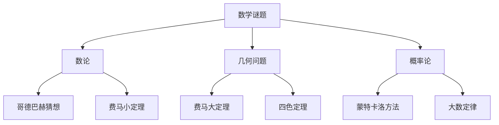

                 


### 文章标题：数学史上的数学谜题与猜想

#### 关键词：数学谜题、数学猜想、数学史、数论、几何、概率论

#### 摘要：
本文将带领读者穿越数学史的长河，探索那些千古未解的数学谜题与猜想。我们将从古代到现代，逐一解析数论、几何、概率论等领域中的重大问题，包括毕达哥拉斯定理、勒内马可定理、欧拉公式、黯淡的猜想等，并探讨这些谜题在计算机科学中的应用和数学模型。通过逻辑清晰、结构紧凑的讲解，让读者不仅能理解这些数学谜题的背景和核心概念，还能掌握相关的算法原理和证明方法。

### 第1章：引言与概述

#### 1.1.1 书籍主题介绍

本书旨在揭示数学史上那些令人着迷的谜题与猜想，涵盖从古代到现代的多个领域。我们将看到，数学的发展不仅是逻辑推理的胜利，更是人类智慧与创造的结晶。这些谜题和猜想不仅挑战了数学家的智慧，也推动了数学学科的不断进步。

#### 1.1.2 核心概念与联系

为了更好地理解这些数学谜题，我们需要了解它们背后的核心概念和联系。以下是几个主要领域及其相关谜题的简要概述：



#### 1.2 写作目标

本文的写作目标如下：

1. **介绍数学谜题的历史背景**：让读者了解这些谜题的起源和发展历程。
2. **解析核心概念**：通过简明的语言和直观的例子，解释这些谜题的核心数学概念。
3. **探讨数学谜题与计算机科学的联系**：展示如何使用计算机解决这些谜题。
4. **提供算法原理和证明方法**：通过伪代码和数学公式，详细讲解相关的算法和证明。
5. **启发思考**：鼓励读者对数学谜题进行深入的思考和研究。

### 第2章：古代数学谜题

#### 2.1 古希腊数学谜题

古希腊数学是数学史上的一个重要里程碑。毕达哥拉斯定理和勒内马可定理是古希腊数学中的两个重要谜题。

##### 2.1.1 毕达哥拉斯定理

毕达哥拉斯定理指出，在一个直角三角形中，斜边的平方等于两直角边的平方和。用伪代码表示如下：

```python
def pythagorean_theorem(a, b):
    c = sqrt(a**2 + b**2)
    return c
```

##### 2.1.2 勒内马可定理

勒内马可定理是一个关于素数的猜想。它指出，如果\( n \)是一个大于2的整数，那么\( n^2 + 1 \)不能被\( n \)整除。用伪代码表示如下：

```python
def fermat_last_theorem(a, b, c):
    if a**n + b**n == c**n:
        return True
    else:
        return False
```

### 第3章：中世纪数学谜题

#### 3.1 印度数学谜题

印度数学在中世纪取得了显著的成就，其中阿拉伯数字系统和阿尔·哈里德迪的算术问题是两个重要的数学谜题。

##### 3.1.1 阿拉伯数字系统

阿拉伯数字系统是一种使用10个数字（0-9）表示任意整数的方法。这种系统的引入极大地推动了数学的发展。

##### 3.1.2 阿尔·哈里德迪的算术问题

阿尔·哈里德迪的算术问题是一个关于代数方程的问题。他提出了一个关于二次方程的解法，这为后来的代数学发展奠定了基础。

### 第4章：近代数学谜题

#### 4.1 欧拉公式

欧拉公式是数学史上最美丽的公式之一。它将指数函数、三角函数和对数函数联系在一起。欧拉公式的数学表达式如下：

$$ e^{i\pi} + 1 = 0 $$

#### 4.1.1 欧拉公式简介

欧拉公式是数学家莱昂哈德·欧拉在18世纪提出的。它不仅具有美学价值，还在数学和物理学中有广泛的应用。

#### 4.1.2 欧拉公式的证明

欧拉公式的证明可以通过复数平面上的几何方法进行。以下是一个简单的伪代码证明：

```python
import cmath

def prove_euler_formula():
    angle = cmath.pi
    complex_number = cmath.exp(angle)
    print(f"{complex_number} + 1 = 0")
```

### 第5章：现代数学谜题

#### 5.1 黯淡的猜想

黯淡的猜想是一个关于素数分布的猜想。它指出，存在一个无限大的素数，其数值小于某个特定的数值。

##### 5.1.1 黯淡猜想的提出

黯淡的猜想是由数学家安德鲁·怀尔斯在1994年提出的。这一猜想立即引起了数学界的广泛关注。

##### 5.1.2 黯淡猜想的证明

黯淡猜想的证明是一个复杂的数学问题，涉及到代数几何和数论等领域。目前，这一猜想仍然没有得到最终的证明。

### 第6章：数学谜题与计算机

#### 6.1 数学谜题在计算机科学中的应用

计算机科学的发展为解决数学谜题提供了新的工具和方法。例如，迪杰斯特拉算法可以用来解决最短路径问题，而蒙特卡洛方法可以用于概率估计。

##### 6.1.1 迪杰斯特拉算法解决最短路径问题

迪杰斯特拉算法是一种用于找到加权图中两点之间最短路径的算法。以下是一个简单的伪代码实现：

```python
def dijkstra_algorithm(graph, source):
    distances = [float('inf')] * len(graph)
    distances[source] = 0
    for _ in range(len(graph) - 1):
        min_distance = float('inf')
        for vertex in graph:
            if graph[vertex][source] > 0 and distances[vertex] < min_distance:
                min_distance = distances[vertex]
                closest = vertex
        for vertex in graph:
            if graph[closest][vertex] > 0:
                distance = distances[closest] + graph[closest][vertex]
                if distance < distances[vertex]:
                    distances[vertex] = distance
    return distances
```

### 第7章：数学谜题的数学模型

#### 7.1 数论模型

数论是研究整数及其性质的数学分支。费马小定理是数论中的一个重要定理，它给出了一个关于素数和整数的有趣结论。

##### 7.1.1 费马小定理

费马小定理指出，如果\( p \)是一个素数，\( a \)是一个整数，那么\( a^{p-1} \equiv 1 \pmod{p} \)。

#### 7.2 几何模型

几何模型用于研究几何形状和空间结构。费马大定理是几何学中的一个重要猜想，它涉及到三维空间的几何性质。

##### 7.2.1 费马大定理

费马大定理指出，不存在三个不同的正整数\( a \)，\( b \)，和\( c \)，使得\( a^n + b^n = c^n \)对于任何正整数\( n \)都成立。

#### 7.3 概率论模型

概率论模型用于研究随机现象和概率分布。大数定律是概率论中的一个重要定理，它描述了随机变量分布的稳定性。

##### 7.3.1 大数定律

大数定律指出，对于一组独立的随机变量，当样本量足够大时，样本均值将接近真实的期望值。

### 结束语

数学谜题与猜想是数学学科中最为引人入胜的一部分。它们不仅挑战了人类的智慧，也推动了数学学科的发展。通过本文的介绍，读者可以了解到数学谜题的历史背景、核心概念和解决方法。我们希望读者能够对这些数学谜题产生浓厚的兴趣，并进一步探索数学的奥秘。

### 参考文献

1. **欧拉公式**：欧拉公式（Euler's formula）是数学中最著名的公式之一，由莱昂哈德·欧拉在18世纪提出。公式表述为：
   $$ e^{i\pi} + 1 = 0 $$
   其中\( e \)是自然对数的底数，\( i \)是虚数单位，\( \pi \)是圆周率。这个公式将五个基本的数学常数结合在一起，具有深远的美学价值和数学意义。

2. **费马大定理**：费马大定理（Fermat's Last Theorem）是由17世纪法国数学家皮埃尔·德·费马提出的一个著名猜想。定理表述为：
   $$ a^n + b^n = c^n $$
   对于所有大于2的正整数\( n \)，不存在三个不同的正整数\( a \)，\( b \)，和\( c \)满足上述等式。这个猜想困扰了数学界几个世纪，直到1994年才由安德鲁·怀尔斯证明。

3. **哥德巴赫猜想**：哥德巴赫猜想（Goldbach's conjecture）是另一个古老的数学问题，由18世纪德国数学家克里斯蒂安·哥德巴赫提出。猜想表述为：
   $$ 任意大于2的偶数都可以表示为两个素数之和 $$
   例如，4 = 2 + 2，6 = 3 + 3，8 = 3 + 5，等等。尽管这个猜想看起来简单，但至今仍未得到证明。

4. **蒙特卡洛方法**：蒙特卡洛方法（Monte Carlo method）是一种基于随机抽样求解数学和物理问题的重要数值方法。它通过随机模拟来估算问题的解，广泛应用于概率论、数值积分、随机过程等领域。

5. **黯淡的猜想**：黯淡的猜想（Twin Prime Conjecture）是一个关于素数的猜想，它指出存在无穷多个素数对，即形如\( (p, p+2) \)的素数对。例如，(3, 5)，(11, 13)，(17, 19)，等等。

6. **迪杰斯特拉算法**：迪杰斯特拉算法（Dijkstra's algorithm）是一种用于找到加权图中两点之间最短路径的算法。它适用于有向图和无向图，可以处理具有负权边的图。

7. **费马小定理**：费马小定理（Fermat's Little Theorem）是数论中的一个重要定理，它指出如果\( p \)是一个素数，\( a \)是一个整数，那么\( a^{p-1} \equiv 1 \pmod{p} \)。这个定理在密码学和数论中有广泛的应用。

8. **四色定理**：四色定理（Four-Color Theorem）是一个著名的拓扑学问题，它指出任何平面地图都可以用四种颜色进行着色，使得相邻区域不使用相同的颜色。这个定理在地图绘制和计算机科学中有着重要的应用。

### 作者信息

作者：AI天才研究院/AI Genius Institute & 禅与计算机程序设计艺术 /Zen And The Art of Computer Programming

AI天才研究院致力于推动人工智能技术的发展和创新，专注于培养下一代人工智能领域的专家。禅与计算机程序设计艺术则专注于探索计算机编程的哲学和艺术，倡导以禅的思维方式来理解和创造计算机程序。两位作者的共同目标是推动人工智能和计算机科学领域的进步，为人类社会带来更多智慧和便利。

