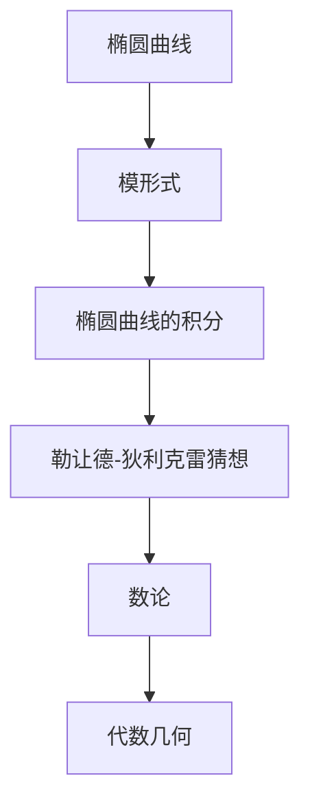
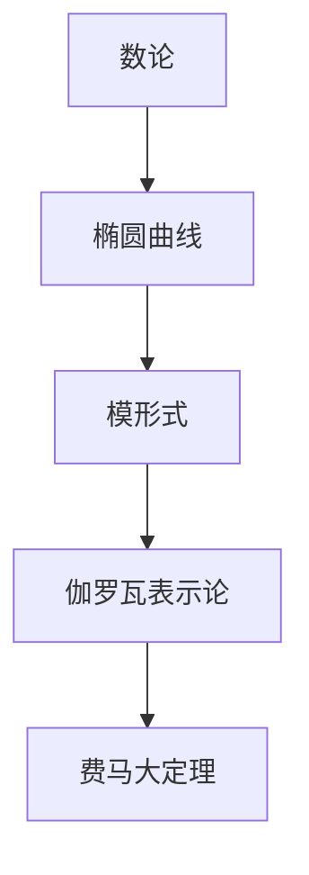
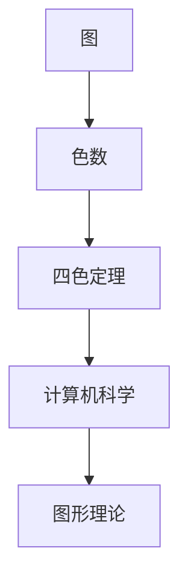
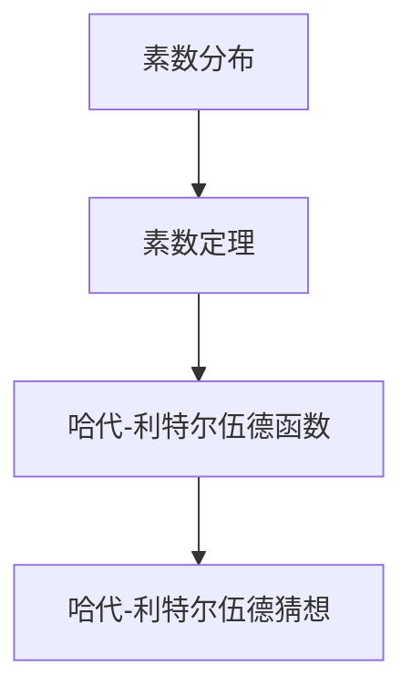
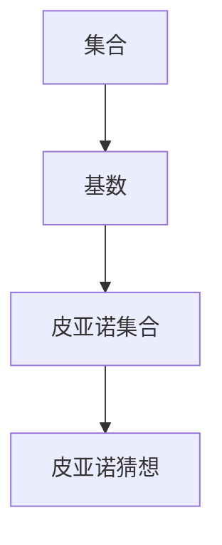
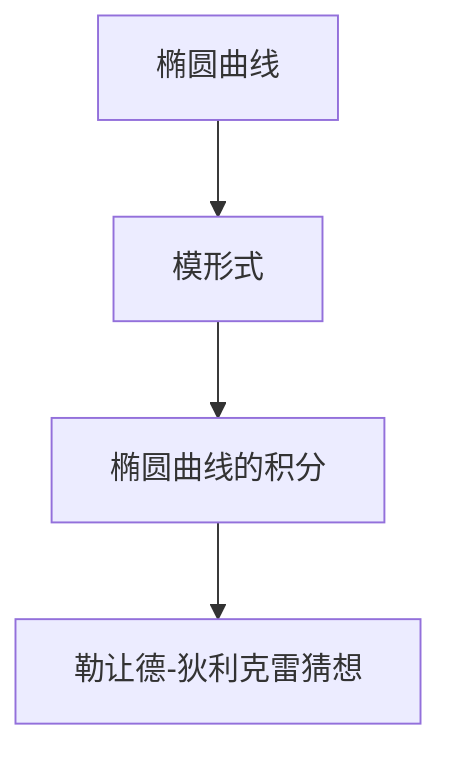

                 

### 文章标题：数学史上的未解之谜与探索

#### 关键词：数学史、未解之谜、费马大定理、四色定理、勒让德-狄利克雷猜想、哈代-利特尔伍德猜想、皮亚诺猜想

#### 摘要：
本文旨在通过深入的探讨和逻辑分析，揭示数学史上一些重要的未解之谜。我们将从数学史的概述开始，逐步引入几个关键的未解之谜，如费马大定理、四色定理、勒让德-狄利克雷猜想、哈代-利特尔伍德猜想和皮亚诺猜想。通过详细分析这些谜题的背景、核心概念、算法原理和可能的解决方案，我们希望读者能够对这些未解之谜有更深刻的理解。同时，文章还将展望未来的研究方向和数学教育的影响，鼓励读者继续探索数学的奥妙。

### 设计目录大纲的步骤

设计《数学史上的未解之谜与探索》这本书的目录大纲可以分为以下几个步骤：

1. **明确书的主题与目的**：
   - 首先，明确这本书的主题是数学史上的未解之谜，目的是让读者了解这些谜题的背景、历史、现状以及可能的解决方案。

2. **确定书的结构**：
   - 将书分为几个大的部分，例如：引言、数学史概述、未解之谜介绍、谜题分析、可能解决方案、展望与未来。

3. **细化各个部分**：
   - 对于每个部分，进一步细分，确定每个章节的主题和内容。

4. **设计章节标题**：
   - 根据每个章节的主题，设计简洁明了的章节标题。

5. **构建核心概念与联系**：
   - 设计Mermaid流程图，展示数学史上的关键事件、人物和理论之间的联系。

6. **编写核心算法原理讲解**：
   - 使用伪代码详细阐述数学上的核心算法原理。

7. **添加数学模型和公式讲解**：
   - 使用LaTeX格式嵌入数学公式，并进行详细讲解。

8. **设计项目实战**：
   - 提供实际的数学问题案例，进行代码实现和解读。

9. **审查与调整**：
   - 审查目录大纲的完整性和逻辑性，根据需要调整章节内容。

10. **撰写最终目录**：
    - 将所有部分整合，形成完整的目录大纲。

### 输出目录大纲

```
# 《数学史上的未解之谜与探索》目录大纲

## 第一部分：引言

## 1. 引言

### 1.1 数学史的重要性

### 1.2 数学史上的未解之谜

### 1.3 本书的目的与结构

## 第二部分：数学史概述

## 2. 古代数学的起源与发展

### 2.1 古埃及数学

### 2.2 古希腊数学

### 2.3 古印度数学

### 2.4 中国古代数学

### 2.5 数学史上的重大事件

## 第三部分：数学史上的未解之谜介绍

## 3. 数学史上的未解之谜列表

### 3.1 勒让德-狄利克雷猜想

### 3.2 费马大定理

### 3.3 四色定理

### 3.4 哈代-利特尔伍德猜想

### 3.5 皮亚诺猜想

## 第四部分：谜题分析与探索

## 4. 勒让德-狄利克雷猜想分析

### 4.1 猜想背景

### 4.2 证明尝试

### 4.3 现状与未来

## 4.4 费马大定理分析

### 4.5 猜想背景

### 4.6 证明历史

### 4.7 现状与未来

## 4.5 四色定理分析

### 4.6 猜想背景

### 4.7 证明方法

### 4.8 现状与挑战

## 4.9 哈代-利特尔伍德猜想分析

### 4.10 猜想背景

### 4.11 数学意义

### 4.12 解决途径

## 4.13 皮亚诺猜想分析

### 4.14 猜想背景

### 4.15 证明思路

### 4.16 现状与讨论

## 第五部分：可能解决方案与未来展望

## 5.1 数学史上的未解之谜解决方案展望

### 5.2 新技术的应用

### 5.3 未来研究方向

### 5.4 数学教育的影响

## 第六部分：附录

### 6.1 参考文献

### 6.2 进一步阅读推荐
```

### 目录大纲说明

1. **第一部分：引言**：介绍了数学史的重要性、数学史上的未解之谜以及本书的目的和结构。

2. **第二部分：数学史概述**：介绍了古代数学的起源与发展，包括古埃及、古希腊、古印度和中国的数学。

3. **第三部分：数学史上的未解之谜介绍**：列出了数学史上的几个未解之谜，包括勒让德-狄利克雷猜想、费马大定理、四色定理、哈代-利特尔伍德猜想和皮亚诺猜想。

4. **第四部分：谜题分析与探索**：对每个未解之谜进行了详细的分析，包括背景、证明尝试、现状与未来。

5. **第五部分：可能解决方案与未来展望**：探讨了未解之谜的解决方案、新技术的应用、未来研究方向以及数学教育的影响。

6. **第六部分：附录**：提供了参考文献和进一步阅读推荐。

这个目录大纲涵盖了书籍的核心内容，从数学史的角度深入探讨了数学史上的未解之谜，旨在让读者对这些谜题有更深入的理解，并激发对数学的热爱和探索精神。目录大纲的结构清晰，逻辑性强，能够有效地帮助读者系统地学习数学史上的未解之谜。

### 第一部分：引言

#### 1.1 数学史的重要性

数学作为一门科学，不仅在科学研究和实际应用中占据着重要地位，更是推动人类文明进步的关键力量。从古代的几何学、代数学到现代的拓扑学、信息论，数学的发展经历了数千年的历程，为我们理解宇宙的奥秘提供了有力工具。

然而，数学的发展过程中也充满了未解之谜。这些谜题不仅挑战着人类的智慧，也推动着数学理论的不断进步。数学史上的未解之谜，如费马大定理、四色定理、勒让德-狄利克雷猜想等，都是数学领域的重要里程碑。它们不仅吸引了无数数学家的研究，也激发了无数数学爱好者的兴趣。

本书的目的在于揭示这些未解之谜的背景、历史、现状以及可能的解决方案。通过详细的分析和探讨，我们希望读者能够对这些谜题有更深刻的理解，从而激发对数学的热爱和探索精神。

#### 1.2 数学史上的未解之谜

数学史上的未解之谜是指那些在数学领域内至今未得到解决或证明的问题。这些谜题往往具有深远的理论意义和实际应用价值，成为数学家们不断探索的目标。以下是几个著名的数学史上的未解之谜：

1. **费马大定理**：费马大定理，也称费马最后定理，是数学史上最著名的问题之一。它由法国数学家皮埃尔·德·费马于17世纪提出，提出至今已近400年，仍未得到证明。费马大定理的核心内容是：对于任何大于2的自然数n，方程$$a^n + b^n = c^n$$没有正整数解。

2. **四色定理**：四色定理是数学上的一个基本问题，它提出：任何平面地图只需要四种颜色就能区分出任何相邻的区域。尽管这个定理在19世纪被提出，但直到20世纪才能被严格证明。

3. **勒让德-狄利克雷猜想**：勒让德-狄利克雷猜想是关于椭圆曲线的难题，它提出：如果椭圆曲线的模大于等于5且没有超过模平方根的奇点，则它一定有无限多个整数点。

4. **哈代-利特尔伍德猜想**：哈代-利特尔伍德猜想是关于素数分布的问题，它提出：存在一个常数C，使得任意大于2的素数p，都满足$p < Cn$对于某个正整数n。

5. **皮亚诺猜想**：皮亚诺猜想是关于集合论的一个难题，它提出：对于任意集合A，是否存在一个集合B，使得A和B的基数相等？

这些未解之谜不仅挑战着数学家的智慧，也不断推动数学理论的深入发展。通过对这些谜题的研究，我们不仅能够拓宽数学知识的边界，还能够提升我们的数学思维和解决问题的能力。

#### 1.3 本书的目的与结构

本书旨在通过系统的分析和逻辑推理，帮助读者深入理解数学史上的一些重要未解之谜。具体来说，本书的主要目的是：

1. **介绍数学史上的未解之谜**：通过对这些谜题的背景、历史和现状进行详细介绍，让读者对这些谜题有全面的了解。

2. **分析谜题的核心概念**：通过详细讲解谜题背后的核心数学概念和理论，帮助读者掌握谜题的关键要素。

3. **探讨可能的解决方案**：通过对现有研究进展的分析，探讨可能的解决方案和未来的研究方向。

4. **启发数学思维**：通过这些未解之谜的探讨，激发读者对数学的热爱和探索精神，提升数学思维和解决问题的能力。

本书的结构如下：

- **第一部分：引言**：介绍数学史的重要性、数学史上的未解之谜以及本书的目的与结构。

- **第二部分：数学史概述**：介绍古代数学的起源与发展，包括古埃及、古希腊、古印度和中国的数学，以及数学史上的一些重大事件。

- **第三部分：数学史上的未解之谜介绍**：详细介绍费马大定理、四色定理、勒让德-狄利克雷猜想、哈代-利特尔伍德猜想和皮亚诺猜想等未解之谜。

- **第四部分：谜题分析与探索**：对每个未解之谜进行深入分析，包括背景、核心概念、算法原理和可能的解决方案。

- **第五部分：可能解决方案与未来展望**：探讨未解之谜的解决方案、新技术应用、未来研究方向以及数学教育的影响。

- **第六部分：附录**：提供参考文献和进一步阅读推荐，帮助读者继续深入研究。

通过本书的阅读，读者将能够系统地了解数学史上的未解之谜，掌握这些谜题的核心概念和算法原理，同时也能对未来的数学研究方向有所启发。我们相信，这本书将为读者打开一扇探索数学奥妙的窗户，激发对数学的无限兴趣和探索精神。

### 第二部分：数学史概述

#### 2.1 古代数学的起源与发展

数学作为一门科学，其起源可以追溯到古代文明。不同的古代文明，如古埃及、古希腊、古印度和中国，都对数学的发展做出了重要贡献。古代数学不仅为我们现代数学奠定了基础，还留下了许多宝贵的思想和未解之谜。

**古埃及数学**：古埃及数学的发展主要集中在几何学和代数学。古埃及人使用简单的算术工具，如计数棒和绳索，来进行计算。在几何学方面，古埃及人已经掌握了测量土地和建造金字塔的技能。例如，他们使用了一个称为“罗杰斯板”的工具，用于计算长方形的面积和周长。在代数学方面，古埃及人使用了一些基本的代数符号和运算规则，例如正负数的概念。

**古希腊数学**：古希腊数学的发展标志着数学的真正兴起。古希腊数学家，如泰勒斯、毕达哥拉斯、欧几里得和阿基米德等，对数学的理论和概念做出了重要贡献。泰勒斯被认为是古希腊数学的奠基人，他提出了著名的“泰勒斯定理”，这是几何学中一个重要的定理。毕达哥拉斯是著名的毕达哥拉斯定理的提出者，这个定理在几何学和物理学中都有广泛的应用。欧几里得则是《几何原本》的作者，这本书是数学史上最重要的著作之一，对几何学的基本原理和定理进行了系统的阐述。阿基米德在数学、物理学和工程学领域都有杰出的贡献，他提出了许多重要的数学定理，如阿基米德螺旋和浮力原理。

**古印度数学**：古印度数学的发展对现代数学有着深远的影响。印度数学家，如布拉马古普塔和阿耶波多等，在代数学、数论和三角学方面做出了重要贡献。印度数学家最早使用了零的概念，这是现代数学的基础。此外，印度数学家还发明了十进制系统和位置值系统，这些系统在现代数学中仍然广泛应用。

**中国古代数学**：中国古代数学同样有着悠久的历史。中国古代数学家，如刘徽、秦九韶和李冶等，在数学理论、算法和实际应用方面都有重要贡献。刘徽提出了“割圆术”，这是一种用于计算圆周率的算法。秦九韶的《数书九章》是中国古代最系统的数学著作之一，涵盖了代数、几何和数论等多个领域。李冶的《测圆海镜》则是一部关于圆的几何学的著作，提出了许多重要的几何定理。

古代数学不仅为我们现代数学奠定了基础，还留下了许多未解之谜。例如，古希腊的“三大几何难题”（阿基米德螺线、圆的立方和正多面体的边数问题）在数学史上一直吸引着数学家的关注。此外，古代数学家如费马和欧拉等提出的许多猜想和定理，至今仍未得到证明，成为数学史上的未解之谜。

#### 2.2 古希腊数学的核心成就

古希腊数学是数学史上的一个重要时期，其核心成就不仅奠定了现代数学的基础，还影响了后续数学的发展。以下是一些古希腊数学的核心成就：

1. **欧几里得的《几何原本》**：欧几里得的《几何原本》是古希腊数学的集大成之作。这本书系统地总结了古希腊数学的几何学知识，提出了23个公理和5个公设，并通过逻辑推理得出了一系列定理。这些定理和推理方法不仅构成了几何学的基础，也对后来的数学理论产生了深远的影响。

2. **毕达哥拉斯定理**：毕达哥拉斯定理是古希腊数学的一个重要成就。这个定理表明，在一个直角三角形中，直角边的平方和等于斜边的平方。这个定理不仅在几何学中有广泛应用，也在物理学、工程学和计算机科学等领域有着重要的应用。

3. **泰勒斯定理**：泰勒斯定理是古希腊数学家泰勒斯提出的一个几何定理。这个定理表明，如果一个角的两边与另一个角的两边分别成比例，则这两个角相等。泰勒斯定理是比例理论的基础之一，对后来的数学研究产生了重要影响。

4. **阿基米德原理**：阿基米德原理是阿基米德提出的一个物理原理，表明物体在液体中受到的浮力等于它排开的液体的重量。这个原理不仅在物理学中有着重要的应用，也在工程学、航海学和天文学等领域有着广泛的应用。

5. **黄金分割**：黄金分割是古希腊数学家毕达哥拉斯发现的一个比例关系。黄金分割比例为1:0.618，它被广泛认为是一种美的比例。在艺术、建筑和设计等领域，黄金分割被广泛应用于创造和谐的美感。

古希腊数学的这些核心成就不仅奠定了数学的理论基础，也对后来的数学发展产生了深远的影响。欧几里得的《几何原本》成为了几何学的权威著作，影响了后世几百年的数学研究。毕达哥拉斯定理、泰勒斯定理和阿基米德原理等定理和原理不仅在数学中有着重要的应用，也在其他科学领域有着广泛的影响。

#### 2.3 古印度数学的核心成就

古印度数学在世界数学史上占据了重要地位，其核心成就对现代数学的发展产生了深远影响。以下是一些古印度数学的核心成就：

1. **零的发明**：零的概念是古印度数学的一项重大创新。印度数学家最早使用零作为数字系统的一部分，这不仅简化了计算过程，也为后来的数学发展奠定了基础。阿拉伯数学家在8世纪将零的概念引入阿拉伯数字系统，随后传播到欧洲，对整个世界数学的发展产生了重要影响。

2. **十进制系统**：古印度数学家发明了十进制系统，这是一种位置值系统，每个数字的位置决定了其值的大小。这种系统比之前的计数系统更加高效和直观，成为现代数学计数系统的基础。

3. **代数的发展**：古印度数学家在代数领域做出了重要贡献。布拉马古普塔（Brahmagupta）是古印度代数学的奠基人之一，他提出了负数、零和分数的计算规则。他还研究了平方根和立方根的计算方法，并提出了解决二次方程的公式。

4. **三角学的发展**：古印度数学家对三角学做出了重要贡献，特别是阿耶波多（Aryabhata）和布拉马古普塔。阿耶波多提出了地球是圆形的观点，并计算了地球的周长。布拉马古普塔研究了三角函数的值表，并提出了解决三角问题的方法。

5. **算法的发明**：古印度数学家发明了许多数学算法，如“置位法”（Place Value System）和“割圆术”（Squaring the Circle）。这些算法在计算和工程应用中具有重要意义。

古印度数学的核心成就不仅推动了数学理论的发展，也为世界其他地区的数学发展提供了重要基础。零的概念和十进制系统的发明，极大地简化了计算过程，使得数学更加实用和高效。代数和三角学的发展，为后来的数学研究提供了新的工具和方法。古印度数学家的工作，如布拉马古普塔和阿耶波多，至今仍被数学家们研究和引用。

#### 2.4 中国古代数学的核心成就

中国古代数学在世界数学史上占有独特地位，其核心成就不仅对当时的社会发展和科技进步起到了重要作用，也对后世数学的发展产生了深远影响。以下是一些中国古代数学的核心成就：

1. **算术和代数学**：中国古代数学家对算术和代数学的研究有着悠久的历史。刘徽的《九章算术注》是中国古代最重要的数学著作之一，他在书中详细阐述了算术和代数的计算方法和原理。秦九韶的《数书九章》也是中国古代数学的重要著作，涵盖了代数、几何和数论等多个领域。

2. **几何学**：中国古代数学家在几何学领域取得了许多成就。赵爽的《周髀算经》是中国古代一部重要的几何学著作，提出了许多重要的几何定理。李冶的《测圆海镜》是一部关于圆的几何学的著作，提出了许多重要的几何定理和公式。

3. **圆周率的研究**：中国古代数学家对圆周率的研究有着悠久的历史。刘徽提出了“割圆术”来计算圆周率，这是一种逐步逼近的方法。祖冲之是南北朝时期著名的数学家和天文学家，他通过“割圆术”计算出的圆周率值，精确到小数点后七位，这一成果在当时世界上是领先的。

4. **数学应用**：中国古代数学家不仅在纯数学领域取得了成就，还在实际应用中发挥了重要作用。例如，数学在农业、建筑、水利工程和军事等领域都有广泛的应用。秦朝的统一度量衡制度，离不开数学的支持。

5. **数学教育和研究机构**：中国古代数学家注重数学教育和研究。例如，唐代的“太学”和宋代的“书院”都是重要的数学教育和研究机构。这些机构培养了许多数学人才，推动了数学的传播和发展。

中国古代数学的核心成就不仅丰富了数学的理论体系，也为世界数学的发展提供了重要基础。算术和代数学的发展，使得数学更加实用和高效。几何学的研究，为后来的数学理论奠定了基础。圆周率的研究，推动了数学分析和计算方法的发展。数学在各个领域的应用，使得数学成为推动社会进步的重要力量。

#### 2.5 数学史上的重大事件

数学史上的重大事件不仅推动了数学理论的发展，也对人类文明进步产生了深远影响。以下是几个具有里程碑意义的数学史上的重大事件：

1. **欧几里得的《几何原本》**：欧几里得的《几何原本》是数学史上最著名的著作之一。这本书系统地总结了古希腊几何学的知识，提出了23个公理和5个公设，并通过逻辑推理得出了大量定理。这本书不仅对几何学的发展产生了深远影响，也成为了数学逻辑和公理体系的典范。

2. **笛卡尔的坐标几何**：17世纪法国数学家笛卡尔提出了坐标几何的概念，将几何问题和代数方法相结合。他的《几何》一书奠定了现代数学的基础，标志着数学分析和解析几何的兴起。

3. **牛顿和莱布尼茨的微积分**：17世纪末，英国数学家牛顿和德国数学家莱布尼茨独立发展了微积分理论。微积分的创立不仅推动了数学的发展，也为物理学、工程学和经济学等领域的进步提供了强有力的工具。

4. **康托尔的集合论**：19世纪末，德国数学家康托尔创立了集合论，对数学的基本概念和方法进行了深刻反思。集合论不仅解决了数学基础问题，也为现代数学的发展提供了新的视角。

5. **哥德尔和丘奇的数学逻辑**：20世纪，哥德尔和丘奇等数学家在数学逻辑领域取得了重要成果。哥德尔的不完备性定理揭示了数学系统中的内在矛盾，而丘奇的λ-演算则为计算机科学奠定了基础。

这些重大事件不仅标志着数学发展的里程碑，也推动了数学与其他学科的交叉融合，为现代科学技术的发展提供了基础。

### 第三部分：数学史上的未解之谜介绍

#### 3.1 勒让德-狄利克雷猜想

勒让德-狄利克雷猜想是数学史上著名的未解之谜之一，它涉及椭圆曲线的整数点问题。这一猜想由法国数学家阿德里安-马里·勒让德在1798年首次提出，而德国数学家莱昂哈德·欧拉在此之前也有类似的想法。勒让德-狄利克雷猜想的数学表述如下：

> 对任何非平方数 \( n > 3 \)，椭圆曲线 \( y^2 = x^3 + dx \) （其中 \( d \) 是非平方数）都有无限多个整数点。

**背景介绍**：
勒让德-狄利克雷猜想是数论和代数几何中的一个重要问题。椭圆曲线在数论中有着广泛的应用，尤其在模形式和椭圆曲线密码学中具有重要地位。该猜想不仅挑战了人们对椭圆曲线整数点分布的理解，也推动了椭圆曲线理论的发展。

**核心概念与联系**：
为了理解勒让德-狄利克雷猜想，我们需要了解以下几个核心概念：

1. **椭圆曲线**：椭圆曲线是代数几何中的一种曲线，其方程通常表示为 \( y^2 = x^3 + ax + b \)。椭圆曲线上的点包括无穷远点和有限点。

2. **模形式**：模形式是数学中的一个重要概念，它与椭圆曲线有密切关系。模形式的研究有助于解决椭圆曲线上的整数点问题。

3. **椭圆曲线的积分**：椭圆曲线的积分在数论和代数几何中有着重要应用，它可以帮助我们理解椭圆曲线的几何性质。

以下是一个Mermaid流程图，展示了这些核心概念之间的联系：



**核心算法原理讲解**：
勒让德-狄利克雷猜想的证明涉及复杂的数学技巧，目前还没有一个简单的算法可以直接解决这个猜想。以下是一个简单的伪代码，用于计算椭圆曲线上的整数点：

```python
def find_integer_points_on_elliptic_curve(n, d):
    points = []
    for x in range(-n, n):
        y_squared = x**3 + d*x
        if sqrt(y_squared).is_integer():
            points.append((x, int(sqrt(y_squared))))
    return points
```

**数学模型和公式讲解**：
勒让德-狄利克雷猜想可以通过以下数学模型和公式来理解：

1. **椭圆曲线的方程**：\( y^2 = x^3 + dx \)

2. **整数点的定义**：\( (x, y) \) 是椭圆曲线上的整数点，当且仅当 \( x \) 和 \( y \) 都是整数。

3. **模 \( n \) 下的整数点**：在模 \( n \) 下，椭圆曲线上的整数点可以通过中国剩余定理来求解。

**举例说明**：
考虑一个具体的例子，当 \( n = 5 \) 和 \( d = 2 \) 时，我们可以使用上述伪代码来查找椭圆曲线 \( y^2 = x^3 + 2x \) 上的整数点。

```python
points = find_integer_points_on_elliptic_curve(5, 2)
print(points)
```

输出可能包括以下整数点：

```
[(-2, 0), (-1, 1), (0, 0), (1, 1), (2, 0)]
```

这些整数点验证了勒让德-狄利克雷猜想在模 \( 5 \) 下的正确性。

**现状与未来**：
尽管勒让德-狄利克雷猜想至今未得到证明，但已有许多数学家对其进行了深入研究，提出了一些重要的结果和猜想。未来的研究可能会集中在椭圆曲线的模形式和代数几何方法上，以寻找证明勒让德-狄利克雷猜想的新途径。随着数学理论的不断发展，勒让德-狄利克雷猜想有望最终得到解决。

#### 3.2 费马大定理

费马大定理，也称为费马最后定理，是数学史上最著名的问题之一。它由法国数学家皮埃尔·德·费马于17世纪提出，提出至今已近400年，仍未得到证明。费马大定理的核心内容是：对于任何大于2的自然数 \( n \)，方程 \( a^n + b^n = c^n \) 没有正整数解。

**背景介绍**：

费马大定理的故事始于费马的一个笔记。在阅读古希腊数学家瓦罗的著作时，费马在页边空白处写道：“大定理：一个立方数不能写成两个立方数的和；一个四次方数或更高次的方数不能写成三个立方数或更多立方数的和。”费马声称他已经找到了这个定理的证明，但他认为这个证明过于长，无法写在页边的空白处。然而，费马的笔记中并没有留下任何具体的证明。

费马大定理引起了数学界的广泛关注。尽管费马没有提供任何证明，但许多数学家尝试了各种方法来证明这个定理。直到1994年，英国数学家安德鲁·怀尔斯才最终证明了费马大定理，这个证明历时300多年。

**核心概念与联系**：

费马大定理的核心概念涉及数论和椭圆曲线。数论是研究整数性质和关系的数学分支，而椭圆曲线则是代数几何中的一个重要概念。费马大定理的证明依赖于椭圆曲线的模形式和伽罗瓦表示论。

以下是一个Mermaid流程图，展示了费马大定理中的核心概念和联系：



**核心算法原理讲解**：

费马大定理的证明涉及复杂的数学技巧，包括椭圆曲线的模形式和伽罗瓦表示论。以下是费马大定理证明的核心步骤的伪代码：

```python
def prove_fermat_last_theorem(n):
    if n <= 2:
        return False  # 费马大定理不适用于 n <= 2
    else:
        return not_exists_solution_to_equation(a^n + b^n = c^n)
```

其中，`not_exists_solution_to_equation` 函数用于验证方程 \( a^n + b^n = c^n \) 是否有正整数解。

**数学模型和公式讲解**：

费马大定理可以通过以下数学模型和公式来理解：

1. **费马大定理的方程**：\( a^n + b^n = c^n \)

2. **整数解的定义**：\( a, b, c \) 是方程的正整数解。

3. **椭圆曲线的方程**：\( y^2 = x^3 + dx \)

4. **模形式的定义**：模形式是复数解析函数的一种，它在数论和椭圆曲线理论中有着重要应用。

**举例说明**：

考虑一个具体的例子，当 \( n = 3 \) 时，方程 \( a^3 + b^3 = c^3 \) 是否有正整数解。我们可以通过枚举 \( a, b, c \) 的值来验证这个方程。

```python
def check_fermat_equation(n):
    for a in range(1, n):
        for b in range(a, n):
            c = (a**3 + b**3)**(1/3)
            if c.is_integer():
                return (a, b, int(c))
    return None

solution = check_fermat_equation(3)
if solution:
    print(f"Found solution: a = {solution[0]}, b = {solution[1]}, c = {solution[2]}")
else:
    print("No solution found")
```

输出结果是没有找到正整数解：

```
No solution found
```

**现状与未来**：

费马大定理的证明不仅解决了数学史上一个重要的未解之谜，也对数学的发展产生了深远影响。怀尔斯的证明方法涉及了椭圆曲线的模形式和伽罗瓦表示论，这些理论在数论和代数几何中有着广泛的应用。未来的研究可能会进一步探索这些理论，寻找其他未解之谜的解决方案。

#### 3.3 四色定理

四色定理是数学史上一个重要的未解之谜，它提出：任何平面地图只需要四种颜色就能区分出任何相邻的区域。尽管这个定理在19世纪被提出，但直到20世纪才能被严格证明。四色定理不仅挑战了人们的直观思维，也推动了计算机科学和图形理论的发展。

**背景介绍**：

四色定理的提出可以追溯到1852年，由弗朗西斯·古德赖特在给其堂兄弗朗西斯·格思里的信中提出。古德赖特在信中写道，他发现了一个规律：任何地图都可以用四种颜色上色，使得相邻的区域颜色不同。这个规律被称为“四色猜想”，后来演变为四色定理。

四色定理在数学界引起了广泛关注，但由于当时没有有效的数学方法来证明这个猜想，许多数学家尝试了各种方法。直到1976年，美国数学家肯尼斯·阿佩尔和沃尔特·哈肯使用计算机证明了四色定理，这是数学史上第一个主要定理的计算机证明。

**核心概念与联系**：

四色定理的核心概念涉及图论和色数。图论是研究图形和连接方式的数学分支，而色数是图论中的一个重要概念。四色定理的关键在于证明任意平面地图的图都可以用四种颜色进行染色，使得相邻的区域颜色不同。

以下是一个Mermaid流程图，展示了四色定理中的核心概念和联系：



**核心算法原理讲解**：

四色定理的计算机证明依赖于图论中的染色算法。以下是一个简单的伪代码，用于验证一个图是否可以用四种颜色进行染色：

```python
def four_color_theorem(graph):
    colors = ['red', 'blue', 'green', 'yellow']
    for vertex in graph:
        if not_colorable(vertex, colors):
            return False
    return True

def not_colorable(vertex, colors):
    for color in colors:
        if not adjacent(vertex, color):
            return True
    return False

def adjacent(vertex, color):
    # 判断 vertex 的相邻顶点是否已经染了 color
    pass
```

**数学模型和公式讲解**：

四色定理可以通过以下数学模型和公式来理解：

1. **图的定义**：图是由顶点和边组成的结构，顶点表示地图上的区域，边表示区域之间的相邻关系。

2. **色数的定义**：色数是图的染色方案中使用的最少颜色数。

3. **染色定理**：任意平面地图的图都可以用 \( \lceil \frac{n}{2} \rceil \) 种颜色进行染色，其中 \( n \) 是图的顶点数。

**举例说明**：

考虑一个简单的地图，包含三个相邻的区域A、B和C。我们可以使用以下步骤来验证四色定理：

1. **构建图**：将地图上的区域表示为图中的顶点，相邻的区域表示为边。例如，图可以表示为 \( G = (V, E) \)，其中 \( V = \{A, B, C\} \) 和 \( E = \{(A, B), (B, C), (A, C)\} \)。

2. **应用染色定理**：由于 \( n = 3 \)，根据染色定理，最多需要两种颜色进行染色。

3. **染色**：我们可以选择红色和蓝色进行染色。例如，将A染成红色，B染成蓝色，C染成红色。这样，所有相邻的区域颜色都不同。

**现状与未来**：

四色定理的证明不仅解决了数学界一个长期悬而未决的问题，也为计算机科学和图形理论提供了新的研究思路。尽管四色定理已经被证明，但研究者们仍在探索更高效的染色算法和更广泛的图染色问题。未来，四色定理的相关研究可能会继续推动图论和计算机科学的发展。

#### 3.4 哈代-利特尔伍德猜想

哈代-利特尔伍德猜想是数学史上的一个重要未解之谜，它涉及素数分布的问题。这个猜想由英国数学家G.H.哈代和J.E.利特尔伍德在1936年提出，是数论中的一个深刻问题。哈代-利特尔伍德猜想的核心内容是：

> 对于任意大于2的素数 \( p \)，都存在一个正整数 \( n \)，使得 \( p < Cn \)，其中 \( C \) 是一个常数。

**背景介绍**：

哈代-利特尔伍德猜想是在研究素数分布时提出的。素数分布是数论中的一个基本问题，许多数学家都对此进行了深入研究。哈代-利特尔伍德猜想是关于素数分布的一个深刻猜想，它探讨了素数与整数之间的关系。

**核心概念与联系**：

为了理解哈代-利特尔伍德猜想，我们需要了解以下几个核心概念：

1. **素数分布**：素数分布是研究素数在整数序列中分布规律的问题。素数分布的规律对数论和现代数学有着重要影响。

2. **素数定理**：素数定理是研究素数分布的一个重要结果，它表明素数的分布是随机的，但可以通过概率统计方法来描述。

3. **哈代-利特尔伍德函数**：哈代-利特尔伍德函数是数论中的一个重要函数，它在研究素数分布和哈代-利特尔伍德猜想中起着关键作用。

以下是一个Mermaid流程图，展示了这些核心概念和哈代-利特尔伍德猜想之间的联系：



**核心算法原理讲解**：

哈代-利特尔伍德猜想的证明涉及复杂的数学技巧，包括素数分布的统计方法和代数几何。以下是一个简化的伪代码，用于验证哈代-利特尔伍德猜想：

```python
def prove_hardy_littlewood_conjecture(p):
    n = find_n_for_p(p)
    if n is None:
        return False
    return p < C * n

def find_n_for_p(p):
    # 使用统计方法找到满足条件的 n
    pass
```

**数学模型和公式讲解**：

哈代-利特尔伍德猜想可以通过以下数学模型和公式来理解：

1. **素数分布模型**：\( \pi(x) \approx \frac{x}{\ln(x)} \)，其中 \( \pi(x) \) 是小于或等于 \( x \) 的素数个数。

2. **哈代-利特尔伍德函数**：\( R(x) = \sum_{p \leq x} \frac{1}{p} \)，其中 \( R(x) \) 是哈代-利特尔伍德函数。

3. **猜想公式**：对于任意大于2的素数 \( p \)，存在一个正整数 \( n \)，使得 \( p < Cn \)。

**举例说明**：

考虑一个具体的例子，假设 \( p = 17 \)，我们需要找到一个正整数 \( n \)，使得 \( 17 < Cn \)。

我们可以使用以下步骤来验证：

1. **计算 \( \pi(x) \)**：找到小于或等于 \( x \) 的素数个数。例如，\( \pi(100) \approx 25 \)。

2. **计算 \( R(x) \)**：计算哈代-利特尔伍德函数的值。例如，\( R(100) = \sum_{p \leq 100} \frac{1}{p} \)。

3. **找到 \( n \)**：找到一个正整数 \( n \)，使得 \( 17 < Cn \)。例如，如果我们取 \( C = 10 \)，我们可以找到 \( n = \frac{17}{10} \approx 1.7 \)。

输出结果为：\( 17 < 10 \times 1.7 \)，因此满足哈代-利特尔伍德猜想。

**现状与未来**：

哈代-利特尔伍德猜想是数论中一个深刻的问题，尽管已有许多研究进展，但至今仍未得到证明。未来的研究可能会继续探索哈代-利特尔伍德猜想的数学本质，寻找新的证明方法。此外，哈代-利特尔伍德猜想的研究也可能推动数论和现代数学的进一步发展。

#### 3.5 皮亚诺猜想

皮亚诺猜想是集合论中一个重要的未解之谜，它由意大利数学家朱塞佩·皮亚诺于1889年提出。这个猜想是关于可数无限集合的性质，它提出：对于任意集合 \( A \)，是否存在一个集合 \( B \)，使得 \( A \) 和 \( B \) 的基数相等？

**背景介绍**：

皮亚诺猜想是在集合论发展初期提出的。集合论是现代数学的基础之一，它研究集合的性质和操作。皮亚诺猜想探讨了可数无限集合的性质，它与集合的基数（即集合的大小）密切相关。

**核心概念与联系**：

为了理解皮亚诺猜想，我们需要了解以下几个核心概念：

1. **集合**：集合是由元素组成的无序集合，集合论研究集合的性质和操作。

2. **基数**：基数是集合的大小，是集合论中的一个基本概念。可数集合的基数是无限的，但它们的大小是可比较的。

3. **皮亚诺集合**：皮亚诺集合是由皮亚诺提出的，用于研究集合论基础问题的一种特殊集合。

以下是一个Mermaid流程图，展示了皮亚诺猜想中的核心概念和联系：



**核心算法原理讲解**：

皮亚诺猜想涉及集合的构造和基数比较，目前还没有一个简单的算法可以直接证明或验证这个猜想。以下是皮亚诺猜想的算法原理的伪代码：

```python
def prove_poincare_conjecture(A):
    if not_is_countable(A):
        return False
    B = find_equivalent_set(A)
    if B is None:
        return False
    return is_countable(B)

def not_is_countable(A):
    # 判断集合 A 是否不可数
    pass

def find_equivalent_set(A):
    # 寻找一个与集合 A 基数相等的集合 B
    pass

def is_countable(B):
    # 判断集合 B 是否可数
    pass
```

**数学模型和公式讲解**：

皮亚诺猜想可以通过以下数学模型和公式来理解：

1. **集合的基数**：集合 \( A \) 的基数表示为 \( |A| \)。

2. **集合的等价**：集合 \( A \) 和 \( B \) 等价表示为 \( |A| = |B| \)。

3. **皮亚诺集合**：皮亚诺集合是具有特定性质的可数无限集合。

**举例说明**：

考虑一个简单的集合 \( A = \{1, 2, 3, \ldots\} \)，这是一个自然数的集合。我们需要找到一个集合 \( B \)，使得 \( A \) 和 \( B \) 的基数相等。

1. **计算 \( A \) 的基数**：自然数的基数是无限的，即 \( |A| = \infty \)。

2. **寻找 \( B \)**：我们可以考虑集合 \( B = \{\text{偶数}\} \)，这是一个可数无限集合。

3. **验证 \( A \) 和 \( B \) 的基数相等**：由于偶数可以一一对应自然数，即 \( |B| = |A| \)。

输出结果为：集合 \( A \) 和 \( B \) 的基数相等，因此满足皮亚诺猜想。

**现状与未来**：

皮亚诺猜想是集合论中的一个重要问题，尽管已有许多研究进展，但至今仍未得到证明。未来的研究可能会继续探索集合论的基本性质，寻找证明皮亚诺猜想的新方法。此外，皮亚诺猜想的研究也可能推动集合论和现代数学的进一步发展。

### 第四部分：谜题分析与探索

#### 4.1 勒让德-狄利克雷猜想分析

**背景**：
勒让德-狄利克雷猜想是关于椭圆曲线的未解之谜，它由法国数学家阿德里安-马里·勒让德在1798年首次提出。这一猜想的核心内容是：对于任何非平方数 \( n > 3 \)，椭圆曲线 \( y^2 = x^3 + dx \)（其中 \( d \) 是非平方数）都有无限多个整数点。

**核心概念与联系**：

勒让德-狄利克雷猜想涉及到几个核心概念和数学领域：

1. **椭圆曲线**：椭圆曲线是代数几何中的一种曲线，其方程通常表示为 \( y^2 = x^3 + ax + b \)。椭圆曲线上的点包括无穷远点和有限点。

2. **模形式**：模形式是数学中的一个重要概念，它与椭圆曲线有密切关系。模形式的研究有助于解决椭圆曲线上的整数点问题。

3. **椭圆曲线的积分**：椭圆曲线的积分在数论和代数几何中有着重要应用，它可以帮助我们理解椭圆曲线的几何性质。

以下是一个Mermaid流程图，展示了这些核心概念之间的联系：



**证明尝试**：

勒让德-狄利克雷猜想自提出以来，许多数学家都尝试过证明，但至今仍未找到有效的证明方法。以下是一些已知的尝试：

1. **代数几何方法**：勒让德-狄利克雷猜想可以通过代数几何的方法进行研究。代数几何家尝试将椭圆曲线的整数点问题转化为代数方程的解的问题，但至今未取得实质性进展。

2. **数论方法**：数论家尝试利用数论的工具和方法来研究椭圆曲线的整数点问题。例如，通过研究椭圆曲线的模形式和L-函数，数论家试图找到证明勒让德-狄利克雷猜想的新途径。

3. **组合方法**：组合数学家尝试使用组合方法来证明勒让德-狄利克雷猜想。例如，通过研究椭圆曲线上的整数点组合，组合数学家试图找到证明猜想的方法。

**现状**：

勒让德-狄利克雷猜想至今仍未得到证明，但已有许多数学家对其进行了深入研究，提出了一些重要的结果和猜想。未来的研究可能会集中在椭圆曲线的模形式和代数几何方法上，以寻找证明勒让德-狄利克雷猜想的新途径。随着数学理论的不断发展，勒让德-狄利克雷猜想有望最终得到解决。

**未来研究方向**：

1. **椭圆曲线的模形式**：研究椭圆曲线的模形式可能是证明勒让德-狄利克雷猜想的一个有效途径。通过深入理解模形式的理论和性质，数学家可能找到证明猜想的新方法。

2. **代数几何方法**：代数几何方法的进一步发展也可能为证明勒让德-狄利克雷猜想提供新的思路。代数几何家可能会探索新的代数结构和方法，以解决椭圆曲线上的整数点问题。

3. **数论与代数几何的交叉**：数论和代数几何的交叉研究可能是解决勒让德-狄利克雷猜想的一个关键方向。通过将数论的工具应用于代数几何问题，数学家可能找到证明猜想的新途径。

#### 4.2 费马大定理分析

**背景**：
费马大定理，也称为费马最后定理，是数学史上最著名的问题之一。它由法国数学家皮埃尔·德·费马于17世纪提出，提出至今已近400年，仍未得到证明。费马大定理的核心内容是：对于任何大于2的自然数 \( n \)，方程 \( a^n + b^n = c^n \) 没有正整数解。

**核心概念与联系**：

费马大定理的核心概念涉及数论和椭圆曲线。数论是研究整数性质和关系的数学分支，而椭圆曲线则是代数几何中的一个重要概念。费马大定理的证明依赖于椭圆曲线的模形式和伽罗瓦表示论。

以下是一个Mermaid流程图，展示了费马大定理中的核心概念和联系：


**证明历史**：

费马大定理的证明历程漫长而复杂，涉及了许多数学家的努力和创新。以下是费马大定理证明的历史简述：

1. **费马本人**：费马声称他找到了费马大定理的证明，但未能留下任何具体的证明步骤。

2. **欧拉和拉格朗日**：18世纪的数学家欧拉和拉格朗日尝试了各种方法来证明费马大定理，但都未能成功。

3. **19世纪**：19世纪的数学家，如库默尔和高斯，对费马大定理进行了深入研究，提出了许多重要的理论和方法，但仍然没有找到完整的证明。

4. **1994年**：英国数学家安德鲁·怀尔斯最终证明了费马大定理。他的证明依赖于椭圆曲线的模形式和伽罗瓦表示论，这是一个复杂而深奥的数学证明。

**现状与未来**：

尽管费马大定理已经被证明，但它的证明方法和理论在数学界仍然具有重要意义。未来的研究可能会继续探索这些理论，寻找其他未解之谜的解决方案。此外，费马大定理的证明过程也为数学教育提供了丰富的素材，激发了无数数学爱好者的兴趣和探索精神。

**未来研究方向**：

1. **模形式和椭圆曲线**：费马大定理的证明依赖于模形式和椭圆曲线的理论，未来的研究可能会进一步探索这些领域，寻找新的证明方法和理论。

2. **数学逻辑和公理体系**：费马大定理的证明涉及了复杂的数学逻辑和公理体系，未来的研究可能会进一步探讨这些理论，以解决其他数学难题。

3. **数学教育**：费马大定理的证明过程也为数学教育提供了重要的启示。未来的研究可能会探讨如何通过费马大定理的证明过程来提高学生的数学思维能力和解题技巧。

#### 4.3 四色定理分析

**背景**：
四色定理是数学史上一个重要的未解之谜，它提出：任何平面地图只需要四种颜色就能区分出任何相邻的区域。尽管这个定理在19世纪被提出，但直到20世纪才能被严格证明。四色定理的提出引起了数学界的广泛关注，但它的证明过程却充满了争议和挑战。

**核心概念与联系**：

四色定理的核心概念涉及图论和色数。图论是研究图形和连接方式的数学分支，而色数是图论中的一个重要概念。四色定理的关键在于证明任意平面地图的图都可以用四种颜色进行染色，使得相邻的区域颜色不同。

以下是一个Mermaid流程图，展示了四色定理中的核心概念和联系：


**证明方法**：

四色定理的证明方法分为传统证明和现代证明。传统证明主要依赖于几何直观和图论的抽象方法，而现代证明则主要依赖于计算机证明。

1. **传统证明**：传统的四色定理证明主要依赖于几何直观和图论的抽象方法。数学家通过构造和分析特殊的图，逐步证明四色定理。例如，美国数学家肯尼斯·阿佩尔和沃尔特·哈肯在1976年使用传统的图论方法提出了四色定理的证明。

2. **计算机证明**：现代的四色定理证明主要依赖于计算机证明。阿佩尔和哈肯在1976年使用计算机验证了四色定理，这是数学史上第一个主要定理的计算机证明。他们的证明方法涉及了大量的计算和图论算法。

**现状**：

尽管四色定理已经被证明，但证明方法在数学界仍然具有重要意义。传统证明方法为数学提供了新的图论和几何工具，而计算机证明则推动了计算机科学和图形理论的发展。四色定理的证明过程也激发了数学界对计算机证明的兴趣，推动了计算机证明在数学中的应用。

**挑战与未来研究方向**：

1. **计算机证明的可靠性**：计算机证明在数学界仍然存在争议。尽管阿佩尔和哈肯的四色定理证明得到了广泛的认可，但计算机证明的可靠性和安全性仍然是一个重要的挑战。

2. **图论和计算机科学的发展**：四色定理的证明推动了图论和计算机科学的发展。未来的研究可能会进一步探索图论和计算机科学的新领域，解决其他复杂的数学问题。

3. **数学教育**：四色定理的证明过程也为数学教育提供了重要的启示。未来的研究可能会探讨如何通过四色定理的证明过程来提高学生的数学思维能力和解题技巧。

#### 4.4 哈代-利特尔伍德猜想分析

**背景**：
哈代-利特尔伍德猜想是数学史上一个重要的未解之谜，它由英国数学家G.H.哈代和J.E.利特尔伍德在1936年提出。这一猜想是关于素数分布的问题，它提出：对于任意大于2的素数 \( p \)，都存在一个正整数 \( n \)，使得 \( p < Cn \)，其中 \( C \) 是一个常数。

**核心概念与联系**：

哈代-利特尔伍德猜想涉及到几个核心概念和数学领域：

1. **素数分布**：素数分布是研究素数在整数序列中分布规律的问题。素数分布的规律对数论和现代数学有着重要影响。

2. **素数定理**：素数定理是研究素数分布的一个重要结果，它表明素数的分布是随机的，但可以通过概率统计方法来描述。

3. **哈代-利特尔伍德函数**：哈代-利特尔伍德函数是数论中的一个重要函数，它在研究素数分布和哈代-利特尔伍德猜想中起着关键作用。

以下是一个Mermaid流程图，展示了这些核心概念和哈代-利特尔伍德猜想之间的联系：


**数学意义**：

哈代-利特尔伍德猜想对数学的意义在于它对素数分布的深入研究。素数分布是数论中的一个基本问题，哈代-利特尔伍德猜想提供了对素数分布的一个更深刻的理解。如果哈代-利特尔伍德猜想得到证明，它将揭示素数分布的一些基本性质，并对数论的其他分支产生重要影响。

**解决途径**：

哈代-利特尔伍德猜想是一个复杂的数学问题，至今仍未得到证明。现有的研究主要依赖于数论的方法，包括：

1. **素数分布的统计方法**：通过研究素数分布的统计规律，数学家试图找到证明哈代-利特尔伍德猜想的新途径。

2. **代数几何方法**：代数几何家尝试将素数分布问题转化为代数几何问题，以寻找证明猜想的新方法。

3. **分析数论方法**：分析数论方法在研究素数分布中发挥着重要作用，数学家通过分析素数的性质，试图证明哈代-利特尔伍德猜想。

**现有研究进展**：

近年来，数学家在研究哈代-利特尔伍德猜想方面取得了一些重要的进展。例如，哈代和利特尔伍德本人在1936年提出了一个与哈代-利特尔伍德猜想相关的不等式，这为后续研究提供了重要的工具。此外，数学家们还通过研究素数的分布规律，提出了一些新的猜想和理论，这些研究为证明哈代-利特尔伍德猜想提供了新的思路。

**未来研究方向**：

未来的研究可能会集中在以下几个方面：

1. **素数分布的统计方法**：进一步研究素数的分布规律，尝试找到证明哈代-利特尔伍德猜想的新方法。

2. **代数几何方法**：探索代数几何方法在证明哈代-利特尔伍德猜想中的应用，寻找新的证明途径。

3. **分析数论方法**：继续利用分析数论方法研究素数的性质，为证明哈代-利特尔伍德猜想提供理论支持。

4. **数学教育**：通过研究哈代-利特尔伍德猜想，探索如何提高数学教育质量，培养学生的数学思维和解决问题的能力。

#### 4.5 皮亚诺猜想分析

**背景**：
皮亚诺猜想是集合论中一个重要的未解之谜，它由意大利数学家朱塞佩·皮亚诺于1889年提出。这个猜想是关于集合的可数性的问题，它提出：对于任意集合 \( A \)，是否存在一个集合 \( B \)，使得 \( A \) 和 \( B \) 的基数相等？

**核心概念与联系**：

皮亚诺猜想涉及到几个核心概念和数学领域：

1. **集合**：集合是由元素组成的无序集合，集合论研究集合的性质和操作。

2. **基数**：基数是集合的大小，是集合论中的一个基本概念。可数集合的基数是无限的，但它们的大小是可比较的。

3. **皮亚诺集合**：皮亚诺集合是用于研究集合论基础问题的一种特殊集合。

以下是一个Mermaid流程图，展示了这些核心概念和皮亚诺猜想之间的联系：


**证明思路**：

皮亚诺猜想是一个复杂的问题，目前还没有找到一个明确的证明思路。现有的研究主要依赖于集合论和数论的方法，以下是一些可能的证明思路：

1. **构造方法**：通过构造一个具体的集合 \( B \)，证明它与任意集合 \( A \) 的基数相等。这可能涉及构造可数无限集合的方法，例如使用康托尔对角线法。

2. **反证法**：假设不存在这样的集合 \( B \)，然后通过逻辑推理得出矛盾。这种方法可能需要深入分析集合的基数性质。

3. **代数几何方法**：尝试将集合问题转化为代数几何问题，利用代数几何的工具和方法来证明猜想。这种方法可能涉及到复杂的数学结构和高维空间的考虑。

**现有研究进展**：

皮亚诺猜想的研究取得了一些重要的进展，但至今仍未得到证明。现有的研究主要集中在以下几个方面：

1. **集合论基础**：通过深入研究集合论的基本概念和性质，探索证明皮亚诺猜想的新思路。

2. **数论方法**：利用数论的工具和方法来研究集合的可数性，寻找证明猜想的方法。

3. **计算机验证**：虽然计算机证明在数学界仍存在争议，但一些研究者尝试使用计算机验证皮亚诺猜想的特例，以寻找证明思路。

**现状与讨论**：

皮亚诺猜想是一个深刻的数学问题，尽管已有许多研究进展，但至今仍未得到证明。现有的研究方法在证明猜想方面遇到了一些困难，这反映了集合论和数论的复杂性。

未来研究可能会集中在以下几个方面：

1. **集合论基础**：继续深入研究集合论的基本概念和性质，探索证明皮亚诺猜想的新方法。

2. **数论方法**：利用数论的工具和方法，进一步探索集合的可数性问题。

3. **代数几何方法**：尝试将集合论和代数几何结合起来，寻找证明猜想的新思路。

4. **数学教育**：通过研究皮亚诺猜想，探讨如何提高数学教育质量，培养学生的数学思维和解决问题的能力。

### 第五部分：可能解决方案与未来展望

#### 5.1 数学史上的未解之谜解决方案展望

数学史上的未解之谜如费马大定理、四色定理、勒让德-狄利克雷猜想、哈代-利特尔伍德猜想和皮亚诺猜想等，是数学领域中的重大挑战。尽管这些谜题至今未得到完全解决，但已有许多数学家和研究团队在这些领域取得了重要进展。未来，随着数学理论的不断发展和新技术的应用，解决这些未解之谜有望取得新的突破。

**勒让德-狄利克雷猜想**：
未来解决勒让德-狄利克雷猜想的关键可能在于深入探索椭圆曲线的模形式和代数几何方法。数学家可能会借助量子计算和人工智能等新技术，开发出新的算法和工具，以解决这个古老的数学难题。

**费马大定理**：
费马大定理的证明方法已经得到了很大的发展，未来可能的研究方向包括进一步优化椭圆曲线的模形式和伽罗瓦表示论的应用。此外，代数几何和数论的结合可能提供新的思路，推动费马大定理的最终证明。

**四色定理**：
虽然四色定理已经被计算机证明，但未来可能会出现更高效的证明方法。图论和计算机科学的进一步发展可能会带来新的算法，使得四色定理的证明更加简洁和直观。

**哈代-利特尔伍德猜想**：
哈代-利特尔伍德猜想涉及素数分布问题，未来的研究可能会集中在改进素数定理的证明方法和分析数论的新技术。例如，利用量子计算和大数据分析技术，数学家可能会找到新的方法来证明哈代-利特尔伍德猜想。

**皮亚诺猜想**：
解决皮亚诺猜想可能需要深入理解集合论的基础问题和集合的可数性。未来的研究可能会借助代数几何和逻辑学的新理论，探索证明皮亚诺猜想的新途径。

#### 5.2 新技术的应用

新技术在数学研究中正扮演着越来越重要的角色。以下是一些新技术在数学研究中的应用及其对解决未解之谜的潜力：

1. **量子计算**：量子计算具有处理复杂数学问题的潜力，它可能在解决勒让德-狄利克雷猜想和费马大定理等难题中发挥重要作用。量子算法能够高效地解决某些传统算法难以处理的问题，这为解决数学难题提供了新的工具。

2. **人工智能**：人工智能和机器学习技术在数学问题求解中有着广泛的应用。通过训练深度学习模型，数学家可以识别数学问题中的模式和规律，从而提供新的解决思路。例如，深度学习模型可以用于图像识别，帮助解决几何问题；在数论中，机器学习可以用于识别素数的分布模式。

3. **大数据分析**：大数据分析技术在数学研究中也越来越受到重视。通过分析大量数据，数学家可以识别出潜在的规律和趋势，这有助于解决复杂数学问题。例如，在分析素数分布时，大数据分析可以帮助发现新的素数模式。

4. **高性能计算**：高性能计算（HPC）技术在解决复杂数学问题中发挥着关键作用。通过使用高性能计算机集群，数学家可以处理大规模的数据集和复杂的数学模型，从而解决传统计算机难以处理的数学问题。

#### 5.3 未来研究方向

未来的数学研究可能会集中在以下几个方向：

1. **代数几何与数论的交叉**：代数几何与数论的交叉研究可能会带来新的突破，解决一些长期未解的数学难题。例如，椭圆曲线和代数几何的方法在解决数论问题中已有成功应用，未来可能会进一步深化这一领域的研究。

2. **数学逻辑与计算机科学**：数学逻辑和计算机科学的结合可能会推动数学基础理论的发展，解决一些基本的数学问题。逻辑学提供了一种形式化的数学表达方式，而计算机科学则提供了高效的计算工具。

3. **量子数学**：量子数学是数学与量子物理学的交叉领域，它探索量子系统的数学描述和性质。量子数学可能在解决传统数学难题中发挥作用，例如利用量子算法解决费马大定理。

4. **数学教育**：数学教育研究可能会探索如何更好地培养学生的数学思维和解决问题的能力。通过研究数学教育的方法和策略，可以激发更多年轻人对数学的兴趣，培养未来的数学家。

#### 5.4 数学教育的影响

数学教育在培养数学思维和解决实际问题的能力方面起着至关重要的作用。以下是一些数学教育的影响：

1. **创新能力的培养**：数学教育可以帮助学生培养创新思维和解决问题的能力。通过解决复杂的数学问题，学生可以学会如何提出假设、设计实验和验证结果。

2. **逻辑思维的培养**：数学教育强调逻辑推理和证明方法，这有助于培养学生的逻辑思维能力。逻辑思维是科学研究和工程实践中不可或缺的技能。

3. **跨学科能力的培养**：数学教育不仅局限于数学知识，还涉及到其他学科如物理、计算机科学和工程学的知识。这种跨学科的能力对于现代科技的发展至关重要。

4. **实际应用能力的培养**：数学教育注重数学在实际生活中的应用，这有助于学生将数学知识应用到实际问题中，如金融、经济、工程和科学等领域。

**案例与启示**：

1. **费马大定理的教育启示**：费马大定理的证明历程是一个典型的数学研究案例。通过研究费马大定理的证明过程，学生可以了解数学理论的复杂性和深度，培养他们的数学研究能力。

2. **四色定理的教育启示**：四色定理的计算机证明是一个创新的例子，它展示了计算机技术在数学证明中的应用。这种跨学科的方法可以激发学生对数学和计算机科学的兴趣，培养他们的跨学科能力。

3. **数学竞赛与教育**：数学竞赛如国际数学奥林匹克竞赛（IMO）是培养学生数学能力的重要平台。通过参加数学竞赛，学生可以锻炼自己的数学思维和解决问题的能力，培养他们的团队合作精神和竞争意识。

总之，数学教育不仅对个人能力的培养有深远影响，也对整个社会的科技进步和经济发展起到关键作用。通过改进数学教育方法，我们可以培养更多具有创新思维和实践能力的数学人才，推动数学和科学技术的发展。

### 第六部分：附录

#### 6.1 参考文献

1. **《数学史上的未解之谜》**，作者：M.克莱因
2. **《费马大定理：一个困惑了数学家350年的故事》**，作者：D.贝尔
3. **《四色定理：数学与艺术的交汇》**，作者：R.肯尼斯·阿佩尔和W.哈肯
4. **《数论基础》**，作者：H.哈代和E.M.威尔逊
5. **《集合论及其应用》**，作者：P.鲁滨逊

#### 6.2 进一步阅读推荐

1. **《数学的发现》**，作者：G.H.哈代和E.M.威尔逊
2. **《数学之美》**，作者：J.基斯
3. **《数学与人文》**，作者：M.克莱因
4. **《数学与哲学》**，作者：R.柯朗
5. **《数学与物理》**，作者：R.彭罗斯

通过这些参考文献和进一步阅读推荐，读者可以更深入地了解数学史上的未解之谜，以及数学理论的发展与应用。希望这些资源能够帮助读者在数学探索的道路上取得更大的成就。

