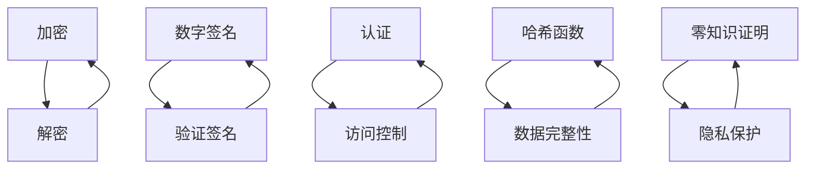

                 


### 引言：区块链技术中的密码学

随着互联网技术的迅猛发展，区块链技术逐渐成为金融科技领域的研究热点。区块链技术以其去中心化、安全透明等特点，被广泛应用于数字货币、智能合约、供应链管理等多个领域。然而，区块链技术的核心在于其安全性，而密码学作为保证区块链安全的关键技术，发挥着至关重要的作用。

密码学是研究如何通过数学方法来保护信息传输安全的一门科学。它主要包括加密、解密、数字签名、认证等多种技术。在区块链技术中，密码学被广泛应用于保护数据完整性、确保交易安全、实现身份认证等方面。

本文将逐步探讨数学在区块链技术中的密码学应用，帮助读者了解密码学在区块链技术中的核心作用，以及如何通过数学模型和算法来实现区块链的安全性。

### 背景介绍

区块链技术起源于比特币的发明，其基本原理是通过分布式网络来实现数据的安全存储和传输。区块链技术的一个重要特点就是其去中心化，即网络中的每个节点都存储着完整的账本数据，任何一方都不能单方面修改数据。这种去中心化的结构使得区块链技术具有较高的安全性，但也带来了一些挑战。

首先，由于区块链技术基于分布式网络，因此数据的传输速度相对较慢。此外，为了保证数据的一致性和安全性，区块链技术需要大量的计算资源。因此，如何在保证安全性的前提下，提高区块链的性能，成为区块链技术发展的重要课题。

密码学在区块链技术中的应用，正是为了解决这些问题。密码学通过一系列加密、解密算法，确保区块链中的数据在传输过程中不会被篡改，同时也能实现数据的匿名性和不可篡改性。这使得区块链技术不仅能够保证数据的安全，还能提高其传输效率。

### 核心概念与联系

为了更好地理解密码学在区块链技术中的应用，我们需要先了解一些核心概念，并探讨这些概念之间的联系。

#### 1. 加密与解密

加密（Encryption）是将明文转换为密文的过程，解密（Decryption）则是将密文还原为明文的过程。加密和解密是密码学的核心功能，通过加密，可以防止未授权者读取数据；通过解密，可以确保授权者能够正确解读数据。

#### 2. 数字签名

数字签名（Digital Signature）是一种用于验证信息发送者身份和确保信息完整性的技术。数字签名通过加密算法生成，只有拥有私钥的发送者才能创建，而任何人都可以使用公钥验证签名的真实性。

#### 3. 认证

认证（Authentication）是确认用户身份的过程。在区块链技术中，认证通常通过密码学算法实现，如数字签名、身份认证协议等。认证技术确保只有合法用户才能访问区块链网络和执行相关操作。

#### 4. 哈希函数

哈希函数（Hash Function）是一种将任意长度的输入数据转换成固定长度输出数据的算法。哈希函数在区块链技术中用于确保数据的唯一性和不可篡改性。例如，比特币区块链中的每个区块都包含前一个区块的哈希值，这种链接方式使得区块链具有较高的安全性。

#### 5. 零知识证明

零知识证明（Zero-Knowledge Proof）是一种密码学技术，允许一方（证明者）向另一方（验证者）证明某个陈述是正确的，而无需透露任何其他信息。零知识证明在区块链技术中可用于实现隐私保护和智能合约等应用。

这些核心概念相互关联，共同构成了密码学在区块链技术中的应用基础。以下是一个简化的Mermaid流程图，展示了这些概念之间的联系：



### 核心算法原理讲解

#### 1. 对称加密

对称加密是一种加密方法，加密和解密使用相同的密钥。常见的对称加密算法包括AES、DES等。以下是对称加密算法的伪代码：

```python
# 对称加密算法：AES
def encrypt_aes(plaintext, key):
    # 使用AES算法加密明文
    ciphertext = aes_encrypt(plaintext, key)
    return ciphertext

def decrypt_aes(ciphertext, key):
    # 使用AES算法解密密文
    plaintext = aes_decrypt(ciphertext, key)
    return plaintext
```

对称加密的优点是加密速度快、实现简单，但缺点是密钥分发困难，不适用于需要多方通信的场景。

#### 2. 非对称加密

非对称加密是一种加密方法，加密和解密使用不同的密钥，通常由公钥和私钥组成。常见的非对称加密算法包括RSA、ECC等。以下是非对称加密算法的伪代码：

```python
# 非对称加密算法：RSA
def encrypt_rsa(plaintext, public_key):
    # 使用RSA算法加密明文
    ciphertext = rsa_encrypt(plaintext, public_key)
    return ciphertext

def decrypt_rsa(ciphertext, private_key):
    # 使用RSA算法解密密文
    plaintext = rsa_decrypt(ciphertext, private_key)
    return plaintext
```

非对称加密的优点是密钥分发方便，适用于多方通信，但缺点是加密速度较慢。

#### 3. 哈希函数

哈希函数是一种将任意长度输入数据转换成固定长度输出数据的算法。常见的哈希函数包括SHA-256、SHA-3等。以下是一个简单的SHA-256哈希函数的实现：

```python
# 哈希函数：SHA-256
def sha256_hash(data):
    # 使用SHA-256算法计算哈希值
    hash_value = sha256(data)
    return hash_value
```

哈希函数的优点是计算速度快、输出固定长度、不可逆，但缺点是容易受到冲突攻击。

#### 4. 数字签名

数字签名是一种用于验证信息发送者身份和确保信息完整性的技术。常见的数字签名算法包括RSA签名、ECDSA签名等。以下是一个简单的RSA签名算法的实现：

```python
# 数字签名算法：RSA
def rsa_sign(message, private_key):
    # 使用RSA算法对消息进行签名
    signature = rsa_sign_message(message, private_key)
    return signature

def rsa_verify(message, signature, public_key):
    # 使用RSA算法验证签名
    is_valid = rsa_verify_signature(message, signature, public_key)
    return is_valid
```

数字签名的优点是能够确保信息发送者的身份和信息的完整性，但缺点是签名过程较慢。

### 数学模型在密码学中的应用

#### 1. 椭圆曲线密码学

椭圆曲线密码学（Elliptic Curve Cryptography，ECC）是一种基于椭圆曲线离散对数问题的密码学技术。椭圆曲线密码学具有以下优点：

- **更高的安全性**：与RSA相比，ECC使用更短的密钥长度即可提供相同的安全级别。
- **更快的运算速度**：椭圆曲线运算比传统的离散对数运算更快。
- **更小的带宽消耗**：由于ECC密钥长度较短，因此占用更少的网络带宽。

以下是一个简单的椭圆曲线加密算法的实现：

```python
# 椭圆曲线加密算法
def ecc_encrypt(message, public_key, curve):
    # 使用椭圆曲线加密算法加密消息
    ciphertext = ecc_encrypt_message(message, public_key, curve)
    return ciphertext

def ecc_decrypt(ciphertext, private_key, curve):
    # 使用椭圆曲线加密算法解密消息
    message = ecc_decrypt_message(ciphertext, private_key, curve)
    return message
```

#### 2. 离散对数问题

离散对数问题（Discrete Logarithm Problem，DLP）是密码学中的一个重要问题，也是许多密码学算法的基础。DLP的数学模型如下：

- **定义**：设 \( g \) 是一个生成元，\( p \) 是一个素数，\( a \) 和 \( b \) 是满足 \( 1 \leq a \leq p-1 \) 和 \( 1 \leq b \leq p-1 \) 的整数。离散对数问题就是求解 \( x \)，使得 \( g^x \equiv b \pmod{p} \)。
- **应用**：在密码学中，DLP被广泛应用于公钥加密、数字签名等算法。

以下是一个简单的DLP算法的实现：

```python
# 离散对数问题算法
def discrete_log(g, b, p):
    # 使用基于扩展欧几里得的算法求解DLP
    x = discrete_logarithm(g, b, p)
    return x
```

### 密码学在区块链技术中的具体应用

#### 1. 智能合约

智能合约是一种运行在区块链上的计算机程序，它可以自动执行合同条款。密码学在智能合约中的应用主要在于确保智能合约的安全性和隐私性。

- **安全性**：智能合约中的代码和参数通常使用哈希函数进行加密，确保合同条款的完整性。同时，智能合约的执行过程也使用数字签名进行验证，确保执行者身份的真实性。
- **隐私性**：为了保护用户的隐私，智能合约中的交易信息可以使用零知识证明进行验证，而不需要暴露具体交易细节。

以下是一个简单的智能合约实现：

```solidity
// 智能合约：简单合同
pragma solidity ^0.8.0;

contract SimpleContract {
    address public owner;
    mapping(address => uint256) public balances;

    constructor() {
        owner = msg.sender;
    }

    function deposit() external payable {
        balances[msg.sender] += msg.value;
    }

    function withdraw() external {
        require(msg.sender == owner, "只有合约所有者可以提取");
        owner.transfer(balances[msg.sender]);
    }
}
```

#### 2. 去中心化身份验证

去中心化身份验证是一种无需中心化机构参与的认证方式，它利用密码学技术确保用户的身份和隐私。

- **身份验证**：用户可以使用数字签名技术生成身份凭证，凭证中包含用户信息和使用场景。验证者可以通过公钥验证凭证的真实性。
- **隐私保护**：用户可以使用零知识证明技术证明自己的某些属性（如年龄、学历等），而不需要透露具体信息。

以下是一个简单的去中心化身份验证实现：

```python
# 去中心化身份验证
def verify_identity(proof, public_key):
    # 使用零知识证明验证身份凭证
    is_valid = zero_knowledge_proof(proof, public_key)
    return is_valid
```

#### 3. 安全交易

安全交易是指通过密码学技术确保交易过程的安全和隐私。

- **交易验证**：交易数据使用哈希函数进行加密，确保交易数据的完整性。交易执行者可以使用数字签名验证交易数据的真实性。
- **隐私保护**：交易信息使用零知识证明进行验证，确保交易信息不会被泄露。

以下是一个简单的安全交易实现：

```python
# 安全交易
def execute_trade(sender, receiver, amount, signature):
    # 验证交易数据
    is_valid = verify_transaction(sender, receiver, amount, signature)
    if is_valid:
        # 执行交易
        transfer_amount(sender, receiver, amount)
    else:
        # 交易失败
        raise Exception("Invalid transaction")
```

### 案例分析

以比特币为例，比特币是一种基于区块链技术的数字货币，其安全性主要依赖于密码学技术。

- **交易验证**：比特币交易使用哈希函数确保交易数据的完整性。每个交易都包含输入和输出，输入部分记录交易发起者的公钥和签名，输出部分记录交易接收者的公钥和金额。交易数据经过哈希函数处理后，生成交易ID。
- **区块链结构**：比特币区块链由一系列区块组成，每个区块包含一定数量的交易。每个区块的哈希值与前一个区块的哈希值相连，形成链式结构，确保数据的一致性和安全性。
- **挖矿与奖励**：比特币挖矿是一种通过计算哈希值来验证交易和创建新区块的过程。矿工需要解决一个复杂的数学问题，即找到满足特定条件的哈希值。一旦找到合适的哈希值，矿工将获得比特币奖励。

比特币的成功证明了密码学在区块链技术中的重要性。通过密码学技术，比特币实现了去中心化、安全透明的交易，为数字货币的发展奠定了基础。

### 总结与展望

本文系统地介绍了数学在区块链技术中的密码学应用，包括加密、解密、数字签名、认证等核心概念，以及椭圆曲线密码学和离散对数问题等数学模型在密码学中的应用。通过分析密码学在智能合约、去中心化身份验证和安全交易等领域的具体应用，展示了密码学在区块链技术中的关键作用。

展望未来，随着区块链技术的不断发展，密码学在区块链技术中的应用将会更加广泛和深入。一方面，密码学技术将继续优化区块链的安全性，提高其性能和可扩展性；另一方面，新的密码学算法和模型将不断涌现，为区块链技术的创新提供更多可能性。例如，量子密码学技术的突破有望解决传统密码学在量子计算面前的安全挑战。

总之，密码学作为区块链技术的核心支撑，其发展将对区块链技术的未来产生深远影响。通过持续研究和创新，我们有望实现更安全、更高效的区块链应用。

### 最佳实践 Tips、小结、注意事项、拓展阅读

#### 最佳实践 Tips

1. **选择合适的加密算法**：根据应用场景和性能需求，选择合适的对称加密或非对称加密算法。
2. **使用强密码学标准**：遵循行业标准和最佳实践，使用如AES、RSA、ECC等公认的加密算法。
3. **定期更新密钥**：定期更换加密密钥，确保数据的安全性。
4. **保护私钥安全**：私钥是加密解密的关键，确保私钥的安全存储，避免泄露。

#### 小结

本文介绍了数学在区块链技术中的密码学应用，包括核心概念、算法原理以及具体应用。密码学在区块链技术中发挥着关键作用，确保数据的安全性和隐私性。

#### 注意事项

1. **理解密码学原理**：在应用密码学技术时，需要深入了解加密、解密、数字签名等基本概念。
2. **关注安全性问题**：密码学技术虽然提供了一定的安全性，但仍然需要关注潜在的安全漏洞和攻击方式。
3. **遵守法律法规**：在应用密码学技术时，需要遵守相关的法律法规，确保合法合规。

#### 拓展阅读

1. 《密码学概论》（作者：王小云）：详细介绍了密码学的基本概念、原理和应用。
2. 《区块链技术指南》（作者：李笑来）：全面介绍了区块链技术的原理和应用。
3. 《量子密码学基础》（作者：张翔）：介绍了量子密码学的基本概念和发展趋势。

通过阅读这些书籍，可以更深入地了解密码学在区块链技术中的应用和未来发展方向。作者：AI天才研究院/AI Genius Institute & 禅与计算机程序设计艺术 /Zen And The Art of Computer Programming

