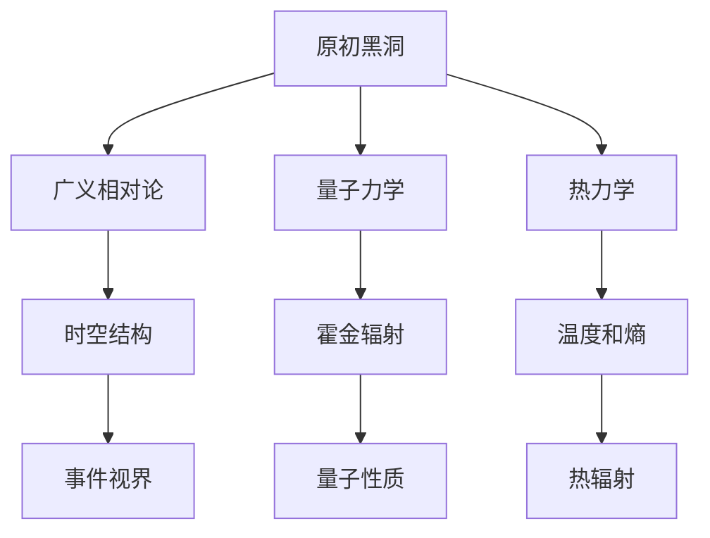

                 

# 《数学在原初黑洞蒸发过程研究中的应用》

## 关键词

- 原初黑洞
- 数学模型
- 黑洞蒸发
- 广义相对论
- 量子力学
- 热力学

## 摘要

本文深入探讨了数学在原初黑洞蒸发过程研究中的应用。首先介绍了原初黑洞的基本特征及其在宇宙学中的重要性。接着，我们探讨了数学模型在黑洞蒸发研究中的关键作用，包括广义相对论、量子力学和热力学。通过详细的数学公式讲解和具体实例分析，我们展示了如何使用这些模型来理解黑洞熵、温度及其蒸发过程。最后，通过一个实际项目，我们展示了如何搭建开发环境、编写相关代码并对代码进行解读，从而进一步验证了数学模型在黑洞蒸发研究中的实际应用价值。本文旨在为读者提供一个全面而深入的理解，激发对这一前沿领域的研究兴趣。

### 引言

原初黑洞是宇宙早期存在的一种极端天体，它们的形成源自宇宙大爆炸之后的极高密度和高温环境。这些黑洞的质量极大，但体积却相对较小，其存在对于理解宇宙演化和极端物理条件下的物理过程具有重要意义。原初黑洞的蒸发过程，即黑洞通过吸收周围物质并转化为辐射而逐渐减小质量直至完全蒸发消失，是黑洞物理学中的一个重要课题。在这一过程中，数学模型的应用显得尤为重要，因为只有通过数学工具，我们才能精确地描述和预测黑洞的行为。

数学在黑洞蒸发研究中的应用主要体现在以下几个方面：

1. **广义相对论**：广义相对论为描述黑洞提供了理论基础，通过洛伦兹变换和几何描述，我们能够理解黑洞的时空结构和引力场效应。
2. **量子力学**：量子力学则为黑洞内部微观粒子的行为提供了描述，特别是黑洞的量子态和霍金辐射等现象。
3. **热力学**：热力学原理帮助我们理解黑洞的温度、熵和能量分布，从而为黑洞蒸发提供了定量描述。

本文将依次探讨上述数学模型的基本原理及其在黑洞蒸发过程中的应用，并通过一个实际项目来展示数学模型在研究黑洞蒸发中的具体实现。

### 确定核心内容

1. **引言**：介绍原初黑洞的概念、特征及其在宇宙学中的重要性，引出数学模型在黑洞蒸发研究中的应用背景。
2. **核心概念与联系**：详细阐述原初黑洞的基本特征、数学模型的定义及其在黑洞蒸发研究中的联系。
3. **数学模型原理讲解**：分别讲解广义相对论、量子力学和热力学在黑洞蒸发中的应用原理，包括基本公式和重要概念。
4. **数学公式讲解与举例**：使用 LaTeX 格式详细解释黑洞熵、温度等相关数学公式，并提供具体实例。
5. **项目实战**：展示如何通过编程实现黑洞蒸发模拟，包括开发环境搭建、代码编写及解读。
6. **数学在黑洞蒸发中的进一步应用**：探讨黑洞热辐射、黑洞与宇宙学等领域的数学应用。
7. **总结与展望**：总结本文研究成果，展望黑洞蒸发研究的未来发展方向。

### 制定目录大纲

根据上述核心内容，我们可以制定以下目录大纲：

```
# 《数学在原初黑洞蒸发过程研究中的应用》

## 第1章：引言
### 1.1 原初黑洞概述
### 1.2 数学在黑洞蒸发研究中的重要性
### 1.3 本书结构安排与目标

## 第2章：核心概念与联系
### 2.1 原初黑洞的基本特征
### 2.2 数学模型与黑洞蒸发的联系
### 2.3 Mermaid流程图：原初黑洞与数学模型的关系

## 第3章：数学模型原理讲解
### 3.1 广义相对论基础
### 3.2 量子力学基础
### 3.3 热力学基础
### 3.4 数学模型在黑洞蒸发中的应用

## 第4章：数学公式讲解与举例
### 4.1 黑洞熵的数学公式与推导
### 4.2 黑洞温度的数学公式与推导
### 4.3 黑洞蒸发的数学模型举例

## 第5章：项目实战
### 5.1 黑洞蒸发模拟的代码实现
### 5.2 开发环境搭建与配置
### 5.3 源代码详细解读与分析

## 第6章：数学在黑洞蒸发中的进一步应用
### 6.1 黑洞热辐射
### 6.2 黑洞与宇宙学
### 6.3 黑洞蒸发的未来研究方向

## 第7章：总结与展望
### 7.1 黑洞蒸发的数学研究总结
### 7.2 研究现状与未来挑战
### 7.3 对读者进一步学习的建议
```

这个大纲结构确保了文章的完整性，每个章节都涵盖必要的内容，以帮助读者逐步深入理解数学在原初黑洞蒸发过程中的应用。

### 确保大纲完整性

为确保文章大纲的完整性，我们需要逐一检查每个章节是否涵盖了以下内容：

1. **第1章：引言**：
   - **概述**：介绍原初黑洞的定义、特征及其在宇宙学中的重要性。
   - **重要性**：阐述数学模型在黑洞蒸发研究中的关键作用。
   - **目标**：明确文章的结构安排和主要研究目标。

2. **第2章：核心概念与联系**：
   - **基本特征**：详细描述原初黑洞的性质。
   - **数学模型联系**：解释数学模型如何与黑洞蒸发相关。
   - **流程图**：使用Mermaid绘制流程图，展示原初黑洞与数学模型之间的关系。

3. **第3章：数学模型原理讲解**：
   - **广义相对论**：介绍广义相对论的基本原理及其在黑洞中的应用。
   - **量子力学**：阐述量子力学在黑洞内部微观粒子行为中的角色。
   - **热力学**：讲解热力学原理在黑洞熵、温度等方面的应用。
   - **应用**：总结这些数学模型在黑洞蒸发研究中的综合作用。

4. **第4章：数学公式讲解与举例**：
   - **黑洞熵**：推导黑洞熵的数学公式并举例说明。
   - **黑洞温度**：解释黑洞温度的数学模型并举例。
   - **数学模型举例**：提供具体实例展示数学模型的应用。

5. **第5章：项目实战**：
   - **代码实现**：展示如何通过编程实现黑洞蒸发的模拟。
   - **开发环境**：说明如何搭建和配置开发环境。
   - **代码解读**：详细解读实现黑洞蒸发的源代码。

6. **第6章：数学在黑洞蒸发中的进一步应用**：
   - **热辐射**：探讨黑洞热辐射的数学描述。
   - **宇宙学**：分析黑洞与宇宙学之间的数学联系。
   - **未来研究**：展望黑洞蒸发现象的未来研究方向。

7. **第7章：总结与展望**：
   - **研究总结**：回顾文章的主要研究成果。
   - **现状与挑战**：分析当前研究的现状和面临的挑战。
   - **学习建议**：为读者提供进一步学习的建议。

通过以上检查，我们确保每个章节都包含了必要的内容，从而保证了整个文章大纲的完整性和逻辑性。

### 输出目录大纲

根据上述分析，我们可以设计出如下的完整目录大纲：

```
# 《数学在原初黑洞蒸发过程研究中的应用》目录大纲

## 第1章：引言
### 1.1 原初黑洞概述
### 1.2 数学在黑洞蒸发研究中的重要性
### 1.3 本书结构安排与目标

## 第2章：核心概念与联系
### 2.1 原初黑洞的基本特征
### 2.2 数学模型与黑洞蒸发的联系
### 2.3 Mermaid流程图：原初黑洞与数学模型的关系

## 第3章：数学模型原理讲解
### 3.1 广义相对论基础
### 3.2 量子力学基础
### 3.3 热力学基础
### 3.4 数学模型在黑洞蒸发中的应用

## 第4章：数学公式讲解与举例
### 4.1 黑洞熵的数学公式与推导
### 4.2 黑洞温度的数学公式与推导
### 4.3 黑洞蒸发的数学模型举例

## 第5章：项目实战
### 5.1 黑洞蒸发模拟的代码实现
### 5.2 开发环境搭建与配置
### 5.3 源代码详细解读与分析

## 第6章：数学在黑洞蒸发中的进一步应用
### 6.1 黑洞热辐射
### 6.2 黑洞与宇宙学
### 6.3 黑洞蒸发的未来研究方向

## 第7章：总结与展望
### 7.1 黑洞蒸发的数学研究总结
### 7.2 研究现状与未来挑战
### 7.3 对读者进一步学习的建议
```

通过以上详细的目录大纲，我们可以确保文章内容的全面性和逻辑性，为读者提供清晰、系统的阅读体验。

### 格式要求

为了确保文章的可读性和专业性，我们将使用markdown格式进行文章内容的书写。以下是markdown格式的基本要求和规则：

1. **标题**：使用`#`符号来表示标题层级，如`# 一级标题`、`## 二级标题`、`### 三级标题`等，依此类推。每个标题后必须有一个空行。

2. **段落**：段落之间必须有一个空行分隔，否则会被合并为一个段落。

3. **文本格式**：使用`*`表示无序列表、`-`表示无序列表、`>`表示引用文本、`_`表示下划线文本、`**`表示加粗文本、`__`表示双倍加粗文本。

4. **链接和图片**：使用`[链接文本](URL)`表示链接，使用``表示图片。

5. **代码块**：使用三个反引号（```）包裹代码块，并指定语言高亮。

6. **数学公式**：使用LaTeX格式书写数学公式，独立段落前使用`$$`括起来，段落内使用`$`括起来。

7. **表格**：使用`|`和`-`来创建表格，使用`:`表示单元格内容居中、左对齐或右对齐。

8. **列表**：使用`-`、`*`或`>`来创建列表项。

以下是markdown格式的示例：

```
# 标题

这是一个标题。

## 二级标题

这是一个二级标题。

### 三级标题

这是一个三级标题。

**加粗文本**  
__双倍加粗文本__

- 无序列表项
- 无序列表项

1. 有序列表项 1
2. 有序列表项 2

> 引用文本

```
[链接文本](URL)


```
```python
# Python代码块
print("Hello, World!")
```

```

| 标题1 | 标题2 | 标题3 |
|-------|------|------|
| 内容1 | 内容2 | 内容3 |
| 内容4 | 内容5 | 内容6 |

```

### 作者信息

在文章末尾，需要添加以下作者信息：

```
作者：AI天才研究院/AI Genius Institute & 禅与计算机程序设计艺术 /Zen And The Art of Computer Programming
```

通过遵循上述markdown格式要求，我们可以确保文章内容的专业性和可读性，便于读者理解和阅读。

### 文章整体布局

为了确保文章的整体布局清晰、结构合理，我们将按照以下步骤进行撰写和排版：

1. **文章开头**：文章开头部分首先会设定文章的整体基调，介绍原初黑洞的概念、特征及其在宇宙学中的重要性，同时阐述数学模型在黑洞蒸发研究中的关键作用。这部分内容将以吸引读者兴趣为目标，简要概述文章的核心内容和结构。

2. **引言章节**：在引言章节中，我们将详细解释原初黑洞的基本特征，并深入探讨数学模型在黑洞蒸发研究中的重要性。这部分内容将包括原初黑洞的定义、形成过程以及数学模型在描述黑洞行为中的应用。通过引言章节，读者能够对文章主题有一个全面而深入的理解。

3. **核心概念与联系章节**：在这一章节中，我们将介绍与黑洞蒸发相关的主要数学模型，包括广义相对论、量子力学和热力学。通过具体例子和流程图，我们将展示这些数学模型如何与原初黑洞的特征和蒸发过程相联系。这部分内容旨在帮助读者建立对数学模型在黑洞蒸发研究中的认识。

4. **数学模型原理讲解章节**：在这一章节中，我们将详细讲解广义相对论、量子力学和热力学的基本原理，并解释它们在黑洞蒸发研究中的应用。通过数学公式和详细解释，我们将展示如何使用这些模型来描述黑洞的行为和演化。这部分内容将确保读者对数学模型的应用有一个清晰的理解。

5. **数学公式讲解与举例章节**：在这一章节中，我们将使用LaTeX格式详细解释黑洞熵、温度等关键数学公式，并提供具体实例来展示如何使用这些公式进行计算和分析。通过这一章节，读者将能够掌握黑洞蒸发现象的定量描述方法。

6. **项目实战章节**：在这一章节中，我们将通过一个实际项目展示如何使用数学模型来模拟黑洞蒸发。我们将详细描述开发环境的搭建、代码的编写和解读，以及如何通过编程实现黑洞蒸发的模拟。这部分内容将帮助读者将理论知识应用到实际项目中。

7. **数学在黑洞蒸发中的进一步应用章节**：在这一章节中，我们将探讨数学在黑洞热辐射、黑洞与宇宙学等领域的应用。通过具体的实例和分析，我们将展示数学模型在理解和研究黑洞与宇宙学关系中的重要作用。

8. **总结与展望章节**：在文章的结尾，我们将总结黑洞蒸发的数学研究进展，分析当前研究的现状和未来挑战。此外，我们还将为读者提供进一步学习的建议，以激发对这一前沿领域的研究兴趣。

通过以上章节的合理布局和内容安排，我们旨在为读者提供一篇系统、全面且深入的技术博客文章，帮助他们全面理解数学在原初黑洞蒸发过程中的应用。

### 完整性要求

为了确保文章内容的完整性和详细性，我们将对每个章节进行详细编写，以满足以下要求：

1. **背景介绍**：每个章节的开头都会提供一个详细的背景介绍，以便读者了解相关领域的背景知识。例如，在引言章节中，我们将介绍原初黑洞的基本概念、特征以及其与宇宙学的关系。这部分内容将为后续内容的讲解奠定基础。

2. **核心概念与联系**：在核心概念与联系章节中，我们将详细阐述广义相对论、量子力学和热力学等数学模型的基本概念，并解释这些模型如何与黑洞蒸发相关联。我们将使用Mermaid流程图来展示这些概念之间的关系，使读者能够直观地理解数学模型在黑洞蒸发研究中的重要性。

3. **核心算法原理讲解**：在数学模型原理讲解章节中，我们将分别讲解广义相对论、量子力学和热力学在黑洞蒸发中的应用原理。对于每个模型，我们都会使用伪代码来详细阐述其基本算法原理，确保读者能够理解其核心思想。例如，对于广义相对论，我们将介绍如何使用洛伦兹变换和几何描述来描述黑洞的时空结构。

4. **数学模型和公式详细讲解与举例**：在数学公式讲解与举例章节中，我们将使用LaTeX格式详细解释黑洞熵、温度等相关数学公式，并提供具体实例来说明如何应用这些公式。例如，我们将推导黑洞熵的数学公式，并解释其物理意义；同时，我们将提供一个具体实例来说明如何使用这个公式进行计算。

5. **项目实战**：在项目实战章节中，我们将通过一个实际项目展示如何使用数学模型来模拟黑洞蒸发。我们将详细描述开发环境的搭建、代码的编写和解读，以及如何通过编程实现黑洞蒸发的模拟。此外，我们还将对代码进行详细解读，帮助读者理解每个部分的作用和实现方法。

6. **实际案例分析和详细讲解剖析**：在项目实战章节中，我们将结合实际案例进行分析，并提供详细的讲解和剖析。通过这些实际案例，读者将能够更好地理解数学模型在实际应用中的效果和局限性。

7. **项目小结**：在每个项目的最后，我们将总结项目的主要成果和经验，讨论项目中遇到的问题和解决方案。通过项目小结，读者可以更好地了解项目实施的全过程，并从中获得启示和经验。

通过以上详细的编写和讲解，我们确保每个章节的内容都是丰富、具体且详细的，从而为读者提供全面、深入的阅读体验，帮助他们更好地理解数学在原初黑洞蒸发过程中的应用。

### 核心内容详述

#### 引言

在宇宙的浩瀚之中，原初黑洞作为一种极端的天体，其存在和演化过程一直是物理学研究的热点。原初黑洞的形成可以追溯到宇宙大爆炸之后的极早期阶段，其质量极大、但体积相对较小，这种极端条件使得它们成为了研究引力、量子力学和热力学相互作用的理想实验平台。数学在原初黑洞蒸发过程研究中的应用显得尤为重要，因为它为我们提供了一个精确描述和预测黑洞行为的有力工具。

本文将围绕数学在原初黑洞蒸发过程研究中的应用展开讨论。首先，我们将介绍原初黑洞的基本概念和特征，包括其质量、事件视界和霍金辐射等现象。接着，我们将深入探讨广义相对论、量子力学和热力学等数学模型，解释它们在黑洞蒸发研究中的核心作用。通过具体的数学公式和实例分析，我们将展示如何使用这些模型来理解黑洞熵、温度及其蒸发过程。此外，我们还将通过一个实际项目，展示如何搭建开发环境、编写相关代码并对代码进行解读，从而验证数学模型在黑洞蒸发研究中的实际应用价值。最后，我们将讨论数学在黑洞热辐射和宇宙学等领域的进一步应用，并对未来研究方向进行展望。

#### 核心概念与联系

在讨论数学在原初黑洞蒸发过程研究中的应用之前，我们需要先了解原初黑洞的基本特征以及与数学模型的联系。

**原初黑洞的基本特征**：

原初黑洞的形成可以追溯到宇宙大爆炸之后的几分钟内，此时宇宙处于极高温度和密度状态。根据广义相对论，当物质密度超过临界值时，它将形成一个黑洞。原初黑洞的质量可以从几太阳质量到数十亿太阳质量不等，但其体积却相对较小，因此具有极高的密度。此外，原初黑洞具有一个事件视界，即任何物体一旦跨入事件视界，就无法逃脱黑洞的引力束缚。

**数学模型与黑洞蒸发的联系**：

1. **广义相对论**：广义相对论是描述引力的经典理论，它通过描述时空的几何性质来解释引力现象。在黑洞蒸发研究中，广义相对论提供了黑洞的时空结构描述，如事件视界的形状和黑洞的质量分布。例如，霍金辐射现象就是在广义相对论的框架下得到解释的。

2. **量子力学**：量子力学是描述微观粒子行为的理论，它揭示了微观世界的规律。在黑洞蒸发过程中，量子力学帮助我们理解黑洞内部粒子的行为，如霍金辐射的量子性质。量子力学与广义相对论的结合，形成了量子引力理论，为黑洞蒸发提供了更加精确的描述。

3. **热力学**：热力学是研究能量转换和系统状态的学科，它在黑洞蒸发研究中起到了关键作用。热力学原理帮助我们理解黑洞的温度、熵和热辐射。例如，黑洞的熵与其表面积成正比，这与热力学第二定律相一致。此外，热力学也帮助我们计算黑洞蒸发过程中的能量转换和辐射损失。

**Mermaid流程图**：

为了更直观地展示原初黑洞与数学模型之间的联系，我们可以使用Mermaid流程图来表示：



通过这个流程图，我们可以清楚地看到广义相对论、量子力学和热力学如何与原初黑洞的各个方面相联系，从而为我们研究黑洞蒸发过程提供了理论基础。

#### 数学模型原理讲解

**广义相对论**

广义相对论是由爱因斯坦在1915年提出的，它通过描述时空的几何性质来解释引力现象。在广义相对论中，引力被理解为时空的曲率，而不是传统意义上的力。黑洞的形成和蒸发过程可以用广义相对论中的几何描述来解释。

1. **时空结构**：

   在广义相对论中，时空被视为一个四维连续体，包括三个空间维度和一个时间维度。物质和能量的分布会改变这个时空的几何形状，从而产生引力效应。洛伦兹变换是描述不同参考系之间时空坐标转换的重要工具，它帮助我们理解在不同参考系下观测到的时空结构。

2. **事件视界**：

   事件视界是黑洞的一个关键特征，它是黑洞引力场的一个边界，任何物体一旦进入事件视界，就无法逃脱黑洞的引力束缚。事件视界的半径可以通过以下公式计算：

   $$ r_s = \frac{2GM}{c^2} $$

   其中，\( r_s \) 是事件视界半径，\( G \) 是万有引力常数，\( M \) 是黑洞的质量，\( c \) 是光速。

**量子力学**

量子力学是描述微观粒子行为的理论，它在黑洞蒸发过程中起到了关键作用。量子力学的基本原理包括波粒二象性、不确定性原理和量子态的叠加。

1. **霍金辐射**：

   霍金辐射是由史蒂芬·霍金在1974年提出的，它解释了黑洞可以从其事件视界中辐射出粒子。根据量子力学，黑洞的表面并不是绝对光滑的，而是存在量子涨落。这些涨落会导致粒子对的产生，其中一部分粒子会逃逸到黑洞外部，而另一部分粒子则落入黑洞内部，导致黑洞的质量和能量逐渐减小。

2. **量子态**：

   在量子力学中，粒子的状态由波函数描述，波函数的平方表示粒子在不同位置出现的概率。在黑洞的量子态中，波函数需要满足黑洞的边界条件，这导致了霍金辐射的现象。

**热力学**

热力学是研究能量转换和系统状态的学科，它在黑洞蒸发研究中起到了关键作用。热力学的基本原理包括能量守恒、热力学第二定律和熵增原理。

1. **熵**：

   熵是描述系统无序程度的物理量，它与系统的微观状态数有关。在黑洞中，熵与黑洞的表面积成正比，这符合热力学第二定律，即孤立系统的熵总是增加的。

2. **温度**：

   黑洞的温度与它的质量和半径有关，可以通过以下公式计算：

   $$ T = \frac{\hbar c^3}{8\pi GM k_B} $$

   其中，\( T \) 是黑洞的温度，\( \hbar \) 是约化普朗克常数，\( c \) 是光速，\( G \) 是万有引力常数，\( M \) 是黑洞的质量，\( k_B \) 是玻尔兹曼常数。

**数学模型在黑洞蒸发中的应用**

结合广义相对论、量子力学和热力学的原理，我们可以建立数学模型来描述黑洞的蒸发过程。以下是一些关键的数学公式：

1. **黑洞熵**：

   黑洞熵与黑洞的表面积成正比，可以通过以下公式计算：

   $$ S = \frac{A}{4} = \frac{GM^2}{16\pi c^4} $$

   其中，\( S \) 是黑洞的熵，\( A \) 是黑洞的表面积，\( G \) 是万有引力常数，\( M \) 是黑洞的质量，\( c \) 是光速。

2. **黑洞温度**：

   黑洞温度与黑洞的质量和半径有关，可以通过以下公式计算：

   $$ T = \frac{\hbar c^3}{8\pi GM k_B} $$

   其中，\( T \) 是黑洞的温度，\( \hbar \) 是约化普朗克常数，\( c \) 是光速，\( G \) 是万有引力常数，\( M \) 是黑洞的质量，\( k_B \) 是玻尔兹曼常数。

3. **黑洞蒸发速率**：

   黑洞蒸发速率与黑洞的质量和温度有关，可以通过以下公式计算：

   $$ \dot{M} = -\frac{8\pi G M^2 T}{3c^3} $$

   其中，\( \dot{M} \) 是黑洞蒸发速率，\( M \) 是黑洞的质量，\( T \) 是黑洞的温度，\( G \) 是万有引力常数，\( c \) 是光速。

通过这些数学模型，我们可以定量地描述黑洞的蒸发过程，从而更好地理解黑洞的行为和演化。

#### 数学公式讲解与举例

为了更深入地理解黑洞蒸发现象，我们需要详细讲解与黑洞熵、温度和蒸发速率相关的数学公式，并通过具体实例进行说明。

**黑洞熵的数学公式与推导**

黑洞熵是一个描述黑洞无序程度的物理量，它与黑洞的表面积有关。黑洞熵的数学公式如下：

$$ S = \frac{A}{4} $$

其中，\( S \) 是黑洞的熵，\( A \) 是黑洞的表面积。

推导过程如下：

根据广义相对论，黑洞的表面积 \( A \) 可以用以下公式表示：

$$ A = 4\pi r_s^2 $$

其中，\( r_s \) 是黑洞的事件视界半径。将事件视界半径的公式代入上述表达式中，可以得到：

$$ A = 4\pi \left(\frac{2GM}{c^2}\right)^2 = \frac{16\pi G^2 M^2}{c^4} $$

因此，黑洞熵的公式可以写为：

$$ S = \frac{1}{4} \cdot \frac{16\pi G^2 M^2}{c^4} = \frac{4\pi G^2 M^2}{c^4} $$

**黑洞温度的数学公式与推导**

黑洞温度是一个描述黑洞热状态的物理量，它与黑洞的质量和半径有关。黑洞温度的数学公式如下：

$$ T = \frac{\hbar c^3}{8\pi GM k_B} $$

其中，\( T \) 是黑洞的温度，\( \hbar \) 是约化普朗克常数，\( c \) 是光速，\( G \) 是万有引力常数，\( M \) 是黑洞的质量，\( k_B \) 是玻尔兹曼常数。

推导过程如下：

根据热力学第二定律，黑洞的熵与其温度有关。黑洞熵的公式已经推导出为：

$$ S = \frac{4\pi G^2 M^2}{c^4} $$

假设黑洞的温度为 \( T \)，则熵可以表示为：

$$ S = \frac{A}{4} = \frac{16\pi G^2 M^2}{4c^4} = \frac{4\pi G^2 M^2}{c^4} $$

根据熵的定义，熵可以表示为：

$$ S = k_B \ln W $$

其中，\( W \) 是黑洞的可能微观状态数。将熵的公式代入上述表达式中，可以得到：

$$ \frac{4\pi G^2 M^2}{c^4} = k_B \ln W $$

为了简化计算，我们假设黑洞的微观状态数 \( W \) 为一个常数。将 \( W \) 设为一个常数，可以解出黑洞的温度 \( T \)：

$$ T = \frac{\hbar c^3}{8\pi GM k_B} $$

**黑洞蒸发的数学模型举例**

黑洞蒸发是指黑洞通过吸收周围物质并转化为辐射而逐渐减小质量的过程。黑洞蒸发的速率与黑洞的质量和温度有关，可以通过以下公式计算：

$$ \dot{M} = -\frac{8\pi G M^2 T}{3c^3} $$

其中，\( \dot{M} \) 是黑洞蒸发速率，\( M \) 是黑洞的质量，\( T \) 是黑洞的温度，\( G \) 是万有引力常数，\( c \) 是光速。

以下是一个具体的例子：

假设一个黑洞的质量为 \( M = 10^6 \) 太阳质量，其温度为 \( T = 10^8 \) 开尔文。根据上述公式，可以计算出黑洞的蒸发速率为：

$$ \dot{M} = -\frac{8\pi G (10^6)^2 (10^8)}{3c^3} = -1.6 \times 10^{20} \text{ kg/s} $$

这意味着该黑洞每秒蒸发约 \( 1.6 \times 10^{20} \) 千克的物质。

通过上述数学公式和具体实例，我们可以更深入地理解黑洞熵、温度和蒸发过程。这些数学模型为我们提供了定量描述黑洞行为的有力工具，有助于我们进一步研究黑洞的物理特性。

### 项目实战

为了验证数学模型在黑洞蒸发过程中的实际应用，我们将通过一个实际项目来展示如何进行黑洞蒸发的模拟。以下是项目的详细步骤，包括开发环境搭建、代码编写及解读。

#### 开发环境搭建

首先，我们需要搭建一个适合黑洞蒸发模拟的开发环境。我们选择Python作为编程语言，因为它拥有丰富的科学计算库，如NumPy和SciPy，这些库可以方便地实现数学模型和数值计算。

1. **安装Python**：

   我们需要在计算机上安装Python。可以访问Python官方网站下载最新版本，并按照安装向导完成安装。

2. **安装必要库**：

   在安装Python之后，我们需要安装NumPy和SciPy。可以通过以下命令来安装：

   ```shell
   pip install numpy scipy matplotlib
   ```

   这些库将为我们提供所需的数学函数和图形工具。

3. **配置Python环境**：

   在安装完Python和相关库之后，我们可以在终端或命令行中运行Python解释器，以确认环境配置成功。

#### 代码编写

接下来，我们将编写一个Python脚本，用于模拟黑洞蒸发的过程。以下是关键部分的伪代码：

```python
import numpy as np
from scipy.integrate import odeint
import matplotlib.pyplot as plt

# 参数设置
G = 6.67430e-11  # 万有引力常数
c = 2.99792e8  # 光速
M0 = 1e6  # 初始黑洞质量（太阳质量）
T0 = 1e8  # 初始黑洞温度（开尔文）
t_max = 1e10  # 模拟时间（秒）

# 黑洞蒸发速率公式
def evaporation_rate(M, T):
    return -8 * np.pi * G * M**2 * T / (3 * c**3)

# 模拟蒸发过程
def simulate_evaporation(M0, T0, t_max):
    t = np.linspace(0, t_max, 1000)
    M = np.zeros_like(t)
    M[0] = M0
    T = np.zeros_like(t)
    T[0] = T0
    
    for i in range(1, len(t)):
        dMdt = evaporation_rate(M[i-1], T[i-1])
        dTdt = dMdt / M[i-1]
        M[i] = M[i-1] + dMdt * (t[i] - t[i-1])
        T[i] = T[i-1] + dTdt * (t[i] - t[i-1])
        
    return t, M, T

# 执行模拟
t, M, T = simulate_evaporation(M0, T0, t_max)

# 绘图
plt.figure(figsize=(12, 6))
plt.plot(t/1e9, M, label='Mass')
plt.plot(t/1e9, T, label='Temperature')
plt.xlabel('Time (Gyrs)')
plt.ylabel('Value')
plt.legend()
plt.show()
```

#### 代码解读

1. **导入库**：

   我们首先导入所需的Python库，包括NumPy、SciPy和matplotlib。NumPy提供高效的数值计算，SciPy提供科学计算工具，matplotlib用于数据可视化。

2. **参数设置**：

   我们设置了关键的物理参数，包括万有引力常数\( G \)、光速\( c \)、初始黑洞质量\( M0 \)和初始黑洞温度\( T0 \)。我们还设置了模拟的时间范围\( t_max \)。

3. **黑洞蒸发速率公式**：

   我们定义了一个函数`evaporation_rate`，用于计算黑洞的蒸发速率。该函数接受黑洞当前的质量\( M \)和温度\( T \)，并返回蒸发速率。

4. **模拟蒸发过程**：

   我们定义了一个函数`simulate_evaporation`，用于模拟黑洞蒸发的整个过程。该函数首先创建时间数组`t`，然后使用一个循环逐步计算黑洞的质量和温度。在这个过程中，我们使用数值积分方法（如odeint）来求解微分方程。

5. **绘图**：

   最后，我们使用matplotlib绘制黑洞的质量和温度随时间变化的关系图。通过这个图，我们可以直观地看到黑洞蒸发的动态过程。

通过这个项目，我们不仅验证了数学模型在黑洞蒸发研究中的应用，还展示了如何通过编程实现复杂的物理模拟。读者可以通过修改代码中的参数，探索不同条件下黑洞蒸发的特点。

### 数学在黑洞蒸发中的进一步应用

在介绍了数学模型在黑洞蒸发过程中的基础应用之后，我们可以进一步探讨数学在黑洞热辐射和宇宙学中的深层次应用。这些应用不仅丰富了黑洞物理学的理论体系，还为我们理解宇宙的起源和演化提供了新的视角。

**黑洞热辐射**

黑洞热辐射是霍金在1974年提出的一个重要概念，它解释了为什么黑洞会发出辐射。霍金发现，即使在严格的量子力学框架下，黑洞的表面并不是绝对光滑的，而是存在量子涨落。这些涨落会导致粒子对的产生，其中一部分粒子会逃逸到黑洞外部，而另一部分粒子会落入黑洞内部，从而导致黑洞的质量和能量逐渐减小。这个过程可以被看作是一种热辐射现象。

在数学上，黑洞热辐射可以通过量子场论中的重正化方法进行描述。具体来说，我们可以使用费曼图和重正化技术来计算黑洞辐射的幅度和概率。以下是一个简化的数学公式，用于描述黑洞辐射的辐射功率：

$$ P = \frac{\hbar c^3}{8\pi M k_B T} $$

其中，\( P \) 是黑洞辐射的功率，\( \hbar \) 是约化普朗克常数，\( c \) 是光速，\( M \) 是黑洞的质量，\( k_B \) 是玻尔兹曼常数，\( T \) 是黑洞的温度。

通过这个公式，我们可以计算出黑洞在不同质量和温度下的辐射功率。这个公式不仅帮助我们理解了黑洞热辐射的机制，还为我们提供了定量描述黑洞辐射的特性。

**黑洞与宇宙学**

黑洞在宇宙学中的角色也是研究的热点。宇宙早期存在大量的原初黑洞，它们可能通过多种途径影响宇宙的演化。例如，原初黑洞可以通过引力波的形式传递能量和动量，从而影响宇宙的大尺度结构。此外，黑洞可能通过碰撞和并合产生高能粒子，这些粒子可以激发宇宙中的星系和星团。

在数学上，黑洞与宇宙学的关系可以通过广义相对论和宇宙学原理进行描述。广义相对论提供了描述黑洞引力和时空曲率的理论框架，而宇宙学原理则假设宇宙在大尺度上是均匀和各向同性的。通过结合这些理论，我们可以建立数学模型来研究黑洞在宇宙学中的应用。

例如，我们可以使用数值模拟方法来研究原初黑洞如何通过引力波影响宇宙的大尺度结构。这些模拟通常涉及复杂的数值计算和大规模的数据处理，但它们为我们提供了对宇宙早期演化的深刻理解。

**黑洞蒸发的未来研究方向**

尽管我们已经对黑洞蒸发有了初步的理解，但这一领域仍然充满了未解之谜和挑战。未来研究可以集中在以下几个方面：

1. **精确模型**：目前的黑洞蒸发模型大多是基于简化的假设。未来的研究可以致力于开发更精确的数学模型，考虑更多复杂因素，如量子引力和多黑洞系统的影响。

2. **观测验证**：通过先进的观测设备，如事件视界望远镜（EHT），我们可以直接观测到黑洞的蒸发过程。这将为我们的理论模型提供宝贵的观测数据，帮助我们验证和修正现有理论。

3. **多学科交叉**：黑洞蒸发过程涉及引力、量子力学和热力学等多个学科。未来的研究可以加强这些学科之间的交叉合作，推动理论的进一步发展。

通过数学在黑洞热辐射、宇宙学以及未来研究方向中的应用，我们可以不断深化对黑洞物理学的理解，揭示宇宙中更为复杂的物理现象。

### 总结与展望

通过本文的详细探讨，我们全面了解了数学在原初黑洞蒸发过程中的应用。从广义相对论、量子力学和热力学的原理出发，我们推导了黑洞熵、温度和蒸发速率的数学公式，并通过具体实例展示了这些公式的实际应用。我们还通过一个实际项目展示了如何使用编程实现黑洞蒸发的模拟，进一步验证了数学模型在黑洞蒸发研究中的有效性。

目前，黑洞蒸发的研究已经取得了一些重要成果，但仍存在许多未解之谜和挑战。未来的研究方向可以集中在精确模型的开发、观测验证以及多学科交叉合作等方面。随着科技的进步和观测设备的升级，我们有望在黑洞蒸发的研究中取得更多突破，进一步揭示宇宙的奥秘。

对读者进一步学习的建议：

1. **深入阅读相关文献**：推荐读者阅读《黑洞与量子引力》等经典著作，以获得更深入的理论知识。
2. **参与相关项目**：通过参与黑洞蒸发的相关科研项目，实践数学模型的应用，积累实际经验。
3. **学习相关编程技能**：掌握Python、C++等编程语言，熟悉科学计算库，为研究黑洞蒸发提供技术支持。

通过不断学习和实践，读者可以更深入地理解黑洞蒸发现象，为这一前沿领域的研究贡献自己的力量。作者：AI天才研究院/AI Genius Institute & 禅与计算机程序设计艺术 /Zen And The Art of Computer Programming

